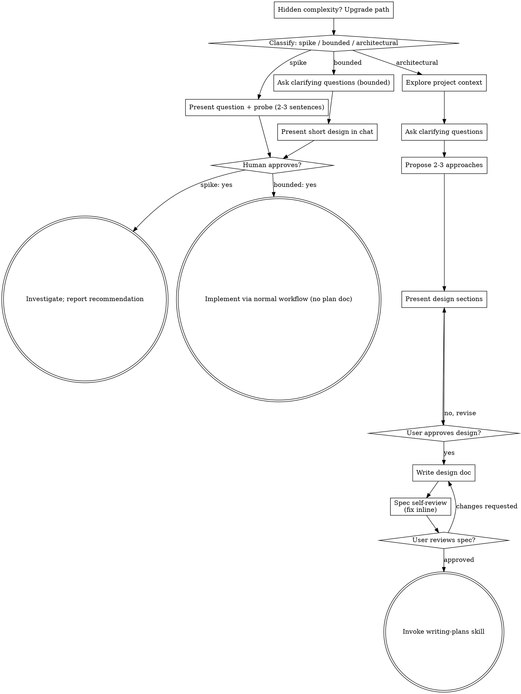

# ブレーンストーミングでアイデアをデザインに落とし込む

自然な共同対話を通じて、アイデアを完全に形成されたデザインと仕様に変えるのに役立ちます。

まずはリクエストに必要な処理量を分類してから作業します
あなたのパスを通じて: コンテキストを理解し、アイデアを洗練し、
デザインして、人間のパートナーの承認を得ます。

<HARD-GATE>
実装スキルを発動したり、コードを記述したり、スキャフォールドを作成したりしないでください。
プロジェクトを実行するか、ユーザーに通知するまで実装アクションを実行してください。
人間のパートナーはあなたが意図したものであり、彼らはそれを承認しています。これが当てはまります
以下のすべてのパス上のすべてのタスクに適用されます。セレモニーはタスクに応じてスケールされます。
承認ゲートは決してそうではありません。
</HARD-GATE>

## 3 つの道

最初の質問の前に、リクエストを分類して次のように言います。
分類を大声で言う — 「これには限界があるように見えるので、短い説明をします
仕様を書くのではなく、ここで設計してください」 — そうすれば、あなたの人間のパートナーは、
それを上書きします:

- **スパイク** — 実現可能性の質問 (「できるか...」、「可能ですか...」、
  「クイック・アンド・ダーティーは問題ありません」) その出力はコードではなく答えです
  保管してください。質問とこれから試す内容を 2 ～ 3 文で提示し、
  うなずいてから、正しさが許す限り安く調べてください。デザインなし
  doc、仕様ファイルなし。調査結果を推奨事項として報告します。何でもあなた
  組み立てられた状態は使い捨てとラベル付けされています。
- **制限付き** — すでに存在するコードに対する広範囲の変更
  このリポジトリ: 新しいフラグ、小さなエンドポイント、1 つのファイルの修正。
  アプリの種類を理解するだけでは十分ではありません。境界とはフローを意味します
  あなたは変化しています はすでにここで読んでいます。既存がない場合
  フローが変化しても、タスクに制限はありません。説明を求める
  重要な質問については、チャットで短いデザインを提示してください (いくつかの
  文からいくつかの短い段落まで)、そして停止します。実装
  人間のパートナーがそのデザインに「はい」と答えた場合にのみ開始されます。
  制限付きタスクの承認は、建築の承認と同じくらい難しい門です
  1つ。仕様ファイルも実装計画文書もありません。
- **アーキテクチャ** — 新しいプロジェクト、新しいサブシステム、変更
  コンポーネントがどのように組み合わされるかを再構築したり、他のインターフェースを変更したりする
  に依存します。完全なプロセスに従ってください: 質問、アプローチ、セクション分け
  デザイン、仕様書の作成、そして計画の作成スキル。

2 つの道で迷った場合は、重い方を選択してください。ラチェットは、
一方向: タスクの途中で隠れた複雑さが発見され、パスがアップグレードされます —
立ち止まって、そう言って、立ち上がってください。タスクの途中でダウングレードすることはありません。

## アンチパターン: 「単純すぎて承認が必要ない」

すべての道は、人間のパートナーがあなたの意図を承認することで終わります。
実装。 ToDo リスト、単機能ユーティリティ、構成
変更 — デザインはチャットで 2 つの文にすることができますが、必ず提示する必要があります。
それを実行して承認を得ます。 「単純な」タスクには未調査の前提条件が存在します
最も無駄な作業が発生します。シンプルさによって拡張できるのは、
成果物、決して承認ではありません。

## 赤旗

|感想 |現実 |
|----------|----------|
| 「これはシンプルすぎてデザインが必要ありません」 |シンプルとは、デザインがないことではなく、短いデザインを意味します。チャットで 2 文、その後承認。 |
| 「それを制限付きと呼んで、仕様をスキップします。」 |仕事をサボるためにレーベルに手を伸ばすのは疑問です。より重い道を選んでください。 |
| 「境界があり、デザインが一目瞭然です。彼らがそれを読んでいる間に始めます。」 |ゲートは承認であり、デザインの長さではありません。提示し、「はい」と聞こえるまで停止します。 |
| 「この種のアプリは理解しているので、制限されています」 |境界は、慣れ親しんだものではなく、リポジトリを測定します。新しいプロジェクトには既存のフローがありません。それは建築的なものです。 |
| 「スパイクは機能するので、コードを保存しておきます」 |スパイクの出力が答えです。コードを保持することは新しい要求であり、それを分類します。 |
| 「大きくなりましたが、ほぼ完了しました。再分類する必要はありません。」 |隠れた複雑さにより、タスクの途中でパスがアップグレードされます。立ち止まってそう言ってください。 |
| 「彼らはスパイクを承認したので、フォローアップの変更も承認されました。」 |各タスクは独自の分類と独自の承認を取得します。 |

## チェックリスト

まず分類し、パスを発表してから、各アイテムのタスクを作成します。
パスを選択し、順番に完了してください。

**スパイク:**
1. **プロジェクトのコンテキストを探索する** — プローブの枠組みを作るのに十分な
2. **現在の質問 + 調査計画** — 2 ～ 3 文
3. **承認を得る** — うなずくだけで十分です
4. **調査** — 正確さが許す限り低コストで
5. **調査結果の報告** — 推奨事項。作ったものには使い捨てのラベルを付ける

**境界あり:**
1. **プロジェクトのコンテキストを探索する** — ファイル、ドキュメント、最近のコミットを確認します
2. **明確な質問をする** — 重要なことを一度に 1 つずつ
3. **チャットで短いデザインを提示** — アプローチ、ファイルの操作、テスト
4. **承認を得る** — 停止し、明示的な「はい」の返答を待ちます。デザインを提示して同時に始めることは、門をスキップすることと同じです
5. **実装** — 通常の開発ワークフローを続行します (TDD が適用されます)。計画書がない

**建築:**
1. **プロジェクトのコンテキストを探索する** — ファイル、ドキュメント、最近のコミットを確認します
2. **視覚的なコンパニオンをジャストインタイムで提供します** — 前払いではありません。初めて質問が説明よりも実際に示された方が明確になる場合は、そのときから質問を提示してください（独自のメッセージ）。承認されるとブラウザのタブが開きます。視覚的な質問がまったく生じない場合は、決して質問しないでください。以下の「ビジュアル コンパニオン」セクションを参照してください。
3. **明確な質問をする** — 一度に 1 つずつ、目的/制約/成功基準を理解します
4. **2 ～ 3 つのアプローチを提案します** — トレードオフと推奨事項を考慮して
5. **現在のデザイン** — 複雑さに合わせてセクションを作成し、各セクションの後にユーザーの承認を得ます。
6. **設計ドキュメントを作成** — 保存先 `docs/superpowers/specs/YYYY-MM-DD-<topic>-design.md` そしてコミットする
7. **仕様のセルフレビュー** — プレースホルダー、矛盾、あいまいさ、スコープの迅速なインライン チェック (以下を参照)
8. **ユーザーが書面による仕様を確認する** — 続行する前に仕様ファイルを確認するようユーザーに依頼します
9. **実装への移行** — 計画作成スキルを呼び出して実装計画を作成します

## プロセスの流れ

**ターミナルステートはパスに制限されています。** アーキテクチャ: 唯一のスキルです。
ブレーンストーミングの後で呼び出して計画を作成します。決してフロントエンドの設計ではなく、
mcp-builder、またはその他の実装スキル。有界: 後
承認、実装は通常の手続きを通じて直接進められます。
開発ワークフロー。計画書はありません。スパイク: 終末状態は
推奨事項を報告しました。

## プロセス

以下のサブセクションは、境界付きパスとアーキテクチャ パス (
スパイクは「プローブを提示し、うなずく」で止まります）。からのセクション
**アプローチの探索**以降は、アーキテクチャ パスの深さです。
限定された作業、コンテキスト、いくつかの質問、および短いチャット内デザイン
プロセス全体です。

**アイデアの理解:**

- 最初に現在のプロジェクトの状態 (ファイル、ドキュメント、最近のコミット) を確認します。
- 詳細な質問をする前に、範囲を評価します。リクエストが複数の独立したサブシステムについて説明している場合 (例: 「チャット、ファイル ストレージ、請求、分析を備えたプラットフォームの構築」)、これに直ちにフラグを立てます。最初に分解する必要があるプロジェクトの詳細を洗練するために質問を費やさないでください。
- プロジェクトが 1 つの仕様に対して大きすぎる場合は、ユーザーがサブプロジェクトに分解できるように支援します。独立した部分は何か、それらはどのように関連し、どのような順序で構築する必要があるか?次に、通常の設計フローに従って最初のサブプロジェクトをブレインストーミングします。各サブプロジェクトには、独自の仕様→計画→実装サイクルが適用されます。
- 適切な範囲のプロジェクトの場合は、一度に 1 つずつ質問してアイデアを磨きます
- 可能であれば多肢選択式の質問を好みますが、自由回答でも問題ありません
- メッセージごとに質問は 1 つだけです - トピックについてさらに詳しく調べる必要がある場合は、複数の質問に分割してください
- 理解に重点を置く: 目的、制約、成功基準

**アプローチの検討:**

- トレードオフを考慮した 2 ～ 3 つの異なるアプローチを提案する
- 推奨事項と推論を交えて会話形式で選択肢を提示します
- 推奨オプションを紹介し、その理由を説明します
- YAGNI は容赦なく - あらゆるアプローチと設計から不必要な機能を削除します

**デザインの紹介:**

- 自分が構築しているものを理解したと確信したら、デザインを提示します
- 各セクションをその複雑さに合わせて調整します: 簡単な場合は数文、微妙な場合は最大 200 ～ 300 語
- 各セクションの後に、これまでのところ正しく見えるかどうかを尋ねます
- カバー: アーキテクチャ、コンポーネント、データ フロー、エラー処理、テスト
- 何か意味がわからない場合は、戻って明確にする準備をしてください

**分離性と明瞭さを追求したデザイン:**

- システムを小さなユニットに分割し、それぞれが 1 つの明確な目的を持ち、明確に定義されたインターフェイスを通じて通信し、独立して理解してテストできるようにします。
- 各ユニットについて、それが何をするのか、どのように使用するのか、何に依存しているのかを答えられる必要があります。
- 内部を読まなくてもユニットの動作を理解できる人はいますか?消費者を傷つけることなく内部を変更できるでしょうか?そうでない場合は、境界を設定する必要があります。
- 小さくて境界が明確な単位は、作業も容易です。コンテキスト内で一度に保持できるコードについてより適切に推論でき、ファイルがフォーカスされているときの編集の信頼性が高くなります。ファイルが大きくなる場合、それは多くの場合、処理が過剰であることを示しています。

**既存のコードベースでの作業:**

- 変更を提案する前に、現在の構造を調査します。既存のパターンに従います。
- 既存のコードに作業に影響を与える問題がある場合 (例: ファイルが大きくなりすぎる、境界が不明瞭になる、責任が複雑になる)、設計の一部として的を絞った改善を含めます。これは、優れた開発者が作業中のコードを改善する方法です。
- 無関係なリファクタリングを提案しないでください。現在の目標に役立つものに集中してください。

## 設計後 (建築パス)

**ドキュメント:**

- 検証された設計 (仕様) を `docs/superpowers/specs/YYYY-MM-DD-<topic>-design.md`
  - (スペックの場所に関するユーザー設定は、このデフォルトをオーバーライドします)
- 可能な場合は、Elements-of-style:writing-clely-and-concise スキルを使用します
- 設計ドキュメントを git にコミットする

**仕様のセルフレビュー:**
仕様ドキュメントを作成した後、新鮮な目でそれを見てください。

1. **プレースホルダー スキャン:** 「未定」、「TODO」、不完全なセクション、または曖昧な要件はありますか?修正してください。
2. **内部の一貫性:** 相互に矛盾するセクションはありますか?アーキテクチャは機能の説明と一致していますか?
3. **範囲チェック:** これは単一の実装計画に十分に焦点を当てていますか、それとも分解する必要がありますか?
4. **曖昧さチェック:** 要件は 2 つの異なる方法で解釈される可能性がありますか?もしそうなら、1つを選んでそれを明確にしてください。

問題があればインラインで修正します。再レビューする必要はありません。修正して先に進むだけです。

**ユーザー レビュー ゲート:**
仕様レビュー ループが終了したら、次に進む前に、書かれた仕様をレビューするようにユーザーに依頼します。

> 「仕様書が作成され、コミットされている `<path>`。実装計画の作成を開始する前に、内容を確認して変更を加えたい場合はお知らせください。」

ユーザーの応答を待ちます。変更を要求した場合は、変更を加えて仕様レビュー ループを再実行します。ユーザーが承認した場合にのみ続行してください。

**実装:**

- 計画作成スキルを呼び出して、詳細な実装計画を作成します
- 他のスキルを発動しないでください。次のステップは計画の作成です。

## ビジュアルコンパニオン

ブレーンストーミング中にモックアップ、図、視覚的なオプションを表示するためのブラウザベースのコンパニオンです。モードではなくツールとして利用できます。コンパニオンを受け入れるということは、視覚的な治療が役立つ質問にコンパニオンが対応できることを意味します。すべての質問がブラウザを経由するわけではありません。

**コンパニオンの提案 (ジャストインタイム):** 事前に提案しないでください。質問が、単に UI の *トピック* ではなく、実際のモックアップ、レイアウト、図の質問として、言われているよりも実際に明確に示されるまで待ちます。初めてそれが発生した場合は、それを独自のメッセージとして提供します。
> 「この次の部分は、私が見せたほうが簡単かもしれません。作業を進めながら、モックアップ、図、比較をブラウザーのタブにまとめることができます。これはまだ新しいため、トークンを大量に消費する可能性があります。してほしいですか？開けてあげるよ。」

**このオファーは独自のメッセージである必要があります。** オファーのみです。明確な質問、概要、その他のコンテンツは含まれません。ユーザーの応答を待ちます。受け入れた場合は、次のようにサーバーを起動します。 `--open` そのため、ブラウザが自動的に開き、最初の画面が表示されます。彼らが断った場合は、テキストのみで続行し、彼らが提案しない限り、再度オファーしないでください。

**質問ごとの決定:** ユーザーが同意した後でも、質問ごとにブラウザと端末のどちらを使用するかを決定します。テスト: **ユーザーはこれを読むよりも見た方がよく理解できますか?**

- **ビジュアルなコンテンツにはブラウザを使用します** - モックアップ、ワイヤーフレーム、レイアウト比較、アーキテクチャ図、並べて表示するビジュアル デザイン
- **テキストのコンテンツにはターミナルを使用します** - 要件の質問、概念的な選択、トレードオフ リスト、A/B/C/D テキスト オプション、範囲の決定

UI トピックに関する質問は、自動的に視覚的な質問にはなりません。 「この文脈において個性とは何を意味しますか？」これは概念的な質問です。ターミナルを使用してください。 「どのウィザード レイアウトがより効果的に機能しますか?」視覚的な質問です。ブラウザを使用してください。

彼らがコンパニオンに同意する場合は、続行する前に詳細なガイドをお読みください。
`skills/brainstorming/visual-companion.md`
