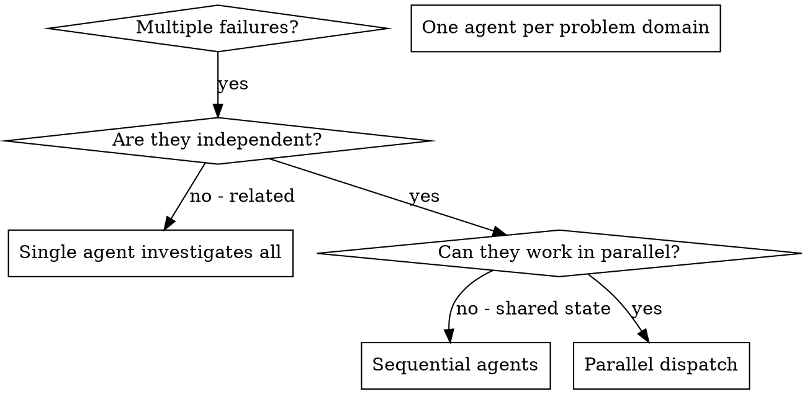

# 並行エージェントの派遣

## 概要

独立したコンテキストを持つ専門のエージェントにタスクを委任します。指示とコンテキストを正確に作成することで、彼らが集中力を維持し、タスクを成功させることができます。セッションのコンテキストや履歴を決して継承すべきではありません。必要なものを正確に構築する必要があります。これにより、調整作業のための独自のコンテキストも保存されます。

無関係な障害 (異なるテスト ファイル、異なるサブシステム、異なるバグ) が複数ある場合、それらを順番に調査すると時間の無駄になります。それぞれの調査は独立しており、並行して行うことができます。

**基本原則:** 独立した問題領域ごとに 1 人のエージェントを派遣します。同時に作業させてください。

## いつ使用するか



**次の場合に使用します:**
- 3 つ以上のテスト ファイルが異なる根本原因で失敗する
- 複数のサブシステムが個別に壊れる
- それぞれの問題は、他の人からの文脈がなくても理解できます
- 調査間で状態を共有しない

**次の場合は使用しないでください**
- 障害は関連しています (1 つを修正すれば他の問題も解決する可能性があります)
- 完全なシステム状態を理解する必要がある
- エージェントが相互に干渉する可能性がある

## パターン

### 1. 独立したドメインを特定する

何が壊れているかごとに障害をグループ化します。
- ファイル A テスト: ツール承認フロー
- ファイル B テスト: バッチ完了動作
- ファイル C テスト: 中止機能

各ドメインは独立しています。修正ツールの承認は中止テストに影響しません。

### 2. 集中的なエージェント タスクを作成する

各エージェントは以下を取得します。
- **特定の範囲:** 1 つのテスト ファイルまたはサブシステム
- **明確な目標:** これらのテストに合格する
- **制約:** 他のコードを変更しないでください
- **期待される出力:** 発見および修正された内容の概要

### 3. 並行して発送

3 つのサブエージェント ディスパッチをすべて同じ応答で発行します。これらは並行して実行されます。

```text
Subagent (general-purpose): "Fix agent-tool-abort.test.ts failures"
Subagent (general-purpose): "Fix batch-completion-behavior.test.ts failures"
Subagent (general-purpose): "Fix tool-approval-race-conditions.test.ts failures"
# All three run concurrently.
```

1 つの応答での複数のディスパッチ呼び出し = 並列実行。応答ごとに 1 つ = 順次。

### 4. レビューと統合

エージェントが戻ってきたら:
- 各概要を読む
- 修正が競合していないことを確認する
- 完全なテストスイートを実行する
- すべての変更を統合する

## エージェント プロンプトの構造

エージェントの適切なプロンプトは次のとおりです。
1. **焦点を絞った** - 1 つの明確な問題領域
2. **自己完結型** - 問題を理解するために必要なすべてのコンテキスト
3. **出力に関する具体的な** - エージェントは何を返す必要がありますか?

```markdown
Fix the 3 failing tests in src/agents/agent-tool-abort.test.ts:

1. "should abort tool with partial output capture" - expects 'interrupted at' in message
2. "should handle mixed completed and aborted tools" - fast tool aborted instead of completed
3. "should properly track pendingToolCount" - expects 3 results but gets 0

These are timing/race condition issues. Your task:

1. Read the test file and understand what each test verifies
2. Identify root cause - timing issues or actual bugs?
3. Fix by:
   - Replacing arbitrary timeouts with event-based waiting
   - Fixing bugs in abort implementation if found
   - Adjusting test expectations if testing changed behavior

Do NOT just increase timeouts - find the real issue.

Return: Summary of what you found and what you fixed.
```

## よくある間違い

**❌ 範囲が広すぎます:** 「すべてのテストを修正してください」 - エージェントが道に迷ってしまう
**✅ 具体的:** 「agent-tool-abort.test.ts を修正」 - 焦点を絞ったスコープ

**❌ コンテキストがありません:** 「競合状態を修正してください」 - エージェントはどこにあるかわかりません
**✅ コンテキスト:** エラー メッセージとテスト名を貼り付けます。

**❌ 制約なし:** エージェントはすべてをリファクタリングする可能性があります
**✅ 制約:** 「運用コードを変更しない」または「テストのみを修正する」

**❌ 曖昧な出力:** 「修正してください」 - 何が変わったのかわかりません
**✅ 具体的:** 「根本原因と変更点の概要を返す」

## 使用しない場合

**関連する障害:** 1 つを修正すると他の問題も修正される可能性があります - まずは一緒に調査してください
**完全なコンテキストが必要:** 理解するにはシステム全体を見る必要があります
**探索的デバッグ:** 何が壊れているのかまだわかりません
**共有状態:** エージェントが干渉する可能性があります (同じファイルの編集、同じリソースの使用)

## セッションからの実際の例

**シナリオ:** 大規模なリファクタリング後、3 つのファイルにわたって 6 回のテストが失敗しました

**失敗:**
- Agent-tool-abort.test.ts: 3 回の失敗 (タイミングの問題)
-batch-completion-behavior.test.ts: 2 回の失敗 (ツールが実行されていない)
- tools-approval-race-conditions.test.ts: 1 回の失敗 (実行回数 = 0)

**決定:** 独立したドメイン - 競合状態とは別に、バッチの完了とは別にロジックを中止します。

**発送:**
```
Agent 1 → Fix agent-tool-abort.test.ts
Agent 2 → Fix batch-completion-behavior.test.ts
Agent 3 → Fix tool-approval-race-conditions.test.ts
```

**結果:**
- エージェント 1: タイムアウトをイベントベースの待機に置き換えました。
- エージェント 2: イベント構造のバグを修正 (threadId が間違った場所にある)
- エージェント 3: 非同期ツールの実行が完了するまでの待機を追加しました

**統合:** すべての修正は独立しており、競合はなく、フルスイートはグリーンです

## 検証

エージェントが戻った後:
1. **各概要を確認します** - 何が変更されたのかを理解します
2. **競合がないか確認します** - エージェントは同じコードを編集しましたか?
3. **フルスイートを実行** - すべての修正が連携して機能することを確認します
4. **スポットチェック** - エージェントは系統的なエラーを犯す可能性があります
