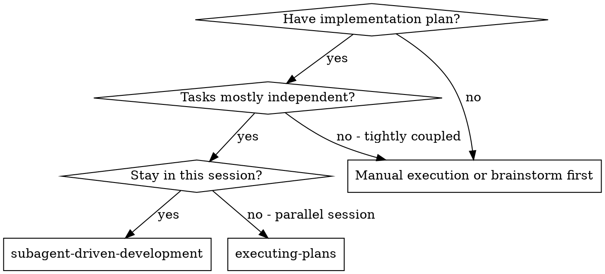
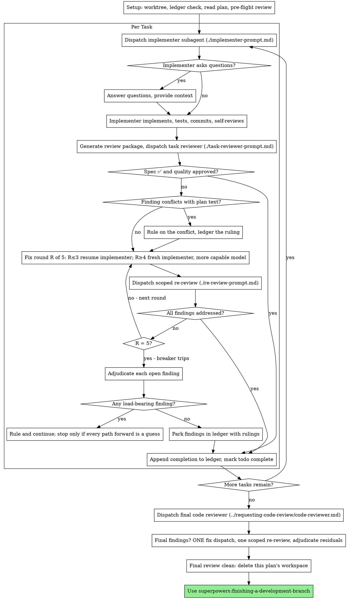

# サブエージェント駆動開発

タスクごとに新しい実装者サブエージェントを派遣し、各タスクの後にタスク レビュー (仕様準拠 + コード品質) を行い、最後に広範なブランチ全体のレビューを行うことで計画を実行します。

**サブエージェントを使用する理由:** 独立したコンテキストを持つ特殊なエージェントにタスクを委任します。指示とコンテキストを正確に作成することで、彼らが集中力を維持し、タスクを成功させることができます。セッションのコンテキストや履歴を決して継承すべきではありません。必要なものを正確に構築する必要があります。これにより、調整作業のための独自のコンテキストも保存されます。

**中心原則:** タスクごとに新しいサブエージェント + タスク レビュー (仕様 + 品質) + 広範な最終レビュー = 高品質、高速イテレーション

**ナレーション:** ツール呼び出しの間に、多くても 1 つの短い行のナレーションを入れます。
台帳とツールの結果には記録が含まれます。

**継続的な実行:** タスクの合間に人間のパートナーと確認するために一時停止しないでください。プランにあるすべてのタスクを停止せずに実行します。停止する唯一の理由は、以下に挙げる 4 つの場合、またはすべてのタスクが完了した場合です。 「続けるべきでしょうか？」プロンプトや進捗状況の概要は時間を無駄にします。計画を実行するように求められているので、実行してください。

**失速ではなく規則です。** 実行中の計画は人間を待ちません。紛争、
曖昧さ、計画の欠陥、超えなければならなかった上限 — 決定する
彼ら。仕様は拘束力のある権威であり、計画はその議論であり、あなたの意見は
判断はどちらの答えも解決しないことを解決します。すべての決定を次のように台帳に記録します。
`Ruling: <what you decided> — <why> — <what it costs if wrong>`、そして保管してください
行きます。間違った判決は、人間のパートナーが確認して元に戻すことができる再作業を必要とします。ある
質問に留まったセッションは丸一日かかり、何も得られません。

あなたを妨げるものは 4 つありますが、それは次の 3 つだけです。
操作;セキュリティに配慮したアクション。このワークツリーの外での副作用
標準では、最初に質問することになっています (マージ、共有ブランチへのプッシュ、
公開）;そして計画はあまりにも破綻しており、今後の道筋はすべて推測の域を出ない。そんな方のために、
立ち止まって尋ねてください。

## いつ使用するか



**vs.計画の実行 (並行セッション):**
- 同じセッション (コンテキストスイッチなし)
- タスクごとに新しいサブエージェント (コンテキスト汚染なし)
- 各タスク後のレビュー (仕様準拠 + コード品質)、最後に広範なレビュー
- 反復の高速化 (タスク間の人間介入が不要)

## プロセス



## セットアップ

作業が隔離されたワークスペースで行われるようにします。
superpowers:using-git-worktrees を作成するか、既存のものを確認します。
担当者なしで main/master ブランチへの実装を決して開始しないでください。
パートナーの明示的な同意。

会話の記憶は圧縮に耐えられません。実際のセッションでは、
居場所を失ったコントローラーは完了したタスク全体を再ディスパッチしました
シーケンス — 観察された単一の最も高価な障害。進捗状況を追跡する
Todo だけでなく台帳ファイルも含まれます。

- 各プランはワークスペースを所有します。スキルの開始時に、このスキルの
  `scripts/sdd-workspace PLAN_FILE` — プランの git が無視されたものを出力します
  ディレクトリ (`<repo-root>/.superpowers/sdd/<plan-basename>/`)、本拠地
  この計画のすべての成果物: 台帳、概要、レポート、レビュー パッケージ。
  別のプランのディレクトリは、あなたが読み書きできるものではありません。
- このプランの台帳を次の場所で確認します。 `<workspace>/progress.md`。最初の場合
  行には計画ファイルの名前が付けられ、タスクには `Task <N>: complete` 行は完了しました
  — 再発送しないでください。タスクなしで最初のタスクから再開します。タスク
  最後の行が修正ラウンドである場合はループの途中です: 次の行でループを再開します
  丸い。最初の行に別の計画ファイルの名前が付けられている台帳、または迷走した計画ファイル
  古い平らな道の台帳 `.superpowers/sdd/progress.md` —は別です
  計画の進捗状況: 計画はそのままにして、新たに独自の計画を開始します。
- ID を最初の行としてレジャーを作成します。
  `# SDD ledger — plan: <plan file path>`。
- 台帳はリカバリマップです。台帳に名前が付けられたコミットは git にも存在します
  コンテキストがそれらを作成したことを覚えていないとき。圧縮後、
  台帳を信頼し、 `git log` 自分自身の思い出を巡って。
- `git clean -fdx` ワークスペースを破棄します (git で無視されるスクラッチです)。もし
  それが起こる、そこから回復する `git log`。

計画を一度読み、そのコンテキストとグローバル制約に注意して、
タスクごとのtodo。計画で仕様に名前が付けられている場合は、それも読んでください。仕様とは、
計画が主張する権限と計画内の矛盾が解決される
それに対して。到達可能な仕様のない計画には、その旨が記載された帳簿が作成されます。
何もせずに下された決定は暫定的なものです。

タスク 1 をディスパッチする前に、競合がないか計画を 1 回スキャンし、書き留めます。
チェックした内容:

- 互いに矛盾するタスク、または計画のグローバル制約
- 計画がレビュールーブリックとして扱うことを明示的に義務付けているものすべて
  欠陥 (何も主張しないテスト、論理ブロックの逐語的な複製)

スキャンの出力は表であり、判定ではありません。タスクのペアごとに 1 行
ファイルまたはインターフェイスを共有する 2 つのタスク、一方が何を生成するか
相手が消費するもの、そしてあなたが見つけたもの。タスクごとに 1 行:
独自のテキストはそれ自体と一致します。つまり、コードに対して指定されたテストが一致します。
後でアクセスするファイルに対して作成するファイルを指定します。 「スキャンは
これらの行がない場合は、実行したスキャンではありません。

テーブルを台帳に書き込みます。実行前に見つけたものすべてにルールを適用する
開始 — 計画を義務付ける計画テキストに対する各発見 — および記録
台帳のそれぞれの裁定。スキャンがクリーンな場合は、コメントなしで続行します。
表面化する各競合に関するルール — 仕様は拘束力のある権威であり、
計画はその議論です - その行の横に判決を記録し、ディスパッチします
タスク 1. レビュー ループは、競合からのみ発生する競合を防ぐ網を維持します。
実装。

## モデルの選択

コストを節約し、速度を向上させるために、各役割を処理できる最も強力でないモデルを使用します。

**機械的な実装タスク** (分離された機能、明確な仕様、1 ～ 2 つのファイル): 高速で安価なモデルを使用します。計画が明確に指定されていれば、ほとんどの実装タスクは機械的に行われます。

**統合および判定タスク** (複数ファイルの調整、パターン マッチング、デバッグ): 標準モデルを使用します。

**アーキテクチャおよび設計タスク**: 利用可能な最も高性能なモデルを使用します。
最終的なブランチ全体のレビューもその 1 つであり、最も頻繁に実行されます。
セッションのデフォルトではなく、有効な利用可能なモデルです。

**タスクの確認**: 同じ判断で、スケールに合わせてモデルを選択します。
diff のサイズ、複雑さ、リスク。小さなメカニカルデフには必要ありません。
最も有能なモデル。同時実行性が微妙に変更されます。対象範囲を絞った再レビュー
小さな修正の差分は、安価から中程度の層を占めます。

**修正ループ エスカレーション (ラウンド 4 ～ 5)**: 少なくとも 1 層上のモデルを使用します
行き詰まった実装者。

**サブエージェントをディスパッチするときは、常にモデルを明示的に指定してください。**
省略されたモデルは、セッションのモデルを継承します。多くの場合、最も機能的で、
最も高価です - これはこのセクションを黙って破ります。

**ターン数はトークン価格を上回ります。** 実時間とコンテキストのコストは方法に応じて増減します。
サブエージェントには多くのターンがかかり、最も安価なモデルでは通常 2 ～ 3 倍の時間がかかります。
多段階の作業が必要になり、全体的なコストが高くなります。中間層モデルを
散文的な説明に基づいて作業するレビュー担当者と実装者のためのフロア。
タスクの計画テキストに記述する完全なコードが含まれている場合、
実装は転写とテストです。最も安価な層を使用します。
その実装者。単一ファイルの機械的修正も最も安価なレベルを使用します。

**タスクの複雑さのシグナル (実装タスク):**
- 充実したスペックで1～2ファイルタッチ → 廉価モデル
- 統合に懸念がある複数のファイルを扱う → 標準モデル
- 設計上の判断または広範なコードベースの理解が必要 → 最も機能的なモデル

## タスクループ

**同じ形状の小さな作業をバッチ処理します。** 計画に複数のタスクがリストされている場合。
それぞれが同じ種類の小さな独立した編集、つまり同じ 1 行の修正です。
一定の変更、またはファイル間で繰り返されるフィールドの追加 - ディスパッチしない
タスクごとに 1 つのサブエージェント。すべてのファイルをリストする 1 つのディスパッチ概要を作成し、
その変更を確認し、バッチ全体を単一のサブエージェントに送信し、その差分を確認します。
1つのユニットとして。独自の作業が必要な作業のために、タスクごとに 1 つのディスパッチを予約します
判断、独自のテスト、または独自のレビュー画面。

ディスパッチ プロンプトに貼り付けるすべてのもの、およびサブエージェントのすべて
プリントバック — セッションの残りの間、コンテキスト内に常駐します
そしてその後のターンごとに再読されます。成果物をファイルとして引き渡します。

**ディスパッチされたサブエージェントを待機:** 待機インターフェイスをポーリングしないでください。
タイムアウトも短く、沈黙した無制限の待機状態に陥ることもありません。
ローカルでの作業がある間、台帳の更新、次のレビューのパッケージ化、
レポートを読む — 作業を続けます。子の結果は自動的に届きます。
本当にアイドル状態のときは、制限時間内に待機します (5 ～ 10 時間)。
プラットフォームが許可する場合は数分）、ポスト 1 回のストレッチの間に
身分の境界線を調べ、生きている子供たちを和解させます：彼らをリストアップして追跡します
報告せずに終了したもの。境界のあるストレッチはほぼ維持されます
スタックやロストを保証しながら、長時間の待機を効率化します。
子どもはセッションの終了時ではなく、数分以内に気づきます。

### 1. 実装者を派遣する

レコードベース (`git rev-parse HEAD`) 発送前 — レビューパッケージ
そして修正ラウンドの差分にはそれが必要です。

- **タスクの概要:** 実装者を派遣する前に、このスキルの
  `scripts/task-brief PLAN_FILE N` — タスクの全文をファイルに抽出します。
  一意の名前が付けられたファイルを作成し、そのパスを出力します。ディスパッチを作成して、
  概要は依然として唯一の情報源である
  要件。ディスパッチには次の内容が含まれている必要があります: (1) ここに 1 行
  タスクがプロジェクトに適合する。 (2) 「これを読んでください」として紹介された簡単なパス
  まず、それは要件であり、そのまま使用する正確な値が含まれます。」
  (3) ブリーフには記載できない以前のタスクからのインターフェイスと決定事項
  知っています。 (4) 準備書面で気づいた曖昧さの解決策。
  (5) レポート ファイルのパスとレポート コントラクト。正確な値 (数値、
  マジックストリング、署名、テストケースなど）は概要にのみ表示されます。決してしない
  サブエージェントにプラン ファイル全体を読み取らせます。
- **レポート ファイル:** 概要の後に実装者のレポート ファイルの名前を付けます。
  (短い `…/task-N-brief.md` → 報告 `…/task-N-report.md`）を入れてください
  ディスパッチプロンプト。実装者はそこに完全なレポートを書き、
  ステータス、コミット、1 行のテスト概要、および懸念事項のみを返します。
- ディスパッチ プロンプトは、セッションの履歴ではなく、1 つのタスクについて説明します。しないでください
  蓄積された以前のタスクの概要 (「タスク 1 ～ 3 の後の状態」) を貼り付けます
  後のディスパッチ — 実際のセッションのディスパッチは 42,000 文字に達し、そのうちの 99%
  履歴が貼られていました。新しいサブエージェントにはそのタスクとそのインターフェイスが必要です
  タッチとグローバル制約。他には何もありません。
- 派遣には再代理人なしの契約が適用されます（
  実装者テンプレート): 実装者はサブエージェントを決してディスパッチしません —
  ヘルパーでもなければ、レビュー担当者でもありません。あなたからのレビューが到着後、
  報告する。実際のセッションでは、ワーカーが生成したすべてのレビューアーが複製されます。
  とにかくディスパッチされたコントローラーをタスクで確認する - 完全な追加機能
  タスクごとにシートを確認します。
- 以前のタスクがこのタスクが接触するエリアに所見を保留した場合、次のタスクを実行します。
  ディスパッチ内の台帳エントリへのポインタ。
- ディスパッチ結果から実装者のエージェント ID を記録する —
  fix-loop ラウンド 1 ～ 3 により、このエージェントが再開されます。
- 複数の実装サブエージェントを並行してディスパッチしないでください (競合)。

テンプレート: [implementer-prompt.md](implementer-prompt.md)

### 2. レポートの処理

実装サブエージェントは 4 つのステータスのいずれかを報告します。それぞれを適切に処理します。

**完了:** レビュー パッケージを生成します (`scripts/review-package PLAN_FILE BASE HEAD`、このスキルのディレクトリから — 書き込んだ一意のファイル パスを出力します。 BASE は、実装者をディスパッチする前に記録したコミットです。 `HEAD~1`、マルチコミットタスクの最後のコミットを除くすべてのコミットをサイレントに削除します)、出力されたパスを使用してタスクレビューアをディスパッチします。

**DONE_WITH_CONCERNS:** 実装者は作業を完了しましたが、疑問のフラグを立てました。続行する前に懸念事項をお読みください。正確性や範囲に関する懸念がある場合は、レビューする前に対処してください。観察結果 (「このファイルが大きくなっている」など) である場合は、記録して確認に進みます。

**NEEDS_CONTEXT:** 実装者は、提供されていない情報を必要としています。不足しているコンテキストを提供して再ディスパッチします。

**ブロックされました:** 実装者はタスクを完了できません。ブロッカーを評価します。
1. コンテキストに問題がある場合は、さらにコンテキストを提供し、同じモデルを再ディスパッチします。
2. タスクにさらに推論が必要な場合は、より有能なモデルを再派遣します。
3. タスクが大きすぎる場合は、小さな部分に分割します
4. 計画自体が間違っている場合は、修正の規則を作成し、台帳に記録し、派遣に含まれる規則を使用して再派遣します。

エスカレーションを無視したり、変更せずに同じモデルを強制的に再試行したりしないでください。実装者が行き詰まっていると言ったら、何かを変える必要があります。

実装者がタスクの開始前または途中で質問した場合は、それに答えます
明確かつ完全に、必要に応じて追加のコンテキストを提供します。
実装を急いでください。

### 3. タスクを確認する

タスクごとのレビューは、タスクをスコープとしたゲートです。大まかなレビューは 1 回だけ行われます。
最終的なブランチ全体のレビュー。タスクのレビューを決してスキップしたり、タスクを受け入れたりしないでください。
どちらかの判定が欠落していると報告する — 仕様準拠とタスクの品質は両方とも重要です
必須です。実装者のセルフレビューがタスクレビューに代わることは決してありません。どちらもです
必要です。

- レビュアーに差分をファイルとして渡します: このスキルの実行
  `scripts/review-package PLAN_FILE BASE HEAD` そしてレビューアにファイルパスを渡します
  印刷します (または、bash を使用しない場合: `git log --oneline`、 `git diff --stat`、
  そして `git diff -U10` 範囲については、一意の名前が付けられた範囲にリダイレクトされます
  ファイル）。出力がユーザー独自のコンテキストに入ることはなく、レビュー担当者は次のことを確認します。
  コミットリスト、統計概要、およびコンテキストを含む完全な差分を 1 回の読み取りで取得
  電話する。実装者を派遣する前に記録した BASE を使用します。
  決して `HEAD~1`、マルチコミットタスクをサイレントに切り捨てます。決してしない
  差分ファイルなしでタスクレビューアをディスパッチします。
- **レビュー担当者入力:** タスクレビュー担当者は 3 つのパスを取得します - 同じ概要
  ファイル、レポート ファイル、レビュー パッケージに加えて、グローバル
  タスクをバインドする制約。
- レビュー担当者に渡すグローバル制約ブロックは、レビュー担当者の注意を引くものです
  レンズ。プランのグローバルからバインディング要件をそのままコピーします。
  制約セクションまたは仕様: 正確な値、正確な形式、および
  コンポーネント間の指定された関係 (「X と同じレイアウト」、「一致する」)
  よ」）。レビュー担当者のテンプレートにはすでにプロセス ルール (YAGNI、
  衛生テスト、レビュー方法) — 制約ブロックの目的
  プロジェクトの仕様要件。
- 「すべての用途を確認する」や「レーステストを実行する」などの無制限のディレクティブを追加しないでください。
  具体的でタスク固有の理由なしで「役に立ったら」
- 実装者がすでに実行したテストを再実行するようにレビュー担当者に依頼しないでください。
  同じコード — 実装者のレポートにはテストの証拠が記載されています
- 査読者に調査結果を事前に判断させないでください。査読者に次のような指示を決して与えないでください。
  特定の問題を無視するかフラグを立てない。発見が次のような結果になると信じている場合は、
  誤検知の場合は、レビュー担当者に問題を提起させ、レビューで判断させます。
  ループ。作成しているプロンプトに「フラグを立てない」、「X を扱わない」が含まれている場合
  「欠陥として」、「せいぜい軽微」、または「計画が選択した」 — やめてください。あなたはそうです。
  事前審査は、通常、再検討の手間を省くために行われます。
タスクレビュー担当者は「⚠️ diff から検証できません」項目を報告する場合があります — 要件
これらは変更されていないコード内に存在するか、複数のタスクにまたがります。これらは残りの部分をブロックしません。
レビューしますが、タスクにマークを付ける前に、それぞれを自分で解決する必要があります
完了: 計画とクロスタスクのコンテキストをレビュー担当者に保持します。
欠けています。項目が実際のギャップであることが確認された場合は、不合格の仕様として扱います
レビュー — 他の発見とともに修正ループに入ります。

テンプレート: [task-reviewer-prompt.md](task-reviewer-prompt.md)

### 4. 修正ループ

ループは、レビューで仕様 ❌ (重大または重要) が報告されたときにトリガーされます。
発見、または実際のギャップとして確認した⚠️アイテム。

ループが開始される前に、2 つのルートが直ちにループを終了します。

- 進行中に小さな発見を進捗台帳に記録します
  (`Task <N>: minor (deferred): <one-liner>`）、決勝点を指します
  そのリストでブランチ全体をレビューし、修正する必要があるものを優先順位付けできるようにする
  合併前。誰も読まないロールアップはサイレント廃棄です。軽微な所見
  決してループには入らないでください。
- 計画が義務付けられているとラベル付けされた所見、または計画と矛盾する所見
  計画の本文に必要なものは何か、それを判断するのはあなたです: 結果を比較検討してください
  計画書に対して仕様書を拘束力として決定し、
  裁定に基づいて行動する前に、裁定を台帳に記録してください。調査結果を無視しないでください。
  計画によりそれが義務付けられており、計画に矛盾する修正を送信しないでください。
  記録された判決なしで。
他のすべてはループに入ります。修正ラウンドは 1 つの修正ディスパッチに 1 つを加えたものです
範囲を絞った再レビュー。タスクごとに最大 5 ラウンド:

**ラウンド 1 ～ 3 — 元の実装者を再開します。** 未解決の調査結果を送信します。
逐語的に。そのコンテキストはそのままです。タスク、コード、そしてそれ自身のことを知っています。
選択肢。ハーネスがライブ サブエージェントに別のメッセージを送信できない場合は、
簡単なパス、レポート ファイル パスを運ぶ新しい実装者をディスパッチします。
そして調査結果 — いずれにせよ、レポート ファイルは永続的なメモリです。

**ラウンド 4 ～ 5 — より有能なモデルの新しい実装者を派遣します** (
モデルの選択)、簡単なパス、レポート ファイルのパス、オープン
調査結果とこの枠組み: 「以前の実装者がこのタスクを試みました
[N] 回。あなたは今それを所有しています。何が試行されたかについては、レポート ファイルを読んでください。」ループ
3 回の履歴書を経ても生き残るということは、通常、実装者がその内容を確認できないことを意味します。
自分自身の問題 — 新鮮な目で、一度の行動で能力が向上します。

**いずれのラウンドでも:** 実装者は修正し、テストを再実行します。
修正されたコードをカバーし、その修正レポートを同じレポート ファイルに追加します。
そして短期契約書を返却します。レビュー担当者を再派遣する前に、次のことを確認してください
修正レポートには、対象となるテスト、コマンドの実行、および
出力; 3 つすべてが揃ったら、再レビューを送信します。名前を付けます
修正メッセージでテスト ファイルをカバーする — 1 行の修正には、
スイート全体。

**再レビューには範囲が定められています。** 実行 `scripts/review-package PLAN_FILE FIX_BASE HEAD`
ここで、FIX_BASE は前のレビューで確認されたヘッドであり、ディスパッチされます。
[re-review-prompt.md](re-review-prompt.md) 所見リスト、
概要、レポート ファイル、および印刷された差分パス。再審査員の評決
それぞれの検出結果が「対処済み」または「未対処」であり、修正の新たな破損にフラグを立てます。
デフのみ。修正差分に新たな重大/重要な破損がオープンに加わりました
所見リスト。範囲外の観察は延期として台帳に保存されます
未成年者 — ループを延長することはありません。

**各ラウンドの後**、台帳に次の内容を追加します。
`Task <N>: fix round <R>/5 (<X> addressed, <Y> open — <finding one-liners>; commits <a7>..<b7>)`

コントローラー セッションでは検出結果を自分で修正しないでください。コンテキストはそのまま残ります。
調整のためにクリーンにし、コントローラーの修正はレビューをスキップします。

**ブレーカー。** ラウンド 5 の再レビューでまだ発見が残っていない場合は、停止してください。
派遣中。未解決の発見をそれぞれ自分で判断します。あなたは計画を保持し、
レビュー担当者に欠けているタスク間のコンテキスト:

- **査読者が間違っているか、その点に議論の余地があります:** やめてください —
  `Task <N>: parked — <finding> — Ruling: <why the code stands>`。決勝戦
  レビューでは両方の側面が見られます。
- **現実ですが、下流では何も構築されません:** 同じ方法で駐車します。
  それが現実であり、延期されるという判決。
- **現実的で耐荷重性** — 後のタスクがその上に構築されるか、それによって明らかになる
  計画の欠陥: 依存する作業のブロックを解除する最小の変更に関するルール。
  それを次のように台帳に記録します `Task <N>: Ruling: <finding> — <what you decided and why>`、
  そしてそれを次のタスクのディスパッチに持ち込んでください。駐車場の構造的欠陥
  依存するすべてのタスクを黙ってその上に構築できるようにします。異常時のみ停止
  今後のあらゆる道は推測のままです。

キャップのみで判断してください。ループを終了するために早期に判断することは、
別の名前で事前審査します。すべての判決は帳簿に記入される -
サイレント破棄は禁止されています。

### 5. タスクを完了する

レビューがクリーンに戻ったとき、またはすべての未解決の調査結果が保留されたとき
上限の決定 — 同じ元帳に完了行を追加します
他の簿記としてのメッセージ:

- `Task <N>: complete (commits <base7>..<head7>, review clean)`
- `Task <N>: complete (commits <base7>..<head7>, <K> parked)` 後
  ブレーカーが落ちた

次に、ToDo に完了のマークを付けて次に進みます。その間は決して次のタスクに移らないでください
レビューには未解決の重大/重要な問題があり、修正もされていない
キャップにルールを付けて駐車。

## 最終レビュー

最後のブランチ全体のレビューでもパッケージが取得されます: run
`scripts/review-package PLAN_FILE MERGE_BASE HEAD` (MERGE_BASE = コミット
から開始されたブランチ、例: `git merge-base main HEAD`) を含めます
最終レビューのディスパッチにパスが印刷されるため、最終レビュー担当者は次の内容を読み取ります。
git コマンドを使用してブランチ diff を再取得する代わりに、ファイルを 1 つ作成します。派遣
最も性能の高い利用可能なモデル (「モデルの選択」を参照) で、次を使用します。
スーパーパワー:コードレビューのリクエスト
[code-reviewer.md](../requesting-code-review/code-reviewer.md)。に向けてください
レジャーの遅延マイナー行と保留行をトリアージできるようにするため、
マージ前に修正されました。

最終的なブランチ全体のレビューで結果が得られた場合は、1 つの修正サブエージェントを派遣します
完全な所見リストを使用します。所見ごとに修正者が 1 人ではありません。
検出ごとのフィクサーはそれぞれコンテキストを再構築し、スイートを再実行します。本物の
セッションの最終レビュー修正ウェーブのコストは、そのすべてのタスクを合わせたコストよりも高くなります。
次に、修正ウェーブの範囲を絞った再レビューを 1 回だけ実行します。
(`scripts/review-package PLAN_FILE FIX_BASE HEAD` 修正範囲を超えて、
[再レビュー-プロンプト.md](再レビュー-プロンプト.md))。
タスク ループのブレーカーと同様に、残留所見を判断します。
決定を下したり、負荷がかかるものを決定したり、決定したことを台帳に記録したりできます。のみ
上記の 4 つのクラスはここで終わりです。 2 番目の修正波はありません —
残留耐荷重の所見が人間のパートナーに表面化したとき、
finish-a-development-branch にはオプションが表示されます。

## 終了

何かを削除する前に、次の内容を含むすべての帳簿行を収集してください。 `Ruling:` —
飛行前の裁定、駐機中の所見、違反者の裁定、それらすべてが、
「私が作成したルール」の下に、作成した順に最後のメッセージを入力します。
間違っていた場合にかかる費用について。リストは網羅的です。台帳に
判決では、リストにはそれが含まれています。そのリストはあなたが決定を下す唯一の場所です
人間のパートナーに代わって彼らに連絡します - 彼らはそれを読んで再作業します
間違ったことは何でも。ワークスペースとともに消滅する判決は決定だった
秘密裏に作られた。

最終的なブランチ全体のレビューがクリーンで、修正がマージされたら、
このプランのワークスペースを削除します (`rm -rf <workspace>`) — git 履歴は
今の記録。兄弟ディレクトリは他のプランに属します。彼らを残してください
一人で。

スーパーパワーを使用して、開発ブランチを終了します。

## 一般的な合理化

|言い訳 |現実 |
|--------|--------|
| 「仕様準拠は十分に近い」 |レビュー担当者が仕様のギャップを発見 = 未完了修正するか、上限に達して判断するか、それが唯一の出口です。 |
| 「自分で直します。発送にはオーバーヘッドがかかります。」 |コントローラーの修正はコンテキストを汚染し、レビューをスキップします。実装者を再開します。 |
| 「あと一戦で収束する」 |上限を超えるとラウンドは収束しません。失敗は構造的なものです。裁定してルートを決めます。 |
| 「とにかくレビュアーは何か新しいものを見つけるだけです」 |範囲を限定した再レビューで修正を検証します。彼らは歩き回ることができない。変更されていないコードに関する新しい発見は、ループではなく台帳に反映されます。 |
| 「この発見は明らかに間違っています。削除します。」 |判決は上限に基づいてのみ行われ、すべての判決は帳簿に記入されます。サイレント破棄は禁止されています。 |
| 「修正は小さかったので、再レビューはスキップします」 |未レビューの修正がリグレッションの原因となります。すべてのラウンドは、範囲を絞った再レビューで終了します。 |
| 「レビューによってループが遅くなる」 |レビューのないループは、単なる未検証のチャーンです。レビューはループのブレーキとステアリングです。 |
| 「帳簿管理はオーバーヘッドです」 |レジャーは圧縮されても生き残るものです。これがないコントローラーは、完了したタスク シーケンス全体を再ディスパッチします。 |
| 「実装者は独自のレビュー担当者を生成しました - 無料の追加保証」 |これは、同じ差分をレビューする重複したシートです。タスクレビューが入り口です。ワーカーが生成したレビューアは、厳密さではなく、報告すべき欠陥です。 |

## ワークフローの例

```
You: I'm using Subagent-Driven Development to execute this plan.

[Setup: worktree verified]
[Read plan file once: docs/superpowers/plans/feature-plan.md]
[Resolve workspace: scripts/sdd-workspace docs/superpowers/plans/feature-plan.md — no ledger inside, fresh start]
[Create todos for all tasks]

Task 1: Hook installation script

[Run task-brief for Task 1; dispatch implementer with brief + report paths + context]

Implementer: "Before I begin - should the hook be installed at user or system level?"

You: "User level (~/.config/superpowers/hooks/)"

Implementer: [Later]
  - Implemented install-hook command
  - Added tests, 5/5 passing
  - Self-review: Found I missed --force flag, added it
  - Committed

[Run review-package PLAN_FILE BASE HEAD; dispatch task reviewer with the printed path]
Task reviewer: Spec ✅ - all requirements met, nothing extra.
  Strengths: Good test coverage, clean. Issues: None. Task quality: Approved.

[Ledger: Task 1: complete (commits a1b2c3d..d4e5f6a, review clean)]

Task 2: Recovery modes

[Run task-brief for Task 2; dispatch implementer with brief + report paths + context]

Implementer: [No questions]
  - Added verify/repair modes
  - 8/8 tests passing
  - Committed

[Run review-package PLAN_FILE BASE HEAD; dispatch task reviewer with the printed path]
Task reviewer: Spec ❌:
  - Missing: Progress reporting (spec says "report every 100 items")
  Issues (Important): Magic number (100)

[Fix round 1: resume the implementer with both findings]
Implementer: Added progress reporting, extracted PROGRESS_INTERVAL constant.
  Re-ran test/recovery.test.js — 10/10 passing. Fix report appended.

[Run review-package PLAN_FILE FIX_BASE HEAD; dispatch scoped re-review]
Re-reviewer: Missing progress reporting — ADDRESSED (src/recovery.js:41).
  Magic number — ADDRESSED (src/recovery.js:7). New breakage: none.
  Verdict: all findings addressed.

[Ledger: Task 2: fix round 1/5 (2 addressed, 0 open; commits d4e5f6a..b7c8d9e)]
[Ledger: Task 2: complete (commits d4e5f6a..b7c8d9e, review clean)]

...

[After all tasks]
[Run review-package PLAN_FILE MERGE_BASE HEAD; dispatch final code-reviewer, most capable model]
Final reviewer: All requirements met. Deferred minors triaged: none block merge.

[Delete this plan's workspace — the record now lives in git]

Done! Using superpowers:finishing-a-development-branch.
```
