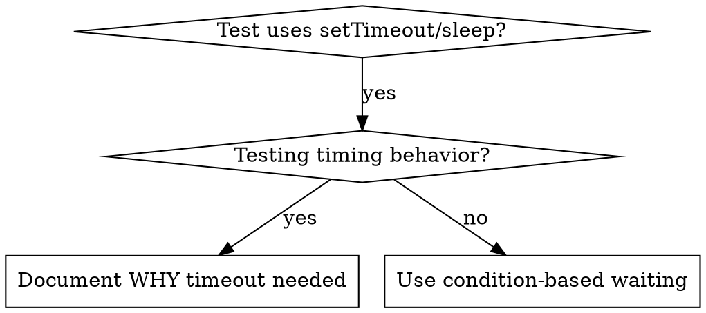

# 条件ベースの待機

## 概要

不安定なテストでは、多くの場合、任意の遅延を伴うタイミングを推測します。これにより、テストは高速なマシンでは成功するが、負荷または CI では失敗するという競合状態が発生します。

**基本原則:** どのくらい時間がかかるかを推測するのではなく、気になる実際の状態を待ちます。

## いつ使用するか



**次の場合に使用します:**
- テストには任意の遅延があります (`setTimeout`、 `sleep`、 `time.sleep()`）
- テストが不安定です (時々パスしますが、負荷がかかると失敗します)
- 並列実行時のテストのタイムアウト
- 非同期操作が完了するのを待っています

**次の場合は使用しないでください**
- 実際のタイミング動作のテスト (デバウンス、スロットル間隔)
- 任意のタイムアウトを使用する場合は、必ずその理由を文書化してください

## コアパターン

```typescript
// ❌ BEFORE: Guessing at timing
await new Promise(r => setTimeout(r, 50));
const result = getResult();
expect(result).toBeDefined();

// ✅ AFTER: Waiting for condition
await waitFor(() => getResult() !== undefined);
const result = getResult();
expect(result).toBeDefined();
```

## クイック パターン

|シナリオ |パターン |
|----------|----------|
|イベントを待つ | `waitFor(() => events.find(e => e.type === 'DONE'))` |
|待機状態 | `waitFor(() => machine.state === 'ready')` |
|カウントを待つ | `waitFor(() => items.length >= 5)` |
|ファイルを待つ | `waitFor(() => fs.existsSync(path))` |
|複雑な条件 | `waitFor(() => obj.ready && obj.value > 10)` |

## 実装

一般的なポーリング機能:
```typescript
async function waitFor<T>(
  condition: () => T | undefined | null | false,
  description: string,
  timeoutMs = 5000
): Promise<T> {
  const startTime = Date.now();

  while (true) {
    const result = condition();
    if (result) return result;

    if (Date.now() - startTime > timeoutMs) {
      throw new Error(`Timeout waiting for ${description} after ${timeoutMs}ms`);
    }

    await new Promise(r => setTimeout(r, 10)); // Poll every 10ms
  }
}
```

見る `condition-based-waiting-example.ts` ドメイン固有のヘルパーを使用して完全に実装するには、このディレクトリにあります (`waitForEvent`、 `waitForEventCount`、 `waitForEventMatch`) 実際のデバッグ セッションから。

## よくある間違い

**❌ ポーリングが速すぎます:** `setTimeout(check, 1)` - CPUを無駄に消費する
**✅ 修正:** 10 ミリ秒ごとにポーリング

**❌ タイムアウトなし:** 条件が満たされない場合は永久にループします
**✅ 修正:** 明らかなエラーのあるタイムアウトを常に含めます

**❌ 古いデータ:** ループ前のキャッシュ状態
**✅ 修正:** 新しいデータのループ内で getter を呼び出す

## 任意のタイムアウトが正しい場合

```typescript
// Tool ticks every 100ms - need 2 ticks to verify partial output
await waitForEvent(manager, 'TOOL_STARTED'); // First: wait for condition
await new Promise(r => setTimeout(r, 200));   // Then: wait for timed behavior
// 200ms = 2 ticks at 100ms intervals - documented and justified
```

**要件:**
1. まずトリガー条件を待ちます
2. 既知のタイミングに基づく (推測ではない)
3. 理由を説明するコメント

## 現実世界への影響

デバッグ セッション (2025-10-03) から:
- 3 つのファイルにわたる 15 個の不安定なテストを修正しました
- 合格率: 60% → 100%
- 実行時間: 40% 高速化
- 競合状態はなくなりました
