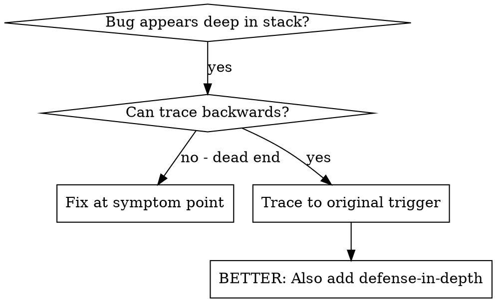
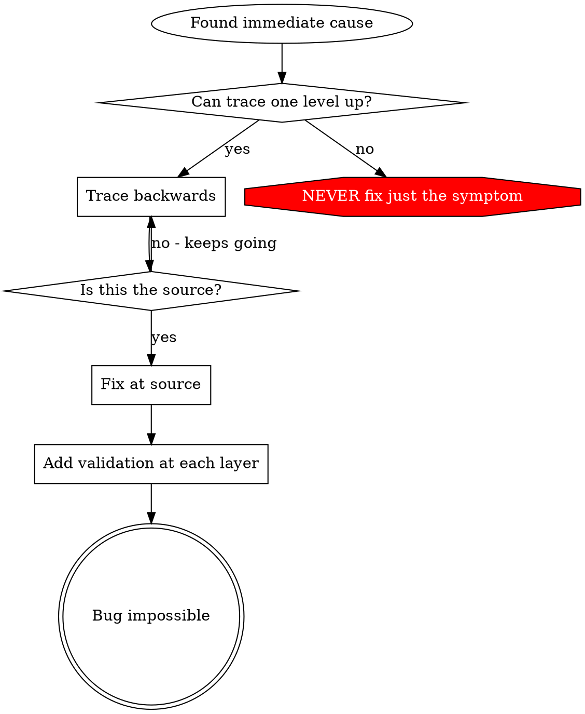

# 根本原因の追跡

## 概要

バグはコール スタックの奥深くに現れることがよくあります (間違ったディレクトリにある git init、間違った場所に作成されたファイル、間違ったパスで開かれたデータベース)。本能的にエラーが発生した場所を修正したいと思うでしょうが、それは症状を治療することになります。

**中心的な原則:** 元のトリガーが見つかるまで呼び出しチェーンを逆方向にトレースし、ソースで修正します。

## いつ使用するか



**次の場合に使用します:**
- エラーは実行の深いところで発生します (エントリポイントではありません)。
- スタック トレースは長い呼び出しチェーンを示します
- 無効なデータがどこから来たのか不明
- どのテスト/コードが問題を引き起こしているのかを見つける必要がある

## トレースプロセス

### 1. 症状を観察します。
```
Error: git init failed in ~/project/packages/core
```

### 2. 直接の原因を見つける
**この問題を直接引き起こすコードは何ですか?**
```typescript
await execFileAsync('git', ['init'], { cwd: projectDir });
```

### 3. 尋ねてください: これは何と呼ばれるものですか?
```typescript
WorktreeManager.createSessionWorktree(projectDir, sessionId)
  → called by Session.initializeWorkspace()
  → called by Session.create()
  → called by test at Project.create()
```

### 4. 追跡を続ける
**どのような値が渡されましたか?**
- `projectDir = ''` (空の文字列!)
- 空の文字列 `cwd` に解決します `process.cwd()`
- それはソース コード ディレクトリです。

### 5. 元のトリガーを見つける
**空の文字列はどこから来たのですか?**
```typescript
const context = setupCoreTest(); // Returns { tempDir: '' }
Project.create('name', context.tempDir); // Accessed before beforeEach!
```

## スタック トレースの追加

手動でトレースできない場合は、インストルメンテーションを追加します。

```typescript
// Before the problematic operation
async function gitInit(directory: string) {
  const stack = new Error().stack;
  console.error('DEBUG git init:', {
    directory,
    cwd: process.cwd(),
    nodeEnv: process.env.NODE_ENV,
    stack,
  });

  await execFileAsync('git', ['init'], { cwd: directory });
}
```

**重要:** 使用 `console.error()` テスト中 (ロガーではない - 表示されない可能性があります)

**実行してキャプチャ:**
```bash
npm test 2>&1 | grep 'DEBUG git init'
```

**スタック トレースを分析する:**
- テストファイル名を探します
- 通話をトリガーした回線番号を見つける
- パターンを特定する (同じテスト?同じパラメータ?)

## どのテストが汚染を引き起こしているかを調べる

テスト中に何かが表示されたが、どのテストかわからない場合は、次のようにします。

二等分スクリプトを使用する `find-polluter.sh` このディレクトリ内:

```bash
./find-polluter.sh '.git' 'src/**/*.test.ts'
```

テストを 1 つずつ実行し、最初の汚染者で停止します。使用法についてはスクリプトを参照してください。

## 実際の例: 空の projectDir

**症状:** `.git` に作成されました `packages/core/` (ソースコード)

**トレースチェーン:**
1. `git init` 駆け込む `process.cwd()` ← 空の cwd パラメータ
2. WorktreeManager が空の projectDir で呼び出される
3. Session.create() に空の文字列が渡されました
4. テストにアクセスしました `context.tempDir` 前 前 それぞれ
5. setupCoreTest() が返す `{ tempDir: '' }` 最初は

**根本原因:** トップレベル変数の初期化が空の値にアクセスしている

**修正:** tempDir を beforeEach より前にアクセスされた場合にスローするゲッターにしました。

**多層防御も追加されました:**
- レイヤー 1: Project.create() はディレクトリを検証します
- レイヤ 2: WorkspaceManager は空ではないことを検証します
- レイヤ 3: NODE_ENV ガードが tmpdir 外の git init を拒否する
- レイヤー 4: git init 前のスタック トレース ロギング

## 重要な原則



**エラーが表示された場所だけを決して修正しないでください。** トレースバックして元のトリガーを見つけてください。

## スタック トレースのヒント

**テスト中:** 使用します `console.error()` ロガーではありません - ロガーは抑制される可能性があります
**操作前:** 危険な操作が失敗した後ではなく、その操作の前にログを記録します。
**コンテキストを含める:** ディレクトリ、cwd、環境変数、タイムスタンプ
**キャプチャスタック:** `new Error().stack` 完全な呼び出しチェーンを示します

## 現実世界への影響

デバッグ セッション (2025-10-03) から:
- 5段階のトレースによる根本原因の発見
- ソースで修正 (ゲッター検証)
- 4層の防御を追加しました
- 1847 件のテストに合格、汚染ゼロ
