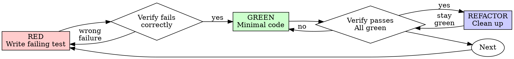

# テスト駆動開発 (TDD)

## 概要

最初にテストを書きます。失敗するのを見てください。合格する最小限のコードを記述します。

**中心原則:** テストが失敗するのを見ていなければ、それが正しいことをテストしているかどうかはわかりません。

**ルールの文言に違反することは、ルールの精神に違反することになります。**

## いつ使用するか

**常に:**
- 新機能
- バグ修正
- リファクタリング
- 行動の変化

**例外 (人間のパートナーに尋ねてください):**
- 使い捨てプロトタイプ
- 生成されたコード
- 設定ファイル

「今回だけ TDD をスキップする」と考えていますか?停止。それが合理化です。

## 鉄の法則

```
NO PRODUCTION CODE WITHOUT A FAILING TEST FIRST
```

テスト前にコードを書きますか?削除してください。やり直してください。

**例外はありません:**
- 「参考」としてとどめないでください。
- テストの作成中に「適応」しないでください
- 見ないでください
- 削除は削除を意味します

テストから新鮮な状態で実装します。期間。

## 赤-緑-リファクタリング



### 赤 - 書き込み失敗テスト

何が起こるかを示す最小限のテストを 1 つ作成します。

<良い>
```typescript
test('retries failed operations 3 times', async () => {
  let attempts = 0;
  const operation = () => {
    attempts++;
    if (attempts < 3) throw new Error('fail');
    return 'success';
  };

  const result = await retryOperation(operation);

  expect(result).toBe('success');
  expect(attempts).toBe(3);
});
```
明確な名前、実際の動作をテストする、という 1 つのこと
</良い>

<悪い>
```typescript
test('retry works', async () => {
  const mock = jest.fn()
    .mockRejectedValueOnce(new Error())
    .mockRejectedValueOnce(new Error())
    .mockResolvedValueOnce('success');
  await retryOperation(mock);
  expect(mock).toHaveBeenCalledTimes(3);
});
```
曖昧な名前、テストはコードではなくモック
</悪い>

**要件:**
- 一つの行動
- 明確な名前
- 実際のコード (やむを得ない場合を除き、モックは使用しません)

### Verify RED - 失敗するのを見てください

**必須。決してスキップしないでください。**

```bash
npm test path/to/test.test.ts
```

確認します:
- テストが失敗する (エラーではない)
- 失敗メッセージが予期されています
- 機能が欠落しているため失敗します (タイプミスではありません)

**テストは成功しましたか?** 既存の動作をテストしています。テストを修正します。

**テスト エラーがありますか?** エラーを修正し、正しく失敗するまで再実行します。

### 緑 - 最小限のコード

テストに合格するための最も単純なコードを作成します。

<良い>
```typescript
async function retryOperation<T>(fn: () => Promise<T>): Promise<T> {
  for (let i = 0; i < 3; i++) {
    try {
      return await fn();
    } catch (e) {
      if (i === 2) throw e;
    }
  }
  throw new Error('unreachable');
}
```
合格するのにちょうど十分
</良い>

<悪い>
```typescript
async function retryOperation<T>(
  fn: () => Promise<T>,
  options?: {
    maxRetries?: number;
    backoff?: 'linear' | 'exponential';
    onRetry?: (attempt: number) => void;
  }
): Promise<T> {
  // YAGNI
}
```
オーバースペック
</悪い>

機能を追加したり、他のコードをリファクタリングしたり、テストを超えて「改善」したりしないでください。

### GREEN を確認 - 通過するのを見てください

**必須。**

```bash
npm test path/to/test.test.ts
```

確認します:
- テストに合格しました
- 他のテストも引き続き合格します
- 出力は正常です (エラーや警告はありません)

**テストが失敗しますか?** テストではなくコードを修正してください。

**他のテストが失敗しますか?** 今すぐ修正してください。

### リファクター - クリーンアップ

緑の後のみ:
- 重複を削除
- 名前を改善する
- ヘルパーの抽出

テストをグリーンに保ちます。動作を追加しないでください。

### 繰り返し

次の機能の次のテストに失敗しました。

## 良いテスト

|品質 |良い |悪い |
|----------|------|-----|
| **最小限** |一つのこと。名前の「そして」？分割してください。 | `test('validates email and domain and whitespace')` |
| **クリア** |名前は動作を説明します | `test('test1')` |
| **意図を示す** |必要な API をデモする |コードが何をすべきかを曖昧にする |

テストを作成または変更する場合は、テストを正直に保つためのルールについて [writing-good-tests.md](writing-good-tests.md) を読んでください。
- テストを書き込む前に、テストを失敗させる本番環境の変更に名前を付けます
- 擬似的な動作ではなく、実際の動作に基づいてアサートします。
- テスト専用のコードを実稼働クラスの外のテスト ユーティリティに保持する
- 依存関係をモックする前に依存関係の副作用を理解する

## 一般的な合理化

|言い訳 |現実 |
|--------|--------|
| 「単純すぎてテストできない」 |単純なコードが壊れる。テストには 30 秒かかります。 |
| 「後でテストします」 |その後に書かれたテストはすぐに合格しますが、これは何も証明しません。間違ったことをテストしたり、動作ではなく実装をテストしたり、忘れていたエッジケースを見逃したりする可能性があります。あなたはそれが失敗するのを見たことがないので、それがバグを捕捉できることを証明したことはありません。テストファーストはその失敗を強制します。 |
| 「同じ目標を達成した後のテスト（儀式ではなく精神）」 |テスト後の回答「これは何をするのですか?」テスト第一の答えは「これは何をすべきか?」その後に作成されたテストは、すでに作成したコードによってバイアスされます。つまり、発見したであろうケースではなく、覚えていたケースを検証します。テストが機能するという証拠のない報道。 |
| 「すでに手動でテスト済み」 |手動テストはその場限りです。カバーした内容の記録はなく、コードが変更されたときに再実行する方法もなく、プレッシャーがかかると忘れがちです。 「試してみたらうまくいった」≠包括的。自動テストは毎回同じ方法で実行されます。 |
| 「X 時間を削除するのは無駄です」 |サンクコストの誤謬 — どちらにしても時間はすでに費やされているということです。本当の選択: TDD で書き直す (信頼性が高い) か、TDD を維持して後でテストをボルトで実行する (信頼性が低く、バグの可能性が高い)。信頼できないコードを保持しておくのは無駄です。 |
| "参照として保持し、最初にテストを作成します" |あなたはそれを適応させます。それはその後のテストです。デリートとは削除という意味です。 |
| 「まず探索する必要があります」 |大丈夫。探索を捨てて、TDD から始めましょう。 |
| 「一生懸命テストする = 設計が不明確」 |テストを聞いてください。テストが難しい = 使用が難しい。 |
| 「TDD では速度が低下します」 | TDD は実用的な方法です。コミットする前にバグを検出し、リグレッションを防ぎ、恐れることなくリファクタリングできるようにします。 「実用的な」ショートカットとは、本番環境でのデバッグを意味します。高速ではなく、低速です。 |
| 「手動テストの高速化」 |マニュアルはエッジケースを証明しません。すべての変更を再テストします。 |
| 「既存のコードにはテストがありません」 |改善してるんですね。既存のコードにテストを追加します。 |

## 赤旗 - 停止してやり直し

- テスト前のコード作成
- 導入後のテスト
- テストはすぐに合格します
- テストが失敗した理由を説明できない
- テストは「後で」追加されました
- 「一度だけ」の合理化
- 「すでに手動でテストしました」
- 「同じ目的を達成した後のテスト」
- 「それは儀式ではなく精神の問題です」
- 「参照として保持」または「既存のコードを適応」
- 「すでに X 時間経過しています。削除するのは無駄です」
- 「TDD は独断的ですが、私は現実的です」
- 「これは違うから…」

**これらはすべて、コードを削除することを意味します。 TDD からやり直します。**

## 例: バグ修正

**バグ:** 空のメールは受け入れられます

**赤**
```typescript
test('rejects empty email', async () => {
  const result = await submitForm({ email: '' });
  expect(result.error).toBe('Email required');
});
```

**赤を確認**
```bash
$ npm test
FAIL: expected 'Email required', got undefined
```

**緑**
```typescript
function submitForm(data: FormData) {
  if (!data.email?.trim()) {
    return { error: 'Email required' };
  }
  // ...
}
```

**グリーンを確認**
```bash
$ npm test
PASS
```

**リファクター**
必要に応じて、複数のフィールドの検証を抽出します。

## 検証チェックリスト

作業を完了としてマークする前に:

- [ ] すべての新しい関数/メソッドにはテストがあります
- [ ] 実装する前に各テストが失敗するのを観察しました
- [ ] 各テストは予期された理由で失敗しました (タイプミスではなく、機能が欠落していました)
- [ ] 各テストに合格するための最小限のコードを作成しました
- [ ] すべてのテストに合格しました
- [ ] 出力はそのままの状態 (エラーや警告なし)
- [ ] テストでは実際のコードを使用します (やむを得ない場合のみモックを使用します)。
- [ ] エッジケースとエラーをカバー

すべてのボックスにチェックを入れることはできませんか? TDD をスキップしました。やり直してください。

## 行き詰まったとき

|問題 |ソリューション |
|----------|----------|
|テスト方法がわからない |必要な API を作成します。最初にアサーションを書きます。人間のパートナーに尋ねてください。 |
|テストが複雑すぎる |デザインが複雑すぎます。インターフェースを簡素化します。 |
|すべてを嘲笑しなければなりません |コードが結合されすぎています。依存関係の注入を使用します。 |
|テストセットアップは巨大です |ヘルパーを抽出します。まだ複雑ですか？設計を簡素化します。 |

## 統合のデバッグ

バグが見つかりましたか?失敗したテストを再現して書き込みます。 TDD サイクルに従います。テストにより修正が証明され、回帰が防止されます。

テストせずにバグを修正しないでください。

## 最終規則

```
Production code → test exists and failed first
Otherwise → not TDD
```

人間のパートナーの許可がない限り、例外はありません。
