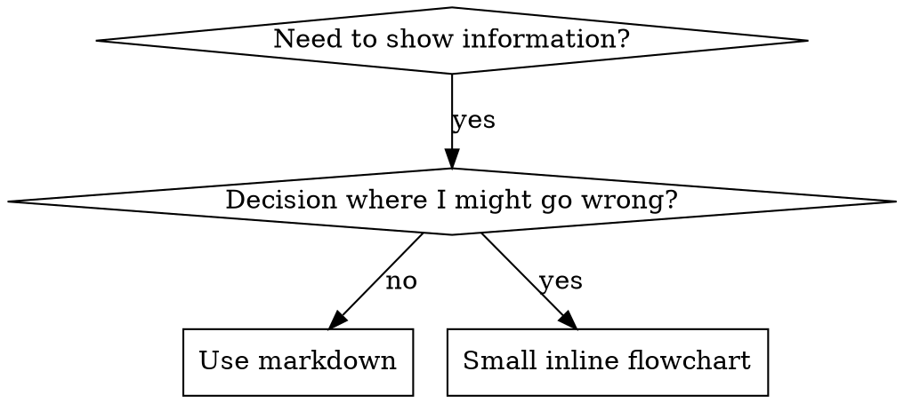

# ライティングスキル

## 概要

**ライティングスキルは、プロセスドキュメントに適用されるテスト駆動開発です。**

**個人のスキルはランタイムのスキル ディレクトリに存在します** (`~/.claude/skills/` クロード コード) — これらのランタイムのパスについては、[codex-tools.md](../using-superpowers/references/codex-tools.md) または [gemini-tools.md](../using-superpowers/references/gemini-tools.md) を参照してください。 Codex、Copilot CLI、および Gemini CLI もすべて認識します `~/.agents/skills/` クロスランタイムエイリアスとして。

テスト ケース (サブエージェントによるプレッシャー シナリオ) を作成し、テスト ケースが失敗するのを観察し (ベースライン動作)、スキルを作成し (ドキュメント)、テストが成功するのを観察し (エージェントが従う)、リファクタリング (抜け穴を閉じる) を行います。

**中心原則:** スキルなしでエージェントが失敗するのを見たことがない場合、そのスキルが正しいことを教えているかどうかはわかりません。

**必須背景:** このスキルを使用する前に、superpowers:テスト駆動開発を理解する必要があります。そのスキルは、基本的な赤、緑、リファクターのサイクルを定義します。このスキルは TDD をドキュメントに適応させます。

**公式ガイダンス:** Anthropic の公式スキル オーサリングのベスト プラクティスについては、anthropic-best-practices.md を参照してください。このドキュメントでは、このスキルにおける TDD に重点を置いたアプローチを補完する追加のパターンとガイドラインを提供します。

## スキルとは何ですか?

**スキル** は、実証済みのテクニック、パターン、またはツールのリファレンス ガイドです。スキルは、将来のエージェントが効果的なアプローチを見つけて適用するのに役立ちます。

**スキルとは:** 再利用可能なテクニック、パターン、ツール、リファレンス ガイド

**スキルはそうではありません:** かつて問題をどのように解決したかについての物語

## スキルの TDD マッピング

| TDDコンセプト |スキル作成 |
|-----------|----------------|
| **テストケース** |サブエージェントによるプレッシャーのシナリオ |
| **製品コード** |スキルドキュメント(SKILL.md) |
| **テスト失敗 (赤)** |エージェントはスキルなしでルールに違反しました (ベースライン) |
| **テスト合格 (緑)** |エージェントは現在のスキルに準拠します |
| **リファクタリング** |コンプライアンスを維持しながら抜け穴を塞ぐ |
| **最初にテストを作成します** |スキルを書く前にベースライン シナリオを実行する |
| **失敗するのを見てください** |エージェントが使用する正確な合理化を文書化する |
| **最小限のコード** |それらの特定の違反に対処するスキルを作成する |
| **過ぎ去っていくのを見てください** |エージェントが準拠していることを確認します |
| **リファクタリング サイクル** |新しい合理化を見つける → プラグイン → 再検証 |

スキル作成プロセス全体は、RED-GREEN-REFACTOR に従います。

## スキルを作成する場合

**作成時期:**
- テクニックが直感的にわかりませんでした
- これをプロジェクト間で再度参照します
- パターンは広範囲に適用されます (プロジェクト固有ではありません)
- 他の人も恩恵を受けるだろう

**次の目的で作成しないでください:**
- 一回限りのソリューション
- 標準的な実践方法は他の場所で十分に文書化されています
- プロジェクト固有の規約 (指示ファイルに記載)
- 機械的制約 (正規表現/検証で強制できる場合は自動化します。判断の際に備えて文書を保存します)

## スキルの種類

### テクニック
従うべき手順を含む具体的な方法 (条件ベースの待機、根本原因の追跡)

### パターン
問題についての考え方 (フラグ付きフラット化、テスト不変式)

### 参考資料
API ドキュメント、構文ガイド、ツール ドキュメント (オフィス ドキュメント)

## ディレクトリ構造


```
skills/
  skill-name/
    SKILL.md              # Main reference (required)
    supporting-file.*     # Only if needed
```

**フラットな名前空間** - すべてのスキルが 1 つの検索可能な名前空間に含まれています

**別のファイル:**
1. **大量のリファレンス** (100 行以上) - API ドキュメント、包括的な構文
2. **再利用可能なツール** - スクリプト、ユーティリティ、テンプレート

**インラインに保ちます:**
- 原則と概念
- コードパターン (< 50 行)
- その他すべて

## SKILL.md の構造

**フロントマター (YAML):**
- 2 つの必須フィールド: `name` そして `description` (サポートされているすべてのフィールドについては、[agentskills.io/specation](https://agentskills.io/specation) を参照してください)
- 合計最大 1024 文字
- `name`: 文字、数字、ハイフンのみを使用します (括弧や特殊文字は使用できません)。
- `description`: 第三者視点で、使用する場合のみ説明します (機能ではありません)。
  - 「次の場合に使用する」から始めて、トリガー条件に焦点を当てます
  - 特定の症状、状況、背景を含めます
  - **スキルのプロセスやワークフローを決して要約しないでください** (理由については、SDO セクションを参照してください)
  - 可能であれば 500 文字未満にしてください

```markdown
---
name: Skill-Name-With-Hyphens
description: Use when [specific triggering conditions and symptoms]
---

# Skill Name

## Overview
What is this? Core principle in 1-2 sentences.

## When to Use
[Small inline flowchart IF decision non-obvious]

Bullet list with SYMPTOMS and use cases
When NOT to use

## Core Pattern (for techniques/patterns)
Before/after code comparison

## Quick Reference
Table or bullets for scanning common operations

## Implementation
Inline code for simple patterns
Link to file for heavy reference or reusable tools

## Common Mistakes
What goes wrong + fixes

## Real-World Impact (optional)
Concrete results
```


## スキル発見の最適化 (SDO)

**発見にとって重要:** 将来のエージェントはあなたのスキルを見つける必要があります

### 1. 豊富な説明フィールド

**目的:** エージェントは説明を読んで、特定のタスクにどのスキルをロードするかを決定します。 「このスキルを今すぐ読むべきですか?」という質問に答えてもらいます。

**形式:** 「次の場合に使用する」から始めて、トリガー条件に焦点を当てます。

**重要: 説明 = スキルの機能ではなく、いつ使用するか**

説明ではトリガー条件のみを説明する必要があります。説明でスキルのプロセスやワークフローを要約しないでください。

**これが重要な理由:** テストの結果、説明にスキルのワークフローが要約されている場合、エージェントはスキルの内容全体を読むのではなく説明に従う可能性があることが判明しました。スキルのフローチャートでは 2 つのレビュー (仕様準拠、次にコード品質) が明確に示されているにもかかわらず、「タスク間のコード レビュー」という説明により、エージェントは 1 つのレビューを行うことになりました。

説明を単に「独立したタスクで実装計画を実行する場合に使用する」(ワークフローの概要なし) に変更した場合、エージェントはフローチャートを正しく読み、2 段階のレビュー プロセスに従いました。

**罠:** ワークフローを要約した説明は、エージェントが使用するショートカットを作成します。スキル本体はドキュメントエージェントスキップになります。

```yaml
# ❌ BAD: Summarizes workflow - agents may follow this instead of reading skill
description: Use when executing plans - dispatches subagent per task with code review between tasks

# ❌ BAD: Too much process detail
description: Use for TDD - write test first, watch it fail, write minimal code, refactor

# ✅ GOOD: Just triggering conditions, no workflow summary
description: Use when executing implementation plans with independent tasks in the current session

# ✅ GOOD: Triggering conditions only
description: Use when implementing any feature or bugfix, before writing implementation code
```

**内容:**
- このスキルが適用されることを示す具体的なトリガー、症状、状況を使用する
- *言語固有の症状* (setTimeout、スリープ) ではなく、*問題* (競合状態、一貫性のない動作) を説明します。
- スキル自体がテクノロジー固有でない限り、トリガーをテクノロジーに依存しないようにします
- スキルがテクノロジー固有である場合は、トリガーでそれを明示します
- 三人称で書く (システムプロンプトに挿入される)
- **スキルのプロセスやワークフローを決して要約しないでください**

```yaml
# ❌ BAD: Too abstract, vague, doesn't include when to use
description: For async testing

# ❌ BAD: First person
description: I can help you with async tests when they're flaky

# ❌ BAD: Mentions technology but skill isn't specific to it
description: Use when tests use setTimeout/sleep and are flaky

# ✅ GOOD: Starts with "Use when", describes problem, no workflow
description: Use when tests have race conditions, timing dependencies, or pass/fail inconsistently

# ✅ GOOD: Technology-specific skill with explicit trigger
description: Use when using React Router and handling authentication redirects
```

### 2. キーワードの範囲

エージェントが検索するであろう単語を使用します。
- エラー メッセージ: 「フックがタイムアウトしました」、「ENOTEMPTY」、「競合状態」
- 症状：「薄片状」、「首吊り」、「ゾンビ」、「汚染」
- 同義語: 「タイムアウト/ハング/フリーズ」、「クリーンアップ/ティアダウン/afterEach」
- ツール: 実際のコマンド、ライブラリ名、ファイルの種類

### 3. わかりやすい名前付け

**動詞を先に使用して能動態を使用します:**
- ✅ `creating-skills` ない `skill-creation`
- ✅ `condition-based-waiting` ない `async-test-helpers`

### 4. トークンの効率 (重要)

**問題:** 入門スキルと頻繁に参照されるスキルがすべての会話に組み込まれます。すべてのトークンが重要です。

**目標単語数:**
- 入門ワークフロー: 各 150 ワード未満
- 頻繁にロードされるスキル: 合計 200 単語未満
- その他のスキル: 500 単語未満 (それでも簡潔であること)

**テクニック:**

**詳細をツールのヘルプに移動:**
```bash
# ❌ BAD: Document all flags in SKILL.md
search-conversations supports --text, --both, --after DATE, --before DATE, --limit N

# ✅ GOOD: Reference --help
search-conversations supports multiple modes and filters. Run --help for details.
```

**相互参照を使用します:**
```markdown
# ❌ BAD: Repeat workflow details
When searching, dispatch subagent with template...
[20 lines of repeated instructions]

# ✅ GOOD: Reference other skill
Always use subagents (50-100x context savings). REQUIRED: Use [other-skill-name] for workflow.
```

**圧縮の例:**
```markdown
# ❌ BAD: Verbose example (42 words)
your human partner: "How did we handle authentication errors in React Router before?"
You: I'll search past conversations for React Router authentication patterns.
[Dispatch subagent with search query: "React Router authentication error handling 401"]

# ✅ GOOD: Minimal example (20 words)
Partner: "How did we handle auth errors in React Router?"
You: Searching...
[Dispatch subagent → synthesis]
```

**冗長性の排除:**
- 相互参照されたスキルの内容を繰り返さないでください
- コマンドから明らかなことを説明しない
- 同じパターンの例を複数含めないでください。

**検証:**
```bash
wc -w skills/path/SKILL.md
# getting-started workflows: aim for <150 each
# Other frequently-loaded: aim for <200 total
```

**あなたが行っていることや核となる洞察に基づいて名前を付けてください:**
- ✅ `condition-based-waiting` > `async-test-helpers`
- ✅ `using-skills` ない `skill-usage`
- ✅ `flatten-with-flags` > `data-structure-refactoring`
- ✅ `root-cause-tracing` > `debugging-techniques`

**動名詞 (-ing) はプロセスに適しています:**
- `creating-skills`、 `testing-skills`、 `debugging-with-logs`
- アクティブ、実行中のアクションを説明します

### 5. 他のスキルの相互参照

**他のスキルに言及するドキュメントを作成する場合:**

スキル名のみを使用し、明示的な要件マーカーを付けます。
- ✅良い点: `**REQUIRED SUB-SKILL:** Use superpowers:test-driven-development`
- ✅良い点: `**REQUIRED BACKGROUND:** You MUST understand superpowers:systematic-debugging`
- ❌ 悪い: `See skills/testing/test-driven-development` (必要かどうかは不明)
- ❌ 悪い: `@skills/testing/test-driven-development/SKILL.md` (強制荷重、コンテキストの書き込み)

**@ リンクがない理由:** `@` 構文はファイルを即座に強制的に読み込み、必要になる前に 200k 以上のコンテキストを消費します。

## フローチャートの使用法



**フローチャートは次の目的でのみ使用してください。**
- 明らかではない決定点
- 終了が早すぎる可能性のあるプロセス ループ
- 「A と B をいつ使用するか」の決定

**次の目的にはフローチャートを決して使用しないでください**
・参考資料 → 表、一覧表
- コード例 → マークダウン ブロック
- 線形命令 → 番号付きリスト
- 意味的な意味を持たないラベル (ステップ 1、ヘルパー 2)

参照 `graphviz-conventions.dot` このディレクトリには、graphviz スタイル ルールが含まれています。

**人間のパートナーのために視覚化する:** を使用します。 `render-graphs.js` スキルのフローチャートを SVG にレンダリングするには、このディレクトリ内にあります。
```bash
./render-graphs.js ../some-skill           # Each diagram separately
./render-graphs.js ../some-skill --combine # All diagrams in one SVG
```

## コード例

**1 つの優れた例が、多くの凡庸な例に勝ります**

最も関連性の高い言語を選択してください:
- テスト手法 → TypeScript/JavaScript
- システムデバッグ → シェル/Python
- データ処理 → Python

**良い例:**
- 完全で実行可能
- 理由を説明する適切なコメント
- 実際のシナリオから
- パターンがはっきりと表示されます
- 適応する準備ができています (汎用テンプレートではありません)

**しないでください:**
- 5 か国語以上で実装
- 穴埋めテンプレートの作成
- 不自然な例を書く

あなたは移植が得意です。素晴らしい例が 1 つあれば十分です。

## ファイル構成

### 自己完結型スキル
```
defense-in-depth/
  SKILL.md    # Everything inline
```
状況: すべてのコンテンツが適合し、大量の参照は必要ありません

### 再利用可能なツールを使用したスキル
```
condition-based-waiting/
  SKILL.md    # Overview + patterns
  example.ts  # Working helpers to adapt
```
場合: ツールが単なる物語ではなく、再利用可能なコードである

### 参照が多いスキル
```
pptx/
  SKILL.md       # Overview + workflows
  pptxgenjs.md   # 600 lines API reference
  ooxml.md       # 500 lines XML structure
  scripts/       # Executable tools
```
状況: 参照資料がインラインには大きすぎる

## 鉄の法則 (TDD と同じ)

```
NO SKILL WITHOUT A FAILING TEST FIRST
```

これは、新しいスキルと既存のスキルの編集に適用されます。

テスト前にスキルを書きますか?削除してください。やり直してください。
テストせずにスキルを編集しますか?同じ違反です。

**例外はありません:**
- 「単純な追加」には適していません
- 「セクションを追加するだけ」ではありません
- 「ドキュメントの更新」のためではありません
- テストされていない変更を「参照」として保持しないでください。
- テストの実行中に「適応」しないでください
- 削除は削除を意味します

**必須の背景:** これが重要な理由は、superpowers:テスト駆動開発スキルで説明されています。同じ原則がドキュメントにも適用されます。

## すべてのスキル タイプをテストする

スキルのタイプが異なれば、異なるテストアプローチが必要になります。

### 規律を強制するスキル (ルール/要件)

**例:** TDD、完成前検証、コーディング前設計

**次の方法でテストします:**
- 学術的な質問: 彼らはルールを理解していますか?
- プレッシャーのシナリオ: ストレス下でも従いますか?
- 複数のプレッシャーの組み合わせ: 時間 + 埋没コスト + 疲労
- 合理化を特定し、明示的なカウンターを追加する

**成功基準:** エージェントは最大のプレッシャーの下でルールに従います

### テクニック スキル (ハウツー ガイド)

**例:** 条件ベースの待機、根本原因の追跡、防御的プログラミング

**次の方法でテストします:**
- 適用シナリオ: テクニックを正しく適用できますか?
- バリエーションシナリオ: エッジケースに対応していますか?
- 欠落情報テスト: 指示に欠落はありますか?

**成功基準:** エージェントは新しいシナリオにテクニックを適用することに成功しました。

### パターンスキル (メンタルモデル)

**例:** 複雑さの軽減、情報隠蔽の概念

**次の方法でテストします:**
- 認識シナリオ: パターンが適用されるタイミングを認識しますか?
- 応用シナリオ: メンタル モデルを使用できますか?
- 反例: 彼らは、どのような場合に適用してはいけないかを知っていますか?

**成功基準:** エージェントがパターンをいつ、どのように適用するかを正確に識別する

### リファレンス スキル (ドキュメント/API)

**例:** API ドキュメント、コマンド リファレンス、ライブラリ ガイド

**次の方法でテストします:**
- 検索シナリオ: 正しい情報を見つけることができるか?
- 応用シナリオ: 見つけたものを正しく使用できますか?
- ギャップ テスト: 一般的なユースケースはカバーされていますか?

**成功基準:** エージェントが参照情報を見つけて正しく適用する

## テストをスキップするための一般的な正当化

|言い訳 |現実 |
|--------|--------|
| 「スキルは明らかに明らかです」 |あなたにとっては明確ですが、他のエージェントにとっては明確です。テストしてみましょう。 |
| 「あくまで参考です」 |参考文献にはギャップや不明瞭なセクションが含まれる場合があります。テスト取得。 |
| 「テストはやりすぎです」 |テストされていないスキルには問題があります。いつも。 15 分間のテストで数時間を節約できます。 |
| 「問題が発生したらテストします」 |問題 = エージェントがスキルを使用できない。導入する前にテストしてください。 |
| 「テストするのが面倒すぎる」 |テストは、運用環境で下手なスキルをデバッグするよりも面倒ではありません。 |
| 「それが良いと確信しています」 |過信すると問題が発生します。とにかくテストしてください。 |
| 「学術的なレビューだけで十分です」 |読む≠使う。アプリケーションのシナリオをテストします。 |
| 「テストする時間がない」 |テストされていないスキルを導入すると、後で修正するための時間がさらに無駄になります。 |

**これらはすべて、展開する前にテストすることを意味します。例外はありません。**

## フォームを失敗に一致させます

ガイダンスを作成する前に、ベースラインの失敗を分類します。あるタイプの失敗を完全に防ぐ形式は、別のタイプの失敗では明らかに裏目に出ます。

|ベースラインの失敗 |正しいフォーム |間違ったフォーム |
|---|---|---|
|プレッシャーを受けてルールをスキップ/違反する (よく知っているので、とにかく実行する) |禁止 + 合理化テーブル + 危険信号 (以下の防弾を参照) |ソフト ガイダンス (「... を選択する」、「... を検討する」) |
|準拠していますが、出力の形式が間違っています (プロンプトの肥大化、埋もれた判定、仕様の再説明)。肯定的なレシピまたは契約: 出力が何であるか、その部分を順番に述べます。禁止事項リスト (「言い直すな」、「ナレーションするな」) |
|すでに作成されているものから必須の要素を省略します。構造: テンプレート内の必須フィールドまたはスロットに入力します。テンプレートの近くの散文リマインダー |
|動作は条件に依存する必要があります。観察可能な述語にキー設定された条件付き (「概要が存在する場合は、それを参照する」) |無条件ルール + 免除条項 |

**禁止事項が問題形成に逆効果になる理由:** 競合するインセンティブ (「プロンプトを自己完結型にする」) の下で、エージェントは「X をしないでください」と交渉します。ディスパッチプロンプトガイダンスに関する直接の文言テストでは、禁止アームはレシピアーム（完全に分離されたディストリビューション）よりも明らかに多くの望ましくないコンテンツを生成し、ガイダンスなしコントロールよりも悪い傾向がありました。仮定するのではなく自分自身のケースをマイクロテストしますが、デフォルトで禁止に到達することはありません。レシピには交渉の余地は何も残されていません。出力が指定された形状と一致するか、一致しません。

**どの形式を選択してもルール:**
- **ニュアンス条項なし。** 「重要でない限り X をしないでください」で交渉が再開されます。勝利レシピに 1 つのニュアンス条項を追加すると、同じ文言テストで一貫性からノイズが多くなります。実際の例外を、監視可能な述語に対する独自の条件として表現します。
- **除外条項には範囲がありません。** 「この制限はコード ブロックに適用されません」でもコード ブロックは抑制されます。出力の一部を除外する必要がある場合は、ルールがその部分に到達できないように再構築します。

## 合理化に対する防弾スキル

規律を強制するスキル (TDD など) は、合理化に抵抗する必要があります。エージェントは賢いので、プレッシャーがかかると抜け穴を見つけます。

**対象範囲:** このツールキットは、規律の失敗、つまりルールを知っていながらプレッシャーを受けてルールを無視するエージェント用です。間違った形式の出力や省略された要素の場合、禁止に基づいた防弾機能が裏目に出ます。代わりに、「失敗に対するフォームの照合」のフォームを使用してください。

**心理学に関するメモ:** 説得テクニックが機能する理由を理解すると、説得テクニックを体系的に適用するのに役立ちます。権威、コミットメント、欠乏性、社会的証明、統一原則に関する研究基盤については、persuasion-principles.md を参照してください (Cialdini, 2021; Meincke et al., 2025)。

### すべての抜け穴を明示的に閉じる

ルールを述べるだけでなく、特定の回避策を禁止します。

<悪い>
```markdown
Write code before test? Delete it.
```
</悪い>

<良い>
```markdown
Write code before test? Delete it. Start over.

**No exceptions:**
- Don't keep it as "reference"
- Don't "adapt" it while writing tests
- Don't look at it
- Delete means delete
```
</良い>

### 「精神と文字」の議論に対処する

基本原則を早い段階で追加します。

```markdown
**Violating the letter of the rules is violating the spirit of the rules.**
```

これにより、「私は精神に従っている」という正当化をクラス全体で遮断することができます。

### 合理化テーブルの作成

ベースライン テストから合理化を取得します (以下の「テスト」セクションを参照)。エージェントの言い訳はすべて表に反映されます。

```markdown
| Excuse | Reality |
|--------|---------|
| "Too simple to test" | Simple code breaks. Test takes 30 seconds. |
| "I'll test after" | Tests passing immediately prove nothing. |
| "Tests after achieve same goals" | Tests-after = "what does this do?" Tests-first = "what should this do?" |
```

### 危険信号リストの作成

合理化する際にエージェントが簡単に自己チェックできるようにします。

```markdown
## Red Flags - STOP and Start Over

- Code before test
- "I already manually tested it"
- "Tests after achieve the same purpose"
- "It's about spirit not ritual"
- "This is different because..."

**All of these mean: Delete code. Start over with TDD.**
```

### 違反の症状に対して SDO を更新する

説明に追加: ルールに違反しそうなときの症状:

```yaml
description: use when implementing any feature or bugfix, before writing implementation code
```

## スキル用の赤-緑-リファクター

TDD サイクルに従います。

### 赤: 書き込み失敗テスト (ベースライン)

スキルなしでサブエージェントを使用してプレッシャー シナリオを実行します。正確な動作を文書化します。
- 彼らはどのような選択をしましたか?
- 彼らは（逐語的に）どのような合理化を使用しましたか?
- どのような圧力が違反を引き起こしましたか?

これは「テストが失敗するのを観察する」ことです。スキルを作成する前に、エージェントが自然に行う動作を確認する必要があります。

### 緑: 最小限のスキルを書く

それらの特定の合理化に対処するスキルを作成します。架空のケースに余分なコンテンツを追加しないでください。

スキルを使用して同じシナリオを実行します。エージェントはこれに従う必要があります。

### リファクター: 抜け穴を閉じる

エージェントは新たな合理化を見つけましたか?明示的なカウンターを追加します。防弾になるまで再テストします。

### 完全なシナリオの前に言葉遣いをマイクロテストする

フルプレッシャーシナリオの実行は最後の関門ですが、反復ごとに時間がかかり、コストがかかります。最初にマイクロテストを使用して文言自体を検証します。

1. **呼び出しごとに 1 つの新しいコンテキスト サンプル** — 生の API 呼び出し、または API アクセスがない場合はシングルショットのサブエージェント。システム プロンプト = ガイダンスが存在する現実的なコンテキスト (単独のガイダンスではなく、完全なスキルまたはプロンプト テンプレート)。ユーザーメッセージ = 失敗を誘うタスク。
2. **ガイダンスなしのコントロールを常に含めます。** コントロールに障害が見られない場合は、修正する必要はありません。停止し、ガイダンスを作成しないでください。
3. **バリエーションごとに 5 回以上の繰り返し。** 単一のサンプルが存在します。
4. **フラグが設定されたすべての一致を手動で読み取ります。** 必要に応じてプログラムでスコアを付けますが、テンプレートのエコーと引用された反例がヒットとして見せかけられます。自動化されたカウントだけでは、失敗と成功の両方が誇張されます。
5. **分散は指標です。** ガイダンスが着地すると、担当者は同じ形状に収束します。 5 回の担当者にわたる 5 つの異なる解釈は、言葉遣いに拘束力がないことを意味します。言葉を追加する前にフォームを引き締めてください。

マイクロテストでは文言を検証します。規律スキルのためのプレッシャーシナリオに代わるものではありません。

**テスト方法:** 完全なテスト方法については、[testing-skills-with-subagents.md](testing-skills-with-subagents.md) を参照してください。
- プレッシャーシナリオの書き方
- プレッシャーの種類 (時間、埋没コスト、権限、枯渇)
- 計画的に穴をふさぐ
- メタテスト手法

## アンチパターン

### ❌ 説明の例
「セッション 2025-10-03 で、空の projectDir が原因であることがわかりました...」
**ダメな理由:** 具体的すぎて再利用できない

### ❌ 多言語の希薄化
example-js.js、example-py.py、example-go.go
**悪い理由:** 平凡な品質、メンテナンスの負担

### ❌ フローチャート内のコード
```dot
step1 [label="import fs"];
step2 [label="read file"];
```
**悪い理由:** コピー＆ペーストできない、読みにくい

### ❌ 汎用ラベル
ヘルパー 1、ヘルパー 2、ステップ 3、パターン 4
**なぜ悪いのか:** ラベルには意味的な意味が必要です

## 停止: 次のスキルに進む前に

**スキルを作成した後は、必ず停止して展開プロセスを完了する必要があります。**

**禁止事項:**
- それぞれをテストすることなく、複数のスキルをバッチで作成します
- 現在のスキルが検証される前に次のスキルに移動します
- 「バッチ処理の方が効率的」であるため、テストをスキップします。

**以下の導入チェックリストは各スキルに必須です。**

テストされていないスキルをデプロイする = テストされていないコードをデプロイする。品質基準に違反します。

## スキル作成チェックリスト (TDD 適応)

**重要: 以下のチェックリスト項目ごとに ToDo を作成してください。**

**赤のフェーズ - 書き込み失敗テスト:**
- [ ] プレッシャーのシナリオを作成します (規律スキルに対する 3 つ以上のプレッシャーを組み合わせたもの)
- [ ] スキルなしでシナリオを実行する - ベースラインの動作を逐語的に文書化する
- [ ] 合理化/失敗のパターンを特定する

**緑フェーズ - 最小限のスキルを書く:**
- [ ] 名前には文字、数字、ハイフンのみを使用します (括弧や特殊文字は使用できません)
- [ ] 必須の YAML フロントマター `name` そして `description` フィールド (最大 1024 文字。[仕様](https://agentskills.io/specation) を参照)
- [ ] 説明は「次の場合に使用する」で始まり、特定のトリガー/症状が含まれています。
- [ ] 三人称で書かれた説明
- [ ] 検索用キーワード (エラー、症状、ツール)
- [ ] 核となる原則を含む明確な概要
- [ ] RED で特定された特定のベースライン障害に対処します
- [ ] ガイダンス フォームが失敗のタイプに一致します (「フォームを失敗に一致させる」を参照)
- [ ] 行動形成ガイダンスの場合: ガイダンスなしの対照に対して言葉遣いをマイクロテスト (5 回以上の繰り返し、フラグ付きの一致はすべて手動で読み込む) — 純粋な参照スキルの場合は該当なし
- [ ] コードをインラインで指定するか、別のファイルにリンクします
- [ ] 優れた例の 1 つ (多言語ではありません)
- [ ] スキルを使用してシナリオを実行します - エージェントが準拠していることを確認します

**REFACTOR フェーズ - 抜け穴を閉じる:**
- [ ] テストから新たな合理化を特定する
- [ ] 明示的なカウンターを追加します (規律スキルの場合)
- [ ] すべてのテスト反復から合理化テーブルを構築
- [ ] 危険信号リストを作成する
- [ ] 防弾になるまで再テスト

**品質チェック:**
- [ ] 決定が自明でない場合のみの小さなフローチャート
- [ ] 早見表
- [ ] よくある間違いセクション
- [ ] 物語的なストーリーテリングはありません
- [ ] ツールまたは重要なリファレンスのみをサポートするファイル

**展開:**
- [ ] スキルを git にコミットし、フォークにプッシュします (構成されている場合)
- [ ] PR を通じて貢献することを検討してください (広く役立つ場合)

## 検出ワークフロー

将来のエージェントがあなたのスキルを見つける方法:

1. **問題に遭遇** (「テストが不安定」)
2. **スキルの検索** (grep の説明、カテゴリの参照)
3. **スキルを見つける** (説明が一致)
4. **スキャンの概要** (関連していますか?)
5. **パターンの読み取り** (早見表)
6. **ロード例** (実装時のみ)

**このフローに最適化** - 検索可能な用語を早期かつ頻繁に配置します。
