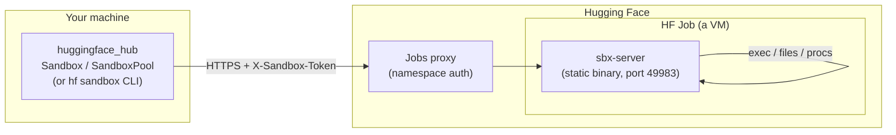
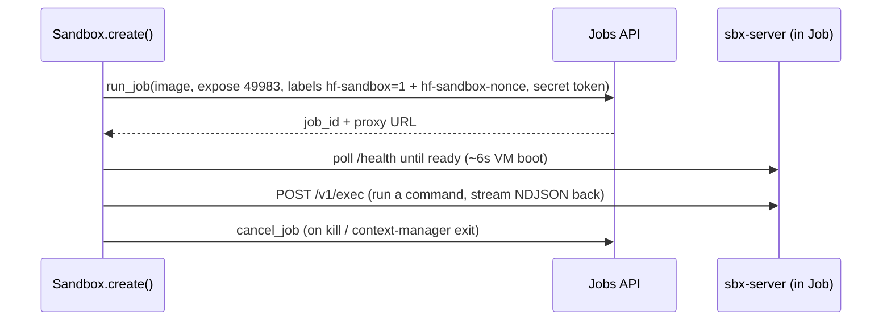
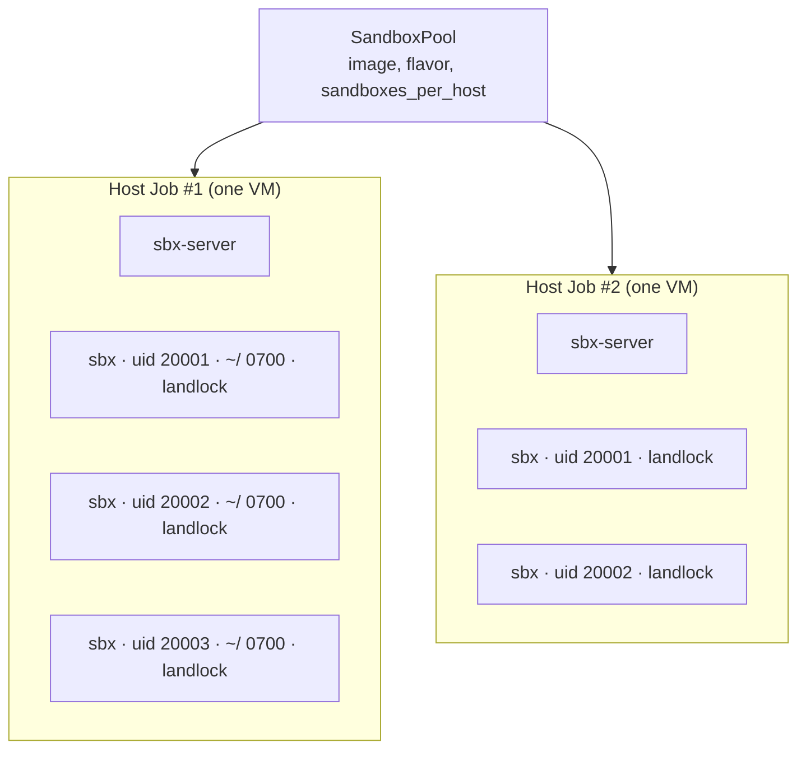
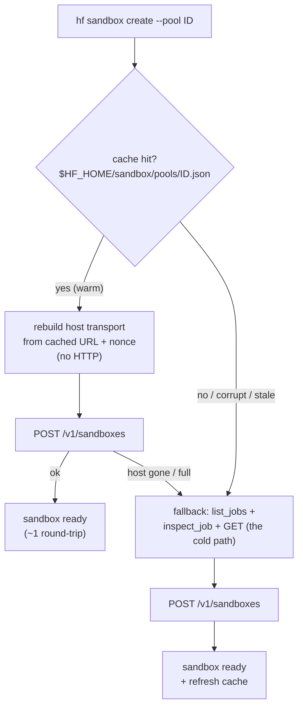

# Huggingface_Hub

## Docs

- [Quickstart](https://huggingface.co/docs/huggingface_hub/v1.31.0.rc0/quick-start.md)
- [Installation](https://huggingface.co/docs/huggingface_hub/v1.31.0.rc0/installation.md)
- [🤗 Hub client library](https://huggingface.co/docs/huggingface_hub/v1.31.0.rc0/index.md)
- [Cache-system reference](https://huggingface.co/docs/huggingface_hub/v1.31.0.rc0/package_reference/cache.md)
- [Environment variables](https://huggingface.co/docs/huggingface_hub/v1.31.0.rc0/package_reference/environment_variables.md)
- [HfApi Client](https://huggingface.co/docs/huggingface_hub/v1.31.0.rc0/package_reference/hf_api.md)
- [MCP Client](https://huggingface.co/docs/huggingface_hub/v1.31.0.rc0/package_reference/mcp.md)
- [Downloading files](https://huggingface.co/docs/huggingface_hub/v1.31.0.rc0/package_reference/file_download.md)
- [Inference Endpoints](https://huggingface.co/docs/huggingface_hub/v1.31.0.rc0/package_reference/inference_endpoints.md)
- [Managing your Space runtime](https://huggingface.co/docs/huggingface_hub/v1.31.0.rc0/package_reference/space_runtime.md)
- [TensorBoard logger](https://huggingface.co/docs/huggingface_hub/v1.31.0.rc0/package_reference/tensorboard.md)
- [Managing collections](https://huggingface.co/docs/huggingface_hub/v1.31.0.rc0/package_reference/collections.md)
- [OAuth and FastAPI](https://huggingface.co/docs/huggingface_hub/v1.31.0.rc0/package_reference/oauth.md)
- [Sandboxes](https://huggingface.co/docs/huggingface_hub/v1.31.0.rc0/package_reference/sandbox.md)
- [Repository Cards](https://huggingface.co/docs/huggingface_hub/v1.31.0.rc0/package_reference/cards.md)
- [Inference types](https://huggingface.co/docs/huggingface_hub/v1.31.0.rc0/package_reference/inference_types.md)
- [Strict Dataclasses](https://huggingface.co/docs/huggingface_hub/v1.31.0.rc0/package_reference/dataclasses.md)
- [WARNING](https://huggingface.co/docs/huggingface_hub/v1.31.0.rc0/package_reference/cli.md)
- [Interacting with Discussions and Pull Requests](https://huggingface.co/docs/huggingface_hub/v1.31.0.rc0/package_reference/community.md)
- [Webhooks Server](https://huggingface.co/docs/huggingface_hub/v1.31.0.rc0/package_reference/webhooks_server.md)
- [HF URIs](https://huggingface.co/docs/huggingface_hub/v1.31.0.rc0/package_reference/hf_uris.md)
- [Inference](https://huggingface.co/docs/huggingface_hub/v1.31.0.rc0/package_reference/inference_client.md)
- [Authentication](https://huggingface.co/docs/huggingface_hub/v1.31.0.rc0/package_reference/authentication.md)
- [Overview](https://huggingface.co/docs/huggingface_hub/v1.31.0.rc0/package_reference/overview.md)
- [Jobs](https://huggingface.co/docs/huggingface_hub/v1.31.0.rc0/package_reference/jobs.md)
- [Serialization](https://huggingface.co/docs/huggingface_hub/v1.31.0.rc0/package_reference/serialization.md)
- [Mixins & serialization methods](https://huggingface.co/docs/huggingface_hub/v1.31.0.rc0/package_reference/mixins.md)
- [Utilities](https://huggingface.co/docs/huggingface_hub/v1.31.0.rc0/package_reference/utilities.md)
- [Filesystem API](https://huggingface.co/docs/huggingface_hub/v1.31.0.rc0/package_reference/hf_file_system.md)
- [Buckets](https://huggingface.co/docs/huggingface_hub/v1.31.0.rc0/guides/buckets.md)
- [Create a CLI extension](https://huggingface.co/docs/huggingface_hub/v1.31.0.rc0/guides/cli-extensions.md)
- [Understand caching](https://huggingface.co/docs/huggingface_hub/v1.31.0.rc0/guides/manage-cache.md)
- [Create and share Model Cards](https://huggingface.co/docs/huggingface_hub/v1.31.0.rc0/guides/model-cards.md)
- [Inference Endpoints](https://huggingface.co/docs/huggingface_hub/v1.31.0.rc0/guides/inference_endpoints.md)
- [Collections](https://huggingface.co/docs/huggingface_hub/v1.31.0.rc0/guides/collections.md)
- [Create and manage a repository](https://huggingface.co/docs/huggingface_hub/v1.31.0.rc0/guides/repository.md)
- [Sandboxes](https://huggingface.co/docs/huggingface_hub/v1.31.0.rc0/guides/sandbox.md)
- [Command Line Interface (CLI)](https://huggingface.co/docs/huggingface_hub/v1.31.0.rc0/guides/cli.md)
- [Interact with Discussions and Pull Requests](https://huggingface.co/docs/huggingface_hub/v1.31.0.rc0/guides/community.md)
- [Upload files to the Hub](https://huggingface.co/docs/huggingface_hub/v1.31.0.rc0/guides/upload.md)
- [Download files from the Hub](https://huggingface.co/docs/huggingface_hub/v1.31.0.rc0/guides/download.md)
- [How-to guides](https://huggingface.co/docs/huggingface_hub/v1.31.0.rc0/guides/overview.md)
- [Run Inference on servers](https://huggingface.co/docs/huggingface_hub/v1.31.0.rc0/guides/inference.md)
- [Run and manage Jobs](https://huggingface.co/docs/huggingface_hub/v1.31.0.rc0/guides/jobs.md)
- [Integrate any ML framework with the Hub](https://huggingface.co/docs/huggingface_hub/v1.31.0.rc0/guides/integrations.md)
- [Manage your Space](https://huggingface.co/docs/huggingface_hub/v1.31.0.rc0/guides/manage-spaces.md)
- [Search the Hub](https://huggingface.co/docs/huggingface_hub/v1.31.0.rc0/guides/search.md)
- [Interact with the Hub through the Filesystem API](https://huggingface.co/docs/huggingface_hub/v1.31.0.rc0/guides/hf_file_system.md)
- [Webhooks](https://huggingface.co/docs/huggingface_hub/v1.31.0.rc0/guides/webhooks.md)
- [Sandboxes under the hood](https://huggingface.co/docs/huggingface_hub/v1.31.0.rc0/concepts/sandbox.md)
- [Git vs HTTP paradigm](https://huggingface.co/docs/huggingface_hub/v1.31.0.rc0/concepts/git_vs_http.md)
- [Migrating to huggingface_hub v1.0](https://huggingface.co/docs/huggingface_hub/v1.31.0.rc0/concepts/migration.md)

### Quickstart
https://huggingface.co/docs/huggingface_hub/v1.31.0.rc0/quick-start.md

# Quickstart

The [Hugging Face Hub](https://huggingface.co/) is the go-to place for sharing machine learning
models, demos, datasets, and metrics. `huggingface_hub` library helps you interact with
the Hub without leaving your development environment. You can create and manage
repositories easily, download and upload files, and get useful model and dataset
metadata from the Hub.

## Installation

To get started, install the `huggingface_hub` library:

```bash
pip install --upgrade huggingface_hub
```

For more details, check out the [installation](installation) guide.

> [!TIP]
> The `huggingface_hub` also ships with a [`hf` CLI](./guides/cli) that lets you interact with the Hub directly from the terminal.
> If you're using AI agents (Claude Code, Codex, Cursor, ...), install the Skill to let your agent use the CLI:
> ```bash
> # for Codex, Cursor, OpenCode, Pi and other agents that load skills from `.agents/skills`
> hf skills add
> # includes the above + Claude Code
> hf skills add --claude
> ```
> Check out the [Hugging Face CLI for AI Agents](https://huggingface.co/docs/hub/agents-cli) guide for more details.

## Download files

Repositories on the Hub are git version controlled, and users can download a single file
or the whole repository. You can use the [hf_hub_download()](/docs/huggingface_hub/v1.31.0.rc0/en/package_reference/file_download#huggingface_hub.hf_hub_download) function to download files.
This function will download and cache a file on your local disk. The next time you need
that file, it will load from your cache, so you don't need to re-download it.

You will need the repository id and the filename of the file you want to download. For
example, to download the [Pegasus](https://huggingface.co/google/pegasus-xsum) model
configuration file:

```py
>>> from huggingface_hub import hf_hub_download
>>> hf_hub_download(repo_id="google/pegasus-xsum", filename="config.json")
```

To download a specific version of the file, use the `revision` parameter to specify the
branch name, tag, or commit hash. If you choose to use the commit hash, it must be the
full-length hash instead of the shorter 7-character commit hash:

```py
>>> from huggingface_hub import hf_hub_download
>>> hf_hub_download(
...     repo_id="google/pegasus-xsum",
...     filename="config.json",
...     revision="4d33b01d79672f27f001f6abade33f22d993b151"
... )
```

For more details and options, see the API reference for [hf_hub_download()](/docs/huggingface_hub/v1.31.0.rc0/en/package_reference/file_download#huggingface_hub.hf_hub_download).

 

## Authentication

In a lot of cases, you must be authenticated with a Hugging Face account to interact with
the Hub: download private repos, upload files, create PRs,...
[Create an account](https://huggingface.co/join) if you don't already have one.

### Login command

The easiest way to authenticate is with the [login()](/docs/huggingface_hub/v1.31.0.rc0/en/package_reference/authentication#huggingface_hub.login) command:

```bash
hf auth login
```

If you are already logged in, the command will return immediately. To force re-login, use `hf auth login --force`. If you are not logged in, you will be prompted to log in with your browser: open the printed URL, enter the short code, approve the request, and an access token is retrieved and saved in your `HF_HOME` directory (defaults to `~/.cache/huggingface/token`). The token expires after a while but is refreshed automatically as long as you keep using it. Any script or library interacting with the Hub will use this token when sending requests. Alternatively, you can paste a [User Access Token](https://huggingface.co/docs/hub/security-tokens) generated from your [Settings page](https://huggingface.co/settings/tokens).

> [!TIP]
> User Access Tokens can have `read` or `write` permissions. Make sure to have a `write` access token if you want to create or edit a repository. Otherwise, it's best to generate a `read` token to reduce risk in case your token is inadvertently leaked.

Alternatively, you can programmatically log in using [login()](/docs/huggingface_hub/v1.31.0.rc0/en/package_reference/authentication#huggingface_hub.login) in a notebook or a script:

```py
>>> from huggingface_hub import login
>>> login()
```

You can only be logged in to one account at a time. Logging in to a new account will automatically log you out of the previous one. To determine your currently active account, simply run the `hf auth whoami` command.

> [!WARNING]
> Once logged in, all requests to the Hub - even methods that don't necessarily require authentication - will use your access token by default. If you want to disable the implicit use of your token, you should set `HF_HUB_DISABLE_IMPLICIT_TOKEN=1` as an environment variable (see [reference](../package_reference/environment_variables#hfhubdisableimplicittoken)).

### Manage multiple tokens locally

You can save multiple tokens on your machine by simply logging in with the [login()](/docs/huggingface_hub/v1.31.0.rc0/en/package_reference/authentication#huggingface_hub.login) command with each token. If you need to switch between these tokens locally, you can use the `auth switch` command:

```bash
hf auth switch
```

This command will prompt you to select a token by its name from a list of saved tokens. Once selected, the chosen token becomes the _active_ token, and it will be used for all interactions with the Hub.

You can list all available access tokens on your machine with `hf auth list`.

### Environment variable

The environment variable `HF_TOKEN` can also be used to authenticate yourself. This is especially useful in a Space where you can set `HF_TOKEN` as a [Space secret](https://huggingface.co/docs/hub/spaces-overview#managing-secrets).

> [!TIP]
> **NEW:** Google Colaboratory lets you define [private keys](https://twitter.com/GoogleColab/status/1719798406195867814) for your notebooks. Define a `HF_TOKEN` secret to be automatically authenticated!

Authentication via an environment variable or a secret has priority over the token stored on your machine.

### Method parameters

Finally, it is also possible to authenticate by passing your token to any method that accepts `token` as a parameter.

```
from huggingface_hub import whoami

user = whoami(token=...)
```

This is usually discouraged except in an environment where you don't want to store your token permanently or if you need to handle several tokens at once.

> [!WARNING]
> Please be careful when passing tokens as a parameter. It is always best practice to load the token from a secure vault instead of hardcoding it in your codebase or notebook. Hardcoded tokens present a major leak risk if you share your code inadvertently.

## Create a repository

Once you've registered and logged in, create a repository with the [create_repo()](/docs/huggingface_hub/v1.31.0.rc0/en/package_reference/hf_api#huggingface_hub.HfApi.create_repo)
function:

```py
>>> from huggingface_hub import HfApi
>>> api = HfApi()
>>> api.create_repo(repo_id="super-cool-model")
```

If you want your repository to be private, then:

```py
>>> from huggingface_hub import HfApi
>>> api = HfApi()
>>> api.create_repo(repo_id="super-cool-model", private=True)
```

Private repositories will not be visible to anyone except yourself.

> [!TIP]
> To create a repository or to push content to the Hub, you must provide a User Access
> Token that has the `write` permission. You can choose the permission when creating the
> token in your [Settings page](https://huggingface.co/settings/tokens).

## Upload files

Use the [upload_file()](/docs/huggingface_hub/v1.31.0.rc0/en/package_reference/hf_api#huggingface_hub.HfApi.upload_file) function to add a file to your newly created repository. You
need to specify:

1. The path of the file to upload.
2. The path of the file in the repository.
3. The repository id of where you want to add the file.

```py
>>> from huggingface_hub import HfApi
>>> api = HfApi()
>>> api.upload_file(
...     path_or_fileobj="/home/lysandre/dummy-test/README.md",
...     path_in_repo="README.md",
...     repo_id="lysandre/test-model",
... )
```

To upload more than one file at a time, take a look at the [Upload](./guides/upload) guide
which will introduce you to several methods for uploading files (with or without git).

## Next steps

The `huggingface_hub` library provides an easy way for users to interact with the Hub
with Python. To learn more about how you can manage your files and repositories on the
Hub, we recommend reading our [how-to guides](./guides/overview) to:

- [Manage your repository](./guides/repository).
- [Download](./guides/download) files from the Hub.
- [Upload](./guides/upload) files to the Hub.
- [Search the Hub](./guides/search) for your desired model or dataset.
- [Run Inference](./guides/inference) across multiple services for models hosted on the Hugging Face Hub.

### Installation
https://huggingface.co/docs/huggingface_hub/v1.31.0.rc0/installation.md

# Installation

Before you start, you will need to set up your environment by installing the appropriate packages.

`huggingface_hub` is tested on **Python 3.10+**.

## Install with pip

It is highly recommended to install `huggingface_hub` in a [virtual environment](https://docs.python.org/3/library/venv.html).
If you are unfamiliar with Python virtual environments, take a look at this [guide](https://packaging.python.org/en/latest/guides/installing-using-pip-and-virtual-environments/).
A virtual environment makes it easier to manage different projects, and avoid compatibility issues between dependencies.

Start by creating a virtual environment in your project directory:

```bash
python -m venv .venv
```

Activate the virtual environment. On Linux and macOS:

```bash
source .venv/bin/activate
```

Activate virtual environment on Windows:

```bash
.venv/Scripts/activate
```

Now you're ready to install `huggingface_hub` [from the PyPi registry](https://pypi.org/project/huggingface-hub/):

```bash
pip install --upgrade huggingface_hub
```

Once done, [check installation](#check-installation) is working correctly.

### Install optional dependencies

Some dependencies of `huggingface_hub` are [optional](https://setuptools.pypa.io/en/latest/userguide/dependency_management.html#optional-dependencies) because they are not required to run the core features of `huggingface_hub`. However, some features of the `huggingface_hub` may not be available if the optional dependencies aren't installed.

You can install optional dependencies via `pip`:
```bash
# Install dependencies for both torch-specific and MCP-specific features.
pip install 'huggingface_hub[mcp,torch]'
```

Here is the list of optional dependencies in `huggingface_hub`:
- `fastai`, `torch`: dependencies to run framework-specific features.
- `dev`: dependencies to contribute to the lib. Includes `testing` (to run tests), `typing` (to run type checker) and `quality` (to run linters).

### Install from source

In some cases, it is interesting to install `huggingface_hub` directly from source.
This allows you to use the bleeding edge `main` version rather than the latest stable version.
The `main` version is useful for staying up-to-date with the latest developments, for instance
if a bug has been fixed since the last official release but a new release hasn't been rolled out yet.

However, this means the `main` version may not always be stable. We strive to keep the
`main` version operational, and most issues are usually resolved
within a few hours or a day. If you run into a problem, please open an Issue so we can
fix it even sooner!

```bash
pip install git+https://github.com/huggingface/huggingface_hub
```

When installing from source, you can also specify a specific branch. This is useful if you
want to test a new feature or a new bug-fix that has not been merged yet:

```bash
pip install git+https://github.com/huggingface/huggingface_hub@my-feature-branch
```

Once done, [check installation](#check-installation) is working correctly.

### Editable install

Installing from source allows you to set up an [editable install](https://pip.pypa.io/en/stable/topics/local-project-installs/#editable-installs).
This is a more advanced installation if you plan to contribute to `huggingface_hub`
and need to test changes in the code. You need to clone a local copy of `huggingface_hub`
on your machine.

```bash
# First, clone repo locally
git clone https://github.com/huggingface/huggingface_hub.git

# Then, install with -e flag
cd huggingface_hub
pip install -e .
```

These commands will link the folder you cloned the repository to and your Python library paths.
Python will now look inside the folder you cloned to in addition to the normal library paths.
For example, if your Python packages are typically installed in `./.venv/lib/python3.13/site-packages/`,
Python will also search the folder you cloned `./huggingface_hub/`.

## Install the Hugging Face CLI 

Use our one-liner installers to set up the `hf` CLI without touching your Python environment:

On macOS and Linux:

```bash
curl -LsSf https://hf.co/cli/install.sh | bash
```

On Windows:

```powershell
powershell -ExecutionPolicy ByPass -c "irm https://hf.co/cli/install.ps1 | iex"
```

To upgrade an existing install, run `hf update` — it detects how `hf` was installed (standalone installer, Homebrew, or pip) and runs the matching command.

## Install with conda

If you are more familiar with it, you can install `huggingface_hub` using the [conda-forge channel](https://anaconda.org/conda-forge/huggingface_hub):

```bash
conda install -c conda-forge huggingface_hub
```

Once done, [check installation](#check-installation) is working correctly.

## Check installation

Once installed, check that `huggingface_hub` works properly by running the following command:

```bash
python -c "from huggingface_hub import model_info; print(model_info('gpt2'))"
```

This command will fetch information from the Hub about the [gpt2](https://huggingface.co/gpt2) model.
Output should look like this:

```text
Model Name: gpt2
Tags: ['pytorch', 'tf', 'jax', 'tflite', 'rust', 'safetensors', 'gpt2', 'text-generation', 'en', 'doi:10.57967/hf/0039', 'transformers', 'exbert', 'license:mit', 'has_space']
Task: text-generation
```

## Windows limitations

With our goal of democratizing good ML everywhere, we built `huggingface_hub` to be a
cross-platform library and in particular to work correctly on both Unix-based and Windows
systems. However, there are a few cases where `huggingface_hub` has some limitations when
run on Windows. Here is an exhaustive list of known issues. Please let us know if you
encounter any undocumented problem by opening [an issue on Github](https://github.com/huggingface/huggingface_hub/issues/new/choose).

- `huggingface_hub`'s cache system relies on symlinks to efficiently cache files downloaded
from the Hub. On Windows, you must activate developer mode or run your script as admin to
enable symlinks. If they are not activated, the cache-system still works but in a non-optimized
manner. Please read [the cache limitations](./guides/manage-cache#limitations) section for more details.
- Filepaths on the Hub can have special characters (e.g. `"path/to?/my/file"`). Windows is
more restrictive on [special characters](https://learn.microsoft.com/en-us/windows/win32/intl/character-sets-used-in-file-names)
which makes it impossible to download those files on Windows. Hopefully this is a rare case.
Please reach out to the repo owner if you think this is a mistake or to us to figure out
a solution.

## Next steps

Once `huggingface_hub` is properly installed on your machine, you might want to
[configure environment variables](package_reference/environment_variables) or [check one of our guides](guides/overview) to get started.

### 🤗 Hub client library
https://huggingface.co/docs/huggingface_hub/v1.31.0.rc0/index.md

# 🤗 Hub client library

The `huggingface_hub` library allows you to interact with the [Hugging Face
Hub](https://hf.co), a machine learning platform for creators and collaborators.
Discover pre-trained models and datasets for your projects or play with the hundreds of
machine learning apps hosted on the Hub. You can also create and share your own models
and datasets with the community. The `huggingface_hub` library provides a simple way to
do all these things with Python.

Read the [quick start guide](quick-start) to get up and running with the
`huggingface_hub` library. You will learn how to download files from the Hub, create a
repository, and upload files to the Hub. Keep reading to learn more about how to manage
your repositories on the 🤗 Hub, how to interact in discussions or even how to run inference.

  

    
      How-to guides
      Practical guides to help you achieve a specific goal. Take a look at these guides to learn how to use huggingface_hub to solve real-world problems.
    

    
      Reference
      Exhaustive and technical description of huggingface_hub classes and methods.
    

    
      Conceptual guides
      High-level explanations for building a better understanding of huggingface_hub philosophy.
    

  

## Contribute

All contributions to the `huggingface_hub` are welcomed and equally valued! 🤗 Besides
adding or fixing existing issues in the code, you can also help improve the
documentation by making sure it is accurate and up-to-date, help answer questions on
issues, and request new features you think will improve the library. Take a look at the
[contribution
guide](https://github.com/huggingface/huggingface_hub/blob/main/CONTRIBUTING.md) to
learn more about how to submit a new issue or feature request, how to submit a pull
request, and how to test your contributions to make sure everything works as expected.

Contributors should also be respectful of our [code of
conduct](https://github.com/huggingface/huggingface_hub/blob/main/CODE_OF_CONDUCT.md) to
create an inclusive and welcoming collaborative space for everyone.

### Cache-system reference
https://huggingface.co/docs/huggingface_hub/v1.31.0.rc0/package_reference/cache.md

# Cache-system reference

The caching system was updated in v0.8.0 to become the central cache-system shared
across libraries that depend on the Hub. Read the [cache-system guide](../guides/manage-cache)
for a detailed presentation of caching at HF.

## Helpers

### try_to_load_from_cache[[huggingface_hub.try_to_load_from_cache]]

#### huggingface_hub.try_to_load_from_cache[[huggingface_hub.try_to_load_from_cache]]

```python
huggingface_hub.try_to_load_from_cache(repo_id: str, filename: str, cache_dir: str | pathlib.Path | None = None, revision: str | None = None, repo_type: str | None = None)
```

[Source](https://github.com/huggingface/huggingface_hub/blob/v1.31.0.rc0/src/huggingface_hub/file_download.py#L1488)

**Parameters:**

cache_dir (`str` or `os.PathLike`) : The folder where the cached files lie.

repo_id (`str`) : The ID of the repo on huggingface.co.

filename (`str`) : The filename to look for inside `repo_id`.

revision (`str`, *optional*) : The specific model version to use. Will default to `"main"` if it's not provided and no `commit_hash` is provided either.

repo_type (`str`, *optional*) : The type of the repository. Will default to `"model"`.

**Returns:** `Optional[str]` or `_CACHED_NO_EXIST`

Will return `None` if the file was not cached. Otherwise:
- The exact path to the cached file if it's found in the cache
- A special value `_CACHED_NO_EXIST` if the file does not exist at the given commit hash and this fact was
  cached.

Explores the cache to return the latest cached file for a given revision if found.

This function will not raise any exception if the file in not cached.

Example:

```python
from huggingface_hub import try_to_load_from_cache, _CACHED_NO_EXIST

filepath = try_to_load_from_cache()
if isinstance(filepath, str):
    # file exists and is cached
    ...
elif filepath is _CACHED_NO_EXIST:
    # non-existence of file is cached
    ...
else:
    # file is not cached
    ...
```

### cached_assets_path[[huggingface_hub.cached_assets_path]]

#### huggingface_hub.cached_assets_path[[huggingface_hub.cached_assets_path]]

```python
huggingface_hub.cached_assets_path(library_name: str, namespace: str = 'default', subfolder: str = 'default', assets_dir: str | pathlib.Path | None = None)
```

[Source](https://github.com/huggingface/huggingface_hub/blob/v1.31.0.rc0/src/huggingface_hub/utils/_cache_assets.py#L19)

**Parameters:**

library_name (`str`) : Name of the library that will manage the cache folder. Example: `"dataset"`.

namespace (`str`, *optional*, defaults to "default") : Namespace to which the data belongs. Example: `"SQuAD"`.

subfolder (`str`, *optional*, defaults to "default") : Subfolder in which the data will be stored. Example: `extracted`.

assets_dir (`str`, `Path`, *optional*) : Path to the folder where assets are cached. This must not be the same folder where Hub files are cached. Defaults to `HF_HOME / "assets"` if not provided. Can also be set with `HF_ASSETS_CACHE` environment variable.

**Returns:**

Path to the cache folder (`Path`).

Return a folder path to cache arbitrary files.

`huggingface_hub` provides a canonical folder path to store assets. This is the
recommended way to integrate cache in a downstream library as it will benefit from
the builtins tools to scan and delete the cache properly.

The distinction is made between files cached from the Hub and assets. Files from the
Hub are cached in a git-aware manner and entirely managed by `huggingface_hub`. See
[related documentation](https://huggingface.co/docs/huggingface_hub/how-to-cache).
All other files that a downstream library caches are considered to be "assets"
(files downloaded from external sources, extracted from a .tar archive, preprocessed
for training,...).

Once the folder path is generated, it is guaranteed to exist and to be a directory.
The path is based on 3 levels of depth: the library name, a namespace and a
subfolder. Those 3 levels grants flexibility while allowing `huggingface_hub` to
expect folders when scanning/deleting parts of the assets cache. Within a library,
it is expected that all namespaces share the same subset of subfolder names but this
is not a mandatory rule. The downstream library has then full control on which file
structure to adopt within its cache. Namespace and subfolder are optional (would
default to a `"default/"` subfolder) but library name is mandatory as we want every
downstream library to manage its own cache.

Expected tree:
```text
    assets/
    └── datasets/
    │   ├── SQuAD/
    │   │   ├── downloaded/
    │   │   ├── extracted/
    │   │   └── processed/
    │   ├── Helsinki-NLP--tatoeba_mt/
    │       ├── downloaded/
    │       ├── extracted/
    │       └── processed/
    └── transformers/
        ├── default/
        │   ├── something/
        ├── bert-base-cased/
        │   ├── default/
        │   └── training/
    hub/
    └── models--julien-c--EsperBERTo-small/
        ├── blobs/
        │   ├── (...)
        │   ├── (...)
        ├── refs/
        │   └── (...)
        └── [ 128]  snapshots/
            ├── 2439f60ef33a0d46d85da5001d52aeda5b00ce9f/
            │   ├── (...)
            └── bbc77c8132af1cc5cf678da3f1ddf2de43606d48/
                └── (...)
```

Example:
```py
>>> from huggingface_hub import cached_assets_path

>>> cached_assets_path(library_name="datasets", namespace="SQuAD", subfolder="download")
PosixPath('/home/wauplin/.cache/huggingface/extra/datasets/SQuAD/download')

>>> cached_assets_path(library_name="datasets", namespace="SQuAD", subfolder="extracted")
PosixPath('/home/wauplin/.cache/huggingface/extra/datasets/SQuAD/extracted')

>>> cached_assets_path(library_name="datasets", namespace="Helsinki-NLP/tatoeba_mt")
PosixPath('/home/wauplin/.cache/huggingface/extra/datasets/Helsinki-NLP--tatoeba_mt/default')

>>> cached_assets_path(library_name="datasets", assets_dir="/tmp/tmp123456")
PosixPath('/tmp/tmp123456/datasets/default/default')
```

### scan_cache_dir[[huggingface_hub.scan_cache_dir]]

#### huggingface_hub.scan_cache_dir[[huggingface_hub.scan_cache_dir]]

```python
huggingface_hub.scan_cache_dir(cache_dir: str | pathlib.Path | None = None)
```

[Source](https://github.com/huggingface/huggingface_hub/blob/v1.31.0.rc0/src/huggingface_hub/utils/_cache_manager.py#L597)

**Parameters:**

cache_dir (`str` or `Path`, `optional`) : Cache directory to cache. Defaults to the default HF cache directory.

Scan the entire HF cache-system and return a [~HFCacheInfo](/docs/huggingface_hub/v1.31.0.rc0/en/package_reference/cache#huggingface_hub.HFCacheInfo) structure.

Use `scan_cache_dir` in order to programmatically scan your cache-system. The cache
will be scanned repo by repo. If a repo is corrupted, a [~CorruptedCacheException](/docs/huggingface_hub/v1.31.0.rc0/en/package_reference/cache#huggingface_hub.CorruptedCacheException)
will be thrown internally but captured and returned in the [~HFCacheInfo](/docs/huggingface_hub/v1.31.0.rc0/en/package_reference/cache#huggingface_hub.HFCacheInfo)
structure. Only valid repos get a proper report.

```py
>>> from huggingface_hub import scan_cache_dir

>>> hf_cache_info = scan_cache_dir()
HFCacheInfo(
    size_on_disk=3398085269,
    repos=frozenset({
        CachedRepoInfo(
            repo_id='t5-small',
            repo_type='model',
            repo_path=PosixPath(...),
            size_on_disk=970726914,
            nb_files=11,
            revisions=frozenset({
                CachedRevisionInfo(
                    commit_hash='d78aea13fa7ecd06c29e3e46195d6341255065d5',
                    size_on_disk=970726339,
                    snapshot_path=PosixPath(...),
                    files=frozenset({
                        CachedFileInfo(
                            file_name='config.json',
                            size_on_disk=1197
                            file_path=PosixPath(...),
                            blob_path=PosixPath(...),
                        ),
                        CachedFileInfo(...),
                        ...
                    }),
                ),
                CachedRevisionInfo(...),
                ...
            }),
        ),
        CachedRepoInfo(...),
        ...
    }),
    warnings=[
        CorruptedCacheException("Snapshots dir doesn't exist in cached repo: ..."),
        CorruptedCacheException(...),
        ...
    ],
)
```

You can also print a detailed report directly from the `hf` command line using:
```text
> hf cache ls
ID                          SIZE     LAST_ACCESSED LAST_MODIFIED REFS
--------------------------- -------- ------------- ------------- -----------
dataset/nyu-mll/glue          157.4M 2 days ago    2 days ago    main script
model/LiquidAI/LFM2-VL-1.6B     3.2G 4 days ago    4 days ago    main
model/microsoft/UserLM-8b      32.1G 4 days ago    4 days ago    main

Done in 0.0s. Scanned 6 repo(s) for a total of 3.4G.
Got 1 warning(s) while scanning. Use -vvv to print details.
```

> [!WARNING]
> Raises:
>
>     `CacheNotFound`
>       If the cache directory does not exist.
>
>     [`ValueError`](https://docs.python.org/3/library/exceptions.html#ValueError)
>       If the cache directory is a file, instead of a directory.

Returns: a [~HFCacheInfo](/docs/huggingface_hub/v1.31.0.rc0/en/package_reference/cache#huggingface_hub.HFCacheInfo) object.

## Data structures

All structures are built and returned by [scan_cache_dir()](/docs/huggingface_hub/v1.31.0.rc0/en/package_reference/cache#huggingface_hub.scan_cache_dir) and are immutable.

### HFCacheInfo[[huggingface_hub.HFCacheInfo]]

#### huggingface_hub.HFCacheInfo[[huggingface_hub.HFCacheInfo]]

```python
huggingface_hub.HFCacheInfo(size_on_disk: int, repos: frozenset, incomplete_files: frozenset, warnings: list)
```

[Source](https://github.com/huggingface/huggingface_hub/blob/v1.31.0.rc0/src/huggingface_hub/utils/_cache_manager.py#L349)

**Parameters:**

size_on_disk (`int`) : Sum of all valid repo sizes in the cache-system.

repos (`frozenset[CachedRepoInfo]`) : Set of [~CachedRepoInfo](/docs/huggingface_hub/v1.31.0.rc0/en/package_reference/cache#huggingface_hub.CachedRepoInfo) describing all valid cached repos found on the cache-system while scanning.

incomplete_files (`frozenset[CachedIncompleteFileInfo]`) : Set of [~CachedIncompleteFileInfo](/docs/huggingface_hub/v1.31.0.rc0/en/package_reference/cache#huggingface_hub.CachedIncompleteFileInfo) describing orphaned `*.incomplete` files left behind by interrupted downloads.

warnings (`list[CorruptedCacheException]`) : List of [~CorruptedCacheException](/docs/huggingface_hub/v1.31.0.rc0/en/package_reference/cache#huggingface_hub.CorruptedCacheException) that occurred while scanning the cache. Those exceptions are captured so that the scan can continue. Corrupted repos are skipped from the scan.

Frozen data structure holding information about the entire cache-system.

This data structure is returned by [scan_cache_dir()](/docs/huggingface_hub/v1.31.0.rc0/en/package_reference/cache#huggingface_hub.scan_cache_dir) and is immutable.

> [!WARNING]
> Here `size_on_disk` is equal to the sum of all repo sizes (only blobs). However if
> some cached repos are corrupted, their sizes are not taken into account.

#### delete_revisions[[huggingface_hub.HFCacheInfo.delete_revisions]]

```python
delete_revisions(*revisions: str)
```

[Source](https://github.com/huggingface/huggingface_hub/blob/v1.31.0.rc0/src/huggingface_hub/utils/_cache_manager.py#L393)

Prepare the strategy to delete one or more revisions cached locally.

Input revisions can be any revision hash. If a revision hash is not found in the
local cache, a warning is thrown but no error is raised. Revisions can be from
different cached repos since hashes are unique across repos,

Examples:
```py
>>> from huggingface_hub import scan_cache_dir
>>> cache_info = scan_cache_dir()
>>> delete_strategy = cache_info.delete_revisions(
...     "81fd1d6e7847c99f5862c9fb81387956d99ec7aa"
... )
>>> print(f"Will free {delete_strategy.expected_freed_size_str}.")
Will free 7.9K.
>>> delete_strategy.execute()
Cache deletion done. Saved 7.9K.
```

```py
>>> from huggingface_hub import scan_cache_dir
>>> scan_cache_dir().delete_revisions(
...     "81fd1d6e7847c99f5862c9fb81387956d99ec7aa",
...     "e2983b237dccf3ab4937c97fa717319a9ca1a96d",
...     "6c0e6080953db56375760c0471a8c5f2929baf11",
... ).execute()
Cache deletion done. Saved 8.6G.
```

> [!WARNING]
> `delete_revisions` returns a [DeleteCacheStrategy](/docs/huggingface_hub/v1.31.0.rc0/en/package_reference/cache#huggingface_hub.DeleteCacheStrategy) object that needs to
> be executed. The [DeleteCacheStrategy](/docs/huggingface_hub/v1.31.0.rc0/en/package_reference/cache#huggingface_hub.DeleteCacheStrategy) is not meant to be modified but
> allows having a dry run before actually executing the deletion.

#### export_as_table[[huggingface_hub.HFCacheInfo.export_as_table]]

```python
export_as_table(verbosity: int = 0)
```

[Source](https://github.com/huggingface/huggingface_hub/blob/v1.31.0.rc0/src/huggingface_hub/utils/_cache_manager.py#L502)

**Parameters:**

verbosity (`int`, *optional*) : The verbosity level. Defaults to 0.

**Returns:** `str`

The table as a string.

Generate a table from the [HFCacheInfo](/docs/huggingface_hub/v1.31.0.rc0/en/package_reference/cache#huggingface_hub.HFCacheInfo) object.

Pass `verbosity=0` to get a table with a single row per repo, with columns
"repo_id", "repo_type", "size_on_disk", "nb_files", "last_accessed", "last_modified", "refs", "local_path".

Pass `verbosity=1` to get a table with a row per repo and revision (thus multiple rows can appear for a single repo), with columns
"repo_id", "repo_type", "revision", "size_on_disk", "nb_files", "last_modified", "refs", "local_path".

Example:
```py
>>> from huggingface_hub.utils import scan_cache_dir

>>> hf_cache_info = scan_cache_dir()
HFCacheInfo(...)

>>> print(hf_cache_info.export_as_table())
REPO ID                                             REPO TYPE SIZE ON DISK NB FILES LAST_ACCESSED LAST_MODIFIED REFS LOCAL PATH
--------------------------------------------------- --------- ------------ -------- ------------- ------------- ---- --------------------------------------------------------------------------------------------------
roberta-base                                        model             2.7M        5 1 day ago     1 week ago    main ~/.cache/huggingface/hub/models--roberta-base
suno/bark                                           model             8.8K        1 1 week ago    1 week ago    main ~/.cache/huggingface/hub/models--suno--bark
t5-base                                             model           893.8M        4 4 days ago    7 months ago  main ~/.cache/huggingface/hub/models--t5-base
t5-large                                            model             3.0G        4 5 weeks ago   5 months ago  main ~/.cache/huggingface/hub/models--t5-large

>>> print(hf_cache_info.export_as_table(verbosity=1))
REPO ID                                             REPO TYPE REVISION                                 SIZE ON DISK NB FILES LAST_MODIFIED REFS LOCAL PATH
--------------------------------------------------- --------- ---------------------------------------- ------------ -------- ------------- ---- -----------------------------------------------------------------------------------------------------------------------------------------------------
roberta-base                                        model     e2da8e2f811d1448a5b465c236feacd80ffbac7b         2.7M        5 1 week ago    main ~/.cache/huggingface/hub/models--roberta-base/snapshots/e2da8e2f811d1448a5b465c236feacd80ffbac7b
suno/bark                                           model     70a8a7d34168586dc5d028fa9666aceade177992         8.8K        1 1 week ago    main ~/.cache/huggingface/hub/models--suno--bark/snapshots/70a8a7d34168586dc5d028fa9666aceade177992
t5-base                                             model     a9723ea7f1b39c1eae772870f3b547bf6ef7e6c1       893.8M        4 7 months ago  main ~/.cache/huggingface/hub/models--t5-base/snapshots/a9723ea7f1b39c1eae772870f3b547bf6ef7e6c1
t5-large                                            model     150ebc2c4b72291e770f58e6057481c8d2ed331a         3.0G        4 5 months ago  main ~/.cache/huggingface/hub/models--t5-large/snapshots/150ebc2c4b72291e770f58e6057481c8d2ed331a
```

### CachedRepoInfo[[huggingface_hub.CachedRepoInfo]]

#### huggingface_hub.CachedRepoInfo[[huggingface_hub.CachedRepoInfo]]

```python
huggingface_hub.CachedRepoInfo(repo_id: str, repo_type: typing.Literal['model', 'dataset', 'space'], repo_path: Path, size_on_disk: int, nb_files: int, revisions: frozenset, last_accessed: float, last_modified: float)
```

[Source](https://github.com/huggingface/huggingface_hub/blob/v1.31.0.rc0/src/huggingface_hub/utils/_cache_manager.py#L175)

**Parameters:**

repo_id (`str`) : Repo id of the repo on the Hub. Example: `"google/fleurs"`.

repo_type (`Literal["dataset", "model", "space"]`) : Type of the cached repo.

repo_path (`Path`) : Local path to the cached repo.

size_on_disk (`int`) : Sum of the blob file sizes in the cached repo.

nb_files (`int`) : Total number of blob files in the cached repo.

revisions (`frozenset[CachedRevisionInfo]`) : Set of [~CachedRevisionInfo](/docs/huggingface_hub/v1.31.0.rc0/en/package_reference/cache#huggingface_hub.CachedRevisionInfo) describing all revisions cached in the repo.

last_accessed (`float`) : Timestamp of the last time a blob file of the repo has been accessed.

last_modified (`float`) : Timestamp of the last time a blob file of the repo has been modified/created.

Frozen data structure holding information about a cached repository.

> [!WARNING]
> `size_on_disk` is not necessarily the sum of all revisions sizes because of
> duplicated files. Besides, only blobs are taken into account, not the (negligible)
> size of folders and symlinks.

> [!WARNING]
> `last_accessed` and `last_modified` reliability can depend on the OS you are using.
> See [python documentation](https://docs.python.org/3/library/os.html#os.stat_result)
> for more details.

#### size_on_disk_str[[huggingface_hub.CachedRepoInfo.size_on_disk_str]]

```python
size_on_disk_str()
```

[Source](https://github.com/huggingface/huggingface_hub/blob/v1.31.0.rc0/src/huggingface_hub/utils/_cache_manager.py#L237)

(property) Sum of the blob file sizes as a human-readable string.

Example: "42.2K".

#### refs[[huggingface_hub.CachedRepoInfo.refs]]

```python
refs()
```

[Source](https://github.com/huggingface/huggingface_hub/blob/v1.31.0.rc0/src/huggingface_hub/utils/_cache_manager.py#L251)

(property) Mapping between `refs` and revision data structures.

### CachedRevisionInfo[[huggingface_hub.CachedRevisionInfo]]

#### huggingface_hub.CachedRevisionInfo[[huggingface_hub.CachedRevisionInfo]]

```python
huggingface_hub.CachedRevisionInfo(commit_hash: str, snapshot_path: Path, size_on_disk: int, files: frozenset, refs: frozenset, last_modified: float)
```

[Source](https://github.com/huggingface/huggingface_hub/blob/v1.31.0.rc0/src/huggingface_hub/utils/_cache_manager.py#L104)

**Parameters:**

commit_hash (`str`) : Hash of the revision (unique). Example: `"9338f7b671827df886678df2bdd7cc7b4f36dffd"`.

snapshot_path (`Path`) : Path to the revision directory in the `snapshots` folder. It contains the exact tree structure as the repo on the Hub.

files : (`frozenset[CachedFileInfo]`): Set of [~CachedFileInfo](/docs/huggingface_hub/v1.31.0.rc0/en/package_reference/cache#huggingface_hub.CachedFileInfo) describing all files contained in the snapshot.

refs (`frozenset[str]`) : Set of `refs` pointing to this revision. If the revision has no `refs`, it is considered detached. Example: `{"main", "2.4.0"}` or `{"refs/pr/1"}`.

size_on_disk (`int`) : Sum of the blob file sizes that are symlink-ed by the revision.

last_modified (`float`) : Timestamp of the last time the revision has been created/modified.

Frozen data structure holding information about a revision.

A revision correspond to a folder in the `snapshots` folder and is populated with
the exact tree structure as the repo on the Hub but contains only symlinks. A
revision can be either referenced by 1 or more `refs` or be "detached" (no refs).

> [!WARNING]
> `last_accessed` cannot be determined correctly on a single revision as blob files
> are shared across revisions.

> [!WARNING]
> `size_on_disk` is not necessarily the sum of all file sizes because of possible
> duplicated files. Besides, only blobs are taken into account, not the (negligible)
> size of folders and symlinks.

#### size_on_disk_str[[huggingface_hub.CachedRevisionInfo.size_on_disk_str]]

```python
size_on_disk_str()
```

[Source](https://github.com/huggingface/huggingface_hub/blob/v1.31.0.rc0/src/huggingface_hub/utils/_cache_manager.py#L157)

(property) Sum of the blob file sizes as a human-readable string.

Example: "42.2K".

#### nb_files[[huggingface_hub.CachedRevisionInfo.nb_files]]

```python
nb_files()
```

[Source](https://github.com/huggingface/huggingface_hub/blob/v1.31.0.rc0/src/huggingface_hub/utils/_cache_manager.py#L166)

(property) Total number of files in the revision.

### CachedFileInfo[[huggingface_hub.CachedFileInfo]]

#### huggingface_hub.CachedFileInfo[[huggingface_hub.CachedFileInfo]]

```python
huggingface_hub.CachedFileInfo(file_name: str, file_path: Path, blob_path: Path, size_on_disk: int, blob_last_accessed: float, blob_last_modified: float)
```

[Source](https://github.com/huggingface/huggingface_hub/blob/v1.31.0.rc0/src/huggingface_hub/utils/_cache_manager.py#L40)

**Parameters:**

file_name (`str`) : Name of the file. Example: `config.json`.

file_path (`Path`) : Path of the file in the `snapshots` directory. The file path is a symlink referring to a blob in the `blobs` folder.

blob_path (`Path`) : Path of the blob file. This is equivalent to `file_path.resolve()`.

size_on_disk (`int`) : Size of the blob file in bytes.

blob_last_accessed (`float`) : Timestamp of the last time the blob file has been accessed (from any revision).

blob_last_modified (`float`) : Timestamp of the last time the blob file has been modified/created.

Frozen data structure holding information about a single cached file.

> [!WARNING]
> `blob_last_accessed` and `blob_last_modified` reliability can depend on the OS you
> are using. See [python documentation](https://docs.python.org/3/library/os.html#os.stat_result)
> for more details.

#### size_on_disk_str[[huggingface_hub.CachedFileInfo.size_on_disk_str]]

```python
size_on_disk_str()
```

[Source](https://github.com/huggingface/huggingface_hub/blob/v1.31.0.rc0/src/huggingface_hub/utils/_cache_manager.py#L93)

(property) Size of the blob file as a human-readable string.

Example: "42.2K".

### CachedIncompleteFileInfo[[huggingface_hub.CachedIncompleteFileInfo]]

#### huggingface_hub.CachedIncompleteFileInfo[[huggingface_hub.CachedIncompleteFileInfo]]

```python
huggingface_hub.CachedIncompleteFileInfo(file_path: Path, size_on_disk: int)
```

[Source](https://github.com/huggingface/huggingface_hub/blob/v1.31.0.rc0/src/huggingface_hub/utils/_cache_manager.py#L330)

**Parameters:**

file_path (`Path`) : Path of the `.incomplete` file in the `blobs` folder.

size_on_disk (`int`) : Size of the partially-downloaded file in bytes.

Frozen data structure holding information about a single incomplete download.

Interrupted downloads leave `<cache>/<repo>/blobs/<etag>.incomplete` files behind.
These are not part of any committed revision, so they are surfaced separately by
[scan_cache_dir()](/docs/huggingface_hub/v1.31.0.rc0/en/package_reference/cache#huggingface_hub.scan_cache_dir).

### DeleteCacheStrategy[[huggingface_hub.DeleteCacheStrategy]]

#### huggingface_hub.DeleteCacheStrategy[[huggingface_hub.DeleteCacheStrategy]]

```python
huggingface_hub.DeleteCacheStrategy(expected_freed_size: int, blobs: frozenset, refs: frozenset, repos: frozenset, snapshots: frozenset)
```

[Source](https://github.com/huggingface/huggingface_hub/blob/v1.31.0.rc0/src/huggingface_hub/utils/_cache_manager.py#L260)

**Parameters:**

expected_freed_size (`float`) : Expected freed size once strategy is executed.

blobs (`frozenset[Path]`) : Set of blob file paths to be deleted.

refs (`frozenset[Path]`) : Set of reference file paths to be deleted.

repos (`frozenset[Path]`) : Set of entire repo paths to be deleted.

snapshots (`frozenset[Path]`) : Set of snapshots to be deleted (directory of symlinks).

Frozen data structure holding the strategy to delete cached revisions.

This object is not meant to be instantiated programmatically but to be returned by
[delete_revisions()](/docs/huggingface_hub/v1.31.0.rc0/en/package_reference/cache#huggingface_hub.HFCacheInfo.delete_revisions). See documentation for usage example.

#### expected_freed_size_str[[huggingface_hub.DeleteCacheStrategy.expected_freed_size_str]]

```python
expected_freed_size_str()
```

[Source](https://github.com/huggingface/huggingface_hub/blob/v1.31.0.rc0/src/huggingface_hub/utils/_cache_manager.py#L285)

(property) Expected size that will be freed as a human-readable string.

Example: "42.2K".

## Exceptions

### CorruptedCacheException[[huggingface_hub.CorruptedCacheException]]

#### huggingface_hub.CorruptedCacheException[[huggingface_hub.CorruptedCacheException]]

[Source](https://github.com/huggingface/huggingface_hub/blob/v1.31.0.rc0/src/huggingface_hub/errors.py#L22)

Exception for any unexpected structure in the Huggingface cache-system.

### Environment variables
https://huggingface.co/docs/huggingface_hub/v1.31.0.rc0/package_reference/environment_variables.md

# Environment variables

`huggingface_hub` can be configured using environment variables.

If you are unfamiliar with environment variable, here are generic articles about them
[on macOS and Linux](https://linuxize.com/post/how-to-set-and-list-environment-variables-in-linux/)
and on [Windows](https://phoenixnap.com/kb/windows-set-environment-variable).

This page will guide you through all environment variables specific to `huggingface_hub`
and their meaning.

> [!TIP]
> All environment variables are read at import time of `huggingface_hub`. Any modification
> made afterwards will not be taken into account. Make sure to set your environment variables
> before importing `huggingface_hub`.

## Generic

### HF_INFERENCE_ENDPOINT

To configure the inference api base url. You might want to set this variable if your organization
is pointing at an API Gateway rather than directly at the inference api.

Defaults to `"https://api-inference.huggingface.co"`.

### HF_HOME

To configure where `huggingface_hub` will locally store data. In particular, your token
and the cache will be stored in this folder.

Defaults to `"~/.cache/huggingface"` unless [XDG_CACHE_HOME](#xdgcachehome) is set.

### HF_HUB_CACHE

To configure where repositories from the Hub will be cached locally (models, datasets and
spaces).

Defaults to `"$HF_HOME/hub"` (e.g. `"~/.cache/huggingface/hub"` by default).

### HF_XET_CACHE

To configure where Xet chunks (byte ranges from files managed by Xet backend) are cached locally.

Defaults to `"$HF_HOME/xet"` (e.g. `"~/.cache/huggingface/xet"` by default).

### HF_ASSETS_CACHE

To configure where [assets](../guides/manage-cache#caching-assets) created by downstream libraries
will be cached locally. Those assets can be preprocessed data, files downloaded from GitHub,
logs,...

Defaults to `"$HF_HOME/assets"` (e.g. `"~/.cache/huggingface/assets"` by default).

### HF_TOKEN

To configure the User Access Token to authenticate to the Hub. If set, this value will
overwrite the token stored on the machine (in either `$HF_TOKEN_PATH` or `"$HF_HOME/token"` if the former is not set).

For more details about authentication, check out [this section](../quick-start#authentication).

### HF_TOKEN_PATH

To configure where `huggingface_hub` should store the User Access Token. Defaults to `"$HF_HOME/token"` (e.g. `~/.cache/huggingface/token` by default).

### HF_HUB_VERBOSITY

Set the verbosity level of the `huggingface_hub`'s logger. Must be one of
`{"debug", "info", "warning", "error", "critical"}`.

Defaults to `"warning"`.

For more details, see [logging reference](../package_reference/utilities#huggingface_hub.utils.logging.get_verbosity).

### HF_HUB_ETAG_TIMEOUT

Integer value to define the number of seconds to wait for server response when fetching the latest metadata from a repo before downloading a file. If the request times out, `huggingface_hub` will default to the locally cached files. Setting a lower value speeds up the workflow for machines with a slow connection that have already cached files. A higher value guarantees the metadata call to succeed in more cases. Default to 10s.

### HF_HUB_DOWNLOAD_TIMEOUT

Integer value to define the number of seconds to wait for server response when downloading a file. If the request times out, a TimeoutError is raised. Setting a higher value is beneficial on machine with a slow connection. A smaller value makes the process fail quicker in case of complete network outage. Default to 10s.

## Xet 

### Other Xet environment variables
* [`HF_HUB_DISABLE_XET`](../package_reference/environment_variables#hfhubdisablexet)
* [`HF_XET_CACHE`](../package_reference/environment_variables#hfxetcache)
* [`HF_XET_HIGH_PERFORMANCE`](../package_reference/environment_variables#hfxethighperformance)
* [`HF_XET_RECONSTRUCT_WRITE_SEQUENTIALLY`](../package_reference/environment_variables#hfxetreconstructwritesequentially)

### HF_XET_CHUNK_CACHE_SIZE_BYTES

To set the size of the Xet chunk cache locally. By default, the chunk cache is disabled. The chunk cache can be beneficial if you are generating new revisions to existing models or datasets as this is used to cache terms/chunks that are fetched from S3. A larger cache can better take advantage of deduplication across repos & files. To enable the chunk cache set the environment variable to a large number (10GB) or greater. However, in most cases when downloading or uploading new data, disabling the chunk cache will have better performance, which is why it is disabled by default.

Defaults to `0` (0 bytes, means chunk cache is disabled).

### HF_XET_SHARD_CACHE_SIZE_LIMIT

To set the size of the Xet shard cache locally. Increasing this will improve upload efficiency as chunks referenced in cached shard files are not re-uploaded. Note that the default soft limit is likely sufficient for most workloads. 

Defaults to `16000000000` (16GB).

### HF_XET_NUM_CONCURRENT_RANGE_GETS

To set the number of concurrent terms (range of bytes from within a xorb, often called a chunk) downloaded from S3 per file. Increasing this will help with the speed of downloading a file if there is network bandwidth available. 

Defaults to `16`.

## Boolean values

The following environment variables expect a boolean value. The variable will be considered
as `True` if its value is one of `{"1", "ON", "YES", "TRUE"}` (case-insensitive). Any other value
(or undefined) will be considered as `False`.

### HF_DEBUG

If set, the log level for the `huggingface_hub` logger is set to DEBUG. Additionally, all requests made by HF libraries will be logged as equivalent cURL commands for easier debugging and reproducibility.

### HF_HUB_OFFLINE

If set, no HTTP calls will be made to the Hugging Face Hub. If you try to download files, only the cached files will be accessed. If no cache file is detected, an error is raised This is useful in case your network is slow and you don't care about having the latest version of a file.

If `HF_HUB_OFFLINE=1` is set as environment variable and you call any method of [HfApi](/docs/huggingface_hub/v1.31.0.rc0/en/package_reference/hf_api#huggingface_hub.HfApi), an [OfflineModeIsEnabled](/docs/huggingface_hub/v1.31.0.rc0/en/package_reference/utilities#huggingface_hub.errors.OfflineModeIsEnabled) exception will be raised.

**Note:** even if the latest version of a file is cached, calling `hf_hub_download` still triggers a HTTP request to check that a new version is not available. Setting `HF_HUB_OFFLINE=1` will skip this call which speeds up your loading time.

If you want to check if offline mode is enabled or not, you can use the [is_offline_mode()](/docs/huggingface_hub/v1.31.0.rc0/en/package_reference/utilities#huggingface_hub.is_offline_mode) helper.

### HF_HUB_DISABLE_IMPLICIT_TOKEN

Authentication is not mandatory for every request to the Hub. For instance, requesting
details about `"gpt2"` model does not require to be authenticated. However, if a user is
[logged in](../package_reference/login), the default behavior will be to always send the token
in order to ease user experience (never get a HTTP 401 Unauthorized) when accessing private or gated repositories. For privacy, you can
disable this behavior by setting `HF_HUB_DISABLE_IMPLICIT_TOKEN=1`. In this case,
the token will be sent only for "write-access" calls (example: create a commit).

**Note:** disabling implicit sending of token can have weird side effects. For example,
if you want to list all models on the Hub, your private models will not be listed. You
would need to explicitly pass `token=True` argument in your script.

### HF_HUB_DISABLE_PROGRESS_BARS

For time-consuming tasks, `huggingface_hub` displays a progress bar by default (using tqdm).
You can disable all the progress bars at once by setting `HF_HUB_DISABLE_PROGRESS_BARS=1`.

### HF_HUB_DISABLE_SYMLINKS

If set, `huggingface_hub` will never create symlinks in the cache. Instead, files will be duplicated or moved directly into snapshot directories. This is a power-user feature making the cache directory run in a degraded mode where huge files ends-up duplicated on your hard-drive.

An example use case is when a shared network drive (e.g. NAS) is used as `HF_HUB_CACHE` across machines running different operating
systems. Symlinks created on Linux are not always traversable on Windows, leading to errors. Setting `HF_HUB_DISABLE_SYMLINKS=1` avoids this problem at the cost of disk-space deduplication.

### HF_HUB_DISABLE_SYMLINKS_WARNING

If you are on a Windows machine, it is recommended to enable the developer mode or to run
`huggingface_hub` in admin mode. If not, `huggingface_hub` will not be able to create
symlinks in your cache system. You will be able to execute any script but your user experience
will be degraded as some huge files might end-up duplicated on your hard-drive. A warning
message is triggered to warn you about this behavior. Set `HF_HUB_DISABLE_SYMLINKS_WARNING=1`,
to disable this warning.

For more details, see [cache limitations](../guides/manage-cache#limitations).

### HF_HUB_DISABLE_EXPERIMENTAL_WARNING

Some features of `huggingface_hub` are experimental. This means you can use them but we do not guarantee they will be
maintained in the future. In particular, we might update the API or behavior of such features without any deprecation
cycle. A warning message is triggered when using an experimental feature to warn you about it. If you're comfortable debugging any potential issues using an experimental feature, you can set `HF_HUB_DISABLE_EXPERIMENTAL_WARNING=1` to disable the warning.

If you are using an experimental feature, please let us know! Your feedback can help us design and improve it.

### HF_HUB_DISABLE_TELEMETRY

By default, some data is collected by HF libraries (`transformers`, `datasets`, `gradio`,..) to monitor usage, debug issues and help prioritize features.
Each library defines its own policy (i.e. which usage to monitor) but the core implementation happens in `huggingface_hub` (see `send_telemetry`).

You can set `HF_HUB_DISABLE_TELEMETRY=1` as environment variable to globally disable telemetry.

### HF_HUB_DISABLE_UPDATE_CHECK

By default, the `hf` CLI checks PyPI for a newer release at startup (at most once every 24 hours) and prints a one-line yellow warning to stderr when one is available, suggesting `hf update`. The check is already a no-op on dev and pre-release versions.

It also checks (at most once every 24 hours, purely locally) whether the `hf-cli` skill is installed and generated by the running version, and suggests `hf skills add` / `hf skills update` if not. The check only prints a hint, it never touches your skills directories.

Set `HF_HUB_DISABLE_UPDATE_CHECK=1` to skip the PyPI request and silence both hints entirely. Useful in offline CI environments or when you prefer a quieter shell output.

### HF_HUB_DISABLE_XET

Set to disable using `hf-xet`, even if it is available in your Python environment. This is since `hf-xet` will be used automatically if it is found, this allows explicitly disabling its usage. If you are disabling Xet, please consider [filing an issue and including the diagnostics](https://github.com/huggingface/xet-core?tab=readme-ov-file#issues-diagnostics--debugging) information to help us understand why Xet is not working for you.

### HF_HUB_ENABLE_HF_TRANSFER

> [!WARNING]
> This is a deprecated environment variable.
> Now that the Hugging Face Hub is fully powered by the Xet storage backend, all file transfers go through the `hf-xet` binary package. It provides efficient transfers using a chunk-based deduplication strategy and integrates seamlessly with `huggingface_hub`.
> This means `hf_transfer` can't be used anymore. If you are interested in higher performance, check out the [`HF_XET_HIGH_PERFORMANCE` section](#hf_xet_high_performance)

### HF_XET_HIGH_PERFORMANCE

Set `hf-xet` to operate with increased settings to maximize network and disk resources on the machine. Enabling high performance mode will try to saturate the network bandwidth of this machine and utilize all CPU cores for parallel upload/download activity.

Consider this analogous to the legacy `HF_HUB_ENABLE_HF_TRANSFER=1` environment variable but applied to `hf-xet`.

To learn more about the benefits of Xet storage and `hf_xet`, refer to this [section](https://huggingface.co/docs/hub/xet/index).

### HF_XET_RECONSTRUCT_WRITE_SEQUENTIALLY

To have `hf-xet` write sequentially to local disk, instead of in parallel. `hf-xet` is designed for SSD/NVMe disks (using parallel writes with direct addressing). If you are using an HDD (spinning hard disk), setting this will change disk writes to be sequential instead of parallel. For slower hard disks, this can improve overall write performance, as the disk is not spinning to seek for parallel writes.

## Deprecated environment variables

In order to standardize all environment variables within the Hugging Face ecosystem, some variables have been marked as deprecated. Although they remain functional, they no longer take precedence over their replacements. The following table outlines the deprecated variables and their corresponding alternatives:

| Deprecated Variable         | Replacement        |
| --------------------------- | ------------------ |
| `HUGGINGFACE_HUB_CACHE`     | `HF_HUB_CACHE`     |
| `HUGGINGFACE_ASSETS_CACHE`  | `HF_ASSETS_CACHE`  |
| `HUGGING_FACE_HUB_TOKEN`    | `HF_TOKEN`         |

## From external tools

Some environment variables are not specific to `huggingface_hub` but are still taken into account when they are set.

### DO_NOT_TRACK

Boolean value. Equivalent to `HF_HUB_DISABLE_TELEMETRY`. When set to true, telemetry is globally disabled in the Hugging Face Python ecosystem (`transformers`, `diffusers`, `gradio`, etc.). See https://donottrack.sh/ for more details.

### NO_COLOR

Boolean value. When set, `hf` CLI will not print any ANSI color.
See [no-color.org](https://no-color.org/).

### XDG_CACHE_HOME

Used only when `HF_HOME` is not set!

This is the default way to configure where [user-specific non-essential (cached) data should be written](https://wiki.archlinux.org/title/XDG_Base_Directory)
on linux machines.

If `HF_HOME` is not set, the default home will be `"$XDG_CACHE_HOME/huggingface"` instead
of `"~/.cache/huggingface"`.

### HfApi Client
https://huggingface.co/docs/huggingface_hub/v1.31.0.rc0/package_reference/hf_api.md

# HfApi Client

Below is the documentation for the `HfApi` class, which serves as a Python wrapper for the Hugging Face Hub's API.

All methods from the `HfApi` are also accessible from the package's root directly. Both approaches are detailed below.

Using the root method is more straightforward but the [HfApi](/docs/huggingface_hub/v1.31.0.rc0/en/package_reference/hf_api#huggingface_hub.HfApi) class gives you more flexibility.
In particular, you can pass a token that will be reused in all HTTP calls. This is different
from `hf auth login` or [login()](/docs/huggingface_hub/v1.31.0.rc0/en/package_reference/authentication#huggingface_hub.login) as the token is not persisted on the machine.
It is also possible to provide a different endpoint or configure a custom user-agent.

```python
from huggingface_hub import HfApi, list_models

# Use root method
models = list_models()

# Or configure a HfApi client
hf_api = HfApi(
    endpoint="https://huggingface.co", # Can be a Private Hub endpoint.
    token="hf_xxx", # Token is not persisted on the machine.
)
models = hf_api.list_models()
```

## HfApi[[huggingface_hub.HfApi]]

#### huggingface_hub.HfApi[[huggingface_hub.HfApi]]

```python
huggingface_hub.HfApi(endpoint: str | None = None, token: str | bool | None = None, library_name: str | None = None, library_version: str | None = None, user_agent: dict | str | None = None, headers: dict[str, str] | None = None)
```

[Source](https://github.com/huggingface/huggingface_hub/blob/v1.31.0.rc0/src/huggingface_hub/hf_api.py#L2249)

**Parameters:**

endpoint (`str`, *optional*) : Endpoint of the Hub. Defaults to .

token (`bool` or `str`, *optional*) : A valid user access token (string). Defaults to the locally saved token, which is the recommended method for authentication (see https://huggingface.co/docs/huggingface_hub/quick-start#authentication). To disable authentication, pass `False`.

library_name (`str`, *optional*) : The name of the library that is making the HTTP request. Will be added to the user-agent header. Example: `"transformers"`.

library_version (`str`, *optional*) : The version of the library that is making the HTTP request. Will be added to the user-agent header. Example: `"4.24.0"`.

user_agent (`str`, `dict`, *optional*) : The user agent info in the form of a dictionary or a single string. It will be completed with information about the installed packages.

headers (`dict`, *optional*) : Additional headers to be sent with each request. Example: `{"X-My-Header": "value"}`. Headers passed here are taking precedence over the default headers.

Client to interact with the Hugging Face Hub via HTTP.

The client is initialized with some high-level settings used in all requests
made to the Hub (HF endpoint, authentication, user agents...). Using the `HfApi`
client is preferred but not mandatory as all of its public methods are exposed
directly at the root of `huggingface_hub`.

#### accept_access_request[[huggingface_hub.HfApi.accept_access_request]]

```python
accept_access_request(repo_id: str, user: str, repo_type: str | None = None, token: bool | str | None = None)
```

[Source](https://github.com/huggingface/huggingface_hub/blob/v1.31.0.rc0/src/huggingface_hub/hf_api.py#L10920)

**Parameters:**

repo_id (`str`) : The id of the repo to accept access request for.

user (`str`) : The username of the user which access request should be accepted.

repo_type (`str`, *optional*) : The type of the repo to accept access request for. Must be one of `model`, `dataset` or `space`. Defaults to `model`.

token (`bool` or `str`, *optional*) : A valid user access token (string). Defaults to the locally saved token, which is the recommended method for authentication (see https://huggingface.co/docs/huggingface_hub/quick-start#authentication). To disable authentication, pass `False`.

**Raises:** `HfHubHTTPError`

- `HfHubHTTPError` -- 
  HTTP 400 if the repo is not gated.
- `HfHubHTTPError` -- 
  HTTP 403 if you only have read-only access to the repo. This can be the case if you don't have `write`
  or `admin` role in the organization the repo belongs to or if you passed a `read` token.
- `HfHubHTTPError` -- 
  HTTP 404 if the user does not exist on the Hub.
- `HfHubHTTPError` -- 
  HTTP 404 if the user access request cannot be found.
- `HfHubHTTPError` -- 
  HTTP 404 if the user access request is already in the accepted list.

Accept an access request from a user for a given gated repo.

Once the request is accepted, the user will be able to download any file of the repo and access the community
tab. If the approval mode is automatic, you don't have to accept requests manually. An accepted request can be
cancelled or rejected at any time using [cancel_access_request()](/docs/huggingface_hub/v1.31.0.rc0/en/package_reference/hf_api#huggingface_hub.HfApi.cancel_access_request) and [reject_access_request()](/docs/huggingface_hub/v1.31.0.rc0/en/package_reference/hf_api#huggingface_hub.HfApi.reject_access_request).

For more info about gated repos, see https://huggingface.co/docs/hub/models-gated.

#### add_collection_item[[huggingface_hub.HfApi.add_collection_item]]

```python
add_collection_item(collection_slug: str, item_id: str, item_type: CollectionItemType_T, note: str | None = None, exists_ok: bool = False, token: bool | str | None = None)
```

[Source](https://github.com/huggingface/huggingface_hub/blob/v1.31.0.rc0/src/huggingface_hub/hf_api.py#L10473)

**Parameters:**

collection_slug (`str`) : Slug of the collection to update. Example: `"TheBloke/recent-models-64f9a55bb3115b4f513ec026"`.

item_id (`str`) : Id of the item to add to the collection. Use the repo_id for repos/spaces/datasets, the paper id for papers, the slug of another collection (e.g. `"moonshotai/kimi-k2"`) or a bucket id (e.g. `"namespace/bucket-name"`).

item_type (`str`) : Type of the item to add. Can be one of `"model"`, `"dataset"`, `"space"`, `"paper"`, `"collection"` or `"bucket"`.

note (`str`, *optional*) : A note to attach to the item in the collection. The maximum size for a note is 500 characters.

exists_ok (`bool`, *optional*) : If `True`, do not raise an error if item already exists.

token (`bool` or `str`, *optional*) : A valid user access token (string). Defaults to the locally saved token, which is the recommended method for authentication (see https://huggingface.co/docs/huggingface_hub/quick-start#authentication). To disable authentication, pass `False`.

**Raises:** `HfHubHTTPError`

- `HfHubHTTPError` -- 
  HTTP 403 if you only have read-only access to the repo. This can be the case if you don't have `write`
  or `admin` role in the organization the repo belongs to or if you passed a `read` token.
- `HfHubHTTPError` -- 
  HTTP 404 if the item you try to add to the collection does not exist on the Hub.
- `HfHubHTTPError` -- 
  HTTP 409 if the item you try to add to the collection is already in the collection (and exists_ok=False)

Add an item to a collection on the Hub.

Returns: [Collection](/docs/huggingface_hub/v1.31.0.rc0/en/package_reference/collections#huggingface_hub.Collection)

Example:

```py
>>> from huggingface_hub import add_collection_item
>>> collection = add_collection_item(
...     collection_slug="davanstrien/climate-64f99dc2a5067f6b65531bab",
...     item_id="pierre-loic/climate-news-articles",
...     item_type="dataset"
... )
>>> collection.items[-1].item_id
"pierre-loic/climate-news-articles"
# ^item got added to the collection on last position

# Add item with a note
>>> add_collection_item(
...     collection_slug="davanstrien/climate-64f99dc2a5067f6b65531bab",
...     item_id="datasets/climate_fever",
...     item_type="dataset"
...     note="This dataset adopts the FEVER methodology that consists of 1,535 real-world claims regarding climate-change collected on the internet."
... )
(...)
```

#### add_space_secret[[huggingface_hub.HfApi.add_space_secret]]

```python
add_space_secret(repo_id: str, key: str, value: str, description: str | None = None, token: bool | str | None = None)
```

[Source](https://github.com/huggingface/huggingface_hub/blob/v1.31.0.rc0/src/huggingface_hub/hf_api.py#L8120)

**Parameters:**

repo_id (`str`) : ID of the repo to update. Example: `"bigcode/in-the-stack"`.

key (`str`) : Secret key. Example: `"GITHUB_API_KEY"`

value (`str`) : Secret value. Example: `"your_github_api_key"`.

description (`str`, *optional*) : Secret description. Example: `"Github API key to access the Github API"`.

token (`bool` or `str`, *optional*) : A valid user access token (string). Defaults to the locally saved token, which is the recommended method for authentication (see https://huggingface.co/docs/huggingface_hub/quick-start#authentication). To disable authentication, pass `False`.

Adds or updates a secret in a Space.

Secrets allow to set secret keys or tokens to a Space without hardcoding them.
For more details, see https://huggingface.co/docs/hub/spaces-overview#managing-secrets.

#### add_space_variable[[huggingface_hub.HfApi.add_space_variable]]

```python
add_space_variable(repo_id: str, key: str, value: str, description: str | None = None, token: bool | str | None = None)
```

[Source](https://github.com/huggingface/huggingface_hub/blob/v1.31.0.rc0/src/huggingface_hub/hf_api.py#L8246)

**Parameters:**

repo_id (`str`) : ID of the repo to update. Example: `"bigcode/in-the-stack"`.

key (`str`) : Variable key. Example: `"MODEL_REPO_ID"`

value (`str`) : Variable value. Example: `"the_model_repo_id"`.

description (`str`) : Description of the variable. Example: `"Model Repo ID of the implemented model"`.

token (`bool` or `str`, *optional*) : A valid user access token (string). Defaults to the locally saved token, which is the recommended method for authentication (see https://huggingface.co/docs/huggingface_hub/quick-start#authentication). To disable authentication, pass `False`.

Adds or updates a variable in a Space.

Variables allow to set environment variables to a Space without hardcoding them.
For more details, see https://huggingface.co/docs/hub/spaces-overview#managing-secrets-and-environment-variables

#### auth_check[[huggingface_hub.HfApi.auth_check]]

```python
auth_check(repo_id: str, repo_type: str | None = None, token: bool | str | None = None, write: bool = False)
```

[Source](https://github.com/huggingface/huggingface_hub/blob/v1.31.0.rc0/src/huggingface_hub/hf_api.py#L12044)

**Parameters:**

repo_id (`str`) : The repository to check for access. Format should be `"user/repo_name"`. Example: `"user/my-cool-model"`. 

repo_type (`str`, *optional*) : The type of the repository. Should be one of `"model"`, `"dataset"`, or `"space"`. If not specified, the default is `"model"`. 

token (`Union[bool, str, None]`, *optional*) : A valid user access token. If not provided, the locally saved token will be used, which is the recommended authentication method. Set to `False` to disable authentication. Refer to: https://huggingface.co/docs/huggingface_hub/quick-start#authentication. 

write (`bool`, *optional*) : If `True`, checks whether the user has content write permission on the repository. If `False` (default), only checks for read access.

**Raises:** [RepositoryNotFoundError](/docs/huggingface_hub/v1.31.0.rc0/en/package_reference/utilities#huggingface_hub.errors.RepositoryNotFoundError) or [GatedRepoError](/docs/huggingface_hub/v1.31.0.rc0/en/package_reference/utilities#huggingface_hub.errors.GatedRepoError)

- [RepositoryNotFoundError](/docs/huggingface_hub/v1.31.0.rc0/en/package_reference/utilities#huggingface_hub.errors.RepositoryNotFoundError) -- 
  Raised if the repository does not exist, is private, or the user does not have access. This can
  occur if the `repo_id` or `repo_type` is incorrect or if the repository is private but the user
  is not authenticated.

- [GatedRepoError](/docs/huggingface_hub/v1.31.0.rc0/en/package_reference/utilities#huggingface_hub.errors.GatedRepoError) -- 
  Raised if the repository exists but is gated and the user is not authorized to access it.

Check if the provided user token has access to a specific repository on the Hugging Face Hub.

This method verifies whether the user, authenticated via the provided token, has access to the specified
repository. If the repository is not found or if the user lacks the required permissions to access it,
the method raises an appropriate exception.

Example:

Check if the user has access to a repository:

```python
>>> from huggingface_hub import auth_check
>>> from huggingface_hub.utils import GatedRepoError, RepositoryNotFoundError

try:
    auth_check("user/my-cool-model")
except GatedRepoError:
    # Handle gated repository error
    print("You do not have permission to access this gated repository.")
except RepositoryNotFoundError:
    # Handle repository not found error
    print("The repository was not found or you do not have access.")
```

In this example:
- If the user has access, the method completes successfully.
- If the repository is gated or does not exist, appropriate exceptions are raised, allowing the user
to handle them accordingly.

#### batch_bucket_files[[huggingface_hub.HfApi.batch_bucket_files]]

```python
batch_bucket_files(bucket_id: str, add: list[tuple[str | Path | bytes, str]] | None = None, copy: list[tuple[str, str, str, str]] | None = None, delete: list[str] | None = None, token: str | bool | None = None)
```

[Source](https://github.com/huggingface/huggingface_hub/blob/v1.31.0.rc0/src/huggingface_hub/hf_api.py#L14492)

**Parameters:**

bucket_id (`str`) : The ID of the bucket (e.g. `"username/my-bucket"`).

add (`list` of `tuple`, *optional*) : Files to upload. Each element is a `(source, destination)` tuple where `source` is a path to a local file (`str` or `Path`) or raw `bytes` content, and `destination` is the path in the bucket.

copy (`list` of `tuple`, *optional*) : Files to copy by xet hash. Each element is a `(source_repo_type, source_repo_id, xet_hash, destination)` tuple where: - `source_repo_type` is the type of the source repository: `"model"`, `"dataset"`, `"space"`, or `"bucket"`. - `source_repo_id` is the ID of the source repository or bucket (e.g. `"username/my-model"`). - `xet_hash` is the xet hash of the file to copy. - `destination` is the destination path in the bucket. This is a server-side operation — no data is downloaded or re-uploaded.

delete (`list` of `str`, *optional*) : Paths of files to delete from the bucket.

token (`bool` or `str`, *optional*) : A valid user access token (string). Defaults to the locally saved token, which is the recommended method for authentication (see https://huggingface.co/docs/huggingface_hub/quick-start#authentication). To disable authentication, pass `False`.

Add, copy, and/or delete files in a bucket.

This is a non-transactional operation. If an error occurs in the process, some files may have been uploaded,
copied, or deleted while others haven't.

Example:
```python
>>> from huggingface_hub import batch_bucket_files

# Upload files
>>> batch_bucket_files(
...     "username/my-bucket",
...     add=[
...         ("./model.safetensors", "models/model.safetensors"),
...         (b'{{"key": "value"}}', "config.json"),
...     ],
... )

# Copy xet files from another bucket or repo (server-side, no data transfer)
>>> batch_bucket_files(
...     "username/my-bucket",
...     copy=[
...         ("bucket", "username/source-bucket", "<xethash_1>", "models/model.safetensors"),
...         ("model", "username/my-model", "<xethash_2>", "models/config.safetensors"),
...     ],
... )

# Delete files
>>> batch_bucket_files("username/my-bucket", delete=["old-model.bin"])

# Upload and delete in one batch
>>> batch_bucket_files(
...     "username/my-bucket",
...     add=[("./new.txt", "new.txt")],
...     delete=["old.txt"],
... )
```

#### bucket_info[[huggingface_hub.HfApi.bucket_info]]

```python
bucket_info(bucket_id: str, token: bool | str | None = None)
```

[Source](https://github.com/huggingface/huggingface_hub/blob/v1.31.0.rc0/src/huggingface_hub/hf_api.py#L13822)

**Parameters:**

bucket_id (`str`) : The ID of the bucket (e.g. `"username/my-bucket"`).

token (`bool` or `str`, *optional*) : A valid user access token (string). Defaults to the locally saved token, which is the recommended method for authentication (see https://huggingface.co/docs/huggingface_hub/quick-start#authentication). To disable authentication, pass `False`.

**Returns:** [BucketInfo](/docs/huggingface_hub/v1.31.0.rc0/en/package_reference/hf_api#huggingface_hub.BucketInfo)

The bucket information.

**Raises:** `BucketNotFoundError` or ``or``

- `BucketNotFoundError` -- If the bucket cannot be found. This may be because it doesn't exist,
- ``or`` -- because it is set to `private` and you do not have access.

Get information about a specific bucket on the Hub.

Example:
```python
>>> from huggingface_hub import bucket_info
>>> info = bucket_info(bucket_id="Wauplin/first-bucket")
>>> info.id
'Wauplin/first-bucket'
>>> info.private
False
>>> info.created_at
datetime.datetime(2026, 2, 6, 17, 37, 57, tzinfo=datetime.timezone.utc)
>>> info.size
551879671
>>> info.total_files
12
```

#### cancel_access_request[[huggingface_hub.HfApi.cancel_access_request]]

```python
cancel_access_request(repo_id: str, user: str, repo_type: str | None = None, token: bool | str | None = None)
```

[Source](https://github.com/huggingface/huggingface_hub/blob/v1.31.0.rc0/src/huggingface_hub/hf_api.py#L10880)

**Parameters:**

repo_id (`str`) : The id of the repo to cancel access request for.

user (`str`) : The username of the user which access request should be cancelled.

repo_type (`str`, *optional*) : The type of the repo to cancel access request for. Must be one of `model`, `dataset` or `space`. Defaults to `model`.

token (`bool` or `str`, *optional*) : A valid user access token (string). Defaults to the locally saved token, which is the recommended method for authentication (see https://huggingface.co/docs/huggingface_hub/quick-start#authentication). To disable authentication, pass `False`.

**Raises:** `HfHubHTTPError`

- `HfHubHTTPError` -- 
  HTTP 400 if the repo is not gated.
- `HfHubHTTPError` -- 
  HTTP 403 if you only have read-only access to the repo. This can be the case if you don't have `write`
  or `admin` role in the organization the repo belongs to or if you passed a `read` token.
- `HfHubHTTPError` -- 
  HTTP 404 if the user does not exist on the Hub.
- `HfHubHTTPError` -- 
  HTTP 404 if the user access request cannot be found.
- `HfHubHTTPError` -- 
  HTTP 404 if the user access request is already in the pending list.

Cancel an access request from a user for a given gated repo.

A cancelled request will go back to the pending list and the user will lose access to the repo.

For more info about gated repos, see https://huggingface.co/docs/hub/models-gated.

#### cancel_job[[huggingface_hub.HfApi.cancel_job]]

```python
cancel_job(job_id: str, namespace: str | None = None, token: bool | str | None = None)
```

[Source](https://github.com/huggingface/huggingface_hub/blob/v1.31.0.rc0/src/huggingface_hub/hf_api.py#L12683)

**Parameters:**

job_id (`str`) : ID of the Job. 

namespace (`str`, *optional*) : The namespace where the Job is running. Defaults to the current user's namespace. 

token (`bool` or `str`, *optional*) : A valid user access token. If not provided, the locally saved token will be used, which is the recommended authentication method. Set to `False` to disable authentication. Refer to: https://huggingface.co/docs/huggingface_hub/quick-start#authentication.

Cancel a compute Job on Hugging Face infrastructure.

#### change_discussion_status[[huggingface_hub.HfApi.change_discussion_status]]

```python
change_discussion_status(repo_id: str, discussion_num: int, new_status: Literal['open', 'closed'], token: bool | str | None = None, comment: str | None = None, repo_type: str | None = None)
```

[Source](https://github.com/huggingface/huggingface_hub/blob/v1.31.0.rc0/src/huggingface_hub/hf_api.py#L7875)

**Parameters:**

repo_id (`str`) : A namespace (user or an organization) and a repo name separated by a `/`.

discussion_num (`int`) : The number of the Discussion or Pull Request . Must be a strictly positive integer.

new_status (`str`) : The new status for the discussion, either `"open"` or `"closed"`.

comment (`str`, *optional*) : An optional comment to post with the status change.

repo_type (`str`, *optional*) : Set to `"dataset"` or `"space"` if uploading to a dataset or space, `None` or `"model"` if uploading to a model. Default is `None`.

token (`bool` or `str`, *optional*) : A valid user access token (string). Defaults to the locally saved token, which is the recommended method for authentication (see https://huggingface.co/docs/huggingface_hub/quick-start#authentication). To disable authentication, pass `False`.

**Returns:** [DiscussionStatusChange](/docs/huggingface_hub/v1.31.0.rc0/en/package_reference/community#huggingface_hub.DiscussionStatusChange)

the status change event

Closes or re-opens a Discussion or Pull Request.

Examples:
```python
>>> new_title = "New title, fixing a typo"
>>> HfApi().rename_discussion(
...     repo_id="username/repo_name",
...     discussion_num=34
...     new_title=new_title
... )
# DiscussionStatusChange(id='deadbeef0000000', type='status-change', ...)

```

> [!TIP]
> Raises the following errors:
>
>     - [`HTTPError`](https://requests.readthedocs.io/en/latest/api/#requests.HTTPError)
>       if the HuggingFace API returned an error
>     - [`ValueError`](https://docs.python.org/3/library/exceptions.html#ValueError)
>       if some parameter value is invalid
>     - [RepositoryNotFoundError](/docs/huggingface_hub/v1.31.0.rc0/en/package_reference/utilities#huggingface_hub.errors.RepositoryNotFoundError)
>       If the repository to download from cannot be found. This may be because it doesn't exist,
>       or because it is set to `private` and you do not have access.

#### comment_discussion[[huggingface_hub.HfApi.comment_discussion]]

```python
comment_discussion(repo_id: str, discussion_num: int, comment: str, token: bool | str | None = None, repo_type: str | None = None)
```

[Source](https://github.com/huggingface/huggingface_hub/blob/v1.31.0.rc0/src/huggingface_hub/hf_api.py#L7732)

**Parameters:**

repo_id (`str`) : A namespace (user or an organization) and a repo name separated by a `/`.

discussion_num (`int`) : The number of the Discussion or Pull Request . Must be a strictly positive integer.

comment (`str`) : The content of the comment to create. Comments support markdown formatting.

repo_type (`str`, *optional*) : Set to `"dataset"` or `"space"` if uploading to a dataset or space, `None` or `"model"` if uploading to a model. Default is `None`.

token (`bool` or `str`, *optional*) : A valid user access token (string). Defaults to the locally saved token, which is the recommended method for authentication (see https://huggingface.co/docs/huggingface_hub/quick-start#authentication). To disable authentication, pass `False`.

**Returns:** [DiscussionComment](/docs/huggingface_hub/v1.31.0.rc0/en/package_reference/community#huggingface_hub.DiscussionComment)

the newly created comment

Creates a new comment on the given Discussion.

Examples:
```python

>>> comment = """
... Hello @otheruser!
...
... # This is a title
...
... **This is bold**, *this is italic* and ~this is strikethrough~
... And [this](http://url) is a link
... """

>>> HfApi().comment_discussion(
...     repo_id="username/repo_name",
...     discussion_num=34
...     comment=comment
... )
# DiscussionComment(id='deadbeef0000000', type='comment', ...)

```

> [!TIP]
> Raises the following errors:
>
>     - [`HTTPError`](https://requests.readthedocs.io/en/latest/api/#requests.HTTPError)
>       if the HuggingFace API returned an error
>     - [`ValueError`](https://docs.python.org/3/library/exceptions.html#ValueError)
>       if some parameter value is invalid
>     - [RepositoryNotFoundError](/docs/huggingface_hub/v1.31.0.rc0/en/package_reference/utilities#huggingface_hub.errors.RepositoryNotFoundError)
>       If the repository to download from cannot be found. This may be because it doesn't exist,
>       or because it is set to `private` and you do not have access.

#### copy_files[[huggingface_hub.HfApi.copy_files]]

```python
copy_files(source: str, destination: str, token: str | bool | None = None)
```

[Source](https://github.com/huggingface/huggingface_hub/blob/v1.31.0.rc0/src/huggingface_hub/hf_api.py#L14166)

**Parameters:**

source (`str`) : Source location as an `hf://` URI. Can be a bucket path (e.g. `"hf://buckets/my-bucket/path/to/file"`) or a repo path (e.g. `"hf://username/my-model/weights.bin"`, `"hf://datasets/username/my-dataset/data/"`).

destination (`str`) : Destination location as an `hf://` URI pointing to a bucket (e.g. `"hf://buckets/my-bucket/target/path"`) or a repository (e.g. `"hf://username/my-model/target/path"`).

token (`bool` or `str`, *optional*) : A valid user access token (string). Defaults to the locally saved token, which is the recommended method for authentication (see https://huggingface.co/docs/huggingface_hub/quick-start#authentication). To disable authentication, pass `False`.

**Raises:** ``ValueError``

- [`ValueError`](https://docs.python.org/3/library/exceptions.html#ValueError) -- 
  If source/destination URIs are invalid or if copying from a bucket to a repo.

Copy files between locations on the Hub.

Copy files from a bucket or repository (model, dataset, space) to a bucket or another repository.
Both individual files and entire folders are supported.

When copying folders, a trailing `/` on the source path uses rsync-style semantics: copy the *contents*
of the folder into the destination, without nesting the source folder itself. Without a trailing `/`,
the source folder is nested inside the destination (like `cp -r`).

When copying from a repository to a bucket, `.gitattributes` files are automatically excluded since they
are git-specific metadata and not relevant in a bucket context.

Repo-to-repo copies use [CommitOperationCopy](/docs/huggingface_hub/v1.31.0.rc0/en/package_reference/hf_api#huggingface_hub.CommitOperationCopy) under the hood and create a commit on the destination
repository. Bucket-to-repo copies are not supported.

> [!WARNING]
> Server-side copies only work within the same [storage region](https://huggingface.co/docs/hub/storage-regions).

Example:
```python
>>> from huggingface_hub import copy_files

# Copy a single file between buckets
>>> copy_files("hf://buckets/my-bucket/data.bin", "hf://buckets/other-bucket/data.bin")

# Copy a folder into another bucket (nests: backup/models/...)
>>> copy_files("hf://buckets/my-bucket/models", "hf://buckets/other-bucket/backup/")

# Copy folder contents (trailing /): files go directly into backup/
>>> copy_files("hf://buckets/my-bucket/models/", "hf://buckets/other-bucket/backup/")

# Copy a file from a model repo to a bucket
>>> copy_files("hf://username/my-model/model.safetensors", "hf://buckets/my-bucket/")

# Copy an entire dataset to a bucket
>>> copy_files("hf://datasets/username/my-dataset/", "hf://buckets/my-bucket/datasets/")

# Copy files between repositories
>>> copy_files("hf://username/source-model/", "hf://username/dest-model/")

# Copy a file from one repo to another
>>> copy_files("hf://username/source-model/config.json", "hf://username/dest-model/config.json")
```

#### create_branch[[huggingface_hub.HfApi.create_branch]]

```python
create_branch(repo_id: str, branch: str, revision: str | None = None, token: bool | str | None = None, repo_type: str | None = None, exist_ok: bool = False)
```

[Source](https://github.com/huggingface/huggingface_hub/blob/v1.31.0.rc0/src/huggingface_hub/hf_api.py#L7082)

**Parameters:**

repo_id (`str`) : The repository in which the branch will be created. Example: `"user/my-cool-model"`. 

branch (`str`) : The name of the branch to create. 

revision (`str`, *optional*) : The git revision to create the branch from. It can be a branch name or the OID/SHA of a commit, as a hexadecimal string. Defaults to the head of the `"main"` branch. 

token (`bool` or `str`, *optional*) : A valid user access token (string). Defaults to the locally saved token, which is the recommended method for authentication (see https://huggingface.co/docs/huggingface_hub/quick-start#authentication). To disable authentication, pass `False`. 

repo_type (`str`, *optional*) : Set to `"dataset"` or `"space"` if creating a branch on a dataset or space, `None` or `"model"` if tagging a model. Default is `None`. 

exist_ok (`bool`, *optional*, defaults to `False`) : If `True`, do not raise an error if branch already exists.

**Raises:** [RepositoryNotFoundError](/docs/huggingface_hub/v1.31.0.rc0/en/package_reference/utilities#huggingface_hub.errors.RepositoryNotFoundError) or [BadRequestError](/docs/huggingface_hub/v1.31.0.rc0/en/package_reference/utilities#huggingface_hub.errors.BadRequestError) or [HfHubHTTPError](/docs/huggingface_hub/v1.31.0.rc0/en/package_reference/utilities#huggingface_hub.errors.HfHubHTTPError)

- [RepositoryNotFoundError](/docs/huggingface_hub/v1.31.0.rc0/en/package_reference/utilities#huggingface_hub.errors.RepositoryNotFoundError) -- 
  If repository is not found (error 404): wrong repo_id/repo_type, private
  but not authenticated or repo does not exist.
- [BadRequestError](/docs/huggingface_hub/v1.31.0.rc0/en/package_reference/utilities#huggingface_hub.errors.BadRequestError) -- 
  If invalid reference for a branch. Ex: `refs/pr/5` or 'refs/foo/bar'.
- [HfHubHTTPError](/docs/huggingface_hub/v1.31.0.rc0/en/package_reference/utilities#huggingface_hub.errors.HfHubHTTPError) -- 
  If the branch already exists on the repo (error 409) and `exist_ok` is
  set to `False`.

Create a new branch for a repo on the Hub, starting from the specified revision (defaults to `main`).
To find a revision suiting your needs, you can use [list_repo_refs()](/docs/huggingface_hub/v1.31.0.rc0/en/package_reference/hf_api#huggingface_hub.HfApi.list_repo_refs) or [list_repo_commits()](/docs/huggingface_hub/v1.31.0.rc0/en/package_reference/hf_api#huggingface_hub.HfApi.list_repo_commits).

#### create_bucket[[huggingface_hub.HfApi.create_bucket]]

```python
create_bucket(bucket_id: str, private: bool | None = None, resource_group_id: str | None = None, region: REPO_REGIONS | None = None, exist_ok: bool = False, token: bool | str | None = None)
```

[Source](https://github.com/huggingface/huggingface_hub/blob/v1.31.0.rc0/src/huggingface_hub/hf_api.py#L13722)

**Parameters:**

bucket_id (`str`) : A namespace (user or an organization) and a bucket name separated by a `/`. If no namespace is provided, the bucket will be created in the current user's namespace.

private (`bool`, *optional*) : Whether to make the bucket private. If `None` (default), the bucket will be public unless the organization's default is private.

resource_group_id (`str`, *optional*) : Resource group in which to create the bucket. Resource groups are only available for Enterprise Hub organizations and allow to define which members of the organization can access the resource. The ID of a resource group can be found in the URL of the resource's page on the Hub (e.g. `"66670e5163145ca562cb1988"`). To learn more about resource groups, see https://huggingface.co/docs/hub/en/security-resource-groups.

region (`Literal["us", "eu"]`, *optional*) : Cloud region in which to create the bucket. Can be one of `"us"` or `"eu"`. If not specified, the bucket will be created in the default region. Requires Team plan or above.

exist_ok (`bool`, *optional*, defaults to `False`) : If `True`, do not raise an error if the bucket already exists.

token (`bool` or `str`, *optional*) : A valid user access token (string). Defaults to the locally saved token, which is the recommended method for authentication (see https://huggingface.co/docs/huggingface_hub/quick-start#authentication). To disable authentication, pass `False`.

**Returns:** [BucketUrl](/docs/huggingface_hub/v1.31.0.rc0/en/package_reference/hf_api#huggingface_hub.BucketUrl)

URL to the newly created bucket containing
attributes like `endpoint`, `namespace`, and `bucket_id`.

Create a bucket on the Hub.

Example:
```python
>>> from huggingface_hub import create_bucket

>>> url = create_bucket(bucket_id="my-bucket")
>>> url.bucket_id
'user/my-bucket'
>>> url.url
'https://huggingface.co/buckets/user/my-bucket'
>>> url.uri.to_uri()
'hf://buckets/user/my-bucket'

>>> create_bucket(bucket_id="my-bucket", private=True, exist_ok=True)
BucketUrl(...)

>>> create_bucket(bucket_id="my-bucket", region="us")
BucketUrl(...)
```

#### create_collection[[huggingface_hub.HfApi.create_collection]]

```python
create_collection(title: str, namespace: str | None = None, description: str | None = None, private: bool = False, resource_group_id: str | None = None, exists_ok: bool = False, token: bool | str | None = None)
```

[Source](https://github.com/huggingface/huggingface_hub/blob/v1.31.0.rc0/src/huggingface_hub/hf_api.py#L10253)

**Parameters:**

title (`str`) : Title of the collection to create. Example: `"Recent models"`.

namespace (`str`, *optional*) : Namespace of the collection to create (username or org). Will default to the owner name.

description (`str`, *optional*) : Description of the collection to create. The maximum size for a description is 150 characters.

private (`bool`, *optional*) : Whether the collection should be private or not. Defaults to `False` (i.e. public collection).

resource_group_id (`str`, *optional*) : Assign the collection to a resource group of the owning organization. Only valid for organization-owned collections. The resource group ID is a 24-character hexadecimal string.

exists_ok (`bool`, *optional*) : If `True`, do not raise an error if collection already exists.

token (`bool` or `str`, *optional*) : A valid user access token (string). Defaults to the locally saved token, which is the recommended method for authentication (see https://huggingface.co/docs/huggingface_hub/quick-start#authentication). To disable authentication, pass `False`.

Create a new Collection on the Hub.

Returns: [Collection](/docs/huggingface_hub/v1.31.0.rc0/en/package_reference/collections#huggingface_hub.Collection)

Example:

```py
>>> from huggingface_hub import create_collection
>>> collection = create_collection(
...     title="ICCV 2023",
...     description="Portfolio of models, papers and demos I presented at ICCV 2023",
... )
>>> collection.slug
"username/iccv-2023-64f9a55bb3115b4f513ec026"
```

#### create_commit[[huggingface_hub.HfApi.create_commit]]

```python
create_commit(repo_id: str, operations: Iterable[CommitOperation], commit_message: str, commit_description: str | None = None, token: str | bool | None = None, repo_type: str | None = None, revision: str | None = None, create_pr: bool | None = None, num_threads: int = 5, parent_commit: str | None = None, run_as_future: bool = False, _hot_reload: bool | None = None)
```

[Source](https://github.com/huggingface/huggingface_hub/blob/v1.31.0.rc0/src/huggingface_hub/hf_api.py#L5105)

**Parameters:**

repo_id (`str`) : The repository in which the commit will be created, for example: `"username/custom_transformers"` 

operations (`Iterable` of `CommitOperation()`) : An iterable of operations to include in the commit, either:  - [CommitOperationAdd](/docs/huggingface_hub/v1.31.0.rc0/en/package_reference/hf_api#huggingface_hub.CommitOperationAdd) to upload a file - [CommitOperationDelete](/docs/huggingface_hub/v1.31.0.rc0/en/package_reference/hf_api#huggingface_hub.CommitOperationDelete) to delete a file - [CommitOperationCopy](/docs/huggingface_hub/v1.31.0.rc0/en/package_reference/hf_api#huggingface_hub.CommitOperationCopy) to copy a file  Operation objects will be mutated to include information relative to the upload. Do not reuse the same objects for multiple commits. 

commit_message (`str`) : The summary (first line) of the commit that will be created. 

commit_description (`str`, *optional*) : The description of the commit that will be created 

token (`bool` or `str`, *optional*) : A valid user access token (string). Defaults to the locally saved token, which is the recommended method for authentication (see https://huggingface.co/docs/huggingface_hub/quick-start#authentication). To disable authentication, pass `False`. 

repo_type (`str`, *optional*) : Set to `"dataset"` or `"space"` if uploading to a dataset or space, `None` or `"model"` if uploading to a model. Default is `None`. 

revision (`str`, *optional*) : The git revision to commit from. Defaults to the head of the `"main"` branch. 

create_pr (`boolean`, *optional*) : Whether or not to create a Pull Request with that commit. Defaults to `False`. If `revision` is not set, PR is opened against the `"main"` branch. If `revision` is set and is a branch, PR is opened against this branch. If `revision` is set and is not a branch name (example: a commit oid), an `RevisionNotFoundError` is returned by the server. 

num_threads (`int`, *optional*) : Number of concurrent threads for uploading files. Defaults to 5. Setting it to 2 means at most 2 files will be uploaded concurrently. 

parent_commit (`str`, *optional*) : The OID / SHA of the parent commit, as a hexadecimal string. Shorthands (7 first characters) are also supported. If specified and `create_pr` is `False`, the commit will fail if `revision` does not point to `parent_commit`. If specified and `create_pr` is `True`, the pull request will be created from `parent_commit`. Specifying `parent_commit` ensures the repo has not changed before committing the changes, and can be especially useful if the repo is updated / committed to concurrently.

run_as_future (`bool`, *optional*) : Whether or not to run this method in the background. Background jobs are run sequentially without blocking the main thread. Passing `run_as_future=True` will return a [Future](https://docs.python.org/3/library/concurrent.futures.html#future-objects) object. Defaults to `False`.

**Returns:** [CommitInfo](/docs/huggingface_hub/v1.31.0.rc0/en/package_reference/hf_api#huggingface_hub.CommitInfo) or `Future`

Instance of [CommitInfo](/docs/huggingface_hub/v1.31.0.rc0/en/package_reference/hf_api#huggingface_hub.CommitInfo) containing information about the newly created commit (commit hash, commit
url, pr url, commit message,...). If `run_as_future=True` is passed, returns a Future object which will
contain the result when executed.

**Raises:** ``ValueError`` or [RepositoryNotFoundError](/docs/huggingface_hub/v1.31.0.rc0/en/package_reference/utilities#huggingface_hub.errors.RepositoryNotFoundError)

- [`ValueError`](https://docs.python.org/3/library/exceptions.html#ValueError) -- 
  If commit message is empty.
- [`ValueError`](https://docs.python.org/3/library/exceptions.html#ValueError) -- 
  If parent commit is not a valid commit OID.
- [`ValueError`](https://docs.python.org/3/library/exceptions.html#ValueError) -- 
  If a README.md file with an invalid metadata section is committed. In this case, the commit will fail
  early, before trying to upload any file.
- [`ValueError`](https://docs.python.org/3/library/exceptions.html#ValueError) -- 
  If `create_pr` is `True` and revision is neither `None` nor `"main"`.
- [RepositoryNotFoundError](/docs/huggingface_hub/v1.31.0.rc0/en/package_reference/utilities#huggingface_hub.errors.RepositoryNotFoundError) -- 
  If repository is not found (error 404): wrong repo_id/repo_type, private
  but not authenticated or repo does not exist.

Creates a commit in the given repo, deleting & uploading files as needed.

> [!WARNING]
> The input list of `CommitOperation` will be mutated during the commit process. Do not reuse the same objects
> for multiple commits.

> [!WARNING]
> `create_commit` assumes that the repo already exists on the Hub. If you get a
> Client error 404, please make sure you are authenticated, that your token has the required permissions,
> and that `repo_id` and `repo_type` are set correctly. If repo does not exist,
> create it first using [create_repo()](/docs/huggingface_hub/v1.31.0.rc0/en/package_reference/hf_api#huggingface_hub.HfApi.create_repo).

> [!WARNING]
> `create_commit` is limited to 25k LFS files and a 1GB payload for regular files.

#### create_discussion[[huggingface_hub.HfApi.create_discussion]]

```python
create_discussion(repo_id: str, title: str, token: bool | str | None = None, description: str | None = None, repo_type: str | None = None, pull_request: bool = False)
```

[Source](https://github.com/huggingface/huggingface_hub/blob/v1.31.0.rc0/src/huggingface_hub/hf_api.py#L7559)

**Parameters:**

repo_id (`str`) : A namespace (user or an organization) and a repo name separated by a `/`.

title (`str`) : The title of the discussion. It can be up to 200 characters long, and must be at least 3 characters long. Leading and trailing whitespaces will be stripped.

token (`bool` or `str`, *optional*) : A valid user access token (string). Defaults to the locally saved token, which is the recommended method for authentication (see https://huggingface.co/docs/huggingface_hub/quick-start#authentication). To disable authentication, pass `False`.

description (`str`, *optional*) : An optional description for the Pull Request. Defaults to `"Discussion opened with the huggingface_hub Python library"`

pull_request (`bool`, *optional*) : Whether to create a Pull Request or discussion. If `True`, creates a Pull Request. If `False`, creates a discussion. Defaults to `False`.

repo_type (`str`, *optional*) : Set to `"dataset"` or `"space"` if uploading to a dataset or space, `None` or `"model"` if uploading to a model. Default is `None`.

Creates a Discussion or Pull Request.

Pull Requests created programmatically will be in `"draft"` status.

Creating a Pull Request with changes can also be done at once with [HfApi.create_commit()](/docs/huggingface_hub/v1.31.0.rc0/en/package_reference/hf_api#huggingface_hub.HfApi.create_commit).

Returns: [DiscussionWithDetails](/docs/huggingface_hub/v1.31.0.rc0/en/package_reference/community#huggingface_hub.DiscussionWithDetails)

> [!TIP]
> Raises the following errors:
>
>     - [`HTTPError`](https://requests.readthedocs.io/en/latest/api/#requests.HTTPError)
>       if the HuggingFace API returned an error
>     - [`ValueError`](https://docs.python.org/3/library/exceptions.html#ValueError)
>       if some parameter value is invalid
>     - [RepositoryNotFoundError](/docs/huggingface_hub/v1.31.0.rc0/en/package_reference/utilities#huggingface_hub.errors.RepositoryNotFoundError)
>       If the repository to download from cannot be found. This may be because it doesn't exist,
>       or because it is set to `private` and you do not have access.

#### create_inference_endpoint[[huggingface_hub.HfApi.create_inference_endpoint]]

```python
create_inference_endpoint(name: str, repository: str, framework: str, accelerator: str, instance_size: str, instance_type: str, region: str, vendor: str, account_id: str | None = None, min_replica: int = 1, max_replica: int = 1, scaling_metric: InferenceEndpointScalingMetric | None = None, scaling_threshold: float | None = None, scale_to_zero_timeout: int | None = None, revision: str | None = None, task: str | None = None, custom_image: dict | None = None, container_command: list[str] | None = None, container_args: list[str] | None = None, env: dict[str, str] | None = None, secrets: dict[str, str] | None = None, type: InferenceEndpointType | str = <InferenceEndpointType.AUTHENTICATED: 'authenticated'>, domain: str | None = None, path: str | None = None, cache_http_responses: bool | None = None, tags: list[str] | None = None, namespace: str | None = None, token: bool | str | None = None)
```

[Source](https://github.com/huggingface/huggingface_hub/blob/v1.31.0.rc0/src/huggingface_hub/hf_api.py#L9367)

**Parameters:**

name (`str`) : The unique name for the new Inference Endpoint.

repository (`str`) : The name of the model repository associated with the Inference Endpoint (e.g. `"gpt2"`).

framework (`str`) : The machine learning framework used for the model (e.g. `"custom"`).

accelerator (`str`) : The hardware accelerator to be used for inference (e.g. `"cpu"`).

instance_size (`str`) : The size or type of the instance to be used for hosting the model (e.g. `"x4"`).

instance_type (`str`) : The cloud instance type where the Inference Endpoint will be deployed (e.g. `"intel-icl"`).

region (`str`) : The cloud region in which the Inference Endpoint will be created (e.g. `"us-east-1"`).

vendor (`str`) : The cloud provider or vendor where the Inference Endpoint will be hosted (e.g. `"aws"`).

account_id (`str`, *optional*) : The account ID used to link a VPC to a private Inference Endpoint (if applicable).

min_replica (`int`, *optional*) : The minimum number of replicas (instances) to keep running for the Inference Endpoint. To enable scaling to zero, set this value to 0 and adjust `scale_to_zero_timeout` accordingly. Defaults to 1.

max_replica (`int`, *optional*) : The maximum number of replicas (instances) to scale to for the Inference Endpoint. Defaults to 1.

scaling_metric (`str` or `InferenceEndpointScalingMetric `, *optional*) : The metric reference for scaling. Either "pendingRequests" or "hardwareUsage" when provided. Defaults to None (meaning: let the HF Endpoints service specify the metric).

scaling_threshold (`float`, *optional*) : The scaling metric threshold used to trigger a scale up. Ignored when scaling metric is not provided. Defaults to None (meaning: let the HF Endpoints service specify the threshold).

scale_to_zero_timeout (`int`, *optional*) : The duration in minutes before an inactive endpoint is scaled to zero, or no scaling to zero if set to None and `min_replica` is not 0. Defaults to None.

revision (`str`, *optional*) : The specific model revision to deploy on the Inference Endpoint (e.g. `"6c0e6080953db56375760c0471a8c5f2929baf11"`).

task (`str`, *optional*) : The task on which to deploy the model (e.g. `"text-classification"`).

custom_image (`dict`, *optional*) : The container image to run. Either a dict keyed by image variant (e.g. `{"vLLM": {"url": "vllm/vllm-openai:v0.23.0", "port": 8000}}`, also `sGLang`, `tgi`, `tei`, `llamacpp`, `hfServe`, ...), which is forwarded as-is, or a flat dict describing a custom container (e.g. `{"url": ..., "port": ...}`), which is sent as `{"custom": ...}` (see examples). Defaults to the Hugging Face managed image.

container_command (`list[str]`, *optional*) : Override the container entrypoint command (maps to `model.command` in the API payload). Works with both managed engine images (e.g. vLLM, SGLang) and custom images.

container_args (`list[str]`, *optional*) : Arguments appended to the container entrypoint (maps to `model.args` in the API payload). Works with both managed engine images (e.g. vLLM, SGLang) and custom images.

env (`dict[str, str]`, *optional*) : Non-secret environment variables to inject in the container environment.

secrets (`dict[str, str]`, *optional*) : Secret values to inject in the container environment.

type ([`InferenceEndpointType]`, *optional*) : The type of the Inference Endpoint, which can be `"authenticated"` (default), `"public"` or `"private"`. `"protected"` is deprecated in favor of `"authenticated"` and will be removed in a future release.

domain (`str`, *optional*) : The custom domain for the Inference Endpoint deployment, if setup the inference endpoint will be available at this domain (e.g. `"my-new-domain.cool-website.woof"`).

path (`str`, *optional*) : The custom path to the deployed model, should start with a `/` (e.g. `"/models/google-bert/bert-base-uncased"`).

cache_http_responses (`bool`, *optional*) : Whether to cache HTTP responses from the Inference Endpoint. Defaults to `False`.

tags (`list[str]`, *optional*) : A list of tags to associate with the Inference Endpoint.

namespace (`str`, *optional*) : The namespace where the Inference Endpoint will be created. Defaults to the current user's namespace.

token (`bool` or `str`, *optional*) : A valid user access token (string). Defaults to the locally saved token, which is the recommended method for authentication (see https://huggingface.co/docs/huggingface_hub/quick-start#authentication). To disable authentication, pass `False`.

**Returns:** [InferenceEndpoint](/docs/huggingface_hub/v1.31.0.rc0/en/package_reference/inference_endpoints#huggingface_hub.InferenceEndpoint)

information about the updated Inference Endpoint.

Create a new Inference Endpoint.

The `accelerator`, `instance_size`, `instance_type`, `region` and `vendor` values depend on each other; use
[list_inference_endpoints_hardware()](/docs/huggingface_hub/v1.31.0.rc0/en/package_reference/hf_api#huggingface_hub.HfApi.list_inference_endpoints_hardware) to list the valid combinations.

Example:
```python
>>> from huggingface_hub import HfApi
>>> api = HfApi()
>>> endpoint = api.create_inference_endpoint(
...     "my-endpoint-name",
...     repository="gpt2",
...     framework="pytorch",
...     task="text-generation",
...     accelerator="cpu",
...     vendor="aws",
...     region="us-east-1",
...     type="authenticated",
...     instance_size="x2",
...     instance_type="intel-icl",
... )
>>> endpoint
InferenceEndpoint(name='my-endpoint-name', status="pending",...)

# Run inference on the endpoint
>>> endpoint.client.text_generation(...)
"..."
```

```python
# Start an Inference Endpoint running Zephyr-7b-beta on TGI
>>> from huggingface_hub import HfApi
>>> api = HfApi()
>>> endpoint = api.create_inference_endpoint(
...     "aws-zephyr-7b-beta-0486",
...     repository="HuggingFaceH4/zephyr-7b-beta",
...     framework="pytorch",
...     task="text-generation",
...     accelerator="gpu",
...     vendor="aws",
...     region="us-east-1",
...     type="authenticated",
...     instance_size="x1",
...     instance_type="nvidia-a10g",
...     env={
...           "MAX_BATCH_PREFILL_TOKENS": "2048",
...           "MAX_INPUT_LENGTH": "1024",
...           "MAX_TOTAL_TOKENS": "1512",
...           "MODEL_ID": "/repository"
...         },
...     custom_image={
...         "healthRoute": "/health",
...         "url": "ghcr.io/huggingface/text-generation-inference:1.1.0",
...     },
...    secrets={"MY_SECRET_KEY": "secret_value"},
...    tags=["dev", "text-generation"],
... )
```

```python
# Start an Inference Endpoint running ProsusAI/finbert while scaling to zero in 15 minutes
>>> from huggingface_hub import HfApi
>>> api = HfApi()
>>> endpoint = api.create_inference_endpoint(
...     "finbert-classifier",
...     repository="ProsusAI/finbert",
...     framework="pytorch",
...     task="text-classification",
...     min_replica=0,
...     scale_to_zero_timeout=15,
...     accelerator="cpu",
...     vendor="aws",
...     region="us-east-1",
...     type="authenticated",
...     instance_size="x2",
...     instance_type="intel-icl",
... )
>>> endpoint.wait(timeout=300)
# Run inference on the endpoint
>>> endpoint.client.text_generation(...)
TextClassificationOutputElement(label='positive', score=0.8983615040779114)
```

#### create_inference_endpoint_from_catalog[[huggingface_hub.HfApi.create_inference_endpoint_from_catalog]]

```python
create_inference_endpoint_from_catalog(repo_id: str, name: str | None = None, accelerator: Literal['cpu', 'gpu', 'neuron'] | str | None = None, token: bool | str | None = None, namespace: str | None = None)
```

[Source](https://github.com/huggingface/huggingface_hub/blob/v1.31.0.rc0/src/huggingface_hub/hf_api.py#L9629)

**Parameters:**

repo_id (`str`) : The ID of the model in the catalog to deploy as an Inference Endpoint.

name (`str`, *optional*) : The unique name for the new Inference Endpoint. If not provided, a random name will be generated.

accelerator (`str`, *optional*) : The hardware accelerator to be used for inference. Possible values include `"cpu"`, `"gpu"`, and `"neuron"`. If not provided, the server will use a default appropriate for the model.

token (`bool` or `str`, *optional*) : A valid user access token (string). Defaults to the locally saved token, which is the recommended method for authentication (see https://huggingface.co/docs/huggingface_hub/quick-start#authentication).

namespace (`str`, *optional*) : The namespace where the Inference Endpoint will be created. Defaults to the current user's namespace.

**Returns:** [InferenceEndpoint](/docs/huggingface_hub/v1.31.0.rc0/en/package_reference/inference_endpoints#huggingface_hub.InferenceEndpoint)

information about the new Inference Endpoint.

Create a new Inference Endpoint from a model in the Hugging Face Inference Catalog.

The goal of the Inference Catalog is to provide a curated list of models that are optimized for inference
and for which default configurations have been tested. See https://endpoints.huggingface.co/catalog for a list
of available models in the catalog.

> [!WARNING]
> `create_inference_endpoint_from_catalog` is experimental. Its API is subject to change in the future. Please provide feedback
> if you have any suggestions or requests.

#### create_pull_request[[huggingface_hub.HfApi.create_pull_request]]

```python
create_pull_request(repo_id: str, title: str, token: bool | str | None = None, description: str | None = None, repo_type: str | None = None)
```

[Source](https://github.com/huggingface/huggingface_hub/blob/v1.31.0.rc0/src/huggingface_hub/hf_api.py#L7648)

**Parameters:**

repo_id (`str`) : A namespace (user or an organization) and a repo name separated by a `/`.

title (`str`) : The title of the discussion. It can be up to 200 characters long, and must be at least 3 characters long. Leading and trailing whitespaces will be stripped.

token (`bool` or `str`, *optional*) : A valid user access token (string). Defaults to the locally saved token, which is the recommended method for authentication (see https://huggingface.co/docs/huggingface_hub/quick-start#authentication). To disable authentication, pass `False`.

description (`str`, *optional*) : An optional description for the Pull Request. Defaults to `"Discussion opened with the huggingface_hub Python library"`

repo_type (`str`, *optional*) : Set to `"dataset"` or `"space"` if uploading to a dataset or space, `None` or `"model"` if uploading to a model. Default is `None`.

Creates a Pull Request . Pull Requests created programmatically will be in `"draft"` status.

Creating a Pull Request with changes can also be done at once with [HfApi.create_commit()](/docs/huggingface_hub/v1.31.0.rc0/en/package_reference/hf_api#huggingface_hub.HfApi.create_commit);

This is a wrapper around [HfApi.create_discussion()](/docs/huggingface_hub/v1.31.0.rc0/en/package_reference/hf_api#huggingface_hub.HfApi.create_discussion).

Returns: [DiscussionWithDetails](/docs/huggingface_hub/v1.31.0.rc0/en/package_reference/community#huggingface_hub.DiscussionWithDetails)

> [!TIP]
> Raises the following errors:
>
>     - [`HTTPError`](https://requests.readthedocs.io/en/latest/api/#requests.HTTPError)
>       if the HuggingFace API returned an error
>     - [`ValueError`](https://docs.python.org/3/library/exceptions.html#ValueError)
>       if some parameter value is invalid
>     - [RepositoryNotFoundError](/docs/huggingface_hub/v1.31.0.rc0/en/package_reference/utilities#huggingface_hub.errors.RepositoryNotFoundError)
>       If the repository to download from cannot be found. This may be because it doesn't exist,
>       or because it is set to `private` and you do not have access.

#### create_repo[[huggingface_hub.HfApi.create_repo]]

```python
create_repo(repo_id: str, token: str | bool | None = None, private: bool | None = None, visibility: RepoVisibility_T | None = None, repo_type: str | None = None, exist_ok: bool = False, resource_group_id: str | None = None, region: REPO_REGIONS | None = None, space_sdk: str | None = None, space_hardware: SpaceHardware | None = None, space_storage: SpaceStorage | None = None, space_sleep_time: int | None = None, space_secrets: list[dict[str, str]] | None = None, space_variables: list[dict[str, str]] | None = None, space_volumes: list[Volume] | None = None, space_template: str | None = None)
```

[Source](https://github.com/huggingface/huggingface_hub/blob/v1.31.0.rc0/src/huggingface_hub/hf_api.py#L4659)

**Parameters:**

repo_id (`str`) : A namespace (user or an organization) and a repo name separated by a `/`.

token (`bool` or `str`, *optional*) : A valid user access token (string). Defaults to the locally saved token, which is the recommended method for authentication (see https://huggingface.co/docs/huggingface_hub/quick-start#authentication). To disable authentication, pass `False`.

private (`bool`, *optional*) : Whether to make the repo private. If `None` (default), the repo will be public unless the organization's default is private. This value is ignored if the repo already exists. Cannot be passed together with `visibility`.

visibility (`Literal["public", "private", "protected"]`, *optional*) : Visibility of the repo. Can be `"public"` or `"private"`, or `"protected"` for Spaces. If `None` (default), the repo will be public unless the organization's default is private. This value is ignored if the repo already exists.

repo_type (`str`, *optional*) : Set to `"dataset"` or `"space"` if uploading to a dataset or space, `None` or `"model"` if uploading to a model. Default is `None`.

exist_ok (`bool`, *optional*, defaults to `False`) : If `True`, do not raise an error if repo already exists.

resource_group_id (`str`, *optional*) : Resource group in which to create the repo. Resource groups is only available for Enterprise Hub organizations and allow to define which members of the organization can access the resource. The ID of a resource group can be found in the URL of the resource's page on the Hub (e.g. `"66670e5163145ca562cb1988"`). To learn more about resource groups, see https://huggingface.co/docs/hub/en/security-resource-groups.

region (`Literal["us", "eu"]`, *optional*) : Cloud region in which to create the repo. Can be one of `"us"` or `"eu"`. If not specified, the repo will be created in the default region. Requires Team plan or above.

space_sdk (`str`, *optional*) : Choice of SDK to use if repo_type is "space". Can be "streamlit", "gradio", "docker", or "static".

space_hardware (`SpaceHardware` or `str`, *optional*) : Choice of Hardware if repo_type is "space". See [SpaceHardware](/docs/huggingface_hub/v1.31.0.rc0/en/package_reference/space_runtime#huggingface_hub.SpaceHardware) for a complete list.

space_storage (`SpaceStorage` or `str`, *optional*) :  Choice of persistent storage tier. Example: `"small"`. See [SpaceStorage](/docs/huggingface_hub/v1.31.0.rc0/en/package_reference/space_runtime#huggingface_hub.SpaceStorage) for a complete list.

space_sleep_time (`int`, *optional*) : Number of seconds of inactivity to wait before a Space is put to sleep. Set to `-1` if you don't want your Space to sleep (default behavior for upgraded hardware). For free hardware, you can't configure the sleep time (value is fixed to 48 hours of inactivity). See https://huggingface.co/docs/hub/spaces-gpus#sleep-time for more details.

space_secrets (`list[dict[str, str]]`, *optional*) : A list of secret keys to set in your Space. Each item is in the form `{"key": ..., "value": ..., "description": ...}` where description is optional. For more details, see https://huggingface.co/docs/hub/spaces-overview#managing-secrets.

space_variables (`list[dict[str, str]]`, *optional*) : A list of public environment variables to set in your Space. Each item is in the form `{"key": ..., "value": ..., "description": ...}` where description is optional. For more details, see https://huggingface.co/docs/hub/spaces-overview#managing-secrets-and-environment-variables.

space_volumes (`list[Volume]`, *optional*) : A list of [Volume](/docs/huggingface_hub/v1.31.0.rc0/en/package_reference/jobs#huggingface_hub.Volume) objects to mount in the Space at creation time. Each volume has a `type` (`"bucket"`, `"model"`, `"dataset"`, or `"space"`), a `source` (repo or bucket ID), a `mount_path` (path inside the container), and optional `revision`, `read_only`, and `path` fields. Only applicable if repo_type is "space".

space_template (`str`, *optional*) : Seed the new Space from an official template. Can be either the template repo id (e.g. `"SpacesExamples/jupyterlab"`) or its short name (e.g. `"JupyterLab"`). Use [HfApi.list_space_templates()](/docs/huggingface_hub/v1.31.0.rc0/en/package_reference/hf_api#huggingface_hub.HfApi.list_space_templates) to list available templates. Only applicable if repo_type is "space". If the template is recommended to be private and visibility is not explicitly set, the Space is created as private.

**Returns:** [RepoUrl](/docs/huggingface_hub/v1.31.0.rc0/en/package_reference/hf_api#huggingface_hub.RepoUrl)

URL to the newly created repo. Value is a subclass of `str` containing
attributes like `endpoint`, `repo_type` and `repo_id`.

Create an empty repo on the HuggingFace Hub.

#### create_scheduled_job[[huggingface_hub.HfApi.create_scheduled_job]]

```python
create_scheduled_job(image: str, command: list[str], schedule: str, suspend: bool | None = None, concurrency: bool | None = None, env: dict[str, Any] | None = None, secrets: dict[str, Any] | None = None, flavor: JobHardware | str | None = None, timeout: int | float | str | None = None, name: str | None = None, labels: dict[str, str] | None = None, volumes: list[Volume] | None = None, expose: list[int] | None = None, resource_group_id: str | None = None, namespace: str | None = None, token: bool | str | None = None)
```

[Source](https://github.com/huggingface/huggingface_hub/blob/v1.31.0.rc0/src/huggingface_hub/hf_api.py#L12925)

**Parameters:**

image (`str`) : The Docker image to use. Examples: `"ubuntu"`, `"python:3.12"`, `"pytorch/pytorch:2.6.0-cuda12.4-cudnn9-devel"`. Example with an image from a Space: `"hf.co/spaces/lhoestq/duckdb"`. 

command (`list[str]`) : The command to run. Example: `["echo", "hello"]`. 

schedule (`str`) : One of "@annually", "@yearly", "@monthly", "@weekly", "@daily", "@hourly", or a CRON schedule expression (e.g., '0 9 * * 1' for 9 AM every Monday). 

suspend (`bool`, *optional*) : If True, the scheduled Job is suspended (paused).  Defaults to False. 

concurrency (`bool`, *optional*) : If True, multiple instances of this Job can run concurrently. Defaults to False. 

env (`dict[str, Any]`, *optional*) : Defines the environment variables for the Job. 

secrets (`dict[str, Any]`, *optional*) : Defines the secret environment variables for the Job. 

flavor (`str`, *optional*) : Flavor for the hardware. See `JobHardware` for possible values. Defaults to `"cpu-basic"`. 

timeout (`Union[int, float, str]`, *optional*) : Max duration for the Job: int with s (seconds, default), m (minutes), h (hours) or d (days). Example: `300` or `"5m"` for 5 minutes. 

name (`str`, *optional*) : A name for the scheduled Job. Stored as the `name` label. Cannot be passed together with a `name` key in `labels`. Names do not have to be unique. Defaults to a name derived from image and command (with a short hash suffix). 

labels (`dict[str, str]`, *optional*) : Labels to attach to the job (key-value pairs). 

volumes (`list[Volume]`, *optional*) : Hugging Face Buckets or Repos to mount as volumes in the job container. Each volume is a [Volume](/docs/huggingface_hub/v1.31.0.rc0/en/package_reference/jobs#huggingface_hub.Volume) with `type` (`"bucket"`, `"model"`, `"dataset"`, or `"space"`), `source` (e.g. `"username/my-bucket"`), and `mount_path` (e.g. `"/data"`). 

expose (`list[int]`, *optional*) : Container ports to expose through the jobs proxy. Each listed port is reachable on the public jobs domain (e.g. `https://<job_id>--8000.hf.jobs`). Access always requires an HF token with read access to the job's namespace. 

resource_group_id (`str`, *optional*) : The ID of the resource group to create the scheduled Job in. Used to control access to resources within an organization and for cost attribution/spending-limit features. If not provided, the scheduled Job is created outside of any resource group. 

namespace (`str`, *optional*) : The namespace where the Job will be created. Defaults to the current user's namespace. 

token (`bool` or `str`, *optional*) : A valid user access token. If not provided, the locally saved token will be used, which is the recommended authentication method. Set to `False` to disable authentication. Refer to: https://huggingface.co/docs/huggingface_hub/quick-start#authentication.

Create scheduled compute Jobs on Hugging Face infrastructure.

Example:

Create your first scheduled Job:

```python
>>> from huggingface_hub import create_scheduled_job
>>> create_scheduled_job(image="python:3.12", command=["python", "-c" ,"print('Hello from HF compute!')"], schedule="@hourly")
```

Use a CRON schedule expression:

```python
>>> from huggingface_hub import create_scheduled_job
>>> create_scheduled_job(image="python:3.12", command=["python", "-c" ,"print('this runs every 5min')"], schedule="*/5 * * * *")
```

Create a scheduled GPU Job:

```python
>>> from huggingface_hub import create_scheduled_job
>>> image = "pytorch/pytorch:2.6.0-cuda12.4-cudnn9-devel"
>>> command = ["python", "-c", "import torch; print(f"This code ran with the following GPU: {torch.cuda.get_device_name()}")"]
>>> create_scheduled_job(image, command, flavor="a10g-small", schedule="@hourly")
```

#### create_scheduled_uv_job[[huggingface_hub.HfApi.create_scheduled_uv_job]]

```python
create_scheduled_uv_job(script: str, script_args: list[str] | None = None, schedule: str, suspend: bool | None = None, concurrency: bool | None = None, dependencies: list[str] | None = None, python: str | None = None, image: str | None = None, env: dict[str, Any] | None = None, secrets: dict[str, Any] | None = None, flavor: JobHardware | str | None = None, timeout: int | float | str | None = None, name: str | None = None, labels: dict[str, str] | None = None, volumes: list[Volume] | None = None, expose: list[int] | None = None, resource_group_id: str | None = None, namespace: str | None = None, token: bool | str | None = None)
```

[Source](https://github.com/huggingface/huggingface_hub/blob/v1.31.0.rc0/src/huggingface_hub/hf_api.py#L13340)

**Parameters:**

script (`str`) : Path or URL of the UV script, or a command. 

script_args (`list[str]`, *optional*) : Arguments to pass to the script, or a command. 

schedule (`str`) : One of "@annually", "@yearly", "@monthly", "@weekly", "@daily", "@hourly", or a CRON schedule expression (e.g., '0 9 * * 1' for 9 AM every Monday). 

suspend (`bool`, *optional*) : If True, the scheduled Job is suspended (paused).  Defaults to False. 

concurrency (`bool`, *optional*) : If True, multiple instances of this Job can run concurrently. Defaults to False. 

dependencies (`list[str]`, *optional*) : Dependencies to use to run the UV script. 

python (`str`, *optional*) : Use a specific Python version. Default is 3.12. 

image (`str`, *optional*, defaults to "ghcr.io/astral-sh/uv --python3.12-bookworm"): Use a custom Docker image with `uv` installed. 

env (`dict[str, Any]`, *optional*) : Defines the environment variables for the Job. 

secrets (`dict[str, Any]`, *optional*) : Defines the secret environment variables for the Job. 

flavor (`str`, *optional*) : Flavor for the hardware. See `JobHardware` for possible values. Defaults to `"cpu-basic"`. 

timeout (`Union[int, float, str]`, *optional*) : Max duration for the Job: int with s (seconds, default), m (minutes), h (hours) or d (days). Example: `300` or `"5m"` for 5 minutes. 

name (`str`, *optional*) : A name for the scheduled Job. Stored as the `name` label. Cannot be passed together with a `name` key in `labels`. Names do not have to be unique. Defaults to a name derived from script and its arguments (with a short hash suffix). 

labels (`dict[str, str]`, *optional*) : Labels to attach to the job (key-value pairs). 

volumes (`list[Volume]`, *optional*) : Hugging Face Buckets or Repos to mount as volumes in the job container. Each volume is a [Volume](/docs/huggingface_hub/v1.31.0.rc0/en/package_reference/jobs#huggingface_hub.Volume) with `type` (`"bucket"`, `"model"`, `"dataset"`, or `"space"`), `source` (e.g. `"username/my-bucket"`), and `mount_path` (e.g. `"/data"`). 

expose (`list[int]`, *optional*) : Container ports to expose through the jobs proxy. Each listed port is reachable on the public jobs domain (e.g. `https://<job_id>--8000.hf.jobs`). Access always requires an HF token with read access to the job's namespace. 

resource_group_id (`str`, *optional*) : The ID of the resource group to create the scheduled Job in. Used to control access to resources within an organization and for cost attribution/spending-limit features. If not provided, the scheduled Job is created outside of any resource group. 

namespace (`str`, *optional*) : The namespace where the Job will be created. Defaults to the current user's namespace. 

token (`bool` or `str`, *optional*) : A valid user access token. If not provided, the locally saved token will be used, which is the recommended authentication method. Set to `False` to disable authentication. Refer to: https://huggingface.co/docs/huggingface_hub/quick-start#authentication.

Run a UV script Job on Hugging Face infrastructure.

Example:

Schedule a script from a URL:

```python
>>> from huggingface_hub import create_scheduled_uv_job
>>> script = "https://raw.githubusercontent.com/huggingface/trl/refs/heads/main/trl/scripts/sft.py"
>>> script_args = ["--model_name_or_path", "Qwen/Qwen2-0.5B", "--dataset_name", "trl-lib/Capybara", "--push_to_hub"]
>>> create_scheduled_uv_job(script, script_args=script_args, dependencies=["trl"], flavor="a10g-small", schedule="@weekly")
```

Schedule a local script:

```python
>>> from huggingface_hub import create_scheduled_uv_job
>>> script = "my_sft.py"
>>> script_args = ["--model_name_or_path", "Qwen/Qwen2-0.5B", "--dataset_name", "trl-lib/Capybara", "--push_to_hub"]
>>> create_scheduled_uv_job(script, script_args=script_args, dependencies=["trl"], flavor="a10g-small", schedule="@weekly")
```

Schedule a command:

```python
>>> from huggingface_hub import create_scheduled_uv_job
>>> script = "lighteval"
>>> script_args= ["endpoint", "inference-providers", "model_name=openai/gpt-oss-20b,provider=auto", "lighteval|gsm8k|0|0"]
>>> create_scheduled_uv_job(script, script_args=script_args, dependencies=["lighteval"], flavor="a10g-small", schedule="@weekly")
```

#### create_tag[[huggingface_hub.HfApi.create_tag]]

```python
create_tag(repo_id: str, tag: str, tag_message: str | None = None, revision: str | None = None, token: bool | str | None = None, repo_type: str | None = None, exist_ok: bool = False)
```

[Source](https://github.com/huggingface/huggingface_hub/blob/v1.31.0.rc0/src/huggingface_hub/hf_api.py#L7214)

**Parameters:**

repo_id (`str`) : The repository in which a commit will be tagged. Example: `"user/my-cool-model"`. 

tag (`str`) : The name of the tag to create. 

tag_message (`str`, *optional*) : The description of the tag to create. 

revision (`str`, *optional*) : The git revision to tag. It can be a branch name or the OID/SHA of a commit, as a hexadecimal string. Shorthands (7 first characters) are also supported. Defaults to the head of the `"main"` branch. 

token (`bool` or `str`, *optional*) : A valid user access token (string). Defaults to the locally saved token, which is the recommended method for authentication (see https://huggingface.co/docs/huggingface_hub/quick-start#authentication). To disable authentication, pass `False`. 

repo_type (`str`, *optional*) : Set to `"dataset"` or `"space"` if tagging a dataset or space, `None` or `"model"` if tagging a model. Default is `None`. 

exist_ok (`bool`, *optional*, defaults to `False`) : If `True`, do not raise an error if tag already exists.

**Raises:** [RepositoryNotFoundError](/docs/huggingface_hub/v1.31.0.rc0/en/package_reference/utilities#huggingface_hub.errors.RepositoryNotFoundError) or [RevisionNotFoundError](/docs/huggingface_hub/v1.31.0.rc0/en/package_reference/utilities#huggingface_hub.errors.RevisionNotFoundError) or [HfHubHTTPError](/docs/huggingface_hub/v1.31.0.rc0/en/package_reference/utilities#huggingface_hub.errors.HfHubHTTPError)

- [RepositoryNotFoundError](/docs/huggingface_hub/v1.31.0.rc0/en/package_reference/utilities#huggingface_hub.errors.RepositoryNotFoundError) -- 
  If repository is not found (error 404): wrong repo_id/repo_type, private
  but not authenticated or repo does not exist.
- [RevisionNotFoundError](/docs/huggingface_hub/v1.31.0.rc0/en/package_reference/utilities#huggingface_hub.errors.RevisionNotFoundError) -- 
  If revision is not found (error 404) on the repo.
- [HfHubHTTPError](/docs/huggingface_hub/v1.31.0.rc0/en/package_reference/utilities#huggingface_hub.errors.HfHubHTTPError) -- 
  If the branch already exists on the repo (error 409) and `exist_ok` is
  set to `False`.

Tag a given commit of a repo on the Hub.

#### create_webhook[[huggingface_hub.HfApi.create_webhook]]

```python
create_webhook(url: str | None = None, job_id: str | None = None, watched: list[dict | WebhookWatchedItem], domains: list[constants.WEBHOOK_DOMAIN_T] | None = None, secret: str | None = None, token: bool | str | None = None)
```

[Source](https://github.com/huggingface/huggingface_hub/blob/v1.31.0.rc0/src/huggingface_hub/hf_api.py#L11202)

**Parameters:**

url (`str`) : URL to send the payload to.

job_id (`str`) : ID of the source Job to trigger with the webhook payload in the environment variable WEBHOOK_PAYLOAD. Additional environment variables are available for convenience: WEBHOOK_REPO_ID, WEBHOOK_REPO_TYPE and WEBHOOK_SECRET.

watched (`list[WebhookWatchedItem]`) : List of [WebhookWatchedItem](/docs/huggingface_hub/v1.31.0.rc0/en/package_reference/hf_api#huggingface_hub.WebhookWatchedItem) to be watched by the webhook. It can be users, orgs, models, datasets or spaces. Watched items can also be provided as plain dictionaries.

domains (`list[Literal["repo", "discussion"]]`, optional) : List of domains to watch. It can be "repo", "discussion" or both.

secret (`str`, optional) : A secret to sign the payload with.

token (`bool` or `str`, *optional*) : A valid user access token (string). Defaults to the locally saved token, which is the recommended method for authentication (see https://huggingface.co/docs/huggingface_hub/quick-start#authentication). To disable authentication, pass `False`.

**Returns:** [WebhookInfo](/docs/huggingface_hub/v1.31.0.rc0/en/package_reference/hf_api#huggingface_hub.WebhookInfo)

Info about the newly created webhook.

Create a new webhook.

The webhook can either send a payload to a URL, or trigger a Job to run on Hugging Face infrastructure.
This function should be called with one of `url` or `job_id`, but not both.

Example:

Create a webhook that sends a payload to a URL

```python
>>> from huggingface_hub import create_webhook
>>> payload = create_webhook(
...     watched=[{"type": "user", "name": "julien-c"}, {"type": "org", "name": "HuggingFaceH4"}],
...     url="https://webhook.site/a2176e82-5720-43ee-9e06-f91cb4c91548",
...     domains=["repo", "discussion"],
...     secret="my-secret",
... )
>>> print(payload)
WebhookInfo(
    id="654bbbc16f2ec14d77f109cc",
    url="https://webhook.site/a2176e82-5720-43ee-9e06-f91cb4c91548",
    job=None,
    watched=[WebhookWatchedItem(type="user", name="julien-c"), WebhookWatchedItem(type="org", name="HuggingFaceH4")],
    domains=["repo", "discussion"],
    secret="my-secret",
    disabled=False,
)
```

Run a Job and then create a webhook that triggers this Job

```python
>>> from huggingface_hub import create_webhook, run_job
>>> job = run_job(
...     image="ubuntu",
...     command=["bash", "-c", r"echo An event occurred in $WEBHOOK_REPO_ID: $WEBHOOK_PAYLOAD"],
... )
>>> payload = create_webhook(
...     watched=[{"type": "user", "name": "julien-c"}, {"type": "org", "name": "HuggingFaceH4"}],
...     job_id=job.id,
...     domains=["repo", "discussion"],
...     secret="my-secret",
... )
>>> print(payload)
WebhookInfo(
    id="654bbbc16f2ec14d77f109cc",
    url=None,
    job=JobSpec(
        docker_image='ubuntu',
        space_id=None,
        command=['bash', '-c', 'echo An event occurred in $WEBHOOK_REPO_ID: $WEBHOOK_PAYLOAD'],
        arguments=[],
        environment={},
        secrets=[],
        flavor='cpu-basic',
        timeout=None,
        tags=None,
        arch=None
    ),
    watched=[WebhookWatchedItem(type="user", name="julien-c"), WebhookWatchedItem(type="org", name="HuggingFaceH4")],
    domains=["repo", "discussion"],
    secret="my-secret",
    disabled=False,
)
```

#### dataset_info[[huggingface_hub.HfApi.dataset_info]]

```python
dataset_info(repo_id: str, revision: str | None = None, timeout: float | None = None, files_metadata: bool = False, expand: list[ExpandDatasetProperty_T] | None = None, token: bool | str | None = None)
```

[Source](https://github.com/huggingface/huggingface_hub/blob/v1.31.0.rc0/src/huggingface_hub/hf_api.py#L3348)

**Parameters:**

repo_id (`str`) : A namespace (user or an organization) and a repo name separated by a `/`.

revision (`str`, *optional*) : The revision of the dataset repository from which to get the information.

timeout (`float`, *optional*) : Whether to set a timeout for the request to the Hub.

files_metadata (`bool`, *optional*) : Whether or not to retrieve metadata for files in the repository (size, LFS metadata, etc). Defaults to `False`.

expand (`list[ExpandDatasetProperty_T]`, *optional*) : List properties to return in the response. When used, only the properties in the list will be returned. This parameter cannot be used if `files_metadata` is passed. Possible values are `"author"`, `"cardData"`, `"citation"`, `"createdAt"`, `"disabled"`, `"description"`, `"downloads"`, `"downloadsAllTime"`, `"gated"`, `"lastModified"`, `"likes"`, `"mainSize"`, `"paperswithcode_id"`, `"private"`, `"siblings"`, `"sha"`, `"tags"`, `"trendingScore"`, `"usedStorage"`, and `"resourceGroup"`.

token (`bool` or `str`, *optional*) : A valid user access token (string). Defaults to the locally saved token, which is the recommended method for authentication (see https://huggingface.co/docs/huggingface_hub/quick-start#authentication). To disable authentication, pass `False`.

**Returns:** [hf_api.DatasetInfo](/docs/huggingface_hub/v1.31.0.rc0/en/package_reference/hf_api#huggingface_hub.DatasetInfo)

The dataset repository information.

Get info on one specific dataset on huggingface.co.

Dataset can be private if you pass an acceptable token.

> [!TIP]
> Raises the following errors:
>
>     - [RepositoryNotFoundError](/docs/huggingface_hub/v1.31.0.rc0/en/package_reference/utilities#huggingface_hub.errors.RepositoryNotFoundError)
>       If the repository to download from cannot be found. This may be because it doesn't exist,
>       or because it is set to `private` and you do not have access.
>     - [RevisionNotFoundError](/docs/huggingface_hub/v1.31.0.rc0/en/package_reference/utilities#huggingface_hub.errors.RevisionNotFoundError)
>       If the revision to download from cannot be found.

#### delete_branch[[huggingface_hub.HfApi.delete_branch]]

```python
delete_branch(repo_id: str, branch: str, token: bool | str | None = None, repo_type: str | None = None)
```

[Source](https://github.com/huggingface/huggingface_hub/blob/v1.31.0.rc0/src/huggingface_hub/hf_api.py#L7162)

**Parameters:**

repo_id (`str`) : The repository in which a branch will be deleted. Example: `"user/my-cool-model"`. 

branch (`str`) : The name of the branch to delete. 

token (`bool` or `str`, *optional*) : A valid user access token (string). Defaults to the locally saved token, which is the recommended method for authentication (see https://huggingface.co/docs/huggingface_hub/quick-start#authentication). To disable authentication, pass `False`. 

repo_type (`str`, *optional*) : Set to `"dataset"` or `"space"` if creating a branch on a dataset or space, `None` or `"model"` if tagging a model. Default is `None`.

**Raises:** [RepositoryNotFoundError](/docs/huggingface_hub/v1.31.0.rc0/en/package_reference/utilities#huggingface_hub.errors.RepositoryNotFoundError) or [HfHubHTTPError](/docs/huggingface_hub/v1.31.0.rc0/en/package_reference/utilities#huggingface_hub.errors.HfHubHTTPError)

- [RepositoryNotFoundError](/docs/huggingface_hub/v1.31.0.rc0/en/package_reference/utilities#huggingface_hub.errors.RepositoryNotFoundError) -- 
  If repository is not found (error 404): wrong repo_id/repo_type, private
  but not authenticated or repo does not exist.
- [HfHubHTTPError](/docs/huggingface_hub/v1.31.0.rc0/en/package_reference/utilities#huggingface_hub.errors.HfHubHTTPError) -- 
  If trying to delete a protected branch. Ex: `main` cannot be deleted.
- [HfHubHTTPError](/docs/huggingface_hub/v1.31.0.rc0/en/package_reference/utilities#huggingface_hub.errors.HfHubHTTPError) -- 
  If trying to delete a branch that does not exist.

Delete a branch from a repo on the Hub.

#### delete_bucket[[huggingface_hub.HfApi.delete_bucket]]

```python
delete_bucket(bucket_id: str, missing_ok: bool = False, token: bool | str | None = None)
```

[Source](https://github.com/huggingface/huggingface_hub/blob/v1.31.0.rc0/src/huggingface_hub/hf_api.py#L13917)

**Parameters:**

bucket_id (`str`) : The ID of the bucket (e.g. `"username/my-bucket"`).

missing_ok (`bool`, *optional*, defaults to `False`) : If `True`, do not raise an error if the bucket does not exist.

token (`bool` or `str`, *optional*) : A valid user access token (string). Defaults to the locally saved token, which is the recommended method for authentication (see https://huggingface.co/docs/huggingface_hub/quick-start#authentication). To disable authentication, pass `False`.

**Raises:** `BucketNotFoundError`

- `BucketNotFoundError` -- If the bucket cannot be found and `missing_ok` is set to `False` (default).

Delete a bucket from the Hub.

Example:
```python
>>> from huggingface_hub import delete_bucket
>>> delete_bucket(bucket_id="Wauplin/first-bucket")
>>> delete_bucket(bucket_id="Wauplin/first-bucket", missing_ok=True)
```

#### delete_collection[[huggingface_hub.HfApi.delete_collection]]

```python
delete_collection(collection_slug: str, missing_ok: bool = False, token: bool | str | None = None)
```

[Source](https://github.com/huggingface/huggingface_hub/blob/v1.31.0.rc0/src/huggingface_hub/hf_api.py#L10435)

**Parameters:**

collection_slug (`str`) : Slug of the collection to delete. Example: `"TheBloke/recent-models-64f9a55bb3115b4f513ec026"`.

missing_ok (`bool`, *optional*) : If `True`, do not raise an error if the collection doesn't exist.

token (`bool` or `str`, *optional*) : A valid user access token (string). Defaults to the locally saved token, which is the recommended method for authentication (see https://huggingface.co/docs/huggingface_hub/quick-start#authentication). To disable authentication, pass `False`.

Delete a collection on the Hub.

Example:

```py
>>> from huggingface_hub import delete_collection
>>> collection = delete_collection("username/useless-collection-64f9a55bb3115b4f513ec026", missing_ok=True)
```

> [!WARNING]
> This is a non-revertible action. A deleted collection cannot be restored.

#### delete_collection_item[[huggingface_hub.HfApi.delete_collection_item]]

```python
delete_collection_item(collection_slug: str, item_object_id: str, missing_ok: bool = False, token: bool | str | None = None)
```

[Source](https://github.com/huggingface/huggingface_hub/blob/v1.31.0.rc0/src/huggingface_hub/hf_api.py#L10610)

**Parameters:**

collection_slug (`str`) : Slug of the collection to update. Example: `"TheBloke/recent-models-64f9a55bb3115b4f513ec026"`.

item_object_id (`str`) : ID of the item in the collection. This is not the id of the item on the Hub (repo_id or paper id). It must be retrieved from a [CollectionItem](/docs/huggingface_hub/v1.31.0.rc0/en/package_reference/collections#huggingface_hub.CollectionItem) object. Example: `collection.items[0].item_object_id`.

missing_ok (`bool`, *optional*) : If `True`, do not raise an error if the item doesn't exist.

token (`bool` or `str`, *optional*) : A valid user access token (string). Defaults to the locally saved token, which is the recommended method for authentication (see https://huggingface.co/docs/huggingface_hub/quick-start#authentication). To disable authentication, pass `False`.

Delete an item from a collection.

Example:

```py
>>> from huggingface_hub import get_collection, delete_collection_item

# Get collection first
>>> collection = get_collection("TheBloke/recent-models-64f9a55bb3115b4f513ec026")

# Delete item based on its ID
>>> delete_collection_item(
...     collection_slug="TheBloke/recent-models-64f9a55bb3115b4f513ec026",
...     item_object_id=collection.items[-1].item_object_id,
... )
```

#### delete_file[[huggingface_hub.HfApi.delete_file]]

```python
delete_file(path_in_repo: str, repo_id: str, token: str | bool | None = None, repo_type: str | None = None, revision: str | None = None, commit_message: str | None = None, commit_description: str | None = None, create_pr: bool | None = None, parent_commit: str | None = None)
```

[Source](https://github.com/huggingface/huggingface_hub/blob/v1.31.0.rc0/src/huggingface_hub/hf_api.py#L6106)

**Parameters:**

path_in_repo (`str`) : Relative filepath in the repo, for example: `"checkpoints/1fec34a/weights.bin"`

repo_id (`str`) : The repository from which the file will be deleted, for example: `"username/custom_transformers"`

token (`bool` or `str`, *optional*) : A valid user access token (string). Defaults to the locally saved token, which is the recommended method for authentication (see https://huggingface.co/docs/huggingface_hub/quick-start#authentication). To disable authentication, pass `False`.

repo_type (`str`, *optional*) : Set to `"dataset"` or `"space"` if the file is in a dataset or space, `None` or `"model"` if in a model. Default is `None`.

revision (`str`, *optional*) : The git revision to commit from. Defaults to the head of the `"main"` branch.

commit_message (`str`, *optional*) : The summary / title / first line of the generated commit. Defaults to `f"Delete {path_in_repo} with huggingface_hub"`.

commit_description (`str`, *optional*) : The description of the generated commit

create_pr (`boolean`, *optional*) : Whether or not to create a Pull Request with that commit. Defaults to `False`. If `revision` is not set, PR is opened against the `"main"` branch. If `revision` is set and is a branch, PR is opened against this branch. If `revision` is set and is not a branch name (example: a commit oid), an `RevisionNotFoundError` is returned by the server.

parent_commit (`str`, *optional*) : The OID / SHA of the parent commit, as a hexadecimal string. Shorthands (7 first characters) are also supported. If specified and `create_pr` is `False`, the commit will fail if `revision` does not point to `parent_commit`. If specified and `create_pr` is `True`, the pull request will be created from `parent_commit`. Specifying `parent_commit` ensures the repo has not changed before committing the changes, and can be especially useful if the repo is updated / committed to concurrently.

Deletes a file in the given repo.

> [!TIP]
> Raises the following errors:
>
>     - [`HTTPError`](https://requests.readthedocs.io/en/latest/api/#requests.HTTPError)
>       if the HuggingFace API returned an error
>     - [`ValueError`](https://docs.python.org/3/library/exceptions.html#ValueError)
>       if some parameter value is invalid
>     - [RepositoryNotFoundError](/docs/huggingface_hub/v1.31.0.rc0/en/package_reference/utilities#huggingface_hub.errors.RepositoryNotFoundError)
>       If the repository to download from cannot be found. This may be because it doesn't exist,
>       or because it is set to `private` and you do not have access.
>     - [RevisionNotFoundError](/docs/huggingface_hub/v1.31.0.rc0/en/package_reference/utilities#huggingface_hub.errors.RevisionNotFoundError)
>       If the revision to download from cannot be found.
>     - [EntryNotFoundError](/docs/huggingface_hub/v1.31.0.rc0/en/package_reference/utilities#huggingface_hub.errors.EntryNotFoundError)
>       If the file to download cannot be found.

#### delete_files[[huggingface_hub.HfApi.delete_files]]

```python
delete_files(repo_id: str, delete_patterns: list[str], token: bool | str | None = None, repo_type: str | None = None, revision: str | None = None, commit_message: str | None = None, commit_description: str | None = None, create_pr: bool | None = None, parent_commit: str | None = None)
```

[Source](https://github.com/huggingface/huggingface_hub/blob/v1.31.0.rc0/src/huggingface_hub/hf_api.py#L6193)

**Parameters:**

repo_id (`str`) : The repository from which the folder will be deleted, for example: `"username/custom_transformers"`

delete_patterns (`list[str]`) : List of files or folders to delete. Each string can either be a file path, a folder path, or a wildcard pattern. Patterns are Standard Wildcards (globbing patterns) as documented [here](https://tldp.org/LDP/GNU-Linux-Tools-Summary/html/x11655.htm). The pattern matching is based on [`fnmatch`](https://docs.python.org/3/library/fnmatch.html). Note that `fnmatch` matches `*` across path boundaries, unlike traditional Unix shell globbing. E.g. `["file.txt", "folder/", "data/*.parquet"]`

token (`bool` or `str`, *optional*) : A valid user access token (string). Defaults to the locally saved token, which is the recommended method for authentication (see https://huggingface.co/docs/huggingface_hub/quick-start#authentication). To disable authentication, pass `False`. to the stored token.

repo_type (`str`, *optional*) : Type of the repo to delete files from. Can be `"model"`, `"dataset"` or `"space"`. Defaults to `"model"`.

revision (`str`, *optional*) : The git revision to commit from. Defaults to the head of the `"main"` branch.

commit_message (`str`, *optional*) : The summary (first line) of the generated commit. Defaults to `f"Delete files using huggingface_hub"`.

commit_description (`str`, *optional*) : The description of the generated commit.

create_pr (`boolean`, *optional*) : Whether or not to create a Pull Request with that commit. Defaults to `False`. If `revision` is not set, PR is opened against the `"main"` branch. If `revision` is set and is a branch, PR is opened against this branch. If `revision` is set and is not a branch name (example: a commit oid), an `RevisionNotFoundError` is returned by the server.

parent_commit (`str`, *optional*) : The OID / SHA of the parent commit, as a hexadecimal string. Shorthands (7 first characters) are also supported. If specified and `create_pr` is `False`, the commit will fail if `revision` does not point to `parent_commit`. If specified and `create_pr` is `True`, the pull request will be created from `parent_commit`. Specifying `parent_commit` ensures the repo has not changed before committing the changes, and can be especially useful if the repo is updated / committed to concurrently.

Delete files from a repository on the Hub.

If a folder path is provided, the entire folder is deleted as well as
all files it contained.

#### delete_folder[[huggingface_hub.HfApi.delete_folder]]

```python
delete_folder(path_in_repo: str, repo_id: str, token: bool | str | None = None, repo_type: str | None = None, revision: str | None = None, commit_message: str | None = None, commit_description: str | None = None, create_pr: bool | None = None, parent_commit: str | None = None)
```

[Source](https://github.com/huggingface/huggingface_hub/blob/v1.31.0.rc0/src/huggingface_hub/hf_api.py#L6272)

**Parameters:**

path_in_repo (`str`) : Relative folder path in the repo, for example: `"checkpoints/1fec34a"`.

repo_id (`str`) : The repository from which the folder will be deleted, for example: `"username/custom_transformers"`

token (`bool` or `str`, *optional*) : A valid user access token (string). Defaults to the locally saved token, which is the recommended method for authentication (see https://huggingface.co/docs/huggingface_hub/quick-start#authentication). To disable authentication, pass `False`. to the stored token.

repo_type (`str`, *optional*) : Set to `"dataset"` or `"space"` if the folder is in a dataset or space, `None` or `"model"` if in a model. Default is `None`.

revision (`str`, *optional*) : The git revision to commit from. Defaults to the head of the `"main"` branch.

commit_message (`str`, *optional*) : The summary / title / first line of the generated commit. Defaults to `f"Delete folder {path_in_repo} with huggingface_hub"`.

commit_description (`str`, *optional*) : The description of the generated commit.

create_pr (`boolean`, *optional*) : Whether or not to create a Pull Request with that commit. Defaults to `False`. If `revision` is not set, PR is opened against the `"main"` branch. If `revision` is set and is a branch, PR is opened against this branch. If `revision` is set and is not a branch name (example: a commit oid), an `RevisionNotFoundError` is returned by the server.

parent_commit (`str`, *optional*) : The OID / SHA of the parent commit, as a hexadecimal string. Shorthands (7 first characters) are also supported. If specified and `create_pr` is `False`, the commit will fail if `revision` does not point to `parent_commit`. If specified and `create_pr` is `True`, the pull request will be created from `parent_commit`. Specifying `parent_commit` ensures the repo has not changed before committing the changes, and can be especially useful if the repo is updated / committed to concurrently.

Deletes a folder in the given repo.

Simple wrapper around [create_commit()](/docs/huggingface_hub/v1.31.0.rc0/en/package_reference/hf_api#huggingface_hub.HfApi.create_commit) method.

#### delete_inference_endpoint[[huggingface_hub.HfApi.delete_inference_endpoint]]

```python
delete_inference_endpoint(name: str, namespace: str | None = None, token: bool | str | None = None)
```

[Source](https://github.com/huggingface/huggingface_hub/blob/v1.31.0.rc0/src/huggingface_hub/hf_api.py#L9956)

**Parameters:**

name (`str`) : The name of the Inference Endpoint to delete.

namespace (`str`, *optional*) : The namespace in which the Inference Endpoint is located. Defaults to the current user.

token (`bool` or `str`, *optional*) : A valid user access token (string). Defaults to the locally saved token, which is the recommended method for authentication (see https://huggingface.co/docs/huggingface_hub/quick-start#authentication). To disable authentication, pass `False`.

Delete an Inference Endpoint.

This operation is not reversible. If you don't want to be charged for an Inference Endpoint, it is preferable
to pause it with [pause_inference_endpoint()](/docs/huggingface_hub/v1.31.0.rc0/en/package_reference/hf_api#huggingface_hub.HfApi.pause_inference_endpoint) or scale it to zero with [scale_to_zero_inference_endpoint()](/docs/huggingface_hub/v1.31.0.rc0/en/package_reference/hf_api#huggingface_hub.HfApi.scale_to_zero_inference_endpoint).

For convenience, you can also delete an Inference Endpoint using [InferenceEndpoint.delete()](/docs/huggingface_hub/v1.31.0.rc0/en/package_reference/inference_endpoints#huggingface_hub.InferenceEndpoint.delete).

#### delete_repo[[huggingface_hub.HfApi.delete_repo]]

```python
delete_repo(repo_id: str, token: str | bool | None = None, repo_type: str | None = None, missing_ok: bool = False)
```

[Source](https://github.com/huggingface/huggingface_hub/blob/v1.31.0.rc0/src/huggingface_hub/hf_api.py#L4877)

**Parameters:**

repo_id (`str`) : A namespace (user or an organization) and a repo name separated by a `/`.

token (`bool` or `str`, *optional*) : A valid user access token (string). Defaults to the locally saved token, which is the recommended method for authentication (see https://huggingface.co/docs/huggingface_hub/quick-start#authentication). To disable authentication, pass `False`.

repo_type (`str`, *optional*) : Set to `"dataset"` or `"space"` if uploading to a dataset or space, `None` or `"model"` if uploading to a model.

missing_ok (`bool`, *optional*, defaults to `False`) : If `True`, do not raise an error if repo does not exist.

**Raises:** [RepositoryNotFoundError](/docs/huggingface_hub/v1.31.0.rc0/en/package_reference/utilities#huggingface_hub.errors.RepositoryNotFoundError)

- [RepositoryNotFoundError](/docs/huggingface_hub/v1.31.0.rc0/en/package_reference/utilities#huggingface_hub.errors.RepositoryNotFoundError) -- 
  If the repository to delete from cannot be found and `missing_ok` is set to False (default).

Delete a repo from the HuggingFace Hub. CAUTION: this is irreversible.

#### delete_scheduled_job[[huggingface_hub.HfApi.delete_scheduled_job]]

```python
delete_scheduled_job(scheduled_job_id: str, namespace: str | None = None, token: bool | str | None = None)
```

[Source](https://github.com/huggingface/huggingface_hub/blob/v1.31.0.rc0/src/huggingface_hub/hf_api.py#L13165)

**Parameters:**

scheduled_job_id (`str`) : ID of the scheduled Job. 

namespace (`str`, *optional*) : The namespace where the scheduled Job is. Defaults to the current user's namespace. 

token (`bool` or `str`, *optional*) : A valid user access token. If not provided, the locally saved token will be used, which is the recommended authentication method. Set to `False` to disable authentication. Refer to: https://huggingface.co/docs/huggingface_hub/quick-start#authentication.

Delete a scheduled compute Job on Hugging Face infrastructure.

#### delete_space_secret[[huggingface_hub.HfApi.delete_space_secret]]

```python
delete_space_secret(repo_id: str, key: str, token: bool | str | None = None)
```

[Source](https://github.com/huggingface/huggingface_hub/blob/v1.31.0.rc0/src/huggingface_hub/hf_api.py#L8160)

**Parameters:**

repo_id (`str`) : ID of the repo to update. Example: `"bigcode/in-the-stack"`.

key (`str`) : Secret key. Example: `"GITHUB_API_KEY"`.

token (`bool` or `str`, *optional*) : A valid user access token (string). Defaults to the locally saved token, which is the recommended method for authentication (see https://huggingface.co/docs/huggingface_hub/quick-start#authentication). To disable authentication, pass `False`.

Deletes a secret from a Space.

Secrets allow to set secret keys or tokens to a Space without hardcoding them.
For more details, see https://huggingface.co/docs/hub/spaces-overview#managing-secrets.

#### delete_space_storage[[huggingface_hub.HfApi.delete_space_storage]]

```python
delete_space_storage(repo_id: str, token: bool | str | None = None)
```

[Source](https://github.com/huggingface/huggingface_hub/blob/v1.31.0.rc0/src/huggingface_hub/hf_api.py#L9185)

**Parameters:**

repo_id (`str`) : ID of the Space to update. Example: `"open-llm-leaderboard/open_llm_leaderboard"`.

token (`bool` or `str`, *optional*) : A valid user access token (string). Defaults to the locally saved token, which is the recommended method for authentication (see https://huggingface.co/docs/huggingface_hub/quick-start#authentication). To disable authentication, pass `False`.

**Returns:** [SpaceRuntime](/docs/huggingface_hub/v1.31.0.rc0/en/package_reference/space_runtime#huggingface_hub.SpaceRuntime)

Runtime information about a Space including Space stage and hardware.

**Raises:** `BadRequestError`

- `BadRequestError` -- 
  If space has no persistent storage.

Delete persistent storage for a Space.

> [!WARNING]
> `delete_space_storage` is deprecated and will be removed in version 2.0. Use [delete_space_volumes()](/docs/huggingface_hub/v1.31.0.rc0/en/package_reference/hf_api#huggingface_hub.HfApi.delete_space_volumes) instead.

#### delete_space_variable[[huggingface_hub.HfApi.delete_space_variable]]

```python
delete_space_variable(repo_id: str, key: str, token: bool | str | None = None)
```

[Source](https://github.com/huggingface/huggingface_hub/blob/v1.31.0.rc0/src/huggingface_hub/hf_api.py#L8287)

**Parameters:**

repo_id (`str`) : ID of the repo to update. Example: `"bigcode/in-the-stack"`.

key (`str`) : Variable key. Example: `"MODEL_REPO_ID"`

token (`bool` or `str`, *optional*) : A valid user access token (string). Defaults to the locally saved token, which is the recommended method for authentication (see https://huggingface.co/docs/huggingface_hub/quick-start#authentication). To disable authentication, pass `False`.

Deletes a variable from a Space.

Variables allow to set environment variables to a Space without hardcoding them.
For more details, see https://huggingface.co/docs/hub/spaces-overview#managing-secrets-and-environment-variables

#### delete_space_volumes[[huggingface_hub.HfApi.delete_space_volumes]]

```python
delete_space_volumes(repo_id: str, token: bool | str | None = None)
```

[Source](https://github.com/huggingface/huggingface_hub/blob/v1.31.0.rc0/src/huggingface_hub/hf_api.py#L9270)

**Parameters:**

repo_id (`str`) : ID of the Space to update. Example: `"username/my-space"`.

token (`bool` or `str`, *optional*) : A valid user access token (string). Defaults to the locally saved token, which is the recommended method for authentication (see https://huggingface.co/docs/huggingface_hub/quick-start#authentication). To disable authentication, pass `False`.

**Raises:** `BadRequestError`

- `BadRequestError` -- 
  If the Space has no volumes attached.

Remove all volumes from a Space.

Example:
```python
>>> from huggingface_hub import HfApi
>>> api = HfApi()
>>> api.delete_space_volumes("username/my-space")
```

#### delete_tag[[huggingface_hub.HfApi.delete_tag]]

```python
delete_tag(repo_id: str, tag: str, token: bool | str | None = None, repo_type: str | None = None)
```

[Source](https://github.com/huggingface/huggingface_hub/blob/v1.31.0.rc0/src/huggingface_hub/hf_api.py#L7288)

**Parameters:**

repo_id (`str`) : The repository in which a tag will be deleted. Example: `"user/my-cool-model"`. 

tag (`str`) : The name of the tag to delete. 

token (`bool` or `str`, *optional*) : A valid user access token (string). Defaults to the locally saved token, which is the recommended method for authentication (see https://huggingface.co/docs/huggingface_hub/quick-start#authentication). To disable authentication, pass `False`. 

repo_type (`str`, *optional*) : Set to `"dataset"` or `"space"` if tagging a dataset or space, `None` or `"model"` if tagging a model. Default is `None`.

**Raises:** [RepositoryNotFoundError](/docs/huggingface_hub/v1.31.0.rc0/en/package_reference/utilities#huggingface_hub.errors.RepositoryNotFoundError) or [RevisionNotFoundError](/docs/huggingface_hub/v1.31.0.rc0/en/package_reference/utilities#huggingface_hub.errors.RevisionNotFoundError)

- [RepositoryNotFoundError](/docs/huggingface_hub/v1.31.0.rc0/en/package_reference/utilities#huggingface_hub.errors.RepositoryNotFoundError) -- 
  If repository is not found (error 404): wrong repo_id/repo_type, private
  but not authenticated or repo does not exist.
- [RevisionNotFoundError](/docs/huggingface_hub/v1.31.0.rc0/en/package_reference/utilities#huggingface_hub.errors.RevisionNotFoundError) -- 
  If tag is not found.

Delete a tag from a repo on the Hub.

#### delete_webhook[[huggingface_hub.HfApi.delete_webhook]]

```python
delete_webhook(webhook_id: str, token: bool | str | None = None)
```

[Source](https://github.com/huggingface/huggingface_hub/blob/v1.31.0.rc0/src/huggingface_hub/hf_api.py#L11531)

**Parameters:**

webhook_id (`str`) : The unique identifier of the webhook to delete.

token (`bool` or `str`, *optional*) : A valid user access token (string). Defaults to the locally saved token, which is the recommended method for authentication (see https://huggingface.co/docs/huggingface_hub/quick-start#authentication). To disable authentication, pass `False`.

**Returns:** `None`

Delete a webhook.

Example:
```python
>>> from huggingface_hub import delete_webhook
>>> delete_webhook("654bbbc16f2ec14d77f109cc")
```

#### disable_space_dev_mode[[huggingface_hub.HfApi.disable_space_dev_mode]]

```python
disable_space_dev_mode(repo_id: str, token: bool | str | None = None)
```

[Source](https://github.com/huggingface/huggingface_hub/blob/v1.31.0.rc0/src/huggingface_hub/hf_api.py#L8534)

**Parameters:**

repo_id (`str`) : ID of the Space to disable dev mode. Example: `"Salesforce/BLIP2"`.

token (`bool` or `str`, *optional*) : A valid user access token (string). Defaults to the locally saved token, which is the recommended method for authentication (see https://huggingface.co/docs/huggingface_hub/quick-start#authentication). To disable authentication, pass `False`.

**Returns:** [SpaceRuntime](/docs/huggingface_hub/v1.31.0.rc0/en/package_reference/space_runtime#huggingface_hub.SpaceRuntime)

Runtime information about your Space.

**Raises:** [RepositoryNotFoundError](/docs/huggingface_hub/v1.31.0.rc0/en/package_reference/utilities#huggingface_hub.errors.RepositoryNotFoundError) or [HfHubHTTPError](/docs/huggingface_hub/v1.31.0.rc0/en/package_reference/utilities#huggingface_hub.errors.HfHubHTTPError) or [BadRequestError](/docs/huggingface_hub/v1.31.0.rc0/en/package_reference/utilities#huggingface_hub.errors.BadRequestError)

- [RepositoryNotFoundError](/docs/huggingface_hub/v1.31.0.rc0/en/package_reference/utilities#huggingface_hub.errors.RepositoryNotFoundError) -- 
  If your Space is not found (error 404). Most probably wrong repo_id or your space is private but you
  are not authenticated.
- [HfHubHTTPError](/docs/huggingface_hub/v1.31.0.rc0/en/package_reference/utilities#huggingface_hub.errors.HfHubHTTPError) -- 
  403 Forbidden: only the owner of a Space can set dev mode. If you want to handle a Space that you don't
  own, either ask the owner by opening a Discussion or duplicate the Space.
- [BadRequestError](/docs/huggingface_hub/v1.31.0.rc0/en/package_reference/utilities#huggingface_hub.errors.BadRequestError) -- 
  If your Space is a static Space. Static Spaces are always running and never billed. If you want to hide
  a static Space, you can set it to private.

Disable dev mode on a Space.

Spaces Dev Mode eases the debugging of your application and makes iterating on Spaces faster by allowing you
to restart your application without stopping the Space container itself. This feature is available as part of
a PRO or Team & Enterprise plan. See https://huggingface.co/docs/hub/spaces-dev-mode for more details.

#### disable_webhook[[huggingface_hub.HfApi.disable_webhook]]

```python
disable_webhook(webhook_id: str, token: bool | str | None = None)
```

[Source](https://github.com/huggingface/huggingface_hub/blob/v1.31.0.rc0/src/huggingface_hub/hf_api.py#L11478)

**Parameters:**

webhook_id (`str`) : The unique identifier of the webhook to disable.

token (`bool` or `str`, *optional*) : A valid user access token (string). Defaults to the locally saved token, which is the recommended method for authentication (see https://huggingface.co/docs/huggingface_hub/quick-start#authentication). To disable authentication, pass `False`.

**Returns:** [WebhookInfo](/docs/huggingface_hub/v1.31.0.rc0/en/package_reference/hf_api#huggingface_hub.WebhookInfo)

Info about the disabled webhook.

Disable a webhook (makes it "disabled").

Example:
```python
>>> from huggingface_hub import disable_webhook
>>> disabled_webhook = disable_webhook("654bbbc16f2ec14d77f109cc")
>>> disabled_webhook
WebhookInfo(
    id="654bbbc16f2ec14d77f109cc",
    url="https://webhook.site/a2176e82-5720-43ee-9e06-f91cb4c91548",
    jon=None,
    watched=[WebhookWatchedItem(type="user", name="julien-c"), WebhookWatchedItem(type="org", name="HuggingFaceH4")],
    domains=["repo", "discussion"],
    secret="my-secret",
    disabled=True,
)
```

#### download_bucket_files[[huggingface_hub.HfApi.download_bucket_files]]

```python
download_bucket_files(bucket_id: str, files: list[tuple[str | BucketFile, str | Path]], raise_on_missing_files: bool = False, token: str | bool | None = None)
```

[Source](https://github.com/huggingface/huggingface_hub/blob/v1.31.0.rc0/src/huggingface_hub/hf_api.py#L14794)

**Parameters:**

bucket_id (`str`) : The ID of the bucket (e.g. `"username/my-bucket"`).

files (`list[tuple[Union[str, BucketFile], Union[str, Path]]]`) : Files to download as a list of tuple (source, destination). See description above for format details.

raise_on_missing_files (`bool`, *optional*) : If `True`, raise an `EntryNotFoundError` when a requested file does not exist in the bucket. If `False` (default), missing files are skipped with a warning.

token (`bool` or `str`, *optional*) : A valid user access token (string). Defaults to the locally saved token, which is the recommended method for authentication (see https://huggingface.co/docs/huggingface_hub/quick-start#authentication). To disable authentication, pass `False`.

Download files from a bucket.

Files input is a list of `(remote file, local file)` tuples where `remote file` is either the path of the file
in the bucket or a [BucketFile](/docs/huggingface_hub/v1.31.0.rc0/en/package_reference/hf_api#huggingface_hub.BucketFile) object, and `local file` is the destination path on the local filesystem.
When passing a [BucketFile](/docs/huggingface_hub/v1.31.0.rc0/en/package_reference/hf_api#huggingface_hub.BucketFile) object (obtained from [list_bucket_tree()](/docs/huggingface_hub/v1.31.0.rc0/en/package_reference/hf_api#huggingface_hub.HfApi.list_bucket_tree)), the method will skip the metadata
fetching step and directly download the files.

Example:
```python
>>> from huggingface_hub import download_bucket_files

>>> download_bucket_files(
...     bucket_id="username/my-bucket",
...     files=[
...         ("models/model.safetensors", "./local/model.safetensors"),
...         ("config.json", "./local/config.json"),
...     ],
... )
```

```python
>>> from huggingface_hub import download_bucket_files

>>> parquet_files = [file for file in list_bucket_tree(bucket_id="username/my-bucket") if file.path.endswith(".parquet")]
>>> download_bucket_files(
...     bucket_id="username/my-bucket",
...     files=[(file, f"./local/{file.path}") for file in parquet_files],
... )
```

#### duplicate_repo[[huggingface_hub.HfApi.duplicate_repo]]

```python
duplicate_repo(from_id: str, to_id: str | None = None, repo_type: str | None = None, private: bool | None = None, visibility: RepoVisibility_T | None = None, token: bool | str | None = None, exist_ok: bool = False, space_hardware: SpaceHardware | None = None, space_storage: SpaceStorage | None = None, space_sleep_time: int | None = None, space_secrets: list[dict[str, str]] | None = None, space_variables: list[dict[str, str]] | None = None, space_volumes: list[Volume] | None = None)
```

[Source](https://github.com/huggingface/huggingface_hub/blob/v1.31.0.rc0/src/huggingface_hub/hf_api.py#L8862)

**Parameters:**

from_id (`str`) : ID of the repo to duplicate. Example: `"openai/gdpval"`.

to_id (`str`, *optional*) : ID of the new repo. Example: `"myorg/my-gdpval"`. If not provided, the new repo will have the same name as the original repo, but in your account.

repo_type (`str`, *optional*) : Set to `"dataset"` or `"space"` if duplicating a dataset or Space, `None` or `"model"` if duplicating a model. Default is `None`.

private (`bool`, *optional*) : Whether the new repo should be private or not. Defaults to the same privacy as the original repo. Cannot be passed together with `visibility`.

visibility (`Literal["public", "private", "protected"]`, *optional*) : Visibility of the new repo. Can be `"public"` or `"private"`, or `"protected"` for Spaces. Defaults to the same visibility as the original repo.

token (`bool` or `str`, *optional*) : A valid user access token (string). Defaults to the locally saved token, which is the recommended method for authentication (see https://huggingface.co/docs/huggingface_hub/quick-start#authentication). To disable authentication, pass `False`.

exist_ok (`bool`, *optional*, defaults to `False`) : If `True`, do not raise an error if repo already exists.

space_hardware (`SpaceHardware` or `str`, *optional*) : Choice of Hardware if repo_type is "space". Example: `"t4-medium"`. See [SpaceHardware](/docs/huggingface_hub/v1.31.0.rc0/en/package_reference/space_runtime#huggingface_hub.SpaceHardware) for a complete list.

space_storage (`SpaceStorage` or `str`, *optional*) :  Choice of persistent storage tier if repo_type is "space". Example: `"small"`. See [SpaceStorage](/docs/huggingface_hub/v1.31.0.rc0/en/package_reference/space_runtime#huggingface_hub.SpaceStorage) for a complete list.

space_sleep_time (`int`, *optional*) : Number of seconds of inactivity to wait before a Space is put to sleep. Set to `-1` if you don't want your Space to sleep (default behavior for upgraded hardware). For free hardware, you can't configure the sleep time (value is fixed to 48 hours of inactivity). Only applicable if repo_type is "space". See https://huggingface.co/docs/hub/spaces-gpus#sleep-time for more details.

space_secrets (`list[dict[str, str]]`, *optional*) : A list of secret keys to set in your Space. Each item is in the form `{"key": ..., "value": ..., "description": ...}` where description is optional. Only applicable if repo_type is "space". For more details, see https://huggingface.co/docs/hub/spaces-overview#managing-secrets.

space_variables (`list[dict[str, str]]`, *optional*) : A list of public environment variables to set in your Space. Each item is in the form `{"key": ..., "value": ..., "description": ...}` where description is optional. Only applicable if repo_type is "space". For more details, see https://huggingface.co/docs/hub/spaces-overview#managing-secrets-and-environment-variables.

space_volumes (`list[Volume]`, *optional*) : A list of [Volume](/docs/huggingface_hub/v1.31.0.rc0/en/package_reference/jobs#huggingface_hub.Volume) objects to mount in the Space at duplication time. Each volume has a `type` (`"bucket"`, `"model"`, `"dataset"`, or `"space"`), a `source` (repo or bucket ID), a `mount_path` (path inside the container), and optional `revision`, `read_only`, and `path` fields. Only applicable if repo_type is "space".

**Returns:** [RepoUrl](/docs/huggingface_hub/v1.31.0.rc0/en/package_reference/hf_api#huggingface_hub.RepoUrl)

URL to the newly created repo. Value is a subclass of `str` containing
attributes like `endpoint`, `repo_type` and `repo_id`.

**Raises:** [RepositoryNotFoundError](/docs/huggingface_hub/v1.31.0.rc0/en/package_reference/utilities#huggingface_hub.errors.RepositoryNotFoundError) or `HfHubHTTPError`

- [RepositoryNotFoundError](/docs/huggingface_hub/v1.31.0.rc0/en/package_reference/utilities#huggingface_hub.errors.RepositoryNotFoundError) -- 
  If one of `from_id` or `to_id` cannot be found. This may be because it doesn't exist,
  or because it is set to `private` and you do not have access.
- `HfHubHTTPError` -- 
  If the HuggingFace API returned an error

Duplicate a repo on the Hub (model, dataset, or Space).

This performs a server-side copy that preserves full git history and LFS objects
without requiring a local download/upload round-trip.

Example:
```python
>>> from huggingface_hub import duplicate_repo

# Duplicate a model to your account
>>> duplicate_repo("google/gemma-7b")
RepoUrl('https://huggingface.co/nateraw/gemma-7b',...)

# Duplicate a dataset with a custom name
>>> duplicate_repo("openai/gdpval", to_id="myorg/my-gdpval", repo_type="dataset")
RepoUrl('https://huggingface.co/datasets/myorg/my-gdpval',...)

# Duplicate a Space with custom hardware
>>> duplicate_repo("multimodalart/dreambooth-training", repo_type="space", space_hardware="t4-medium")
RepoUrl('https://huggingface.co/spaces/nateraw/dreambooth-training',...)
```

#### duplicate_space[[huggingface_hub.HfApi.duplicate_space]]

```python
duplicate_space(from_id: str, to_id: str | None = None, private: bool | None = None, visibility: RepoVisibility_T | None = None, token: bool | str | None = None, exist_ok: bool = False, hardware: SpaceHardware | None = None, storage: SpaceStorage | None = None, sleep_time: int | None = None, secrets: list[dict[str, str]] | None = None, variables: list[dict[str, str]] | None = None)
```

[Source](https://github.com/huggingface/huggingface_hub/blob/v1.31.0.rc0/src/huggingface_hub/hf_api.py#L9048)

**Parameters:**

from_id (`str`) : ID of the Space to duplicate. Example: `"pharma/CLIP-Interrogator"`.

to_id (`str`, *optional*) : ID of the new Space. Example: `"dog/CLIP-Interrogator"`. If not provided, the new Space will have the same name as the original Space, but in your account.

private (`bool`, *optional*) : Whether the new Space should be private or not. Defaults to the same privacy as the original Space. Cannot be passed together with `visibility`.

visibility (`Literal["public", "private", "protected"]`, *optional*) : Visibility of the new Space. Can be `"public"`, `"private"`, or `"protected"`. Defaults to the same visibility as the original Space.

token (`bool` or `str`, *optional*) : A valid user access token (string). Defaults to the locally saved token, which is the recommended method for authentication (see https://huggingface.co/docs/huggingface_hub/quick-start#authentication). To disable authentication, pass `False`.

exist_ok (`bool`, *optional*, defaults to `False`) : If `True`, do not raise an error if repo already exists.

hardware (`SpaceHardware` or `str`, *optional*) : Choice of Hardware. Example: `"t4-medium"`. See [SpaceHardware](/docs/huggingface_hub/v1.31.0.rc0/en/package_reference/space_runtime#huggingface_hub.SpaceHardware) for a complete list.

storage (`SpaceStorage` or `str`, *optional*) : Choice of persistent storage tier. Example: `"small"`. See [SpaceStorage](/docs/huggingface_hub/v1.31.0.rc0/en/package_reference/space_runtime#huggingface_hub.SpaceStorage) for a complete list.

sleep_time (`int`, *optional*) : Number of seconds of inactivity to wait before a Space is put to sleep. Set to `-1` if you don't want your Space to sleep (default behavior for upgraded hardware). For free hardware, you can't configure the sleep time (value is fixed to 48 hours of inactivity). See https://huggingface.co/docs/hub/spaces-gpus#sleep-time for more details.

secrets (`list[dict[str, str]]`, *optional*) : A list of secret keys to set in your Space. Each item is in the form `{"key": ..., "value": ..., "description": ...}` where description is optional. For more details, see https://huggingface.co/docs/hub/spaces-overview#managing-secrets.

variables (`list[dict[str, str]]`, *optional*) : A list of public environment variables to set in your Space. Each item is in the form `{"key": ..., "value": ..., "description": ...}` where description is optional. For more details, see https://huggingface.co/docs/hub/spaces-overview#managing-secrets-and-environment-variables.

**Returns:** [RepoUrl](/docs/huggingface_hub/v1.31.0.rc0/en/package_reference/hf_api#huggingface_hub.RepoUrl)

URL to the newly created repo. Value is a subclass of `str` containing
attributes like `endpoint`, `repo_type` and `repo_id`.

**Raises:** [RepositoryNotFoundError](/docs/huggingface_hub/v1.31.0.rc0/en/package_reference/utilities#huggingface_hub.errors.RepositoryNotFoundError) or `HfHubHTTPError`

- [RepositoryNotFoundError](/docs/huggingface_hub/v1.31.0.rc0/en/package_reference/utilities#huggingface_hub.errors.RepositoryNotFoundError) -- 
  If one of `from_id` or `to_id` cannot be found. This may be because it doesn't exist,
  or because it is set to `private` and you do not have access.
- `HfHubHTTPError` -- 
  If the HuggingFace API returned an error

Duplicate a Space.

Programmatically duplicate a Space. The new Space will be created in your account and will be in the same state
as the original Space (running or paused). You can duplicate a Space no matter the current state of a Space.

Example:
```python
>>> from huggingface_hub import duplicate_space

# Duplicate a Space to your account
>>> duplicate_space("multimodalart/dreambooth-training")
RepoUrl('https://huggingface.co/spaces/nateraw/dreambooth-training',...)

# Can set custom destination id and visibility flag.
>>> duplicate_space("multimodalart/dreambooth-training", to_id="my-dreambooth", visibility="private")
RepoUrl('https://huggingface.co/spaces/nateraw/my-dreambooth',...)
```

> [!WARNING]
> `duplicate_space` is deprecated and will be removed in version 2.0. Use [duplicate_repo()](/docs/huggingface_hub/v1.31.0.rc0/en/package_reference/hf_api#huggingface_hub.HfApi.duplicate_repo) instead.

#### edit_discussion_comment[[huggingface_hub.HfApi.edit_discussion_comment]]

```python
edit_discussion_comment(repo_id: str, discussion_num: int, comment_id: str, new_content: str, token: bool | str | None = None, repo_type: str | None = None)
```

[Source](https://github.com/huggingface/huggingface_hub/blob/v1.31.0.rc0/src/huggingface_hub/hf_api.py#L8003)

**Parameters:**

repo_id (`str`) : A namespace (user or an organization) and a repo name separated by a `/`.

discussion_num (`int`) : The number of the Discussion or Pull Request . Must be a strictly positive integer.

comment_id (`str`) : The ID of the comment to edit.

new_content (`str`) : The new content of the comment. Comments support markdown formatting.

repo_type (`str`, *optional*) : Set to `"dataset"` or `"space"` if uploading to a dataset or space, `None` or `"model"` if uploading to a model. Default is `None`.

token (`bool` or `str`, *optional*) : A valid user access token (string). Defaults to the locally saved token, which is the recommended method for authentication (see https://huggingface.co/docs/huggingface_hub/quick-start#authentication). To disable authentication, pass `False`.

**Returns:** [DiscussionComment](/docs/huggingface_hub/v1.31.0.rc0/en/package_reference/community#huggingface_hub.DiscussionComment)

the edited comment

Edits a comment on a Discussion / Pull Request.

> [!TIP]
> Raises the following errors:
>
>     - [`HTTPError`](https://requests.readthedocs.io/en/latest/api/#requests.HTTPError)
>       if the HuggingFace API returned an error
>     - [`ValueError`](https://docs.python.org/3/library/exceptions.html#ValueError)
>       if some parameter value is invalid
>     - [RepositoryNotFoundError](/docs/huggingface_hub/v1.31.0.rc0/en/package_reference/utilities#huggingface_hub.errors.RepositoryNotFoundError)
>       If the repository to download from cannot be found. This may be because it doesn't exist,
>       or because it is set to `private` and you do not have access.

#### enable_space_dev_mode[[huggingface_hub.HfApi.enable_space_dev_mode]]

```python
enable_space_dev_mode(repo_id: str, token: bool | str | None = None)
```

[Source](https://github.com/huggingface/huggingface_hub/blob/v1.31.0.rc0/src/huggingface_hub/hf_api.py#L8495)

**Parameters:**

repo_id (`str`) : ID of the Space to enable dev mode. Example: `"Salesforce/BLIP2"`.

token (`bool` or `str`, *optional*) : A valid user access token (string). Defaults to the locally saved token, which is the recommended method for authentication (see https://huggingface.co/docs/huggingface_hub/quick-start#authentication). To disable authentication, pass `False`.

**Returns:** [SpaceRuntime](/docs/huggingface_hub/v1.31.0.rc0/en/package_reference/space_runtime#huggingface_hub.SpaceRuntime)

Runtime information about your Space.

**Raises:** [RepositoryNotFoundError](/docs/huggingface_hub/v1.31.0.rc0/en/package_reference/utilities#huggingface_hub.errors.RepositoryNotFoundError) or [HfHubHTTPError](/docs/huggingface_hub/v1.31.0.rc0/en/package_reference/utilities#huggingface_hub.errors.HfHubHTTPError) or [BadRequestError](/docs/huggingface_hub/v1.31.0.rc0/en/package_reference/utilities#huggingface_hub.errors.BadRequestError)

- [RepositoryNotFoundError](/docs/huggingface_hub/v1.31.0.rc0/en/package_reference/utilities#huggingface_hub.errors.RepositoryNotFoundError) -- 
  If your Space is not found (error 404). Most probably wrong repo_id or your space is private but you
  are not authenticated.
- [HfHubHTTPError](/docs/huggingface_hub/v1.31.0.rc0/en/package_reference/utilities#huggingface_hub.errors.HfHubHTTPError) -- 
  403 Forbidden: only the owner of a Space can set dev mode. If you want to handle a Space that you don't
  own, either ask the owner by opening a Discussion or duplicate the Space.
- [BadRequestError](/docs/huggingface_hub/v1.31.0.rc0/en/package_reference/utilities#huggingface_hub.errors.BadRequestError) -- 
  If your Space is a static Space. Static Spaces are always running and never billed. If you want to hide
  a static Space, you can set it to private.

Enable dev mode on a Space.

Spaces Dev Mode eases the debugging of your application and makes iterating on Spaces faster by allowing you
to restart your application without stopping the Space container itself. This feature is available as part of
a PRO or Team & Enterprise plan. See https://huggingface.co/docs/hub/spaces-dev-mode for more details.

#### enable_webhook[[huggingface_hub.HfApi.enable_webhook]]

```python
enable_webhook(webhook_id: str, token: bool | str | None = None)
```

[Source](https://github.com/huggingface/huggingface_hub/blob/v1.31.0.rc0/src/huggingface_hub/hf_api.py#L11425)

**Parameters:**

webhook_id (`str`) : The unique identifier of the webhook to enable.

token (`bool` or `str`, *optional*) : A valid user access token (string). Defaults to the locally saved token, which is the recommended method for authentication (see https://huggingface.co/docs/huggingface_hub/quick-start#authentication). To disable authentication, pass `False`.

**Returns:** [WebhookInfo](/docs/huggingface_hub/v1.31.0.rc0/en/package_reference/hf_api#huggingface_hub.WebhookInfo)

Info about the enabled webhook.

Enable a webhook (makes it "active").

Example:
```python
>>> from huggingface_hub import enable_webhook
>>> enabled_webhook = enable_webhook("654bbbc16f2ec14d77f109cc")
>>> enabled_webhook
WebhookInfo(
    id="654bbbc16f2ec14d77f109cc",
    job=None,
    url="https://webhook.site/a2176e82-5720-43ee-9e06-f91cb4c91548",
    watched=[WebhookWatchedItem(type="user", name="julien-c"), WebhookWatchedItem(type="org", name="HuggingFaceH4")],
    domains=["repo", "discussion"],
    secret="my-secret",
    disabled=False,
)
```

#### fetch_job_logs[[huggingface_hub.HfApi.fetch_job_logs]]

```python
fetch_job_logs(job_id: str, namespace: str | None = None, follow: bool = False, tail: int | None = None, token: bool | str | None = None)
```

[Source](https://github.com/huggingface/huggingface_hub/blob/v1.31.0.rc0/src/huggingface_hub/hf_api.py#L12296)

**Parameters:**

job_id (`str`) : ID of the Job. 

namespace (`str`, *optional*) : The namespace where the Job is running. Defaults to the current user's namespace. 

follow (`bool`, *optional*) : If `True`, stream logs in real-time until the job completes (blocking). If `False` (default), fetch only the currently available logs and return immediately (non-blocking). 

tail (`int`, *optional*) : Maximum number of lines to return from the logs. When combined with `follow=True`, starts from the last N lines and continues streaming new logs. When `follow=False`, returns only the last N lines from currently available logs. 

token (`bool` or `str`, *optional*) : A valid user access token. If not provided, the locally saved token will be used, which is the recommended authentication method. Set to `False` to disable authentication. Refer to: https://huggingface.co/docs/huggingface_hub/quick-start#authentication.

Fetch all the logs from a compute Job on Hugging Face infrastructure.

Example:

```python
>>> from huggingface_hub import fetch_job_logs, run_job
>>> job = run_job(image="python:3.12", command=["python", "-c" ,"print('Hello from HF compute!')"])
>>> for log in fetch_job_logs(job_id=job.id):
...     print(log)
Hello from HF compute!

>>> # Non-blocking: fetch only currently available logs
>>> for log in fetch_job_logs(job_id=job.id, follow=False):
...     print(log)

>>> # Stream logs starting from the last 100 lines
>>> for log in fetch_job_logs(job_id=job.id, follow=True, tail=100):
...     print(log)
```

#### fetch_job_metrics[[huggingface_hub.HfApi.fetch_job_metrics]]

```python
fetch_job_metrics(job_id: str, namespace: str | None = None, token: bool | str | None = None)
```

[Source](https://github.com/huggingface/huggingface_hub/blob/v1.31.0.rc0/src/huggingface_hub/hf_api.py#L12376)

**Parameters:**

job_id (`str`) : ID of the Job. 

namespace (`str`, *optional*) : The namespace where the Job is running. Defaults to the current user's namespace. 

token (`bool` or `str`, *optional*) : A valid user access token. If not provided, the locally saved token will be used, which is the recommended authentication method. Set to `False` to disable authentication. Refer to: https://huggingface.co/docs/huggingface_hub/quick-start#authentication.

Fetch all the live metrics from a compute Job on Hugging Face infrastructure.

Example:

```python
>>> from huggingface_hub import fetch_job_metrics, run_job
>>> job = run_job(image="python:3.12", command=["python", "-c" ,"print('Hello from HF compute!')"], flavor="a10g-small")
>>> for metrics in fetch_job_metrics(job_id=job.id):
...     print(metrics)
{
    "cpu_usage_pct": 0,
    "cpu_millicores": 3500,
    "memory_used_bytes": 1306624,
    "memory_total_bytes": 15032385536,
    "rx_bps": 0,
    "tx_bps": 0,
    "gpus": {
        "882fa930": {
            "utilization": 0,
            "memory_used_bytes": 0,
            "memory_total_bytes": 22836000000
        }
    },
    "replica": "57vr7"
}
```

#### fetch_space_logs[[huggingface_hub.HfApi.fetch_space_logs]]

```python
fetch_space_logs(repo_id: str, build: bool = False, follow: bool = False, token: bool | str | None = None)
```

[Source](https://github.com/huggingface/huggingface_hub/blob/v1.31.0.rc0/src/huggingface_hub/hf_api.py#L8736)

**Parameters:**

repo_id (`str`) : ID of the Space. Example: `"bigcode/in-the-stack"`.

build (`bool`, *optional*, defaults to `False`) : If `True`, fetch the container build logs (useful when a Space is stuck in `BUILD_ERROR`). If `False` (default), fetch the run logs, i.e. the stdout/stderr of the running application.

follow (`bool`, *optional*, defaults to `False`) : If `True`, stream logs in real-time (blocking) until the server closes the stream or `KeyboardInterrupt` is raised. If `False` (default), fetch only the currently buffered logs and return immediately (non-blocking, like `docker logs`).

token (`bool` or `str`, *optional*) : A valid user access token. Defaults to the locally saved token, which is the recommended authentication method. Set to `False` to disable authentication. See https://huggingface.co/docs/huggingface_hub/quick-start#authentication.

**Returns:** `Iterable[str]`

A generator yielding log lines as they become available.

Fetch the run or build logs of a Space on the Hub.

Useful for debugging a Space that is failing to build or crashing at runtime,
especially from a script or agentic workflow where reading logs in a browser
is not an option.

Example:

```python
>>> from huggingface_hub import fetch_space_logs
>>> # Non-blocking: print currently available run logs and exit.
>>> for line in fetch_space_logs("username/my-space"):
...     print(line, end="")

>>> # Debug a build failure:
>>> for line in fetch_space_logs("username/my-space", build=True):
...     print(line, end="")

>>> # Stream run logs until the server closes the stream.
>>> for line in fetch_space_logs("username/my-space", follow=True):
...     print(line, end="")
```

#### file_exists[[huggingface_hub.HfApi.file_exists]]

```python
file_exists(repo_id: str, filename: str, repo_type: str | None = None, revision: str | None = None, token: str | bool | None = None)
```

[Source](https://github.com/huggingface/huggingface_hub/blob/v1.31.0.rc0/src/huggingface_hub/hf_api.py#L3893)

**Parameters:**

repo_id (`str`) : A namespace (user or an organization) and a repo name separated by a `/`.

filename (`str`) : The name of the file to check, for example: `"config.json"`

repo_type (`str`, *optional*) : Set to `"dataset"` or `"space"` if getting repository info from a dataset or a space, `None` or `"model"` if getting repository info from a model. Default is `None`.

revision (`str`, *optional*) : The revision of the repository from which to get the information. Defaults to `"main"` branch.

token (`bool` or `str`, *optional*) : A valid user access token (string). Defaults to the locally saved token, which is the recommended method for authentication (see https://huggingface.co/docs/huggingface_hub/quick-start#authentication). To disable authentication, pass `False`.

**Returns:**

True if the file exists, False otherwise.

Checks if a file exists in a repository on the Hugging Face Hub.

Examples:
```py
>>> from huggingface_hub import file_exists
>>> file_exists("bigcode/starcoder", "config.json")
True
>>> file_exists("bigcode/starcoder", "not-a-file")
False
>>> file_exists("bigcode/not-a-repo", "config.json")
False
```

#### get_bucket_file_metadata[[huggingface_hub.HfApi.get_bucket_file_metadata]]

```python
get_bucket_file_metadata(bucket_id: str, remote_path: str, token: str | bool | None = None)
```

[Source](https://github.com/huggingface/huggingface_hub/blob/v1.31.0.rc0/src/huggingface_hub/hf_api.py#L14742)

**Parameters:**

bucket_id (`str`) : The ID of the bucket (e.g. `"username/my-bucket"`).

remote_path (`str`) : The path of the file in the bucket.

token (`bool` or `str`, *optional*) : A valid user access token (string). Defaults to the locally saved token, which is the recommended method for authentication (see https://huggingface.co/docs/huggingface_hub/quick-start#authentication). To disable authentication, pass `False`.

**Returns:** [BucketFileMetadata](/docs/huggingface_hub/v1.31.0.rc0/en/package_reference/hf_api#huggingface_hub.BucketFileMetadata)

The file metadata containing size and xet information.

Fetch metadata of a file in a bucket.

Example:
```python
>>> from huggingface_hub import get_bucket_file_metadata
>>> metadata = get_bucket_file_metadata(
...     bucket_id="username/my-bucket",
...     remote_path="models/model.safetensors",
... )
>>> metadata.size
42000
```

#### get_bucket_paths_info[[huggingface_hub.HfApi.get_bucket_paths_info]]

```python
get_bucket_paths_info(bucket_id: str, paths: Iterable[str], token: str | bool | None = None)
```

[Source](https://github.com/huggingface/huggingface_hub/blob/v1.31.0.rc0/src/huggingface_hub/hf_api.py#L14114)

**Parameters:**

bucket_id (`str`) : The ID of the bucket (e.g. `"username/my-bucket"`).

paths (`Iterable[str]`) : The paths to get information about. If a path does not exist, it is ignored without raising an exception. Only file paths are supported.

token (`bool` or `str`, *optional*) : A valid user access token (string). Defaults to the locally saved token, which is the recommended method for authentication (see https://huggingface.co/docs/huggingface_hub/quick-start#authentication). To disable authentication, pass `False`.

**Returns:** `Iterable[BucketFile]`

The information about the paths, as an iterable of [BucketFile](/docs/huggingface_hub/v1.31.0.rc0/en/package_reference/hf_api#huggingface_hub.BucketFile) objects.

Get information about a bucket's paths.

Calls are made in batches of 1000 paths. Results are yielded as they are received.

Example:
```py
>>> from huggingface_hub import get_bucket_paths_info
>>> paths_info = get_bucket_paths_info("username/my-bucket", ["file.txt", "checkpoints/model.safetensors"])
>>> for info in paths_info:
...     print(info)
BucketFile(type='file', path='file.txt', size=2379, xet_hash='96e637d9665bd35477b1908a23f2e254edfba0618dbd2d62f90a6baee7d139cf', mtime=datetime.datetime(2024, 9, 25, 15, 31, 2, 346000, tzinfo=datetime.timezone.utc))
BucketFile(type='file', path='checkpoints/model.safetensors', size=2408828, xet_hash='3ed0e9fefe788ddd61d1e26eba67057e9740a064b009256fbafadf6bb95785ca', mtime=datetime.datetime(2024, 9, 25, 15, 31, 2, 346000, tzinfo=datetime.timezone.utc))
```

#### get_collection[[huggingface_hub.HfApi.get_collection]]

```python
get_collection(collection_slug: str, token: bool | str | None = None)
```

[Source](https://github.com/huggingface/huggingface_hub/blob/v1.31.0.rc0/src/huggingface_hub/hf_api.py#L10214)

**Parameters:**

collection_slug (`str`) : Slug of the collection of the Hub. Example: `"TheBloke/recent-models-64f9a55bb3115b4f513ec026"`.

token (`bool` or `str`, *optional*) : A valid user access token (string). Defaults to the locally saved token, which is the recommended method for authentication (see https://huggingface.co/docs/huggingface_hub/quick-start#authentication). To disable authentication, pass `False`.

Gets information about a Collection on the Hub.

Returns: [Collection](/docs/huggingface_hub/v1.31.0.rc0/en/package_reference/collections#huggingface_hub.Collection)

Example:

```py
>>> from huggingface_hub import get_collection
>>> collection = get_collection("TheBloke/recent-models-64f9a55bb3115b4f513ec026")
>>> collection.title
'Recent models'
>>> len(collection.items)
37
>>> collection.items[0]
CollectionItem(
    item_object_id='651446103cd773a050bf64c2',
    item_id='TheBloke/U-Amethyst-20B-AWQ',
    item_type='model',
    position=88,
    note=None
)
```

#### get_dataset_leaderboard[[huggingface_hub.HfApi.get_dataset_leaderboard]]

```python
get_dataset_leaderboard(repo_id: str, base_model_only: bool | None = None, token: bool | str | None = None, timeout: float | None = None)
```

[Source](https://github.com/huggingface/huggingface_hub/blob/v1.31.0.rc0/src/huggingface_hub/hf_api.py#L3418)

**Parameters:**

repo_id (`str`) : A namespace (user or an organization) and a repo name separated by a `/`. For example: `"allenai/olmOCR-bench"`.

base_model_only (`bool` or `None`, *optional*) : By default, the leaderboard only includes models that have no declared `base_model` relation (i.e. canonical/root repos), matching the Hub's default leaderboard view. Fine-tuned or derivative repos that declare a parent model are excluded. Pass `base_model_only=False` to disable this filter and include every submitted result, regardless of whether the model declares a base model relation.

token (`bool` or `str`, *optional*) : A valid user access token. Defaults to the locally saved token, which is the recommended method for authentication (see https://huggingface.co/docs/huggingface_hub/quick-start#authentication). To disable authentication, pass `False`.

timeout (`float`, *optional*) : Whether to set a timeout for the request to the Hub.

**Returns:** `list[DatasetLeaderboardEntry]`

A list of [DatasetLeaderboardEntry](/docs/huggingface_hub/v1.31.0.rc0/en/package_reference/hf_api#huggingface_hub.DatasetLeaderboardEntry) objects representing
the leaderboard entries, sorted by rank.

Get the leaderboard for a dataset on the Hub.

The leaderboard ranks models based on their evaluation scores on the given benchmark
dataset. Not all datasets have leaderboards — only benchmark datasets with evaluation
results submitted to them. This gives a dataset-centric view of scores; for a model-centric
view, use [model_info()](/docs/huggingface_hub/v1.31.0.rc0/en/package_reference/hf_api#huggingface_hub.HfApi.model_info) with `expand=["evalResults"]`.

> [!TIP]
> Raises the following errors:
>
>     - [RepositoryNotFoundError](/docs/huggingface_hub/v1.31.0.rc0/en/package_reference/utilities#huggingface_hub.errors.RepositoryNotFoundError)
>       If the repository cannot be found. This may be because it doesn't exist,
>       or because it is set to `private` and you do not have access.
>     - [HfHubHTTPError](/docs/huggingface_hub/v1.31.0.rc0/en/package_reference/utilities#huggingface_hub.errors.HfHubHTTPError)
>       If the dataset does not have a leaderboard.

Example:
```python
>>> from huggingface_hub import HfApi
>>> api = HfApi()
>>> leaderboard = api.get_dataset_leaderboard("allenai/olmOCR-bench")
>>> leaderboard[0].model_id
'datalab-to/chandra-ocr-2'
>>> leaderboard[0].rank
1

# Include fine-tuned / derivative models too
>>> full_leaderboard = api.get_dataset_leaderboard("allenai/olmOCR-bench", base_model_only=False)
```

#### get_dataset_tags[[huggingface_hub.HfApi.get_dataset_tags]]

```python
get_dataset_tags()
```

[Source](https://github.com/huggingface/huggingface_hub/blob/v1.31.0.rc0/src/huggingface_hub/hf_api.py#L2423)

List all valid dataset tags as a nested namespace object.

#### get_discussion_details[[huggingface_hub.HfApi.get_discussion_details]]

```python
get_discussion_details(repo_id: str, discussion_num: int, repo_type: str | None = None, token: bool | str | None = None)
```

[Source](https://github.com/huggingface/huggingface_hub/blob/v1.31.0.rc0/src/huggingface_hub/hf_api.py#L7483)

**Parameters:**

repo_id (`str`) : A namespace (user or an organization) and a repo name separated by a `/`.

discussion_num (`int`) : The number of the Discussion or Pull Request . Must be a strictly positive integer.

repo_type (`str`, *optional*) : Set to `"dataset"` or `"space"` if uploading to a dataset or space, `None` or `"model"` if uploading to a model. Default is `None`.

token (`bool` or `str`, *optional*) : A valid user access token (string). Defaults to the locally saved token, which is the recommended method for authentication (see https://huggingface.co/docs/huggingface_hub/quick-start#authentication). To disable authentication, pass `False`.

Fetches a Discussion's / Pull Request 's details from the Hub.

Returns: [DiscussionWithDetails](/docs/huggingface_hub/v1.31.0.rc0/en/package_reference/community#huggingface_hub.DiscussionWithDetails)

> [!TIP]
> Raises the following errors:
>
>     - [`HTTPError`](https://requests.readthedocs.io/en/latest/api/#requests.HTTPError)
>       if the HuggingFace API returned an error
>     - [`ValueError`](https://docs.python.org/3/library/exceptions.html#ValueError)
>       if some parameter value is invalid
>     - [RepositoryNotFoundError](/docs/huggingface_hub/v1.31.0.rc0/en/package_reference/utilities#huggingface_hub.errors.RepositoryNotFoundError)
>       If the repository to download from cannot be found. This may be because it doesn't exist,
>       or because it is set to `private` and you do not have access.

#### get_full_repo_name[[huggingface_hub.HfApi.get_full_repo_name]]

```python
get_full_repo_name(model_id: str, organization: str | None = None, token: bool | str | None = None)
```

[Source](https://github.com/huggingface/huggingface_hub/blob/v1.31.0.rc0/src/huggingface_hub/hf_api.py#L7337)

**Parameters:**

model_id (`str`) : The name of the model.

organization (`str`, *optional*) : If passed, the repository name will be in the organization namespace instead of the user namespace.

token (`bool` or `str`, *optional*) : A valid user access token (string). Defaults to the locally saved token, which is the recommended method for authentication (see https://huggingface.co/docs/huggingface_hub/quick-start#authentication). To disable authentication, pass `False`.

**Returns:** `str`

The repository name in the user's namespace
({username}/{model_id}) if no organization is passed, and under the
organization namespace ({organization}/{model_id}) otherwise.

Returns the repository name for a given model ID and optional
organization.

#### get_hf_file_metadata[[huggingface_hub.HfApi.get_hf_file_metadata]]

```python
get_hf_file_metadata(url: str, token: bool | str | None = None, timeout: float | None = 10)
```

[Source](https://github.com/huggingface/huggingface_hub/blob/v1.31.0.rc0/src/huggingface_hub/hf_api.py#L6472)

**Parameters:**

url (`str`) : File url, for example returned by [hf_hub_url()](/docs/huggingface_hub/v1.31.0.rc0/en/package_reference/file_download#huggingface_hub.hf_hub_url).

token (`bool` or `str`, *optional*) : A valid user access token (string). Defaults to the locally saved token, which is the recommended method for authentication (see https://huggingface.co/docs/huggingface_hub/quick-start#authentication). To disable authentication, pass `False`.

timeout (`float`, *optional*, defaults to 10) : How many seconds to wait for the server to send metadata before giving up.

**Returns:**

A [HfFileMetadata](/docs/huggingface_hub/v1.31.0.rc0/en/package_reference/file_download#huggingface_hub.HfFileMetadata) object containing metadata such as location, etag, size and commit_hash.

Fetch metadata of a file versioned on the Hub for a given url.

#### get_inference_endpoint[[huggingface_hub.HfApi.get_inference_endpoint]]

```python
get_inference_endpoint(name: str, namespace: str | None = None, token: bool | str | None = None)
```

[Source](https://github.com/huggingface/huggingface_hub/blob/v1.31.0.rc0/src/huggingface_hub/hf_api.py#L9721)

**Parameters:**

name (`str`) : The name of the Inference Endpoint to retrieve information about.

namespace (`str`, *optional*) : The namespace in which the Inference Endpoint is located. Defaults to the current user.

token (`bool` or `str`, *optional*) : A valid user access token (string). Defaults to the locally saved token, which is the recommended method for authentication (see https://huggingface.co/docs/huggingface_hub/quick-start#authentication). To disable authentication, pass `False`.

**Returns:** [InferenceEndpoint](/docs/huggingface_hub/v1.31.0.rc0/en/package_reference/inference_endpoints#huggingface_hub.InferenceEndpoint)

information about the requested Inference Endpoint.

Get information about an Inference Endpoint.

Example:
```python
>>> from huggingface_hub import HfApi
>>> api = HfApi()
>>> endpoint = api.get_inference_endpoint("my-text-to-image")
>>> endpoint
InferenceEndpoint(name='my-text-to-image', ...)

# Get status
>>> endpoint.status
'running'
>>> endpoint.url
'https://my-text-to-image.region.vendor.endpoints.huggingface.cloud'

# Run inference
>>> endpoint.client.text_to_image(...)
```

#### get_model_tags[[huggingface_hub.HfApi.get_model_tags]]

```python
get_model_tags()
```

[Source](https://github.com/huggingface/huggingface_hub/blob/v1.31.0.rc0/src/huggingface_hub/hf_api.py#L2414)

List all valid model tags as a nested namespace object

#### get_organization_overview[[huggingface_hub.HfApi.get_organization_overview]]

```python
get_organization_overview(organization: str, token: bool | str | None = None)
```

[Source](https://github.com/huggingface/huggingface_hub/blob/v1.31.0.rc0/src/huggingface_hub/hf_api.py#L11744)

**Parameters:**

organization (`str`) : Name of the organization to get an overview of.

token (`bool` or `str`, *optional*) : A valid user access token (string). Defaults to the locally saved token, which is the recommended method for authentication (see https://huggingface.co/docs/huggingface_hub/quick-start#authentication). To disable authentication, pass `False`.

**Returns:** `Organization`

An `Organization` object with the organization's overview.

**Raises:** ``HTTPError``

- [`HTTPError`](https://requests.readthedocs.io/en/latest/api/#requests.HTTPError) -- 
  HTTP 404 If the organization does not exist on the Hub.

Get an overview of an organization on the Hub.

#### get_paths_info[[huggingface_hub.HfApi.get_paths_info]]

```python
get_paths_info(repo_id: str, paths: list[str] | str, expand: bool = False, revision: str | None = None, repo_type: str | None = None, token: str | bool | None = None)
```

[Source](https://github.com/huggingface/huggingface_hub/blob/v1.31.0.rc0/src/huggingface_hub/hf_api.py#L4352)

**Parameters:**

repo_id (`str`) : A namespace (user or an organization) and a repo name separated by a `/`.

paths (`Union[list[str], str]`, *optional*) : The paths to get information about. If a path do not exist, it is ignored without raising an exception.

expand (`bool`, *optional*, defaults to `False`) : Whether to fetch more information about the paths (e.g. last commit and files' security scan results). This operation is more expensive for the server so only 50 results are returned per page (instead of 1000). As pagination is implemented in `huggingface_hub`, this is transparent for you except for the time it takes to get the results.

revision (`str`, *optional*) : The revision of the repository from which to get the information. Defaults to `"main"` branch.

repo_type (`str`, *optional*) : The type of the repository from which to get the information (`"model"`, `"dataset"` or `"space"`. Defaults to `"model"`.

token (`bool` or `str`, *optional*) : A valid user access token (string). Defaults to the locally saved token, which is the recommended method for authentication (see https://huggingface.co/docs/huggingface_hub/quick-start#authentication). To disable authentication, pass `False`.

**Returns:** `list[Union[RepoFile, RepoFolder]]`

The information about the paths, as a list of [RepoFile](/docs/huggingface_hub/v1.31.0.rc0/en/package_reference/hf_api#huggingface_hub.RepoFile) and `RepoFolder` objects.

**Raises:** [RepositoryNotFoundError](/docs/huggingface_hub/v1.31.0.rc0/en/package_reference/utilities#huggingface_hub.errors.RepositoryNotFoundError) or [RevisionNotFoundError](/docs/huggingface_hub/v1.31.0.rc0/en/package_reference/utilities#huggingface_hub.errors.RevisionNotFoundError)

- [RepositoryNotFoundError](/docs/huggingface_hub/v1.31.0.rc0/en/package_reference/utilities#huggingface_hub.errors.RepositoryNotFoundError) -- 
  If repository is not found (error 404): wrong repo_id/repo_type, private but not authenticated or repo
  does not exist.
- [RevisionNotFoundError](/docs/huggingface_hub/v1.31.0.rc0/en/package_reference/utilities#huggingface_hub.errors.RevisionNotFoundError) -- 
  If revision is not found (error 404) on the repo.

Get information about a repo's paths.

Example:
```py
>>> from huggingface_hub import get_paths_info
>>> paths_info = get_paths_info("allenai/c4", ["README.md", "en"], repo_type="dataset")
>>> paths_info
[
    RepoFile(path='README.md', size=2379, blob_id='f84cb4c97182890fc1dbdeaf1a6a468fd27b4fff', lfs=None, last_commit=None, security=None),
    RepoFolder(path='en', tree_id='dc943c4c40f53d02b31ced1defa7e5f438d5862e', last_commit=None)
]
```

#### get_repo_discussions[[huggingface_hub.HfApi.get_repo_discussions]]

```python
get_repo_discussions(repo_id: str, author: str | None = None, discussion_type: constants.DiscussionTypeFilter | None = None, discussion_status: constants.DiscussionStatusFilter | None = None, repo_type: str | None = None, token: bool | str | None = None)
```

[Source](https://github.com/huggingface/huggingface_hub/blob/v1.31.0.rc0/src/huggingface_hub/hf_api.py#L7375)

**Parameters:**

repo_id (`str`) : A namespace (user or an organization) and a repo name separated by a `/`.

author (`str`, *optional*) : Pass a value to filter by discussion author. `None` means no filter. Default is `None`.

discussion_type (`str`, *optional*) : Set to `"pull_request"` to fetch only pull requests, `"discussion"` to fetch only discussions. Set to `"all"` or `None` to fetch both. Default is `None`.

discussion_status (`str`, *optional*) : Set to `"open"` (respectively `"closed"`) to fetch only open (respectively closed) discussions. Set to `"all"` or `None` to fetch both. Default is `None`.

repo_type (`str`, *optional*) : Set to `"dataset"` or `"space"` if fetching from a dataset or space, `None` or `"model"` if fetching from a model. Default is `None`.

token (`bool` or `str`, *optional*) : A valid user access token (string). Defaults to the locally saved token, which is the recommended method for authentication (see https://huggingface.co/docs/huggingface_hub/quick-start#authentication). To disable authentication, pass `False`.

**Returns:** `Iterator[Discussion]`

An iterator of [Discussion](/docs/huggingface_hub/v1.31.0.rc0/en/package_reference/community#huggingface_hub.Discussion) objects.

Fetches Discussions and Pull Requests for the given repo.

Example:

Collecting all discussions of a repo in a list:

```python
>>> from huggingface_hub import get_repo_discussions
>>> discussions_list = list(get_repo_discussions(repo_id="bert-base-uncased"))
```

Iterating over discussions of a repo:

```python
>>> from huggingface_hub import get_repo_discussions
>>> for discussion in get_repo_discussions(repo_id="bert-base-uncased"):
...     print(discussion.num, discussion.title)
```

#### get_safetensors_metadata[[huggingface_hub.HfApi.get_safetensors_metadata]]

```python
get_safetensors_metadata(repo_id: str, repo_type: str | None = None, revision: str | None = None, token: bool | str | None = None, timeout: float | None = 10)
```

[Source](https://github.com/huggingface/huggingface_hub/blob/v1.31.0.rc0/src/huggingface_hub/hf_api.py#L6853)

**Parameters:**

repo_id (`str`) : A user or an organization name and a repo name separated by a `/`.

repo_type (`str`, *optional*) : Set to `"dataset"` or `"space"` if the file is in a dataset or space, `None` or `"model"` if in a model. Default is `None`.

revision (`str`, *optional*) : The git revision to fetch the file from. Can be a branch name, a tag, or a commit hash. Defaults to the head of the `"main"` branch.

token (`bool` or `str`, *optional*) : A valid user access token (string). Defaults to the locally saved token, which is the recommended method for authentication (see https://huggingface.co/docs/huggingface_hub/quick-start#authentication). To disable authentication, pass `False`.

timeout (`float`, *optional*, defaults to 10) : How many seconds to wait for the server to send data before giving up, passed to each request that fetches a safetensors file header. Set to `None` to disable the timeout (not recommended, as a stalled connection can hang the call indefinitely).

**Returns:** `SafetensorsRepoMetadata`

information related to safetensors repo.

**Raises:** `NotASafetensorsRepoError` or `SafetensorsParsingError`

- `NotASafetensorsRepoError` -- 
  If the repo is not a safetensors repo i.e. doesn't have either a
  `model.safetensors` or a `model.safetensors.index.json` file.
- `SafetensorsParsingError` -- 
  If a safetensors file header couldn't be parsed correctly.

Parse metadata for a safetensors repo on the Hub.

We first check if the repo has a single safetensors file or a sharded safetensors repo. If it's a single
safetensors file, we parse the metadata from this file. If it's a sharded safetensors repo, we parse the
metadata from the index file and then parse the metadata from each shard.

To parse metadata from a single safetensors file, use [parse_safetensors_file_metadata()](/docs/huggingface_hub/v1.31.0.rc0/en/package_reference/hf_api#huggingface_hub.HfApi.parse_safetensors_file_metadata).

For more details regarding the safetensors format, check out https://huggingface.co/docs/safetensors/index#format.

Example:
```py
# Parse repo with single weights file
>>> metadata = get_safetensors_metadata("bigscience/bloomz-560m")
>>> metadata
SafetensorsRepoMetadata(
    metadata=None,
    sharded=False,
    weight_map={'h.0.input_layernorm.bias': 'model.safetensors', ...},
    files_metadata={'model.safetensors': SafetensorsFileMetadata(...)}
)
>>> metadata.files_metadata["model.safetensors"].metadata
{'format': 'pt'}

# Parse repo with sharded model
>>> metadata = get_safetensors_metadata("bigscience/bloom")
Parse safetensors files: 100%|██████████████████████████████████████████| 72/72 [00:12<00:00,  5.78it/s]
>>> metadata
SafetensorsRepoMetadata(metadata={'total_size': 352494542848}, sharded=True, weight_map={...}, files_metadata={...})
>>> len(metadata.files_metadata)
72  # All safetensors files have been fetched

# Parse repo with sharded model
>>> get_safetensors_metadata("runwayml/stable-diffusion-v1-5")
NotASafetensorsRepoError: 'runwayml/stable-diffusion-v1-5' is not a safetensors repo. Couldn't find 'model.safetensors.index.json' or 'model.safetensors' files.
```

#### get_space_runtime[[huggingface_hub.HfApi.get_space_runtime]]

```python
get_space_runtime(repo_id: str, token: bool | str | None = None)
```

[Source](https://github.com/huggingface/huggingface_hub/blob/v1.31.0.rc0/src/huggingface_hub/hf_api.py#L8316)

**Parameters:**

repo_id (`str`) : ID of the repo to update. Example: `"bigcode/in-the-stack"`.

token (`bool` or `str`, *optional*) : A valid user access token (string). Defaults to the locally saved token, which is the recommended method for authentication (see https://huggingface.co/docs/huggingface_hub/quick-start#authentication). To disable authentication, pass `False`.

**Returns:** [SpaceRuntime](/docs/huggingface_hub/v1.31.0.rc0/en/package_reference/space_runtime#huggingface_hub.SpaceRuntime)

Runtime information about a Space including Space stage and hardware.

Gets runtime information about a Space.

#### get_space_secrets[[huggingface_hub.HfApi.get_space_secrets]]

```python
get_space_secrets(repo_id: str, token: bool | str | None = None)
```

[Source](https://github.com/huggingface/huggingface_hub/blob/v1.31.0.rc0/src/huggingface_hub/hf_api.py#L8186)

**Parameters:**

repo_id (`str`) : ID of the repo to query. Example: `"bigcode/in-the-stack"`.

token (`bool` or `str`, *optional*) : A valid user access token (string). Defaults to the locally saved token, which is the recommended method for authentication (see https://huggingface.co/docs/huggingface_hub/quick-start#authentication). To disable authentication, pass `False`.

**Returns:** `dict[str, SpaceSecret]`

Dictionary of `SpaceSecret` objects keyed by secret name.

Gets all secrets from a Space.

Secret values are write-only and cannot be read back. Only the key, description, and last update time
are returned.

Secrets allow to set secret keys or tokens to a Space without hardcoding them.
For more details, see https://huggingface.co/docs/hub/spaces-overview#managing-secrets.

Example:
```python
>>> from huggingface_hub import HfApi
>>> api = HfApi()
>>> api.get_space_secrets("username/my-space")
{'HF_TOKEN': SpaceSecret(key='HF_TOKEN', description='...', updated_at=datetime.datetime(...))}
```

#### get_space_variables[[huggingface_hub.HfApi.get_space_variables]]

```python
get_space_variables(repo_id: str, token: bool | str | None = None)
```

[Source](https://github.com/huggingface/huggingface_hub/blob/v1.31.0.rc0/src/huggingface_hub/hf_api.py#L8223)

**Parameters:**

repo_id (`str`) : ID of the repo to query. Example: `"bigcode/in-the-stack"`.

token (`bool` or `str`, *optional*) : A valid user access token (string). Defaults to the locally saved token, which is the recommended method for authentication (see https://huggingface.co/docs/huggingface_hub/quick-start#authentication). To disable authentication, pass `False`.

Gets all variables from a Space.

Variables allow to set environment variables to a Space without hardcoding them.
For more details, see https://huggingface.co/docs/hub/spaces-overview#managing-secrets-and-environment-variables

#### get_user_overview[[huggingface_hub.HfApi.get_user_overview]]

```python
get_user_overview(username: str, token: bool | str | None = None)
```

[Source](https://github.com/huggingface/huggingface_hub/blob/v1.31.0.rc0/src/huggingface_hub/hf_api.py#L11718)

**Parameters:**

username (`str`) : Username of the user to get an overview of.

token (`bool` or `str`, *optional*) : A valid user access token (string). Defaults to the locally saved token, which is the recommended method for authentication (see https://huggingface.co/docs/huggingface_hub/quick-start#authentication). To disable authentication, pass `False`.

**Returns:** `User`

A [User](/docs/huggingface_hub/v1.31.0.rc0/en/package_reference/hf_api#huggingface_hub.User) object with the user's overview.

**Raises:** `HfHubHTTPError`

- `HfHubHTTPError` -- 
  HTTP 404 If the user does not exist on the Hub.

Get an overview of a user on the Hub.

#### get_webhook[[huggingface_hub.HfApi.get_webhook]]

```python
get_webhook(webhook_id: str, token: bool | str | None = None)
```

[Source](https://github.com/huggingface/huggingface_hub/blob/v1.31.0.rc0/src/huggingface_hub/hf_api.py#L11098)

**Parameters:**

webhook_id (`str`) : The unique identifier of the webhook to get.

token (`bool` or `str`, *optional*) : A valid user access token (string). Defaults to the locally saved token, which is the recommended method for authentication (see https://huggingface.co/docs/huggingface_hub/quick-start#authentication). To disable authentication, pass `False`.

**Returns:** [WebhookInfo](/docs/huggingface_hub/v1.31.0.rc0/en/package_reference/hf_api#huggingface_hub.WebhookInfo)

Info about the webhook.

Get a webhook by its id.

Example:
```python
>>> from huggingface_hub import get_webhook
>>> webhook = get_webhook("654bbbc16f2ec14d77f109cc")
>>> print(webhook)
WebhookInfo(
    id="654bbbc16f2ec14d77f109cc",
    job=None,
    watched=[WebhookWatchedItem(type="user", name="julien-c"), WebhookWatchedItem(type="org", name="HuggingFaceH4")],
    url="https://webhook.site/a2176e82-5720-43ee-9e06-f91cb4c91548",
    secret="my-secret",
    domains=["repo", "discussion"],
    disabled=False,
)
```

#### grant_access[[huggingface_hub.HfApi.grant_access]]

```python
grant_access(repo_id: str, user: str, repo_type: str | None = None, token: bool | str | None = None)
```

[Source](https://github.com/huggingface/huggingface_hub/blob/v1.31.0.rc0/src/huggingface_hub/hf_api.py#L11043)

**Parameters:**

repo_id (`str`) : The id of the repo to grant access to.

user (`str`) : The username of the user to grant access.

repo_type (`str`, *optional*) : The type of the repo to grant access to. Must be one of `model`, `dataset` or `space`. Defaults to `model`.

token (`bool` or `str`, *optional*) : A valid user access token (string). Defaults to the locally saved token, which is the recommended method for authentication (see https://huggingface.co/docs/huggingface_hub/quick-start#authentication). To disable authentication, pass `False`.

**Raises:** `HfHubHTTPError`

- `HfHubHTTPError` -- 
  HTTP 400 if the repo is not gated.
- `HfHubHTTPError` -- 
  HTTP 400 if the user already has access to the repo.
- `HfHubHTTPError` -- 
  HTTP 403 if you only have read-only access to the repo. This can be the case if you don't have `write`
  or `admin` role in the organization the repo belongs to or if you passed a `read` token.
- `HfHubHTTPError` -- 
  HTTP 404 if the user does not exist on the Hub.

Grant access to a user for a given gated repo.

Granting access don't require for the user to send an access request by themselves. The user is automatically
added to the accepted list meaning they can download the files You can revoke the granted access at any time
using [cancel_access_request()](/docs/huggingface_hub/v1.31.0.rc0/en/package_reference/hf_api#huggingface_hub.HfApi.cancel_access_request) or [reject_access_request()](/docs/huggingface_hub/v1.31.0.rc0/en/package_reference/hf_api#huggingface_hub.HfApi.reject_access_request).

For more info about gated repos, see https://huggingface.co/docs/hub/models-gated.

#### hf_hub_download[[huggingface_hub.HfApi.hf_hub_download]]

```python
hf_hub_download(repo_id: str, filename: str, subfolder: str | None = None, repo_type: str | None = None, revision: str | None = None, cache_dir: str | Path | None = None, local_dir: str | Path | None = None, force_download: bool = False, etag_timeout: float = 10, token: bool | str | None = None, local_files_only: bool = False, tqdm_class: type[base_tqdm] | None = None, dry_run: bool = False)
```

[Source](https://github.com/huggingface/huggingface_hub/blob/v1.31.0.rc0/src/huggingface_hub/hf_api.py#L6548)

**Parameters:**

repo_id (`str`) : A user or an organization name and a repo name separated by a `/`.

filename (`str`) : The name of the file in the repo.

subfolder (`str`, *optional*) : An optional value corresponding to a folder inside the repository.

repo_type (`str`, *optional*) : Set to `"dataset"` or `"space"` if downloading from a dataset or space, `None` or `"model"` if downloading from a model. Default is `None`.

revision (`str`, *optional*) : An optional Git revision id which can be a branch name, a tag, or a commit hash.

cache_dir (`str`, `Path`, *optional*) : Path to the folder where cached files are stored.

local_dir (`str` or `Path`, *optional*) : If provided, the downloaded file will be placed under this directory.

force_download (`bool`, *optional*, defaults to `False`) : Whether the file should be downloaded even if it already exists in the local cache.

etag_timeout (`float`, *optional*, defaults to `10`) : When fetching ETag, how many seconds to wait for the server to send data before giving up which is passed to `httpx.request`.

token (`bool` or `str`, *optional*) : A valid user access token (string). Defaults to the locally saved token, which is the recommended method for authentication (see https://huggingface.co/docs/huggingface_hub/quick-start#authentication). To disable authentication, pass `False`.

local_files_only (`bool`, *optional*, defaults to `False`) : If `True`, avoid downloading the file and return the path to the local cached file if it exists.

tqdm_class (`tqdm`, *optional*) : If provided, overwrites the default behavior for the progress bar. Passed argument must inherit from `tqdm.auto.tqdm` or at least mimic its behavior. Defaults to the custom HF progress bar that can be disabled by setting `HF_HUB_DISABLE_PROGRESS_BARS` environment variable.

dry_run (`bool`, *optional*, defaults to `False`) : If `True`, perform a dry run without actually downloading the file. Returns a [DryRunFileInfo](/docs/huggingface_hub/v1.31.0.rc0/en/package_reference/hf_api#huggingface_hub.DryRunFileInfo) object containing information about what would be downloaded.

**Returns:** `str` or [DryRunFileInfo](/docs/huggingface_hub/v1.31.0.rc0/en/package_reference/hf_api#huggingface_hub.DryRunFileInfo)

- If `dry_run=False`: Local path of file or if networking is off, last version of file cached on disk.
- If `dry_run=True`: A [DryRunFileInfo](/docs/huggingface_hub/v1.31.0.rc0/en/package_reference/hf_api#huggingface_hub.DryRunFileInfo) object containing download information.

**Raises:** [RepositoryNotFoundError](/docs/huggingface_hub/v1.31.0.rc0/en/package_reference/utilities#huggingface_hub.errors.RepositoryNotFoundError) or [RevisionNotFoundError](/docs/huggingface_hub/v1.31.0.rc0/en/package_reference/utilities#huggingface_hub.errors.RevisionNotFoundError) or `~utils.RemoteEntryNotFoundError` or [LocalEntryNotFoundError](/docs/huggingface_hub/v1.31.0.rc0/en/package_reference/utilities#huggingface_hub.errors.LocalEntryNotFoundError) or ``EnvironmentError`` or ``OSError`` or ``ValueError``

- [RepositoryNotFoundError](/docs/huggingface_hub/v1.31.0.rc0/en/package_reference/utilities#huggingface_hub.errors.RepositoryNotFoundError) -- 
  If the repository to download from cannot be found. This may be because it doesn't exist,
  or because it is set to `private` and you do not have access.
- [RevisionNotFoundError](/docs/huggingface_hub/v1.31.0.rc0/en/package_reference/utilities#huggingface_hub.errors.RevisionNotFoundError) -- 
  If the revision to download from cannot be found.
- `~utils.RemoteEntryNotFoundError` -- 
  If the file to download cannot be found.
- [LocalEntryNotFoundError](/docs/huggingface_hub/v1.31.0.rc0/en/package_reference/utilities#huggingface_hub.errors.LocalEntryNotFoundError) -- 
  If network is disabled or unavailable and file is not found in cache.
- [`EnvironmentError`](https://docs.python.org/3/library/exceptions.html#EnvironmentError) -- 
  If `token=True` but the token cannot be found.
- [`OSError`](https://docs.python.org/3/library/exceptions.html#OSError) -- 
  If ETag cannot be determined.
- [`ValueError`](https://docs.python.org/3/library/exceptions.html#ValueError) -- 
  If some parameter value is invalid.

Download a given file if it's not already present in the local cache.

The new cache file layout looks like this:
- The cache directory contains one subfolder per repo_id (namespaced by repo type)
- inside each repo folder:
  - refs is a list of the latest known revision => commit_hash pairs
  - blobs contains the actual file blobs (identified by their git-sha or sha256, depending on
  whether they're LFS files or not)
  - snapshots contains one subfolder per commit, each "commit" contains the subset of the files
  that have been resolved at that particular commit. Each filename is a symlink to the blob
  at that particular commit.

```
[  96]  .
└── [ 160]  models--julien-c--EsperBERTo-small
    ├── [ 160]  blobs
    │   ├── [321M]  403450e234d65943a7dcf7e05a771ce3c92faa84dd07db4ac20f592037a1e4bd
    │   ├── [ 398]  7cb18dc9bafbfcf74629a4b760af1b160957a83e
    │   └── [1.4K]  d7edf6bd2a681fb0175f7735299831ee1b22b812
    ├── [  96]  refs
    │   └── [  40]  main
    └── [ 128]  snapshots
        ├── [ 128]  2439f60ef33a0d46d85da5001d52aeda5b00ce9f
        │   ├── [  52]  README.md -> ../../blobs/d7edf6bd2a681fb0175f7735299831ee1b22b812
        │   └── [  76]  pytorch_model.bin -> ../../blobs/403450e234d65943a7dcf7e05a771ce3c92faa84dd07db4ac20f592037a1e4bd
        └── [ 128]  bbc77c8132af1cc5cf678da3f1ddf2de43606d48
            ├── [  52]  README.md -> ../../blobs/7cb18dc9bafbfcf74629a4b760af1b160957a83e
            └── [  76]  pytorch_model.bin -> ../../blobs/403450e234d65943a7dcf7e05a771ce3c92faa84dd07db4ac20f592037a1e4bd
```

If `local_dir` is provided, the file structure from the repo will be replicated in this location. When using this
option, the `cache_dir` will not be used and a `.cache/huggingface/` folder will be created at the root of `local_dir`
to store some metadata related to the downloaded files. While this mechanism is not as robust as the main
cache-system, it's optimized for regularly pulling the latest version of a repository.

#### hide_discussion_comment[[huggingface_hub.HfApi.hide_discussion_comment]]

```python
hide_discussion_comment(repo_id: str, discussion_num: int, comment_id: str, token: bool | str | None = None, repo_type: str | None = None)
```

[Source](https://github.com/huggingface/huggingface_hub/blob/v1.31.0.rc0/src/huggingface_hub/hf_api.py#L8060)

**Parameters:**

repo_id (`str`) : A namespace (user or an organization) and a repo name separated by a `/`.

discussion_num (`int`) : The number of the Discussion or Pull Request . Must be a strictly positive integer.

comment_id (`str`) : The ID of the comment to edit.

repo_type (`str`, *optional*) : Set to `"dataset"` or `"space"` if uploading to a dataset or space, `None` or `"model"` if uploading to a model. Default is `None`.

token (`bool` or `str`, *optional*) : A valid user access token (string). Defaults to the locally saved token, which is the recommended method for authentication (see https://huggingface.co/docs/huggingface_hub/quick-start#authentication). To disable authentication, pass `False`.

**Returns:** [DiscussionComment](/docs/huggingface_hub/v1.31.0.rc0/en/package_reference/community#huggingface_hub.DiscussionComment)

the hidden comment

Hides a comment on a Discussion / Pull Request.

> [!WARNING]
> Hidden comments' content cannot be retrieved anymore. Hiding a comment is irreversible.

> [!TIP]
> Raises the following errors:
>
>     - [`HTTPError`](https://requests.readthedocs.io/en/latest/api/#requests.HTTPError)
>       if the HuggingFace API returned an error
>     - [`ValueError`](https://docs.python.org/3/library/exceptions.html#ValueError)
>       if some parameter value is invalid
>     - [RepositoryNotFoundError](/docs/huggingface_hub/v1.31.0.rc0/en/package_reference/utilities#huggingface_hub.errors.RepositoryNotFoundError)
>       If the repository to download from cannot be found. This may be because it doesn't exist,
>       or because it is set to `private` and you do not have access.

#### inspect_job[[huggingface_hub.HfApi.inspect_job]]

```python
inspect_job(job_id: str, namespace: str | None = None, token: bool | str | None = None)
```

[Source](https://github.com/huggingface/huggingface_hub/blob/v1.31.0.rc0/src/huggingface_hub/hf_api.py#L12518)

**Parameters:**

job_id (`str`) : ID of the Job. 

namespace (`str`, *optional*) : The namespace where the Job is running. Defaults to the current user's namespace. 

token (`bool` or `str`, *optional*) : A valid user access token. If not provided, the locally saved token will be used, which is the recommended authentication method. Set to `False` to disable authentication. Refer to: https://huggingface.co/docs/huggingface_hub/quick-start#authentication.

Inspect a compute Job on Hugging Face infrastructure.

Example:

```python
>>> from huggingface_hub import inspect_job, run_job
>>> job = run_job(image="python:3.12", command=["python", "-c" ,"print('Hello from HF compute!')"])
>>> inspect_job(job.id)
JobInfo(
    id='68780d00bbe36d38803f645f',
    created_at=datetime.datetime(2025, 7, 16, 20, 35, 12, 808000, tzinfo=datetime.timezone.utc),
    docker_image='python:3.12',
    space_id=None,
    command=['python', '-c', "print('Hello from HF compute!')"],
    arguments=[],
    environment={},
    secrets={},
    flavor='cpu-basic',
    status=JobStatus(stage='RUNNING', message=None)
)
```

#### inspect_scheduled_job[[huggingface_hub.HfApi.inspect_scheduled_job]]

```python
inspect_scheduled_job(scheduled_job_id: str, namespace: str | None = None, token: bool | str | None = None)
```

[Source](https://github.com/huggingface/huggingface_hub/blob/v1.31.0.rc0/src/huggingface_hub/hf_api.py#L13126)

**Parameters:**

scheduled_job_id (`str`) : ID of the scheduled Job. 

namespace (`str`, *optional*) : The namespace where the scheduled Job is. Defaults to the current user's namespace. 

token (`bool` or `str`, *optional*) : A valid user access token. If not provided, the locally saved token will be used, which is the recommended authentication method. Set to `False` to disable authentication. Refer to: https://huggingface.co/docs/huggingface_hub/quick-start#authentication.

Inspect a scheduled compute Job on Hugging Face infrastructure.

Example:

```python
>>> from huggingface_hub import inspect_job, create_scheduled_job
>>> scheduled_job = create_scheduled_job(image="python:3.12", command=["python", "-c" ,"print('Hello from HF compute!')"], schedule="@hourly")
>>> inspect_scheduled_job(scheduled_job.id)
```

#### kernel_info[[huggingface_hub.HfApi.kernel_info]]

```python
kernel_info(repo_id: str, revision: str | None = None, timeout: float | None = None, token: bool | str | None = None)
```

[Source](https://github.com/huggingface/huggingface_hub/blob/v1.31.0.rc0/src/huggingface_hub/hf_api.py#L3558)

**Parameters:**

repo_id (`str`) : A namespace (user or an organization) and a repo name separated by a `/`.

revision (`str`, *optional*) : The revision of the kernel repository from which to get the information.

timeout (`float`, *optional*) : Whether to set a timeout for the request to the Hub.

token (`bool` or `str`, *optional*) : A valid user access token (string). Defaults to the locally saved token, which is the recommended method for authentication (see https://huggingface.co/docs/huggingface_hub/quick-start#authentication). To disable authentication, pass `False`.

**Returns:** [ModelInfo](/docs/huggingface_hub/v1.31.0.rc0/en/package_reference/hf_api#huggingface_hub.ModelInfo)

The kernel repository information.

Get info on one specific kernel on huggingface.co.

#### list_accepted_access_requests[[huggingface_hub.HfApi.list_accepted_access_requests]]

```python
list_accepted_access_requests(repo_id: str, repo_type: str | None = None, token: bool | str | None = None)
```

[Source](https://github.com/huggingface/huggingface_hub/blob/v1.31.0.rc0/src/huggingface_hub/hf_api.py#L10730)

**Parameters:**

repo_id (`str`) : The id of the repo to get access requests for.

repo_type (`str`, *optional*) : The type of the repo to get access requests for. Must be one of `model`, `dataset` or `space`. Defaults to `model`.

token (`bool` or `str`, *optional*) : A valid user access token (string). Defaults to the locally saved token, which is the recommended method for authentication (see https://huggingface.co/docs/huggingface_hub/quick-start#authentication). To disable authentication, pass `False`.

**Returns:** `Iterable[AccessRequest]`

An iterable of `AccessRequest` objects. Each time contains a `username`, `email`,
`status` and `timestamp` attribute. If the gated repo has a custom form, the `fields` attribute will
be populated with user's answers.

**Raises:** `HfHubHTTPError`

- `HfHubHTTPError` -- 
  HTTP 400 if the repo is not gated.
- `HfHubHTTPError` -- 
  HTTP 403 if you only have read-only access to the repo. This can be the case if you don't have `write`
  or `admin` role in the organization the repo belongs to or if you passed a `read` token.

Get accepted access requests for a given gated repo.

An accepted request means the user has requested access to the repo and the request has been accepted. The user
can download any file of the repo. If the approval mode is automatic, this list should contains by default all
requests. Accepted requests can be cancelled or rejected at any time using [cancel_access_request()](/docs/huggingface_hub/v1.31.0.rc0/en/package_reference/hf_api#huggingface_hub.HfApi.cancel_access_request) and
[reject_access_request()](/docs/huggingface_hub/v1.31.0.rc0/en/package_reference/hf_api#huggingface_hub.HfApi.reject_access_request). A cancelled request will go back to the pending list while a rejected request will
go to the rejected list. In both cases, the user will lose access to the repo.

For more info about gated repos, see https://huggingface.co/docs/hub/models-gated.

Example:
```py
>>> from huggingface_hub import list_accepted_access_requests

>>> requests = list(list_accepted_access_requests("meta-llama/Llama-2-7b"))
>>> len(requests)
411
>>> requests[0]
[
    AccessRequest(
        username='clem',
        fullname='Clem 🤗',
        email='***',
        timestamp=datetime.datetime(2023, 11, 23, 18, 4, 53, 828000, tzinfo=datetime.timezone.utc),
        status='accepted',
        fields=None,
    ),
    ...
]
```

#### list_bucket_tree[[huggingface_hub.HfApi.list_bucket_tree]]

```python
list_bucket_tree(bucket_id: str, prefix: str | None = None, recursive: bool | None = None, token: str | bool | None = None)
```

[Source](https://github.com/huggingface/huggingface_hub/blob/v1.31.0.rc0/src/huggingface_hub/hf_api.py#L14061)

**Parameters:**

bucket_id (`str`) : The ID of the bucket (e.g. `"username/my-bucket"`).

prefix (`str`, *optional*) : Filter results to files whose path starts with this prefix.

recursive (`bool`, *optional*) : If `True`, list files recursively. If `False` (default), list files and directories only at root.

token (`bool` or `str`, *optional*) : A valid user access token (string). Defaults to the locally saved token, which is the recommended method for authentication (see https://huggingface.co/docs/huggingface_hub/quick-start#authentication). To disable authentication, pass `False`.

**Returns:** `Iterable[Union[BucketFile, BucketFolder]]`

An iterable of [BucketFile](/docs/huggingface_hub/v1.31.0.rc0/en/package_reference/hf_api#huggingface_hub.BucketFile) and `BucketFolder` objects
containing file and directory information (path, etc.).

List files in a bucket.

Example:
```python
>>> from huggingface_hub import list_bucket_tree
>>> for file_info in list_bucket_tree(bucket_id="username/my-bucket"):
...     print(file_info.path)

>>> # Filter by prefix
>>> for file_info in list_bucket_tree(bucket_id="username/my-bucket", prefix="models/"):
...     print(file_info.path)
```

#### list_buckets[[huggingface_hub.HfApi.list_buckets]]

```python
list_buckets(namespace: str | None = None, search: str | None = None, token: bool | str | None = None)
```

[Source](https://github.com/huggingface/huggingface_hub/blob/v1.31.0.rc0/src/huggingface_hub/hf_api.py#L13870)

**Parameters:**

namespace (`str`, *optional*) : List buckets under this namespace (user or organization). Defaults to listing user's buckets.

search (`str`, *optional*) : A search string to filter bucket names.

token (`bool` or `str`, *optional*) : A valid user access token (string). Defaults to the locally saved token, which is the recommended method for authentication (see https://huggingface.co/docs/huggingface_hub/quick-start#authentication). To disable authentication, pass `False`.

**Returns:** `Iterable[BucketInfo]`

An iterable of [BucketInfo](/docs/huggingface_hub/v1.31.0.rc0/en/package_reference/hf_api#huggingface_hub.BucketInfo) objects.

List buckets on the Hub under a certain namespace.

Example:
```python
>>> from huggingface_hub import list_buckets
>>> for bucket in list_buckets(): # lists buckets in the user's namespace
...     print(bucket)

>>> for bucket in list_buckets(namespace="huggingface"): # lists buckets in the "huggingface" organization
...     print(bucket)

>>> for bucket in list_buckets(search="my-prefix"): # filter buckets by name
...     print(bucket)
```

#### list_collections[[huggingface_hub.HfApi.list_collections]]

```python
list_collections(owner: list[str] | str | None = None, item: list[str] | str | None = None, sort: CollectionSort_T | None = None, limit: int | None = None, token: bool | str | None = None)
```

[Source](https://github.com/huggingface/huggingface_hub/blob/v1.31.0.rc0/src/huggingface_hub/hf_api.py#L10158)

**Parameters:**

owner (`list[str]` or `str`, *optional*) : Filter by owner's username.

item (`list[str]` or `str`, *optional*) : Filter collections containing a particular items. Example: `"models/teknium/OpenHermes-2.5-Mistral-7B"`, `"datasets/squad"` or `"papers/2311.12983"`.

sort (`Literal["lastModified", "trending", "upvotes"]`, *optional*) : Sort collections by last modified, trending or upvotes.

limit (`int`, *optional*) : Maximum number of collections to be returned.

token (`bool` or `str`, *optional*) : A valid user access token (string). Defaults to the locally saved token, which is the recommended method for authentication (see https://huggingface.co/docs/huggingface_hub/quick-start#authentication). To disable authentication, pass `False`.

**Returns:** `Iterable[Collection]`

an iterable of [Collection](/docs/huggingface_hub/v1.31.0.rc0/en/package_reference/collections#huggingface_hub.Collection) objects.

List collections on the Huggingface Hub, given some filters.

> [!WARNING]
> When listing collections, the item list per collection is truncated to 4 items maximum. To retrieve all items
> from a collection, you must use [get_collection()](/docs/huggingface_hub/v1.31.0.rc0/en/package_reference/hf_api#huggingface_hub.HfApi.get_collection).

#### list_daily_papers[[huggingface_hub.HfApi.list_daily_papers]]

```python
list_daily_papers(date: str | None = None, token: bool | str | None = None, week: str | None = None, month: str | None = None, submitter: str | None = None, sort: DailyPapersSort_T | None = None, p: int | None = None, limit: int | None = None)
```

[Source](https://github.com/huggingface/huggingface_hub/blob/v1.31.0.rc0/src/huggingface_hub/hf_api.py#L11975)

**Parameters:**

date (`str`, *optional*) : Date in ISO format (YYYY-MM-DD) for which to fetch daily papers. Defaults to most recent ones.

token (Union[bool, str, None], *optional*) : A valid user access token (string). Defaults to the locally saved token. To disable authentication, pass `False`.

week (`str`, *optional*) : Week in ISO format (YYYY-Www) for which to fetch daily papers. Example, `2025-W09`.

month (`str`, *optional*) : Month in ISO format (YYYY-MM) for which to fetch daily papers. Example, `2025-02`.

submitter (`str`, *optional*) : Username of the submitter to filter daily papers.

sort (`Literal["publishedAt", "trending"]`, *optional*) : Sort order for the daily papers. Can be either by `publishedAt` or by `trending`. Defaults to `"publishedAt"`

p (`int`, *optional*) : Page number for pagination. Defaults to 0.

limit (`int`, *optional*) : Limit of papers to fetch. Defaults to 50.

**Returns:** `Iterable[PaperInfo]`

an iterable of `huggingface_hub.hf_api.PaperInfo` objects.

List the daily papers published on a given date on the Hugging Face Hub.

Example:

```python
>>> from huggingface_hub import HfApi

>>> api = HfApi()
>>> list(api.list_daily_papers(date="2025-10-29"))
```

#### list_dataset_parquet_files[[huggingface_hub.HfApi.list_dataset_parquet_files]]

```python
list_dataset_parquet_files(repo_id: str, config: str | None = None, token: bool | str | None = None)
```

[Source](https://github.com/huggingface/huggingface_hub/blob/v1.31.0.rc0/src/huggingface_hub/hf_api.py#L2839)

**Parameters:**

repo_id (`str`) : The dataset repository ID (e.g. `"username/dataset-name"`).

config (`str`, *optional*) : Filter by a specific config/subset name. When provided, only parquet files for that config are returned.

token (`bool` or `str`, *optional*) : A valid user access token (string). Defaults to the locally saved token, which is the recommended method for authentication (see https://huggingface.co/docs/huggingface_hub/quick-start#authentication). To disable authentication, pass `False`.

**Returns:** `list[DatasetParquetEntry]`

a list of `DatasetParquetEntry` objects
containing config, split, url and size for each parquet file.

List parquet files available for a dataset on the Hub.

All datasets hosted on the Hub are auto-converted to Parquet by the
[Dataset Viewer](https://huggingface.co/docs/dataset-viewer/parquet).
This method returns the list of parquet files with their URLs, configs,
splits and sizes.

Example:
```python
>>> from huggingface_hub import list_dataset_parquet_files
>>> list_dataset_parquet_files("lhoestq/demo1")
>>> entries[0]
DatasetParquetEntry(config='default', split='train', url='https://huggingface.co/...', size=5038)
```

#### list_datasets[[huggingface_hub.HfApi.list_datasets]]

```python
list_datasets(filter: str | Iterable[str] | None = None, author: str | None = None, benchmark: Literal[True] | Literal['official'] | str | None = None, dataset_name: str | None = None, gated: bool | None = None, language_creators: str | list[str] | None = None, language: str | list[str] | None = None, multilinguality: str | list[str] | None = None, size_categories: str | list[str] | None = None, task_categories: str | list[str] | None = None, task_ids: str | list[str] | None = None, search: str | None = None, sort: DatasetSort_T | None = None, limit: int | None = None, expand: list[ExpandDatasetProperty_T] | None = None, full: bool | None = None, token: bool | str | None = None)
```

[Source](https://github.com/huggingface/huggingface_hub/blob/v1.31.0.rc0/src/huggingface_hub/hf_api.py#L2634)

**Parameters:**

filter (`str` or `Iterable[str]`, *optional*) : A string or list of string to filter datasets on the hub.

author (`str`, *optional*) : A string which identify the author of the returned datasets.

benchmark (`True`, `"official"`, `str`, *optional*) : Filter datasets by benchmark. Can be `True` or `"official"` to return official benchmark datasets. For future-compatibility, can also be a string representing the benchmark name (currently only "official" is supported).

dataset_name (`str`, *optional*) : A string or list of strings that can be used to identify datasets on the Hub by its name, such as `SQAC` or `wikineural`

gated (`bool`, *optional*) : A boolean to filter datasets on the Hub that are gated or not. By default, all datasets are returned. If `gated=True` is passed, only gated datasets are returned. If `gated=False` is passed, only non-gated datasets are returned.

language_creators (`str` or `List`, *optional*) : A string or list of strings that can be used to identify datasets on the Hub with how the data was curated, such as `crowdsourced` or `machine_generated`.

language (`str` or `List`, *optional*) : A string or list of strings representing a two-character language to filter datasets by on the Hub.

multilinguality (`str` or `List`, *optional*) : A string or list of strings representing a filter for datasets that contain multiple languages.

size_categories (`str` or `List`, *optional*) : A string or list of strings that can be used to identify datasets on the Hub by the size of the dataset such as `100K<n<1M` or `1M<n<10M`.

task_categories (`str` or `List`, *optional*) : A string or list of strings that can be used to identify datasets on the Hub by the designed task, such as `audio_classification` or `named_entity_recognition`.

task_ids (`str` or `List`, *optional*) : A string or list of strings that can be used to identify datasets on the Hub by the specific task such as `speech_emotion_recognition` or `paraphrase`.

search (`str`, *optional*) : A string that will be contained in the returned datasets.

sort (`DatasetSort_T`, *optional*) : The key with which to sort the resulting datasets. Possible values are "created_at", "downloads", "last_modified", "likes" and "trending_score".

limit (`int`, *optional*) : The limit on the number of datasets fetched. Leaving this option to `None` fetches all datasets.

expand (`list[ExpandDatasetProperty_T]`, *optional*) : List properties to return in the response. When used, only the properties in the list will be returned. This parameter cannot be used if `full` is passed. Possible values are `"author"`, `"cardData"`, `"citation"`, `"createdAt"`, `"disabled"`, `"description"`, `"downloads"`, `"downloadsAllTime"`, `"gated"`, `"lastModified"`, `"likes"`, `"mainSize"`, `"paperswithcode_id"`, `"private"`, `"siblings"`, `"sha"`, `"tags"`, `"trendingScore"`, `"usedStorage"`, and `"resourceGroup"`.

full (`bool`, *optional*) : Whether to fetch all dataset data, including the `last_modified`, the `card_data` and  the files. Can contain useful information such as the PapersWithCode ID.

token (`bool` or `str`, *optional*) : A valid user access token (string). Defaults to the locally saved token, which is the recommended method for authentication (see https://huggingface.co/docs/huggingface_hub/quick-start#authentication). To disable authentication, pass `False`.

**Returns:** `Iterable[DatasetInfo]`

an iterable of [huggingface_hub.hf_api.DatasetInfo](/docs/huggingface_hub/v1.31.0.rc0/en/package_reference/hf_api#huggingface_hub.DatasetInfo) objects.

List datasets hosted on the Huggingface Hub, given some filters.

Example usage with the `filter` argument:

```python
>>> from huggingface_hub import HfApi

>>> api = HfApi()

# List all datasets
>>> api.list_datasets()

# List only the text classification datasets
>>> api.list_datasets(filter="task_categories:text-classification")

# List only the datasets in russian for language modeling
>>> api.list_datasets(
...     filter=("language:ru", "task_ids:language-modeling")
... )

# List FiftyOne datasets (identified by the tag "fiftyone" in dataset card)
>>> api.list_datasets(filter="fiftyone")
```

Example usage with the `search` argument:

```python
>>> from huggingface_hub import HfApi

>>> api = HfApi()

# List all datasets with "text" in their name
>>> api.list_datasets(search="text")

# List all datasets with "text" in their name made by google
>>> api.list_datasets(search="text", author="google")
```

#### list_inference_catalog[[huggingface_hub.HfApi.list_inference_catalog]]

```python
list_inference_catalog(token: bool | str | None = None)
```

[Source](https://github.com/huggingface/huggingface_hub/blob/v1.31.0.rc0/src/huggingface_hub/hf_api.py#L9691)

**Parameters:**

token (`bool` or `str`, *optional*) : A valid user access token (string). Defaults to the locally saved token, which is the recommended method for authentication (see https://huggingface.co/docs/huggingface_hub/quick-start#authentication).

**Returns:** List`str`

A list of model IDs available in the catalog.

List models available in the Hugging Face Inference Catalog.

The goal of the Inference Catalog is to provide a curated list of models that are optimized for inference
and for which default configurations have been tested. See https://endpoints.huggingface.co/catalog for a list
of available models in the catalog.

Use [create_inference_endpoint_from_catalog()](/docs/huggingface_hub/v1.31.0.rc0/en/package_reference/hf_api#huggingface_hub.HfApi.create_inference_endpoint_from_catalog) to deploy a model from the catalog.

> [!WARNING]
> `list_inference_catalog` is experimental. Its API is subject to change in the future. Please provide feedback
> if you have any suggestions or requests.

#### list_inference_endpoints[[huggingface_hub.HfApi.list_inference_endpoints]]

```python
list_inference_endpoints(namespace: str | None = None, token: bool | str | None = None)
```

[Source](https://github.com/huggingface/huggingface_hub/blob/v1.31.0.rc0/src/huggingface_hub/hf_api.py#L9309)

**Parameters:**

namespace (`str`, *optional*) : The namespace to list endpoints for. Defaults to the current user. Set to `"*"` to list all endpoints from all namespaces (i.e. personal namespace and all orgs the user belongs to).

token (`bool` or `str`, *optional*) : A valid user access token (string). Defaults to the locally saved token, which is the recommended method for authentication (see https://huggingface.co/docs/huggingface_hub/quick-start#authentication). To disable authentication, pass `False`.

**Returns:** list[InferenceEndpoint](/docs/huggingface_hub/v1.31.0.rc0/en/package_reference/inference_endpoints#huggingface_hub.InferenceEndpoint)

A list of all inference endpoints for the given namespace.

Lists all inference endpoints for the given namespace.

Example:
```python
>>> from huggingface_hub import HfApi
>>> api = HfApi()
>>> api.list_inference_endpoints()
[InferenceEndpoint(name='my-endpoint', ...), ...]
```

#### list_inference_endpoints_hardware[[huggingface_hub.HfApi.list_inference_endpoints_hardware]]

```python
list_inference_endpoints_hardware(namespace: str | None = None, token: bool | str | None = None)
```

[Source](https://github.com/huggingface/huggingface_hub/blob/v1.31.0.rc0/src/huggingface_hub/hf_api.py#L10100)

**Parameters:**

namespace (`str`, *optional*) : The namespace whose available hardware and accelerator quota to list. Defaults to the current user.

token (`bool` or `str`, *optional*) : A valid user access token (string). Defaults to the locally saved token, which is the recommended method for authentication (see https://huggingface.co/docs/huggingface_hub/quick-start#authentication).

**Returns:** `list[InferenceEndpointHardware]`

The hardware available in every vendor and region, including the
hardware that is currently unavailable or deprecated.

List the hardware available to deploy an Inference Endpoint on.

Each entry carries the exact `vendor`, `region`, `accelerator`, `instance_type` and `instance_size` values
expected by [create_inference_endpoint()](/docs/huggingface_hub/v1.31.0.rc0/en/package_reference/hf_api#huggingface_hub.HfApi.create_inference_endpoint), along with the price and the accelerator quota of the namespace.

Example:
```python
>>> from huggingface_hub import HfApi
>>> api = HfApi()
>>> hardware = api.list_inference_endpoints_hardware()
>>> [hw.id for hw in hardware if hw.accelerator == "gpu" and hw.status == "available"]
['aws-us-east-1-nvidia-l4-x1', 'aws-us-east-1-nvidia-l4-x4', ...]
```

#### list_jobs[[huggingface_hub.HfApi.list_jobs]]

```python
list_jobs(status: list[JobStage | str] | JobStage | str | None = None, labels: dict[str, str] | None = None, timeout: int | None = None, namespace: str | None = None, token: bool | str | None = None)
```

[Source](https://github.com/huggingface/huggingface_hub/blob/v1.31.0.rc0/src/huggingface_hub/hf_api.py#L12442)

**Parameters:**

status (`JobStage`, `str` or `list`, *optional*) : Only return Jobs with the given status(es), e.g. `"RUNNING"` or `[JobStage.RUNNING, JobStage.SCHEDULING]`. See [JobStage](/docs/huggingface_hub/v1.31.0.rc0/en/package_reference/jobs#huggingface_hub.JobStage) for possible values. 

labels (`dict[str, str]`, *optional*) : Only return Jobs that have all the given `key=value` labels, e.g. `{"env": "prod", "team": "ml"}`. 

timeout (`float`, *optional*) : Whether to set a timeout for the request to the Hub. 

namespace (`str`, *optional*) : The namespace from where it lists the jobs. Defaults to the current user's namespace. 

token (`bool` or `str`, *optional*) : A valid user access token. If not provided, the locally saved token will be used, which is the recommended authentication method. Set to `False` to disable authentication. Refer to: https://huggingface.co/docs/huggingface_hub/quick-start#authentication.

**Returns:** `Iterable[JobInfo]`

an iterable of [JobInfo](/docs/huggingface_hub/v1.31.0.rc0/en/package_reference/jobs#huggingface_hub.JobInfo) objects.

List compute Jobs on Hugging Face infrastructure.

#### list_jobs_hardware[[huggingface_hub.HfApi.list_jobs_hardware]]

```python
list_jobs_hardware(token: bool | str | None = None)
```

[Source](https://github.com/huggingface/huggingface_hub/blob/v1.31.0.rc0/src/huggingface_hub/hf_api.py#L12490)

**Returns:** `list[JobHardwareInfo]`

A list of available hardware configurations.

List available hardware options for Jobs on Hugging Face infrastructure.

Example:

```python
>>> from huggingface_hub import HfApi
>>> api = HfApi()
>>> hardware_list = api.list_jobs_hardware()
>>> hardware_list[0]
JobHardwareInfo(name='cpu-basic', pretty_name='CPU Basic', cpu='2 vCPU', ram='16 GB', ephemeral_storage='20 GB', accelerator=None, unit_cost_micro_usd=167, unit_cost_usd=0.000167, unit_label='minute')
>>> hardware_list[0].name
'cpu-basic'

# Filter GPU options
>>> gpu_hardware = [hw for hw in hardware_list if hw.accelerator is not None]
>>> gpu_hardware[0].accelerator.model
'T4'
```

#### list_lfs_files[[huggingface_hub.HfApi.list_lfs_files]]

```python
list_lfs_files(repo_id: str, repo_type: str | None = None, token: bool | str | None = None)
```

[Source](https://github.com/huggingface/huggingface_hub/blob/v1.31.0.rc0/src/huggingface_hub/hf_api.py#L4509)

**Parameters:**

repo_id (`str`) : The repository for which you are listing LFS files.

repo_type (`str`, *optional*) : Type of repository. Set to `"dataset"` or `"space"` if listing from a dataset or space, `None` or `"model"` if listing from a model. Default is `None`.

token (`bool` or `str`, *optional*) : A valid user access token (string). Defaults to the locally saved token, which is the recommended method for authentication (see https://huggingface.co/docs/huggingface_hub/quick-start#authentication). To disable authentication, pass `False`.

**Returns:** `Iterable[LFSFileInfo]`

An iterator of `LFSFileInfo` objects.

List all LFS files in a repo on the Hub.

This is primarily useful to count how much storage a repo is using and to eventually clean up large files
with [permanently_delete_lfs_files()](/docs/huggingface_hub/v1.31.0.rc0/en/package_reference/hf_api#huggingface_hub.HfApi.permanently_delete_lfs_files). Note that this would be a permanent action that will affect all commits
referencing this deleted files and that cannot be undone.

Example:
```py
>>> from huggingface_hub import HfApi
>>> api = HfApi()
>>> lfs_files = api.list_lfs_files("username/my-cool-repo")

# Filter files files to delete based on a combination of `filename`, `pushed_at`, `ref` or `size`.
# e.g. select only LFS files in the "checkpoints" folder
>>> lfs_files_to_delete = (lfs_file for lfs_file in lfs_files if lfs_file.filename.startswith("checkpoints/"))

# Permanently delete LFS files
>>> api.permanently_delete_lfs_files("username/my-cool-repo", lfs_files_to_delete)
```

#### list_liked_repos[[huggingface_hub.HfApi.list_liked_repos]]

```python
list_liked_repos(user: str | None = None, token: bool | str | None = None)
```

[Source](https://github.com/huggingface/huggingface_hub/blob/v1.31.0.rc0/src/huggingface_hub/hf_api.py#L3117)

**Parameters:**

user (`str`, *optional*) : Name of the user for which you want to fetch the likes.

token (`bool` or `str`, *optional*) : A valid user access token (string). Defaults to the locally saved token, which is the recommended method for authentication (see https://huggingface.co/docs/huggingface_hub/quick-start#authentication). To disable authentication, pass `False`.

**Returns:** [UserLikes](/docs/huggingface_hub/v1.31.0.rc0/en/package_reference/hf_api#huggingface_hub.UserLikes)

object containing the user name and 3 lists of repo ids (1 for
models, 1 for datasets and 1 for Spaces).

**Raises:** ``ValueError``

- [`ValueError`](https://docs.python.org/3/library/exceptions.html#ValueError) -- 
  If `user` is not passed and no token found (either from argument or from machine).

List all public repos liked by a user on huggingface.co.

This list is public so token is optional. If `user` is not passed, it defaults to
the logged in user.

See also [unlike()](/docs/huggingface_hub/v1.31.0.rc0/en/package_reference/hf_api#huggingface_hub.HfApi.unlike).

Example:
```python
>>> from huggingface_hub import list_liked_repos

>>> likes = list_liked_repos("julien-c")

>>> likes.user
"julien-c"

>>> likes.models
["osanseviero/streamlit_1.15", "Xhaheen/ChatGPT_HF", ...]
```

#### list_models[[huggingface_hub.HfApi.list_models]]

```python
list_models(filter: str | Iterable[str] | None = None, author: str | None = None, apps: str | list[str] | None = None, gated: bool | None = None, inference: Literal['warm'] | None = None, inference_provider: Literal['all'] | PROVIDER_T | list[PROVIDER_T] | None = None, model_name: str | None = None, trained_dataset: str | list[str] | None = None, search: str | None = None, pipeline_tag: str | None = None, num_parameters: str | None = None, emissions_thresholds: tuple[float, float] | None = None, sort: ModelSort_T | None = None, limit: int | None = None, expand: list[ExpandModelProperty_T] | None = None, full: bool | None = None, cardData: bool = False, fetch_config: bool = False, token: bool | str | None = None)
```

[Source](https://github.com/huggingface/huggingface_hub/blob/v1.31.0.rc0/src/huggingface_hub/hf_api.py#L2432)

**Parameters:**

filter (`str` or `Iterable[str]`, *optional*) : A string or list of string to filter models on the Hub. Models can be filtered by library, language, task, tags, and more.

author (`str`, *optional*) : A string which identify the author (user or organization) of the returned models.

apps (`str` or `List`, *optional*) : A string or list of strings to filter models on the Hub that support the specified apps. Example values include `"ollama"` or `["ollama", "vllm"]`.

gated (`bool`, *optional*) : A boolean to filter models on the Hub that are gated or not. By default, all models are returned. If `gated=True` is passed, only gated models are returned. If `gated=False` is passed, only non-gated models are returned.

inference (`Literal["warm"]`, *optional*) : If "warm", filter models on the Hub currently served by at least one provider.

inference_provider (`Literal["all"]` or `str`, *optional*) : A string to filter models on the Hub that are served by a specific provider. Pass `"all"` to get all models served by at least one provider.

trained_dataset (`str` or `List`, *optional*) : A string tag or a list of string tags of the trained dataset for a model on the Hub.

search (`str`, *optional*) : A string that will be contained in the returned model ids.

pipeline_tag (`str`, *optional*) : A string pipeline tag to filter models on the Hub by, such as `summarization`.

num_parameters (`str`, *optional*) : Filter models by parameter count. Accepts the same range syntax as the Hub UI and API, for example `"min:6B,max:128B"`, `"min:6B"` or `"max:128B"`.

emissions_thresholds (`Tuple`, *optional*) : A tuple of two ints or floats representing a minimum and maximum carbon footprint to filter the resulting models with in grams.

sort (`ModelSort_T`, *optional*) : The key with which to sort the resulting models. Possible values are "created_at", "downloads", "last_modified", "likes" and "trending_score".

limit (`int`, *optional*) : The limit on the number of models fetched. Leaving this option to `None` fetches all models.

expand (`list[ExpandModelProperty_T]`, *optional*) : List properties to return in the response. When used, only the properties in the list will be returned. This parameter cannot be used if `full`, `cardData` or `fetch_config` are passed. Possible values are `"author"`, `"cardData"`, `"config"`, `"createdAt"`, `"disabled"`, `"downloads"`, `"downloadsAllTime"`, `"evalResults"`, `"gated"`, `"gguf"`, `"inference"`, `"inferenceProviderMapping"`, `"lastModified"`, `"library_name"`, `"likes"`, `"mask_token"`, `"model-index"`, `"pipeline_tag"`, `"private"`, `"safetensors"`, `"sha"`, `"siblings"`, `"spaces"`, `"tags"`, `"transformersInfo"`, `"trendingScore"`, `"widgetData"`, and `"resourceGroup"`.

full (`bool`, *optional*) : Whether to fetch all model data, including the `last_modified`, the `sha`, the files and the `tags`. This is set to `True` by default when using a filter.

cardData (`bool`, *optional*) : Whether to grab the metadata for the model as well. Can contain useful information such as carbon emissions, metrics, and datasets trained on.

fetch_config (`bool`, *optional*) : Whether to fetch the model configs as well. This is not included in `full` due to its size.

token (`bool` or `str`, *optional*) : A valid user access token (string). Defaults to the locally saved token, which is the recommended method for authentication (see https://huggingface.co/docs/huggingface_hub/quick-start#authentication). To disable authentication, pass `False`.

model_name (`str`, *optional*) : (deprecated). Use `search` instead.

**Returns:** `Iterable[ModelInfo]`

an iterable of [huggingface_hub.hf_api.ModelInfo](/docs/huggingface_hub/v1.31.0.rc0/en/package_reference/hf_api#huggingface_hub.ModelInfo) objects.

List models hosted on the Huggingface Hub, given some filters.

Example:

```python
>>> from huggingface_hub import HfApi

>>> api = HfApi()

# List all models
>>> api.list_models()

# List text classification models
>>> api.list_models(filter="text-classification")

# List models from the KerasHub library
>>> api.list_models(filter="keras-hub")

# List models served by Cohere
>>> api.list_models(inference_provider="cohere")

# List models with "bert" in their name
>>> api.list_models(search="bert")

# List models with "bert" in their name and pushed by google
>>> api.list_models(search="bert", author="google")

# List models with 6B to 128B parameters
>>> api.list_models(num_parameters="min:6B,max:128B", sort="likes")
```

#### list_organization_followers[[huggingface_hub.HfApi.list_organization_followers]]

```python
list_organization_followers(organization: str, token: bool | str | None = None)
```

[Source](https://github.com/huggingface/huggingface_hub/blob/v1.31.0.rc0/src/huggingface_hub/hf_api.py#L11771)

**Parameters:**

organization (`str`) : Name of the organization to get the followers of.

token (`bool` or `str`, *optional*) : A valid user access token (string). Defaults to the locally saved token, which is the recommended method for authentication (see https://huggingface.co/docs/huggingface_hub/quick-start#authentication). To disable authentication, pass `False`.

**Returns:** `Iterable[User]`

A list of [User](/docs/huggingface_hub/v1.31.0.rc0/en/package_reference/hf_api#huggingface_hub.User) objects with the followers of the organization.

**Raises:** `HfHubHTTPError`

- `HfHubHTTPError` -- 
  HTTP 404 If the organization does not exist on the Hub.

List followers of an organization on the Hub.

#### list_organization_members[[huggingface_hub.HfApi.list_organization_members]]

```python
list_organization_members(organization: str, token: bool | str | None = None)
```

[Source](https://github.com/huggingface/huggingface_hub/blob/v1.31.0.rc0/src/huggingface_hub/hf_api.py#L11800)

**Parameters:**

organization (`str`) : Name of the organization to get the members of.

token (`bool` or `str`, *optional*) : A valid user access token (string). Defaults to the locally saved token, which is the recommended method for authentication (see https://huggingface.co/docs/huggingface_hub/quick-start#authentication). To disable authentication, pass `False`.

**Returns:** `Iterable[User]`

A list of [User](/docs/huggingface_hub/v1.31.0.rc0/en/package_reference/hf_api#huggingface_hub.User) objects with the members of the organization.

**Raises:** `HfHubHTTPError`

- `HfHubHTTPError` -- 
  HTTP 404 If the organization does not exist on the Hub.

List of members of an organization on the Hub.

#### list_papers[[huggingface_hub.HfApi.list_papers]]

```python
list_papers(query: str | None = None, limit: int | None = None, token: bool | str | None = None)
```

[Source](https://github.com/huggingface/huggingface_hub/blob/v1.31.0.rc0/src/huggingface_hub/hf_api.py#L11884)

**Parameters:**

query (`str`, *optional*) : A search query string to find papers. If provided, returns papers that match the query.

limit (`int`, *optional*) : The maximum number of papers to return.

token (Union[bool, str, None], *optional*) : A valid user access token (string). Defaults to the locally saved token, which is the recommended method for authentication (see https://huggingface.co/docs/huggingface_hub/quick-start#authentication). To disable authentication, pass `False`.

**Returns:** `Iterable[PaperInfo]`

an iterable of `huggingface_hub.hf_api.PaperInfo` objects.

List daily papers on the Hugging Face Hub given a search query.

Example:

```python
>>> from huggingface_hub import HfApi

>>> api = HfApi()

# List all papers with "attention" in their title
>>> api.list_papers(query="attention")
```

#### list_pending_access_requests[[huggingface_hub.HfApi.list_pending_access_requests]]

```python
list_pending_access_requests(repo_id: str, repo_type: str | None = None, token: bool | str | None = None)
```

[Source](https://github.com/huggingface/huggingface_hub/blob/v1.31.0.rc0/src/huggingface_hub/hf_api.py#L10666)

**Parameters:**

repo_id (`str`) : The id of the repo to get access requests for.

repo_type (`str`, *optional*) : The type of the repo to get access requests for. Must be one of `model`, `dataset` or `space`. Defaults to `model`.

token (`bool` or `str`, *optional*) : A valid user access token (string). Defaults to the locally saved token, which is the recommended method for authentication (see https://huggingface.co/docs/huggingface_hub/quick-start#authentication). To disable authentication, pass `False`.

**Returns:** `Iterable[AccessRequest]`

An iterable of `AccessRequest` objects. Each time contains a `username`, `email`,
`status` and `timestamp` attribute. If the gated repo has a custom form, the `fields` attribute will
be populated with user's answers.

**Raises:** `HfHubHTTPError`

- `HfHubHTTPError` -- 
  HTTP 400 if the repo is not gated.
- `HfHubHTTPError` -- 
  HTTP 403 if you only have read-only access to the repo. This can be the case if you don't have `write`
  or `admin` role in the organization the repo belongs to or if you passed a `read` token.

Get pending access requests for a given gated repo.

A pending request means the user has requested access to the repo but the request has not been processed yet.
If the approval mode is automatic, this list should be empty. Pending requests can be accepted or rejected
using [accept_access_request()](/docs/huggingface_hub/v1.31.0.rc0/en/package_reference/hf_api#huggingface_hub.HfApi.accept_access_request) and [reject_access_request()](/docs/huggingface_hub/v1.31.0.rc0/en/package_reference/hf_api#huggingface_hub.HfApi.reject_access_request).

For more info about gated repos, see https://huggingface.co/docs/hub/models-gated.

Example:
```py
>>> from huggingface_hub import list_pending_access_requests, accept_access_request

# List pending requests
>>> requests = list(list_pending_access_requests("meta-llama/Llama-2-7b"))
>>> len(requests)
411
>>> requests[0]
[
    AccessRequest(
        username='clem',
        fullname='Clem 🤗',
        email='***',
        timestamp=datetime.datetime(2023, 11, 23, 18, 4, 53, 828000, tzinfo=datetime.timezone.utc),
        status='pending',
        fields=None,
    ),
    ...
]

# Accept Clem's request
>>> accept_access_request("meta-llama/Llama-2-7b", "clem")
```

#### list_rejected_access_requests[[huggingface_hub.HfApi.list_rejected_access_requests]]

```python
list_rejected_access_requests(repo_id: str, repo_type: str | None = None, token: bool | str | None = None)
```

[Source](https://github.com/huggingface/huggingface_hub/blob/v1.31.0.rc0/src/huggingface_hub/hf_api.py#L10792)

**Parameters:**

repo_id (`str`) : The id of the repo to get access requests for.

repo_type (`str`, *optional*) : The type of the repo to get access requests for. Must be one of `model`, `dataset` or `space`. Defaults to `model`.

token (`bool` or `str`, *optional*) : A valid user access token (string). Defaults to the locally saved token, which is the recommended method for authentication (see https://huggingface.co/docs/huggingface_hub/quick-start#authentication). To disable authentication, pass `False`.

**Returns:** `Iterable[AccessRequest]`

An iterable of `AccessRequest` objects. Each time contains a `username`, `email`,
`status` and `timestamp` attribute. If the gated repo has a custom form, the `fields` attribute will
be populated with user's answers.

**Raises:** `HfHubHTTPError`

- `HfHubHTTPError` -- 
  HTTP 400 if the repo is not gated.
- `HfHubHTTPError` -- 
  HTTP 403 if you only have read-only access to the repo. This can be the case if you don't have `write`
  or `admin` role in the organization the repo belongs to or if you passed a `read` token.

Get rejected access requests for a given gated repo.

A rejected request means the user has requested access to the repo and the request has been explicitly rejected
by a repo owner (either you or another user from your organization). The user cannot download any file of the
repo. Rejected requests can be accepted or cancelled at any time using [accept_access_request()](/docs/huggingface_hub/v1.31.0.rc0/en/package_reference/hf_api#huggingface_hub.HfApi.accept_access_request) and
[cancel_access_request()](/docs/huggingface_hub/v1.31.0.rc0/en/package_reference/hf_api#huggingface_hub.HfApi.cancel_access_request). A cancelled request will go back to the pending list while an accepted request will
go to the accepted list.

For more info about gated repos, see https://huggingface.co/docs/hub/models-gated.

Example:
```py
>>> from huggingface_hub import list_rejected_access_requests

>>> requests = list(list_rejected_access_requests("meta-llama/Llama-2-7b"))
>>> len(requests)
411
>>> requests[0]
[
    AccessRequest(
        username='clem',
        fullname='Clem 🤗',
        email='***',
        timestamp=datetime.datetime(2023, 11, 23, 18, 4, 53, 828000, tzinfo=datetime.timezone.utc),
        status='rejected',
        fields=None,
    ),
    ...
]
```

#### list_repo_commits[[huggingface_hub.HfApi.list_repo_commits]]

```python
list_repo_commits(repo_id: str, repo_type: str | None = None, token: bool | str | None = None, revision: str | None = None, formatted: bool = False)
```

[Source](https://github.com/huggingface/huggingface_hub/blob/v1.31.0.rc0/src/huggingface_hub/hf_api.py#L4266)

**Parameters:**

repo_id (`str`) : A namespace (user or an organization) and a repo name separated by a `/`.

repo_type (`str`, *optional*) : Set to `"dataset"` or `"space"` if listing commits from a dataset or a Space, `None` or `"model"` if listing from a model. Default is `None`.

token (`bool` or `str`, *optional*) : A valid user access token (string). Defaults to the locally saved token, which is the recommended method for authentication (see https://huggingface.co/docs/huggingface_hub/quick-start#authentication). To disable authentication, pass `False`.

revision (`str`, *optional*) : The git revision to commit from. Defaults to the head of the `"main"` branch.

formatted (`bool`) : Whether to return the HTML-formatted title and description of the commits. Defaults to False.

**Returns:** list[[GitCommitInfo](/docs/huggingface_hub/v1.31.0.rc0/en/package_reference/hf_api#huggingface_hub.GitCommitInfo)]

list of objects containing information about the commits for a repo on the Hub.

**Raises:** [RepositoryNotFoundError](/docs/huggingface_hub/v1.31.0.rc0/en/package_reference/utilities#huggingface_hub.errors.RepositoryNotFoundError) or [RevisionNotFoundError](/docs/huggingface_hub/v1.31.0.rc0/en/package_reference/utilities#huggingface_hub.errors.RevisionNotFoundError)

- [RepositoryNotFoundError](/docs/huggingface_hub/v1.31.0.rc0/en/package_reference/utilities#huggingface_hub.errors.RepositoryNotFoundError) -- 
  If repository is not found (error 404): wrong repo_id/repo_type, private but not authenticated or repo
  does not exist.
- [RevisionNotFoundError](/docs/huggingface_hub/v1.31.0.rc0/en/package_reference/utilities#huggingface_hub.errors.RevisionNotFoundError) -- 
  If revision is not found (error 404) on the repo.

Get the list of commits of a given revision for a repo on the Hub.

Commits are sorted by date (last commit first).

Example:
```py
>>> from huggingface_hub import HfApi
>>> api = HfApi()

# Commits are sorted by date (last commit first)
>>> initial_commit = api.list_repo_commits("gpt2")[-1]

# Initial commit is always a system commit containing the `.gitattributes` file.
>>> initial_commit
GitCommitInfo(
    commit_id='9b865efde13a30c13e0a33e536cf3e4a5a9d71d8',
    authors=['system'],
    created_at=datetime.datetime(2019, 2, 18, 10, 36, 15, tzinfo=datetime.timezone.utc),
    title='initial commit',
    message='',
    formatted_title=None,
    formatted_message=None
)

# Create an empty branch by deriving from initial commit
>>> api.create_branch("gpt2", "new_empty_branch", revision=initial_commit.commit_id)
```

#### list_repo_files[[huggingface_hub.HfApi.list_repo_files]]

```python
list_repo_files(repo_id: str, revision: str | None = None, repo_type: str | None = None, token: str | bool | None = None)
```

[Source](https://github.com/huggingface/huggingface_hub/blob/v1.31.0.rc0/src/huggingface_hub/hf_api.py#L3951)

**Parameters:**

repo_id (`str`) : A namespace (user or an organization) and a repo name separated by a `/`.

revision (`str`, *optional*) : The revision of the repository from which to get the information.

repo_type (`str`, *optional*) : Set to `"dataset"` or `"space"` if uploading to a dataset or space, `None` or `"model"` if uploading to a model. Default is `None`.

token (`bool` or `str`, *optional*) : A valid user access token (string). Defaults to the locally saved token, which is the recommended method for authentication (see https://huggingface.co/docs/huggingface_hub/quick-start#authentication). To disable authentication, pass `False`.

**Returns:** `list[str]`

the list of files in a given repository.

Get the list of files in a given repo.

#### list_repo_likers[[huggingface_hub.HfApi.list_repo_likers]]

```python
list_repo_likers(repo_id: str, repo_type: str | None = None, token: bool | str | None = None)
```

[Source](https://github.com/huggingface/huggingface_hub/blob/v1.31.0.rc0/src/huggingface_hub/hf_api.py#L3234)

**Parameters:**

repo_id (`str`) : The repository to retrieve . Example: `"user/my-cool-model"`. 

token (`bool` or `str`, *optional*) : A valid user access token (string). Defaults to the locally saved token, which is the recommended method for authentication (see https://huggingface.co/docs/huggingface_hub/quick-start#authentication). To disable authentication, pass `False`. 

repo_type (`str`, *optional*) : Set to `"dataset"` or `"space"` if uploading to a dataset or space, `None` or `"model"` if uploading to a model. Default is `None`.

**Returns:** `Iterable[User]`

an iterable of [huggingface_hub.hf_api.User](/docs/huggingface_hub/v1.31.0.rc0/en/package_reference/hf_api#huggingface_hub.User) objects.

List all users who liked a given repo on the hugging Face Hub.

See also [list_liked_repos()](/docs/huggingface_hub/v1.31.0.rc0/en/package_reference/hf_api#huggingface_hub.HfApi.list_liked_repos).

#### list_repo_refs[[huggingface_hub.HfApi.list_repo_refs]]

```python
list_repo_refs(repo_id: str, repo_type: str | None = None, include_pull_requests: bool = False, token: str | bool | None = None)
```

[Source](https://github.com/huggingface/huggingface_hub/blob/v1.31.0.rc0/src/huggingface_hub/hf_api.py#L4194)

**Parameters:**

repo_id (`str`) : A namespace (user or an organization) and a repo name separated by a `/`.

repo_type (`str`, *optional*) : Set to `"dataset"`, `"space"` or `"kernel"` if listing refs from a dataset, a Space or a Kernel, `None` or `"model"` if listing from a model. Default is `None`.

include_pull_requests (`bool`, *optional*) : Whether to include refs from pull requests in the list. Defaults to `False`.

token (`bool` or `str`, *optional*) : A valid user access token (string). Defaults to the locally saved token, which is the recommended method for authentication (see https://huggingface.co/docs/huggingface_hub/quick-start#authentication). To disable authentication, pass `False`.

**Returns:** [GitRefs](/docs/huggingface_hub/v1.31.0.rc0/en/package_reference/hf_api#huggingface_hub.GitRefs)

object containing all information about branches and tags for a
repo on the Hub.

Get the list of refs of a given repo (both tags and branches).

Example:
```py
>>> from huggingface_hub import HfApi
>>> api = HfApi()
>>> api.list_repo_refs("gpt2")
GitRefs(branches=[GitRefInfo(name='main', ref='refs/heads/main', target_commit='e7da7f221d5bf496a48136c0cd264e630fe9fcc8')], converts=[], tags=[])

>>> api.list_repo_refs("bigcode/the-stack", repo_type='dataset')
GitRefs(
    branches=[
        GitRefInfo(name='main', ref='refs/heads/main', target_commit='18edc1591d9ce72aa82f56c4431b3c969b210ae3'),
        GitRefInfo(name='v1.1.a1', ref='refs/heads/v1.1.a1', target_commit='f9826b862d1567f3822d3d25649b0d6d22ace714')
    ],
    converts=[],
    tags=[
        GitRefInfo(name='v1.0', ref='refs/tags/v1.0', target_commit='c37a8cd1e382064d8aced5e05543c5f7753834da')
    ]
)
```

#### list_repo_tree[[huggingface_hub.HfApi.list_repo_tree]]

```python
list_repo_tree(repo_id: str, path_in_repo: str | None = None, recursive: bool = False, expand: bool = False, revision: str | None = None, repo_type: str | None = None, token: str | bool | None = None)
```

[Source](https://github.com/huggingface/huggingface_hub/blob/v1.31.0.rc0/src/huggingface_hub/hf_api.py#L3988)

**Parameters:**

repo_id (`str`) : A namespace (user or an organization) and a repo name separated by a `/`.

path_in_repo (`str`, *optional*) : Relative path of the tree (folder) in the repo, for example: `"checkpoints/1fec34a/results"`. Will default to the root tree (folder) of the repository.

recursive (`bool`, *optional*, defaults to `False`) : Whether to list tree's files and folders recursively.

expand (`bool`, *optional*, defaults to `False`) : Whether to fetch more information about the tree's files and folders (e.g. last commit and files' security scan results). This operation is more expensive for the server so only 50 results are returned per page (instead of 1000). As pagination is implemented in `huggingface_hub`, this is transparent for you except for the time it takes to get the results.

revision (`str`, *optional*) : The revision of the repository from which to get the tree. Defaults to `"main"` branch.

repo_type (`str`, *optional*) : The type of the repository from which to get the tree (`"model"`, `"dataset"`, `"space"` or `"kernel"`). Defaults to `"model"`.

token (`bool` or `str`, *optional*) : A valid user access token (string). Defaults to the locally saved token, which is the recommended method for authentication (see https://huggingface.co/docs/huggingface_hub/quick-start#authentication). To disable authentication, pass `False`.

**Returns:** `Iterable[Union[RepoFile, RepoFolder]]`

The information about the tree's files and folders, as an iterable of [RepoFile](/docs/huggingface_hub/v1.31.0.rc0/en/package_reference/hf_api#huggingface_hub.RepoFile) and `RepoFolder` objects. The order of the files and folders is
not guaranteed.

**Raises:** [RepositoryNotFoundError](/docs/huggingface_hub/v1.31.0.rc0/en/package_reference/utilities#huggingface_hub.errors.RepositoryNotFoundError) or [RevisionNotFoundError](/docs/huggingface_hub/v1.31.0.rc0/en/package_reference/utilities#huggingface_hub.errors.RevisionNotFoundError) or `~utils.RemoteEntryNotFoundError`

- [RepositoryNotFoundError](/docs/huggingface_hub/v1.31.0.rc0/en/package_reference/utilities#huggingface_hub.errors.RepositoryNotFoundError) -- 
  If repository is not found (error 404): wrong repo_id/repo_type, private but not authenticated or repo
  does not exist.
- [RevisionNotFoundError](/docs/huggingface_hub/v1.31.0.rc0/en/package_reference/utilities#huggingface_hub.errors.RevisionNotFoundError) -- 
  If revision is not found (error 404) on the repo.
- `~utils.RemoteEntryNotFoundError` -- 
  If the tree (folder) does not exist (error 404) on the repo.

List a repo tree's files and folders and get information about them.

Examples:

Get information about a repo's tree.

```py
>>> from huggingface_hub import list_repo_tree
>>> repo_tree = list_repo_tree("lysandre/arxiv-nlp")
>>> repo_tree
<generator object HfApi.list_repo_tree at 0x7fa4088e1ac0>
>>> list(repo_tree)
[
    RepoFile(path='.gitattributes', size=391, blob_id='ae8c63daedbd4206d7d40126955d4e6ab1c80f8f', lfs=None, last_commit=None, security=None),
    RepoFile(path='README.md', size=391, blob_id='43bd404b159de6fba7c2f4d3264347668d43af25', lfs=None, last_commit=None, security=None),
    RepoFile(path='config.json', size=554, blob_id='2f9618c3a19b9a61add74f70bfb121335aeef666', lfs=None, last_commit=None, security=None),
    RepoFile(
        path='flax_model.msgpack', size=497764107, blob_id='8095a62ccb4d806da7666fcda07467e2d150218e',
        lfs={'size': 497764107, 'sha256': 'd88b0d6a6ff9c3f8151f9d3228f57092aaea997f09af009eefd7373a77b5abb9', 'pointer_size': 134}, last_commit=None, security=None
    ),
    RepoFile(path='merges.txt', size=456318, blob_id='226b0752cac7789c48f0cb3ec53eda48b7be36cc', lfs=None, last_commit=None, security=None),
    RepoFile(
        path='pytorch_model.bin', size=548123560, blob_id='64eaa9c526867e404b68f2c5d66fd78e27026523',
        lfs={'size': 548123560, 'sha256': '9be78edb5b928eba33aa88f431551348f7466ba9f5ef3daf1d552398722a5436', 'pointer_size': 134}, last_commit=None, security=None
    ),
    RepoFile(path='vocab.json', size=898669, blob_id='b00361fece0387ca34b4b8b8539ed830d644dbeb', lfs=None, last_commit=None, security=None)]
]
```

Get even more information about a repo's tree (last commit and files' security scan results)

```py
>>> from huggingface_hub import list_repo_tree
>>> repo_tree = list_repo_tree("prompthero/openjourney-v4", expand=True)
>>> list(repo_tree)
[
    RepoFolder(
        path='feature_extractor',
        tree_id='aa536c4ea18073388b5b0bc791057a7296a00398',
        last_commit={
            'oid': '47b62b20b20e06b9de610e840282b7e6c3d51190',
            'title': 'Upload diffusers weights (#48)',
            'date': datetime.datetime(2023, 3, 21, 9, 5, 27, tzinfo=datetime.timezone.utc)
        }
    ),
    RepoFolder(
        path='safety_checker',
        tree_id='65aef9d787e5557373fdf714d6c34d4fcdd70440',
        last_commit={
            'oid': '47b62b20b20e06b9de610e840282b7e6c3d51190',
            'title': 'Upload diffusers weights (#48)',
            'date': datetime.datetime(2023, 3, 21, 9, 5, 27, tzinfo=datetime.timezone.utc)
        }
    ),
    RepoFile(
        path='model_index.json',
        size=582,
        blob_id='d3d7c1e8c3e78eeb1640b8e2041ee256e24c9ee1',
        lfs=None,
        last_commit={
            'oid': 'b195ed2d503f3eb29637050a886d77bd81d35f0e',
            'title': 'Fix deprecation warning by changing `CLIPFeatureExtractor` to `CLIPImageProcessor`. (#54)',
            'date': datetime.datetime(2023, 5, 15, 21, 41, 59, tzinfo=datetime.timezone.utc)
        },
        security={
            'safe': True,
            'av_scan': {'virusFound': False, 'virusNames': None},
            'pickle_import_scan': None
        }
    )
    ...
]
```

#### list_scheduled_jobs[[huggingface_hub.HfApi.list_scheduled_jobs]]

```python
list_scheduled_jobs(labels: dict[str, str] | None = None, timeout: int | None = None, namespace: str | None = None, token: bool | str | None = None)
```

[Source](https://github.com/huggingface/huggingface_hub/blob/v1.31.0.rc0/src/huggingface_hub/hf_api.py#L13072)

**Parameters:**

labels (`dict[str, str]`, *optional*) : Only return scheduled Jobs that have all the given `key=value` labels, e.g. `{"env": "prod", "team": "ml"}`. 

timeout (`float`, *optional*) : Whether to set a timeout for the request to the Hub. 

namespace (`str`, *optional*) : The namespace from where it lists the jobs. Defaults to the current user's namespace. 

token (`bool` or `str`, *optional*) : A valid user access token. If not provided, the locally saved token will be used, which is the recommended authentication method. Set to `False` to disable authentication. Refer to: https://huggingface.co/docs/huggingface_hub/quick-start#authentication.

**Returns:** `list[ScheduledJobInfo]`

a list of `ScheduledJobInfo` objects.

List scheduled compute Jobs on Hugging Face infrastructure.

#### list_space_templates[[huggingface_hub.HfApi.list_space_templates]]

```python
list_space_templates(token: str | bool | None = None)
```

[Source](https://github.com/huggingface/huggingface_hub/blob/v1.31.0.rc0/src/huggingface_hub/hf_api.py#L4631)

**Parameters:**

token (`bool` or `str`, *optional*) : A valid user access token (string). Defaults to the locally saved token, which is the recommended method for authentication (see https://huggingface.co/docs/huggingface_hub/quick-start#authentication). To disable authentication, pass `False`.

**Returns:** `list[SpaceTemplate]`

The list of available Space templates.

List the official Space templates available on the Hub.

The `repo_id` of a returned template (or its short `name`) can be passed as `space_template`
to [HfApi.create_repo()](/docs/huggingface_hub/v1.31.0.rc0/en/package_reference/hf_api#huggingface_hub.HfApi.create_repo) to seed a new Space from that template.

Example:
```py
>>> from huggingface_hub import list_space_templates
>>> templates = list_space_templates()
>>> templates[0]
SpaceTemplate(name='Streamlit', repo_id='streamlit/streamlit-template-space', sdk='docker', preferred_private=False)
```

#### list_spaces[[huggingface_hub.HfApi.list_spaces]]

```python
list_spaces(filter: str | Iterable[str] | None = None, author: str | None = None, search: str | None = None, datasets: str | Iterable[str] | None = None, models: str | Iterable[str] | None = None, linked: bool = False, sort: SpaceSort_T | None = None, limit: int | None = None, expand: list[ExpandSpaceProperty_T] | None = None, full: bool | None = None, token: bool | str | None = None)
```

[Source](https://github.com/huggingface/huggingface_hub/blob/v1.31.0.rc0/src/huggingface_hub/hf_api.py#L2903)

**Parameters:**

filter (`str` or `Iterable`, *optional*) : A string tag or list of tags that can be used to identify Spaces on the Hub.

author (`str`, *optional*) : A string which identify the author of the returned Spaces.

search (`str`, *optional*) : A string that will be contained in the returned Spaces.

datasets (`str` or `Iterable`, *optional*) : Whether to return Spaces that make use of a dataset. The name of a specific dataset can be passed as a string.

models (`str` or `Iterable`, *optional*) : Whether to return Spaces that make use of a model. The name of a specific model can be passed as a string.

linked (`bool`, *optional*) : Whether to return Spaces that make use of either a model or a dataset.

sort (`SpaceSort_T`, *optional*) : The key with which to sort the resulting spaces. Possible values are "created_at", "last_modified", "likes" and "trending_score".

limit (`int`, *optional*) : The limit on the number of Spaces fetched. Leaving this option to `None` fetches all Spaces.

expand (`list[ExpandSpaceProperty_T]`, *optional*) : List properties to return in the response. When used, only the properties in the list will be returned. This parameter cannot be used if `full` is passed. Possible values are `"author"`, `"cardData"`, `"datasets"`, `"disabled"`, `"lastModified"`, `"createdAt"`, `"likes"`, `"models"`, `"private"`, `"region"`, `"runtime"`, `"sdk"`, `"siblings"`, `"sha"`, `"subdomain"`, `"tags"`, `"trendingScore"`, `"usedStorage"`, and `"resourceGroup"`.

full (`bool`, *optional*) : Whether to fetch all Spaces data, including the `last_modified`, `siblings` and `card_data` fields.

token (`bool` or `str`, *optional*) : A valid user access token (string). Defaults to the locally saved token, which is the recommended method for authentication (see https://huggingface.co/docs/huggingface_hub/quick-start#authentication). To disable authentication, pass `False`.

**Returns:** `Iterable[SpaceInfo]`

an iterable of [huggingface_hub.hf_api.SpaceInfo](/docs/huggingface_hub/v1.31.0.rc0/en/package_reference/hf_api#huggingface_hub.SpaceInfo) objects.

List spaces hosted on the Huggingface Hub, given some filters.

#### list_spaces_hardware[[huggingface_hub.HfApi.list_spaces_hardware]]

```python
list_spaces_hardware(token: bool | str | None = None)
```

[Source](https://github.com/huggingface/huggingface_hub/blob/v1.31.0.rc0/src/huggingface_hub/hf_api.py#L8337)

**Returns:** `list[JobHardwareInfo]`

A list of available hardware configurations.

List available hardware options for Spaces.

Example:

```python
>>> from huggingface_hub import list_spaces_hardware
>>> hardware_list = list_spaces_hardware()
>>> hardware_list[0]
JobHardwareInfo(name='cpu-basic', pretty_name='CPU Basic', cpu='2 vCPU', ram='16 GB', ...)
>>> hardware_list[0].name
'cpu-basic'
```

#### list_user_followers[[huggingface_hub.HfApi.list_user_followers]]

```python
list_user_followers(username: str, token: bool | str | None = None)
```

[Source](https://github.com/huggingface/huggingface_hub/blob/v1.31.0.rc0/src/huggingface_hub/hf_api.py#L11828)

**Parameters:**

username (`str`) : Username of the user to get the followers of.

token (`bool` or `str`, *optional*) : A valid user access token (string). Defaults to the locally saved token, which is the recommended method for authentication (see https://huggingface.co/docs/huggingface_hub/quick-start#authentication). To disable authentication, pass `False`.

**Returns:** `Iterable[User]`

A list of [User](/docs/huggingface_hub/v1.31.0.rc0/en/package_reference/hf_api#huggingface_hub.User) objects with the followers of the user.

**Raises:** `HfHubHTTPError`

- `HfHubHTTPError` -- 
  HTTP 404 If the user does not exist on the Hub.

Get the list of followers of a user on the Hub.

#### list_user_following[[huggingface_hub.HfApi.list_user_following]]

```python
list_user_following(username: str, token: bool | str | None = None)
```

[Source](https://github.com/huggingface/huggingface_hub/blob/v1.31.0.rc0/src/huggingface_hub/hf_api.py#L11856)

**Parameters:**

username (`str`) : Username of the user to get the users followed by.

token (`bool` or `str`, *optional*) : A valid user access token (string). Defaults to the locally saved token, which is the recommended method for authentication (see https://huggingface.co/docs/huggingface_hub/quick-start#authentication). To disable authentication, pass `False`.

**Returns:** `Iterable[User]`

A list of [User](/docs/huggingface_hub/v1.31.0.rc0/en/package_reference/hf_api#huggingface_hub.User) objects with the users followed by the user.

**Raises:** `HfHubHTTPError`

- `HfHubHTTPError` -- 
  HTTP 404 If the user does not exist on the Hub.

Get the list of users followed by a user on the Hub.

#### list_user_repos[[huggingface_hub.HfApi.list_user_repos]]

```python
list_user_repos(namespace: str | None = None, token: bool | str | None = None)
```

[Source](https://github.com/huggingface/huggingface_hub/blob/v1.31.0.rc0/src/huggingface_hub/hf_api.py#L3194)

**Parameters:**

namespace (`str`, *optional*) : Organization name. If not provided, lists repos for the authenticated user.

token (`bool` or `str`, *optional*) : A valid user access token. Defaults to the locally saved token.

**Returns:** `Iterable[RepoStorageInfo]`

An iterable of `RepoStorageInfo` objects.

List all repositories (models, datasets, spaces, buckets) for a user or organization with storage info.

Uses the `/api/settings/repositories` endpoint for the authenticated user or
`/api/organizations/{namespace}/settings/repositories` for an organization.

Example:
```python
>>> from huggingface_hub import list_user_repos

>>> repos = list(list_user_repos())
>>> repos[0]
RepoStorageInfo(id='username/my-model', type='model', ...)

>>> # List repos from an organization
>>> repos = list(list_user_repos(namespace="my-org"))
```

#### list_webhooks[[huggingface_hub.HfApi.list_webhooks]]

```python
list_webhooks(token: bool | str | None = None)
```

[Source](https://github.com/huggingface/huggingface_hub/blob/v1.31.0.rc0/src/huggingface_hub/hf_api.py#L11151)

**Parameters:**

token (`bool` or `str`, *optional*) : A valid user access token (string). Defaults to the locally saved token, which is the recommended method for authentication (see https://huggingface.co/docs/huggingface_hub/quick-start#authentication). To disable authentication, pass `False`.

**Returns:** `list[WebhookInfo]`

List of webhook info objects.

List all configured webhooks.

Example:
```python
>>> from huggingface_hub import list_webhooks
>>> webhooks = list_webhooks()
>>> len(webhooks)
2
>>> webhooks[0]
WebhookInfo(
    id="654bbbc16f2ec14d77f109cc",
    watched=[WebhookWatchedItem(type="user", name="julien-c"), WebhookWatchedItem(type="org", name="HuggingFaceH4")],
    url="https://webhook.site/a2176e82-5720-43ee-9e06-f91cb4c91548",
    secret="my-secret",
    domains=["repo", "discussion"],
    disabled=False,
)
```

#### merge_pull_request[[huggingface_hub.HfApi.merge_pull_request]]

```python
merge_pull_request(repo_id: str, discussion_num: int, token: bool | str | None = None, comment: str | None = None, repo_type: str | None = None)
```

[Source](https://github.com/huggingface/huggingface_hub/blob/v1.31.0.rc0/src/huggingface_hub/hf_api.py#L7950)

**Parameters:**

repo_id (`str`) : A namespace (user or an organization) and a repo name separated by a `/`.

discussion_num (`int`) : The number of the Discussion or Pull Request . Must be a strictly positive integer.

comment (`str`, *optional*) : An optional comment to post with the status change.

repo_type (`str`, *optional*) : Set to `"dataset"` or `"space"` if uploading to a dataset or space, `None` or `"model"` if uploading to a model. Default is `None`.

token (`bool` or `str`, *optional*) : A valid user access token (string). Defaults to the locally saved token, which is the recommended method for authentication (see https://huggingface.co/docs/huggingface_hub/quick-start#authentication). To disable authentication, pass `False`.

**Returns:** [DiscussionStatusChange](/docs/huggingface_hub/v1.31.0.rc0/en/package_reference/community#huggingface_hub.DiscussionStatusChange)

the status change event

Merges a Pull Request.

> [!TIP]
> Raises the following errors:
>
>     - [`HTTPError`](https://requests.readthedocs.io/en/latest/api/#requests.HTTPError)
>       if the HuggingFace API returned an error
>     - [`ValueError`](https://docs.python.org/3/library/exceptions.html#ValueError)
>       if some parameter value is invalid
>     - [RepositoryNotFoundError](/docs/huggingface_hub/v1.31.0.rc0/en/package_reference/utilities#huggingface_hub.errors.RepositoryNotFoundError)
>       If the repository to download from cannot be found. This may be because it doesn't exist,
>       or because it is set to `private` and you do not have access.

#### model_info[[huggingface_hub.HfApi.model_info]]

```python
model_info(repo_id: str, revision: str | None = None, timeout: float | None = None, securityStatus: bool | None = None, files_metadata: bool = False, expand: list[ExpandModelProperty_T] | None = None, token: bool | str | None = None)
```

[Source](https://github.com/huggingface/huggingface_hub/blob/v1.31.0.rc0/src/huggingface_hub/hf_api.py#L3273)

**Parameters:**

repo_id (`str`) : A namespace (user or an organization) and a repo name separated by a `/`.

revision (`str`, *optional*) : The revision of the model repository from which to get the information.

timeout (`float`, *optional*) : Whether to set a timeout for the request to the Hub.

securityStatus (`bool`, *optional*) : Whether to retrieve the security status from the model repository as well. The security status will be returned in the `security_repo_status` field.

files_metadata (`bool`, *optional*) : Whether or not to retrieve metadata for files in the repository (size, LFS metadata, etc). Defaults to `False`.

expand (`list[ExpandModelProperty_T]`, *optional*) : List properties to return in the response. When used, only the properties in the list will be returned. This parameter cannot be used if `securityStatus` or `files_metadata` are passed. Possible values are `"author"`, `"baseModels"`, `"cardData"`, `"childrenModelCount"`, `"config"`, `"createdAt"`, `"disabled"`, `"downloads"`, `"downloadsAllTime"`, `"evalResults"`, `"gated"`, `"gguf"`, `"inference"`, `"inferenceProviderMapping"`, `"lastModified"`, `"library_name"`, `"likes"`, `"mask_token"`, `"model-index"`, `"pipeline_tag"`, `"private"`, `"safetensors"`, `"sha"`, `"siblings"`, `"spaces"`, `"tags"`, `"transformersInfo"`, `"trendingScore"`, `"widgetData"`, `"usedStorage"`, and `"resourceGroup"`.

token (`bool` or `str`, *optional*) : A valid user access token (string). Defaults to the locally saved token, which is the recommended method for authentication (see https://huggingface.co/docs/huggingface_hub/quick-start#authentication). To disable authentication, pass `False`.

**Returns:** [huggingface_hub.hf_api.ModelInfo](/docs/huggingface_hub/v1.31.0.rc0/en/package_reference/hf_api#huggingface_hub.ModelInfo)

The model repository information.

Get info on one specific model on huggingface.co

Model can be private if you pass an acceptable token or are logged in.

> [!TIP]
> Raises the following errors:
>
>     - [RepositoryNotFoundError](/docs/huggingface_hub/v1.31.0.rc0/en/package_reference/utilities#huggingface_hub.errors.RepositoryNotFoundError)
>       If the repository to download from cannot be found. This may be because it doesn't exist,
>       or because it is set to `private` and you do not have access.
>     - [RevisionNotFoundError](/docs/huggingface_hub/v1.31.0.rc0/en/package_reference/utilities#huggingface_hub.errors.RevisionNotFoundError)
>       If the revision to download from cannot be found.

#### move_bucket[[huggingface_hub.HfApi.move_bucket]]

```python
move_bucket(from_id: str, to_id: str, token: bool | str | None = None)
```

[Source](https://github.com/huggingface/huggingface_hub/blob/v1.31.0.rc0/src/huggingface_hub/hf_api.py#L13959)

**Parameters:**

from_id (`str`) : A namespace (user or an organization) and a bucket name separated by a `/`. Original bucket identifier (e.g. `"username/my-bucket"`).

to_id (`str`) : A namespace (user or an organization) and a bucket name separated by a `/`. Final bucket identifier (e.g. `"username/new-bucket-name"` or `"organization/my-bucket"`).

token (`bool` or `str`, *optional*) : A valid user access token (string). Defaults to the locally saved token, which is the recommended method for authentication (see https://huggingface.co/docs/huggingface_hub/quick-start#authentication). To disable authentication, pass `False`.

**Raises:** `BucketNotFoundError`

- `BucketNotFoundError` -- 
  If the source bucket cannot be found. This may be because it doesn't exist,
  or because it is set to `private` and you do not have access.

Move a bucket from "namespace1/repo_name1" to "namespace2/repo_name2"

Note there are certain limitations. For more information about moving
repositories, please see
https://hf.co/docs/hub/repositories-settings#renaming-or-transferring-a-repo.

Example:
```python
>>> from huggingface_hub import move_bucket

>>> # Rename a bucket within the same namespace
>>> move_bucket(from_id="username/old-name", to_id="username/new-name")

>>> # Transfer a bucket to an organization
>>> move_bucket(from_id="username/my-bucket", to_id="my-org/my-bucket")
```

#### move_repo[[huggingface_hub.HfApi.move_repo]]

```python
move_repo(from_id: str, to_id: str, repo_type: str | None = None, token: str | bool | None = None)
```

[Source](https://github.com/huggingface/huggingface_hub/blob/v1.31.0.rc0/src/huggingface_hub/hf_api.py#L5007)

**Parameters:**

from_id (`str`) : A namespace (user or an organization) and a repo name separated by a `/`. Original repository identifier.

to_id (`str`) : A namespace (user or an organization) and a repo name separated by a `/`. Final repository identifier.

repo_type (`str`, *optional*) : Set to `"dataset"` or `"space"` if uploading to a dataset or space, `None` or `"model"` if uploading to a model. Default is `None`.

token (`bool` or `str`, *optional*) : A valid user access token (string). Defaults to the locally saved token, which is the recommended method for authentication (see https://huggingface.co/docs/huggingface_hub/quick-start#authentication). To disable authentication, pass `False`.

Moving a repository from namespace1/repo_name1 to namespace2/repo_name2

Note there are certain limitations. For more information about moving
repositories, please see
https://hf.co/docs/hub/repositories-settings#renaming-or-transferring-a-repo.

> [!TIP]
> Raises the following errors:
>
>     - [RepositoryNotFoundError](/docs/huggingface_hub/v1.31.0.rc0/en/package_reference/utilities#huggingface_hub.errors.RepositoryNotFoundError)
>       If the repository to download from cannot be found. This may be because it doesn't exist,
>       or because it is set to `private` and you do not have access.

#### paper_info[[huggingface_hub.HfApi.paper_info]]

```python
paper_info(id: str)
```

[Source](https://github.com/huggingface/huggingface_hub/blob/v1.31.0.rc0/src/huggingface_hub/hf_api.py#L11935)

**Parameters:**

id (`str`, **optional**) : ArXiv id of the paper.

**Returns:** `PaperInfo`

A `PaperInfo` object.

**Raises:** `HfHubHTTPError`

- `HfHubHTTPError` -- 
  HTTP 404 If the paper does not exist on the Hub.

Get information for a paper on the Hub.

#### parse_safetensors_file_metadata[[huggingface_hub.HfApi.parse_safetensors_file_metadata]]

```python
parse_safetensors_file_metadata(repo_id: str, filename: str, repo_type: str | None = None, revision: str | None = None, token: bool | str | None = None, timeout: float | None = 10)
```

[Source](https://github.com/huggingface/huggingface_hub/blob/v1.31.0.rc0/src/huggingface_hub/hf_api.py#L7004)

**Parameters:**

repo_id (`str`) : A user or an organization name and a repo name separated by a `/`.

filename (`str`) : The name of the file in the repo.

repo_type (`str`, *optional*) : Set to `"dataset"` or `"space"` if the file is in a dataset or space, `None` or `"model"` if in a model. Default is `None`.

revision (`str`, *optional*) : The git revision to fetch the file from. Can be a branch name, a tag, or a commit hash. Defaults to the head of the `"main"` branch.

token (`bool` or `str`, *optional*) : A valid user access token (string). Defaults to the locally saved token, which is the recommended method for authentication (see https://huggingface.co/docs/huggingface_hub/quick-start#authentication). To disable authentication, pass `False`.

timeout (`float`, *optional*, defaults to 10) : How many seconds to wait for the server to send data before giving up. Set to `None` to disable the timeout (not recommended, as a stalled connection can hang the call indefinitely).

**Returns:** `SafetensorsFileMetadata`

information related to a safetensors file.

**Raises:** `NotASafetensorsRepoError` or `SafetensorsParsingError`

- `NotASafetensorsRepoError` -- 
  If the repo is not a safetensors repo i.e. doesn't have either a
  `model.safetensors` or a `model.safetensors.index.json` file.
- `SafetensorsParsingError` -- 
  If a safetensors file header couldn't be parsed correctly.

Parse metadata from a safetensors file on the Hub.

To parse metadata from all safetensors files in a repo at once, use [get_safetensors_metadata()](/docs/huggingface_hub/v1.31.0.rc0/en/package_reference/hf_api#huggingface_hub.HfApi.get_safetensors_metadata).

For more details regarding the safetensors format, check out https://huggingface.co/docs/safetensors/index#format.

#### pause_inference_endpoint[[huggingface_hub.HfApi.pause_inference_endpoint]]

```python
pause_inference_endpoint(name: str, namespace: str | None = None, token: bool | str | None = None)
```

[Source](https://github.com/huggingface/huggingface_hub/blob/v1.31.0.rc0/src/huggingface_hub/hf_api.py#L9984)

**Parameters:**

name (`str`) : The name of the Inference Endpoint to pause.

namespace (`str`, *optional*) : The namespace in which the Inference Endpoint is located. Defaults to the current user.

token (`bool` or `str`, *optional*) : A valid user access token (string). Defaults to the locally saved token, which is the recommended method for authentication (see https://huggingface.co/docs/huggingface_hub/quick-start#authentication). To disable authentication, pass `False`.

**Returns:** [InferenceEndpoint](/docs/huggingface_hub/v1.31.0.rc0/en/package_reference/inference_endpoints#huggingface_hub.InferenceEndpoint)

information about the paused Inference Endpoint.

Pause an Inference Endpoint.

A paused Inference Endpoint will not be charged. It can be resumed at any time using [resume_inference_endpoint()](/docs/huggingface_hub/v1.31.0.rc0/en/package_reference/hf_api#huggingface_hub.HfApi.resume_inference_endpoint).
This is different than scaling the Inference Endpoint to zero with [scale_to_zero_inference_endpoint()](/docs/huggingface_hub/v1.31.0.rc0/en/package_reference/hf_api#huggingface_hub.HfApi.scale_to_zero_inference_endpoint), which
would be automatically restarted when a request is made to it.

For convenience, you can also pause an Inference Endpoint using [pause_inference_endpoint()](/docs/huggingface_hub/v1.31.0.rc0/en/package_reference/hf_api#huggingface_hub.HfApi.pause_inference_endpoint).

#### pause_space[[huggingface_hub.HfApi.pause_space]]

```python
pause_space(repo_id: str, token: bool | str | None = None)
```

[Source](https://github.com/huggingface/huggingface_hub/blob/v1.31.0.rc0/src/huggingface_hub/hf_api.py#L8456)

**Parameters:**

repo_id (`str`) : ID of the Space to pause. Example: `"Salesforce/BLIP2"`.

token (`bool` or `str`, *optional*) : A valid user access token (string). Defaults to the locally saved token, which is the recommended method for authentication (see https://huggingface.co/docs/huggingface_hub/quick-start#authentication). To disable authentication, pass `False`.

**Returns:** [SpaceRuntime](/docs/huggingface_hub/v1.31.0.rc0/en/package_reference/space_runtime#huggingface_hub.SpaceRuntime)

Runtime information about your Space including `stage=PAUSED` and requested hardware.

**Raises:** [RepositoryNotFoundError](/docs/huggingface_hub/v1.31.0.rc0/en/package_reference/utilities#huggingface_hub.errors.RepositoryNotFoundError) or [HfHubHTTPError](/docs/huggingface_hub/v1.31.0.rc0/en/package_reference/utilities#huggingface_hub.errors.HfHubHTTPError) or [BadRequestError](/docs/huggingface_hub/v1.31.0.rc0/en/package_reference/utilities#huggingface_hub.errors.BadRequestError)

- [RepositoryNotFoundError](/docs/huggingface_hub/v1.31.0.rc0/en/package_reference/utilities#huggingface_hub.errors.RepositoryNotFoundError) -- 
  If your Space is not found (error 404). Most probably wrong repo_id or your space is private but you
  are not authenticated.
- [HfHubHTTPError](/docs/huggingface_hub/v1.31.0.rc0/en/package_reference/utilities#huggingface_hub.errors.HfHubHTTPError) -- 
  403 Forbidden: only the owner of a Space can pause it. If you want to manage a Space that you don't
  own, either ask the owner by opening a Discussion or duplicate the Space.
- [BadRequestError](/docs/huggingface_hub/v1.31.0.rc0/en/package_reference/utilities#huggingface_hub.errors.BadRequestError) -- 
  If your Space is a static Space. Static Spaces are always running and never billed. If you want to hide
  a static Space, you can set it to private.

Pause your Space.

A paused Space stops executing until manually restarted by its owner. This is different from the sleeping
state in which free Spaces go after 48h of inactivity. Paused time is not billed to your account, no matter the
hardware you've selected. To restart your Space, use [restart_space()](/docs/huggingface_hub/v1.31.0.rc0/en/package_reference/hf_api#huggingface_hub.HfApi.restart_space) and go to your Space settings page.

For more details, please visit [the docs](https://huggingface.co/docs/hub/spaces-gpus#pause).

#### permanently_delete_lfs_files[[huggingface_hub.HfApi.permanently_delete_lfs_files]]

```python
permanently_delete_lfs_files(repo_id: str, lfs_files: Iterable[LFSFileInfo], rewrite_history: bool = True, repo_type: str | None = None, token: bool | str | None = None)
```

[Source](https://github.com/huggingface/huggingface_hub/blob/v1.31.0.rc0/src/huggingface_hub/hf_api.py#L4563)

**Parameters:**

repo_id (`str`) : The repository for which you are listing LFS files.

lfs_files (`Iterable[LFSFileInfo]`) : An iterable of `LFSFileInfo` items to permanently delete from the repo. Use [list_lfs_files()](/docs/huggingface_hub/v1.31.0.rc0/en/package_reference/hf_api#huggingface_hub.HfApi.list_lfs_files) to list all LFS files from a repo.

rewrite_history (`bool`, *optional*, default to `True`) : Whether to rewrite repository history to remove file pointers referencing the deleted LFS files (recommended).

repo_type (`str`, *optional*) : Type of repository. Set to `"dataset"` or `"space"` if listing from a dataset or space, `None` or `"model"` if listing from a model. Default is `None`.

token (`bool` or `str`, *optional*) : A valid user access token (string). Defaults to the locally saved token, which is the recommended method for authentication (see https://huggingface.co/docs/huggingface_hub/quick-start#authentication). To disable authentication, pass `False`.

Permanently delete LFS files from a repo on the Hub.

> [!WARNING]
> This is a permanent action that will affect all commits referencing the deleted files and might corrupt your
> repository. This is a non-revertible operation. Use it only if you know what you are doing.

Example:
```py
>>> from huggingface_hub import HfApi
>>> api = HfApi()
>>> lfs_files = api.list_lfs_files("username/my-cool-repo")

# Filter files files to delete based on a combination of `filename`, `pushed_at`, `ref` or `size`.
# e.g. select only LFS files in the "checkpoints" folder
>>> lfs_files_to_delete = (lfs_file for lfs_file in lfs_files if lfs_file.filename.startswith("checkpoints/"))

# Permanently delete LFS files
>>> api.permanently_delete_lfs_files("username/my-cool-repo", lfs_files_to_delete)
```

#### preupload_lfs_files[[huggingface_hub.HfApi.preupload_lfs_files]]

```python
preupload_lfs_files(repo_id: str, additions: Iterable[CommitOperationAdd], token: str | bool | None = None, repo_type: str | None = None, revision: str | None = None, create_pr: bool | None = None, num_threads: int = 5, free_memory: bool = True, gitignore_content: str | None = None)
```

[Source](https://github.com/huggingface/huggingface_hub/blob/v1.31.0.rc0/src/huggingface_hub/hf_api.py#L5383)

**Parameters:**

repo_id (`str`) : The repository in which you will commit the files, for example: `"username/custom_transformers"`. 

additions (`Iterable` of [CommitOperationAdd](/docs/huggingface_hub/v1.31.0.rc0/en/package_reference/hf_api#huggingface_hub.CommitOperationAdd)) : The list of files to upload. Warning: the objects in this list will be mutated to include information relative to the upload. Do not reuse the same objects for multiple commits. 

token (`bool` or `str`, *optional*) : A valid user access token (string). Defaults to the locally saved token, which is the recommended method for authentication (see https://huggingface.co/docs/huggingface_hub/quick-start#authentication). To disable authentication, pass `False`. 

repo_type (`str`, *optional*) : The type of repository to upload to (e.g. `"model"` -default-, `"dataset"` or `"space"`). 

revision (`str`, *optional*) : The git revision to commit from. Defaults to the head of the `"main"` branch. 

create_pr (`boolean`, *optional*) : Whether or not you plan to create a Pull Request with that commit. Defaults to `False`. 

num_threads (`int`, *optional*) : Number of concurrent threads for uploading files. Defaults to 5. Setting it to 2 means at most 2 files will be uploaded concurrently. 

free_memory (`bool`, *optional*, defaults to `True`) : If `True`, the `path_or_fileobj` attribute of each `CommitOperationAdd` is replaced by an empty `bytes` object after upload to save memory. Set to `False` if you need to reuse the operation objects outside of a subsequent [create_commit()](/docs/huggingface_hub/v1.31.0.rc0/en/package_reference/hf_api#huggingface_hub.HfApi.create_commit) call. 

gitignore_content (`str`, *optional*) : The content of the `.gitignore` file to know which files should be ignored. The order of priority is to first check if `gitignore_content` is passed, then check if the `.gitignore` file is present in the list of files to commit and finally default to the `.gitignore` file already hosted on the Hub (if any).

Pre-upload LFS files to S3 in preparation on a future commit.

This method is useful if you are generating the files to upload on-the-fly and you don't want to store them
in memory before uploading them all at once.

> [!WARNING]
> This is a power-user method. You shouldn't need to call it directly to make a normal commit.
> Use [create_commit()](/docs/huggingface_hub/v1.31.0.rc0/en/package_reference/hf_api#huggingface_hub.HfApi.create_commit) directly instead.

> [!WARNING]
> Commit operations will be mutated during the process. In particular, the attached `path_or_fileobj` will be
> removed after the upload to save memory (and replaced by an empty `bytes` object). Do not reuse the same
> objects except to pass them to [create_commit()](/docs/huggingface_hub/v1.31.0.rc0/en/package_reference/hf_api#huggingface_hub.HfApi.create_commit). If you don't want to remove the attached content from the
> commit operation object, pass `free_memory=False`.

Example:
```py
>>> from huggingface_hub import CommitOperationAdd, preupload_lfs_files, create_commit, create_repo

>>> repo_id = create_repo("test_preupload").repo_id

# Generate and preupload LFS files one by one
>>> operations = [] # List of all `CommitOperationAdd` objects that will be generated
>>> for i in range(5):
...     content = ... # generate binary content
...     addition = CommitOperationAdd(path_in_repo=f"shard_{i}_of_5.bin", path_or_fileobj=content)
...     preupload_lfs_files(repo_id, additions=[addition]) # upload + free memory
...     operations.append(addition)

# Create commit
>>> create_commit(repo_id, operations=operations, commit_message="Commit all shards")
```

#### read_paper[[huggingface_hub.HfApi.read_paper]]

```python
read_paper(id: str)
```

[Source](https://github.com/huggingface/huggingface_hub/blob/v1.31.0.rc0/src/huggingface_hub/hf_api.py#L11955)

**Parameters:**

id (`str`) : ArXiv id of the paper.

**Returns:** `str`

The paper page content as markdown.

**Raises:** `HfHubHTTPError`

- `HfHubHTTPError` -- 
  HTTP 404 If the paper does not exist on the Hub.

Get the markdown content of a paper page on the Hub.

#### reject_access_request[[huggingface_hub.HfApi.reject_access_request]]

```python
reject_access_request(repo_id: str, user: str, repo_type: str | None = None, rejection_reason: str | None, token: bool | str | None = None)
```

[Source](https://github.com/huggingface/huggingface_hub/blob/v1.31.0.rc0/src/huggingface_hub/hf_api.py#L10962)

**Parameters:**

repo_id (`str`) : The id of the repo to reject access request for.

user (`str`) : The username of the user which access request should be rejected.

repo_type (`str`, *optional*) : The type of the repo to reject access request for. Must be one of `model`, `dataset` or `space`. Defaults to `model`.

rejection_reason (`str`, *optional*) : Optional rejection reason that will be visible to the user (max 200 characters).

token (`bool` or `str`, *optional*) : A valid user access token (string). Defaults to the locally saved token, which is the recommended method for authentication (see https://huggingface.co/docs/huggingface_hub/quick-start#authentication). To disable authentication, pass `False`.

**Raises:** `HfHubHTTPError`

- `HfHubHTTPError` -- 
  HTTP 400 if the repo is not gated.
- `HfHubHTTPError` -- 
  HTTP 403 if you only have read-only access to the repo. This can be the case if you don't have `write`
  or `admin` role in the organization the repo belongs to or if you passed a `read` token.
- `HfHubHTTPError` -- 
  HTTP 404 if the user does not exist on the Hub.
- `HfHubHTTPError` -- 
  HTTP 404 if the user access request cannot be found.
- `HfHubHTTPError` -- 
  HTTP 404 if the user access request is already in the rejected list.

Reject an access request from a user for a given gated repo.

A rejected request will go to the rejected list. The user cannot download any file of the repo. Rejected
requests can be accepted or cancelled at any time using [accept_access_request()](/docs/huggingface_hub/v1.31.0.rc0/en/package_reference/hf_api#huggingface_hub.HfApi.accept_access_request) and [cancel_access_request()](/docs/huggingface_hub/v1.31.0.rc0/en/package_reference/hf_api#huggingface_hub.HfApi.cancel_access_request).
A cancelled request will go back to the pending list while an accepted request will go to the accepted list.

For more info about gated repos, see https://huggingface.co/docs/hub/models-gated.

#### rename_discussion[[huggingface_hub.HfApi.rename_discussion]]

```python
rename_discussion(repo_id: str, discussion_num: int, new_title: str, token: bool | str | None = None, repo_type: str | None = None)
```

[Source](https://github.com/huggingface/huggingface_hub/blob/v1.31.0.rc0/src/huggingface_hub/hf_api.py#L7808)

**Parameters:**

repo_id (`str`) : A namespace (user or an organization) and a repo name separated by a `/`.

discussion_num (`int`) : The number of the Discussion or Pull Request . Must be a strictly positive integer.

new_title (`str`) : The new title for the discussion

repo_type (`str`, *optional*) : Set to `"dataset"` or `"space"` if uploading to a dataset or space, `None` or `"model"` if uploading to a model. Default is `None`.

token (`bool` or `str`, *optional*) : A valid user access token (string). Defaults to the locally saved token, which is the recommended method for authentication (see https://huggingface.co/docs/huggingface_hub/quick-start#authentication). To disable authentication, pass `False`.

**Returns:** [DiscussionTitleChange](/docs/huggingface_hub/v1.31.0.rc0/en/package_reference/community#huggingface_hub.DiscussionTitleChange)

the title change event

Renames a Discussion.

Examples:
```python
>>> new_title = "New title, fixing a typo"
>>> HfApi().rename_discussion(
...     repo_id="username/repo_name",
...     discussion_num=34
...     new_title=new_title
... )
# DiscussionTitleChange(id='deadbeef0000000', type='title-change', ...)

```

> [!TIP]
> Raises the following errors:
>
>     - [`HTTPError`](https://requests.readthedocs.io/en/latest/api/#requests.HTTPError)
>       if the HuggingFace API returned an error
>     - [`ValueError`](https://docs.python.org/3/library/exceptions.html#ValueError)
>       if some parameter value is invalid
>     - [RepositoryNotFoundError](/docs/huggingface_hub/v1.31.0.rc0/en/package_reference/utilities#huggingface_hub.errors.RepositoryNotFoundError)
>       If the repository to download from cannot be found. This may be because it doesn't exist,
>       or because it is set to `private` and you do not have access.

#### repo_exists[[huggingface_hub.HfApi.repo_exists]]

```python
repo_exists(repo_id: str, repo_type: str | None = None, token: str | bool | None = None)
```

[Source](https://github.com/huggingface/huggingface_hub/blob/v1.31.0.rc0/src/huggingface_hub/hf_api.py#L3802)

**Parameters:**

repo_id (`str`) : A namespace (user or an organization) and a repo name separated by a `/`.

repo_type (`str`, *optional*) : Set to `"dataset"` or `"space"` if getting repository info from a dataset or a space, `None` or `"model"` if getting repository info from a model. Default is `None`.

token (`bool` or `str`, *optional*) : A valid user access token (string). Defaults to the locally saved token, which is the recommended method for authentication (see https://huggingface.co/docs/huggingface_hub/quick-start#authentication). To disable authentication, pass `False`.

**Returns:**

True if the repository exists, False otherwise.

Checks if a repository exists on the Hugging Face Hub.

Examples:
```py
>>> from huggingface_hub import repo_exists
>>> repo_exists("google/gemma-7b")
True
>>> repo_exists("google/not-a-repo")
False
```

#### repo_info[[huggingface_hub.HfApi.repo_info]]

```python
repo_info(repo_id: str, revision: str | None = None, repo_type: str | None = None, timeout: float | None = None, files_metadata: bool = False, expand: ExpandModelProperty_T | ExpandDatasetProperty_T | ExpandSpaceProperty_T | None = None, token: bool | str | None = None)
```

[Source](https://github.com/huggingface/huggingface_hub/blob/v1.31.0.rc0/src/huggingface_hub/hf_api.py#L3598)

**Parameters:**

repo_id (`str`) : A namespace (user or an organization) and a repo name separated by a `/`.

revision (`str`, *optional*) : The revision of the repository from which to get the information.

repo_type (`str`, *optional*) : Set to `"dataset"` or `"space"` if getting repository info from a dataset or a space, `None` or `"model"` if getting repository info from a model. Default is `None`.

timeout (`float`, *optional*) : Whether to set a timeout for the request to the Hub.

expand (`ExpandModelProperty_T` or `ExpandDatasetProperty_T` or `ExpandSpaceProperty_T`, *optional*) : List properties to return in the response. When used, only the properties in the list will be returned. This parameter cannot be used if `files_metadata` is passed. For an exhaustive list of available properties, check out [model_info()](/docs/huggingface_hub/v1.31.0.rc0/en/package_reference/hf_api#huggingface_hub.HfApi.model_info), [dataset_info()](/docs/huggingface_hub/v1.31.0.rc0/en/package_reference/hf_api#huggingface_hub.HfApi.dataset_info) or [space_info()](/docs/huggingface_hub/v1.31.0.rc0/en/package_reference/hf_api#huggingface_hub.HfApi.space_info).

files_metadata (`bool`, *optional*) : Whether or not to retrieve metadata for files in the repository (size, LFS metadata, etc). Defaults to `False`.

token (`bool` or `str`, *optional*) : A valid user access token (string). Defaults to the locally saved token, which is the recommended method for authentication (see https://huggingface.co/docs/huggingface_hub/quick-start#authentication). To disable authentication, pass `False`.

**Returns:** `Union[SpaceInfo, DatasetInfo, ModelInfo]`

The repository information, as a
[huggingface_hub.hf_api.DatasetInfo](/docs/huggingface_hub/v1.31.0.rc0/en/package_reference/hf_api#huggingface_hub.DatasetInfo), [huggingface_hub.hf_api.ModelInfo](/docs/huggingface_hub/v1.31.0.rc0/en/package_reference/hf_api#huggingface_hub.ModelInfo)
or [huggingface_hub.hf_api.SpaceInfo](/docs/huggingface_hub/v1.31.0.rc0/en/package_reference/hf_api#huggingface_hub.SpaceInfo) object.

Get the info object for a given repo of a given type.

> [!TIP]
> Raises the following errors:
>
>     - [RepositoryNotFoundError](/docs/huggingface_hub/v1.31.0.rc0/en/package_reference/utilities#huggingface_hub.errors.RepositoryNotFoundError)
>       If the repository to download from cannot be found. This may be because it doesn't exist,
>       or because it is set to `private` and you do not have access.
>     - [RevisionNotFoundError](/docs/huggingface_hub/v1.31.0.rc0/en/package_reference/utilities#huggingface_hub.errors.RevisionNotFoundError)
>       If the revision to download from cannot be found.

#### request_space_hardware[[huggingface_hub.HfApi.request_space_hardware]]

```python
request_space_hardware(repo_id: str, hardware: SpaceHardware, token: bool | str | None = None, sleep_time: int | None = None)
```

[Source](https://github.com/huggingface/huggingface_hub/blob/v1.31.0.rc0/src/huggingface_hub/hf_api.py#L8360)

**Parameters:**

repo_id (`str`) : ID of the repo to update. Example: `"bigcode/in-the-stack"`.

hardware (`str` or [SpaceHardware](/docs/huggingface_hub/v1.31.0.rc0/en/package_reference/space_runtime#huggingface_hub.SpaceHardware)) : Hardware on which to run the Space. Example: `"t4-medium"`.

token (`bool` or `str`, *optional*) : A valid user access token (string). Defaults to the locally saved token, which is the recommended method for authentication (see https://huggingface.co/docs/huggingface_hub/quick-start#authentication). To disable authentication, pass `False`.

sleep_time (`int`, *optional*) : Number of seconds of inactivity to wait before a Space is put to sleep. Set to `-1` if you don't want your Space to sleep (default behavior for upgraded hardware). For free hardware, you can't configure the sleep time (value is fixed to 48 hours of inactivity). See https://huggingface.co/docs/hub/spaces-gpus#sleep-time for more details.

**Returns:** [SpaceRuntime](/docs/huggingface_hub/v1.31.0.rc0/en/package_reference/space_runtime#huggingface_hub.SpaceRuntime)

Runtime information about a Space including Space stage and hardware.

Request new hardware for a Space.

> [!TIP]
> It is also possible to request hardware directly when creating the Space repo! See [create_repo()](/docs/huggingface_hub/v1.31.0.rc0/en/package_reference/hf_api#huggingface_hub.HfApi.create_repo) for details.

#### request_space_storage[[huggingface_hub.HfApi.request_space_storage]]

```python
request_space_storage(repo_id: str, storage: SpaceStorage, token: bool | str | None = None)
```

[Source](https://github.com/huggingface/huggingface_hub/blob/v1.31.0.rc0/src/huggingface_hub/hf_api.py#L9149)

**Parameters:**

repo_id (`str`) : ID of the Space to update. Example: `"open-llm-leaderboard/open_llm_leaderboard"`.

storage (`str` or [SpaceStorage](/docs/huggingface_hub/v1.31.0.rc0/en/package_reference/space_runtime#huggingface_hub.SpaceStorage)) : Storage tier. Either 'small', 'medium', or 'large'.

token (`bool` or `str`, *optional*) : A valid user access token (string). Defaults to the locally saved token, which is the recommended method for authentication (see https://huggingface.co/docs/huggingface_hub/quick-start#authentication). To disable authentication, pass `False`.

**Returns:** [SpaceRuntime](/docs/huggingface_hub/v1.31.0.rc0/en/package_reference/space_runtime#huggingface_hub.SpaceRuntime)

Runtime information about a Space including Space stage and hardware.

Request persistent storage for a Space.

> [!WARNING]
> `request_space_storage` is deprecated and will be removed in version 2.0. Use [set_space_volumes()](/docs/huggingface_hub/v1.31.0.rc0/en/package_reference/hf_api#huggingface_hub.HfApi.set_space_volumes) instead.

#### resolve_revision[[huggingface_hub.HfApi.resolve_revision]]

```python
resolve_revision(repo_id: str, repo_type: str | None = None, revision: str | None = None, cache_dir: str | Path | None = None, local_files_only: bool = False, token: bool | str | None = None)
```

[Source](https://github.com/huggingface/huggingface_hub/blob/v1.31.0.rc0/src/huggingface_hub/hf_api.py#L3673)

**Parameters:**

repo_id (`str`) : A user or an organization name and a repo name separated by a `/`.

repo_type (`str`, *optional*) : Set to `"dataset"`, `"space"` or `"kernel"` if the repo is a dataset, space or kernel repo, `None` or `"model"` if it is a model. Default is `None`.

revision (`str`, *optional*) : The revision to resolve. Can be a branch name, a tag, a PR ref or a commit hash. Defaults to the default branch. If a [ResolvedRevision](/docs/huggingface_hub/v1.31.0.rc0/en/package_reference/file_download#huggingface_hub.ResolvedRevision) is passed, it is returned as is - unless it was resolved against another repo, in which case the revision it initially requested is resolved again.

cache_dir (`str`, `Path`, *optional*) : Path to the folder where cached files are stored. Defaults to the value of `HF_HUB_CACHE`.

local_files_only (`bool`, *optional*, defaults to `False`) : If `True`, resolve the revision from the local cache only, without contacting the Hub.

token (`bool` or `str`, *optional*) : A valid user access token (string). Defaults to the locally saved token, which is the recommended method for authentication (see https://huggingface.co/docs/huggingface_hub/quick-start#authentication). To disable authentication, pass `False`.

**Returns:** [ResolvedRevision](/docs/huggingface_hub/v1.31.0.rc0/en/package_reference/file_download#huggingface_hub.ResolvedRevision)

A `str` subclass holding both the requested revision and the commit hash it resolves to.

**Raises:** [RevisionResolutionError](/docs/huggingface_hub/v1.31.0.rc0/en/package_reference/utilities#huggingface_hub.errors.RevisionResolutionError) or [RevisionNotFoundError](/docs/huggingface_hub/v1.31.0.rc0/en/package_reference/utilities#huggingface_hub.errors.RevisionNotFoundError) or [RepositoryNotFoundError](/docs/huggingface_hub/v1.31.0.rc0/en/package_reference/utilities#huggingface_hub.errors.RepositoryNotFoundError)

- [RevisionResolutionError](/docs/huggingface_hub/v1.31.0.rc0/en/package_reference/utilities#huggingface_hub.errors.RevisionResolutionError) -- 
  If the revision cannot be resolved: the Hub could not be reached and nothing is cached locally.
- [RevisionNotFoundError](/docs/huggingface_hub/v1.31.0.rc0/en/package_reference/utilities#huggingface_hub.errors.RevisionNotFoundError) -- 
  If the revision does not exist on the Hub.
- [RepositoryNotFoundError](/docs/huggingface_hub/v1.31.0.rc0/en/package_reference/utilities#huggingface_hub.errors.RepositoryNotFoundError) -- 
  If the repository cannot be found. This may be because it doesn't exist, or because it is set to
  `private` and you do not have access.

Resolve a revision (branch, tag, PR ref) to a commit hash.

This is meant for libraries that download and load several components of a repo separately (config,
weights, tokenizer, ...). Resolving the revision once and passing the returned [ResolvedRevision](/docs/huggingface_hub/v1.31.0.rc0/en/package_reference/file_download#huggingface_hub.ResolvedRevision) around
guarantees that every subsequent call targets the exact same commit, even if the repo is updated in the
meantime. It also saves HTTP calls, as downloads made with a commit hash can be served from the local
cache without contacting the Hub.

The `revision` -> `commit hash` mapping is cached on disk (in the `refs/` folder of the cache), on a
best-effort basis. If the Hub cannot be reached later on (offline mode, connection error, timeout, Hub
downtime, ...), the cached value is used as a fallback.

> [!TIP]
> If you only need to download a full repo snapshot, a single [snapshot_download()](/docs/huggingface_hub/v1.31.0.rc0/en/package_reference/file_download#huggingface_hub.snapshot_download) call is enough and
> already does the right thing. `resolve_revision` is only useful when downloading files separately.

Example:
```py
>>> from huggingface_hub import hf_hub_download, resolve_revision
>>> revision = resolve_revision("openai-community/gpt2")
>>> revision
ResolvedRevision(initial=None, resolved='607a30d783dfa663caf39e06633721c8d4cfcd7e')

# Pass it around: every download is pinned to the same commit
>>> config = hf_hub_download("openai-community/gpt2", "config.json", revision=revision)
>>> weights = hf_hub_download("openai-community/gpt2", "model.safetensors", revision=revision)
```

#### restart_space[[huggingface_hub.HfApi.restart_space]]

```python
restart_space(repo_id: str, token: bool | str | None = None, factory_reboot: bool = False)
```

[Source](https://github.com/huggingface/huggingface_hub/blob/v1.31.0.rc0/src/huggingface_hub/hf_api.py#L8578)

**Parameters:**

repo_id (`str`) : ID of the Space to restart. Example: `"Salesforce/BLIP2"`.

token (`bool` or `str`, *optional*) : A valid user access token (string). Defaults to the locally saved token, which is the recommended method for authentication (see https://huggingface.co/docs/huggingface_hub/quick-start#authentication). To disable authentication, pass `False`.

factory_reboot (`bool`, *optional*) : If `True`, the Space will be rebuilt from scratch without caching any requirements.

**Returns:** [SpaceRuntime](/docs/huggingface_hub/v1.31.0.rc0/en/package_reference/space_runtime#huggingface_hub.SpaceRuntime)

Runtime information about your Space.

**Raises:** [RepositoryNotFoundError](/docs/huggingface_hub/v1.31.0.rc0/en/package_reference/utilities#huggingface_hub.errors.RepositoryNotFoundError) or [HfHubHTTPError](/docs/huggingface_hub/v1.31.0.rc0/en/package_reference/utilities#huggingface_hub.errors.HfHubHTTPError) or [BadRequestError](/docs/huggingface_hub/v1.31.0.rc0/en/package_reference/utilities#huggingface_hub.errors.BadRequestError)

- [RepositoryNotFoundError](/docs/huggingface_hub/v1.31.0.rc0/en/package_reference/utilities#huggingface_hub.errors.RepositoryNotFoundError) -- 
  If your Space is not found (error 404). Most probably wrong repo_id or your space is private but you
  are not authenticated.
- [HfHubHTTPError](/docs/huggingface_hub/v1.31.0.rc0/en/package_reference/utilities#huggingface_hub.errors.HfHubHTTPError) -- 
  403 Forbidden: only the owner of a Space can restart it. If you want to restart a Space that you don't
  own, either ask the owner by opening a Discussion or duplicate the Space.
- [BadRequestError](/docs/huggingface_hub/v1.31.0.rc0/en/package_reference/utilities#huggingface_hub.errors.BadRequestError) -- 
  If your Space is a static Space. Static Spaces are always running and never billed. If you want to hide
  a static Space, you can set it to private.

Restart your Space.

This is the only way to programmatically restart a Space if you've put it on Pause (see [pause_space()](/docs/huggingface_hub/v1.31.0.rc0/en/package_reference/hf_api#huggingface_hub.HfApi.pause_space)). You
must be the owner of the Space to restart it. If you are using an upgraded hardware, your account will be
billed as soon as the Space is restarted. You can trigger a restart no matter the current state of a Space.

For more details, please visit [the docs](https://huggingface.co/docs/hub/spaces-gpus#pause).

#### resume_inference_endpoint[[huggingface_hub.HfApi.resume_inference_endpoint]]

```python
resume_inference_endpoint(name: str, namespace: str | None = None, running_ok: bool = True, token: bool | str | None = None)
```

[Source](https://github.com/huggingface/huggingface_hub/blob/v1.31.0.rc0/src/huggingface_hub/hf_api.py#L10019)

**Parameters:**

name (`str`) : The name of the Inference Endpoint to resume.

namespace (`str`, *optional*) : The namespace in which the Inference Endpoint is located. Defaults to the current user.

running_ok (`bool`, *optional*) : If `True`, the method will not raise an error if the Inference Endpoint is already running. Defaults to `True`.

token (`bool` or `str`, *optional*) : A valid user access token (string). Defaults to the locally saved token, which is the recommended method for authentication (see https://huggingface.co/docs/huggingface_hub/quick-start#authentication). To disable authentication, pass `False`.

**Returns:** [InferenceEndpoint](/docs/huggingface_hub/v1.31.0.rc0/en/package_reference/inference_endpoints#huggingface_hub.InferenceEndpoint)

information about the resumed Inference Endpoint.

Resume an Inference Endpoint.

For convenience, you can also resume an Inference Endpoint using [InferenceEndpoint.resume()](/docs/huggingface_hub/v1.31.0.rc0/en/package_reference/inference_endpoints#huggingface_hub.InferenceEndpoint.resume).

#### resume_scheduled_job[[huggingface_hub.HfApi.resume_scheduled_job]]

```python
resume_scheduled_job(scheduled_job_id: str, namespace: str | None = None, token: bool | str | None = None)
```

[Source](https://github.com/huggingface/huggingface_hub/blob/v1.31.0.rc0/src/huggingface_hub/hf_api.py#L13225)

**Parameters:**

scheduled_job_id (`str`) : ID of the scheduled Job. 

namespace (`str`, *optional*) : The namespace where the scheduled Job is. Defaults to the current user's namespace. 

token (`bool` or `str`, *optional*) : A valid user access token. If not provided, the locally saved token will be used, which is the recommended authentication method. Set to `False` to disable authentication. Refer to: https://huggingface.co/docs/huggingface_hub/quick-start#authentication.

Resume (unpause) a scheduled compute Job on Hugging Face infrastructure.

#### revision_exists[[huggingface_hub.HfApi.revision_exists]]

```python
revision_exists(repo_id: str, revision: str, repo_type: str | None = None, token: str | bool | None = None)
```

[Source](https://github.com/huggingface/huggingface_hub/blob/v1.31.0.rc0/src/huggingface_hub/hf_api.py#L3846)

**Parameters:**

repo_id (`str`) : A namespace (user or an organization) and a repo name separated by a `/`.

revision (`str`) : The revision of the repository to check.

repo_type (`str`, *optional*) : Set to `"dataset"` or `"space"` if getting repository info from a dataset or a space, `None` or `"model"` if getting repository info from a model. Default is `None`.

token (`bool` or `str`, *optional*) : A valid user access token (string). Defaults to the locally saved token, which is the recommended method for authentication (see https://huggingface.co/docs/huggingface_hub/quick-start#authentication). To disable authentication, pass `False`.

**Returns:**

True if the repository and the revision exists, False otherwise.

Checks if a specific revision exists on a repo on the Hugging Face Hub.

Examples:
```py
>>> from huggingface_hub import revision_exists
>>> revision_exists("google/gemma-7b", "float16")
True
>>> revision_exists("google/gemma-7b", "not-a-revision")
False
```

#### run_as_future[[huggingface_hub.HfApi.run_as_future]]

```python
run_as_future(fn: Callable[..., R], *args, **kwargs)
```

[Source](https://github.com/huggingface/huggingface_hub/blob/v1.31.0.rc0/src/huggingface_hub/hf_api.py#L2300)

**Parameters:**

fn (`Callable`) : The method to run in the background.

- ***args,** **kwargs : Arguments with which the method will be called.

**Returns:** `Future`

a [Future](https://docs.python.org/3/library/concurrent.futures.html#future-objects) instance to
get the result of the task.

Run a method in the background and return a Future instance.

The main goal is to run methods without blocking the main thread (e.g. to push data during a training).
Background jobs are queued to preserve order but are not ran in parallel. If you need to speed-up your scripts
by parallelizing lots of call to the API, you must setup and use your own [ThreadPoolExecutor](https://docs.python.org/3/library/concurrent.futures.html#threadpoolexecutor).

Note: Most-used methods like [upload_file()](/docs/huggingface_hub/v1.31.0.rc0/en/package_reference/hf_api#huggingface_hub.HfApi.upload_file), [upload_folder()](/docs/huggingface_hub/v1.31.0.rc0/en/package_reference/hf_api#huggingface_hub.HfApi.upload_folder) and [create_commit()](/docs/huggingface_hub/v1.31.0.rc0/en/package_reference/hf_api#huggingface_hub.HfApi.create_commit) have a `run_as_future: bool`
argument to directly call them in the background. This is equivalent to calling `api.run_as_future(...)` on them
but less verbose.

Example:
```py
>>> from huggingface_hub import HfApi
>>> api = HfApi()
>>> future = api.run_as_future(api.whoami) # instant
>>> future.done()
False
>>> future.result() # wait until complete and return result
(...)
>>> future.done()
True
```

#### run_job[[huggingface_hub.HfApi.run_job]]

```python
run_job(image: str, command: list[str], env: dict[str, Any] | None = None, secrets: dict[str, Any] | None = None, flavor: JobHardware | str | None = None, timeout: int | float | str | None = None, name: str | None = None, labels: dict[str, str] | None = None, volumes: list[Volume] | None = None, expose: list[int] | None = None, ssh: bool = False, resource_group_id: str | None = None, namespace: str | None = None, token: bool | str | None = None)
```

[Source](https://github.com/huggingface/huggingface_hub/blob/v1.31.0.rc0/src/huggingface_hub/hf_api.py#L12119)

**Parameters:**

image (`str`) : The Docker image to use. Examples: `"ubuntu"`, `"python:3.12"`, `"pytorch/pytorch:2.6.0-cuda12.4-cudnn9-devel"`. Example with an image from a Space: `"hf.co/spaces/lhoestq/duckdb"`. 

command (`list[str]`) : The command to run. Example: `["echo", "hello"]`. 

env (`dict[str, Any]`, *optional*) : Defines the environment variables for the Job. 

secrets (`dict[str, Any]`, *optional*) : Defines the secret environment variables for the Job. 

flavor (`str`, *optional*) : Flavor for the hardware. See `JobHardware` for possible values. Defaults to `"cpu-basic"`. 

timeout (`Union[int, float, str]`, *optional*) : Max duration for the Job: int with s (seconds, default), m (minutes), h (hours) or d (days). Example: `300` or `"5m"` for 5 minutes. 

name (`str`, *optional*) : A name for the Job. Stored as the `name` label. Cannot be passed together with a `name` key in `labels`. Names do not have to be unique. Defaults to a name derived from image and command (with a short hash suffix). 

labels (`dict[str, str]`, *optional*) : Labels to attach to the job (key-value pairs). 

volumes (`list[Volume]`, *optional*) : Hugging Face Buckets or Repos to mount as volumes in the job container. Each volume is a [Volume](/docs/huggingface_hub/v1.31.0.rc0/en/package_reference/jobs#huggingface_hub.Volume) with `type` (`"bucket"`, `"model"`, `"dataset"`, or `"space"`), `source` (e.g. `"username/my-bucket"`), and `mount_path` (e.g. `"/data"`). 

expose (`list[int]`, *optional*) : Container ports to expose through the jobs proxy. Each listed port is reachable on the public jobs domain (e.g. `https://<job_id>--8000.hf.jobs`). Access always requires an HF token with read access to the job's namespace. 

ssh (`bool`, *optional*) : If True, the job's container is reachable over SSH at the URL given by `job.status.ssh_url` (e.g. `ssh <job_id>@ssh.hf.jobs`, or `hf jobs ssh <job_id>` from the CLI). Connecting requires write access to the job's namespace and an SSH public key registered on the Hub (https://huggingface.co/settings/keys). Defaults to False. 

resource_group_id (`str`, *optional*) : The ID of the resource group to create the Job in. Used to control access to resources within an organization and for cost attribution/spending-limit features. If not provided, the Job is created outside of any resource group. 

namespace (`str`, *optional*) : The namespace where the Job will be created. Defaults to the current user's namespace. 

token (`bool` or `str`, *optional*) : A valid user access token. If not provided, the locally saved token will be used, which is the recommended authentication method. Set to `False` to disable authentication. Refer to: https://huggingface.co/docs/huggingface_hub/quick-start#authentication.

Run compute Jobs on Hugging Face infrastructure.

Example:

Run your first Job:

```python
>>> from huggingface_hub import run_job
>>> run_job(image="python:3.12", command=["python", "-c" ,"print('Hello from HF compute!')"])
```

Run a GPU Job:

```python
>>> from huggingface_hub import run_job
>>> image = "pytorch/pytorch:2.6.0-cuda12.4-cudnn9-devel"
>>> command = ["python", "-c", "import torch; print(f"This code ran with the following GPU: {torch.cuda.get_device_name()}")"]
>>> run_job(image=image, command=command, flavor="a10g-small")
```

Run a Job with volumes:

```python
>>> from huggingface_hub import Volume, run_job
>>> dataset_volume = Volume(type="dataset", source="HuggingFaceFW/fineweb", mount_path="/data")
>>> output_bucket_volume = Volume(type="bucket", source="username/my-bucket", mount_path="/output")
>>> image = "duckdb/duckdb"
>>> command = ["duckdb", "-c", "COPY (SELECT * FROM '/data/**/*.parquet' LIMIT 5) TO '/output/first-rows.parquet'"]
>>> run_job(image=image, command=command, volumes=[dataset_volume, output_bucket_volume])
```

#### run_uv_job[[huggingface_hub.HfApi.run_uv_job]]

```python
run_uv_job(script: str, script_args: list[str] | None = None, dependencies: list[str] | None = None, python: str | None = None, image: str | None = None, env: dict[str, Any] | None = None, secrets: dict[str, Any] | None = None, flavor: JobHardware | str | None = None, timeout: int | float | str | None = None, name: str | None = None, labels: dict[str, str] | None = None, volumes: list[Volume] | None = None, expose: list[int] | None = None, ssh: bool = False, resource_group_id: str | None = None, namespace: str | None = None, token: bool | str | None = None)
```

[Source](https://github.com/huggingface/huggingface_hub/blob/v1.31.0.rc0/src/huggingface_hub/hf_api.py#L12756)

**Parameters:**

script (`str`) : Path or URL of the UV script, or a command. 

script_args (`list[str]`, *optional*) : Arguments to pass to the script or command. 

dependencies (`list[str]`, *optional*) : Dependencies to use to run the UV script. 

python (`str`, *optional*) : Use a specific Python version. Default is 3.12. 

image (`str`, *optional*, defaults to "ghcr.io/astral-sh/uv --python3.12-bookworm"): Use a custom Docker image with `uv` installed. 

env (`dict[str, Any]`, *optional*) : Defines the environment variables for the Job. 

secrets (`dict[str, Any]`, *optional*) : Defines the secret environment variables for the Job. 

flavor (`str`, *optional*) : Flavor for the hardware. See `JobHardware` for possible values. Defaults to `"cpu-basic"`. 

timeout (`Union[int, float, str]`, *optional*) : Max duration for the Job: int with s (seconds, default), m (minutes), h (hours) or d (days). Example: `300` or `"5m"` for 5 minutes. 

name (`str`, *optional*) : A name for the Job. Stored as the `name` label. Cannot be passed together with a `name` key in `labels`. Names do not have to be unique. Defaults to a name derived from script and its arguments (with a short hash suffix). 

labels (`dict[str, str]`, *optional*) : Labels to attach to the job (key-value pairs). 

volumes (`list[Volume]`, *optional*) : Hugging Face Buckets or Repos to mount as volumes in the job container. Each volume is a [Volume](/docs/huggingface_hub/v1.31.0.rc0/en/package_reference/jobs#huggingface_hub.Volume) with `type` (`"bucket"`, `"model"`, `"dataset"`, or `"space"`), `source` (e.g. `"username/my-bucket"`), and `mount_path` (e.g. `"/data"`). 

expose (`list[int]`, *optional*) : Container ports to expose through the jobs proxy. Each listed port is reachable on the public jobs domain (e.g. `https://<job_id>--8000.hf.jobs`). Access always requires an HF token with read access to the job's namespace. 

ssh (`bool`, *optional*) : If True, the job's container is reachable over SSH at the URL given by `job.status.ssh_url` (e.g. `ssh <job_id>@ssh.hf.jobs`, or `hf jobs ssh <job_id>` from the CLI). Connecting requires write access to the job's namespace and an SSH public key registered on the Hub (https://huggingface.co/settings/keys). Defaults to False. 

resource_group_id (`str`, *optional*) : The ID of the resource group to create the Job in. Used to control access to resources within an organization and for cost attribution/spending-limit features. If not provided, the Job is created outside of any resource group. 

namespace (`str`, *optional*) : The namespace where the Job will be created. Defaults to the current user's namespace. 

token (`bool` or `str`, *optional*) : A valid user access token. If not provided, the locally saved token will be used, which is the recommended authentication method. Set to `False` to disable authentication. Refer to: https://huggingface.co/docs/huggingface_hub/quick-start#authentication.

Run a UV script Job on Hugging Face infrastructure.

Example:

Run a script from a URL:

```python
>>> from huggingface_hub import run_uv_job
>>> script = "https://raw.githubusercontent.com/huggingface/trl/refs/heads/main/trl/scripts/sft.py"
>>> script_args = ["--model_name_or_path", "Qwen/Qwen2-0.5B", "--dataset_name", "trl-lib/Capybara", "--push_to_hub"]
>>> run_uv_job(script, script_args=script_args, dependencies=["trl"], flavor="a10g-small")
```

Run a local script:

```python
>>> from huggingface_hub import run_uv_job
>>> script = "my_sft.py"
>>> script_args = ["--model_name_or_path", "Qwen/Qwen2-0.5B", "--dataset_name", "trl-lib/Capybara", "--push_to_hub"]
>>> run_uv_job(script, script_args=script_args, dependencies=["trl"], flavor="a10g-small")
```

Run a command:

```python
>>> from huggingface_hub import run_uv_job
>>> script = "lighteval"
>>> script_args= ["endpoint", "inference-providers", "model_name=openai/gpt-oss-20b,provider=auto", "lighteval|gsm8k|0|0"]
>>> run_uv_job(script, script_args=script_args, dependencies=["lighteval"], flavor="a10g-small")
```

Mount volumes, e.g. to save model checkpoints during training:

```python
>>> from huggingface_hub import Volume, run_uv_job
>>> script = "my_sft.py"
>>> script_args = ["--output_dir", "/training-outputs/training-v3-final", ...]
>>> checkpoints_bucket = Volume(type="bucket", source="username/my-bucket", mount_path="/training-outputs")
>>> run_uv_job(script, script_args=script_args, volumes=[checkpoints_bucket])
```

#### scale_to_zero_inference_endpoint[[huggingface_hub.HfApi.scale_to_zero_inference_endpoint]]

```python
scale_to_zero_inference_endpoint(name: str, namespace: str | None = None, token: bool | str | None = None)
```

[Source](https://github.com/huggingface/huggingface_hub/blob/v1.31.0.rc0/src/huggingface_hub/hf_api.py#L10065)

**Parameters:**

name (`str`) : The name of the Inference Endpoint to scale to zero.

namespace (`str`, *optional*) : The namespace in which the Inference Endpoint is located. Defaults to the current user.

token (`bool` or `str`, *optional*) : A valid user access token (string). Defaults to the locally saved token, which is the recommended method for authentication (see https://huggingface.co/docs/huggingface_hub/quick-start#authentication). To disable authentication, pass `False`.

**Returns:** [InferenceEndpoint](/docs/huggingface_hub/v1.31.0.rc0/en/package_reference/inference_endpoints#huggingface_hub.InferenceEndpoint)

information about the scaled-to-zero Inference Endpoint.

Scale Inference Endpoint to zero.

An Inference Endpoint scaled to zero will not be charged. It will be resume on the next request to it, with a
cold start delay. This is different than pausing the Inference Endpoint with [pause_inference_endpoint()](/docs/huggingface_hub/v1.31.0.rc0/en/package_reference/hf_api#huggingface_hub.HfApi.pause_inference_endpoint), which
would require a manual resume with [resume_inference_endpoint()](/docs/huggingface_hub/v1.31.0.rc0/en/package_reference/hf_api#huggingface_hub.HfApi.resume_inference_endpoint).

For convenience, you can also scale an Inference Endpoint to zero using [InferenceEndpoint.scale_to_zero()](/docs/huggingface_hub/v1.31.0.rc0/en/package_reference/inference_endpoints#huggingface_hub.InferenceEndpoint.scale_to_zero).

#### search_spaces[[huggingface_hub.HfApi.search_spaces]]

```python
search_spaces(query: str, filter: str | Iterable[str] | None = None, sdk: str | list[str] | None = None, include_non_running: bool = False, token: bool | str | None = None)
```

[Source](https://github.com/huggingface/huggingface_hub/blob/v1.31.0.rc0/src/huggingface_hub/hf_api.py#L3007)

**Parameters:**

query (`str`) : The search query string.

filter (`str` or `Iterable[str]`, *optional*) : A string tag or list of tags to filter by.

sdk (`str` or `list[str]`, *optional*) : Filter by SDK (e.g. `"gradio"`, `"docker"`, `"static"`).

include_non_running (`bool`, *optional*) : Whether to include non-running Spaces in results. Defaults to `False`.

token (`bool` or `str`, *optional*) : A valid user access token (string). Defaults to the locally saved token, which is the recommended method for authentication (see https://huggingface.co/docs/huggingface_hub/quick-start#authentication). To disable authentication, pass `False`.

**Returns:** `Iterable[SpaceSearchResult]`

an iterable of [SpaceSearchResult](/docs/huggingface_hub/v1.31.0.rc0/en/package_reference/hf_api#huggingface_hub.SpaceSearchResult) objects.

Search Spaces on the Hub using semantic search.

This endpoint uses semantic search (embedding-based) for multi-word queries
and full-text search for single-word queries.

Example:
```python
>>> from huggingface_hub import HfApi
>>> api = HfApi()
>>> results = list(api.search_spaces("generate image"))
>>> results[0].id
'mrfakename/Z-Image-Turbo'
>>> results[0].ai_category
'Image Generation'
```

#### set_space_sleep_time[[huggingface_hub.HfApi.set_space_sleep_time]]

```python
set_space_sleep_time(repo_id: str, sleep_time: int, token: bool | str | None = None)
```

[Source](https://github.com/huggingface/huggingface_hub/blob/v1.31.0.rc0/src/huggingface_hub/hf_api.py#L8410)

**Parameters:**

repo_id (`str`) : ID of the repo to update. Example: `"bigcode/in-the-stack"`.

sleep_time (`int`, *optional*) : Number of seconds of inactivity to wait before a Space is put to sleep. Set to `-1` if you don't want your Space to pause (default behavior for upgraded hardware). For free hardware, you can't configure the sleep time (value is fixed to 48 hours of inactivity). See https://huggingface.co/docs/hub/spaces-gpus#sleep-time for more details.

token (`bool` or `str`, *optional*) : A valid user access token (string). Defaults to the locally saved token, which is the recommended method for authentication (see https://huggingface.co/docs/huggingface_hub/quick-start#authentication). To disable authentication, pass `False`.

**Returns:** [SpaceRuntime](/docs/huggingface_hub/v1.31.0.rc0/en/package_reference/space_runtime#huggingface_hub.SpaceRuntime)

Runtime information about a Space including Space stage and hardware.

Set a custom sleep time for a Space running on upgraded hardware..

Your Space will go to sleep after X seconds of inactivity. You are not billed when your Space is in "sleep"
mode. If a new visitor lands on your Space, it will "wake it up". Only upgraded hardware can have a
configurable sleep time. To know more about the sleep stage, please refer to
https://huggingface.co/docs/hub/spaces-gpus#sleep-time.

> [!TIP]
> It is also possible to set a custom sleep time when requesting hardware with [request_space_hardware()](/docs/huggingface_hub/v1.31.0.rc0/en/package_reference/hf_api#huggingface_hub.HfApi.request_space_hardware).

#### set_space_volumes[[huggingface_hub.HfApi.set_space_volumes]]

```python
set_space_volumes(repo_id: str, volumes: list[Volume], token: bool | str | None = None)
```

[Source](https://github.com/huggingface/huggingface_hub/blob/v1.31.0.rc0/src/huggingface_hub/hf_api.py#L9219)

**Parameters:**

repo_id (`str`) : ID of the Space to update. Example: `"username/my-space"`.

volumes (`list[Volume]`) : List of [Volume](/docs/huggingface_hub/v1.31.0.rc0/en/package_reference/jobs#huggingface_hub.Volume) objects to mount. Each volume has a `type` (`"bucket"`, `"model"`, `"dataset"`, or `"space"`), a `source` (repo or bucket ID), a `mount_path` (path inside the container), and optional `revision`, `read_only`, and `path` fields.

token (`bool` or `str`, *optional*) : A valid user access token (string). Defaults to the locally saved token, which is the recommended method for authentication (see https://huggingface.co/docs/huggingface_hub/quick-start#authentication). To disable authentication, pass `False`.

**Raises:** `BadRequestError`

- `BadRequestError` -- 
  If the Space is a static Space (volumes are not supported on static Spaces).

Set volumes for a Space.

Sets (or replaces) the list of volumes mounted in the Space. Each volume gives the Space's container access
to a Hub resource (model, dataset, or storage bucket).

Example:
```python
>>> from huggingface_hub import HfApi, Volume
>>> api = HfApi()
>>> api.set_space_volumes(
...     "username/my-space",
...     volumes=[
...         Volume(type="model", source="username/my-model", mount_path="/models", read_only=True),
...         Volume(type="bucket", source="username/my-bucket", mount_path="/data"),
...     ],
... )
```

#### snapshot_download[[huggingface_hub.HfApi.snapshot_download]]

```python
snapshot_download(repo_id: str, repo_type: str | None = None, revision: str | None = None, cache_dir: str | Path | None = None, local_dir: str | Path | None = None, etag_timeout: float = 10, force_download: bool = False, token: bool | str | None = None, local_files_only: bool = False, allow_patterns: list[str] | str | None = None, ignore_patterns: list[str] | str | None = None, max_workers: int = 8, tqdm_class: type[base_tqdm] | None = None, dry_run: bool = False)
```

[Source](https://github.com/huggingface/huggingface_hub/blob/v1.31.0.rc0/src/huggingface_hub/hf_api.py#L6730)

**Parameters:**

repo_id (`str`) : A user or an organization name and a repo name separated by a `/`.

repo_type (`str`, *optional*) : Set to `"dataset"` or `"space"` if downloading from a dataset or space, `None` or `"model"` if downloading from a model. Default is `None`.

revision (`str`, *optional*) : An optional Git revision id which can be a branch name, a tag, or a commit hash.

cache_dir (`str`, `Path`, *optional*) : Path to the folder where cached files are stored.

local_dir (`str` or `Path`, *optional*) : If provided, the downloaded files will be placed under this directory.

etag_timeout (`float`, *optional*, defaults to `10`) : When fetching ETag, how many seconds to wait for the server to send data before giving up which is passed to `httpx.request`.

force_download (`bool`, *optional*, defaults to `False`) : Whether the file should be downloaded even if it already exists in the local cache.

token (`bool` or `str`, *optional*) : A valid user access token (string). Defaults to the locally saved token, which is the recommended method for authentication (see https://huggingface.co/docs/huggingface_hub/quick-start#authentication). To disable authentication, pass `False`.

local_files_only (`bool`, *optional*, defaults to `False`) : If `True`, avoid downloading the file and return the path to the local cached file if it exists.

allow_patterns (`list[str]` or `str`, *optional*) : If provided, only files matching at least one pattern are downloaded.

ignore_patterns (`list[str]` or `str`, *optional*) : If provided, files matching any of the patterns are not downloaded.

max_workers (`int`, *optional*) : Number of concurrent threads to download files (1 thread = 1 file download). Defaults to 8.

tqdm_class (`tqdm`, *optional*) : If provided, overwrites the default behavior for the progress bar. Passed argument must inherit from `tqdm.auto.tqdm` or at least mimic its behavior. Note that the `tqdm_class` is not passed to each individual download. Defaults to the custom HF progress bar that can be disabled by setting `HF_HUB_DISABLE_PROGRESS_BARS` environment variable.

dry_run (`bool`, *optional*, defaults to `False`) : If `True`, perform a dry run without actually downloading the files. Returns a list of [DryRunFileInfo](/docs/huggingface_hub/v1.31.0.rc0/en/package_reference/hf_api#huggingface_hub.DryRunFileInfo) objects containing information about what would be downloaded.

**Returns:** `str` or list of [DryRunFileInfo](/docs/huggingface_hub/v1.31.0.rc0/en/package_reference/hf_api#huggingface_hub.DryRunFileInfo)

- If `dry_run=False`: Folder path of the repo snapshot.
- If `dry_run=True`: A list of [DryRunFileInfo](/docs/huggingface_hub/v1.31.0.rc0/en/package_reference/hf_api#huggingface_hub.DryRunFileInfo) objects containing download information.

**Raises:** [RepositoryNotFoundError](/docs/huggingface_hub/v1.31.0.rc0/en/package_reference/utilities#huggingface_hub.errors.RepositoryNotFoundError) or [RevisionNotFoundError](/docs/huggingface_hub/v1.31.0.rc0/en/package_reference/utilities#huggingface_hub.errors.RevisionNotFoundError) or ``EnvironmentError`` or ``OSError`` or ``ValueError``

- [RepositoryNotFoundError](/docs/huggingface_hub/v1.31.0.rc0/en/package_reference/utilities#huggingface_hub.errors.RepositoryNotFoundError) -- 
  If the repository to download from cannot be found. This may be because it doesn't exist,
  or because it is set to `private` and you do not have access.
- [RevisionNotFoundError](/docs/huggingface_hub/v1.31.0.rc0/en/package_reference/utilities#huggingface_hub.errors.RevisionNotFoundError) -- 
  If the revision to download from cannot be found.
- [`EnvironmentError`](https://docs.python.org/3/library/exceptions.html#EnvironmentError) -- 
  If `token=True` and the token cannot be found.
- [`OSError`](https://docs.python.org/3/library/exceptions.html#OSError) -- if
  ETag cannot be determined.
- [`ValueError`](https://docs.python.org/3/library/exceptions.html#ValueError) -- 
  if some parameter value is invalid.

Download repo files.

Download a whole snapshot of a repo's files at the specified revision. This is useful when you want all files from
a repo, because you don't know which ones you will need a priori. All files are nested inside a folder in order
to keep their actual filename relative to that folder. You can also filter which files to download using
`allow_patterns` and `ignore_patterns`.

If `local_dir` is provided, the file structure from the repo will be replicated in this location. When using this
option, the `cache_dir` will not be used and a `.cache/huggingface/` folder will be created at the root of `local_dir`
to store some metadata related to the downloaded files.While this mechanism is not as robust as the main
cache-system, it's optimized for regularly pulling the latest version of a repository.

An alternative would be to clone the repo but this requires git and git-lfs to be installed and properly
configured. It is also not possible to filter which files to download when cloning a repository using git.

#### space_info[[huggingface_hub.HfApi.space_info]]

```python
space_info(repo_id: str, revision: str | None = None, timeout: float | None = None, files_metadata: bool = False, expand: list[ExpandSpaceProperty_T] | None = None, token: bool | str | None = None)
```

[Source](https://github.com/huggingface/huggingface_hub/blob/v1.31.0.rc0/src/huggingface_hub/hf_api.py#L3488)

**Parameters:**

repo_id (`str`) : A namespace (user or an organization) and a repo name separated by a `/`.

revision (`str`, *optional*) : The revision of the space repository from which to get the information.

timeout (`float`, *optional*) : Whether to set a timeout for the request to the Hub.

files_metadata (`bool`, *optional*) : Whether or not to retrieve metadata for files in the repository (size, LFS metadata, etc). Defaults to `False`.

expand (`list[ExpandSpaceProperty_T]`, *optional*) : List properties to return in the response. When used, only the properties in the list will be returned. This parameter cannot be used if `full` is passed. Possible values are `"author"`, `"cardData"`, `"createdAt"`, `"datasets"`, `"disabled"`, `"lastModified"`, `"likes"`, `"models"`, `"private"`, `"region"`, `"runtime"`, `"sdk"`, `"siblings"`, `"sha"`, `"subdomain"`, `"tags"`, `"trendingScore"`, `"usedStorage"`, and `"resourceGroup"`.

token (`bool` or `str`, *optional*) : A valid user access token (string). Defaults to the locally saved token, which is the recommended method for authentication (see https://huggingface.co/docs/huggingface_hub/quick-start#authentication). To disable authentication, pass `False`.

**Returns:** [SpaceInfo](/docs/huggingface_hub/v1.31.0.rc0/en/package_reference/hf_api#huggingface_hub.SpaceInfo)

The space repository information.

Get info on one specific Space on huggingface.co.

Space can be private if you pass an acceptable token.

> [!TIP]
> Raises the following errors:
>
>     - [RepositoryNotFoundError](/docs/huggingface_hub/v1.31.0.rc0/en/package_reference/utilities#huggingface_hub.errors.RepositoryNotFoundError)
>       If the repository to download from cannot be found. This may be because it doesn't exist,
>       or because it is set to `private` and you do not have access.
>     - [RevisionNotFoundError](/docs/huggingface_hub/v1.31.0.rc0/en/package_reference/utilities#huggingface_hub.errors.RevisionNotFoundError)
>       If the revision to download from cannot be found.

#### super_squash_history[[huggingface_hub.HfApi.super_squash_history]]

```python
super_squash_history(repo_id: str, branch: str | None = None, commit_message: str | None = None, repo_type: str | None = None, token: str | bool | None = None)
```

[Source](https://github.com/huggingface/huggingface_hub/blob/v1.31.0.rc0/src/huggingface_hub/hf_api.py#L4429)

**Parameters:**

repo_id (`str`) : A namespace (user or an organization) and a repo name separated by a `/`.

branch (`str`, *optional*) : The branch to squash. Defaults to the head of the `"main"` branch.

commit_message (`str`, *optional*) : The commit message to use for the squashed commit.

repo_type (`str`, *optional*) : Set to `"dataset"` or `"space"` if listing commits from a dataset or a Space, `None` or `"model"` if listing from a model. Default is `None`.

token (`bool` or `str`, *optional*) : A valid user access token (string). Defaults to the locally saved token, which is the recommended method for authentication (see https://huggingface.co/docs/huggingface_hub/quick-start#authentication). To disable authentication, pass `False`.

**Raises:** [RepositoryNotFoundError](/docs/huggingface_hub/v1.31.0.rc0/en/package_reference/utilities#huggingface_hub.errors.RepositoryNotFoundError) or [RevisionNotFoundError](/docs/huggingface_hub/v1.31.0.rc0/en/package_reference/utilities#huggingface_hub.errors.RevisionNotFoundError) or [BadRequestError](/docs/huggingface_hub/v1.31.0.rc0/en/package_reference/utilities#huggingface_hub.errors.BadRequestError)

- [RepositoryNotFoundError](/docs/huggingface_hub/v1.31.0.rc0/en/package_reference/utilities#huggingface_hub.errors.RepositoryNotFoundError) -- 
  If repository is not found (error 404): wrong repo_id/repo_type, private but not authenticated or repo
  does not exist.
- [RevisionNotFoundError](/docs/huggingface_hub/v1.31.0.rc0/en/package_reference/utilities#huggingface_hub.errors.RevisionNotFoundError) -- 
  If the branch to squash cannot be found.
- [BadRequestError](/docs/huggingface_hub/v1.31.0.rc0/en/package_reference/utilities#huggingface_hub.errors.BadRequestError) -- 
  If invalid reference for a branch. You cannot squash history on tags.

Squash commit history on a branch for a repo on the Hub.

Squashing the repo history is useful when you know you'll make hundreds of commits and you don't want to
clutter the history. Squashing commits can only be performed from the head of a branch.

> [!WARNING]
> Once squashed, the commit history cannot be retrieved. This is a non-revertible operation.

> [!WARNING]
> Once the history of a branch has been squashed, it is not possible to merge it back into another branch since
> their history will have diverged.

Example:
```py
>>> from huggingface_hub import HfApi
>>> api = HfApi()

# Create repo
>>> repo_id = api.create_repo("test-squash").repo_id

# Make a lot of commits.
>>> api.upload_file(repo_id=repo_id, path_in_repo="file.txt", path_or_fileobj=b"content")
>>> api.upload_file(repo_id=repo_id, path_in_repo="lfs.bin", path_or_fileobj=b"content")
>>> api.upload_file(repo_id=repo_id, path_in_repo="file.txt", path_or_fileobj=b"another_content")

# Squash history
>>> api.super_squash_history(repo_id=repo_id)
```

#### suspend_scheduled_job[[huggingface_hub.HfApi.suspend_scheduled_job]]

```python
suspend_scheduled_job(scheduled_job_id: str, namespace: str | None = None, token: bool | str | None = None)
```

[Source](https://github.com/huggingface/huggingface_hub/blob/v1.31.0.rc0/src/huggingface_hub/hf_api.py#L13195)

**Parameters:**

scheduled_job_id (`str`) : ID of the scheduled Job. 

namespace (`str`, *optional*) : The namespace where the scheduled Job is. Defaults to the current user's namespace. 

token (`bool` or `str`, *optional*) : A valid user access token. If not provided, the locally saved token will be used, which is the recommended authentication method. Set to `False` to disable authentication. Refer to: https://huggingface.co/docs/huggingface_hub/quick-start#authentication.

Suspend (pause) a scheduled compute Job on Hugging Face infrastructure.

#### sync_bucket[[huggingface_hub.HfApi.sync_bucket]]

```python
sync_bucket(source: str | None = None, dest: str | None = None, delete: bool = False, ignore_times: bool = False, ignore_sizes: bool = False, existing: bool = False, ignore_existing: bool = False, include: list[str] | None = None, exclude: list[str] | None = None, filter_from: str | None = None, plan: str | None = None, apply: str | None = None, dry_run: bool = False, verbose: bool = False, quiet: bool = False, token: bool | str | None = None)
```

[Source](https://github.com/huggingface/huggingface_hub/blob/v1.31.0.rc0/src/huggingface_hub/hf_api.py#L14931)

**Parameters:**

source (*str*, *optional*) : Source path: local directory or `hf://buckets/namespace/bucket_name(/prefix)`. Required unless using `apply`.

dest (*str*, *optional*) : Destination path: local directory or `hf://buckets/namespace/bucket_name(/prefix)`. Required unless using `apply`.

delete (*bool*, *optional*, defaults to *False*) : Delete destination files not present in source.

ignore_times (*bool*, *optional*, defaults to *False*) : Skip files only based on size, ignoring modification times.

ignore_sizes (*bool*, *optional*, defaults to *False*) : Skip files only based on modification times, ignoring sizes.

existing (*bool*, *optional*, defaults to *False*) : Skip creating new files on receiver (only update existing files).

ignore_existing (*bool*, *optional*, defaults to *False*) : Skip updating files that exist on receiver (only create new files).

include (*list[str]*, *optional*) : Include files matching patterns (fnmatch-style).

exclude (*list[str]*, *optional*) : Exclude files matching patterns (fnmatch-style).

filter_from (*str*, *optional*) : Path to a filter file with include/exclude rules.

plan (*str*, *optional*) : Save sync plan to this JSONL file instead of executing.

apply (*str*, *optional*) : Apply a previously saved plan file. When set, `source` and `dest` are not needed.

dry_run (*bool*, *optional*, defaults to *False*) : Print sync plan to stdout as JSONL without executing.

verbose (*bool*, *optional*, defaults to *False*) : Show detailed per-file operations.

quiet (*bool*, *optional*, defaults to *False*) : Suppress all output and progress bars.

token (Union[bool, str, None], optional) : A valid user access token. If not provided, the locally saved token will be used.

**Returns:** [*SyncPlan*]

The computed (or loaded) sync plan.

Sync files between a local directory and a bucket.

This is equivalent to the `hf buckets sync` CLI command. One of `source` or `dest` must be a bucket path
(`hf://buckets/...`) and the other must be a local directory path.

Example:
```python
>>> from huggingface_hub import HfApi
>>> api = HfApi()

# Upload local directory to bucket
>>> api.sync_bucket("./data", "hf://buckets/username/my-bucket")

# Download bucket to local directory
>>> api.sync_bucket("hf://buckets/username/my-bucket", "./data")

# Sync with delete and filtering
>>> api.sync_bucket(
...     "./data",
...     "hf://buckets/username/my-bucket",
...     delete=True,
...     include=["*.safetensors"],
... )

# Dry run: preview what would be synced
>>> plan = api.sync_bucket("./data", "hf://buckets/username/my-bucket", dry_run=True)
>>> plan.summary()
&amp;lcub;'uploads': 3, 'downloads': 0, 'deletes': 0, 'skips': 1, 'total_size': 4096}

# Save plan for review, then apply
>>> api.sync_bucket("./data", "hf://buckets/username/my-bucket", plan="sync-plan.jsonl")
>>> api.sync_bucket(apply="sync-plan.jsonl")
```

#### sync_job_volume[[huggingface_hub.HfApi.sync_job_volume]]

```python
sync_job_volume(source: str | Path, mount_path: str, remote_name: str | None = None, read_only: bool = True, namespace: str | None = None, token: bool | str | None = None)
```

[Source](https://github.com/huggingface/huggingface_hub/blob/v1.31.0.rc0/src/huggingface_hub/hf_api.py#L13629)

**Parameters:**

source (`str` or `Path`) : Path to a local directory to sync.

mount_path (`str`) : Mount path inside the Job container, e.g. `"/inputs"`. Must start with `/`.

remote_name (`str`, *optional*) : Name of the bucket subfolder to sync to. Defaults to a `{dirname}-{hash}` name derived from the source path and the machine's hostname.

read_only (`bool`, *optional*, defaults to `True`) : Mount the volume read-only in the Job. Pass `False` to let the Job write back to the bucket folder (e.g. to retrieve outputs with [sync_bucket()](/docs/huggingface_hub/v1.31.0.rc0/en/package_reference/hf_api#huggingface_hub.HfApi.sync_bucket) afterwards).

namespace (`str`, *optional*) : The namespace owning the `jobs-artifacts` bucket. Defaults to the current user's namespace. Use the same namespace as the Job that will mount the volume.

token (`Union[bool, str, None]`, *optional*) : A valid user access token. If not provided, the locally saved token will be used, which is the recommended authentication method. Set to `False` to disable authentication. Refer to: https://huggingface.co/docs/huggingface_hub/quick-start#authentication.

**Returns:** [Volume](/docs/huggingface_hub/v1.31.0.rc0/en/package_reference/jobs#huggingface_hub.Volume)

A bucket volume scoped to the synced subfolder, to pass in the `volumes` list
of [run_job()](/docs/huggingface_hub/v1.31.0.rc0/en/package_reference/hf_api#huggingface_hub.HfApi.run_job), [run_uv_job()](/docs/huggingface_hub/v1.31.0.rc0/en/package_reference/hf_api#huggingface_hub.HfApi.run_uv_job), [create_scheduled_job()](/docs/huggingface_hub/v1.31.0.rc0/en/package_reference/hf_api#huggingface_hub.HfApi.create_scheduled_job) or [create_scheduled_uv_job()](/docs/huggingface_hub/v1.31.0.rc0/en/package_reference/hf_api#huggingface_hub.HfApi.create_scheduled_uv_job).

Sync a local directory to a bucket and return a [Volume](/docs/huggingface_hub/v1.31.0.rc0/en/package_reference/jobs#huggingface_hub.Volume) ready to mount in a Job.

Files are uploaded to a subfolder of the `{namespace}/jobs-artifacts` bucket (auto-created as
private; a warning is emitted if it already exists and is public) using the same sync logic
as [sync_bucket()](/docs/huggingface_hub/v1.31.0.rc0/en/package_reference/hf_api#huggingface_hub.HfApi.sync_bucket): re-syncing the same directory only
uploads new or modified files. By default the subfolder name is derived from the directory
path and the machine's hostname, so repeated calls from the same directory reuse the same
remote folder. Pass `remote_name` to use a fixed name instead.

Note that the data is *copied* to the bucket, not mounted live: changes made locally after
the sync are not visible to the Job (re-run `sync_job_volume` to update), and the volume is
mounted read-only by default. To retrieve data written by a Job to a read-write volume, sync
the bucket folder back with [sync_bucket()](/docs/huggingface_hub/v1.31.0.rc0/en/package_reference/hf_api#huggingface_hub.HfApi.sync_bucket). If the source directory is empty (e.g. an output
directory), a placeholder `.keep` file is uploaded so the volume can still be mounted.

Example:
```python
>>> from huggingface_hub import run_uv_job, sync_job_volume

# Upload ./training-data once, then run multiple jobs against it
>>> volume = sync_job_volume("./training-data", "/data")
>>> run_uv_job("train.py", script_args=["--learning-rate", "0.01"], volumes=[volume])
>>> run_uv_job("train.py", script_args=["--learning-rate", "0.05"], volumes=[volume])

# Read-write volume to retrieve outputs after the job completes
>>> volume = sync_job_volume("./outputs", "/outputs", read_only=False)
>>> job = run_uv_job("process.py", volumes=[volume])
```

#### trigger_scheduled_job[[huggingface_hub.HfApi.trigger_scheduled_job]]

```python
trigger_scheduled_job(scheduled_job_id: str, namespace: str | None = None, token: bool | str | None = None)
```

[Source](https://github.com/huggingface/huggingface_hub/blob/v1.31.0.rc0/src/huggingface_hub/hf_api.py#L13255)

**Parameters:**

scheduled_job_id (`str`) : ID of the scheduled Job. 

namespace (`str`, *optional*) : The namespace where the scheduled Job is. Defaults to the current user's namespace. 

token (`bool` or `str`, *optional*) : A valid user access token. If not provided, the locally saved token will be used, which is the recommended authentication method. Set to `False` to disable authentication. Refer to: https://huggingface.co/docs/huggingface_hub/quick-start#authentication.

**Returns:** [JobInfo](/docs/huggingface_hub/v1.31.0.rc0/en/package_reference/jobs#huggingface_hub.JobInfo)

Info about the triggered run.

**Raises:** [HfHubHTTPError](/docs/huggingface_hub/v1.31.0.rc0/en/package_reference/utilities#huggingface_hub.errors.HfHubHTTPError)

- [HfHubHTTPError](/docs/huggingface_hub/v1.31.0.rc0/en/package_reference/utilities#huggingface_hub.errors.HfHubHTTPError) -- 
  HTTP 409 if another instance is already running and `concurrency` is disabled on the scheduled job.

Trigger a scheduled Job to run immediately.

This triggers one immediate run of the scheduled job's spec. It does **not** modify the schedule
and does **not** affect the next scheduled run. If an instance is already running and the scheduled
job does not allow concurrent runs, the request is rejected (HTTP 409).

#### unlike[[huggingface_hub.HfApi.unlike]]

```python
unlike(repo_id: str, token: bool | str | None = None, repo_type: str | None = None)
```

[Source](https://github.com/huggingface/huggingface_hub/blob/v1.31.0.rc0/src/huggingface_hub/hf_api.py#L3066)

**Parameters:**

repo_id (`str`) : The repository to unlike. Example: `"user/my-cool-model"`. 

token (`bool` or `str`, *optional*) : A valid user access token (string). Defaults to the locally saved token, which is the recommended method for authentication (see https://huggingface.co/docs/huggingface_hub/quick-start#authentication). To disable authentication, pass `False`. 

repo_type (`str`, *optional*) : Set to `"dataset"` or `"space"` if unliking a dataset or space, `None` or `"model"` if unliking a model. Default is `None`.

**Raises:** [RepositoryNotFoundError](/docs/huggingface_hub/v1.31.0.rc0/en/package_reference/utilities#huggingface_hub.errors.RepositoryNotFoundError)

- [RepositoryNotFoundError](/docs/huggingface_hub/v1.31.0.rc0/en/package_reference/utilities#huggingface_hub.errors.RepositoryNotFoundError) -- 
  If repository is not found (error 404): wrong repo_id/repo_type, private
  but not authenticated or repo does not exist.

Unlike a given repo on the Hub (e.g. remove from favorite list).

To prevent spam usage, it is not possible to `like` a repository from a script.

See also [list_liked_repos()](/docs/huggingface_hub/v1.31.0.rc0/en/package_reference/hf_api#huggingface_hub.HfApi.list_liked_repos).

Example:
```python
>>> from huggingface_hub import list_liked_repos, unlike
>>> "gpt2" in list_liked_repos().models # we assume you have already liked gpt2
True
>>> unlike("gpt2")
>>> "gpt2" in list_liked_repos().models
False
```

#### update_bucket_settings[[huggingface_hub.HfApi.update_bucket_settings]]

```python
update_bucket_settings(bucket_id: str, private: bool, token: bool | str | None = None)
```

[Source](https://github.com/huggingface/huggingface_hub/blob/v1.31.0.rc0/src/huggingface_hub/hf_api.py#L14016)

**Parameters:**

bucket_id (`str`) : The ID of the bucket (e.g. `"username/my-bucket"`).

private (`bool`) : Whether to make the bucket private.

token (`bool` or `str`, *optional*) : A valid user access token (string). Defaults to the locally saved token, which is the recommended method for authentication (see https://huggingface.co/docs/huggingface_hub/quick-start#authentication). To disable authentication, pass `False`.

**Raises:** `BucketNotFoundError` or ``or``

- `BucketNotFoundError` -- If the bucket cannot be found. This may be because it doesn't exist,
- ``or`` -- because it is set to `private` and you do not have access.

Update the settings of a bucket on the Hub.

Currently, the only supported setting is the bucket's visibility.

Example:
```python
>>> from huggingface_hub import update_bucket_settings

>>> # Make a bucket public
>>> update_bucket_settings(bucket_id="Wauplin/first-bucket", private=False)

>>> # Make it private again
>>> update_bucket_settings(bucket_id="Wauplin/first-bucket", private=True)
```

#### update_collection_item[[huggingface_hub.HfApi.update_collection_item]]

```python
update_collection_item(collection_slug: str, item_object_id: str, note: str | None = None, position: int | None = None, token: bool | str | None = None)
```

[Source](https://github.com/huggingface/huggingface_hub/blob/v1.31.0.rc0/src/huggingface_hub/hf_api.py#L10557)

**Parameters:**

collection_slug (`str`) : Slug of the collection to update. Example: `"TheBloke/recent-models-64f9a55bb3115b4f513ec026"`.

item_object_id (`str`) : ID of the item in the collection. This is not the id of the item on the Hub (repo_id or paper id). It must be retrieved from a [CollectionItem](/docs/huggingface_hub/v1.31.0.rc0/en/package_reference/collections#huggingface_hub.CollectionItem) object. Example: `collection.items[0].item_object_id`.

note (`str`, *optional*) : A note to attach to the item in the collection. The maximum size for a note is 500 characters.

position (`int`, *optional*) : New position of the item in the collection.

token (`bool` or `str`, *optional*) : A valid user access token (string). Defaults to the locally saved token, which is the recommended method for authentication (see https://huggingface.co/docs/huggingface_hub/quick-start#authentication). To disable authentication, pass `False`.

Update an item in a collection.

Example:

```py
>>> from huggingface_hub import get_collection, update_collection_item

# Get collection first
>>> collection = get_collection("TheBloke/recent-models-64f9a55bb3115b4f513ec026")

# Update item based on its ID (add note + update position)
>>> update_collection_item(
...     collection_slug="TheBloke/recent-models-64f9a55bb3115b4f513ec026",
...     item_object_id=collection.items[-1].item_object_id,
...     note="Newly updated model!"
...     position=0,
... )
```

#### update_collection_metadata[[huggingface_hub.HfApi.update_collection_metadata]]

```python
update_collection_metadata(collection_slug: str, title: str | None = None, description: str | None = None, position: int | None = None, private: bool | None = None, theme: str | None = None, token: bool | str | None = None)
```

[Source](https://github.com/huggingface/huggingface_hub/blob/v1.31.0.rc0/src/huggingface_hub/hf_api.py#L10327)

**Parameters:**

collection_slug (`str`) : Slug of the collection to update. Example: `"TheBloke/recent-models-64f9a55bb3115b4f513ec026"`.

title (`str`) : Title of the collection to update.

description (`str`, *optional*) : Description of the collection to update. The maximum size for a description is 150 characters.

position (`int`, *optional*) : New position of the collection in the list of collections of the user.

private (`bool`, *optional*) : Whether the collection should be private or not.

theme (`str`, *optional*) : Theme of the collection on the Hub.

token (`bool` or `str`, *optional*) : A valid user access token (string). Defaults to the locally saved token, which is the recommended method for authentication (see https://huggingface.co/docs/huggingface_hub/quick-start#authentication). To disable authentication, pass `False`.

Update metadata of a collection on the Hub.

All arguments are optional. Only provided metadata will be updated.

Returns: [Collection](/docs/huggingface_hub/v1.31.0.rc0/en/package_reference/collections#huggingface_hub.Collection)

Example:

```py
>>> from huggingface_hub import update_collection_metadata
>>> collection = update_collection_metadata(
...     collection_slug="username/iccv-2023-64f9a55bb3115b4f513ec026",
...     title="ICCV Oct. 2023"
...     description="Portfolio of models, datasets, papers and demos I presented at ICCV Oct. 2023",
...     private=False,
...     theme="pink",
... )
>>> collection.slug
"username/iccv-oct-2023-64f9a55bb3115b4f513ec026"
# ^collection slug got updated but not the trailing ID
```

#### update_collection_resource_group[[huggingface_hub.HfApi.update_collection_resource_group]]

```python
update_collection_resource_group(collection_slug: str, resource_group_id: str | None, token: bool | str | None = None)
```

[Source](https://github.com/huggingface/huggingface_hub/blob/v1.31.0.rc0/src/huggingface_hub/hf_api.py#L10395)

**Parameters:**

collection_slug (`str`) : Slug of the collection to update. Example: `"TheBloke/recent-models-64f9a55bb3115b4f513ec026"`.

resource_group_id (`str` or `None`) : The resource group to assign the collection to, as a 24-character hexadecimal string. If `None`, the collection is removed from any resource group.

token (`bool` or `str`, *optional*) : A valid user access token (string). Defaults to the locally saved token, which is the recommended method for authentication (see https://huggingface.co/docs/huggingface_hub/quick-start#authentication). To disable authentication, pass `False`.

Assign a collection to a resource group, or remove it from any resource group.

Only valid for organization-owned collections.

Example:

```py
>>> from huggingface_hub import update_collection_resource_group
>>> update_collection_resource_group(
...     collection_slug="my-org/iccv-2023-64f9a55bb3115b4f513ec026",
...     resource_group_id="66980ecfc1e12a49c8f0e42d",
... )
```

#### update_inference_endpoint[[huggingface_hub.HfApi.update_inference_endpoint]]

```python
update_inference_endpoint(name: str, accelerator: str | None = None, instance_size: str | None = None, instance_type: str | None = None, min_replica: int | None = None, max_replica: int | None = None, scale_to_zero_timeout: int | None = None, scaling_metric: InferenceEndpointScalingMetric | None = None, scaling_threshold: float | None = None, repository: str | None = None, framework: str | None = None, revision: str | None = None, task: str | None = None, custom_image: dict | None = None, container_command: list[str] | None = None, container_args: list[str] | None = None, tensor_parallel_size: int | None = None, data_parallel_size: int | None = None, env: dict[str, str] | None = None, secrets: dict[str, str] | None = None, domain: str | None = None, path: str | None = None, cache_http_responses: bool | None = None, tags: list[str] | None = None, namespace: str | None = None, token: bool | str | None = None)
```

[Source](https://github.com/huggingface/huggingface_hub/blob/v1.31.0.rc0/src/huggingface_hub/hf_api.py#L9768)

**Parameters:**

name (`str`) : The name of the Inference Endpoint to update. 

accelerator (`str`, *optional*) : The hardware accelerator to be used for inference (e.g. `"cpu"`).

instance_size (`str`, *optional*) : The size or type of the instance to be used for hosting the model (e.g. `"x4"`).

instance_type (`str`, *optional*) : The cloud instance type where the Inference Endpoint will be deployed (e.g. `"intel-icl"`).

min_replica (`int`, *optional*) : The minimum number of replicas (instances) to keep running for the Inference Endpoint.

max_replica (`int`, *optional*) : The maximum number of replicas (instances) to scale to for the Inference Endpoint.

scale_to_zero_timeout (`int`, *optional*) : The duration in minutes before an inactive endpoint is scaled to zero.

scaling_metric (`str` or `InferenceEndpointScalingMetric `, *optional*) : The metric reference for scaling. Either "pendingRequests" or "hardwareUsage" when provided. Defaults to None.

scaling_threshold (`float`, *optional*) : The scaling metric threshold used to trigger a scale up. Ignored when scaling metric is not provided. Defaults to None.

repository (`str`, *optional*) : The name of the model repository associated with the Inference Endpoint (e.g. `"gpt2"`).

framework (`str`, *optional*) : The machine learning framework used for the model (e.g. `"custom"`).

revision (`str`, *optional*) : The specific model revision to deploy on the Inference Endpoint (e.g. `"6c0e6080953db56375760c0471a8c5f2929baf11"`).

task (`str`, *optional*) : The task on which to deploy the model (e.g. `"text-classification"`).

custom_image (`dict`, *optional*) : The container image to run. Either a dict keyed by image variant (e.g. `{"vLLM": {"url": "vllm/vllm-openai:v0.23.0", "port": 8000}}`, also `sGLang`, `tgi`, `tei`, `llamacpp`, `hfServe`, ...), which is forwarded as-is, or a flat dict describing a custom container (e.g. `{"url": ..., "port": ...}`), which is sent as `{"custom": ...}`.

container_command (`list[str]`, *optional*) : Override the container entrypoint command (maps to `model.command` in the API payload). Works with both managed engine images (e.g. vLLM, SGLang) and custom images.

container_args (`list[str]`, *optional*) : Arguments appended to the container entrypoint (maps to `model.args` in the API payload). Works with both managed engine images (e.g. vLLM, SGLang) and custom images.

tensor_parallel_size (`int`, *optional*) : Number of accelerators to shard a single model copy across (vLLM and SGLang images). Written inside the engine image config. The API requires `model.image` as a whole, so when `custom_image` is not given the image currently configured on the endpoint is fetched and updated in place.

data_parallel_size (`int`, *optional*) : Number of model copies to run, one per accelerator (vLLM images). Same handling as `tensor_parallel_size`.

env (`dict[str, str]`, *optional*) : Non-secret environment variables to inject in the container environment

secrets (`dict[str, str]`, *optional*) : Secret values to inject in the container environment. 

domain (`str`, *optional*) : The custom domain for the Inference Endpoint deployment, if setup the inference endpoint will be available at this domain (e.g. `"my-new-domain.cool-website.woof"`).

path (`str`, *optional*) : The custom path to the deployed model, should start with a `/` (e.g. `"/models/google-bert/bert-base-uncased"`). 

cache_http_responses (`bool`, *optional*) : Whether to cache HTTP responses from the Inference Endpoint.

tags (`list[str]`, *optional*) : A list of tags to associate with the Inference Endpoint. 

namespace (`str`, *optional*) : The namespace where the Inference Endpoint will be updated. Defaults to the current user's namespace.

token (`bool` or `str`, *optional*) : A valid user access token (string). Defaults to the locally saved token, which is the recommended method for authentication (see https://huggingface.co/docs/huggingface_hub/quick-start#authentication). To disable authentication, pass `False`.

**Returns:** [InferenceEndpoint](/docs/huggingface_hub/v1.31.0.rc0/en/package_reference/inference_endpoints#huggingface_hub.InferenceEndpoint)

information about the updated Inference Endpoint.

Update an Inference Endpoint.

This method allows the update of either the compute configuration, the deployed model, the route, or any combination.
All arguments are optional but at least one must be provided.

For convenience, you can also update an Inference Endpoint using [InferenceEndpoint.update()](/docs/huggingface_hub/v1.31.0.rc0/en/package_reference/inference_endpoints#huggingface_hub.InferenceEndpoint.update).

#### update_job_labels[[huggingface_hub.HfApi.update_job_labels]]

```python
update_job_labels(job_id: str, labels: dict[str, str], namespace: str | None = None, token: bool | str | None = None)
```

[Source](https://github.com/huggingface/huggingface_hub/blob/v1.31.0.rc0/src/huggingface_hub/hf_api.py#L12713)

**Parameters:**

job_id (`str`) : ID of the Job. 

labels (`dict[str, str]`) : New labels to set on the job. Replaces all existing labels. Both keys and values must be max 100 characters and contain only alphanumeric characters, dots, dashes, and underscores. 

namespace (`str`, *optional*) : The namespace where the Job is running. Defaults to the current user's namespace. 

token (`bool` or `str`, *optional*) : A valid user access token. If not provided, the locally saved token will be used, which is the recommended authentication method. Set to `False` to disable authentication. Refer to: https://huggingface.co/docs/huggingface_hub/quick-start#authentication.

**Returns:** [JobInfo](/docs/huggingface_hub/v1.31.0.rc0/en/package_reference/jobs#huggingface_hub.JobInfo)

The updated Job info.

Update labels of an existing Job.

Replaces all existing user-provided labels with the new labels.

#### update_repo_settings[[huggingface_hub.HfApi.update_repo_settings]]

```python
update_repo_settings(repo_id: str, gated: Literal['auto', 'manual', False] | None = None, private: bool | None = None, visibility: RepoVisibility_T | None = None, token: str | bool | None = None, repo_type: str | None = None)
```

[Source](https://github.com/huggingface/huggingface_hub/blob/v1.31.0.rc0/src/huggingface_hub/hf_api.py#L4927)

**Parameters:**

repo_id (`str`) : A namespace (user or an organization) and a repo name separated by a /.

gated (`Literal["auto", "manual", False]`, *optional*) : The gated status for the repository. If set to `None` (default), the `gated` setting of the repository won't be updated. * "auto": The repository is gated, and access requests are automatically approved or denied based on predefined criteria. * "manual": The repository is gated, and access requests require manual approval. * False : The repository is not gated, and anyone can access it.

private (`bool`, *optional*) : Whether the repository should be private. Cannot be passed together with `visibility`.

visibility (`Literal["public", "private", "protected"]`, *optional*) : Visibility of the repository. Can be `"public"` or `"private"`, or `"protected"` for Spaces.

token (`Union[str, bool, None]`, *optional*) : A valid user access token (string). Defaults to the locally saved token, which is the recommended method for authentication (see https://huggingface.co/docs/huggingface_hub/quick-start#authentication). To disable authentication, pass False.

repo_type (`str`, *optional*) : The type of the repository to update settings from (`"model"`, `"dataset"` or `"space"`). Defaults to `"model"`.

**Raises:** ``ValueError`` or [HfHubHTTPError](/docs/huggingface_hub/v1.31.0.rc0/en/package_reference/utilities#huggingface_hub.errors.HfHubHTTPError) or [RepositoryNotFoundError](/docs/huggingface_hub/v1.31.0.rc0/en/package_reference/utilities#huggingface_hub.errors.RepositoryNotFoundError)

- [`ValueError`](https://docs.python.org/3/library/exceptions.html#ValueError) -- 
  If gated is not one of "auto", "manual", or False.
- [`ValueError`](https://docs.python.org/3/library/exceptions.html#ValueError) -- 
  If repo_type is not one of the values in constants.REPO_TYPES.
- [HfHubHTTPError](/docs/huggingface_hub/v1.31.0.rc0/en/package_reference/utilities#huggingface_hub.errors.HfHubHTTPError) -- 
  If the request to the Hugging Face Hub API fails.
- [RepositoryNotFoundError](/docs/huggingface_hub/v1.31.0.rc0/en/package_reference/utilities#huggingface_hub.errors.RepositoryNotFoundError) -- 
  If the repository to download from cannot be found. This may be because it doesn't exist,
  or because it is set to `private` and you do not have access.

Update the settings of a repository, including gated access and visibility.

To give more control over how repos are used, the Hub allows repo authors to enable
access requests for their repos, and also to change the visibility of the repo.

#### update_scheduled_job_labels[[huggingface_hub.HfApi.update_scheduled_job_labels]]

```python
update_scheduled_job_labels(scheduled_job_id: str, labels: dict[str, str], namespace: str | None = None, token: bool | str | None = None)
```

[Source](https://github.com/huggingface/huggingface_hub/blob/v1.31.0.rc0/src/huggingface_hub/hf_api.py#L13297)

**Parameters:**

scheduled_job_id (`str`) : ID of the scheduled Job. 

labels (`dict[str, str]`) : New labels to set on the scheduled job. Replaces all existing labels. Both keys and values must be max 100 characters and contain only alphanumeric characters, dots, dashes, and underscores. 

namespace (`str`, *optional*) : The namespace where the scheduled Job is. Defaults to the current user's namespace. 

token (`bool` or `str`, *optional*) : A valid user access token. If not provided, the locally saved token will be used, which is the recommended authentication method. Set to `False` to disable authentication. Refer to: https://huggingface.co/docs/huggingface_hub/quick-start#authentication.

**Returns:** `ScheduledJobInfo`

The updated scheduled Job info.

Update labels of an existing scheduled Job.

Replaces all existing user-provided labels with the new labels.

#### update_webhook[[huggingface_hub.HfApi.update_webhook]]

```python
update_webhook(webhook_id: str, url: str | None = None, watched: list[dict | WebhookWatchedItem] | None = None, domains: list[constants.WEBHOOK_DOMAIN_T] | None = None, secret: str | None = None, token: bool | str | None = None)
```

[Source](https://github.com/huggingface/huggingface_hub/blob/v1.31.0.rc0/src/huggingface_hub/hf_api.py#L11336)

**Parameters:**

webhook_id (`str`) : The unique identifier of the webhook to be updated.

url (`str`, optional) : The URL to which the payload will be sent.

watched (`list[WebhookWatchedItem]`, optional) : List of items to watch. It can be users, orgs, models, datasets, or spaces. Refer to [WebhookWatchedItem](/docs/huggingface_hub/v1.31.0.rc0/en/package_reference/hf_api#huggingface_hub.WebhookWatchedItem) for more details. Watched items can also be provided as plain dictionaries.

domains (`list[Literal["repo", "discussion"]]`, optional) : The domains to watch. This can include "repo", "discussion", or both.

secret (`str`, optional) : A secret to sign the payload with, providing an additional layer of security.

token (`bool` or `str`, *optional*) : A valid user access token (string). Defaults to the locally saved token, which is the recommended method for authentication (see https://huggingface.co/docs/huggingface_hub/quick-start#authentication). To disable authentication, pass `False`.

**Returns:** [WebhookInfo](/docs/huggingface_hub/v1.31.0.rc0/en/package_reference/hf_api#huggingface_hub.WebhookInfo)

Info about the updated webhook.

Update an existing webhook.

Example:
```python
>>> from huggingface_hub import update_webhook
>>> updated_payload = update_webhook(
...     webhook_id="654bbbc16f2ec14d77f109cc",
...     url="https://new.webhook.site/a2176e82-5720-43ee-9e06-f91cb4c91548",
...     watched=[{"type": "user", "name": "julien-c"}, {"type": "org", "name": "HuggingFaceH4"}],
...     domains=["repo"],
...     secret="my-secret",
... )
>>> print(updated_payload)
WebhookInfo(
    id="654bbbc16f2ec14d77f109cc",
    job=None,
    url="https://new.webhook.site/a2176e82-5720-43ee-9e06-f91cb4c91548",
    watched=[WebhookWatchedItem(type="user", name="julien-c"), WebhookWatchedItem(type="org", name="HuggingFaceH4")],
    domains=["repo"],
    secret="my-secret",
    disabled=False,
```

#### upload_file[[huggingface_hub.HfApi.upload_file]]

```python
upload_file(path_or_fileobj: str | Path | bytes | BinaryIO, path_in_repo: str, repo_id: str, token: str | bool | None = None, repo_type: str | None = None, revision: str | None = None, commit_message: str | None = None, commit_description: str | None = None, create_pr: bool | None = None, parent_commit: str | None = None, run_as_future: bool = False, _hot_reload: bool | None = None)
```

[Source](https://github.com/huggingface/huggingface_hub/blob/v1.31.0.rc0/src/huggingface_hub/hf_api.py#L5687)

**Parameters:**

path_or_fileobj (`str`, `Path`, `bytes`, or `IO`) : Path to a file on the local machine or binary data stream / fileobj / buffer.

path_in_repo (`str`) : Relative filepath in the repo, for example: `"checkpoints/1fec34a/weights.bin"`

repo_id (`str`) : The repository to which the file will be uploaded, for example: `"username/custom_transformers"`

token (`bool` or `str`, *optional*) : A valid user access token (string). Defaults to the locally saved token, which is the recommended method for authentication (see https://huggingface.co/docs/huggingface_hub/quick-start#authentication). To disable authentication, pass `False`.

repo_type (`str`, *optional*) : Set to `"dataset"` or `"space"` if uploading to a dataset or space, `None` or `"model"` if uploading to a model. Default is `None`.

revision (`str`, *optional*) : The git revision to commit from. Defaults to the head of the `"main"` branch.

commit_message (`str`, *optional*) : The summary / title / first line of the generated commit

commit_description (`str`, *optional*) : The description of the generated commit

create_pr (`boolean`, *optional*) : Whether or not to create a Pull Request with that commit. Defaults to `False`. If `revision` is not set, PR is opened against the `"main"` branch. If `revision` is set and is a branch, PR is opened against this branch. If `revision` is set and is not a branch name (example: a commit oid), an `RevisionNotFoundError` is returned by the server.

parent_commit (`str`, *optional*) : The OID / SHA of the parent commit, as a hexadecimal string. Shorthands (7 first characters) are also supported. If specified and `create_pr` is `False`, the commit will fail if `revision` does not point to `parent_commit`. If specified and `create_pr` is `True`, the pull request will be created from `parent_commit`. Specifying `parent_commit` ensures the repo has not changed before committing the changes, and can be especially useful if the repo is updated / committed to concurrently.

run_as_future (`bool`, *optional*) : Whether or not to run this method in the background. Background jobs are run sequentially without blocking the main thread. Passing `run_as_future=True` will return a [Future](https://docs.python.org/3/library/concurrent.futures.html#future-objects) object. Defaults to `False`.

**Returns:** [CommitInfo](/docs/huggingface_hub/v1.31.0.rc0/en/package_reference/hf_api#huggingface_hub.CommitInfo) or `Future`

Instance of [CommitInfo](/docs/huggingface_hub/v1.31.0.rc0/en/package_reference/hf_api#huggingface_hub.CommitInfo) containing information about the newly created commit (commit hash, commit
url, pr url, commit message,...). If `run_as_future=True` is passed, returns a Future object which will
contain the result when executed.

Upload a local file (up to 50 GB) to the given repo. The upload is done
through a HTTP post request, and doesn't require git or git-lfs to be
installed.

> [!TIP]
> Raises the following errors:
>
>     - [`HTTPError`](https://requests.readthedocs.io/en/latest/api/#requests.HTTPError)
>       if the HuggingFace API returned an error
>     - [`ValueError`](https://docs.python.org/3/library/exceptions.html#ValueError)
>       if some parameter value is invalid
>     - [RepositoryNotFoundError](/docs/huggingface_hub/v1.31.0.rc0/en/package_reference/utilities#huggingface_hub.errors.RepositoryNotFoundError)
>       If the repository to download from cannot be found. This may be because it doesn't exist,
>       or because it is set to `private` and you do not have access.
>     - [RevisionNotFoundError](/docs/huggingface_hub/v1.31.0.rc0/en/package_reference/utilities#huggingface_hub.errors.RevisionNotFoundError)
>       If the revision to download from cannot be found.

> [!WARNING]
> `upload_file` assumes that the repo already exists on the Hub. If you get a
> Client error 404, please make sure you are authenticated, that your token has the required permissions,
> and that `repo_id` and `repo_type` are set correctly. If repo does not exist,
> create it first using [create_repo()](/docs/huggingface_hub/v1.31.0.rc0/en/package_reference/hf_api#huggingface_hub.HfApi.create_repo).

Example:

```python
>>> from huggingface_hub import upload_file

>>> with open("./local/filepath", "rb") as fobj:
...     upload_file(
...         path_or_fileobj=fileobj,
...         path_in_repo="remote/file/path.h5",
...         repo_id="username/my-dataset",
...         repo_type="dataset",
...         token="my_token",
...     )

>>> upload_file(
...     path_or_fileobj=".\\local\\file\\path",
...     path_in_repo="remote/file/path.h5",
...     repo_id="username/my-model",
...     token="my_token",
... )

>>> upload_file(
...     path_or_fileobj=".\\local\\file\\path",
...     path_in_repo="remote/file/path.h5",
...     repo_id="username/my-model",
...     token="my_token",
...     create_pr=True,
... )
```

#### upload_folder[[huggingface_hub.HfApi.upload_folder]]

```python
upload_folder(repo_id: str, folder_path: str | Path, path_in_repo: str | None = None, commit_message: str | None = None, commit_description: str | None = None, token: str | bool | None = None, repo_type: str | None = None, revision: str | None = None, create_pr: bool | None = None, parent_commit: str | None = None, allow_patterns: list[str] | str | None = None, ignore_patterns: list[str] | str | None = None, delete_patterns: list[str] | str | None = None, run_as_future: bool = False)
```

[Source](https://github.com/huggingface/huggingface_hub/blob/v1.31.0.rc0/src/huggingface_hub/hf_api.py#L5871)

**Parameters:**

repo_id (`str`) : The repository to which the file will be uploaded, for example: `"username/custom_transformers"`

folder_path (`str` or `Path`) : Path to the folder to upload on the local file system

path_in_repo (`str`, *optional*) : Relative path of the directory in the repo, for example: `"checkpoints/1fec34a/results"`. Will default to the root folder of the repository.

token (`bool` or `str`, *optional*) : A valid user access token (string). Defaults to the locally saved token, which is the recommended method for authentication (see https://huggingface.co/docs/huggingface_hub/quick-start#authentication). To disable authentication, pass `False`.

repo_type (`str`, *optional*) : Set to `"dataset"` or `"space"` if uploading to a dataset or space, `None` or `"model"` if uploading to a model. Default is `None`.

revision (`str`, *optional*) : The git revision to commit from. Defaults to the head of the `"main"` branch.

commit_message (`str`, *optional*) : The summary / title / first line of the generated commit. Defaults to: `f"Upload {path_in_repo} with huggingface_hub"`

commit_description (`str` *optional*) : The description of the generated commit

create_pr (`boolean`, *optional*) : Whether or not to create a Pull Request with that commit. Defaults to `False`. The PR is always opened against the default branch: setting both `create_pr=True` and `revision` raises a `ValueError`. Note that each call with `create_pr=True` opens a new pull request: to resume an interrupted upload into the existing PR, re-run with `revision="refs/pr/N"` instead.

parent_commit (`str`, *optional*) : The OID / SHA of the parent commit, as a hexadecimal string. Shorthands (7 first characters) are also supported. If specified and `create_pr` is `False`, the commit will fail if `revision` does not point to `parent_commit`. Specifying `parent_commit` ensures the repo has not changed before committing the changes, and can be especially useful if the repo is updated / committed to concurrently. If the upload is split into several commits (large folders), `parent_commit` only applies to the first one.

allow_patterns (`list[str]` or `str`, *optional*) : If provided, only files matching at least one pattern are uploaded.

ignore_patterns (`list[str]` or `str`, *optional*) : If provided, files matching any of the patterns are not uploaded.

delete_patterns (`list[str]` or `str`, *optional*) : If provided, remote files matching any of the patterns will be deleted from the repo while committing new files. This is useful if you don't know which files have already been uploaded. Note: to avoid discrepancies the `.gitattributes` file is not deleted even if it matches the pattern.

run_as_future (`bool`, *optional*) : Whether or not to run this method in the background. Background jobs are run sequentially without blocking the main thread. Passing `run_as_future=True` will return a [Future](https://docs.python.org/3/library/concurrent.futures.html#future-objects) object. Defaults to `False`.

**Returns:** [CommitInfo](/docs/huggingface_hub/v1.31.0.rc0/en/package_reference/hf_api#huggingface_hub.CommitInfo) or `Future`

Instance of [CommitInfo](/docs/huggingface_hub/v1.31.0.rc0/en/package_reference/hf_api#huggingface_hub.CommitInfo) containing information about the newly created commit (commit hash, commit
url, pr url, commit message,...). If `run_as_future=True` is passed, returns a Future object which will
contain the result when executed.

Upload a local folder to the given repo. The upload is done through a HTTP requests, and doesn't require git or
git-lfs to be installed.

The structure of the folder will be preserved. Files with the same name already present in the repository will
be overwritten. Others will be left untouched.

Use the `allow_patterns` and `ignore_patterns` arguments to specify which files to upload. These parameters
accept either a single pattern or a list of patterns. Patterns are Standard Wildcards (globbing patterns) as
documented [here](https://tldp.org/LDP/GNU-Linux-Tools-Summary/html/x11655.htm). If both `allow_patterns` and
`ignore_patterns` are provided, both constraints apply. By default, all files from the folder are uploaded.

Use the `delete_patterns` argument to specify remote files you want to delete. Input type is the same as for
`allow_patterns` (see above). If `path_in_repo` is also provided, the patterns are matched against paths
relative to this folder. For example, `upload_folder(..., path_in_repo="experiment", delete_patterns="logs/*")`
will delete any remote file under `./experiment/logs/`. Note that the `.gitattributes` file will not be deleted
even if it matches the patterns.

Any `.git/` folder present in any subdirectory will be ignored. However, please be aware that the `.gitignore`
file is not taken into account.

When `hf_xet` is installed (the default), files are uploaded through a streamed pipeline: uploads start while
the folder is still being checked against the Hub, files are hashed while being chunked for upload (single
read pass), and large folders are automatically committed in several batches to stay below server limits
(follow-up commits get a ` (part N)` suffix on the commit message). If the upload is interrupted, re-running
the same call resumes it: already-committed files are skipped and already-uploaded data is deduplicated. When
`hf_xet` is not installed, falls back to a single commit created with [create_commit()](/docs/huggingface_hub/v1.31.0.rc0/en/package_reference/hf_api#huggingface_hub.HfApi.create_commit).

> [!TIP]
> Raises the following errors:
>
>     - [`HTTPError`](https://requests.readthedocs.io/en/latest/api/#requests.HTTPError)
>     if the HuggingFace API returned an error
>     - [`ValueError`](https://docs.python.org/3/library/exceptions.html#ValueError)
>     if some parameter value is invalid

> [!WARNING]
> `upload_folder` assumes that the repo already exists on the Hub. If you get a Client error 404, please make
> sure you are authenticated, that your token has the required permissions, and that `repo_id` and `repo_type`
> are set correctly. If repo does not exist, create it first using [create_repo()](/docs/huggingface_hub/v1.31.0.rc0/en/package_reference/hf_api#huggingface_hub.HfApi.create_repo).

Example:

```python
# Upload checkpoints folder except the log files
>>> upload_folder(
...     folder_path="local/checkpoints",
...     path_in_repo="remote/experiment/checkpoints",
...     repo_id="username/my-dataset",
...     repo_type="datasets",
...     token="my_token",
...     ignore_patterns="**/logs/*.txt",
... )

# Upload checkpoints folder including logs while deleting existing logs from the repo
# Useful if you don't know exactly which log files have already being pushed
>>> upload_folder(
...     folder_path="local/checkpoints",
...     path_in_repo="remote/experiment/checkpoints",
...     repo_id="username/my-dataset",
...     repo_type="datasets",
...     token="my_token",
...     delete_patterns="**/logs/*.txt",
... )

# Upload checkpoints folder while creating a PR
>>> upload_folder(
...     folder_path="local/checkpoints",
...     path_in_repo="remote/experiment/checkpoints",
...     repo_id="username/my-dataset",
...     repo_type="datasets",
...     token="my_token",
...     create_pr=True,
... )
```

#### upload_large_folder[[huggingface_hub.HfApi.upload_large_folder]]

```python
upload_large_folder(repo_id: str, folder_path: str | Path, repo_type: str, revision: str | None = None, private: bool | None = None, allow_patterns: list[str] | str | None = None, ignore_patterns: list[str] | str | None = None, num_workers: int | None = None, print_report: bool = True, print_report_every: int = 60)
```

[Source](https://github.com/huggingface/huggingface_hub/blob/v1.31.0.rc0/src/huggingface_hub/hf_api.py#L6340)

**Parameters:**

repo_id (`str`) : The repository to which the file will be uploaded. E.g. `"HuggingFaceTB/smollm-corpus"`.

folder_path (`str` or `Path`) : Path to the folder to upload on the local file system.

repo_type (`str`) : Type of the repository. Must be one of `"model"`, `"dataset"` or `"space"`. Unlike in all other `HfApi` methods, `repo_type` is explicitly required here. This is to avoid any mistake when uploading a large folder to the Hub, and therefore prevent from having to re-upload everything.

revision (`str`, `optional`) : The branch to commit to. If not provided, the `main` branch will be used.

private (`bool`, `optional`) : Whether the repository should be private. If `None` (default), the repo will be public unless the organization's default is private.

allow_patterns (`list[str]` or `str`, *optional*) : If provided, only files matching at least one pattern are uploaded.

ignore_patterns (`list[str]` or `str`, *optional*) : If provided, files matching any of the patterns are not uploaded.

num_workers (`int`, *optional*) : Number of workers to start. Defaults to half of CPU cores (minimum 1). A higher number of workers may speed up the process if your machine allows it. However, on machines with a slower connection, it is recommended to keep the number of workers low to ensure better resumability. Indeed, partially uploaded files will have to be completely re-uploaded if the process is interrupted.

print_report (`bool`, *optional*) : Whether to print a report of the upload progress. Defaults to True. Report is printed to `sys.stdout` every X seconds (60 by defaults) and overwrites the previous report.

print_report_every (`int`, *optional*) : Frequency at which the report is printed. Defaults to 60 seconds.

Upload a large folder to the Hub in the most resilient way possible.

> [!WARNING]
> `upload_large_folder` is deprecated and will be removed in a future release. [upload_folder()](/docs/huggingface_hub/v1.31.0.rc0/en/package_reference/hf_api#huggingface_hub.HfApi.upload_folder) is now multi-commits
> by default and resilient to interruptions so it is the recommended way to upload large folders.

Several workers are started to upload files in an optimized way. Before being committed to a repo, files must be
hashed and be pre-uploaded if they are LFS files. Workers will perform these tasks for each file in the folder.
At each step, some metadata information about the upload process is saved in the folder under `.cache/.huggingface/`
to be able to resume the process if interrupted. The whole process might result in several commits.

> [!TIP]
> A few things to keep in mind:
>     - Repository limits still apply: https://huggingface.co/docs/hub/repositories-recommendations
>     - Do not start several processes in parallel.
>     - You can interrupt and resume the process at any time.
>     - Do not upload the same folder to several repositories. If you need to do so, you must delete the local `.cache/.huggingface/` folder first.

> [!WARNING]
> While being much more robust to upload large folders, `upload_large_folder` is more limited than [upload_folder()](/docs/huggingface_hub/v1.31.0.rc0/en/package_reference/hf_api#huggingface_hub.HfApi.upload_folder) feature-wise. In practice:
>     - you cannot set a custom `path_in_repo`. If you want to upload to a subfolder, you need to set the proper structure locally.
>     - you cannot set a custom `commit_message` and `commit_description` since multiple commits are created.
>     - you cannot delete from the repo while uploading. Please make a separate commit first.
>     - you cannot create a PR directly. Please create a PR first (from the UI or using [create_pull_request()](/docs/huggingface_hub/v1.31.0.rc0/en/package_reference/hf_api#huggingface_hub.HfApi.create_pull_request)) and then commit to it by passing `revision`.

**Technical details:**

`upload_large_folder` process is as follow:
1. (Check parameters and setup.)
2. Create repo if missing.
3. List local files to upload.
4. Run validation checks and display warnings if repository limits might be exceeded:
   - Warns if the total number of files exceeds 100k (recommended limit).
   - Warns if any folder contains more than 10k files (recommended limit).
   - Warns about files larger than 20GB (recommended) or 50GB (hard limit).
5. Start workers. Workers can perform the following tasks:
   - Hash a file.
   - Get upload mode (regular or LFS) for a list of files.
   - Pre-upload an LFS file.
   - Commit a bunch of files.
Once a worker finishes a task, it will move on to the next task based on the priority list (see below) until
all files are uploaded and committed.
6. While workers are up, regularly print a report to sys.stdout.

Order of priority:
1. Commit if more than 5 minutes since last commit attempt (and at least 1 file).
2. Commit if at least 150 files are ready to commit.
3. Get upload mode if at least 10 files have been hashed.
4. Pre-upload LFS file if at least 1 file and no worker is pre-uploading.
5. Hash file if at least 1 file and no worker is hashing.
6. Get upload mode if at least 1 file and no worker is getting upload mode.
7. Pre-upload LFS file if at least 1 file.
8. Hash file if at least 1 file to hash.
9. Get upload mode if at least 1 file to get upload mode.
10. Commit if at least 1 file to commit and at least 1 min since last commit attempt.
11. Commit if at least 1 file to commit and all other queues are empty.

Special rules:
- Only one worker can commit at a time.
- If no tasks are available, the worker waits for 10 seconds before checking again.

#### verify_repo_checksums[[huggingface_hub.HfApi.verify_repo_checksums]]

```python
verify_repo_checksums(repo_id: str, repo_type: str | None = None, revision: str | None = None, local_dir: str | Path | None = None, cache_dir: str | Path | None = None, token: str | bool | None = None)
```

[Source](https://github.com/huggingface/huggingface_hub/blob/v1.31.0.rc0/src/huggingface_hub/hf_api.py#L4120)

**Parameters:**

repo_id (`str`) : A namespace (user or an organization) and a repo name separated by a `/`.

repo_type (`str`, *optional*) : The type of the repository from which to get the tree (`"model"`, `"dataset"` or `"space"`. Defaults to `"model"`.

revision (`str`, *optional*) : The revision of the repository from which to get the tree. Defaults to `"main"` branch.

local_dir (`str` or `Path`, *optional*) : The local directory to verify.

cache_dir (`str` or `Path`, *optional*) : The cache directory to verify.

token (Union[bool, str, None], optional) : A valid user access token (string). Defaults to the locally saved token, which is the recommended method for authentication (see https://huggingface.co/docs/huggingface_hub/quick-start#authentication). To disable authentication, pass `False`.

**Returns:** `FolderVerification`

a structured result containing the verification details.

**Raises:** [RepositoryNotFoundError](/docs/huggingface_hub/v1.31.0.rc0/en/package_reference/utilities#huggingface_hub.errors.RepositoryNotFoundError) or [RevisionNotFoundError](/docs/huggingface_hub/v1.31.0.rc0/en/package_reference/utilities#huggingface_hub.errors.RevisionNotFoundError)

- [RepositoryNotFoundError](/docs/huggingface_hub/v1.31.0.rc0/en/package_reference/utilities#huggingface_hub.errors.RepositoryNotFoundError) -- 
  If repository is not found (error 404): wrong repo_id/repo_type, private but not authenticated or repo
  does not exist.
- [RevisionNotFoundError](/docs/huggingface_hub/v1.31.0.rc0/en/package_reference/utilities#huggingface_hub.errors.RevisionNotFoundError) -- 
  If revision is not found (error 404) on the repo.

Verify local files for a repo against Hub checksums.

#### wait_for_job[[huggingface_hub.HfApi.wait_for_job]]

```python
wait_for_job(job_id: str | list[str], timeout: float | None = None, poll_interval: float = 1.0, stages: list[JobStage] | None = None, namespace: str | None = None, token: bool | str | None = None)
```

[Source](https://github.com/huggingface/huggingface_hub/blob/v1.31.0.rc0/src/huggingface_hub/hf_api.py#L12593)

**Parameters:**

job_id (`str` or `list[str]`) : ID of the Job, or a list of Job IDs to wait for. If a list is passed, a list of [JobInfo](/docs/huggingface_hub/v1.31.0.rc0/en/package_reference/jobs#huggingface_hub.JobInfo) is returned (in the same order). 

timeout (`float`, *optional*) : The maximum time to wait for the Job(s) to finish, in seconds. If `None`, will wait indefinitely. 

poll_interval (`float`, *optional*) : The time to wait between each status check, in seconds. Defaults to 1s. 

stages (`list[JobStage]`, *optional*) : The stages to wait for. Defaults to the terminal stages (`"COMPLETED"`, `"CANCELED"`, `"ERROR"`, `"DELETED"`). Pass e.g. `[JobStage.RUNNING]` to wait for the Job to start running. Terminal stages always stop the wait regardless of this value. 

namespace (`str`, *optional*) : The namespace where the Job(s) are running. Defaults to the current user's namespace. 

token (`bool` or `str`, *optional*) : A valid user access token. If not provided, the locally saved token will be used, which is the recommended authentication method. Set to `False` to disable authentication. Refer to: https://huggingface.co/docs/huggingface_hub/quick-start#authentication.

**Returns:** [JobInfo](/docs/huggingface_hub/v1.31.0.rc0/en/package_reference/jobs#huggingface_hub.JobInfo) or `list[JobInfo]`

the final Job info(s).

**Raises:** ``TimeoutError``

- ``TimeoutError`` -- 
  If at least one Job has not reached one of the target stages after `timeout` seconds.

Wait until one or more compute Jobs on Hugging Face infrastructure reach a given stage.

Each Job status is polled (with [inspect_job()](/docs/huggingface_hub/v1.31.0.rc0/en/package_reference/hf_api#huggingface_hub.HfApi.inspect_job)) every `poll_interval` seconds until its stage is one
of `stages` (terminal stages by default: `"COMPLETED"`, `"CANCELED"`, `"ERROR"` or `"DELETED"`). The
final [JobInfo](/docs/huggingface_hub/v1.31.0.rc0/en/package_reference/jobs#huggingface_hub.JobInfo) is returned in all cases: a failed or canceled Job does **not** raise an exception —
check `job.status.stage` to act on the outcome.

Terminal stages always stop the wait, even when not listed in `stages`. This avoids waiting forever for
a stage the Job will never reach (e.g. waiting for `"RUNNING"` on a Job that fails during scheduling).

Example:

```python
>>> from huggingface_hub import run_job, wait_for_job
>>> job = run_job(image="python:3.12", command=["python", "-c", "print('Hello from HF compute!')"])
>>> wait_for_job(job_id=job.id).status.stage
'COMPLETED'
```

#### wait_for_space[[huggingface_hub.HfApi.wait_for_space]]

```python
wait_for_space(repo_id: str, timeout: float | None = None, poll_interval: float = 1.0, token: bool | str | None = None)
```

[Source](https://github.com/huggingface/huggingface_hub/blob/v1.31.0.rc0/src/huggingface_hub/hf_api.py#L8802)

**Parameters:**

repo_id (`str`) : ID of the Space to wait for. Example: `"username/my-space"`.

timeout (`float`, *optional*) : Maximum time to wait in seconds. If `None`, waits indefinitely.

poll_interval (`float`, *optional*) : Seconds between status checks. Defaults to 1s.

token (`bool` or `str`, *optional*) : A valid user access token. Defaults to the locally saved token, which is the recommended authentication method. Set to `False` to disable authentication. See https://huggingface.co/docs/huggingface_hub/quick-start#authentication.

**Returns:** [SpaceRuntime](/docs/huggingface_hub/v1.31.0.rc0/en/package_reference/space_runtime#huggingface_hub.SpaceRuntime)

The final runtime information once the Space reaches a terminal stage.

**Raises:** ``TimeoutError``

- ``TimeoutError`` -- 
  If the Space has not reached a terminal stage after `timeout` seconds.

Wait until a Space reaches a terminal stage (not building/starting).

Polls [get_space_runtime()](/docs/huggingface_hub/v1.31.0.rc0/en/package_reference/hf_api#huggingface_hub.HfApi.get_space_runtime) every `poll_interval` seconds until the Space's stage
is no longer intermediate (`BUILDING`, `RUNNING_BUILDING`, `APP_STARTING`,
`RUNNING_APP_STARTING`). Returns the final [SpaceRuntime](/docs/huggingface_hub/v1.31.0.rc0/en/package_reference/space_runtime#huggingface_hub.SpaceRuntime) in all cases — check
`runtime.stage` to act on the outcome (e.g. `RUNNING` vs `BUILD_ERROR`).

Example:

```python
>>> from huggingface_hub import restart_space, wait_for_space
>>> restart_space("username/my-space")
>>> runtime = wait_for_space("username/my-space")
>>> runtime.stage
'RUNNING'
```

#### whoami[[huggingface_hub.HfApi.whoami]]

```python
whoami(token: bool | str | None = None, cache: bool = False)
```

[Source](https://github.com/huggingface/huggingface_hub/blob/v1.31.0.rc0/src/huggingface_hub/hf_api.py#L2340)

**Parameters:**

token (`bool` or `str`, *optional*) : A valid user access token (string). Defaults to the locally saved token, which is the recommended method for authentication (see https://huggingface.co/docs/huggingface_hub/quick-start#authentication). To disable authentication, pass `False`.

cache (`bool`, *optional*) : Whether to cache the result of the `whoami` call for subsequent calls. If an error occurs during the first call, it won't be cached. Defaults to `False`.

Call HF API to know "whoami".

If passing `cache=True`, the result will be cached for subsequent calls for the duration of the Python process. This is useful if you plan to call
`whoami` multiple times as this endpoint is heavily rate-limited for security reasons.

## API Dataclasses

### AccessRequest[[huggingface_hub.hf_api.AccessRequest]]

#### huggingface_hub.hf_api.AccessRequest[[huggingface_hub.hf_api.AccessRequest]]

```python
huggingface_hub.hf_api.AccessRequest(username: str, fullname: str, email: str | None, timestamp: datetime, status: Literal['pending', 'accepted', 'rejected'], fields: dict[str, Any] | None = None)
```

[Source](https://github.com/huggingface/huggingface_hub/blob/v1.31.0.rc0/src/huggingface_hub/hf_api.py#L591)

**Parameters:**

username (`str`) : Username of the user who requested access.

fullname (`str`) : Fullname of the user who requested access.

email (`Optional[str]`) : Email of the user who requested access. Can only be `None` in the /accepted list if the user was granted access manually.

timestamp (`datetime`) : Timestamp of the request.

status (`Literal["pending", "accepted", "rejected"]`) : Status of the request. Can be one of `["pending", "accepted", "rejected"]`.

fields (`dict[str, Any]`, *optional*) : Additional fields filled by the user in the gate form.

Data structure containing information about a user access request.

### BucketFile[[huggingface_hub.BucketFile]]

#### huggingface_hub.BucketFile[[huggingface_hub.BucketFile]]

```python
huggingface_hub.BucketFile(**kwargs)
```

[Source](https://github.com/huggingface/huggingface_hub/blob/v1.31.0.rc0/src/huggingface_hub/_buckets.py#L196)

Contains information about a file in a bucket on the Hub. This object is returned by [list_bucket_tree()](/docs/huggingface_hub/v1.31.0.rc0/en/package_reference/hf_api#huggingface_hub.HfApi.list_bucket_tree).

Similar to [RepoFile](/docs/huggingface_hub/v1.31.0.rc0/en/package_reference/hf_api#huggingface_hub.RepoFile) but for files in buckets.

### BucketFileMetadata[[huggingface_hub.BucketFileMetadata]]

#### huggingface_hub.BucketFileMetadata[[huggingface_hub.BucketFileMetadata]]

```python
huggingface_hub.BucketFileMetadata(size: int, xet_file_data: XetFileData)
```

[Source](https://github.com/huggingface/huggingface_hub/blob/v1.31.0.rc0/src/huggingface_hub/_buckets.py#L139)

**Parameters:**

size (`int`) : Size of the file in bytes.

xet_file_data (`XetFileData`) : Xet information for the file (hash and refresh route).

Data structure containing information about a file in a bucket.

Returned by [get_bucket_file_metadata()](/docs/huggingface_hub/v1.31.0.rc0/en/package_reference/hf_api#huggingface_hub.HfApi.get_bucket_file_metadata).

### BucketInfo[[huggingface_hub.BucketInfo]]

#### huggingface_hub.BucketInfo[[huggingface_hub.BucketInfo]]

```python
huggingface_hub.BucketInfo(**kwargs)
```

[Source](https://github.com/huggingface/huggingface_hub/blob/v1.31.0.rc0/src/huggingface_hub/_buckets.py#L64)

**Parameters:**

id (`str`) : ID of the bucket.

private (`bool`) : Is the bucket private.

created_at (`datetime`) : Date of creation of the bucket on the Hub.

size (`int`) : Size of the bucket in bytes.

total_files (`int`) : Total number of files in the bucket.

Contains information about a bucket on the Hub. This object is returned by [bucket_info()](/docs/huggingface_hub/v1.31.0.rc0/en/package_reference/hf_api#huggingface_hub.HfApi.bucket_info) and [list_buckets()](/docs/huggingface_hub/v1.31.0.rc0/en/package_reference/hf_api#huggingface_hub.HfApi.list_buckets).

### BucketUrl[[huggingface_hub.BucketUrl]]

#### huggingface_hub.BucketUrl[[huggingface_hub.BucketUrl]]

```python
huggingface_hub.BucketUrl(url: str, endpoint: str = '')
```

[Source](https://github.com/huggingface/huggingface_hub/blob/v1.31.0.rc0/src/huggingface_hub/_buckets.py#L156)

**Parameters:**

url (`str`) : String value of the bucket url.

endpoint (`str`, *optional*) : Endpoint of the Hub. Defaults to .

Describes a bucket URL on the Hub.

`BucketUrl` is returned by [create_bucket()](/docs/huggingface_hub/v1.31.0.rc0/en/package_reference/hf_api#huggingface_hub.HfApi.create_bucket). At initialization, the URL is parsed to populate properties:
- endpoint (`str`)
- namespace (`str`)
- bucket_id (`str`)
- url (`str`)
- uri (`HfUri`)

### DatasetLeaderboardEntry[[huggingface_hub.DatasetLeaderboardEntry]]

#### huggingface_hub.DatasetLeaderboardEntry[[huggingface_hub.DatasetLeaderboardEntry]]

```python
huggingface_hub.DatasetLeaderboardEntry(**kwargs)
```

[Source](https://github.com/huggingface/huggingface_hub/blob/v1.31.0.rc0/src/huggingface_hub/hf_api.py#L2076)

**Parameters:**

rank (`int`) : Rank of the model on the leaderboard (1-indexed).

model_id (`str`) : ID of the model (e.g. `"meta-llama/Llama-3-8b"`).

value (`float`) : Evaluation score value.

filename (`str`) : Name of the result file containing the evaluation data.

verified (`bool`) : Whether the result has been verified.

source (`dict[str, Any]`, *optional*) : Information about the source of the evaluation result. Contains keys like `"url"`, `"name"`, and `"isExternal"`. Not all entries have a source.

author (`User` or `Organization`) : The model author, parsed based on the `"type"` field in the API response.

pull_request (`int`, *optional*) : Pull request number associated with the leaderboard entry, if any.

notes (`str`, *optional*) : Notes associated with the leaderboard entry, if any.

Contains information about a single entry in a dataset leaderboard on the Hub.

A leaderboard ranks models based on their evaluation scores on a given benchmark dataset.
This object is returned by [get_dataset_leaderboard()](/docs/huggingface_hub/v1.31.0.rc0/en/package_reference/hf_api#huggingface_hub.HfApi.get_dataset_leaderboard). To get evaluation results for a
specific model across benchmarks, see `ModelInfo.eval_results` (via [model_info()](/docs/huggingface_hub/v1.31.0.rc0/en/package_reference/hf_api#huggingface_hub.HfApi.model_info) with
`expand=["evalResults"]`) and [EvalResultEntry](/docs/huggingface_hub/v1.31.0.rc0/en/package_reference/hf_api#huggingface_hub.EvalResultEntry).

### EvalResultEntry[[huggingface_hub.EvalResultEntry]]

#### huggingface_hub.EvalResultEntry[[huggingface_hub.EvalResultEntry]]

```python
huggingface_hub.EvalResultEntry(dataset_id: str, task_id: str, value: typing.Any, dataset_revision: str | None = None, verify_token: str | None = None, date: str | None = None, source_url: str | None = None, source_name: str | None = None, source_user: str | None = None, source_org: str | None = None, notes: str | None = None)
```

[Source](https://github.com/huggingface/huggingface_hub/blob/v1.31.0.rc0/src/huggingface_hub/_eval_results.py#L12)

**Parameters:**

dataset_id (`str`) : Benchmark dataset ID from the Hub. Example: "cais/hle", "Idavidrein/gpqa".

task_id (`str`) : Task identifier within the benchmark. Example: "gpqa_diamond".

value (`Any`) : The metric value. Example: 20.90.

dataset_revision (`str`, *optional*) : Git SHA of the benchmark dataset.

verify_token (`str`, *optional*) : A signature that can be used to prove that evaluation is provably auditable and reproducible.

date (`str`, *optional*) : When the evaluation was run (ISO-8601 datetime). Defaults to git commit time.

source_url (`str`, *optional*) : Link to the evaluation source (e.g., https://huggingface.co/spaces/SaylorTwift/smollm3-mmlu-pro). Required if `source_name`, `source_user`, or `source_org` is provided.

source_name (`str`, *optional*) : Display name for the source. Example: "Eval Logs".

source_user (`str`, *optional*) : HF user name for attribution. Example: "celinah".

source_org (`str`, *optional*) : HF org name for attribution. Example: "cais".

notes (`str`, *optional*) : Details about the evaluation setup. Example: "tools", "no-tools", "chain-of-thought".

Evaluation result entry for the `.eval_results/*.yaml` format.

Represents evaluation scores stored in model repos that automatically appear on
the model page and the benchmark dataset's leaderboard.

For the legacy `model-index` format in `README.md`, use [EvalResult](/docs/huggingface_hub/v1.31.0.rc0/en/package_reference/cards#huggingface_hub.EvalResult) instead.

See https://huggingface.co/docs/hub/eval-results for more details.

Example:
```python
>>> from huggingface_hub import EvalResultEntry
>>> # Minimal example with required fields only
>>> result = EvalResultEntry(
...     dataset_id="Idavidrein/gpqa",
...     task_id="gpqa_diamond",
...     value=0.412,
... )
>>> # Full example with all fields
>>> result = EvalResultEntry(
...     dataset_id="cais/hle",
...     task_id="default",
...     value=20.90,
...     dataset_revision="5503434ddd753f426f4b38109466949a1217c2bb",
...     verify_token="eyJhbGciOiJIUzI1NiIsInR5cCI6IkpXVCJ9...",
...     date="2025-01-15T10:30:00Z",
...     source_url="https://huggingface.co/datasets/cais/hle",
...     source_name="CAIS HLE",
...     source_org="cais",
...     notes="no-tools",
... )

```

### SyncOperation[[huggingface_hub.SyncOperation]]

#### huggingface_hub.SyncOperation[[huggingface_hub.SyncOperation]]

```python
huggingface_hub.SyncOperation(action: typing.Literal['upload', 'download', 'delete', 'skip'], path: str, size: int | None = None, reason: str = '', local_mtime: str | None = None, remote_mtime: str | None = None, bucket_file: huggingface_hub._buckets.BucketFile | None = None)
```

[Source](https://github.com/huggingface/huggingface_hub/blob/v1.31.0.rc0/src/huggingface_hub/_buckets.py#L288)

Represents a sync operation to be performed.

### SyncPlan[[huggingface_hub.SyncPlan]]

#### huggingface_hub.SyncPlan[[huggingface_hub.SyncPlan]]

```python
huggingface_hub.SyncPlan(source: str, dest: str, timestamp: str, operations: list = <factory>)
```

[Source](https://github.com/huggingface/huggingface_hub/blob/v1.31.0.rc0/src/huggingface_hub/_buckets.py#L301)

Represents a complete sync plan.

### CommitInfo[[huggingface_hub.CommitInfo]]

#### huggingface_hub.CommitInfo[[huggingface_hub.CommitInfo]]

```python
huggingface_hub.CommitInfo(commit_url: str, *args, **kwargs)
```

[Source](https://github.com/huggingface/huggingface_hub/blob/v1.31.0.rc0/src/huggingface_hub/hf_api.py#L508)

**Parameters:**

commit_url (`str`) : Url where to find the commit. 

commit_message (`str`) : The summary (first line) of the commit that has been created. 

commit_description (`str`) : Description of the commit that has been created. Can be empty. 

oid (`str`) : Commit hash id. Example: `"91c54ad1727ee830252e457677f467be0bfd8a57"`. 

pr_url (`str`, *optional*) : Url to the PR that has been created, if any. Populated when `create_pr=True` is passed. 

pr_revision (`str`, *optional*) : Revision of the PR that has been created, if any. Populated when `create_pr=True` is passed. Example: `"refs/pr/1"`. 

pr_num (`int`, *optional*) : Number of the PR discussion that has been created, if any. Populated when `create_pr=True` is passed. Can be passed as `discussion_num` in [get_discussion_details()](/docs/huggingface_hub/v1.31.0.rc0/en/package_reference/hf_api#huggingface_hub.HfApi.get_discussion_details). Example: `1`. 

repo_url (`RepoUrl`) : Repo URL of the commit containing info like repo_id, repo_type, etc.

Data structure containing information about a newly created commit.

Returned by any method that creates a commit on the Hub: [create_commit()](/docs/huggingface_hub/v1.31.0.rc0/en/package_reference/hf_api#huggingface_hub.HfApi.create_commit), [upload_file()](/docs/huggingface_hub/v1.31.0.rc0/en/package_reference/hf_api#huggingface_hub.HfApi.upload_file), [upload_folder()](/docs/huggingface_hub/v1.31.0.rc0/en/package_reference/hf_api#huggingface_hub.HfApi.upload_folder),
[delete_file()](/docs/huggingface_hub/v1.31.0.rc0/en/package_reference/hf_api#huggingface_hub.HfApi.delete_file), [delete_folder()](/docs/huggingface_hub/v1.31.0.rc0/en/package_reference/hf_api#huggingface_hub.HfApi.delete_folder). It inherits from `str` for backward compatibility but using methods specific
to `str` is deprecated.

### DatasetInfo[[huggingface_hub.DatasetInfo]]

#### huggingface_hub.DatasetInfo[[huggingface_hub.DatasetInfo]]

```python
huggingface_hub.DatasetInfo(**kwargs)
```

[Source](https://github.com/huggingface/huggingface_hub/blob/v1.31.0.rc0/src/huggingface_hub/hf_api.py#L1141)

**Parameters:**

id (`str`) : ID of dataset.

author (`str`) : Author of the dataset.

card_data (`DatasetCardData`, *optional*) : Dataset Card Metadata  as a [huggingface_hub.repocard_data.DatasetCardData](/docs/huggingface_hub/v1.31.0.rc0/en/package_reference/cards#huggingface_hub.DatasetCardData) object.

citation (`str`, *optional*) : Citation information for the dataset.

created_at (`datetime`, *optional*) : Date of creation of the repo on the Hub. Note that the lowest value is `2022-03-02T23:29:04.000Z`, corresponding to the date when we began to store creation dates.

description (`str`, *optional*) : Description of the dataset.

disabled (`bool`, *optional*) : Is the repo disabled.

downloads (`int`) : Number of downloads of the dataset over the last 30 days.

downloads_all_time (`int`) : Cumulated number of downloads of the dataset since its creation.

gated (`Literal["auto", "manual", False]`, *optional*) : Is the repo gated. If so, whether there is manual or automatic approval.

last_modified (`datetime`, *optional*) : Date of last commit to the repo.

likes (`int`) : Number of likes of the dataset.

main_size (`int`, *optional*) : Size in bytes of the main branch of the dataset.

paperswithcode_id (`str`, *optional*) : Papers with code ID of the dataset.

private (`bool`) : Is the repo private.

resource_group (`dict`, *optional*) : Resource group information for the dataset.

sha (`str`) : Repo SHA at this particular revision.

siblings (`list[RepoSibling]`) : List of [huggingface_hub.hf_api.RepoSibling](/docs/huggingface_hub/v1.31.0.rc0/en/package_reference/hf_api#huggingface_hub.hf_api.RepoSibling) objects that constitute the dataset.

tags (`list[str]`) : List of tags of the dataset.

trending_score (`int`, *optional*) : Trending score of the dataset.

used_storage (`int`, *optional*) : Size in bytes of the dataset on the Hub.

Contains information about a dataset on the Hub. This object is returned by [dataset_info()](/docs/huggingface_hub/v1.31.0.rc0/en/package_reference/hf_api#huggingface_hub.HfApi.dataset_info) and [list_datasets()](/docs/huggingface_hub/v1.31.0.rc0/en/package_reference/hf_api#huggingface_hub.HfApi.list_datasets).

> [!TIP]
> Most attributes of this class are optional. This is because the data returned by the Hub depends on the query made.
> In general, the more specific the query, the more information is returned. On the contrary, when listing datasets
> using [list_datasets()](/docs/huggingface_hub/v1.31.0.rc0/en/package_reference/hf_api#huggingface_hub.HfApi.list_datasets) only a subset of the attributes are returned.

### DryRunFileInfo[[huggingface_hub.DryRunFileInfo]]

#### huggingface_hub.DryRunFileInfo[[huggingface_hub.DryRunFileInfo]]

```python
huggingface_hub.DryRunFileInfo(commit_hash: str, file_size: int | None, filename: str, local_path: str, is_cached: bool, will_download: bool)
```

[Source](https://github.com/huggingface/huggingface_hub/blob/v1.31.0.rc0/src/huggingface_hub/file_download.py#L176)

**Parameters:**

commit_hash (`str`) : The commit_hash related to the file.

file_size (`int`, *optional*) : Size of the file, if known. In case of an LFS file, contains the size of the actual LFS file, not the pointer.

filename (`str`) : Name of the file in the repo.

is_cached (`bool`) : Whether the file is already cached locally.

will_download (`bool`) : Whether the file will be downloaded if `hf_hub_download` is called with `dry_run=False`. In practice, will_download is `True` if the file is not cached or if `force_download=True`.

Information returned when performing a dry run of a file download.

Returned by [hf_hub_download()](/docs/huggingface_hub/v1.31.0.rc0/en/package_reference/file_download#huggingface_hub.hf_hub_download) when `dry_run=True`.

### GitRefInfo[[huggingface_hub.GitRefInfo]]

#### huggingface_hub.GitRefInfo[[huggingface_hub.GitRefInfo]]

```python
huggingface_hub.GitRefInfo(name: str, ref: str, target_commit: str)
```

[Source](https://github.com/huggingface/huggingface_hub/blob/v1.31.0.rc0/src/huggingface_hub/hf_api.py#L1572)

**Parameters:**

name (`str`) : Name of the reference (e.g. tag name or branch name).

ref (`str`) : Full git ref on the Hub (e.g. `"refs/heads/main"` or `"refs/tags/v1.0"`).

target_commit (`str`) : OID of the target commit for the ref (e.g. `"e7da7f221d5bf496a48136c0cd264e630fe9fcc8"`)

Contains information about a git reference for a repo on the Hub.

### GitCommitInfo[[huggingface_hub.GitCommitInfo]]

#### huggingface_hub.GitCommitInfo[[huggingface_hub.GitCommitInfo]]

```python
huggingface_hub.GitCommitInfo(commit_id: str, authors: list[str], created_at: datetime, title: str, message: str, formatted_title: str | None, formatted_message: str | None)
```

[Source](https://github.com/huggingface/huggingface_hub/blob/v1.31.0.rc0/src/huggingface_hub/hf_api.py#L1617)

**Parameters:**

commit_id (`str`) : OID of the commit (e.g. `"e7da7f221d5bf496a48136c0cd264e630fe9fcc8"`)

authors (`list[str]`) : List of authors of the commit.

created_at (`datetime`) : Datetime when the commit was created.

title (`str`) : Title of the commit. This is a free-text value entered by the authors.

message (`str`) : Description of the commit. This is a free-text value entered by the authors.

formatted_title (`str`) : Title of the commit formatted as HTML. Only returned if `formatted=True` is set.

formatted_message (`str`) : Description of the commit formatted as HTML. Only returned if `formatted=True` is set.

Contains information about a git commit for a repo on the Hub. Check out [list_repo_commits()](/docs/huggingface_hub/v1.31.0.rc0/en/package_reference/hf_api#huggingface_hub.HfApi.list_repo_commits) for more details.

### GitRefs[[huggingface_hub.GitRefs]]

#### huggingface_hub.GitRefs[[huggingface_hub.GitRefs]]

```python
huggingface_hub.GitRefs(branches: list[GitRefInfo], converts: list[GitRefInfo], tags: list[GitRefInfo], pull_requests: list[GitRefInfo] | None = None)
```

[Source](https://github.com/huggingface/huggingface_hub/blob/v1.31.0.rc0/src/huggingface_hub/hf_api.py#L1591)

**Parameters:**

branches (`list[GitRefInfo]`) : A list of [GitRefInfo](/docs/huggingface_hub/v1.31.0.rc0/en/package_reference/hf_api#huggingface_hub.GitRefInfo) containing information about branches on the repo.

converts (`list[GitRefInfo]`) : A list of [GitRefInfo](/docs/huggingface_hub/v1.31.0.rc0/en/package_reference/hf_api#huggingface_hub.GitRefInfo) containing information about "convert" refs on the repo. Converts are refs used (internally) to push preprocessed data in Dataset repos.

tags (`list[GitRefInfo]`) : A list of [GitRefInfo](/docs/huggingface_hub/v1.31.0.rc0/en/package_reference/hf_api#huggingface_hub.GitRefInfo) containing information about tags on the repo.

pull_requests (`list[GitRefInfo]`, *optional*) : A list of [GitRefInfo](/docs/huggingface_hub/v1.31.0.rc0/en/package_reference/hf_api#huggingface_hub.GitRefInfo) containing information about pull requests on the repo. Only returned if `include_prs=True` is set.

Contains information about all git references for a repo on the Hub.

Object is returned by [list_repo_refs()](/docs/huggingface_hub/v1.31.0.rc0/en/package_reference/hf_api#huggingface_hub.HfApi.list_repo_refs).

### InferenceProviderMapping[[huggingface_hub.hf_api.InferenceProviderMapping]]

#### huggingface_hub.hf_api.InferenceProviderMapping[[huggingface_hub.hf_api.InferenceProviderMapping]]

```python
huggingface_hub.hf_api.InferenceProviderMapping(**kwargs)
```

[Source](https://github.com/huggingface/huggingface_hub/blob/v1.31.0.rc0/src/huggingface_hub/hf_api.py#L901)

### KernelInfo[[huggingface_hub.KernelInfo]]

#### huggingface_hub.KernelInfo[[huggingface_hub.KernelInfo]]

```python
huggingface_hub.KernelInfo(**kwargs)
```

[Source](https://github.com/huggingface/huggingface_hub/blob/v1.31.0.rc0/src/huggingface_hub/hf_api.py#L1413)

**Parameters:**

id (`str`) : ID of the kernel repo.

author (`str`, *optional*) : Author of the kernel repo.

downloads (`int`, *optional*) : Number of downloads of the kernel repo over the last 30 days.

gated (`Literal["auto", "manual", False]`, *optional*) : Is the repo gated. If so, whether there is manual or automatic approval.

last_modified (`datetime`, *optional*) : Date of last commit to the repo.

likes (`int`, *optional*) : Number of likes of the kernel repo.

private (`bool`, *optional*) : Is the repo private.

sha (`str`, *optional*) : Repo SHA at this particular revision.

Contains information about a kernel repo on the Hub. This object is returned by [kernel_info()](/docs/huggingface_hub/v1.31.0.rc0/en/package_reference/hf_api#huggingface_hub.HfApi.kernel_info).

### LFSFileInfo[[huggingface_hub.hf_api.LFSFileInfo]]

#### huggingface_hub.hf_api.LFSFileInfo[[huggingface_hub.hf_api.LFSFileInfo]]

```python
huggingface_hub.hf_api.LFSFileInfo(**kwargs)
```

[Source](https://github.com/huggingface/huggingface_hub/blob/v1.31.0.rc0/src/huggingface_hub/hf_api.py#L2015)

**Parameters:**

file_oid (`str`) : SHA-256 object ID of the file. This is the identifier to pass when permanently deleting the file.

filename (`str`) : Possible filename for the LFS object. See the note above for more information.

oid (`str`) : OID of the LFS object.

pushed_at (`datetime`) : Date the LFS object was pushed to the repo.

ref (`str`, *optional*) : Ref where the LFS object has been pushed (if any).

size (`int`) : Size of the LFS object.

Contains information about a file stored as LFS on a repo on the Hub.

Used in the context of listing and permanently deleting LFS files from a repo to free-up space.
See [list_lfs_files()](/docs/huggingface_hub/v1.31.0.rc0/en/package_reference/hf_api#huggingface_hub.HfApi.list_lfs_files) and [permanently_delete_lfs_files()](/docs/huggingface_hub/v1.31.0.rc0/en/package_reference/hf_api#huggingface_hub.HfApi.permanently_delete_lfs_files) for more details.

Git LFS files are tracked using SHA-256 object IDs, rather than file paths, to optimize performance
This approach is necessary because a single object can be referenced by multiple paths across different commits,
making it impractical to search and resolve these connections. Check out [our documentation](https://huggingface.co/docs/hub/storage-limits#advanced-track-lfs-file-references)
to learn how to know which filename(s) is(are) associated with each SHA.

Example:
```py
>>> from huggingface_hub import HfApi
>>> api = HfApi()
>>> lfs_files = api.list_lfs_files("username/my-cool-repo")

# Filter files files to delete based on a combination of `filename`, `pushed_at`, `ref` or `size`.
# e.g. select only LFS files in the "checkpoints" folder
>>> lfs_files_to_delete = (lfs_file for lfs_file in lfs_files if lfs_file.filename.startswith("checkpoints/"))

# Permanently delete LFS files
>>> api.permanently_delete_lfs_files("username/my-cool-repo", lfs_files_to_delete)
```

### ModelInfo[[huggingface_hub.ModelInfo]]

#### huggingface_hub.ModelInfo[[huggingface_hub.ModelInfo]]

```python
huggingface_hub.ModelInfo(**kwargs)
```

[Source](https://github.com/huggingface/huggingface_hub/blob/v1.31.0.rc0/src/huggingface_hub/hf_api.py#L926)

**Parameters:**

id (`str`) : ID of model.

author (`str`, *optional*) : Author of the model.

base_models (`list[str]`, *optional*) : List of base models this model is derived from.

card_data (`ModelCardData`, *optional*) : Model Card Metadata  as a [huggingface_hub.repocard_data.ModelCardData](/docs/huggingface_hub/v1.31.0.rc0/en/package_reference/cards#huggingface_hub.ModelCardData) object.

children_model_count (`int`, *optional*) : Number of children models derived from this model.

config (`dict`, *optional*) : Model configuration.

created_at (`datetime`, *optional*) : Date of creation of the repo on the Hub. Note that the lowest value is `2022-03-02T23:29:04.000Z`, corresponding to the date when we began to store creation dates.

disabled (`bool`, *optional*) : Is the repo disabled.

downloads (`int`) : Number of downloads of the model over the last 30 days.

downloads_all_time (`int`) : Cumulated number of downloads of the model since its creation.

eval_results (`list[EvalResultEntry]`, *optional*) : Model's evaluation results.

gated (`Literal["auto", "manual", False]`, *optional*) : Is the repo gated. If so, whether there is manual or automatic approval.

gguf (`dict`, *optional*) : GGUF information of the model.

inference (`Literal["warm"]`, *optional*) : Status of the model on Inference Providers. Warm if the model is served by at least one provider.

inference_provider_mapping (`list[InferenceProviderMapping]`, *optional*) : A list of `InferenceProviderMapping` ordered after the user's provider order.

last_modified (`datetime`, *optional*) : Date of last commit to the repo.

library_name (`str`, *optional*) : Library associated with the model.

likes (`int`) : Number of likes of the model.

mask_token (`str`, *optional*) : Mask token used by the model.

model_index (`dict`, *optional*) : Model index for evaluation.

pipeline_tag (`str`, *optional*) : Pipeline tag associated with the model.

private (`bool`) : Is the repo private.

resource_group (`dict`, *optional*) : Resource group information for the model.

safetensors (`SafeTensorsInfo`, *optional*) : Model's safetensors information.

security_repo_status (`dict`, *optional*) : Model's security scan status.

sha (`str`, *optional*) : Repo SHA at this particular revision.

siblings (`list[RepoSibling]`) : List of [huggingface_hub.hf_api.RepoSibling](/docs/huggingface_hub/v1.31.0.rc0/en/package_reference/hf_api#huggingface_hub.hf_api.RepoSibling) objects that constitute the model.

spaces (`list[str]`, *optional*) : List of spaces using the model.

tags (`list[str]`) : List of tags of the model. Compared to `card_data.tags`, contains extra tags computed by the Hub (e.g. supported libraries, model's arXiv).

transformers_info (`TransformersInfo`, *optional*) : Transformers-specific info (auto class, processor, etc.) associated with the model.

trending_score (`int`, *optional*) : Trending score of the model.

used_storage (`int`, *optional*) : Size in bytes of the model on the Hub.

widget_data (`Any`, *optional*) : Widget data associated with the model.

Contains information about a model on the Hub. This object is returned by [model_info()](/docs/huggingface_hub/v1.31.0.rc0/en/package_reference/hf_api#huggingface_hub.HfApi.model_info) and [list_models()](/docs/huggingface_hub/v1.31.0.rc0/en/package_reference/hf_api#huggingface_hub.HfApi.list_models).

> [!TIP]
> Most attributes of this class are optional. This is because the data returned by the Hub depends on the query made.
> In general, the more specific the query, the more information is returned. On the contrary, when listing models
> using [list_models()](/docs/huggingface_hub/v1.31.0.rc0/en/package_reference/hf_api#huggingface_hub.HfApi.list_models) only a subset of the attributes are returned.

### RepoSibling[[huggingface_hub.hf_api.RepoSibling]]

#### huggingface_hub.hf_api.RepoSibling[[huggingface_hub.hf_api.RepoSibling]]

```python
huggingface_hub.hf_api.RepoSibling(rfilename: str, size: int | None = None, blob_id: str | None = None, lfs: BlobLfsInfo | None = None)
```

[Source](https://github.com/huggingface/huggingface_hub/blob/v1.31.0.rc0/src/huggingface_hub/hf_api.py#L776)

**Parameters:**

rfilename (str) : file name, relative to the repo root.

size (`int`, *optional*) : The file's size, in bytes. This attribute is defined when `files_metadata` argument of [repo_info()](/docs/huggingface_hub/v1.31.0.rc0/en/package_reference/hf_api#huggingface_hub.HfApi.repo_info) is set to `True`. It's `None` otherwise.

blob_id (`str`, *optional*) : The file's git OID. This attribute is defined when `files_metadata` argument of [repo_info()](/docs/huggingface_hub/v1.31.0.rc0/en/package_reference/hf_api#huggingface_hub.HfApi.repo_info) is set to `True`. It's `None` otherwise.

lfs (`BlobLfsInfo`, *optional*) : The file's LFS metadata. This attribute is defined when`files_metadata` argument of [repo_info()](/docs/huggingface_hub/v1.31.0.rc0/en/package_reference/hf_api#huggingface_hub.HfApi.repo_info) is set to `True` and the file is stored with Git LFS. It's `None` otherwise.

Contains basic information about a repo file inside a repo on the Hub.

> [!TIP]
> All attributes of this class are optional except `rfilename`. This is because only the file names are returned when
> listing repositories on the Hub (with [list_models()](/docs/huggingface_hub/v1.31.0.rc0/en/package_reference/hf_api#huggingface_hub.HfApi.list_models), [list_datasets()](/docs/huggingface_hub/v1.31.0.rc0/en/package_reference/hf_api#huggingface_hub.HfApi.list_datasets) or [list_spaces()](/docs/huggingface_hub/v1.31.0.rc0/en/package_reference/hf_api#huggingface_hub.HfApi.list_spaces)). If you need more
> information like file size, blob id or lfs details, you must request them specifically from one repo at a time
> (using [model_info()](/docs/huggingface_hub/v1.31.0.rc0/en/package_reference/hf_api#huggingface_hub.HfApi.model_info), [dataset_info()](/docs/huggingface_hub/v1.31.0.rc0/en/package_reference/hf_api#huggingface_hub.HfApi.dataset_info) or [space_info()](/docs/huggingface_hub/v1.31.0.rc0/en/package_reference/hf_api#huggingface_hub.HfApi.space_info)) as it adds more constraints on the backend server to
> retrieve these.

### RepoFile[[huggingface_hub.RepoFile]]

#### huggingface_hub.RepoFile[[huggingface_hub.RepoFile]]

```python
huggingface_hub.RepoFile(**kwargs)
```

[Source](https://github.com/huggingface/huggingface_hub/blob/v1.31.0.rc0/src/huggingface_hub/hf_api.py#L808)

**Parameters:**

path (str) : file path relative to the repo root.

size (`int`) : The file's size, in bytes.

blob_id (`str`) : The file's git OID.

lfs (`BlobLfsInfo`, *optional*) : The file's LFS metadata.

xet_hash (`str`, *optional*) : The file's Xet hash.

last_commit (`LastCommitInfo`, *optional*) : The file's last commit metadata. Only defined if [list_repo_tree()](/docs/huggingface_hub/v1.31.0.rc0/en/package_reference/hf_api#huggingface_hub.HfApi.list_repo_tree) and [get_paths_info()](/docs/huggingface_hub/v1.31.0.rc0/en/package_reference/hf_api#huggingface_hub.HfApi.get_paths_info) are called with `expand=True`.

security (`BlobSecurityInfo`, *optional*) : The file's security scan metadata. Only defined if [list_repo_tree()](/docs/huggingface_hub/v1.31.0.rc0/en/package_reference/hf_api#huggingface_hub.HfApi.list_repo_tree) and [get_paths_info()](/docs/huggingface_hub/v1.31.0.rc0/en/package_reference/hf_api#huggingface_hub.HfApi.get_paths_info) are called with `expand=True`.

Contains information about a file on the Hub.

### RepoUrl[[huggingface_hub.RepoUrl]]

#### huggingface_hub.RepoUrl[[huggingface_hub.RepoUrl]]

```python
huggingface_hub.RepoUrl(url: Any, endpoint: str | None = None)
```

[Source](https://github.com/huggingface/huggingface_hub/blob/v1.31.0.rc0/src/huggingface_hub/hf_api.py#L667)

**Parameters:**

url (`Any`) : String value of the repo url.

endpoint (`str`, *optional*) : Endpoint of the Hub. Defaults to .

**Raises:** `HfUriError`

- `HfUriError` -- 
  If the URL cannot be parsed (e.g. canonical single-segment repo, or unknown `repo_type`).

Subclass of `str` describing a repo URL on the Hub.

`RepoUrl` is returned by `HfApi.create_repo`. It inherits from `str` for backward
compatibility. At initialization, the URL is parsed to populate properties:
- endpoint (`str`)
- namespace (`str`)
- repo_name (`str`)
- repo_id (`str`)
- repo_type (`Literal["model", "dataset", "space"]`)
- url (`str`)

Example:
```py
>>> RepoUrl('https://huggingface.co/openai-community/gpt2')
RepoUrl('https://huggingface.co/openai-community/gpt2', endpoint='https://huggingface.co', repo_type='model', repo_id='openai-community/gpt2')

>>> RepoUrl('https://hub-ci.huggingface.co/datasets/dummy_user/dummy_dataset', endpoint='https://hub-ci.huggingface.co')
RepoUrl('https://hub-ci.huggingface.co/datasets/dummy_user/dummy_dataset', endpoint='https://hub-ci.huggingface.co', repo_type='dataset', repo_id='dummy_user/dummy_dataset')

>>> RepoUrl('hf://datasets/my-user/my-dataset')
RepoUrl('hf://datasets/my-user/my-dataset', endpoint='https://huggingface.co', repo_type='dataset', repo_id='user/dataset')

>>> HfApi.create_repo("dummy_model")
RepoUrl('https://huggingface.co/Wauplin/dummy_model', endpoint='https://huggingface.co', repo_type='model', repo_id='Wauplin/dummy_model')
```

### SafetensorsRepoMetadata[[huggingface_hub.utils.SafetensorsRepoMetadata]]

#### huggingface_hub.utils.SafetensorsRepoMetadata[[huggingface_hub.utils.SafetensorsRepoMetadata]]

```python
huggingface_hub.utils.SafetensorsRepoMetadata(metadata: dict | None, sharded: bool, weight_map: dict, files_metadata: dict)
```

[Source](https://github.com/huggingface/huggingface_hub/blob/v1.31.0.rc0/src/huggingface_hub/utils/_safetensors.py#L74)

**Parameters:**

metadata (`dict`, *optional*) : The metadata contained in the 'model.safetensors.index.json' file, if it exists. Only populated for sharded models.

sharded (`bool`) : Whether the repo contains a sharded model or not.

weight_map (`dict[str, str]`) : A map of all weights. Keys are tensor names and values are filenames of the files containing the tensors.

files_metadata (`dict[str, SafetensorsFileMetadata]`) : A map of all files metadata. Keys are filenames and values are the metadata of the corresponding file, as a `SafetensorsFileMetadata` object.

parameter_count (`dict[str, int]`) : A map of the number of parameters per data type. Keys are data types and values are the number of parameters of that data type.

Metadata for a Safetensors repo.

A repo is considered to be a Safetensors repo if it contains either a 'model.safetensors' weight file (non-shared
model) or a 'model.safetensors.index.json' index file (sharded model) at its root.

This class is returned by [get_safetensors_metadata()](/docs/huggingface_hub/v1.31.0.rc0/en/package_reference/hf_api#huggingface_hub.HfApi.get_safetensors_metadata).

For more details regarding the safetensors format, check out https://huggingface.co/docs/safetensors/index#format.

### SafetensorsFileMetadata[[huggingface_hub.utils.SafetensorsFileMetadata]]

#### huggingface_hub.utils.SafetensorsFileMetadata[[huggingface_hub.utils.SafetensorsFileMetadata]]

```python
huggingface_hub.utils.SafetensorsFileMetadata(metadata: dict, tensors: dict)
```

[Source](https://github.com/huggingface/huggingface_hub/blob/v1.31.0.rc0/src/huggingface_hub/utils/_safetensors.py#L44)

**Parameters:**

metadata (`dict`) : The metadata contained in the file.

tensors (`dict[str, TensorInfo]`) : A map of all tensors. Keys are tensor names and values are information about the corresponding tensor, as a `TensorInfo` object.

parameter_count (`dict[str, int]`) : A map of the number of parameters per data type. Keys are data types and values are the number of parameters of that data type.

Metadata for a Safetensors file hosted on the Hub.

This class is returned by [parse_safetensors_file_metadata()](/docs/huggingface_hub/v1.31.0.rc0/en/package_reference/hf_api#huggingface_hub.HfApi.parse_safetensors_file_metadata).

For more details regarding the safetensors format, check out https://huggingface.co/docs/safetensors/index#format.

### SpaceInfo[[huggingface_hub.SpaceInfo]]

#### huggingface_hub.SpaceInfo[[huggingface_hub.SpaceInfo]]

```python
huggingface_hub.SpaceInfo(**kwargs)
```

[Source](https://github.com/huggingface/huggingface_hub/blob/v1.31.0.rc0/src/huggingface_hub/hf_api.py#L1275)

**Parameters:**

id (`str`) : ID of the Space.

author (`str`, *optional*) : Author of the Space.

card_data (`SpaceCardData`, *optional*) : Space Card Metadata  as a [huggingface_hub.repocard_data.SpaceCardData](/docs/huggingface_hub/v1.31.0.rc0/en/package_reference/cards#huggingface_hub.SpaceCardData) object.

created_at (`datetime`, *optional*) : Date of creation of the repo on the Hub. Note that the lowest value is `2022-03-02T23:29:04.000Z`, corresponding to the date when we began to store creation dates.

datasets (`list[str]`, *optional*) : List of datasets used by the Space.

disabled (`bool`, *optional*) : Is the Space disabled.

gated (`Literal["auto", "manual", False]`, *optional*) : Is the repo gated. If so, whether there is manual or automatic approval.

host (`str`, *optional*) : Host URL of the Space.

last_modified (`datetime`, *optional*) : Date of last commit to the repo.

likes (`int`) : Number of likes of the Space.

models (`list[str]`, *optional*) : List of models used by the Space.

private (`bool`) : Is the repo private.

region (`Literal["us", "eu"]`, *optional*) : Cloud region in which the Space is stored.

resource_group (`dict`, *optional*) : Resource group information for the Space.

runtime (`SpaceRuntime`, *optional*) : Space runtime information as a [huggingface_hub.hf_api.SpaceRuntime](/docs/huggingface_hub/v1.31.0.rc0/en/package_reference/space_runtime#huggingface_hub.SpaceRuntime) object.

sdk (`str`, *optional*) : SDK used by the Space.

sha (`str`, *optional*) : Repo SHA at this particular revision.

siblings (`list[RepoSibling]`) : List of [huggingface_hub.hf_api.RepoSibling](/docs/huggingface_hub/v1.31.0.rc0/en/package_reference/hf_api#huggingface_hub.hf_api.RepoSibling) objects that constitute the Space.

subdomain (`str`, *optional*) : Subdomain of the Space.

tags (`list[str]`) : List of tags of the Space.

trending_score (`int`, *optional*) : Trending score of the Space.

used_storage (`int`, *optional*) : Size in bytes of the Space on the Hub.

Contains information about a Space on the Hub. This object is returned by [space_info()](/docs/huggingface_hub/v1.31.0.rc0/en/package_reference/hf_api#huggingface_hub.HfApi.space_info) and [list_spaces()](/docs/huggingface_hub/v1.31.0.rc0/en/package_reference/hf_api#huggingface_hub.HfApi.list_spaces).

> [!TIP]
> Most attributes of this class are optional. This is because the data returned by the Hub depends on the query made.
> In general, the more specific the query, the more information is returned. On the contrary, when listing spaces
> using [list_spaces()](/docs/huggingface_hub/v1.31.0.rc0/en/package_reference/hf_api#huggingface_hub.HfApi.list_spaces) only a subset of the attributes are returned.

### SpaceSearchResult[[huggingface_hub.SpaceSearchResult]]

#### huggingface_hub.SpaceSearchResult[[huggingface_hub.SpaceSearchResult]]

```python
huggingface_hub.SpaceSearchResult(data: dict)
```

[Source](https://github.com/huggingface/huggingface_hub/blob/v1.31.0.rc0/src/huggingface_hub/_space_api.py#L302)

**Parameters:**

id (`str`) : ID of the Space (e.g. `"username/repo-name"`).

author (`str`) : Author of the Space.

title (`str`) : Display title of the Space.

emoji (`str` or `None`) : Emoji icon of the Space.

sdk (`str` or `None`) : SDK used by the Space (e.g. `"gradio"`, `"docker"`, `"static"`).

likes (`int`) : Number of likes.

private (`bool`) : Whether the Space is private.

tags (`list[str]` or `None`) : List of tags.

runtime ([SpaceRuntime](/docs/huggingface_hub/v1.31.0.rc0/en/package_reference/space_runtime#huggingface_hub.SpaceRuntime) or `None`) : Runtime information (stage, hardware, etc.).

ai_short_description (`str` or `None`) : AI-generated short description.

ai_category (`str` or `None`) : AI-generated category (e.g. `"Image Generation"`).

semantic_relevancy_score (`float` or `None`) : Semantic relevancy score (0-1) relative to the search query.

trending_score (`int` or `None`) : Trending score.

A single result from the Spaces semantic search API.

Returned by [HfApi.search_spaces()](/docs/huggingface_hub/v1.31.0.rc0/en/package_reference/hf_api#huggingface_hub.HfApi.search_spaces).

### TensorInfo[[huggingface_hub.utils.TensorInfo]]

#### huggingface_hub.utils.TensorInfo[[huggingface_hub.utils.TensorInfo]]

```python
huggingface_hub.utils.TensorInfo(dtype: typing.Literal['F64', 'F32', 'F16', 'BF16', 'I64', 'I32', 'I16', 'I8', 'U8', 'BOOL'], shape: list, data_offsets: tuple)
```

[Source](https://github.com/huggingface/huggingface_hub/blob/v1.31.0.rc0/src/huggingface_hub/utils/_safetensors.py#L14)

**Parameters:**

dtype (`str`) : The data type of the tensor ("F64", "F32", "F16", "BF16", "I64", "I32", "I16", "I8", "U8", "BOOL").

shape (`list[int]`) : The shape of the tensor.

data_offsets (`tuple[int, int]`) : The offsets of the data in the file as a tuple `[BEGIN, END]`.

parameter_count (`int`) : The number of parameters in the tensor.

Information about a tensor.

For more details regarding the safetensors format, check out https://huggingface.co/docs/safetensors/index#format.

### User[[huggingface_hub.User]]

#### huggingface_hub.User[[huggingface_hub.User]]

```python
huggingface_hub.User(**kwargs)
```

[Source](https://github.com/huggingface/huggingface_hub/blob/v1.31.0.rc0/src/huggingface_hub/hf_api.py#L1786)

**Parameters:**

username (`str`) : Name of the user on the Hub (unique).

fullname (`str`) : User's full name.

avatar_url (`str`) : URL of the user's avatar.

details (`str`, *optional*) : User's details.

is_following (`bool`, *optional*) : Whether the authenticated user is following this user.

is_pro (`bool`, *optional*) : Whether the user is a pro user.

num_models (`int`, *optional*) : Number of models created by the user.

num_datasets (`int`, *optional*) : Number of datasets created by the user.

num_spaces (`int`, *optional*) : Number of spaces created by the user.

num_discussions (`int`, *optional*) : Number of discussions initiated by the user.

num_papers (`int`, *optional*) : Number of papers authored by the user.

num_upvotes (`int`, *optional*) : Number of upvotes received by the user.

num_likes (`int`, *optional*) : Number of likes given by the user.

num_following (`int`, *optional*) : Number of users this user is following.

num_followers (`int`, *optional*) : Number of users following this user.

orgs (list of `Organization`) : List of organizations the user is part of.

Contains information about a user on the Hub.

### UserLikes[[huggingface_hub.UserLikes]]

#### huggingface_hub.UserLikes[[huggingface_hub.UserLikes]]

```python
huggingface_hub.UserLikes(user: str, total: int, datasets: list[str], kernels: list[str], models: list[str], spaces: list[str])
```

[Source](https://github.com/huggingface/huggingface_hub/blob/v1.31.0.rc0/src/huggingface_hub/hf_api.py#L1650)

**Parameters:**

user (`str`) : Name of the user for which we fetched the likes.

total (`int`) : Total number of likes.

datasets (`list[str]`) : List of datasets liked by the user (as repo_ids).

kernels (`list[str]`) : List of kernels liked by the user (as repo_ids).

models (`list[str]`) : List of models liked by the user (as repo_ids).

spaces (`list[str]`) : List of spaces liked by the user (as repo_ids).

Contains information about a user likes on the Hub.

### WebhookInfo[[huggingface_hub.WebhookInfo]]

#### huggingface_hub.WebhookInfo[[huggingface_hub.WebhookInfo]]

```python
huggingface_hub.WebhookInfo(id: str, url: str | None, job: JobSpec | None, watched: list[WebhookWatchedItem], domains: list[constants.WEBHOOK_DOMAIN_T], secret: str | None, disabled: bool)
```

[Source](https://github.com/huggingface/huggingface_hub/blob/v1.31.0.rc0/src/huggingface_hub/hf_api.py#L636)

**Parameters:**

id (`str`) : ID of the webhook.

url (`str`, *optional*) : URL of the webhook.

job (`JobSpec`, *optional*) : Specifications of the Job to trigger.

watched (`list[WebhookWatchedItem]`) : List of items watched by the webhook, see [WebhookWatchedItem](/docs/huggingface_hub/v1.31.0.rc0/en/package_reference/hf_api#huggingface_hub.WebhookWatchedItem).

domains (`list[WEBHOOK_DOMAIN_T]`) : List of domains the webhook is watching. Can be one of `["repo", "discussions"]`.

secret (`str`, *optional*) : Secret of the webhook.

disabled (`bool`) : Whether the webhook is disabled or not.

Data structure containing information about a webhook.

One of `url` or `job` is specified, but not both.

### WebhookWatchedItem[[huggingface_hub.WebhookWatchedItem]]

#### huggingface_hub.WebhookWatchedItem[[huggingface_hub.WebhookWatchedItem]]

```python
huggingface_hub.WebhookWatchedItem(type: Literal['dataset', 'model', 'org', 'space', 'user'], name: str)
```

[Source](https://github.com/huggingface/huggingface_hub/blob/v1.31.0.rc0/src/huggingface_hub/hf_api.py#L621)

**Parameters:**

type (`Literal["dataset", "model", "org", "space", "user"]`) : Type of the item to be watched. Can be one of `["dataset", "model", "org", "space", "user"]`.

name (`str`) : Name of the item to be watched. Can be the username, organization name, model name, dataset name or space name.

Data structure containing information about the items watched by a webhook.

## CommitOperation[[huggingface_hub.CommitOperationAdd]]

Below are the supported values for `CommitOperation()`:

#### huggingface_hub.CommitOperationAdd[[huggingface_hub.CommitOperationAdd]]

```python
huggingface_hub.CommitOperationAdd(path_in_repo: str, path_or_fileobj: str | pathlib.Path | bytes | typing.BinaryIO)
```

[Source](https://github.com/huggingface/huggingface_hub/blob/v1.31.0.rc0/src/huggingface_hub/_commit_api.py#L145)

**Parameters:**

path_in_repo (`str`) : Relative filepath in the repo, for example: `"checkpoints/1fec34a/weights.bin"`

path_or_fileobj (`str`, `Path`, `bytes`, or `BinaryIO`) : Either: - a path to a local file (as `str` or `pathlib.Path`) to upload - a buffer of bytes (`bytes`) holding the content of the file to upload - a "file object" (subclass of `io.BufferedIOBase`), typically obtained with `open(path, "rb")`. It must support `seek()` and `tell()` methods.

**Raises:** ``ValueError``

- [`ValueError`](https://docs.python.org/3/library/exceptions.html#ValueError) -- 
  If `path_or_fileobj` is not one of `str`, `Path`, `bytes` or `io.BufferedIOBase`.
- [`ValueError`](https://docs.python.org/3/library/exceptions.html#ValueError) -- 
  If `path_or_fileobj` is a `str` or `Path` but not a path to an existing file.
- [`ValueError`](https://docs.python.org/3/library/exceptions.html#ValueError) -- 
  If `path_or_fileobj` is a `io.BufferedIOBase` but it doesn't support both
  `seek()` and `tell()`.

Data structure holding necessary info to upload a file to a repository on the Hub.

#### as_file[[huggingface_hub.CommitOperationAdd.as_file]]

```python
as_file(with_tqdm: bool = False)
```

[Source](https://github.com/huggingface/huggingface_hub/blob/v1.31.0.rc0/src/huggingface_hub/_commit_api.py#L227)

**Parameters:**

with_tqdm (`bool`, *optional*, defaults to `False`) : If True, iterating over the file object will display a progress bar. Only works if the file-like object is a path to a file. Pure bytes and buffers are not supported.

A context manager that yields a file-like object allowing to read the underlying
data behind `path_or_fileobj`.

Example:

```python
>>> operation = CommitOperationAdd(
...        path_in_repo="remote/dir/weights.h5",
...        path_or_fileobj="./local/weights.h5",
... )
CommitOperationAdd(path_in_repo='remote/dir/weights.h5', path_or_fileobj='./local/weights.h5')

>>> with operation.as_file() as file:
...     content = file.read()

>>> with operation.as_file(with_tqdm=True) as file:
...     while True:
...         data = file.read(1024)
...         if not data:
...              break
config.json: 100%|█████████████████████████| 8.19k/8.19k [00:02<00:00, 3.72kB/s]

>>> with operation.as_file(with_tqdm=True) as file:
...     httpx.put(..., data=file)
config.json: 100%|█████████████████████████| 8.19k/8.19k [00:02<00:00, 3.72kB/s]
```

#### b64content[[huggingface_hub.CommitOperationAdd.b64content]]

```python
b64content()
```

[Source](https://github.com/huggingface/huggingface_hub/blob/v1.31.0.rc0/src/huggingface_hub/_commit_api.py#L277)

The base64-encoded content of `path_or_fileobj`

Returns: `bytes`

#### huggingface_hub.CommitOperationDelete[[huggingface_hub.CommitOperationDelete]]

```python
huggingface_hub.CommitOperationDelete(path_in_repo: str, is_folder: typing.Union[bool, typing.Literal['auto']] = 'auto')
```

[Source](https://github.com/huggingface/huggingface_hub/blob/v1.31.0.rc0/src/huggingface_hub/_commit_api.py#L60)

**Parameters:**

path_in_repo (`str`) : Relative filepath in the repo, for example: `"checkpoints/1fec34a/weights.bin"` for a file or `"checkpoints/1fec34a/"` for a folder.

is_folder (`bool` or `Literal["auto"]`, *optional*) : Whether the Delete Operation applies to a folder or not. If "auto", the path type (file or folder) is guessed automatically by looking if path ends with a "/" (folder) or not (file). To explicitly set the path type, you can set `is_folder=True` or `is_folder=False`.

Data structure holding necessary info to delete a file or a folder from a repository
on the Hub.

#### huggingface_hub.CommitOperationCopy[[huggingface_hub.CommitOperationCopy]]

```python
huggingface_hub.CommitOperationCopy(src_path_in_repo: str, path_in_repo: str, src_revision: str | None = None, src_repo_id: str | None = None, src_repo_type: str | None = None, _src_oid: str | None = None, _dest_oid: str | None = None, _is_duplicated: bool = False)
```

[Source](https://github.com/huggingface/huggingface_hub/blob/v1.31.0.rc0/src/huggingface_hub/_commit_api.py#L91)

**Parameters:**

src_path_in_repo (`str`) : Relative filepath in the repo of the file to be copied, e.g. `"checkpoints/1fec34a/weights.bin"`.

path_in_repo (`str`) : Relative filepath in the repo where to copy the file, e.g. `"checkpoints/1fec34a/weights_copy.bin"`.

src_revision (`str`, *optional*) : The git revision of the file to be copied. Can be any valid git revision. Default to the target commit revision.

src_repo_id (`str`, *optional*) : The source repository to copy from (e.g. `"username/source-model"`). Default to the destination repository (intra-repo copy).

src_repo_type (`str`, *optional*) : The type of the source repository (`"model"`, `"dataset"` or `"space"`). Required when `src_repo_id` is set.

Data structure holding necessary info to copy a file in a repository on the Hub.

Both LFS files and regular files are supported. LFS files are copied server-side while regular files are
downloaded and re-uploaded as part of the commit.

Cross-repository copies are supported by setting `src_repo_id` and `src_repo_type`. For cross-repo LFS copies,
the LFS objects are duplicated to the destination repository before the commit is created. This is handled
automatically by [create_commit()](/docs/huggingface_hub/v1.31.0.rc0/en/package_reference/hf_api#huggingface_hub.HfApi.create_commit). Note that cross-repository copies only work within the same
[storage region](https://huggingface.co/docs/hub/storage-regions); copying across regions is not supported.

Note: you can combine a [CommitOperationCopy](/docs/huggingface_hub/v1.31.0.rc0/en/package_reference/hf_api#huggingface_hub.CommitOperationCopy) and a [CommitOperationDelete](/docs/huggingface_hub/v1.31.0.rc0/en/package_reference/hf_api#huggingface_hub.CommitOperationDelete) to rename an LFS file on the Hub.

## CommitScheduler[[huggingface_hub.CommitScheduler]]

#### huggingface_hub.CommitScheduler[[huggingface_hub.CommitScheduler]]

```python
huggingface_hub.CommitScheduler(repo_id: str, folder_path: str | pathlib.Path, every: int | float = 5, path_in_repo: str | None = None, repo_type: str | None = None, revision: str | None = None, private: bool | None = None, token: str | None = None, allow_patterns: list[str] | str | None = None, ignore_patterns: list[str] | str | None = None, squash_history: bool = False, hf_api: typing.Optional[ForwardRef('HfApi')] = None)
```

[Source](https://github.com/huggingface/huggingface_hub/blob/v1.31.0.rc0/src/huggingface_hub/_commit_scheduler.py#L29)

**Parameters:**

repo_id (`str`) : The id of the repo to commit to.

folder_path (`str` or `Path`) : Path to the local folder to upload regularly.

every (`int` or `float`, *optional*) : The number of minutes between each commit. Defaults to 5 minutes.

path_in_repo (`str`, *optional*) : Relative path of the directory in the repo, for example: `"checkpoints/"`. Defaults to the root folder of the repository.

repo_type (`str`, *optional*) : The type of the repo to commit to. Defaults to `model`.

revision (`str`, *optional*) : The revision of the repo to commit to. Defaults to `main`.

private (`bool`, *optional*) : Whether to make the repo private. If `None` (default), the repo will be public unless the organization's default is private. This value is ignored if the repo already exists.

token (`str`, *optional*) : The token to use to commit to the repo. Defaults to the token saved on the machine.

allow_patterns (`list[str]` or `str`, *optional*) : If provided, only files matching at least one pattern are uploaded.

ignore_patterns (`list[str]` or `str`, *optional*) : If provided, files matching any of the patterns are not uploaded.

squash_history (`bool`, *optional*) : Whether to squash the history of the repo after each commit. Defaults to `False`. Squashing commits is useful to avoid degraded performances on the repo when it grows too large.

hf_api (`HfApi`, *optional*) : The [HfApi](/docs/huggingface_hub/v1.31.0.rc0/en/package_reference/hf_api#huggingface_hub.HfApi) client to use to commit to the Hub. Can be set with custom settings (user agent, token,...).

Scheduler to upload a local folder to the Hub at regular intervals (e.g. push to hub every 5 minutes).

The recommended way to use the scheduler is to use it as a context manager. This ensures that the scheduler is
properly stopped and the last commit is triggered when the script ends. The scheduler can also be stopped manually
with the `stop` method. Checkout the [upload guide](https://huggingface.co/docs/huggingface_hub/guides/upload#scheduled-uploads)
to learn more about how to use it.

Example:
```py
>>> from pathlib import Path
>>> from huggingface_hub import CommitScheduler

# Scheduler uploads every 10 minutes
>>> csv_path = Path("watched_folder/data.csv")
>>> CommitScheduler(repo_id="test_scheduler", repo_type="dataset", folder_path=csv_path.parent, every=10)

>>> with csv_path.open("a") as f:
...     f.write("first line")

# Some time later (...)
>>> with csv_path.open("a") as f:
...     f.write("second line")
```

Example using a context manager:
```py
>>> from pathlib import Path
>>> from huggingface_hub import CommitScheduler

>>> with CommitScheduler(repo_id="test_scheduler", repo_type="dataset", folder_path="watched_folder", every=10) as scheduler:
...     csv_path = Path("watched_folder/data.csv")
...     with csv_path.open("a") as f:
...         f.write("first line")
...     (...)
...     with csv_path.open("a") as f:
...         f.write("second line")

# Scheduler is now stopped and last commit have been triggered
```

#### push_to_hub[[huggingface_hub.CommitScheduler.push_to_hub]]

```python
push_to_hub()
```

[Source](https://github.com/huggingface/huggingface_hub/blob/v1.31.0.rc0/src/huggingface_hub/_commit_scheduler.py#L204)

Push folder to the Hub and return the commit info.

> [!WARNING]
> This method is not meant to be called directly. It is run in the background by the scheduler, respecting a
> queue mechanism to avoid concurrent commits. Making a direct call to the method might lead to concurrency
> issues.

The default behavior of `push_to_hub` is to assume an append-only folder. It lists all files in the folder and
uploads only changed files. If no changes are found, the method returns without committing anything. If you want
to change this behavior, you can inherit from [CommitScheduler](/docs/huggingface_hub/v1.31.0.rc0/en/package_reference/hf_api#huggingface_hub.CommitScheduler) and override this method. This can be useful
for example to compress data together in a single file before committing. For more details and examples, check
out our [integration guide](https://huggingface.co/docs/huggingface_hub/main/en/guides/upload#scheduled-uploads).

#### stop[[huggingface_hub.CommitScheduler.stop]]

```python
stop()
```

[Source](https://github.com/huggingface/huggingface_hub/blob/v1.31.0.rc0/src/huggingface_hub/_commit_scheduler.py#L157)

Stop the scheduler.

A stopped scheduler cannot be restarted. Mostly for tests purposes.

#### trigger[[huggingface_hub.CommitScheduler.trigger]]

```python
trigger()
```

[Source](https://github.com/huggingface/huggingface_hub/blob/v1.31.0.rc0/src/huggingface_hub/_commit_scheduler.py#L181)

Trigger a `push_to_hub` and return a future.

This method is automatically called every `every` minutes. You can also call it manually to trigger a commit
immediately, without waiting for the next scheduled commit.

### MCP Client
https://huggingface.co/docs/huggingface_hub/v1.31.0.rc0/package_reference/mcp.md

# MCP Client

The `huggingface_hub` library now includes an [MCPClient](/docs/huggingface_hub/v1.31.0.rc0/en/package_reference/mcp#huggingface_hub.MCPClient), designed to empower Large Language Models (LLMs) with the ability to interact with external Tools via the [Model Context Protocol](https://modelcontextprotocol.io) (MCP). This client extends an [AsyncInferenceClient](/docs/huggingface_hub/v1.31.0.rc0/en/package_reference/inference_client#huggingface_hub.AsyncInferenceClient) to seamlessly integrate Tool usage.

The [MCPClient](/docs/huggingface_hub/v1.31.0.rc0/en/package_reference/mcp#huggingface_hub.MCPClient) connects to MCP servers (local `stdio` scripts or remote `http`/`sse` services) that expose tools. It feeds these tools to an LLM (via [AsyncInferenceClient](/docs/huggingface_hub/v1.31.0.rc0/en/package_reference/inference_client#huggingface_hub.AsyncInferenceClient)). If the LLM decides to use a tool, [MCPClient](/docs/huggingface_hub/v1.31.0.rc0/en/package_reference/mcp#huggingface_hub.MCPClient) manages the execution request to the MCP server and relays the Tool's output back to the LLM, often streaming results in real-time.

We also provide a higher-level [Agent](/docs/huggingface_hub/v1.31.0.rc0/en/package_reference/mcp#huggingface_hub.Agent) class. This 'Tiny Agent' simplifies creating conversational Agents by managing the chat loop and state, acting as a wrapper around [MCPClient](/docs/huggingface_hub/v1.31.0.rc0/en/package_reference/mcp#huggingface_hub.MCPClient).

## MCP Client[[huggingface_hub.MCPClient]]

#### huggingface_hub.MCPClient[[huggingface_hub.MCPClient]]

```python
huggingface_hub.MCPClient(model: typing.Optional[str] = None, provider: typing.Union[typing.Literal['baseten', 'cerebras', 'cohere', 'deepinfra', 'fal-ai', 'featherless-ai', 'fireworks-ai', 'groq', 'hf-inference', 'novita', 'nscale', 'openai', 'ovhcloud', 'publicai', 'replicate', 'scaleway', 'together', 'wavespeed', 'zai-org'], typing.Literal['auto'], NoneType] = None, base_url: typing.Optional[str] = None, api_key: typing.Optional[str] = None)
```

[Source](https://github.com/huggingface/huggingface_hub/blob/v1.31.0.rc0/src/huggingface_hub/inference/_mcp/mcp_client.py#L55)

**Parameters:**

model (`str`, `optional`) : The model to run inference with. Can be a model id hosted on the Hugging Face Hub, e.g. `meta-llama/Meta-Llama-3-8B-Instruct` or a URL to a deployed Inference Endpoint or other local or remote endpoint.

provider (`str`, *optional*) : Name of the provider to use for inference. Defaults to "auto" i.e. the first of the providers available for the model, sorted by the user's order in https://hf.co/settings/inference-providers. If model is a URL or `base_url` is passed, then `provider` is not used.

base_url (`str`, *optional*) : The base URL to run inference. Defaults to None.

api_key (`str`, `optional`) : Token to use for authentication. Will default to the locally Hugging Face saved token if not provided. You can also use your own provider API key to interact directly with the provider's service.

Client for connecting to one or more MCP servers and processing chat completions with tools.

> [!WARNING]
> This class is experimental and might be subject to breaking changes in the future without prior notice.

#### add_mcp_server[[huggingface_hub.MCPClient.add_mcp_server]]

```python
add_mcp_server(type: typing.Literal['stdio', 'sse', 'http'], **params: typing.Any)
```

[Source](https://github.com/huggingface/huggingface_hub/blob/v1.31.0.rc0/src/huggingface_hub/inference/_mcp/mcp_client.py#L123)

**Parameters:**

type (`str`) : Type of the server to connect to. Can be one of: - "stdio": Standard input/output server (local) - "sse": Server-sent events (SSE) server - "http": StreamableHTTP server

- ****params** (`dict[str, Any]`) : Server parameters that can be either: - For stdio servers: - command (str): The command to run the MCP server - args (list[str], optional): Arguments for the command - env (dict[str, str], optional): Environment variables for the command - cwd (Union[str, Path, None], optional): Working directory for the command - allowed_tools (list[str], optional): List of tool names to allow from this server - For SSE servers: - url (str): The URL of the SSE server - headers (dict[str, Any], optional): Headers for the SSE connection - timeout (float, optional): Connection timeout - sse_read_timeout (float, optional): SSE read timeout - allowed_tools (list[str], optional): List of tool names to allow from this server - For StreamableHTTP servers: - url (str): The URL of the StreamableHTTP server - headers (dict[str, Any], optional): Headers for the StreamableHTTP connection - timeout (timedelta, optional): Connection timeout - sse_read_timeout (timedelta, optional): SSE read timeout - terminate_on_close (bool, optional): Whether to terminate on close - allowed_tools (list[str], optional): List of tool names to allow from this server

Connect to an MCP server

#### cleanup[[huggingface_hub.MCPClient.cleanup]]

```python
cleanup()
```

[Source](https://github.com/huggingface/huggingface_hub/blob/v1.31.0.rc0/src/huggingface_hub/inference/_mcp/mcp_client.py#L109)

Clean up resources

#### process_single_turn_with_tools[[huggingface_hub.MCPClient.process_single_turn_with_tools]]

```python
process_single_turn_with_tools(messages: list, exit_loop_tools: typing.Optional[list[huggingface_hub.inference._generated.types.chat_completion.ChatCompletionInputTool]] = None, exit_if_first_chunk_no_tool: bool = False)
```

[Source](https://github.com/huggingface/huggingface_hub/blob/v1.31.0.rc0/src/huggingface_hub/inference/_mcp/mcp_client.py#L248)

**Parameters:**

messages (`list[dict]`) : List of message objects representing the conversation history

exit_loop_tools (`list[ChatCompletionInputTool]`, *optional*) : List of tools that should exit the generator when called

exit_if_first_chunk_no_tool (`bool`, *optional*) : Exit if no tool is present in the first chunks. Default to False.

**Yields:**

[ChatCompletionStreamOutput](/docs/huggingface_hub/v1.31.0.rc0/en/package_reference/inference_types#huggingface_hub.ChatCompletionStreamOutput) chunks or [ChatCompletionInputMessage](/docs/huggingface_hub/v1.31.0.rc0/en/package_reference/inference_types#huggingface_hub.ChatCompletionInputMessage) objects

Process a query using `self.model` and available tools, yielding chunks and tool outputs.

## Agent[[huggingface_hub.Agent]]

#### huggingface_hub.Agent[[huggingface_hub.Agent]]

```python
huggingface_hub.Agent(model: Optional[str] = None, servers: Iterable[ServerConfig], provider: Optional[PROVIDER_OR_POLICY_T] = None, base_url: Optional[str] = None, api_key: Optional[str] = None, prompt: Optional[str] = None)
```

[Source](https://github.com/huggingface/huggingface_hub/blob/v1.31.0.rc0/src/huggingface_hub/inference/_mcp/agent.py#L13)

**Parameters:**

model (`str`, *optional*) : The model to run inference with. Can be a model id hosted on the Hugging Face Hub, e.g. `meta-llama/Meta-Llama-3-8B-Instruct` or a URL to a deployed Inference Endpoint or other local or remote endpoint.

servers (`Iterable[dict]`) : MCP servers to connect to. Each server is a dictionary containing a `type` key and a `config` key. The `type` key can be `"stdio"` or `"sse"`, and the `config` key is a dictionary of arguments for the server.

provider (`str`, *optional*) : Name of the provider to use for inference. Defaults to "auto" i.e. the first of the providers available for the model, sorted by the user's order in https://hf.co/settings/inference-providers. If model is a URL or `base_url` is passed, then `provider` is not used.

base_url (`str`, *optional*) : The base URL to run inference. Defaults to None.

api_key (`str`, *optional*) : Token to use for authentication. Will default to the locally Hugging Face saved token if not provided. You can also use your own provider API key to interact directly with the provider's service.

prompt (`str`, *optional*) : The system prompt to use for the agent. Defaults to the default system prompt in `constants.py`.

Implementation of a Simple Agent, which is a simple while loop built right on top of an [MCPClient](/docs/huggingface_hub/v1.31.0.rc0/en/package_reference/mcp#huggingface_hub.MCPClient).

> [!WARNING]
> This class is experimental and might be subject to breaking changes in the future without prior notice.

#### run[[huggingface_hub.Agent.run]]

```python
run(user_input: str, abort_event: Optional[asyncio.Event] = None)
```

[Source](https://github.com/huggingface/huggingface_hub/blob/v1.31.0.rc0/src/huggingface_hub/inference/_mcp/agent.py#L57)

**Parameters:**

user_input (`str`) : The user input to run the agent with.

abort_event (`asyncio.Event`, *optional*) : An event that can be used to abort the agent. If the event is set, the agent will stop running.

Run the agent with the given user input.

### Downloading files
https://huggingface.co/docs/huggingface_hub/v1.31.0.rc0/package_reference/file_download.md

# Downloading files

## Download a single file

### hf_hub_download[[huggingface_hub.hf_hub_download]]

#### huggingface_hub.hf_hub_download[[huggingface_hub.hf_hub_download]]

```python
huggingface_hub.hf_hub_download(repo_id: str, filename: str, subfolder: str | None = None, repo_type: str | None = None, revision: str | None = None, library_name: str | None = None, library_version: str | None = None, cache_dir: str | pathlib.Path | None = None, local_dir: str | pathlib.Path | None = None, user_agent: dict | str | None = None, force_download: bool = False, etag_timeout: float = 10, token: bool | str | None = None, local_files_only: bool = False, headers: dict[str, str] | None = None, endpoint: str | None = None, tqdm_class: type[tqdm.asyncio.tqdm_asyncio] | None = None, dry_run: bool = False)
```

[Source](https://github.com/huggingface/huggingface_hub/blob/v1.31.0.rc0/src/huggingface_hub/file_download.py#L844)

**Parameters:**

repo_id (`str`) : A user or an organization name and a repo name separated by a `/`.

filename (`str`) : The name of the file in the repo.

subfolder (`str`, *optional*) : An optional value corresponding to a folder inside the model repo.

repo_type (`str`, *optional*) : Set to `"dataset"`, `"space"` or `"kernel"` if downloading from a dataset, space or kernel repo, `None` or `"model"` if downloading from a model. Default is `None`.

revision (`str`, *optional*) : An optional Git revision id which can be a branch name, a tag, or a commit hash.

library_name (`str`, *optional*) : The name of the library to which the object corresponds.

library_version (`str`, *optional*) : The version of the library.

cache_dir (`str`, `Path`, *optional*) : Path to the folder where cached files are stored.

local_dir (`str` or `Path`, *optional*) : If provided, the downloaded file will be placed under this directory.

user_agent (`dict`, `str`, *optional*) : The user-agent info in the form of a dictionary or a string.

force_download (`bool`, *optional*, defaults to `False`) : Whether the file should be downloaded even if it already exists in the local cache.

etag_timeout (`float`, *optional*, defaults to `10`) : When fetching ETag, how many seconds to wait for the server to send data before giving up, which is passed to `httpx.request`.

token (`str`, `bool`, *optional*) : A token to be used for the download. - If `True`, the token is read from the HuggingFace config folder. - If a string, it's used as the authentication token.

local_files_only (`bool`, *optional*, defaults to `False`) : If `True`, avoid downloading the file and return the path to the local cached file if it exists.

headers (`dict`, *optional*) : Additional headers to be sent with the request.

endpoint (`str`, *optional*) : The Hub endpoint to send the request to. Defaults to the value of `HF_ENDPOINT`.

tqdm_class (`tqdm`, *optional*) : If provided, overwrites the default behavior for the progress bar. Passed argument must inherit from `tqdm.auto.tqdm` or at least mimic its behavior. Defaults to the custom HF progress bar that can be disabled by setting `HF_HUB_DISABLE_PROGRESS_BARS` environment variable.

dry_run (`bool`, *optional*, defaults to `False`) : If `True`, perform a dry run without actually downloading the file. Returns a [DryRunFileInfo](/docs/huggingface_hub/v1.31.0.rc0/en/package_reference/hf_api#huggingface_hub.DryRunFileInfo) object containing information about what would be downloaded.

**Returns:** `str` or [DryRunFileInfo](/docs/huggingface_hub/v1.31.0.rc0/en/package_reference/hf_api#huggingface_hub.DryRunFileInfo)

- If `dry_run=False`: Local path of file or if networking is off, last version of file cached on disk.
- If `dry_run=True`: A [DryRunFileInfo](/docs/huggingface_hub/v1.31.0.rc0/en/package_reference/hf_api#huggingface_hub.DryRunFileInfo) object containing download information.

**Raises:** [RepositoryNotFoundError](/docs/huggingface_hub/v1.31.0.rc0/en/package_reference/utilities#huggingface_hub.errors.RepositoryNotFoundError) or [RevisionNotFoundError](/docs/huggingface_hub/v1.31.0.rc0/en/package_reference/utilities#huggingface_hub.errors.RevisionNotFoundError) or `~utils.RemoteEntryNotFoundError` or [LocalEntryNotFoundError](/docs/huggingface_hub/v1.31.0.rc0/en/package_reference/utilities#huggingface_hub.errors.LocalEntryNotFoundError) or ``EnvironmentError`` or ``OSError`` or ``ValueError``

- [RepositoryNotFoundError](/docs/huggingface_hub/v1.31.0.rc0/en/package_reference/utilities#huggingface_hub.errors.RepositoryNotFoundError) -- 
  If the repository to download from cannot be found. This may be because it doesn't exist,
  or because it is set to `private` and you do not have access.
- [RevisionNotFoundError](/docs/huggingface_hub/v1.31.0.rc0/en/package_reference/utilities#huggingface_hub.errors.RevisionNotFoundError) -- 
  If the revision to download from cannot be found.
- `~utils.RemoteEntryNotFoundError` -- 
  If the file to download cannot be found.
- [LocalEntryNotFoundError](/docs/huggingface_hub/v1.31.0.rc0/en/package_reference/utilities#huggingface_hub.errors.LocalEntryNotFoundError) -- 
  If network is disabled or unavailable and file is not found in cache.
- [`EnvironmentError`](https://docs.python.org/3/library/exceptions.html#EnvironmentError) -- 
  If `token=True` but the token cannot be found.
- [`OSError`](https://docs.python.org/3/library/exceptions.html#OSError) -- 
  If ETag cannot be determined.
- [`ValueError`](https://docs.python.org/3/library/exceptions.html#ValueError) -- 
  If some parameter value is invalid.

Download a given file if it's not already present in the local cache.

The new cache file layout looks like this:
- The cache directory contains one subfolder per repo_id (namespaced by repo type)
- inside each repo folder:
  - refs is a list of the latest known revision => commit_hash pairs
  - blobs contains the actual file blobs (identified by their git-sha or sha256, depending on
    whether they're LFS files or not)
  - snapshots contains one subfolder per commit, each "commit" contains the subset of the files
    that have been resolved at that particular commit. Each filename is a symlink to the blob
    at that particular commit.

```
[  96]  .
└── [ 160]  models--julien-c--EsperBERTo-small
    ├── [ 160]  blobs
    │   ├── [321M]  403450e234d65943a7dcf7e05a771ce3c92faa84dd07db4ac20f592037a1e4bd
    │   ├── [ 398]  7cb18dc9bafbfcf74629a4b760af1b160957a83e
    │   └── [1.4K]  d7edf6bd2a681fb0175f7735299831ee1b22b812
    ├── [  96]  refs
    │   └── [  40]  main
    └── [ 128]  snapshots
        ├── [ 128]  2439f60ef33a0d46d85da5001d52aeda5b00ce9f
        │   ├── [  52]  README.md -> ../../blobs/d7edf6bd2a681fb0175f7735299831ee1b22b812
        │   └── [  76]  pytorch_model.bin -> ../../blobs/403450e234d65943a7dcf7e05a771ce3c92faa84dd07db4ac20f592037a1e4bd
        └── [ 128]  bbc77c8132af1cc5cf678da3f1ddf2de43606d48
            ├── [  52]  README.md -> ../../blobs/7cb18dc9bafbfcf74629a4b760af1b160957a83e
            └── [  76]  pytorch_model.bin -> ../../blobs/403450e234d65943a7dcf7e05a771ce3c92faa84dd07db4ac20f592037a1e4bd
```

If `local_dir` is provided, the file structure from the repo will be replicated in this location. When using this
option, the `cache_dir` will not be used and a `.cache/huggingface/` folder will be created at the root of `local_dir`
to store some metadata related to the downloaded files. While this mechanism is not as robust as the main
cache-system, it's optimized for regularly pulling the latest version of a repository.

### hf_hub_url[[huggingface_hub.hf_hub_url]]

#### huggingface_hub.hf_hub_url[[huggingface_hub.hf_hub_url]]

```python
huggingface_hub.hf_hub_url(repo_id: str, filename: str, subfolder: str | None = None, repo_type: str | None = None, revision: str | None = None, endpoint: str | None = None)
```

[Source](https://github.com/huggingface/huggingface_hub/blob/v1.31.0.rc0/src/huggingface_hub/file_download.py#L204)

**Parameters:**

repo_id (`str`) : A namespace (user or an organization) name and a repo name separated by a `/`.

filename (`str`) : The name of the file in the repo.

subfolder (`str`, *optional*) : An optional value corresponding to a folder inside the repo.

repo_type (`str`, *optional*) : Set to `"dataset"`, `"space"` or `"kernel"` if downloading from a dataset, space or kernel repo, `None` or `"model"` if downloading from a model. Default is `None`.

revision (`str`, *optional*) : An optional Git revision id which can be a branch name, a tag, or a commit hash.

endpoint (`str`, *optional*) : The Hub endpoint to send the request to. Defaults to the value of `HF_ENDPOINT`.

Construct the URL of a file from the given information.

The resolved address can either be a huggingface.co-hosted url, or a link to
Cloudfront (a Content Delivery Network, or CDN) for large files which are
more than a few MBs.

Example:

```python
>>> from huggingface_hub import hf_hub_url

>>> hf_hub_url(
...     repo_id="julien-c/EsperBERTo-small", filename="pytorch_model.bin"
... )
'https://huggingface.co/julien-c/EsperBERTo-small/resolve/main/pytorch_model.bin'
```

> [!TIP]
> Notes:
>
>     Cloudfront is replicated over the globe so downloads are way faster for
>     the end user (and it also lowers our bandwidth costs).
>
>     Cloudfront aggressively caches files by default (default TTL is 24
>     hours), however this is not an issue here because we implement a
>     git-based versioning system on huggingface.co, which means that we store
>     the files on S3/Cloudfront in a content-addressable way (i.e., the file
>     name is its hash). Using content-addressable filenames means cache can't
>     ever be stale.
>
>     In terms of client-side caching from this library, we base our caching
>     on the objects' entity tag (`ETag`), which is an identifier of a
>     specific version of a resource [1]_. An object's ETag is: its git-sha1
>     if stored in git, or its sha256 if stored in git-lfs.

References:

-  [1] https://developer.mozilla.org/en-US/docs/Web/HTTP/Headers/ETag

## Download a snapshot of the repo[[huggingface_hub.snapshot_download]]

#### huggingface_hub.snapshot_download[[huggingface_hub.snapshot_download]]

```python
huggingface_hub.snapshot_download(repo_id: str, repo_type: str | None = None, revision: str | None = None, cache_dir: str | pathlib.Path | None = None, local_dir: str | pathlib.Path | None = None, library_name: str | None = None, library_version: str | None = None, user_agent: dict | str | None = None, etag_timeout: float = 10, force_download: bool = False, token: bool | str | None = None, local_files_only: bool = False, allow_patterns: list[str] | str | None = None, ignore_patterns: list[str] | str | None = None, max_workers: int = 8, tqdm_class: type[tqdm.asyncio.tqdm_asyncio] | None = None, headers: dict[str, str] | None = None, endpoint: str | None = None, dry_run: bool = False)
```

[Source](https://github.com/huggingface/huggingface_hub/blob/v1.31.0.rc0/src/huggingface_hub/_snapshot_download.py#L119)

**Parameters:**

repo_id (`str`) : A user or an organization name and a repo name separated by a `/`.

repo_type (`str`, *optional*) : Set to `"dataset"`, `"space"` or `"kernel"` if downloading from a dataset, space or kernel repo, `None` or `"model"` if downloading from a model. Default is `None`.

revision (`str`, *optional*) : An optional Git revision id, which can be a branch name, a tag, or a commit hash.

cache_dir (`str`, `Path`, *optional*) : Path to the folder where cached files are stored.

local_dir (`str` or `Path`, *optional*) : If provided, the downloaded files will be placed under this directory.

library_name (`str`, *optional*) : The name of the library to which the object corresponds.

library_version (`str`, *optional*) : The version of the library.

user_agent (`str`, `dict`, *optional*) : The user-agent info in the form of a dictionary or a string.

etag_timeout (`float`, *optional*, defaults to `10`) : When fetching ETag, how many seconds to wait for the server to send data before giving up, which is passed to `httpx.request`.

force_download (`bool`, *optional*, defaults to `False`) : Whether the file should be downloaded even if it already exists in the local cache.

token (`str`, `bool`, *optional*) : A token to be used for the download. - If `True`, the token is read from the HuggingFace config folder. - If a string, it's used as the authentication token.

headers (`dict`, *optional*) : Additional headers to include in the request. Those headers take precedence over the others.

endpoint (`str`, *optional*) : The Hub endpoint to send the request to. Defaults to the value of `HF_ENDPOINT`.

local_files_only (`bool`, *optional*, defaults to `False`) : If `True`, do not download any files even if they are not in `cache_dir` or `local_dir`.

allow_patterns (`list[str]` or `str`, *optional*) : If provided, only files matching at least one pattern are downloaded.

ignore_patterns (`list[str]` or `str`, *optional*) : If provided, files matching any of the patterns are not downloaded.

max_workers (`int`, *optional*) : Number of concurrent threads to download files (1 thread = 1 file download). Defaults to 8.

tqdm_class (`tqdm`, *optional*) : If provided, overwrites the default behavior for the progress bar. Passed argument must inherit from `tqdm.auto.tqdm` or at least mimic its behavior. Note that the `tqdm_class` is not passed to each individual download. Defaults to the custom HF progress bar that can be disabled by setting `HF_HUB_DISABLE_PROGRESS_BARS` environment variable.

dry_run (`bool`, *optional*, defaults to `False`) : If `True`, perform a dry run without actually downloading the files. Returns a list of [DryRunFileInfo](/docs/huggingface_hub/v1.31.0.rc0/en/package_reference/hf_api#huggingface_hub.DryRunFileInfo) objects containing information about what would be downloaded.

**Returns:** `str` or list of [DryRunFileInfo](/docs/huggingface_hub/v1.31.0.rc0/en/package_reference/hf_api#huggingface_hub.DryRunFileInfo)

- If `dry_run=False`: Local snapshot path.
- If `dry_run=True`: A list of [DryRunFileInfo](/docs/huggingface_hub/v1.31.0.rc0/en/package_reference/hf_api#huggingface_hub.DryRunFileInfo) objects containing download information.

**Raises:** [RepositoryNotFoundError](/docs/huggingface_hub/v1.31.0.rc0/en/package_reference/utilities#huggingface_hub.errors.RepositoryNotFoundError) or [RevisionNotFoundError](/docs/huggingface_hub/v1.31.0.rc0/en/package_reference/utilities#huggingface_hub.errors.RevisionNotFoundError) or [IncompleteSnapshotError](/docs/huggingface_hub/v1.31.0.rc0/en/package_reference/utilities#huggingface_hub.errors.IncompleteSnapshotError) or ``EnvironmentError`` or ``OSError`` or ``ValueError``

- [RepositoryNotFoundError](/docs/huggingface_hub/v1.31.0.rc0/en/package_reference/utilities#huggingface_hub.errors.RepositoryNotFoundError) -- 
  If the repository to download from cannot be found. This may be because it doesn't exist
  or because it is set to `private` and you do not have access.
- [RevisionNotFoundError](/docs/huggingface_hub/v1.31.0.rc0/en/package_reference/utilities#huggingface_hub.errors.RevisionNotFoundError) -- 
  If the revision to download from cannot be found.
- [IncompleteSnapshotError](/docs/huggingface_hub/v1.31.0.rc0/en/package_reference/utilities#huggingface_hub.errors.IncompleteSnapshotError) -- 
  If the Hub cannot be reached (offline, connection issue, or `local_files_only=True`) and the
  cached snapshot is missing some of the requested files.
- [`EnvironmentError`](https://docs.python.org/3/library/exceptions.html#EnvironmentError) -- 
  If `token=True` and the token cannot be found.
- [`OSError`](https://docs.python.org/3/library/exceptions.html#OSError) -- if
  ETag cannot be determined.
- [`ValueError`](https://docs.python.org/3/library/exceptions.html#ValueError) -- 
  If some parameter value is invalid.

Download repo files.

Download a whole snapshot of a repo's files at the specified revision. This is useful when you want all files from
a repo because you don't know which ones you will need _a priori_. All files are nested in a folder to keep their
path and filename relative to that folder. You can also filter which files to download by using `allow_patterns`
and `ignore_patterns`.

If `local_dir` is provided, the file structure from the repo will be replicated in this location. When using this
option, the `cache_dir` will not be used, and a `.cache/huggingface/` folder will be created at the root of `local_dir`
to store some metadata related to the downloaded files. While this mechanism is not as robust as the main
cache system, it's optimized for regularly pulling the latest version of a repository.

An alternative would be to clone the repo, but this requires git and git-lfs to be installed and properly
configured. It is also not possible to filter which files to download when cloning a repository using git.

## Read the cached repo tree[[huggingface_hub.get_cached_repo_tree]]

#### huggingface_hub.get_cached_repo_tree[[huggingface_hub.get_cached_repo_tree]]

```python
huggingface_hub.get_cached_repo_tree(repo_id: str, repo_type: str | None = None, revision: str | None = None, cache_dir: str | pathlib.Path | None = None, local_dir: str | pathlib.Path | None = None)
```

[Source](https://github.com/huggingface/huggingface_hub/blob/v1.31.0.rc0/src/huggingface_hub/_snapshot_download.py#L591)

**Parameters:**

repo_id (`str`) : A user or an organization name and a repo name separated by a `/`.

repo_type (`str`, *optional*) : Set to `"dataset"`, `"space"` or `"kernel"` if listing from a dataset, space or kernel repo, `None` or `"model"` if listing from a model. Default is `None`.

revision (`str`, *optional*) : An optional Git revision id, which can be a branch name, a tag, or a commit hash. Defaults to the default branch. Branch/tag names are resolved to a commit hash using the local cache (`refs/`).

cache_dir (`str`, `Path`, *optional*) : Path to the folder where cached files are stored. Defaults to the value of `HF_HUB_CACHE`.

local_dir (`str` or `Path`, *optional*) : If provided, read the tree listing cached by a `local_dir` download (from `local_dir/.cache/huggingface/`) instead of the main cache. Branch/tag revisions are still resolved to a commit hash using the main cache (`cache_dir`).

**Returns:** `list[RepoFile]`

The list of [RepoFile](/docs/huggingface_hub/v1.31.0.rc0/en/package_reference/hf_api#huggingface_hub.RepoFile) objects cached for this revision.

**Raises:** [CachedRepoTreeNotFoundError](/docs/huggingface_hub/v1.31.0.rc0/en/package_reference/utilities#huggingface_hub.errors.CachedRepoTreeNotFoundError)

- [CachedRepoTreeNotFoundError](/docs/huggingface_hub/v1.31.0.rc0/en/package_reference/utilities#huggingface_hub.errors.CachedRepoTreeNotFoundError) -- 
  If no tree listing is cached for the requested revision (e.g. the repo was never downloaded at this revision).

Return the cached tree listing of a repo at a given revision, without any network call.

The tree listing is the set of files (with their download metadata) of a repo at a commit. It is populated
on disk as a side effect of [snapshot_download()](/docs/huggingface_hub/v1.31.0.rc0/en/package_reference/file_download#huggingface_hub.snapshot_download) (see the `trees/<commit_hash>.json` cache files) and is
used to skip network calls on subsequent downloads. This function exposes that cache directly.

If you need the current tree listing of a repo on the Hub, use [list_repo_tree()](/docs/huggingface_hub/v1.31.0.rc0/en/package_reference/hf_api#huggingface_hub.HfApi.list_repo_tree) instead.

Example:
```py
>>> from huggingface_hub import get_cached_repo_tree
>>> files = get_cached_repo_tree("openai-community/gpt2")
>>> [f.path for f in files]
['.gitattributes', 'config.json', 'model.safetensors', ...]
```

## Resolve a revision

Resolve a branch/tag name to a commit hash once, then pass the result around to pin every download to the same commit. See [HfApi.resolve_revision()](/docs/huggingface_hub/v1.31.0.rc0/en/package_reference/hf_api#huggingface_hub.HfApi.resolve_revision) and the [cache-system guide](../guides/manage-cache#pin-a-revision-advanced).

### ResolvedRevision[[huggingface_hub.ResolvedRevision]]

#### huggingface_hub.ResolvedRevision[[huggingface_hub.ResolvedRevision]]

```python
huggingface_hub.ResolvedRevision(resolved: str, initial: str | None = None, repo_id: str | None = None, repo_type: str | None = None)
```

[Source](https://github.com/huggingface/huggingface_hub/blob/v1.31.0.rc0/src/huggingface_hub/_revision.py#L4)

**Parameters:**

initial (`str` or `None`) : The revision initially requested by the user. If `None`, the string value defaults to `"main"`.

resolved (`str`) : The commit hash that `initial` resolves to.

A git revision that has already been resolved to a commit hash.

`ResolvedRevision` is a `str` subclass, so it can be passed to any `huggingface_hub` method taking a `revision`
argument. Its string value is the revision initially requested by the user (e.g. `"main"`, `"refs/pr/4"`),
which keeps URLs and error messages readable, while `.resolved` holds the commit hash it points to.

Instances are built by [HfApi.resolve_revision()](/docs/huggingface_hub/v1.31.0.rc0/en/package_reference/hf_api#huggingface_hub.HfApi.resolve_revision), which also caches the `revision` -> `commit hash` mapping
in the local cache (`refs/` folder).

A commit hash only means something for the repo it was resolved against, so an instance also remembers that
repo. Re-resolving it for another repo is not an error: the revision initially requested is resolved again
(see [HfApi.resolve_revision()](/docs/huggingface_hub/v1.31.0.rc0/en/package_reference/hf_api#huggingface_hub.HfApi.resolve_revision)).

Example:
```python
>>> from huggingface_hub import resolve_revision
>>> revision = resolve_revision("openai-community/gpt2")
>>> revision
ResolvedRevision(initial=None, resolved='607a30d783dfa663caf39e06633721c8d4cfcd7e')
>>> revision == "main"  # it's a string
True
>>> revision.resolved
'607a30d783dfa663caf39e06633721c8d4cfcd7e'
```

## Get metadata about a file

### get_hf_file_metadata[[huggingface_hub.get_hf_file_metadata]]

#### huggingface_hub.get_hf_file_metadata[[huggingface_hub.get_hf_file_metadata]]

```python
huggingface_hub.get_hf_file_metadata(url: str, token: bool | str | None = None, timeout: float | None = 10, library_name: str | None = None, library_version: str | None = None, user_agent: dict | str | None = None, headers: dict[str, str] | None = None, endpoint: str | None = None, retry_on_errors: bool = False)
```

[Source](https://github.com/huggingface/huggingface_hub/blob/v1.31.0.rc0/src/huggingface_hub/file_download.py#L1582)

**Parameters:**

url (`str`) : File url, for example returned by [hf_hub_url()](/docs/huggingface_hub/v1.31.0.rc0/en/package_reference/file_download#huggingface_hub.hf_hub_url).

token (`str` or `bool`, *optional*) : A token to be used for the download. - If `True`, the token is read from the HuggingFace config folder. - If `False` or `None`, no token is provided. - If a string, it's used as the authentication token.

timeout (`float`, *optional*, defaults to 10) : How many seconds to wait for the server to send metadata before giving up.

library_name (`str`, *optional*) : The name of the library to which the object corresponds.

library_version (`str`, *optional*) : The version of the library.

user_agent (`dict`, `str`, *optional*) : The user-agent info in the form of a dictionary or a string.

headers (`dict`, *optional*) : Additional headers to be sent with the request.

endpoint (`str`, *optional*) : Endpoint of the Hub. Defaults to .

retry_on_errors (`bool`, *optional*, defaults to `False`) : Whether to retry on errors (429, 5xx, timeout, network errors). If False, no retry for fast fallback to local cache.

**Returns:**

A [HfFileMetadata](/docs/huggingface_hub/v1.31.0.rc0/en/package_reference/file_download#huggingface_hub.HfFileMetadata) object containing metadata such as location, etag, size and
commit_hash.

Fetch metadata of a file versioned on the Hub for a given url.

### HfFileMetadata[[huggingface_hub.HfFileMetadata]]

#### huggingface_hub.HfFileMetadata[[huggingface_hub.HfFileMetadata]]

```python
huggingface_hub.HfFileMetadata(commit_hash: str | None, etag: str | None, location: str, size: int | None, xet_file_data: huggingface_hub.utils._xet.XetFileData | None)
```

[Source](https://github.com/huggingface/huggingface_hub/blob/v1.31.0.rc0/src/huggingface_hub/file_download.py#L149)

**Parameters:**

commit_hash (`str`, *optional*) : The commit_hash related to the file.

etag (`str`, *optional*) : Etag of the file on the server.

location (`str`) : Location where to download the file. Can be a Hub url or not (CDN).

size (`size`) : Size of the file. In case of an LFS file, contains the size of the actual LFS file, not the pointer.

xet_file_data (`XetFileData`, *optional*) : Xet information for the file. This is only set if the file is stored using Xet storage.

Data structure containing information about a file versioned on the Hub.

Returned by [get_hf_file_metadata()](/docs/huggingface_hub/v1.31.0.rc0/en/package_reference/file_download#huggingface_hub.get_hf_file_metadata) based on a URL.

## Caching

The methods displayed above are designed to work with a caching system that prevents
re-downloading files. The caching system was updated in v0.8.0 to become the central
cache-system shared across libraries that depend on the Hub.

Read the [cache-system guide](../guides/manage-cache) for a detailed presentation of caching at HF.

### Inference Endpoints
https://huggingface.co/docs/huggingface_hub/v1.31.0.rc0/package_reference/inference_endpoints.md

# Inference Endpoints

Inference Endpoints provides a secure production solution to easily deploy models on a dedicated and autoscaling infrastructure managed by Hugging Face. An Inference Endpoint is built from a model from the [Hub](https://huggingface.co/models). This page is a reference for `huggingface_hub`'s integration with Inference Endpoints. For more information about the Inference Endpoints product, check out its [official documentation](https://huggingface.co/docs/inference-endpoints/index).

> [!TIP]
> Check out the [related guide](../guides/inference_endpoints) to learn how to use `huggingface_hub` to manage your Inference Endpoints programmatically.

Inference Endpoints can be fully managed via API. The endpoints are documented with [Swagger](https://api.endpoints.huggingface.cloud/). The [InferenceEndpoint](/docs/huggingface_hub/v1.31.0.rc0/en/package_reference/inference_endpoints#huggingface_hub.InferenceEndpoint) class is a simple wrapper built on top on this API.

## Methods

A subset of the Inference Endpoint features are implemented in [HfApi](/docs/huggingface_hub/v1.31.0.rc0/en/package_reference/hf_api#huggingface_hub.HfApi):

- [get_inference_endpoint()](/docs/huggingface_hub/v1.31.0.rc0/en/package_reference/hf_api#huggingface_hub.HfApi.get_inference_endpoint) and [list_inference_endpoints()](/docs/huggingface_hub/v1.31.0.rc0/en/package_reference/hf_api#huggingface_hub.HfApi.list_inference_endpoints) to get information about your Inference Endpoints
- [list_inference_endpoints_hardware()](/docs/huggingface_hub/v1.31.0.rc0/en/package_reference/hf_api#huggingface_hub.HfApi.list_inference_endpoints_hardware) to list the hardware you can deploy an Inference Endpoint on
- [create_inference_endpoint()](/docs/huggingface_hub/v1.31.0.rc0/en/package_reference/hf_api#huggingface_hub.HfApi.create_inference_endpoint), [update_inference_endpoint()](/docs/huggingface_hub/v1.31.0.rc0/en/package_reference/hf_api#huggingface_hub.HfApi.update_inference_endpoint) and [delete_inference_endpoint()](/docs/huggingface_hub/v1.31.0.rc0/en/package_reference/hf_api#huggingface_hub.HfApi.delete_inference_endpoint) to deploy and manage Inference Endpoints
- [pause_inference_endpoint()](/docs/huggingface_hub/v1.31.0.rc0/en/package_reference/hf_api#huggingface_hub.HfApi.pause_inference_endpoint) and [resume_inference_endpoint()](/docs/huggingface_hub/v1.31.0.rc0/en/package_reference/hf_api#huggingface_hub.HfApi.resume_inference_endpoint) to pause and resume an Inference Endpoint
- [scale_to_zero_inference_endpoint()](/docs/huggingface_hub/v1.31.0.rc0/en/package_reference/hf_api#huggingface_hub.HfApi.scale_to_zero_inference_endpoint) to manually scale an Endpoint to 0 replicas

## InferenceEndpoint[[huggingface_hub.InferenceEndpoint]]

The main dataclass is [InferenceEndpoint](/docs/huggingface_hub/v1.31.0.rc0/en/package_reference/inference_endpoints#huggingface_hub.InferenceEndpoint). It contains information about a deployed `InferenceEndpoint`, including its configuration and current state. Once deployed, you can run inference on the Endpoint using the  [InferenceEndpoint.client](/docs/huggingface_hub/v1.31.0.rc0/en/package_reference/inference_endpoints#huggingface_hub.InferenceEndpoint.client) and [InferenceEndpoint.async_client](/docs/huggingface_hub/v1.31.0.rc0/en/package_reference/inference_endpoints#huggingface_hub.InferenceEndpoint.async_client) properties that respectively return an [InferenceClient](/docs/huggingface_hub/v1.31.0.rc0/en/package_reference/inference_client#huggingface_hub.InferenceClient) and an [AsyncInferenceClient](/docs/huggingface_hub/v1.31.0.rc0/en/package_reference/inference_client#huggingface_hub.AsyncInferenceClient) object.

#### huggingface_hub.InferenceEndpoint[[huggingface_hub.InferenceEndpoint]]

```python
huggingface_hub.InferenceEndpoint(namespace: str, raw: dict, _token: str | bool | None, _api: HfApi)
```

[Source](https://github.com/huggingface/huggingface_hub/blob/v1.31.0.rc0/src/huggingface_hub/_inference_endpoints.py#L99)

**Parameters:**

name (`str`) : The unique name of the Inference Endpoint.

namespace (`str`) : The namespace where the Inference Endpoint is located.

repository (`str`) : The name of the model repository deployed on this Inference Endpoint.

status ([InferenceEndpointStatus](/docs/huggingface_hub/v1.31.0.rc0/en/package_reference/inference_endpoints#huggingface_hub.InferenceEndpointStatus)) : The current status of the Inference Endpoint.

url (`str`, *optional*) : The URL of the Inference Endpoint, if available. Only a deployed Inference Endpoint will have a URL.

framework (`str`) : The machine learning framework used for the model.

revision (`str`) : The specific model revision deployed on the Inference Endpoint.

task (`str`) : The task associated with the deployed model.

created_at (`datetime.datetime`) : The timestamp when the Inference Endpoint was created.

updated_at (`datetime.datetime`) : The timestamp of the last update of the Inference Endpoint.

type ([InferenceEndpointType](/docs/huggingface_hub/v1.31.0.rc0/en/package_reference/inference_endpoints#huggingface_hub.InferenceEndpointType)) : The type of the Inference Endpoint (public, authenticated, private).

raw (`dict`) : The raw dictionary data returned from the API.

token (`str` or `bool`, *optional*) : Authentication token for the Inference Endpoint, if set when requesting the API. Will default to the locally saved token if not provided. Pass `token=False` if you don't want to send your token to the server.

Contains information about a deployed Inference Endpoint.

Example:
```python
>>> from huggingface_hub import get_inference_endpoint
>>> endpoint = get_inference_endpoint("my-text-to-image")
>>> endpoint
InferenceEndpoint(name='my-text-to-image', ...)

# Get status
>>> endpoint.status
'running'
>>> endpoint.url
'https://my-text-to-image.region.vendor.endpoints.huggingface.cloud'

# Run inference
>>> endpoint.client.text_to_image(...)

# Pause endpoint to save $$$
>>> endpoint.pause()

# ...
# Resume and wait for deployment
>>> endpoint.resume()
>>> endpoint.wait()
>>> endpoint.client.text_to_image(...)
```

#### from_raw[[huggingface_hub.InferenceEndpoint.from_raw]]

```python
from_raw(raw: dict, namespace: str, token: str | bool | None = None, api: typing.Optional[ForwardRef('HfApi')] = None)
```

[Source](https://github.com/huggingface/huggingface_hub/blob/v1.31.0.rc0/src/huggingface_hub/_inference_endpoints.py#L182)

Initialize object from raw dictionary.

#### client[[huggingface_hub.InferenceEndpoint.client]]

```python
client()
```

[Source](https://github.com/huggingface/huggingface_hub/blob/v1.31.0.rc0/src/huggingface_hub/_inference_endpoints.py#L201)

**Returns:** [InferenceClient](/docs/huggingface_hub/v1.31.0.rc0/en/package_reference/inference_client#huggingface_hub.InferenceClient)

an inference client pointing to the deployed endpoint.

**Raises:** [InferenceEndpointError](/docs/huggingface_hub/v1.31.0.rc0/en/package_reference/inference_endpoints#huggingface_hub.InferenceEndpointError)

- [InferenceEndpointError](/docs/huggingface_hub/v1.31.0.rc0/en/package_reference/inference_endpoints#huggingface_hub.InferenceEndpointError) -- If the Inference Endpoint is not yet deployed.

Returns a client to make predictions on this Inference Endpoint.

#### async_client[[huggingface_hub.InferenceEndpoint.async_client]]

```python
async_client()
```

[Source](https://github.com/huggingface/huggingface_hub/blob/v1.31.0.rc0/src/huggingface_hub/_inference_endpoints.py#L223)

**Returns:** [AsyncInferenceClient](/docs/huggingface_hub/v1.31.0.rc0/en/package_reference/inference_client#huggingface_hub.AsyncInferenceClient)

an asyncio-compatible inference client pointing to the deployed endpoint.

**Raises:** [InferenceEndpointError](/docs/huggingface_hub/v1.31.0.rc0/en/package_reference/inference_endpoints#huggingface_hub.InferenceEndpointError)

- [InferenceEndpointError](/docs/huggingface_hub/v1.31.0.rc0/en/package_reference/inference_endpoints#huggingface_hub.InferenceEndpointError) -- If the Inference Endpoint is not yet deployed.

Returns a client to make predictions on this Inference Endpoint.

#### delete[[huggingface_hub.InferenceEndpoint.delete]]

```python
delete()
```

[Source](https://github.com/huggingface/huggingface_hub/blob/v1.31.0.rc0/src/huggingface_hub/_inference_endpoints.py#L468)

Delete the Inference Endpoint.

This operation is not reversible. If you don't want to be charged for an Inference Endpoint, it is preferable
to pause it with [InferenceEndpoint.pause()](/docs/huggingface_hub/v1.31.0.rc0/en/package_reference/inference_endpoints#huggingface_hub.InferenceEndpoint.pause) or scale it to zero with [InferenceEndpoint.scale_to_zero()](/docs/huggingface_hub/v1.31.0.rc0/en/package_reference/inference_endpoints#huggingface_hub.InferenceEndpoint.scale_to_zero).

This is an alias for [HfApi.delete_inference_endpoint()](/docs/huggingface_hub/v1.31.0.rc0/en/package_reference/hf_api#huggingface_hub.HfApi.delete_inference_endpoint).

#### fetch[[huggingface_hub.InferenceEndpoint.fetch]]

```python
fetch()
```

[Source](https://github.com/huggingface/huggingface_hub/blob/v1.31.0.rc0/src/huggingface_hub/_inference_endpoints.py#L298)

**Returns:** [InferenceEndpoint](/docs/huggingface_hub/v1.31.0.rc0/en/package_reference/inference_endpoints#huggingface_hub.InferenceEndpoint)

the same Inference Endpoint, mutated in place with the latest data.

Fetch latest information about the Inference Endpoint.

#### pause[[huggingface_hub.InferenceEndpoint.pause]]

```python
pause()
```

[Source](https://github.com/huggingface/huggingface_hub/blob/v1.31.0.rc0/src/huggingface_hub/_inference_endpoints.py#L411)

**Returns:** [InferenceEndpoint](/docs/huggingface_hub/v1.31.0.rc0/en/package_reference/inference_endpoints#huggingface_hub.InferenceEndpoint)

the same Inference Endpoint, mutated in place with the latest data.

Pause the Inference Endpoint.

A paused Inference Endpoint will not be charged. It can be resumed at any time using [InferenceEndpoint.resume()](/docs/huggingface_hub/v1.31.0.rc0/en/package_reference/inference_endpoints#huggingface_hub.InferenceEndpoint.resume).
This is different from scaling the Inference Endpoint to zero with [InferenceEndpoint.scale_to_zero()](/docs/huggingface_hub/v1.31.0.rc0/en/package_reference/inference_endpoints#huggingface_hub.InferenceEndpoint.scale_to_zero), which
would be automatically restarted when a request is made to it.

This is an alias for [HfApi.pause_inference_endpoint()](/docs/huggingface_hub/v1.31.0.rc0/en/package_reference/hf_api#huggingface_hub.HfApi.pause_inference_endpoint). The current object is mutated in place with the
latest data from the server.

#### resume[[huggingface_hub.InferenceEndpoint.resume]]

```python
resume(running_ok: bool = True)
```

[Source](https://github.com/huggingface/huggingface_hub/blob/v1.31.0.rc0/src/huggingface_hub/_inference_endpoints.py#L429)

**Parameters:**

running_ok (`bool`, *optional*) : If `True`, the method will not raise an error if the Inference Endpoint is already running. Defaults to `True`.

**Returns:** [InferenceEndpoint](/docs/huggingface_hub/v1.31.0.rc0/en/package_reference/inference_endpoints#huggingface_hub.InferenceEndpoint)

the same Inference Endpoint, mutated in place with the latest data.

Resume the Inference Endpoint.

This is an alias for [HfApi.resume_inference_endpoint()](/docs/huggingface_hub/v1.31.0.rc0/en/package_reference/hf_api#huggingface_hub.HfApi.resume_inference_endpoint). The current object is mutated in place with the
latest data from the server.

#### scale_to_zero[[huggingface_hub.InferenceEndpoint.scale_to_zero]]

```python
scale_to_zero()
```

[Source](https://github.com/huggingface/huggingface_hub/blob/v1.31.0.rc0/src/huggingface_hub/_inference_endpoints.py#L450)

**Returns:** [InferenceEndpoint](/docs/huggingface_hub/v1.31.0.rc0/en/package_reference/inference_endpoints#huggingface_hub.InferenceEndpoint)

the same Inference Endpoint, mutated in place with the latest data.

Scale Inference Endpoint to zero.

An Inference Endpoint scaled to zero will not be charged. It will be resumed on the next request to it, with a
cold start delay. This is different from pausing the Inference Endpoint with [InferenceEndpoint.pause()](/docs/huggingface_hub/v1.31.0.rc0/en/package_reference/inference_endpoints#huggingface_hub.InferenceEndpoint.pause), which
would require a manual resume with [InferenceEndpoint.resume()](/docs/huggingface_hub/v1.31.0.rc0/en/package_reference/inference_endpoints#huggingface_hub.InferenceEndpoint.resume).

This is an alias for [HfApi.scale_to_zero_inference_endpoint()](/docs/huggingface_hub/v1.31.0.rc0/en/package_reference/hf_api#huggingface_hub.HfApi.scale_to_zero_inference_endpoint). The current object is mutated in place with the
latest data from the server.

#### update[[huggingface_hub.InferenceEndpoint.update]]

```python
update(accelerator: str | None = None, instance_size: str | None = None, instance_type: str | None = None, min_replica: int | None = None, max_replica: int | None = None, scale_to_zero_timeout: int | None = None, repository: str | None = None, framework: str | None = None, revision: str | None = None, task: str | None = None, custom_image: dict | None = None, container_command: list[str] | None = None, container_args: list[str] | None = None, tensor_parallel_size: int | None = None, data_parallel_size: int | None = None, secrets: dict[str, str] | None = None)
```

[Source](https://github.com/huggingface/huggingface_hub/blob/v1.31.0.rc0/src/huggingface_hub/_inference_endpoints.py#L309)

**Parameters:**

accelerator (`str`, *optional*) : The hardware accelerator to be used for inference (e.g. `"cpu"`).

instance_size (`str`, *optional*) : The size or type of the instance to be used for hosting the model (e.g. `"x4"`).

instance_type (`str`, *optional*) : The cloud instance type where the Inference Endpoint will be deployed (e.g. `"intel-icl"`).

min_replica (`int`, *optional*) : The minimum number of replicas (instances) to keep running for the Inference Endpoint.

max_replica (`int`, *optional*) : The maximum number of replicas (instances) to scale to for the Inference Endpoint.

scale_to_zero_timeout (`int`, *optional*) : The duration in minutes before an inactive endpoint is scaled to zero. 

repository (`str`, *optional*) : The name of the model repository associated with the Inference Endpoint (e.g. `"gpt2"`).

framework (`str`, *optional*) : The machine learning framework used for the model (e.g. `"custom"`).

revision (`str`, *optional*) : The specific model revision to deploy on the Inference Endpoint (e.g. `"6c0e6080953db56375760c0471a8c5f2929baf11"`).

task (`str`, *optional*) : The task on which to deploy the model (e.g. `"text-classification"`).

custom_image (`dict`, *optional*) : The container image to run. Either a dict keyed by image variant (e.g. `{"vLLM": {"url": "vllm/vllm-openai:v0.23.0", "port": 8000}}`, also `sGLang`, `tgi`, `tei`, `llamacpp`, `hfServe`, ...), which is forwarded as-is, or a flat dict describing a custom container (e.g. `{"url": ..., "port": ...}`), which is sent as `{"custom": ...}`.

container_command (`list[str]`, *optional*) : Override the container entrypoint command (maps to `model.command` in the API payload). Works with both managed engine images (e.g. vLLM, SGLang) and custom images.

container_args (`list[str]`, *optional*) : Arguments appended to the container entrypoint (maps to `model.args` in the API payload). Works with both managed engine images (e.g. vLLM, SGLang) and custom images.

tensor_parallel_size (`int`, *optional*) : Number of accelerators to shard a single model copy across (vLLM and SGLang images). When `custom_image` is not given, the image currently configured on the endpoint is fetched and updated in place, as the API requires `model.image` as a whole.

data_parallel_size (`int`, *optional*) : Number of model copies to run, one per accelerator (vLLM images).

secrets (`dict[str, str]`, *optional*) : Secret values to inject in the container environment.

**Returns:** [InferenceEndpoint](/docs/huggingface_hub/v1.31.0.rc0/en/package_reference/inference_endpoints#huggingface_hub.InferenceEndpoint)

the same Inference Endpoint, mutated in place with the latest data.

Update the Inference Endpoint.

This method allows the update of either the compute configuration, the deployed model, or both. All arguments are
optional but at least one must be provided.

This is an alias for [HfApi.update_inference_endpoint()](/docs/huggingface_hub/v1.31.0.rc0/en/package_reference/hf_api#huggingface_hub.HfApi.update_inference_endpoint). The current object is mutated in place with the
latest data from the server.

#### wait[[huggingface_hub.InferenceEndpoint.wait]]

```python
wait(timeout: int | None = None, refresh_every: int = 5)
```

[Source](https://github.com/huggingface/huggingface_hub/blob/v1.31.0.rc0/src/huggingface_hub/_inference_endpoints.py#L245)

**Parameters:**

timeout (`int`, *optional*) : The maximum time to wait for the Inference Endpoint to be deployed, in seconds. If `None`, will wait indefinitely.

refresh_every (`int`, *optional*) : The time to wait between each fetch of the Inference Endpoint status, in seconds. Defaults to 5s.

**Returns:** [InferenceEndpoint](/docs/huggingface_hub/v1.31.0.rc0/en/package_reference/inference_endpoints#huggingface_hub.InferenceEndpoint)

the same Inference Endpoint, mutated in place with the latest data.

**Raises:** [InferenceEndpointError](/docs/huggingface_hub/v1.31.0.rc0/en/package_reference/inference_endpoints#huggingface_hub.InferenceEndpointError) or `InferenceEndpointTimeoutError`

- [InferenceEndpointError](/docs/huggingface_hub/v1.31.0.rc0/en/package_reference/inference_endpoints#huggingface_hub.InferenceEndpointError) -- 
  If the Inference Endpoint ended up in a failed state.
- `InferenceEndpointTimeoutError` -- 
  If the Inference Endpoint is not deployed after `timeout` seconds.

Wait for the Inference Endpoint to be deployed.

Information from the server will be fetched every 1s. If the Inference Endpoint is not deployed after `timeout`
seconds, a `InferenceEndpointTimeoutError` will be raised. The [InferenceEndpoint](/docs/huggingface_hub/v1.31.0.rc0/en/package_reference/inference_endpoints#huggingface_hub.InferenceEndpoint) will be mutated in place with the latest
data.

## InferenceEndpointHardware[[huggingface_hub.InferenceEndpointHardware]]

#### huggingface_hub.InferenceEndpointHardware[[huggingface_hub.InferenceEndpointHardware]]

```python
huggingface_hub.InferenceEndpointHardware(id: str, vendor: str, region: str, accelerator: str, instance_type: str, instance_size: str, architecture: str, num_accelerators: int, num_cpus: int | None, memory_gb: float, gpu_memory_gb: int | None, price_per_hour: float, status: str, max_accelerators: int, used_accelerators: int)
```

[Source](https://github.com/huggingface/huggingface_hub/blob/v1.31.0.rc0/src/huggingface_hub/_inference_endpoints.py#L500)

**Parameters:**

id (`str`) : Unique hardware identifier, e.g. `"aws-us-east-1-nvidia-l4-x1"`.

vendor (`str`) : The cloud provider hosting the hardware, e.g. `"aws"`.

region (`str`) : The cloud region the hardware is available in, e.g. `"us-east-1"`.

accelerator (`str`) : The type of hardware accelerator, e.g. `"cpu"`, `"gpu"` or `"neuron"`.

instance_type (`str`) : The cloud instance type, e.g. `"nvidia-l4"`.

instance_size (`str`) : The instance size multiplier, e.g. `"x1"`.

architecture (`str`) : Human-readable hardware description, e.g. `"Nvidia L4"`.

num_accelerators (`int`) : Number of accelerator units per replica.

num_cpus (`int`, *optional*) : Number of vCPUs per replica.

memory_gb (`float`) : RAM per replica, in GB.

gpu_memory_gb (`int`, *optional*) : Total GPU memory per replica, in GB (i.e. summed over `num_accelerators`). `None` for non-GPU hardware.

price_per_hour (`float`) : Cost per replica per hour, in USD.

status (`str`) : Availability of the hardware: `"available"`, `"low_availability"`, `"not_available"`, `"reserved"` or `"deprecated"`.

max_accelerators (`int`) : Maximum number of accelerators of this type the namespace is allowed to run.

used_accelerators (`int`) : Number of accelerators of this type currently used by the namespace.

Contains information about a hardware configuration available for Inference Endpoints.

The `vendor`, `region`, `accelerator`, `instance_type` and `instance_size` fields are exactly the values to pass to
[create_inference_endpoint()](/docs/huggingface_hub/v1.31.0.rc0/en/package_reference/hf_api#huggingface_hub.HfApi.create_inference_endpoint) (or `hf endpoints deploy`) to deploy on this hardware.

Example:
```python
>>> from huggingface_hub import list_inference_endpoints_hardware
>>> hardware = list_inference_endpoints_hardware()
>>> hardware[0]
InferenceEndpointHardware(id='aws-us-east-1-nvidia-l4-x1', vendor='aws', region='us-east-1', ...)
```

#### from_raw[[huggingface_hub.InferenceEndpointHardware.from_raw]]

```python
from_raw(raw: dict, vendor: str, region: str)
```

[Source](https://github.com/huggingface/huggingface_hub/blob/v1.31.0.rc0/src/huggingface_hub/_inference_endpoints.py#L565)

Initialize object from a raw compute dictionary, nested under a vendor and a region in the API response.

## InferenceEndpointStatus[[huggingface_hub.InferenceEndpointStatus]]

#### huggingface_hub.InferenceEndpointStatus[[huggingface_hub.InferenceEndpointStatus]]

```python
huggingface_hub.InferenceEndpointStatus(value, names = None, module = None, qualname = None, type = None, start = 1)
```

[Source](https://github.com/huggingface/huggingface_hub/blob/v1.31.0.rc0/src/huggingface_hub/_inference_endpoints.py#L75)

An enumeration.

## InferenceEndpointType[[huggingface_hub.InferenceEndpointType]]

#### huggingface_hub.InferenceEndpointType[[huggingface_hub.InferenceEndpointType]]

```python
huggingface_hub.InferenceEndpointType(value, names = None, module = None, qualname = None, type = None, start = 1)
```

[Source](https://github.com/huggingface/huggingface_hub/blob/v1.31.0.rc0/src/huggingface_hub/_inference_endpoints.py#L86)

An enumeration.

## InferenceEndpointError[[huggingface_hub.InferenceEndpointError]]

#### huggingface_hub.InferenceEndpointError[[huggingface_hub.InferenceEndpointError]]

[Source](https://github.com/huggingface/huggingface_hub/blob/v1.31.0.rc0/src/huggingface_hub/errors.py#L162)

Generic exception when dealing with Inference Endpoints.

### Managing your Space runtime
https://huggingface.co/docs/huggingface_hub/v1.31.0.rc0/package_reference/space_runtime.md

# Managing your Space runtime

Check the [HfApi](/docs/huggingface_hub/v1.31.0.rc0/en/package_reference/hf_api#huggingface_hub.HfApi) documentation page for the reference of methods to manage your Space on the Hub.

- Duplicate a Space: [duplicate_space()](/docs/huggingface_hub/v1.31.0.rc0/en/package_reference/hf_api#huggingface_hub.HfApi.duplicate_space)
- Fetch current runtime: [get_space_runtime()](/docs/huggingface_hub/v1.31.0.rc0/en/package_reference/hf_api#huggingface_hub.HfApi.get_space_runtime)
- Fetch build or run logs: [fetch_space_logs()](/docs/huggingface_hub/v1.31.0.rc0/en/package_reference/hf_api#huggingface_hub.HfApi.fetch_space_logs)
- Manage secrets: [add_space_secret()](/docs/huggingface_hub/v1.31.0.rc0/en/package_reference/hf_api#huggingface_hub.HfApi.add_space_secret) and [delete_space_secret()](/docs/huggingface_hub/v1.31.0.rc0/en/package_reference/hf_api#huggingface_hub.HfApi.delete_space_secret)
- Manage hardware: [request_space_hardware()](/docs/huggingface_hub/v1.31.0.rc0/en/package_reference/hf_api#huggingface_hub.HfApi.request_space_hardware)
- Manage state: [pause_space()](/docs/huggingface_hub/v1.31.0.rc0/en/package_reference/hf_api#huggingface_hub.HfApi.pause_space), [restart_space()](/docs/huggingface_hub/v1.31.0.rc0/en/package_reference/hf_api#huggingface_hub.HfApi.restart_space), [set_space_sleep_time()](/docs/huggingface_hub/v1.31.0.rc0/en/package_reference/hf_api#huggingface_hub.HfApi.set_space_sleep_time)
- Wait until Space is ready: [wait_for_space()](/docs/huggingface_hub/v1.31.0.rc0/en/package_reference/hf_api#huggingface_hub.HfApi.wait_for_space)

## Data structures

### SpaceRuntime[[huggingface_hub.SpaceRuntime]]

#### huggingface_hub.SpaceRuntime[[huggingface_hub.SpaceRuntime]]

```python
huggingface_hub.SpaceRuntime(data: dict)
```

[Source](https://github.com/huggingface/huggingface_hub/blob/v1.31.0.rc0/src/huggingface_hub/_space_api.py#L195)

**Parameters:**

stage (`str`) : Current stage of the space. Example: RUNNING.

hardware (`str` or `None`) : Current hardware of the space. Example: "cpu-basic". Can be `None` if Space is `BUILDING` for the first time.

requested_hardware (`str` or `None`) : Requested hardware. Can be different from `hardware` especially if the request has just been made. Example: "t4-medium". Can be `None` if no hardware has been requested yet.

sleep_time (`int` or `None`) : Number of seconds the Space will be kept alive after the last request. By default (if value is `None`), the Space will never go to sleep if it's running on an upgraded hardware, while it will go to sleep after 48 hours on a free 'cpu-basic' hardware. For more details, see https://huggingface.co/docs/hub/spaces-gpus#sleep-time.

volumes (`list[Volume]` or `None`) : List of volumes mounted in the Space. Each volume is a [Volume](/docs/huggingface_hub/v1.31.0.rc0/en/package_reference/jobs#huggingface_hub.Volume) object describing its type, source, mount path, and optional settings. `None` if no volumes are attached.

raw (`dict`) : Raw response from the server. Contains more information about the Space runtime like number of replicas, number of cpu, memory size,...

Contains information about the current runtime of a Space.

### SpaceHardware[[huggingface_hub.SpaceHardware]]

#### huggingface_hub.SpaceHardware[[huggingface_hub.SpaceHardware]]

```python
huggingface_hub.SpaceHardware(value, names = None, module = None, qualname = None, type = None, start = 1)
```

[Source](https://github.com/huggingface/huggingface_hub/blob/v1.31.0.rc0/src/huggingface_hub/_space_api.py#L68)

Enumeration of hardwares available to run your Space on the Hub.

Value can be compared to a string:
```py
assert SpaceHardware.CPU_BASIC == "cpu-basic"
```

Taken from https://github.com/huggingface-internal/moon-landing/blob/main/server/repo_types/SpaceHardwareFlavor.ts (private url).

### SpaceStage[[huggingface_hub.SpaceStage]]

#### huggingface_hub.SpaceStage[[huggingface_hub.SpaceStage]]

```python
huggingface_hub.SpaceStage(value, names = None, module = None, qualname = None, type = None, start = 1)
```

[Source](https://github.com/huggingface/huggingface_hub/blob/v1.31.0.rc0/src/huggingface_hub/_space_api.py#L22)

Enumeration of possible stage of a Space on the Hub.

Value can be compared to a string:
```py
assert SpaceStage.BUILDING == "BUILDING"
```

Taken from https://github.com/huggingface/moon-landing/blob/main/server/repo_types/SpaceInfo.ts#L61 (private url).

### SpaceStorage[[huggingface_hub.SpaceStorage]]

#### huggingface_hub.SpaceStorage[[huggingface_hub.SpaceStorage]]

```python
huggingface_hub.SpaceStorage(value, names = None, module = None, qualname = None, type = None, start = 1)
```

[Source](https://github.com/huggingface/huggingface_hub/blob/v1.31.0.rc0/src/huggingface_hub/_space_api.py#L104)

Enumeration of persistent storage available for your Space on the Hub.

Value can be compared to a string:
```py
assert SpaceStorage.SMALL == "small"
```

Taken from https://github.com/huggingface/moon-landing/blob/main/server/repo_types/SpaceHardwareFlavor.ts#L24 (private url).

### SpaceVariable[[huggingface_hub.SpaceVariable]]

#### huggingface_hub.SpaceVariable[[huggingface_hub.SpaceVariable]]

```python
huggingface_hub.SpaceVariable(key: str, values: dict)
```

[Source](https://github.com/huggingface/huggingface_hub/blob/v1.31.0.rc0/src/huggingface_hub/_space_api.py#L273)

**Parameters:**

key (`str`) : Variable key. Example: `"MODEL_REPO_ID"`

value (`str`) : Variable value. Example: `"the_model_repo_id"`.

description (`str` or None) : Description of the variable. Example: `"Model Repo ID of the implemented model"`.

updatedAt (`datetime` or None) : datetime of the last update of the variable (if the variable has been updated at least once).

Contains information about the current variables of a Space.

### SpaceTemplate[[huggingface_hub.SpaceTemplate]]

#### huggingface_hub.SpaceTemplate[[huggingface_hub.SpaceTemplate]]

```python
huggingface_hub.SpaceTemplate(data: dict)
```

[Source](https://github.com/huggingface/huggingface_hub/blob/v1.31.0.rc0/src/huggingface_hub/_space_api.py#L368)

**Parameters:**

name (`str`) : Human-friendly name of the template (e.g. `"JupyterLab"`, `"chatbot"`).

repo_id (`str`) : Repo id of the template Space (e.g. `"SpacesExamples/jupyterlab"`).

sdk (`str`) : SDK the template is built with (e.g. `"gradio"`, `"docker"`, `"static"`).

preferred_private (`bool`) : Whether Spaces created from this template are recommended to be private.

Contains information about a Space template available on the Hub.

Returned by [HfApi.list_space_templates()](/docs/huggingface_hub/v1.31.0.rc0/en/package_reference/hf_api#huggingface_hub.HfApi.list_space_templates). The `repo_id` can be passed as `space_template`
to [HfApi.create_repo()](/docs/huggingface_hub/v1.31.0.rc0/en/package_reference/hf_api#huggingface_hub.HfApi.create_repo) to seed a new Space from that template.

### TensorBoard logger
https://huggingface.co/docs/huggingface_hub/v1.31.0.rc0/package_reference/tensorboard.md

# TensorBoard logger

TensorBoard is a visualization toolkit for machine learning experimentation. TensorBoard allows tracking and visualizing
metrics such as loss and accuracy, visualizing the model graph, viewing histograms, displaying images and much more.
TensorBoard is well integrated with the Hugging Face Hub. The Hub automatically detects TensorBoard traces (such as
`tfevents`) when pushed to the Hub which starts an instance to visualize them. To get more information about TensorBoard
integration on the Hub, check out [this guide](https://huggingface.co/docs/hub/tensorboard).

To benefit from this integration, `huggingface_hub` provides a custom logger to push logs to the Hub. It works as a
drop-in replacement for [SummaryWriter](https://tensorboardx.readthedocs.io/en/latest/tensorboard.html) with no extra
code needed. Traces are still saved locally and a background job push them to the Hub at regular interval.

## HFSummaryWriter[[huggingface_hub.HFSummaryWriter]]

#### huggingface_hub.HFSummaryWriter[[huggingface_hub.HFSummaryWriter]]

```python
huggingface_hub.HFSummaryWriter(*args, **kwargs)
```

[Source](https://github.com/huggingface/huggingface_hub/blob/v1.31.0.rc0/src/huggingface_hub/_tensorboard_logger.py#L45)

**Parameters:**

repo_id (`str`) : The id of the repo to which the logs will be pushed.

logdir (`str`, *optional*) : The directory where the logs will be written. If not specified, a local directory will be created by the underlying `SummaryWriter` object.

commit_every (`int` or `float`, *optional*) : The frequency (in minutes) at which the logs will be pushed to the Hub. Defaults to 5 minutes.

squash_history (`bool`, *optional*) : Whether to squash the history of the repo after each commit. Defaults to `False`. Squashing commits is useful to avoid degraded performances on the repo when it grows too large.

repo_type (`str`, *optional*) : The type of the repo to which the logs will be pushed. Defaults to "model".

repo_revision (`str`, *optional*) : The revision of the repo to which the logs will be pushed. Defaults to "main".

repo_private (`bool`, *optional*) : Whether to make the repo private. If `None` (default), the repo will be public unless the organization's default is private. This value is ignored if the repo already exists.

path_in_repo (`str`, *optional*) : The path to the folder in the repo where the logs will be pushed. Defaults to "tensorboard/".

repo_allow_patterns (`list[str]` or `str`, *optional*) : A list of patterns to include in the upload. Defaults to `"*.tfevents.*"`. Check out the [upload guide](https://huggingface.co/docs/huggingface_hub/guides/upload#upload-a-folder) for more details.

repo_ignore_patterns (`list[str]` or `str`, *optional*) : A list of patterns to exclude in the upload. Check out the [upload guide](https://huggingface.co/docs/huggingface_hub/guides/upload#upload-a-folder) for more details.

token (`str`, *optional*) : Authentication token. Will default to the stored token. See https://huggingface.co/settings/token for more details

kwargs : Additional keyword arguments passed to `SummaryWriter`.

Wrapper around the tensorboard's `SummaryWriter` to push training logs to the Hub.

Data is logged locally and then pushed to the Hub asynchronously. Pushing data to the Hub is done in a separate
thread to avoid blocking the training script. In particular, if the upload fails for any reason (e.g. a connection
issue), the main script will not be interrupted. Data is automatically pushed to the Hub every `commit_every`
minutes (default to every 5 minutes).

> [!WARNING]
> `HFSummaryWriter` is experimental. Its API is subject to change in the future without prior notice.

Examples:
```diff
# Taken from https://pytorch.org/docs/stable/tensorboard.html
- from torch.utils.tensorboard import SummaryWriter
+ from huggingface_hub import HFSummaryWriter

import numpy as np

- writer = SummaryWriter()
+ writer = HFSummaryWriter(repo_id="username/my-trained-model")

for n_iter in range(100):
    writer.add_scalar('Loss/train', np.random.random(), n_iter)
    writer.add_scalar('Loss/test', np.random.random(), n_iter)
    writer.add_scalar('Accuracy/train', np.random.random(), n_iter)
    writer.add_scalar('Accuracy/test', np.random.random(), n_iter)
```

```py
>>> from huggingface_hub import HFSummaryWriter

# Logs are automatically pushed every 15 minutes (5 by default) + when exiting the context manager
>>> with HFSummaryWriter(repo_id="test_hf_logger", commit_every=15) as logger:
...     logger.add_scalar("a", 1)
...     logger.add_scalar("b", 2)
```

### Managing collections
https://huggingface.co/docs/huggingface_hub/v1.31.0.rc0/package_reference/collections.md

# Managing collections

Check out the [HfApi](/docs/huggingface_hub/v1.31.0.rc0/en/package_reference/hf_api#huggingface_hub.HfApi) documentation page for the reference of methods to manage your Space on the Hub.

- Get collection content: [get_collection()](/docs/huggingface_hub/v1.31.0.rc0/en/package_reference/hf_api#huggingface_hub.HfApi.get_collection)
- Create new collection: [create_collection()](/docs/huggingface_hub/v1.31.0.rc0/en/package_reference/hf_api#huggingface_hub.HfApi.create_collection)
- Update a collection: [update_collection_metadata()](/docs/huggingface_hub/v1.31.0.rc0/en/package_reference/hf_api#huggingface_hub.HfApi.update_collection_metadata)
- Update a collection's resource group: [update_collection_resource_group()](/docs/huggingface_hub/v1.31.0.rc0/en/package_reference/hf_api#huggingface_hub.HfApi.update_collection_resource_group)
- Delete a collection: [delete_collection()](/docs/huggingface_hub/v1.31.0.rc0/en/package_reference/hf_api#huggingface_hub.HfApi.delete_collection)
- Add an item to a collection: [add_collection_item()](/docs/huggingface_hub/v1.31.0.rc0/en/package_reference/hf_api#huggingface_hub.HfApi.add_collection_item)
- Update an item in a collection: [update_collection_item()](/docs/huggingface_hub/v1.31.0.rc0/en/package_reference/hf_api#huggingface_hub.HfApi.update_collection_item)
- Remove an item from a collection: [delete_collection_item()](/docs/huggingface_hub/v1.31.0.rc0/en/package_reference/hf_api#huggingface_hub.HfApi.delete_collection_item)

### Collection[[huggingface_hub.Collection]]

#### huggingface_hub.Collection[[huggingface_hub.Collection]]

```python
huggingface_hub.Collection(**kwargs)
```

[Source](https://github.com/huggingface/huggingface_hub/blob/v1.31.0.rc0/src/huggingface_hub/hf_api.py#L1509)

**Parameters:**

slug (`str`) : Slug of the collection. E.g. `"TheBloke/recent-models-64f9a55bb3115b4f513ec026"`.

title (`str`) : Title of the collection. E.g. `"Recent models"`.

owner (`str`) : Owner of the collection. E.g. `"TheBloke"`.

items (`list[CollectionItem]`) : List of items in the collection.

last_updated (`datetime`) : Date of the last update of the collection.

position (`int`) : Position of the collection in the list of collections of the owner.

private (`bool`) : Whether the collection is private or not.

theme (`str`) : Theme of the collection. E.g. `"green"`.

upvotes (`int`) : Number of upvotes of the collection.

description (`str`, *optional*) : Description of the collection, as plain text.

url (`str`) : (property) URL of the collection on the Hub.

Contains information about a Collection on the Hub.

### CollectionItem[[huggingface_hub.CollectionItem]]

#### huggingface_hub.CollectionItem[[huggingface_hub.CollectionItem]]

```python
huggingface_hub.CollectionItem(_id: str, id: str, type: CollectionItemType_T, position: int, note: dict | None = None, **kwargs)
```

[Source](https://github.com/huggingface/huggingface_hub/blob/v1.31.0.rc0/src/huggingface_hub/hf_api.py#L1461)

**Parameters:**

item_object_id (`str`) : Unique ID of the item in the collection.

item_id (`str`) : ID of the underlying object on the Hub. Can be either a repo_id, a paper id, a collection slug or a bucket id. e.g. `"jbilcke-hf/ai-comic-factory"`, `"2307.09288"`, `"celinah/cerebras-function-calling-682607169c35fbfa98b30b9a"`.

item_type (`str`) : Type of the underlying object. Can be one of `"model"`, `"dataset"`, `"space"`, `"paper"`, `"collection"` or `"bucket"`.

position (`int`) : Position of the item in the collection.

note (`str`, *optional*) : Note associated with the item, as plain text.

Contains information about an item of a Collection (model, dataset, Space, paper, collection or bucket).

### OAuth and FastAPI
https://huggingface.co/docs/huggingface_hub/v1.31.0.rc0/package_reference/oauth.md

# OAuth and FastAPI

OAuth is an open standard for access delegation, commonly used to grant applications limited access to a user's information without exposing their credentials. When combined with FastAPI it allows you to build secure APIs that allow users to log in using external identity providers like Google or GitHub.
In a usual scenario:
- FastAPI will define the API endpoints and handles the HTTP requests.
- OAuth is integrated using libraries like fastapi.security or external tools like Authlib.
- When a user wants to log in, FastAPI redirects them to the OAuth provider’s login page.
- After successful login, the provider redirects back with a token.
- FastAPI verifies this token and uses it to authorize the user or fetch user profile data.

This approach helps avoid handling passwords directly and offloads identity management to trusted providers.

# Hugging Face OAuth Integration in FastAPI

This module provides tools to integrate Hugging Face OAuth into a FastAPI application. It enables user authentication using the Hugging Face platform including mocked behavior for local development and real OAuth flow for Spaces.

## OAuth Overview

The `attach_huggingface_oauth` function adds login, logout, and callback endpoints to your FastAPI app. When used in a Space, it connects to the Hugging Face OAuth system. When used locally it will inject a mocked user. Click here to learn more about [adding a Sign-In with HF option to your Space](https://huggingface.co/docs/hub/en/spaces-oauth)

### How to use it?

```python
from huggingface_hub import attach_huggingface_oauth, parse_huggingface_oauth
from fastapi import FastAPI, Request

app = FastAPI()
attach_huggingface_oauth(app)

@app.get("/")
def greet_json(request: Request):
    oauth_info = parse_huggingface_oauth(request)
    if oauth_info is None:
        return {"msg": "Not logged in!"}
    return {"msg": f"Hello, {oauth_info.user_info.preferred_username}!"}
```

> [!TIP]
> You might also be interested in [a practical example that demonstrates OAuth in action](https://huggingface.co/spaces/Wauplin/fastapi-oauth/blob/main/app.py).
> For a more comprehensive implementation, check out [medoidai/GiveBackGPT](https://huggingface.co/spaces/medoidai/GiveBackGPT) Space which implements HF OAuth in a full-scale application.

### attach_huggingface_oauth[[huggingface_hub.attach_huggingface_oauth]]

#### huggingface_hub.attach_huggingface_oauth[[huggingface_hub.attach_huggingface_oauth]]

```python
huggingface_hub.attach_huggingface_oauth(app: fastapi.FastAPI, route_prefix: str = '/')
```

[Source](https://github.com/huggingface/huggingface_hub/blob/v1.31.0.rc0/src/huggingface_hub/_oauth.py#L124)

Add OAuth endpoints to a FastAPI app to enable OAuth login with Hugging Face.

How to use:
- Call this method on your FastAPI app to add the OAuth endpoints.
- Inside your route handlers, call `parse_huggingface_oauth(request)` to retrieve the OAuth info.
- If user is logged in, an [OAuthInfo](/docs/huggingface_hub/v1.31.0.rc0/en/package_reference/oauth#huggingface_hub.OAuthInfo) object is returned with the user's info. If not, `None` is returned.
- In your app, make sure to add links to `/oauth/huggingface/login` and `/oauth/huggingface/logout` for the user to log in and out.

Example:
```py
from huggingface_hub import attach_huggingface_oauth, parse_huggingface_oauth

# Create a FastAPI app
app = FastAPI()

# Add OAuth endpoints to the FastAPI app
attach_huggingface_oauth(app)

# Add a route that greets the user if they are logged in
@app.get("/")
def greet_json(request: Request):
    # Retrieve the OAuth info from the request
    oauth_info = parse_huggingface_oauth(request)  # e.g. OAuthInfo dataclass
    if oauth_info is None:
        return {"msg": "Not logged in!"}
    return {"msg": f"Hello, {oauth_info.user_info.preferred_username}!"}
```

### parse_huggingface_oauth[[huggingface_hub.parse_huggingface_oauth]]

#### huggingface_hub.parse_huggingface_oauth[[huggingface_hub.parse_huggingface_oauth]]

```python
huggingface_hub.parse_huggingface_oauth(request: fastapi.Request)
```

[Source](https://github.com/huggingface/huggingface_hub/blob/v1.31.0.rc0/src/huggingface_hub/_oauth.py#L191)

Returns the information from a logged-in user as a [OAuthInfo](/docs/huggingface_hub/v1.31.0.rc0/en/package_reference/oauth#huggingface_hub.OAuthInfo) object.

For flexibility and future-proofing, this method is very lax in its parsing and does not raise errors.
Missing fields are set to `None` without a warning.

Return `None`, if the user is not logged in (no info in session cookie).

See [attach_huggingface_oauth()](/docs/huggingface_hub/v1.31.0.rc0/en/package_reference/oauth#huggingface_hub.attach_huggingface_oauth) for an example on how to use this method.

### OAuthOrgInfo[[huggingface_hub.OAuthOrgInfo]]

#### huggingface_hub.OAuthOrgInfo[[huggingface_hub.OAuthOrgInfo]]

```python
huggingface_hub.OAuthOrgInfo(sub: str, name: str, preferred_username: str, picture: str, plan: str | None = None, can_pay: bool | None = None, role_in_org: str | None = None, security_restrictions: list[typing.Literal['ip', 'token-policy', 'mfa', 'sso']] | None = None)
```

[Source](https://github.com/huggingface/huggingface_hub/blob/v1.31.0.rc0/src/huggingface_hub/_oauth.py#L23)

**Parameters:**

sub (`str`) : Unique identifier for the org. OpenID Connect field.

name (`str`) : The org's full name. OpenID Connect field.

preferred_username (`str`) : The org's username. OpenID Connect field.

picture (`str`) : The org's profile picture URL. OpenID Connect field.

plan (`str`, *optional*) : The org's plan (e.g., "enterprise", "team"). Hugging Face field.

can_pay (`Optional[bool]`, *optional*) : Whether the org has a payment method set up. Hugging Face field.

role_in_org (`Optional[str]`, *optional*) : The user's role in the org. Hugging Face field.

security_restrictions (`Optional[list[Literal["ip", "token-policy", "mfa", "sso"]]]`, *optional*) : Array of security restrictions that the user hasn't completed for this org. Possible values: "ip", "token-policy", "mfa", "sso". Hugging Face field.

Information about an organization linked to a user logged in with OAuth.

### OAuthUserInfo[[huggingface_hub.OAuthUserInfo]]

#### huggingface_hub.OAuthUserInfo[[huggingface_hub.OAuthUserInfo]]

```python
huggingface_hub.OAuthUserInfo(sub: str, name: str, preferred_username: str, email_verified: bool | None, email: str | None, picture: str, profile: str, website: str | None, is_pro: bool, can_pay: bool | None, orgs: list[huggingface_hub._oauth.OAuthOrgInfo] | None)
```

[Source](https://github.com/huggingface/huggingface_hub/blob/v1.31.0.rc0/src/huggingface_hub/_oauth.py#L57)

**Parameters:**

sub (`str`) : Unique identifier for the user, even in case of rename. OpenID Connect field.

name (`str`) : The user's full name. OpenID Connect field.

preferred_username (`str`) : The user's username. OpenID Connect field.

email_verified (`Optional[bool]`, *optional*) : Indicates if the user's email is verified. OpenID Connect field.

email (`Optional[str]`, *optional*) : The user's email address. OpenID Connect field.

picture (`str`) : The user's profile picture URL. OpenID Connect field.

profile (`str`) : The user's profile URL. OpenID Connect field.

website (`Optional[str]`, *optional*) : The user's website URL. OpenID Connect field.

is_pro (`bool`) : Whether the user is a pro user. Hugging Face field.

can_pay (`Optional[bool]`, *optional*) : Whether the user has a payment method set up. Hugging Face field.

orgs (`Optional[list[OrgInfo]]`, *optional*) : List of organizations the user is part of. Hugging Face field.

Information about a user logged in with OAuth.

### OAuthInfo[[huggingface_hub.OAuthInfo]]

#### huggingface_hub.OAuthInfo[[huggingface_hub.OAuthInfo]]

```python
huggingface_hub.OAuthInfo(access_token: str, access_token_expires_at: datetime, user_info: OAuthUserInfo, state: str | None, scope: str)
```

[Source](https://github.com/huggingface/huggingface_hub/blob/v1.31.0.rc0/src/huggingface_hub/_oauth.py#L100)

**Parameters:**

access_token (`str`) : The access token.

access_token_expires_at (`datetime.datetime`) : The expiration date of the access token.

user_info ([OAuthUserInfo](/docs/huggingface_hub/v1.31.0.rc0/en/package_reference/oauth#huggingface_hub.OAuthUserInfo)) : The user information.

state (`str`, *optional*) : State passed to the OAuth provider in the original request to the OAuth provider.

scope (`str`) : Granted scope.

Information about the OAuth login.

### Sandboxes
https://huggingface.co/docs/huggingface_hub/v1.31.0.rc0/package_reference/sandbox.md

# Sandboxes

> [!NOTE]
> The Sandbox API is experimental. Its API and behavior may change without notice. Shared sandboxes are intended for
> workloads within the same trust boundary; use dedicated sandboxes for workloads that do not trust each other.

Check out the [Sandboxes guide](../guides/sandbox) to learn how to use them.

## Sandbox[[huggingface_hub.Sandbox]]

#### huggingface_hub.Sandbox[[huggingface_hub.Sandbox]]

```python
huggingface_hub.Sandbox(id: str, server: _SandboxServer, local_id: str | None, owns_sandbox: bool, owns_server: bool)
```

[Source](https://github.com/huggingface/huggingface_hub/blob/v1.31.0.rc0/src/huggingface_hub/_sandbox.py#L475)

An isolated cloud machine running on Hugging Face Jobs.

> [!NOTE]
> The Sandbox API is experimental. Its API and behavior may change without notice.

Create a dedicated one with [Sandbox.create()](/docs/huggingface_hub/v1.31.0.rc0/en/package_reference/sandbox#huggingface_hub.Sandbox.create) (one job per sandbox), or get many cheap shared ones from a [SandboxPool](/docs/huggingface_hub/v1.31.0.rc0/en/package_reference/sandbox#huggingface_hub.SandboxPool).

Reattach to a running sandbox from anywhere with [Sandbox.connect()](/docs/huggingface_hub/v1.31.0.rc0/en/package_reference/sandbox#huggingface_hub.Sandbox.connect). Use as a context manager to terminate it on exit:

```python
>>> from huggingface_hub import Sandbox
>>> with Sandbox.create(image="python:3.12") as sbx:
...     print(sbx.run("python --version").stdout)
```

#### close[[huggingface_hub.Sandbox.close]]

```python
close()
```

[Source](https://github.com/huggingface/huggingface_hub/blob/v1.31.0.rc0/src/huggingface_hub/_sandbox.py#L699)

Release the local HTTP client without terminating the sandbox. Idempotent.

No-op for pool sandboxes (the client belongs to the pool's host).

#### connect[[huggingface_hub.Sandbox.connect]]

```python
connect(sandbox_id: str, namespace: str | None = None, token: str | None = None)
```

[Source](https://github.com/huggingface/huggingface_hub/blob/v1.31.0.rc0/src/huggingface_hub/_sandbox.py#L633)

Reattach to a running sandbox from anywhere, using only its id.

#### create[[huggingface_hub.Sandbox.create]]

```python
create(image: str = 'python:3.12', flavor: str = 'cpu-basic', idle_timeout: int | float | str | None = 600, env: dict[str, typing.Any] | None = None, secrets: dict[str, typing.Any] | None = None, volumes: typing.Optional[typing.List[huggingface_hub._space_api.Volume]] = None, namespace: str | None = None, forward_hf_token: bool = False, labels: dict[str, str] | None = None, start_timeout: float = 120.0, token: str | None = None)
```

[Source](https://github.com/huggingface/huggingface_hub/blob/v1.31.0.rc0/src/huggingface_hub/_sandbox.py#L520)

**Parameters:**

image (`str`, *optional*, defaults to `"python --3.12"`): Any Docker image with `/bin/sh` (Docker Hub or `hf.co/spaces/...`).

flavor (`str`, *optional*, defaults to `"cpu-basic"`) : Hardware flavor, e.g. `"cpu-basic"`, `"a10g-small"`. See `hf jobs hardware`.

idle_timeout (`int` or `float` or `str`, *optional*, defaults to `600`) : Auto-shutdown after this much inactivity (no API calls, no running processes). Defaults to 10 minutes; pass `None` to disable.

env (`dict[str, Any]`, *optional*) : Environment variables available in the sandbox.

secrets (`dict[str, Any]`, *optional*) : Secret environment variables (encrypted server-side).

volumes (`List[Volume]`, *optional*) : HF repos/buckets to mount, see [Volume](/docs/huggingface_hub/v1.31.0.rc0/en/package_reference/jobs#huggingface_hub.Volume).

namespace (`str`, *optional*) : User or org namespace to run under (defaults to current user).

forward_hf_token (`bool`, *optional*, defaults to `False`) : If True, your HF token is injected as `HF_TOKEN` (opt-in).

labels (`dict[str, str]`, *optional*) : Labels to attach to the underlying HF Job.

start_timeout (`float`, *optional*, defaults to `120.0`) : Max seconds to wait for the sandbox to become ready.

token (`str`, *optional*) : HF token override.

Create a dedicated sandbox (one HF Job) and block until it is ready (~7s on cpu-basic).

Each sandbox is a full isolated VM, so this is the right choice for GPU
workloads or untrusted code. To fan out many cheap CPU sandboxes instead, use
[SandboxPool](/docs/huggingface_hub/v1.31.0.rc0/en/package_reference/sandbox#huggingface_hub.SandboxPool).

The job runs with a fixed 24h maximum lifetime; `idle_timeout` is the real
keeper — an idle sandbox shuts itself down well before that.

The image only needs `/bin/sh`. The sandbox server is downloaded at startup with
`wget`/`curl` if available, otherwise read off an always-mounted server bucket (which
adds ~2-3s to cold start, so shipping `wget`/`curl` keeps it fast).

#### processes[[huggingface_hub.Sandbox.processes]]

```python
processes()
```

[Source](https://github.com/huggingface/huggingface_hub/blob/v1.31.0.rc0/src/huggingface_hub/_sandbox.py#L838)

List the background processes of this sandbox.

Returns the processes started with [Sandbox.run()](/docs/huggingface_hub/v1.31.0.rc0/en/package_reference/sandbox#huggingface_hub.Sandbox.run)`(..., background=True)`; stop one
with [SandboxProcess.kill()](/docs/huggingface_hub/v1.31.0.rc0/en/package_reference/sandbox#huggingface_hub.SandboxProcess.kill). Completed processes stay listed (with `running=False` and
their `exit_code`) until the sandbox is deleted.

#### proxy_url_for[[huggingface_hub.Sandbox.proxy_url_for]]

```python
proxy_url_for(port: int | str, path: str = '/', scheme: str = 'https://')
```

[Source](https://github.com/huggingface/huggingface_hub/blob/v1.31.0.rc0/src/huggingface_hub/_sandbox.py#L872)

**Parameters:**

port (`int` or `str`) : The port (pool: the `<port>` of the unix socket) the inner server listens on.

path (`str`, *optional*, defaults to `"/"`) : Path on the inner server to point at, e.g. `"/ws"`.

scheme (`str`, *optional*, defaults to `"https --//"`): URL scheme to build the link with. Defaults to `"https://"`; pass `"wss://"` for a WebSocket client (the proxy is protocol-agnostic, so only the client-side scheme changes).

**Returns:** `str`

a URL like `https://<job_id>--49983.hf.jobs/v1/.../proxy/8000/ws` (or
`wss://...` with `scheme="wss://"`).

Public URL that proxies through to a server running *inside* this sandbox.

Requests to the returned URL are forwarded by the in-job sandbox server to a
server you started in the sandbox on `port`, including WebSocket (`ws(s)://`)
upgrades and streamed responses. Pair it with `proxy_headers` for auth.

How the sandbox must listen on `port`:

- **Pool / shared sandbox**: it cannot bind a TCP port (Landlock), so bind a
  **unix socket** at `$SBX_PROXY_DIR/<port>.sock` (the `SBX_PROXY_DIR` env var
  is set in every sandbox). E.g. `uvicorn app:app --uds $SBX_PROXY_DIR/8000.sock`.
- **Dedicated sandbox**: bind a normal TCP port on `127.0.0.1:<port>`. (You can
  also expose the port directly via the job proxy without going through here.)

Example:
```python
>>> url = sandbox.proxy_url_for(8000, "/ws", scheme="wss://")
>>> import websockets
>>> async with websockets.connect(url, additional_headers=sandbox.proxy_headers) as ws:
...     await ws.send("hello")
```

#### run[[huggingface_hub.Sandbox.run]]

```python
run(cmd: typing.Union[str, typing.List[str]], shell: bool | None = None, env: dict[str, typing.Any] | None = None, cwd: str | None = None, timeout: float | None = None, stdin: str | None = None, on_stdout: typing.Optional[typing.Callable[[str], NoneType]] = None, on_stderr: typing.Optional[typing.Callable[[str], NoneType]] = None, check: bool = True, background: bool = False)
```

[Source](https://github.com/huggingface/huggingface_hub/blob/v1.31.0.rc0/src/huggingface_hub/_sandbox.py#L745)

**Parameters:**

cmd (`str` or `List[str]`) : A shell command string (run with `/bin/sh -c`) or an argv list (exec'd directly).

shell (`bool`, *optional*) : Force the execution mode instead of inferring it from the type of `cmd`. `True` runs through `/bin/sh -c` and requires `cmd` to be a string; `False` exec's `cmd` directly and requires it to be an argv list. `None` (default) infers from the type. Set it explicitly to avoid the type-driven footgun (e.g. `["echo hi"]` being exec'd as a single program named `"echo hi"`).

env (`dict[str, Any]`, *optional*) : Extra environment variables for this command.

cwd (`str`, *optional*) : Working directory.

timeout (`float`, *optional*) : Kill the command (whole process group) after this many seconds.

stdin (`str`, *optional*) : Data to write to the command's stdin.

on_stdout (`Callable[[str], None]`, *optional*) : Callback invoked with stdout chunks as they arrive.

on_stderr (`Callable[[str], None]`, *optional*) : Callback invoked with stderr chunks as they arrive.

check (`bool`, *optional*, defaults to `True`) : If True, raise `SandboxCommandError` on non-zero exit.

background (`bool`, *optional*, defaults to `False`) : If True, start the command detached and return a [SandboxProcess](/docs/huggingface_hub/v1.31.0.rc0/en/package_reference/sandbox#huggingface_hub.SandboxProcess) right away instead of waiting for it and returning a [SandboxCommandResult](/docs/huggingface_hub/v1.31.0.rc0/en/package_reference/sandbox#huggingface_hub.SandboxCommandResult).

Run a command in the sandbox and wait for it, streaming output live.

With `background=True` the command is started detached and `run` returns a
[SandboxProcess](/docs/huggingface_hub/v1.31.0.rc0/en/package_reference/sandbox#huggingface_hub.SandboxProcess) immediately, without waiting for it to finish — handy for
servers and other long-running processes. List them later with [Sandbox.processes()](/docs/huggingface_hub/v1.31.0.rc0/en/package_reference/sandbox#huggingface_hub.Sandbox.processes)
and stop one with [SandboxProcess.kill()](/docs/huggingface_hub/v1.31.0.rc0/en/package_reference/sandbox#huggingface_hub.SandboxProcess.kill). The streaming/wait-only options
(`timeout`, `stdin`, `on_stdout`, `on_stderr`, `check`) don't apply in that mode.

Returns: a [SandboxCommandResult](/docs/huggingface_hub/v1.31.0.rc0/en/package_reference/sandbox#huggingface_hub.SandboxCommandResult) (with `exit_code`, `stdout`, `stderr`,
`duration_ms`), or a [SandboxProcess](/docs/huggingface_hub/v1.31.0.rc0/en/package_reference/sandbox#huggingface_hub.SandboxProcess) when `background=True`.

## SandboxPool[[huggingface_hub.SandboxPool]]

#### huggingface_hub.SandboxPool[[huggingface_hub.SandboxPool]]

```python
huggingface_hub.SandboxPool(image: str = 'python:3.12', flavor: str = 'cpu-basic', sandboxes_per_host: int = 50, warm_up: int = 1, max_hosts: int | None = None, name: str | None = None, idle_timeout: int | float | str | None = 600, namespace: str | None = None, start_timeout: float = 120.0, token: str | None = None, _connect_mode: bool = False)
```

[Source](https://github.com/huggingface/huggingface_hub/blob/v1.31.0.rc0/src/huggingface_hub/_sandbox.py#L936)

A fleet of shared "host" jobs, each packing many landlock-isolated sandboxes.

> [!NOTE]
> The Sandbox API is experimental. Its API and behavior may change without notice. Shared sandboxes are intended
> for workloads within the same trust boundary; use [Sandbox.create()](/docs/huggingface_hub/v1.31.0.rc0/en/package_reference/sandbox#huggingface_hub.Sandbox.create) for workloads that do not trust each other.

One host is one billed HF Job (a VM); it runs the sandbox server and multiplexes
up to `sandboxes_per_host` lightweight sandboxes, isolated from each other by
uid + the Landlock LSM. This makes large fan-outs cheap (the VM cost is shared
across all its sandboxes) and fast (creating a sandbox is ~one proxy round-trip
once a host is warm). Best for many parallel CPU sandboxes such as RL rollouts;
for GPU or strong VM-level isolation between mutually-distrusting workloads, use
[Sandbox.create()](/docs/huggingface_hub/v1.31.0.rc0/en/package_reference/sandbox#huggingface_hub.Sandbox.create) instead.

The constructor pre-provisions `warm_up` hosts (default 1) and blocks until they are
ready; further hosts are then provisioned on demand as sandboxes are requested, and all

are torn down on `close()` (or when idle, via `idle_timeout`). The user never manages jobs:

```python
>>> from huggingface_hub import SandboxPool
>>> with SandboxPool(image="python:3.12", flavor="cpu-basic", warm_up=2) as pool:
...     boxes = [pool.create() for _ in range(100)]   # packed across the warm hosts
...     print(boxes[0].run("echo hi").stdout)
hi
```

`create()` makes **one** sandbox at a time: it reuses a host that still has free
capacity before booting a new one, so you grow on demand as work arrives. To avoid
a cold start on the first few calls, pre-provision hosts with `warm_up` (or
`warm`). Warm hosts are discovered via job labels, so reuse works **across
processes** too (a fresh pool with the same `image`/`flavor`/`name` attaches to

hosts an earlier run left behind):

```python
>>> pool = SandboxPool(image="python:3.12")
>>> sbx = pool.create()    # finds a warm host (here or in another process), else boots one
```

#### close[[huggingface_hub.SandboxPool.close]]

```python
close()
```

[Source](https://github.com/huggingface/huggingface_hub/blob/v1.31.0.rc0/src/huggingface_hub/_sandbox.py#L1279)

Release the pool. Idempotent.

For a pool we created, this terminates all host jobs (and therefore all their
sandboxes). For a `connect()`'d handle it only releases the local HTTP clients: the
shared hosts may be serving other clients, so — like [Sandbox.connect()](/docs/huggingface_hub/v1.31.0.rc0/en/package_reference/sandbox#huggingface_hub.Sandbox.connect) — leaving a
`with` block must not tear them down. Terminate a connected pool's hosts explicitly
with `hf sandbox pool delete <id>`.

#### connect[[huggingface_hub.SandboxPool.connect]]

```python
connect(pool_id: str, namespace: str | None = None, token: str | None = None)
```

[Source](https://github.com/huggingface/huggingface_hub/blob/v1.31.0.rc0/src/huggingface_hub/_sandbox.py#L1076)

**Parameters:**

pool_id (`str`) : The id returned when the pool was first created.

namespace (`str`, *optional*) : Namespace to search for the pool's hosts (defaults to yours).

token (`str`, *optional*) : HF token override.

Reattach to a running pool by id, from any machine — no local state needed.

Finds a running host labelled with `pool_id` and rebuilds the pool's config
(image/flavor/density/host-idle) from that host job's spec and env vars, returning
a [SandboxPool](/docs/huggingface_hub/v1.31.0.rc0/en/package_reference/sandbox#huggingface_hub.SandboxPool) ready to `create()` more sandboxes — packing onto the running
hosts, or booting a duplicate (same config) when they are full.

Raises `SandboxError` if no running host is found (a pool stops existing once
all of its hosts are gone — idle-timed-out or killed).

#### create[[huggingface_hub.SandboxPool.create]]

```python
create(env: dict[str, typing.Any] | None = None, idle_timeout: int | float | str | None = 600, forward_hf_token: bool = False)
```

[Source](https://github.com/huggingface/huggingface_hub/blob/v1.31.0.rc0/src/huggingface_hub/_sandbox.py#L1158)

**Parameters:**

env (`dict[str, Any]`, *optional*) : Environment variables for this sandbox (each sandbox gets its own).

idle_timeout (`int` or `float` or `str`, *optional*, defaults to `600`) : Per-sandbox idle timeout — a sandbox is evicted from its host after this much inactivity (no API calls, no running process). Distinct from the host idle timeout. Pass `None` to disable.

forward_hf_token (`bool`, *optional*, defaults to `False`) : If True, inject your HF token as `HF_TOKEN` in the sandbox (opt-in). Unlike a dedicated sandbox's `secrets`, a pooled sandbox's env is delivered to the host server at creation (never stored in the host job), so it doesn't appear in any job's metadata.

Create one sandbox, provisioning a host if needed.

Reuses a host with free capacity (this pool's, or a warm host found via job labels
/ the local cache) before booting a new one, so a `create()` against a warm host
costs ~one round-trip. Call it repeatedly to fan out; use `warm_up` (or `warm`)
to pre-provision hosts and avoid a cold start on the first calls. If a host fills
up under us (another process packed it) or a cached host is gone, the sandbox is
re-placed on another host (or a fresh one).

#### warm[[huggingface_hub.SandboxPool.warm]]

```python
warm(num_hosts: int = 1)
```

[Source](https://github.com/huggingface/huggingface_hub/blob/v1.31.0.rc0/src/huggingface_hub/_sandbox.py#L1131)

Ensure `num_hosts` empty host(s) are running and leave them running. Returns the
pool's host job ids.

Used to "create" a pool up front: the hosts carry the pool label and config (in
their env vars), so a later `SandboxPool.connect(pool_id)` (even from another
machine) finds them and spawns sandboxes without a cold start. The hosts keep
billing until killed or idle.

Adopts hosts already running for this pool (found via job labels) before booting,
so a `warm()` after `connect()` — or a repeated `warm()` — tops up to `num_hosts`
instead of duplicating live hosts and blowing past `max_hosts`.

## Data structures

### SandboxCommandResult[[huggingface_hub.SandboxCommandResult]]

#### huggingface_hub.SandboxCommandResult[[huggingface_hub.SandboxCommandResult]]

```python
huggingface_hub.SandboxCommandResult(exit_code: int | None, stdout: str, stderr: str, signal: int | None = None, timed_out: bool = False, duration_ms: int = 0)
```

[Source](https://github.com/huggingface/huggingface_hub/blob/v1.31.0.rc0/src/huggingface_hub/_sandbox.py#L116)

Result of a command executed in a sandbox with [Sandbox.run()](/docs/huggingface_hub/v1.31.0.rc0/en/package_reference/sandbox#huggingface_hub.Sandbox.run).

### SandboxProcess[[huggingface_hub.SandboxProcess]]

#### huggingface_hub.SandboxProcess[[huggingface_hub.SandboxProcess]]

```python
huggingface_hub.SandboxProcess(pid: int, cmd: typing.Union[str, typing.List[str]], _sandbox: Sandbox, tag: str | None = None, started_at_ms: int | None = None, running: bool = True, exit_code: int | None = None)
```

[Source](https://github.com/huggingface/huggingface_hub/blob/v1.31.0.rc0/src/huggingface_hub/_sandbox.py#L136)

A background process started in a sandbox with [Sandbox.run()](/docs/huggingface_hub/v1.31.0.rc0/en/package_reference/sandbox#huggingface_hub.Sandbox.run)`(..., background=True)`.

List a sandbox's processes with [Sandbox.processes()](/docs/huggingface_hub/v1.31.0.rc0/en/package_reference/sandbox#huggingface_hub.Sandbox.processes) and stop one with [SandboxProcess.kill()](/docs/huggingface_hub/v1.31.0.rc0/en/package_reference/sandbox#huggingface_hub.SandboxProcess.kill).
Completed processes stay in the listing until the sandbox is deleted, so `running` and
`exit_code` tell whether a process is still alive or already exited (as of when it was listed).

#### kill[[huggingface_hub.SandboxProcess.kill]]

```python
kill()
```

[Source](https://github.com/huggingface/huggingface_hub/blob/v1.31.0.rc0/src/huggingface_hub/_sandbox.py#L154)

Terminate the background process (idempotent server-side).

### FileEntry[[huggingface_hub._sandbox.FileEntry]]

#### huggingface_hub._sandbox.FileEntry[[huggingface_hub._sandbox.FileEntry]]

```python
huggingface_hub._sandbox.FileEntry(name: str, path: str, type: typing.Literal['file', 'dir', 'symlink'], size: int, mtime_ms: int | None = None, mode: str = '')
```

[Source](https://github.com/huggingface/huggingface_hub/blob/v1.31.0.rc0/src/huggingface_hub/_sandbox.py#L160)

A file or directory inside a sandbox.

## Errors

### SandboxError[[huggingface_hub.errors.SandboxError]]

#### huggingface_hub.errors.SandboxError[[huggingface_hub.errors.SandboxError]]

```python
huggingface_hub.errors.SandboxError(message: str, status_code: int | None = None)
```

[Source](https://github.com/huggingface/huggingface_hub/blob/v1.31.0.rc0/src/huggingface_hub/errors.py#L586)

**Parameters:**

status_code : The HTTP status returned by the in-sandbox server, if the error originated from an API response (e.g. `404` for a missing file). `None` otherwise.

Base exception for sandbox operations (see `huggingface_hub.Sandbox`).

### SandboxCommandError[[huggingface_hub.errors.SandboxCommandError]]

#### huggingface_hub.errors.SandboxCommandError[[huggingface_hub.errors.SandboxCommandError]]

```python
huggingface_hub.errors.SandboxCommandError(cmd, result)
```

[Source](https://github.com/huggingface/huggingface_hub/blob/v1.31.0.rc0/src/huggingface_hub/errors.py#L599)

**Parameters:**

cmd : The command that failed.

result : The full `SandboxCommandResult` (exit_code, stdout, stderr, ...).

Raised when a command run in a sandbox exits with a non-zero code.

### Repository Cards
https://huggingface.co/docs/huggingface_hub/v1.31.0.rc0/package_reference/cards.md

# Repository Cards

The huggingface_hub library provides a Python interface to create, share, and update Model/Dataset Cards.
Visit the [dedicated documentation page](https://huggingface.co/docs/hub/models-cards) for a deeper view of what
Model Cards on the Hub are, and how they work under the hood. You can also check out our [Model Cards guide](../how-to-model-cards) to
get a feel for how you would use these utilities in your own projects.

## Repo Card[[huggingface_hub.RepoCard]]

The `RepoCard` object is the parent class of [ModelCard](/docs/huggingface_hub/v1.31.0.rc0/en/package_reference/cards#huggingface_hub.ModelCard), [DatasetCard](/docs/huggingface_hub/v1.31.0.rc0/en/package_reference/cards#huggingface_hub.DatasetCard) and `SpaceCard`.

#### huggingface_hub.RepoCard[[huggingface_hub.RepoCard]]

```python
huggingface_hub.RepoCard(content: str, ignore_metadata_errors: bool = False)
```

[Source](https://github.com/huggingface/huggingface_hub/blob/v1.31.0.rc0/src/huggingface_hub/repocard.py#L37)

#### __init__[[huggingface_hub.RepoCard.__init__]]

```python
__init__(content: str, ignore_metadata_errors: bool = False)
```

[Source](https://github.com/huggingface/huggingface_hub/blob/v1.31.0.rc0/src/huggingface_hub/repocard.py#L42)

**Parameters:**

content (`str`) : The content of the Markdown file.

Initialize a RepoCard from string content. The content should be a
Markdown file with a YAML block at the beginning and a Markdown body.

Example:
```python
>>> from huggingface_hub.repocard import RepoCard
>>> text = '''
... ---
... language: en
... license: mit
... ---
...
... # My repo
... '''
>>> card = RepoCard(text)
>>> card.data.to_dict()
{'language': 'en', 'license': 'mit'}
>>> card.text
'\n# My repo\n'

```

> [!TIP]
> Raises the following error:
>
>     - [`ValueError`](https://docs.python.org/3/library/exceptions.html#ValueError)
>       when the content of the repo card metadata is not a dictionary.

#### from_template[[huggingface_hub.RepoCard.from_template]]

```python
from_template(card_data: CardData, template_path: str | None = None, template_str: str | None = None, **template_kwargs)
```

[Source](https://github.com/huggingface/huggingface_hub/blob/v1.31.0.rc0/src/huggingface_hub/repocard.py#L289)

**Parameters:**

card_data (`huggingface_hub.CardData`) : A huggingface_hub.CardData instance containing the metadata you want to include in the YAML header of the repo card on the Hugging Face Hub.

template_path (`str`, *optional*) : A path to a markdown file with optional Jinja template variables that can be filled in with `template_kwargs`. Defaults to the default template.

template_str (`str`, *optional*) : A raw Jinja template string with optional variables. Used when neither `template_path` nor the default template is appropriate. Ignored if `template_path` is also provided.

**Returns:** [huggingface_hub.repocard.RepoCard](/docs/huggingface_hub/v1.31.0.rc0/en/package_reference/cards#huggingface_hub.RepoCard)

A RepoCard instance with the specified card data and content from the
template.

Initialize a RepoCard from a template. By default, it uses the default template.

Templates are Jinja2 templates that can be customized by passing keyword arguments.

#### load[[huggingface_hub.RepoCard.load]]

```python
load(repo_id_or_path: str | pathlib.Path, repo_type: str | None = None, token: str | None = None, ignore_metadata_errors: bool = False)
```

[Source](https://github.com/huggingface/huggingface_hub/blob/v1.31.0.rc0/src/huggingface_hub/repocard.py#L135)

**Parameters:**

repo_id_or_path (`Union[str, Path]`) : The repo ID associated with a Hugging Face Hub repo or a local filepath.

repo_type (`str`, *optional*) : The type of Hugging Face repo to push to. Defaults to None, which will use "model". Other options are "dataset" and "space". Not used when loading from a local filepath. If this is called from a child class, the default value will be the child class's `repo_type`.

token (`str`, *optional*) : Authentication token, obtained with `huggingface_hub.HfApi.login` method. Will default to the stored token.

ignore_metadata_errors (`str`) : If True, errors while parsing the metadata section will be ignored. Some information might be lost during the process. Use it at your own risk.

**Returns:** [huggingface_hub.repocard.RepoCard](/docs/huggingface_hub/v1.31.0.rc0/en/package_reference/cards#huggingface_hub.RepoCard)

The RepoCard (or subclass) initialized from the repo's
README.md file or filepath.

Initialize a RepoCard from a Hugging Face Hub repo's README.md or a local filepath.

Example:
```python
>>> from huggingface_hub.repocard import RepoCard
>>> card = RepoCard.load("nateraw/food")
>>> assert card.data.tags == ["generated_from_trainer", "image-classification", "pytorch"]

```

#### push_to_hub[[huggingface_hub.RepoCard.push_to_hub]]

```python
push_to_hub(repo_id: str, token: str | None = None, repo_type: str | None = None, commit_message: str | None = None, commit_description: str | None = None, revision: str | None = None, create_pr: bool | None = None, parent_commit: str | None = None)
```

[Source](https://github.com/huggingface/huggingface_hub/blob/v1.31.0.rc0/src/huggingface_hub/repocard.py#L226)

**Parameters:**

repo_id (`str`) : The repo ID of the Hugging Face Hub repo to push to. Example: "nateraw/food".

token (`str`, *optional*) : Authentication token, obtained with `huggingface_hub.HfApi.login` method. Will default to the stored token.

repo_type (`str`, *optional*, defaults to "model") : The type of Hugging Face repo to push to. Options are "model", "dataset", and "space". If this function is called by a child class, it will default to the child class's `repo_type`.

commit_message (`str`, *optional*) : The summary / title / first line of the generated commit.

commit_description (`str`, *optional*) : The description of the generated commit.

revision (`str`, *optional*) : The git revision to commit from. Defaults to the head of the `"main"` branch.

create_pr (`bool`, *optional*) : Whether or not to create a Pull Request with this commit. Defaults to `False`.

parent_commit (`str`, *optional*) : The OID / SHA of the parent commit, as a hexadecimal string. Shorthands (7 first characters) are also supported. If specified and `create_pr` is `False`, the commit will fail if `revision` does not point to `parent_commit`. If specified and `create_pr` is `True`, the pull request will be created from `parent_commit`. Specifying `parent_commit` ensures the repo has not changed before committing the changes, and can be especially useful if the repo is updated / committed too concurrently.

**Returns:** `str`

URL of the commit which updated the card metadata.

Push a RepoCard to a Hugging Face Hub repo.

#### save[[huggingface_hub.RepoCard.save]]

```python
save(filepath: pathlib.Path | str)
```

[Source](https://github.com/huggingface/huggingface_hub/blob/v1.31.0.rc0/src/huggingface_hub/repocard.py#L115)

**Parameters:**

filepath (`Union[Path, str]`) : Filepath to the markdown file to save.

Save a RepoCard to a file.

Example:
```python
>>> from huggingface_hub.repocard import RepoCard
>>> card = RepoCard("---\nlanguage: en\n---\n# This is a test repo card")
>>> card.save("/tmp/test.md")

```

#### validate[[huggingface_hub.RepoCard.validate]]

```python
validate(repo_type: str | None = None)
```

[Source](https://github.com/huggingface/huggingface_hub/blob/v1.31.0.rc0/src/huggingface_hub/repocard.py#L189)

**Parameters:**

repo_type (`str`, *optional*, defaults to "model") : The type of Hugging Face repo to push to. Options are "model", "dataset", and "space". If this function is called from a child class, the default will be the child class's `repo_type`.

Validates card against Hugging Face Hub's card validation logic.
Using this function requires access to the internet, so it is only called
internally by [huggingface_hub.repocard.RepoCard.push_to_hub()](/docs/huggingface_hub/v1.31.0.rc0/en/package_reference/cards#huggingface_hub.RepoCard.push_to_hub).

> [!TIP]
> Raises the following errors:
>
>     - [`ValueError`](https://docs.python.org/3/library/exceptions.html#ValueError)
>       if the card fails validation checks.
>     - [`HTTPError`](https://requests.readthedocs.io/en/latest/api/#requests.HTTPError)
>       if the request to the Hub API fails for any other reason.

## Card Data[[huggingface_hub.CardData]]

The [CardData](/docs/huggingface_hub/v1.31.0.rc0/en/package_reference/cards#huggingface_hub.CardData) object is the parent class of [ModelCardData](/docs/huggingface_hub/v1.31.0.rc0/en/package_reference/cards#huggingface_hub.ModelCardData) and [DatasetCardData](/docs/huggingface_hub/v1.31.0.rc0/en/package_reference/cards#huggingface_hub.DatasetCardData).

#### huggingface_hub.CardData[[huggingface_hub.CardData]]

```python
huggingface_hub.CardData(ignore_metadata_errors: bool = False, **kwargs)
```

[Source](https://github.com/huggingface/huggingface_hub/blob/v1.31.0.rc0/src/huggingface_hub/repocard_data.py#L165)

Structure containing metadata from a RepoCard.

[CardData](/docs/huggingface_hub/v1.31.0.rc0/en/package_reference/cards#huggingface_hub.CardData) is the parent class of [ModelCardData](/docs/huggingface_hub/v1.31.0.rc0/en/package_reference/cards#huggingface_hub.ModelCardData) and [DatasetCardData](/docs/huggingface_hub/v1.31.0.rc0/en/package_reference/cards#huggingface_hub.DatasetCardData).

Metadata can be exported as a dictionary or YAML. Export can be customized to alter the representation of the data
(example: flatten evaluation results). `CardData` behaves as a dictionary (can get, pop, set values) but do not
inherit from `dict` to allow this export step.

#### get[[huggingface_hub.CardData.get]]

```python
get(key: str, default: typing.Any = None)
```

[Source](https://github.com/huggingface/huggingface_hub/blob/v1.31.0.rc0/src/huggingface_hub/repocard_data.py#L228)

Get value for a given metadata key.

#### pop[[huggingface_hub.CardData.pop]]

```python
pop(key: str, default: typing.Any = None)
```

[Source](https://github.com/huggingface/huggingface_hub/blob/v1.31.0.rc0/src/huggingface_hub/repocard_data.py#L233)

Pop value for a given metadata key.

#### to_dict[[huggingface_hub.CardData.to_dict]]

```python
to_dict()
```

[Source](https://github.com/huggingface/huggingface_hub/blob/v1.31.0.rc0/src/huggingface_hub/repocard_data.py#L178)

**Returns:** `dict`

CardData represented as a dictionary ready to be dumped to a YAML
block for inclusion in a README.md file.

Converts CardData to a dict.

#### to_yaml[[huggingface_hub.CardData.to_yaml]]

```python
to_yaml(line_break = None, original_order: list[str] | None = None)
```

[Source](https://github.com/huggingface/huggingface_hub/blob/v1.31.0.rc0/src/huggingface_hub/repocard_data.py#L198)

**Parameters:**

line_break (str, *optional*) : The line break to use when dumping to yaml.

original_order (`list[str]`, *optional*) : If provided, reorder the metadata fields to match this list before dumping. Any keys not in `original_order` are appended after the listed keys, preserving their existing relative order. Useful for round-tripping a YAML block without shuffling its keys.

**Returns:** `str`

CardData represented as a YAML block.

Dumps CardData to a YAML block for inclusion in a README.md file.

## Model Cards

### ModelCard[[huggingface_hub.ModelCard]]

#### huggingface_hub.ModelCard[[huggingface_hub.ModelCard]]

```python
huggingface_hub.ModelCard(content: str, ignore_metadata_errors: bool = False)
```

[Source](https://github.com/huggingface/huggingface_hub/blob/v1.31.0.rc0/src/huggingface_hub/repocard.py#L336)

#### from_template[[huggingface_hub.ModelCard.from_template]]

```python
from_template(card_data: ModelCardData, template_path: str | None = None, template_str: str | None = None, **template_kwargs)
```

[Source](https://github.com/huggingface/huggingface_hub/blob/v1.31.0.rc0/src/huggingface_hub/repocard.py#L341)

**Parameters:**

card_data (`huggingface_hub.ModelCardData`) : A huggingface_hub.ModelCardData instance containing the metadata you want to include in the YAML header of the model card on the Hugging Face Hub.

template_path (`str`, *optional*) : A path to a markdown file with optional Jinja template variables that can be filled in with `template_kwargs`. Defaults to the default template.

template_str (`str`, *optional*) : A raw Jinja template string with optional variables. Used when neither `template_path` nor the default template is appropriate. Ignored if `template_path` is also provided.

**Returns:** [huggingface_hub.ModelCard](/docs/huggingface_hub/v1.31.0.rc0/en/package_reference/cards#huggingface_hub.ModelCard)

A ModelCard instance with the specified card data and content from the
template.

Initialize a ModelCard from a template. By default, it uses the default template, which can be found here:
https://github.com/huggingface/huggingface_hub/blob/main/src/huggingface_hub/templates/modelcard_template.md

Templates are Jinja2 templates that can be customized by passing keyword arguments.

Example:
```python
>>> from huggingface_hub import ModelCard, ModelCardData, EvalResult

>>> # Using the Default Template
>>> card_data = ModelCardData(
...     language='en',
...     license='mit',
...     library_name='timm',
...     tags=['image-classification', 'resnet'],
...     datasets=['beans'],
...     metrics=['accuracy'],
... )
>>> card = ModelCard.from_template(
...     card_data,
...     model_description='This model does x + y...'
... )

>>> # Including Evaluation Results
>>> card_data = ModelCardData(
...     language='en',
...     tags=['image-classification', 'resnet'],
...     eval_results=[
...         EvalResult(
...             task_type='image-classification',
...             dataset_type='beans',
...             dataset_name='Beans',
...             metric_type='accuracy',
...             metric_value=0.9,
...         ),
...     ],
...     model_name='my-cool-model',
... )
>>> card = ModelCard.from_template(card_data)

>>> # Using a Custom Template
>>> card_data = ModelCardData(
...     language='en',
...     tags=['image-classification', 'resnet']
... )
>>> card = ModelCard.from_template(
...     card_data=card_data,
...     template_path='./src/huggingface_hub/templates/modelcard_template.md',
...     custom_template_var='custom value',  # will be replaced in template if it exists
... )

```

### ModelCardData[[huggingface_hub.ModelCardData]]

#### huggingface_hub.ModelCardData[[huggingface_hub.ModelCardData]]

```python
huggingface_hub.ModelCardData(base_model: str | list[str] | None = None, datasets: str | list[str] | None = None, eval_results: list[huggingface_hub.repocard_data.EvalResult] | None = None, language: str | list[str] | None = None, library_name: str | None = None, license: str | None = None, license_name: str | None = None, license_link: str | None = None, metrics: list[str] | None = None, model_name: str | None = None, pipeline_tag: str | None = None, tags: list[str] | None = None, ignore_metadata_errors: bool = False, **kwargs)
```

[Source](https://github.com/huggingface/huggingface_hub/blob/v1.31.0.rc0/src/huggingface_hub/repocard_data.py#L271)

**Parameters:**

base_model (`str` or `list[str]`, *optional*) : The identifier of the base model from which the model derives. This is applicable for example if your model is a fine-tune or adapter of an existing model. The value must be the ID of a model on the Hub (or a list of IDs if your model derives from multiple models). Defaults to None.

datasets (`Union[str, list[str]]`, *optional*) : Dataset or list of datasets that were used to train this model. Should be a dataset ID found on https://hf.co/datasets. Defaults to None.

eval_results (`Union[list[EvalResult], EvalResult]`, *optional*) : List of `huggingface_hub.EvalResult` that define evaluation results of the model. If provided, `model_name` is used to as a name on PapersWithCode's leaderboards. Defaults to `None`.

language (`Union[str, list[str]]`, *optional*) : Language of model's training data or metadata. It must be an ISO 639-1, 639-2 or 639-3 code (two/three letters), or a special value like "code", "multilingual". Defaults to `None`.

library_name (`str`, *optional*) : Name of library used by this model. Example: keras or any library from https://github.com/huggingface/huggingface.js/blob/main/packages/tasks/src/model-libraries.ts. Defaults to None.

license (`str`, *optional*) : License of this model. Example: apache-2.0 or any license from https://huggingface.co/docs/hub/repositories-licenses. Defaults to None.

license_name (`str`, *optional*) : Name of the license of this model. Defaults to None. To be used in conjunction with `license_link`. Common licenses (Apache-2.0, MIT, CC-BY-SA-4.0) do not need a name. In that case, use `license` instead.

license_link (`str`, *optional*) : Link to the license of this model. Defaults to None. To be used in conjunction with `license_name`. Common licenses (Apache-2.0, MIT, CC-BY-SA-4.0) do not need a link. In that case, use `license` instead.

metrics (`list[str]`, *optional*) : List of metrics used to evaluate this model. Should be a metric name that can be found at https://hf.co/metrics. Example: 'accuracy'. Defaults to None.

model_name (`str`, *optional*) : A name for this model. It is used along with `eval_results` to construct the `model-index` within the card's metadata. The name you supply here is what will be used on PapersWithCode's leaderboards. If None is provided then the repo name is used as a default. Defaults to None.

pipeline_tag (`str`, *optional*) : The pipeline tag associated with the model. Example: "text-classification".

tags (`list[str]`, *optional*) : List of tags to add to your model that can be used when filtering on the Hugging Face Hub. Defaults to None.

ignore_metadata_errors (`str`) : If True, errors while parsing the metadata section will be ignored. Some information might be lost during the process. Use it at your own risk.

kwargs (`dict`, *optional*) : Additional metadata that will be added to the model card. Defaults to None.

Model Card Metadata that is used by Hugging Face Hub when included at the top of your README.md

Example:
```python
>>> from huggingface_hub import ModelCardData
>>> card_data = ModelCardData(
...     language="en",
...     license="mit",
...     library_name="timm",
...     tags=['image-classification', 'resnet'],
... )
>>> card_data.to_dict()
{'language': 'en', 'license': 'mit', 'library_name': 'timm', 'tags': ['image-classification', 'resnet']}

```

## Dataset Cards

Dataset cards are also known as Data Cards in the ML Community.

### DatasetCard[[huggingface_hub.DatasetCard]]

#### huggingface_hub.DatasetCard[[huggingface_hub.DatasetCard]]

```python
huggingface_hub.DatasetCard(content: str, ignore_metadata_errors: bool = False)
```

[Source](https://github.com/huggingface/huggingface_hub/blob/v1.31.0.rc0/src/huggingface_hub/repocard.py#L420)

#### from_template[[huggingface_hub.DatasetCard.from_template]]

```python
from_template(card_data: DatasetCardData, template_path: str | None = None, template_str: str | None = None, **template_kwargs)
```

[Source](https://github.com/huggingface/huggingface_hub/blob/v1.31.0.rc0/src/huggingface_hub/repocard.py#L425)

**Parameters:**

card_data (`huggingface_hub.DatasetCardData`) : A huggingface_hub.DatasetCardData instance containing the metadata you want to include in the YAML header of the dataset card on the Hugging Face Hub.

template_path (`str`, *optional*) : A path to a markdown file with optional Jinja template variables that can be filled in with `template_kwargs`. Defaults to the default template.

template_str (`str`, *optional*) : A raw Jinja template string with optional variables. Used when neither `template_path` nor the default template is appropriate. Ignored if `template_path` is also provided.

**Returns:** [huggingface_hub.DatasetCard](/docs/huggingface_hub/v1.31.0.rc0/en/package_reference/cards#huggingface_hub.DatasetCard)

A DatasetCard instance with the specified card data and content from the
template.

Initialize a DatasetCard from a template. By default, it uses the default template, which can be found here:
https://github.com/huggingface/huggingface_hub/blob/main/src/huggingface_hub/templates/datasetcard_template.md

Templates are Jinja2 templates that can be customized by passing keyword arguments.

Example:
```python
>>> from huggingface_hub import DatasetCard, DatasetCardData

>>> # Using the Default Template
>>> card_data = DatasetCardData(
...     language='en',
...     license='mit',
...     annotations_creators='crowdsourced',
...     task_categories=['text-classification'],
...     task_ids=['sentiment-classification', 'text-scoring'],
...     multilinguality='monolingual',
...     pretty_name='My Text Classification Dataset',
... )
>>> card = DatasetCard.from_template(
...     card_data,
...     pretty_name=card_data.pretty_name,
... )

>>> # Using a Custom Template
>>> card_data = DatasetCardData(
...     language='en',
...     license='mit',
... )
>>> card = DatasetCard.from_template(
...     card_data=card_data,
...     template_path='./src/huggingface_hub/templates/datasetcard_template.md',
...     custom_template_var='custom value',  # will be replaced in template if it exists
... )

```

### DatasetCardData[[huggingface_hub.DatasetCardData]]

#### huggingface_hub.DatasetCardData[[huggingface_hub.DatasetCardData]]

```python
huggingface_hub.DatasetCardData(language: str | list[str] | None = None, license: str | list[str] | None = None, annotations_creators: str | list[str] | None = None, language_creators: str | list[str] | None = None, multilinguality: str | list[str] | None = None, size_categories: str | list[str] | None = None, source_datasets: list[str] | None = None, task_categories: str | list[str] | None = None, task_ids: str | list[str] | None = None, paperswithcode_id: str | None = None, pretty_name: str | None = None, train_eval_index: dict | None = None, config_names: str | list[str] | None = None, ignore_metadata_errors: bool = False, **kwargs)
```

[Source](https://github.com/huggingface/huggingface_hub/blob/v1.31.0.rc0/src/huggingface_hub/repocard_data.py#L400)

**Parameters:**

language (`list[str]`, *optional*) : Language of dataset's data or metadata. It must be an ISO 639-1, 639-2 or 639-3 code (two/three letters), or a special value like "code", "multilingual".

license (`Union[str, list[str]]`, *optional*) : License(s) of this dataset. Example: apache-2.0 or any license from https://huggingface.co/docs/hub/repositories-licenses.

annotations_creators (`Union[str, list[str]]`, *optional*) : How the annotations for the dataset were created. Options are: 'found', 'crowdsourced', 'expert-generated', 'machine-generated', 'no-annotation', 'other'.

language_creators (`Union[str, list[str]]`, *optional*) : How the text-based data in the dataset was created. Options are: 'found', 'crowdsourced', 'expert-generated', 'machine-generated', 'other'

multilinguality (`Union[str, list[str]]`, *optional*) : Whether the dataset is multilingual. Options are: 'monolingual', 'multilingual', 'translation', 'other'.

size_categories (`Union[str, list[str]]`, *optional*) : The number of examples in the dataset. Options are: 'n<1K', '1K1T', and 'other'.

source_datasets (`list[str]]`, *optional*) : Indicates whether the dataset is an original dataset or extended from another existing dataset. Options are: 'original' and 'extended'.

task_categories (`Union[str, list[str]]`, *optional*) : What categories of task does the dataset support?

task_ids (`Union[str, list[str]]`, *optional*) : What specific tasks does the dataset support?

paperswithcode_id (`str`, *optional*) : ID of the dataset on PapersWithCode.

pretty_name (`str`, *optional*) : A more human-readable name for the dataset. (ex. "Cats vs. Dogs")

train_eval_index (`dict`, *optional*) : A dictionary that describes the necessary spec for doing evaluation on the Hub. If not provided, it will be gathered from the 'train-eval-index' key of the kwargs.

config_names (`Union[str, list[str]]`, *optional*) : A list of the available dataset configs for the dataset.

Dataset Card Metadata that is used by Hugging Face Hub when included at the top of your README.md

## Space Cards

### SpaceCard[[huggingface_hub.SpaceCard]]

#### huggingface_hub.SpaceCard[[huggingface_hub.SpaceCard]]

```python
huggingface_hub.SpaceCard(content: str, ignore_metadata_errors: bool = False)
```

[Source](https://github.com/huggingface/huggingface_hub/blob/v1.31.0.rc0/src/huggingface_hub/repocard.py#L488)

### SpaceCardData[[huggingface_hub.SpaceCardData]]

#### huggingface_hub.SpaceCardData[[huggingface_hub.SpaceCardData]]

```python
huggingface_hub.SpaceCardData(title: str | None = None, sdk: str | None = None, sdk_version: str | None = None, python_version: str | None = None, app_file: str | None = None, app_port: int | None = None, license: str | None = None, duplicated_from: str | None = None, models: list[str] | None = None, datasets: list[str] | None = None, tags: list[str] | None = None, ignore_metadata_errors: bool = False, **kwargs)
```

[Source](https://github.com/huggingface/huggingface_hub/blob/v1.31.0.rc0/src/huggingface_hub/repocard_data.py#L480)

**Parameters:**

title (`str`, *optional*) : Title of the Space.

sdk (`str`, *optional*) : SDK of the Space (one of `gradio`, `streamlit`, `docker`, or `static`).

sdk_version (`str`, *optional*) : Version of the used SDK (if Gradio/Streamlit sdk).

python_version (`str`, *optional*) : Python version used in the Space (if Gradio/Streamlit sdk).

app_file (`str`, *optional*) : Path to your main application file (which contains either gradio or streamlit Python code, or static html code). Path is relative to the root of the repository.

app_port (`str`, *optional*) : Port on which your application is running. Used only if sdk is `docker`.

license (`str`, *optional*) : License of this model. Example: apache-2.0 or any license from https://huggingface.co/docs/hub/repositories-licenses.

duplicated_from (`str`, *optional*) : ID of the original Space if this is a duplicated Space.

models (`list[str]`, *optional*) : List of models related to this Space. Should be a dataset ID found on https://hf.co/models.

datasets (`list[str]`, *optional*) : List of datasets related to this Space. Should be a dataset ID found on https://hf.co/datasets.

tags (`list[str]`, *optional*) : List of tags to add to your Space that can be used when filtering on the Hub.

ignore_metadata_errors (`str`) : If True, errors while parsing the metadata section will be ignored. Some information might be lost during the process. Use it at your own risk.

kwargs (`dict`, *optional*) : Additional metadata that will be added to the space card.

Space Card Metadata that is used by Hugging Face Hub when included at the top of your README.md

To get an exhaustive reference of Spaces configuration, please visit https://huggingface.co/docs/hub/spaces-config-reference#spaces-configuration-reference.

Example:
```python
>>> from huggingface_hub import SpaceCardData
>>> card_data = SpaceCardData(
...     title="Dreambooth Training",
...     license="mit",
...     sdk="gradio",
...     duplicated_from="multimodalart/dreambooth-training"
... )
>>> card_data.to_dict()
{'title': 'Dreambooth Training', 'sdk': 'gradio', 'license': 'mit', 'duplicated_from': 'multimodalart/dreambooth-training'}
```

## Utilities

### EvalResult[[huggingface_hub.EvalResult]]

#### huggingface_hub.EvalResult[[huggingface_hub.EvalResult]]

```python
huggingface_hub.EvalResult(task_type: str, dataset_type: str, dataset_name: str, metric_type: str, metric_value: typing.Any, task_name: str | None = None, dataset_config: str | None = None, dataset_split: str | None = None, dataset_revision: str | None = None, dataset_args: dict[str, typing.Any] | None = None, metric_name: str | None = None, metric_config: str | None = None, metric_args: dict[str, typing.Any] | None = None, verified: bool | None = None, verify_token: str | None = None, source_name: str | None = None, source_url: str | None = None)
```

[Source](https://github.com/huggingface/huggingface_hub/blob/v1.31.0.rc0/src/huggingface_hub/repocard_data.py#L13)

**Parameters:**

task_type (`str`) : The task identifier. Example: "image-classification".

dataset_type (`str`) : The dataset identifier. Example: "common_voice". Use dataset id from https://hf.co/datasets.

dataset_name (`str`) : A pretty name for the dataset. Example: "Common Voice (French)".

metric_type (`str`) : The metric identifier. Example: "wer". Use metric id from https://hf.co/metrics.

metric_value (`Any`) : The metric value. Example: 0.9 or "20.0 ± 1.2".

task_name (`str`, *optional*) : A pretty name for the task. Example: "Speech Recognition".

dataset_config (`str`, *optional*) : The name of the dataset configuration used in `load_dataset()`. Example: fr in `load_dataset("common_voice", "fr")`. See the `datasets` docs for more info: https://hf.co/docs/datasets/package_reference/loading_methods#datasets.load_dataset.name

dataset_split (`str`, *optional*) : The split used in `load_dataset()`. Example: "test".

dataset_revision (`str`, *optional*) : The revision (AKA Git Sha) of the dataset used in `load_dataset()`. Example: 5503434ddd753f426f4b38109466949a1217c2bb

dataset_args (`dict[str, Any]`, *optional*) : The arguments passed during `Metric.compute()`. Example for `bleu`: `{"max_order": 4}`

metric_name (`str`, *optional*) : A pretty name for the metric. Example: "Test WER".

metric_config (`str`, *optional*) : The name of the metric configuration used in `load_metric()`. Example: bleurt-large-512 in `load_metric("bleurt", "bleurt-large-512")`. See the `datasets` docs for more info: https://huggingface.co/docs/datasets/v2.1.0/en/loading#load-configurations

metric_args (`dict[str, Any]`, *optional*) : The arguments passed during `Metric.compute()`. Example for `bleu`: max_order: 4

verified (`bool`, *optional*) : Indicates whether the metrics originate from Hugging Face's [evaluation service](https://huggingface.co/spaces/autoevaluate/model-evaluator) or not. Automatically computed by Hugging Face, do not set.

verify_token (`str`, *optional*) : A JSON Web Token that is used to verify whether the metrics originate from Hugging Face's [evaluation service](https://huggingface.co/spaces/autoevaluate/model-evaluator) or not.

source_name (`str`, *optional*) : The name of the source of the evaluation result. Example: "Open LLM Leaderboard".

source_url (`str`, *optional*) : The URL of the source of the evaluation result. Example: "https://huggingface.co/spaces/open-llm-leaderboard/open_llm_leaderboard".

Flattened representation of individual evaluation results found in model-index of Model Cards.

For more information on the model-index spec, see https://github.com/huggingface/hub-docs/blob/main/modelcard.md?plain=1.

#### is_equal_except_value[[huggingface_hub.EvalResult.is_equal_except_value]]

```python
is_equal_except_value(other: EvalResult)
```

[Source](https://github.com/huggingface/huggingface_hub/blob/v1.31.0.rc0/src/huggingface_hub/repocard_data.py#L145)

Return True if `self` and `other` describe exactly the same metric but with a
different value.

### model_index_to_eval_results[[huggingface_hub.repocard_data.model_index_to_eval_results]]

#### huggingface_hub.repocard_data.model_index_to_eval_results[[huggingface_hub.repocard_data.model_index_to_eval_results]]

```python
huggingface_hub.repocard_data.model_index_to_eval_results(model_index: list)
```

[Source](https://github.com/huggingface/huggingface_hub/blob/v1.31.0.rc0/src/huggingface_hub/repocard_data.py#L561)

**Parameters:**

model_index (`list[dict[str, Any]]`) : A model index data structure, likely coming from a README.md file on the Hugging Face Hub.

**Returns:** model_name (`str`)

The name of the model as found in the model index. This is used as the
identifier for the model on leaderboards like PapersWithCode.
eval_results (`list[EvalResult]`):
A list of `huggingface_hub.EvalResult` objects containing the metrics
reported in the provided model_index.

Takes in a model index and returns the model name and a list of `huggingface_hub.EvalResult` objects.

A detailed spec of the model index can be found here:
https://github.com/huggingface/hub-docs/blob/main/modelcard.md?plain=1

Example:
```python
>>> from huggingface_hub.repocard_data import model_index_to_eval_results
>>> # Define a minimal model index
>>> model_index = [
...     {
...         "name": "my-cool-model",
...         "results": [
...             {
...                 "task": {
...                     "type": "image-classification"
...                 },
...                 "dataset": {
...                     "type": "beans",
...                     "name": "Beans"
...                 },
...                 "metrics": [
...                     {
...                         "type": "accuracy",
...                         "value": 0.9
...                     }
...                 ]
...             }
...         ]
...     }
... ]
>>> model_name, eval_results = model_index_to_eval_results(model_index)
>>> model_name
'my-cool-model'
>>> eval_results[0].task_type
'image-classification'
>>> eval_results[0].metric_type
'accuracy'

```

### eval_results_to_model_index[[huggingface_hub.repocard_data.eval_results_to_model_index]]

#### huggingface_hub.repocard_data.eval_results_to_model_index[[huggingface_hub.repocard_data.eval_results_to_model_index]]

```python
huggingface_hub.repocard_data.eval_results_to_model_index(model_name: str, eval_results: list)
```

[Source](https://github.com/huggingface/huggingface_hub/blob/v1.31.0.rc0/src/huggingface_hub/repocard_data.py#L677)

**Parameters:**

model_name (`str`) : Name of the model (ex. "my-cool-model"). This is used as the identifier for the model on leaderboards like PapersWithCode.

eval_results (`list[EvalResult]`) : List of `huggingface_hub.EvalResult` objects containing the metrics to be reported in the model-index.

**Returns:** model_index (`list[dict[str, Any]]`)

The eval_results converted to a model-index.

Takes in given model name and list of `huggingface_hub.EvalResult` and returns a
valid model-index that will be compatible with the format expected by the
Hugging Face Hub.

Example:
```python
>>> from huggingface_hub.repocard_data import eval_results_to_model_index, EvalResult
>>> # Define minimal eval_results
>>> eval_results = [
...     EvalResult(
...         task_type="image-classification",  # Required
...         dataset_type="beans",  # Required
...         dataset_name="Beans",  # Required
...         metric_type="accuracy",  # Required
...         metric_value=0.9,  # Required
...     )
... ]
>>> eval_results_to_model_index("my-cool-model", eval_results)
[{'name': 'my-cool-model', 'results': [{'task': {'type': 'image-classification'}, 'dataset': {'name': 'Beans', 'type': 'beans'}, 'metrics': [{'type': 'accuracy', 'value': 0.9}]}]}]

```

### metadata_eval_result[[huggingface_hub.metadata_eval_result]]

#### huggingface_hub.metadata_eval_result[[huggingface_hub.metadata_eval_result]]

```python
huggingface_hub.metadata_eval_result(model_pretty_name: str, task_pretty_name: str, task_id: str, metrics_pretty_name: str, metrics_id: str, metrics_value: typing.Any, dataset_pretty_name: str, dataset_id: str, metrics_config: str | None = None, metrics_verified: bool = False, dataset_config: str | None = None, dataset_split: str | None = None, dataset_revision: str | None = None, metrics_verification_token: str | None = None)
```

[Source](https://github.com/huggingface/huggingface_hub/blob/v1.31.0.rc0/src/huggingface_hub/repocard.py#L560)

**Parameters:**

model_pretty_name (`str`) : The name of the model in natural language.

task_pretty_name (`str`) : The name of a task in natural language.

task_id (`str`) : Example: automatic-speech-recognition. A task id.

metrics_pretty_name (`str`) : A name for the metric in natural language. Example: Test WER.

metrics_id (`str`) : Example: wer. A metric id from https://hf.co/metrics.

metrics_value (`Any`) : The value from the metric. Example: 20.0 or "20.0 ± 1.2".

dataset_pretty_name (`str`) : The name of the dataset in natural language.

dataset_id (`str`) : Example: common_voice. A dataset id from https://hf.co/datasets.

metrics_config (`str`, *optional*) : The name of the metric configuration used in `load_metric()`. Example: bleurt-large-512 in `load_metric("bleurt", "bleurt-large-512")`.

metrics_verified (`bool`, *optional*, defaults to `False`) : Indicates whether the metrics originate from Hugging Face's [evaluation service](https://huggingface.co/spaces/autoevaluate/model-evaluator) or not. Automatically computed by Hugging Face, do not set.

dataset_config (`str`, *optional*) : Example: fr. The name of the dataset configuration used in `load_dataset()`.

dataset_split (`str`, *optional*) : Example: test. The name of the dataset split used in `load_dataset()`.

dataset_revision (`str`, *optional*) : Example: 5503434ddd753f426f4b38109466949a1217c2bb. The name of the dataset dataset revision used in `load_dataset()`.

metrics_verification_token (`bool`, *optional*) : A JSON Web Token that is used to verify whether the metrics originate from Hugging Face's [evaluation service](https://huggingface.co/spaces/autoevaluate/model-evaluator) or not.

**Returns:** `dict`

a metadata dict with the result from a model evaluated on a dataset.

Creates a metadata dict with the result from a model evaluated on a dataset.

Example:
```python
>>> from huggingface_hub import metadata_eval_result
>>> results = metadata_eval_result(
...         model_pretty_name="RoBERTa fine-tuned on ReactionGIF",
...         task_pretty_name="Text Classification",
...         task_id="text-classification",
...         metrics_pretty_name="Accuracy",
...         metrics_id="accuracy",
...         metrics_value=0.2662102282047272,
...         dataset_pretty_name="ReactionJPEG",
...         dataset_id="julien-c/reactionjpeg",
...         dataset_config="default",
...         dataset_split="test",
... )
>>> results == {
...     'model-index': [
...         {
...             'name': 'RoBERTa fine-tuned on ReactionGIF',
...             'results': [
...                 {
...                     'task': {
...                         'type': 'text-classification',
...                         'name': 'Text Classification'
...                     },
...                     'dataset': {
...                         'name': 'ReactionJPEG',
...                         'type': 'julien-c/reactionjpeg',
...                         'config': 'default',
...                         'split': 'test'
...                     },
...                     'metrics': [
...                         {
...                             'type': 'accuracy',
...                             'value': 0.2662102282047272,
...                             'name': 'Accuracy',
...                             'verified': False
...                         }
...                     ]
...                 }
...             ]
...         }
...     ]
... }
True

```

### metadata_update[[huggingface_hub.metadata_update]]

#### huggingface_hub.metadata_update[[huggingface_hub.metadata_update]]

```python
huggingface_hub.metadata_update(repo_id: str, metadata: dict, repo_type: str | None = None, overwrite: bool = False, token: str | None = None, commit_message: str | None = None, commit_description: str | None = None, revision: str | None = None, create_pr: bool = False, parent_commit: str | None = None)
```

[Source](https://github.com/huggingface/huggingface_hub/blob/v1.31.0.rc0/src/huggingface_hub/repocard.py#L688)

**Parameters:**

repo_id (`str`) : The name of the repository.

metadata (`dict`) : A dictionary containing the metadata to be updated.

repo_type (`str`, *optional*) : Set to `"dataset"` or `"space"` if updating to a dataset or space, `None` or `"model"` if updating to a model. Default is `None`.

overwrite (`bool`, *optional*, defaults to `False`) : If set to `True` an existing field can be overwritten, otherwise attempting to overwrite an existing field will cause an error.

token (`str`, *optional*) : The Hugging Face authentication token.

commit_message (`str`, *optional*) : The summary / title / first line of the generated commit. Defaults to `f"Update metadata with huggingface_hub"`

commit_description (`str`, *optional*) : The description of the generated commit

revision (`str`, *optional*) : The git revision to commit from. Defaults to the head of the `"main"` branch.

create_pr (`boolean`, *optional*) : Whether or not to create a Pull Request from `revision` with that commit. Defaults to `False`.

parent_commit (`str`, *optional*) : The OID / SHA of the parent commit, as a hexadecimal string. Shorthands (7 first characters) are also supported. If specified and `create_pr` is `False`, the commit will fail if `revision` does not point to `parent_commit`. If specified and `create_pr` is `True`, the pull request will be created from `parent_commit`. Specifying `parent_commit` ensures the repo has not changed before committing the changes, and can be especially useful if the repo is updated / committed too concurrently.

**Returns:** `str`

URL of the commit which updated the card metadata.

Updates the metadata in the README.md of a repository on the Hugging Face Hub.
If the README.md file doesn't exist yet, a new one is created with metadata and
the default ModelCard or DatasetCard template. For `space` repo, an error is thrown
as a Space cannot exist without a `README.md` file.

Example:
```python
>>> from huggingface_hub import metadata_update
>>> metadata = {'model-index': [{'name': 'RoBERTa fine-tuned on ReactionGIF',
...             'results': [{'dataset': {'name': 'ReactionGIF',
...                                      'type': 'julien-c/reactiongif'},
...                           'metrics': [{'name': 'Recall',
...                                        'type': 'recall',
...                                        'value': 0.7762102282047272}],
...                          'task': {'name': 'Text Classification',
...                                   'type': 'text-classification'}}]}]}
>>> url = metadata_update("hf-internal-testing/reactiongif-roberta-card", metadata)

```

### Inference types
https://huggingface.co/docs/huggingface_hub/v1.31.0.rc0/package_reference/inference_types.md

# Inference types

This page lists the types (e.g. dataclasses) available for each task supported on the Hugging Face Hub.
Each task is specified using a JSON schema, and the types are generated from these schemas - with some customization
due to Python requirements.
Visit [@huggingface.js/tasks](https://github.com/huggingface/huggingface.js/tree/main/packages/tasks/src/tasks)
to find the JSON schemas for each task.

This part of the lib is still under development and will be improved in future releases.

## audio_classification[[huggingface_hub.AudioClassificationInput]]

#### huggingface_hub.AudioClassificationInput[[huggingface_hub.AudioClassificationInput]]

```python
huggingface_hub.AudioClassificationInput(inputs: str, parameters: huggingface_hub.inference._generated.types.audio_classification.AudioClassificationParameters | None = None)
```

[Source](https://github.com/huggingface/huggingface_hub/blob/v1.31.0.rc0/src/huggingface_hub/inference/_generated/types/audio_classification.py#L25)

Inputs for Audio Classification inference

#### huggingface_hub.AudioClassificationOutputElement[[huggingface_hub.AudioClassificationOutputElement]]

```python
huggingface_hub.AudioClassificationOutputElement(label: str, score: float)
```

[Source](https://github.com/huggingface/huggingface_hub/blob/v1.31.0.rc0/src/huggingface_hub/inference/_generated/types/audio_classification.py#L37)

Outputs for Audio Classification inference

#### huggingface_hub.AudioClassificationParameters[[huggingface_hub.AudioClassificationParameters]]

```python
huggingface_hub.AudioClassificationParameters(function_to_apply: typing.Optional[ForwardRef('AudioClassificationOutputTransform')] = None, top_k: int | None = None)
```

[Source](https://github.com/huggingface/huggingface_hub/blob/v1.31.0.rc0/src/huggingface_hub/inference/_generated/types/audio_classification.py#L15)

Additional inference parameters for Audio Classification

## audio_to_audio[[huggingface_hub.AudioToAudioInput]]

#### huggingface_hub.AudioToAudioInput[[huggingface_hub.AudioToAudioInput]]

```python
huggingface_hub.AudioToAudioInput(inputs: typing.Any)
```

[Source](https://github.com/huggingface/huggingface_hub/blob/v1.31.0.rc0/src/huggingface_hub/inference/_generated/types/audio_to_audio.py#L12)

Inputs for Audio to Audio inference

#### huggingface_hub.AudioToAudioOutputElement[[huggingface_hub.AudioToAudioOutputElement]]

```python
huggingface_hub.AudioToAudioOutputElement(blob: typing.Any, content_type: str, label: str)
```

[Source](https://github.com/huggingface/huggingface_hub/blob/v1.31.0.rc0/src/huggingface_hub/inference/_generated/types/audio_to_audio.py#L20)

Outputs of inference for the Audio To Audio task
A generated audio file with its label.

## automatic_speech_recognition[[huggingface_hub.AutomaticSpeechRecognitionGenerationParameters]]

#### huggingface_hub.AutomaticSpeechRecognitionGenerationParameters[[huggingface_hub.AutomaticSpeechRecognitionGenerationParameters]]

```python
huggingface_hub.AutomaticSpeechRecognitionGenerationParameters(do_sample: bool | None = None, early_stopping: typing.Union[bool, ForwardRef('AutomaticSpeechRecognitionEarlyStoppingEnum'), NoneType] = None, epsilon_cutoff: float | None = None, eta_cutoff: float | None = None, max_length: int | None = None, max_new_tokens: int | None = None, min_length: int | None = None, min_new_tokens: int | None = None, num_beam_groups: int | None = None, num_beams: int | None = None, penalty_alpha: float | None = None, temperature: float | None = None, top_k: int | None = None, top_p: float | None = None, typical_p: float | None = None, use_cache: bool | None = None)
```

[Source](https://github.com/huggingface/huggingface_hub/blob/v1.31.0.rc0/src/huggingface_hub/inference/_generated/types/automatic_speech_recognition.py#L15)

Parametrization of the text generation process

#### huggingface_hub.AutomaticSpeechRecognitionInput[[huggingface_hub.AutomaticSpeechRecognitionInput]]

```python
huggingface_hub.AutomaticSpeechRecognitionInput(inputs: str, parameters: huggingface_hub.inference._generated.types.automatic_speech_recognition.AutomaticSpeechRecognitionParameters | None = None)
```

[Source](https://github.com/huggingface/huggingface_hub/blob/v1.31.0.rc0/src/huggingface_hub/inference/_generated/types/automatic_speech_recognition.py#L85)

Inputs for Automatic Speech Recognition inference

#### huggingface_hub.AutomaticSpeechRecognitionOutput[[huggingface_hub.AutomaticSpeechRecognitionOutput]]

```python
huggingface_hub.AutomaticSpeechRecognitionOutput(text: str, chunks: list[huggingface_hub.inference._generated.types.automatic_speech_recognition.AutomaticSpeechRecognitionOutputChunk] | None = None)
```

[Source](https://github.com/huggingface/huggingface_hub/blob/v1.31.0.rc0/src/huggingface_hub/inference/_generated/types/automatic_speech_recognition.py#L105)

Outputs of inference for the Automatic Speech Recognition task

#### huggingface_hub.AutomaticSpeechRecognitionOutputChunk[[huggingface_hub.AutomaticSpeechRecognitionOutputChunk]]

```python
huggingface_hub.AutomaticSpeechRecognitionOutputChunk(text: str, timestamp: list)
```

[Source](https://github.com/huggingface/huggingface_hub/blob/v1.31.0.rc0/src/huggingface_hub/inference/_generated/types/automatic_speech_recognition.py#L97)

#### huggingface_hub.AutomaticSpeechRecognitionParameters[[huggingface_hub.AutomaticSpeechRecognitionParameters]]

```python
huggingface_hub.AutomaticSpeechRecognitionParameters(generation_parameters: huggingface_hub.inference._generated.types.automatic_speech_recognition.AutomaticSpeechRecognitionGenerationParameters | None = None, return_timestamps: bool | None = None)
```

[Source](https://github.com/huggingface/huggingface_hub/blob/v1.31.0.rc0/src/huggingface_hub/inference/_generated/types/automatic_speech_recognition.py#L75)

Additional inference parameters for Automatic Speech Recognition

## chat_completion[[huggingface_hub.ChatCompletionInput]]

#### huggingface_hub.ChatCompletionInput[[huggingface_hub.ChatCompletionInput]]

```python
huggingface_hub.ChatCompletionInput(messages: list, frequency_penalty: float | None = None, logit_bias: list[float] | None = None, logprobs: bool | None = None, max_tokens: int | None = None, model: str | None = None, n: int | None = None, presence_penalty: float | None = None, response_format: typing.Union[huggingface_hub.inference._generated.types.chat_completion.ChatCompletionInputResponseFormatText, huggingface_hub.inference._generated.types.chat_completion.ChatCompletionInputResponseFormatJSONSchema, huggingface_hub.inference._generated.types.chat_completion.ChatCompletionInputResponseFormatJSONObject, NoneType] = None, seed: int | None = None, stop: list[str] | None = None, stream: bool | None = None, stream_options: huggingface_hub.inference._generated.types.chat_completion.ChatCompletionInputStreamOptions | None = None, temperature: float | None = None, tool_choice: typing.Union[huggingface_hub.inference._generated.types.chat_completion.ChatCompletionInputToolChoiceClass, ForwardRef('ChatCompletionInputToolChoiceEnum'), NoneType] = None, tool_prompt: str | None = None, tools: list[huggingface_hub.inference._generated.types.chat_completion.ChatCompletionInputTool] | None = None, top_logprobs: int | None = None, top_p: float | None = None)
```

[Source](https://github.com/huggingface/huggingface_hub/blob/v1.31.0.rc0/src/huggingface_hub/inference/_generated/types/chat_completion.py#L125)

Chat Completion Input.
Auto-generated from TGI specs.
For more details, check out
https://github.com/huggingface/huggingface.js/blob/main/packages/tasks/scripts/inference-tgi-import.ts.

#### huggingface_hub.ChatCompletionInputFunctionDefinition[[huggingface_hub.ChatCompletionInputFunctionDefinition]]

```python
huggingface_hub.ChatCompletionInputFunctionDefinition(name: str, parameters: typing.Any, description: str | None = None)
```

[Source](https://github.com/huggingface/huggingface_hub/blob/v1.31.0.rc0/src/huggingface_hub/inference/_generated/types/chat_completion.py#L27)

#### huggingface_hub.ChatCompletionInputFunctionName[[huggingface_hub.ChatCompletionInputFunctionName]]

```python
huggingface_hub.ChatCompletionInputFunctionName(name: str)
```

[Source](https://github.com/huggingface/huggingface_hub/blob/v1.31.0.rc0/src/huggingface_hub/inference/_generated/types/chat_completion.py#L106)

#### huggingface_hub.ChatCompletionInputJSONSchema[[huggingface_hub.ChatCompletionInputJSONSchema]]

```python
huggingface_hub.ChatCompletionInputJSONSchema(name: str, description: str | None = None, schema: dict[str, object] | None = None, strict: bool | None = None)
```

[Source](https://github.com/huggingface/huggingface_hub/blob/v1.31.0.rc0/src/huggingface_hub/inference/_generated/types/chat_completion.py#L49)

#### huggingface_hub.ChatCompletionInputMessage[[huggingface_hub.ChatCompletionInputMessage]]

```python
huggingface_hub.ChatCompletionInputMessage(role: str, content: list[huggingface_hub.inference._generated.types.chat_completion.ChatCompletionInputMessageChunk] | str | None = None, name: str | None = None, tool_calls: list[huggingface_hub.inference._generated.types.chat_completion.ChatCompletionInputToolCall] | None = None)
```

[Source](https://github.com/huggingface/huggingface_hub/blob/v1.31.0.rc0/src/huggingface_hub/inference/_generated/types/chat_completion.py#L41)

#### huggingface_hub.ChatCompletionInputMessageChunk[[huggingface_hub.ChatCompletionInputMessageChunk]]

```python
huggingface_hub.ChatCompletionInputMessageChunk(type: ChatCompletionInputMessageChunkType, image_url: huggingface_hub.inference._generated.types.chat_completion.ChatCompletionInputURL | None = None, text: str | None = None)
```

[Source](https://github.com/huggingface/huggingface_hub/blob/v1.31.0.rc0/src/huggingface_hub/inference/_generated/types/chat_completion.py#L20)

#### huggingface_hub.ChatCompletionInputResponseFormatJSONObject[[huggingface_hub.ChatCompletionInputResponseFormatJSONObject]]

```python
huggingface_hub.ChatCompletionInputResponseFormatJSONObject(type: typing.Literal['json_object'])
```

[Source](https://github.com/huggingface/huggingface_hub/blob/v1.31.0.rc0/src/huggingface_hub/inference/_generated/types/chat_completion.py#L84)

#### huggingface_hub.ChatCompletionInputResponseFormatJSONSchema[[huggingface_hub.ChatCompletionInputResponseFormatJSONSchema]]

```python
huggingface_hub.ChatCompletionInputResponseFormatJSONSchema(type: typing.Literal['json_schema'], json_schema: ChatCompletionInputJSONSchema)
```

[Source](https://github.com/huggingface/huggingface_hub/blob/v1.31.0.rc0/src/huggingface_hub/inference/_generated/types/chat_completion.py#L78)

#### huggingface_hub.ChatCompletionInputResponseFormatText[[huggingface_hub.ChatCompletionInputResponseFormatText]]

```python
huggingface_hub.ChatCompletionInputResponseFormatText(type: typing.Literal['text'])
```

[Source](https://github.com/huggingface/huggingface_hub/blob/v1.31.0.rc0/src/huggingface_hub/inference/_generated/types/chat_completion.py#L73)

#### huggingface_hub.ChatCompletionInputStreamOptions[[huggingface_hub.ChatCompletionInputStreamOptions]]

```python
huggingface_hub.ChatCompletionInputStreamOptions(include_usage: bool | None = None)
```

[Source](https://github.com/huggingface/huggingface_hub/blob/v1.31.0.rc0/src/huggingface_hub/inference/_generated/types/chat_completion.py#L96)

#### huggingface_hub.ChatCompletionInputTool[[huggingface_hub.ChatCompletionInputTool]]

```python
huggingface_hub.ChatCompletionInputTool(function: ChatCompletionInputFunctionDefinition, type: str)
```

[Source](https://github.com/huggingface/huggingface_hub/blob/v1.31.0.rc0/src/huggingface_hub/inference/_generated/types/chat_completion.py#L119)

#### huggingface_hub.ChatCompletionInputToolCall[[huggingface_hub.ChatCompletionInputToolCall]]

```python
huggingface_hub.ChatCompletionInputToolCall(function: ChatCompletionInputFunctionDefinition, id: str, type: str)
```

[Source](https://github.com/huggingface/huggingface_hub/blob/v1.31.0.rc0/src/huggingface_hub/inference/_generated/types/chat_completion.py#L34)

#### huggingface_hub.ChatCompletionInputToolChoiceClass[[huggingface_hub.ChatCompletionInputToolChoiceClass]]

```python
huggingface_hub.ChatCompletionInputToolChoiceClass(function: ChatCompletionInputFunctionName)
```

[Source](https://github.com/huggingface/huggingface_hub/blob/v1.31.0.rc0/src/huggingface_hub/inference/_generated/types/chat_completion.py#L111)

#### huggingface_hub.ChatCompletionInputURL[[huggingface_hub.ChatCompletionInputURL]]

```python
huggingface_hub.ChatCompletionInputURL(url: str)
```

[Source](https://github.com/huggingface/huggingface_hub/blob/v1.31.0.rc0/src/huggingface_hub/inference/_generated/types/chat_completion.py#L12)

#### huggingface_hub.ChatCompletionOutput[[huggingface_hub.ChatCompletionOutput]]

```python
huggingface_hub.ChatCompletionOutput(choices: list, created: int, id: str, model: str, system_fingerprint: str, usage: ChatCompletionOutputUsage)
```

[Source](https://github.com/huggingface/huggingface_hub/blob/v1.31.0.rc0/src/huggingface_hub/inference/_generated/types/chat_completion.py#L263)

Chat Completion Output.
Auto-generated from TGI specs.
For more details, check out
https://github.com/huggingface/huggingface.js/blob/main/packages/tasks/scripts/inference-tgi-import.ts.

#### huggingface_hub.ChatCompletionOutputComplete[[huggingface_hub.ChatCompletionOutputComplete]]

```python
huggingface_hub.ChatCompletionOutputComplete(finish_reason: str, index: int, message: ChatCompletionOutputMessage, logprobs: huggingface_hub.inference._generated.types.chat_completion.ChatCompletionOutputLogprobs | None = None)
```

[Source](https://github.com/huggingface/huggingface_hub/blob/v1.31.0.rc0/src/huggingface_hub/inference/_generated/types/chat_completion.py#L248)

#### huggingface_hub.ChatCompletionOutputFunctionDefinition[[huggingface_hub.ChatCompletionOutputFunctionDefinition]]

```python
huggingface_hub.ChatCompletionOutputFunctionDefinition(arguments: str, name: str, description: str | None = None)
```

[Source](https://github.com/huggingface/huggingface_hub/blob/v1.31.0.rc0/src/huggingface_hub/inference/_generated/types/chat_completion.py#L225)

#### huggingface_hub.ChatCompletionOutputLogprob[[huggingface_hub.ChatCompletionOutputLogprob]]

```python
huggingface_hub.ChatCompletionOutputLogprob(logprob: float, token: str, top_logprobs: list)
```

[Source](https://github.com/huggingface/huggingface_hub/blob/v1.31.0.rc0/src/huggingface_hub/inference/_generated/types/chat_completion.py#L213)

#### huggingface_hub.ChatCompletionOutputLogprobs[[huggingface_hub.ChatCompletionOutputLogprobs]]

```python
huggingface_hub.ChatCompletionOutputLogprobs(content: list)
```

[Source](https://github.com/huggingface/huggingface_hub/blob/v1.31.0.rc0/src/huggingface_hub/inference/_generated/types/chat_completion.py#L220)

#### huggingface_hub.ChatCompletionOutputMessage[[huggingface_hub.ChatCompletionOutputMessage]]

```python
huggingface_hub.ChatCompletionOutputMessage(role: str, content: str | None = None, reasoning: str | None = None, tool_call_id: str | None = None, tool_calls: list[huggingface_hub.inference._generated.types.chat_completion.ChatCompletionOutputToolCall] | None = None)
```

[Source](https://github.com/huggingface/huggingface_hub/blob/v1.31.0.rc0/src/huggingface_hub/inference/_generated/types/chat_completion.py#L239)

#### huggingface_hub.ChatCompletionOutputToolCall[[huggingface_hub.ChatCompletionOutputToolCall]]

```python
huggingface_hub.ChatCompletionOutputToolCall(function: ChatCompletionOutputFunctionDefinition, id: str, type: str)
```

[Source](https://github.com/huggingface/huggingface_hub/blob/v1.31.0.rc0/src/huggingface_hub/inference/_generated/types/chat_completion.py#L232)

#### huggingface_hub.ChatCompletionOutputTopLogprob[[huggingface_hub.ChatCompletionOutputTopLogprob]]

```python
huggingface_hub.ChatCompletionOutputTopLogprob(logprob: float, token: str)
```

[Source](https://github.com/huggingface/huggingface_hub/blob/v1.31.0.rc0/src/huggingface_hub/inference/_generated/types/chat_completion.py#L207)

#### huggingface_hub.ChatCompletionOutputUsage[[huggingface_hub.ChatCompletionOutputUsage]]

```python
huggingface_hub.ChatCompletionOutputUsage(completion_tokens: int, prompt_tokens: int, total_tokens: int)
```

[Source](https://github.com/huggingface/huggingface_hub/blob/v1.31.0.rc0/src/huggingface_hub/inference/_generated/types/chat_completion.py#L256)

#### huggingface_hub.ChatCompletionStreamOutput[[huggingface_hub.ChatCompletionStreamOutput]]

```python
huggingface_hub.ChatCompletionStreamOutput(choices: list, created: int, id: str, model: str, system_fingerprint: str, usage: huggingface_hub.inference._generated.types.chat_completion.ChatCompletionStreamOutputUsage | None = None)
```

[Source](https://github.com/huggingface/huggingface_hub/blob/v1.31.0.rc0/src/huggingface_hub/inference/_generated/types/chat_completion.py#L335)

Chat Completion Stream Output.
Auto-generated from TGI specs.
For more details, check out
https://github.com/huggingface/huggingface.js/blob/main/packages/tasks/scripts/inference-tgi-import.ts.

#### huggingface_hub.ChatCompletionStreamOutputChoice[[huggingface_hub.ChatCompletionStreamOutputChoice]]

```python
huggingface_hub.ChatCompletionStreamOutputChoice(delta: ChatCompletionStreamOutputDelta, index: int, finish_reason: str | None = None, logprobs: huggingface_hub.inference._generated.types.chat_completion.ChatCompletionStreamOutputLogprobs | None = None)
```

[Source](https://github.com/huggingface/huggingface_hub/blob/v1.31.0.rc0/src/huggingface_hub/inference/_generated/types/chat_completion.py#L320)

#### huggingface_hub.ChatCompletionStreamOutputDelta[[huggingface_hub.ChatCompletionStreamOutputDelta]]

```python
huggingface_hub.ChatCompletionStreamOutputDelta(role: str, content: str | None = None, reasoning: str | None = None, tool_call_id: str | None = None, tool_calls: list[huggingface_hub.inference._generated.types.chat_completion.ChatCompletionStreamOutputDeltaToolCall] | None = None)
```

[Source](https://github.com/huggingface/huggingface_hub/blob/v1.31.0.rc0/src/huggingface_hub/inference/_generated/types/chat_completion.py#L293)

#### huggingface_hub.ChatCompletionStreamOutputDeltaToolCall[[huggingface_hub.ChatCompletionStreamOutputDeltaToolCall]]

```python
huggingface_hub.ChatCompletionStreamOutputDeltaToolCall(function: ChatCompletionStreamOutputFunction, id: str, index: int, type: str)
```

[Source](https://github.com/huggingface/huggingface_hub/blob/v1.31.0.rc0/src/huggingface_hub/inference/_generated/types/chat_completion.py#L285)

#### huggingface_hub.ChatCompletionStreamOutputFunction[[huggingface_hub.ChatCompletionStreamOutputFunction]]

```python
huggingface_hub.ChatCompletionStreamOutputFunction(arguments: str, name: str | None = None)
```

[Source](https://github.com/huggingface/huggingface_hub/blob/v1.31.0.rc0/src/huggingface_hub/inference/_generated/types/chat_completion.py#L279)

#### huggingface_hub.ChatCompletionStreamOutputLogprob[[huggingface_hub.ChatCompletionStreamOutputLogprob]]

```python
huggingface_hub.ChatCompletionStreamOutputLogprob(logprob: float, token: str, top_logprobs: list)
```

[Source](https://github.com/huggingface/huggingface_hub/blob/v1.31.0.rc0/src/huggingface_hub/inference/_generated/types/chat_completion.py#L308)

#### huggingface_hub.ChatCompletionStreamOutputLogprobs[[huggingface_hub.ChatCompletionStreamOutputLogprobs]]

```python
huggingface_hub.ChatCompletionStreamOutputLogprobs(content: list)
```

[Source](https://github.com/huggingface/huggingface_hub/blob/v1.31.0.rc0/src/huggingface_hub/inference/_generated/types/chat_completion.py#L315)

#### huggingface_hub.ChatCompletionStreamOutputTopLogprob[[huggingface_hub.ChatCompletionStreamOutputTopLogprob]]

```python
huggingface_hub.ChatCompletionStreamOutputTopLogprob(logprob: float, token: str)
```

[Source](https://github.com/huggingface/huggingface_hub/blob/v1.31.0.rc0/src/huggingface_hub/inference/_generated/types/chat_completion.py#L302)

#### huggingface_hub.ChatCompletionStreamOutputUsage[[huggingface_hub.ChatCompletionStreamOutputUsage]]

```python
huggingface_hub.ChatCompletionStreamOutputUsage(completion_tokens: int, prompt_tokens: int, total_tokens: int)
```

[Source](https://github.com/huggingface/huggingface_hub/blob/v1.31.0.rc0/src/huggingface_hub/inference/_generated/types/chat_completion.py#L328)

## depth_estimation[[huggingface_hub.DepthEstimationInput]]

#### huggingface_hub.DepthEstimationInput[[huggingface_hub.DepthEstimationInput]]

```python
huggingface_hub.DepthEstimationInput(inputs: typing.Any, parameters: dict[str, typing.Any] | None = None)
```

[Source](https://github.com/huggingface/huggingface_hub/blob/v1.31.0.rc0/src/huggingface_hub/inference/_generated/types/depth_estimation.py#L12)

Inputs for Depth Estimation inference

#### huggingface_hub.DepthEstimationOutput[[huggingface_hub.DepthEstimationOutput]]

```python
huggingface_hub.DepthEstimationOutput(depth: typing.Any, predicted_depth: typing.Any)
```

[Source](https://github.com/huggingface/huggingface_hub/blob/v1.31.0.rc0/src/huggingface_hub/inference/_generated/types/depth_estimation.py#L22)

Outputs of inference for the Depth Estimation task

## document_question_answering[[huggingface_hub.DocumentQuestionAnsweringInput]]

#### huggingface_hub.DocumentQuestionAnsweringInput[[huggingface_hub.DocumentQuestionAnsweringInput]]

```python
huggingface_hub.DocumentQuestionAnsweringInput(inputs: DocumentQuestionAnsweringInputData, parameters: huggingface_hub.inference._generated.types.document_question_answering.DocumentQuestionAnsweringParameters | None = None)
```

[Source](https://github.com/huggingface/huggingface_hub/blob/v1.31.0.rc0/src/huggingface_hub/inference/_generated/types/document_question_answering.py#L56)

Inputs for Document Question Answering inference

#### huggingface_hub.DocumentQuestionAnsweringInputData[[huggingface_hub.DocumentQuestionAnsweringInputData]]

```python
huggingface_hub.DocumentQuestionAnsweringInputData(image: typing.Any, question: str)
```

[Source](https://github.com/huggingface/huggingface_hub/blob/v1.31.0.rc0/src/huggingface_hub/inference/_generated/types/document_question_answering.py#L12)

One (document, question) pair to answer

#### huggingface_hub.DocumentQuestionAnsweringOutputElement[[huggingface_hub.DocumentQuestionAnsweringOutputElement]]

```python
huggingface_hub.DocumentQuestionAnsweringOutputElement(answer: str, end: int, score: float, start: int)
```

[Source](https://github.com/huggingface/huggingface_hub/blob/v1.31.0.rc0/src/huggingface_hub/inference/_generated/types/document_question_answering.py#L66)

Outputs of inference for the Document Question Answering task

#### huggingface_hub.DocumentQuestionAnsweringParameters[[huggingface_hub.DocumentQuestionAnsweringParameters]]

```python
huggingface_hub.DocumentQuestionAnsweringParameters(doc_stride: int | None = None, handle_impossible_answer: bool | None = None, lang: str | None = None, max_answer_len: int | None = None, max_question_len: int | None = None, max_seq_len: int | None = None, top_k: int | None = None, word_boxes: list[list[float] | str] | None = None)
```

[Source](https://github.com/huggingface/huggingface_hub/blob/v1.31.0.rc0/src/huggingface_hub/inference/_generated/types/document_question_answering.py#L22)

Additional inference parameters for Document Question Answering

## feature_extraction[[huggingface_hub.FeatureExtractionInput]]

#### huggingface_hub.FeatureExtractionInput[[huggingface_hub.FeatureExtractionInput]]

```python
huggingface_hub.FeatureExtractionInput(inputs: list[str] | str, normalize: bool | None = None, prompt_name: str | None = None, truncate: bool | None = None, truncation_direction: typing.Optional[ForwardRef('FeatureExtractionInputTruncationDirection')] = None)
```

[Source](https://github.com/huggingface/huggingface_hub/blob/v1.31.0.rc0/src/huggingface_hub/inference/_generated/types/feature_extraction.py#L15)

Feature Extraction Input.
Auto-generated from TEI specs.
For more details, check out
https://github.com/huggingface/huggingface.js/blob/main/packages/tasks/scripts/inference-tei-import.ts.

## fill_mask[[huggingface_hub.FillMaskInput]]

#### huggingface_hub.FillMaskInput[[huggingface_hub.FillMaskInput]]

```python
huggingface_hub.FillMaskInput(inputs: str, parameters: huggingface_hub.inference._generated.types.fill_mask.FillMaskParameters | None = None)
```

[Source](https://github.com/huggingface/huggingface_hub/blob/v1.31.0.rc0/src/huggingface_hub/inference/_generated/types/fill_mask.py#L26)

Inputs for Fill Mask inference

#### huggingface_hub.FillMaskOutputElement[[huggingface_hub.FillMaskOutputElement]]

```python
huggingface_hub.FillMaskOutputElement(score: float, sequence: str, token: int, token_str: typing.Any, fill_mask_output_token_str: str | None = None)
```

[Source](https://github.com/huggingface/huggingface_hub/blob/v1.31.0.rc0/src/huggingface_hub/inference/_generated/types/fill_mask.py#L36)

Outputs of inference for the Fill Mask task

#### huggingface_hub.FillMaskParameters[[huggingface_hub.FillMaskParameters]]

```python
huggingface_hub.FillMaskParameters(targets: list[str] | None = None, top_k: int | None = None)
```

[Source](https://github.com/huggingface/huggingface_hub/blob/v1.31.0.rc0/src/huggingface_hub/inference/_generated/types/fill_mask.py#L12)

Additional inference parameters for Fill Mask

## image_classification[[huggingface_hub.ImageClassificationInput]]

#### huggingface_hub.ImageClassificationInput[[huggingface_hub.ImageClassificationInput]]

```python
huggingface_hub.ImageClassificationInput(inputs: str, parameters: huggingface_hub.inference._generated.types.image_classification.ImageClassificationParameters | None = None)
```

[Source](https://github.com/huggingface/huggingface_hub/blob/v1.31.0.rc0/src/huggingface_hub/inference/_generated/types/image_classification.py#L25)

Inputs for Image Classification inference

#### huggingface_hub.ImageClassificationOutputElement[[huggingface_hub.ImageClassificationOutputElement]]

```python
huggingface_hub.ImageClassificationOutputElement(label: str, score: float)
```

[Source](https://github.com/huggingface/huggingface_hub/blob/v1.31.0.rc0/src/huggingface_hub/inference/_generated/types/image_classification.py#L37)

Outputs of inference for the Image Classification task

#### huggingface_hub.ImageClassificationParameters[[huggingface_hub.ImageClassificationParameters]]

```python
huggingface_hub.ImageClassificationParameters(function_to_apply: typing.Optional[ForwardRef('ImageClassificationOutputTransform')] = None, top_k: int | None = None)
```

[Source](https://github.com/huggingface/huggingface_hub/blob/v1.31.0.rc0/src/huggingface_hub/inference/_generated/types/image_classification.py#L15)

Additional inference parameters for Image Classification

## image_segmentation[[huggingface_hub.ImageSegmentationInput]]

#### huggingface_hub.ImageSegmentationInput[[huggingface_hub.ImageSegmentationInput]]

```python
huggingface_hub.ImageSegmentationInput(inputs: str, parameters: huggingface_hub.inference._generated.types.image_segmentation.ImageSegmentationParameters | None = None)
```

[Source](https://github.com/huggingface/huggingface_hub/blob/v1.31.0.rc0/src/huggingface_hub/inference/_generated/types/image_segmentation.py#L29)

Inputs for Image Segmentation inference

#### huggingface_hub.ImageSegmentationOutputElement[[huggingface_hub.ImageSegmentationOutputElement]]

```python
huggingface_hub.ImageSegmentationOutputElement(label: str, mask: str, score: float | None = None)
```

[Source](https://github.com/huggingface/huggingface_hub/blob/v1.31.0.rc0/src/huggingface_hub/inference/_generated/types/image_segmentation.py#L41)

Outputs of inference for the Image Segmentation task
A predicted mask / segment

#### huggingface_hub.ImageSegmentationParameters[[huggingface_hub.ImageSegmentationParameters]]

```python
huggingface_hub.ImageSegmentationParameters(mask_threshold: float | None = None, overlap_mask_area_threshold: float | None = None, subtask: typing.Optional[ForwardRef('ImageSegmentationSubtask')] = None, threshold: float | None = None)
```

[Source](https://github.com/huggingface/huggingface_hub/blob/v1.31.0.rc0/src/huggingface_hub/inference/_generated/types/image_segmentation.py#L15)

Additional inference parameters for Image Segmentation

## image_text_to_image[[huggingface_hub.ImageTextToImageInput]]

#### huggingface_hub.ImageTextToImageInput[[huggingface_hub.ImageTextToImageInput]]

```python
huggingface_hub.ImageTextToImageInput(inputs: str | None = None, parameters: huggingface_hub.inference._generated.types.image_text_to_image.ImageTextToImageParameters | None = None)
```

[Source](https://github.com/huggingface/huggingface_hub/blob/v1.31.0.rc0/src/huggingface_hub/inference/_generated/types/image_text_to_image.py#L48)

Inputs for Image Text To Image inference. Either inputs (image) or prompt (in parameters)
must be provided, or both.

#### huggingface_hub.ImageTextToImageOutput[[huggingface_hub.ImageTextToImageOutput]]

```python
huggingface_hub.ImageTextToImageOutput(image: typing.Any)
```

[Source](https://github.com/huggingface/huggingface_hub/blob/v1.31.0.rc0/src/huggingface_hub/inference/_generated/types/image_text_to_image.py#L63)

Outputs of inference for the Image Text To Image task

#### huggingface_hub.ImageTextToImageParameters[[huggingface_hub.ImageTextToImageParameters]]

```python
huggingface_hub.ImageTextToImageParameters(guidance_scale: float | None = None, negative_prompt: str | None = None, num_inference_steps: int | None = None, prompt: str | None = None, seed: int | None = None, target_size: huggingface_hub.inference._generated.types.image_text_to_image.ImageTextToImageTargetSize | None = None)
```

[Source](https://github.com/huggingface/huggingface_hub/blob/v1.31.0.rc0/src/huggingface_hub/inference/_generated/types/image_text_to_image.py#L22)

Additional inference parameters for Image Text To Image

#### huggingface_hub.ImageTextToImageTargetSize[[huggingface_hub.ImageTextToImageTargetSize]]

```python
huggingface_hub.ImageTextToImageTargetSize(height: int, width: int)
```

[Source](https://github.com/huggingface/huggingface_hub/blob/v1.31.0.rc0/src/huggingface_hub/inference/_generated/types/image_text_to_image.py#L12)

The size in pixels of the output image. This parameter is only supported by some
providers and for specific models. It will be ignored when unsupported.

## image_text_to_video[[huggingface_hub.ImageTextToVideoInput]]

#### huggingface_hub.ImageTextToVideoInput[[huggingface_hub.ImageTextToVideoInput]]

```python
huggingface_hub.ImageTextToVideoInput(inputs: str | None = None, parameters: huggingface_hub.inference._generated.types.image_text_to_video.ImageTextToVideoParameters | None = None)
```

[Source](https://github.com/huggingface/huggingface_hub/blob/v1.31.0.rc0/src/huggingface_hub/inference/_generated/types/image_text_to_video.py#L46)

Inputs for Image Text To Video inference. Either inputs (image) or prompt (in parameters)
must be provided, or both.

#### huggingface_hub.ImageTextToVideoOutput[[huggingface_hub.ImageTextToVideoOutput]]

```python
huggingface_hub.ImageTextToVideoOutput(video: typing.Any)
```

[Source](https://github.com/huggingface/huggingface_hub/blob/v1.31.0.rc0/src/huggingface_hub/inference/_generated/types/image_text_to_video.py#L61)

Outputs of inference for the Image Text To Video task

#### huggingface_hub.ImageTextToVideoParameters[[huggingface_hub.ImageTextToVideoParameters]]

```python
huggingface_hub.ImageTextToVideoParameters(guidance_scale: float | None = None, negative_prompt: str | None = None, num_frames: float | None = None, num_inference_steps: int | None = None, prompt: str | None = None, seed: int | None = None, target_size: huggingface_hub.inference._generated.types.image_text_to_video.ImageTextToVideoTargetSize | None = None)
```

[Source](https://github.com/huggingface/huggingface_hub/blob/v1.31.0.rc0/src/huggingface_hub/inference/_generated/types/image_text_to_video.py#L20)

Additional inference parameters for Image Text To Video

#### huggingface_hub.ImageTextToVideoTargetSize[[huggingface_hub.ImageTextToVideoTargetSize]]

```python
huggingface_hub.ImageTextToVideoTargetSize(height: int, width: int)
```

[Source](https://github.com/huggingface/huggingface_hub/blob/v1.31.0.rc0/src/huggingface_hub/inference/_generated/types/image_text_to_video.py#L12)

The size in pixel of the output video frames.

## image_to_image[[huggingface_hub.ImageToImageInput]]

#### huggingface_hub.ImageToImageInput[[huggingface_hub.ImageToImageInput]]

```python
huggingface_hub.ImageToImageInput(inputs: str, parameters: huggingface_hub.inference._generated.types.image_to_image.ImageToImageParameters | None = None)
```

[Source](https://github.com/huggingface/huggingface_hub/blob/v1.31.0.rc0/src/huggingface_hub/inference/_generated/types/image_to_image.py#L44)

Inputs for Image To Image inference

#### huggingface_hub.ImageToImageOutput[[huggingface_hub.ImageToImageOutput]]

```python
huggingface_hub.ImageToImageOutput(image: typing.Any)
```

[Source](https://github.com/huggingface/huggingface_hub/blob/v1.31.0.rc0/src/huggingface_hub/inference/_generated/types/image_to_image.py#L56)

Outputs of inference for the Image To Image task

#### huggingface_hub.ImageToImageParameters[[huggingface_hub.ImageToImageParameters]]

```python
huggingface_hub.ImageToImageParameters(guidance_scale: float | None = None, negative_prompt: str | None = None, num_inference_steps: int | None = None, prompt: str | None = None, target_size: huggingface_hub.inference._generated.types.image_to_image.ImageToImageTargetSize | None = None)
```

[Source](https://github.com/huggingface/huggingface_hub/blob/v1.31.0.rc0/src/huggingface_hub/inference/_generated/types/image_to_image.py#L22)

Additional inference parameters for Image To Image

#### huggingface_hub.ImageToImageTargetSize[[huggingface_hub.ImageToImageTargetSize]]

```python
huggingface_hub.ImageToImageTargetSize(height: int, width: int)
```

[Source](https://github.com/huggingface/huggingface_hub/blob/v1.31.0.rc0/src/huggingface_hub/inference/_generated/types/image_to_image.py#L12)

The size in pixels of the output image. This parameter is only supported by some
providers and for specific models. It will be ignored when unsupported.

## image_to_text[[huggingface_hub.ImageToTextGenerationParameters]]

#### huggingface_hub.ImageToTextGenerationParameters[[huggingface_hub.ImageToTextGenerationParameters]]

```python
huggingface_hub.ImageToTextGenerationParameters(do_sample: bool | None = None, early_stopping: typing.Union[bool, ForwardRef('ImageToTextEarlyStoppingEnum'), NoneType] = None, epsilon_cutoff: float | None = None, eta_cutoff: float | None = None, max_length: int | None = None, max_new_tokens: int | None = None, min_length: int | None = None, min_new_tokens: int | None = None, num_beam_groups: int | None = None, num_beams: int | None = None, penalty_alpha: float | None = None, temperature: float | None = None, top_k: int | None = None, top_p: float | None = None, typical_p: float | None = None, use_cache: bool | None = None)
```

[Source](https://github.com/huggingface/huggingface_hub/blob/v1.31.0.rc0/src/huggingface_hub/inference/_generated/types/image_to_text.py#L15)

Parametrization of the text generation process

#### huggingface_hub.ImageToTextInput[[huggingface_hub.ImageToTextInput]]

```python
huggingface_hub.ImageToTextInput(inputs: typing.Any, parameters: huggingface_hub.inference._generated.types.image_to_text.ImageToTextParameters | None = None)
```

[Source](https://github.com/huggingface/huggingface_hub/blob/v1.31.0.rc0/src/huggingface_hub/inference/_generated/types/image_to_text.py#L85)

Inputs for Image To Text inference

#### huggingface_hub.ImageToTextOutput[[huggingface_hub.ImageToTextOutput]]

```python
huggingface_hub.ImageToTextOutput(generated_text: typing.Any, image_to_text_output_generated_text: str | None = None)
```

[Source](https://github.com/huggingface/huggingface_hub/blob/v1.31.0.rc0/src/huggingface_hub/inference/_generated/types/image_to_text.py#L95)

Outputs of inference for the Image To Text task

#### huggingface_hub.ImageToTextParameters[[huggingface_hub.ImageToTextParameters]]

```python
huggingface_hub.ImageToTextParameters(generation_parameters: huggingface_hub.inference._generated.types.image_to_text.ImageToTextGenerationParameters | None = None, max_new_tokens: int | None = None)
```

[Source](https://github.com/huggingface/huggingface_hub/blob/v1.31.0.rc0/src/huggingface_hub/inference/_generated/types/image_to_text.py#L75)

Additional inference parameters for Image To Text

## image_to_video[[huggingface_hub.ImageToVideoInput]]

#### huggingface_hub.ImageToVideoInput[[huggingface_hub.ImageToVideoInput]]

```python
huggingface_hub.ImageToVideoInput(inputs: str, parameters: huggingface_hub.inference._generated.types.image_to_video.ImageToVideoParameters | None = None)
```

[Source](https://github.com/huggingface/huggingface_hub/blob/v1.31.0.rc0/src/huggingface_hub/inference/_generated/types/image_to_video.py#L44)

Inputs for Image To Video inference

#### huggingface_hub.ImageToVideoOutput[[huggingface_hub.ImageToVideoOutput]]

```python
huggingface_hub.ImageToVideoOutput(video: typing.Any)
```

[Source](https://github.com/huggingface/huggingface_hub/blob/v1.31.0.rc0/src/huggingface_hub/inference/_generated/types/image_to_video.py#L56)

Outputs of inference for the Image To Video task

#### huggingface_hub.ImageToVideoParameters[[huggingface_hub.ImageToVideoParameters]]

```python
huggingface_hub.ImageToVideoParameters(guidance_scale: float | None = None, negative_prompt: str | None = None, num_frames: float | None = None, num_inference_steps: int | None = None, prompt: str | None = None, seed: int | None = None, target_size: huggingface_hub.inference._generated.types.image_to_video.ImageToVideoTargetSize | None = None)
```

[Source](https://github.com/huggingface/huggingface_hub/blob/v1.31.0.rc0/src/huggingface_hub/inference/_generated/types/image_to_video.py#L20)

Additional inference parameters for Image To Video

#### huggingface_hub.ImageToVideoTargetSize[[huggingface_hub.ImageToVideoTargetSize]]

```python
huggingface_hub.ImageToVideoTargetSize(height: int, width: int)
```

[Source](https://github.com/huggingface/huggingface_hub/blob/v1.31.0.rc0/src/huggingface_hub/inference/_generated/types/image_to_video.py#L12)

The size in pixel of the output video frames.

## object_detection[[huggingface_hub.ObjectDetectionBoundingBox]]

#### huggingface_hub.ObjectDetectionBoundingBox[[huggingface_hub.ObjectDetectionBoundingBox]]

```python
huggingface_hub.ObjectDetectionBoundingBox(xmax: int, xmin: int, ymax: int, ymin: int)
```

[Source](https://github.com/huggingface/huggingface_hub/blob/v1.31.0.rc0/src/huggingface_hub/inference/_generated/types/object_detection.py#L30)

The predicted bounding box. Coordinates are relative to the top left corner of the input
image.

#### huggingface_hub.ObjectDetectionInput[[huggingface_hub.ObjectDetectionInput]]

```python
huggingface_hub.ObjectDetectionInput(inputs: str, parameters: huggingface_hub.inference._generated.types.object_detection.ObjectDetectionParameters | None = None)
```

[Source](https://github.com/huggingface/huggingface_hub/blob/v1.31.0.rc0/src/huggingface_hub/inference/_generated/types/object_detection.py#L18)

Inputs for Object Detection inference

#### huggingface_hub.ObjectDetectionOutputElement[[huggingface_hub.ObjectDetectionOutputElement]]

```python
huggingface_hub.ObjectDetectionOutputElement(box: ObjectDetectionBoundingBox, label: str, score: float)
```

[Source](https://github.com/huggingface/huggingface_hub/blob/v1.31.0.rc0/src/huggingface_hub/inference/_generated/types/object_detection.py#L46)

Outputs of inference for the Object Detection task

#### huggingface_hub.ObjectDetectionParameters[[huggingface_hub.ObjectDetectionParameters]]

```python
huggingface_hub.ObjectDetectionParameters(threshold: float | None = None)
```

[Source](https://github.com/huggingface/huggingface_hub/blob/v1.31.0.rc0/src/huggingface_hub/inference/_generated/types/object_detection.py#L10)

Additional inference parameters for Object Detection

## question_answering[[huggingface_hub.QuestionAnsweringInput]]

#### huggingface_hub.QuestionAnsweringInput[[huggingface_hub.QuestionAnsweringInput]]

```python
huggingface_hub.QuestionAnsweringInput(inputs: QuestionAnsweringInputData, parameters: huggingface_hub.inference._generated.types.question_answering.QuestionAnsweringParameters | None = None)
```

[Source](https://github.com/huggingface/huggingface_hub/blob/v1.31.0.rc0/src/huggingface_hub/inference/_generated/types/question_answering.py#L52)

Inputs for Question Answering inference

#### huggingface_hub.QuestionAnsweringInputData[[huggingface_hub.QuestionAnsweringInputData]]

```python
huggingface_hub.QuestionAnsweringInputData(context: str, question: str)
```

[Source](https://github.com/huggingface/huggingface_hub/blob/v1.31.0.rc0/src/huggingface_hub/inference/_generated/types/question_answering.py#L10)

One (context, question) pair to answer

#### huggingface_hub.QuestionAnsweringOutputElement[[huggingface_hub.QuestionAnsweringOutputElement]]

```python
huggingface_hub.QuestionAnsweringOutputElement(answer: str, end: int, score: float, start: int)
```

[Source](https://github.com/huggingface/huggingface_hub/blob/v1.31.0.rc0/src/huggingface_hub/inference/_generated/types/question_answering.py#L62)

Outputs of inference for the Question Answering task

#### huggingface_hub.QuestionAnsweringParameters[[huggingface_hub.QuestionAnsweringParameters]]

```python
huggingface_hub.QuestionAnsweringParameters(align_to_words: bool | None = None, doc_stride: int | None = None, handle_impossible_answer: bool | None = None, max_answer_len: int | None = None, max_question_len: int | None = None, max_seq_len: int | None = None, top_k: int | None = None)
```

[Source](https://github.com/huggingface/huggingface_hub/blob/v1.31.0.rc0/src/huggingface_hub/inference/_generated/types/question_answering.py#L20)

Additional inference parameters for Question Answering

## sentence_similarity[[huggingface_hub.SentenceSimilarityInput]]

#### huggingface_hub.SentenceSimilarityInput[[huggingface_hub.SentenceSimilarityInput]]

```python
huggingface_hub.SentenceSimilarityInput(inputs: SentenceSimilarityInputData, parameters: dict[str, typing.Any] | None = None)
```

[Source](https://github.com/huggingface/huggingface_hub/blob/v1.31.0.rc0/src/huggingface_hub/inference/_generated/types/sentence_similarity.py#L22)

Inputs for Sentence similarity inference

#### huggingface_hub.SentenceSimilarityInputData[[huggingface_hub.SentenceSimilarityInputData]]

```python
huggingface_hub.SentenceSimilarityInputData(sentences: list, source_sentence: str)
```

[Source](https://github.com/huggingface/huggingface_hub/blob/v1.31.0.rc0/src/huggingface_hub/inference/_generated/types/sentence_similarity.py#L12)

## summarization[[huggingface_hub.SummarizationInput]]

#### huggingface_hub.SummarizationInput[[huggingface_hub.SummarizationInput]]

```python
huggingface_hub.SummarizationInput(inputs: str, parameters: huggingface_hub.inference._generated.types.summarization.SummarizationParameters | None = None)
```

[Source](https://github.com/huggingface/huggingface_hub/blob/v1.31.0.rc0/src/huggingface_hub/inference/_generated/types/summarization.py#L27)

Inputs for Summarization inference

#### huggingface_hub.SummarizationOutput[[huggingface_hub.SummarizationOutput]]

```python
huggingface_hub.SummarizationOutput(summary_text: str)
```

[Source](https://github.com/huggingface/huggingface_hub/blob/v1.31.0.rc0/src/huggingface_hub/inference/_generated/types/summarization.py#L37)

Outputs of inference for the Summarization task

#### huggingface_hub.SummarizationParameters[[huggingface_hub.SummarizationParameters]]

```python
huggingface_hub.SummarizationParameters(clean_up_tokenization_spaces: bool | None = None, generate_parameters: dict[str, typing.Any] | None = None, truncation: typing.Optional[ForwardRef('SummarizationTruncationStrategy')] = None)
```

[Source](https://github.com/huggingface/huggingface_hub/blob/v1.31.0.rc0/src/huggingface_hub/inference/_generated/types/summarization.py#L15)

Additional inference parameters for summarization.

## table_question_answering[[huggingface_hub.TableQuestionAnsweringInput]]

#### huggingface_hub.TableQuestionAnsweringInput[[huggingface_hub.TableQuestionAnsweringInput]]

```python
huggingface_hub.TableQuestionAnsweringInput(inputs: TableQuestionAnsweringInputData, parameters: huggingface_hub.inference._generated.types.table_question_answering.TableQuestionAnsweringParameters | None = None)
```

[Source](https://github.com/huggingface/huggingface_hub/blob/v1.31.0.rc0/src/huggingface_hub/inference/_generated/types/table_question_answering.py#L40)

Inputs for Table Question Answering inference

#### huggingface_hub.TableQuestionAnsweringInputData[[huggingface_hub.TableQuestionAnsweringInputData]]

```python
huggingface_hub.TableQuestionAnsweringInputData(question: str, table: dict)
```

[Source](https://github.com/huggingface/huggingface_hub/blob/v1.31.0.rc0/src/huggingface_hub/inference/_generated/types/table_question_answering.py#L12)

One (table, question) pair to answer

#### huggingface_hub.TableQuestionAnsweringOutputElement[[huggingface_hub.TableQuestionAnsweringOutputElement]]

```python
huggingface_hub.TableQuestionAnsweringOutputElement(answer: str, cells: list, coordinates: list, aggregator: str | None = None)
```

[Source](https://github.com/huggingface/huggingface_hub/blob/v1.31.0.rc0/src/huggingface_hub/inference/_generated/types/table_question_answering.py#L50)

Outputs of inference for the Table Question Answering task

#### huggingface_hub.TableQuestionAnsweringParameters[[huggingface_hub.TableQuestionAnsweringParameters]]

```python
huggingface_hub.TableQuestionAnsweringParameters(padding: typing.Optional[ForwardRef('Padding')] = None, sequential: bool | None = None, truncation: bool | None = None)
```

[Source](https://github.com/huggingface/huggingface_hub/blob/v1.31.0.rc0/src/huggingface_hub/inference/_generated/types/table_question_answering.py#L25)

Additional inference parameters for Table Question Answering

## text2text_generation[[huggingface_hub.Text2TextGenerationInput]]

#### huggingface_hub.Text2TextGenerationInput[[huggingface_hub.Text2TextGenerationInput]]

```python
huggingface_hub.Text2TextGenerationInput(inputs: str, parameters: huggingface_hub.inference._generated.types.text2text_generation.Text2TextGenerationParameters | None = None)
```

[Source](https://github.com/huggingface/huggingface_hub/blob/v1.31.0.rc0/src/huggingface_hub/inference/_generated/types/text2text_generation.py#L27)

Inputs for Text2text Generation inference

#### huggingface_hub.Text2TextGenerationOutput[[huggingface_hub.Text2TextGenerationOutput]]

```python
huggingface_hub.Text2TextGenerationOutput(generated_text: typing.Any, text2_text_generation_output_generated_text: str | None = None)
```

[Source](https://github.com/huggingface/huggingface_hub/blob/v1.31.0.rc0/src/huggingface_hub/inference/_generated/types/text2text_generation.py#L37)

Outputs of inference for the Text2text Generation task

#### huggingface_hub.Text2TextGenerationParameters[[huggingface_hub.Text2TextGenerationParameters]]

```python
huggingface_hub.Text2TextGenerationParameters(clean_up_tokenization_spaces: bool | None = None, generate_parameters: dict[str, typing.Any] | None = None, truncation: typing.Optional[ForwardRef('Text2TextGenerationTruncationStrategy')] = None)
```

[Source](https://github.com/huggingface/huggingface_hub/blob/v1.31.0.rc0/src/huggingface_hub/inference/_generated/types/text2text_generation.py#L15)

Additional inference parameters for Text2text Generation

## text_classification[[huggingface_hub.TextClassificationInput]]

#### huggingface_hub.TextClassificationInput[[huggingface_hub.TextClassificationInput]]

```python
huggingface_hub.TextClassificationInput(inputs: str, parameters: huggingface_hub.inference._generated.types.text_classification.TextClassificationParameters | None = None)
```

[Source](https://github.com/huggingface/huggingface_hub/blob/v1.31.0.rc0/src/huggingface_hub/inference/_generated/types/text_classification.py#L25)

Inputs for Text Classification inference

#### huggingface_hub.TextClassificationOutputElement[[huggingface_hub.TextClassificationOutputElement]]

```python
huggingface_hub.TextClassificationOutputElement(label: str, score: float)
```

[Source](https://github.com/huggingface/huggingface_hub/blob/v1.31.0.rc0/src/huggingface_hub/inference/_generated/types/text_classification.py#L35)

Outputs of inference for the Text Classification task

#### huggingface_hub.TextClassificationParameters[[huggingface_hub.TextClassificationParameters]]

```python
huggingface_hub.TextClassificationParameters(function_to_apply: typing.Optional[ForwardRef('TextClassificationOutputTransform')] = None, top_k: int | None = None)
```

[Source](https://github.com/huggingface/huggingface_hub/blob/v1.31.0.rc0/src/huggingface_hub/inference/_generated/types/text_classification.py#L15)

Additional inference parameters for Text Classification

## text_generation[[huggingface_hub.TextGenerationInput]]

#### huggingface_hub.TextGenerationInput[[huggingface_hub.TextGenerationInput]]

```python
huggingface_hub.TextGenerationInput(inputs: str, parameters: huggingface_hub.inference._generated.types.text_generation.TextGenerationInputGenerateParameters | None = None, stream: bool | None = None)
```

[Source](https://github.com/huggingface/huggingface_hub/blob/v1.31.0.rc0/src/huggingface_hub/inference/_generated/types/text_generation.py#L76)

Text Generation Input.
Auto-generated from TGI specs.
For more details, check out
https://github.com/huggingface/huggingface.js/blob/main/packages/tasks/scripts/inference-tgi-import.ts.

#### huggingface_hub.TextGenerationInputGenerateParameters[[huggingface_hub.TextGenerationInputGenerateParameters]]

```python
huggingface_hub.TextGenerationInputGenerateParameters(adapter_id: str | None = None, best_of: int | None = None, decoder_input_details: bool | None = None, details: bool | None = None, do_sample: bool | None = None, frequency_penalty: float | None = None, grammar: huggingface_hub.inference._generated.types.text_generation.TextGenerationInputGrammarType | None = None, max_new_tokens: int | None = None, repetition_penalty: float | None = None, return_full_text: bool | None = None, seed: int | None = None, stop: list[str] | None = None, temperature: float | None = None, top_k: int | None = None, top_n_tokens: int | None = None, top_p: float | None = None, truncate: int | None = None, typical_p: float | None = None, watermark: bool | None = None)
```

[Source](https://github.com/huggingface/huggingface_hub/blob/v1.31.0.rc0/src/huggingface_hub/inference/_generated/types/text_generation.py#L25)

#### huggingface_hub.TextGenerationInputGrammarType[[huggingface_hub.TextGenerationInputGrammarType]]

```python
huggingface_hub.TextGenerationInputGrammarType(type: TypeEnum, value: typing.Any)
```

[Source](https://github.com/huggingface/huggingface_hub/blob/v1.31.0.rc0/src/huggingface_hub/inference/_generated/types/text_generation.py#L15)

#### huggingface_hub.TextGenerationOutput[[huggingface_hub.TextGenerationOutput]]

```python
huggingface_hub.TextGenerationOutput(generated_text: str, details: huggingface_hub.inference._generated.types.text_generation.TextGenerationOutputDetails | None = None)
```

[Source](https://github.com/huggingface/huggingface_hub/blob/v1.31.0.rc0/src/huggingface_hub/inference/_generated/types/text_generation.py#L129)

Text Generation Output.
Auto-generated from TGI specs.
For more details, check out
https://github.com/huggingface/huggingface.js/blob/main/packages/tasks/scripts/inference-tgi-import.ts.

#### huggingface_hub.TextGenerationOutputBestOfSequence[[huggingface_hub.TextGenerationOutputBestOfSequence]]

```python
huggingface_hub.TextGenerationOutputBestOfSequence(finish_reason: TextGenerationOutputFinishReason, generated_text: str, generated_tokens: int, prefill: list, tokens: list, seed: int | None = None, top_tokens: list[list[huggingface_hub.inference._generated.types.text_generation.TextGenerationOutputToken]] | None = None)
```

[Source](https://github.com/huggingface/huggingface_hub/blob/v1.31.0.rc0/src/huggingface_hub/inference/_generated/types/text_generation.py#L107)

#### huggingface_hub.TextGenerationOutputDetails[[huggingface_hub.TextGenerationOutputDetails]]

```python
huggingface_hub.TextGenerationOutputDetails(finish_reason: TextGenerationOutputFinishReason, generated_tokens: int, prefill: list, tokens: list, best_of_sequences: list[huggingface_hub.inference._generated.types.text_generation.TextGenerationOutputBestOfSequence] | None = None, seed: int | None = None, top_tokens: list[list[huggingface_hub.inference._generated.types.text_generation.TextGenerationOutputToken]] | None = None)
```

[Source](https://github.com/huggingface/huggingface_hub/blob/v1.31.0.rc0/src/huggingface_hub/inference/_generated/types/text_generation.py#L118)

#### huggingface_hub.TextGenerationOutputPrefillToken[[huggingface_hub.TextGenerationOutputPrefillToken]]

```python
huggingface_hub.TextGenerationOutputPrefillToken(id: int, logprob: float, text: str)
```

[Source](https://github.com/huggingface/huggingface_hub/blob/v1.31.0.rc0/src/huggingface_hub/inference/_generated/types/text_generation.py#L92)

#### huggingface_hub.TextGenerationOutputToken[[huggingface_hub.TextGenerationOutputToken]]

```python
huggingface_hub.TextGenerationOutputToken(id: int, logprob: float, special: bool, text: str)
```

[Source](https://github.com/huggingface/huggingface_hub/blob/v1.31.0.rc0/src/huggingface_hub/inference/_generated/types/text_generation.py#L99)

#### huggingface_hub.TextGenerationStreamOutput[[huggingface_hub.TextGenerationStreamOutput]]

```python
huggingface_hub.TextGenerationStreamOutput(index: int, token: TextGenerationStreamOutputToken, details: huggingface_hub.inference._generated.types.text_generation.TextGenerationStreamOutputStreamDetails | None = None, generated_text: str | None = None, top_tokens: list[huggingface_hub.inference._generated.types.text_generation.TextGenerationStreamOutputToken] | None = None)
```

[Source](https://github.com/huggingface/huggingface_hub/blob/v1.31.0.rc0/src/huggingface_hub/inference/_generated/types/text_generation.py#L157)

Text Generation Stream Output.
Auto-generated from TGI specs.
For more details, check out
https://github.com/huggingface/huggingface.js/blob/main/packages/tasks/scripts/inference-tgi-import.ts.

#### huggingface_hub.TextGenerationStreamOutputStreamDetails[[huggingface_hub.TextGenerationStreamOutputStreamDetails]]

```python
huggingface_hub.TextGenerationStreamOutputStreamDetails(finish_reason: TextGenerationOutputFinishReason, generated_tokens: int, input_length: int, seed: int | None = None)
```

[Source](https://github.com/huggingface/huggingface_hub/blob/v1.31.0.rc0/src/huggingface_hub/inference/_generated/types/text_generation.py#L141)

#### huggingface_hub.TextGenerationStreamOutputToken[[huggingface_hub.TextGenerationStreamOutputToken]]

```python
huggingface_hub.TextGenerationStreamOutputToken(id: int, logprob: float, special: bool, text: str)
```

[Source](https://github.com/huggingface/huggingface_hub/blob/v1.31.0.rc0/src/huggingface_hub/inference/_generated/types/text_generation.py#L149)

## text_to_audio[[huggingface_hub.TextToAudioGenerationParameters]]

#### huggingface_hub.TextToAudioGenerationParameters[[huggingface_hub.TextToAudioGenerationParameters]]

```python
huggingface_hub.TextToAudioGenerationParameters(do_sample: bool | None = None, early_stopping: typing.Union[bool, ForwardRef('TextToAudioEarlyStoppingEnum'), NoneType] = None, epsilon_cutoff: float | None = None, eta_cutoff: float | None = None, max_length: int | None = None, max_new_tokens: int | None = None, min_length: int | None = None, min_new_tokens: int | None = None, num_beam_groups: int | None = None, num_beams: int | None = None, penalty_alpha: float | None = None, temperature: float | None = None, top_k: int | None = None, top_p: float | None = None, typical_p: float | None = None, use_cache: bool | None = None)
```

[Source](https://github.com/huggingface/huggingface_hub/blob/v1.31.0.rc0/src/huggingface_hub/inference/_generated/types/text_to_audio.py#L15)

Parametrization of the text generation process

#### huggingface_hub.TextToAudioInput[[huggingface_hub.TextToAudioInput]]

```python
huggingface_hub.TextToAudioInput(inputs: str, parameters: huggingface_hub.inference._generated.types.text_to_audio.TextToAudioParameters | None = None)
```

[Source](https://github.com/huggingface/huggingface_hub/blob/v1.31.0.rc0/src/huggingface_hub/inference/_generated/types/text_to_audio.py#L83)

Inputs for Text To Audio inference

#### huggingface_hub.TextToAudioOutput[[huggingface_hub.TextToAudioOutput]]

```python
huggingface_hub.TextToAudioOutput(audio: typing.Any, sampling_rate: float)
```

[Source](https://github.com/huggingface/huggingface_hub/blob/v1.31.0.rc0/src/huggingface_hub/inference/_generated/types/text_to_audio.py#L93)

Outputs of inference for the Text To Audio task

#### huggingface_hub.TextToAudioParameters[[huggingface_hub.TextToAudioParameters]]

```python
huggingface_hub.TextToAudioParameters(generation_parameters: huggingface_hub.inference._generated.types.text_to_audio.TextToAudioGenerationParameters | None = None)
```

[Source](https://github.com/huggingface/huggingface_hub/blob/v1.31.0.rc0/src/huggingface_hub/inference/_generated/types/text_to_audio.py#L75)

Additional inference parameters for Text To Audio

## text_to_image[[huggingface_hub.TextToImageInput]]

#### huggingface_hub.TextToImageInput[[huggingface_hub.TextToImageInput]]

```python
huggingface_hub.TextToImageInput(inputs: str, parameters: huggingface_hub.inference._generated.types.text_to_image.TextToImageParameters | None = None)
```

[Source](https://github.com/huggingface/huggingface_hub/blob/v1.31.0.rc0/src/huggingface_hub/inference/_generated/types/text_to_image.py#L36)

Inputs for Text To Image inference

#### huggingface_hub.TextToImageOutput[[huggingface_hub.TextToImageOutput]]

```python
huggingface_hub.TextToImageOutput(image: typing.Any)
```

[Source](https://github.com/huggingface/huggingface_hub/blob/v1.31.0.rc0/src/huggingface_hub/inference/_generated/types/text_to_image.py#L46)

Outputs of inference for the Text To Image task

#### huggingface_hub.TextToImageParameters[[huggingface_hub.TextToImageParameters]]

```python
huggingface_hub.TextToImageParameters(guidance_scale: float | None = None, height: int | None = None, negative_prompt: str | None = None, num_inference_steps: int | None = None, scheduler: str | None = None, seed: int | None = None, width: int | None = None)
```

[Source](https://github.com/huggingface/huggingface_hub/blob/v1.31.0.rc0/src/huggingface_hub/inference/_generated/types/text_to_image.py#L12)

Additional inference parameters for Text To Image

## text_to_speech[[huggingface_hub.TextToSpeechGenerationParameters]]

#### huggingface_hub.TextToSpeechGenerationParameters[[huggingface_hub.TextToSpeechGenerationParameters]]

```python
huggingface_hub.TextToSpeechGenerationParameters(do_sample: bool | None = None, early_stopping: typing.Union[bool, ForwardRef('TextToSpeechEarlyStoppingEnum'), NoneType] = None, epsilon_cutoff: float | None = None, eta_cutoff: float | None = None, max_length: int | None = None, max_new_tokens: int | None = None, min_length: int | None = None, min_new_tokens: int | None = None, num_beam_groups: int | None = None, num_beams: int | None = None, penalty_alpha: float | None = None, temperature: float | None = None, top_k: int | None = None, top_p: float | None = None, typical_p: float | None = None, use_cache: bool | None = None)
```

[Source](https://github.com/huggingface/huggingface_hub/blob/v1.31.0.rc0/src/huggingface_hub/inference/_generated/types/text_to_speech.py#L15)

Parametrization of the text generation process

#### huggingface_hub.TextToSpeechInput[[huggingface_hub.TextToSpeechInput]]

```python
huggingface_hub.TextToSpeechInput(inputs: str, parameters: huggingface_hub.inference._generated.types.text_to_speech.TextToSpeechParameters | None = None)
```

[Source](https://github.com/huggingface/huggingface_hub/blob/v1.31.0.rc0/src/huggingface_hub/inference/_generated/types/text_to_speech.py#L83)

Inputs for Text To Speech inference

#### huggingface_hub.TextToSpeechOutput[[huggingface_hub.TextToSpeechOutput]]

```python
huggingface_hub.TextToSpeechOutput(audio: typing.Any, sampling_rate: float | None = None)
```

[Source](https://github.com/huggingface/huggingface_hub/blob/v1.31.0.rc0/src/huggingface_hub/inference/_generated/types/text_to_speech.py#L93)

Outputs of inference for the Text To Speech task

#### huggingface_hub.TextToSpeechParameters[[huggingface_hub.TextToSpeechParameters]]

```python
huggingface_hub.TextToSpeechParameters(generation_parameters: huggingface_hub.inference._generated.types.text_to_speech.TextToSpeechGenerationParameters | None = None)
```

[Source](https://github.com/huggingface/huggingface_hub/blob/v1.31.0.rc0/src/huggingface_hub/inference/_generated/types/text_to_speech.py#L75)

Additional inference parameters for Text To Speech

## text_to_video[[huggingface_hub.TextToVideoInput]]

#### huggingface_hub.TextToVideoInput[[huggingface_hub.TextToVideoInput]]

```python
huggingface_hub.TextToVideoInput(inputs: str, parameters: huggingface_hub.inference._generated.types.text_to_video.TextToVideoParameters | None = None)
```

[Source](https://github.com/huggingface/huggingface_hub/blob/v1.31.0.rc0/src/huggingface_hub/inference/_generated/types/text_to_video.py#L32)

Inputs for Text To Video inference

#### huggingface_hub.TextToVideoOutput[[huggingface_hub.TextToVideoOutput]]

```python
huggingface_hub.TextToVideoOutput(video: typing.Any)
```

[Source](https://github.com/huggingface/huggingface_hub/blob/v1.31.0.rc0/src/huggingface_hub/inference/_generated/types/text_to_video.py#L42)

Outputs of inference for the Text To Video task

#### huggingface_hub.TextToVideoParameters[[huggingface_hub.TextToVideoParameters]]

```python
huggingface_hub.TextToVideoParameters(guidance_scale: float | None = None, negative_prompt: list[str] | None = None, num_frames: float | None = None, num_inference_steps: int | None = None, seed: int | None = None)
```

[Source](https://github.com/huggingface/huggingface_hub/blob/v1.31.0.rc0/src/huggingface_hub/inference/_generated/types/text_to_video.py#L12)

Additional inference parameters for Text To Video

## token_classification[[huggingface_hub.TokenClassificationInput]]

#### huggingface_hub.TokenClassificationInput[[huggingface_hub.TokenClassificationInput]]

```python
huggingface_hub.TokenClassificationInput(inputs: str, parameters: huggingface_hub.inference._generated.types.token_classification.TokenClassificationParameters | None = None)
```

[Source](https://github.com/huggingface/huggingface_hub/blob/v1.31.0.rc0/src/huggingface_hub/inference/_generated/types/token_classification.py#L27)

Inputs for Token Classification inference

#### huggingface_hub.TokenClassificationOutputElement[[huggingface_hub.TokenClassificationOutputElement]]

```python
huggingface_hub.TokenClassificationOutputElement(end: int, score: float, start: int, word: str, entity: str | None = None, entity_group: str | None = None)
```

[Source](https://github.com/huggingface/huggingface_hub/blob/v1.31.0.rc0/src/huggingface_hub/inference/_generated/types/token_classification.py#L37)

Outputs of inference for the Token Classification task

#### huggingface_hub.TokenClassificationParameters[[huggingface_hub.TokenClassificationParameters]]

```python
huggingface_hub.TokenClassificationParameters(aggregation_strategy: typing.Optional[ForwardRef('TokenClassificationAggregationStrategy')] = None, ignore_labels: list[str] | None = None, stride: int | None = None)
```

[Source](https://github.com/huggingface/huggingface_hub/blob/v1.31.0.rc0/src/huggingface_hub/inference/_generated/types/token_classification.py#L15)

Additional inference parameters for Token Classification

## translation[[huggingface_hub.TranslationInput]]

#### huggingface_hub.TranslationInput[[huggingface_hub.TranslationInput]]

```python
huggingface_hub.TranslationInput(inputs: str, parameters: huggingface_hub.inference._generated.types.translation.TranslationParameters | None = None)
```

[Source](https://github.com/huggingface/huggingface_hub/blob/v1.31.0.rc0/src/huggingface_hub/inference/_generated/types/translation.py#L35)

Inputs for Translation inference

#### huggingface_hub.TranslationOutput[[huggingface_hub.TranslationOutput]]

```python
huggingface_hub.TranslationOutput(translation_text: str)
```

[Source](https://github.com/huggingface/huggingface_hub/blob/v1.31.0.rc0/src/huggingface_hub/inference/_generated/types/translation.py#L45)

Outputs of inference for the Translation task

#### huggingface_hub.TranslationParameters[[huggingface_hub.TranslationParameters]]

```python
huggingface_hub.TranslationParameters(clean_up_tokenization_spaces: bool | None = None, generate_parameters: dict[str, typing.Any] | None = None, src_lang: str | None = None, tgt_lang: str | None = None, truncation: typing.Optional[ForwardRef('TranslationTruncationStrategy')] = None)
```

[Source](https://github.com/huggingface/huggingface_hub/blob/v1.31.0.rc0/src/huggingface_hub/inference/_generated/types/translation.py#L15)

Additional inference parameters for Translation

## video_classification[[huggingface_hub.VideoClassificationInput]]

#### huggingface_hub.VideoClassificationInput[[huggingface_hub.VideoClassificationInput]]

```python
huggingface_hub.VideoClassificationInput(inputs: typing.Any, parameters: huggingface_hub.inference._generated.types.video_classification.VideoClassificationParameters | None = None)
```

[Source](https://github.com/huggingface/huggingface_hub/blob/v1.31.0.rc0/src/huggingface_hub/inference/_generated/types/video_classification.py#L29)

Inputs for Video Classification inference

#### huggingface_hub.VideoClassificationOutputElement[[huggingface_hub.VideoClassificationOutputElement]]

```python
huggingface_hub.VideoClassificationOutputElement(label: str, score: float)
```

[Source](https://github.com/huggingface/huggingface_hub/blob/v1.31.0.rc0/src/huggingface_hub/inference/_generated/types/video_classification.py#L39)

Outputs of inference for the Video Classification task

#### huggingface_hub.VideoClassificationParameters[[huggingface_hub.VideoClassificationParameters]]

```python
huggingface_hub.VideoClassificationParameters(frame_sampling_rate: int | None = None, function_to_apply: typing.Optional[ForwardRef('VideoClassificationOutputTransform')] = None, num_frames: int | None = None, top_k: int | None = None)
```

[Source](https://github.com/huggingface/huggingface_hub/blob/v1.31.0.rc0/src/huggingface_hub/inference/_generated/types/video_classification.py#L15)

Additional inference parameters for Video Classification

## visual_question_answering[[huggingface_hub.VisualQuestionAnsweringInput]]

#### huggingface_hub.VisualQuestionAnsweringInput[[huggingface_hub.VisualQuestionAnsweringInput]]

```python
huggingface_hub.VisualQuestionAnsweringInput(inputs: VisualQuestionAnsweringInputData, parameters: huggingface_hub.inference._generated.types.visual_question_answering.VisualQuestionAnsweringParameters | None = None)
```

[Source](https://github.com/huggingface/huggingface_hub/blob/v1.31.0.rc0/src/huggingface_hub/inference/_generated/types/visual_question_answering.py#L33)

Inputs for Visual Question Answering inference

#### huggingface_hub.VisualQuestionAnsweringInputData[[huggingface_hub.VisualQuestionAnsweringInputData]]

```python
huggingface_hub.VisualQuestionAnsweringInputData(image: typing.Any, question: str)
```

[Source](https://github.com/huggingface/huggingface_hub/blob/v1.31.0.rc0/src/huggingface_hub/inference/_generated/types/visual_question_answering.py#L12)

One (image, question) pair to answer

#### huggingface_hub.VisualQuestionAnsweringOutputElement[[huggingface_hub.VisualQuestionAnsweringOutputElement]]

```python
huggingface_hub.VisualQuestionAnsweringOutputElement(score: float, answer: str | None = None)
```

[Source](https://github.com/huggingface/huggingface_hub/blob/v1.31.0.rc0/src/huggingface_hub/inference/_generated/types/visual_question_answering.py#L43)

Outputs of inference for the Visual Question Answering task

#### huggingface_hub.VisualQuestionAnsweringParameters[[huggingface_hub.VisualQuestionAnsweringParameters]]

```python
huggingface_hub.VisualQuestionAnsweringParameters(top_k: int | None = None)
```

[Source](https://github.com/huggingface/huggingface_hub/blob/v1.31.0.rc0/src/huggingface_hub/inference/_generated/types/visual_question_answering.py#L22)

Additional inference parameters for Visual Question Answering

## zero_shot_classification[[huggingface_hub.ZeroShotClassificationInput]]

#### huggingface_hub.ZeroShotClassificationInput[[huggingface_hub.ZeroShotClassificationInput]]

```python
huggingface_hub.ZeroShotClassificationInput(inputs: str, parameters: ZeroShotClassificationParameters)
```

[Source](https://github.com/huggingface/huggingface_hub/blob/v1.31.0.rc0/src/huggingface_hub/inference/_generated/types/zero_shot_classification.py#L27)

Inputs for Zero Shot Classification inference

#### huggingface_hub.ZeroShotClassificationOutputElement[[huggingface_hub.ZeroShotClassificationOutputElement]]

```python
huggingface_hub.ZeroShotClassificationOutputElement(label: str, score: float)
```

[Source](https://github.com/huggingface/huggingface_hub/blob/v1.31.0.rc0/src/huggingface_hub/inference/_generated/types/zero_shot_classification.py#L37)

Outputs of inference for the Zero Shot Classification task

#### huggingface_hub.ZeroShotClassificationParameters[[huggingface_hub.ZeroShotClassificationParameters]]

```python
huggingface_hub.ZeroShotClassificationParameters(candidate_labels: list, hypothesis_template: str | None = None, multi_label: bool | None = None)
```

[Source](https://github.com/huggingface/huggingface_hub/blob/v1.31.0.rc0/src/huggingface_hub/inference/_generated/types/zero_shot_classification.py#L10)

Additional inference parameters for Zero Shot Classification

## zero_shot_image_classification[[huggingface_hub.ZeroShotImageClassificationInput]]

#### huggingface_hub.ZeroShotImageClassificationInput[[huggingface_hub.ZeroShotImageClassificationInput]]

```python
huggingface_hub.ZeroShotImageClassificationInput(inputs: str, parameters: ZeroShotImageClassificationParameters)
```

[Source](https://github.com/huggingface/huggingface_hub/blob/v1.31.0.rc0/src/huggingface_hub/inference/_generated/types/zero_shot_image_classification.py#L22)

Inputs for Zero Shot Image Classification inference

#### huggingface_hub.ZeroShotImageClassificationOutputElement[[huggingface_hub.ZeroShotImageClassificationOutputElement]]

```python
huggingface_hub.ZeroShotImageClassificationOutputElement(label: str, score: float)
```

[Source](https://github.com/huggingface/huggingface_hub/blob/v1.31.0.rc0/src/huggingface_hub/inference/_generated/types/zero_shot_image_classification.py#L32)

Outputs of inference for the Zero Shot Image Classification task

#### huggingface_hub.ZeroShotImageClassificationParameters[[huggingface_hub.ZeroShotImageClassificationParameters]]

```python
huggingface_hub.ZeroShotImageClassificationParameters(candidate_labels: list, hypothesis_template: str | None = None)
```

[Source](https://github.com/huggingface/huggingface_hub/blob/v1.31.0.rc0/src/huggingface_hub/inference/_generated/types/zero_shot_image_classification.py#L10)

Additional inference parameters for Zero Shot Image Classification

## zero_shot_object_detection[[huggingface_hub.ZeroShotObjectDetectionBoundingBox]]

#### huggingface_hub.ZeroShotObjectDetectionBoundingBox[[huggingface_hub.ZeroShotObjectDetectionBoundingBox]]

```python
huggingface_hub.ZeroShotObjectDetectionBoundingBox(xmax: int, xmin: int, ymax: int, ymin: int)
```

[Source](https://github.com/huggingface/huggingface_hub/blob/v1.31.0.rc0/src/huggingface_hub/inference/_generated/types/zero_shot_object_detection.py#L28)

The predicted bounding box. Coordinates are relative to the top left corner of the input
image.

#### huggingface_hub.ZeroShotObjectDetectionInput[[huggingface_hub.ZeroShotObjectDetectionInput]]

```python
huggingface_hub.ZeroShotObjectDetectionInput(inputs: str, parameters: ZeroShotObjectDetectionParameters)
```

[Source](https://github.com/huggingface/huggingface_hub/blob/v1.31.0.rc0/src/huggingface_hub/inference/_generated/types/zero_shot_object_detection.py#L18)

Inputs for Zero Shot Object Detection inference

#### huggingface_hub.ZeroShotObjectDetectionOutputElement[[huggingface_hub.ZeroShotObjectDetectionOutputElement]]

```python
huggingface_hub.ZeroShotObjectDetectionOutputElement(box: ZeroShotObjectDetectionBoundingBox, label: str, score: float)
```

[Source](https://github.com/huggingface/huggingface_hub/blob/v1.31.0.rc0/src/huggingface_hub/inference/_generated/types/zero_shot_object_detection.py#L40)

Outputs of inference for the Zero Shot Object Detection task

#### huggingface_hub.ZeroShotObjectDetectionParameters[[huggingface_hub.ZeroShotObjectDetectionParameters]]

```python
huggingface_hub.ZeroShotObjectDetectionParameters(candidate_labels: list)
```

[Source](https://github.com/huggingface/huggingface_hub/blob/v1.31.0.rc0/src/huggingface_hub/inference/_generated/types/zero_shot_object_detection.py#L10)

Additional inference parameters for Zero Shot Object Detection

### Strict Dataclasses
https://huggingface.co/docs/huggingface_hub/v1.31.0.rc0/package_reference/dataclasses.md

# Strict Dataclasses

The `huggingface_hub` package provides a utility to create **strict dataclasses**. These are enhanced versions of Python's standard `dataclass` with additional validation features. Strict dataclasses ensure that fields are validated both during initialization and assignment, making them ideal for scenarios where data integrity is critical.

## Overview

Strict dataclasses are created using the `@strict` decorator. They extend the functionality of regular dataclasses by:

- Validating field types based on type hints
- Supporting custom validators for additional checks
- Optionally allowing arbitrary keyword arguments in the constructor
- Validating fields both at initialization and during assignment

## Benefits

- **Data Integrity**: Ensures fields always contain valid data
- **Ease of Use**: Integrates seamlessly with Python's `dataclass` module
- **Flexibility**: Supports custom validators for complex validation logic
- **Lightweight**: Requires no additional dependencies such as Pydantic, attrs, or similar libraries

## Usage

### Basic Example

```python
from dataclasses import dataclass
from huggingface_hub.dataclasses import strict, as_validated_field

# Custom validator to ensure a value is positive
@as_validated_field
def positive_int(value: int):
    if not value > 0:
        raise ValueError(f"Value must be positive, got {value}")

@strict
@dataclass
class Config:
    model_type: str
    hidden_size: int = positive_int(default=16)
    vocab_size: int = 32  # Default value

    # Methods named `validate_xxx` are treated as class-wise validators
    def validate_big_enough_vocab(self):
        if self.vocab_size < self.hidden_size:
            raise ValueError(f"vocab_size ({self.vocab_size}) must be greater than hidden_size ({self.hidden_size})")
```

Fields are validated during initialization:

```python
config = Config(model_type="bert", hidden_size=24)   # Valid
config = Config(model_type="bert", hidden_size=-1)   # Raises StrictDataclassFieldValidationError
```

Consistency between fields is also validated during initialization (class-wise validation):

```python
# `vocab_size` too small compared to `hidden_size`
config = Config(model_type="bert", hidden_size=32, vocab_size=16)   # Raises StrictDataclassClassValidationError
```

Fields are also validated during assignment:

```python
config.hidden_size = 512  # Valid
config.hidden_size = -1   # Raises StrictDataclassFieldValidationError
```

To re-run class-wide validation after assignment, you must call `.validate` explicitly:

```python
config.validate()  # Runs all class validators
```

### Custom Validators

You can attach multiple custom validators to fields using `validated_field`. A validator is a callable that takes a single argument and raises an exception if the value is invalid.

```python
from dataclasses import dataclass
from huggingface_hub.dataclasses import strict, validated_field

def multiple_of_64(value: int):
    if value % 64 != 0:
        raise ValueError(f"Value must be a multiple of 64, got {value}")

@strict
@dataclass
class Config:
    hidden_size: int = validated_field(validator=[positive_int, multiple_of_64])
```

In this example, both validators are applied to the `hidden_size` field.

### Additional Keyword Arguments

By default, strict dataclasses only accept fields defined in the class. You can allow additional keyword arguments by setting `accept_kwargs=True` in the `@strict` decorator.

```python
from dataclasses import dataclass
from huggingface_hub.dataclasses import strict

@strict(accept_kwargs=True)
@dataclass
class ConfigWithKwargs:
    model_type: str
    vocab_size: int = 16

config = ConfigWithKwargs(model_type="bert", vocab_size=30000, extra_field="extra_value")
print(config)  # ConfigWithKwargs(model_type='bert', vocab_size=30000, *extra_field='extra_value')
```

Additional keyword arguments appear in the string representation of the dataclass but are prefixed with `*` to highlight that they are not validated.

### Integration with Type Hints

Strict dataclasses respect type hints and validate them automatically. For example:

```python
from typing import List
from dataclasses import dataclass
from huggingface_hub.dataclasses import strict

@strict
@dataclass
class Config:
    layers: List[int]

config = Config(layers=[64, 128])  # Valid
config = Config(layers="not_a_list")  # Raises StrictDataclassFieldValidationError
```

Supported types include:
- Any
- Union
- Optional
- Literal
- List
- Dict
- Tuple
- Set

And any combination of these types. If your need more complex type validation, you can do it through a custom validator.

### Class validators

Methods named `validate_xxx` are treated as class validators. These methods must only take `self` as an argument. Class validators are run once during initialization, right after `__post_init__`. You can define as many of them as needed—they'll be executed sequentially in the order they appear.

Note that class validators are not automatically re-run when a field is updated after initialization. To manually re-validate the object, you need to call `obj.validate()`.

```py
from dataclasses import dataclass
from huggingface_hub.dataclasses import strict

@strict
@dataclass
class Config:
    foo: str
    foo_length: int
    upper_case: bool = False

    def validate_foo_length(self):
        if len(self.foo) != self.foo_length:
            raise ValueError(f"foo must be {self.foo_length} characters long, got {len(self.foo)}")

    def validate_foo_casing(self):
        if self.upper_case and self.foo.upper() != self.foo:
            raise ValueError(f"foo must be uppercase, got {self.foo}")

config = Config(foo="bar", foo_length=3) # ok

config.upper_case = True
config.validate() # Raises StrictDataclassClassValidationError

Config(foo="abcd", foo_length=3) # Raises StrictDataclassFieldValidationError
Config(foo="Bar", foo_length=3, upper_case=True) # Raises StrictDataclassFieldValidationError
```

> [!WARNING]
> Method `.validate()` is a reserved name on strict dataclasses.
> To prevent unexpected behaviors, a `StrictDataclassDefinitionError` error will be raised if your class already defines one.

## API Reference

### `@strict`[[huggingface_hub.dataclasses.strict]]

The `@strict` decorator enhances a dataclass with strict validation.

#### huggingface_hub.dataclasses.strict[[huggingface_hub.dataclasses.strict]]

```python
huggingface_hub.dataclasses.strict(accept_kwargs: bool = False)
```

[Source](https://github.com/huggingface/huggingface_hub/blob/v1.31.0.rc0/src/huggingface_hub/dataclasses.py#L56)

**Parameters:**

cls : The class to convert to a strict dataclass.

accept_kwargs (`bool`, *optional*) : If True, allows arbitrary keyword arguments in `__init__`. Defaults to False.

**Returns:**

The enhanced dataclass with strict validation on field assignment.

Decorator to add strict validation to a dataclass.

This decorator must be used on top of `@dataclass` to ensure IDEs and static typing tools
recognize the class as a dataclass.

Can be used with or without arguments:
- `@strict`
- `@strict(accept_kwargs=True)`

Example:
```py
>>> from dataclasses import dataclass
>>> from huggingface_hub.dataclasses import as_validated_field, strict, validated_field

>>> @as_validated_field
>>> def positive_int(value: int):
...     if not value >= 0:
...         raise ValueError(f"Value must be positive, got {value}")

>>> @strict(accept_kwargs=True)
... @dataclass
... class User:
...     name: str
...     age: int = positive_int(default=10)

# Initialize
>>> User(name="John")
User(name='John', age=10)

# Extra kwargs are accepted
>>> User(name="John", age=30, lastname="Doe")
User(name='John', age=30, *lastname='Doe')

# Invalid type => raises
>>> User(name="John", age="30")
huggingface_hub.errors.StrictDataclassFieldValidationError: Validation error for field 'age':
    TypeError: Field 'age' expected int, got str (value: '30')

# Invalid value => raises
>>> User(name="John", age=-1)
huggingface_hub.errors.StrictDataclassFieldValidationError: Validation error for field 'age':
    ValueError: Value must be positive, got -1
```

### `validate_typed_dict`[[huggingface_hub.dataclasses.validate_typed_dict]]

Method to validate that a dictionary conforms to the types defined in a `TypedDict` class.

This is the equivalent to dataclass validation but for `TypedDict`s. Since typed dicts are never instantiated (only used by static type checkers), validation step must be manually called.

#### huggingface_hub.dataclasses.validate_typed_dict[[huggingface_hub.dataclasses.validate_typed_dict]]

```python
huggingface_hub.dataclasses.validate_typed_dict(schema: type, data: dict)
```

[Source](https://github.com/huggingface/huggingface_hub/blob/v1.31.0.rc0/src/huggingface_hub/dataclasses.py#L286)

**Parameters:**

schema (`type[TypedDictType]`) : The TypedDict class defining the expected structure and types.

data (`dict`) : The dictionary to validate.

**Raises:** ``StrictDataclassFieldValidationError``

- ``StrictDataclassFieldValidationError`` -- 
  If any field in the dictionary does not conform to the expected type.

Validate that a dictionary conforms to the types defined in a TypedDict class.

Under the hood, the typed dict is converted to a strict dataclass and validated using the `@strict` decorator.

Example:
```py
>>> from typing import Annotated, TypedDict
>>> from huggingface_hub.dataclasses import validate_typed_dict

>>> def positive_int(value: int):
...     if not value >= 0:
...         raise ValueError(f"Value must be positive, got {value}")

>>> class User(TypedDict):
...     name: str
...     age: Annotated[int, positive_int]

>>> # Valid data
>>> validate_typed_dict(User, {"name": "John", "age": 30})

>>> # Invalid type for age
>>> validate_typed_dict(User, {"name": "John", "age": "30"})
huggingface_hub.errors.StrictDataclassFieldValidationError: Validation error for field 'age':
    TypeError: Field 'age' expected int, got str (value: '30')

>>> # Invalid value for age
>>> validate_typed_dict(User, {"name": "John", "age": -1})
huggingface_hub.errors.StrictDataclassFieldValidationError: Validation error for field 'age':
    ValueError: Value must be positive, got -1
```

### `as_validated_field`[[huggingface_hub.dataclasses.as_validated_field]]

Decorator to create a `validated_field`. Recommended for fields with a single validator to avoid boilerplate code.

#### huggingface_hub.dataclasses.as_validated_field[[huggingface_hub.dataclasses.as_validated_field]]

```python
huggingface_hub.dataclasses.as_validated_field(validator: Callable)
```

[Source](https://github.com/huggingface/huggingface_hub/blob/v1.31.0.rc0/src/huggingface_hub/dataclasses.py#L426)

**Parameters:**

validator (`Callable`) : A method that takes a value as input and raises ValueError/TypeError if the value is invalid.

Decorates a validator function as a `validated_field` (i.e. a dataclass field with a custom validator).

### `validated_field`[[huggingface_hub.dataclasses.validated_field]]

Creates a dataclass field with custom validation.

#### huggingface_hub.dataclasses.validated_field[[huggingface_hub.dataclasses.validated_field]]

```python
huggingface_hub.dataclasses.validated_field(validator: list[collections.abc.Callable[[typing.Any], None]] | collections.abc.Callable[[typing.Any], None], default: typing.Any = <dataclasses._MISSING_TYPE object at 0x7fe31cd49720>, default_factory: typing.Any = <dataclasses._MISSING_TYPE object at 0x7fe31cd49720>, init: bool = True, repr: bool = True, hash: bool | None = None, compare: bool = True, metadata: dict | None = None, **kwargs: typing.Any)
```

[Source](https://github.com/huggingface/huggingface_hub/blob/v1.31.0.rc0/src/huggingface_hub/dataclasses.py#L383)

**Parameters:**

validator (`Callable` or `list[Callable]`) : A method that takes a value as input and raises ValueError/TypeError if the value is invalid. Can be a list of validators to apply multiple checks.

- ****kwargs** : Additional arguments to pass to `dataclasses.field()`.

**Returns:**

A field with the validator attached in metadata

Create a dataclass field with a custom validator.

Useful to apply several checks to a field. If only applying one rule, check out the `as_validated_field` decorator.

### Errors[[huggingface_hub.errors.StrictDataclassError]]

#### huggingface_hub.errors.StrictDataclassError[[huggingface_hub.errors.StrictDataclassError]]

[Source](https://github.com/huggingface/huggingface_hub/blob/v1.31.0.rc0/src/huggingface_hub/errors.py#L528)

Base exception for strict dataclasses.

#### huggingface_hub.errors.StrictDataclassDefinitionError[[huggingface_hub.errors.StrictDataclassDefinitionError]]

[Source](https://github.com/huggingface/huggingface_hub/blob/v1.31.0.rc0/src/huggingface_hub/errors.py#L532)

Exception thrown when a strict dataclass is defined incorrectly.

#### huggingface_hub.errors.StrictDataclassFieldValidationError[[huggingface_hub.errors.StrictDataclassFieldValidationError]]

```python
huggingface_hub.errors.StrictDataclassFieldValidationError(field: str, cause: Exception)
```

[Source](https://github.com/huggingface/huggingface_hub/blob/v1.31.0.rc0/src/huggingface_hub/errors.py#L536)

Exception thrown when a strict dataclass fails validation for a given field.

## Why Not Use `pydantic`? (or `attrs`? or `marshmallow_dataclass`?)

- See discussion in https://github.com/huggingface/transformers/issues/36329 regarding adding Pydantic as a dependency. It would be a heavy addition and require careful logic to support both v1 and v2.
- We don't need most of Pydantic's features, especially those related to automatic casting, jsonschema, serialization, aliases, etc.
- We don't need the ability to instantiate a class from a dictionary.
- We don't want to mutate data. In `@strict`, "validation" means "checking if a value is valid." In Pydantic, "validation" means "casting a value, possibly mutating it, and then checking if it's valid."
- We don't need blazing-fast validation. `@strict` isn't designed for heavy loads where performance is critical. Common use cases involve validating a model configuration (performed once and negligible compared to running a model). This allows us to keep the code minimal.

### WARNING
https://huggingface.co/docs/huggingface_hub/v1.31.0.rc0/package_reference/cli.md

# WARNING
# This entire file has been generated from the `hf` CLI implementation.
# To re-generate the code, run `make style` or `python ./utils/generate_cli_reference.py --update`.
# WARNING
-->

# `hf`

Hugging Face Hub CLI

**Usage**:

```console
$ hf [OPTIONS] [COMMAND] [ARGS]...
```

**Options**:

* `--install-completion`: Install completion for the current shell.
* `--show-completion`: Show completion for the current shell, to copy it or customize the installation.
* `--help`: Show this message and exit.

**Commands**:

* `auth`: Manage authentication (login, logout, etc.).
* `buckets`: Commands to interact with buckets.
* `cache`: Manage local cache directory.
* `collections`: Interact with collections on the Hub.
* `cp`: Copy files between local paths, repositories, and buckets.
* `datasets`: Interact with datasets on the Hub.
* `discussions`: Manage discussions and pull requests on the Hub.
* `download`: Download files from the Hub.
* `endpoints`: Manage Hugging Face Inference Endpoints.
* `env`: Print information about the environment.
* `extensions`: Manage hf CLI extensions. [alias: ext]
* `jobs`: Run and manage Jobs on the Hub.
* `lfs-enable-largefiles`: Configure your repository to enable upload of files > 5GB.
* `lfs-multipart-upload`: Internal git-lfs custom transfer agent for multipart uploads.
* `models`: Interact with models on the Hub.
* `papers`: Interact with papers on the Hub.
* `repos`: Manage repos on the Hub. [alias: repo]
* `sandbox`: Run and manage experimental sandboxes on Hugging Face Jobs.
* `skills`: Manage skills for AI assistants.
* `spaces`: Interact with spaces on the Hub.
* `sync`: Sync files between local directory and a bucket.
* `update`: Update the `hf` CLI to the latest version.
* `upload`: Upload a file or a folder to the Hub.
* `upload-large-folder`: [Deprecated] Upload a large folder to the Hub.
* `version`: Print information about the hf version.
* `webhooks`: Manage webhooks on the Hub.

## `hf auth`

Manage authentication (login, logout, etc.).

**Usage**:

```console
$ hf auth [OPTIONS] COMMAND [ARGS]...
```

**Options**:

* `--help`: Show this message and exit.

**Commands**:

* `list`: List all stored access tokens. [alias: ls]
* `login`: Login from your browser, or using a token from huggingface.co/settings/tokens.
* `logout`: Logout from a specific token.
* `switch`: Switch between access tokens.
* `token`: Print the current access token to stdout.
* `whoami`: Find out which huggingface.co account you are logged in as.

### `hf auth list`

List all stored access tokens. [alias: ls]

**Usage**:

```console
$ hf auth list [OPTIONS]
```

**Options**:

* `--help`: Show this message and exit.

Examples
  $ hf auth list

Learn more
  Use `hf <command> --help` for more information about a command.
  Read the documentation at https://huggingface.co/docs/huggingface_hub/en/guides/cli

### `hf auth login`

Login from your browser, or using a token from huggingface.co/settings/tokens.

**Usage**:

```console
$ hf auth login [OPTIONS]
```

**Options**:

* `--token TEXT`: A User Access Token generated from https://huggingface.co/settings/tokens.
* `--add-to-git-credential / --no-add-to-git-credential`: Save to git credential helper. Useful only if you plan to run git commands directly.  [default: no-add-to-git-credential]
* `--force / --no-force`: Force re-login even if already logged in.  [default: no-force]
* `--help`: Show this message and exit.

Examples
  $ hf auth login
  $ hf auth login --token $HF_TOKEN
  $ hf auth login --token $HF_TOKEN --add-to-git-credential
  $ hf auth login --force

Learn more
  Use `hf <command> --help` for more information about a command.
  Read the documentation at https://huggingface.co/docs/huggingface_hub/en/guides/cli

### `hf auth logout`

Logout from a specific token.

**Usage**:

```console
$ hf auth logout [OPTIONS]
```

**Options**:

* `--token-name TEXT`: Name of token to logout
* `--help`: Show this message and exit.

Examples
  $ hf auth logout
  $ hf auth logout --token-name my-token

Learn more
  Use `hf <command> --help` for more information about a command.
  Read the documentation at https://huggingface.co/docs/huggingface_hub/en/guides/cli

### `hf auth switch`

Switch between access tokens.

**Usage**:

```console
$ hf auth switch [OPTIONS]
```

**Options**:

* `--token-name TEXT`: Name of the token to switch to
* `--add-to-git-credential / --no-add-to-git-credential`: Save to git credential helper. Useful only if you plan to run git commands directly.  [default: no-add-to-git-credential]
* `--help`: Show this message and exit.

Examples
  $ hf auth switch
  $ hf auth switch --token-name my-token

Learn more
  Use `hf <command> --help` for more information about a command.
  Read the documentation at https://huggingface.co/docs/huggingface_hub/en/guides/cli

### `hf auth token`

Print the current access token to stdout.

**Usage**:

```console
$ hf auth token [OPTIONS]
```

**Options**:

* `--help`: Show this message and exit.

Examples
  $ hf auth token
  $ hf auth token | xargs curl -H 'Authorization: Bearer {}'

Learn more
  Use `hf <command> --help` for more information about a command.
  Read the documentation at https://huggingface.co/docs/huggingface_hub/en/guides/cli

### `hf auth whoami`

Find out which huggingface.co account you are logged in as.

**Usage**:

```console
$ hf auth whoami [OPTIONS]
```

**Options**:

* `--help`: Show this message and exit.

Examples
  $ hf auth whoami
  $ hf auth whoami --format json

Learn more
  Use `hf <command> --help` for more information about a command.
  Read the documentation at https://huggingface.co/docs/huggingface_hub/en/guides/cli

## `hf buckets`

Commands to interact with buckets.

**Usage**:

```console
$ hf buckets [OPTIONS] COMMAND [ARGS]...
```

**Options**:

* `--help`: Show this message and exit.

**Commands**:

* `cp`: Copy files between local paths, repositories, and buckets.
* `create`: Create a new bucket.
* `delete`: Delete a bucket.
* `info`: Get info about a bucket.
* `list`: List buckets or files in a bucket. [alias: ls]
* `move`: Move (rename) a bucket to a new name or namespace.
* `remove`: Remove files from a bucket. [alias: rm]
* `settings`: Update bucket settings (visibility).
* `sync`: Sync files between local directory and a bucket.

### `hf buckets cp`

Copy files between local paths, repositories, and buckets.

Handles uploads (local/stdin -> repo/bucket), downloads (repo/bucket -> local/stdout) and
remote-to-remote copies (repo/bucket -> repo/bucket). Bucket-to-repo and local-to-local
copies are not supported. For directories, use `hf upload`/`hf download` (repos) or
`hf buckets sync` (buckets). Remote-to-remote copies only work within the same storage
region (https://huggingface.co/docs/hub/storage-regions).

**Usage**:

```console
$ hf buckets cp [OPTIONS] SRC [DST]
```

**Arguments**:

* `SRC`: Source: local file, hf:// URI (repo or bucket), or - for stdin.  [required]
* `[DST]`: Destination: local path, hf:// URI (repo or bucket), or - for stdout.

**Options**:

* `--token TEXT`: A User Access Token generated from https://huggingface.co/settings/tokens.
* `--help`: Show this message and exit.

Examples
  $ hf buckets cp hf://buckets/username/my-bucket/config.json config.json
  $ hf buckets cp hf://buckets/username/my-bucket/data.csv data/
  $ hf buckets cp hf://buckets/username/my-bucket/config.json -
  $ hf buckets cp model.safetensors hf://buckets/username/my-bucket/model.safetensors
  $ hf buckets cp config.json hf://buckets/username/my-bucket/logs/
  $ hf buckets cp - hf://buckets/username/my-bucket/config.json
  $ hf buckets cp hf://buckets/username/my-bucket/data.csv hf://buckets/username/dest-bucket/
  $ hf buckets cp hf://buckets/username/source-bucket/logs/ hf://buckets/username/dest-bucket/logs/

Learn more
  Use `hf <command> --help` for more information about a command.
  Read the documentation at https://huggingface.co/docs/huggingface_hub/en/guides/cli

### `hf buckets create`

Create a new bucket.

**Usage**:

```console
$ hf buckets create [OPTIONS] BUCKET_ID
```

**Arguments**:

* `BUCKET_ID`: Bucket ID: bucket_name, namespace/bucket_name, or hf://buckets/namespace/bucket_name  [required]

**Options**:

* `--private`: Create a private bucket.
* `--region [us|eu]`: Cloud region in which to create the bucket. Can be one of 'us' or 'eu'. Requires Team plan or above.
* `--exist-ok`: Do not raise an error if the bucket already exists.
* `--token TEXT`: A User Access Token generated from https://huggingface.co/settings/tokens.
* `--help`: Show this message and exit.

Examples
  $ hf buckets create my-bucket
  $ hf buckets create user/my-bucket
  $ hf buckets create hf://buckets/user/my-bucket
  $ hf buckets create user/my-bucket --private
  $ hf buckets create user/my-bucket --exist-ok
  $ hf buckets create user/my-bucket --region us

Learn more
  Use `hf <command> --help` for more information about a command.
  Read the documentation at https://huggingface.co/docs/huggingface_hub/en/guides/cli

### `hf buckets delete`

Delete a bucket.

This deletes the entire bucket and all its contents. Use `hf buckets rm` to remove individual files.

**Usage**:

```console
$ hf buckets delete [OPTIONS] BUCKET_ID
```

**Arguments**:

* `BUCKET_ID`: Bucket ID: namespace/bucket_name or hf://buckets/namespace/bucket_name  [required]

**Options**:

* `-y, --yes`: Skip confirmation prompt.
* `--missing-ok`: Do not raise an error if the bucket does not exist.
* `--token TEXT`: A User Access Token generated from https://huggingface.co/settings/tokens.
* `--help`: Show this message and exit.

Examples
  $ hf buckets delete user/my-bucket
  $ hf buckets delete hf://buckets/user/my-bucket
  $ hf buckets delete user/my-bucket --yes
  $ hf buckets delete user/my-bucket --missing-ok

Learn more
  Use `hf <command> --help` for more information about a command.
  Read the documentation at https://huggingface.co/docs/huggingface_hub/en/guides/cli

### `hf buckets info`

Get info about a bucket.

**Usage**:

```console
$ hf buckets info [OPTIONS] BUCKET_ID
```

**Arguments**:

* `BUCKET_ID`: Bucket ID: namespace/bucket_name or hf://buckets/namespace/bucket_name  [required]

**Options**:

* `--token TEXT`: A User Access Token generated from https://huggingface.co/settings/tokens.
* `--help`: Show this message and exit.

Examples
  $ hf buckets info user/my-bucket
  $ hf buckets info hf://buckets/user/my-bucket

Learn more
  Use `hf <command> --help` for more information about a command.
  Read the documentation at https://huggingface.co/docs/huggingface_hub/en/guides/cli

### `hf buckets list`

List buckets or files in a bucket. [alias: ls]

When called with no argument or a namespace, lists buckets.
When called with a bucket ID (namespace/bucket_name), lists files in the bucket.

**Usage**:

```console
$ hf buckets list [OPTIONS] [ARGUMENT]
```

**Arguments**:

* `[ARGUMENT]`: Namespace (user or org) to list buckets, or bucket ID (namespace/bucket_name(/prefix) or hf://buckets/...) to list files.

**Options**:

* `-h, --human-readable`: Show sizes in human readable format.
* `--tree`: List files in tree format (only for listing files).
* `-R, --recursive`: List files recursively (only for listing files).
* `--search TEXT`: Search query.
* `--token TEXT`: A User Access Token generated from https://huggingface.co/settings/tokens.
* `--help`: Show this message and exit.

Examples
  $ hf buckets list
  $ hf buckets list huggingface
  $ hf buckets list --search "my-prefix"
  $ hf buckets list user/my-bucket
  $ hf buckets list user/my-bucket -R
  $ hf buckets list user/my-bucket -h
  $ hf buckets list user/my-bucket --tree
  $ hf buckets list user/my-bucket --tree -h
  $ hf buckets list hf://buckets/user/my-bucket
  $ hf buckets list user/my-bucket/sub -R

Learn more
  Use `hf <command> --help` for more information about a command.
  Read the documentation at https://huggingface.co/docs/huggingface_hub/en/guides/cli

### `hf buckets move`

Move (rename) a bucket to a new name or namespace.

**Usage**:

```console
$ hf buckets move [OPTIONS] FROM_ID TO_ID
```

**Arguments**:

* `FROM_ID`: Source bucket ID: namespace/bucket_name or hf://buckets/namespace/bucket_name  [required]
* `TO_ID`: Destination bucket ID: namespace/bucket_name or hf://buckets/namespace/bucket_name  [required]

**Options**:

* `--token TEXT`: A User Access Token generated from https://huggingface.co/settings/tokens.
* `--help`: Show this message and exit.

Examples
  $ hf buckets move user/old-bucket user/new-bucket
  $ hf buckets move user/my-bucket my-org/my-bucket
  $ hf buckets move hf://buckets/user/old-bucket hf://buckets/user/new-bucket

Learn more
  Use `hf <command> --help` for more information about a command.
  Read the documentation at https://huggingface.co/docs/huggingface_hub/en/guides/cli

### `hf buckets remove`

Remove files from a bucket. [alias: rm]

To delete an entire bucket, use `hf buckets delete` instead.

**Usage**:

```console
$ hf buckets remove [OPTIONS] ARGUMENT
```

**Arguments**:

* `ARGUMENT`: Bucket path: namespace/bucket_name/path or hf://buckets/namespace/bucket_name/path. With --recursive, namespace/bucket_name is also accepted to target all files.  [required]

**Options**:

* `-R, --recursive`: Remove files recursively under the given prefix.
* `-y, --yes`: Skip confirmation prompt.
* `--dry-run`: Preview what would be deleted without actually deleting.
* `--include TEXT`: Include only files matching pattern (can specify multiple). Requires --recursive.
* `--exclude TEXT`: Exclude files matching pattern (can specify multiple). Requires --recursive.
* `--token TEXT`: A User Access Token generated from https://huggingface.co/settings/tokens.
* `--help`: Show this message and exit.

Examples
  $ hf buckets remove user/my-bucket/file.txt
  $ hf buckets rm hf://buckets/user/my-bucket/file.txt
  $ hf buckets rm user/my-bucket/logs/ --recursive
  $ hf buckets rm user/my-bucket --recursive --include "*.tmp"
  $ hf buckets rm user/my-bucket/data/ --recursive --dry-run

Learn more
  Use `hf <command> --help` for more information about a command.
  Read the documentation at https://huggingface.co/docs/huggingface_hub/en/guides/cli

### `hf buckets settings`

Update bucket settings (visibility).

**Usage**:

```console
$ hf buckets settings [OPTIONS] BUCKET_ID
```

**Arguments**:

* `BUCKET_ID`: Bucket ID: namespace/bucket_name or hf://buckets/namespace/bucket_name  [required]

**Options**:

* `--private`: Make the bucket private.
* `--public`: Make the bucket public.
* `--token TEXT`: A User Access Token generated from https://huggingface.co/settings/tokens.
* `--help`: Show this message and exit.

Examples
  $ hf buckets settings user/my-bucket --private
  $ hf buckets settings user/my-bucket --public
  $ hf buckets settings hf://buckets/user/my-bucket --private

Learn more
  Use `hf <command> --help` for more information about a command.
  Read the documentation at https://huggingface.co/docs/huggingface_hub/en/guides/cli

### `hf buckets sync`

Sync files between local directory and a bucket.

**Usage**:

```console
$ hf buckets sync [OPTIONS] [SOURCE] [DEST]
```

**Arguments**:

* `[SOURCE]`: Source path: local directory or hf://buckets/namespace/bucket_name(/prefix)
* `[DEST]`: Destination path: local directory or hf://buckets/namespace/bucket_name(/prefix)

**Options**:

* `--delete / --no-delete`: Delete destination files not present in source.  [default: no-delete]
* `--ignore-times`: Skip files only based on size, ignoring modification times.
* `--ignore-sizes`: Skip files only based on modification times, ignoring sizes.
* `--plan TEXT`: Save sync plan to JSONL file for review instead of executing.
* `--apply TEXT`: Apply a previously saved plan file.
* `--dry-run`: Print sync plan to stdout as JSONL without executing.
* `--include TEXT`: Include files matching pattern (can specify multiple).
* `--exclude TEXT`: Exclude files matching pattern (can specify multiple).
* `--filter-from TEXT`: Read include/exclude patterns from file.
* `--existing`: Skip creating new files on receiver (only update existing files).
* `--ignore-existing`: Skip updating files that exist on receiver (only create new files).
* `-v, --verbose`: Show detailed logging with reasoning.
* `--token TEXT`: A User Access Token generated from https://huggingface.co/settings/tokens.
* `--help`: Show this message and exit.

Examples
  $ hf buckets sync ./data hf://buckets/user/my-bucket
  $ hf buckets sync hf://buckets/user/my-bucket ./data
  $ hf buckets sync ./data hf://buckets/user/my-bucket --delete
  $ hf buckets sync hf://buckets/user/my-bucket ./data --include "*.safetensors" --exclude "*.tmp"
  $ hf buckets sync ./data hf://buckets/user/my-bucket --plan sync-plan.jsonl
  $ hf buckets sync --apply sync-plan.jsonl
  $ hf buckets sync ./data hf://buckets/user/my-bucket --dry-run
  $ hf buckets sync ./data hf://buckets/user/my-bucket --dry-run | jq .

Learn more
  Use `hf <command> --help` for more information about a command.
  Read the documentation at https://huggingface.co/docs/huggingface_hub/en/guides/cli

## `hf cache`

Manage local cache directory.

**Usage**:

```console
$ hf cache [OPTIONS] COMMAND [ARGS]...
```

**Options**:

* `--help`: Show this message and exit.

**Commands**:

* `list`: List cached repositories or revisions. [alias: ls]
* `prune`: Remove detached revisions and incomplete downloads from the cache.
* `rm`: Remove cached repositories or revisions.
* `verify`: Verify checksums for a single repo revision from cache or a local directory.

### `hf cache list`

List cached repositories or revisions. [alias: ls]

**Usage**:

```console
$ hf cache list [OPTIONS]
```

**Options**:

* `--cache-dir TEXT`: Cache directory to scan (defaults to Hugging Face cache).
* `--revisions / --no-revisions`: Include revisions in the output instead of aggregated repositories.  [default: no-revisions]
* `-f, --filter TEXT`: Filter entries (e.g. 'size>1GB', 'type=model', 'accessed>7d'). Can be used multiple times.
* `--sort [accessed|accessed:asc|accessed:desc|modified|modified:asc|modified:desc|name|name:asc|name:desc|size|size:asc|size:desc]`: Sort entries by key. Supported keys: 'accessed', 'modified', 'name', 'size'. Append ':asc' or ':desc' to explicitly set the order (e.g., 'modified:asc'). Defaults: 'accessed', 'modified', 'size' default to 'desc' (newest/biggest first); 'name' defaults to 'asc' (alphabetical).
* `--limit INTEGER`: Limit the number of results returned. Returns only the top N entries after sorting.
* `--show-warnings / --no-show-warnings`: Show warnings about cache inconsistencies.  [default: no-show-warnings]
* `--help`: Show this message and exit.

Examples
  $ hf cache ls
  $ hf cache ls --revisions
  $ hf cache ls --filter "size>1GB" --limit 20
  $ hf cache ls --format json

Learn more
  Use `hf <command> --help` for more information about a command.
  Read the documentation at https://huggingface.co/docs/huggingface_hub/en/guides/cli

### `hf cache prune`

Remove detached revisions and incomplete downloads from the cache.

**Usage**:

```console
$ hf cache prune [OPTIONS]
```

**Options**:

* `--cache-dir TEXT`: Cache directory to scan (defaults to Hugging Face cache).
* `-y, --yes`: Skip confirmation prompt.
* `--dry-run / --no-dry-run`: Preview deletions without removing anything.  [default: no-dry-run]
* `--help`: Show this message and exit.

Examples
  $ hf cache prune
  $ hf cache prune --dry-run

Learn more
  Use `hf <command> --help` for more information about a command.
  Read the documentation at https://huggingface.co/docs/huggingface_hub/en/guides/cli

### `hf cache rm`

Remove cached repositories or revisions.

**Usage**:

```console
$ hf cache rm [OPTIONS] TARGETS...
```

**Arguments**:

* `TARGETS...`: One or more repo IDs (e.g. model/bert-base-uncased), repo-level hf:// URIs, or revision hashes to delete.  [required]

**Options**:

* `--cache-dir TEXT`: Cache directory to scan (defaults to Hugging Face cache).
* `-y, --yes`: Skip confirmation prompt.
* `--dry-run / --no-dry-run`: Preview deletions without removing anything.  [default: no-dry-run]
* `--help`: Show this message and exit.

Examples
  $ hf cache rm model/gpt2
  $ hf cache rm hf://models/openai-community/gpt2
  $ hf cache rm 
  $ hf cache rm model/gpt2 --dry-run
  $ hf cache rm model/gpt2 --yes

Learn more
  Use `hf <command> --help` for more information about a command.
  Read the documentation at https://huggingface.co/docs/huggingface_hub/en/guides/cli

### `hf cache verify`

Verify checksums for a single repo revision from cache or a local directory.

Examples:
  - Verify main revision in cache: `hf cache verify gpt2`
  - Verify specific revision: `hf cache verify gpt2 --revision refs/pr/1`
  - Verify dataset: `hf cache verify karpathy/fineweb-edu-100b-shuffle --repo-type dataset`
  - Verify local dir: `hf cache verify deepseek-ai/DeepSeek-OCR --local-dir /path/to/repo`

**Usage**:

```console
$ hf cache verify [OPTIONS] REPO_ID
```

**Arguments**:

* `REPO_ID`: The ID of the repo (e.g. `username/repo-name` or `spaces/username/repo-name`).  [required]

**Options**:

* `--type, --repo-type [model|dataset|space]`: The type of repository (model, dataset, or space).  [default: model]
* `--revision TEXT`: Git revision id which can be a branch name, a tag, or a commit hash.
* `--cache-dir TEXT`: Cache directory to use when verifying files from cache (defaults to Hugging Face cache).
* `--local-dir TEXT`: If set, verify files under this directory instead of the cache.
* `--fail-on-missing-files`: Fail if some files exist on the remote but are missing locally.
* `--fail-on-extra-files`: Fail if some files exist locally but are not present on the remote revision.
* `--token TEXT`: A User Access Token generated from https://huggingface.co/settings/tokens.
* `--help`: Show this message and exit.

Examples
  $ hf cache verify gpt2
  $ hf cache verify gpt2 --revision refs/pr/1
  $ hf cache verify my-dataset --repo-type dataset

Learn more
  Use `hf <command> --help` for more information about a command.
  Read the documentation at https://huggingface.co/docs/huggingface_hub/en/guides/cli

## `hf collections`

Interact with collections on the Hub.

**Usage**:

```console
$ hf collections [OPTIONS] COMMAND [ARGS]...
```

**Options**:

* `--help`: Show this message and exit.

**Commands**:

* `add-item`: Add an item to a collection.
* `create`: Create a new collection on the Hub.
* `delete`: Delete a collection from the Hub.
* `delete-item`: Delete an item from a collection.
* `info`: Get info about a collection on the Hub.
* `list`: List collections on the Hub. [alias: ls]
* `update`: Update a collection's metadata on the Hub.
* `update-item`: Update an item in a collection.

### `hf collections add-item`

Add an item to a collection.

**Usage**:

```console
$ hf collections add-item [OPTIONS] COLLECTION_SLUG ITEM_ID ITEM_TYPE:{model|dataset|space|paper|collection|bucket}
```

**Arguments**:

* `COLLECTION_SLUG`: The collection slug (e.g., 'username/collection-slug').  [required]
* `ITEM_ID`: The ID of the item to add (repo_id for repos, paper ID for papers).  [required]
* `ITEM_TYPE:{model|dataset|space|paper|collection|bucket}`: The type of item (model, dataset, space, paper, collection, or bucket).  [required]

**Options**:

* `--note TEXT`: A note to attach to the item (max 500 characters).
* `--exists-ok / --no-exists-ok`: Do not raise an error if the item is already in the collection.  [default: no-exists-ok]
* `--token TEXT`: A User Access Token generated from https://huggingface.co/settings/tokens.
* `--help`: Show this message and exit.

Examples
  $ hf collections add-item username/my-collection moonshotai/kimi-k2 model
  $ hf collections add-item username/my-collection Qwen/DeepPlanning dataset --note "Useful dataset"
  $ hf collections add-item username/my-collection Tongyi-MAI/Z-Image space

Learn more
  Use `hf <command> --help` for more information about a command.
  Read the documentation at https://huggingface.co/docs/huggingface_hub/en/guides/cli

### `hf collections create`

Create a new collection on the Hub.

**Usage**:

```console
$ hf collections create [OPTIONS] TITLE
```

**Arguments**:

* `TITLE`: The title of the collection.  [required]

**Options**:

* `--namespace TEXT`: The namespace (username or organization). Defaults to the authenticated user.
* `--description TEXT`: A description for the collection (max 150 characters).
* `--private / --no-private`: Create a private collection.  [default: no-private]
* `--exists-ok / --no-exists-ok`: Do not raise an error if the collection already exists.  [default: no-exists-ok]
* `--token TEXT`: A User Access Token generated from https://huggingface.co/settings/tokens.
* `--help`: Show this message and exit.

Examples
  $ hf collections create "My Models"
  $ hf collections create "My Models" --description "A collection of my favorite models" --private
  $ hf collections create "Org Collection" --namespace my-org

Learn more
  Use `hf <command> --help` for more information about a command.
  Read the documentation at https://huggingface.co/docs/huggingface_hub/en/guides/cli

### `hf collections delete`

Delete a collection from the Hub.

**Usage**:

```console
$ hf collections delete [OPTIONS] COLLECTION_SLUG
```

**Arguments**:

* `COLLECTION_SLUG`: The collection slug (e.g., 'username/collection-slug').  [required]

**Options**:

* `--missing-ok / --no-missing-ok`: Do not raise an error if the collection doesn't exist.  [default: no-missing-ok]
* `--token TEXT`: A User Access Token generated from https://huggingface.co/settings/tokens.
* `--help`: Show this message and exit.

Examples
  $ hf collections delete username/my-collection
  $ hf collections delete username/my-collection --missing-ok

Learn more
  Use `hf <command> --help` for more information about a command.
  Read the documentation at https://huggingface.co/docs/huggingface_hub/en/guides/cli

### `hf collections delete-item`

Delete an item from a collection.

**Usage**:

```console
$ hf collections delete-item [OPTIONS] COLLECTION_SLUG ITEM_OBJECT_ID
```

**Arguments**:

* `COLLECTION_SLUG`: The collection slug (e.g., 'username/collection-slug').  [required]
* `ITEM_OBJECT_ID`: The ID of the item in the collection (retrieved from `item_object_id` field returned by 'hf collections info'.  [required]

**Options**:

* `--missing-ok / --no-missing-ok`: Do not raise an error if the item doesn't exist.  [default: no-missing-ok]
* `--token TEXT`: A User Access Token generated from https://huggingface.co/settings/tokens.
* `--help`: Show this message and exit.

### `hf collections info`

Get info about a collection on the Hub.

**Usage**:

```console
$ hf collections info [OPTIONS] COLLECTION_SLUG
```

**Arguments**:

* `COLLECTION_SLUG`: The collection slug (e.g., 'username/collection-slug').  [required]

**Options**:

* `--token TEXT`: A User Access Token generated from https://huggingface.co/settings/tokens.
* `--help`: Show this message and exit.

Examples
  $ hf collections info username/my-collection-slug

Learn more
  Use `hf <command> --help` for more information about a command.
  Read the documentation at https://huggingface.co/docs/huggingface_hub/en/guides/cli

### `hf collections list`

List collections on the Hub. [alias: ls]

**Usage**:

```console
$ hf collections list [OPTIONS]
```

**Options**:

* `--owner TEXT`: Filter by owner username or organization.
* `--item TEXT`: Filter collections containing a specific item (e.g., "models/gpt2", "datasets/squad", "papers/2311.12983").
* `--sort [lastModified|trending|upvotes]`: Sort results by last modified, trending, or upvotes.
* `--limit INTEGER`: Limit the number of results.  [default: 10]
* `--token TEXT`: A User Access Token generated from https://huggingface.co/settings/tokens.
* `--help`: Show this message and exit.

Examples
  $ hf collections ls
  $ hf collections ls --owner nvidia
  $ hf collections ls --item models/teknium/OpenHermes-2.5-Mistral-7B --limit 10

Learn more
  Use `hf <command> --help` for more information about a command.
  Read the documentation at https://huggingface.co/docs/huggingface_hub/en/guides/cli

### `hf collections update`

Update a collection's metadata on the Hub.

**Usage**:

```console
$ hf collections update [OPTIONS] COLLECTION_SLUG
```

**Arguments**:

* `COLLECTION_SLUG`: The collection slug (e.g., 'username/collection-slug').  [required]

**Options**:

* `--title TEXT`: The new title for the collection.
* `--description TEXT`: The new description for the collection (max 150 characters).
* `--position INTEGER`: The new position of the collection in the owner's list.
* `--private / --no-private`: Whether the collection should be private.
* `--theme TEXT`: The theme color for the collection (e.g., 'green', 'blue').
* `--token TEXT`: A User Access Token generated from https://huggingface.co/settings/tokens.
* `--help`: Show this message and exit.

Examples
  $ hf collections update username/my-collection --title "New Title"
  $ hf collections update username/my-collection --description "Updated description"
  $ hf collections update username/my-collection --private --theme green

Learn more
  Use `hf <command> --help` for more information about a command.
  Read the documentation at https://huggingface.co/docs/huggingface_hub/en/guides/cli

### `hf collections update-item`

Update an item in a collection.

**Usage**:

```console
$ hf collections update-item [OPTIONS] COLLECTION_SLUG ITEM_OBJECT_ID
```

**Arguments**:

* `COLLECTION_SLUG`: The collection slug (e.g., 'username/collection-slug').  [required]
* `ITEM_OBJECT_ID`: The ID of the item in the collection (from 'item_object_id' field, not the repo_id).  [required]

**Options**:

* `--note TEXT`: A new note for the item (max 500 characters).
* `--position INTEGER`: The new position of the item in the collection.
* `--token TEXT`: A User Access Token generated from https://huggingface.co/settings/tokens.
* `--help`: Show this message and exit.

Examples
  $ hf collections update-item username/my-collection ITEM_OBJECT_ID --note "Updated note"
  $ hf collections update-item username/my-collection ITEM_OBJECT_ID --position 0

Learn more
  Use `hf <command> --help` for more information about a command.
  Read the documentation at https://huggingface.co/docs/huggingface_hub/en/guides/cli

## `hf cp`

Copy files between local paths, repositories, and buckets.

Handles uploads (local/stdin -> repo/bucket), downloads (repo/bucket -> local/stdout) and
remote-to-remote copies (repo/bucket -> repo/bucket). Bucket-to-repo and local-to-local
copies are not supported. For directories, use `hf upload`/`hf download` (repos) or
`hf buckets sync` (buckets). Remote-to-remote copies only work within the same storage
region (https://huggingface.co/docs/hub/storage-regions).

**Usage**:

```console
$ hf cp [OPTIONS] SRC [DST]
```

**Arguments**:

* `SRC`: Source: local file, hf:// URI (repo or bucket), or - for stdin.  [required]
* `[DST]`: Destination: local path, hf:// URI (repo or bucket), or - for stdout.

**Options**:

* `--token TEXT`: A User Access Token generated from https://huggingface.co/settings/tokens.
* `--help`: Show this message and exit.

Examples
  $ hf cp hf://username/my-model/config.json
  $ hf cp hf://username/my-model/config.json ./config.json
  $ hf cp hf://datasets/username/my-dataset/data.csv ./data/
  $ hf cp hf://buckets/username/my-bucket/config.json -
  $ hf cp ./model.safetensors hf://username/my-model/model.safetensors
  $ hf cp ./config.json hf://buckets/username/my-bucket/logs/
  $ hf cp - hf://buckets/username/my-bucket/config.json
  $ hf cp hf://username/source-model/ hf://username/dest-model/
  $ hf cp hf://datasets/username/my-dataset/processed/ hf://buckets/username/my-bucket/processed/
  $ hf cp hf://buckets/username/my-bucket/logs/ hf://buckets/username/archive-bucket/  # copies contents only

Learn more
  Use `hf <command> --help` for more information about a command.
  Read the documentation at https://huggingface.co/docs/huggingface_hub/en/guides/cli

## `hf datasets`

Interact with datasets on the Hub.

**Usage**:

```console
$ hf datasets [OPTIONS] COMMAND [ARGS]...
```

**Options**:

* `--help`: Show this message and exit.

**Commands**:

* `card`: Get the dataset card (README) for a dataset on the Hub.
* `info`: Get info about a dataset on the Hub.
* `leaderboard`: List model scores from a dataset leaderboard.
* `list`: List datasets on the Hub, or files in a dataset repo. [alias: ls]
* `parquet`: List parquet file URLs available for a dataset.
* `sql`: Execute a raw SQL query with DuckDB against dataset parquet URLs.

### `hf datasets card`

Get the dataset card (README) for a dataset on the Hub.

**Usage**:

```console
$ hf datasets card [OPTIONS] DATASET_ID
```

**Arguments**:

* `DATASET_ID`: The dataset ID (e.g. `username/repo-name`).  [required]

**Options**:

* `--metadata`: Output only the metadata from the card.
* `--text`: Output only the text body (no metadata).
* `--token TEXT`: A User Access Token generated from https://huggingface.co/settings/tokens.
* `--help`: Show this message and exit.

Examples
  $ hf datasets card HuggingFaceFW/fineweb
  $ hf datasets card HuggingFaceFW/fineweb --metadata
  $ hf datasets card HuggingFaceFW/fineweb --metadata --format json
  $ hf datasets card HuggingFaceFW/fineweb --text

Learn more
  Use `hf <command> --help` for more information about a command.
  Read the documentation at https://huggingface.co/docs/huggingface_hub/en/guides/cli

### `hf datasets info`

Get info about a dataset on the Hub.

**Usage**:

```console
$ hf datasets info [OPTIONS] DATASET_ID
```

**Arguments**:

* `DATASET_ID`: The dataset ID (e.g. `username/repo-name`).  [required]

**Options**:

* `--revision TEXT`: Git revision id which can be a branch name, a tag, or a commit hash.
* `--expand TEXT`: Comma-separated properties to return. When used, only the listed properties (and id) are returned. Example: '--expand=downloads,likes,tags'. Valid: author, cardData, citation, createdAt, description, disabled, downloads, downloadsAllTime, gated, lastModified, likes, mainSize, paperswithcode_id, private, resourceGroup, sha, siblings, tags, trendingScore, usedStorage.
* `--token TEXT`: A User Access Token generated from https://huggingface.co/settings/tokens.
* `--help`: Show this message and exit.

Examples
  $ hf datasets info HuggingFaceFW/fineweb
  $ hf datasets info my-dataset --expand downloads,likes,tags

Learn more
  Use `hf <command> --help` for more information about a command.
  Read the documentation at https://huggingface.co/docs/huggingface_hub/en/guides/cli

### `hf datasets leaderboard`

List model scores from a dataset leaderboard. This command helps find the best models for a task or compare models by benchmark scores. Use 'hf datasets ls --filter benchmark:official' to list available leaderboards.

**Usage**:

```console
$ hf datasets leaderboard [OPTIONS] DATASET_ID
```

**Arguments**:

* `DATASET_ID`: The benchmark dataset ID (e.g. `SWE-bench/SWE-bench_Verified`).  [required]

**Options**:

* `--limit INTEGER`: Limit the number of results.  [default: 20]
* `--token TEXT`: A User Access Token generated from https://huggingface.co/settings/tokens.
* `--help`: Show this message and exit.

Examples
  $ hf datasets leaderboard SWE-bench/SWE-bench_Verified
  $ hf datasets leaderboard SWE-bench/SWE-bench_Verified --limit 5 --format json
  $ hf datasets ls --filter benchmark:official  # list available leaderboards

Learn more
  Use `hf <command> --help` for more information about a command.
  Read the documentation at https://huggingface.co/docs/huggingface_hub/en/guides/cli

### `hf datasets list`

List datasets on the Hub, or files in a dataset repo. [alias: ls]

When called with no argument, lists datasets on the Hub.
When called with a dataset ID, lists files in that dataset repo.

**Usage**:

```console
$ hf datasets list [OPTIONS] [REPO_ID]
```

**Arguments**:

* `[REPO_ID]`: Dataset ID (e.g. `username/repo-name`) to list files from. If omitted, lists datasets.

**Options**:

* `--search TEXT`: Search query.
* `--author TEXT`: Filter by author or organization.
* `--filter TEXT`: Filter by tags (e.g. 'text-classification'). Can be used multiple times.
* `--sort [created_at|downloads|last_modified|likes|trending_score]`: Sort results.
* `--limit INTEGER`: Limit the number of results.  [default: 30]
* `--expand TEXT`: Comma-separated properties to return. When used, only the listed properties (and id) are returned. Example: '--expand=downloads,likes,tags'. Valid: author, cardData, citation, createdAt, description, disabled, downloads, downloadsAllTime, gated, lastModified, likes, mainSize, paperswithcode_id, private, resourceGroup, sha, siblings, tags, trendingScore, usedStorage.
* `-h, --human-readable`: Show sizes in human readable format (only for listing files).
* `--tree`: List files in tree format (only for listing files).
* `-R, --recursive`: List files recursively (only for listing files).
* `--revision TEXT`: Git revision id which can be a branch name, a tag, or a commit hash.
* `--token TEXT`: A User Access Token generated from https://huggingface.co/settings/tokens.
* `--help`: Show this message and exit.

Examples
  $ hf datasets ls
  $ hf datasets ls --sort downloads --limit 10
  $ hf datasets ls --search "code"
  $ hf datasets ls --filter benchmark:official
  $ hf datasets ls HuggingFaceFW/fineweb
  $ hf datasets ls HuggingFaceFW/fineweb -R
  $ hf datasets ls HuggingFaceFW/fineweb --tree -h

Learn more
  Use `hf <command> --help` for more information about a command.
  Read the documentation at https://huggingface.co/docs/huggingface_hub/en/guides/cli

### `hf datasets parquet`

List parquet file URLs available for a dataset.

**Usage**:

```console
$ hf datasets parquet [OPTIONS] DATASET_ID
```

**Arguments**:

* `DATASET_ID`: The dataset ID (e.g. `username/repo-name`).  [required]

**Options**:

* `--subset TEXT`: Filter parquet entries by subset/config.
* `--split TEXT`: Filter parquet entries by split.
* `--token TEXT`: A User Access Token generated from https://huggingface.co/settings/tokens.
* `--help`: Show this message and exit.

Examples
  $ hf datasets parquet cfahlgren1/hub-stats
  $ hf datasets parquet cfahlgren1/hub-stats --subset models
  $ hf datasets parquet cfahlgren1/hub-stats --split train
  $ hf datasets parquet cfahlgren1/hub-stats --format json

Learn more
  Use `hf <command> --help` for more information about a command.
  Read the documentation at https://huggingface.co/docs/huggingface_hub/en/guides/cli

### `hf datasets sql`

Execute a raw SQL query with DuckDB against dataset parquet URLs.

**Usage**:

```console
$ hf datasets sql [OPTIONS] SQL
```

**Arguments**:

* `SQL`: Raw SQL query to execute.  [required]

**Options**:

* `--token TEXT`: A User Access Token generated from https://huggingface.co/settings/tokens.
* `--help`: Show this message and exit.

Examples
  $ hf datasets sql "SELECT COUNT(*) AS rows FROM read_parquet('https://huggingface.co/api/datasets/cfahlgren1/hub-stats/parquet/models/train/0.parquet')"
  $ hf datasets sql "SELECT * FROM read_parquet('https://huggingface.co/api/datasets/cfahlgren1/hub-stats/parquet/models/train/0.parquet') LIMIT 5" --format json

Learn more
  Use `hf <command> --help` for more information about a command.
  Read the documentation at https://huggingface.co/docs/huggingface_hub/en/guides/cli

## `hf discussions`

Manage discussions and pull requests on the Hub.

**Usage**:

```console
$ hf discussions [OPTIONS] COMMAND [ARGS]...
```

**Options**:

* `--help`: Show this message and exit.

**Commands**:

* `close`: Close a discussion or pull request.
* `comment`: Comment on a discussion or pull request.
* `create`: Create a new discussion or pull request on a repo.
* `diff`: Show the diff of a pull request.
* `edit`: Edit an existing comment on a discussion or pull request.
* `info`: Get info about a discussion or pull request.
* `list`: List discussions and pull requests on a repo. [alias: ls]
* `merge`: Merge a pull request.
* `rename`: Rename a discussion or pull request.
* `reopen`: Reopen a closed discussion or pull request.

### `hf discussions close`

Close a discussion or pull request.

**Usage**:

```console
$ hf discussions close [OPTIONS] REPO_ID NUM
```

**Arguments**:

* `REPO_ID`: The ID of the repo (e.g. `username/repo-name` or `spaces/username/repo-name`).  [required]
* `NUM`: The discussion or pull request number.  [required]

**Options**:

* `--comment TEXT`: An optional comment to post when closing.
* `-y, --yes`: Skip confirmation prompt.
* `--type, --repo-type [model|dataset|space]`: The type of repository (model, dataset, or space).  [default: model]
* `--token TEXT`: A User Access Token generated from https://huggingface.co/settings/tokens.
* `--help`: Show this message and exit.

Examples
  $ hf discussions close username/my-model 5
  $ hf discussions close username/my-model 5 --comment "Closing as resolved."

Learn more
  Use `hf <command> --help` for more information about a command.
  Read the documentation at https://huggingface.co/docs/huggingface_hub/en/guides/cli

### `hf discussions comment`

Comment on a discussion or pull request.

**Usage**:

```console
$ hf discussions comment [OPTIONS] REPO_ID NUM
```

**Arguments**:

* `REPO_ID`: The ID of the repo (e.g. `username/repo-name` or `spaces/username/repo-name`).  [required]
* `NUM`: The discussion or pull request number.  [required]

**Options**:

* `--body TEXT`: The comment text (supports Markdown).
* `--body-file PATH`: Read the comment from a file. Use '-' for stdin.
* `--type, --repo-type [model|dataset|space]`: The type of repository (model, dataset, or space).  [default: model]
* `--token TEXT`: A User Access Token generated from https://huggingface.co/settings/tokens.
* `--help`: Show this message and exit.

Examples
  $ hf discussions comment username/my-model 5 --body "Thanks for reporting!"
  $ hf discussions comment username/my-model 5 --body "LGTM!"

Learn more
  Use `hf <command> --help` for more information about a command.
  Read the documentation at https://huggingface.co/docs/huggingface_hub/en/guides/cli

### `hf discussions create`

Create a new discussion or pull request on a repo.

**Usage**:

```console
$ hf discussions create [OPTIONS] REPO_ID
```

**Arguments**:

* `REPO_ID`: The ID of the repo (e.g. `username/repo-name` or `spaces/username/repo-name`).  [required]

**Options**:

* `--title TEXT`: The title of the discussion or pull request.  [required]
* `--body TEXT`: The description (supports Markdown).
* `--body-file PATH`: Read the description from a file. Use '-' for stdin.
* `--pull-request, --pr`: Create a pull request instead of a discussion.
* `--type, --repo-type [model|dataset|space]`: The type of repository (model, dataset, or space).  [default: model]
* `--token TEXT`: A User Access Token generated from https://huggingface.co/settings/tokens.
* `--help`: Show this message and exit.

Examples
  $ hf discussions create username/my-model --title "Bug report"
  $ hf discussions create username/my-model --title "Feature request" --body "Please add X"
  $ hf discussions create username/my-model --title "Fix typo" --pull-request
  $ hf discussions create username/my-dataset --type dataset --title "Data quality issue"

Learn more
  Use `hf <command> --help` for more information about a command.
  Read the documentation at https://huggingface.co/docs/huggingface_hub/en/guides/cli

### `hf discussions diff`

Show the diff of a pull request.

**Usage**:

```console
$ hf discussions diff [OPTIONS] REPO_ID NUM
```

**Arguments**:

* `REPO_ID`: The ID of the repo (e.g. `username/repo-name` or `spaces/username/repo-name`).  [required]
* `NUM`: The discussion or pull request number.  [required]

**Options**:

* `--type, --repo-type [model|dataset|space]`: The type of repository (model, dataset, or space).  [default: model]
* `--token TEXT`: A User Access Token generated from https://huggingface.co/settings/tokens.
* `--help`: Show this message and exit.

Examples
  $ hf discussions diff username/my-model 5

Learn more
  Use `hf <command> --help` for more information about a command.
  Read the documentation at https://huggingface.co/docs/huggingface_hub/en/guides/cli

### `hf discussions edit`

Edit an existing comment on a discussion or pull request.

**Usage**:

```console
$ hf discussions edit [OPTIONS] REPO_ID NUM COMMENT_ID
```

**Arguments**:

* `REPO_ID`: The ID of the repo (e.g. `username/repo-name` or `spaces/username/repo-name`).  [required]
* `NUM`: The discussion or pull request number.  [required]
* `COMMENT_ID`: The ID of the comment to edit (see 'hf discussions info ... --format json').  [required]

**Options**:

* `--body TEXT`: The new comment text (supports Markdown).
* `--body-file PATH`: Read the new comment from a file. Use '-' for stdin.
* `--type, --repo-type [model|dataset|space]`: The type of repository (model, dataset, or space).  [default: model]
* `--token TEXT`: A User Access Token generated from https://huggingface.co/settings/tokens.
* `--help`: Show this message and exit.

Examples
  $ hf discussions edit username/my-model 5 abc123 --body "Updated comment."
  $ hf discussions edit username/my-model 5 abc123 --body-file fixed.md

Learn more
  Use `hf <command> --help` for more information about a command.
  Read the documentation at https://huggingface.co/docs/huggingface_hub/en/guides/cli

### `hf discussions info`

Get info about a discussion or pull request.

**Usage**:

```console
$ hf discussions info [OPTIONS] REPO_ID NUM
```

**Arguments**:

* `REPO_ID`: The ID of the repo (e.g. `username/repo-name` or `spaces/username/repo-name`).  [required]
* `NUM`: The discussion or pull request number.  [required]

**Options**:

* `--type, --repo-type [model|dataset|space]`: The type of repository (model, dataset, or space).  [default: model]
* `--token TEXT`: A User Access Token generated from https://huggingface.co/settings/tokens.
* `--help`: Show this message and exit.

Examples
  $ hf discussions info username/my-model 5
  $ hf discussions info username/my-model 5 --format json

Learn more
  Use `hf <command> --help` for more information about a command.
  Read the documentation at https://huggingface.co/docs/huggingface_hub/en/guides/cli

### `hf discussions list`

List discussions and pull requests on a repo. [alias: ls]

**Usage**:

```console
$ hf discussions list [OPTIONS] REPO_ID
```

**Arguments**:

* `REPO_ID`: The ID of the repo (e.g. `username/repo-name` or `spaces/username/repo-name`).  [required]

**Options**:

* `-s, --status [open|closed|merged|draft|all]`: Filter by status (open, closed, merged, draft, all).  [default: open]
* `-k, --kind [all|discussion|pull_request]`: Filter by kind (discussion, pull_request, all).  [default: all]
* `--author TEXT`: Filter by author or organization.
* `--limit INTEGER`: Limit the number of results.  [default: 30]
* `--type, --repo-type [model|dataset|space]`: The type of repository (model, dataset, or space).  [default: model]
* `--token TEXT`: A User Access Token generated from https://huggingface.co/settings/tokens.
* `--help`: Show this message and exit.

Examples
  $ hf discussions list username/my-model
  $ hf discussions list username/my-model --kind pull_request --status merged
  $ hf discussions list username/my-dataset --type dataset --status closed
  $ hf discussions list username/my-model --author alice --format json

Learn more
  Use `hf <command> --help` for more information about a command.
  Read the documentation at https://huggingface.co/docs/huggingface_hub/en/guides/cli

### `hf discussions merge`

Merge a pull request.

**Usage**:

```console
$ hf discussions merge [OPTIONS] REPO_ID NUM
```

**Arguments**:

* `REPO_ID`: The ID of the repo (e.g. `username/repo-name` or `spaces/username/repo-name`).  [required]
* `NUM`: The discussion or pull request number.  [required]

**Options**:

* `--comment TEXT`: An optional comment to post when merging.
* `-y, --yes`: Skip confirmation prompt.
* `--type, --repo-type [model|dataset|space]`: The type of repository (model, dataset, or space).  [default: model]
* `--token TEXT`: A User Access Token generated from https://huggingface.co/settings/tokens.
* `--help`: Show this message and exit.

Examples
  $ hf discussions merge username/my-model 5
  $ hf discussions merge username/my-model 5 --comment "Merging, thanks!"

Learn more
  Use `hf <command> --help` for more information about a command.
  Read the documentation at https://huggingface.co/docs/huggingface_hub/en/guides/cli

### `hf discussions rename`

Rename a discussion or pull request.

**Usage**:

```console
$ hf discussions rename [OPTIONS] REPO_ID NUM NEW_TITLE
```

**Arguments**:

* `REPO_ID`: The ID of the repo (e.g. `username/repo-name` or `spaces/username/repo-name`).  [required]
* `NUM`: The discussion or pull request number.  [required]
* `NEW_TITLE`: The new title.  [required]

**Options**:

* `--type, --repo-type [model|dataset|space]`: The type of repository (model, dataset, or space).  [default: model]
* `--token TEXT`: A User Access Token generated from https://huggingface.co/settings/tokens.
* `--help`: Show this message and exit.

Examples
  $ hf discussions rename username/my-model 5 "Updated title"

Learn more
  Use `hf <command> --help` for more information about a command.
  Read the documentation at https://huggingface.co/docs/huggingface_hub/en/guides/cli

### `hf discussions reopen`

Reopen a closed discussion or pull request.

**Usage**:

```console
$ hf discussions reopen [OPTIONS] REPO_ID NUM
```

**Arguments**:

* `REPO_ID`: The ID of the repo (e.g. `username/repo-name` or `spaces/username/repo-name`).  [required]
* `NUM`: The discussion or pull request number.  [required]

**Options**:

* `--comment TEXT`: An optional comment to post when reopening.
* `-y, --yes`: Skip confirmation prompt.
* `--type, --repo-type [model|dataset|space]`: The type of repository (model, dataset, or space).  [default: model]
* `--token TEXT`: A User Access Token generated from https://huggingface.co/settings/tokens.
* `--help`: Show this message and exit.

Examples
  $ hf discussions reopen username/my-model 5
  $ hf discussions reopen username/my-model 5 --comment "Reopening for further investigation."

Learn more
  Use `hf <command> --help` for more information about a command.
  Read the documentation at https://huggingface.co/docs/huggingface_hub/en/guides/cli

## `hf download`

Download files from the Hub.

**Usage**:

```console
$ hf download [OPTIONS] REPO_ID [FILENAMES]...
```

**Arguments**:

* `REPO_ID`: The ID of the repo (e.g. `username/repo-name` or `spaces/username/repo-name`).  [required]
* `[FILENAMES]...`: Files to download (e.g. `config.json`, `data/metadata.jsonl`).

**Options**:

* `--type, --repo-type [model|dataset|space]`: The type of repository (model, dataset, or space).  [default: (model)]
* `--revision TEXT`: Git revision id which can be a branch name, a tag, or a commit hash.
* `--include TEXT`: Glob patterns to include from files to download. eg: *.json
* `--exclude TEXT`: Glob patterns to exclude from files to download.
* `--cache-dir TEXT`: Directory where to save files.
* `--local-dir TEXT`: If set, the downloaded file will be placed under this directory. Check out https://huggingface.co/docs/huggingface_hub/guides/download#download-files-to-a-local-folder for more details.
* `--force-download / --no-force-download`: If True, the files will be downloaded even if they are already cached.  [default: no-force-download]
* `--dry-run / --no-dry-run`: If True, perform a dry run without actually downloading the file.  [default: no-dry-run]
* `--token TEXT`: A User Access Token generated from https://huggingface.co/settings/tokens.
* `--max-workers INTEGER`: Maximum number of workers to use for downloading files. Default is 8.  [default: 8]
* `--help`: Show this message and exit.

Examples
  $ hf download meta-llama/Llama-3.2-1B-Instruct
  $ hf download meta-llama/Llama-3.2-1B-Instruct config.json tokenizer.json
  $ hf download meta-llama/Llama-3.2-1B-Instruct --include "*.safetensors" --exclude "*.bin"
  $ hf download meta-llama/Llama-3.2-1B-Instruct --local-dir ./models/llama
  $ hf download HuggingFaceM4/FineVision art/ --repo-type dataset
  $ hf download hf://datasets/HuggingFaceH4/ultrachat_200k

Learn more
  Use `hf <command> --help` for more information about a command.
  Read the documentation at https://huggingface.co/docs/huggingface_hub/en/guides/cli

## `hf endpoints`

Manage Hugging Face Inference Endpoints.

**Usage**:

```console
$ hf endpoints [OPTIONS] COMMAND [ARGS]...
```

**Options**:

* `--help`: Show this message and exit.

**Commands**:

* `catalog`: Interact with the Inference Endpoints catalog.
* `delete`: Delete an Inference Endpoint permanently.
* `deploy`: Deploy an Inference Endpoint from a Hub repository.
* `describe`: Get information about an existing endpoint.
* `hardware`: List the hardware available to deploy an Inference Endpoint on.
* `list`: Lists all Inference Endpoints for the given namespace. [alias: ls]
* `list-catalog`: List available Catalog models.
* `pause`: Pause an Inference Endpoint.
* `resume`: Resume an Inference Endpoint.
* `scale-to-zero`: Scale an Inference Endpoint to zero.
* `update`: Update an existing endpoint.

### `hf endpoints catalog`

Interact with the Inference Endpoints catalog.

**Usage**:

```console
$ hf endpoints catalog [OPTIONS] COMMAND [ARGS]...
```

**Options**:

* `--help`: Show this message and exit.

**Commands**:

* `deploy`: Deploy an Inference Endpoint from the Model Catalog.
* `list`: List available Catalog models. [alias: ls]

#### `hf endpoints catalog deploy`

Deploy an Inference Endpoint from the Model Catalog.

**Usage**:

```console
$ hf endpoints catalog deploy [OPTIONS]
```

**Options**:

* `--repo TEXT`: The name of the model repository associated with the Inference Endpoint (e.g. 'openai/gpt-oss-120b').  [required]
* `--name TEXT`: Endpoint name.
* `--accelerator TEXT`: The hardware accelerator to be used for inference (e.g. 'cpu', 'gpu', 'neuron').
* `--namespace TEXT`: The namespace associated with the Inference Endpoint. Defaults to the current user's namespace.
* `--token TEXT`: A User Access Token generated from https://huggingface.co/settings/tokens.
* `--help`: Show this message and exit.

Examples
  $ hf endpoints catalog deploy --repo meta-llama/Llama-3.2-1B-Instruct

Learn more
  Use `hf <command> --help` for more information about a command.
  Read the documentation at https://huggingface.co/docs/huggingface_hub/en/guides/cli

#### `hf endpoints catalog list`

List available Catalog models. [alias: ls]

**Usage**:

```console
$ hf endpoints catalog list [OPTIONS]
```

**Options**:

* `--token TEXT`: A User Access Token generated from https://huggingface.co/settings/tokens.
* `--help`: Show this message and exit.

Examples
  $ hf endpoints catalog ls

Learn more
  Use `hf <command> --help` for more information about a command.
  Read the documentation at https://huggingface.co/docs/huggingface_hub/en/guides/cli

### `hf endpoints delete`

Delete an Inference Endpoint permanently.

**Usage**:

```console
$ hf endpoints delete [OPTIONS] NAME
```

**Arguments**:

* `NAME`: Endpoint name.  [required]

**Options**:

* `--namespace TEXT`: The namespace associated with the Inference Endpoint. Defaults to the current user's namespace.
* `--yes`: Skip confirmation prompts.
* `--token TEXT`: A User Access Token generated from https://huggingface.co/settings/tokens.
* `--help`: Show this message and exit.

Examples
  $ hf endpoints delete my-endpoint

Learn more
  Use `hf <command> --help` for more information about a command.
  Read the documentation at https://huggingface.co/docs/huggingface_hub/en/guides/cli

### `hf endpoints deploy`

Deploy an Inference Endpoint from a Hub repository.

Run `hf endpoints hardware` to list the valid `--vendor`, `--region`, `--accelerator`, `--instance-type` and
`--instance-size` combinations.

**Usage**:

```console
$ hf endpoints deploy [OPTIONS] NAME
```

**Arguments**:

* `NAME`: Endpoint name.  [required]

**Options**:

* `--repo TEXT`: The name of the model repository associated with the Inference Endpoint (e.g. 'openai/gpt-oss-120b').  [required]
* `--framework TEXT`: The machine learning framework used for the model (e.g. 'vllm').  [required]
* `--accelerator TEXT`: The hardware accelerator to be used for inference (e.g. 'cpu').  [required]
* `--instance-size TEXT`: The size or type of the instance to be used for hosting the model (e.g. 'x4').  [required]
* `--instance-type TEXT`: The cloud instance type where the Inference Endpoint will be deployed (e.g. 'intel-icl').  [required]
* `--region TEXT`: The cloud region in which the Inference Endpoint will be created (e.g. 'us-east-1').  [required]
* `--vendor TEXT`: The cloud provider or vendor where the Inference Endpoint will be hosted (e.g. 'aws').  [required]
* `--namespace TEXT`: The namespace associated with the Inference Endpoint. Defaults to the current user's namespace.
* `--task TEXT`: The task on which to deploy the model (e.g. 'text-classification').
* `--token TEXT`: A User Access Token generated from https://huggingface.co/settings/tokens.
* `--min-replica INTEGER`: The minimum number of replicas (instances) to keep running for the Inference Endpoint.  [default: 1]
* `--max-replica INTEGER`: The maximum number of replicas (instances) to scale to for the Inference Endpoint.  [default: 1]
* `--scale-to-zero-timeout INTEGER`: The duration in minutes before an inactive endpoint is scaled to zero.
* `--scaling-metric [pendingRequests|hardwareUsage]`: The metric reference for scaling.
* `--scaling-threshold FLOAT`: The scaling metric threshold used to trigger a scale up. Ignored when scaling metric is not provided.
* `--revision TEXT`: Git revision id which can be a branch name, a tag, or a commit hash.
* `--custom-image TEXT`: Docker image URL for the container to run (e.g. 'nexagi/sglang:v0.5.12'). Requires '--framework custom'.
* `--engine [custom|hf-serve|llamacpp|sglang|tei|tgi|tgi-neuron|vllm|vllm-neuron]`: Managed engine image to run --custom-image with (e.g. 'vllm'). Defaults to an arbitrary container.
* `--health-route TEXT`: Health check route exposed by the container (e.g. '/health'). Requires --custom-image.
* `--port INTEGER`: Port the container listens on (e.g. 30000). Requires --custom-image.
* `--tensor-parallel-size INTEGER`: Number of accelerators to shard a single model copy across (vLLM and SGLang engines only).
* `--data-parallel-size INTEGER`: Number of model copies to run, one per accelerator (vLLM engine only).
* `--container-command TEXT`: Override the container entrypoint, as a quoted string split into tokens (e.g. "python -m sglang.launch_server").
* `--container-args TEXT`: Arguments appended to the container entrypoint, as a quoted string split into tokens (e.g. "--tp 8 --reasoning-parser qwen3").
* `-e, --env TEXT`: Set environment variables. E.g. --env ENV=value
* `--env-file TEXT`: Read in a file of environment variables.
* `-s, --secrets TEXT`: Set secret environment variables. E.g. --secrets SECRET=value or `--secrets HF_TOKEN` to pass your Hugging Face token.
* `--secrets-file TEXT`: Read in a file of secret environment variables.
* `--type [public|protected|authenticated|private]`: Endpoint access type. Defaults to 'authenticated' (token-gated, publicly reachable).
* `--help`: Show this message and exit.

Examples
  $ hf endpoints deploy my-endpoint --repo gpt2 --framework pytorch ...
  $ hf endpoints deploy my-endpoint --repo openai/gpt-oss-120b --framework custom --engine vllm --custom-image vllm/vllm-openai:v0.23.0 --tensor-parallel-size 8 ...

Learn more
  Use `hf <command> --help` for more information about a command.
  Read the documentation at https://huggingface.co/docs/huggingface_hub/en/guides/cli

### `hf endpoints describe`

Get information about an existing endpoint.

**Usage**:

```console
$ hf endpoints describe [OPTIONS] NAME
```

**Arguments**:

* `NAME`: Endpoint name.  [required]

**Options**:

* `--namespace TEXT`: The namespace associated with the Inference Endpoint. Defaults to the current user's namespace.
* `--token TEXT`: A User Access Token generated from https://huggingface.co/settings/tokens.
* `--help`: Show this message and exit.

Examples
  $ hf endpoints describe my-endpoint

Learn more
  Use `hf <command> --help` for more information about a command.
  Read the documentation at https://huggingface.co/docs/huggingface_hub/en/guides/cli

### `hf endpoints hardware`

List the hardware available to deploy an Inference Endpoint on.

Only the hardware the namespace can deploy on right now is listed: a usable status, and enough accelerator
quota left for one replica. Use `--all` to list every combination the API returns.

Quota is per namespace, so pass the same `--namespace` you will pass to `hf endpoints deploy`. Prices are in
USD, per replica per hour.

**Usage**:

```console
$ hf endpoints hardware [OPTIONS]
```

**Options**:

* `--namespace TEXT`: The namespace associated with the Inference Endpoint. Defaults to the current user's namespace.
* `--vendor TEXT`: Only show hardware hosted by this cloud provider (e.g. 'aws').
* `--region TEXT`: Only show hardware available in this cloud region (e.g. 'us-east-1').
* `--accelerator TEXT`: Only show hardware with this accelerator (e.g. 'cpu', 'gpu', 'neuron').
* `--instance-type TEXT`: Only show hardware of this instance type (e.g. 'nvidia-l4').
* `-a, --all`: Also show hardware that cannot be deployed on right now (unavailable, deprecated or out of quota).
* `--token TEXT`: A User Access Token generated from https://huggingface.co/settings/tokens.
* `--help`: Show this message and exit.

Examples
  $ hf endpoints hardware
  $ hf endpoints hardware --vendor aws --accelerator gpu

Learn more
  Use `hf <command> --help` for more information about a command.
  Read the documentation at https://huggingface.co/docs/huggingface_hub/en/guides/cli

### `hf endpoints list`

Lists all Inference Endpoints for the given namespace. [alias: ls]

**Usage**:

```console
$ hf endpoints list [OPTIONS]
```

**Options**:

* `--namespace TEXT`: The namespace associated with the Inference Endpoint. Defaults to the current user's namespace.
* `--token TEXT`: A User Access Token generated from https://huggingface.co/settings/tokens.
* `--help`: Show this message and exit.

Examples
  $ hf endpoints ls
  $ hf endpoints ls --namespace my-org

Learn more
  Use `hf <command> --help` for more information about a command.
  Read the documentation at https://huggingface.co/docs/huggingface_hub/en/guides/cli

### `hf endpoints list-catalog`

List available Catalog models.

**Usage**:

```console
$ hf endpoints list-catalog [OPTIONS]
```

**Options**:

* `--token TEXT`: A User Access Token generated from https://huggingface.co/settings/tokens.
* `--help`: Show this message and exit.

### `hf endpoints pause`

Pause an Inference Endpoint.

**Usage**:

```console
$ hf endpoints pause [OPTIONS] NAME
```

**Arguments**:

* `NAME`: Endpoint name.  [required]

**Options**:

* `--namespace TEXT`: The namespace associated with the Inference Endpoint. Defaults to the current user's namespace.
* `--token TEXT`: A User Access Token generated from https://huggingface.co/settings/tokens.
* `--help`: Show this message and exit.

Examples
  $ hf endpoints pause my-endpoint

Learn more
  Use `hf <command> --help` for more information about a command.
  Read the documentation at https://huggingface.co/docs/huggingface_hub/en/guides/cli

### `hf endpoints resume`

Resume an Inference Endpoint.

**Usage**:

```console
$ hf endpoints resume [OPTIONS] NAME
```

**Arguments**:

* `NAME`: Endpoint name.  [required]

**Options**:

* `--namespace TEXT`: The namespace associated with the Inference Endpoint. Defaults to the current user's namespace.
* `--fail-if-already-running`: If `True`, the method will raise an error if the Inference Endpoint is already running.
* `--token TEXT`: A User Access Token generated from https://huggingface.co/settings/tokens.
* `--help`: Show this message and exit.

Examples
  $ hf endpoints resume my-endpoint

Learn more
  Use `hf <command> --help` for more information about a command.
  Read the documentation at https://huggingface.co/docs/huggingface_hub/en/guides/cli

### `hf endpoints scale-to-zero`

Scale an Inference Endpoint to zero.

**Usage**:

```console
$ hf endpoints scale-to-zero [OPTIONS] NAME
```

**Arguments**:

* `NAME`: Endpoint name.  [required]

**Options**:

* `--namespace TEXT`: The namespace associated with the Inference Endpoint. Defaults to the current user's namespace.
* `--token TEXT`: A User Access Token generated from https://huggingface.co/settings/tokens.
* `--help`: Show this message and exit.

Examples
  $ hf endpoints scale-to-zero my-endpoint

Learn more
  Use `hf <command> --help` for more information about a command.
  Read the documentation at https://huggingface.co/docs/huggingface_hub/en/guides/cli

### `hf endpoints update`

Update an existing endpoint.

**Usage**:

```console
$ hf endpoints update [OPTIONS] NAME
```

**Arguments**:

* `NAME`: Endpoint name.  [required]

**Options**:

* `--namespace TEXT`: The namespace associated with the Inference Endpoint. Defaults to the current user's namespace.
* `--repo TEXT`: The name of the model repository associated with the Inference Endpoint (e.g. 'openai/gpt-oss-120b').
* `--accelerator TEXT`: The hardware accelerator to be used for inference (e.g. 'cpu').
* `--instance-size TEXT`: The size or type of the instance to be used for hosting the model (e.g. 'x4').
* `--instance-type TEXT`: The cloud instance type where the Inference Endpoint will be deployed (e.g. 'intel-icl').
* `--framework TEXT`: The machine learning framework used for the model (e.g. 'custom').
* `--revision TEXT`: The specific model revision to deploy on the Inference Endpoint (e.g. '6c0e6080953db56375760c0471a8c5f2929baf11').
* `--task TEXT`: The task on which to deploy the model (e.g. 'text-classification').
* `--custom-image TEXT`: Docker image URL for the container to run (e.g. 'nexagi/sglang:v0.5.12'). Replaces the image currently configured on the endpoint rather than patching it, so pass the engine and container settings you want to keep along with it, run 'hf endpoints describe NAME' first to see them.
* `--engine [custom|hf-serve|llamacpp|sglang|tei|tgi|tgi-neuron|vllm|vllm-neuron]`: Managed engine image to run --custom-image with (e.g. 'vllm'). Defaults to an arbitrary container.
* `--health-route TEXT`: Health check route exposed by the container (e.g. '/health'). Requires --custom-image.
* `--port INTEGER`: Port the container listens on (e.g. 30000). Requires --custom-image.
* `--tensor-parallel-size INTEGER`: Number of accelerators to shard a single model copy across (vLLM and SGLang engines only).
* `--data-parallel-size INTEGER`: Number of model copies to run, one per accelerator (vLLM engine only).
* `--container-command TEXT`: Override the container entrypoint, as a quoted string split into tokens (e.g. "python -m sglang.launch_server"). Replaces the current value; pass an empty string to clear it.
* `--container-args TEXT`: Arguments appended to the container entrypoint, as a quoted string split into tokens (e.g. "--enable-auto-tool-choice --tool-call-parser lfm2"). Replaces the arguments currently set on the endpoint rather than adding to them, so include the ones you want to keep, run 'hf endpoints describe NAME' first to see them. Pass an empty string to clear them.
* `--min-replica INTEGER`: The minimum number of replicas (instances) to keep running for the Inference Endpoint.
* `--max-replica INTEGER`: The maximum number of replicas (instances) to scale to for the Inference Endpoint.
* `--scale-to-zero-timeout INTEGER`: The duration in minutes before an inactive endpoint is scaled to zero.
* `--scaling-metric [pendingRequests|hardwareUsage]`: The metric reference for scaling.
* `--scaling-threshold FLOAT`: The scaling metric threshold used to trigger a scale up. Ignored when scaling metric is not provided.
* `--token TEXT`: A User Access Token generated from https://huggingface.co/settings/tokens.
* `--help`: Show this message and exit.

Examples
  $ hf endpoints update my-endpoint --min-replica 2
  $ hf endpoints update my-endpoint --tensor-parallel-size 8
  $ hf endpoints update my-endpoint --container-args "--enable-auto-tool-choice --tool-call-parser lfm2"

Learn more
  Use `hf <command> --help` for more information about a command.
  Read the documentation at https://huggingface.co/docs/huggingface_hub/en/guides/cli

## `hf env`

Print information about the environment.

**Usage**:

```console
$ hf env [OPTIONS]
```

**Options**:

* `--help`: Show this message and exit.

## `hf extensions`

Manage hf CLI extensions. [alias: ext]

Security Warning: extensions are third-party executables or Python packages. Install only from sources you trust.

**Usage**:

```console
$ hf extensions [OPTIONS] COMMAND [ARGS]...
```

**Options**:

* `--help`: Show this message and exit.

**Commands**:

* `exec`: Execute an installed extension.
* `install`: Install an extension from a public GitHub repository.
* `list`: List installed extension commands. [alias: ls]
* `remove`: Remove an installed extension. [alias: rm]
* `search`: Search extensions available on GitHub (tagged with 'hf-extension' topic).
* `update`: Update installed extension(s) to their latest version.

### `hf extensions exec`

Execute an installed extension.

**Usage**:

```console
$ hf extensions exec [OPTIONS] NAME
```

**Arguments**:

* `NAME`: Extension name (with or without `hf-` prefix).  [required]

**Options**:

* `--help`: Show this message and exit.

Examples
  $ hf extensions exec claude -- --help
  $ hf extensions exec claude --model zai-org/GLM-5

Learn more
  Use `hf <command> --help` for more information about a command.
  Read the documentation at https://huggingface.co/docs/huggingface_hub/en/guides/cli

### `hf extensions install`

Install an extension from a public GitHub repository.

Security warning: this installs a third-party executable or Python package.
Install only from sources you trust.

**Usage**:

```console
$ hf extensions install [OPTIONS] REPO_ID
```

**Arguments**:

* `REPO_ID`: GitHub extension repository in `[OWNER/]hf-<name>` format.  [required]

**Options**:

* `--force`: Overwrite if already installed.
* `--help`: Show this message and exit.

Examples
  $ hf extensions install hf-claude
  $ hf extensions install hanouticelina/hf-claude
  $ hf extensions install alvarobartt/hf-mem

Learn more
  Use `hf <command> --help` for more information about a command.
  Read the documentation at https://huggingface.co/docs/huggingface_hub/en/guides/cli

### `hf extensions list`

List installed extension commands. [alias: ls]

**Usage**:

```console
$ hf extensions list [OPTIONS]
```

**Options**:

* `--help`: Show this message and exit.

Examples
  $ hf extensions list

Learn more
  Use `hf <command> --help` for more information about a command.
  Read the documentation at https://huggingface.co/docs/huggingface_hub/en/guides/cli

### `hf extensions remove`

Remove an installed extension. [alias: rm]

**Usage**:

```console
$ hf extensions remove [OPTIONS] NAME
```

**Arguments**:

* `NAME`: Extension name to remove (with or without `hf-` prefix).  [required]

**Options**:

* `--help`: Show this message and exit.

Examples
  $ hf extensions remove claude

Learn more
  Use `hf <command> --help` for more information about a command.
  Read the documentation at https://huggingface.co/docs/huggingface_hub/en/guides/cli

### `hf extensions search`

Search extensions available on GitHub (tagged with 'hf-extension' topic).

**Usage**:

```console
$ hf extensions search [OPTIONS]
```

**Options**:

* `--help`: Show this message and exit.

Examples
  $ hf extensions search

Learn more
  Use `hf <command> --help` for more information about a command.
  Read the documentation at https://huggingface.co/docs/huggingface_hub/en/guides/cli

### `hf extensions update`

Update installed extension(s) to their latest version.

**Usage**:

```console
$ hf extensions update [OPTIONS] [NAME]
```

**Arguments**:

* `[NAME]`: Extension to update (with or without `hf-` prefix, optionally as `OWNER/hf-<name>`). If omitted, all installed extensions are checked and the outdated ones are updated.

**Options**:

* `--help`: Show this message and exit.

Examples
  $ hf extensions update
  $ hf extensions update hf-claude
  $ hf extensions update alvarobartt/hf-mem

Learn more
  Use `hf <command> --help` for more information about a command.
  Read the documentation at https://huggingface.co/docs/huggingface_hub/en/guides/cli

## `hf jobs`

Run and manage Jobs on the Hub.

**Usage**:

```console
$ hf jobs [OPTIONS] COMMAND [ARGS]...
```

**Options**:

* `--help`: Show this message and exit.

**Commands**:

* `cancel`: Cancel a Job
* `hardware`: List available hardware options for Jobs
* `inspect`: Display detailed information on one or more Jobs
* `labels`: Update labels on a Job.
* `list`: List Jobs. [alias: ls, ps]
* `logs`: Fetch the logs of a Job.
* `run`: Run a Job.
* `scheduled`: Create and manage scheduled Jobs on the Hub.
* `ssh`: SSH into a running Job.
* `stats`: Fetch the resource usage statistics and metrics of Jobs
* `uv`: Run UV scripts (Python with inline dependencies) on HF infrastructure.
* `wait`: Wait for one or more Jobs to reach a terminal state.

### `hf jobs cancel`

Cancel a Job

**Usage**:

```console
$ hf jobs cancel [OPTIONS] JOB_ID
```

**Arguments**:

* `JOB_ID`: Job ID (or 'namespace/job_id')  [required]

**Options**:

* `--namespace TEXT`: The namespace where the job will be running. Defaults to the current user's namespace.
* `--token TEXT`: A User Access Token generated from https://huggingface.co/settings/tokens.
* `--help`: Show this message and exit.

Examples
  $ hf jobs cancel 

Learn more
  Use `hf <command> --help` for more information about a command.
  Read the documentation at https://huggingface.co/docs/huggingface_hub/en/guides/cli

### `hf jobs hardware`

List available hardware options for Jobs

**Usage**:

```console
$ hf jobs hardware [OPTIONS]
```

**Options**:

* `--help`: Show this message and exit.

Examples
  $ hf jobs hardware

Learn more
  Use `hf <command> --help` for more information about a command.
  Read the documentation at https://huggingface.co/docs/huggingface_hub/en/guides/cli

### `hf jobs inspect`

Display detailed information on one or more Jobs

**Usage**:

```console
$ hf jobs inspect [OPTIONS] JOB_IDS...
```

**Arguments**:

* `JOB_IDS...`: Job IDs to inspect (or 'namespace/job_id')  [required]

**Options**:

* `--namespace TEXT`: The namespace where the job will be running. Defaults to the current user's namespace.
* `--token TEXT`: A User Access Token generated from https://huggingface.co/settings/tokens.
* `--help`: Show this message and exit.

Examples
  $ hf jobs inspect 

Learn more
  Use `hf <command> --help` for more information about a command.
  Read the documentation at https://huggingface.co/docs/huggingface_hub/en/guides/cli

### `hf jobs labels`

Update labels on a Job. Passing --label replaces all existing labels; passing --name alone keeps them.

**Usage**:

```console
$ hf jobs labels [OPTIONS] JOB_ID
```

**Arguments**:

* `JOB_ID`: Job ID (or 'namespace/job_id')  [required]

**Options**:

* `--name TEXT`: Name the Job. Stored as the `name` label. Names do not have to be unique. Defaults to the image or script name plus a short hash of the command.
* `-l, --label TEXT`: Set labels. E.g. --label KEY=VALUE or --label LABEL
* `--clear`: Remove all labels from the job.
* `--namespace TEXT`: The namespace where the job will be running. Defaults to the current user's namespace.
* `--token TEXT`: A User Access Token generated from https://huggingface.co/settings/tokens.
* `--help`: Show this message and exit.

Examples
  $ hf jobs labels  --name training-v2
  $ hf jobs labels  --label env=prod --label team=ml
  $ hf jobs labels  --clear

Learn more
  Use `hf <command> --help` for more information about a command.
  Read the documentation at https://huggingface.co/docs/huggingface_hub/en/guides/cli

### `hf jobs list | ls | ps`

List Jobs.

Use `--status` to filter by status (see [JobStage](/docs/huggingface_hub/v1.31.0.rc0/en/package_reference/jobs#huggingface_hub.JobStage) for possible values) and `--label` to filter by `key=value`
labels. A Job must match every filter to be listed.

**Usage**:

```console
$ hf jobs list | ls | ps [OPTIONS]
```

**Options**:

* `-a, --all`: Show all Jobs (default shows running and scheduling). Cannot be combined with --status.
* `--status [COMPLETED|CANCELED|ERROR|DELETED|SCHEDULING|RUNNING]`: Only show Jobs with the given status. Comma-separated or repeated, e.g. `--status running,scheduling`.
* `-l, --label TEXT`: Only show Jobs with the given `key=value` label. Repeat to require several labels, e.g. `--label env=prod --label team=ml`.
* `--name TEXT`: Only show Jobs with the given name (shortcut for `--label name=NAME`).
* `--limit INTEGER`: Maximum number of Jobs to display. Set to 0 to show all (no limit).  [default: 100]
* `--namespace TEXT`: The namespace where the job will be running. Defaults to the current user's namespace.
* `--token TEXT`: A User Access Token generated from https://huggingface.co/settings/tokens.
* `-f, --filter TEXT`: (Deprecated) Use `--status` and `--label` instead.
* `--help`: Show this message and exit.

Examples
  $ hf jobs ls
  $ hf jobs ls -a
  $ hf jobs ls --status running,scheduling
  $ hf jobs ls --name training-v2
  $ hf jobs ls --label env=prod --label team=ml
  $ hf jobs ls --all --label hf-sandbox=1

Learn more
  Use `hf <command> --help` for more information about a command.
  Read the documentation at https://huggingface.co/docs/huggingface_hub/en/guides/cli

### `hf jobs logs`

Fetch the logs of a Job.

By default, prints currently available logs and exits (non-blocking).
Use --follow/-f to stream logs in real-time until the job completes.
Use --tail/-n to limit the number of lines returned (server-side when supported).

Note: following exits when the log stream ends, regardless of whether the Job
succeeded or failed. Run `hf jobs inspect <job_id>` to check the final status.

**Usage**:

```console
$ hf jobs logs [OPTIONS] JOB_ID
```

**Arguments**:

* `JOB_ID`: Job ID (or 'namespace/job_id')  [required]

**Options**:

* `-f, --follow`: Follow log output (stream until the job completes). Without this flag, only currently available logs are printed.
* `-n, --tail INTEGER`: Number of lines to show from the end of the logs. When combined with --follow, starts streaming from the last N lines.
* `--namespace TEXT`: The namespace where the job will be running. Defaults to the current user's namespace.
* `--token TEXT`: A User Access Token generated from https://huggingface.co/settings/tokens.
* `--help`: Show this message and exit.

Examples
  $ hf jobs logs 
  $ hf jobs logs -f 
  $ hf jobs logs --tail 20 
  $ hf jobs logs -f --tail 100 

Learn more
  Use `hf <command> --help` for more information about a command.
  Read the documentation at https://huggingface.co/docs/huggingface_hub/en/guides/cli

### `hf jobs run`

Run a Job.

**Usage**:

```console
$ hf jobs run [OPTIONS] IMAGE COMMAND...
```

**Arguments**:

* `IMAGE`: The Docker image to use.  [required]
* `COMMAND...`: The command to run.  [required]

**Options**:

* `-e, --env TEXT`: Set environment variables. E.g. --env ENV=value
* `-s, --secrets TEXT`: Set secret environment variables. E.g. --secrets SECRET=value or `--secrets HF_TOKEN` to pass your Hugging Face token.
* `--name TEXT`: Name the Job. Stored as the `name` label. Names do not have to be unique. Defaults to the image or script name plus a short hash of the command.
* `-l, --label TEXT`: Set labels. E.g. --label KEY=VALUE or --label LABEL
* `-v, --volume TEXT`: Mount one or more volumes. Format: hf://[TYPE/]SOURCE:/MOUNT_PATH[:ro|:rw] or LOCAL_DIR:/MOUNT_PATH[:ro|:rw]. TYPE is one of: models, datasets, spaces, buckets. TYPE defaults to models if omitted. models, datasets and spaces are always mounted read-only. buckets are read+write by default. A local directory source is first synced to a bucket and mounted read-only by default. E.g. -v hf://datasets/org/ds:/data or -v hf://buckets/org/b:/mnt:ro or -v ./inputs:/inputs
* `--env-file TEXT`: Read in a file of environment variables.
* `--secrets-file TEXT`: Read in a file of secret environment variables.
* `--flavor [cpu-basic|cpu-upgrade|cpu-performance|cpu-xl|t4-small|t4-medium|l4x1|l4x4|l40sx1|l40sx4|l40sx8|a10g-small|a10g-large|a10g-largex2|a10g-largex4|a100-large|a100x4|a100x8|h200|h200x2|h200x4|h200x8|rtx-pro-6000|rtx-pro-6000x2|rtx-pro-6000x4|rtx-pro-6000x8]`: Flavor for the hardware. Run 'hf jobs hardware' to list available flavors. Defaults to `cpu-basic`.
* `--timeout TEXT`: Max duration: int with s (seconds, default), m (minutes), h (hours) or d (days).
* `-d, --detach`: Run the Job in the background and print the Job ID.
* `--expose INTEGER`: Expose a container port through the jobs proxy. Repeat the flag for multiple ports (e.g. `--expose 8000 --expose 8001`). Each exposed port is reachable on the public jobs domain; access requires an HF token with read access to the job's namespace.
* `--ssh`: Make the job's container reachable over SSH. Connect with `hf jobs ssh <job_id>`. Requires an SSH public key registered on https://huggingface.co/settings/keys.
* `--resource-group-id TEXT`: The ID of the resource group to create the Job in. Used to control access to resources within an organization and for cost attribution/spending-limit features.
* `--namespace TEXT`: The namespace where the job will be running. Defaults to the current user's namespace.
* `--token TEXT`: A User Access Token generated from https://huggingface.co/settings/tokens.
* `--help`: Show this message and exit.

Examples
  $ hf jobs run --name hello-world python:3.12 python -c 'print("Hello!")'
  $ hf jobs run --detach python:3.12 python script.py
  $ hf jobs run -e FOO=foo python:3.12 python script.py
  $ hf jobs run --secrets HF_TOKEN python:3.12 python script.py
  $ hf jobs run -v hf://org/my-model:/data -v hf://buckets/org/b:/mnt python:3.12 python script.py

Learn more
  Use `hf <command> --help` for more information about a command.
  Read the documentation at https://huggingface.co/docs/huggingface_hub/en/guides/cli

### `hf jobs scheduled`

Create and manage scheduled Jobs on the Hub.

**Usage**:

```console
$ hf jobs scheduled [OPTIONS] COMMAND [ARGS]...
```

**Options**:

* `--help`: Show this message and exit.

**Commands**:

* `delete`: Delete a scheduled Job.
* `inspect`: Display detailed information on one or more scheduled Jobs
* `labels`: Update labels on a scheduled Job.
* `list`: List scheduled Jobs. [alias: ls, ps]
* `resume`: Resume (unpause) a scheduled Job.
* `run`: Schedule a Job.
* `suspend`: Suspend (pause) a scheduled Job.
* `trigger`: Trigger a scheduled Job to run immediately (does not change the schedule).
* `uv`: Schedule UV scripts on HF infrastructure.

#### `hf jobs scheduled delete`

Delete a scheduled Job.

**Usage**:

```console
$ hf jobs scheduled delete [OPTIONS] SCHEDULED_JOB_ID
```

**Arguments**:

* `SCHEDULED_JOB_ID`: Scheduled Job ID (or 'namespace/scheduled_job_id')  [required]

**Options**:

* `--namespace TEXT`: The namespace where the job will be running. Defaults to the current user's namespace.
* `--token TEXT`: A User Access Token generated from https://huggingface.co/settings/tokens.
* `--help`: Show this message and exit.

Examples
  $ hf jobs scheduled delete 

Learn more
  Use `hf <command> --help` for more information about a command.
  Read the documentation at https://huggingface.co/docs/huggingface_hub/en/guides/cli

#### `hf jobs scheduled inspect`

Display detailed information on one or more scheduled Jobs

**Usage**:

```console
$ hf jobs scheduled inspect [OPTIONS] SCHEDULED_JOB_IDS...
```

**Arguments**:

* `SCHEDULED_JOB_IDS...`: Scheduled Job IDs to inspect (or 'namespace/scheduled_job_id')  [required]

**Options**:

* `--namespace TEXT`: The namespace where the job will be running. Defaults to the current user's namespace.
* `--token TEXT`: A User Access Token generated from https://huggingface.co/settings/tokens.
* `--help`: Show this message and exit.

Examples
  $ hf jobs scheduled inspect 

Learn more
  Use `hf <command> --help` for more information about a command.
  Read the documentation at https://huggingface.co/docs/huggingface_hub/en/guides/cli

#### `hf jobs scheduled labels`

Update labels on a scheduled Job. Passing --label replaces all existing labels; passing --name alone keeps them.

**Usage**:

```console
$ hf jobs scheduled labels [OPTIONS] SCHEDULED_JOB_ID
```

**Arguments**:

* `SCHEDULED_JOB_ID`: Scheduled Job ID (or 'namespace/scheduled_job_id')  [required]

**Options**:

* `--name TEXT`: Name the Job. Stored as the `name` label. Names do not have to be unique. Defaults to the image or script name plus a short hash of the command.
* `-l, --label TEXT`: Set labels. E.g. --label KEY=VALUE or --label LABEL
* `--clear`: Remove all labels from the scheduled job.
* `--namespace TEXT`: The namespace where the job will be running. Defaults to the current user's namespace.
* `--token TEXT`: A User Access Token generated from https://huggingface.co/settings/tokens.
* `--help`: Show this message and exit.

Examples
  $ hf jobs scheduled labels  --name daily-script
  $ hf jobs scheduled labels  --label env=prod --label team=ml
  $ hf jobs scheduled labels  --clear

Learn more
  Use `hf <command> --help` for more information about a command.
  Read the documentation at https://huggingface.co/docs/huggingface_hub/en/guides/cli

#### `hf jobs scheduled list | ls | ps`

List scheduled Jobs.

Use `--status` to filter by status (`active` or `suspended`) and `--label` to filter by `key=value` labels.
A scheduled Job must match every filter to be listed.

**Usage**:

```console
$ hf jobs scheduled list | ls | ps [OPTIONS]
```

**Options**:

* `-a, --all`: Show all scheduled Jobs (default hides suspended). Cannot be combined with --status.
* `--status [active|suspended]`: Only show scheduled Jobs with the given status. Comma-separated or repeated, e.g. `--status suspended`.
* `-l, --label TEXT`: Only show scheduled Jobs with the given `key=value` label. Repeat to require several labels, e.g. `--label env=prod --label team=ml`.
* `--name TEXT`: Only show scheduled Jobs with the given name (shortcut for `--label name=NAME`).
* `--namespace TEXT`: The namespace where the job will be running. Defaults to the current user's namespace.
* `--token TEXT`: A User Access Token generated from https://huggingface.co/settings/tokens.
* `-f, --filter TEXT`: (Deprecated) Use `--status` and `--label` instead.
* `--help`: Show this message and exit.

Examples
  $ hf jobs scheduled ls
  $ hf jobs scheduled ls -a
  $ hf jobs scheduled ls --status suspended
  $ hf jobs scheduled ls --name daily-script
  $ hf jobs scheduled ls --label env=prod --label team=ml

Learn more
  Use `hf <command> --help` for more information about a command.
  Read the documentation at https://huggingface.co/docs/huggingface_hub/en/guides/cli

#### `hf jobs scheduled resume`

Resume (unpause) a scheduled Job.

**Usage**:

```console
$ hf jobs scheduled resume [OPTIONS] SCHEDULED_JOB_ID
```

**Arguments**:

* `SCHEDULED_JOB_ID`: Scheduled Job ID (or 'namespace/scheduled_job_id')  [required]

**Options**:

* `--namespace TEXT`: The namespace where the job will be running. Defaults to the current user's namespace.
* `--token TEXT`: A User Access Token generated from https://huggingface.co/settings/tokens.
* `--help`: Show this message and exit.

Examples
  $ hf jobs scheduled resume 

Learn more
  Use `hf <command> --help` for more information about a command.
  Read the documentation at https://huggingface.co/docs/huggingface_hub/en/guides/cli

#### `hf jobs scheduled run`

Schedule a Job.

**Usage**:

```console
$ hf jobs scheduled run [OPTIONS] SCHEDULE IMAGE COMMAND...
```

**Arguments**:

* `SCHEDULE`: One of annually, yearly, monthly, weekly, daily, hourly, or a CRON schedule expression.  [required]
* `IMAGE`: The Docker image to use.  [required]
* `COMMAND...`: The command to run.  [required]

**Options**:

* `--suspend / --no-suspend`: Suspend (pause) the scheduled Job
* `--concurrency / --no-concurrency`: Allow multiple instances of this Job to run concurrently
* `-e, --env TEXT`: Set environment variables. E.g. --env ENV=value
* `-s, --secrets TEXT`: Set secret environment variables. E.g. --secrets SECRET=value or `--secrets HF_TOKEN` to pass your Hugging Face token.
* `--name TEXT`: Name the Job. Stored as the `name` label. Names do not have to be unique. Defaults to the image or script name plus a short hash of the command.
* `-l, --label TEXT`: Set labels. E.g. --label KEY=VALUE or --label LABEL
* `-v, --volume TEXT`: Mount one or more volumes. Format: hf://[TYPE/]SOURCE:/MOUNT_PATH[:ro|:rw] or LOCAL_DIR:/MOUNT_PATH[:ro|:rw]. TYPE is one of: models, datasets, spaces, buckets. TYPE defaults to models if omitted. models, datasets and spaces are always mounted read-only. buckets are read+write by default. A local directory source is first synced to a bucket and mounted read-only by default. E.g. -v hf://datasets/org/ds:/data or -v hf://buckets/org/b:/mnt:ro or -v ./inputs:/inputs
* `--env-file TEXT`: Read in a file of environment variables.
* `--secrets-file TEXT`: Read in a file of secret environment variables.
* `--flavor [cpu-basic|cpu-upgrade|cpu-performance|cpu-xl|t4-small|t4-medium|l4x1|l4x4|l40sx1|l40sx4|l40sx8|a10g-small|a10g-large|a10g-largex2|a10g-largex4|a100-large|a100x4|a100x8|h200|h200x2|h200x4|h200x8|rtx-pro-6000|rtx-pro-6000x2|rtx-pro-6000x4|rtx-pro-6000x8]`: Flavor for the hardware. Run 'hf jobs hardware' to list available flavors. Defaults to `cpu-basic`.
* `--timeout TEXT`: Max duration: int with s (seconds, default), m (minutes), h (hours) or d (days).
* `--expose INTEGER`: Expose a container port through the jobs proxy. Repeat the flag for multiple ports (e.g. `--expose 8000 --expose 8001`). Each exposed port is reachable on the public jobs domain; access requires an HF token with read access to the job's namespace.
* `--resource-group-id TEXT`: The ID of the resource group to create the Job in. Used to control access to resources within an organization and for cost attribution/spending-limit features.
* `--namespace TEXT`: The namespace where the job will be running. Defaults to the current user's namespace.
* `--token TEXT`: A User Access Token generated from https://huggingface.co/settings/tokens.
* `--help`: Show this message and exit.

Examples
  $ hf jobs scheduled run "0 0 * * *" --name daily-script python:3.12 python script.py

Learn more
  Use `hf <command> --help` for more information about a command.
  Read the documentation at https://huggingface.co/docs/huggingface_hub/en/guides/cli

#### `hf jobs scheduled suspend`

Suspend (pause) a scheduled Job.

**Usage**:

```console
$ hf jobs scheduled suspend [OPTIONS] SCHEDULED_JOB_ID
```

**Arguments**:

* `SCHEDULED_JOB_ID`: Scheduled Job ID (or 'namespace/scheduled_job_id')  [required]

**Options**:

* `--namespace TEXT`: The namespace where the job will be running. Defaults to the current user's namespace.
* `--token TEXT`: A User Access Token generated from https://huggingface.co/settings/tokens.
* `--help`: Show this message and exit.

Examples
  $ hf jobs scheduled suspend 

Learn more
  Use `hf <command> --help` for more information about a command.
  Read the documentation at https://huggingface.co/docs/huggingface_hub/en/guides/cli

#### `hf jobs scheduled trigger`

Trigger a scheduled Job to run immediately (does not change the schedule).

**Usage**:

```console
$ hf jobs scheduled trigger [OPTIONS] SCHEDULED_JOB_ID
```

**Arguments**:

* `SCHEDULED_JOB_ID`: Scheduled Job ID (or 'namespace/scheduled_job_id')  [required]

**Options**:

* `--namespace TEXT`: The namespace where the job will be running. Defaults to the current user's namespace.
* `--token TEXT`: A User Access Token generated from https://huggingface.co/settings/tokens.
* `--help`: Show this message and exit.

Examples
  $ hf jobs scheduled trigger 

Learn more
  Use `hf <command> --help` for more information about a command.
  Read the documentation at https://huggingface.co/docs/huggingface_hub/en/guides/cli

#### `hf jobs scheduled uv`

Schedule UV scripts on HF infrastructure.

**Usage**:

```console
$ hf jobs scheduled uv [OPTIONS] COMMAND [ARGS]...
```

**Options**:

* `--help`: Show this message and exit.

**Commands**:

* `run`: Run a UV script (local file or URL) on HF infrastructure

##### `hf jobs scheduled uv run`

Run a UV script (local file or URL) on HF infrastructure

**Usage**:

```console
$ hf jobs scheduled uv run [OPTIONS] SCHEDULE SCRIPT [SCRIPT_ARGS]...
```

**Arguments**:

* `SCHEDULE`: One of annually, yearly, monthly, weekly, daily, hourly, or a CRON schedule expression.  [required]
* `SCRIPT`: UV script to run (local file or URL)  [required]
* `[SCRIPT_ARGS]...`: Arguments for the script

**Options**:

* `--suspend / --no-suspend`: Suspend (pause) the scheduled Job
* `--concurrency / --no-concurrency`: Allow multiple instances of this Job to run concurrently
* `--image TEXT`: Use a custom Docker image with `uv` installed.
* `--flavor [cpu-basic|cpu-upgrade|cpu-performance|cpu-xl|t4-small|t4-medium|l4x1|l4x4|l40sx1|l40sx4|l40sx8|a10g-small|a10g-large|a10g-largex2|a10g-largex4|a100-large|a100x4|a100x8|h200|h200x2|h200x4|h200x8|rtx-pro-6000|rtx-pro-6000x2|rtx-pro-6000x4|rtx-pro-6000x8]`: Flavor for the hardware. Run 'hf jobs hardware' to list available flavors. Defaults to `cpu-basic`.
* `-e, --env TEXT`: Set environment variables. E.g. --env ENV=value
* `-s, --secrets TEXT`: Set secret environment variables. E.g. --secrets SECRET=value or `--secrets HF_TOKEN` to pass your Hugging Face token.
* `--name TEXT`: Name the Job. Stored as the `name` label. Names do not have to be unique. Defaults to the image or script name plus a short hash of the command.
* `-l, --label TEXT`: Set labels. E.g. --label KEY=VALUE or --label LABEL
* `-v, --volume TEXT`: Mount one or more volumes. Format: hf://[TYPE/]SOURCE:/MOUNT_PATH[:ro|:rw] or LOCAL_DIR:/MOUNT_PATH[:ro|:rw]. TYPE is one of: models, datasets, spaces, buckets. TYPE defaults to models if omitted. models, datasets and spaces are always mounted read-only. buckets are read+write by default. A local directory source is first synced to a bucket and mounted read-only by default. E.g. -v hf://datasets/org/ds:/data or -v hf://buckets/org/b:/mnt:ro or -v ./inputs:/inputs
* `--env-file TEXT`: Read in a file of environment variables.
* `--secrets-file TEXT`: Read in a file of secret environment variables.
* `--timeout TEXT`: Max duration: int with s (seconds, default), m (minutes), h (hours) or d (days).
* `--expose INTEGER`: Expose a container port through the jobs proxy. Repeat the flag for multiple ports (e.g. `--expose 8000 --expose 8001`). Each exposed port is reachable on the public jobs domain; access requires an HF token with read access to the job's namespace.
* `--resource-group-id TEXT`: The ID of the resource group to create the Job in. Used to control access to resources within an organization and for cost attribution/spending-limit features.
* `--namespace TEXT`: The namespace where the job will be running. Defaults to the current user's namespace.
* `--token TEXT`: A User Access Token generated from https://huggingface.co/settings/tokens.
* `--with TEXT`: Run with the given packages installed
* `-p, --python TEXT`: The Python interpreter to use for the run environment
* `--help`: Show this message and exit.

Examples
  $ hf jobs scheduled uv run "0 0 * * *" --name daily-script script.py
  $ hf jobs scheduled uv run "0 0 * * *" script.py --with pandas

Learn more
  Use `hf <command> --help` for more information about a command.
  Read the documentation at https://huggingface.co/docs/huggingface_hub/en/guides/cli

### `hf jobs ssh`

SSH into a running Job.

If the Job is not yet running, waits until it reaches the RUNNING state before
connecting. Requires the Job to be started with SSH enabled (`hf jobs run --ssh ...`)
and your SSH public key to be registered at https://huggingface.co/settings/keys.

**Usage**:

```console
$ hf jobs ssh [OPTIONS] JOB_ID
```

**Arguments**:

* `JOB_ID`: Job ID (or 'namespace/job_id')  [required]

**Options**:

* `-i, --identity-file PATH`: Path to the SSH identity file (forwarded to `ssh -i`).
* `--dry-run`: Print the SSH command instead of running it.
* `--namespace TEXT`: The namespace where the job will be running. Defaults to the current user's namespace.
* `--token TEXT`: A User Access Token generated from https://huggingface.co/settings/tokens.
* `--help`: Show this message and exit.

Examples
  $ hf jobs ssh 
  $ hf jobs ssh  --dry-run
  $ hf jobs ssh  -i ~/.ssh/id_ed25519

Learn more
  Use `hf <command> --help` for more information about a command.
  Read the documentation at https://huggingface.co/docs/huggingface_hub/en/guides/cli

### `hf jobs stats`

Fetch the resource usage statistics and metrics of Jobs

**Usage**:

```console
$ hf jobs stats [OPTIONS] [JOB_IDS]...
```

**Arguments**:

* `[JOB_IDS]...`: Job IDs (or 'namespace/job_id')

**Options**:

* `--namespace TEXT`: The namespace where the job will be running. Defaults to the current user's namespace.
* `--token TEXT`: A User Access Token generated from https://huggingface.co/settings/tokens.
* `--help`: Show this message and exit.

Examples
  $ hf jobs stats 

Learn more
  Use `hf <command> --help` for more information about a command.
  Read the documentation at https://huggingface.co/docs/huggingface_hub/en/guides/cli

### `hf jobs uv`

Run UV scripts (Python with inline dependencies) on HF infrastructure.

**Usage**:

```console
$ hf jobs uv [OPTIONS] COMMAND [ARGS]...
```

**Options**:

* `--help`: Show this message and exit.

**Commands**:

* `run`: Run a UV script (local file or URL) on HF infrastructure

#### `hf jobs uv run`

Run a UV script (local file or URL) on HF infrastructure

**Usage**:

```console
$ hf jobs uv run [OPTIONS] SCRIPT [SCRIPT_ARGS]...
```

**Arguments**:

* `SCRIPT`: UV script to run (local file or URL)  [required]
* `[SCRIPT_ARGS]...`: Arguments for the script

**Options**:

* `--image TEXT`: Use a custom Docker image with `uv` installed.
* `--flavor [cpu-basic|cpu-upgrade|cpu-performance|cpu-xl|t4-small|t4-medium|l4x1|l4x4|l40sx1|l40sx4|l40sx8|a10g-small|a10g-large|a10g-largex2|a10g-largex4|a100-large|a100x4|a100x8|h200|h200x2|h200x4|h200x8|rtx-pro-6000|rtx-pro-6000x2|rtx-pro-6000x4|rtx-pro-6000x8]`: Flavor for the hardware. Run 'hf jobs hardware' to list available flavors. Defaults to `cpu-basic`.
* `-e, --env TEXT`: Set environment variables. E.g. --env ENV=value
* `-s, --secrets TEXT`: Set secret environment variables. E.g. --secrets SECRET=value or `--secrets HF_TOKEN` to pass your Hugging Face token.
* `--name TEXT`: Name the Job. Stored as the `name` label. Names do not have to be unique. Defaults to the image or script name plus a short hash of the command.
* `-l, --label TEXT`: Set labels. E.g. --label KEY=VALUE or --label LABEL
* `-v, --volume TEXT`: Mount one or more volumes. Format: hf://[TYPE/]SOURCE:/MOUNT_PATH[:ro|:rw] or LOCAL_DIR:/MOUNT_PATH[:ro|:rw]. TYPE is one of: models, datasets, spaces, buckets. TYPE defaults to models if omitted. models, datasets and spaces are always mounted read-only. buckets are read+write by default. A local directory source is first synced to a bucket and mounted read-only by default. E.g. -v hf://datasets/org/ds:/data or -v hf://buckets/org/b:/mnt:ro or -v ./inputs:/inputs
* `--env-file TEXT`: Read in a file of environment variables.
* `--secrets-file TEXT`: Read in a file of secret environment variables.
* `--timeout TEXT`: Max duration: int with s (seconds, default), m (minutes), h (hours) or d (days).
* `-d, --detach`: Run the Job in the background and print the Job ID.
* `--expose INTEGER`: Expose a container port through the jobs proxy. Repeat the flag for multiple ports (e.g. `--expose 8000 --expose 8001`). Each exposed port is reachable on the public jobs domain; access requires an HF token with read access to the job's namespace.
* `--ssh`: Make the job's container reachable over SSH. Connect with `hf jobs ssh <job_id>`. Requires an SSH public key registered on https://huggingface.co/settings/keys.
* `--resource-group-id TEXT`: The ID of the resource group to create the Job in. Used to control access to resources within an organization and for cost attribution/spending-limit features.
* `--namespace TEXT`: The namespace where the job will be running. Defaults to the current user's namespace.
* `--token TEXT`: A User Access Token generated from https://huggingface.co/settings/tokens.
* `--with TEXT`: Run with the given packages installed
* `-p, --python TEXT`: The Python interpreter to use for the run environment
* `--help`: Show this message and exit.

Examples
  $ hf jobs uv run --name my-script my_script.py
  $ hf jobs uv run --detach my_script.py
  $ hf jobs uv run --flavor a10g-small ml_training.py
  $ hf jobs uv run --with transformers train.py
  $ hf jobs uv run -v hf://org/my-model:/data -v hf://buckets/org/b:/mnt script.py

Learn more
  Use `hf <command> --help` for more information about a command.
  Read the documentation at https://huggingface.co/docs/huggingface_hub/en/guides/cli

### `hf jobs wait`

Wait for one or more Jobs to reach a terminal state.

Blocks until every Job has finished, then exits with code 0 if all Jobs completed
successfully, or a non-zero exit code if any Job was canceled, errored or deleted.

All Jobs must belong to the same namespace.

**Usage**:

```console
$ hf jobs wait [OPTIONS] JOB_IDS...
```

**Arguments**:

* `JOB_IDS...`: Job IDs to wait for (or 'namespace/job_id').  [required]

**Options**:

* `--timeout TEXT`: Max time to wait: int with s (seconds, default), m (minutes), h (hours) or d (days).
* `--namespace TEXT`: The namespace where the job will be running. Defaults to the current user's namespace.
* `--token TEXT`: A User Access Token generated from https://huggingface.co/settings/tokens.
* `--help`: Show this message and exit.

Examples
  $ hf jobs wait 
  $ hf jobs wait  
  $ hf jobs ls -q | xargs hf jobs wait

Learn more
  Use `hf <command> --help` for more information about a command.
  Read the documentation at https://huggingface.co/docs/huggingface_hub/en/guides/cli

## `hf lfs-enable-largefiles`

Configure your repository to enable upload of files > 5GB.

This command sets up git-lfs to use the custom multipart transfer agent
which enables efficient uploading of large files in chunks.

**Usage**:

```console
$ hf lfs-enable-largefiles [OPTIONS] PATH
```

**Arguments**:

* `PATH`: Local path to repository you want to configure.  [required]

**Options**:

* `--help`: Show this message and exit.

## `hf lfs-multipart-upload`

Internal git-lfs custom transfer agent for multipart uploads.

This function implements the custom transfer protocol for git-lfs multipart uploads.
Handles chunked uploads of large files to Hugging Face Hub.

**Usage**:

```console
$ hf lfs-multipart-upload [OPTIONS]
```

**Options**:

* `--help`: Show this message and exit.

## `hf models`

Interact with models on the Hub.

**Usage**:

```console
$ hf models [OPTIONS] COMMAND [ARGS]...
```

**Options**:

* `--help`: Show this message and exit.

**Commands**:

* `card`: Get the model card (README) for a model on the Hub.
* `info`: Get info about a model on the Hub.
* `list`: List models on the Hub, or files in a model repo. [alias: ls]

### `hf models card`

Get the model card (README) for a model on the Hub.

**Usage**:

```console
$ hf models card [OPTIONS] MODEL_ID
```

**Arguments**:

* `MODEL_ID`: The model ID (e.g. `username/repo-name`).  [required]

**Options**:

* `--metadata`: Output only the metadata from the card.
* `--text`: Output only the text body (no metadata).
* `--token TEXT`: A User Access Token generated from https://huggingface.co/settings/tokens.
* `--help`: Show this message and exit.

Examples
  $ hf models card google/gemma-4-31B-it
  $ hf models card google/gemma-4-31B-it --metadata
  $ hf models card google/gemma-4-31B-it --metadata --format json
  $ hf models card google/gemma-4-31B-it --text

Learn more
  Use `hf <command> --help` for more information about a command.
  Read the documentation at https://huggingface.co/docs/huggingface_hub/en/guides/cli

### `hf models info`

Get info about a model on the Hub.

**Usage**:

```console
$ hf models info [OPTIONS] MODEL_ID
```

**Arguments**:

* `MODEL_ID`: The model ID (e.g. `username/repo-name`).  [required]

**Options**:

* `--revision TEXT`: Git revision id which can be a branch name, a tag, or a commit hash.
* `--expand TEXT`: Comma-separated properties to return. When used, only the listed properties (and id) are returned. Example: '--expand=downloads,likes,tags'. Valid: author, baseModels, cardData, childrenModelCount, config, createdAt, disabled, downloads, downloadsAllTime, evalResults, gated, gguf, inference, inferenceProviderMapping, lastModified, library_name, likes, mask_token, model-index, pipeline_tag, private, resourceGroup, safetensors, sha, siblings, spaces, tags, transformersInfo, trendingScore, usedStorage, widgetData.
* `--token TEXT`: A User Access Token generated from https://huggingface.co/settings/tokens.
* `--help`: Show this message and exit.

Examples
  $ hf models info meta-llama/Llama-3.2-1B-Instruct
  $ hf models info Qwen/Qwen3.5-9B --expand downloads,likes,tags

Learn more
  Use `hf <command> --help` for more information about a command.
  Read the documentation at https://huggingface.co/docs/huggingface_hub/en/guides/cli

### `hf models list`

List models on the Hub, or files in a model repo. [alias: ls]

When called with no argument, lists models on the Hub.
When called with a model ID, lists files in that model repo.

**Usage**:

```console
$ hf models list [OPTIONS] [REPO_ID]
```

**Arguments**:

* `[REPO_ID]`: Model ID (e.g. `username/repo-name`) to list files from. If omitted, lists models.

**Options**:

* `--search TEXT`: Search query.
* `--author TEXT`: Filter by author or organization.
* `--filter TEXT`: Filter by tags (e.g. 'text-classification'). Can be used multiple times.
* `--pipeline-tag TEXT`: Filter by pipeline tag (canonical task), e.g. 'summarization'.
* `--gated / --no-gated`: Filter by gated status. '--gated' for gated only, '--no-gated' for non-gated only.
* `--apps TEXT`: Filter by app(s) that can run the model, e.g. 'ollama' or 'vllm'.
* `--num-parameters TEXT`: Filter by parameter count, e.g. 'min:6B,max:128B'.
* `--inference-provider [baseten|cerebras|cohere|deepinfra|fal-ai|featherless-ai|fireworks-ai|groq|hf-inference|novita|nscale|openai|ovhcloud|publicai|replicate|scaleway|together|wavespeed|zai-org]`: Filter by inference provider(s) serving the model, e.g. 'fireworks-ai'.
* `--warm`: Only list models currently served by at least one inference provider.
* `--sort [created_at|downloads|last_modified|likes|trending_score]`: Sort results.
* `--limit INTEGER`: Limit the number of results.  [default: 30]
* `--expand TEXT`: Comma-separated properties to return. When used, only the listed properties (and id) are returned. Example: '--expand=downloads,likes,tags'. Valid: author, baseModels, cardData, childrenModelCount, config, createdAt, disabled, downloads, downloadsAllTime, evalResults, gated, gguf, inference, inferenceProviderMapping, lastModified, library_name, likes, mask_token, model-index, pipeline_tag, private, resourceGroup, safetensors, sha, siblings, spaces, tags, transformersInfo, trendingScore, usedStorage, widgetData.
* `-h, --human-readable`: Show sizes in human readable format (only for listing files).
* `--tree`: List files in tree format (only for listing files).
* `-R, --recursive`: List files recursively (only for listing files).
* `--revision TEXT`: Git revision id which can be a branch name, a tag, or a commit hash.
* `--token TEXT`: A User Access Token generated from https://huggingface.co/settings/tokens.
* `--help`: Show this message and exit.

Examples
  $ hf models ls --sort downloads --limit 10
  $ hf models ls --search "llama" --author meta-llama
  $ hf models ls --pipeline-tag text-generation --warm
  $ hf models ls --num-parameters min:6B,max:128B --sort likes
  $ hf models ls --no-gated --author google
  $ hf models ls --apps llama.cpp --apps vllm
  $ hf models ls --inference-provider fireworks-ai --sort downloads
  $ hf models ls --warm --search llama
  $ hf models ls meta-llama/Llama-3.2-1B-Instruct
  $ hf models ls meta-llama/Llama-3.2-1B-Instruct -R
  $ hf models ls meta-llama/Llama-3.2-1B-Instruct --tree -h

Learn more
  Use `hf <command> --help` for more information about a command.
  Read the documentation at https://huggingface.co/docs/huggingface_hub/en/guides/cli

## `hf papers`

Interact with papers on the Hub.

**Usage**:

```console
$ hf papers [OPTIONS] COMMAND [ARGS]...
```

**Options**:

* `--help`: Show this message and exit.

**Commands**:

* `info`: Get info about a paper on the Hub.
* `list`: List daily papers on the Hub. [alias: ls]
* `read`: Read a paper as markdown.
* `search`: Search papers on the Hub.

### `hf papers info`

Get info about a paper on the Hub.

**Usage**:

```console
$ hf papers info [OPTIONS] PAPER_ID
```

**Arguments**:

* `PAPER_ID`: The arXiv paper ID (e.g. '2502.08025').  [required]

**Options**:

* `--token TEXT`: A User Access Token generated from https://huggingface.co/settings/tokens.
* `--help`: Show this message and exit.

Examples
  $ hf papers info 2601.15621

Learn more
  Use `hf <command> --help` for more information about a command.
  Read the documentation at https://huggingface.co/docs/huggingface_hub/en/guides/cli

### `hf papers list`

List daily papers on the Hub. [alias: ls]

**Usage**:

```console
$ hf papers list [OPTIONS]
```

**Options**:

* `--date TEXT`: Date in ISO format (YYYY-MM-DD) or 'today'.
* `--week TEXT`: ISO week to filter by, e.g. '2025-W09'.
* `--month TEXT`: Month to filter by in ISO format (YYYY-MM), e.g. '2025-02'.
* `--submitter TEXT`: Filter by username of the submitter.
* `--sort [publishedAt|trending]`: Sort results.
* `--limit INTEGER`: Limit the number of results.  [default: 50]
* `--token TEXT`: A User Access Token generated from https://huggingface.co/settings/tokens.
* `--help`: Show this message and exit.

Examples
  $ hf papers ls
  $ hf papers ls --sort trending
  $ hf papers ls --date 2025-01-23
  $ hf papers ls --week 2025-W09
  $ hf papers ls --submitter akhaliq
  $ hf papers ls --format json

Learn more
  Use `hf <command> --help` for more information about a command.
  Read the documentation at https://huggingface.co/docs/huggingface_hub/en/guides/cli

### `hf papers read`

Read a paper as markdown.

**Usage**:

```console
$ hf papers read [OPTIONS] PAPER_ID
```

**Arguments**:

* `PAPER_ID`: The arXiv paper ID (e.g. '2502.08025').  [required]

**Options**:

* `--token TEXT`: A User Access Token generated from https://huggingface.co/settings/tokens.
* `--help`: Show this message and exit.

Examples
  $ hf papers read 2601.15621

Learn more
  Use `hf <command> --help` for more information about a command.
  Read the documentation at https://huggingface.co/docs/huggingface_hub/en/guides/cli

### `hf papers search`

Search papers on the Hub.

**Usage**:

```console
$ hf papers search [OPTIONS] QUERY
```

**Arguments**:

* `QUERY`: Search query string.  [required]

**Options**:

* `--limit INTEGER`: Limit the number of results.  [default: 20]
* `--token TEXT`: A User Access Token generated from https://huggingface.co/settings/tokens.
* `--help`: Show this message and exit.

Examples
  $ hf papers search "vision language"
  $ hf papers search "attention mechanism" --limit 10
  $ hf papers search "diffusion" --format json

Learn more
  Use `hf <command> --help` for more information about a command.
  Read the documentation at https://huggingface.co/docs/huggingface_hub/en/guides/cli

## `hf repos`

Manage repos on the Hub. [alias: repo]

**Usage**:

```console
$ hf repos [OPTIONS] [COMMAND] [ARGS]...
```

**Options**:

* `--help`: Show this message and exit.

**Commands**:

* `branch`: Manage branches for a repo on the Hub.
* `cp`: Copy files between local paths, repositories, and buckets.
* `create`: Create a new repo on the Hub.
* `delete`: Delete a repo from the Hub.
* `delete-files`: Delete files from a repo on the Hub.
* `duplicate`: Duplicate a repo on the Hub (model, dataset, or Space).
* `list`: List all repos (models, datasets, spaces, buckets) with storage info. [alias: ls]
* `move`: Move a repository from a namespace to another namespace.
* `settings`: Update the settings of a repository.
* `tag`: Manage tags for a repo on the Hub.

### `hf repos branch`

Manage branches for a repo on the Hub.

**Usage**:

```console
$ hf repos branch [OPTIONS] COMMAND [ARGS]...
```

**Options**:

* `--help`: Show this message and exit.

**Commands**:

* `create`: Create a new branch for a repo on the Hub.
* `delete`: Delete a branch from a repo on the Hub.

#### `hf repos branch create`

Create a new branch for a repo on the Hub.

**Usage**:

```console
$ hf repos branch create [OPTIONS] REPO_ID BRANCH
```

**Arguments**:

* `REPO_ID`: The ID of the repo (e.g. `username/repo-name` or `spaces/username/repo-name`).  [required]
* `BRANCH`: The name of the branch to create.  [required]

**Options**:

* `--revision TEXT`: Git revision id which can be a branch name, a tag, or a commit hash.
* `--token TEXT`: A User Access Token generated from https://huggingface.co/settings/tokens.
* `--type, --repo-type [model|dataset|space]`: The type of repository (model, dataset, or space).  [default: model]
* `--exist-ok / --no-exist-ok`: If set to True, do not raise an error if branch already exists.  [default: no-exist-ok]
* `--help`: Show this message and exit.

Examples
  $ hf repos branch create my-model dev
  $ hf repos branch create my-model dev --revision abc123

Learn more
  Use `hf <command> --help` for more information about a command.
  Read the documentation at https://huggingface.co/docs/huggingface_hub/en/guides/cli

#### `hf repos branch delete`

Delete a branch from a repo on the Hub.

**Usage**:

```console
$ hf repos branch delete [OPTIONS] REPO_ID BRANCH
```

**Arguments**:

* `REPO_ID`: The ID of the repo (e.g. `username/repo-name` or `spaces/username/repo-name`).  [required]
* `BRANCH`: The name of the branch to delete.  [required]

**Options**:

* `--token TEXT`: A User Access Token generated from https://huggingface.co/settings/tokens.
* `--type, --repo-type [model|dataset|space]`: The type of repository (model, dataset, or space).  [default: model]
* `--help`: Show this message and exit.

Examples
  $ hf repos branch delete my-model dev

Learn more
  Use `hf <command> --help` for more information about a command.
  Read the documentation at https://huggingface.co/docs/huggingface_hub/en/guides/cli

### `hf repos cp`

Copy files between local paths, repositories, and buckets.

Handles uploads (local/stdin -> repo/bucket), downloads (repo/bucket -> local/stdout) and
remote-to-remote copies (repo/bucket -> repo/bucket). Bucket-to-repo and local-to-local
copies are not supported. For directories, use `hf upload`/`hf download` (repos) or
`hf buckets sync` (buckets). Remote-to-remote copies only work within the same storage
region (https://huggingface.co/docs/hub/storage-regions).

**Usage**:

```console
$ hf repos cp [OPTIONS] SRC [DST]
```

**Arguments**:

* `SRC`: Source: local file, hf:// URI (repo or bucket), or - for stdin.  [required]
* `[DST]`: Destination: local path, hf:// URI (repo or bucket), or - for stdout.

**Options**:

* `--token TEXT`: A User Access Token generated from https://huggingface.co/settings/tokens.
* `--help`: Show this message and exit.

Examples
  $ hf repos cp hf://username/my-model/config.json config.json
  $ hf repos cp hf://datasets/username/my-dataset/data.csv data/
  $ hf repos cp hf://username/my-model/config.json -
  $ hf repos cp model.safetensors hf://username/my-model/model.safetensors
  $ hf repos cp config.json hf://username/my-model/logs/
  $ hf repos cp - hf://username/my-model/config.json
  $ hf repos cp hf://username/source-model/config.json hf://username/dest-model/config.json
  $ hf repos cp hf://datasets/username/my-dataset/processed/ hf://datasets/username/dest-dataset/processed/
  $ hf repos cp hf://username/my-model/logs/ hf://username/archive-model/logs/

Learn more
  Use `hf <command> --help` for more information about a command.
  Read the documentation at https://huggingface.co/docs/huggingface_hub/en/guides/cli

### `hf repos create`

Create a new repo on the Hub.

**Usage**:

```console
$ hf repos create [OPTIONS] REPO_ID
```

**Arguments**:

* `REPO_ID`: The ID of the repo (e.g. `username/repo-name` or `spaces/username/repo-name`).  [required]

**Options**:

* `--type, --repo-type [model|dataset|space]`: The type of repository (model, dataset, or space).  [default: model]
* `--sdk, --space-sdk TEXT`: Hugging Face Spaces SDK type. Required when --type is set to 'space'.
* `--template TEXT`: Create a Space from an official template. Pass a template repo id (e.g. 'SpacesExamples/jupyterlab') or its short name (e.g. 'JupyterLab'). List available templates with `hf spaces templates`. Spaces only.
* `--private / --no-private`: Whether to create a private repo if repo doesn't exist on the Hub. Ignored if the repo already exists.
* `--public`: Whether to make the repo public. Ignored if the repo already exists.
* `--protected`: Whether to make the Space protected (Spaces only). Ignored if the repo already exists.
* `--token TEXT`: A User Access Token generated from https://huggingface.co/settings/tokens.
* `--exist-ok / --no-exist-ok`: Do not raise an error if repo already exists.  [default: no-exist-ok]
* `--resource-group-id TEXT`: Resource group in which to create the repo. Resource groups is only available for Enterprise Hub organizations.
* `--region [us|eu]`: Cloud region in which to create the repo. Can be one of 'us' or 'eu'. Requires Team plan or above.
* `--flavor [cpu-basic|cpu-upgrade|zero-a10g|t4-small|t4-medium|l4x1|l4x4|l40sx1|l40sx4|l40sx8|a10g-small|a10g-large|a10g-largex2|a10g-largex4|a100-large|a100x4|a100x8]`: Space hardware flavor (e.g. 'cpu-basic', 't4-medium', 'l4x4'). Only for Spaces.
* `--storage [small|medium|large]`: (Deprecated, use volumes instead) Space persistent storage tier ('small', 'medium', or 'large'). Only for Spaces.
* `--sleep-time INTEGER`: Seconds of inactivity before the Space is put to sleep. Use -1 to disable. Only for Spaces.
* `-s, --secrets TEXT`: Set secret environment variables. E.g. --secrets SECRET=value or `--secrets HF_TOKEN` to pass your Hugging Face token.
* `--secrets-file TEXT`: Read in a file of secret environment variables.
* `-e, --env TEXT`: Set environment variables. E.g. --env ENV=value
* `--env-file TEXT`: Read in a file of environment variables.
* `-v, --volume TEXT`: Mount one or more volumes. Format: hf://[TYPE/]SOURCE:/MOUNT_PATH[:ro]. TYPE is one of: models, datasets, spaces, buckets. TYPE defaults to models if omitted. models, datasets and spaces are always mounted read-only. buckets are read+write by default. E.g. -v hf://org/m:/data or -v hf://datasets/org/ds:/data or -v hf://buckets/org/b:/mnt:ro
* `--help`: Show this message and exit.

Examples
  $ hf repos create my-model
  $ hf repos create my-dataset --repo-type dataset --private
  $ hf repos create my-space --type space --sdk gradio --flavor t4-medium --secrets HF_TOKEN -e THEME=dark --protected
  $ hf repos create my-jupyterlab --type space --template SpacesExamples/jupyterlab
  $ hf repos create my-space --type space --sdk gradio -v hf://org/my-model:/models -v hf://buckets/org/b:/data
  $ hf repos create my-model --region us

Learn more
  Use `hf <command> --help` for more information about a command.
  Read the documentation at https://huggingface.co/docs/huggingface_hub/en/guides/cli

### `hf repos delete`

Delete a repo from the Hub. This is an irreversible operation.

**Usage**:

```console
$ hf repos delete [OPTIONS] REPO_ID
```

**Arguments**:

* `REPO_ID`: The ID of the repo (e.g. `username/repo-name` or `spaces/username/repo-name`).  [required]

**Options**:

* `--type, --repo-type [model|dataset|space]`: The type of repository (model, dataset, or space).  [default: model]
* `--token TEXT`: A User Access Token generated from https://huggingface.co/settings/tokens.
* `--missing-ok / --no-missing-ok`: If set to True, do not raise an error if repo does not exist.  [default: no-missing-ok]
* `-y, --yes`: Answer Yes to prompt automatically.
* `--help`: Show this message and exit.

Examples
  $ hf repos delete my-model

Learn more
  Use `hf <command> --help` for more information about a command.
  Read the documentation at https://huggingface.co/docs/huggingface_hub/en/guides/cli

### `hf repos delete-files`

Delete files from a repo on the Hub.

**Usage**:

```console
$ hf repos delete-files [OPTIONS] REPO_ID PATTERNS...
```

**Arguments**:

* `REPO_ID`: The ID of the repo (e.g. `username/repo-name` or `spaces/username/repo-name`).  [required]
* `PATTERNS...`: Glob patterns to match files to delete. Based on fnmatch, '*' matches files recursively.  [required]

**Options**:

* `--type, --repo-type [model|dataset|space]`: The type of repository (model, dataset, or space).  [default: model]
* `--revision TEXT`: Git revision id which can be a branch name, a tag, or a commit hash.
* `--commit-message TEXT`: The summary / title / first line of the generated commit.
* `--commit-description TEXT`: The description of the generated commit.
* `--create-pr / --no-create-pr`: Whether to create a new Pull Request for these changes.  [default: no-create-pr]
* `--token TEXT`: A User Access Token generated from https://huggingface.co/settings/tokens.
* `--help`: Show this message and exit.

Examples
  $ hf repos delete-files my-model file.txt
  $ hf repos delete-files my-model "*.json"
  $ hf repos delete-files my-model folder/

Learn more
  Use `hf <command> --help` for more information about a command.
  Read the documentation at https://huggingface.co/docs/huggingface_hub/en/guides/cli

### `hf repos duplicate`

Duplicate a repo on the Hub (model, dataset, or Space).

**Usage**:

```console
$ hf repos duplicate [OPTIONS] FROM_ID [TO_ID]
```

**Arguments**:

* `FROM_ID`: The ID of the repo (e.g. `username/repo-name` or `spaces/username/repo-name`).  [required]
* `[TO_ID]`: Destination repo ID (e.g. `myorg/my-copy`). Defaults to your namespace with the same repo name.

**Options**:

* `--type, --repo-type [model|dataset|space]`: The type of repository (model, dataset, or space).  [default: model]
* `--private / --no-private`: Whether to create a private repo if repo doesn't exist on the Hub. Ignored if the repo already exists.
* `--public`: Whether to make the repo public. Ignored if the repo already exists.
* `--protected`: Whether to make the Space protected (Spaces only). Ignored if the repo already exists.
* `--token TEXT`: A User Access Token generated from https://huggingface.co/settings/tokens.
* `--exist-ok / --no-exist-ok`: Do not raise an error if repo already exists.  [default: no-exist-ok]
* `--flavor [cpu-basic|cpu-upgrade|zero-a10g|t4-small|t4-medium|l4x1|l4x4|l40sx1|l40sx4|l40sx8|a10g-small|a10g-large|a10g-largex2|a10g-largex4|a100-large|a100x4|a100x8]`: Space hardware flavor (e.g. 'cpu-basic', 't4-medium', 'l4x4'). Only for Spaces.
* `--storage [small|medium|large]`: (Deprecated, use volumes instead) Space persistent storage tier ('small', 'medium', or 'large'). Only for Spaces.
* `--sleep-time INTEGER`: Seconds of inactivity before the Space is put to sleep. Use -1 to disable. Only for Spaces.
* `-s, --secrets TEXT`: Set secret environment variables. E.g. --secrets SECRET=value or `--secrets HF_TOKEN` to pass your Hugging Face token.
* `--secrets-file TEXT`: Read in a file of secret environment variables.
* `-e, --env TEXT`: Set environment variables. E.g. --env ENV=value
* `--env-file TEXT`: Read in a file of environment variables.
* `-v, --volume TEXT`: Mount one or more volumes. Format: hf://[TYPE/]SOURCE:/MOUNT_PATH[:ro]. TYPE is one of: models, datasets, spaces, buckets. TYPE defaults to models if omitted. models, datasets and spaces are always mounted read-only. buckets are read+write by default. E.g. -v hf://org/m:/data or -v hf://datasets/org/ds:/data or -v hf://buckets/org/b:/mnt:ro
* `--help`: Show this message and exit.

Examples
  $ hf repos duplicate openai/gdpval --type dataset
  $ hf repos duplicate multimodalart/dreambooth-training my-dreambooth --type space --flavor l4x4 --secrets HF_TOKEN --private
  $ hf repos duplicate org/my-space my-space --type space -v hf://org/my-model:/models -v hf://buckets/org/b:/data

Learn more
  Use `hf <command> --help` for more information about a command.
  Read the documentation at https://huggingface.co/docs/huggingface_hub/en/guides/cli

### `hf repos list`

List all repos (models, datasets, spaces, buckets) with storage info. [alias: ls]

**Usage**:

```console
$ hf repos list [OPTIONS]
```

**Options**:

* `--namespace TEXT`: Organization name. If not provided, lists repos for the authenticated user.
* `--type, --repo-type [model|dataset|space|bucket]`: Filter by repository type (model, dataset, space, or bucket).
* `--search TEXT`: Search query.
* `--limit INTEGER`: Limit the number of results.  [default: 30]
* `--explore`: Explore your repos as an interactive 3D city.
* `--token TEXT`: A User Access Token generated from https://huggingface.co/settings/tokens.
* `--help`: Show this message and exit.

Examples
  $ hf repos ls
  $ hf repos ls --explore
  $ hf repos ls --namespace my-org --search bert

Learn more
  Use `hf <command> --help` for more information about a command.
  Read the documentation at https://huggingface.co/docs/huggingface_hub/en/guides/cli

### `hf repos move`

Move a repository from a namespace to another namespace.

**Usage**:

```console
$ hf repos move [OPTIONS] FROM_ID TO_ID
```

**Arguments**:

* `FROM_ID`: The ID of the repo (e.g. `username/repo-name` or `spaces/username/repo-name`).  [required]
* `TO_ID`: The ID of the repo (e.g. `username/repo-name` or `spaces/username/repo-name`).  [required]

**Options**:

* `--token TEXT`: A User Access Token generated from https://huggingface.co/settings/tokens.
* `--type, --repo-type [model|dataset|space]`: The type of repository (model, dataset, or space).  [default: model]
* `--help`: Show this message and exit.

Examples
  $ hf repos move old-namespace/my-model new-namespace/my-model

Learn more
  Use `hf <command> --help` for more information about a command.
  Read the documentation at https://huggingface.co/docs/huggingface_hub/en/guides/cli

### `hf repos settings`

Update the settings of a repository.

**Usage**:

```console
$ hf repos settings [OPTIONS] REPO_ID
```

**Arguments**:

* `REPO_ID`: The ID of the repo (e.g. `username/repo-name` or `spaces/username/repo-name`).  [required]

**Options**:

* `--gated [auto|manual|false]`: The gated status for the repository.
* `--private / --no-private`: Whether to create a private repo if repo doesn't exist on the Hub. Ignored if the repo already exists.
* `--public`: Whether to make the repo public. Ignored if the repo already exists.
* `--protected`: Whether to make the Space protected (Spaces only). Ignored if the repo already exists.
* `--token TEXT`: A User Access Token generated from https://huggingface.co/settings/tokens.
* `--type, --repo-type [model|dataset|space]`: The type of repository (model, dataset, or space).  [default: model]
* `--help`: Show this message and exit.

Examples
  $ hf repos settings my-model --private
  $ hf repos settings my-model --gated auto
  $ hf repos settings my-space --repo-type space --protected

Learn more
  Use `hf <command> --help` for more information about a command.
  Read the documentation at https://huggingface.co/docs/huggingface_hub/en/guides/cli

### `hf repos tag`

Manage tags for a repo on the Hub.

**Usage**:

```console
$ hf repos tag [OPTIONS] COMMAND [ARGS]...
```

**Options**:

* `--help`: Show this message and exit.

**Commands**:

* `create`: Create a tag for a repo.
* `delete`: Delete a tag for a repo.
* `list`: List tags for a repo. [alias: ls]

#### `hf repos tag create`

Create a tag for a repo.

**Usage**:

```console
$ hf repos tag create [OPTIONS] REPO_ID TAG
```

**Arguments**:

* `REPO_ID`: The ID of the repo (e.g. `username/repo-name` or `spaces/username/repo-name`).  [required]
* `TAG`: The name of the tag to create.  [required]

**Options**:

* `-m, --message TEXT`: The description of the tag to create.
* `--revision TEXT`: Git revision id which can be a branch name, a tag, or a commit hash.
* `--token TEXT`: A User Access Token generated from https://huggingface.co/settings/tokens.
* `--type, --repo-type [model|dataset|space]`: The type of repository (model, dataset, or space).  [default: model]
* `--help`: Show this message and exit.

Examples
  $ hf repos tag create my-model v1.0
  $ hf repos tag create my-model v1.0 -m "First release"

Learn more
  Use `hf <command> --help` for more information about a command.
  Read the documentation at https://huggingface.co/docs/huggingface_hub/en/guides/cli

#### `hf repos tag delete`

Delete a tag for a repo.

**Usage**:

```console
$ hf repos tag delete [OPTIONS] REPO_ID TAG
```

**Arguments**:

* `REPO_ID`: The ID of the repo (e.g. `username/repo-name` or `spaces/username/repo-name`).  [required]
* `TAG`: The name of the tag to delete.  [required]

**Options**:

* `-y, --yes`: Answer Yes to prompt automatically
* `--token TEXT`: A User Access Token generated from https://huggingface.co/settings/tokens.
* `--type, --repo-type [model|dataset|space]`: The type of repository (model, dataset, or space).  [default: model]
* `--help`: Show this message and exit.

Examples
  $ hf repos tag delete my-model v1.0

Learn more
  Use `hf <command> --help` for more information about a command.
  Read the documentation at https://huggingface.co/docs/huggingface_hub/en/guides/cli

#### `hf repos tag list`

List tags for a repo. [alias: ls]

**Usage**:

```console
$ hf repos tag list [OPTIONS] REPO_ID
```

**Arguments**:

* `REPO_ID`: The ID of the repo (e.g. `username/repo-name` or `spaces/username/repo-name`).  [required]

**Options**:

* `--token TEXT`: A User Access Token generated from https://huggingface.co/settings/tokens.
* `--type, --repo-type [model|dataset|space]`: The type of repository (model, dataset, or space).  [default: model]
* `--help`: Show this message and exit.

Examples
  $ hf repos tag list my-model

Learn more
  Use `hf <command> --help` for more information about a command.
  Read the documentation at https://huggingface.co/docs/huggingface_hub/en/guides/cli

## `hf sandbox`

Run and manage experimental sandboxes on Hugging Face Jobs.

**Usage**:

```console
$ hf sandbox [OPTIONS] COMMAND [ARGS]...
```

**Options**:

* `--help`: Show this message and exit.

**Commands**:

* `cp`: Copy a file between the local machine and a sandbox (docker-style).
* `create`: Create a sandbox: a dedicated VM by default, or a cheap shared one with `--pool`.
* `exec`: Run a command in a sandbox, streaming output.
* `kill`: Terminate a sandbox, a whole shared host, or everything (--all).
* `pool`: Warm host VM pools and spawn experimental shared sandboxes for workloads within the same trust boundary.
* `process`: List and stop background processes running in a sandbox.
* `spawn`: Start a long-running command in the background and return its pid (don't wait).

### `hf sandbox cp`

Copy a file between the local machine and a sandbox (docker-style).

**Usage**:

```console
$ hf sandbox cp [OPTIONS] SRC DST
```

**Arguments**:

* `SRC`: Source: a local path or :.  [required]
* `DST`: Destination: a local path or :.  [required]

**Options**:

* `--namespace TEXT`: The namespace where the job will be running. Defaults to the current user's namespace.
* `--token TEXT`: A User Access Token generated from https://huggingface.co/settings/tokens.
* `--help`: Show this message and exit.

Examples
  $ hf sandbox cp data.csv :/data/data.csv
  $ hf sandbox cp :/app/result.json result.json

Learn more
  Use `hf <command> --help` for more information about a command.
  Read the documentation at https://huggingface.co/docs/huggingface_hub/en/guides/cli

### `hf sandbox create`

Create a sandbox: a dedicated VM by default, or a cheap shared one with `--pool`.

Env and idle-timeout apply to the sandbox in both modes. With `--pool`, the image and
flavor come from the pool, so passing them here is an error; `--secrets` is also
rejected since pooled sandboxes have no encrypted-secrets channel (use `--env`). Define
a pool first with `hf sandbox pool create`.

**Usage**:

```console
$ hf sandbox create [OPTIONS] [IMAGE]
```

**Arguments**:

* `[IMAGE]`: Docker image (needs /bin/sh).

**Options**:

* `--pool TEXT`: Spawn a cheap shared sandbox in this pool (from `hf sandbox pool create`).
* `--flavor [cpu-basic|cpu-upgrade|cpu-performance|cpu-xl|t4-small|t4-medium|l4x1|l4x4|l40sx1|l40sx4|l40sx8|a10g-small|a10g-large|a10g-largex2|a10g-largex4|a100-large|a100x4|a100x8|h200|h200x2|h200x4|h200x8|rtx-pro-6000|rtx-pro-6000x2|rtx-pro-6000x4|rtx-pro-6000x8]`: Flavor for the hardware. Run 'hf jobs hardware' to list available flavors. Defaults to `cpu-basic`.
* `--idle-timeout TEXT`: Auto-terminate the sandbox after this much inactivity (e.g. '10m'). Defaults to 10m.
* `-e, --env TEXT`: Set environment variables. E.g. --env ENV=value
* `-s, --secrets TEXT`: Set secret environment variables. E.g. --secrets SECRET=value or `--secrets HF_TOKEN` to pass your Hugging Face token.
* `-l, --label TEXT`: Set labels. E.g. --label KEY=VALUE or --label LABEL
* `--env-file TEXT`: Read in a file of environment variables.
* `--secrets-file TEXT`: Read in a file of secret environment variables.
* `-v, --volume TEXT`: Mount one or more volumes. Format: hf://[TYPE/]SOURCE:/MOUNT_PATH[:ro]. TYPE is one of: models, datasets, spaces, buckets. TYPE defaults to models if omitted. models, datasets and spaces are always mounted read-only. buckets are read+write by default. E.g. -v hf://org/m:/data or -v hf://datasets/org/ds:/data or -v hf://buckets/org/b:/mnt:ro
* `--namespace TEXT`: The namespace where the job will be running. Defaults to the current user's namespace.
* `--forward-hf-token`: Inject your HF token as HF_TOKEN in the sandbox.
* `--token TEXT`: A User Access Token generated from https://huggingface.co/settings/tokens.
* `--help`: Show this message and exit.

Examples
  $ hf sandbox create
  $ hf sandbox create ubuntu:24.04
  $ hf sandbox create --flavor a10g-small
  $ hf sandbox create --label controller-run=run-42
  $ hf sandbox create --pool pool-ab12cd34ef56 --env LOG_LEVEL=debug

Learn more
  Use `hf <command> --help` for more information about a command.
  Read the documentation at https://huggingface.co/docs/huggingface_hub/en/guides/cli

### `hf sandbox exec`

Run a command in a sandbox, streaming output. Exits with the command's exit code.

To start a long-running command in the background instead of waiting for it, use
`hf sandbox spawn`.

**Usage**:

```console
$ hf sandbox exec [OPTIONS] SANDBOX_ID COMMAND...
```

**Arguments**:

* `SANDBOX_ID`: The sandbox id as printed by `hf sandbox create`.  [required]
* `COMMAND...`: The command to run.  [required]

**Options**:

* `-w, --workdir TEXT`: Working directory.
* `-e, --env TEXT`: Set environment variables. E.g. --env ENV=value
* `--env-file TEXT`: Read in a file of environment variables.
* `--timeout FLOAT`: Kill the command after this many seconds.
* `--namespace TEXT`: The namespace where the job will be running. Defaults to the current user's namespace.
* `--token TEXT`: A User Access Token generated from https://huggingface.co/settings/tokens.
* `--help`: Show this message and exit.

Examples
  $ hf sandbox exec  -- python -c "print(42)"
  $ hf sandbox exec -w /app  -- pytest -x

Learn more
  Use `hf <command> --help` for more information about a command.
  Read the documentation at https://huggingface.co/docs/huggingface_hub/en/guides/cli

### `hf sandbox kill`

Terminate a sandbox, a whole shared host, or everything (--all).

**Usage**:

```console
$ hf sandbox kill [OPTIONS] [SANDBOX_ID]
```

**Arguments**:

* `[SANDBOX_ID]`: The sandbox or host id to terminate.

**Options**:

* `--all`: Terminate every sandbox and host in the namespace.
* `-y, --yes`: Answer Yes to prompts automatically.
* `--namespace TEXT`: The namespace where the job will be running. Defaults to the current user's namespace.
* `--token TEXT`: A User Access Token generated from https://huggingface.co/settings/tokens.
* `--help`: Show this message and exit.

Examples
  $ hf sandbox kill 
  $ hf sandbox kill    # kills a whole shared host (all its sandboxes)
  $ hf sandbox kill --all

Learn more
  Use `hf <command> --help` for more information about a command.
  Read the documentation at https://huggingface.co/docs/huggingface_hub/en/guides/cli

### `hf sandbox pool`

Warm host VM pools and spawn experimental shared sandboxes for workloads within the same trust boundary.

**Usage**:

```console
$ hf sandbox pool [OPTIONS] COMMAND [ARGS]...
```

**Options**:

* `--help`: Show this message and exit.

**Commands**:

* `create`: Warm a pool: boot one host VM now, tagged so it can be found later by its pool id.
* `delete`: Terminate every host VM of a pool (and therefore all its sandboxes). [alias: rm]
* `ls`: List running sandbox pools (grouped from their host VMs). [alias: list]

#### `hf sandbox pool create`

Warm a pool: boot one host VM now, tagged so it can be found later by its pool id.

**Usage**:

```console
$ hf sandbox pool create [OPTIONS] [IMAGE]
```

**Arguments**:

* `[IMAGE]`: Docker image for the hosts (needs /bin/sh).

**Options**:

* `--flavor [cpu-basic|cpu-upgrade|cpu-performance|cpu-xl|t4-small|t4-medium|l4x1|l4x4|l40sx1|l40sx4|l40sx8|a10g-small|a10g-large|a10g-largex2|a10g-largex4|a100-large|a100x4|a100x8|h200|h200x2|h200x4|h200x8|rtx-pro-6000|rtx-pro-6000x2|rtx-pro-6000x4|rtx-pro-6000x8]`: Flavor for the hardware. Run 'hf jobs hardware' to list available flavors. Defaults to `cpu-basic`.
* `--per-host INTEGER RANGE`: Sandboxes packed per host VM (default 50).  [default: 50; x>=1]
* `--max-hosts INTEGER RANGE`: Optional cap on the number of host VMs.  [x>=1]
* `--idle-timeout TEXT`: Shut a host down once it has had no sandboxes for this long (e.g. '10m'). Defaults to 10m.
* `--namespace TEXT`: The namespace where the job will be running. Defaults to the current user's namespace.
* `--token TEXT`: A User Access Token generated from https://huggingface.co/settings/tokens.
* `--help`: Show this message and exit.

Examples
  $ hf sandbox pool create
  $ hf sandbox pool create python:3.12 --flavor cpu-basic
  $ hf sandbox pool create --per-host 50 --idle-timeout 30m

Learn more
  Use `hf <command> --help` for more information about a command.
  Read the documentation at https://huggingface.co/docs/huggingface_hub/en/guides/cli

#### `hf sandbox pool delete`

Terminate every host VM of a pool (and therefore all its sandboxes). [alias: rm]

**Usage**:

```console
$ hf sandbox pool delete [OPTIONS] POOL_ID
```

**Arguments**:

* `POOL_ID`: Pool id to delete.  [required]

**Options**:

* `-y, --yes`: Answer Yes to prompts automatically.
* `--namespace TEXT`: The namespace where the job will be running. Defaults to the current user's namespace.
* `--token TEXT`: A User Access Token generated from https://huggingface.co/settings/tokens.
* `--help`: Show this message and exit.

Examples
  $ hf sandbox pool delete 

Learn more
  Use `hf <command> --help` for more information about a command.
  Read the documentation at https://huggingface.co/docs/huggingface_hub/en/guides/cli

#### `hf sandbox pool ls`

List running sandbox pools (grouped from their host VMs). [alias: list]

**Usage**:

```console
$ hf sandbox pool ls [OPTIONS]
```

**Options**:

* `--namespace TEXT`: The namespace where the job will be running. Defaults to the current user's namespace.
* `--token TEXT`: A User Access Token generated from https://huggingface.co/settings/tokens.
* `--help`: Show this message and exit.

Examples
  $ hf sandbox pool ls

Learn more
  Use `hf <command> --help` for more information about a command.
  Read the documentation at https://huggingface.co/docs/huggingface_hub/en/guides/cli

### `hf sandbox process`

List and stop background processes running in a sandbox.

**Usage**:

```console
$ hf sandbox process [OPTIONS] COMMAND [ARGS]...
```

**Options**:

* `--help`: Show this message and exit.

**Commands**:

* `kill`: Stop a background process running in a sandbox.
* `ls`: List the background processes running in a sandbox (started with `hf sandbox spawn`). [alias: list]

#### `hf sandbox process kill`

Stop a background process running in a sandbox.

**Usage**:

```console
$ hf sandbox process kill [OPTIONS] SANDBOX_ID PID
```

**Arguments**:

* `SANDBOX_ID`: The sandbox id as printed by `hf sandbox create`.  [required]
* `PID`: The pid as printed by `hf sandbox process ls`.  [required]

**Options**:

* `--namespace TEXT`: The namespace where the job will be running. Defaults to the current user's namespace.
* `--token TEXT`: A User Access Token generated from https://huggingface.co/settings/tokens.
* `--help`: Show this message and exit.

Examples
  $ hf sandbox process kill  

Learn more
  Use `hf <command> --help` for more information about a command.
  Read the documentation at https://huggingface.co/docs/huggingface_hub/en/guides/cli

#### `hf sandbox process ls`

List the background processes running in a sandbox (started with `hf sandbox spawn`). [alias: list]

**Usage**:

```console
$ hf sandbox process ls [OPTIONS] SANDBOX_ID
```

**Arguments**:

* `SANDBOX_ID`: The sandbox id as printed by `hf sandbox create`.  [required]

**Options**:

* `--namespace TEXT`: The namespace where the job will be running. Defaults to the current user's namespace.
* `--token TEXT`: A User Access Token generated from https://huggingface.co/settings/tokens.
* `--help`: Show this message and exit.

Examples
  $ hf sandbox process ls 

Learn more
  Use `hf <command> --help` for more information about a command.
  Read the documentation at https://huggingface.co/docs/huggingface_hub/en/guides/cli

### `hf sandbox spawn`

Start a long-running command in the background and return its pid (don't wait).

List a sandbox's processes with `hf sandbox process ls` and stop one with
`hf sandbox process kill`.

**Usage**:

```console
$ hf sandbox spawn [OPTIONS] SANDBOX_ID COMMAND...
```

**Arguments**:

* `SANDBOX_ID`: The sandbox id as printed by `hf sandbox create`.  [required]
* `COMMAND...`: The command to run in the background.  [required]

**Options**:

* `-w, --workdir TEXT`: Working directory.
* `-e, --env TEXT`: Set environment variables. E.g. --env ENV=value
* `--env-file TEXT`: Read in a file of environment variables.
* `--namespace TEXT`: The namespace where the job will be running. Defaults to the current user's namespace.
* `--token TEXT`: A User Access Token generated from https://huggingface.co/settings/tokens.
* `--help`: Show this message and exit.

Examples
  $ hf sandbox spawn  -- python -m http.server 8000
  $ hf sandbox spawn -w /app  -- uvicorn app:app

Learn more
  Use `hf <command> --help` for more information about a command.
  Read the documentation at https://huggingface.co/docs/huggingface_hub/en/guides/cli

## `hf skills`

Manage skills for AI assistants.

**Usage**:

```console
$ hf skills [OPTIONS] COMMAND [ARGS]...
```

**Options**:

* `--help`: Show this message and exit.

**Commands**:

* `add`: Install a Hugging Face skill for an AI assistant.
* `list`: List available skills from the Hugging Face marketplace. [alias: ls]
* `preview`: Print the generated `hf-cli` SKILL.md to stdout.
* `update`: Update installed Hugging Face marketplace skills.

### `hf skills add`

Install a Hugging Face skill for an AI assistant.

The default `hf-cli` skill is generated locally from the installed CLI version;
other skills are downloaded from the Hugging Face marketplace.
Default location is in the current directory (.agents/skills) or user-level (~/.agents/skills).
If `--claude` is specified, the skill is also symlinked into Claude's legacy skills directory.

**Usage**:

```console
$ hf skills add [OPTIONS] [NAME]
```

**Arguments**:

* `[NAME]`: Marketplace skill name.

**Options**:

* `--claude`: Install for Claude.
* `-g, --global`: Install globally (user-level) instead of in the current project directory.
* `--dest PATH`: Install into a custom destination (path to skills directory).
* `--force`: Overwrite existing skills in the destination.
* `--help`: Show this message and exit.

Examples
  $ hf skills add
  $ hf skills add huggingface-gradio --dest=~/my-skills
  $ hf skills add --global
  $ hf skills add --claude
  $ hf skills add huggingface-gradio --claude --global

Learn more
  Use `hf <command> --help` for more information about a command.
  Read the documentation at https://huggingface.co/docs/huggingface_hub/en/guides/cli

### `hf skills list`

List available skills from the Hugging Face marketplace. [alias: ls]

**Usage**:

```console
$ hf skills list [OPTIONS]
```

**Options**:

* `--token TEXT`: A User Access Token generated from https://huggingface.co/settings/tokens.
* `--help`: Show this message and exit.

Examples
  $ hf skills list
  $ hf skills list --format json

Learn more
  Use `hf <command> --help` for more information about a command.
  Read the documentation at https://huggingface.co/docs/huggingface_hub/en/guides/cli

### `hf skills preview`

Print the generated `hf-cli` SKILL.md to stdout.

**Usage**:

```console
$ hf skills preview [OPTIONS]
```

**Options**:

* `--help`: Show this message and exit.

### `hf skills update`

Update installed Hugging Face marketplace skills.

**Usage**:

```console
$ hf skills update [OPTIONS] [NAME]
```

**Arguments**:

* `[NAME]`: Optional installed skill name to update.

**Options**:

* `--claude`: Update skills installed for Claude.
* `-g, --global`: Use global skills directories instead of the current project.
* `--dest PATH`: Update skills in a custom skills directory.
* `--help`: Show this message and exit.

Examples
  $ hf skills update
  $ hf skills update hf-cli
  $ hf skills update huggingface-gradio --dest=~/my-skills
  $ hf skills update --claude

Learn more
  Use `hf <command> --help` for more information about a command.
  Read the documentation at https://huggingface.co/docs/huggingface_hub/en/guides/cli

## `hf spaces`

Interact with spaces on the Hub.

**Usage**:

```console
$ hf spaces [OPTIONS] COMMAND [ARGS]...
```

**Options**:

* `--help`: Show this message and exit.

**Commands**:

* `card`: Get the Space card (README) for a Space on the Hub.
* `dev-mode`: Enable or disable dev mode on a Space.
* `hardware`: List available hardware options for Spaces.
* `hot-reload`: Hot-reload any Python file of a Space without a full rebuild + restart.
* `info`: Get info about a space on the Hub.
* `list`: List spaces on the Hub, or files in a space repo. [alias: ls]
* `logs`: Fetch the run or build logs of a Space.
* `pause`: Pause a Space.
* `restart`: Restart a Space.
* `search`: Search spaces on the Hub using semantic search.
* `secrets`: Manage secrets for a Space on the Hub.
* `settings`: Update the settings of a Space.
* `ssh`: SSH into a Space's Dev Mode container.
* `templates`: List the available Space templates.
* `variables`: Manage environment variables for a Space on the Hub.
* `volumes`: Manage volumes for a Space on the Hub.
* `wait`: Wait for a Space to finish building/starting.

### `hf spaces card`

Get the Space card (README) for a Space on the Hub.

**Usage**:

```console
$ hf spaces card [OPTIONS] SPACE_ID
```

**Arguments**:

* `SPACE_ID`: The space ID (e.g. `username/repo-name`).  [required]

**Options**:

* `--metadata`: Output only the metadata from the card.
* `--text`: Output only the text body (no metadata).
* `--token TEXT`: A User Access Token generated from https://huggingface.co/settings/tokens.
* `--help`: Show this message and exit.

Examples
  $ hf spaces card mteb/leaderboard
  $ hf spaces card mteb/leaderboard --metadata
  $ hf spaces card mteb/leaderboard --metadata --format json
  $ hf spaces card mteb/leaderboard --text

Learn more
  Use `hf <command> --help` for more information about a command.
  Read the documentation at https://huggingface.co/docs/huggingface_hub/en/guides/cli

### `hf spaces dev-mode`

Enable or disable dev mode on a Space.

Spaces Dev Mode eases the debugging of your application and makes iterating on Spaces faster by allowing you to
restart your application without stopping the Space container itself. This feature is available as part of a PRO
or Team & Enterprise plan.

See docs: https://huggingface.co/docs/hub/spaces-dev-mode

**Usage**:

```console
$ hf spaces dev-mode [OPTIONS] SPACE_ID
```

**Arguments**:

* `SPACE_ID`: The space ID (e.g. `username/repo-name`).  [required]

**Options**:

* `--stop / --no-stop`: Stop dev mode.  [default: no-stop]
* `--token TEXT`: A User Access Token generated from https://huggingface.co/settings/tokens.
* `--help`: Show this message and exit.

Examples
  $ hf spaces dev-mode my-user-name/deepsite

Learn more
  Use `hf <command> --help` for more information about a command.
  Read the documentation at https://huggingface.co/docs/huggingface_hub/en/guides/cli

### `hf spaces hardware`

List available hardware options for Spaces.

**Usage**:

```console
$ hf spaces hardware [OPTIONS]
```

**Options**:

* `--token TEXT`: A User Access Token generated from https://huggingface.co/settings/tokens.
* `--help`: Show this message and exit.

Examples
  $ hf spaces hardware

Learn more
  Use `hf <command> --help` for more information about a command.
  Read the documentation at https://huggingface.co/docs/huggingface_hub/en/guides/cli

### `hf spaces hot-reload`

Hot-reload any Python file of a Space without a full rebuild + restart.

⚠ This feature is experimental ⚠

Only works with Gradio SDK (6.1+)
Opens an interactive editor unless --local-file/-f is specified.

This command patches the live Python process using https://github.com/breuleux/jurigged
(AST-based diffing, in-place function updates, etc.), integrated with Gradio's native hot-reload support
(meaning that Gradio demo object changes are reflected in the UI)

The command creates a remote commit.
If you are working from a local clone, run `git pull --autostash` afterwards
to bring the commit back and keep your local git state in sync.

**Usage**:

```console
$ hf spaces hot-reload [OPTIONS] SPACE_ID [FILENAME]
```

**Arguments**:

* `SPACE_ID`: The space ID (e.g. `username/repo-name`).  [required]
* `[FILENAME]`: Path to the Python file in the Space repository. Can be omitted when --local-file is specified and path in repository matches.

**Options**:

* `-f, --local-file PATH`: Path of local file. Interactive editor mode if not specified
* `--skip-checks / --no-skip-checks`: Skip hot-reload compatibility checks.  [default: no-skip-checks]
* `--skip-summary / --no-skip-summary`: Skip summary display after hot-reload is triggered  [default: no-skip-summary]
* `--token TEXT`: A User Access Token generated from https://huggingface.co/settings/tokens.
* `--help`: Show this message and exit.

Examples
  $ hf spaces hot-reload username/repo-name app.py     # Open an interactive editor to the remote app.py file
  $ hf spaces hot-reload username/repo-name -f app.py  # Take local version from ./app.py and patch app.py remotely
  $ hf spaces hot-reload username/repo-name app.py -f src/app.py # Take local version from ./src/app.py

Learn more
  Use `hf <command> --help` for more information about a command.
  Read the documentation at https://huggingface.co/docs/huggingface_hub/en/guides/cli

### `hf spaces info`

Get info about a space on the Hub.

**Usage**:

```console
$ hf spaces info [OPTIONS] SPACE_ID
```

**Arguments**:

* `SPACE_ID`: The space ID (e.g. `username/repo-name`).  [required]

**Options**:

* `--revision TEXT`: Git revision id which can be a branch name, a tag, or a commit hash.
* `--expand TEXT`: Comma-separated properties to return. When used, only the listed properties (and id) are returned. Example: '--expand=likes,tags'. Valid: author, cardData, createdAt, datasets, disabled, lastModified, likes, models, private, region, resourceGroup, runtime, sdk, sha, siblings, subdomain, tags, trendingScore, usedStorage.
* `--token TEXT`: A User Access Token generated from https://huggingface.co/settings/tokens.
* `--help`: Show this message and exit.

Examples
  $ hf spaces info enzostvs/deepsite
  $ hf spaces info gradio/theme_builder --expand sdk,runtime,likes

Learn more
  Use `hf <command> --help` for more information about a command.
  Read the documentation at https://huggingface.co/docs/huggingface_hub/en/guides/cli

### `hf spaces list`

List spaces on the Hub, or files in a space repo. [alias: ls]

When called with no argument, lists spaces on the Hub.
When called with a space ID, lists files in that space repo.

**Usage**:

```console
$ hf spaces list [OPTIONS] [REPO_ID]
```

**Arguments**:

* `[REPO_ID]`: Space ID (e.g. `username/repo-name`) to list files from. If omitted, lists spaces.

**Options**:

* `--search TEXT`: Search query.
* `--author TEXT`: Filter by author or organization.
* `--filter TEXT`: Filter by tags (e.g. 'text-classification'). Can be used multiple times.
* `--sort [created_at|last_modified|likes|trending_score]`: Sort results.
* `--limit INTEGER`: Limit the number of results.  [default: 30]
* `--expand TEXT`: Comma-separated properties to return. When used, only the listed properties (and id) are returned. Example: '--expand=likes,tags'. Valid: author, cardData, createdAt, datasets, disabled, lastModified, likes, models, private, region, resourceGroup, runtime, sdk, sha, siblings, subdomain, tags, trendingScore, usedStorage.
* `-h, --human-readable`: Show sizes in human readable format (only for listing files).
* `--tree`: List files in tree format (only for listing files).
* `-R, --recursive`: List files recursively (only for listing files).
* `--revision TEXT`: Git revision id which can be a branch name, a tag, or a commit hash.
* `--token TEXT`: A User Access Token generated from https://huggingface.co/settings/tokens.
* `--help`: Show this message and exit.

Examples
  $ hf spaces ls --limit 10
  $ hf spaces ls --search "chatbot" --author huggingface
  $ hf spaces ls victor/deepsite
  $ hf spaces ls victor/deepsite -R
  $ hf spaces ls victor/deepsite --tree -h

Learn more
  Use `hf <command> --help` for more information about a command.
  Read the documentation at https://huggingface.co/docs/huggingface_hub/en/guides/cli

### `hf spaces logs`

Fetch the run or build logs of a Space.

By default, prints currently available run logs and exits (non-blocking, like
`docker logs`). Use --follow/-f to stream until the server closes the stream.
Use --build to see the container build logs instead (useful when a Space is
stuck in BUILD_ERROR).

**Usage**:

```console
$ hf spaces logs [OPTIONS] SPACE_ID
```

**Arguments**:

* `SPACE_ID`: The space ID (e.g. `username/repo-name`).  [required]

**Options**:

* `--build`: Fetch the container build logs instead of the run logs. Useful when a Space is stuck in BUILD_ERROR.
* `-f, --follow`: Follow log output (stream until the server closes the stream). Without this flag, only currently available logs are printed.
* `-n, --tail INTEGER`: Number of lines to show from the end of the logs.
* `--token TEXT`: A User Access Token generated from https://huggingface.co/settings/tokens.
* `--help`: Show this message and exit.

Examples
  $ hf spaces logs username/my-space
  $ hf spaces logs username/my-space --build
  $ hf spaces logs -f username/my-space
  $ hf spaces logs -n 50 username/my-space

Learn more
  Use `hf <command> --help` for more information about a command.
  Read the documentation at https://huggingface.co/docs/huggingface_hub/en/guides/cli

### `hf spaces pause`

Pause a Space.

**Usage**:

```console
$ hf spaces pause [OPTIONS] SPACE_ID
```

**Arguments**:

* `SPACE_ID`: The space ID (e.g. `username/repo-name`).  [required]

**Options**:

* `--token TEXT`: A User Access Token generated from https://huggingface.co/settings/tokens.
* `--help`: Show this message and exit.

Examples
  $ hf spaces pause username/my-space

Learn more
  Use `hf <command> --help` for more information about a command.
  Read the documentation at https://huggingface.co/docs/huggingface_hub/en/guides/cli

### `hf spaces restart`

Restart a Space.

**Usage**:

```console
$ hf spaces restart [OPTIONS] SPACE_ID
```

**Arguments**:

* `SPACE_ID`: The space ID (e.g. `username/repo-name`).  [required]

**Options**:

* `--factory-reboot`: Rebuild the Space from scratch without using the build cache.
* `--token TEXT`: A User Access Token generated from https://huggingface.co/settings/tokens.
* `--help`: Show this message and exit.

Examples
  $ hf spaces restart username/my-space
  $ hf spaces restart username/my-space --factory-reboot

Learn more
  Use `hf <command> --help` for more information about a command.
  Read the documentation at https://huggingface.co/docs/huggingface_hub/en/guides/cli

### `hf spaces search`

Search spaces on the Hub using semantic search.

**Usage**:

```console
$ hf spaces search [OPTIONS] QUERY
```

**Arguments**:

* `QUERY`: Search query.  [required]

**Options**:

* `--filter TEXT`: Filter by tags (e.g. 'text-classification'). Can be used multiple times.
* `--sdk TEXT`: Filter by SDK (e.g. gradio, docker, static).
* `--include-non-running / --no-include-non-running`: Include non-running spaces in results.  [default: no-include-non-running]
* `--description / --no-description`: Show AI-generated descriptions.  [default: no-description]
* `--limit INTEGER`: Limit the number of results.  [default: 10]
* `--token TEXT`: A User Access Token generated from https://huggingface.co/settings/tokens.
* `--help`: Show this message and exit.

Examples
  $ hf spaces search "generate image"
  $ hf spaces search "identify objects in pictures" --sdk gradio --limit 5
  $ hf spaces search "remove background from photo" --description --json

Learn more
  Use `hf <command> --help` for more information about a command.
  Read the documentation at https://huggingface.co/docs/huggingface_hub/en/guides/cli

### `hf spaces secrets`

Manage secrets for a Space on the Hub.

**Usage**:

```console
$ hf spaces secrets [OPTIONS] COMMAND [ARGS]...
```

**Options**:

* `--help`: Show this message and exit.

**Commands**:

* `add`: Add or update secrets for a Space.
* `delete`: Remove a secret from a Space.
* `list`: List secrets for a Space. [alias: ls]

#### `hf spaces secrets add`

Add or update secrets for a Space.

**Usage**:

```console
$ hf spaces secrets add [OPTIONS] SPACE_ID
```

**Arguments**:

* `SPACE_ID`: The space ID (e.g. `username/repo-name`).  [required]

**Options**:

* `-s, --secrets TEXT`: Set secret environment variables. E.g. --secrets SECRET=value or `--secrets HF_TOKEN` to pass your Hugging Face token.
* `--secrets-file TEXT`: Read in a file of secret environment variables.
* `--token TEXT`: A User Access Token generated from https://huggingface.co/settings/tokens.
* `--help`: Show this message and exit.

Examples
  $ hf spaces secrets add username/my-space -s HF_TOKEN
  $ hf spaces secrets add username/my-space -s OPENAI_API_KEY=sk-... -s ANTHROPIC_API_KEY=sk-...
  $ hf spaces secrets add username/my-space --secrets-file .env.secrets

Learn more
  Use `hf <command> --help` for more information about a command.
  Read the documentation at https://huggingface.co/docs/huggingface_hub/en/guides/cli

#### `hf spaces secrets delete`

Remove a secret from a Space.

**Usage**:

```console
$ hf spaces secrets delete [OPTIONS] SPACE_ID KEY
```

**Arguments**:

* `SPACE_ID`: The space ID (e.g. `username/repo-name`).  [required]
* `KEY`: Name of the secret to remove.  [required]

**Options**:

* `-y, --yes`: Answer Yes to prompt automatically.
* `--token TEXT`: A User Access Token generated from https://huggingface.co/settings/tokens.
* `--help`: Show this message and exit.

Examples
  $ hf spaces secrets delete username/my-space HF_TOKEN
  $ hf spaces secrets delete username/my-space HF_TOKEN --yes

Learn more
  Use `hf <command> --help` for more information about a command.
  Read the documentation at https://huggingface.co/docs/huggingface_hub/en/guides/cli

#### `hf spaces secrets list`

List secrets for a Space. Secret values are write-only and not returned. [alias: ls]

**Usage**:

```console
$ hf spaces secrets list [OPTIONS] SPACE_ID
```

**Arguments**:

* `SPACE_ID`: The space ID (e.g. `username/repo-name`).  [required]

**Options**:

* `--token TEXT`: A User Access Token generated from https://huggingface.co/settings/tokens.
* `--help`: Show this message and exit.

Examples
  $ hf spaces secrets ls username/my-space

Learn more
  Use `hf <command> --help` for more information about a command.
  Read the documentation at https://huggingface.co/docs/huggingface_hub/en/guides/cli

### `hf spaces settings`

Update the settings of a Space.

**Usage**:

```console
$ hf spaces settings [OPTIONS] SPACE_ID
```

**Arguments**:

* `SPACE_ID`: The space ID (e.g. `username/repo-name`).  [required]

**Options**:

* `--sleep-time INTEGER`: Idle time in seconds after which the Space goes to sleep. Use -1 to never sleep. Only available on upgraded hardware.
* `--hardware [cpu-basic|cpu-upgrade|zero-a10g|t4-small|t4-medium|l4x1|l4x4|l40sx1|l40sx4|l40sx8|a10g-small|a10g-large|a10g-largex2|a10g-largex4|a100-large|a100x4|a100x8]`: Space hardware flavor (e.g. 'cpu-basic', 't4-medium', 'l4x4'). Run 'hf spaces hardware' to list available options.
* `--token TEXT`: A User Access Token generated from https://huggingface.co/settings/tokens.
* `--help`: Show this message and exit.

Examples
  $ hf spaces settings username/my-space --sleep-time 300
  $ hf spaces settings username/my-space --hardware t4-medium

Learn more
  Use `hf <command> --help` for more information about a command.
  Read the documentation at https://huggingface.co/docs/huggingface_hub/en/guides/cli

### `hf spaces ssh`

SSH into a Space's Dev Mode container.

Requires Dev Mode to be running on the Space and your SSH public key to be registered at https://huggingface.co/settings/keys.

See: https://huggingface.co/docs/hub/spaces-dev-mode

**Usage**:

```console
$ hf spaces ssh [OPTIONS] SPACE_ID
```

**Arguments**:

* `SPACE_ID`: The space ID (e.g. `username/repo-name`).  [required]

**Options**:

* `-i, --identity-file PATH`: Path to the SSH identity file (forwarded to `ssh -i`).
* `--dry-run`: Print the SSH command instead of running it.
* `--auto`: Enable Dev Mode without prompting if not already enabled.
* `--token TEXT`: A User Access Token generated from https://huggingface.co/settings/tokens.
* `--help`: Show this message and exit.

Examples
  $ hf spaces ssh username/my-space
  $ hf spaces ssh username/my-space --dry-run
  $ hf spaces ssh username/my-space -i ~/.ssh/id_ed25519
  $ hf spaces ssh username/my-space --auto

Learn more
  Use `hf <command> --help` for more information about a command.
  Read the documentation at https://huggingface.co/docs/huggingface_hub/en/guides/cli

### `hf spaces templates`

List the available Space templates.

The `repo_id` (or `name`) of a template can be passed to `hf repos create --template ...` to
create a new Space from that template.

**Usage**:

```console
$ hf spaces templates [OPTIONS]
```

**Options**:

* `--token TEXT`: A User Access Token generated from https://huggingface.co/settings/tokens.
* `--help`: Show this message and exit.

Examples
  $ hf spaces templates

Learn more
  Use `hf <command> --help` for more information about a command.
  Read the documentation at https://huggingface.co/docs/huggingface_hub/en/guides/cli

### `hf spaces variables`

Manage environment variables for a Space on the Hub.

**Usage**:

```console
$ hf spaces variables [OPTIONS] COMMAND [ARGS]...
```

**Options**:

* `--help`: Show this message and exit.

**Commands**:

* `add`: Add or update environment variables for a Space.
* `delete`: Remove an environment variable from a Space.
* `list`: List environment variables for a Space. [alias: ls]

#### `hf spaces variables add`

Add or update environment variables for a Space.

**Usage**:

```console
$ hf spaces variables add [OPTIONS] SPACE_ID
```

**Arguments**:

* `SPACE_ID`: The space ID (e.g. `username/repo-name`).  [required]

**Options**:

* `-e, --env TEXT`: Set environment variables. E.g. --env ENV=value
* `--env-file TEXT`: Read in a file of environment variables.
* `--token TEXT`: A User Access Token generated from https://huggingface.co/settings/tokens.
* `--help`: Show this message and exit.

Examples
  $ hf spaces variables add username/my-space -e DEBUG=1
  $ hf spaces variables add username/my-space -e MODEL_ID=gpt2 -e MAX_TOKENS=512
  $ hf spaces variables add username/my-space --env-file .env

Learn more
  Use `hf <command> --help` for more information about a command.
  Read the documentation at https://huggingface.co/docs/huggingface_hub/en/guides/cli

#### `hf spaces variables delete`

Remove an environment variable from a Space.

**Usage**:

```console
$ hf spaces variables delete [OPTIONS] SPACE_ID KEY
```

**Arguments**:

* `SPACE_ID`: The space ID (e.g. `username/repo-name`).  [required]
* `KEY`: Name of the variable to remove.  [required]

**Options**:

* `-y, --yes`: Answer Yes to prompt automatically.
* `--token TEXT`: A User Access Token generated from https://huggingface.co/settings/tokens.
* `--help`: Show this message and exit.

Examples
  $ hf spaces variables delete username/my-space DEBUG
  $ hf spaces variables delete username/my-space DEBUG --yes

Learn more
  Use `hf <command> --help` for more information about a command.
  Read the documentation at https://huggingface.co/docs/huggingface_hub/en/guides/cli

#### `hf spaces variables list`

List environment variables for a Space. [alias: ls]

**Usage**:

```console
$ hf spaces variables list [OPTIONS] SPACE_ID
```

**Arguments**:

* `SPACE_ID`: The space ID (e.g. `username/repo-name`).  [required]

**Options**:

* `--token TEXT`: A User Access Token generated from https://huggingface.co/settings/tokens.
* `--help`: Show this message and exit.

Examples
  $ hf spaces variables ls username/my-space

Learn more
  Use `hf <command> --help` for more information about a command.
  Read the documentation at https://huggingface.co/docs/huggingface_hub/en/guides/cli

### `hf spaces volumes`

Manage volumes for a Space on the Hub.

**Usage**:

```console
$ hf spaces volumes [OPTIONS] COMMAND [ARGS]...
```

**Options**:

* `--help`: Show this message and exit.

**Commands**:

* `delete`: Remove all volumes from a Space.
* `list`: List volumes mounted in a Space. [alias: ls]
* `set`: Set (replace) volumes for a Space.

#### `hf spaces volumes delete`

Remove all volumes from a Space.

**Usage**:

```console
$ hf spaces volumes delete [OPTIONS] SPACE_ID
```

**Arguments**:

* `SPACE_ID`: The space ID (e.g. `username/repo-name`).  [required]

**Options**:

* `-y, --yes`: Answer Yes to prompt automatically.
* `--token TEXT`: A User Access Token generated from https://huggingface.co/settings/tokens.
* `--help`: Show this message and exit.

Examples
  $ hf spaces volumes delete username/my-space
  $ hf spaces volumes delete username/my-space --yes

Learn more
  Use `hf <command> --help` for more information about a command.
  Read the documentation at https://huggingface.co/docs/huggingface_hub/en/guides/cli

#### `hf spaces volumes list`

List volumes mounted in a Space. [alias: ls]

**Usage**:

```console
$ hf spaces volumes list [OPTIONS] SPACE_ID
```

**Arguments**:

* `SPACE_ID`: The space ID (e.g. `username/repo-name`).  [required]

**Options**:

* `--token TEXT`: A User Access Token generated from https://huggingface.co/settings/tokens.
* `--help`: Show this message and exit.

Examples
  $ hf spaces volumes ls username/my-space

Learn more
  Use `hf <command> --help` for more information about a command.
  Read the documentation at https://huggingface.co/docs/huggingface_hub/en/guides/cli

#### `hf spaces volumes set`

Set (replace) volumes for a Space.

**Usage**:

```console
$ hf spaces volumes set [OPTIONS] SPACE_ID
```

**Arguments**:

* `SPACE_ID`: The space ID (e.g. `username/repo-name`).  [required]

**Options**:

* `-v, --volume TEXT`: Mount one or more volumes. Format: hf://[TYPE/]SOURCE:/MOUNT_PATH[:ro]. TYPE is one of: models, datasets, spaces, buckets. TYPE defaults to models if omitted. models, datasets and spaces are always mounted read-only. buckets are read+write by default. E.g. -v hf://org/m:/data or -v hf://datasets/org/ds:/data or -v hf://buckets/org/b:/mnt:ro
* `--token TEXT`: A User Access Token generated from https://huggingface.co/settings/tokens.
* `--help`: Show this message and exit.

Examples
  $ hf spaces volumes set username/my-space -v hf://models/username/my-model:/models
  $ hf spaces volumes set username/my-space -v hf://buckets/username/my-bucket:/data -v hf://datasets/username/my-dataset:/datasets:ro

Learn more
  Use `hf <command> --help` for more information about a command.
  Read the documentation at https://huggingface.co/docs/huggingface_hub/en/guides/cli

### `hf spaces wait`

Wait for a Space to finish building/starting.

Blocks until the Space leaves an intermediate stage (BUILDING, APP_STARTING, etc.)
and reaches a settled stage. Exits with code 0 if the Space is RUNNING,
or a non-zero exit code otherwise (e.g. BUILD_ERROR, RUNTIME_ERROR).

**Usage**:

```console
$ hf spaces wait [OPTIONS] SPACE_ID
```

**Arguments**:

* `SPACE_ID`: The space ID (e.g. `username/repo-name`).  [required]

**Options**:

* `--timeout TEXT`: Max time to wait: int with s (seconds, default), m (minutes), h (hours) or d (days).
* `--token TEXT`: A User Access Token generated from https://huggingface.co/settings/tokens.
* `--help`: Show this message and exit.

Examples
  $ hf spaces wait username/my-space
  $ hf spaces wait username/my-space --timeout 5m

Learn more
  Use `hf <command> --help` for more information about a command.
  Read the documentation at https://huggingface.co/docs/huggingface_hub/en/guides/cli

## `hf sync`

Sync files between local directory and a bucket.

**Usage**:

```console
$ hf sync [OPTIONS] [SOURCE] [DEST]
```

**Arguments**:

* `[SOURCE]`: Source path: local directory or hf://buckets/namespace/bucket_name(/prefix)
* `[DEST]`: Destination path: local directory or hf://buckets/namespace/bucket_name(/prefix)

**Options**:

* `--delete / --no-delete`: Delete destination files not present in source.  [default: no-delete]
* `--ignore-times`: Skip files only based on size, ignoring modification times.
* `--ignore-sizes`: Skip files only based on modification times, ignoring sizes.
* `--plan TEXT`: Save sync plan to JSONL file for review instead of executing.
* `--apply TEXT`: Apply a previously saved plan file.
* `--dry-run`: Print sync plan to stdout as JSONL without executing.
* `--include TEXT`: Include files matching pattern (can specify multiple).
* `--exclude TEXT`: Exclude files matching pattern (can specify multiple).
* `--filter-from TEXT`: Read include/exclude patterns from file.
* `--existing`: Skip creating new files on receiver (only update existing files).
* `--ignore-existing`: Skip updating files that exist on receiver (only create new files).
* `-v, --verbose`: Show detailed logging with reasoning.
* `--token TEXT`: A User Access Token generated from https://huggingface.co/settings/tokens.
* `--help`: Show this message and exit.

## `hf update`

Update the `hf` CLI to the latest version.

**Usage**:

```console
$ hf update [OPTIONS]
```

**Options**:

* `--help`: Show this message and exit.

## `hf upload`

Upload a file or a folder to the Hub. Recommended for single-commit uploads.

**Usage**:

```console
$ hf upload [OPTIONS] REPO_ID [LOCAL_PATH] [PATH_IN_REPO]
```

**Arguments**:

* `REPO_ID`: The ID of the repo (e.g. `username/repo-name` or `spaces/username/repo-name`).  [required]
* `[LOCAL_PATH]`: Local path to the file or folder to upload. Wildcard patterns are supported. Defaults to current directory.
* `[PATH_IN_REPO]`: Path of the file or folder in the repo. Defaults to the relative path of the file or folder.

**Options**:

* `--type, --repo-type [model|dataset|space]`: The type of repository (model, dataset, or space).  [default: (model)]
* `--revision TEXT`: Git revision id which can be a branch name, a tag, or a commit hash.
* `--private / --no-private`: Whether to create a private repo if repo doesn't exist on the Hub. Ignored if the repo already exists.
* `--include TEXT`: Glob patterns to match files to upload.
* `--exclude TEXT`: Glob patterns to exclude from files to upload.
* `--delete TEXT`: Glob patterns for file to be deleted from the repo while committing.
* `--commit-message TEXT`: The summary / title / first line of the generated commit.
* `--commit-description TEXT`: The description of the generated commit.
* `--create-pr / --no-create-pr`: Whether to upload content as a new Pull Request.  [default: no-create-pr]
* `--every FLOAT`: If set, a background job is scheduled to create commits every `every` minutes.
* `--token TEXT`: A User Access Token generated from https://huggingface.co/settings/tokens.
* `--help`: Show this message and exit.

Examples
  $ hf upload my-cool-model . .
  $ hf upload Wauplin/my-cool-model ./models/model.safetensors
  $ hf upload Wauplin/my-cool-dataset ./data /train --repo-type=dataset
  $ hf upload Wauplin/my-cool-model ./models . --commit-message="Epoch 34/50" --commit-description="Val accuracy: 68%"
  $ hf upload bigcode/the-stack . . --repo-type dataset --create-pr

Learn more
  Use `hf <command> --help` for more information about a command.
  Read the documentation at https://huggingface.co/docs/huggingface_hub/en/guides/cli

## `hf upload-large-folder`

[Deprecated] Upload a large folder to the Hub. Use `hf upload` instead.

**Usage**:

```console
$ hf upload-large-folder [OPTIONS] REPO_ID LOCAL_PATH
```

**Arguments**:

* `REPO_ID`: The ID of the repo (e.g. `username/repo-name` or `spaces/username/repo-name`).  [required]
* `LOCAL_PATH`: Local path to the folder to upload.  [required]

**Options**:

* `--type, --repo-type [model|dataset|space]`: The type of repository (model, dataset, or space).  [default: model]
* `--revision TEXT`: Git revision id which can be a branch name, a tag, or a commit hash.
* `--private / --no-private`: Whether to create a private repo if repo doesn't exist on the Hub. Ignored if the repo already exists.
* `--include TEXT`: Glob patterns to match files to upload.
* `--exclude TEXT`: Glob patterns to exclude from files to upload.
* `--token TEXT`: A User Access Token generated from https://huggingface.co/settings/tokens.
* `--num-workers INTEGER`: Number of workers to use to hash, upload and commit files.
* `--no-report / --no-no-report`: Whether to disable regular status report.  [default: no-no-report]
* `--no-bars / --no-no-bars`: Whether to disable progress bars.  [default: no-no-bars]
* `--help`: Show this message and exit.

Examples
  $ hf upload-large-folder Wauplin/my-cool-model ./large_model_dir
  $ hf upload-large-folder Wauplin/my-cool-model ./large_model_dir --revision v1.0

Learn more
  Use `hf <command> --help` for more information about a command.
  Read the documentation at https://huggingface.co/docs/huggingface_hub/en/guides/cli

## `hf version`

Print information about the hf version.

**Usage**:

```console
$ hf version [OPTIONS]
```

**Options**:

* `--help`: Show this message and exit.

## `hf webhooks`

Manage webhooks on the Hub.

**Usage**:

```console
$ hf webhooks [OPTIONS] COMMAND [ARGS]...
```

**Options**:

* `--help`: Show this message and exit.

**Commands**:

* `create`: Create a new webhook.
* `delete`: Delete a webhook permanently.
* `disable`: Disable an active webhook.
* `enable`: Enable a disabled webhook.
* `info`: Show full details for a single webhook.
* `list`: List all webhooks for the current user. [alias: ls]
* `update`: Update an existing webhook.

### `hf webhooks create`

Create a new webhook.

Provide either --url (to ping a remote server) or --job-id (to trigger a Job), but not both.

**Usage**:

```console
$ hf webhooks create [OPTIONS]
```

**Options**:

* `--watch TEXT`: Item to watch, in 'type:name' format (e.g. 'model:bert-base-uncased'). Repeatable.  [required]
* `--url TEXT`: URL to send webhook payloads to. Mutually exclusive with --job-id.
* `--job-id TEXT`: ID of a Job to trigger (from job.id) instead of pinging a URL. Mutually exclusive with --url.
* `--domain [repo|discussions]`: Domain to watch: 'repo' or 'discussions'. Repeatable. Defaults to all domains.
* `--secret TEXT`: Optional secret used to sign webhook payloads.
* `--token TEXT`: A User Access Token generated from https://huggingface.co/settings/tokens.
* `--help`: Show this message and exit.

Examples
  $ hf webhooks create --url https://example.com/hook --watch model:bert-base-uncased
  $ hf webhooks create --url https://example.com/hook --watch org:HuggingFace --watch model:gpt2 --domain repo
  $ hf webhooks create --job-id 687f911eaea852de79c4a50a --watch user:julien-c

Learn more
  Use `hf <command> --help` for more information about a command.
  Read the documentation at https://huggingface.co/docs/huggingface_hub/en/guides/cli

### `hf webhooks delete`

Delete a webhook permanently.

**Usage**:

```console
$ hf webhooks delete [OPTIONS] WEBHOOK_ID
```

**Arguments**:

* `WEBHOOK_ID`: The ID of the webhook to delete.  [required]

**Options**:

* `-y, --yes`: Skip confirmation prompt.
* `--token TEXT`: A User Access Token generated from https://huggingface.co/settings/tokens.
* `--help`: Show this message and exit.

Examples
  $ hf webhooks delete abc123
  $ hf webhooks delete abc123 --yes

Learn more
  Use `hf <command> --help` for more information about a command.
  Read the documentation at https://huggingface.co/docs/huggingface_hub/en/guides/cli

### `hf webhooks disable`

Disable an active webhook.

**Usage**:

```console
$ hf webhooks disable [OPTIONS] WEBHOOK_ID
```

**Arguments**:

* `WEBHOOK_ID`: The ID of the webhook to disable.  [required]

**Options**:

* `--token TEXT`: A User Access Token generated from https://huggingface.co/settings/tokens.
* `--help`: Show this message and exit.

Examples
  $ hf webhooks disable abc123

Learn more
  Use `hf <command> --help` for more information about a command.
  Read the documentation at https://huggingface.co/docs/huggingface_hub/en/guides/cli

### `hf webhooks enable`

Enable a disabled webhook.

**Usage**:

```console
$ hf webhooks enable [OPTIONS] WEBHOOK_ID
```

**Arguments**:

* `WEBHOOK_ID`: The ID of the webhook to enable.  [required]

**Options**:

* `--token TEXT`: A User Access Token generated from https://huggingface.co/settings/tokens.
* `--help`: Show this message and exit.

Examples
  $ hf webhooks enable abc123

Learn more
  Use `hf <command> --help` for more information about a command.
  Read the documentation at https://huggingface.co/docs/huggingface_hub/en/guides/cli

### `hf webhooks info`

Show full details for a single webhook.

**Usage**:

```console
$ hf webhooks info [OPTIONS] WEBHOOK_ID
```

**Arguments**:

* `WEBHOOK_ID`: The ID of the webhook.  [required]

**Options**:

* `--token TEXT`: A User Access Token generated from https://huggingface.co/settings/tokens.
* `--help`: Show this message and exit.

Examples
  $ hf webhooks info abc123

Learn more
  Use `hf <command> --help` for more information about a command.
  Read the documentation at https://huggingface.co/docs/huggingface_hub/en/guides/cli

### `hf webhooks list`

List all webhooks for the current user. [alias: ls]

**Usage**:

```console
$ hf webhooks list [OPTIONS]
```

**Options**:

* `--token TEXT`: A User Access Token generated from https://huggingface.co/settings/tokens.
* `--help`: Show this message and exit.

Examples
  $ hf webhooks ls
  $ hf webhooks ls --format json
  $ hf webhooks ls --format quiet

Learn more
  Use `hf <command> --help` for more information about a command.
  Read the documentation at https://huggingface.co/docs/huggingface_hub/en/guides/cli

### `hf webhooks update`

Update an existing webhook. Only provided options are changed.

**Usage**:

```console
$ hf webhooks update [OPTIONS] WEBHOOK_ID
```

**Arguments**:

* `WEBHOOK_ID`: The ID of the webhook to update.  [required]

**Options**:

* `--url TEXT`: New URL to send webhook payloads to.
* `--watch TEXT`: New list of items to watch, in 'type:name' format. Repeatable. Replaces the entire existing watched list.
* `--domain [repo|discussions]`: New list of domains to watch: 'repo' or 'discussions'. Repeatable.
* `--secret TEXT`: New secret used to sign webhook payloads.
* `--token TEXT`: A User Access Token generated from https://huggingface.co/settings/tokens.
* `--help`: Show this message and exit.

Examples
  $ hf webhooks update abc123 --url https://new-url.com/hook
  $ hf webhooks update abc123 --watch model:gpt2 --domain repo
  $ hf webhooks update abc123 --secret newsecret

Learn more
  Use `hf <command> --help` for more information about a command.
  Read the documentation at https://huggingface.co/docs/huggingface_hub/en/guides/cli

### Interacting with Discussions and Pull Requests
https://huggingface.co/docs/huggingface_hub/v1.31.0.rc0/package_reference/community.md

# Interacting with Discussions and Pull Requests

Check the [HfApi](/docs/huggingface_hub/v1.31.0.rc0/en/package_reference/hf_api#huggingface_hub.HfApi) documentation page for the reference of methods enabling
interaction with Pull Requests and Discussions on the Hub.

- [get_repo_discussions()](/docs/huggingface_hub/v1.31.0.rc0/en/package_reference/hf_api#huggingface_hub.HfApi.get_repo_discussions)
- [get_discussion_details()](/docs/huggingface_hub/v1.31.0.rc0/en/package_reference/hf_api#huggingface_hub.HfApi.get_discussion_details)
- [create_discussion()](/docs/huggingface_hub/v1.31.0.rc0/en/package_reference/hf_api#huggingface_hub.HfApi.create_discussion)
- [create_pull_request()](/docs/huggingface_hub/v1.31.0.rc0/en/package_reference/hf_api#huggingface_hub.HfApi.create_pull_request)
- [rename_discussion()](/docs/huggingface_hub/v1.31.0.rc0/en/package_reference/hf_api#huggingface_hub.HfApi.rename_discussion)
- [comment_discussion()](/docs/huggingface_hub/v1.31.0.rc0/en/package_reference/hf_api#huggingface_hub.HfApi.comment_discussion)
- [edit_discussion_comment()](/docs/huggingface_hub/v1.31.0.rc0/en/package_reference/hf_api#huggingface_hub.HfApi.edit_discussion_comment)
- [change_discussion_status()](/docs/huggingface_hub/v1.31.0.rc0/en/package_reference/hf_api#huggingface_hub.HfApi.change_discussion_status)
- [merge_pull_request()](/docs/huggingface_hub/v1.31.0.rc0/en/package_reference/hf_api#huggingface_hub.HfApi.merge_pull_request)

## Data structures[[huggingface_hub.Discussion]]

#### huggingface_hub.Discussion[[huggingface_hub.Discussion]]

```python
huggingface_hub.Discussion(title: str, status: typing.Literal['open', 'closed', 'merged', 'draft'], num: int, repo_id: str, repo_type: str, author: str, is_pull_request: bool, created_at: datetime, endpoint: str)
```

[Source](https://github.com/huggingface/huggingface_hub/blob/v1.31.0.rc0/src/huggingface_hub/community.py#L20)

**Parameters:**

title (`str`) : The title of the Discussion / Pull Request

status (`str`) : The status of the Discussion / Pull Request. It must be one of: * `"open"` * `"closed"` * `"merged"` (only for Pull Requests ) * `"draft"` (only for Pull Requests )

num (`int`) : The number of the Discussion / Pull Request.

repo_id (`str`) : The id (`"{namespace}/{repo_name}"`) of the repo on which the Discussion / Pull Request was open.

repo_type (`str`) : The type of the repo on which the Discussion / Pull Request was open. Possible values are: `"model"`, `"dataset"`, `"space"`.

author (`str`) : The username of the Discussion / Pull Request author. Can be `"deleted"` if the user has been deleted since.

is_pull_request (`bool`) : Whether or not this is a Pull Request.

created_at (`datetime`) : The `datetime` of creation of the Discussion / Pull Request.

endpoint (`str`) : Endpoint of the Hub. Default is https://huggingface.co.

git_reference (`str`, *optional*) : (property) Git reference to which changes can be pushed if this is a Pull Request, `None` otherwise.

url (`str`) : (property) URL of the discussion on the Hub.

A Discussion or Pull Request on the Hub.

This dataclass is not intended to be instantiated directly.

#### huggingface_hub.DiscussionWithDetails[[huggingface_hub.DiscussionWithDetails]]

```python
huggingface_hub.DiscussionWithDetails(title: str, status: typing.Literal['open', 'closed', 'merged', 'draft'], num: int, repo_id: str, repo_type: str, author: str, is_pull_request: bool, created_at: datetime, endpoint: str, events: list, conflicting_files: list[str] | bool | None, target_branch: str | None, merge_commit_oid: str | None, diff: str | None)
```

[Source](https://github.com/huggingface/huggingface_hub/blob/v1.31.0.rc0/src/huggingface_hub/community.py#L88)

**Parameters:**

title (`str`) : The title of the Discussion / Pull Request

status (`str`) : The status of the Discussion / Pull Request. It can be one of: * `"open"` * `"closed"` * `"merged"` (only for Pull Requests ) * `"draft"` (only for Pull Requests )

num (`int`) : The number of the Discussion / Pull Request.

repo_id (`str`) : The id (`"{namespace}/{repo_name}"`) of the repo on which the Discussion / Pull Request was open.

repo_type (`str`) : The type of the repo on which the Discussion / Pull Request was open. Possible values are: `"model"`, `"dataset"`, `"space"`.

author (`str`) : The username of the Discussion / Pull Request author. Can be `"deleted"` if the user has been deleted since.

is_pull_request (`bool`) : Whether or not this is a Pull Request.

created_at (`datetime`) : The `datetime` of creation of the Discussion / Pull Request.

events (`list` of [DiscussionEvent](/docs/huggingface_hub/v1.31.0.rc0/en/package_reference/community#huggingface_hub.DiscussionEvent)) : The list of `DiscussionEvents` in this Discussion or Pull Request.

conflicting_files (`Union[list[str], bool, None]`, *optional*) : A list of conflicting files if this is a Pull Request. `None` if `self.is_pull_request` is `False`. `True` if there are conflicting files but the list can't be retrieved.

target_branch (`str`, *optional*) : The branch into which changes are to be merged if this is a Pull Request . `None`  if `self.is_pull_request` is `False`.

merge_commit_oid (`str`, *optional*) : If this is a merged Pull Request , this is set to the OID / SHA of the merge commit, `None` otherwise.

diff (`str`, *optional*) : The git diff if this is a Pull Request , `None` otherwise.

endpoint (`str`) : Endpoint of the Hub. Default is https://huggingface.co.

git_reference (`str`, *optional*) : (property) Git reference to which changes can be pushed if this is a Pull Request, `None` otherwise.

url (`str`) : (property) URL of the discussion on the Hub.

Subclass of [Discussion](/docs/huggingface_hub/v1.31.0.rc0/en/package_reference/community#huggingface_hub.Discussion).

#### huggingface_hub.DiscussionEvent[[huggingface_hub.DiscussionEvent]]

```python
huggingface_hub.DiscussionEvent(id: str, type: str, created_at: datetime, author: str, _event: dict)
```

[Source](https://github.com/huggingface/huggingface_hub/blob/v1.31.0.rc0/src/huggingface_hub/community.py#L155)

**Parameters:**

id (`str`) : The ID of the event. An hexadecimal string.

type (`str`) : The type of the event.

created_at (`datetime`) : A [`datetime`](https://docs.python.org/3/library/datetime.html?highlight=datetime#datetime.datetime) object holding the creation timestamp for the event.

author (`str`) : The username of the Discussion / Pull Request author. Can be `"deleted"` if the user has been deleted since.

An event in a Discussion or Pull Request.

Use concrete classes:
* [DiscussionComment](/docs/huggingface_hub/v1.31.0.rc0/en/package_reference/community#huggingface_hub.DiscussionComment)
* [DiscussionStatusChange](/docs/huggingface_hub/v1.31.0.rc0/en/package_reference/community#huggingface_hub.DiscussionStatusChange)
* [DiscussionCommit](/docs/huggingface_hub/v1.31.0.rc0/en/package_reference/community#huggingface_hub.DiscussionCommit)
* [DiscussionTitleChange](/docs/huggingface_hub/v1.31.0.rc0/en/package_reference/community#huggingface_hub.DiscussionTitleChange)

#### huggingface_hub.DiscussionComment[[huggingface_hub.DiscussionComment]]

```python
huggingface_hub.DiscussionComment(id: str, type: str, created_at: datetime, author: str, _event: dict, content: str, edited: bool, hidden: bool)
```

[Source](https://github.com/huggingface/huggingface_hub/blob/v1.31.0.rc0/src/huggingface_hub/community.py#L188)

**Parameters:**

id (`str`) : The ID of the event. An hexadecimal string.

type (`str`) : The type of the event.

created_at (`datetime`) : A [`datetime`](https://docs.python.org/3/library/datetime.html?highlight=datetime#datetime.datetime) object holding the creation timestamp for the event.

author (`str`) : The username of the Discussion / Pull Request author. Can be `"deleted"` if the user has been deleted since.

content (`str`) : The raw markdown content of the comment. Mentions, links and images are not rendered.

edited (`bool`) : Whether or not this comment has been edited.

hidden (`bool`) : Whether or not this comment has been hidden.

A comment in a Discussion / Pull Request.

Subclass of [DiscussionEvent](/docs/huggingface_hub/v1.31.0.rc0/en/package_reference/community#huggingface_hub.DiscussionEvent).

#### huggingface_hub.DiscussionStatusChange[[huggingface_hub.DiscussionStatusChange]]

```python
huggingface_hub.DiscussionStatusChange(id: str, type: str, created_at: datetime, author: str, _event: dict, new_status: str)
```

[Source](https://github.com/huggingface/huggingface_hub/blob/v1.31.0.rc0/src/huggingface_hub/community.py#L243)

**Parameters:**

id (`str`) : The ID of the event. An hexadecimal string.

type (`str`) : The type of the event.

created_at (`datetime`) : A [`datetime`](https://docs.python.org/3/library/datetime.html?highlight=datetime#datetime.datetime) object holding the creation timestamp for the event.

author (`str`) : The username of the Discussion / Pull Request author. Can be `"deleted"` if the user has been deleted since.

new_status (`str`) : The status of the Discussion / Pull Request after the change. It can be one of: * `"open"` * `"closed"` * `"merged"` (only for Pull Requests )

A change of status in a Discussion / Pull Request.

Subclass of [DiscussionEvent](/docs/huggingface_hub/v1.31.0.rc0/en/package_reference/community#huggingface_hub.DiscussionEvent).

#### huggingface_hub.DiscussionCommit[[huggingface_hub.DiscussionCommit]]

```python
huggingface_hub.DiscussionCommit(id: str, type: str, created_at: datetime, author: str, _event: dict, summary: str, oid: str)
```

[Source](https://github.com/huggingface/huggingface_hub/blob/v1.31.0.rc0/src/huggingface_hub/community.py#L271)

**Parameters:**

id (`str`) : The ID of the event. An hexadecimal string.

type (`str`) : The type of the event.

created_at (`datetime`) : A [`datetime`](https://docs.python.org/3/library/datetime.html?highlight=datetime#datetime.datetime) object holding the creation timestamp for the event.

author (`str`) : The username of the Discussion / Pull Request author. Can be `"deleted"` if the user has been deleted since.

summary (`str`) : The summary of the commit.

oid (`str`) : The OID / SHA of the commit, as a hexadecimal string.

A commit in a Pull Request.

Subclass of [DiscussionEvent](/docs/huggingface_hub/v1.31.0.rc0/en/package_reference/community#huggingface_hub.DiscussionEvent).

#### huggingface_hub.DiscussionTitleChange[[huggingface_hub.DiscussionTitleChange]]

```python
huggingface_hub.DiscussionTitleChange(id: str, type: str, created_at: datetime, author: str, _event: dict, old_title: str, new_title: str)
```

[Source](https://github.com/huggingface/huggingface_hub/blob/v1.31.0.rc0/src/huggingface_hub/community.py#L298)

**Parameters:**

id (`str`) : The ID of the event. An hexadecimal string.

type (`str`) : The type of the event.

created_at (`datetime`) : A [`datetime`](https://docs.python.org/3/library/datetime.html?highlight=datetime#datetime.datetime) object holding the creation timestamp for the event.

author (`str`) : The username of the Discussion / Pull Request author. Can be `"deleted"` if the user has been deleted since.

old_title (`str`) : The previous title for the Discussion / Pull Request.

new_title (`str`) : The new title.

A rename event in a Discussion / Pull Request.

Subclass of [DiscussionEvent](/docs/huggingface_hub/v1.31.0.rc0/en/package_reference/community#huggingface_hub.DiscussionEvent).

### Webhooks Server
https://huggingface.co/docs/huggingface_hub/v1.31.0.rc0/package_reference/webhooks_server.md

# Webhooks Server

Webhooks are a foundation for MLOps-related features. They allow you to listen for new changes on specific repos or to
all repos belonging to particular users/organizations you're interested in following. To learn
more about webhooks on the Huggingface Hub, you can read the Webhooks [guide](https://huggingface.co/docs/hub/webhooks).

> [!TIP]
> Check out this [guide](../guides/webhooks_server) for a step-by-step tutorial on how to set up your webhooks server and
> deploy it as a Space.

> [!WARNING]
> This is an experimental feature. This means that we are still working on improving the API. Breaking changes might be
> introduced in the future without prior notice. Make sure to pin the version of `huggingface_hub` in your requirements.
> A warning is triggered when you use an experimental feature. You can disable it by setting `HF_HUB_DISABLE_EXPERIMENTAL_WARNING=1` as an environment variable.

## Server

The server is a [Gradio](https://gradio.app/) app. It has a UI to display instructions for you or your users and an API
to listen to webhooks. Implementing a webhook endpoint is as simple as decorating a function. You can then debug it
by redirecting the Webhooks to your machine (using a Gradio tunnel) before deploying it to a Space.

### WebhooksServer[[huggingface_hub.WebhooksServer]]

#### huggingface_hub.WebhooksServer[[huggingface_hub.WebhooksServer]]

```python
huggingface_hub.WebhooksServer(*args, **kwargs)
```

[Source](https://github.com/huggingface/huggingface_hub/blob/v1.31.0.rc0/src/huggingface_hub/_webhooks_server.py#L43)

**Parameters:**

ui (`gradio.Blocks`, optional) : A Gradio UI instance to be used as the Space landing page. If `None`, a UI displaying instructions about the configured webhooks is created.

webhook_secret (`str`, optional) : A secret key to verify incoming webhook requests. You can set this value to any secret you want as long as you also configure it in your [webhooks settings panel](https://huggingface.co/settings/webhooks). You can also set this value as the `WEBHOOK_SECRET` environment variable. If no secret is provided, the webhook endpoints are opened without any security.

The [WebhooksServer()](/docs/huggingface_hub/v1.31.0.rc0/en/package_reference/webhooks_server#huggingface_hub.WebhooksServer) class lets you create an instance of a Gradio app that can receive Huggingface webhooks.
These webhooks can be registered using the `add_webhook()` decorator. Webhook endpoints are added to
the app as a POST endpoint to the FastAPI router. Once all the webhooks are registered, the `launch` method has to be
called to start the app.

It is recommended to accept [WebhookPayload](/docs/huggingface_hub/v1.31.0.rc0/en/package_reference/webhooks_server#huggingface_hub.WebhookPayload) as the first argument of the webhook function. It is a Pydantic
model that contains all the information about the webhook event. The data will be parsed automatically for you.

Check out the [webhooks guide](../guides/webhooks_server) for a step-by-step tutorial on how to set up your
WebhooksServer and deploy it on a Space.

> [!WARNING]
> `WebhooksServer` is experimental. Its API is subject to change in the future.

> [!WARNING]
> You must have `gradio` installed to use `WebhooksServer` (`pip install --upgrade gradio`).

Example:

```python
import gradio as gr
from huggingface_hub import WebhooksServer, WebhookPayload

with gr.Blocks() as ui:
    ...

app = WebhooksServer(ui=ui, webhook_secret="my_secret_key")

@app.add_webhook("/say_hello")
async def hello(payload: WebhookPayload):
    return {"message": "hello"}

app.launch()
```

### @webhook_endpoint[[huggingface_hub.webhook_endpoint]]

#### huggingface_hub.webhook_endpoint[[huggingface_hub.webhook_endpoint]]

```python
huggingface_hub.webhook_endpoint(path: str | None = None)
```

[Source](https://github.com/huggingface/huggingface_hub/blob/v1.31.0.rc0/src/huggingface_hub/_webhooks_server.py#L226)

**Parameters:**

path (`str`, optional) : The URL path to register the webhook function. If not provided, the function name will be used as the path. In any case, all webhooks are registered under `/webhooks`.

Decorator to start a [WebhooksServer()](/docs/huggingface_hub/v1.31.0.rc0/en/package_reference/webhooks_server#huggingface_hub.WebhooksServer) and register the decorated function as a webhook endpoint.

This is a helper to get started quickly. If you need more flexibility (custom landing page or webhook secret),
you can use [WebhooksServer()](/docs/huggingface_hub/v1.31.0.rc0/en/package_reference/webhooks_server#huggingface_hub.WebhooksServer) directly. You can register multiple webhook endpoints (to the same server) by using
this decorator multiple times.

Check out the [webhooks guide](../guides/webhooks_server) for a step-by-step tutorial on how to set up your
server and deploy it on a Space.

> [!WARNING]
> `webhook_endpoint` is experimental. Its API is subject to change in the future.

> [!WARNING]
> You must have `gradio` installed to use `webhook_endpoint` (`pip install --upgrade gradio`).

Examples:
The default usage is to register a function as a webhook endpoint. The function name will be used as the path.
The server will be started automatically at exit (i.e. at the end of the script).

```python
from huggingface_hub import webhook_endpoint, WebhookPayload

@webhook_endpoint
async def trigger_training(payload: WebhookPayload):
    if payload.repo.type == "dataset" and payload.event.action == "update":
        # Trigger a training job if a dataset is updated
        ...

# Server is automatically started at the end of the script.
```

Advanced usage: register a function as a webhook endpoint and start the server manually. This is useful if you
are running it in a notebook.

```python
from huggingface_hub import webhook_endpoint, WebhookPayload

@webhook_endpoint
async def trigger_training(payload: WebhookPayload):
    if payload.repo.type == "dataset" and payload.event.action == "update":
        # Trigger a training job if a dataset is updated
        ...

# Start the server manually
trigger_training.launch()
```

## Payload[[huggingface_hub.WebhookPayload]]

[WebhookPayload](/docs/huggingface_hub/v1.31.0.rc0/en/package_reference/webhooks_server#huggingface_hub.WebhookPayload) is the main data structure that contains the payload from Webhooks. This is
a `pydantic` class which makes it very easy to use with FastAPI. If you pass it as a parameter to a webhook endpoint, it
will be automatically validated and parsed as a Python object.

For more information about webhooks payload, you can refer to the Webhooks Payload [guide](https://huggingface.co/docs/hub/webhooks#webhook-payloads).

#### huggingface_hub.WebhookPayload[[huggingface_hub.WebhookPayload]]

```python
huggingface_hub.WebhookPayload(event: WebhookPayloadEvent, repo: WebhookPayloadRepo, discussion: huggingface_hub._webhooks_payload.WebhookPayloadDiscussion | None = None, comment: huggingface_hub._webhooks_payload.WebhookPayloadComment | None = None, webhook: WebhookPayloadWebhook, movedTo: huggingface_hub._webhooks_payload.WebhookPayloadMovedTo | None = None, updatedRefs: list[huggingface_hub._webhooks_payload.WebhookPayloadUpdatedRef] | None = None)
```

[Source](https://github.com/huggingface/huggingface_hub/blob/v1.31.0.rc0/src/huggingface_hub/_webhooks_payload.py#L129)

### WebhookPayload[[huggingface_hub.WebhookPayload]]

#### huggingface_hub.WebhookPayload[[huggingface_hub.WebhookPayload]]

```python
huggingface_hub.WebhookPayload(event: WebhookPayloadEvent, repo: WebhookPayloadRepo, discussion: huggingface_hub._webhooks_payload.WebhookPayloadDiscussion | None = None, comment: huggingface_hub._webhooks_payload.WebhookPayloadComment | None = None, webhook: WebhookPayloadWebhook, movedTo: huggingface_hub._webhooks_payload.WebhookPayloadMovedTo | None = None, updatedRefs: list[huggingface_hub._webhooks_payload.WebhookPayloadUpdatedRef] | None = None)
```

[Source](https://github.com/huggingface/huggingface_hub/blob/v1.31.0.rc0/src/huggingface_hub/_webhooks_payload.py#L129)

### WebhookPayloadComment[[huggingface_hub.WebhookPayloadComment]]

#### huggingface_hub.WebhookPayloadComment[[huggingface_hub.WebhookPayloadComment]]

```python
huggingface_hub.WebhookPayloadComment(id: str, author: ObjectId, hidden: bool, content: str | None = None, url: WebhookPayloadUrl)
```

[Source](https://github.com/huggingface/huggingface_hub/blob/v1.31.0.rc0/src/huggingface_hub/_webhooks_payload.py#L94)

### WebhookPayloadDiscussion[[huggingface_hub.WebhookPayloadDiscussion]]

#### huggingface_hub.WebhookPayloadDiscussion[[huggingface_hub.WebhookPayloadDiscussion]]

```python
huggingface_hub.WebhookPayloadDiscussion(id: str, num: int, author: ObjectId, url: WebhookPayloadUrl, title: str, isPullRequest: bool, status: typing.Literal['closed', 'draft', 'open', 'merged'], changes: huggingface_hub._webhooks_payload.WebhookPayloadDiscussionChanges | None = None, pinned: bool | None = None)
```

[Source](https://github.com/huggingface/huggingface_hub/blob/v1.31.0.rc0/src/huggingface_hub/_webhooks_payload.py#L101)

### WebhookPayloadDiscussionChanges[[huggingface_hub.WebhookPayloadDiscussionChanges]]

#### huggingface_hub.WebhookPayloadDiscussionChanges[[huggingface_hub.WebhookPayloadDiscussionChanges]]

```python
huggingface_hub.WebhookPayloadDiscussionChanges(base: str, mergeCommitId: str | None = None)
```

[Source](https://github.com/huggingface/huggingface_hub/blob/v1.31.0.rc0/src/huggingface_hub/_webhooks_payload.py#L89)

### WebhookPayloadEvent[[huggingface_hub.WebhookPayloadEvent]]

#### huggingface_hub.WebhookPayloadEvent[[huggingface_hub.WebhookPayloadEvent]]

```python
huggingface_hub.WebhookPayloadEvent(action: typing.Literal['create', 'delete', 'move', 'update'], scope: str)
```

[Source](https://github.com/huggingface/huggingface_hub/blob/v1.31.0.rc0/src/huggingface_hub/_webhooks_payload.py#L84)

### WebhookPayloadMovedTo[[huggingface_hub.WebhookPayloadMovedTo]]

#### huggingface_hub.WebhookPayloadMovedTo[[huggingface_hub.WebhookPayloadMovedTo]]

```python
huggingface_hub.WebhookPayloadMovedTo(name: str, owner: ObjectId)
```

[Source](https://github.com/huggingface/huggingface_hub/blob/v1.31.0.rc0/src/huggingface_hub/_webhooks_payload.py#L75)

### WebhookPayloadRepo[[huggingface_hub.WebhookPayloadRepo]]

#### huggingface_hub.WebhookPayloadRepo[[huggingface_hub.WebhookPayloadRepo]]

```python
huggingface_hub.WebhookPayloadRepo(id: str, owner: ObjectId, head_sha: str | None = None, name: str, private: bool, subdomain: str | None = None, tags: list[str] | None = None, type: typing.Literal['dataset', 'model', 'space'], url: WebhookPayloadUrl)
```

[Source](https://github.com/huggingface/huggingface_hub/blob/v1.31.0.rc0/src/huggingface_hub/_webhooks_payload.py#L112)

### WebhookPayloadUrl[[huggingface_hub.WebhookPayloadUrl]]

#### huggingface_hub.WebhookPayloadUrl[[huggingface_hub.WebhookPayloadUrl]]

```python
huggingface_hub.WebhookPayloadUrl(web: str, api: str | None = None)
```

[Source](https://github.com/huggingface/huggingface_hub/blob/v1.31.0.rc0/src/huggingface_hub/_webhooks_payload.py#L70)

### WebhookPayloadWebhook[[huggingface_hub.WebhookPayloadWebhook]]

#### huggingface_hub.WebhookPayloadWebhook[[huggingface_hub.WebhookPayloadWebhook]]

```python
huggingface_hub.WebhookPayloadWebhook(id: str, version: typing.Literal[3])
```

[Source](https://github.com/huggingface/huggingface_hub/blob/v1.31.0.rc0/src/huggingface_hub/_webhooks_payload.py#L80)

### HF URIs
https://huggingface.co/docs/huggingface_hub/v1.31.0.rc0/package_reference/hf_uris.md

# HF URIs

A *HF URI* is a URI-like string that identifies a location on the Hugging Face Hub. Throughout the library and the CLI, `hf://...` strings are used to point at:

- a model, dataset, space or kernel repository (optionally pinned at a revision);
- a file or sub-folder inside such a repository;
- a [bucket](../guides/buckets) or a sub-folder inside a bucket.

A *HF mount* wraps a HF URI with a local mount path and an optional `:ro` / `:rw` flag, used by [Spaces](../guides/manage-spaces) and [Jobs](../guides/jobs) volumes.

This page documents the canonical syntax of HF URIs and HF mounts. The same parser is used everywhere in the library, so a URI that is valid in one context (e.g. [HfFileSystem](/docs/huggingface_hub/v1.31.0.rc0/en/package_reference/hf_file_system#huggingface_hub.HfFileSystem)) is parsed identically in another.

[parse_hf_uri()](/docs/huggingface_hub/v1.31.0.rc0/en/package_reference/hf_uris#huggingface_hub.parse_hf_uri) also accepts Hugging Face **web URLs** (e.g. `https://huggingface.co/datasets/my-org/my-dataset/blob/main/train.csv`) so you can copy-paste a link from the website. See [Web URLs](#web-urls) below.

## HF URI syntax

```text
hf://[<TYPE>/]<ID>[@<REVISION>][/<PATH>]
```

| Component       | Required | Allowed values                                                      |
| --------------- | -------- | ------------------------------------------------------------------- |
| `hf://`         | yes      | Literal protocol prefix.                                            |
| `<TYPE>/`       | no       | `models/`, `datasets/`, `spaces/`, `kernels/`, `buckets/` (plural). |
| `<ID>`          | yes      | `<namespace>/<name>`                                                |
| `@<REVISION>`   | no       | Branch, tag, commit SHA, or special ref (`refs/pr/N`, `refs/convert/...`). Repos only. |
| `/<PATH>`       | no       | Path inside the repo or bucket.                                     |

## HF mount syntax

```text
hf://[<TYPE>/]<ID>[@<REVISION>][/<PATH>]:<MOUNT_PATH>[:ro|:rw]
```

A mount is a HF URI followed by `:<MOUNT_PATH>` and an optional `:ro` / `:rw` flag.

| Component       | Required | Allowed values                                                      |
| --------------- | -------- | ------------------------------------------------------------------- |
| `<MOUNT_PATH>`  | yes      | Absolute mount path (must start with `/`).                          |
| `:ro` / `:rw`   | no       | Read-only / read-write flag.                                        |

## What is a HF URI

The following are **all valid HF URIs**:

```text
# Models (type prefix is optional, but the id is always 'namespace/name')
hf://my-org/my-model                            # implicit type prefix
hf://models/my-org/my-model                     # explicit type prefix
hf://models/my-org/my-model/config.json         # file inside a model repo
hf://models/my-org/my-model@v1.0/config.json    # pinned to a revision

# Datasets, Spaces, Kernels (type prefix is required)
hf://datasets/my-org/my-dataset
hf://datasets/my-org/my-dataset@dev/train.csv
hf://spaces/my-user/my-space
hf://kernels/my-org/my-kernel

# Special revisions (preserved as-is)
hf://datasets/my-org/my-dataset@refs/pr/10/data.csv
hf://datasets/my-org/my-dataset@refs/convert/parquet/data.parquet

# Buckets (always 'namespace/name', no revision)
hf://buckets/my-org/my-bucket
hf://buckets/my-org/my-bucket/sub/folder
```

The following are **valid HF mounts** (volume specifications):

```text
hf://my-org/my-model:/data
hf://datasets/my-org/my-dataset:/mnt:ro
hf://datasets/my-org/my-dataset/train:/mnt:rw    # mount a sub-folder
hf://buckets/my-org/my-bucket:/storage:rw
```

## What is **not** a HF URI

The parser is strict on purpose. The following are **rejected**:

| Invalid URI                                       | Reason                                                                  |
| ------------------------------------------------- | ----------------------------------------------------------------------- |
| `my-org/my-model`, `./local/path`                 | Missing `hf://` prefix and not a recognized Hugging Face URL.           |
| `hf://dataset/org/m`, `hf://model/org/m`          | Singular type forms are forbidden, use the plural (`datasets/`, ...).   |
| `hf://datasets`, `hf://buckets/`                  | A type prefix alone is not a valid URI, an `<ID>` is required.          |
| `hf://gpt2`, `hf://datasets/squad`                | Canonical repos (without a namespace) are not supported.                |
| `hf://buckets/single-segment`                     | Buckets must always be `namespace/name`.                                |
| `hf://buckets/org/b@v1`                           | Buckets do not support a revision marker.                               |
| `hf://org/m@`, `hf://datasets/foo/bar@/x`         | Empty revision after `@`.                                               |
| `hf://a/b/c@v1`                                   | A repo id must be `namespace/name`, extra segments are paths.           |
| `hf://org/m:/`                                    | Mount path must be a non-empty absolute path.                           |

## Web URLs

For convenience, [parse_hf_uri()](/docs/huggingface_hub/v1.31.0.rc0/en/package_reference/hf_uris#huggingface_hub.parse_hf_uri) also accepts Hugging Face web URLs that you copy-paste from your browser. They are normalized to the canonical `hf://` form, so you can paste a URL straight into the CLI or the library and "it just works":

```python
>>> from huggingface_hub import parse_hf_uri
>>> parse_hf_uri("https://huggingface.co/datasets/my-org/my-dataset/blob/main/train.csv")
HfUri(type='dataset', id='my-org/my-dataset', revision='main', path_in_repo='train.csv')
```

URLs from `huggingface.co` (and its `hf.co` short domain, the staging host, and the host of a custom `HF_ENDPOINT`) are recognized, with or without the `https://` scheme. Query strings (`?download=true`) and fragments (`#L10`) are ignored.

To parse a URL from another Hub deployment (e.g. a self-hosted or proxied Hub), pass its base URL as `endpoint`. Its host is then recognized in addition to the default ones, and a path prefix (e.g. `http://localhost:8080/hf`) is stripped before parsing:

```python
>>> parse_hf_uri("https://hub.my-company.com/datasets/my-org/my-dataset", endpoint="https://hub.my-company.com")
HfUri(type='dataset', id='my-org/my-dataset', revision=None, path_in_repo='')
```

### Supported URL formats

The table below lists the supported routes. For brevity, only the **URL path** is shown (the part after the host, e.g. `huggingface.co`); the recognized host is implied.

| Points at                                                      | URL path                                       |
| -------------------------------------------------------------- | ---------------------------------------------- |
| Model repository                                               | `/<ns>/<name>`                                 |
| Dataset repository (same for `spaces/`, `kernels/`, `models/`) | `/datasets/<ns>/<name>`                        |
| Folder inside a repo, pinned at `<rev>`                        | `/<ns>/<name>/tree/<rev>[/<path>]`             |
| File inside a repo (file viewer route)                         | `/<ns>/<name>/blob/<rev>/<path>`               |
| File inside a repo (download route)                            | `/<ns>/<name>/resolve/<rev>/<path>`            |
| File inside a repo (raw route)                                 | `/<ns>/<name>/raw/<rev>/<path>`                |
| File inside a repo (blame route)                               | `/<ns>/<name>/blame/<rev>/<path>`              |
| Bucket                                                         | `/buckets/<ns>/<name>`                         |
| File inside a bucket (buckets are not versioned)               | `/buckets/<ns>/<name>/resolve/<path>`          |
| Folder inside a bucket                                         | `/buckets/<ns>/<name>/tree/<path>`             |

The revision is taken from the single segment right after `blob`/`resolve`/`raw`/`tree`/`blame`. Special refs (`refs/pr/N`, `refs/convert/...`) are matched eagerly even though they contain `/`; any other branch/tag name containing `/` must be URL-encoded (`feature%2Ffoo`).

### URLs that are **not** parsed

When a URL is ambiguous or does not point at a concrete Hub location, it is **rejected** (it is never guessed):

Paths below are again shown without the host, except for the last row where the host itself is the reason for rejection.

| Reason                                                                           | URL path                                |
| -------------------------------------------------------------------------------- | --------------------------------------- |
| Single-segment URL: user/org page, listing page, or canonical repo — ambiguous. | `/<username>`                           |
| Listing page, no `<ns>/<name>`.                                                  | `/datasets`                             |
| Canonical repos (without a namespace) are not supported.                         | `/gpt2`                                 |
| Not a file/folder location (same for `commits`, `discussions`, `settings`, …).   | `/<ns>/<name>/commit/<rev>`             |
| Collections are not repositories.                                                | `/collections/<ns>/<slug>`              |
| Host is not a recognized Hugging Face host.                                      | `https://example.com/<ns>/<name>`       |

## Rendering a web URL

[HfUri.to_url()](/docs/huggingface_hub/v1.31.0.rc0/en/package_reference/hf_uris#huggingface_hub.HfUri.to_url) is the inverse of parsing a URL: it renders the browsable web URL for a HF URI.

```python
>>> uri = parse_hf_uri("hf://datasets/my-org/my-dataset@v1/train.csv")
>>> uri.to_url()
'https://huggingface.co/datasets/my-org/my-dataset/blob/v1/train.csv'
```

It points at the repository / bucket landing page when no path or revision is set, at the folder viewer (`/tree/<rev>`) when only a revision is set, at the file viewer (`/blob/<rev>/<path>`, revision defaulting to `main`) for repository files, and at the tree route (`/tree/<path>`) for bucket files. Special characters in the path (spaces, `#`, ...) are percent-encoded. Pass `endpoint=...` to target a custom host.

## Parsing in Python

### Parsing URIs

[parse_hf_uri()](/docs/huggingface_hub/v1.31.0.rc0/en/package_reference/hf_uris#huggingface_hub.parse_hf_uri) is the centralized URI parser. It is a pure string parser (no network calls) and returns a frozen [HfUri](/docs/huggingface_hub/v1.31.0.rc0/en/package_reference/hf_uris#huggingface_hub.HfUri) dataclass.

```python
>>> from huggingface_hub import parse_hf_uri
>>> parse_hf_uri("hf://datasets/my-org/my-dataset@refs/pr/3/train.json")
HfUri(type='dataset', id='my-org/my-dataset', revision='refs/pr/3', path_in_repo='train.json')
```

[HfUri](/docs/huggingface_hub/v1.31.0.rc0/en/package_reference/hf_uris#huggingface_hub.HfUri) is round-trippable via [HfUri.to_uri()](/docs/huggingface_hub/v1.31.0.rc0/en/package_reference/hf_uris#huggingface_hub.HfUri.to_uri), which always emits the canonical form (with an explicit type prefix):

```python
>>> uri = parse_hf_uri("hf://my-org/my-model@v1/config.json")
>>> uri.to_uri()
'hf://models/my-org/my-model@v1/config.json'
```

Use the `type` and `id` fields directly. The boolean properties `is_repo` and `is_bucket` disambiguate between repository URIs and bucket URIs when needed.

### Parsing mounts

`parse_hf_mount` parses a mount specification (a HF URI with a local mount path and optional `:ro`/`:rw` flag) and returns a frozen `HfMount` dataclass. It uses [parse_hf_uri()](/docs/huggingface_hub/v1.31.0.rc0/en/package_reference/hf_uris#huggingface_hub.parse_hf_uri) under the hood.

```python
>>> from huggingface_hub.utils import parse_hf_mount
>>> parse_hf_mount("hf://buckets/my-org/my-bucket/sub/dir:/mnt:ro")
HfMount(source=HfUri(type='bucket', id='my-org/my-bucket', revision=None, path_in_repo='sub/dir'), mount_path='/mnt', read_only=True)
```

`HfMount` is round-trippable via `HfMount.to_uri`:

```python
>>> mount = parse_hf_mount("hf://my-org/my-model:/data:ro")
>>> mount.to_uri()
'hf://models/my-org/my-model:/data:ro'
```

## Reference[[huggingface_hub.HfUri]]

#### huggingface_hub.HfUri[[huggingface_hub.HfUri]]

```python
huggingface_hub.HfUri(type: typing.Literal['model', 'dataset', 'space', 'kernel', 'bucket'], id: str, revision: str | None = None, path_in_repo: str = '', _raw: str | None = None)
```

[Source](https://github.com/huggingface/huggingface_hub/blob/v1.31.0.rc0/src/huggingface_hub/utils/_hf_uris.py#L79)

**Parameters:**

type (`str`) : One of 'model', 'dataset', 'space', 'kernel' or 'bucket'.

id (`str`) : The repository id ('namespace/name', e.g. 'my-org/my-model') for repo URIs, or the bucket id ('namespace/name') for bucket URIs.

revision (`str`, *optional*) : The revision specified after '@' in the URI, URL-decoded. 'None' if no revision was specified, or for bucket URIs (which never carry a revision). Special refs like 'refs/pr/10' and 'refs/convert/parquet' are preserved as-is.

path_in_repo (`str`) : The path inside the repo or bucket. Empty string if the URI points at the root.

Parsed representation of a Hugging Face Hub URI ('hf://...').

#### to_uri[[huggingface_hub.HfUri.to_uri]]

```python
to_uri()
```

[Source](https://github.com/huggingface/huggingface_hub/blob/v1.31.0.rc0/src/huggingface_hub/utils/_hf_uris.py#L137)

Render the URI as a canonical 'hf://' string.

The type prefix is always written explicitly (e.g. 'hf://models/my-org/my-model').

#### to_url[[huggingface_hub.HfUri.to_url]]

```python
to_url(endpoint: str | None = None)
```

[Source](https://github.com/huggingface/huggingface_hub/blob/v1.31.0.rc0/src/huggingface_hub/utils/_hf_uris.py#L155)

**Parameters:**

endpoint (`str`, *optional*) : Base endpoint to use. Defaults to 'constants.ENDPOINT' (i.e. 'https://huggingface.co').

**Returns:** `str`

the web URL.

Render the URI as a Hugging Face **web URL** (the kind you open in a browser).

This is the inverse of parsing a URL with [parse_hf_uri()](/docs/huggingface_hub/v1.31.0.rc0/en/package_reference/hf_uris#huggingface_hub.parse_hf_uri). The returned URL points at:

- the repository / bucket landing page when no path or revision is set;
- the folder viewer ('/tree/') when only a revision is set;
- the file viewer ('/blob//') for repository files (revision defaults to 'main');
- the tree route ('/tree/') for bucket files (buckets are not versioned).

Example:
```py
>>> from huggingface_hub import parse_hf_uri
>>> parse_hf_uri("hf://datasets/my-org/my-dataset@v1/train.csv").to_url()
'https://huggingface.co/datasets/my-org/my-dataset/blob/v1/train.csv'
```

#### huggingface_hub.parse_hf_uri[[huggingface_hub.parse_hf_uri]]

```python
huggingface_hub.parse_hf_uri(uri: str, endpoint: str | None = None)
```

**Parameters:**

uri (`str`) : The URI to parse. Must start with 'hf://', or be a Hugging Face URL (e.g. 'https://huggingface.co/...').

endpoint (`str`, *optional*) : A custom Hub endpoint (e.g. a self-hosted or proxied Hub like 'https://hub.my-company.com' or 'http://localhost:8080/hf'). When provided, web URLs on that endpoint are recognized in addition to the default Hugging Face hosts. Has no effect on 'hf://' URIs.

**Returns:** [HfUri](/docs/huggingface_hub/v1.31.0.rc0/en/package_reference/hf_uris#huggingface_hub.HfUri)

the parsed URI.

**Raises:** `HfUriError`

- `HfUriError` -- 
  If the URI is malformed (missing prefix, invalid type, missing id, unsupported URL route, etc.).

Parse a Hugging Face Hub URI ('hf://...') or a Hugging Face web URL.

A HF URI is a URI-like string identifying a location on the Hugging Face Hub. The full grammar is:

```
hf://[<TYPE>/]<ID>[@<REVISION>][/<PATH>]
```

For convenience, Hugging Face **web URLs** (the ones you copy-paste from the website) are also
accepted and normalized to the canonical 'hf://' form, e.g.
'https://huggingface.co/datasets/my-org/my-dataset/blob/main/train.csv'. Only unambiguous URLs
(repository / bucket pages and file/folder viewer routes) are accepted; any other route is rejected.

See 'docs/source/en/package_reference/hf_uris.md' for the full specification.

Examples:
```py
>>> from huggingface_hub.utils import parse_hf_uri
>>> parse_hf_uri("hf://my-org/my-model")
HfUri(type='model', id='my-org/my-model', revision=None, path_in_repo='')
>>> parse_hf_uri("hf://datasets/my-org/my-dataset@refs/pr/3/train.json")
HfUri(type='dataset', id='my-org/my-dataset', revision='refs/pr/3', path_in_repo='train.json')
>>> parse_hf_uri("https://huggingface.co/datasets/my-org/my-dataset/blob/main/train.csv")
HfUri(type='dataset', id='my-org/my-dataset', revision='main', path_in_repo='train.csv')
```

#### huggingface_hub.utils.HfMount[[huggingface_hub.utils.HfMount]]

```python
huggingface_hub.utils.HfMount(source: HfUri, mount_path: str, read_only: bool | None = None, _raw: str | None = None)
```

[Source](https://github.com/huggingface/huggingface_hub/blob/v1.31.0.rc0/src/huggingface_hub/utils/_hf_uris.py#L207)

**Parameters:**

source ([HfUri](/docs/huggingface_hub/v1.31.0.rc0/en/package_reference/hf_uris#huggingface_hub.HfUri)) : The parsed HF URI identifying the Hub resource to mount.

mount_path (`str`) : The local mount path (always starts with '/').

read_only (`bool`, *optional*) : True if the mount ends with ':ro', False if it ends with ':rw', 'None' if no flag was provided.

A HF URI paired with a local mount path and optional read-only flag.

Used by Spaces and Jobs to describe volume mounts. The full syntax is:

```
hf://[<TYPE>/]<ID>[@<REVISION>][/<PATH>]:<MOUNT_PATH>[:ro|:rw]
```

#### to_uri[[huggingface_hub.utils.HfMount.to_uri]]

```python
to_uri()
```

[Source](https://github.com/huggingface/huggingface_hub/blob/v1.31.0.rc0/src/huggingface_hub/utils/_hf_uris.py#L238)

Render the mount as a canonical 'hf://' string.

Example: 'hf://models/my-org/my-model:/data:ro'

#### huggingface_hub.utils.parse_hf_mount[[huggingface_hub.utils.parse_hf_mount]]

```python
huggingface_hub.utils.parse_hf_mount(mount_str: str)
```

[Source](https://github.com/huggingface/huggingface_hub/blob/v1.31.0.rc0/src/huggingface_hub/utils/_hf_uris.py#L443)

**Parameters:**

mount_str (`str`) : The mount string to parse. Must start with 'hf://' and contain a ':' segment.

**Returns:** `HfMount`

the parsed mount.

**Raises:** `HfUriError`

- `HfUriError` -- 
  If the mount string is malformed (missing mount path, invalid URI, etc.).

Parse a HF mount specification ('hf://...:[:ro|:rw]').

A mount specification is a HF URI followed by a local mount path and an optional read-only/read-write flag.

The full grammar is:

```
hf://[<TYPE>/]<ID>[@<REVISION>][/<PATH>]:<MOUNT_PATH>[:ro|:rw]
```

See 'docs/source/en/package_reference/hf_uris.md' for the full specification.

Examples:
```py
>>> from huggingface_hub.utils import parse_hf_mount
>>> parse_hf_mount("hf://my-org/my-model:/data:ro")
HfMount(source=HfUri(type='model', id='my-org/my-model', revision=None, path_in_repo=''), mount_path='/data', read_only=True)
>>> parse_hf_mount("hf://buckets/my-org/my-bucket/sub/dir:/mnt:rw")
HfMount(source=HfUri(type='bucket', id='my-org/my-bucket', revision=None, path_in_repo='sub/dir'), mount_path='/mnt', read_only=False)
```

### Inference
https://huggingface.co/docs/huggingface_hub/v1.31.0.rc0/package_reference/inference_client.md

# Inference

Inference is the process of using a trained model to make predictions on new data. Because this process can be compute-intensive, running on a dedicated or external service can be an interesting option.
The `huggingface_hub` library provides a unified interface to run inference across multiple services for models hosted on the Hugging Face Hub:

1.  [Inference Providers](https://huggingface.co/docs/inference-providers/index): a streamlined, unified access to hundreds of machine learning models, powered by our serverless inference partners. This new approach builds on our previous Serverless Inference API, offering more models, improved performance, and greater reliability thanks to world-class providers. Refer to the [documentation](https://huggingface.co/docs/inference-providers/index#partners) for a list of supported providers.
2.  [Inference Endpoints](https://huggingface.co/docs/inference-endpoints/index): a product to easily deploy models to production. Inference is run by Hugging Face in a dedicated, fully managed infrastructure on a cloud provider of your choice.
3.  Local endpoints: you can also run inference with local inference servers like [llama.cpp](https://github.com/ggerganov/llama.cpp), [Ollama](https://ollama.com/), [vLLM](https://github.com/vllm-project/vllm), [LiteLLM](https://docs.litellm.ai/docs/simple_proxy), or [Text Generation Inference (TGI)](https://github.com/huggingface/text-generation-inference) by connecting the client to these local endpoints.

These services can be called with the [InferenceClient](/docs/huggingface_hub/v1.31.0.rc0/en/package_reference/inference_client#huggingface_hub.InferenceClient) object. Please refer to [this guide](../guides/inference)
for more information on how to use it.

## Inference Client[[huggingface_hub.InferenceClient]]

#### huggingface_hub.InferenceClient[[huggingface_hub.InferenceClient]]

```python
huggingface_hub.InferenceClient(model: str | None = None, provider: typing.Union[typing.Literal['baseten', 'cerebras', 'cohere', 'deepinfra', 'fal-ai', 'featherless-ai', 'fireworks-ai', 'groq', 'hf-inference', 'novita', 'nscale', 'openai', 'ovhcloud', 'publicai', 'replicate', 'scaleway', 'together', 'wavespeed', 'zai-org'], typing.Literal['auto'], NoneType] = None, token: str | None = None, timeout: float | None = None, headers: dict[str, str] | None = None, cookies: dict[str, str] | None = None, bill_to: str | None = None, base_url: str | None = None, api_key: str | None = None)
```

[Source](https://github.com/huggingface/huggingface_hub/blob/v1.31.0.rc0/src/huggingface_hub/inference/_client.py#L123)

**Parameters:**

model (`str`, `optional`) : The model to run inference with. Can be a model id hosted on the Hugging Face Hub, e.g. `meta-llama/Meta-Llama-3-8B-Instruct` or a URL to a deployed Inference Endpoint. Defaults to None, in which case a recommended model is automatically selected for the task. Note: for better compatibility with OpenAI's client, `model` has been aliased as `base_url`. Those 2 arguments are mutually exclusive. If a URL is passed as `model` or `base_url` for chat completion, the `(/v1)/chat/completions` suffix path will be appended to the URL.

provider (`str`, *optional*) : Name of the provider to use for inference. Can be `"baseten"`, `"cerebras"`, `"cohere"`, `"deepinfra"`, `"fal-ai"`, `"featherless-ai"`, `"fireworks-ai"`, `"groq"`, `"hf-inference"`, `"novita"`, `"nscale"`, `"openai"`, `"ovhcloud"`, `"publicai"`, `"replicate"`, `"scaleway"`, `"together"`, `"wavespeed"` or `"zai-org"`. Defaults to "auto": automatic routing, which defaults to "fastest" provider; you can switch to "cheapest" or "preferred" provider order at https://hf.co/settings/inference-providers. If model is a URL or `base_url` is passed, then `provider` is not used.

token (`str`, *optional*) : Hugging Face token. Will default to the locally saved token if not provided. Note: for better compatibility with OpenAI's client, `token` has been aliased as `api_key`. Those 2 arguments are mutually exclusive and have the exact same behavior.

timeout (`float`, `optional`) : The maximum number of seconds to wait for a response from the server. Defaults to None, meaning it will loop until the server is available.

headers (`dict[str, str]`, `optional`) : Additional headers to send to the server. By default only the authorization and user-agent headers are sent. Values in this dictionary will override the default values.

bill_to (`str`, `optional`) : The billing account to use for the requests. By default the requests are billed on the user's account. Requests can only be billed to an organization the user is a member of, and which has subscribed to Enterprise Hub.

cookies (`dict[str, str]`, `optional`) : Additional cookies to send to the server.

base_url (`str`, `optional`) : Base URL to run inference. This is a duplicated argument from `model` to make [InferenceClient](/docs/huggingface_hub/v1.31.0.rc0/en/package_reference/inference_client#huggingface_hub.InferenceClient) follow the same pattern as `openai.OpenAI` client. Cannot be used if `model` is set. Defaults to None.

api_key (`str`, `optional`) : Token to use for authentication. This is a duplicated argument from `token` to make [InferenceClient](/docs/huggingface_hub/v1.31.0.rc0/en/package_reference/inference_client#huggingface_hub.InferenceClient) follow the same pattern as `openai.OpenAI` client. Cannot be used if `token` is set. Defaults to None.

Initialize a new Inference Client.

[InferenceClient](/docs/huggingface_hub/v1.31.0.rc0/en/package_reference/inference_client#huggingface_hub.InferenceClient) aims to provide a unified experience to perform inference. The client can be used
seamlessly with either the (free) Inference API, self-hosted Inference Endpoints, or third-party Inference Providers.

#### audio_classification[[huggingface_hub.InferenceClient.audio_classification]]

```python
audio_classification(audio: typing.Union[bytes, typing.BinaryIO, str, pathlib.Path, ForwardRef('Image'), bytearray, memoryview], model: str | None = None, top_k: int | None = None, function_to_apply: typing.Optional[ForwardRef('AudioClassificationOutputTransform')] = None)
```

[Source](https://github.com/huggingface/huggingface_hub/blob/v1.31.0.rc0/src/huggingface_hub/inference/_client.py#L307)

**Parameters:**

audio (Union[str, Path, bytes, BinaryIO]) : The audio content to classify. It can be raw audio bytes, a local audio file, or a URL pointing to an audio file.

model (`str`, *optional*) : The model to use for audio classification. Can be a model ID hosted on the Hugging Face Hub or a URL to a deployed Inference Endpoint. If not provided, the default recommended model for audio classification will be used.

top_k (`int`, *optional*) : When specified, limits the output to the top K most probable classes.

function_to_apply (`"AudioClassificationOutputTransform"`, *optional*) : The function to apply to the model outputs in order to retrieve the scores.

**Returns:** `list[AudioClassificationOutputElement]`

List of [AudioClassificationOutputElement](/docs/huggingface_hub/v1.31.0.rc0/en/package_reference/inference_types#huggingface_hub.AudioClassificationOutputElement) items containing the predicted labels and their confidence.

**Raises:** [InferenceTimeoutError](/docs/huggingface_hub/v1.31.0.rc0/en/package_reference/inference_client#huggingface_hub.InferenceTimeoutError) or `HfHubHTTPError`

- [InferenceTimeoutError](/docs/huggingface_hub/v1.31.0.rc0/en/package_reference/inference_client#huggingface_hub.InferenceTimeoutError) -- 
  If the model is unavailable or the request times out.
- `HfHubHTTPError` -- 
  If the request fails with an HTTP error status code other than HTTP 503.

Perform audio classification on the provided audio content.

Example:
```py
>>> from huggingface_hub import InferenceClient
>>> client = InferenceClient()
>>> client.audio_classification("audio.flac")
[
    AudioClassificationOutputElement(score=0.4976358711719513, label='hap'),
    AudioClassificationOutputElement(score=0.3677836060523987, label='neu'),
    ...
]
```

#### audio_to_audio[[huggingface_hub.InferenceClient.audio_to_audio]]

```python
audio_to_audio(audio: typing.Union[bytes, typing.BinaryIO, str, pathlib.Path, ForwardRef('Image'), bytearray, memoryview], model: str | None = None)
```

[Source](https://github.com/huggingface/huggingface_hub/blob/v1.31.0.rc0/src/huggingface_hub/inference/_client.py#L364)

**Parameters:**

audio (Union[str, Path, bytes, BinaryIO]) : The audio content for the model. It can be raw audio bytes, a local audio file, or a URL pointing to an audio file.

model (`str`, *optional*) : The model can be any model which takes an audio file and returns another audio file. Can be a model ID hosted on the Hugging Face Hub or a URL to a deployed Inference Endpoint. If not provided, the default recommended model for audio_to_audio will be used.

**Returns:** `list[AudioToAudioOutputElement]`

A list of [AudioToAudioOutputElement](/docs/huggingface_hub/v1.31.0.rc0/en/package_reference/inference_types#huggingface_hub.AudioToAudioOutputElement) items containing audios label, content-type, and audio content in blob.

**Raises:** ``InferenceTimeoutError`` or `HfHubHTTPError`

- ``InferenceTimeoutError`` -- 
  If the model is unavailable or the request times out.
- `HfHubHTTPError` -- 
  If the request fails with an HTTP error status code other than HTTP 503.

Performs multiple tasks related to audio-to-audio depending on the model (eg: speech enhancement, source separation).

Example:
```py
>>> from huggingface_hub import InferenceClient
>>> client = InferenceClient()
>>> audio_output = client.audio_to_audio("audio.flac")
>>> for i, item in enumerate(audio_output):
>>>     with open(f"output_{i}.flac", "wb") as f:
            f.write(item.blob)
```

#### automatic_speech_recognition[[huggingface_hub.InferenceClient.automatic_speech_recognition]]

```python
automatic_speech_recognition(audio: typing.Union[bytes, typing.BinaryIO, str, pathlib.Path, ForwardRef('Image'), bytearray, memoryview], model: str | None = None, extra_body: dict | None = None)
```

[Source](https://github.com/huggingface/huggingface_hub/blob/v1.31.0.rc0/src/huggingface_hub/inference/_client.py#L416)

**Parameters:**

audio (Union[str, Path, bytes, BinaryIO]) : The content to transcribe. It can be raw audio bytes, local audio file, or a URL to an audio file.

model (`str`, *optional*) : The model to use for ASR. Can be a model ID hosted on the Hugging Face Hub or a URL to a deployed Inference Endpoint. If not provided, the default recommended model for ASR will be used.

extra_body (`dict`, *optional*) : Additional provider-specific parameters to pass to the model. Refer to the provider's documentation for supported parameters.

**Returns:** [AutomaticSpeechRecognitionOutput](/docs/huggingface_hub/v1.31.0.rc0/en/package_reference/inference_types#huggingface_hub.AutomaticSpeechRecognitionOutput)

An item containing the transcribed text and optionally the timestamp chunks.

**Raises:** [InferenceTimeoutError](/docs/huggingface_hub/v1.31.0.rc0/en/package_reference/inference_client#huggingface_hub.InferenceTimeoutError) or `HfHubHTTPError`

- [InferenceTimeoutError](/docs/huggingface_hub/v1.31.0.rc0/en/package_reference/inference_client#huggingface_hub.InferenceTimeoutError) -- 
  If the model is unavailable or the request times out.
- `HfHubHTTPError` -- 
  If the request fails with an HTTP error status code other than HTTP 503.

Perform automatic speech recognition (ASR or audio-to-text) on the given audio content.

Example:
```py
>>> from huggingface_hub import InferenceClient
>>> client = InferenceClient()
>>> client.automatic_speech_recognition("hello_world.flac").text
"hello world"
```

#### chat_completion[[huggingface_hub.InferenceClient.chat_completion]]

```python
chat_completion(messages: list, model: str | None = None, stream: bool = False, frequency_penalty: float | None = None, logit_bias: list[float] | None = None, logprobs: bool | None = None, max_tokens: int | None = None, n: int | None = None, presence_penalty: float | None = None, response_format: typing.Union[huggingface_hub.inference._generated.types.chat_completion.ChatCompletionInputResponseFormatText, huggingface_hub.inference._generated.types.chat_completion.ChatCompletionInputResponseFormatJSONSchema, huggingface_hub.inference._generated.types.chat_completion.ChatCompletionInputResponseFormatJSONObject, NoneType] = None, seed: int | None = None, stop: list[str] | None = None, stream_options: huggingface_hub.inference._generated.types.chat_completion.ChatCompletionInputStreamOptions | None = None, temperature: float | None = None, tool_choice: typing.Union[huggingface_hub.inference._generated.types.chat_completion.ChatCompletionInputToolChoiceClass, ForwardRef('ChatCompletionInputToolChoiceEnum'), NoneType] = None, tool_prompt: str | None = None, tools: list[huggingface_hub.inference._generated.types.chat_completion.ChatCompletionInputTool] | None = None, top_logprobs: int | None = None, top_p: float | None = None, extra_body: dict | None = None)
```

[Source](https://github.com/huggingface/huggingface_hub/blob/v1.31.0.rc0/src/huggingface_hub/inference/_client.py#L543)

**Parameters:**

messages (List of [ChatCompletionInputMessage](/docs/huggingface_hub/v1.31.0.rc0/en/package_reference/inference_types#huggingface_hub.ChatCompletionInputMessage)) : Conversation history consisting of roles and content pairs.

model (`str`, *optional*) : The model to use for chat-completion. Can be a model ID hosted on the Hugging Face Hub or a URL to a deployed Inference Endpoint. If not provided, the default recommended model for chat-based text-generation will be used. See https://huggingface.co/tasks/text-generation for more details. If `model` is a model ID, it is passed to the server as the `model` parameter. If you want to define a custom URL while setting `model` in the request payload, you must set `base_url` when initializing [InferenceClient](/docs/huggingface_hub/v1.31.0.rc0/en/package_reference/inference_client#huggingface_hub.InferenceClient).

frequency_penalty (`float`, *optional*) : Penalizes new tokens based on their existing frequency in the text so far. Range: [-2.0, 2.0]. Defaults to 0.0.

logit_bias (`list[float]`, *optional*) : Adjusts the likelihood of specific tokens appearing in the generated output.

logprobs (`bool`, *optional*) : Whether to return log probabilities of the output tokens or not. If true, returns the log probabilities of each output token returned in the content of message.

max_tokens (`int`, *optional*) : Maximum number of tokens allowed in the response. Defaults to 100.

n (`int`, *optional*) : The number of completions to generate for each prompt.

presence_penalty (`float`, *optional*) : Number between -2.0 and 2.0. Positive values penalize new tokens based on whether they appear in the text so far, increasing the model's likelihood to talk about new topics.

response_format (`ChatCompletionInputGrammarType()`, *optional*) : Grammar constraints. Can be either a JSONSchema or a regex.

seed (Optional`int`, *optional*) : Seed for reproducible control flow. Defaults to None.

stop (`list[str]`, *optional*) : Up to four strings which trigger the end of the response. Defaults to None.

stream (`bool`, *optional*) : Enable realtime streaming of responses. Defaults to False.

stream_options ([ChatCompletionInputStreamOptions](/docs/huggingface_hub/v1.31.0.rc0/en/package_reference/inference_types#huggingface_hub.ChatCompletionInputStreamOptions), *optional*) : Options for streaming completions.

temperature (`float`, *optional*) : Controls randomness of the generations. Lower values ensure less random completions. Range: [0, 2]. Defaults to 1.0.

top_logprobs (`int`, *optional*) : An integer between 0 and 5 specifying the number of most likely tokens to return at each token position, each with an associated log probability. logprobs must be set to true if this parameter is used.

top_p (`float`, *optional*) : Fraction of the most likely next words to sample from. Must be between 0 and 1. Defaults to 1.0.

tool_choice ([ChatCompletionInputToolChoiceClass](/docs/huggingface_hub/v1.31.0.rc0/en/package_reference/inference_types#huggingface_hub.ChatCompletionInputToolChoiceClass) or `ChatCompletionInputToolChoiceEnum()`, *optional*) : The tool to use for the completion. Defaults to "auto".

tool_prompt (`str`, *optional*) : A prompt to be appended before the tools.

tools (List of [ChatCompletionInputTool](/docs/huggingface_hub/v1.31.0.rc0/en/package_reference/inference_types#huggingface_hub.ChatCompletionInputTool), *optional*) : A list of tools the model may call. Currently, only functions are supported as a tool. Use this to provide a list of functions the model may generate JSON inputs for.

extra_body (`dict`, *optional*) : Additional provider-specific parameters to pass to the model. Refer to the provider's documentation for supported parameters.

**Returns:** [ChatCompletionOutput](/docs/huggingface_hub/v1.31.0.rc0/en/package_reference/inference_types#huggingface_hub.ChatCompletionOutput) or Iterable of [ChatCompletionStreamOutput](/docs/huggingface_hub/v1.31.0.rc0/en/package_reference/inference_types#huggingface_hub.ChatCompletionStreamOutput)

Generated text returned from the server:
- if `stream=False`, the generated text is returned as a [ChatCompletionOutput](/docs/huggingface_hub/v1.31.0.rc0/en/package_reference/inference_types#huggingface_hub.ChatCompletionOutput) (default).
- if `stream=True`, the generated text is returned token by token as a sequence of [ChatCompletionStreamOutput](/docs/huggingface_hub/v1.31.0.rc0/en/package_reference/inference_types#huggingface_hub.ChatCompletionStreamOutput).

**Raises:** [InferenceTimeoutError](/docs/huggingface_hub/v1.31.0.rc0/en/package_reference/inference_client#huggingface_hub.InferenceTimeoutError) or `HfHubHTTPError`

- [InferenceTimeoutError](/docs/huggingface_hub/v1.31.0.rc0/en/package_reference/inference_client#huggingface_hub.InferenceTimeoutError) -- 
  If the model is unavailable or the request times out.
- `HfHubHTTPError` -- 
  If the request fails with an HTTP error status code other than HTTP 503.

A method for completing conversations using a specified language model.

> [!TIP]
> The `client.chat_completion` method is aliased as `client.chat.completions.create` for compatibility with OpenAI's client.
> Inputs and outputs are strictly the same and using either syntax will yield the same results.
> Check out the [Inference guide](https://huggingface.co/docs/huggingface_hub/guides/inference#openai-compatibility)
> for more details about OpenAI's compatibility.

> [!TIP]
> You can pass provider-specific parameters to the model by using the `extra_body` argument.

Example:

```py
>>> from huggingface_hub import InferenceClient
>>> messages = [{"role": "user", "content": "What is the capital of France?"}]
>>> client = InferenceClient("meta-llama/Meta-Llama-3-8B-Instruct")
>>> client.chat_completion(messages, max_tokens=100)
ChatCompletionOutput(
    choices=[
        ChatCompletionOutputComplete(
            finish_reason='eos_token',
            index=0,
            message=ChatCompletionOutputMessage(
                role='assistant',
                content='The capital of France is Paris.',
                name=None,
                tool_calls=None
            ),
            logprobs=None
        )
    ],
    created=1719907176,
    id='',
    model='meta-llama/Meta-Llama-3-8B-Instruct',
    object='text_completion',
    system_fingerprint='2.0.4-sha-f426a33',
    usage=ChatCompletionOutputUsage(
        completion_tokens=8,
        prompt_tokens=17,
        total_tokens=25
    )
)
```

Example using streaming:
```py
>>> from huggingface_hub import InferenceClient
>>> messages = [{"role": "user", "content": "What is the capital of France?"}]
>>> client = InferenceClient("meta-llama/Meta-Llama-3-8B-Instruct")
>>> for token in client.chat_completion(messages, max_tokens=10, stream=True):
...     print(token)
ChatCompletionStreamOutput(choices=[ChatCompletionStreamOutputChoice(delta=ChatCompletionStreamOutputDelta(content='The', role='assistant'), index=0, finish_reason=None)], created=1710498504)
ChatCompletionStreamOutput(choices=[ChatCompletionStreamOutputChoice(delta=ChatCompletionStreamOutputDelta(content=' capital', role='assistant'), index=0, finish_reason=None)], created=1710498504)
(...)
ChatCompletionStreamOutput(choices=[ChatCompletionStreamOutputChoice(delta=ChatCompletionStreamOutputDelta(content=' may', role='assistant'), index=0, finish_reason=None)], created=1710498504)
```

Example using OpenAI's syntax:
```py
# instead of `from openai import OpenAI`
from huggingface_hub import InferenceClient

# instead of `client = OpenAI(...)`
client = InferenceClient(
    base_url=...,
    api_key=...,
)

output = client.chat.completions.create(
    model="meta-llama/Meta-Llama-3-8B-Instruct",
    messages=[
        {"role": "system", "content": "You are a helpful assistant."},
        {"role": "user", "content": "Count to 10"},
    ],
    stream=True,
    max_tokens=1024,
)

for chunk in output:
    print(chunk.choices[0].delta.content)
```

Example using a third-party provider directly with extra (provider-specific) parameters. Usage will be billed on your Together AI account.

```py
>>> from huggingface_hub import InferenceClient
>>> client = InferenceClient(
...     provider="together",  # Use Together AI provider
...     api_key="<together_api_key>",  # Pass your Together API key directly
... )
>>> client.chat_completion(
...     model="meta-llama/Meta-Llama-3-8B-Instruct",
...     messages=[{"role": "user", "content": "What is the capital of France?"}],
...     extra_body={"safety_model": "Meta-Llama/Llama-Guard-7b"},
... )
```

Example using a third-party provider through Hugging Face Routing. Usage will be billed on your Hugging Face account.

```py
>>> from huggingface_hub import InferenceClient
>>> client = InferenceClient(
...     provider="novita",  # Use Novita provider
...     api_key="hf_...",  # Pass your HF token
... )
>>> client.chat_completion(
...     model="meta-llama/Meta-Llama-3-8B-Instruct",
...     messages=[{"role": "user", "content": "What is the capital of France?"}],
... )
```

Example using Image + Text as input:
```py
>>> from huggingface_hub import InferenceClient

# provide a remote URL
>>> image_url ="https://cdn.britannica.com/61/93061-050-99147DCE/Statue-of-Liberty-Island-New-York-Bay.jpg"
# or a base64-encoded image
>>> image_path = "/path/to/image.jpeg"
>>> with open(image_path, "rb") as f:
...     base64_image = base64.b64encode(f.read()).decode("utf-8")
>>> image_url = f"data:image/jpeg;base64,{base64_image}"

>>> client = InferenceClient("meta-llama/Llama-3.2-11B-Vision-Instruct")
>>> output = client.chat.completions.create(
...     messages=[
...         {
...             "role": "user",
...             "content": [
...                 {
...                     "type": "image_url",
...                     "image_url": {"url": image_url},
...                 },
...                 {
...                     "type": "text",
...                     "text": "Describe this image in one sentence.",
...                 },
...             ],
...         },
...     ],
... )
>>> output
The image depicts the iconic Statue of Liberty situated in New York Harbor, New York, on a clear day.
```

Example using tools:
```py
>>> client = InferenceClient("meta-llama/Meta-Llama-3-70B-Instruct")
>>> messages = [
...     {
...         "role": "system",
...         "content": "Don't make assumptions about what values to plug into functions. Ask for clarification if a user request is ambiguous.",
...     },
...     {
...         "role": "user",
...         "content": "What's the weather like the next 3 days in San Francisco, CA?",
...     },
... ]
>>> tools = [
...     {
...         "type": "function",
...         "function": {
...             "name": "get_current_weather",
...             "description": "Get the current weather",
...             "parameters": {
...                 "type": "object",
...                 "properties": {
...                     "location": {
...                         "type": "string",
...                         "description": "The city and state, e.g. San Francisco, CA",
...                     },
...                     "format": {
...                         "type": "string",
...                         "enum": ["celsius", "fahrenheit"],
...                         "description": "The temperature unit to use. Infer this from the users location.",
...                     },
...                 },
...                 "required": ["location", "format"],
...             },
...         },
...     },
...     {
...         "type": "function",
...         "function": {
...             "name": "get_n_day_weather_forecast",
...             "description": "Get an N-day weather forecast",
...             "parameters": {
...                 "type": "object",
...                 "properties": {
...                     "location": {
...                         "type": "string",
...                         "description": "The city and state, e.g. San Francisco, CA",
...                     },
...                     "format": {
...                         "type": "string",
...                         "enum": ["celsius", "fahrenheit"],
...                         "description": "The temperature unit to use. Infer this from the users location.",
...                     },
...                     "num_days": {
...                         "type": "integer",
...                         "description": "The number of days to forecast",
...                     },
...                 },
...                 "required": ["location", "format", "num_days"],
...             },
...         },
...     },
... ]

>>> response = client.chat_completion(
...     model="meta-llama/Meta-Llama-3-70B-Instruct",
...     messages=messages,
...     tools=tools,
...     tool_choice="auto",
...     max_tokens=500,
... )
>>> response.choices[0].message.tool_calls[0].function
ChatCompletionOutputFunctionDefinition(
    arguments={
        'location': 'San Francisco, CA',
        'format': 'fahrenheit',
        'num_days': 3
    },
    name='get_n_day_weather_forecast',
    description=None
)
```

Example using response_format:
```py
>>> from huggingface_hub import InferenceClient
>>> client = InferenceClient("meta-llama/Meta-Llama-3-70B-Instruct")
>>> messages = [
...     {
...         "role": "user",
...         "content": "I saw a puppy a cat and a raccoon during my bike ride in the park. What did I see and when?",
...     },
... ]
>>> response_format = {
...     "type": "json",
...     "value": {
...         "properties": {
...             "location": {"type": "string"},
...             "activity": {"type": "string"},
...             "animals_seen": {"type": "integer", "minimum": 1, "maximum": 5},
...             "animals": {"type": "array", "items": {"type": "string"}},
...         },
...         "required": ["location", "activity", "animals_seen", "animals"],
...     },
... }
>>> response = client.chat_completion(
...     messages=messages,
...     response_format=response_format,
...     max_tokens=500,
... )
>>> response.choices[0].message.content
'{

y": "bike ride",
": ["puppy", "cat", "raccoon"],
_seen": 3,
n": "park"}'
```

#### document_question_answering[[huggingface_hub.InferenceClient.document_question_answering]]

```python
document_question_answering(image: typing.Union[bytes, typing.BinaryIO, str, pathlib.Path, ForwardRef('Image'), bytearray, memoryview], question: str, model: str | None = None, doc_stride: int | None = None, handle_impossible_answer: bool | None = None, lang: str | None = None, max_answer_len: int | None = None, max_question_len: int | None = None, max_seq_len: int | None = None, top_k: int | None = None, word_boxes: list[list[float] | str] | None = None)
```

[Source](https://github.com/huggingface/huggingface_hub/blob/v1.31.0.rc0/src/huggingface_hub/inference/_client.py#L945)

**Parameters:**

image (`Union[str, Path, bytes, BinaryIO]`) : The input image for the context. It can be raw bytes, an image file, or a URL to an online image.

question (`str`) : Question to be answered.

model (`str`, *optional*) : The model to use for the document question answering task. Can be a model ID hosted on the Hugging Face Hub or a URL to a deployed Inference Endpoint. If not provided, the default recommended document question answering model will be used. Defaults to None.

doc_stride (`int`, *optional*) : If the words in the document are too long to fit with the question for the model, it will be split in several chunks with some overlap. This argument controls the size of that overlap.

handle_impossible_answer (`bool`, *optional*) : Whether to accept impossible as an answer

lang (`str`, *optional*) : Language to use while running OCR. Defaults to english.

max_answer_len (`int`, *optional*) : The maximum length of predicted answers (e.g., only answers with a shorter length are considered).

max_question_len (`int`, *optional*) : The maximum length of the question after tokenization. It will be truncated if needed.

max_seq_len (`int`, *optional*) : The maximum length of the total sentence (context + question) in tokens of each chunk passed to the model. The context will be split in several chunks (using doc_stride as overlap) if needed.

top_k (`int`, *optional*) : The number of answers to return (will be chosen by order of likelihood). Can return less than top_k answers if there are not enough options available within the context.

word_boxes (`list[Union[list[float], str`, *optional*) : A list of words and bounding boxes (normalized 0->1000). If provided, the inference will skip the OCR step and use the provided bounding boxes instead.

**Returns:** `list[DocumentQuestionAnsweringOutputElement]`

a list of [DocumentQuestionAnsweringOutputElement](/docs/huggingface_hub/v1.31.0.rc0/en/package_reference/inference_types#huggingface_hub.DocumentQuestionAnsweringOutputElement) items containing the predicted label, associated probability, word ids, and page number.

**Raises:** [InferenceTimeoutError](/docs/huggingface_hub/v1.31.0.rc0/en/package_reference/inference_client#huggingface_hub.InferenceTimeoutError) or `HfHubHTTPError`

- [InferenceTimeoutError](/docs/huggingface_hub/v1.31.0.rc0/en/package_reference/inference_client#huggingface_hub.InferenceTimeoutError) -- 
  If the model is unavailable or the request times out.
- `HfHubHTTPError` -- 
  If the request fails with an HTTP error status code other than HTTP 503.

Answer questions on document images.

Example:
```py
>>> from huggingface_hub import InferenceClient
>>> client = InferenceClient()
>>> client.document_question_answering(image="https://huggingface.co/spaces/impira/docquery/resolve/2359223c1837a7587402bda0f2643382a6eefeab/invoice.png", question="What is the invoice number?")
[DocumentQuestionAnsweringOutputElement(answer='us-001', end=16, score=0.9999666213989258, start=16)]
```

#### feature_extraction[[huggingface_hub.InferenceClient.feature_extraction]]

```python
feature_extraction(text: str | list[str], normalize: bool | None = None, prompt_name: str | None = None, truncate: bool | None = None, truncation_direction: typing.Optional[typing.Literal['left', 'right']] = None, dimensions: int | None = None, encoding_format: typing.Optional[typing.Literal['float', 'base64']] = None, model: str | None = None)
```

[Source](https://github.com/huggingface/huggingface_hub/blob/v1.31.0.rc0/src/huggingface_hub/inference/_client.py#L1032)

**Parameters:**

text (*str* or *list[str]*) : The text or list of texts to embed.

model (*str*, *optional*) : The model to use for the feature extraction task. Can be a model ID hosted on the Hugging Face Hub or a URL to a deployed Inference Endpoint. If not provided, the default recommended feature extraction model will be used. Defaults to None.

normalize (*bool*, *optional*) : Whether to normalize the embeddings or not. Only available on server powered by Text-Embedding-Inference.

prompt_name (*str*, *optional*) : The name of the prompt that should be used by for encoding. If not set, no prompt will be applied. Must be a key in the *Sentence Transformers* configuration *prompts* dictionary. For example if `prompt_name` is "query" and the `prompts` is &amp;lcub;"query": "query: ",...}, then the sentence "What is the capital of France?" will be encoded as "query: What is the capital of France?" because the prompt text will be prepended before any text to encode.

truncate (*bool*, *optional*) : Whether to truncate the embeddings or not. Only available on server powered by Text-Embedding-Inference.

truncation_direction (*Literal["left", "right"]*, *optional*) : Which side of the input should be truncated when *truncate=True* is passed.

dimensions (*int*, *optional*) : The number of dimensions the resulting output embeddings should have. Only available on OpenAI-compatible embedding endpoints.

encoding_format (*Literal["float", "base64"]*, *optional*) : The format of the output embeddings. Either "float" or "base64". Only available on OpenAI-compatible embedding endpoints.

**Returns:** `*np.ndarray*`

The embedding representing the input text(s) as a float32 numpy array.

**Raises:** [*InferenceTimeoutError*] or [*HfHubHTTPError*]

- [*InferenceTimeoutError*] -- 
  If the model is unavailable or the request times out.
- [*HfHubHTTPError*] -- 
  If the request fails with an HTTP error status code other than HTTP 503.

Generate embeddings for a given text or batch of texts.

Example:
```py
>>> from huggingface_hub import InferenceClient
>>> client = InferenceClient()
>>> client.feature_extraction("Hi, who are you?")
array([[ 2.424802  ,  2.93384   ,  1.1750331 , ...,  1.240499, -0.13776633, -0.7889173 ],
[-0.42943227, -0.6364878 , -1.693462  , ...,  0.41978157, -2.4336355 ,  0.6162071 ],
...,
[ 0.28552425, -0.928395  , -1.2077185 , ...,  0.76810825, -2.1069427 ,  0.6236161 ]], dtype=float32)
```

#### fill_mask[[huggingface_hub.InferenceClient.fill_mask]]

```python
fill_mask(text: str, model: str | None = None, targets: list[str] | None = None, top_k: int | None = None)
```

[Source](https://github.com/huggingface/huggingface_hub/blob/v1.31.0.rc0/src/huggingface_hub/inference/_client.py#L1115)

**Parameters:**

text (`str`) : a string to be filled from, must contain the [MASK] token (check model card for exact name of the mask).

model (`str`, *optional*) : The model to use for the fill mask task. Can be a model ID hosted on the Hugging Face Hub or a URL to a deployed Inference Endpoint. If not provided, the default recommended fill mask model will be used.

targets (`list[str`, *optional*) : When passed, the model will limit the scores to the passed targets instead of looking up in the whole vocabulary. If the provided targets are not in the model vocab, they will be tokenized and the first resulting token will be used (with a warning, and that might be slower).

top_k (`int`, *optional*) : When passed, overrides the number of predictions to return.

**Returns:** `list[FillMaskOutputElement]`

a list of [FillMaskOutputElement](/docs/huggingface_hub/v1.31.0.rc0/en/package_reference/inference_types#huggingface_hub.FillMaskOutputElement) items containing the predicted label, associated
probability, token reference, and completed text.

**Raises:** [InferenceTimeoutError](/docs/huggingface_hub/v1.31.0.rc0/en/package_reference/inference_client#huggingface_hub.InferenceTimeoutError) or `HfHubHTTPError`

- [InferenceTimeoutError](/docs/huggingface_hub/v1.31.0.rc0/en/package_reference/inference_client#huggingface_hub.InferenceTimeoutError) -- 
  If the model is unavailable or the request times out.
- `HfHubHTTPError` -- 
  If the request fails with an HTTP error status code other than HTTP 503.

Fill in a hole with a missing word (token to be precise).

Example:
```py
>>> from huggingface_hub import InferenceClient
>>> client = InferenceClient()
>>> client.fill_mask("The goal of life is <mask>.")
[
    FillMaskOutputElement(score=0.06897063553333282, token=11098, token_str=' happiness', sequence='The goal of life is happiness.'),
    FillMaskOutputElement(score=0.06554922461509705, token=45075, token_str=' immortality', sequence='The goal of life is immortality.')
]
```

#### get_endpoint_info[[huggingface_hub.InferenceClient.get_endpoint_info]]

```python
get_endpoint_info(model: str | None = None)
```

[Source](https://github.com/huggingface/huggingface_hub/blob/v1.31.0.rc0/src/huggingface_hub/inference/_client.py#L3279)

**Parameters:**

model (`str`, *optional*) : The model to use for inference. Can be a model ID hosted on the Hugging Face Hub or a URL to a deployed Inference Endpoint. This parameter overrides the model defined at the instance level. Defaults to None.

**Returns:** `dict[str, Any]`

Information about the endpoint.

Get information about the deployed endpoint.

This endpoint is only available on endpoints powered by Text-Generation-Inference (TGI) or Text-Embedding-Inference (TEI).
Endpoints powered by `transformers` return an empty payload.

Example:
```py
>>> from huggingface_hub import InferenceClient
>>> client = InferenceClient("meta-llama/Meta-Llama-3-70B-Instruct")
>>> client.get_endpoint_info()
{
    'model_id': 'meta-llama/Meta-Llama-3-70B-Instruct',
    'model_sha': None,
    'model_dtype': 'torch.float16',
    'model_device_type': 'cuda',
    'model_pipeline_tag': None,
    'max_concurrent_requests': 128,
    'max_best_of': 2,
    'max_stop_sequences': 4,
    'max_input_length': 8191,
    'max_total_tokens': 8192,
    'waiting_served_ratio': 0.3,
    'max_batch_total_tokens': 1259392,
    'max_waiting_tokens': 20,
    'max_batch_size': None,
    'validation_workers': 32,
    'max_client_batch_size': 4,
    'version': '2.0.2',
    'sha': 'dccab72549635c7eb5ddb17f43f0b7cdff07c214',
    'docker_label': 'sha-dccab72'
}
```

#### health_check[[huggingface_hub.InferenceClient.health_check]]

```python
health_check(model: str | None = None)
```

[Source](https://github.com/huggingface/huggingface_hub/blob/v1.31.0.rc0/src/huggingface_hub/inference/_client.py#L3337)

**Parameters:**

model (`str`, *optional*) : URL of the Inference Endpoint. This parameter overrides the model defined at the instance level. Defaults to None.

**Returns:** `bool`

True if everything is working fine.

Check the health of the deployed endpoint.

Health check is only available with Inference Endpoints powered by Text-Generation-Inference (TGI) or Text-Embedding-Inference (TEI).

Example:
```py
>>> from huggingface_hub import InferenceClient
>>> client = InferenceClient("https://jzgu0buei5.us-east-1.aws.endpoints.huggingface.cloud")
>>> client.health_check()
True
```

#### image_classification[[huggingface_hub.InferenceClient.image_classification]]

```python
image_classification(image: typing.Union[bytes, typing.BinaryIO, str, pathlib.Path, ForwardRef('Image'), bytearray, memoryview], model: str | None = None, function_to_apply: typing.Optional[ForwardRef('ImageClassificationOutputTransform')] = None, top_k: int | None = None)
```

[Source](https://github.com/huggingface/huggingface_hub/blob/v1.31.0.rc0/src/huggingface_hub/inference/_client.py#L1171)

**Parameters:**

image (`Union[str, Path, bytes, BinaryIO, PIL.Image.Image]`) : The image to classify. It can be raw bytes, an image file, a URL to an online image, or a PIL Image.

model (`str`, *optional*) : The model to use for image classification. Can be a model ID hosted on the Hugging Face Hub or a URL to a deployed Inference Endpoint. If not provided, the default recommended model for image classification will be used.

function_to_apply (`"ImageClassificationOutputTransform"`, *optional*) : The function to apply to the model outputs in order to retrieve the scores.

top_k (`int`, *optional*) : When specified, limits the output to the top K most probable classes.

**Returns:** `list[ImageClassificationOutputElement]`

a list of [ImageClassificationOutputElement](/docs/huggingface_hub/v1.31.0.rc0/en/package_reference/inference_types#huggingface_hub.ImageClassificationOutputElement) items containing the predicted label and associated probability.

**Raises:** [InferenceTimeoutError](/docs/huggingface_hub/v1.31.0.rc0/en/package_reference/inference_client#huggingface_hub.InferenceTimeoutError) or `HfHubHTTPError`

- [InferenceTimeoutError](/docs/huggingface_hub/v1.31.0.rc0/en/package_reference/inference_client#huggingface_hub.InferenceTimeoutError) -- 
  If the model is unavailable or the request times out.
- `HfHubHTTPError` -- 
  If the request fails with an HTTP error status code other than HTTP 503.

Perform image classification on the given image using the specified model.

Example:
```py
>>> from huggingface_hub import InferenceClient
>>> client = InferenceClient()
>>> client.image_classification("https://upload.wikimedia.org/wikipedia/commons/thumb/4/43/Cute_dog.jpg/320px-Cute_dog.jpg")
[ImageClassificationOutputElement(label='Blenheim spaniel', score=0.9779096841812134), ...]
```

#### image_segmentation[[huggingface_hub.InferenceClient.image_segmentation]]

```python
image_segmentation(image: typing.Union[bytes, typing.BinaryIO, str, pathlib.Path, ForwardRef('Image'), bytearray, memoryview], model: str | None = None, mask_threshold: float | None = None, overlap_mask_area_threshold: float | None = None, subtask: typing.Optional[ForwardRef('ImageSegmentationSubtask')] = None, threshold: float | None = None)
```

[Source](https://github.com/huggingface/huggingface_hub/blob/v1.31.0.rc0/src/huggingface_hub/inference/_client.py#L1221)

**Parameters:**

image (`Union[str, Path, bytes, BinaryIO, PIL.Image.Image]`) : The image to segment. It can be raw bytes, an image file, a URL to an online image, or a PIL Image.

model (`str`, *optional*) : The model to use for image segmentation. Can be a model ID hosted on the Hugging Face Hub or a URL to a deployed Inference Endpoint. If not provided, the default recommended model for image segmentation will be used.

mask_threshold (`float`, *optional*) : Threshold to use when turning the predicted masks into binary values.

overlap_mask_area_threshold (`float`, *optional*) : Mask overlap threshold to eliminate small, disconnected segments.

subtask (`"ImageSegmentationSubtask"`, *optional*) : Segmentation task to be performed, depending on model capabilities.

threshold (`float`, *optional*) : Probability threshold to filter out predicted masks.

**Returns:** `list[ImageSegmentationOutputElement]`

A list of [ImageSegmentationOutputElement](/docs/huggingface_hub/v1.31.0.rc0/en/package_reference/inference_types#huggingface_hub.ImageSegmentationOutputElement) items containing the segmented masks and associated attributes.

**Raises:** [InferenceTimeoutError](/docs/huggingface_hub/v1.31.0.rc0/en/package_reference/inference_client#huggingface_hub.InferenceTimeoutError) or `HfHubHTTPError`

- [InferenceTimeoutError](/docs/huggingface_hub/v1.31.0.rc0/en/package_reference/inference_client#huggingface_hub.InferenceTimeoutError) -- 
  If the model is unavailable or the request times out.
- `HfHubHTTPError` -- 
  If the request fails with an HTTP error status code other than HTTP 503.

Perform image segmentation on the given image using the specified model.

> [!WARNING]
> You must have `PIL` installed if you want to work with images (`pip install Pillow`).

Example:
```py
>>> from huggingface_hub import InferenceClient
>>> client = InferenceClient()
>>> client.image_segmentation("cat.jpg")
[ImageSegmentationOutputElement(score=0.989008, label='LABEL_184', mask=<PIL.PngImagePlugin.PngImageFile image mode=L size=400x300 at 0x7FDD2B129CC0>), ...]
```

#### image_to_image[[huggingface_hub.InferenceClient.image_to_image]]

```python
image_to_image(image: typing.Union[bytes, typing.BinaryIO, str, pathlib.Path, ForwardRef('Image'), bytearray, memoryview], prompt: str | None = None, negative_prompt: str | None = None, num_inference_steps: int | None = None, guidance_scale: float | None = None, model: str | None = None, target_size: huggingface_hub.inference._generated.types.image_to_image.ImageToImageTargetSize | None = None, **kwargs)
```

[Source](https://github.com/huggingface/huggingface_hub/blob/v1.31.0.rc0/src/huggingface_hub/inference/_client.py#L1289)

**Parameters:**

image (`Union[str, Path, bytes, BinaryIO, PIL.Image.Image]`) : The input image for translation. It can be raw bytes, an image file, a URL to an online image, or a PIL Image.

prompt (`str`, *optional*) : The text prompt to guide the image generation.

negative_prompt (`str`, *optional*) : One prompt to guide what NOT to include in image generation.

num_inference_steps (`int`, *optional*) : For diffusion models. The number of denoising steps. More denoising steps usually lead to a higher quality image at the expense of slower inference.

guidance_scale (`float`, *optional*) : For diffusion models. A higher guidance scale value encourages the model to generate images closely linked to the text prompt at the expense of lower image quality.

model (`str`, *optional*) : The model to use for inference. Can be a model ID hosted on the Hugging Face Hub or a URL to a deployed Inference Endpoint. This parameter overrides the model defined at the instance level. Defaults to None.

target_size (`ImageToImageTargetSize`, *optional*) : The size in pixels of the output image. This parameter is only supported by some providers and for specific models. It will be ignored when unsupported.

**Returns:** `Image`

The translated image.

**Raises:** [InferenceTimeoutError](/docs/huggingface_hub/v1.31.0.rc0/en/package_reference/inference_client#huggingface_hub.InferenceTimeoutError) or `HfHubHTTPError`

- [InferenceTimeoutError](/docs/huggingface_hub/v1.31.0.rc0/en/package_reference/inference_client#huggingface_hub.InferenceTimeoutError) -- 
  If the model is unavailable or the request times out.
- `HfHubHTTPError` -- 
  If the request fails with an HTTP error status code other than HTTP 503.

Perform image-to-image translation using a specified model.

> [!WARNING]
> You must have `PIL` installed if you want to work with images (`pip install Pillow`).

Example:
```py
>>> from huggingface_hub import InferenceClient
>>> client = InferenceClient()
>>> image = client.image_to_image("cat.jpg", prompt="turn the cat into a tiger")
>>> image.save("tiger.jpg")
```

#### image_to_text[[huggingface_hub.InferenceClient.image_to_text]]

```python
image_to_text(image: typing.Union[bytes, typing.BinaryIO, str, pathlib.Path, ForwardRef('Image'), bytearray, memoryview], model: str | None = None)
```

[Source](https://github.com/huggingface/huggingface_hub/blob/v1.31.0.rc0/src/huggingface_hub/inference/_client.py#L1444)

**Parameters:**

image (`Union[str, Path, bytes, BinaryIO, PIL.Image.Image]`) : The input image to caption. It can be raw bytes, an image file, a URL to an online image, or a PIL Image.

model (`str`, *optional*) : The model to use for inference. Can be a model ID hosted on the Hugging Face Hub or a URL to a deployed Inference Endpoint. This parameter overrides the model defined at the instance level. Defaults to None.

**Returns:** [ImageToTextOutput](/docs/huggingface_hub/v1.31.0.rc0/en/package_reference/inference_types#huggingface_hub.ImageToTextOutput)

The generated text.

**Raises:** [InferenceTimeoutError](/docs/huggingface_hub/v1.31.0.rc0/en/package_reference/inference_client#huggingface_hub.InferenceTimeoutError) or `HfHubHTTPError`

- [InferenceTimeoutError](/docs/huggingface_hub/v1.31.0.rc0/en/package_reference/inference_client#huggingface_hub.InferenceTimeoutError) -- 
  If the model is unavailable or the request times out.
- `HfHubHTTPError` -- 
  If the request fails with an HTTP error status code other than HTTP 503.

Takes an input image and return text.

Models can have very different outputs depending on your use case (image captioning, optical character recognition
(OCR), Pix2Struct, etc.). Please have a look to the model card to learn more about a model's specificities.

Example:
```py
>>> from huggingface_hub import InferenceClient
>>> client = InferenceClient()
>>> client.image_to_text("cat.jpg")
'a cat standing in a grassy field '
>>> client.image_to_text("https://upload.wikimedia.org/wikipedia/commons/thumb/4/43/Cute_dog.jpg/320px-Cute_dog.jpg")
'a dog laying on the grass next to a flower pot '
```

#### image_to_video[[huggingface_hub.InferenceClient.image_to_video]]

```python
image_to_video(image: typing.Union[bytes, typing.BinaryIO, str, pathlib.Path, ForwardRef('Image'), bytearray, memoryview], model: str | None = None, prompt: str | None = None, negative_prompt: str | None = None, num_frames: float | None = None, num_inference_steps: int | None = None, guidance_scale: float | None = None, seed: int | None = None, target_size: huggingface_hub.inference._generated.types.image_to_video.ImageToVideoTargetSize | None = None, **kwargs)
```

[Source](https://github.com/huggingface/huggingface_hub/blob/v1.31.0.rc0/src/huggingface_hub/inference/_client.py#L1365)

**Parameters:**

image (`Union[str, Path, bytes, BinaryIO, PIL.Image.Image]`) : The input image to generate a video from. It can be raw bytes, an image file, a URL to an online image, or a PIL Image.

model (`str`, *optional*) : The model to use for inference. Can be a model ID hosted on the Hugging Face Hub or a URL to a deployed Inference Endpoint. This parameter overrides the model defined at the instance level. Defaults to None.

prompt (`str`, *optional*) : The text prompt to guide the video generation.

negative_prompt (`str`, *optional*) : One prompt to guide what NOT to include in video generation.

num_frames (`float`, *optional*) : The num_frames parameter determines how many video frames are generated.

num_inference_steps (`int`, *optional*) : For diffusion models. The number of denoising steps. More denoising steps usually lead to a higher quality image at the expense of slower inference.

guidance_scale (`float`, *optional*) : For diffusion models. A higher guidance scale value encourages the model to generate videos closely linked to the text prompt at the expense of lower image quality.

seed (`int`, *optional*) : The seed to use for the video generation.

target_size (`ImageToVideoTargetSize`, *optional*) : The size in pixel of the output video frames.

num_inference_steps (`int`, *optional*) : The number of denoising steps. More denoising steps usually lead to a higher quality video at the expense of slower inference.

seed (`int`, *optional*) : Seed for the random number generator.

**Returns:** `bytes`

The generated video.

Generate a video from an input image.

Examples:
```py
>>> from huggingface_hub import InferenceClient
>>> client = InferenceClient()
>>> video = client.image_to_video("cat.jpg", model="Wan-AI/Wan2.2-I2V-A14B", prompt="turn the cat into a tiger")
>>> with open("tiger.mp4", "wb") as f:
...     f.write(video)
```

#### object_detection[[huggingface_hub.InferenceClient.object_detection]]

```python
object_detection(image: typing.Union[bytes, typing.BinaryIO, str, pathlib.Path, ForwardRef('Image'), bytearray, memoryview], model: str | None = None, threshold: float | None = None)
```

[Source](https://github.com/huggingface/huggingface_hub/blob/v1.31.0.rc0/src/huggingface_hub/inference/_client.py#L1490)

**Parameters:**

image (`Union[str, Path, bytes, BinaryIO, PIL.Image.Image]`) : The image to detect objects on. It can be raw bytes, an image file, a URL to an online image, or a PIL Image.

model (`str`, *optional*) : The model to use for object detection. Can be a model ID hosted on the Hugging Face Hub or a URL to a deployed Inference Endpoint. If not provided, the default recommended model for object detection (DETR) will be used.

threshold (`float`, *optional*) : The probability necessary to make a prediction.

**Returns:** `list[ObjectDetectionOutputElement]`

A list of [ObjectDetectionOutputElement](/docs/huggingface_hub/v1.31.0.rc0/en/package_reference/inference_types#huggingface_hub.ObjectDetectionOutputElement) items containing the bounding boxes and associated attributes.

**Raises:** [InferenceTimeoutError](/docs/huggingface_hub/v1.31.0.rc0/en/package_reference/inference_client#huggingface_hub.InferenceTimeoutError) or `HfHubHTTPError` or ``ValueError``

- [InferenceTimeoutError](/docs/huggingface_hub/v1.31.0.rc0/en/package_reference/inference_client#huggingface_hub.InferenceTimeoutError) -- 
  If the model is unavailable or the request times out.
- `HfHubHTTPError` -- 
  If the request fails with an HTTP error status code other than HTTP 503.
- ``ValueError`` -- 
  If the request output is not a List.

Perform object detection on the given image using the specified model.

> [!WARNING]
> You must have `PIL` installed if you want to work with images (`pip install Pillow`).

Example:
```py
>>> from huggingface_hub import InferenceClient
>>> client = InferenceClient()
>>> client.object_detection("people.jpg")
[ObjectDetectionOutputElement(score=0.9486683011054993, label='person', box=ObjectDetectionBoundingBox(xmin=59, ymin=39, xmax=420, ymax=510)), ...]
```

#### question_answering[[huggingface_hub.InferenceClient.question_answering]]

```python
question_answering(question: str, context: str, model: str | None = None, align_to_words: bool | None = None, doc_stride: int | None = None, handle_impossible_answer: bool | None = None, max_answer_len: int | None = None, max_question_len: int | None = None, max_seq_len: int | None = None, top_k: int | None = None)
```

[Source](https://github.com/huggingface/huggingface_hub/blob/v1.31.0.rc0/src/huggingface_hub/inference/_client.py#L1538)

**Parameters:**

question (`str`) : Question to be answered.

context (`str`) : The context of the question.

model (`str`) : The model to use for the question answering task. Can be a model ID hosted on the Hugging Face Hub or a URL to a deployed Inference Endpoint.

align_to_words (`bool`, *optional*) : Attempts to align the answer to real words. Improves quality on space separated languages. Might hurt on non-space-separated languages (like Japanese or Chinese)

doc_stride (`int`, *optional*) : If the context is too long to fit with the question for the model, it will be split in several chunks with some overlap. This argument controls the size of that overlap.

handle_impossible_answer (`bool`, *optional*) : Whether to accept impossible as an answer.

max_answer_len (`int`, *optional*) : The maximum length of predicted answers (e.g., only answers with a shorter length are considered).

max_question_len (`int`, *optional*) : The maximum length of the question after tokenization. It will be truncated if needed.

max_seq_len (`int`, *optional*) : The maximum length of the total sentence (context + question) in tokens of each chunk passed to the model. The context will be split in several chunks (using docStride as overlap) if needed.

top_k (`int`, *optional*) : The number of answers to return (will be chosen by order of likelihood). Note that we return less than topk answers if there are not enough options available within the context.

**Returns:** Union[`QuestionAnsweringOutputElement`, list[QuestionAnsweringOutputElement](/docs/huggingface_hub/v1.31.0.rc0/en/package_reference/inference_types#huggingface_hub.QuestionAnsweringOutputElement)]

When top_k is 1 or not provided, it returns a single `QuestionAnsweringOutputElement`.
When top_k is greater than 1, it returns a list of `QuestionAnsweringOutputElement`.

**Raises:** [InferenceTimeoutError](/docs/huggingface_hub/v1.31.0.rc0/en/package_reference/inference_client#huggingface_hub.InferenceTimeoutError) or `HfHubHTTPError`

- [InferenceTimeoutError](/docs/huggingface_hub/v1.31.0.rc0/en/package_reference/inference_client#huggingface_hub.InferenceTimeoutError) -- 
  If the model is unavailable or the request times out.
- `HfHubHTTPError` -- 
  If the request fails with an HTTP error status code other than HTTP 503.

Retrieve the answer to a question from a given text.

Example:
```py
>>> from huggingface_hub import InferenceClient
>>> client = InferenceClient()
>>> client.question_answering(question="What's my name?", context="My name is Clara and I live in Berkeley.")
QuestionAnsweringOutputElement(answer='Clara', end=16, score=0.9326565265655518, start=11)
```

#### sentence_similarity[[huggingface_hub.InferenceClient.sentence_similarity]]

```python
sentence_similarity(sentence: str, other_sentences: list, model: str | None = None)
```

[Source](https://github.com/huggingface/huggingface_hub/blob/v1.31.0.rc0/src/huggingface_hub/inference/_client.py#L1622)

**Parameters:**

sentence (`str`) : The main sentence to compare to others.

other_sentences (`list[str]`) : The list of sentences to compare to.

model (`str`, *optional*) : The model to use for the sentence similarity task. Can be a model ID hosted on the Hugging Face Hub or a URL to a deployed Inference Endpoint. If not provided, the default recommended sentence similarity model will be used. Defaults to None.

**Returns:** `list[float]`

The embedding representing the input text.

**Raises:** [InferenceTimeoutError](/docs/huggingface_hub/v1.31.0.rc0/en/package_reference/inference_client#huggingface_hub.InferenceTimeoutError) or `HfHubHTTPError`

- [InferenceTimeoutError](/docs/huggingface_hub/v1.31.0.rc0/en/package_reference/inference_client#huggingface_hub.InferenceTimeoutError) -- 
  If the model is unavailable or the request times out.
- `HfHubHTTPError` -- 
  If the request fails with an HTTP error status code other than HTTP 503.

Compute the semantic similarity between a sentence and a list of other sentences by comparing their embeddings.

Example:
```py
>>> from huggingface_hub import InferenceClient
>>> client = InferenceClient()
>>> client.sentence_similarity(
...     "Machine learning is so easy.",
...     other_sentences=[
...         "Deep learning is so straightforward.",
...         "This is so difficult, like rocket science.",
...         "I can't believe how much I struggled with this.",
...     ],
... )
[0.7785726189613342, 0.45876261591911316, 0.2906220555305481]
```

#### summarization[[huggingface_hub.InferenceClient.summarization]]

```python
summarization(text: str, model: str | None = None, clean_up_tokenization_spaces: bool | None = None, generate_parameters: dict[str, typing.Any] | None = None, truncation: typing.Optional[ForwardRef('SummarizationTruncationStrategy')] = None)
```

[Source](https://github.com/huggingface/huggingface_hub/blob/v1.31.0.rc0/src/huggingface_hub/inference/_client.py#L1675)

**Parameters:**

text (`str`) : The input text to summarize.

model (`str`, *optional*) : The model to use for inference. Can be a model ID hosted on the Hugging Face Hub or a URL to a deployed Inference Endpoint. If not provided, the default recommended model for summarization will be used.

clean_up_tokenization_spaces (`bool`, *optional*) : Whether to clean up the potential extra spaces in the text output.

generate_parameters (`dict[str, Any]`, *optional*) : Additional parametrization of the text generation algorithm.

truncation (`"SummarizationTruncationStrategy"`, *optional*) : The truncation strategy to use.

**Returns:** [SummarizationOutput](/docs/huggingface_hub/v1.31.0.rc0/en/package_reference/inference_types#huggingface_hub.SummarizationOutput)

The generated summary text.

**Raises:** [InferenceTimeoutError](/docs/huggingface_hub/v1.31.0.rc0/en/package_reference/inference_client#huggingface_hub.InferenceTimeoutError) or `HfHubHTTPError`

- [InferenceTimeoutError](/docs/huggingface_hub/v1.31.0.rc0/en/package_reference/inference_client#huggingface_hub.InferenceTimeoutError) -- 
  If the model is unavailable or the request times out.
- `HfHubHTTPError` -- 
  If the request fails with an HTTP error status code other than HTTP 503.

Generate a summary of a given text using a specified model.

Example:
```py
>>> from huggingface_hub import InferenceClient
>>> client = InferenceClient()
>>> client.summarization("The Eiffel tower...")
SummarizationOutput(generated_text="The Eiffel tower is one of the most famous landmarks in the world....")
```

#### table_question_answering[[huggingface_hub.InferenceClient.table_question_answering]]

```python
table_question_answering(table: dict, query: str, model: str | None = None, padding: typing.Optional[ForwardRef('Padding')] = None, sequential: bool | None = None, truncation: bool | None = None)
```

[Source](https://github.com/huggingface/huggingface_hub/blob/v1.31.0.rc0/src/huggingface_hub/inference/_client.py#L1733)

**Parameters:**

table (`str`) : A table of data represented as a dict of lists where entries are headers and the lists are all the values, all lists must have the same size.

query (`str`) : The query in plain text that you want to ask the table.

model (`str`) : The model to use for the table-question-answering task. Can be a model ID hosted on the Hugging Face Hub or a URL to a deployed Inference Endpoint.

padding (`"Padding"`, *optional*) : Activates and controls padding.

sequential (`bool`, *optional*) : Whether to do inference sequentially or as a batch. Batching is faster, but models like SQA require the inference to be done sequentially to extract relations within sequences, given their conversational nature.

truncation (`bool`, *optional*) : Activates and controls truncation.

**Returns:** [TableQuestionAnsweringOutputElement](/docs/huggingface_hub/v1.31.0.rc0/en/package_reference/inference_types#huggingface_hub.TableQuestionAnsweringOutputElement)

a table question answering output containing the answer, coordinates, cells and the aggregator used.

**Raises:** [InferenceTimeoutError](/docs/huggingface_hub/v1.31.0.rc0/en/package_reference/inference_client#huggingface_hub.InferenceTimeoutError) or `HfHubHTTPError`

- [InferenceTimeoutError](/docs/huggingface_hub/v1.31.0.rc0/en/package_reference/inference_client#huggingface_hub.InferenceTimeoutError) -- 
  If the model is unavailable or the request times out.
- `HfHubHTTPError` -- 
  If the request fails with an HTTP error status code other than HTTP 503.

Retrieve the answer to a question from information given in a table.

Example:
```py
>>> from huggingface_hub import InferenceClient
>>> client = InferenceClient()
>>> query = "How many stars does the transformers repository have?"
>>> table = {"Repository": ["Transformers", "Datasets", "Tokenizers"], "Stars": ["36542", "4512", "3934"]}
>>> client.table_question_answering(table, query, model="google/tapas-base-finetuned-wtq")
TableQuestionAnsweringOutputElement(answer='36542', coordinates=[[0, 1]], cells=['36542'], aggregator='AVERAGE')
```

#### tabular_classification[[huggingface_hub.InferenceClient.tabular_classification]]

```python
tabular_classification(table: dict, model: str | None = None)
```

[Source](https://github.com/huggingface/huggingface_hub/blob/v1.31.0.rc0/src/huggingface_hub/inference/_client.py#L1795)

**Parameters:**

table (`dict[str, Any]`) : Set of attributes to classify.

model (`str`, *optional*) : The model to use for the tabular classification task. Can be a model ID hosted on the Hugging Face Hub or a URL to a deployed Inference Endpoint. If not provided, the default recommended tabular classification model will be used. Defaults to None.

**Returns:** `List`

a list of labels, one per row in the initial table.

**Raises:** [InferenceTimeoutError](/docs/huggingface_hub/v1.31.0.rc0/en/package_reference/inference_client#huggingface_hub.InferenceTimeoutError) or `HfHubHTTPError`

- [InferenceTimeoutError](/docs/huggingface_hub/v1.31.0.rc0/en/package_reference/inference_client#huggingface_hub.InferenceTimeoutError) -- 
  If the model is unavailable or the request times out.
- `HfHubHTTPError` -- 
  If the request fails with an HTTP error status code other than HTTP 503.

Classifying a target category (a group) based on a set of attributes.

Example:
```py
>>> from huggingface_hub import InferenceClient
>>> client = InferenceClient()
>>> table = {
...     "fixed_acidity": ["7.4", "7.8", "10.3"],
...     "volatile_acidity": ["0.7", "0.88", "0.32"],
...     "citric_acid": ["0", "0", "0.45"],
...     "residual_sugar": ["1.9", "2.6", "6.4"],
...     "chlorides": ["0.076", "0.098", "0.073"],
...     "free_sulfur_dioxide": ["11", "25", "5"],
...     "total_sulfur_dioxide": ["34", "67", "13"],
...     "density": ["0.9978", "0.9968", "0.9976"],
...     "pH": ["3.51", "3.2", "3.23"],
...     "sulphates": ["0.56", "0.68", "0.82"],
...     "alcohol": ["9.4", "9.8", "12.6"],
... }
>>> client.tabular_classification(table=table, model="julien-c/wine-quality")
["5", "5", "5"]
```

#### tabular_regression[[huggingface_hub.InferenceClient.tabular_regression]]

```python
tabular_regression(table: dict, model: str | None = None)
```

[Source](https://github.com/huggingface/huggingface_hub/blob/v1.31.0.rc0/src/huggingface_hub/inference/_client.py#L1850)

**Parameters:**

table (`dict[str, Any]`) : Set of attributes stored in a table. The attributes used to predict the target can be both numerical and categorical.

model (`str`, *optional*) : The model to use for the tabular regression task. Can be a model ID hosted on the Hugging Face Hub or a URL to a deployed Inference Endpoint. If not provided, the default recommended tabular regression model will be used. Defaults to None.

**Returns:** `List`

a list of predicted numerical target values.

**Raises:** [InferenceTimeoutError](/docs/huggingface_hub/v1.31.0.rc0/en/package_reference/inference_client#huggingface_hub.InferenceTimeoutError) or `HfHubHTTPError`

- [InferenceTimeoutError](/docs/huggingface_hub/v1.31.0.rc0/en/package_reference/inference_client#huggingface_hub.InferenceTimeoutError) -- 
  If the model is unavailable or the request times out.
- `HfHubHTTPError` -- 
  If the request fails with an HTTP error status code other than HTTP 503.

Predicting a numerical target value given a set of attributes/features in a table.

Example:
```py
>>> from huggingface_hub import InferenceClient
>>> client = InferenceClient()
>>> table = {
...     "Height": ["11.52", "12.48", "12.3778"],
...     "Length1": ["23.2", "24", "23.9"],
...     "Length2": ["25.4", "26.3", "26.5"],
...     "Length3": ["30", "31.2", "31.1"],
...     "Species": ["Bream", "Bream", "Bream"],
...     "Width": ["4.02", "4.3056", "4.6961"],
... }
>>> client.tabular_regression(table, model="scikit-learn/Fish-Weight")
[110, 120, 130]
```

#### text_classification[[huggingface_hub.InferenceClient.text_classification]]

```python
text_classification(text: str, model: str | None = None, top_k: int | None = None, function_to_apply: typing.Optional[ForwardRef('TextClassificationOutputTransform')] = None)
```

[Source](https://github.com/huggingface/huggingface_hub/blob/v1.31.0.rc0/src/huggingface_hub/inference/_client.py#L1900)

**Parameters:**

text (`str`) : A string to be classified.

model (`str`, *optional*) : The model to use for the text classification task. Can be a model ID hosted on the Hugging Face Hub or a URL to a deployed Inference Endpoint. If not provided, the default recommended text classification model will be used. Defaults to None.

top_k (`int`, *optional*) : When specified, limits the output to the top K most probable classes.

function_to_apply (`"TextClassificationOutputTransform"`, *optional*) : The function to apply to the model outputs in order to retrieve the scores.

**Returns:** `list[TextClassificationOutputElement]`

a list of [TextClassificationOutputElement](/docs/huggingface_hub/v1.31.0.rc0/en/package_reference/inference_types#huggingface_hub.TextClassificationOutputElement) items containing the predicted label and associated probability.

**Raises:** [InferenceTimeoutError](/docs/huggingface_hub/v1.31.0.rc0/en/package_reference/inference_client#huggingface_hub.InferenceTimeoutError) or `HfHubHTTPError`

- [InferenceTimeoutError](/docs/huggingface_hub/v1.31.0.rc0/en/package_reference/inference_client#huggingface_hub.InferenceTimeoutError) -- 
  If the model is unavailable or the request times out.
- `HfHubHTTPError` -- 
  If the request fails with an HTTP error status code other than HTTP 503.

Perform text classification (e.g. sentiment-analysis) on the given text.

Example:
```py
>>> from huggingface_hub import InferenceClient
>>> client = InferenceClient()
>>> client.text_classification("I like you")
[
    TextClassificationOutputElement(label='POSITIVE', score=0.9998695850372314),
    TextClassificationOutputElement(label='NEGATIVE', score=0.0001304351753788069),
]
```

#### text_generation[[huggingface_hub.InferenceClient.text_generation]]

```python
text_generation(prompt: str, details: bool | None = None, stream: bool | None = None, model: str | None = None, adapter_id: str | None = None, best_of: int | None = None, decoder_input_details: bool | None = None, do_sample: bool | None = None, frequency_penalty: float | None = None, grammar: huggingface_hub.inference._generated.types.text_generation.TextGenerationInputGrammarType | None = None, max_new_tokens: int | None = None, repetition_penalty: float | None = None, return_full_text: bool | None = None, seed: int | None = None, stop: list[str] | None = None, stop_sequences: list[str] | None = None, temperature: float | None = None, top_k: int | None = None, top_n_tokens: int | None = None, top_p: float | None = None, truncate: int | None = None, typical_p: float | None = None, watermark: bool | None = None)
```

[Source](https://github.com/huggingface/huggingface_hub/blob/v1.31.0.rc0/src/huggingface_hub/inference/_client.py#L2108)

**Parameters:**

prompt (`str`) : Input text.

details (`bool`, *optional*) : By default, text_generation returns a string. Pass `details=True` if you want a detailed output (tokens, probabilities, seed, finish reason, etc.). Only available for models running on with the `text-generation-inference` backend.

stream (`bool`, *optional*) : By default, text_generation returns the full generated text. Pass `stream=True` if you want a stream of tokens to be returned. Only available for models running on with the `text-generation-inference` backend.

model (`str`, *optional*) : The model to use for inference. Can be a model ID hosted on the Hugging Face Hub or a URL to a deployed Inference Endpoint. This parameter overrides the model defined at the instance level. Defaults to None.

adapter_id (`str`, *optional*) : Lora adapter id.

best_of (`int`, *optional*) : Generate best_of sequences and return the one if the highest token logprobs.

decoder_input_details (`bool`, *optional*) : Return the decoder input token logprobs and ids. You must set `details=True` as well for it to be taken into account. Defaults to `False`.

do_sample (`bool`, *optional*) : Activate logits sampling

frequency_penalty (`float`, *optional*) : Number between -2.0 and 2.0. Positive values penalize new tokens based on their existing frequency in the text so far, decreasing the model's likelihood to repeat the same line verbatim.

grammar ([TextGenerationInputGrammarType](/docs/huggingface_hub/v1.31.0.rc0/en/package_reference/inference_types#huggingface_hub.TextGenerationInputGrammarType), *optional*) : Grammar constraints. Can be either a JSONSchema or a regex.

max_new_tokens (`int`, *optional*) : Maximum number of generated tokens. Defaults to 100.

repetition_penalty (`float`, *optional*) : The parameter for repetition penalty. 1.0 means no penalty. See [this paper](https://arxiv.org/pdf/1909.05858.pdf) for more details.

return_full_text (`bool`, *optional*) : Whether to prepend the prompt to the generated text

seed (`int`, *optional*) : Random sampling seed

stop (`list[str]`, *optional*) : Stop generating tokens if a member of `stop` is generated.

stop_sequences (`list[str]`, *optional*) : Deprecated argument. Use `stop` instead.

temperature (`float`, *optional*) : The value used to module the logits distribution.

top_n_tokens (`int`, *optional*) : Return information about the `top_n_tokens` most likely tokens at each generation step, instead of just the sampled token.

top_k (`int`, *optional`) : The number of highest probability vocabulary tokens to keep for top-k-filtering.

top_p (`float`, *optional`) : If set to < 1, only the smallest set of most probable tokens with probabilities that add up to `top_p` or higher are kept for generation.

truncate (`int`, *optional`) : Truncate inputs tokens to the given size.

typical_p (`float`, *optional`) : Typical Decoding mass See [Typical Decoding for Natural Language Generation](https://arxiv.org/abs/2202.00666) for more information

watermark (`bool`, *optional*) : Watermarking with [A Watermark for Large Language Models](https://arxiv.org/abs/2301.10226)

**Returns:** `Union[str, TextGenerationOutput, Iterable[str], Iterable[TextGenerationStreamOutput]]`

Generated text returned from the server:
- if `stream=False` and `details=False`, the generated text is returned as a `str` (default)
- if `stream=True` and `details=False`, the generated text is returned token by token as a `Iterable[str]`
- if `stream=False` and `details=True`, the generated text is returned with more details as a [TextGenerationOutput](/docs/huggingface_hub/v1.31.0.rc0/en/package_reference/inference_types#huggingface_hub.TextGenerationOutput)
- if `details=True` and `stream=True`, the generated text is returned token by token as a iterable of [TextGenerationStreamOutput](/docs/huggingface_hub/v1.31.0.rc0/en/package_reference/inference_types#huggingface_hub.TextGenerationStreamOutput)

**Raises:** ``ValidationError`` or [InferenceTimeoutError](/docs/huggingface_hub/v1.31.0.rc0/en/package_reference/inference_client#huggingface_hub.InferenceTimeoutError) or `HfHubHTTPError`

- ``ValidationError`` -- 
  If input values are not valid. No HTTP call is made to the server.
- [InferenceTimeoutError](/docs/huggingface_hub/v1.31.0.rc0/en/package_reference/inference_client#huggingface_hub.InferenceTimeoutError) -- 
  If the model is unavailable or the request times out.
- `HfHubHTTPError` -- 
  If the request fails with an HTTP error status code other than HTTP 503.

Given a prompt, generate the following text.

> [!TIP]
> If you want to generate a response from chat messages, you should use the [InferenceClient.chat_completion()](/docs/huggingface_hub/v1.31.0.rc0/en/package_reference/inference_client#huggingface_hub.InferenceClient.chat_completion) method.
> It accepts a list of messages instead of a single text prompt and handles the chat templating for you.

Example:
```py
>>> from huggingface_hub import InferenceClient
>>> client = InferenceClient()

# Case 1: generate text
>>> client.text_generation("The huggingface_hub library is ", max_new_tokens=12)
'100% open source and built to be easy to use.'

# Case 2: iterate over the generated tokens. Useful for large generation.
>>> for token in client.text_generation("The huggingface_hub library is ", max_new_tokens=12, stream=True):
...     print(token)
100
%
open
source
and
built
to
be
easy
to
use
.

# Case 3: get more details about the generation process.
>>> client.text_generation("The huggingface_hub library is ", max_new_tokens=12, details=True)
TextGenerationOutput(
    generated_text='100% open source and built to be easy to use.',
    details=TextGenerationDetails(
        finish_reason='length',
        generated_tokens=12,
        seed=None,
        prefill=[
            TextGenerationPrefillOutputToken(id=487, text='The', logprob=None),
            TextGenerationPrefillOutputToken(id=53789, text=' hugging', logprob=-13.171875),
            (...)
            TextGenerationPrefillOutputToken(id=204, text=' ', logprob=-7.0390625)
        ],
        tokens=[
            TokenElement(id=1425, text='100', logprob=-1.0175781, special=False),
            TokenElement(id=16, text='%', logprob=-0.0463562, special=False),
            (...)
            TokenElement(id=25, text='.', logprob=-0.5703125, special=False)
        ],
        best_of_sequences=None
    )
)

# Case 4: iterate over the generated tokens with more details.
# Last object is more complete, containing the full generated text and the finish reason.
>>> for details in client.text_generation("The huggingface_hub library is ", max_new_tokens=12, details=True, stream=True):
...     print(details)
...
TextGenerationStreamOutput(token=TokenElement(id=1425, text='100', logprob=-1.0175781, special=False), generated_text=None, details=None)
TextGenerationStreamOutput(token=TokenElement(id=16, text='%', logprob=-0.0463562, special=False), generated_text=None, details=None)
TextGenerationStreamOutput(token=TokenElement(id=1314, text=' open', logprob=-1.3359375, special=False), generated_text=None, details=None)
TextGenerationStreamOutput(token=TokenElement(id=3178, text=' source', logprob=-0.28100586, special=False), generated_text=None, details=None)
TextGenerationStreamOutput(token=TokenElement(id=273, text=' and', logprob=-0.5961914, special=False), generated_text=None, details=None)
TextGenerationStreamOutput(token=TokenElement(id=3426, text=' built', logprob=-1.9423828, special=False), generated_text=None, details=None)
TextGenerationStreamOutput(token=TokenElement(id=271, text=' to', logprob=-1.4121094, special=False), generated_text=None, details=None)
TextGenerationStreamOutput(token=TokenElement(id=314, text=' be', logprob=-1.5224609, special=False), generated_text=None, details=None)
TextGenerationStreamOutput(token=TokenElement(id=1833, text=' easy', logprob=-2.1132812, special=False), generated_text=None, details=None)
TextGenerationStreamOutput(token=TokenElement(id=271, text=' to', logprob=-0.08520508, special=False), generated_text=None, details=None)
TextGenerationStreamOutput(token=TokenElement(id=745, text=' use', logprob=-0.39453125, special=False), generated_text=None, details=None)
TextGenerationStreamOutput(token=TokenElement(
    id=25,
    text='.',
    logprob=-0.5703125,
    special=False),
    generated_text='100% open source and built to be easy to use.',
    details=TextGenerationStreamOutputStreamDetails(finish_reason='length', generated_tokens=12, seed=None)
)

# Case 5: generate constrained output using grammar
>>> response = client.text_generation(
...     prompt="I saw a puppy a cat and a raccoon during my bike ride in the park",
...     model="HuggingFaceH4/zephyr-orpo-141b-A35b-v0.1",
...     max_new_tokens=100,
...     repetition_penalty=1.3,
...     grammar={
...         "type": "json",
...         "value": {
...             "properties": {
...                 "location": {"type": "string"},
...                 "activity": {"type": "string"},
...                 "animals_seen": {"type": "integer", "minimum": 1, "maximum": 5},
...                 "animals": {"type": "array", "items": {"type": "string"}},
...             },
...             "required": ["location", "activity", "animals_seen", "animals"],
...         },
...     },
... )
>>> json.loads(response)
{
    "activity": "bike riding",
    "animals": ["puppy", "cat", "raccoon"],
    "animals_seen": 3,
    "location": "park"
}
```

#### text_to_image[[huggingface_hub.InferenceClient.text_to_image]]

```python
text_to_image(prompt: str, negative_prompt: str | None = None, height: int | None = None, width: int | None = None, num_inference_steps: int | None = None, guidance_scale: float | None = None, model: str | None = None, scheduler: str | None = None, seed: int | None = None, extra_body: dict[str, typing.Any] | None = None)
```

[Source](https://github.com/huggingface/huggingface_hub/blob/v1.31.0.rc0/src/huggingface_hub/inference/_client.py#L2447)

**Parameters:**

prompt (`str`) : The prompt to generate an image from.

negative_prompt (`str`, *optional*) : One prompt to guide what NOT to include in image generation.

height (`int`, *optional*) : The height in pixels of the output image

width (`int`, *optional*) : The width in pixels of the output image

num_inference_steps (`int`, *optional*) : The number of denoising steps. More denoising steps usually lead to a higher quality image at the expense of slower inference.

guidance_scale (`float`, *optional*) : A higher guidance scale value encourages the model to generate images closely linked to the text prompt, but values too high may cause saturation and other artifacts.

model (`str`, *optional*) : The model to use for inference. Can be a model ID hosted on the Hugging Face Hub or a URL to a deployed Inference Endpoint. If not provided, the default recommended text-to-image model will be used. Defaults to None.

scheduler (`str`, *optional*) : Override the scheduler with a compatible one.

seed (`int`, *optional*) : Seed for the random number generator.

extra_body (`dict[str, Any]`, *optional*) : Additional provider-specific parameters to pass to the model. Refer to the provider's documentation for supported parameters.

**Returns:** `Image`

The generated image.

**Raises:** [InferenceTimeoutError](/docs/huggingface_hub/v1.31.0.rc0/en/package_reference/inference_client#huggingface_hub.InferenceTimeoutError) or `HfHubHTTPError`

- [InferenceTimeoutError](/docs/huggingface_hub/v1.31.0.rc0/en/package_reference/inference_client#huggingface_hub.InferenceTimeoutError) -- 
  If the model is unavailable or the request times out.
- `HfHubHTTPError` -- 
  If the request fails with an HTTP error status code other than HTTP 503.

Generate an image based on a given text using a specified model.

> [!WARNING]
> You must have `PIL` installed if you want to work with images (`pip install Pillow`).

> [!TIP]
> You can pass provider-specific parameters to the model by using the `extra_body` argument.

Example:
```py
>>> from huggingface_hub import InferenceClient
>>> client = InferenceClient()

>>> image = client.text_to_image("An astronaut riding a horse on the moon.")
>>> image.save("astronaut.png")

>>> image = client.text_to_image(
...     "An astronaut riding a horse on the moon.",
...     negative_prompt="low resolution, blurry",
...     model="stabilityai/stable-diffusion-2-1",
... )
>>> image.save("better_astronaut.png")
```

Example using a third-party provider directly. Usage will be billed on your fal.ai account.

```py
>>> from huggingface_hub import InferenceClient
>>> client = InferenceClient(
...     provider="fal-ai",  # Use fal.ai provider
...     api_key="fal-ai-api-key",  # Pass your fal.ai API key
... )
>>> image = client.text_to_image(
...     "A majestic lion in a fantasy forest",
...     model="black-forest-labs/FLUX.1-schnell",
... )
>>> image.save("lion.png")
```

Example using a third-party provider through Hugging Face Routing. Usage will be billed on your Hugging Face account.

```py
>>> from huggingface_hub import InferenceClient
>>> client = InferenceClient(
...     provider="replicate",  # Use replicate provider
...     api_key="hf_...",  # Pass your HF token
... )
>>> image = client.text_to_image(
...     "An astronaut riding a horse on the moon.",
...     model="black-forest-labs/FLUX.1-dev",
... )
>>> image.save("astronaut.png")
```

Example using Replicate provider with extra parameters

```py
>>> from huggingface_hub import InferenceClient
>>> client = InferenceClient(
...     provider="replicate",  # Use replicate provider
...     api_key="hf_...",  # Pass your HF token
... )
>>> image = client.text_to_image(
...     "An astronaut riding a horse on the moon.",
...     model="black-forest-labs/FLUX.1-schnell",
...     extra_body={"output_quality": 100},
... )
>>> image.save("astronaut.png")
```

#### text_to_speech[[huggingface_hub.InferenceClient.text_to_speech]]

```python
text_to_speech(text: str, model: str | None = None, do_sample: bool | None = None, early_stopping: typing.Union[bool, ForwardRef('TextToSpeechEarlyStoppingEnum'), NoneType] = None, epsilon_cutoff: float | None = None, eta_cutoff: float | None = None, max_length: int | None = None, max_new_tokens: int | None = None, min_length: int | None = None, min_new_tokens: int | None = None, num_beam_groups: int | None = None, num_beams: int | None = None, penalty_alpha: float | None = None, temperature: float | None = None, top_k: int | None = None, top_p: float | None = None, typical_p: float | None = None, use_cache: bool | None = None, extra_body: dict[str, typing.Any] | None = None)
```

[Source](https://github.com/huggingface/huggingface_hub/blob/v1.31.0.rc0/src/huggingface_hub/inference/_client.py#L2684)

**Parameters:**

text (`str`) : The text to synthesize.

model (`str`, *optional*) : The model to use for inference. Can be a model ID hosted on the Hugging Face Hub or a URL to a deployed Inference Endpoint. If not provided, the default recommended text-to-speech model will be used. Defaults to None.

do_sample (`bool`, *optional*) : Whether to use sampling instead of greedy decoding when generating new tokens.

early_stopping (`Union[bool, "TextToSpeechEarlyStoppingEnum"]`, *optional*) : Controls the stopping condition for beam-based methods.

epsilon_cutoff (`float`, *optional*) : If set to float strictly between 0 and 1, only tokens with a conditional probability greater than epsilon_cutoff will be sampled. In the paper, suggested values range from 3e-4 to 9e-4, depending on the size of the model. See [Truncation Sampling as Language Model Desmoothing](https://hf.co/papers/2210.15191) for more details.

eta_cutoff (`float`, *optional*) : Eta sampling is a hybrid of locally typical sampling and epsilon sampling. If set to float strictly between 0 and 1, a token is only considered if it is greater than either eta_cutoff or sqrt(eta_cutoff) * exp(-entropy(softmax(next_token_logits))). The latter term is intuitively the expected next token probability, scaled by sqrt(eta_cutoff). In the paper, suggested values range from 3e-4 to 2e-3, depending on the size of the model. See [Truncation Sampling as Language Model Desmoothing](https://hf.co/papers/2210.15191) for more details.

max_length (`int`, *optional*) : The maximum length (in tokens) of the generated text, including the input.

max_new_tokens (`int`, *optional*) : The maximum number of tokens to generate. Takes precedence over max_length.

min_length (`int`, *optional*) : The minimum length (in tokens) of the generated text, including the input.

min_new_tokens (`int`, *optional*) : The minimum number of tokens to generate. Takes precedence over min_length.

num_beam_groups (`int`, *optional*) : Number of groups to divide num_beams into in order to ensure diversity among different groups of beams. See [this paper](https://hf.co/papers/1610.02424) for more details.

num_beams (`int`, *optional*) : Number of beams to use for beam search.

penalty_alpha (`float`, *optional*) : The value balances the model confidence and the degeneration penalty in contrastive search decoding.

temperature (`float`, *optional*) : The value used to modulate the next token probabilities.

top_k (`int`, *optional*) : The number of highest probability vocabulary tokens to keep for top-k-filtering.

top_p (`float`, *optional*) : If set to float < 1, only the smallest set of most probable tokens with probabilities that add up to top_p or higher are kept for generation.

typical_p (`float`, *optional*) : Local typicality measures how similar the conditional probability of predicting a target token next is to the expected conditional probability of predicting a random token next, given the partial text already generated. If set to float < 1, the smallest set of the most locally typical tokens with probabilities that add up to typical_p or higher are kept for generation. See [this paper](https://hf.co/papers/2202.00666) for more details.

use_cache (`bool`, *optional*) : Whether the model should use the past last key/values attentions to speed up decoding

extra_body (`dict[str, Any]`, *optional*) : Additional provider-specific parameters to pass to the model. Refer to the provider's documentation for supported parameters.

**Returns:** `bytes`

The generated audio.

**Raises:** [InferenceTimeoutError](/docs/huggingface_hub/v1.31.0.rc0/en/package_reference/inference_client#huggingface_hub.InferenceTimeoutError) or `HfHubHTTPError`

- [InferenceTimeoutError](/docs/huggingface_hub/v1.31.0.rc0/en/package_reference/inference_client#huggingface_hub.InferenceTimeoutError) -- 
  If the model is unavailable or the request times out.
- `HfHubHTTPError` -- 
  If the request fails with an HTTP error status code other than HTTP 503.

Synthesize an audio of a voice pronouncing a given text.

> [!TIP]
> You can pass provider-specific parameters to the model by using the `extra_body` argument.

Example:
```py
>>> from pathlib import Path
>>> from huggingface_hub import InferenceClient
>>> client = InferenceClient()

>>> audio = client.text_to_speech("Hello world")
>>> Path("hello_world.flac").write_bytes(audio)
```

Example using a third-party provider directly. Usage will be billed on your Replicate account.

```py
>>> from huggingface_hub import InferenceClient
>>> client = InferenceClient(
...     provider="replicate",
...     api_key="your-replicate-api-key",  # Pass your Replicate API key directly
... )
>>> audio = client.text_to_speech(
...     text="Hello world",
...     model="OuteAI/OuteTTS-0.3-500M",
... )
>>> Path("hello_world.flac").write_bytes(audio)
```

Example using a third-party provider through Hugging Face Routing. Usage will be billed on your Hugging Face account.

```py
>>> from huggingface_hub import InferenceClient
>>> client = InferenceClient(
...     provider="replicate",
...     api_key="hf_...",  # Pass your HF token
... )
>>> audio =client.text_to_speech(
...     text="Hello world",
...     model="OuteAI/OuteTTS-0.3-500M",
... )
>>> Path("hello_world.flac").write_bytes(audio)
```

Example using Replicate provider with extra parameters

```py
>>> from huggingface_hub import InferenceClient
>>> client = InferenceClient(
...     provider="replicate",  # Use replicate provider
...     api_key="hf_...",  # Pass your HF token
... )
>>> audio = client.text_to_speech(
...     "Hello, my name is Kororo, an awesome text-to-speech model.",
...     model="hexgrad/Kokoro-82M",
...     extra_body={"voice": "af_nicole"},
... )
>>> Path("hello.flac").write_bytes(audio)
```

Example music-gen using "YuE-s1-7B-anneal-en-cot" on fal.ai

```py
>>> from huggingface_hub import InferenceClient
>>> lyrics = '''
... [verse]
... In the town where I was born
... Lived a man who sailed to sea
... And he told us of his life
... In the land of submarines
... So we sailed on to the sun
... 'Til we found a sea of green
... And we lived beneath the waves
... In our yellow submarine

... [chorus]
... We all live in a yellow submarine
... Yellow submarine, yellow submarine
... We all live in a yellow submarine
... Yellow submarine, yellow submarine
... '''
>>> genres = "pavarotti-style tenor voice"
>>> client = InferenceClient(
...     provider="fal-ai",
...     model="m-a-p/YuE-s1-7B-anneal-en-cot",
...     api_key=...,
... )
>>> audio = client.text_to_speech(lyrics, extra_body={"genres": genres})
>>> with open("output.mp3", "wb") as f:
...     f.write(audio)
```

#### text_to_video[[huggingface_hub.InferenceClient.text_to_video]]

```python
text_to_video(prompt: str, model: str | None = None, guidance_scale: float | None = None, negative_prompt: list[str] | None = None, num_frames: float | None = None, num_inference_steps: int | None = None, seed: int | None = None, extra_body: dict[str, typing.Any] | None = None)
```

[Source](https://github.com/huggingface/huggingface_hub/blob/v1.31.0.rc0/src/huggingface_hub/inference/_client.py#L2587)

**Parameters:**

prompt (`str`) : The prompt to generate a video from.

model (`str`, *optional*) : The model to use for inference. Can be a model ID hosted on the Hugging Face Hub or a URL to a deployed Inference Endpoint. If not provided, the default recommended text-to-video model will be used. Defaults to None.

guidance_scale (`float`, *optional*) : A higher guidance scale value encourages the model to generate videos closely linked to the text prompt, but values too high may cause saturation and other artifacts.

negative_prompt (`list[str]`, *optional*) : One or several prompt to guide what NOT to include in video generation.

num_frames (`float`, *optional*) : The num_frames parameter determines how many video frames are generated.

num_inference_steps (`int`, *optional*) : The number of denoising steps. More denoising steps usually lead to a higher quality video at the expense of slower inference.

seed (`int`, *optional*) : Seed for the random number generator.

extra_body (`dict[str, Any]`, *optional*) : Additional provider-specific parameters to pass to the model. Refer to the provider's documentation for supported parameters.

**Returns:** `bytes`

The generated video.

Generate a video based on a given text.

> [!TIP]
> You can pass provider-specific parameters to the model by using the `extra_body` argument.

Example:

Example using a third-party provider directly. Usage will be billed on your fal.ai account.

```py
>>> from huggingface_hub import InferenceClient
>>> client = InferenceClient(
...     provider="fal-ai",  # Using fal.ai provider
...     api_key="fal-ai-api-key",  # Pass your fal.ai API key
... )
>>> video = client.text_to_video(
...     "A majestic lion running in a fantasy forest",
...     model="tencent/HunyuanVideo",
... )
>>> with open("lion.mp4", "wb") as file:
...     file.write(video)
```

Example using a third-party provider through Hugging Face Routing. Usage will be billed on your Hugging Face account.

```py
>>> from huggingface_hub import InferenceClient
>>> client = InferenceClient(
...     provider="replicate",  # Using replicate provider
...     api_key="hf_...",  # Pass your HF token
... )
>>> video = client.text_to_video(
...     "A cat running in a park",
...     model="genmo/mochi-1-preview",
... )
>>> with open("cat.mp4", "wb") as file:
...     file.write(video)
```

#### token_classification[[huggingface_hub.InferenceClient.token_classification]]

```python
token_classification(text: str, model: str | None = None, aggregation_strategy: typing.Optional[ForwardRef('TokenClassificationAggregationStrategy')] = None, ignore_labels: list[str] | None = None, stride: int | None = None)
```

[Source](https://github.com/huggingface/huggingface_hub/blob/v1.31.0.rc0/src/huggingface_hub/inference/_client.py#L2892)

**Parameters:**

text (`str`) : A string to be classified.

model (`str`, *optional*) : The model to use for the token classification task. Can be a model ID hosted on the Hugging Face Hub or a URL to a deployed Inference Endpoint. If not provided, the default recommended token classification model will be used. Defaults to None.

aggregation_strategy (`"TokenClassificationAggregationStrategy"`, *optional*) : The strategy used to fuse tokens based on model predictions

ignore_labels (`list[str`, *optional*) : A list of labels to ignore

stride (`int`, *optional*) : The number of overlapping tokens between chunks when splitting the input text.

**Returns:** `list[TokenClassificationOutputElement]`

List of [TokenClassificationOutputElement](/docs/huggingface_hub/v1.31.0.rc0/en/package_reference/inference_types#huggingface_hub.TokenClassificationOutputElement) items containing the entity group, confidence score, word, start and end index.

**Raises:** [InferenceTimeoutError](/docs/huggingface_hub/v1.31.0.rc0/en/package_reference/inference_client#huggingface_hub.InferenceTimeoutError) or `HfHubHTTPError`

- [InferenceTimeoutError](/docs/huggingface_hub/v1.31.0.rc0/en/package_reference/inference_client#huggingface_hub.InferenceTimeoutError) -- 
  If the model is unavailable or the request times out.
- `HfHubHTTPError` -- 
  If the request fails with an HTTP error status code other than HTTP 503.

Perform token classification on the given text.
Usually used for sentence parsing, either grammatical, or Named Entity Recognition (NER) to understand keywords contained within text.

Example:
```py
>>> from huggingface_hub import InferenceClient
>>> client = InferenceClient()
>>> client.token_classification("My name is Sarah Jessica Parker but you can call me Jessica")
[
    TokenClassificationOutputElement(
        entity_group='PER',
        score=0.9971321225166321,
        word='Sarah Jessica Parker',
        start=11,
        end=31,
    ),
    TokenClassificationOutputElement(
        entity_group='PER',
        score=0.9773476123809814,
        word='Jessica',
        start=52,
        end=59,
    )
]
```

#### translation[[huggingface_hub.InferenceClient.translation]]

```python
translation(text: str, model: str | None = None, src_lang: str | None = None, tgt_lang: str | None = None, clean_up_tokenization_spaces: bool | None = None, truncation: typing.Optional[ForwardRef('TranslationTruncationStrategy')] = None, generate_parameters: dict[str, typing.Any] | None = None)
```

[Source](https://github.com/huggingface/huggingface_hub/blob/v1.31.0.rc0/src/huggingface_hub/inference/_client.py#L2967)

**Parameters:**

text (`str`) : A string to be translated.

model (`str`, *optional*) : The model to use for the translation task. Can be a model ID hosted on the Hugging Face Hub or a URL to a deployed Inference Endpoint. If not provided, the default recommended translation model will be used. Defaults to None.

src_lang (`str`, *optional*) : The source language of the text. Required for models that can translate from multiple languages.

tgt_lang (`str`, *optional*) : Target language to translate to. Required for models that can translate to multiple languages.

clean_up_tokenization_spaces (`bool`, *optional*) : Whether to clean up the potential extra spaces in the text output.

truncation (`"TranslationTruncationStrategy"`, *optional*) : The truncation strategy to use.

generate_parameters (`dict[str, Any]`, *optional*) : Additional parametrization of the text generation algorithm.

**Returns:** [TranslationOutput](/docs/huggingface_hub/v1.31.0.rc0/en/package_reference/inference_types#huggingface_hub.TranslationOutput)

The generated translated text.

**Raises:** [InferenceTimeoutError](/docs/huggingface_hub/v1.31.0.rc0/en/package_reference/inference_client#huggingface_hub.InferenceTimeoutError) or `HfHubHTTPError` or ``ValueError``

- [InferenceTimeoutError](/docs/huggingface_hub/v1.31.0.rc0/en/package_reference/inference_client#huggingface_hub.InferenceTimeoutError) -- 
  If the model is unavailable or the request times out.
- `HfHubHTTPError` -- 
  If the request fails with an HTTP error status code other than HTTP 503.
- ``ValueError`` -- 
  If only one of the `src_lang` and `tgt_lang` arguments are provided.

Convert text from one language to another.

Check out https://huggingface.co/tasks/translation for more information on how to choose the best model for
your specific use case. Source and target languages usually depend on the model.
However, it is possible to specify source and target languages for certain models. If you are working with one of these models,
you can use `src_lang` and `tgt_lang` arguments to pass the relevant information.

Example:
```py
>>> from huggingface_hub import InferenceClient
>>> client = InferenceClient()
>>> client.translation("My name is Wolfgang and I live in Berlin")
'Mein Name ist Wolfgang und ich lebe in Berlin.'
>>> client.translation("My name is Wolfgang and I live in Berlin", model="Helsinki-NLP/opus-mt-en-fr")
TranslationOutput(translation_text='Je m'appelle Wolfgang et je vis à Berlin.')
```

Specifying languages:
```py
>>> client.translation("My name is Sarah Jessica Parker but you can call me Jessica", model="facebook/mbart-large-50-many-to-many-mmt", src_lang="en_XX", tgt_lang="fr_XX")
"Mon nom est Sarah Jessica Parker mais vous pouvez m'appeler Jessica"
```

#### visual_question_answering[[huggingface_hub.InferenceClient.visual_question_answering]]

```python
visual_question_answering(image: typing.Union[bytes, typing.BinaryIO, str, pathlib.Path, ForwardRef('Image'), bytearray, memoryview], question: str, model: str | None = None, top_k: int | None = None)
```

[Source](https://github.com/huggingface/huggingface_hub/blob/v1.31.0.rc0/src/huggingface_hub/inference/_client.py#L3056)

**Parameters:**

image (`Union[str, Path, bytes, BinaryIO, PIL.Image.Image]`) : The input image for the context. It can be raw bytes, an image file, a URL to an online image, or a PIL Image.

question (`str`) : Question to be answered.

model (`str`, *optional*) : The model to use for the visual question answering task. Can be a model ID hosted on the Hugging Face Hub or a URL to a deployed Inference Endpoint. If not provided, the default recommended visual question answering model will be used. Defaults to None.

top_k (`int`, *optional*) : The number of answers to return (will be chosen by order of likelihood). Note that we return less than topk answers if there are not enough options available within the context.

**Returns:** `list[VisualQuestionAnsweringOutputElement]`

a list of [VisualQuestionAnsweringOutputElement](/docs/huggingface_hub/v1.31.0.rc0/en/package_reference/inference_types#huggingface_hub.VisualQuestionAnsweringOutputElement) items containing the predicted label and associated probability.

**Raises:** ``InferenceTimeoutError`` or `HfHubHTTPError`

- ``InferenceTimeoutError`` -- 
  If the model is unavailable or the request times out.
- `HfHubHTTPError` -- 
  If the request fails with an HTTP error status code other than HTTP 503.

Answering open-ended questions based on an image.

Example:
```py
>>> from huggingface_hub import InferenceClient
>>> client = InferenceClient()
>>> client.visual_question_answering(
...     image="https://huggingface.co/datasets/mishig/sample_images/resolve/main/tiger.jpg",
...     question="What is the animal doing?"
... )
[
    VisualQuestionAnsweringOutputElement(score=0.778609573841095, answer='laying down'),
    VisualQuestionAnsweringOutputElement(score=0.6957435607910156, answer='sitting'),
]
```

#### zero_shot_classification[[huggingface_hub.InferenceClient.zero_shot_classification]]

```python
zero_shot_classification(text: str, candidate_labels: list, multi_label: bool | None = False, hypothesis_template: str | None = None, model: str | None = None)
```

[Source](https://github.com/huggingface/huggingface_hub/blob/v1.31.0.rc0/src/huggingface_hub/inference/_client.py#L3115)

**Parameters:**

text (`str`) : The input text to classify.

candidate_labels (`list[str]`) : The set of possible class labels to classify the text into.

multi_label (`bool`, *optional*) : Whether multiple candidate labels can be true. If false, the scores are normalized such that the sum of the label likelihoods for each sequence is 1. If true, the labels are considered independent and probabilities are normalized for each candidate.

hypothesis_template (`str`, *optional*) : The sentence used in conjunction with `candidate_labels` to attempt the text classification by replacing the placeholder with the candidate labels.

model (`str`, *optional*) : The model to use for inference. Can be a model ID hosted on the Hugging Face Hub or a URL to a deployed Inference Endpoint. This parameter overrides the model defined at the instance level. If not provided, the default recommended zero-shot classification model will be used.

**Returns:** `list[ZeroShotClassificationOutputElement]`

List of [ZeroShotClassificationOutputElement](/docs/huggingface_hub/v1.31.0.rc0/en/package_reference/inference_types#huggingface_hub.ZeroShotClassificationOutputElement) items containing the predicted labels and their confidence.

**Raises:** [InferenceTimeoutError](/docs/huggingface_hub/v1.31.0.rc0/en/package_reference/inference_client#huggingface_hub.InferenceTimeoutError) or `HfHubHTTPError`

- [InferenceTimeoutError](/docs/huggingface_hub/v1.31.0.rc0/en/package_reference/inference_client#huggingface_hub.InferenceTimeoutError) -- 
  If the model is unavailable or the request times out.
- `HfHubHTTPError` -- 
  If the request fails with an HTTP error status code other than HTTP 503.

Provide as input a text and a set of candidate labels to classify the input text.

Example with `multi_label=False`:
```py
>>> from huggingface_hub import InferenceClient
>>> client = InferenceClient()
>>> text = (
...     "A new model offers an explanation for how the Galilean satellites formed around the solar system's"
...     "largest world. Konstantin Batygin did not set out to solve one of the solar system's most puzzling"
...     " mysteries when he went for a run up a hill in Nice, France."
... )
>>> labels = ["space & cosmos", "scientific discovery", "microbiology", "robots", "archeology"]
>>> client.zero_shot_classification(text, labels)
[
    ZeroShotClassificationOutputElement(label='scientific discovery', score=0.7961668968200684),
    ZeroShotClassificationOutputElement(label='space & cosmos', score=0.18570658564567566),
    ZeroShotClassificationOutputElement(label='microbiology', score=0.00730885099619627),
    ZeroShotClassificationOutputElement(label='archeology', score=0.006258360575884581),
    ZeroShotClassificationOutputElement(label='robots', score=0.004559356719255447),
]
>>> client.zero_shot_classification(text, labels, multi_label=True)
[
    ZeroShotClassificationOutputElement(label='scientific discovery', score=0.9829297661781311),
    ZeroShotClassificationOutputElement(label='space & cosmos', score=0.755190908908844),
    ZeroShotClassificationOutputElement(label='microbiology', score=0.0005462635890580714),
    ZeroShotClassificationOutputElement(label='archeology', score=0.00047131875180639327),
    ZeroShotClassificationOutputElement(label='robots', score=0.00030448526376858354),
]
```

Example with `multi_label=True` and a custom `hypothesis_template`:
```py
>>> from huggingface_hub import InferenceClient
>>> client = InferenceClient()
>>> client.zero_shot_classification(
...    text="I really like our dinner and I'm very happy. I don't like the weather though.",
...    candidate_labels=["positive", "negative", "pessimistic", "optimistic"],
...    multi_label=True,
...    hypothesis_template="This text is {} towards the weather"
... )
[
    ZeroShotClassificationOutputElement(label='negative', score=0.9231801629066467),
    ZeroShotClassificationOutputElement(label='pessimistic', score=0.8760990500450134),
    ZeroShotClassificationOutputElement(label='optimistic', score=0.0008674879791215062),
    ZeroShotClassificationOutputElement(label='positive', score=0.0005250611575320363)
]
```

#### zero_shot_image_classification[[huggingface_hub.InferenceClient.zero_shot_image_classification]]

```python
zero_shot_image_classification(image: typing.Union[bytes, typing.BinaryIO, str, pathlib.Path, ForwardRef('Image'), bytearray, memoryview], candidate_labels: list, model: str | None = None, hypothesis_template: str | None = None)
```

[Source](https://github.com/huggingface/huggingface_hub/blob/v1.31.0.rc0/src/huggingface_hub/inference/_client.py#L3216)

**Parameters:**

image (`Union[str, Path, bytes, BinaryIO, PIL.Image.Image]`) : The input image to caption. It can be raw bytes, an image file, a URL to an online image, or a PIL Image.

candidate_labels (`list[str]`) : The candidate labels for this image

model (`str`, *optional*) : The model to use for inference. Can be a model ID hosted on the Hugging Face Hub or a URL to a deployed Inference Endpoint. This parameter overrides the model defined at the instance level. If not provided, the default recommended zero-shot image classification model will be used.

hypothesis_template (`str`, *optional*) : The sentence used in conjunction with `candidate_labels` to attempt the image classification by replacing the placeholder with the candidate labels.

**Returns:** `list[ZeroShotImageClassificationOutputElement]`

List of [ZeroShotImageClassificationOutputElement](/docs/huggingface_hub/v1.31.0.rc0/en/package_reference/inference_types#huggingface_hub.ZeroShotImageClassificationOutputElement) items containing the predicted labels and their confidence.

**Raises:** [InferenceTimeoutError](/docs/huggingface_hub/v1.31.0.rc0/en/package_reference/inference_client#huggingface_hub.InferenceTimeoutError) or `HfHubHTTPError`

- [InferenceTimeoutError](/docs/huggingface_hub/v1.31.0.rc0/en/package_reference/inference_client#huggingface_hub.InferenceTimeoutError) -- 
  If the model is unavailable or the request times out.
- `HfHubHTTPError` -- 
  If the request fails with an HTTP error status code other than HTTP 503.

Provide input image and text labels to predict text labels for the image.

Example:
```py
>>> from huggingface_hub import InferenceClient
>>> client = InferenceClient()

>>> client.zero_shot_image_classification(
...     "https://upload.wikimedia.org/wikipedia/commons/thumb/4/43/Cute_dog.jpg/320px-Cute_dog.jpg",
...     candidate_labels=["dog", "cat", "horse"],
... )
[ZeroShotImageClassificationOutputElement(label='dog', score=0.956),...]
```

## Async Inference Client[[huggingface_hub.AsyncInferenceClient]]

An async version of the client is also provided, based on `asyncio` and `httpx`.

#### huggingface_hub.AsyncInferenceClient[[huggingface_hub.AsyncInferenceClient]]

```python
huggingface_hub.AsyncInferenceClient(model: str | None = None, provider: typing.Union[typing.Literal['baseten', 'cerebras', 'cohere', 'deepinfra', 'fal-ai', 'featherless-ai', 'fireworks-ai', 'groq', 'hf-inference', 'novita', 'nscale', 'openai', 'ovhcloud', 'publicai', 'replicate', 'scaleway', 'together', 'wavespeed', 'zai-org'], typing.Literal['auto'], NoneType] = None, token: str | None = None, timeout: float | None = None, headers: dict[str, str] | None = None, cookies: dict[str, str] | None = None, bill_to: str | None = None, base_url: str | None = None, api_key: str | None = None)
```

[Source](https://github.com/huggingface/huggingface_hub/blob/v1.31.0.rc0/src/huggingface_hub/inference/_generated/_async_client.py#L113)

**Parameters:**

model (`str`, `optional`) : The model to run inference with. Can be a model id hosted on the Hugging Face Hub, e.g. `meta-llama/Meta-Llama-3-8B-Instruct` or a URL to a deployed Inference Endpoint. Defaults to None, in which case a recommended model is automatically selected for the task. Note: for better compatibility with OpenAI's client, `model` has been aliased as `base_url`. Those 2 arguments are mutually exclusive. If a URL is passed as `model` or `base_url` for chat completion, the `(/v1)/chat/completions` suffix path will be appended to the URL.

provider (`str`, *optional*) : Name of the provider to use for inference. Can be `"baseten"`, `"cerebras"`, `"cohere"`, `"deepinfra"`, `"fal-ai"`, `"featherless-ai"`, `"fireworks-ai"`, `"groq"`, `"hf-inference"`, `"novita"`, `"nscale"`, `"openai"`, `"ovhcloud"`, `"publicai"`, `"replicate"`, `"scaleway"`, `"together"`, `"wavespeed"` or `"zai-org"`. Defaults to "auto": automatic routing, which defaults to "fastest" provider; you can switch to "cheapest" or "preferred" provider order at https://hf.co/settings/inference-providers. If model is a URL or `base_url` is passed, then `provider` is not used.

token (`str`, *optional*) : Hugging Face token. Will default to the locally saved token if not provided. Note: for better compatibility with OpenAI's client, `token` has been aliased as `api_key`. Those 2 arguments are mutually exclusive and have the exact same behavior.

timeout (`float`, `optional`) : The maximum number of seconds to wait for a response from the server. Defaults to None, meaning it will loop until the server is available.

headers (`dict[str, str]`, `optional`) : Additional headers to send to the server. By default only the authorization and user-agent headers are sent. Values in this dictionary will override the default values.

bill_to (`str`, `optional`) : The billing account to use for the requests. By default the requests are billed on the user's account. Requests can only be billed to an organization the user is a member of, and which has subscribed to Enterprise Hub.

cookies (`dict[str, str]`, `optional`) : Additional cookies to send to the server.

base_url (`str`, `optional`) : Base URL to run inference. This is a duplicated argument from `model` to make [InferenceClient](/docs/huggingface_hub/v1.31.0.rc0/en/package_reference/inference_client#huggingface_hub.InferenceClient) follow the same pattern as `openai.OpenAI` client. Cannot be used if `model` is set. Defaults to None.

api_key (`str`, `optional`) : Token to use for authentication. This is a duplicated argument from `token` to make [InferenceClient](/docs/huggingface_hub/v1.31.0.rc0/en/package_reference/inference_client#huggingface_hub.InferenceClient) follow the same pattern as `openai.OpenAI` client. Cannot be used if `token` is set. Defaults to None.

Initialize a new Inference Client.

[InferenceClient](/docs/huggingface_hub/v1.31.0.rc0/en/package_reference/inference_client#huggingface_hub.InferenceClient) aims to provide a unified experience to perform inference. The client can be used
seamlessly with either the (free) Inference API, self-hosted Inference Endpoints, or third-party Inference Providers.

#### audio_classification[[huggingface_hub.AsyncInferenceClient.audio_classification]]

```python
audio_classification(audio: typing.Union[bytes, typing.BinaryIO, str, pathlib.Path, ForwardRef('Image'), bytearray, memoryview], model: str | None = None, top_k: int | None = None, function_to_apply: typing.Optional[ForwardRef('AudioClassificationOutputTransform')] = None)
```

[Source](https://github.com/huggingface/huggingface_hub/blob/v1.31.0.rc0/src/huggingface_hub/inference/_generated/_async_client.py#L327)

**Parameters:**

audio (Union[str, Path, bytes, BinaryIO]) : The audio content to classify. It can be raw audio bytes, a local audio file, or a URL pointing to an audio file.

model (`str`, *optional*) : The model to use for audio classification. Can be a model ID hosted on the Hugging Face Hub or a URL to a deployed Inference Endpoint. If not provided, the default recommended model for audio classification will be used.

top_k (`int`, *optional*) : When specified, limits the output to the top K most probable classes.

function_to_apply (`"AudioClassificationOutputTransform"`, *optional*) : The function to apply to the model outputs in order to retrieve the scores.

**Returns:** `list[AudioClassificationOutputElement]`

List of [AudioClassificationOutputElement](/docs/huggingface_hub/v1.31.0.rc0/en/package_reference/inference_types#huggingface_hub.AudioClassificationOutputElement) items containing the predicted labels and their confidence.

**Raises:** [InferenceTimeoutError](/docs/huggingface_hub/v1.31.0.rc0/en/package_reference/inference_client#huggingface_hub.InferenceTimeoutError) or `HfHubHTTPError`

- [InferenceTimeoutError](/docs/huggingface_hub/v1.31.0.rc0/en/package_reference/inference_client#huggingface_hub.InferenceTimeoutError) -- 
  If the model is unavailable or the request times out.
- `HfHubHTTPError` -- 
  If the request fails with an HTTP error status code other than HTTP 503.

Perform audio classification on the provided audio content.

Example:
```py
# Must be run in an async context
>>> from huggingface_hub import AsyncInferenceClient
>>> client = AsyncInferenceClient()
>>> await client.audio_classification("audio.flac")
[
    AudioClassificationOutputElement(score=0.4976358711719513, label='hap'),
    AudioClassificationOutputElement(score=0.3677836060523987, label='neu'),
    ...
]
```

#### audio_to_audio[[huggingface_hub.AsyncInferenceClient.audio_to_audio]]

```python
audio_to_audio(audio: typing.Union[bytes, typing.BinaryIO, str, pathlib.Path, ForwardRef('Image'), bytearray, memoryview], model: str | None = None)
```

[Source](https://github.com/huggingface/huggingface_hub/blob/v1.31.0.rc0/src/huggingface_hub/inference/_generated/_async_client.py#L385)

**Parameters:**

audio (Union[str, Path, bytes, BinaryIO]) : The audio content for the model. It can be raw audio bytes, a local audio file, or a URL pointing to an audio file.

model (`str`, *optional*) : The model can be any model which takes an audio file and returns another audio file. Can be a model ID hosted on the Hugging Face Hub or a URL to a deployed Inference Endpoint. If not provided, the default recommended model for audio_to_audio will be used.

**Returns:** `list[AudioToAudioOutputElement]`

A list of [AudioToAudioOutputElement](/docs/huggingface_hub/v1.31.0.rc0/en/package_reference/inference_types#huggingface_hub.AudioToAudioOutputElement) items containing audios label, content-type, and audio content in blob.

**Raises:** ``InferenceTimeoutError`` or `HfHubHTTPError`

- ``InferenceTimeoutError`` -- 
  If the model is unavailable or the request times out.
- `HfHubHTTPError` -- 
  If the request fails with an HTTP error status code other than HTTP 503.

Performs multiple tasks related to audio-to-audio depending on the model (eg: speech enhancement, source separation).

Example:
```py
# Must be run in an async context
>>> from huggingface_hub import AsyncInferenceClient
>>> client = AsyncInferenceClient()
>>> audio_output = await client.audio_to_audio("audio.flac")
>>> async for i, item in enumerate(audio_output):
>>>     with open(f"output_{i}.flac", "wb") as f:
            f.write(item.blob)
```

#### automatic_speech_recognition[[huggingface_hub.AsyncInferenceClient.automatic_speech_recognition]]

```python
automatic_speech_recognition(audio: typing.Union[bytes, typing.BinaryIO, str, pathlib.Path, ForwardRef('Image'), bytearray, memoryview], model: str | None = None, extra_body: dict | None = None)
```

[Source](https://github.com/huggingface/huggingface_hub/blob/v1.31.0.rc0/src/huggingface_hub/inference/_generated/_async_client.py#L438)

**Parameters:**

audio (Union[str, Path, bytes, BinaryIO]) : The content to transcribe. It can be raw audio bytes, local audio file, or a URL to an audio file.

model (`str`, *optional*) : The model to use for ASR. Can be a model ID hosted on the Hugging Face Hub or a URL to a deployed Inference Endpoint. If not provided, the default recommended model for ASR will be used.

extra_body (`dict`, *optional*) : Additional provider-specific parameters to pass to the model. Refer to the provider's documentation for supported parameters.

**Returns:** [AutomaticSpeechRecognitionOutput](/docs/huggingface_hub/v1.31.0.rc0/en/package_reference/inference_types#huggingface_hub.AutomaticSpeechRecognitionOutput)

An item containing the transcribed text and optionally the timestamp chunks.

**Raises:** [InferenceTimeoutError](/docs/huggingface_hub/v1.31.0.rc0/en/package_reference/inference_client#huggingface_hub.InferenceTimeoutError) or `HfHubHTTPError`

- [InferenceTimeoutError](/docs/huggingface_hub/v1.31.0.rc0/en/package_reference/inference_client#huggingface_hub.InferenceTimeoutError) -- 
  If the model is unavailable or the request times out.
- `HfHubHTTPError` -- 
  If the request fails with an HTTP error status code other than HTTP 503.

Perform automatic speech recognition (ASR or audio-to-text) on the given audio content.

Example:
```py
# Must be run in an async context
>>> from huggingface_hub import AsyncInferenceClient
>>> client = AsyncInferenceClient()
>>> await client.automatic_speech_recognition("hello_world.flac").text
"hello world"
```

#### chat_completion[[huggingface_hub.AsyncInferenceClient.chat_completion]]

```python
chat_completion(messages: list, model: str | None = None, stream: bool = False, frequency_penalty: float | None = None, logit_bias: list[float] | None = None, logprobs: bool | None = None, max_tokens: int | None = None, n: int | None = None, presence_penalty: float | None = None, response_format: typing.Union[huggingface_hub.inference._generated.types.chat_completion.ChatCompletionInputResponseFormatText, huggingface_hub.inference._generated.types.chat_completion.ChatCompletionInputResponseFormatJSONSchema, huggingface_hub.inference._generated.types.chat_completion.ChatCompletionInputResponseFormatJSONObject, NoneType] = None, seed: int | None = None, stop: list[str] | None = None, stream_options: huggingface_hub.inference._generated.types.chat_completion.ChatCompletionInputStreamOptions | None = None, temperature: float | None = None, tool_choice: typing.Union[huggingface_hub.inference._generated.types.chat_completion.ChatCompletionInputToolChoiceClass, ForwardRef('ChatCompletionInputToolChoiceEnum'), NoneType] = None, tool_prompt: str | None = None, tools: list[huggingface_hub.inference._generated.types.chat_completion.ChatCompletionInputTool] | None = None, top_logprobs: int | None = None, top_p: float | None = None, extra_body: dict | None = None)
```

[Source](https://github.com/huggingface/huggingface_hub/blob/v1.31.0.rc0/src/huggingface_hub/inference/_generated/_async_client.py#L566)

**Parameters:**

messages (List of [ChatCompletionInputMessage](/docs/huggingface_hub/v1.31.0.rc0/en/package_reference/inference_types#huggingface_hub.ChatCompletionInputMessage)) : Conversation history consisting of roles and content pairs.

model (`str`, *optional*) : The model to use for chat-completion. Can be a model ID hosted on the Hugging Face Hub or a URL to a deployed Inference Endpoint. If not provided, the default recommended model for chat-based text-generation will be used. See https://huggingface.co/tasks/text-generation for more details. If `model` is a model ID, it is passed to the server as the `model` parameter. If you want to define a custom URL while setting `model` in the request payload, you must set `base_url` when initializing [InferenceClient](/docs/huggingface_hub/v1.31.0.rc0/en/package_reference/inference_client#huggingface_hub.InferenceClient).

frequency_penalty (`float`, *optional*) : Penalizes new tokens based on their existing frequency in the text so far. Range: [-2.0, 2.0]. Defaults to 0.0.

logit_bias (`list[float]`, *optional*) : Adjusts the likelihood of specific tokens appearing in the generated output.

logprobs (`bool`, *optional*) : Whether to return log probabilities of the output tokens or not. If true, returns the log probabilities of each output token returned in the content of message.

max_tokens (`int`, *optional*) : Maximum number of tokens allowed in the response. Defaults to 100.

n (`int`, *optional*) : The number of completions to generate for each prompt.

presence_penalty (`float`, *optional*) : Number between -2.0 and 2.0. Positive values penalize new tokens based on whether they appear in the text so far, increasing the model's likelihood to talk about new topics.

response_format (`ChatCompletionInputGrammarType()`, *optional*) : Grammar constraints. Can be either a JSONSchema or a regex.

seed (Optional`int`, *optional*) : Seed for reproducible control flow. Defaults to None.

stop (`list[str]`, *optional*) : Up to four strings which trigger the end of the response. Defaults to None.

stream (`bool`, *optional*) : Enable realtime streaming of responses. Defaults to False.

stream_options ([ChatCompletionInputStreamOptions](/docs/huggingface_hub/v1.31.0.rc0/en/package_reference/inference_types#huggingface_hub.ChatCompletionInputStreamOptions), *optional*) : Options for streaming completions.

temperature (`float`, *optional*) : Controls randomness of the generations. Lower values ensure less random completions. Range: [0, 2]. Defaults to 1.0.

top_logprobs (`int`, *optional*) : An integer between 0 and 5 specifying the number of most likely tokens to return at each token position, each with an associated log probability. logprobs must be set to true if this parameter is used.

top_p (`float`, *optional*) : Fraction of the most likely next words to sample from. Must be between 0 and 1. Defaults to 1.0.

tool_choice ([ChatCompletionInputToolChoiceClass](/docs/huggingface_hub/v1.31.0.rc0/en/package_reference/inference_types#huggingface_hub.ChatCompletionInputToolChoiceClass) or `ChatCompletionInputToolChoiceEnum()`, *optional*) : The tool to use for the completion. Defaults to "auto".

tool_prompt (`str`, *optional*) : A prompt to be appended before the tools.

tools (List of [ChatCompletionInputTool](/docs/huggingface_hub/v1.31.0.rc0/en/package_reference/inference_types#huggingface_hub.ChatCompletionInputTool), *optional*) : A list of tools the model may call. Currently, only functions are supported as a tool. Use this to provide a list of functions the model may generate JSON inputs for.

extra_body (`dict`, *optional*) : Additional provider-specific parameters to pass to the model. Refer to the provider's documentation for supported parameters.

**Returns:** [ChatCompletionOutput](/docs/huggingface_hub/v1.31.0.rc0/en/package_reference/inference_types#huggingface_hub.ChatCompletionOutput) or Iterable of [ChatCompletionStreamOutput](/docs/huggingface_hub/v1.31.0.rc0/en/package_reference/inference_types#huggingface_hub.ChatCompletionStreamOutput)

Generated text returned from the server:
- if `stream=False`, the generated text is returned as a [ChatCompletionOutput](/docs/huggingface_hub/v1.31.0.rc0/en/package_reference/inference_types#huggingface_hub.ChatCompletionOutput) (default).
- if `stream=True`, the generated text is returned token by token as a sequence of [ChatCompletionStreamOutput](/docs/huggingface_hub/v1.31.0.rc0/en/package_reference/inference_types#huggingface_hub.ChatCompletionStreamOutput).

**Raises:** [InferenceTimeoutError](/docs/huggingface_hub/v1.31.0.rc0/en/package_reference/inference_client#huggingface_hub.InferenceTimeoutError) or `HfHubHTTPError`

- [InferenceTimeoutError](/docs/huggingface_hub/v1.31.0.rc0/en/package_reference/inference_client#huggingface_hub.InferenceTimeoutError) -- 
  If the model is unavailable or the request times out.
- `HfHubHTTPError` -- 
  If the request fails with an HTTP error status code other than HTTP 503.

A method for completing conversations using a specified language model.

> [!TIP]
> The `client.chat_completion` method is aliased as `client.chat.completions.create` for compatibility with OpenAI's client.
> Inputs and outputs are strictly the same and using either syntax will yield the same results.
> Check out the [Inference guide](https://huggingface.co/docs/huggingface_hub/guides/inference#openai-compatibility)
> for more details about OpenAI's compatibility.

> [!TIP]
> You can pass provider-specific parameters to the model by using the `extra_body` argument.

Example:

```py
# Must be run in an async context
>>> from huggingface_hub import AsyncInferenceClient
>>> messages = [{"role": "user", "content": "What is the capital of France?"}]
>>> client = AsyncInferenceClient("meta-llama/Meta-Llama-3-8B-Instruct")
>>> await client.chat_completion(messages, max_tokens=100)
ChatCompletionOutput(
    choices=[
        ChatCompletionOutputComplete(
            finish_reason='eos_token',
            index=0,
            message=ChatCompletionOutputMessage(
                role='assistant',
                content='The capital of France is Paris.',
                name=None,
                tool_calls=None
            ),
            logprobs=None
        )
    ],
    created=1719907176,
    id='',
    model='meta-llama/Meta-Llama-3-8B-Instruct',
    object='text_completion',
    system_fingerprint='2.0.4-sha-f426a33',
    usage=ChatCompletionOutputUsage(
        completion_tokens=8,
        prompt_tokens=17,
        total_tokens=25
    )
)
```

Example using streaming:
```py
# Must be run in an async context
>>> from huggingface_hub import AsyncInferenceClient
>>> messages = [{"role": "user", "content": "What is the capital of France?"}]
>>> client = AsyncInferenceClient("meta-llama/Meta-Llama-3-8B-Instruct")
>>> async for token in await client.chat_completion(messages, max_tokens=10, stream=True):
...     print(token)
ChatCompletionStreamOutput(choices=[ChatCompletionStreamOutputChoice(delta=ChatCompletionStreamOutputDelta(content='The', role='assistant'), index=0, finish_reason=None)], created=1710498504)
ChatCompletionStreamOutput(choices=[ChatCompletionStreamOutputChoice(delta=ChatCompletionStreamOutputDelta(content=' capital', role='assistant'), index=0, finish_reason=None)], created=1710498504)
(...)
ChatCompletionStreamOutput(choices=[ChatCompletionStreamOutputChoice(delta=ChatCompletionStreamOutputDelta(content=' may', role='assistant'), index=0, finish_reason=None)], created=1710498504)
```

Example using OpenAI's syntax:
```py
# Must be run in an async context
# instead of `from openai import OpenAI`
from huggingface_hub import AsyncInferenceClient

# instead of `client = OpenAI(...)`
client = AsyncInferenceClient(
    base_url=...,
    api_key=...,
)

output = await client.chat.completions.create(
    model="meta-llama/Meta-Llama-3-8B-Instruct",
    messages=[
        {"role": "system", "content": "You are a helpful assistant."},
        {"role": "user", "content": "Count to 10"},
    ],
    stream=True,
    max_tokens=1024,
)

for chunk in output:
    print(chunk.choices[0].delta.content)
```

Example using a third-party provider directly with extra (provider-specific) parameters. Usage will be billed on your Together AI account.

```py
>>> from huggingface_hub import InferenceClient
>>> client = InferenceClient(
...     provider="together",  # Use Together AI provider
...     api_key="<together_api_key>",  # Pass your Together API key directly
... )
>>> client.chat_completion(
...     model="meta-llama/Meta-Llama-3-8B-Instruct",
...     messages=[{"role": "user", "content": "What is the capital of France?"}],
...     extra_body={"safety_model": "Meta-Llama/Llama-Guard-7b"},
... )
```

Example using a third-party provider through Hugging Face Routing. Usage will be billed on your Hugging Face account.

```py
>>> from huggingface_hub import InferenceClient
>>> client = InferenceClient(
...     provider="novita",  # Use Novita provider
...     api_key="hf_...",  # Pass your HF token
... )
>>> client.chat_completion(
...     model="meta-llama/Meta-Llama-3-8B-Instruct",
...     messages=[{"role": "user", "content": "What is the capital of France?"}],
... )
```

Example using Image + Text as input:
```py
# Must be run in an async context
>>> from huggingface_hub import AsyncInferenceClient

# provide a remote URL
>>> image_url ="https://cdn.britannica.com/61/93061-050-99147DCE/Statue-of-Liberty-Island-New-York-Bay.jpg"
# or a base64-encoded image
>>> image_path = "/path/to/image.jpeg"
>>> with open(image_path, "rb") as f:
...     base64_image = base64.b64encode(f.read()).decode("utf-8")
>>> image_url = f"data:image/jpeg;base64,{base64_image}"

>>> client = AsyncInferenceClient("meta-llama/Llama-3.2-11B-Vision-Instruct")
>>> output = await client.chat.completions.create(
...     messages=[
...         {
...             "role": "user",
...             "content": [
...                 {
...                     "type": "image_url",
...                     "image_url": {"url": image_url},
...                 },
...                 {
...                     "type": "text",
...                     "text": "Describe this image in one sentence.",
...                 },
...             ],
...         },
...     ],
... )
>>> output
The image depicts the iconic Statue of Liberty situated in New York Harbor, New York, on a clear day.
```

Example using tools:
```py
# Must be run in an async context
>>> client = AsyncInferenceClient("meta-llama/Meta-Llama-3-70B-Instruct")
>>> messages = [
...     {
...         "role": "system",
...         "content": "Don't make assumptions about what values to plug into functions. Ask for clarification if a user request is ambiguous.",
...     },
...     {
...         "role": "user",
...         "content": "What's the weather like the next 3 days in San Francisco, CA?",
...     },
... ]
>>> tools = [
...     {
...         "type": "function",
...         "function": {
...             "name": "get_current_weather",
...             "description": "Get the current weather",
...             "parameters": {
...                 "type": "object",
...                 "properties": {
...                     "location": {
...                         "type": "string",
...                         "description": "The city and state, e.g. San Francisco, CA",
...                     },
...                     "format": {
...                         "type": "string",
...                         "enum": ["celsius", "fahrenheit"],
...                         "description": "The temperature unit to use. Infer this from the users location.",
...                     },
...                 },
...                 "required": ["location", "format"],
...             },
...         },
...     },
...     {
...         "type": "function",
...         "function": {
...             "name": "get_n_day_weather_forecast",
...             "description": "Get an N-day weather forecast",
...             "parameters": {
...                 "type": "object",
...                 "properties": {
...                     "location": {
...                         "type": "string",
...                         "description": "The city and state, e.g. San Francisco, CA",
...                     },
...                     "format": {
...                         "type": "string",
...                         "enum": ["celsius", "fahrenheit"],
...                         "description": "The temperature unit to use. Infer this from the users location.",
...                     },
...                     "num_days": {
...                         "type": "integer",
...                         "description": "The number of days to forecast",
...                     },
...                 },
...                 "required": ["location", "format", "num_days"],
...             },
...         },
...     },
... ]

>>> response = await client.chat_completion(
...     model="meta-llama/Meta-Llama-3-70B-Instruct",
...     messages=messages,
...     tools=tools,
...     tool_choice="auto",
...     max_tokens=500,
... )
>>> response.choices[0].message.tool_calls[0].function
ChatCompletionOutputFunctionDefinition(
    arguments={
        'location': 'San Francisco, CA',
        'format': 'fahrenheit',
        'num_days': 3
    },
    name='get_n_day_weather_forecast',
    description=None
)
```

Example using response_format:
```py
# Must be run in an async context
>>> from huggingface_hub import AsyncInferenceClient
>>> client = AsyncInferenceClient("meta-llama/Meta-Llama-3-70B-Instruct")
>>> messages = [
...     {
...         "role": "user",
...         "content": "I saw a puppy a cat and a raccoon during my bike ride in the park. What did I see and when?",
...     },
... ]
>>> response_format = {
...     "type": "json",
...     "value": {
...         "properties": {
...             "location": {"type": "string"},
...             "activity": {"type": "string"},
...             "animals_seen": {"type": "integer", "minimum": 1, "maximum": 5},
...             "animals": {"type": "array", "items": {"type": "string"}},
...         },
...         "required": ["location", "activity", "animals_seen", "animals"],
...     },
... }
>>> response = await client.chat_completion(
...     messages=messages,
...     response_format=response_format,
...     max_tokens=500,
... )
>>> response.choices[0].message.content
'{

y": "bike ride",
": ["puppy", "cat", "raccoon"],
_seen": 3,
n": "park"}'
```

#### close[[huggingface_hub.AsyncInferenceClient.close]]

```python
close()
```

[Source](https://github.com/huggingface/huggingface_hub/blob/v1.31.0.rc0/src/huggingface_hub/inference/_generated/_async_client.py#L240)

Close the client.

This method is automatically called when using the client as a context manager.

#### document_question_answering[[huggingface_hub.AsyncInferenceClient.document_question_answering]]

```python
document_question_answering(image: typing.Union[bytes, typing.BinaryIO, str, pathlib.Path, ForwardRef('Image'), bytearray, memoryview], question: str, model: str | None = None, doc_stride: int | None = None, handle_impossible_answer: bool | None = None, lang: str | None = None, max_answer_len: int | None = None, max_question_len: int | None = None, max_seq_len: int | None = None, top_k: int | None = None, word_boxes: list[list[float] | str] | None = None)
```

[Source](https://github.com/huggingface/huggingface_hub/blob/v1.31.0.rc0/src/huggingface_hub/inference/_generated/_async_client.py#L974)

**Parameters:**

image (`Union[str, Path, bytes, BinaryIO]`) : The input image for the context. It can be raw bytes, an image file, or a URL to an online image.

question (`str`) : Question to be answered.

model (`str`, *optional*) : The model to use for the document question answering task. Can be a model ID hosted on the Hugging Face Hub or a URL to a deployed Inference Endpoint. If not provided, the default recommended document question answering model will be used. Defaults to None.

doc_stride (`int`, *optional*) : If the words in the document are too long to fit with the question for the model, it will be split in several chunks with some overlap. This argument controls the size of that overlap.

handle_impossible_answer (`bool`, *optional*) : Whether to accept impossible as an answer

lang (`str`, *optional*) : Language to use while running OCR. Defaults to english.

max_answer_len (`int`, *optional*) : The maximum length of predicted answers (e.g., only answers with a shorter length are considered).

max_question_len (`int`, *optional*) : The maximum length of the question after tokenization. It will be truncated if needed.

max_seq_len (`int`, *optional*) : The maximum length of the total sentence (context + question) in tokens of each chunk passed to the model. The context will be split in several chunks (using doc_stride as overlap) if needed.

top_k (`int`, *optional*) : The number of answers to return (will be chosen by order of likelihood). Can return less than top_k answers if there are not enough options available within the context.

word_boxes (`list[Union[list[float], str`, *optional*) : A list of words and bounding boxes (normalized 0->1000). If provided, the inference will skip the OCR step and use the provided bounding boxes instead.

**Returns:** `list[DocumentQuestionAnsweringOutputElement]`

a list of [DocumentQuestionAnsweringOutputElement](/docs/huggingface_hub/v1.31.0.rc0/en/package_reference/inference_types#huggingface_hub.DocumentQuestionAnsweringOutputElement) items containing the predicted label, associated probability, word ids, and page number.

**Raises:** [InferenceTimeoutError](/docs/huggingface_hub/v1.31.0.rc0/en/package_reference/inference_client#huggingface_hub.InferenceTimeoutError) or `HfHubHTTPError`

- [InferenceTimeoutError](/docs/huggingface_hub/v1.31.0.rc0/en/package_reference/inference_client#huggingface_hub.InferenceTimeoutError) -- 
  If the model is unavailable or the request times out.
- `HfHubHTTPError` -- 
  If the request fails with an HTTP error status code other than HTTP 503.

Answer questions on document images.

Example:
```py
# Must be run in an async context
>>> from huggingface_hub import AsyncInferenceClient
>>> client = AsyncInferenceClient()
>>> await client.document_question_answering(image="https://huggingface.co/spaces/impira/docquery/resolve/2359223c1837a7587402bda0f2643382a6eefeab/invoice.png", question="What is the invoice number?")
[DocumentQuestionAnsweringOutputElement(answer='us-001', end=16, score=0.9999666213989258, start=16)]
```

#### feature_extraction[[huggingface_hub.AsyncInferenceClient.feature_extraction]]

```python
feature_extraction(text: str | list[str], normalize: bool | None = None, prompt_name: str | None = None, truncate: bool | None = None, truncation_direction: typing.Optional[typing.Literal['left', 'right']] = None, dimensions: int | None = None, encoding_format: typing.Optional[typing.Literal['float', 'base64']] = None, model: str | None = None)
```

[Source](https://github.com/huggingface/huggingface_hub/blob/v1.31.0.rc0/src/huggingface_hub/inference/_generated/_async_client.py#L1062)

**Parameters:**

text (*str* or *list[str]*) : The text or list of texts to embed.

model (*str*, *optional*) : The model to use for the feature extraction task. Can be a model ID hosted on the Hugging Face Hub or a URL to a deployed Inference Endpoint. If not provided, the default recommended feature extraction model will be used. Defaults to None.

normalize (*bool*, *optional*) : Whether to normalize the embeddings or not. Only available on server powered by Text-Embedding-Inference.

prompt_name (*str*, *optional*) : The name of the prompt that should be used by for encoding. If not set, no prompt will be applied. Must be a key in the *Sentence Transformers* configuration *prompts* dictionary. For example if `prompt_name` is "query" and the `prompts` is &amp;lcub;"query": "query: ",...}, then the sentence "What is the capital of France?" will be encoded as "query: What is the capital of France?" because the prompt text will be prepended before any text to encode.

truncate (*bool*, *optional*) : Whether to truncate the embeddings or not. Only available on server powered by Text-Embedding-Inference.

truncation_direction (*Literal["left", "right"]*, *optional*) : Which side of the input should be truncated when *truncate=True* is passed.

dimensions (*int*, *optional*) : The number of dimensions the resulting output embeddings should have. Only available on OpenAI-compatible embedding endpoints.

encoding_format (*Literal["float", "base64"]*, *optional*) : The format of the output embeddings. Either "float" or "base64". Only available on OpenAI-compatible embedding endpoints.

**Returns:** `*np.ndarray*`

The embedding representing the input text(s) as a float32 numpy array.

**Raises:** [*InferenceTimeoutError*] or [*HfHubHTTPError*]

- [*InferenceTimeoutError*] -- 
  If the model is unavailable or the request times out.
- [*HfHubHTTPError*] -- 
  If the request fails with an HTTP error status code other than HTTP 503.

Generate embeddings for a given text or batch of texts.

Example:
```py
# Must be run in an async context
>>> from huggingface_hub import AsyncInferenceClient
>>> client = AsyncInferenceClient()
>>> await client.feature_extraction("Hi, who are you?")
array([[ 2.424802  ,  2.93384   ,  1.1750331 , ...,  1.240499, -0.13776633, -0.7889173 ],
[-0.42943227, -0.6364878 , -1.693462  , ...,  0.41978157, -2.4336355 ,  0.6162071 ],
...,
[ 0.28552425, -0.928395  , -1.2077185 , ...,  0.76810825, -2.1069427 ,  0.6236161 ]], dtype=float32)
```

#### fill_mask[[huggingface_hub.AsyncInferenceClient.fill_mask]]

```python
fill_mask(text: str, model: str | None = None, targets: list[str] | None = None, top_k: int | None = None)
```

[Source](https://github.com/huggingface/huggingface_hub/blob/v1.31.0.rc0/src/huggingface_hub/inference/_generated/_async_client.py#L1146)

**Parameters:**

text (`str`) : a string to be filled from, must contain the [MASK] token (check model card for exact name of the mask).

model (`str`, *optional*) : The model to use for the fill mask task. Can be a model ID hosted on the Hugging Face Hub or a URL to a deployed Inference Endpoint. If not provided, the default recommended fill mask model will be used.

targets (`list[str`, *optional*) : When passed, the model will limit the scores to the passed targets instead of looking up in the whole vocabulary. If the provided targets are not in the model vocab, they will be tokenized and the first resulting token will be used (with a warning, and that might be slower).

top_k (`int`, *optional*) : When passed, overrides the number of predictions to return.

**Returns:** `list[FillMaskOutputElement]`

a list of [FillMaskOutputElement](/docs/huggingface_hub/v1.31.0.rc0/en/package_reference/inference_types#huggingface_hub.FillMaskOutputElement) items containing the predicted label, associated
probability, token reference, and completed text.

**Raises:** [InferenceTimeoutError](/docs/huggingface_hub/v1.31.0.rc0/en/package_reference/inference_client#huggingface_hub.InferenceTimeoutError) or `HfHubHTTPError`

- [InferenceTimeoutError](/docs/huggingface_hub/v1.31.0.rc0/en/package_reference/inference_client#huggingface_hub.InferenceTimeoutError) -- 
  If the model is unavailable or the request times out.
- `HfHubHTTPError` -- 
  If the request fails with an HTTP error status code other than HTTP 503.

Fill in a hole with a missing word (token to be precise).

Example:
```py
# Must be run in an async context
>>> from huggingface_hub import AsyncInferenceClient
>>> client = AsyncInferenceClient()
>>> await client.fill_mask("The goal of life is <mask>.")
[
    FillMaskOutputElement(score=0.06897063553333282, token=11098, token_str=' happiness', sequence='The goal of life is happiness.'),
    FillMaskOutputElement(score=0.06554922461509705, token=45075, token_str=' immortality', sequence='The goal of life is immortality.')
]
```

#### get_endpoint_info[[huggingface_hub.AsyncInferenceClient.get_endpoint_info]]

```python
get_endpoint_info(model: str | None = None)
```

[Source](https://github.com/huggingface/huggingface_hub/blob/v1.31.0.rc0/src/huggingface_hub/inference/_generated/_async_client.py#L3333)

**Parameters:**

model (`str`, *optional*) : The model to use for inference. Can be a model ID hosted on the Hugging Face Hub or a URL to a deployed Inference Endpoint. This parameter overrides the model defined at the instance level. Defaults to None.

**Returns:** `dict[str, Any]`

Information about the endpoint.

Get information about the deployed endpoint.

This endpoint is only available on endpoints powered by Text-Generation-Inference (TGI) or Text-Embedding-Inference (TEI).
Endpoints powered by `transformers` return an empty payload.

Example:
```py
# Must be run in an async context
>>> from huggingface_hub import AsyncInferenceClient
>>> client = AsyncInferenceClient("meta-llama/Meta-Llama-3-70B-Instruct")
>>> await client.get_endpoint_info()
{
    'model_id': 'meta-llama/Meta-Llama-3-70B-Instruct',
    'model_sha': None,
    'model_dtype': 'torch.float16',
    'model_device_type': 'cuda',
    'model_pipeline_tag': None,
    'max_concurrent_requests': 128,
    'max_best_of': 2,
    'max_stop_sequences': 4,
    'max_input_length': 8191,
    'max_total_tokens': 8192,
    'waiting_served_ratio': 0.3,
    'max_batch_total_tokens': 1259392,
    'max_waiting_tokens': 20,
    'max_batch_size': None,
    'validation_workers': 32,
    'max_client_batch_size': 4,
    'version': '2.0.2',
    'sha': 'dccab72549635c7eb5ddb17f43f0b7cdff07c214',
    'docker_label': 'sha-dccab72'
}
```

#### health_check[[huggingface_hub.AsyncInferenceClient.health_check]]

```python
health_check(model: str | None = None)
```

[Source](https://github.com/huggingface/huggingface_hub/blob/v1.31.0.rc0/src/huggingface_hub/inference/_generated/_async_client.py#L3393)

**Parameters:**

model (`str`, *optional*) : URL of the Inference Endpoint. This parameter overrides the model defined at the instance level. Defaults to None.

**Returns:** `bool`

True if everything is working fine.

Check the health of the deployed endpoint.

Health check is only available with Inference Endpoints powered by Text-Generation-Inference (TGI) or Text-Embedding-Inference (TEI).

Example:
```py
# Must be run in an async context
>>> from huggingface_hub import AsyncInferenceClient
>>> client = AsyncInferenceClient("https://jzgu0buei5.us-east-1.aws.endpoints.huggingface.cloud")
>>> await client.health_check()
True
```

#### image_classification[[huggingface_hub.AsyncInferenceClient.image_classification]]

```python
image_classification(image: typing.Union[bytes, typing.BinaryIO, str, pathlib.Path, ForwardRef('Image'), bytearray, memoryview], model: str | None = None, function_to_apply: typing.Optional[ForwardRef('ImageClassificationOutputTransform')] = None, top_k: int | None = None)
```

[Source](https://github.com/huggingface/huggingface_hub/blob/v1.31.0.rc0/src/huggingface_hub/inference/_generated/_async_client.py#L1203)

**Parameters:**

image (`Union[str, Path, bytes, BinaryIO, PIL.Image.Image]`) : The image to classify. It can be raw bytes, an image file, a URL to an online image, or a PIL Image.

model (`str`, *optional*) : The model to use for image classification. Can be a model ID hosted on the Hugging Face Hub or a URL to a deployed Inference Endpoint. If not provided, the default recommended model for image classification will be used.

function_to_apply (`"ImageClassificationOutputTransform"`, *optional*) : The function to apply to the model outputs in order to retrieve the scores.

top_k (`int`, *optional*) : When specified, limits the output to the top K most probable classes.

**Returns:** `list[ImageClassificationOutputElement]`

a list of [ImageClassificationOutputElement](/docs/huggingface_hub/v1.31.0.rc0/en/package_reference/inference_types#huggingface_hub.ImageClassificationOutputElement) items containing the predicted label and associated probability.

**Raises:** [InferenceTimeoutError](/docs/huggingface_hub/v1.31.0.rc0/en/package_reference/inference_client#huggingface_hub.InferenceTimeoutError) or `HfHubHTTPError`

- [InferenceTimeoutError](/docs/huggingface_hub/v1.31.0.rc0/en/package_reference/inference_client#huggingface_hub.InferenceTimeoutError) -- 
  If the model is unavailable or the request times out.
- `HfHubHTTPError` -- 
  If the request fails with an HTTP error status code other than HTTP 503.

Perform image classification on the given image using the specified model.

Example:
```py
# Must be run in an async context
>>> from huggingface_hub import AsyncInferenceClient
>>> client = AsyncInferenceClient()
>>> await client.image_classification("https://upload.wikimedia.org/wikipedia/commons/thumb/4/43/Cute_dog.jpg/320px-Cute_dog.jpg")
[ImageClassificationOutputElement(label='Blenheim spaniel', score=0.9779096841812134), ...]
```

#### image_segmentation[[huggingface_hub.AsyncInferenceClient.image_segmentation]]

```python
image_segmentation(image: typing.Union[bytes, typing.BinaryIO, str, pathlib.Path, ForwardRef('Image'), bytearray, memoryview], model: str | None = None, mask_threshold: float | None = None, overlap_mask_area_threshold: float | None = None, subtask: typing.Optional[ForwardRef('ImageSegmentationSubtask')] = None, threshold: float | None = None)
```

[Source](https://github.com/huggingface/huggingface_hub/blob/v1.31.0.rc0/src/huggingface_hub/inference/_generated/_async_client.py#L1254)

**Parameters:**

image (`Union[str, Path, bytes, BinaryIO, PIL.Image.Image]`) : The image to segment. It can be raw bytes, an image file, a URL to an online image, or a PIL Image.

model (`str`, *optional*) : The model to use for image segmentation. Can be a model ID hosted on the Hugging Face Hub or a URL to a deployed Inference Endpoint. If not provided, the default recommended model for image segmentation will be used.

mask_threshold (`float`, *optional*) : Threshold to use when turning the predicted masks into binary values.

overlap_mask_area_threshold (`float`, *optional*) : Mask overlap threshold to eliminate small, disconnected segments.

subtask (`"ImageSegmentationSubtask"`, *optional*) : Segmentation task to be performed, depending on model capabilities.

threshold (`float`, *optional*) : Probability threshold to filter out predicted masks.

**Returns:** `list[ImageSegmentationOutputElement]`

A list of [ImageSegmentationOutputElement](/docs/huggingface_hub/v1.31.0.rc0/en/package_reference/inference_types#huggingface_hub.ImageSegmentationOutputElement) items containing the segmented masks and associated attributes.

**Raises:** [InferenceTimeoutError](/docs/huggingface_hub/v1.31.0.rc0/en/package_reference/inference_client#huggingface_hub.InferenceTimeoutError) or `HfHubHTTPError`

- [InferenceTimeoutError](/docs/huggingface_hub/v1.31.0.rc0/en/package_reference/inference_client#huggingface_hub.InferenceTimeoutError) -- 
  If the model is unavailable or the request times out.
- `HfHubHTTPError` -- 
  If the request fails with an HTTP error status code other than HTTP 503.

Perform image segmentation on the given image using the specified model.

> [!WARNING]
> You must have `PIL` installed if you want to work with images (`pip install Pillow`).

Example:
```py
# Must be run in an async context
>>> from huggingface_hub import AsyncInferenceClient
>>> client = AsyncInferenceClient()
>>> await client.image_segmentation("cat.jpg")
[ImageSegmentationOutputElement(score=0.989008, label='LABEL_184', mask=<PIL.PngImagePlugin.PngImageFile image mode=L size=400x300 at 0x7FDD2B129CC0>), ...]
```

#### image_to_image[[huggingface_hub.AsyncInferenceClient.image_to_image]]

```python
image_to_image(image: typing.Union[bytes, typing.BinaryIO, str, pathlib.Path, ForwardRef('Image'), bytearray, memoryview], prompt: str | None = None, negative_prompt: str | None = None, num_inference_steps: int | None = None, guidance_scale: float | None = None, model: str | None = None, target_size: huggingface_hub.inference._generated.types.image_to_image.ImageToImageTargetSize | None = None, **kwargs)
```

[Source](https://github.com/huggingface/huggingface_hub/blob/v1.31.0.rc0/src/huggingface_hub/inference/_generated/_async_client.py#L1323)

**Parameters:**

image (`Union[str, Path, bytes, BinaryIO, PIL.Image.Image]`) : The input image for translation. It can be raw bytes, an image file, a URL to an online image, or a PIL Image.

prompt (`str`, *optional*) : The text prompt to guide the image generation.

negative_prompt (`str`, *optional*) : One prompt to guide what NOT to include in image generation.

num_inference_steps (`int`, *optional*) : For diffusion models. The number of denoising steps. More denoising steps usually lead to a higher quality image at the expense of slower inference.

guidance_scale (`float`, *optional*) : For diffusion models. A higher guidance scale value encourages the model to generate images closely linked to the text prompt at the expense of lower image quality.

model (`str`, *optional*) : The model to use for inference. Can be a model ID hosted on the Hugging Face Hub or a URL to a deployed Inference Endpoint. This parameter overrides the model defined at the instance level. Defaults to None.

target_size (`ImageToImageTargetSize`, *optional*) : The size in pixels of the output image. This parameter is only supported by some providers and for specific models. It will be ignored when unsupported.

**Returns:** `Image`

The translated image.

**Raises:** [InferenceTimeoutError](/docs/huggingface_hub/v1.31.0.rc0/en/package_reference/inference_client#huggingface_hub.InferenceTimeoutError) or `HfHubHTTPError`

- [InferenceTimeoutError](/docs/huggingface_hub/v1.31.0.rc0/en/package_reference/inference_client#huggingface_hub.InferenceTimeoutError) -- 
  If the model is unavailable or the request times out.
- `HfHubHTTPError` -- 
  If the request fails with an HTTP error status code other than HTTP 503.

Perform image-to-image translation using a specified model.

> [!WARNING]
> You must have `PIL` installed if you want to work with images (`pip install Pillow`).

Example:
```py
# Must be run in an async context
>>> from huggingface_hub import AsyncInferenceClient
>>> client = AsyncInferenceClient()
>>> image = await client.image_to_image("cat.jpg", prompt="turn the cat into a tiger")
>>> image.save("tiger.jpg")
```

#### image_to_text[[huggingface_hub.AsyncInferenceClient.image_to_text]]

```python
image_to_text(image: typing.Union[bytes, typing.BinaryIO, str, pathlib.Path, ForwardRef('Image'), bytearray, memoryview], model: str | None = None)
```

[Source](https://github.com/huggingface/huggingface_hub/blob/v1.31.0.rc0/src/huggingface_hub/inference/_generated/_async_client.py#L1480)

**Parameters:**

image (`Union[str, Path, bytes, BinaryIO, PIL.Image.Image]`) : The input image to caption. It can be raw bytes, an image file, a URL to an online image, or a PIL Image.

model (`str`, *optional*) : The model to use for inference. Can be a model ID hosted on the Hugging Face Hub or a URL to a deployed Inference Endpoint. This parameter overrides the model defined at the instance level. Defaults to None.

**Returns:** [ImageToTextOutput](/docs/huggingface_hub/v1.31.0.rc0/en/package_reference/inference_types#huggingface_hub.ImageToTextOutput)

The generated text.

**Raises:** [InferenceTimeoutError](/docs/huggingface_hub/v1.31.0.rc0/en/package_reference/inference_client#huggingface_hub.InferenceTimeoutError) or `HfHubHTTPError`

- [InferenceTimeoutError](/docs/huggingface_hub/v1.31.0.rc0/en/package_reference/inference_client#huggingface_hub.InferenceTimeoutError) -- 
  If the model is unavailable or the request times out.
- `HfHubHTTPError` -- 
  If the request fails with an HTTP error status code other than HTTP 503.

Takes an input image and return text.

Models can have very different outputs depending on your use case (image captioning, optical character recognition
(OCR), Pix2Struct, etc.). Please have a look to the model card to learn more about a model's specificities.

Example:
```py
# Must be run in an async context
>>> from huggingface_hub import AsyncInferenceClient
>>> client = AsyncInferenceClient()
>>> await client.image_to_text("cat.jpg")
'a cat standing in a grassy field '
>>> await client.image_to_text("https://upload.wikimedia.org/wikipedia/commons/thumb/4/43/Cute_dog.jpg/320px-Cute_dog.jpg")
'a dog laying on the grass next to a flower pot '
```

#### image_to_video[[huggingface_hub.AsyncInferenceClient.image_to_video]]

```python
image_to_video(image: typing.Union[bytes, typing.BinaryIO, str, pathlib.Path, ForwardRef('Image'), bytearray, memoryview], model: str | None = None, prompt: str | None = None, negative_prompt: str | None = None, num_frames: float | None = None, num_inference_steps: int | None = None, guidance_scale: float | None = None, seed: int | None = None, target_size: huggingface_hub.inference._generated.types.image_to_video.ImageToVideoTargetSize | None = None, **kwargs)
```

[Source](https://github.com/huggingface/huggingface_hub/blob/v1.31.0.rc0/src/huggingface_hub/inference/_generated/_async_client.py#L1400)

**Parameters:**

image (`Union[str, Path, bytes, BinaryIO, PIL.Image.Image]`) : The input image to generate a video from. It can be raw bytes, an image file, a URL to an online image, or a PIL Image.

model (`str`, *optional*) : The model to use for inference. Can be a model ID hosted on the Hugging Face Hub or a URL to a deployed Inference Endpoint. This parameter overrides the model defined at the instance level. Defaults to None.

prompt (`str`, *optional*) : The text prompt to guide the video generation.

negative_prompt (`str`, *optional*) : One prompt to guide what NOT to include in video generation.

num_frames (`float`, *optional*) : The num_frames parameter determines how many video frames are generated.

num_inference_steps (`int`, *optional*) : For diffusion models. The number of denoising steps. More denoising steps usually lead to a higher quality image at the expense of slower inference.

guidance_scale (`float`, *optional*) : For diffusion models. A higher guidance scale value encourages the model to generate videos closely linked to the text prompt at the expense of lower image quality.

seed (`int`, *optional*) : The seed to use for the video generation.

target_size (`ImageToVideoTargetSize`, *optional*) : The size in pixel of the output video frames.

num_inference_steps (`int`, *optional*) : The number of denoising steps. More denoising steps usually lead to a higher quality video at the expense of slower inference.

seed (`int`, *optional*) : Seed for the random number generator.

**Returns:** `bytes`

The generated video.

Generate a video from an input image.

Examples:
```py
# Must be run in an async context
>>> from huggingface_hub import AsyncInferenceClient
>>> client = AsyncInferenceClient()
>>> video = await client.image_to_video("cat.jpg", model="Wan-AI/Wan2.2-I2V-A14B", prompt="turn the cat into a tiger")
>>> with open("tiger.mp4", "wb") as f:
...     f.write(video)
```

#### object_detection[[huggingface_hub.AsyncInferenceClient.object_detection]]

```python
object_detection(image: typing.Union[bytes, typing.BinaryIO, str, pathlib.Path, ForwardRef('Image'), bytearray, memoryview], model: str | None = None, threshold: float | None = None)
```

[Source](https://github.com/huggingface/huggingface_hub/blob/v1.31.0.rc0/src/huggingface_hub/inference/_generated/_async_client.py#L1527)

**Parameters:**

image (`Union[str, Path, bytes, BinaryIO, PIL.Image.Image]`) : The image to detect objects on. It can be raw bytes, an image file, a URL to an online image, or a PIL Image.

model (`str`, *optional*) : The model to use for object detection. Can be a model ID hosted on the Hugging Face Hub or a URL to a deployed Inference Endpoint. If not provided, the default recommended model for object detection (DETR) will be used.

threshold (`float`, *optional*) : The probability necessary to make a prediction.

**Returns:** `list[ObjectDetectionOutputElement]`

A list of [ObjectDetectionOutputElement](/docs/huggingface_hub/v1.31.0.rc0/en/package_reference/inference_types#huggingface_hub.ObjectDetectionOutputElement) items containing the bounding boxes and associated attributes.

**Raises:** [InferenceTimeoutError](/docs/huggingface_hub/v1.31.0.rc0/en/package_reference/inference_client#huggingface_hub.InferenceTimeoutError) or `HfHubHTTPError` or ``ValueError``

- [InferenceTimeoutError](/docs/huggingface_hub/v1.31.0.rc0/en/package_reference/inference_client#huggingface_hub.InferenceTimeoutError) -- 
  If the model is unavailable or the request times out.
- `HfHubHTTPError` -- 
  If the request fails with an HTTP error status code other than HTTP 503.
- ``ValueError`` -- 
  If the request output is not a List.

Perform object detection on the given image using the specified model.

> [!WARNING]
> You must have `PIL` installed if you want to work with images (`pip install Pillow`).

Example:
```py
# Must be run in an async context
>>> from huggingface_hub import AsyncInferenceClient
>>> client = AsyncInferenceClient()
>>> await client.object_detection("people.jpg")
[ObjectDetectionOutputElement(score=0.9486683011054993, label='person', box=ObjectDetectionBoundingBox(xmin=59, ymin=39, xmax=420, ymax=510)), ...]
```

#### question_answering[[huggingface_hub.AsyncInferenceClient.question_answering]]

```python
question_answering(question: str, context: str, model: str | None = None, align_to_words: bool | None = None, doc_stride: int | None = None, handle_impossible_answer: bool | None = None, max_answer_len: int | None = None, max_question_len: int | None = None, max_seq_len: int | None = None, top_k: int | None = None)
```

[Source](https://github.com/huggingface/huggingface_hub/blob/v1.31.0.rc0/src/huggingface_hub/inference/_generated/_async_client.py#L1576)

**Parameters:**

question (`str`) : Question to be answered.

context (`str`) : The context of the question.

model (`str`) : The model to use for the question answering task. Can be a model ID hosted on the Hugging Face Hub or a URL to a deployed Inference Endpoint.

align_to_words (`bool`, *optional*) : Attempts to align the answer to real words. Improves quality on space separated languages. Might hurt on non-space-separated languages (like Japanese or Chinese)

doc_stride (`int`, *optional*) : If the context is too long to fit with the question for the model, it will be split in several chunks with some overlap. This argument controls the size of that overlap.

handle_impossible_answer (`bool`, *optional*) : Whether to accept impossible as an answer.

max_answer_len (`int`, *optional*) : The maximum length of predicted answers (e.g., only answers with a shorter length are considered).

max_question_len (`int`, *optional*) : The maximum length of the question after tokenization. It will be truncated if needed.

max_seq_len (`int`, *optional*) : The maximum length of the total sentence (context + question) in tokens of each chunk passed to the model. The context will be split in several chunks (using docStride as overlap) if needed.

top_k (`int`, *optional*) : The number of answers to return (will be chosen by order of likelihood). Note that we return less than topk answers if there are not enough options available within the context.

**Returns:** Union[`QuestionAnsweringOutputElement`, list[QuestionAnsweringOutputElement](/docs/huggingface_hub/v1.31.0.rc0/en/package_reference/inference_types#huggingface_hub.QuestionAnsweringOutputElement)]

When top_k is 1 or not provided, it returns a single `QuestionAnsweringOutputElement`.
When top_k is greater than 1, it returns a list of `QuestionAnsweringOutputElement`.

**Raises:** [InferenceTimeoutError](/docs/huggingface_hub/v1.31.0.rc0/en/package_reference/inference_client#huggingface_hub.InferenceTimeoutError) or `HfHubHTTPError`

- [InferenceTimeoutError](/docs/huggingface_hub/v1.31.0.rc0/en/package_reference/inference_client#huggingface_hub.InferenceTimeoutError) -- 
  If the model is unavailable or the request times out.
- `HfHubHTTPError` -- 
  If the request fails with an HTTP error status code other than HTTP 503.

Retrieve the answer to a question from a given text.

Example:
```py
# Must be run in an async context
>>> from huggingface_hub import AsyncInferenceClient
>>> client = AsyncInferenceClient()
>>> await client.question_answering(question="What's my name?", context="My name is Clara and I live in Berkeley.")
QuestionAnsweringOutputElement(answer='Clara', end=16, score=0.9326565265655518, start=11)
```

#### sentence_similarity[[huggingface_hub.AsyncInferenceClient.sentence_similarity]]

```python
sentence_similarity(sentence: str, other_sentences: list, model: str | None = None)
```

[Source](https://github.com/huggingface/huggingface_hub/blob/v1.31.0.rc0/src/huggingface_hub/inference/_generated/_async_client.py#L1661)

**Parameters:**

sentence (`str`) : The main sentence to compare to others.

other_sentences (`list[str]`) : The list of sentences to compare to.

model (`str`, *optional*) : The model to use for the sentence similarity task. Can be a model ID hosted on the Hugging Face Hub or a URL to a deployed Inference Endpoint. If not provided, the default recommended sentence similarity model will be used. Defaults to None.

**Returns:** `list[float]`

The embedding representing the input text.

**Raises:** [InferenceTimeoutError](/docs/huggingface_hub/v1.31.0.rc0/en/package_reference/inference_client#huggingface_hub.InferenceTimeoutError) or `HfHubHTTPError`

- [InferenceTimeoutError](/docs/huggingface_hub/v1.31.0.rc0/en/package_reference/inference_client#huggingface_hub.InferenceTimeoutError) -- 
  If the model is unavailable or the request times out.
- `HfHubHTTPError` -- 
  If the request fails with an HTTP error status code other than HTTP 503.

Compute the semantic similarity between a sentence and a list of other sentences by comparing their embeddings.

Example:
```py
# Must be run in an async context
>>> from huggingface_hub import AsyncInferenceClient
>>> client = AsyncInferenceClient()
>>> await client.sentence_similarity(
...     "Machine learning is so easy.",
...     other_sentences=[
...         "Deep learning is so straightforward.",
...         "This is so difficult, like rocket science.",
...         "I can't believe how much I struggled with this.",
...     ],
... )
[0.7785726189613342, 0.45876261591911316, 0.2906220555305481]
```

#### summarization[[huggingface_hub.AsyncInferenceClient.summarization]]

```python
summarization(text: str, model: str | None = None, clean_up_tokenization_spaces: bool | None = None, generate_parameters: dict[str, typing.Any] | None = None, truncation: typing.Optional[ForwardRef('SummarizationTruncationStrategy')] = None)
```

[Source](https://github.com/huggingface/huggingface_hub/blob/v1.31.0.rc0/src/huggingface_hub/inference/_generated/_async_client.py#L1715)

**Parameters:**

text (`str`) : The input text to summarize.

model (`str`, *optional*) : The model to use for inference. Can be a model ID hosted on the Hugging Face Hub or a URL to a deployed Inference Endpoint. If not provided, the default recommended model for summarization will be used.

clean_up_tokenization_spaces (`bool`, *optional*) : Whether to clean up the potential extra spaces in the text output.

generate_parameters (`dict[str, Any]`, *optional*) : Additional parametrization of the text generation algorithm.

truncation (`"SummarizationTruncationStrategy"`, *optional*) : The truncation strategy to use.

**Returns:** [SummarizationOutput](/docs/huggingface_hub/v1.31.0.rc0/en/package_reference/inference_types#huggingface_hub.SummarizationOutput)

The generated summary text.

**Raises:** [InferenceTimeoutError](/docs/huggingface_hub/v1.31.0.rc0/en/package_reference/inference_client#huggingface_hub.InferenceTimeoutError) or `HfHubHTTPError`

- [InferenceTimeoutError](/docs/huggingface_hub/v1.31.0.rc0/en/package_reference/inference_client#huggingface_hub.InferenceTimeoutError) -- 
  If the model is unavailable or the request times out.
- `HfHubHTTPError` -- 
  If the request fails with an HTTP error status code other than HTTP 503.

Generate a summary of a given text using a specified model.

Example:
```py
# Must be run in an async context
>>> from huggingface_hub import AsyncInferenceClient
>>> client = AsyncInferenceClient()
>>> await client.summarization("The Eiffel tower...")
SummarizationOutput(generated_text="The Eiffel tower is one of the most famous landmarks in the world....")
```

#### table_question_answering[[huggingface_hub.AsyncInferenceClient.table_question_answering]]

```python
table_question_answering(table: dict, query: str, model: str | None = None, padding: typing.Optional[ForwardRef('Padding')] = None, sequential: bool | None = None, truncation: bool | None = None)
```

[Source](https://github.com/huggingface/huggingface_hub/blob/v1.31.0.rc0/src/huggingface_hub/inference/_generated/_async_client.py#L1774)

**Parameters:**

table (`str`) : A table of data represented as a dict of lists where entries are headers and the lists are all the values, all lists must have the same size.

query (`str`) : The query in plain text that you want to ask the table.

model (`str`) : The model to use for the table-question-answering task. Can be a model ID hosted on the Hugging Face Hub or a URL to a deployed Inference Endpoint.

padding (`"Padding"`, *optional*) : Activates and controls padding.

sequential (`bool`, *optional*) : Whether to do inference sequentially or as a batch. Batching is faster, but models like SQA require the inference to be done sequentially to extract relations within sequences, given their conversational nature.

truncation (`bool`, *optional*) : Activates and controls truncation.

**Returns:** [TableQuestionAnsweringOutputElement](/docs/huggingface_hub/v1.31.0.rc0/en/package_reference/inference_types#huggingface_hub.TableQuestionAnsweringOutputElement)

a table question answering output containing the answer, coordinates, cells and the aggregator used.

**Raises:** [InferenceTimeoutError](/docs/huggingface_hub/v1.31.0.rc0/en/package_reference/inference_client#huggingface_hub.InferenceTimeoutError) or `HfHubHTTPError`

- [InferenceTimeoutError](/docs/huggingface_hub/v1.31.0.rc0/en/package_reference/inference_client#huggingface_hub.InferenceTimeoutError) -- 
  If the model is unavailable or the request times out.
- `HfHubHTTPError` -- 
  If the request fails with an HTTP error status code other than HTTP 503.

Retrieve the answer to a question from information given in a table.

Example:
```py
# Must be run in an async context
>>> from huggingface_hub import AsyncInferenceClient
>>> client = AsyncInferenceClient()
>>> query = "How many stars does the transformers repository have?"
>>> table = {"Repository": ["Transformers", "Datasets", "Tokenizers"], "Stars": ["36542", "4512", "3934"]}
>>> await client.table_question_answering(table, query, model="google/tapas-base-finetuned-wtq")
TableQuestionAnsweringOutputElement(answer='36542', coordinates=[[0, 1]], cells=['36542'], aggregator='AVERAGE')
```

#### tabular_classification[[huggingface_hub.AsyncInferenceClient.tabular_classification]]

```python
tabular_classification(table: dict, model: str | None = None)
```

[Source](https://github.com/huggingface/huggingface_hub/blob/v1.31.0.rc0/src/huggingface_hub/inference/_generated/_async_client.py#L1837)

**Parameters:**

table (`dict[str, Any]`) : Set of attributes to classify.

model (`str`, *optional*) : The model to use for the tabular classification task. Can be a model ID hosted on the Hugging Face Hub or a URL to a deployed Inference Endpoint. If not provided, the default recommended tabular classification model will be used. Defaults to None.

**Returns:** `List`

a list of labels, one per row in the initial table.

**Raises:** [InferenceTimeoutError](/docs/huggingface_hub/v1.31.0.rc0/en/package_reference/inference_client#huggingface_hub.InferenceTimeoutError) or `HfHubHTTPError`

- [InferenceTimeoutError](/docs/huggingface_hub/v1.31.0.rc0/en/package_reference/inference_client#huggingface_hub.InferenceTimeoutError) -- 
  If the model is unavailable or the request times out.
- `HfHubHTTPError` -- 
  If the request fails with an HTTP error status code other than HTTP 503.

Classifying a target category (a group) based on a set of attributes.

Example:
```py
# Must be run in an async context
>>> from huggingface_hub import AsyncInferenceClient
>>> client = AsyncInferenceClient()
>>> table = {
...     "fixed_acidity": ["7.4", "7.8", "10.3"],
...     "volatile_acidity": ["0.7", "0.88", "0.32"],
...     "citric_acid": ["0", "0", "0.45"],
...     "residual_sugar": ["1.9", "2.6", "6.4"],
...     "chlorides": ["0.076", "0.098", "0.073"],
...     "free_sulfur_dioxide": ["11", "25", "5"],
...     "total_sulfur_dioxide": ["34", "67", "13"],
...     "density": ["0.9978", "0.9968", "0.9976"],
...     "pH": ["3.51", "3.2", "3.23"],
...     "sulphates": ["0.56", "0.68", "0.82"],
...     "alcohol": ["9.4", "9.8", "12.6"],
... }
>>> await client.tabular_classification(table=table, model="julien-c/wine-quality")
["5", "5", "5"]
```

#### tabular_regression[[huggingface_hub.AsyncInferenceClient.tabular_regression]]

```python
tabular_regression(table: dict, model: str | None = None)
```

[Source](https://github.com/huggingface/huggingface_hub/blob/v1.31.0.rc0/src/huggingface_hub/inference/_generated/_async_client.py#L1893)

**Parameters:**

table (`dict[str, Any]`) : Set of attributes stored in a table. The attributes used to predict the target can be both numerical and categorical.

model (`str`, *optional*) : The model to use for the tabular regression task. Can be a model ID hosted on the Hugging Face Hub or a URL to a deployed Inference Endpoint. If not provided, the default recommended tabular regression model will be used. Defaults to None.

**Returns:** `List`

a list of predicted numerical target values.

**Raises:** [InferenceTimeoutError](/docs/huggingface_hub/v1.31.0.rc0/en/package_reference/inference_client#huggingface_hub.InferenceTimeoutError) or `HfHubHTTPError`

- [InferenceTimeoutError](/docs/huggingface_hub/v1.31.0.rc0/en/package_reference/inference_client#huggingface_hub.InferenceTimeoutError) -- 
  If the model is unavailable or the request times out.
- `HfHubHTTPError` -- 
  If the request fails with an HTTP error status code other than HTTP 503.

Predicting a numerical target value given a set of attributes/features in a table.

Example:
```py
# Must be run in an async context
>>> from huggingface_hub import AsyncInferenceClient
>>> client = AsyncInferenceClient()
>>> table = {
...     "Height": ["11.52", "12.48", "12.3778"],
...     "Length1": ["23.2", "24", "23.9"],
...     "Length2": ["25.4", "26.3", "26.5"],
...     "Length3": ["30", "31.2", "31.1"],
...     "Species": ["Bream", "Bream", "Bream"],
...     "Width": ["4.02", "4.3056", "4.6961"],
... }
>>> await client.tabular_regression(table, model="scikit-learn/Fish-Weight")
[110, 120, 130]
```

#### text_classification[[huggingface_hub.AsyncInferenceClient.text_classification]]

```python
text_classification(text: str, model: str | None = None, top_k: int | None = None, function_to_apply: typing.Optional[ForwardRef('TextClassificationOutputTransform')] = None)
```

[Source](https://github.com/huggingface/huggingface_hub/blob/v1.31.0.rc0/src/huggingface_hub/inference/_generated/_async_client.py#L1944)

**Parameters:**

text (`str`) : A string to be classified.

model (`str`, *optional*) : The model to use for the text classification task. Can be a model ID hosted on the Hugging Face Hub or a URL to a deployed Inference Endpoint. If not provided, the default recommended text classification model will be used. Defaults to None.

top_k (`int`, *optional*) : When specified, limits the output to the top K most probable classes.

function_to_apply (`"TextClassificationOutputTransform"`, *optional*) : The function to apply to the model outputs in order to retrieve the scores.

**Returns:** `list[TextClassificationOutputElement]`

a list of [TextClassificationOutputElement](/docs/huggingface_hub/v1.31.0.rc0/en/package_reference/inference_types#huggingface_hub.TextClassificationOutputElement) items containing the predicted label and associated probability.

**Raises:** [InferenceTimeoutError](/docs/huggingface_hub/v1.31.0.rc0/en/package_reference/inference_client#huggingface_hub.InferenceTimeoutError) or `HfHubHTTPError`

- [InferenceTimeoutError](/docs/huggingface_hub/v1.31.0.rc0/en/package_reference/inference_client#huggingface_hub.InferenceTimeoutError) -- 
  If the model is unavailable or the request times out.
- `HfHubHTTPError` -- 
  If the request fails with an HTTP error status code other than HTTP 503.

Perform text classification (e.g. sentiment-analysis) on the given text.

Example:
```py
# Must be run in an async context
>>> from huggingface_hub import AsyncInferenceClient
>>> client = AsyncInferenceClient()
>>> await client.text_classification("I like you")
[
    TextClassificationOutputElement(label='POSITIVE', score=0.9998695850372314),
    TextClassificationOutputElement(label='NEGATIVE', score=0.0001304351753788069),
]
```

#### text_generation[[huggingface_hub.AsyncInferenceClient.text_generation]]

```python
text_generation(prompt: str, details: bool | None = None, stream: bool | None = None, model: str | None = None, adapter_id: str | None = None, best_of: int | None = None, decoder_input_details: bool | None = None, do_sample: bool | None = None, frequency_penalty: float | None = None, grammar: huggingface_hub.inference._generated.types.text_generation.TextGenerationInputGrammarType | None = None, max_new_tokens: int | None = None, repetition_penalty: float | None = None, return_full_text: bool | None = None, seed: int | None = None, stop: list[str] | None = None, stop_sequences: list[str] | None = None, temperature: float | None = None, top_k: int | None = None, top_n_tokens: int | None = None, top_p: float | None = None, truncate: int | None = None, typical_p: float | None = None, watermark: bool | None = None)
```

[Source](https://github.com/huggingface/huggingface_hub/blob/v1.31.0.rc0/src/huggingface_hub/inference/_generated/_async_client.py#L2153)

**Parameters:**

prompt (`str`) : Input text.

details (`bool`, *optional*) : By default, text_generation returns a string. Pass `details=True` if you want a detailed output (tokens, probabilities, seed, finish reason, etc.). Only available for models running on with the `text-generation-inference` backend.

stream (`bool`, *optional*) : By default, text_generation returns the full generated text. Pass `stream=True` if you want a stream of tokens to be returned. Only available for models running on with the `text-generation-inference` backend.

model (`str`, *optional*) : The model to use for inference. Can be a model ID hosted on the Hugging Face Hub or a URL to a deployed Inference Endpoint. This parameter overrides the model defined at the instance level. Defaults to None.

adapter_id (`str`, *optional*) : Lora adapter id.

best_of (`int`, *optional*) : Generate best_of sequences and return the one if the highest token logprobs.

decoder_input_details (`bool`, *optional*) : Return the decoder input token logprobs and ids. You must set `details=True` as well for it to be taken into account. Defaults to `False`.

do_sample (`bool`, *optional*) : Activate logits sampling

frequency_penalty (`float`, *optional*) : Number between -2.0 and 2.0. Positive values penalize new tokens based on their existing frequency in the text so far, decreasing the model's likelihood to repeat the same line verbatim.

grammar ([TextGenerationInputGrammarType](/docs/huggingface_hub/v1.31.0.rc0/en/package_reference/inference_types#huggingface_hub.TextGenerationInputGrammarType), *optional*) : Grammar constraints. Can be either a JSONSchema or a regex.

max_new_tokens (`int`, *optional*) : Maximum number of generated tokens. Defaults to 100.

repetition_penalty (`float`, *optional*) : The parameter for repetition penalty. 1.0 means no penalty. See [this paper](https://arxiv.org/pdf/1909.05858.pdf) for more details.

return_full_text (`bool`, *optional*) : Whether to prepend the prompt to the generated text

seed (`int`, *optional*) : Random sampling seed

stop (`list[str]`, *optional*) : Stop generating tokens if a member of `stop` is generated.

stop_sequences (`list[str]`, *optional*) : Deprecated argument. Use `stop` instead.

temperature (`float`, *optional*) : The value used to module the logits distribution.

top_n_tokens (`int`, *optional*) : Return information about the `top_n_tokens` most likely tokens at each generation step, instead of just the sampled token.

top_k (`int`, *optional`) : The number of highest probability vocabulary tokens to keep for top-k-filtering.

top_p (`float`, *optional`) : If set to < 1, only the smallest set of most probable tokens with probabilities that add up to `top_p` or higher are kept for generation.

truncate (`int`, *optional`) : Truncate inputs tokens to the given size.

typical_p (`float`, *optional`) : Typical Decoding mass See [Typical Decoding for Natural Language Generation](https://arxiv.org/abs/2202.00666) for more information

watermark (`bool`, *optional*) : Watermarking with [A Watermark for Large Language Models](https://arxiv.org/abs/2301.10226)

**Returns:** `Union[str, TextGenerationOutput, AsyncIterable[str], AsyncIterable[TextGenerationStreamOutput]]`

Generated text returned from the server:
- if `stream=False` and `details=False`, the generated text is returned as a `str` (default)
- if `stream=True` and `details=False`, the generated text is returned token by token as a `AsyncIterable[str]`
- if `stream=False` and `details=True`, the generated text is returned with more details as a [TextGenerationOutput](/docs/huggingface_hub/v1.31.0.rc0/en/package_reference/inference_types#huggingface_hub.TextGenerationOutput)
- if `details=True` and `stream=True`, the generated text is returned token by token as a iterable of [TextGenerationStreamOutput](/docs/huggingface_hub/v1.31.0.rc0/en/package_reference/inference_types#huggingface_hub.TextGenerationStreamOutput)

**Raises:** ``ValidationError`` or [InferenceTimeoutError](/docs/huggingface_hub/v1.31.0.rc0/en/package_reference/inference_client#huggingface_hub.InferenceTimeoutError) or `HfHubHTTPError`

- ``ValidationError`` -- 
  If input values are not valid. No HTTP call is made to the server.
- [InferenceTimeoutError](/docs/huggingface_hub/v1.31.0.rc0/en/package_reference/inference_client#huggingface_hub.InferenceTimeoutError) -- 
  If the model is unavailable or the request times out.
- `HfHubHTTPError` -- 
  If the request fails with an HTTP error status code other than HTTP 503.

Given a prompt, generate the following text.

> [!TIP]
> If you want to generate a response from chat messages, you should use the [InferenceClient.chat_completion()](/docs/huggingface_hub/v1.31.0.rc0/en/package_reference/inference_client#huggingface_hub.InferenceClient.chat_completion) method.
> It accepts a list of messages instead of a single text prompt and handles the chat templating for you.

Example:
```py
# Must be run in an async context
>>> from huggingface_hub import AsyncInferenceClient
>>> client = AsyncInferenceClient()

# Case 1: generate text
>>> await client.text_generation("The huggingface_hub library is ", max_new_tokens=12)
'100% open source and built to be easy to use.'

# Case 2: iterate over the generated tokens. Useful for large generation.
>>> async for token in await client.text_generation("The huggingface_hub library is ", max_new_tokens=12, stream=True):
...     print(token)
100
%
open
source
and
built
to
be
easy
to
use
.

# Case 3: get more details about the generation process.
>>> await client.text_generation("The huggingface_hub library is ", max_new_tokens=12, details=True)
TextGenerationOutput(
    generated_text='100% open source and built to be easy to use.',
    details=TextGenerationDetails(
        finish_reason='length',
        generated_tokens=12,
        seed=None,
        prefill=[
            TextGenerationPrefillOutputToken(id=487, text='The', logprob=None),
            TextGenerationPrefillOutputToken(id=53789, text=' hugging', logprob=-13.171875),
            (...)
            TextGenerationPrefillOutputToken(id=204, text=' ', logprob=-7.0390625)
        ],
        tokens=[
            TokenElement(id=1425, text='100', logprob=-1.0175781, special=False),
            TokenElement(id=16, text='%', logprob=-0.0463562, special=False),
            (...)
            TokenElement(id=25, text='.', logprob=-0.5703125, special=False)
        ],
        best_of_sequences=None
    )
)

# Case 4: iterate over the generated tokens with more details.
# Last object is more complete, containing the full generated text and the finish reason.
>>> async for details in await client.text_generation("The huggingface_hub library is ", max_new_tokens=12, details=True, stream=True):
...     print(details)
...
TextGenerationStreamOutput(token=TokenElement(id=1425, text='100', logprob=-1.0175781, special=False), generated_text=None, details=None)
TextGenerationStreamOutput(token=TokenElement(id=16, text='%', logprob=-0.0463562, special=False), generated_text=None, details=None)
TextGenerationStreamOutput(token=TokenElement(id=1314, text=' open', logprob=-1.3359375, special=False), generated_text=None, details=None)
TextGenerationStreamOutput(token=TokenElement(id=3178, text=' source', logprob=-0.28100586, special=False), generated_text=None, details=None)
TextGenerationStreamOutput(token=TokenElement(id=273, text=' and', logprob=-0.5961914, special=False), generated_text=None, details=None)
TextGenerationStreamOutput(token=TokenElement(id=3426, text=' built', logprob=-1.9423828, special=False), generated_text=None, details=None)
TextGenerationStreamOutput(token=TokenElement(id=271, text=' to', logprob=-1.4121094, special=False), generated_text=None, details=None)
TextGenerationStreamOutput(token=TokenElement(id=314, text=' be', logprob=-1.5224609, special=False), generated_text=None, details=None)
TextGenerationStreamOutput(token=TokenElement(id=1833, text=' easy', logprob=-2.1132812, special=False), generated_text=None, details=None)
TextGenerationStreamOutput(token=TokenElement(id=271, text=' to', logprob=-0.08520508, special=False), generated_text=None, details=None)
TextGenerationStreamOutput(token=TokenElement(id=745, text=' use', logprob=-0.39453125, special=False), generated_text=None, details=None)
TextGenerationStreamOutput(token=TokenElement(
    id=25,
    text='.',
    logprob=-0.5703125,
    special=False),
    generated_text='100% open source and built to be easy to use.',
    details=TextGenerationStreamOutputStreamDetails(finish_reason='length', generated_tokens=12, seed=None)
)

# Case 5: generate constrained output using grammar
>>> response = await client.text_generation(
...     prompt="I saw a puppy a cat and a raccoon during my bike ride in the park",
...     model="HuggingFaceH4/zephyr-orpo-141b-A35b-v0.1",
...     max_new_tokens=100,
...     repetition_penalty=1.3,
...     grammar={
...         "type": "json",
...         "value": {
...             "properties": {
...                 "location": {"type": "string"},
...                 "activity": {"type": "string"},
...                 "animals_seen": {"type": "integer", "minimum": 1, "maximum": 5},
...                 "animals": {"type": "array", "items": {"type": "string"}},
...             },
...             "required": ["location", "activity", "animals_seen", "animals"],
...         },
...     },
... )
>>> json.loads(response)
{
    "activity": "bike riding",
    "animals": ["puppy", "cat", "raccoon"],
    "animals_seen": 3,
    "location": "park"
}
```

#### text_to_image[[huggingface_hub.AsyncInferenceClient.text_to_image]]

```python
text_to_image(prompt: str, negative_prompt: str | None = None, height: int | None = None, width: int | None = None, num_inference_steps: int | None = None, guidance_scale: float | None = None, model: str | None = None, scheduler: str | None = None, seed: int | None = None, extra_body: dict[str, typing.Any] | None = None)
```

[Source](https://github.com/huggingface/huggingface_hub/blob/v1.31.0.rc0/src/huggingface_hub/inference/_generated/_async_client.py#L2493)

**Parameters:**

prompt (`str`) : The prompt to generate an image from.

negative_prompt (`str`, *optional*) : One prompt to guide what NOT to include in image generation.

height (`int`, *optional*) : The height in pixels of the output image

width (`int`, *optional*) : The width in pixels of the output image

num_inference_steps (`int`, *optional*) : The number of denoising steps. More denoising steps usually lead to a higher quality image at the expense of slower inference.

guidance_scale (`float`, *optional*) : A higher guidance scale value encourages the model to generate images closely linked to the text prompt, but values too high may cause saturation and other artifacts.

model (`str`, *optional*) : The model to use for inference. Can be a model ID hosted on the Hugging Face Hub or a URL to a deployed Inference Endpoint. If not provided, the default recommended text-to-image model will be used. Defaults to None.

scheduler (`str`, *optional*) : Override the scheduler with a compatible one.

seed (`int`, *optional*) : Seed for the random number generator.

extra_body (`dict[str, Any]`, *optional*) : Additional provider-specific parameters to pass to the model. Refer to the provider's documentation for supported parameters.

**Returns:** `Image`

The generated image.

**Raises:** [InferenceTimeoutError](/docs/huggingface_hub/v1.31.0.rc0/en/package_reference/inference_client#huggingface_hub.InferenceTimeoutError) or `HfHubHTTPError`

- [InferenceTimeoutError](/docs/huggingface_hub/v1.31.0.rc0/en/package_reference/inference_client#huggingface_hub.InferenceTimeoutError) -- 
  If the model is unavailable or the request times out.
- `HfHubHTTPError` -- 
  If the request fails with an HTTP error status code other than HTTP 503.

Generate an image based on a given text using a specified model.

> [!WARNING]
> You must have `PIL` installed if you want to work with images (`pip install Pillow`).

> [!TIP]
> You can pass provider-specific parameters to the model by using the `extra_body` argument.

Example:
```py
# Must be run in an async context
>>> from huggingface_hub import AsyncInferenceClient
>>> client = AsyncInferenceClient()

>>> image = await client.text_to_image("An astronaut riding a horse on the moon.")
>>> image.save("astronaut.png")

>>> image = await client.text_to_image(
...     "An astronaut riding a horse on the moon.",
...     negative_prompt="low resolution, blurry",
...     model="stabilityai/stable-diffusion-2-1",
... )
>>> image.save("better_astronaut.png")
```

Example using a third-party provider directly. Usage will be billed on your fal.ai account.

```py
>>> from huggingface_hub import InferenceClient
>>> client = InferenceClient(
...     provider="fal-ai",  # Use fal.ai provider
...     api_key="fal-ai-api-key",  # Pass your fal.ai API key
... )
>>> image = client.text_to_image(
...     "A majestic lion in a fantasy forest",
...     model="black-forest-labs/FLUX.1-schnell",
... )
>>> image.save("lion.png")
```

Example using a third-party provider through Hugging Face Routing. Usage will be billed on your Hugging Face account.

```py
>>> from huggingface_hub import InferenceClient
>>> client = InferenceClient(
...     provider="replicate",  # Use replicate provider
...     api_key="hf_...",  # Pass your HF token
... )
>>> image = client.text_to_image(
...     "An astronaut riding a horse on the moon.",
...     model="black-forest-labs/FLUX.1-dev",
... )
>>> image.save("astronaut.png")
```

Example using Replicate provider with extra parameters

```py
>>> from huggingface_hub import InferenceClient
>>> client = InferenceClient(
...     provider="replicate",  # Use replicate provider
...     api_key="hf_...",  # Pass your HF token
... )
>>> image = client.text_to_image(
...     "An astronaut riding a horse on the moon.",
...     model="black-forest-labs/FLUX.1-schnell",
...     extra_body={"output_quality": 100},
... )
>>> image.save("astronaut.png")
```

#### text_to_speech[[huggingface_hub.AsyncInferenceClient.text_to_speech]]

```python
text_to_speech(text: str, model: str | None = None, do_sample: bool | None = None, early_stopping: typing.Union[bool, ForwardRef('TextToSpeechEarlyStoppingEnum'), NoneType] = None, epsilon_cutoff: float | None = None, eta_cutoff: float | None = None, max_length: int | None = None, max_new_tokens: int | None = None, min_length: int | None = None, min_new_tokens: int | None = None, num_beam_groups: int | None = None, num_beams: int | None = None, penalty_alpha: float | None = None, temperature: float | None = None, top_k: int | None = None, top_p: float | None = None, typical_p: float | None = None, use_cache: bool | None = None, extra_body: dict[str, typing.Any] | None = None)
```

[Source](https://github.com/huggingface/huggingface_hub/blob/v1.31.0.rc0/src/huggingface_hub/inference/_generated/_async_client.py#L2731)

**Parameters:**

text (`str`) : The text to synthesize.

model (`str`, *optional*) : The model to use for inference. Can be a model ID hosted on the Hugging Face Hub or a URL to a deployed Inference Endpoint. If not provided, the default recommended text-to-speech model will be used. Defaults to None.

do_sample (`bool`, *optional*) : Whether to use sampling instead of greedy decoding when generating new tokens.

early_stopping (`Union[bool, "TextToSpeechEarlyStoppingEnum"]`, *optional*) : Controls the stopping condition for beam-based methods.

epsilon_cutoff (`float`, *optional*) : If set to float strictly between 0 and 1, only tokens with a conditional probability greater than epsilon_cutoff will be sampled. In the paper, suggested values range from 3e-4 to 9e-4, depending on the size of the model. See [Truncation Sampling as Language Model Desmoothing](https://hf.co/papers/2210.15191) for more details.

eta_cutoff (`float`, *optional*) : Eta sampling is a hybrid of locally typical sampling and epsilon sampling. If set to float strictly between 0 and 1, a token is only considered if it is greater than either eta_cutoff or sqrt(eta_cutoff) * exp(-entropy(softmax(next_token_logits))). The latter term is intuitively the expected next token probability, scaled by sqrt(eta_cutoff). In the paper, suggested values range from 3e-4 to 2e-3, depending on the size of the model. See [Truncation Sampling as Language Model Desmoothing](https://hf.co/papers/2210.15191) for more details.

max_length (`int`, *optional*) : The maximum length (in tokens) of the generated text, including the input.

max_new_tokens (`int`, *optional*) : The maximum number of tokens to generate. Takes precedence over max_length.

min_length (`int`, *optional*) : The minimum length (in tokens) of the generated text, including the input.

min_new_tokens (`int`, *optional*) : The minimum number of tokens to generate. Takes precedence over min_length.

num_beam_groups (`int`, *optional*) : Number of groups to divide num_beams into in order to ensure diversity among different groups of beams. See [this paper](https://hf.co/papers/1610.02424) for more details.

num_beams (`int`, *optional*) : Number of beams to use for beam search.

penalty_alpha (`float`, *optional*) : The value balances the model confidence and the degeneration penalty in contrastive search decoding.

temperature (`float`, *optional*) : The value used to modulate the next token probabilities.

top_k (`int`, *optional*) : The number of highest probability vocabulary tokens to keep for top-k-filtering.

top_p (`float`, *optional*) : If set to float < 1, only the smallest set of most probable tokens with probabilities that add up to top_p or higher are kept for generation.

typical_p (`float`, *optional*) : Local typicality measures how similar the conditional probability of predicting a target token next is to the expected conditional probability of predicting a random token next, given the partial text already generated. If set to float < 1, the smallest set of the most locally typical tokens with probabilities that add up to typical_p or higher are kept for generation. See [this paper](https://hf.co/papers/2202.00666) for more details.

use_cache (`bool`, *optional*) : Whether the model should use the past last key/values attentions to speed up decoding

extra_body (`dict[str, Any]`, *optional*) : Additional provider-specific parameters to pass to the model. Refer to the provider's documentation for supported parameters.

**Returns:** `bytes`

The generated audio.

**Raises:** [InferenceTimeoutError](/docs/huggingface_hub/v1.31.0.rc0/en/package_reference/inference_client#huggingface_hub.InferenceTimeoutError) or `HfHubHTTPError`

- [InferenceTimeoutError](/docs/huggingface_hub/v1.31.0.rc0/en/package_reference/inference_client#huggingface_hub.InferenceTimeoutError) -- 
  If the model is unavailable or the request times out.
- `HfHubHTTPError` -- 
  If the request fails with an HTTP error status code other than HTTP 503.

Synthesize an audio of a voice pronouncing a given text.

> [!TIP]
> You can pass provider-specific parameters to the model by using the `extra_body` argument.

Example:
```py
# Must be run in an async context
>>> from pathlib import Path
>>> from huggingface_hub import AsyncInferenceClient
>>> client = AsyncInferenceClient()

>>> audio = await client.text_to_speech("Hello world")
>>> Path("hello_world.flac").write_bytes(audio)
```

Example using a third-party provider directly. Usage will be billed on your Replicate account.

```py
>>> from huggingface_hub import InferenceClient
>>> client = InferenceClient(
...     provider="replicate",
...     api_key="your-replicate-api-key",  # Pass your Replicate API key directly
... )
>>> audio = client.text_to_speech(
...     text="Hello world",
...     model="OuteAI/OuteTTS-0.3-500M",
... )
>>> Path("hello_world.flac").write_bytes(audio)
```

Example using a third-party provider through Hugging Face Routing. Usage will be billed on your Hugging Face account.

```py
>>> from huggingface_hub import InferenceClient
>>> client = InferenceClient(
...     provider="replicate",
...     api_key="hf_...",  # Pass your HF token
... )
>>> audio =client.text_to_speech(
...     text="Hello world",
...     model="OuteAI/OuteTTS-0.3-500M",
... )
>>> Path("hello_world.flac").write_bytes(audio)
```

Example using Replicate provider with extra parameters

```py
>>> from huggingface_hub import InferenceClient
>>> client = InferenceClient(
...     provider="replicate",  # Use replicate provider
...     api_key="hf_...",  # Pass your HF token
... )
>>> audio = client.text_to_speech(
...     "Hello, my name is Kororo, an awesome text-to-speech model.",
...     model="hexgrad/Kokoro-82M",
...     extra_body={"voice": "af_nicole"},
... )
>>> Path("hello.flac").write_bytes(audio)
```

Example music-gen using "YuE-s1-7B-anneal-en-cot" on fal.ai

```py
>>> from huggingface_hub import InferenceClient
>>> lyrics = '''
... [verse]
... In the town where I was born
... Lived a man who sailed to sea
... And he told us of his life
... In the land of submarines
... So we sailed on to the sun
... 'Til we found a sea of green
... And we lived beneath the waves
... In our yellow submarine

... [chorus]
... We all live in a yellow submarine
... Yellow submarine, yellow submarine
... We all live in a yellow submarine
... Yellow submarine, yellow submarine
... '''
>>> genres = "pavarotti-style tenor voice"
>>> client = InferenceClient(
...     provider="fal-ai",
...     model="m-a-p/YuE-s1-7B-anneal-en-cot",
...     api_key=...,
... )
>>> audio = client.text_to_speech(lyrics, extra_body={"genres": genres})
>>> with open("output.mp3", "wb") as f:
...     f.write(audio)
```

#### text_to_video[[huggingface_hub.AsyncInferenceClient.text_to_video]]

```python
text_to_video(prompt: str, model: str | None = None, guidance_scale: float | None = None, negative_prompt: list[str] | None = None, num_frames: float | None = None, num_inference_steps: int | None = None, seed: int | None = None, extra_body: dict[str, typing.Any] | None = None)
```

[Source](https://github.com/huggingface/huggingface_hub/blob/v1.31.0.rc0/src/huggingface_hub/inference/_generated/_async_client.py#L2634)

**Parameters:**

prompt (`str`) : The prompt to generate a video from.

model (`str`, *optional*) : The model to use for inference. Can be a model ID hosted on the Hugging Face Hub or a URL to a deployed Inference Endpoint. If not provided, the default recommended text-to-video model will be used. Defaults to None.

guidance_scale (`float`, *optional*) : A higher guidance scale value encourages the model to generate videos closely linked to the text prompt, but values too high may cause saturation and other artifacts.

negative_prompt (`list[str]`, *optional*) : One or several prompt to guide what NOT to include in video generation.

num_frames (`float`, *optional*) : The num_frames parameter determines how many video frames are generated.

num_inference_steps (`int`, *optional*) : The number of denoising steps. More denoising steps usually lead to a higher quality video at the expense of slower inference.

seed (`int`, *optional*) : Seed for the random number generator.

extra_body (`dict[str, Any]`, *optional*) : Additional provider-specific parameters to pass to the model. Refer to the provider's documentation for supported parameters.

**Returns:** `bytes`

The generated video.

Generate a video based on a given text.

> [!TIP]
> You can pass provider-specific parameters to the model by using the `extra_body` argument.

Example:

Example using a third-party provider directly. Usage will be billed on your fal.ai account.

```py
>>> from huggingface_hub import InferenceClient
>>> client = InferenceClient(
...     provider="fal-ai",  # Using fal.ai provider
...     api_key="fal-ai-api-key",  # Pass your fal.ai API key
... )
>>> video = client.text_to_video(
...     "A majestic lion running in a fantasy forest",
...     model="tencent/HunyuanVideo",
... )
>>> with open("lion.mp4", "wb") as file:
...     file.write(video)
```

Example using a third-party provider through Hugging Face Routing. Usage will be billed on your Hugging Face account.

```py
>>> from huggingface_hub import InferenceClient
>>> client = InferenceClient(
...     provider="replicate",  # Using replicate provider
...     api_key="hf_...",  # Pass your HF token
... )
>>> video = client.text_to_video(
...     "A cat running in a park",
...     model="genmo/mochi-1-preview",
... )
>>> with open("cat.mp4", "wb") as file:
...     file.write(video)
```

#### token_classification[[huggingface_hub.AsyncInferenceClient.token_classification]]

```python
token_classification(text: str, model: str | None = None, aggregation_strategy: typing.Optional[ForwardRef('TokenClassificationAggregationStrategy')] = None, ignore_labels: list[str] | None = None, stride: int | None = None)
```

[Source](https://github.com/huggingface/huggingface_hub/blob/v1.31.0.rc0/src/huggingface_hub/inference/_generated/_async_client.py#L2940)

**Parameters:**

text (`str`) : A string to be classified.

model (`str`, *optional*) : The model to use for the token classification task. Can be a model ID hosted on the Hugging Face Hub or a URL to a deployed Inference Endpoint. If not provided, the default recommended token classification model will be used. Defaults to None.

aggregation_strategy (`"TokenClassificationAggregationStrategy"`, *optional*) : The strategy used to fuse tokens based on model predictions

ignore_labels (`list[str`, *optional*) : A list of labels to ignore

stride (`int`, *optional*) : The number of overlapping tokens between chunks when splitting the input text.

**Returns:** `list[TokenClassificationOutputElement]`

List of [TokenClassificationOutputElement](/docs/huggingface_hub/v1.31.0.rc0/en/package_reference/inference_types#huggingface_hub.TokenClassificationOutputElement) items containing the entity group, confidence score, word, start and end index.

**Raises:** [InferenceTimeoutError](/docs/huggingface_hub/v1.31.0.rc0/en/package_reference/inference_client#huggingface_hub.InferenceTimeoutError) or `HfHubHTTPError`

- [InferenceTimeoutError](/docs/huggingface_hub/v1.31.0.rc0/en/package_reference/inference_client#huggingface_hub.InferenceTimeoutError) -- 
  If the model is unavailable or the request times out.
- `HfHubHTTPError` -- 
  If the request fails with an HTTP error status code other than HTTP 503.

Perform token classification on the given text.
Usually used for sentence parsing, either grammatical, or Named Entity Recognition (NER) to understand keywords contained within text.

Example:
```py
# Must be run in an async context
>>> from huggingface_hub import AsyncInferenceClient
>>> client = AsyncInferenceClient()
>>> await client.token_classification("My name is Sarah Jessica Parker but you can call me Jessica")
[
    TokenClassificationOutputElement(
        entity_group='PER',
        score=0.9971321225166321,
        word='Sarah Jessica Parker',
        start=11,
        end=31,
    ),
    TokenClassificationOutputElement(
        entity_group='PER',
        score=0.9773476123809814,
        word='Jessica',
        start=52,
        end=59,
    )
]
```

#### translation[[huggingface_hub.AsyncInferenceClient.translation]]

```python
translation(text: str, model: str | None = None, src_lang: str | None = None, tgt_lang: str | None = None, clean_up_tokenization_spaces: bool | None = None, truncation: typing.Optional[ForwardRef('TranslationTruncationStrategy')] = None, generate_parameters: dict[str, typing.Any] | None = None)
```

[Source](https://github.com/huggingface/huggingface_hub/blob/v1.31.0.rc0/src/huggingface_hub/inference/_generated/_async_client.py#L3016)

**Parameters:**

text (`str`) : A string to be translated.

model (`str`, *optional*) : The model to use for the translation task. Can be a model ID hosted on the Hugging Face Hub or a URL to a deployed Inference Endpoint. If not provided, the default recommended translation model will be used. Defaults to None.

src_lang (`str`, *optional*) : The source language of the text. Required for models that can translate from multiple languages.

tgt_lang (`str`, *optional*) : Target language to translate to. Required for models that can translate to multiple languages.

clean_up_tokenization_spaces (`bool`, *optional*) : Whether to clean up the potential extra spaces in the text output.

truncation (`"TranslationTruncationStrategy"`, *optional*) : The truncation strategy to use.

generate_parameters (`dict[str, Any]`, *optional*) : Additional parametrization of the text generation algorithm.

**Returns:** [TranslationOutput](/docs/huggingface_hub/v1.31.0.rc0/en/package_reference/inference_types#huggingface_hub.TranslationOutput)

The generated translated text.

**Raises:** [InferenceTimeoutError](/docs/huggingface_hub/v1.31.0.rc0/en/package_reference/inference_client#huggingface_hub.InferenceTimeoutError) or `HfHubHTTPError` or ``ValueError``

- [InferenceTimeoutError](/docs/huggingface_hub/v1.31.0.rc0/en/package_reference/inference_client#huggingface_hub.InferenceTimeoutError) -- 
  If the model is unavailable or the request times out.
- `HfHubHTTPError` -- 
  If the request fails with an HTTP error status code other than HTTP 503.
- ``ValueError`` -- 
  If only one of the `src_lang` and `tgt_lang` arguments are provided.

Convert text from one language to another.

Check out https://huggingface.co/tasks/translation for more information on how to choose the best model for
your specific use case. Source and target languages usually depend on the model.
However, it is possible to specify source and target languages for certain models. If you are working with one of these models,
you can use `src_lang` and `tgt_lang` arguments to pass the relevant information.

Example:
```py
# Must be run in an async context
>>> from huggingface_hub import AsyncInferenceClient
>>> client = AsyncInferenceClient()
>>> await client.translation("My name is Wolfgang and I live in Berlin")
'Mein Name ist Wolfgang und ich lebe in Berlin.'
>>> await client.translation("My name is Wolfgang and I live in Berlin", model="Helsinki-NLP/opus-mt-en-fr")
TranslationOutput(translation_text='Je m'appelle Wolfgang et je vis à Berlin.')
```

Specifying languages:
```py
>>> client.translation("My name is Sarah Jessica Parker but you can call me Jessica", model="facebook/mbart-large-50-many-to-many-mmt", src_lang="en_XX", tgt_lang="fr_XX")
"Mon nom est Sarah Jessica Parker mais vous pouvez m'appeler Jessica"
```

#### visual_question_answering[[huggingface_hub.AsyncInferenceClient.visual_question_answering]]

```python
visual_question_answering(image: typing.Union[bytes, typing.BinaryIO, str, pathlib.Path, ForwardRef('Image'), bytearray, memoryview], question: str, model: str | None = None, top_k: int | None = None)
```

[Source](https://github.com/huggingface/huggingface_hub/blob/v1.31.0.rc0/src/huggingface_hub/inference/_generated/_async_client.py#L3106)

**Parameters:**

image (`Union[str, Path, bytes, BinaryIO, PIL.Image.Image]`) : The input image for the context. It can be raw bytes, an image file, a URL to an online image, or a PIL Image.

question (`str`) : Question to be answered.

model (`str`, *optional*) : The model to use for the visual question answering task. Can be a model ID hosted on the Hugging Face Hub or a URL to a deployed Inference Endpoint. If not provided, the default recommended visual question answering model will be used. Defaults to None.

top_k (`int`, *optional*) : The number of answers to return (will be chosen by order of likelihood). Note that we return less than topk answers if there are not enough options available within the context.

**Returns:** `list[VisualQuestionAnsweringOutputElement]`

a list of [VisualQuestionAnsweringOutputElement](/docs/huggingface_hub/v1.31.0.rc0/en/package_reference/inference_types#huggingface_hub.VisualQuestionAnsweringOutputElement) items containing the predicted label and associated probability.

**Raises:** ``InferenceTimeoutError`` or `HfHubHTTPError`

- ``InferenceTimeoutError`` -- 
  If the model is unavailable or the request times out.
- `HfHubHTTPError` -- 
  If the request fails with an HTTP error status code other than HTTP 503.

Answering open-ended questions based on an image.

Example:
```py
# Must be run in an async context
>>> from huggingface_hub import AsyncInferenceClient
>>> client = AsyncInferenceClient()
>>> await client.visual_question_answering(
...     image="https://huggingface.co/datasets/mishig/sample_images/resolve/main/tiger.jpg",
...     question="What is the animal doing?"
... )
[
    VisualQuestionAnsweringOutputElement(score=0.778609573841095, answer='laying down'),
    VisualQuestionAnsweringOutputElement(score=0.6957435607910156, answer='sitting'),
]
```

#### zero_shot_classification[[huggingface_hub.AsyncInferenceClient.zero_shot_classification]]

```python
zero_shot_classification(text: str, candidate_labels: list, multi_label: bool | None = False, hypothesis_template: str | None = None, model: str | None = None)
```

[Source](https://github.com/huggingface/huggingface_hub/blob/v1.31.0.rc0/src/huggingface_hub/inference/_generated/_async_client.py#L3166)

**Parameters:**

text (`str`) : The input text to classify.

candidate_labels (`list[str]`) : The set of possible class labels to classify the text into.

multi_label (`bool`, *optional*) : Whether multiple candidate labels can be true. If false, the scores are normalized such that the sum of the label likelihoods for each sequence is 1. If true, the labels are considered independent and probabilities are normalized for each candidate.

hypothesis_template (`str`, *optional*) : The sentence used in conjunction with `candidate_labels` to attempt the text classification by replacing the placeholder with the candidate labels.

model (`str`, *optional*) : The model to use for inference. Can be a model ID hosted on the Hugging Face Hub or a URL to a deployed Inference Endpoint. This parameter overrides the model defined at the instance level. If not provided, the default recommended zero-shot classification model will be used.

**Returns:** `list[ZeroShotClassificationOutputElement]`

List of [ZeroShotClassificationOutputElement](/docs/huggingface_hub/v1.31.0.rc0/en/package_reference/inference_types#huggingface_hub.ZeroShotClassificationOutputElement) items containing the predicted labels and their confidence.

**Raises:** [InferenceTimeoutError](/docs/huggingface_hub/v1.31.0.rc0/en/package_reference/inference_client#huggingface_hub.InferenceTimeoutError) or `HfHubHTTPError`

- [InferenceTimeoutError](/docs/huggingface_hub/v1.31.0.rc0/en/package_reference/inference_client#huggingface_hub.InferenceTimeoutError) -- 
  If the model is unavailable or the request times out.
- `HfHubHTTPError` -- 
  If the request fails with an HTTP error status code other than HTTP 503.

Provide as input a text and a set of candidate labels to classify the input text.

Example with `multi_label=False`:
```py
# Must be run in an async context
>>> from huggingface_hub import AsyncInferenceClient
>>> client = AsyncInferenceClient()
>>> text = (
...     "A new model offers an explanation for how the Galilean satellites formed around the solar system's"
...     "largest world. Konstantin Batygin did not set out to solve one of the solar system's most puzzling"
...     " mysteries when he went for a run up a hill in Nice, France."
... )
>>> labels = ["space & cosmos", "scientific discovery", "microbiology", "robots", "archeology"]
>>> await client.zero_shot_classification(text, labels)
[
    ZeroShotClassificationOutputElement(label='scientific discovery', score=0.7961668968200684),
    ZeroShotClassificationOutputElement(label='space & cosmos', score=0.18570658564567566),
    ZeroShotClassificationOutputElement(label='microbiology', score=0.00730885099619627),
    ZeroShotClassificationOutputElement(label='archeology', score=0.006258360575884581),
    ZeroShotClassificationOutputElement(label='robots', score=0.004559356719255447),
]
>>> await client.zero_shot_classification(text, labels, multi_label=True)
[
    ZeroShotClassificationOutputElement(label='scientific discovery', score=0.9829297661781311),
    ZeroShotClassificationOutputElement(label='space & cosmos', score=0.755190908908844),
    ZeroShotClassificationOutputElement(label='microbiology', score=0.0005462635890580714),
    ZeroShotClassificationOutputElement(label='archeology', score=0.00047131875180639327),
    ZeroShotClassificationOutputElement(label='robots', score=0.00030448526376858354),
]
```

Example with `multi_label=True` and a custom `hypothesis_template`:
```py
# Must be run in an async context
>>> from huggingface_hub import AsyncInferenceClient
>>> client = AsyncInferenceClient()
>>> await client.zero_shot_classification(
...    text="I really like our dinner and I'm very happy. I don't like the weather though.",
...    candidate_labels=["positive", "negative", "pessimistic", "optimistic"],
...    multi_label=True,
...    hypothesis_template="This text is {} towards the weather"
... )
[
    ZeroShotClassificationOutputElement(label='negative', score=0.9231801629066467),
    ZeroShotClassificationOutputElement(label='pessimistic', score=0.8760990500450134),
    ZeroShotClassificationOutputElement(label='optimistic', score=0.0008674879791215062),
    ZeroShotClassificationOutputElement(label='positive', score=0.0005250611575320363)
]
```

#### zero_shot_image_classification[[huggingface_hub.AsyncInferenceClient.zero_shot_image_classification]]

```python
zero_shot_image_classification(image: typing.Union[bytes, typing.BinaryIO, str, pathlib.Path, ForwardRef('Image'), bytearray, memoryview], candidate_labels: list, model: str | None = None, hypothesis_template: str | None = None)
```

[Source](https://github.com/huggingface/huggingface_hub/blob/v1.31.0.rc0/src/huggingface_hub/inference/_generated/_async_client.py#L3269)

**Parameters:**

image (`Union[str, Path, bytes, BinaryIO, PIL.Image.Image]`) : The input image to caption. It can be raw bytes, an image file, a URL to an online image, or a PIL Image.

candidate_labels (`list[str]`) : The candidate labels for this image

model (`str`, *optional*) : The model to use for inference. Can be a model ID hosted on the Hugging Face Hub or a URL to a deployed Inference Endpoint. This parameter overrides the model defined at the instance level. If not provided, the default recommended zero-shot image classification model will be used.

hypothesis_template (`str`, *optional*) : The sentence used in conjunction with `candidate_labels` to attempt the image classification by replacing the placeholder with the candidate labels.

**Returns:** `list[ZeroShotImageClassificationOutputElement]`

List of [ZeroShotImageClassificationOutputElement](/docs/huggingface_hub/v1.31.0.rc0/en/package_reference/inference_types#huggingface_hub.ZeroShotImageClassificationOutputElement) items containing the predicted labels and their confidence.

**Raises:** [InferenceTimeoutError](/docs/huggingface_hub/v1.31.0.rc0/en/package_reference/inference_client#huggingface_hub.InferenceTimeoutError) or `HfHubHTTPError`

- [InferenceTimeoutError](/docs/huggingface_hub/v1.31.0.rc0/en/package_reference/inference_client#huggingface_hub.InferenceTimeoutError) -- 
  If the model is unavailable or the request times out.
- `HfHubHTTPError` -- 
  If the request fails with an HTTP error status code other than HTTP 503.

Provide input image and text labels to predict text labels for the image.

Example:
```py
# Must be run in an async context
>>> from huggingface_hub import AsyncInferenceClient
>>> client = AsyncInferenceClient()

>>> await client.zero_shot_image_classification(
...     "https://upload.wikimedia.org/wikipedia/commons/thumb/4/43/Cute_dog.jpg/320px-Cute_dog.jpg",
...     candidate_labels=["dog", "cat", "horse"],
... )
[ZeroShotImageClassificationOutputElement(label='dog', score=0.956),...]
```

## InferenceTimeoutError[[huggingface_hub.InferenceTimeoutError]]

#### huggingface_hub.InferenceTimeoutError[[huggingface_hub.InferenceTimeoutError]]

```python
huggingface_hub.InferenceTimeoutError(message: str)
```

[Source](https://github.com/huggingface/huggingface_hub/blob/v1.31.0.rc0/src/huggingface_hub/errors.py#L155)

Error raised when a model is unavailable or the request times out.

### Authentication
https://huggingface.co/docs/huggingface_hub/v1.31.0.rc0/package_reference/authentication.md

# Authentication

The `huggingface_hub` library allows users to programmatically manage authentication to the Hub. This includes logging in, logging out, switching between tokens, and listing available tokens.

For more details about authentication, check out [this section](../quick-start#authentication).

## login[[huggingface_hub.login]]

#### huggingface_hub.login[[huggingface_hub.login]]

```python
huggingface_hub.login(token: str | None = None, add_to_git_credential: bool = False, skip_if_logged_in: bool = True)
```

[Source](https://github.com/huggingface/huggingface_hub/blob/v1.31.0.rc0/src/huggingface_hub/_login.py#L57)

**Parameters:**

token (`str`, *optional*) : User access token to generate from https://huggingface.co/settings/token.

add_to_git_credential (`bool`, defaults to `False`) : If `True`, token will be set as git credential. If no git credential helper is configured, a warning will be displayed to the user. Only used when `token` is provided; ignored by the browser-based flow.

skip_if_logged_in (`bool`, defaults to `True`) : If `True`, do not prompt for token if user is already logged in. Set to `False` to force re-login. In CLI, use `--force` instead.

**Raises:** ``ValueError`` or `DeviceCodeError`

- [`ValueError`](https://docs.python.org/3/library/exceptions.html#ValueError) -- 
  If an organization token is passed. Only personal account tokens are valid
  to log in.
- [`ValueError`](https://docs.python.org/3/library/exceptions.html#ValueError) -- 
  If token is invalid.
- `DeviceCodeError` -- 
  If the browser-based login fails (authorization denied, code expired, ...).

Login the machine to access the Hub.

The `token` is persisted in cache and set as a git credential. Once done, the machine
is logged in and the access token will be available across all `huggingface_hub`
components. If `token` is not provided, a browser-based OAuth flow is used to
authenticate: open a URL, enter a short code, and the token is retrieved and saved.
In a terminal, you can also choose to paste an existing access token instead.

To log in from outside of a script, one can also use `hf auth login` which is
a cli command that wraps [login()](/docs/huggingface_hub/v1.31.0.rc0/en/package_reference/authentication#huggingface_hub.login).

> [!TIP]
> When the token is not passed, [login()](/docs/huggingface_hub/v1.31.0.rc0/en/package_reference/authentication#huggingface_hub.login) will automatically detect if the script runs
> in a notebook or not. However, this detection might not be accurate due to the
> variety of notebooks that exists nowadays. If that is the case, you can always force
> the UI by using [notebook_login()](/docs/huggingface_hub/v1.31.0.rc0/en/package_reference/authentication#huggingface_hub.notebook_login) or [interpreter_login()](/docs/huggingface_hub/v1.31.0.rc0/en/package_reference/authentication#huggingface_hub.interpreter_login).

## interpreter_login[[huggingface_hub.interpreter_login]]

#### huggingface_hub.interpreter_login[[huggingface_hub.interpreter_login]]

```python
huggingface_hub.interpreter_login(skip_if_logged_in: bool = True)
```

[Source](https://github.com/huggingface/huggingface_hub/blob/v1.31.0.rc0/src/huggingface_hub/_login.py#L284)

**Parameters:**

skip_if_logged_in (`bool`, defaults to `True`) : If `True`, do not prompt for token if user is already logged in. Set to `False` to force re-login. In CLI, use `--force` instead.

Displays a prompt to log in to the HF website and store the token.

This is equivalent to [login()](/docs/huggingface_hub/v1.31.0.rc0/en/package_reference/authentication#huggingface_hub.login) without passing a token when not run in a notebook.
[interpreter_login()](/docs/huggingface_hub/v1.31.0.rc0/en/package_reference/authentication#huggingface_hub.interpreter_login) is useful if you want to force the use of the terminal prompt
instead of a notebook flow.

For more details, see [login()](/docs/huggingface_hub/v1.31.0.rc0/en/package_reference/authentication#huggingface_hub.login).

## notebook_login[[huggingface_hub.notebook_login]]

#### huggingface_hub.notebook_login[[huggingface_hub.notebook_login]]

```python
huggingface_hub.notebook_login(skip_if_logged_in: bool = True)
```

[Source](https://github.com/huggingface/huggingface_hub/blob/v1.31.0.rc0/src/huggingface_hub/_login.py#L335)

**Parameters:**

skip_if_logged_in (`bool`, defaults to `True`) : If `True`, do not prompt for token if user is already logged in. Set to `False` to force re-login. In CLI, use `--force` instead.

Displays a prompt to log in to the HF website and store the token.

This is equivalent to [login()](/docs/huggingface_hub/v1.31.0.rc0/en/package_reference/authentication#huggingface_hub.login) without passing a token when run in a notebook.
[notebook_login()](/docs/huggingface_hub/v1.31.0.rc0/en/package_reference/authentication#huggingface_hub.notebook_login) is useful if you want to force the use of the notebook flow
instead of a prompt in the terminal.

For more details, see [login()](/docs/huggingface_hub/v1.31.0.rc0/en/package_reference/authentication#huggingface_hub.login).

## logout[[huggingface_hub.logout]]

#### huggingface_hub.logout[[huggingface_hub.logout]]

```python
huggingface_hub.logout(token_name: str | None = None)
```

[Source](https://github.com/huggingface/huggingface_hub/blob/v1.31.0.rc0/src/huggingface_hub/_login.py#L120)

**Parameters:**

token_name (`str`, *optional*) : Name of the access token to logout from. If `None`, will log out from all saved access tokens.

**Raises:** ``ValueError``

- [`ValueError`](https://docs.python.org/3/library/exceptions.html#ValueError) -- 
  If the access token name is not found.

Logout the machine from the Hub.

Token is deleted from the machine and removed from git credential.

## auth_switch[[huggingface_hub.auth_switch]]

#### huggingface_hub.auth_switch[[huggingface_hub.auth_switch]]

```python
huggingface_hub.auth_switch(token_name: str, add_to_git_credential: bool = False)
```

[Source](https://github.com/huggingface/huggingface_hub/blob/v1.31.0.rc0/src/huggingface_hub/_login.py#L162)

**Parameters:**

token_name (`str`) : Name of the access token to switch to.

add_to_git_credential (`bool`, defaults to `False`) : If `True`, token will be set as git credential. If no git credential helper is configured, a warning will be displayed to the user. If `token` is `None`, the value of `add_to_git_credential` is ignored and will be prompted again to the end user.

**Raises:** ``ValueError``

- [`ValueError`](https://docs.python.org/3/library/exceptions.html#ValueError) -- 
  If the access token name is not found.

Switch to a different access token.

## auth_list[[huggingface_hub.auth_list]]

#### huggingface_hub.auth_list[[huggingface_hub.auth_list]]

```python
huggingface_hub.auth_list()
```

[Source](https://github.com/huggingface/huggingface_hub/blob/v1.31.0.rc0/src/huggingface_hub/_login.py#L191)

List all stored access tokens.

### Overview
https://huggingface.co/docs/huggingface_hub/v1.31.0.rc0/package_reference/overview.md

# Overview

This section contains an exhaustive and technical description of `huggingface_hub` classes and methods.

### Jobs
https://huggingface.co/docs/huggingface_hub/v1.31.0.rc0/package_reference/jobs.md

# Jobs

Check the [HfApi](/docs/huggingface_hub/v1.31.0.rc0/en/package_reference/hf_api#huggingface_hub.HfApi) documentation page for the reference of methods to manage your Jobs on the Hub.

- Run a Job: [run_job()](/docs/huggingface_hub/v1.31.0.rc0/en/package_reference/hf_api#huggingface_hub.HfApi.run_job)
- Fetch logs: [fetch_job_logs()](/docs/huggingface_hub/v1.31.0.rc0/en/package_reference/hf_api#huggingface_hub.HfApi.fetch_job_logs)
- Fetch metrics: [fetch_job_metrics()](/docs/huggingface_hub/v1.31.0.rc0/en/package_reference/hf_api#huggingface_hub.HfApi.fetch_job_metrics)
- Inspect Job: [inspect_job()](/docs/huggingface_hub/v1.31.0.rc0/en/package_reference/hf_api#huggingface_hub.HfApi.inspect_job)
- Wait until Job(s) finish: [wait_for_job()](/docs/huggingface_hub/v1.31.0.rc0/en/package_reference/hf_api#huggingface_hub.HfApi.wait_for_job)
- List Jobs: [list_jobs()](/docs/huggingface_hub/v1.31.0.rc0/en/package_reference/hf_api#huggingface_hub.HfApi.list_jobs)
- Cancel Job: [cancel_job()](/docs/huggingface_hub/v1.31.0.rc0/en/package_reference/hf_api#huggingface_hub.HfApi.cancel_job)
- Run a UV Job: [run_uv_job()](/docs/huggingface_hub/v1.31.0.rc0/en/package_reference/hf_api#huggingface_hub.HfApi.run_uv_job)
- Sync a local directory to mount it in a Job: [sync_job_volume()](/docs/huggingface_hub/v1.31.0.rc0/en/package_reference/hf_api#huggingface_hub.HfApi.sync_job_volume)

## Data structures

### JobInfo[[huggingface_hub.JobInfo]]

#### huggingface_hub.JobInfo[[huggingface_hub.JobInfo]]

```python
huggingface_hub.JobInfo(**kwargs)
```

[Source](https://github.com/huggingface/huggingface_hub/blob/v1.31.0.rc0/src/huggingface_hub/_jobs_api.py#L163)

**Parameters:**

id (`str`) : Job ID.

created_at (`datetime` or `None`) : When the Job was created.

started_at (`datetime` or `None`) : When the Job started running. None while the Job is still scheduling.

finished_at (`datetime` or `None`) : When the Job finished. None while the Job is still scheduling or running.

docker_image (`str` or `None`) : The Docker image from Docker Hub used for the Job. Can be None if space_id is present instead.

space_id (`str` or `None`) : The Docker image from Hugging Face Spaces used for the Job. Can be None if docker_image is present instead.

command (`list[str]` or `None`) : Command of the Job, e.g. `["python", "-c", "print('hello world')"]`

arguments (`list[str]` or `None`) : Arguments passed to the command

environment (`dict[str]` or `None`) : Environment variables of the Job as a dictionary.

secrets (`dict[str]` or `None`) : Secret environment variables of the Job (encrypted).

flavor (`str` or `None`) : Flavor for the hardware. See `JobHardware` for possible values. E.g. `"cpu-basic"`.

labels (`dict[str, str]` or `None`) : Labels to attach to the job (key-value pairs).

volumes (`list[Volume]` or `None`) : Volumes mounted in the job container (buckets, models, datasets, spaces).

status : (`JobStatus` or `None`): Status of the Job, e.g. `JobStatus(stage="RUNNING", message=None)` See [JobStage](/docs/huggingface_hub/v1.31.0.rc0/en/package_reference/jobs#huggingface_hub.JobStage) for possible stage values.

durations (`JobDurations` or `None`) : Timing breakdown of the Job. Present for all job states including SCHEDULING.

owner : (`JobOwner` or `None`): Owner of the Job, e.g. `JobOwner(id="5e9ecfc04957053f60648a3e", name="lhoestq", type="user")`

initiator (`JobInitiator` or `None`) : What triggered the Job, e.g. `JobInitiator(type="scheduled-job", id="...")` for a cron-triggered run.

expose_urls (`list[str]` or `None`) : Public URLs through which the Job's exposed ports are reachable (one per port exposed via `expose=`), e.g. `["https://687fb701029421ae5549d998--8000.hf.jobs"]`. `None` when no port is exposed. Accessing a URL requires an HF token with read access to the Job's namespace.

ssh_url (`str` or `None`) : SSH endpoint of the Job, e.g. `"ssh://687fb701029421ae5549d998@ssh.hf.jobs"`. Only present when the Job was started with `ssh=True`. Connecting requires write access to the Job's namespace and an SSH public key registered on the Hub (https://huggingface.co/settings/keys).

Contains information about a Job.

Example:

```python
>>> from huggingface_hub import run_job
>>> job = run_job(
...     image="python:3.12",
...     command=["python", "-c", "print('Hello from the cloud!')"]
... )
>>> job
JobInfo(id='687fb701029421ae5549d998', created_at=datetime.datetime(2025, 7, 22, 16, 6, 25, 79000, tzinfo=datetime.timezone.utc), started_at=datetime.datetime(2025, 7, 22, 16, 6, 31, 79000, tzinfo=datetime.timezone.utc), finished_at=None, docker_image='python:3.12', space_id=None, command=['python', '-c', "print('Hello from the cloud!')"], arguments=[], environment={}, secrets={}, flavor='cpu-basic', labels=None, status=JobStatus(stage='RUNNING', message=None), durations=JobDurations(scheduling_secs=6, running_secs=2, total_secs=8), owner=JobOwner(id='5e9ecfc04957053f60648a3e', name='lhoestq', type='user'), initiator=JobInitiator(type='user', id='5e9ecfc04957053f60648a3e', name='lhoestq'), endpoint='https://huggingface.co', url='https://huggingface.co/jobs/lhoestq/687fb701029421ae5549d998')
>>> job.id
'687fb701029421ae5549d998'
>>> job.url
'https://huggingface.co/jobs/lhoestq/687fb701029421ae5549d998'
>>> job.status.stage
'RUNNING'
```

### JobOwner[[huggingface_hub.JobOwner]]

#### huggingface_hub.JobOwner[[huggingface_hub.JobOwner]]

```python
huggingface_hub.JobOwner(id: str, name: str, type: str)
```

[Source](https://github.com/huggingface/huggingface_hub/blob/v1.31.0.rc0/src/huggingface_hub/_jobs_api.py#L113)

### JobStage[[huggingface_hub.JobStage]]

#### huggingface_hub.JobStage[[huggingface_hub.JobStage]]

```python
huggingface_hub.JobStage(value, names = None, module = None, qualname = None, type = None, start = 1)
```

[Source](https://github.com/huggingface/huggingface_hub/blob/v1.31.0.rc0/src/huggingface_hub/_jobs_api.py#L71)

Enumeration of possible stage of a Job on the Hub.

Value can be compared to a string:
```py
assert JobStage.COMPLETED == "COMPLETED"
```

Possible values are: `COMPLETED`, `CANCELED`, `ERROR`, `DELETED`, `SCHEDULING`, `RUNNING`.
Taken from https://github.com/huggingface/moon-landing/blob/main/server/job_types/JobInfo.ts#L61 (private url).

### JobStatus[[huggingface_hub.JobStatus]]

#### huggingface_hub.JobStatus[[huggingface_hub.JobStatus]]

```python
huggingface_hub.JobStatus(stage: JobStage, message: str | None, expose_urls: list[str] | None, ssh_url: str | None)
```

[Source](https://github.com/huggingface/huggingface_hub/blob/v1.31.0.rc0/src/huggingface_hub/_jobs_api.py#L105)

### Volume[[huggingface_hub.Volume]]

#### huggingface_hub.Volume[[huggingface_hub.Volume]]

```python
huggingface_hub.Volume(**kwargs)
```

[Source](https://github.com/huggingface/huggingface_hub/blob/v1.31.0.rc0/src/huggingface_hub/_space_api.py#L122)

**Parameters:**

type (`str`) : Type of volume: `"bucket"`, `"model"`, `"dataset"`, or `"space"`.

source (`str`) : Source identifier, e.g. `"username/my-bucket"` or `"username/my-model"`.

mount_path (`str`) : Mount path inside the container, e.g. `"/data"`. Must start with `/`.

revision (`str` or `None`) : Git revision (only for repos, defaults to `"main"`).

read_only (`bool` or `None`) : Read-only mount. Forced `True` for repos, defaults to `False` for buckets.

path (`str` or `None`) : Subfolder prefix inside the bucket/repo to mount, e.g. `"path/to/dir"`.

Describes a volume to mount in a Space or Job container.

#### to_dict[[huggingface_hub.Volume.to_dict]]

```python
to_dict()
```

[Source](https://github.com/huggingface/huggingface_hub/blob/v1.31.0.rc0/src/huggingface_hub/_space_api.py#L158)

Serialize to the JSON payload expected by the Hub API.

#### to_uri[[huggingface_hub.Volume.to_uri]]

```python
to_uri()
```

[Source](https://github.com/huggingface/huggingface_hub/blob/v1.31.0.rc0/src/huggingface_hub/_space_api.py#L173)

Return the volume as an HF mount URI in the format expected by the CLI.

### Serialization
https://huggingface.co/docs/huggingface_hub/v1.31.0.rc0/package_reference/serialization.md

# Serialization

`huggingface_hub` provides helpers to save and load ML model weights in a standardized way. This part of the library is still under development and will be improved in future releases. The goal is to harmonize how weights are saved and loaded across the Hub, both to remove code duplication across libraries and to establish consistent conventions.

## DDUF file format

DDUF is a file format designed for diffusion models. It allows saving all the information to run a model in a single file. This work is inspired by the [GGUF](https://github.com/ggerganov/ggml/blob/master/docs/gguf.md) format. `huggingface_hub` provides helpers to save and load DDUF files, ensuring the file format is respected.

> [!WARNING]
> This is a very early version of the parser. The API and implementation can evolve in the near future.
>
> The parser currently does very little validation. For more details about the file format, check out https://github.com/huggingface/huggingface.js/tree/main/packages/dduf.

### How to write a DDUF file?

Here is how to export a folder containing different parts of a diffusion model using [export_folder_as_dduf()](/docs/huggingface_hub/v1.31.0.rc0/en/package_reference/serialization#huggingface_hub.export_folder_as_dduf):

```python
# Export a folder as a DDUF file
>>> from huggingface_hub import export_folder_as_dduf
>>> export_folder_as_dduf("FLUX.1-dev.dduf", folder_path="path/to/FLUX.1-dev")
```

For more flexibility, you can use [export_entries_as_dduf()](/docs/huggingface_hub/v1.31.0.rc0/en/package_reference/serialization#huggingface_hub.export_entries_as_dduf) and pass a list of files to include in the final DDUF file:

```python
# Export specific files from the local disk.
>>> from huggingface_hub import export_entries_as_dduf
>>> export_entries_as_dduf(
...     dduf_path="stable-diffusion-v1-4-FP16.dduf",
...     entries=[ # List entries to add to the DDUF file (here, only FP16 weights)
...         ("model_index.json", "path/to/model_index.json"),
...         ("vae/config.json", "path/to/vae/config.json"),
...         ("vae/diffusion_pytorch_model.fp16.safetensors", "path/to/vae/diffusion_pytorch_model.fp16.safetensors"),
...         ("text_encoder/config.json", "path/to/text_encoder/config.json"),
...         ("text_encoder/model.fp16.safetensors", "path/to/text_encoder/model.fp16.safetensors"),
...         # ... add more entries here
...     ]
... )
```

The `entries` parameter also supports passing an iterable of paths or bytes. This can prove useful if you have a loaded model and want to serialize it directly into a DDUF file instead of having to serialize each component to disk first and then as a DDUF file. Here is an example of how a `StableDiffusionPipeline` can be serialized as DDUF:

```python
# Export state_dicts one by one from a loaded pipeline 
>>> from diffusers import DiffusionPipeline
>>> from typing import Generator, Tuple
>>> import safetensors.torch
>>> from huggingface_hub import export_entries_as_dduf
>>> pipe = DiffusionPipeline.from_pretrained("CompVis/stable-diffusion-v1-4")
... # ... do some work with the pipeline

>>> def as_entries(pipe: DiffusionPipeline) -> Generator[Tuple[str, bytes], None, None]:
...     # Build a generator that yields the entries to add to the DDUF file.
...     # The first element of the tuple is the filename in the DDUF archive (must use UNIX separator!). The second element is the content of the file.
...     # Entries will be evaluated lazily when the DDUF file is created (only 1 entry is loaded in memory at a time)
...     yield "vae/config.json", pipe.vae.to_json_string().encode()
...     yield "vae/diffusion_pytorch_model.safetensors", safetensors.torch.save(pipe.vae.state_dict())
...     yield "text_encoder/config.json", pipe.text_encoder.config.to_json_string().encode()
...     yield "text_encoder/model.safetensors", safetensors.torch.save(pipe.text_encoder.state_dict())
...     # ... add more entries here

>>> export_entries_as_dduf(dduf_path="stable-diffusion-v1-4.dduf", entries=as_entries(pipe))
```

**Note:** in practice, `diffusers` provides a method to directly serialize a pipeline in a DDUF file. The snippet above is only meant as an example.

### How to read a DDUF file?

```python
>>> import json
>>> import safetensors.torch
>>> from huggingface_hub import read_dduf_file

# Read DDUF metadata
>>> dduf_entries = read_dduf_file("FLUX.1-dev.dduf")

# Returns a mapping filename <> DDUFEntry
>>> dduf_entries["model_index.json"]
DDUFEntry(filename='model_index.json', offset=66, length=587)

# Load model index as JSON
>>> json.loads(dduf_entries["model_index.json"].read_text())
{'_class_name': 'FluxPipeline', '_diffusers_version': '0.32.0.dev0', '_name_or_path': 'black-forest-labs/FLUX.1-dev', 'scheduler': ['diffusers', 'FlowMatchEulerDiscreteScheduler'], 'text_encoder': ['transformers', 'CLIPTextModel'], 'text_encoder_2': ['transformers', 'T5EncoderModel'], 'tokenizer': ['transformers', 'CLIPTokenizer'], 'tokenizer_2': ['transformers', 'T5TokenizerFast'], 'transformer': ['diffusers', 'FluxTransformer2DModel'], 'vae': ['diffusers', 'AutoencoderKL']}

# Load VAE weights using safetensors
>>> with dduf_entries["vae/diffusion_pytorch_model.safetensors"].as_mmap() as mm:
...     state_dict = safetensors.torch.load(mm)
```

### Helpers[[huggingface_hub.export_entries_as_dduf]]

#### huggingface_hub.export_entries_as_dduf[[huggingface_hub.export_entries_as_dduf]]

```python
huggingface_hub.export_entries_as_dduf(dduf_path: str | os.PathLike, entries: Iterable)
```

[Source](https://github.com/huggingface/huggingface_hub/blob/v1.31.0.rc0/src/huggingface_hub/serialization/_dduf.py#L160)

**Parameters:**

dduf_path (`str` or `os.PathLike`) : The path to the DDUF file to write.

entries (`Iterable[tuple[str, Union[str, Path, bytes]]]`) : An iterable of entries to write in the DDUF file. Each entry is a tuple with the filename and the content. The filename should be the path to the file in the DDUF archive. The content can be a string or a pathlib.Path representing a path to a file on the local disk or directly the content as bytes.

**Raises:** `-`

- - -- `DDUFExportError`: If anything goes wrong during the export (e.g. invalid entry name, missing 'model_index.json', etc.).

Write a DDUF file from an iterable of entries.

This is a lower-level helper than [export_folder_as_dduf()](/docs/huggingface_hub/v1.31.0.rc0/en/package_reference/serialization#huggingface_hub.export_folder_as_dduf) that allows more flexibility when serializing data.
In particular, you don't need to save the data on disk before exporting it in the DDUF file.

Example:
```python
# Export specific files from the local disk.
>>> from huggingface_hub import export_entries_as_dduf
>>> export_entries_as_dduf(
...     dduf_path="stable-diffusion-v1-4-FP16.dduf",
...     entries=[ # List entries to add to the DDUF file (here, only FP16 weights)
...         ("model_index.json", "path/to/model_index.json"),
...         ("vae/config.json", "path/to/vae/config.json"),
...         ("vae/diffusion_pytorch_model.fp16.safetensors", "path/to/vae/diffusion_pytorch_model.fp16.safetensors"),
...         ("text_encoder/config.json", "path/to/text_encoder/config.json"),
...         ("text_encoder/model.fp16.safetensors", "path/to/text_encoder/model.fp16.safetensors"),
...         # ... add more entries here
...     ]
... )
```

```python
# Export state_dicts one by one from a loaded pipeline
>>> from diffusers import DiffusionPipeline
>>> from typing import Generator, Tuple
>>> import safetensors.torch
>>> from huggingface_hub import export_entries_as_dduf
>>> pipe = DiffusionPipeline.from_pretrained("CompVis/stable-diffusion-v1-4")
... # ... do some work with the pipeline

>>> def as_entries(pipe: DiffusionPipeline) -> Generator[tuple[str, bytes], None, None]:
...     # Build a generator that yields the entries to add to the DDUF file.
...     # The first element of the tuple is the filename in the DDUF archive (must use UNIX separator!). The second element is the content of the file.
...     # Entries will be evaluated lazily when the DDUF file is created (only 1 entry is loaded in memory at a time)
...     yield "vae/config.json", pipe.vae.to_json_string().encode()
...     yield "vae/diffusion_pytorch_model.safetensors", safetensors.torch.save(pipe.vae.state_dict())
...     yield "text_encoder/config.json", pipe.text_encoder.config.to_json_string().encode()
...     yield "text_encoder/model.safetensors", safetensors.torch.save(pipe.text_encoder.state_dict())
...     # ... add more entries here

>>> export_entries_as_dduf(dduf_path="stable-diffusion-v1-4.dduf", entries=as_entries(pipe))
```

#### huggingface_hub.export_folder_as_dduf[[huggingface_hub.export_folder_as_dduf]]

```python
huggingface_hub.export_folder_as_dduf(dduf_path: str | os.PathLike, folder_path: str | os.PathLike)
```

[Source](https://github.com/huggingface/huggingface_hub/blob/v1.31.0.rc0/src/huggingface_hub/serialization/_dduf.py#L249)

**Parameters:**

dduf_path (`str` or `os.PathLike`) : The path to the DDUF file to write.

folder_path (`str` or `os.PathLike`) : The path to the folder containing the diffusion model.

Export a folder as a DDUF file.

AUses [export_entries_as_dduf()](/docs/huggingface_hub/v1.31.0.rc0/en/package_reference/serialization#huggingface_hub.export_entries_as_dduf) under the hood.

Example:
```python
>>> from huggingface_hub import export_folder_as_dduf
>>> export_folder_as_dduf(dduf_path="FLUX.1-dev.dduf", folder_path="path/to/FLUX.1-dev")
```

#### huggingface_hub.read_dduf_file[[huggingface_hub.read_dduf_file]]

```python
huggingface_hub.read_dduf_file(dduf_path: os.PathLike | str)
```

[Source](https://github.com/huggingface/huggingface_hub/blob/v1.31.0.rc0/src/huggingface_hub/serialization/_dduf.py#L91)

**Parameters:**

dduf_path (`str` or `os.PathLike`) : The path to the DDUF file to read.

**Returns:** `dict[str, DDUFEntry]`

A dictionary of [DDUFEntry](/docs/huggingface_hub/v1.31.0.rc0/en/package_reference/serialization#huggingface_hub.DDUFEntry) indexed by filename.

**Raises:** `-`

- - -- `DDUFCorruptedFileError`: If the DDUF file is corrupted (i.e. doesn't follow the DDUF format).

Read a DDUF file and return a dictionary of entries.

Only the metadata is read, the data is not loaded in memory.

Example:
```python
>>> import json
>>> import safetensors.torch
>>> from huggingface_hub import read_dduf_file

# Read DDUF metadata
>>> dduf_entries = read_dduf_file("FLUX.1-dev.dduf")

# Returns a mapping filename <> DDUFEntry
>>> dduf_entries["model_index.json"]
DDUFEntry(filename='model_index.json', offset=66, length=587)

# Load model index as JSON
>>> json.loads(dduf_entries["model_index.json"].read_text())
{'_class_name': 'FluxPipeline', '_diffusers_version': '0.32.0.dev0', '_name_or_path': 'black-forest-labs/FLUX.1-dev', ...

# Load VAE weights using safetensors
>>> with dduf_entries["vae/diffusion_pytorch_model.safetensors"].as_mmap() as mm:
...     state_dict = safetensors.torch.load(mm)
```

#### huggingface_hub.DDUFEntry[[huggingface_hub.DDUFEntry]]

```python
huggingface_hub.DDUFEntry(filename: str, length: int, offset: int, dduf_path: Path)
```

[Source](https://github.com/huggingface/huggingface_hub/blob/v1.31.0.rc0/src/huggingface_hub/serialization/_dduf.py#L36)

**Parameters:**

filename (str) : The name of the file in the DDUF archive.

offset (int) : The offset of the file in the DDUF archive.

length (int) : The length of the file in the DDUF archive.

dduf_path (str) : The path to the DDUF archive (for internal use).

Object representing a file entry in a DDUF file.

See [read_dduf_file()](/docs/huggingface_hub/v1.31.0.rc0/en/package_reference/serialization#huggingface_hub.read_dduf_file) for how to read a DDUF file.

#### as_mmap[[huggingface_hub.DDUFEntry.as_mmap]]

```python
as_mmap()
```

[Source](https://github.com/huggingface/huggingface_hub/blob/v1.31.0.rc0/src/huggingface_hub/serialization/_dduf.py#L58)

Open the file as a memory-mapped file.

Useful to load safetensors directly from the file.

Example:
```py
>>> import safetensors.torch
>>> with entry.as_mmap() as mm:
...     tensors = safetensors.torch.load(mm)
```

#### read_text[[huggingface_hub.DDUFEntry.read_text]]

```python
read_text(encoding: str = 'utf-8')
```

[Source](https://github.com/huggingface/huggingface_hub/blob/v1.31.0.rc0/src/huggingface_hub/serialization/_dduf.py#L75)

Read the file as text.

Useful for '.txt' and '.json' entries.

Example:
```py
>>> import json
>>> index = json.loads(entry.read_text())
```

### Errors[[huggingface_hub.errors.DDUFError]]

#### huggingface_hub.errors.DDUFError[[huggingface_hub.errors.DDUFError]]

[Source](https://github.com/huggingface/huggingface_hub/blob/v1.31.0.rc0/src/huggingface_hub/errors.py#L509)

Base exception for errors related to the DDUF format.

#### huggingface_hub.errors.DDUFCorruptedFileError[[huggingface_hub.errors.DDUFCorruptedFileError]]

[Source](https://github.com/huggingface/huggingface_hub/blob/v1.31.0.rc0/src/huggingface_hub/errors.py#L513)

Exception thrown when the DDUF file is corrupted.

#### huggingface_hub.errors.DDUFExportError[[huggingface_hub.errors.DDUFExportError]]

[Source](https://github.com/huggingface/huggingface_hub/blob/v1.31.0.rc0/src/huggingface_hub/errors.py#L517)

Base exception for errors during DDUF export.

#### huggingface_hub.errors.DDUFInvalidEntryNameError[[huggingface_hub.errors.DDUFInvalidEntryNameError]]

[Source](https://github.com/huggingface/huggingface_hub/blob/v1.31.0.rc0/src/huggingface_hub/errors.py#L521)

Exception thrown when the entry name is invalid.

## Saving tensors

The main helper of the `serialization` module takes a torch `nn.Module` as input and saves it to disk. It handles the logic to save shared tensors (see [safetensors explanation](https://huggingface.co/docs/safetensors/torch_shared_tensors)) as well as logic to split the state dictionary into shards, using [split_torch_state_dict_into_shards()](/docs/huggingface_hub/v1.31.0.rc0/en/package_reference/serialization#huggingface_hub.split_torch_state_dict_into_shards) under the hood. At the moment, only `torch` framework is supported.

If you want to save a state dictionary (e.g. a mapping between layer names and related tensors) instead of a `nn.Module`, you can use [save_torch_state_dict()](/docs/huggingface_hub/v1.31.0.rc0/en/package_reference/serialization#huggingface_hub.save_torch_state_dict) which provides the same features. This is useful for example if you want to apply custom logic to the state dict before saving it.

### save_torch_model[[huggingface_hub.save_torch_model]]

#### huggingface_hub.save_torch_model[[huggingface_hub.save_torch_model]]

```python
huggingface_hub.save_torch_model(model: torch.nn.Module, save_directory: str | pathlib.Path, filename_pattern: str | None = None, force_contiguous: bool = True, max_shard_size: int | str = '5GB', metadata: dict[str, str] | None = None, safe_serialization: bool = True, is_main_process: bool = True, shared_tensors_to_discard: list[str] | None = None)
```

[Source](https://github.com/huggingface/huggingface_hub/blob/v1.31.0.rc0/src/huggingface_hub/serialization/_torch.py#L43)

**Parameters:**

model (`torch.nn.Module`) : The model to save on disk.

save_directory (`str` or `Path`) : The directory in which the model will be saved.

filename_pattern (`str`, *optional*) : The pattern to generate the files names in which the model will be saved. Pattern must be a string that can be formatted with `filename_pattern.format(suffix=...)` and must contain the keyword `suffix` Defaults to `"model{suffix}.safetensors"` or `pytorch_model{suffix}.bin` depending on `safe_serialization` parameter.

force_contiguous (`boolean`, *optional*) : Forcing the state_dict to be saved as contiguous tensors. This has no effect on the correctness of the model, but it could potentially change performance if the layout of the tensor was chosen specifically for that reason. Defaults to `True`.

max_shard_size (`int` or `str`, *optional*) : The maximum size of each shard, in bytes. Defaults to 5GB.

metadata (`dict[str, str]`, *optional*) : Extra information to save along with the model. Some metadata will be added for each dropped tensors. This information will not be enough to recover the entire shared structure but might help understanding things.

safe_serialization (`bool`, *optional*) : Whether to save as safetensors, which is the default behavior. If `False`, the shards are saved as pickle. Safe serialization is recommended for security reasons. Saving as pickle is deprecated and will be removed in a future version.

is_main_process (`bool`, *optional*) : Whether the process calling this is the main process or not. Useful when in distributed training like TPUs and need to call this function from all processes. In this case, set `is_main_process=True` only on the main process to avoid race conditions. Defaults to True.

shared_tensors_to_discard (`list[str]`, *optional*) : List of tensor names to drop when saving shared tensors. If not provided and shared tensors are detected, it will drop the first name alphabetically.

Saves a given torch model to disk, handling sharding and shared tensors issues.

See also [save_torch_state_dict()](/docs/huggingface_hub/v1.31.0.rc0/en/package_reference/serialization#huggingface_hub.save_torch_state_dict) to save a state dict with more flexibility.

For more information about tensor sharing, check out [this guide](https://huggingface.co/docs/safetensors/torch_shared_tensors).

The model state dictionary is split into shards so that each shard is smaller than a given size. The shards are
saved in the `save_directory` with the given `filename_pattern`. If the model is too big to fit in a single shard,
an index file is saved in the `save_directory` to indicate where each tensor is saved. This helper uses
[split_torch_state_dict_into_shards()](/docs/huggingface_hub/v1.31.0.rc0/en/package_reference/serialization#huggingface_hub.split_torch_state_dict_into_shards) under the hood. If `safe_serialization` is `True`, the shards are saved as
safetensors (the default). Otherwise, the shards are saved as pickle.

Before saving the model, the `save_directory` is cleaned from any previous shard files.

> [!WARNING]
> If one of the model's tensor is bigger than `max_shard_size`, it will end up in its own shard which will have a
> size greater than `max_shard_size`.

> [!WARNING]
> If your model is a `transformers.PreTrainedModel`, you should pass `model._tied_weights_keys` as `shared_tensors_to_discard` to properly handle shared tensors saving. This ensures the correct duplicate tensors are discarded during saving.

Example:

```py
>>> from huggingface_hub import save_torch_model
>>> model = ... # A PyTorch model

# Save state dict to "path/to/folder". The model will be split into shards of 5GB each and saved as safetensors.
>>> save_torch_model(model, "path/to/folder")

# Load model back
>>> from huggingface_hub import load_torch_model  # TODO
>>> load_torch_model(model, "path/to/folder")
>>>
```

### save_torch_state_dict[[huggingface_hub.save_torch_state_dict]]

#### huggingface_hub.save_torch_state_dict[[huggingface_hub.save_torch_state_dict]]

```python
huggingface_hub.save_torch_state_dict(state_dict: dict, save_directory: str | pathlib.Path, filename_pattern: str | None = None, force_contiguous: bool = True, max_shard_size: int | str = '5GB', metadata: dict[str, str] | None = None, safe_serialization: bool = True, is_main_process: bool = True, shared_tensors_to_discard: list[str] | None = None)
```

[Source](https://github.com/huggingface/huggingface_hub/blob/v1.31.0.rc0/src/huggingface_hub/serialization/_torch.py#L137)

**Parameters:**

state_dict (`dict[str, torch.Tensor]`) : The state dictionary to save.

save_directory (`str` or `Path`) : The directory in which the model will be saved.

filename_pattern (`str`, *optional*) : The pattern to generate the files names in which the model will be saved. Pattern must be a string that can be formatted with `filename_pattern.format(suffix=...)` and must contain the keyword `suffix` Defaults to `"model{suffix}.safetensors"` or `pytorch_model{suffix}.bin` depending on `safe_serialization` parameter.

force_contiguous (`boolean`, *optional*) : Forcing the state_dict to be saved as contiguous tensors. This has no effect on the correctness of the model, but it could potentially change performance if the layout of the tensor was chosen specifically for that reason. Defaults to `True`.

max_shard_size (`int` or `str`, *optional*) : The maximum size of each shard, in bytes. Defaults to 5GB.

metadata (`dict[str, str]`, *optional*) : Extra information to save along with the model. Some metadata will be added for each dropped tensors. This information will not be enough to recover the entire shared structure but might help understanding things.

safe_serialization (`bool`, *optional*) : Whether to save as safetensors, which is the default behavior. If `False`, the shards are saved as pickle. Safe serialization is recommended for security reasons. Saving as pickle is deprecated and will be removed in a future version.

is_main_process (`bool`, *optional*) : Whether the process calling this is the main process or not. Useful when in distributed training like TPUs and need to call this function from all processes. In this case, set `is_main_process=True` only on the main process to avoid race conditions. Defaults to True.

shared_tensors_to_discard (`list[str]`, *optional*) : List of tensor names to drop when saving shared tensors. If not provided and shared tensors are detected, it will drop the first name alphabetically.

Save a model state dictionary to the disk, handling sharding and shared tensors issues.

See also [save_torch_model()](/docs/huggingface_hub/v1.31.0.rc0/en/package_reference/serialization#huggingface_hub.save_torch_model) to directly save a PyTorch model.

For more information about tensor sharing, check out [this guide](https://huggingface.co/docs/safetensors/torch_shared_tensors).

The model state dictionary is split into shards so that each shard is smaller than a given size. The shards are
saved in the `save_directory` with the given `filename_pattern`. If the model is too big to fit in a single shard,
an index file is saved in the `save_directory` to indicate where each tensor is saved. This helper uses
[split_torch_state_dict_into_shards()](/docs/huggingface_hub/v1.31.0.rc0/en/package_reference/serialization#huggingface_hub.split_torch_state_dict_into_shards) under the hood. If `safe_serialization` is `True`, the shards are saved as
safetensors (the default). Otherwise, the shards are saved as pickle.

Before saving the model, the `save_directory` is cleaned from any previous shard files.

> [!WARNING]
> If one of the model's tensor is bigger than `max_shard_size`, it will end up in its own shard which will have a
> size greater than `max_shard_size`.

> [!WARNING]
> If your model is a `transformers.PreTrainedModel`, you should pass `model._tied_weights_keys` as `shared_tensors_to_discard` to properly handle shared tensors saving. This ensures the correct duplicate tensors are discarded during saving.

Example:

```py
>>> from huggingface_hub import save_torch_state_dict
>>> model = ... # A PyTorch model

# Save state dict to "path/to/folder". The model will be split into shards of 5GB each and saved as safetensors.
>>> state_dict = model_to_save.state_dict()
>>> save_torch_state_dict(state_dict, "path/to/folder")
```

The `serialization` module also contains low-level helpers to split a state dictionary into several shards, while creating a proper index in the process. These helpers are available for `torch` tensors and are designed to be easily extended to any other ML frameworks.

### split_torch_state_dict_into_shards[[huggingface_hub.split_torch_state_dict_into_shards]]

#### huggingface_hub.split_torch_state_dict_into_shards[[huggingface_hub.split_torch_state_dict_into_shards]]

```python
huggingface_hub.split_torch_state_dict_into_shards(state_dict: dict, filename_pattern: str = 'model{suffix}.safetensors', max_shard_size: int | str = '5GB')
```

[Source](https://github.com/huggingface/huggingface_hub/blob/v1.31.0.rc0/src/huggingface_hub/serialization/_torch.py#L294)

**Parameters:**

state_dict (`dict[str, torch.Tensor]`) : The state dictionary to save.

filename_pattern (`str`, *optional*) : The pattern to generate the files names in which the model will be saved. Pattern must be a string that can be formatted with `filename_pattern.format(suffix=...)` and must contain the keyword `suffix` Defaults to `"model{suffix}.safetensors"`.

max_shard_size (`int` or `str`, *optional*) : The maximum size of each shard, in bytes. Defaults to 5GB.

**Returns:** `StateDictSplit`

A `StateDictSplit` object containing the shards and the index to retrieve them.

Split a model state dictionary in shards so that each shard is smaller than a given size.

The shards are determined by iterating through the `state_dict` in the order of its keys. There is no optimization
made to make each shard as close as possible to the maximum size passed. For example, if the limit is 10GB and we
have tensors of sizes [6GB, 6GB, 2GB, 6GB, 2GB, 2GB] they will get sharded as [6GB], [6+2GB], [6+2+2GB] and not
[6+2+2GB], [6+2GB], [6GB].

> [!TIP]
> To save a model state dictionary to the disk, see [save_torch_state_dict()](/docs/huggingface_hub/v1.31.0.rc0/en/package_reference/serialization#huggingface_hub.save_torch_state_dict). This helper uses
> `split_torch_state_dict_into_shards` under the hood.

> [!WARNING]
> If one of the model's tensor is bigger than `max_shard_size`, it will end up in its own shard which will have a
> size greater than `max_shard_size`.

Example:
```py
>>> import json
>>> import os
>>> from safetensors.torch import save_file as safe_save_file
>>> from huggingface_hub import split_torch_state_dict_into_shards

>>> def save_state_dict(state_dict: dict[str, torch.Tensor], save_directory: str):
...     state_dict_split = split_torch_state_dict_into_shards(state_dict)
...     for filename, tensors in state_dict_split.filename_to_tensors.items():
...         shard = {tensor: state_dict[tensor] for tensor in tensors}
...         safe_save_file(
...             shard,
...             os.path.join(save_directory, filename),
...             metadata={"format": "pt"},
...         )
...     if state_dict_split.is_sharded:
...         index = {
...             "metadata": state_dict_split.metadata,
...             "weight_map": state_dict_split.tensor_to_filename,
...         }
...         with open(os.path.join(save_directory, "model.safetensors.index.json"), "w") as f:
...             f.write(json.dumps(index, indent=2))
```

### split_state_dict_into_shards_factory[[huggingface_hub.split_state_dict_into_shards_factory]]

This is the underlying factory from which each framework-specific helper is derived. In practice, you are not expected to use this factory directly except if you need to adapt it to a framework that is not yet supported. If that is the case, please let us know by [opening a new issue](https://github.com/huggingface/huggingface_hub/issues/new) on the `huggingface_hub` repo.

#### huggingface_hub.split_state_dict_into_shards_factory[[huggingface_hub.split_state_dict_into_shards_factory]]

```python
huggingface_hub.split_state_dict_into_shards_factory(state_dict: dict, get_storage_size: Callable, filename_pattern: str, get_storage_id: Callable = <function <lambda> at 0x7fe31976b010>, max_shard_size: int | str = '5GB')
```

[Source](https://github.com/huggingface/huggingface_hub/blob/v1.31.0.rc0/src/huggingface_hub/serialization/_base.py#L50)

**Parameters:**

state_dict (`dict[str, Tensor]`) : The state dictionary to save.

get_storage_size (`Callable[[Tensor], int]`) : A function that returns the size of a tensor when saved on disk in bytes.

get_storage_id (`Callable[[Tensor], Optional[Any]]`, *optional*) : A function that returns a unique identifier to a tensor storage. Multiple different tensors can share the same underlying storage. This identifier is guaranteed to be unique and constant for this tensor's storage during its lifetime. Two tensor storages with non-overlapping lifetimes may have the same id.

filename_pattern (`str`, *optional*) : The pattern to generate the files names in which the model will be saved. Pattern must be a string that can be formatted with `filename_pattern.format(suffix=...)` and must contain the keyword `suffix`

max_shard_size (`int` or `str`, *optional*) : The maximum size of each shard, in bytes. Defaults to 5GB.

**Returns:** `StateDictSplit`

A `StateDictSplit` object containing the shards and the index to retrieve them.

Split a model state dictionary in shards so that each shard is smaller than a given size.

The shards are determined by iterating through the `state_dict` in the order of its keys. There is no optimization
made to make each shard as close as possible to the maximum size passed. For example, if the limit is 10GB and we
have tensors of sizes [6GB, 6GB, 2GB, 6GB, 2GB, 2GB] they will get sharded as [6GB], [6+2GB], [6+2+2GB] and not
[6+2+2GB], [6+2GB], [6GB].

> [!WARNING]
> If one of the model's tensor is bigger than `max_shard_size`, it will end up in its own shard which will have a
> size greater than `max_shard_size`.

## Loading tensors

The loading helpers support both single-file and sharded checkpoints in either safetensors or pickle format. [load_torch_model()](/docs/huggingface_hub/v1.31.0.rc0/en/package_reference/serialization#huggingface_hub.load_torch_model) takes a `nn.Module` and a checkpoint path (either a single file or a directory) as input and load the weights into the model.

### load_torch_model[[huggingface_hub.load_torch_model]]

#### huggingface_hub.load_torch_model[[huggingface_hub.load_torch_model]]

```python
huggingface_hub.load_torch_model(model: torch.nn.Module, checkpoint_path: str | os.PathLike, strict: bool = False, safe: bool = True, weights_only: bool = False, map_location: typing.Union[str, ForwardRef('torch.device'), NoneType] = None, mmap: bool = False, filename_pattern: str | None = None)
```

[Source](https://github.com/huggingface/huggingface_hub/blob/v1.31.0.rc0/src/huggingface_hub/serialization/_torch.py#L367)

**Parameters:**

model (`torch.nn.Module`) : The model in which to load the checkpoint.

checkpoint_path (`str` or `os.PathLike`) : Path to either the checkpoint file or directory containing the checkpoint(s).

strict (`bool`, *optional*, defaults to `False`) : Whether to strictly enforce that the keys in the model state dict match the keys in the checkpoint.

safe (`bool`, *optional*, defaults to `True`) : If `safe` is True, the safetensors files will be loaded. If `safe` is False, the function will first attempt to load safetensors files if they are available, otherwise it will fall back to loading pickle files. `filename_pattern` parameter takes precedence over `safe` parameter.

weights_only (`bool`, *optional*, defaults to `False`) : If True, only loads the model weights without optimizer states and other metadata. Only supported in PyTorch >= 1.13.

map_location (`str` or `torch.device`, *optional*) : A `torch.device` object, string or a dict specifying how to remap storage locations. It indicates the location where all tensors should be loaded.

mmap (`bool`, *optional*, defaults to `False`) : Whether to use memory-mapped file loading. Memory mapping can improve loading performance for large models in PyTorch >= 2.1.0 with zipfile-based checkpoints.

filename_pattern (`str`, *optional*) : The pattern to look for the index file. Pattern must be a string that can be formatted with `filename_pattern.format(suffix=...)` and must contain the keyword `suffix` Defaults to `"model{suffix}.safetensors"`.

**Returns:** `NamedTuple`

A named tuple with `missing_keys` and `unexpected_keys` fields.
- `missing_keys` is a list of str containing the missing keys, i.e. keys that are in the model but not in the checkpoint.
- `unexpected_keys` is a list of str containing the unexpected keys, i.e. keys that are in the checkpoint but not in the model.

**Raises:** ``FileNotFoundError`` or ``ImportError`` or ``ValueError``

- [`FileNotFoundError`](https://docs.python.org/3/library/exceptions.html#FileNotFoundError) -- 
  If the checkpoint file or directory does not exist.
- [`ImportError`](https://docs.python.org/3/library/exceptions.html#ImportError) -- 
  If safetensors or torch is not installed when trying to load a .safetensors file or a PyTorch checkpoint respectively.
- [`ValueError`](https://docs.python.org/3/library/exceptions.html#ValueError) -- 
  If the checkpoint path is invalid or if the checkpoint format cannot be determined.

Load a checkpoint into a model, handling both sharded and non-sharded checkpoints.

Example:
```python
>>> from huggingface_hub import load_torch_model
>>> model = ... # A PyTorch model
>>> load_torch_model(model, "path/to/checkpoint")
```

### load_state_dict_from_file[[huggingface_hub.load_state_dict_from_file]]

#### huggingface_hub.load_state_dict_from_file[[huggingface_hub.load_state_dict_from_file]]

```python
huggingface_hub.load_state_dict_from_file(checkpoint_file: str | os.PathLike, map_location: typing.Union[str, ForwardRef('torch.device'), NoneType] = None, weights_only: bool = False, mmap: bool = False)
```

[Source](https://github.com/huggingface/huggingface_hub/blob/v1.31.0.rc0/src/huggingface_hub/serialization/_torch.py#L573)

**Parameters:**

checkpoint_file (`str` or `os.PathLike`) : Path to the checkpoint file to load. Can be either a safetensors or pickle (`.bin`) checkpoint.

map_location (`str` or `torch.device`, *optional*) : A `torch.device` object, string or a dict specifying how to remap storage locations. It indicates the location where all tensors should be loaded.

weights_only (`bool`, *optional*, defaults to `False`) : If True, only loads the model weights without optimizer states and other metadata. Only supported for pickle (`.bin`) checkpoints with PyTorch >= 1.13. Has no effect when loading safetensors files.

mmap (`bool`, *optional*, defaults to `False`) : Whether to use memory-mapped file loading. Memory mapping can improve loading performance for large models in PyTorch >= 2.1.0 with zipfile-based checkpoints. Has no effect when loading safetensors files, as the `safetensors` library uses memory mapping by default.

**Returns:** `Union[dict[str, "torch.Tensor"], Any]`

The loaded checkpoint.
- For safetensors files: always returns a dictionary mapping parameter names to tensors.
- For pickle files: returns any Python object that was pickled (commonly a state dict, but could be
  an entire model, optimizer state, or any other Python object).

**Raises:** ``FileNotFoundError`` or ``ImportError`` or ``OSError`` or ``ValueError``

- [`FileNotFoundError`](https://docs.python.org/3/library/exceptions.html#FileNotFoundError) -- 
  If the checkpoint file does not exist.
- [`ImportError`](https://docs.python.org/3/library/exceptions.html#ImportError) -- 
  If safetensors or torch is not installed when trying to load a .safetensors file or a PyTorch checkpoint respectively.
- [`OSError`](https://docs.python.org/3/library/exceptions.html#OSError) -- 
  If the checkpoint file format is invalid or if git-lfs files are not properly downloaded.
- [`ValueError`](https://docs.python.org/3/library/exceptions.html#ValueError) -- 
  If the checkpoint file path is empty or invalid.

Loads a checkpoint file, handling both safetensors and pickle checkpoint formats.

Example:
```python
>>> from huggingface_hub import load_state_dict_from_file

# Load a PyTorch checkpoint
>>> state_dict = load_state_dict_from_file("path/to/model.bin", map_location="cpu")
>>> model.load_state_dict(state_dict)

# Load a safetensors checkpoint
>>> state_dict = load_state_dict_from_file("path/to/model.safetensors")
>>> model.load_state_dict(state_dict)
```

## Tensors helpers

### get_torch_storage_id[[huggingface_hub.get_torch_storage_id]]

#### huggingface_hub.get_torch_storage_id[[huggingface_hub.get_torch_storage_id]]

```python
huggingface_hub.get_torch_storage_id(tensor: torch.Tensor)
```

[Source](https://github.com/huggingface/huggingface_hub/blob/v1.31.0.rc0/src/huggingface_hub/serialization/_torch.py#L764)

Return unique identifier to a tensor storage.

Multiple different tensors can share the same underlying storage. This identifier is
guaranteed to be unique and constant for this tensor's storage during its lifetime. Two tensor storages with
non-overlapping lifetimes may have the same id.
In the case of meta tensors, we return None since we can't tell if they share the same storage.

Taken from https://github.com/huggingface/transformers/blob/1ecf5f7c982d761b4daaa96719d162c324187c64/src/transformers/pytorch_utils.py#L278.

### get_torch_storage_size[[huggingface_hub.get_torch_storage_size]]

#### huggingface_hub.get_torch_storage_size[[huggingface_hub.get_torch_storage_size]]

```python
huggingface_hub.get_torch_storage_size(tensor: torch.Tensor)
```

[Source](https://github.com/huggingface/huggingface_hub/blob/v1.31.0.rc0/src/huggingface_hub/serialization/_torch.py#L781)

Taken from https://github.com/huggingface/safetensors/blob/08db34094e9e59e2f9218f2df133b7b4aaff5a99/bindings/python/py_src/safetensors/torch.py#L31C1-L41C59

### Mixins & serialization methods
https://huggingface.co/docs/huggingface_hub/v1.31.0.rc0/package_reference/mixins.md

# Mixins & serialization methods

## Mixins

The `huggingface_hub` library offers a range of mixins that can be used as a parent class for your objects, in order to
provide simple uploading and downloading functions. Check out our [integration guide](../guides/integrations) to learn
how to integrate any ML framework with the Hub.

### Generic[[huggingface_hub.ModelHubMixin]]

#### huggingface_hub.ModelHubMixin[[huggingface_hub.ModelHubMixin]]

```python
huggingface_hub.ModelHubMixin(*args, **kwargs)
```

[Source](https://github.com/huggingface/huggingface_hub/blob/v1.31.0.rc0/src/huggingface_hub/hub_mixin.py#L77)

**Parameters:**

repo_url (`str`, *optional*) : URL of the library repository. Used to generate model card.

paper_url (`str`, *optional*) : URL of the library paper. Used to generate model card.

docs_url (`str`, *optional*) : URL of the library documentation. Used to generate model card.

model_card_template (`str`, *optional*) : Template of the model card. Used to generate model card. Defaults to a generic template.

language (`str` or `list[str]`, *optional*) : Language supported by the library. Used to generate model card.

library_name (`str`, *optional*) : Name of the library integrating ModelHubMixin. Used to generate model card.

license (`str`, *optional*) : License of the library integrating ModelHubMixin. Used to generate model card. E.g: "apache-2.0"

license_name (`str`, *optional*) : Name of the library integrating ModelHubMixin. Used to generate model card. Only used if `license` is set to `other`. E.g: "coqui-public-model-license".

license_link (`str`, *optional*) : URL to the license of the library integrating ModelHubMixin. Used to generate model card. Only used if `license` is set to `other` and `license_name` is set. E.g: "https://coqui.ai/cpml".

pipeline_tag (`str`, *optional*) : Tag of the pipeline. Used to generate model card. E.g. "text-classification".

tags (`list[str]`, *optional*) : Tags to be added to the model card. Used to generate model card. E.g. ["computer-vision"]

coders (`dict[Type, tuple[Callable, Callable]]`, *optional*) : Dictionary of custom types and their encoders/decoders. Used to encode/decode arguments that are not jsonable by default. E.g. dataclasses, argparse.Namespace, OmegaConf, etc.

A generic mixin to integrate ANY machine learning framework with the Hub.

To integrate your framework, your model class must inherit from this class. Custom logic for saving/loading models
have to be overwritten in  `_from_pretrained` and `_save_pretrained`. [PyTorchModelHubMixin](/docs/huggingface_hub/v1.31.0.rc0/en/package_reference/mixins#huggingface_hub.PyTorchModelHubMixin) is a good example
of mixin integration with the Hub. Check out our [integration guide](../guides/integrations) for more instructions.

When inheriting from [ModelHubMixin](/docs/huggingface_hub/v1.31.0.rc0/en/package_reference/mixins#huggingface_hub.ModelHubMixin), you can define class-level attributes. These attributes are not passed to
`__init__` but to the class definition itself. This is useful to define metadata about the library integrating
[ModelHubMixin](/docs/huggingface_hub/v1.31.0.rc0/en/package_reference/mixins#huggingface_hub.ModelHubMixin).

For more details on how to integrate the mixin with your library, checkout the [integration guide](../guides/integrations).

Example:

```python
>>> from huggingface_hub import ModelHubMixin

# Inherit from ModelHubMixin
>>> class MyCustomModel(
...         ModelHubMixin,
...         library_name="my-library",
...         tags=["computer-vision"],
...         repo_url="https://github.com/huggingface/my-cool-library",
...         paper_url="https://arxiv.org/abs/2304.12244",
...         docs_url="https://huggingface.co/docs/my-cool-library",
...         # ^ optional metadata to generate model card
...     ):
...     def __init__(self, size: int = 512, device: str = "cpu"):
...         # define how to initialize your model
...         super().__init__()
...         ...
...
...     def _save_pretrained(self, save_directory: Path) -> None:
...         # define how to serialize your model
...         ...
...
...     @classmethod
...     def from_pretrained(
...         cls: type[T],
...         pretrained_model_name_or_path: Union[str, Path],
...         *,
...         force_download: bool = False,
...         token: Optional[Union[str, bool]] = None,
...         cache_dir: Optional[Union[str, Path]] = None,
...         local_files_only: bool = False,
...         revision: Optional[str] = None,
...         **model_kwargs,
...     ) -> T:
...         # define how to deserialize your model
...         ...

>>> model = MyCustomModel(size=256, device="gpu")

# Save model weights to local directory
>>> model.save_pretrained("my-awesome-model")

# Push model weights to the Hub
>>> model.push_to_hub("my-awesome-model")

# Download and initialize weights from the Hub
>>> reloaded_model = MyCustomModel.from_pretrained("username/my-awesome-model")
>>> reloaded_model.size
256

# Model card has been correctly populated
>>> from huggingface_hub import ModelCard
>>> card = ModelCard.load("username/my-awesome-model")
>>> card.data.tags
["x-custom-tag", "pytorch_model_hub_mixin", "model_hub_mixin"]
>>> card.data.library_name
"my-library"
```

#### _save_pretrained[[huggingface_hub.ModelHubMixin._save_pretrained]]

```python
_save_pretrained(save_directory: Path)
```

[Source](https://github.com/huggingface/huggingface_hub/blob/v1.31.0.rc0/src/huggingface_hub/hub_mixin.py#L451)

**Parameters:**

save_directory (`str` or `Path`) : Path to directory in which the model weights and configuration will be saved.

Overwrite this method in subclass to define how to save your model.
Check out our [integration guide](../guides/integrations) for instructions.

#### _from_pretrained[[huggingface_hub.ModelHubMixin._from_pretrained]]

```python
_from_pretrained(model_id: str, revision: str | None, cache_dir: str | pathlib.Path | None, force_download: bool, local_files_only: bool, token: str | bool | None, **model_kwargs)
```

[Source](https://github.com/huggingface/huggingface_hub/blob/v1.31.0.rc0/src/huggingface_hub/hub_mixin.py#L578)

**Parameters:**

model_id (`str`) : ID of the model to load from the Huggingface Hub (e.g. `bigscience/bloom`).

revision (`str`, *optional*) : Revision of the model on the Hub. Can be a branch name, a git tag or any commit id. Defaults to the latest commit on `main` branch.

force_download (`bool`, *optional*, defaults to `False`) : Whether to force (re-)downloading the model weights and configuration files from the Hub, overriding the existing cache.

token (`str` or `bool`, *optional*) : The token to use as HTTP bearer authorization for remote files. By default, it will use the token cached when running `hf auth login`.

cache_dir (`str`, `Path`, *optional*) : Path to the folder where cached files are stored.

local_files_only (`bool`, *optional*, defaults to `False`) : If `True`, avoid downloading the file and return the path to the local cached file if it exists.

model_kwargs : Additional keyword arguments passed along to the [_from_pretrained()](/docs/huggingface_hub/v1.31.0.rc0/en/package_reference/mixins#huggingface_hub.ModelHubMixin._from_pretrained) method.

Overwrite this method in subclass to define how to load your model from pretrained.

Use [hf_hub_download()](/docs/huggingface_hub/v1.31.0.rc0/en/package_reference/file_download#huggingface_hub.hf_hub_download) or [snapshot_download()](/docs/huggingface_hub/v1.31.0.rc0/en/package_reference/file_download#huggingface_hub.snapshot_download) to download files from the Hub before loading them. Most
args taken as input can be directly passed to those 2 methods. If needed, you can add more arguments to this
method using "model_kwargs". For example `PyTorchModelHubMixin._from_pretrained()` takes as input a `map_location`
parameter to set on which device the model should be loaded.

Check out our [integration guide](../guides/integrations) for more instructions.

#### from_pretrained[[huggingface_hub.ModelHubMixin.from_pretrained]]

```python
from_pretrained(pretrained_model_name_or_path: str | pathlib.Path, force_download: bool = False, token: str | bool | None = None, cache_dir: str | pathlib.Path | None = None, local_files_only: bool = False, revision: str | None = None, **model_kwargs)
```

[Source](https://github.com/huggingface/huggingface_hub/blob/v1.31.0.rc0/src/huggingface_hub/hub_mixin.py#L462)

**Parameters:**

pretrained_model_name_or_path (`str`, `Path`) : - Either the `model_id` (string) of a model hosted on the Hub, e.g. `bigscience/bloom`. - Or a path to a `directory` containing model weights saved using [save_pretrained](https://huggingface.co/docs/transformers/v5.17.0/en/main_classes/model#transformers.PreTrainedModel.save_pretrained), e.g., `../path/to/my_model_directory/`.

revision (`str`, *optional*) : Revision of the model on the Hub. Can be a branch name, a git tag or any commit id. Defaults to the latest commit on `main` branch.

force_download (`bool`, *optional*, defaults to `False`) : Whether to force (re-)downloading the model weights and configuration files from the Hub, overriding the existing cache.

token (`str` or `bool`, *optional*) : The token to use as HTTP bearer authorization for remote files. By default, it will use the token cached when running `hf auth login`.

cache_dir (`str`, `Path`, *optional*) : Path to the folder where cached files are stored.

local_files_only (`bool`, *optional*, defaults to `False`) : If `True`, avoid downloading the file and return the path to the local cached file if it exists.

model_kwargs (`dict`, *optional*) : Additional kwargs to pass to the model during initialization.

Download a model from the Huggingface Hub and instantiate it.

#### push_to_hub[[huggingface_hub.ModelHubMixin.push_to_hub]]

```python
push_to_hub(repo_id: str, config: dict | huggingface_hub.hub_mixin.DataclassInstance | None = None, commit_message: str = 'Push model using huggingface_hub.', private: bool | None = None, token: str | None = None, branch: str | None = None, create_pr: bool | None = None, allow_patterns: list[str] | str | None = None, ignore_patterns: list[str] | str | None = None, delete_patterns: list[str] | str | None = None, model_card_kwargs: dict[str, typing.Any] | None = None)
```

[Source](https://github.com/huggingface/huggingface_hub/blob/v1.31.0.rc0/src/huggingface_hub/hub_mixin.py#L620)

**Parameters:**

repo_id (`str`) : ID of the repository to push to (example: `"username/my-model"`).

config (`dict` or `DataclassInstance`, *optional*) : Model configuration specified as a key/value dictionary or a dataclass instance.

commit_message (`str`, *optional*) : Message to commit while pushing.

private (`bool`, *optional*) : Whether the repository created should be private. If `None` (default), the repo will be public unless the organization's default is private.

token (`str`, *optional*) : The token to use as HTTP bearer authorization for remote files. By default, it will use the token cached when running `hf auth login`.

branch (`str`, *optional*) : The git branch on which to push the model. This defaults to `"main"`.

create_pr (`boolean`, *optional*) : Whether or not to create a Pull Request from `branch` with that commit. Defaults to `False`.

allow_patterns (`list[str]` or `str`, *optional*) : If provided, only files matching at least one pattern are pushed.

ignore_patterns (`list[str]` or `str`, *optional*) : If provided, files matching any of the patterns are not pushed.

delete_patterns (`list[str]` or `str`, *optional*) : If provided, remote files matching any of the patterns will be deleted from the repo.

model_card_kwargs (`dict[str, Any]`, *optional*) : Additional arguments passed to the model card template to customize the model card.

**Returns:**

The url of the commit of your model in the given repository.

Upload model checkpoint to the Hub.

Use `allow_patterns` and `ignore_patterns` to precisely filter which files should be pushed to the hub. Use
`delete_patterns` to delete existing remote files in the same commit. See [upload_folder()](/docs/huggingface_hub/v1.31.0.rc0/en/package_reference/hf_api#huggingface_hub.HfApi.upload_folder) reference for more
details.

#### save_pretrained[[huggingface_hub.ModelHubMixin.save_pretrained]]

```python
save_pretrained(save_directory: str | pathlib.Path, config: dict | huggingface_hub.hub_mixin.DataclassInstance | None = None, repo_id: str | None = None, push_to_hub: bool = False, model_card_kwargs: dict[str, typing.Any] | None = None, **push_to_hub_kwargs)
```

[Source](https://github.com/huggingface/huggingface_hub/blob/v1.31.0.rc0/src/huggingface_hub/hub_mixin.py#L383)

**Parameters:**

save_directory (`str` or `Path`) : Path to directory in which the model weights and configuration will be saved.

config (`dict` or `DataclassInstance`, *optional*) : Model configuration specified as a key/value dictionary or a dataclass instance.

push_to_hub (`bool`, *optional*, defaults to `False`) : Whether or not to push your model to the Huggingface Hub after saving it.

repo_id (`str`, *optional*) : ID of your repository on the Hub. Used only if `push_to_hub=True`. Will default to the folder name if not provided.

model_card_kwargs (`dict[str, Any]`, *optional*) : Additional arguments passed to the model card template to customize the model card.

push_to_hub_kwargs : Additional key word arguments passed along to the [push_to_hub()](/docs/huggingface_hub/v1.31.0.rc0/en/package_reference/mixins#huggingface_hub.ModelHubMixin.push_to_hub) method.

**Returns:** `str` or `None`

url of the commit on the Hub if `push_to_hub=True`, `None` otherwise.

Save weights in local directory.

### PyTorch[[huggingface_hub.PyTorchModelHubMixin]]

#### huggingface_hub.PyTorchModelHubMixin[[huggingface_hub.PyTorchModelHubMixin]]

```python
huggingface_hub.PyTorchModelHubMixin(*args, **kwargs)
```

[Source](https://github.com/huggingface/huggingface_hub/blob/v1.31.0.rc0/src/huggingface_hub/hub_mixin.py#L703)

Implementation of [ModelHubMixin](/docs/huggingface_hub/v1.31.0.rc0/en/package_reference/mixins#huggingface_hub.ModelHubMixin) to provide model Hub upload/download capabilities to PyTorch models. The model
is set in evaluation mode by default using `model.eval()` (dropout modules are deactivated). To train the model,
you should first set it back in training mode with `model.train()`.

See [ModelHubMixin](/docs/huggingface_hub/v1.31.0.rc0/en/package_reference/mixins#huggingface_hub.ModelHubMixin) for more details on how to use the mixin.

Example:

```python
>>> import torch
>>> import torch.nn as nn
>>> from huggingface_hub import PyTorchModelHubMixin

>>> class MyModel(
...         nn.Module,
...         PyTorchModelHubMixin,
...         library_name="keras-nlp",
...         repo_url="https://github.com/keras-team/keras-nlp",
...         paper_url="https://arxiv.org/abs/2304.12244",
...         docs_url="https://keras.io/keras_nlp/",
...         # ^ optional metadata to generate model card
...     ):
...     def __init__(self, hidden_size: int = 512, vocab_size: int = 30000, output_size: int = 4):
...         super().__init__()
...         self.param = nn.Parameter(torch.rand(hidden_size, vocab_size))
...         self.linear = nn.Linear(output_size, vocab_size)

...     def forward(self, x):
...         return self.linear(x + self.param)
>>> model = MyModel(hidden_size=256)

# Save model weights to local directory
>>> model.save_pretrained("my-awesome-model")

# Push model weights to the Hub
>>> model.push_to_hub("my-awesome-model")

# Download and initialize weights from the Hub
>>> model = MyModel.from_pretrained("username/my-awesome-model")
>>> model.hidden_size
256
```

### Fastai[[huggingface_hub.from_pretrained_fastai]]

#### huggingface_hub.from_pretrained_fastai[[huggingface_hub.from_pretrained_fastai]]

```python
huggingface_hub.from_pretrained_fastai(repo_id: str, revision: str | None = None)
```

[Source](https://github.com/huggingface/huggingface_hub/blob/v1.31.0.rc0/src/huggingface_hub/fastai_utils.py#L289)

**Parameters:**

repo_id (`str`) : The location where the pickled fastai.Learner is. It can be either of the two: - Hosted on the Hugging Face Hub. E.g.: 'espejelomar/fatai-pet-breeds-classification' or 'distilgpt2'. You can add a `revision` by appending `@` at the end of `repo_id`. E.g.: `dbmdz/bert-base-german-cased@main`. Revision is the specific model version to use. Since we use a git-based system for storing models and other artifacts on the Hugging Face Hub, it can be a branch name, a tag name, or a commit id. - Hosted locally. `repo_id` would be a directory containing the pickle and a pyproject.toml indicating the fastai and fastcore versions used to build the `fastai.Learner`. E.g.: `./my_model_directory/`.

revision (`str`, *optional*) : Revision at which the repo's files are downloaded. See documentation of `snapshot_download`.

**Returns:**

The `fastai.Learner` model in the `repo_id` repo.

Load pretrained fastai model from the Hub or from a local directory.

#### huggingface_hub.push_to_hub_fastai[[huggingface_hub.push_to_hub_fastai]]

```python
huggingface_hub.push_to_hub_fastai(learner, repo_id: str, commit_message: str = 'Push FastAI model using huggingface_hub.', private: bool | None = None, token: str | None = None, config: dict | None = None, branch: str | None = None, create_pr: bool | None = None, allow_patterns: list[str] | str | None = None, ignore_patterns: list[str] | str | None = None, delete_patterns: list[str] | str | None = None, api_endpoint: str | None = None)
```

[Source](https://github.com/huggingface/huggingface_hub/blob/v1.31.0.rc0/src/huggingface_hub/fastai_utils.py#L334)

**Parameters:**

learner (*Learner*) : The *fastai.Learner' you'd like to push to the Hub.

repo_id (*str*) : The repository id for your model in Hub in the format of "namespace/repo_name". The namespace can be your individual account or an organization to which you have write access (for example, 'stanfordnlp/stanza-de').

commit_message (*str`, *optional*) : Message to commit while pushing. Will default to `"add model"`.

private (*bool*, *optional*) : Whether or not the repository created should be private. If *None* (default), will default to been public except if the organization's default is private.

token (*str*, *optional*) : The Hugging Face account token to use as HTTP bearer authorization for remote files. If `None`, the token will be asked by a prompt.

config (*dict*, *optional*) : Configuration object to be saved alongside the model weights.

branch (*str*, *optional*) : The git branch on which to push the model. This defaults to the default branch as specified in your repository, which defaults to *"main"*.

create_pr (*boolean*, *optional*) : Whether or not to create a Pull Request from *branch* with that commit. Defaults to *False*.

api_endpoint (*str*, *optional*) : The API endpoint to use when pushing the model to the hub.

allow_patterns (*list[str]* or *str*, *optional*) : If provided, only files matching at least one pattern are pushed.

ignore_patterns (*list[str]* or *str*, *optional*) : If provided, files matching any of the patterns are not pushed.

delete_patterns (*list[str]* or *str*, *optional*) : If provided, remote files matching any of the patterns will be deleted from the repo.

**Returns:**

The url of the commit of your model in the given repository.

Upload learner checkpoint files to the Hub.

Use *allow_patterns* and *ignore_patterns* to precisely filter which files should be pushed to the hub. Use
*delete_patterns* to delete existing remote files in the same commit. See [*upload_folder*] reference for more
details.

> [!TIP]
> Raises the following error:
>
>     - [*ValueError*](https://docs.python.org/3/library/exceptions.html#ValueError)
>       if the user is not log on to the Hugging Face Hub.

### Utilities
https://huggingface.co/docs/huggingface_hub/v1.31.0.rc0/package_reference/utilities.md

# Utilities

## Configure logging[[huggingface_hub.utils.logging.get_verbosity]]

The `huggingface_hub` package exposes a `logging` utility to control the logging level of the package itself.
You can import it as such:

```py
from huggingface_hub import logging
```

Then, you may define the verbosity in order to update the amount of logs you'll see:

```python
from huggingface_hub import logging

logging.set_verbosity_error()
logging.set_verbosity_warning()
logging.set_verbosity_info()
logging.set_verbosity_debug()

logging.set_verbosity(...)
```

The levels should be understood as follows:

- `error`: only show critical logs about usage which may result in an error or unexpected behavior.
- `warning`: show logs that aren't critical but usage may result in unintended behavior.
  Additionally, important informative logs may be shown.
- `info`: show most logs, including some verbose logging regarding what is happening under the hood.
  If something is behaving in an unexpected manner, we recommend switching the verbosity level to this in order
  to get more information.
- `debug`: show all logs, including some internal logs which may be used to track exactly what's happening
  under the hood.

#### huggingface_hub.utils.logging.get_verbosity[[huggingface_hub.utils.logging.get_verbosity]]

```python
huggingface_hub.utils.logging.get_verbosity()
```

[Source](https://github.com/huggingface/huggingface_hub/blob/v1.31.0.rc0/src/huggingface_hub/utils/logging.py#L103)

**Returns:**

Logging level, e.g., `huggingface_hub.logging.DEBUG` and
`huggingface_hub.logging.INFO`.

Return the current level for the HuggingFace Hub's root logger.

> [!TIP]
> HuggingFace Hub has following logging levels:
>
> - `huggingface_hub.logging.CRITICAL`, `huggingface_hub.logging.FATAL`
> - `huggingface_hub.logging.ERROR`
> - `huggingface_hub.logging.WARNING`, `huggingface_hub.logging.WARN`
> - `huggingface_hub.logging.INFO`
> - `huggingface_hub.logging.DEBUG`

#### huggingface_hub.utils.logging.set_verbosity[[huggingface_hub.utils.logging.set_verbosity]]

```python
huggingface_hub.utils.logging.set_verbosity(verbosity: int)
```

[Source](https://github.com/huggingface/huggingface_hub/blob/v1.31.0.rc0/src/huggingface_hub/utils/logging.py#L122)

**Parameters:**

verbosity (`int`) : Logging level, e.g., `huggingface_hub.logging.DEBUG` and `huggingface_hub.logging.INFO`.

Sets the level for the HuggingFace Hub's root logger.

#### huggingface_hub.utils.logging.set_verbosity_info[[huggingface_hub.utils.logging.set_verbosity_info]]

```python
huggingface_hub.utils.logging.set_verbosity_info()
```

[Source](https://github.com/huggingface/huggingface_hub/blob/v1.31.0.rc0/src/huggingface_hub/utils/logging.py#L134)

Sets the verbosity to `logging.INFO`.

#### huggingface_hub.utils.logging.set_verbosity_debug[[huggingface_hub.utils.logging.set_verbosity_debug]]

```python
huggingface_hub.utils.logging.set_verbosity_debug()
```

[Source](https://github.com/huggingface/huggingface_hub/blob/v1.31.0.rc0/src/huggingface_hub/utils/logging.py#L148)

Sets the verbosity to `logging.DEBUG`.

#### huggingface_hub.utils.logging.set_verbosity_warning[[huggingface_hub.utils.logging.set_verbosity_warning]]

```python
huggingface_hub.utils.logging.set_verbosity_warning()
```

[Source](https://github.com/huggingface/huggingface_hub/blob/v1.31.0.rc0/src/huggingface_hub/utils/logging.py#L141)

Sets the verbosity to `logging.WARNING`.

#### huggingface_hub.utils.logging.set_verbosity_error[[huggingface_hub.utils.logging.set_verbosity_error]]

```python
huggingface_hub.utils.logging.set_verbosity_error()
```

[Source](https://github.com/huggingface/huggingface_hub/blob/v1.31.0.rc0/src/huggingface_hub/utils/logging.py#L155)

Sets the verbosity to `logging.ERROR`.

#### huggingface_hub.utils.logging.disable_propagation[[huggingface_hub.utils.logging.disable_propagation]]

```python
huggingface_hub.utils.logging.disable_propagation()
```

[Source](https://github.com/huggingface/huggingface_hub/blob/v1.31.0.rc0/src/huggingface_hub/utils/logging.py#L162)

Disable propagation of the library log outputs. Note that log propagation is
disabled by default.

#### huggingface_hub.utils.logging.enable_propagation[[huggingface_hub.utils.logging.enable_propagation]]

```python
huggingface_hub.utils.logging.enable_propagation()
```

[Source](https://github.com/huggingface/huggingface_hub/blob/v1.31.0.rc0/src/huggingface_hub/utils/logging.py#L170)

Enable propagation of the library log outputs. Please disable the
HuggingFace Hub's default handler to prevent double logging if the root
logger has been configured.

### Repo-specific helper methods[[huggingface_hub.utils.logging.get_logger]]

The methods exposed below are relevant when modifying modules from the `huggingface_hub` library itself.
Using these shouldn't be necessary if you use `huggingface_hub` and you don't modify them.

#### huggingface_hub.utils.logging.get_logger[[huggingface_hub.utils.logging.get_logger]]

```python
huggingface_hub.utils.logging.get_logger(name: str | None = None)
```

[Source](https://github.com/huggingface/huggingface_hub/blob/v1.31.0.rc0/src/huggingface_hub/utils/logging.py#L78)

**Parameters:**

name (`str`, *optional*) : The name of the logger to get, usually the filename

Returns a logger with the specified name. This function is not supposed
to be directly accessed by library users.

Example:

```python
>>> from huggingface_hub import get_logger

>>> logger = get_logger(__file__)
>>> logger.set_verbosity_info()
```

## Configure progress bars

Progress bars are a useful tool to display information to the user while a long-running task is being executed (e.g.
when downloading or uploading files). `huggingface_hub` exposes a `tqdm` wrapper to display progress bars in a
consistent way across the library.

By default, progress bars are enabled. You can disable them globally by setting `HF_HUB_DISABLE_PROGRESS_BARS`
environment variable. You can also enable/disable them using [enable_progress_bars()](/docs/huggingface_hub/v1.31.0.rc0/en/package_reference/utilities#huggingface_hub.utils.enable_progress_bars) and
[disable_progress_bars](/docs/huggingface_hub/v1.31.0.rc0/en/package_reference/utilities#huggingface_hub.utils.disable_progress_bars). If set, the environment variable has priority on the helpers.

```py
>>> from huggingface_hub import snapshot_download
>>> from huggingface_hub.utils import are_progress_bars_disabled, disable_progress_bars, enable_progress_bars

>>> # Disable progress bars globally
>>> disable_progress_bars()

>>> # Progress bar will not be shown !
>>> snapshot_download("gpt2")

>>> are_progress_bars_disabled()
True

>>> # Re-enable progress bars globally
>>> enable_progress_bars()
```

### Group-specific control of progress bars

You can also enable or disable progress bars for specific groups. This allows you to manage progress bar visibility more granularly within different parts of your application or library. When a progress bar is disabled for a group, all subgroups under it are also affected unless explicitly overridden.

```py
# Disable progress bars for a specific group
>>> disable_progress_bars("peft.foo")
>>> assert not are_progress_bars_disabled("peft")
>>> assert not are_progress_bars_disabled("peft.something")
>>> assert are_progress_bars_disabled("peft.foo")
>>> assert are_progress_bars_disabled("peft.foo.bar")

# Re-enable progress bars for a subgroup
>>> enable_progress_bars("peft.foo.bar")
>>> assert are_progress_bars_disabled("peft.foo")
>>> assert not are_progress_bars_disabled("peft.foo.bar")

# Use groups with tqdm
# No progress bar for `name="peft.foo"`
>>> for _ in tqdm(range(5), name="peft.foo"):
...     pass

# Progress bar will be shown for `name="peft.foo.bar"`
>>> for _ in tqdm(range(5), name="peft.foo.bar"):
...     pass
100%|███████████████████████████████████████| 5/5 [00:00<00:00, 117817.53it/s]
```

### are_progress_bars_disabled[[huggingface_hub.utils.are_progress_bars_disabled]]

#### huggingface_hub.utils.are_progress_bars_disabled[[huggingface_hub.utils.are_progress_bars_disabled]]

```python
huggingface_hub.utils.are_progress_bars_disabled(name: str | None = None)
```

[Source](https://github.com/huggingface/huggingface_hub/blob/v1.31.0.rc0/src/huggingface_hub/utils/tqdm.py#L191)

**Parameters:**

name (`str`, *optional*) : The group name to check; if None, checks the global setting.

**Returns:** `bool`

True if progress bars are disabled, False otherwise.

Check if progress bars are disabled globally or for a specific group.

This function returns whether progress bars are disabled for a given group or globally.
It checks the `HF_HUB_DISABLE_PROGRESS_BARS` environment variable first, then the programmatic
settings.

### disable_progress_bars[[huggingface_hub.utils.disable_progress_bars]]

#### huggingface_hub.utils.disable_progress_bars[[huggingface_hub.utils.disable_progress_bars]]

```python
huggingface_hub.utils.disable_progress_bars(name: str | None = None)
```

[Source](https://github.com/huggingface/huggingface_hub/blob/v1.31.0.rc0/src/huggingface_hub/utils/tqdm.py#L109)

**Parameters:**

name (`str`, *optional*) : The name of the group for which to disable the progress bars. If None, progress bars are disabled globally.

**Raises:** ``Warning``

- ``Warning`` -- If the environment variable precludes changes.

Disable progress bars either globally or for a specified group.

This function updates the state of progress bars based on a group name.
If no group name is provided, all progress bars are disabled. The operation
respects the `HF_HUB_DISABLE_PROGRESS_BARS` environment variable's setting.

Works as both a regular call and a context manager:
disable_progress_bars()           # disables until enable_progress_bars()
with disable_progress_bars():     # disables for the block, re-enables on exit
...

### enable_progress_bars[[huggingface_hub.utils.enable_progress_bars]]

#### huggingface_hub.utils.enable_progress_bars[[huggingface_hub.utils.enable_progress_bars]]

```python
huggingface_hub.utils.enable_progress_bars(name: str | None = None)
```

[Source](https://github.com/huggingface/huggingface_hub/blob/v1.31.0.rc0/src/huggingface_hub/utils/tqdm.py#L159)

**Parameters:**

name (`str`, *optional*) : The name of the group for which to enable the progress bars. If None, progress bars are enabled globally.

**Raises:** ``Warning``

- ``Warning`` -- If the environment variable precludes changes.

Enable progress bars either globally or for a specified group.

This function sets the progress bars to enabled for the specified group or globally
if no group is specified. The operation is subject to the `HF_HUB_DISABLE_PROGRESS_BARS`
environment setting.

## Configuring the HTTP Backend[[huggingface_hub.set_client_factory]]

> [!TIP]
> In `huggingface_hub` v0.x, HTTP requests were handled with `requests`, and configuration was done via `configure_http_backend`. Since we now use `httpx`, configuration works differently: you must provide a factory function that takes no arguments and returns an `httpx.Client`. You can review the [default implementation here](https://github.com/huggingface/huggingface_hub/blob/main/src/huggingface_hub/utils/_http.py) to see which parameters are used by default.

In some setups, you may need to control how HTTP requests are made, for example when working behind a proxy. The `huggingface_hub` library allows you to configure this globally with [set_client_factory()](/docs/huggingface_hub/v1.31.0.rc0/en/package_reference/utilities#huggingface_hub.set_client_factory). After configuration, all requests to the Hub will use your custom settings. Since `huggingface_hub` relies on `httpx.Client` under the hood, you can check the [`httpx` documentation](https://www.python-httpx.org/advanced/clients/) for details on available parameters.

If you are building a third-party library and need to make direct requests to the Hub, use [get_session()](/docs/huggingface_hub/v1.31.0.rc0/en/package_reference/utilities#huggingface_hub.get_session) to obtain a correctly configured `httpx` client. Replace any direct `httpx.get(...)` calls with `get_session().get(...)` to ensure proper behavior.

#### huggingface_hub.set_client_factory[[huggingface_hub.set_client_factory]]

```python
huggingface_hub.set_client_factory(client_factory: Callable)
```

[Source](https://github.com/huggingface/huggingface_hub/blob/v1.31.0.rc0/src/huggingface_hub/utils/_http.py#L335)

Set the HTTP client factory to be used by `huggingface_hub`.

The client factory is a method that returns a `httpx.Client` object. On the first call to [get_session()](/docs/huggingface_hub/v1.31.0.rc0/en/package_reference/utilities#huggingface_hub.get_session) the client factory
will be used to create a new `httpx.Client` object that will be shared between all calls made by `huggingface_hub`.

This can be useful if you are running your scripts in a specific environment requiring custom configuration (e.g. custom proxy or certifications).

Use [get_session()](/docs/huggingface_hub/v1.31.0.rc0/en/package_reference/utilities#huggingface_hub.get_session) to get a correctly configured `httpx.Client`.

#### huggingface_hub.get_session[[huggingface_hub.get_session]]

```python
huggingface_hub.get_session()
```

[Source](https://github.com/huggingface/huggingface_hub/blob/v1.31.0.rc0/src/huggingface_hub/utils/_http.py#L368)

Get a `httpx.Client` object, using the transport factory from the user.

This client is shared between all calls made by `huggingface_hub`. Therefore you should not close it manually.

Use [set_client_factory()](/docs/huggingface_hub/v1.31.0.rc0/en/package_reference/utilities#huggingface_hub.set_client_factory) to customize the `httpx.Client`.

In rare cases, you may want to manually close the current session (for example, after a transient `SSLError`). You can do this with [close_session()](/docs/huggingface_hub/v1.31.0.rc0/en/package_reference/utilities#huggingface_hub.close_session). A new session will automatically be created on the next call to [get_session()](/docs/huggingface_hub/v1.31.0.rc0/en/package_reference/utilities#huggingface_hub.get_session).

Sessions are always closed automatically when the process exits.

#### huggingface_hub.close_session[[huggingface_hub.close_session]]

```python
huggingface_hub.close_session()
```

[Source](https://github.com/huggingface/huggingface_hub/blob/v1.31.0.rc0/src/huggingface_hub/utils/_http.py#L396)

Close the global `httpx.Client` used by `huggingface_hub`.

If a Client is closed, it will be recreated on the next call to [get_session()](/docs/huggingface_hub/v1.31.0.rc0/en/package_reference/utilities#huggingface_hub.get_session).

Can be useful if e.g. an SSL certificate has been updated.

For async code, use [set_async_client_factory()](/docs/huggingface_hub/v1.31.0.rc0/en/package_reference/utilities#huggingface_hub.set_async_client_factory) to configure an `httpx.AsyncClient` and [get_async_session()](/docs/huggingface_hub/v1.31.0.rc0/en/package_reference/utilities#huggingface_hub.get_async_session) to retrieve one.

#### huggingface_hub.set_async_client_factory[[huggingface_hub.set_async_client_factory]]

```python
huggingface_hub.set_async_client_factory(async_client_factory: Callable)
```

[Source](https://github.com/huggingface/huggingface_hub/blob/v1.31.0.rc0/src/huggingface_hub/utils/_http.py#L352)

Set the HTTP async client factory to be used by `huggingface_hub`.

The async client factory is a method that returns a `httpx.AsyncClient` object.
This can be useful if you are running your scripts in a specific environment requiring custom configuration (e.g. custom proxy or certifications).
Use `get_async_client` to get a correctly configured `httpx.AsyncClient`.

> [!WARNING]
> Contrary to the `httpx.Client` that is shared between all calls made by `huggingface_hub`, the `httpx.AsyncClient` is not shared.
> It is recommended to use an async context manager to ensure the client is properly closed when the context is exited.

#### huggingface_hub.get_async_session[[huggingface_hub.get_async_session]]

```python
huggingface_hub.get_async_session()
```

[Source](https://github.com/huggingface/huggingface_hub/blob/v1.31.0.rc0/src/huggingface_hub/utils/_http.py#L383)

Return a `httpx.AsyncClient` object, using the transport factory from the user.

Use [set_async_client_factory()](/docs/huggingface_hub/v1.31.0.rc0/en/package_reference/utilities#huggingface_hub.set_async_client_factory) to customize the `httpx.AsyncClient`.

> [!WARNING]
> Contrary to the `httpx.Client` that is shared between all calls made by `huggingface_hub`, the `httpx.AsyncClient` is not shared.
> It is recommended to use an async context manager to ensure the client is properly closed when the context is exited.

> [!TIP]
> Unlike the synchronous client, the lifecycle of the async client is not managed automatically. Use an async context manager to handle it properly.

### The `httpx` module

`huggingface_hub` re-exports the HTTP library it uses under the hood as `huggingface_hub.utils.httpx`:

```py
from huggingface_hub.utils import httpx

try:
    ...
except httpx.HTTPError:
    ...
```

This is mostly useful for third-party libraries built on top of `huggingface_hub`. `huggingface_hub` v1.x is built on [`httpx`](https://www.python-httpx.org/), while v2.x will be built on [`httpx2`](https://httpx2.pydantic.dev/) (its successor, distributed as a separate package). Importing the module from `huggingface_hub.utils` instead of importing `httpx` directly means you always get the version that `huggingface_hub` actually uses, and your library stays compatible with both major versions. See [this issue](https://github.com/huggingface/huggingface_hub/issues/4802) for more details about the migration plan.

> [!WARNING]
> Only use this if you need `httpx` types or exceptions (e.g. to catch errors). To make requests to the Hub, use [get_session()](/docs/huggingface_hub/v1.31.0.rc0/en/package_reference/utilities#huggingface_hub.get_session) as described above.

## Handle HTTP errors

`huggingface_hub` defines its own HTTP errors to refine the `HTTPError` raised by
`httpx` with additional information sent back by the server.

### Raise for status[[huggingface_hub.hf_raise_for_status]]

[hf_raise_for_status()](/docs/huggingface_hub/v1.31.0.rc0/en/package_reference/utilities#huggingface_hub.hf_raise_for_status) is meant to be the central method to "raise for status" from any
request made to the Hub. It wraps the base `httpx.Response.raise_for_status` to provide
additional information. Any `HTTPError` thrown is converted into a `HfHubHTTPError`.

```py
from huggingface_hub.utils import get_session, hf_raise_for_status, HfHubHTTPError

response = get_session().post(...)
try:
    hf_raise_for_status(response)
except HfHubHTTPError as e:
    print(str(e)) # formatted message
    e.request_id, e.server_message # details returned by server

    # Complete the error message with additional information once it's raised
    e.append_to_message("\n`create_commit` expects the repository to exist.")
    raise
```

#### huggingface_hub.hf_raise_for_status[[huggingface_hub.hf_raise_for_status]]

```python
huggingface_hub.hf_raise_for_status(response: Response, endpoint_name: str | None = None)
```

[Source](https://github.com/huggingface/huggingface_hub/blob/v1.31.0.rc0/src/huggingface_hub/utils/_http.py#L768)

**Parameters:**

response (`Response`) : Response from the server.

endpoint_name (`str`, *optional*) : Name of the endpoint that has been called. If provided, the error message will be more complete.

Internal version of `response.raise_for_status()` that will refine a potential HTTPError.
Raised exception will be an instance of [HfHubHTTPError](/docs/huggingface_hub/v1.31.0.rc0/en/package_reference/utilities#huggingface_hub.errors.HfHubHTTPError).

This helper is meant to be the unique method to raise_for_status when making a call to the Hugging Face Hub.

> [!WARNING]
> Raises when the request has failed:
>
>     - [RepositoryNotFoundError](/docs/huggingface_hub/v1.31.0.rc0/en/package_reference/utilities#huggingface_hub.errors.RepositoryNotFoundError)
>         If the repository to download from cannot be found. This may be because it
>         doesn't exist, because `repo_type` is not set correctly, or because the repo
>         is `private` and you do not have access.
>     - [GatedRepoError](/docs/huggingface_hub/v1.31.0.rc0/en/package_reference/utilities#huggingface_hub.errors.GatedRepoError)
>         If the repository exists but is gated and the user is not on the authorized
>         list.
>     - [RevisionNotFoundError](/docs/huggingface_hub/v1.31.0.rc0/en/package_reference/utilities#huggingface_hub.errors.RevisionNotFoundError)
>         If the repository exists but the revision couldn't be found.
>     - [EntryNotFoundError](/docs/huggingface_hub/v1.31.0.rc0/en/package_reference/utilities#huggingface_hub.errors.EntryNotFoundError)
>         If the repository exists but the entry (e.g. the requested file) couldn't be
>         find.
>     - [BadRequestError](/docs/huggingface_hub/v1.31.0.rc0/en/package_reference/utilities#huggingface_hub.errors.BadRequestError)
>         If request failed with a HTTP 400 BadRequest error.
>     - [HfHubHTTPError](/docs/huggingface_hub/v1.31.0.rc0/en/package_reference/utilities#huggingface_hub.errors.HfHubHTTPError)
>         If request failed for a reason not listed above.

### Check offline mode[[huggingface_hub.is_offline_mode]]

You can programmatically check if offline mode is enabled using `is_offline_mode`. Offline mode is enabled by setting `HF_HUB_OFFLINE=1` as environment variable.

#### huggingface_hub.is_offline_mode[[huggingface_hub.is_offline_mode]]

```python
huggingface_hub.is_offline_mode()
```

[Source](https://github.com/huggingface/huggingface_hub/blob/v1.31.0.rc0/src/huggingface_hub/constants.py#L195)

Returns whether we are in offline mode for the Hub.

When offline mode is enabled, all HTTP requests made with `get_session` will raise an `OfflineModeIsEnabled` exception.

Example:
```py
from huggingface_hub import is_offline_mode

def list_files(repo_id: str):
    if is_offline_mode():
        ... # list files from local cache (degraded experience but still functional)
    else:
        ... # list files from Hub (complete experience)
```

### HTTP errors

Here is a list of HTTP errors thrown in `huggingface_hub`.

#### HfHubHTTPError[[huggingface_hub.errors.HfHubHTTPError]]

`HfHubHTTPError` is the parent class for any HF Hub HTTP error. It takes care of parsing
the server response and format the error message to provide as much information to the
user as possible.

#### huggingface_hub.errors.HfHubHTTPError[[huggingface_hub.errors.HfHubHTTPError]]

```python
huggingface_hub.errors.HfHubHTTPError(message: str, response: Response, server_message: str | None = None)
```

[Source](https://github.com/huggingface/huggingface_hub/blob/v1.31.0.rc0/src/huggingface_hub/errors.py#L90)

HTTPError to inherit from for any custom HTTP Error raised in HF Hub.

Any HTTPError is converted at least into a `HfHubHTTPError`. If some information is
sent back by the server, it will be added to the error message.

Added details:
- Request ID sourced from headers in order of precedence: "X-Request-Id", "X-Amzn-Trace-Id", "X-Amz-Cf-Id".
- Server error message from the header "X-Error-Message".
- Server error message if we can found one in the response body.

Example:
```py
    import httpx
    from huggingface_hub.utils import get_session, hf_raise_for_status, HfHubHTTPError

    response = get_session().post(...)
    try:
        hf_raise_for_status(response)
    except HfHubHTTPError as e:
        print(str(e)) # formatted message
        e.request_id, e.server_message # details returned by server

        # Complete the error message with additional information once it's raised
        e.append_to_message("
ate_commit` expects the repository to exist.")
        raise
```

#### append_to_message[[huggingface_hub.errors.HfHubHTTPError.append_to_message]]

```python
append_to_message(additional_message: str)
```

[Source](https://github.com/huggingface/huggingface_hub/blob/v1.31.0.rc0/src/huggingface_hub/errors.py#L137)

Append additional information to the `HfHubHTTPError` initial message.

#### RepositoryNotFoundError[[huggingface_hub.errors.RepositoryNotFoundError]]

#### huggingface_hub.errors.RepositoryNotFoundError[[huggingface_hub.errors.RepositoryNotFoundError]]

```python
huggingface_hub.errors.RepositoryNotFoundError(message: str, response: Response, server_message: str | None = None)
```

[Source](https://github.com/huggingface/huggingface_hub/blob/v1.31.0.rc0/src/huggingface_hub/errors.py#L301)

**Parameters:**

repo_id (`str` or `None`) : The repo id that was not found, if it could be determined from the request URL.

repo_type (`str` or `None`) : The repo type ("model", "dataset", or "space"), if it could be determined from the request URL.

Raised when trying to access a hf.co URL with an invalid repository name, or
with a private repo name the user does not have access to.

Example:

```py
>>> from huggingface_hub import model_info
>>> model_info("<non_existent_repository>")
(...)
huggingface_hub.errors.RepositoryNotFoundError: 401 Client Error. (Request ID: PvMw_VjBMjVdMz53WKIzP)

Repository Not Found for url: https://huggingface.co/api/models/%3Cnon_existent_repository%3E.
Please make sure you specified the correct `repo_id` and `repo_type`.
If the repo is private, make sure you are authenticated and your token has the required permissions.
Invalid username or password.
```

#### GatedRepoError[[huggingface_hub.errors.GatedRepoError]]

#### huggingface_hub.errors.GatedRepoError[[huggingface_hub.errors.GatedRepoError]]

```python
huggingface_hub.errors.GatedRepoError(message: str, response: Response, server_message: str | None = None)
```

[Source](https://github.com/huggingface/huggingface_hub/blob/v1.31.0.rc0/src/huggingface_hub/errors.py#L331)

Raised when trying to access a gated repository for which the user is not on the
authorized list.

Note: derives from `RepositoryNotFoundError` to ensure backward compatibility.

Example:

```py
>>> from huggingface_hub import model_info
>>> model_info("<gated_repository>")
(...)
huggingface_hub.errors.GatedRepoError: 403 Client Error. (Request ID: ViT1Bf7O_026LGSQuVqfa)

Cannot access gated repo for url https://huggingface.co/api/models/ardent-figment/gated-model.
Access to model ardent-figment/gated-model is restricted and you are not in the authorized list.
Visit https://huggingface.co/ardent-figment/gated-model to ask for access.
```

#### RevisionNotFoundError[[huggingface_hub.errors.RevisionNotFoundError]]

#### huggingface_hub.errors.RevisionNotFoundError[[huggingface_hub.errors.RevisionNotFoundError]]

```python
huggingface_hub.errors.RevisionNotFoundError(message: str, response: Response, server_message: str | None = None)
```

[Source](https://github.com/huggingface/huggingface_hub/blob/v1.31.0.rc0/src/huggingface_hub/errors.py#L374)

**Parameters:**

repo_id (`str` or `None`) : The repo id, if it could be determined from the request URL.

repo_type (`str` or `None`) : The repo type ("model", "dataset", or "space"), if it could be determined from the request URL.

Raised when trying to access a hf.co URL with a valid repository but an invalid
revision.

Example:

```py
>>> from huggingface_hub import hf_hub_download
>>> hf_hub_download('bert-base-cased', 'config.json', revision='<non-existent-revision>')
(...)
huggingface_hub.errors.RevisionNotFoundError: 404 Client Error. (Request ID: Mwhe_c3Kt650GcdKEFomX)

Revision Not Found for url: https://huggingface.co/bert-base-cased/resolve/%3Cnon-existent-revision%3E/config.json.
```

#### RevisionResolutionError[[huggingface_hub.errors.RevisionResolutionError]]

#### huggingface_hub.errors.RevisionResolutionError[[huggingface_hub.errors.RevisionResolutionError]]

[Source](https://github.com/huggingface/huggingface_hub/blob/v1.31.0.rc0/src/huggingface_hub/errors.py#L401)

Raised by [HfApi.resolve_revision()](/docs/huggingface_hub/v1.31.0.rc0/en/package_reference/hf_api#huggingface_hub.HfApi.resolve_revision) when a revision cannot be resolved to a commit hash: the Hub could not be
reached (offline mode, connection error, timeout, Hub downtime, ...) and no matching entry was found in the
local cache.

#### BadRequestError[[huggingface_hub.errors.BadRequestError]]

#### huggingface_hub.errors.BadRequestError[[huggingface_hub.errors.BadRequestError]]

```python
huggingface_hub.errors.BadRequestError(message: str, response: Response, server_message: str | None = None)
```

[Source](https://github.com/huggingface/huggingface_hub/blob/v1.31.0.rc0/src/huggingface_hub/errors.py#L492)

Raised by `hf_raise_for_status` when the server returns a HTTP 400 error.

Example:

```py
>>> resp = httpx.post("hf.co/api/check", ...)
>>> hf_raise_for_status(resp, endpoint_name="check")
huggingface_hub.errors.BadRequestError: Bad request for check endpoint: {details} (Request ID: XXX)
```

#### EntryNotFoundError[[huggingface_hub.errors.EntryNotFoundError]]

#### huggingface_hub.errors.EntryNotFoundError[[huggingface_hub.errors.EntryNotFoundError]]

[Source](https://github.com/huggingface/huggingface_hub/blob/v1.31.0.rc0/src/huggingface_hub/errors.py#L410)

Raised when entry not found, either locally or remotely.

Example:

```py
>>> from huggingface_hub import hf_hub_download
>>> hf_hub_download('bert-base-cased', '<non-existent-file>')
(...)
huggingface_hub.errors.RemoteEntryNotFoundError (...)
>>> hf_hub_download('bert-base-cased', '<non-existent-file>', local_files_only=True)
(...)
huggingface_hub.utils.errors.LocalEntryNotFoundError (...)
```

#### RemoteEntryNotFoundError[[huggingface_hub.errors.RemoteEntryNotFoundError]]

#### huggingface_hub.errors.RemoteEntryNotFoundError[[huggingface_hub.errors.RemoteEntryNotFoundError]]

```python
huggingface_hub.errors.RemoteEntryNotFoundError(message: str, response: Response, server_message: str | None = None)
```

[Source](https://github.com/huggingface/huggingface_hub/blob/v1.31.0.rc0/src/huggingface_hub/errors.py#L428)

**Parameters:**

repo_id (`str` or `None`) : The repo id, if it could be determined from the request URL.

repo_type (`str` or `None`) : The repo type ("model", "dataset", or "space"), if it could be determined from the request URL.

Raised when trying to access a hf.co URL with a valid repository and revision
but an invalid filename.

Example:

```py
>>> from huggingface_hub import hf_hub_download
>>> hf_hub_download('bert-base-cased', '<non-existent-file>')
(...)
huggingface_hub.errors.EntryNotFoundError: 404 Client Error. (Request ID: 53pNl6M0MxsnG5Sw8JA6x)

Entry Not Found for url: https://huggingface.co/bert-base-cased/resolve/main/%3Cnon-existent-file%3E.
```

#### LocalEntryNotFoundError[[huggingface_hub.errors.LocalEntryNotFoundError]]

#### huggingface_hub.errors.LocalEntryNotFoundError[[huggingface_hub.errors.LocalEntryNotFoundError]]

```python
huggingface_hub.errors.LocalEntryNotFoundError(message: str)
```

[Source](https://github.com/huggingface/huggingface_hub/blob/v1.31.0.rc0/src/huggingface_hub/errors.py#L455)

Raised when trying to access a file or snapshot that is not on the disk when network is
disabled or unavailable (connection issue). The entry may exist on the Hub.

Example:

```py
>>> from huggingface_hub import hf_hub_download
>>> hf_hub_download('bert-base-cased', '<non-cached-file>',  local_files_only=True)
(...)
huggingface_hub.errors.LocalEntryNotFoundError: Cannot find the requested files in the disk cache and outgoing traffic has been disabled. To enable hf.co look-ups and downloads online, set 'local_files_only' to False.
```

#### IncompleteSnapshotError[[huggingface_hub.errors.IncompleteSnapshotError]]

#### huggingface_hub.errors.IncompleteSnapshotError[[huggingface_hub.errors.IncompleteSnapshotError]]

```python
huggingface_hub.errors.IncompleteSnapshotError(message: str, snapshot_path: str)
```

[Source](https://github.com/huggingface/huggingface_hub/blob/v1.31.0.rc0/src/huggingface_hub/errors.py#L474)

Raised by [snapshot_download()](/docs/huggingface_hub/v1.31.0.rc0/en/package_reference/file_download#huggingface_hub.snapshot_download) when the Hub cannot be reached (offline, connection issue, or
`local_files_only=True`) and the cached snapshot is known to be incomplete: some files listed in
the repository's cached tree listing are missing from the local snapshot.

This is a subclass of `LocalEntryNotFoundError` for backward compatibility.

The `snapshot_path` attribute holds the path to the incomplete local snapshot, so a downstream library can locate
the latest cached files even though they are known to be incomplete.

#### CachedRepoTreeNotFoundError[[huggingface_hub.errors.CachedRepoTreeNotFoundError]]

#### huggingface_hub.errors.CachedRepoTreeNotFoundError[[huggingface_hub.errors.CachedRepoTreeNotFoundError]]

[Source](https://github.com/huggingface/huggingface_hub/blob/v1.31.0.rc0/src/huggingface_hub/errors.py#L26)

Raised by [get_cached_repo_tree()](/docs/huggingface_hub/v1.31.0.rc0/en/package_reference/file_download#huggingface_hub.get_cached_repo_tree) when no tree listing is cached for the requested revision.

The tree listing is populated as a side effect of [snapshot_download()](/docs/huggingface_hub/v1.31.0.rc0/en/package_reference/file_download#huggingface_hub.snapshot_download).

#### OfflineModeIsEnabled[[huggingface_hub.errors.OfflineModeIsEnabled]]

#### huggingface_hub.errors.OfflineModeIsEnabled[[huggingface_hub.errors.OfflineModeIsEnabled]]

[Source](https://github.com/huggingface/huggingface_hub/blob/v1.31.0.rc0/src/huggingface_hub/errors.py#L86)

Raised when a request is made but `HF_HUB_OFFLINE=1` is set as environment variable.

## Telemetry[[huggingface_hub.utils.send_telemetry]]

`huggingface_hub` includes a helper to send telemetry data. This information helps us debug issues and prioritize new features.
Users can disable telemetry collection at any time by setting the `HF_HUB_DISABLE_TELEMETRY=1` environment variable.
Telemetry is also disabled in offline mode (i.e. when setting HF_HUB_OFFLINE=1).

If you are maintainer of a third-party library, sending telemetry data is as simple as making a call to `send_telemetry`.
Data is sent in a separate thread to reduce as much as possible the impact for users.

#### huggingface_hub.utils.send_telemetry[[huggingface_hub.utils.send_telemetry]]

```python
huggingface_hub.utils.send_telemetry(topic: str, library_name: str | None = None, library_version: str | None = None, user_agent: dict | str | None = None)
```

[Source](https://github.com/huggingface/huggingface_hub/blob/v1.31.0.rc0/src/huggingface_hub/utils/_telemetry.py#L19)

**Parameters:**

topic (`str`) : Name of the topic that is monitored. The topic is directly used to build the URL. If you want to monitor subtopics, just use "/" separation. Examples: "gradio", "transformers/examples",...

library_name (`str`, *optional*) : The name of the library that is making the HTTP request. Will be added to the user-agent header.

library_version (`str`, *optional*) : The version of the library that is making the HTTP request. Will be added to the user-agent header.

user_agent (`str`, `dict`, *optional*) : The user agent info in the form of a dictionary or a single string. It will be completed with information about the installed packages.

Sends telemetry that helps track usage of different HF libraries.

This usage data helps us debug issues and prioritize new features. However, we understand that not everyone wants
to share additional information, and we respect your privacy. You can disable telemetry collection by setting the
`HF_HUB_DISABLE_TELEMETRY=1` as environment variable. Telemetry is also disabled in offline mode (i.e. when setting
`HF_HUB_OFFLINE=1`).

Telemetry collection is run in a separate thread to minimize impact for the user.

Example:
```py
>>> from huggingface_hub.utils import send_telemetry

# Send telemetry without library information
>>> send_telemetry("ping")

# Send telemetry to subtopic with library information
>>> send_telemetry("gradio/local_link", library_name="gradio", library_version="3.22.1")

# Send telemetry with additional data
>>> send_telemetry(
...     topic="examples",
...     library_name="transformers",
...     library_version="4.26.0",
...     user_agent={"pipeline": "text_classification", "framework": "flax"},
... )
```

## Validators

`huggingface_hub` includes custom validators to validate method arguments automatically.
Validation is inspired by the work done in [Pydantic](https://pydantic-docs.helpmanual.io/)
to validate type hints but with more limited features.

### Generic decorator

[validate_hf_hub_args()](/docs/huggingface_hub/v1.31.0.rc0/en/package_reference/utilities#huggingface_hub.utils.validate_hf_hub_args) is a generic decorator to encapsulate
methods that have arguments following `huggingface_hub`'s naming. By default, all
arguments that has a validator implemented will be validated.

If an input is not valid, a [HFValidationError](/docs/huggingface_hub/v1.31.0.rc0/en/package_reference/utilities#huggingface_hub.errors.HFValidationError) is thrown. Only
the first non-valid value throws an error and stops the validation process.

Usage:

```py
>>> from huggingface_hub.utils import validate_hf_hub_args

>>> @validate_hf_hub_args
... def my_cool_method(repo_id: str):
...     print(repo_id)

>>> my_cool_method(repo_id="valid_repo_id")
valid_repo_id

>>> my_cool_method("other..repo..id")
huggingface_hub.utils._validators.HFValidationError: Cannot have -- or .. in repo_id: 'other..repo..id'.

>>> my_cool_method(repo_id="other..repo..id")
huggingface_hub.utils._validators.HFValidationError: Cannot have -- or .. in repo_id: 'other..repo..id'.
```

#### validate_hf_hub_args[[huggingface_hub.utils.validate_hf_hub_args]]

#### huggingface_hub.utils.validate_hf_hub_args[[huggingface_hub.utils.validate_hf_hub_args]]

```python
huggingface_hub.utils.validate_hf_hub_args(fn: ~CallableT)
```

[Source](https://github.com/huggingface/huggingface_hub/blob/v1.31.0.rc0/src/huggingface_hub/utils/_validators.py#L41)

**Raises:** [HFValidationError](/docs/huggingface_hub/v1.31.0.rc0/en/package_reference/utilities#huggingface_hub.errors.HFValidationError)

- [HFValidationError](/docs/huggingface_hub/v1.31.0.rc0/en/package_reference/utilities#huggingface_hub.errors.HFValidationError) -- 
  If an input is not valid.

Validate values received as argument for any public method of `huggingface_hub`.

The goal of this decorator is to harmonize validation of arguments reused
everywhere. By default, all defined validators are tested.

Validators:
- [validate_repo_id()](/docs/huggingface_hub/v1.31.0.rc0/en/package_reference/utilities#huggingface_hub.utils.validate_repo_id): `repo_id` must be `"repo_name"`
  or `"namespace/repo_name"`. Namespace is a username or an organization.
- `~utils.smoothly_deprecate_legacy_arguments`: Ignore `proxies` when downloading files (should be set globally).

Example:
```py
>>> from huggingface_hub.utils import validate_hf_hub_args

>>> @validate_hf_hub_args
... def my_cool_method(repo_id: str):
...     print(repo_id)

>>> my_cool_method(repo_id="valid_repo_id")
valid_repo_id

>>> my_cool_method("other..repo..id")
huggingface_hub.utils._validators.HFValidationError: Cannot have -- or .. in repo_id: 'other..repo..id'.

>>> my_cool_method(repo_id="other..repo..id")
huggingface_hub.utils._validators.HFValidationError: Cannot have -- or .. in repo_id: 'other..repo..id'.
```

#### HFValidationError[[huggingface_hub.errors.HFValidationError]]

#### huggingface_hub.errors.HFValidationError[[huggingface_hub.errors.HFValidationError]]

[Source](https://github.com/huggingface/huggingface_hub/blob/v1.31.0.rc0/src/huggingface_hub/errors.py#L217)

Generic exception thrown by `huggingface_hub` validators.

Inherits from [`ValueError`](https://docs.python.org/3/library/exceptions.html#ValueError).

### Argument validators

Validators can also be used individually. Here is a list of all arguments that can be
validated.

#### repo_id[[huggingface_hub.utils.validate_repo_id]]

#### huggingface_hub.utils.validate_repo_id[[huggingface_hub.utils.validate_repo_id]]

```python
huggingface_hub.utils.validate_repo_id(repo_id: str | None)
```

[Source](https://github.com/huggingface/huggingface_hub/blob/v1.31.0.rc0/src/huggingface_hub/utils/_validators.py#L93)

Validate `repo_id` is valid.

This is not meant to replace the proper validation made on the Hub but rather to
avoid local inconsistencies whenever possible (example: passing `repo_type` in the
`repo_id` is forbidden).

Rules:
- Between 1 and 96 characters.
- Either "repo_name" or "namespace/repo_name"
- [a-zA-Z0-9] or "-", "_", "."
- "--" and ".." are forbidden

Valid: `"foo"`, `"foo/bar"`, `"123"`, `"Foo-BAR_foo.bar123"`

Not valid: `"datasets/foo/bar"`, `".repo_id"`, `"foo--bar"`, `"foo.git"`

Example:
```py
>>> from huggingface_hub.utils import validate_repo_id
>>> validate_repo_id(repo_id="valid_repo_id")
>>> validate_repo_id(repo_id="other..repo..id")
huggingface_hub.utils._validators.HFValidationError: Cannot have -- or .. in repo_id: 'other..repo..id'.
```

Discussed in https://github.com/huggingface/huggingface_hub/issues/1008.
In moon-landing (internal repository):
- https://github.com/huggingface/moon-landing/blob/main/server/lib/Names.ts#L27
- https://github.com/huggingface/moon-landing/blob/main/server/views/components/NewRepoForm/NewRepoForm.svelte#L138

#### smoothly_deprecate_legacy_arguments[[huggingface_hub.utils._validators.smoothly_deprecate_legacy_arguments]]

Not exactly a validator, but ran as well.

#### huggingface_hub.utils._validators.smoothly_deprecate_legacy_arguments[[huggingface_hub.utils._validators.smoothly_deprecate_legacy_arguments]]

```python
huggingface_hub.utils._validators.smoothly_deprecate_legacy_arguments(fn_name: str, kwargs: dict)
```

[Source](https://github.com/huggingface/huggingface_hub/blob/v1.31.0.rc0/src/huggingface_hub/utils/_validators.py#L151)

Smoothly deprecate legacy arguments in the `huggingface_hub` codebase.

This function ignores some deprecated arguments from the kwargs and warns the user they are ignored.
The goal is to avoid breaking existing code while guiding the user to the new way of doing things.

List of deprecated arguments:
- `proxies`:
  To set up proxies, user must either use the HTTP_PROXY environment variable or configure the `httpx.Client`
  manually using the [set_client_factory()](/docs/huggingface_hub/v1.31.0.rc0/en/package_reference/utilities#huggingface_hub.set_client_factory) function.

  In huggingface_hub 0.x, `proxies` was a dictionary directly passed to `requests.request`.
  In huggingface_hub 1.x, we migrated to `httpx` which does not support `proxies` the same way.
  In particular, it is not possible to configure proxies on a per-request basis. The solution is to configure
  it globally using the [set_client_factory()](/docs/huggingface_hub/v1.31.0.rc0/en/package_reference/utilities#huggingface_hub.set_client_factory) function or using the HTTP_PROXY environment variable.

  For more details, see:
  - https://www.python-httpx.org/advanced/proxies/
  - https://www.python-httpx.org/compatibility/#proxy-keys.

- `resume_download`: deprecated without replacement. `huggingface_hub` always resumes downloads whenever possible.
- `force_filename`: deprecated without replacement. Filename is always the same as on the Hub.
- `local_dir_use_symlinks`: deprecated without replacement. Downloading to a local directory does not use symlinks anymore.

### Filesystem API
https://huggingface.co/docs/huggingface_hub/v1.31.0.rc0/package_reference/hf_file_system.md

# Filesystem API

The `HfFileSystem` class provides a pythonic file interface to the Hugging Face Hub based on [`fsspec`](https://filesystem-spec.readthedocs.io/en/latest/).

## HfFileSystem[[huggingface_hub.HfFileSystem]]

`HfFileSystem` is based on [fsspec](https://filesystem-spec.readthedocs.io/en/latest/), so it is compatible with most of the APIs that it offers. For more details, check out [our guide](../guides/hf_file_system) and fsspec's [API Reference](https://filesystem-spec.readthedocs.io/en/latest/api.html#fsspec.spec.AbstractFileSystem).

#### huggingface_hub.HfFileSystem[[huggingface_hub.HfFileSystem]]

```python
huggingface_hub.HfFileSystem(*args, **kwargs)
```

[Source](https://github.com/huggingface/huggingface_hub/blob/v1.31.0.rc0/src/huggingface_hub/hf_file_system.py#L141)

**Parameters:**

endpoint (`str`, *optional*) : Endpoint of the Hub. Defaults to .

token (`bool` or `str`, *optional*) : A valid user access token (string). Defaults to the locally saved token, which is the recommended method for authentication (see https://huggingface.co/docs/huggingface_hub/quick-start#authentication). To disable authentication, pass `False`.

block_size (`int`, *optional*) : Block size for reading and writing files.

expand_info (`bool`, *optional*) : Whether to expand the information of the files.

- ****storage_options** (`dict`, *optional*) : Additional options for the filesystem. See [fsspec documentation](https://filesystem-spec.readthedocs.io/en/latest/api.html#fsspec.spec.AbstractFileSystem.__init__).

Access a remote Hugging Face Hub repository as if were a local file system.

> [!WARNING]
> [HfFileSystem](/docs/huggingface_hub/v1.31.0.rc0/en/package_reference/hf_file_system#huggingface_hub.HfFileSystem) provides fsspec compatibility, which is useful for libraries that require it (e.g., reading
>     Hugging Face datasets directly with `pandas`). However, it introduces additional overhead due to this compatibility
>     layer. For better performance and reliability, it's recommended to use `HfApi` methods when possible.

The file system supports paths for the `hf://` protocol, which follows those URL schemes:

* Models, Datasets and Spaces repositories:

```
hf://<repo-id>[@<revision>]/<path/in/repo>
hf://datasets/<repo-id>[@<revision>]/<path/in/repo>
hf://spaces/<repo-id>[@<revision>]/<path/in/repo>
```

* Buckets (generic storage):

```
hf://buckets/<bucket-id>/<path/in/bucket>
```

Note: when using the [HfFileSystem](/docs/huggingface_hub/v1.31.0.rc0/en/package_reference/hf_file_system#huggingface_hub.HfFileSystem) directly, passing the `hf://` protocol prefix is optional in paths.

Usage:

```python
>>> from huggingface_hub import hffs

>>> # List files
>>> hffs.glob("my-username/my-model/*.bin")
['my-username/my-model/pytorch_model.bin']
>>> hffs.ls("datasets/my-username/my-dataset", detail=False)
['datasets/my-username/my-dataset/.gitattributes', 'datasets/my-username/my-dataset/README.md', 'datasets/my-username/my-dataset/data.json']

>>> # Read/write files
>>> with hffs.open("my-username/my-model/pytorch_model.bin") as f:
...     data = f.read()
>>> with hffs.open("my-username/my-model/pytorch_model.bin", "wb") as f:
...     f.write(data)
```

Specify a token for authentication:
```python
>>> from huggingface_hub import HfFileSystem
>>> hffs = HfFileSystem(token=token)
```

#### cp_file[[huggingface_hub.HfFileSystem.cp_file]]

```python
cp_file(path1: str, path2: str, revision: str | None = None, **kwargs)
```

[Source](https://github.com/huggingface/huggingface_hub/blob/v1.31.0.rc0/src/huggingface_hub/hf_file_system.py#L797)

**Parameters:**

path1 (`str`) : Source path to copy from.

path2 (`str`) : Destination path to copy to.

revision (`str`, *optional*) : The git revision to copy from.

Copy a file within or between repositories.

> [!WARNING]
> Note: When possible, use `HfApi.upload_file()` for better performance.

#### exists[[huggingface_hub.HfFileSystem.exists]]

```python
exists(path, **kwargs)
```

[Source](https://github.com/huggingface/huggingface_hub/blob/v1.31.0.rc0/src/huggingface_hub/hf_file_system.py#L992)

**Parameters:**

path (`str`) : Path to check.

**Returns:** `bool`

True if file exists, False otherwise.

Check if a file exists.

For more details, refer to [fsspec documentation](https://filesystem-spec.readthedocs.io/en/latest/api.html#fsspec.spec.AbstractFileSystem.exists).

> [!WARNING]
> Note: When possible, use `HfApi.file_exists()` for better performance.

#### find[[huggingface_hub.HfFileSystem.find]]

```python
find(path: str, maxdepth: int | None = None, withdirs: bool = False, detail: bool = False, refresh: bool = False, revision: str | None = None, **kwargs)
```

[Source](https://github.com/huggingface/huggingface_hub/blob/v1.31.0.rc0/src/huggingface_hub/hf_file_system.py#L736)

**Parameters:**

path (`str`) : Root path to list files from.

maxdepth (`int`, *optional*) : Maximum depth to descend into subdirectories.

withdirs (`bool`, *optional*) : Include directory paths in the output. Defaults to False.

detail (`bool`, *optional*) : If True, returns a dict mapping paths to file information. Defaults to False.

refresh (`bool`, *optional*) : If True, bypass the cache and fetch the latest data. Defaults to False.

revision (`str`, *optional*) : The git revision to list from.

**Returns:** `Union[list[str], dict[str, dict[str, Any]]]`

List of paths or dict of file information.

List all files below path.

For more details, refer to [fsspec documentation](https://filesystem-spec.readthedocs.io/en/latest/api.html#fsspec.spec.AbstractFileSystem.find).

#### get_file[[huggingface_hub.HfFileSystem.get_file]]

```python
get_file(rpath, lpath, callback = <fsspec.callbacks.NoOpCallback object at 0x7fe31aafb940>, outfile = None, **kwargs)
```

[Source](https://github.com/huggingface/huggingface_hub/blob/v1.31.0.rc0/src/huggingface_hub/hf_file_system.py#L1079)

**Parameters:**

rpath (`str`) : Remote path to download from.

lpath (`str`) : Local path to download to.

callback (`Callback`, *optional*) : Optional callback to track download progress. Defaults to no callback.

outfile (`IO`, *optional*) : Optional file-like object to write to. If provided, `lpath` is ignored.

Copy single remote file to local.

> [!WARNING]
> Note: When possible, use `HfApi.hf_hub_download()` or `HfApi.download_bucket_files` for better performance.

#### glob[[huggingface_hub.HfFileSystem.glob]]

```python
glob(path: str, maxdepth: int | None = None, **kwargs)
```

[Source](https://github.com/huggingface/huggingface_hub/blob/v1.31.0.rc0/src/huggingface_hub/hf_file_system.py#L718)

**Parameters:**

path (`str`) : Path pattern to match.

maxdepth (`int`, *optional*) : Maximum depth to descend into directories. By default, no limit.

**Returns:** `list[str]`

List of paths matching the pattern.

Find files by glob-matching.

For more details, refer to [fsspec documentation](https://filesystem-spec.readthedocs.io/en/latest/api.html#fsspec.spec.AbstractFileSystem.glob).

#### info[[huggingface_hub.HfFileSystem.info]]

```python
info(path: str, refresh: bool = False, revision: str | None = None, **kwargs)
```

[Source](https://github.com/huggingface/huggingface_hub/blob/v1.31.0.rc0/src/huggingface_hub/hf_file_system.py#L882)

**Parameters:**

path (`str`) : Path to get info for.

refresh (`bool`, *optional*) : If True, bypass the cache and fetch the latest data. Defaults to False.

revision (`str`, *optional*) : The git revision to get info from.

**Returns:** `dict[str, Any]`

Dictionary containing file information (type, size, commit info, etc.).

Get information about a file or directory.

For more details, refer to [fsspec documentation](https://filesystem-spec.readthedocs.io/en/latest/api.html#fsspec.spec.AbstractFileSystem.info).

> [!WARNING]
> Note: When possible, use `HfApi.get_paths_info()` or `HfApi.repo_info()`  for better performance
> (or `HfApi.get_bucket_paths_info()` or `HfApi.bucket_info()` for buckets)

#### invalidate_cache[[huggingface_hub.HfFileSystem.invalidate_cache]]

```python
invalidate_cache(path: str | None = None)
```

[Source](https://github.com/huggingface/huggingface_hub/blob/v1.31.0.rc0/src/huggingface_hub/hf_file_system.py#L356)

**Parameters:**

path (`str`, *optional*) : Path to clear from cache. If not provided, clear the entire cache.

Clear the cache for a given path.

For more details, refer to [fsspec documentation](https://filesystem-spec.readthedocs.io/en/latest/api.html#fsspec.spec.AbstractFileSystem.invalidate_cache).

#### isdir[[huggingface_hub.HfFileSystem.isdir]]

```python
isdir(path)
```

[Source](https://github.com/huggingface/huggingface_hub/blob/v1.31.0.rc0/src/huggingface_hub/hf_file_system.py#L1017)

**Parameters:**

path (`str`) : Path to check.

**Returns:** `bool`

True if path is a directory, False otherwise.

Check if a path is a directory.

For more details, refer to [fsspec documentation](https://filesystem-spec.readthedocs.io/en/latest/api.html#fsspec.spec.AbstractFileSystem.isdir).

#### isfile[[huggingface_hub.HfFileSystem.isfile]]

```python
isfile(path)
```

[Source](https://github.com/huggingface/huggingface_hub/blob/v1.31.0.rc0/src/huggingface_hub/hf_file_system.py#L1035)

**Parameters:**

path (`str`) : Path to check.

**Returns:** `bool`

True if path is a file, False otherwise.

Check if a path is a file.

For more details, refer to [fsspec documentation](https://filesystem-spec.readthedocs.io/en/latest/api.html#fsspec.spec.AbstractFileSystem.isfile).

#### ls[[huggingface_hub.HfFileSystem.ls]]

```python
ls(path: str, detail: bool = True, refresh: bool = False, revision: str | None = None, **kwargs)
```

[Source](https://github.com/huggingface/huggingface_hub/blob/v1.31.0.rc0/src/huggingface_hub/hf_file_system.py#L473)

**Parameters:**

path (`str`) : Path to the directory.

detail (`bool`, *optional*) : If True, returns a list of dictionaries containing file information. If False, returns a list of file paths. Defaults to True.

refresh (`bool`, *optional*) : If True, bypass the cache and fetch the latest data. Defaults to False.

revision (`str`, *optional*) : The git revision to list from.

**Returns:** `list[Union[str, dict[str, Any]]]`

List of file paths (if detail=False) or list of file information
dictionaries (if detail=True).

List the contents of a directory.

For more details, refer to [fsspec documentation](https://filesystem-spec.readthedocs.io/en/latest/api.html#fsspec.spec.AbstractFileSystem.ls).

> [!WARNING]
> Note: When possible, use `HfApi.list_repo_tree()` for better performance.

#### modified[[huggingface_hub.HfFileSystem.modified]]

```python
modified(path: str, **kwargs)
```

[Source](https://github.com/huggingface/huggingface_hub/blob/v1.31.0.rc0/src/huggingface_hub/hf_file_system.py#L857)

**Parameters:**

path (`str`) : Path to the file.

**Returns:** `datetime`

Last modified time of the file.

Get the last modified time of a file.

For more details, refer to [fsspec documentation](https://filesystem-spec.readthedocs.io/en/latest/api.html#fsspec.spec.AbstractFileSystem.modified).

#### resolve_path[[huggingface_hub.HfFileSystem.resolve_path]]

```python
resolve_path(path: str, revision: str | None = None)
```

[Source](https://github.com/huggingface/huggingface_hub/blob/v1.31.0.rc0/src/huggingface_hub/hf_file_system.py#L277)

**Parameters:**

path (`str`) : Path to resolve.

revision (`str`, *optional*) : The revision of the repo to resolve. Defaults to the revision specified in the path.

**Returns:** `HfFileSystemResolvedPath`

Resolved path information containing `repo_type`, `repo_id`, `revision` and `path_in_repo`.

**Raises:** ``ValueError`` or ``NotImplementedError``

- ``ValueError`` -- 
  If path contains conflicting revision information.
- ``NotImplementedError`` -- 
  If trying to list repositories.

Resolve a Hugging Face file system path into its components.

#### rm[[huggingface_hub.HfFileSystem.rm]]

```python
rm(path: str, recursive: bool = False, maxdepth: int | None = None, revision: str | None = None, **kwargs)
```

[Source](https://github.com/huggingface/huggingface_hub/blob/v1.31.0.rc0/src/huggingface_hub/hf_file_system.py#L423)

**Parameters:**

path (`str`) : Path to delete.

recursive (`bool`, *optional*) : If True, delete directory and all its contents. Defaults to False.

maxdepth (`int`, *optional*) : Maximum number of subdirectories to visit when deleting recursively.

revision (`str`, *optional*) : The git revision to delete from.

Delete files from a repository.

For more details, refer to [fsspec documentation](https://filesystem-spec.readthedocs.io/en/latest/api.html#fsspec.spec.AbstractFileSystem.rm).

> [!WARNING]
> Note: When possible, use `HfApi.delete_file()` for better performance.

#### url[[huggingface_hub.HfFileSystem.url]]

```python
url(path: str)
```

[Source](https://github.com/huggingface/huggingface_hub/blob/v1.31.0.rc0/src/huggingface_hub/hf_file_system.py#L1053)

**Parameters:**

path (`str`) : Path to get URL for.

**Returns:** `str`

HTTP URL to access the file or directory on the Hub.

Get the HTTP URL of the given path.

#### walk[[huggingface_hub.HfFileSystem.walk]]

```python
walk(path: str, *args, **kwargs)
```

[Source](https://github.com/huggingface/huggingface_hub/blob/v1.31.0.rc0/src/huggingface_hub/hf_file_system.py#L702)

**Parameters:**

path (`str`) : Root path to list files from.

**Returns:** `Iterator[tuple[str, list[str], list[str]]]`

An iterator of (path, list of directory names, list of file names) tuples.

Return all files below the given path.

For more details, refer to [fsspec documentation](https://filesystem-spec.readthedocs.io/en/latest/api.html#fsspec.spec.AbstractFileSystem.walk).

### Buckets
https://huggingface.co/docs/huggingface_hub/v1.31.0.rc0/guides/buckets.md

# Buckets

Buckets provide S3-like object storage on Hugging Face, powered by the Xet storage backend. Unlike repositories (which are git-based and track file history), buckets are remote object storage containers designed for large-scale files with content-addressable deduplication. They are designed for use cases where you need simple, fast, mutable storage such as storing training checkpoints, logs, intermediate artifacts, or any large collection of files that doesn't need version control.

You can interact with buckets using the Python API ([HfApi](/docs/huggingface_hub/v1.31.0.rc0/en/package_reference/hf_api#huggingface_hub.HfApi)) or the CLI (`hf buckets`). In this guide, we will walk through all the operations available.

> [!TIP]
> All CLI commands are available under `hf buckets <command>`. Run `hf buckets --help` to learn more.

## Create and manage buckets

### Create a bucket

Create a bucket with [create_bucket()](/docs/huggingface_hub/v1.31.0.rc0/en/package_reference/hf_api#huggingface_hub.HfApi.create_bucket). You need to provide a bucket name. If you don't specify a namespace, the bucket is created under your username.

```py
>>> from huggingface_hub import create_bucket

# Create a bucket under your namespace
>>> url = create_bucket("my-bucket")
>>> url.bucket_id
'username/my-bucket'
>>> url.uri.to_uri()
'hf://buckets/username/my-bucket'

# Create a private bucket
>>> create_bucket("my-private-bucket", private=True)
BucketUrl(...)

# Don't error if bucket already exists
>>> create_bucket("my-bucket", exist_ok=True)
BucketUrl(...)

# Create a bucket in a specific region
>>> create_bucket("my-bucket", region="us")
BucketUrl(...)
```

Or via CLI:

```bash
>>> hf buckets create my-bucket
✓ Bucket created
  uri: hf://buckets/Wauplin/my-bucket
  url: https://huggingface.co/buckets/Wauplin/my-bucket

# Create a private bucket
>>> hf buckets create my-bucket --private

# Don't error if bucket already exists
>>> hf buckets create my-bucket --exist-ok

# Create a bucket in a specific region
>>> hf buckets create my-bucket --region us
```

You can also specify the full `namespace/bucket_name` format to create a bucket under an organization:

```py
>>> from huggingface_hub import create_bucket
>>> create_bucket("my-org/shared-bucket")
```

Or via CLI:

```bash
>>> hf buckets create my-org/shared-bucket
```

### Get bucket info

Use [bucket_info()](/docs/huggingface_hub/v1.31.0.rc0/en/package_reference/hf_api#huggingface_hub.HfApi.bucket_info) to get metadata about a bucket, including its visibility, total size, file count, and creation date.

```py
>>> from huggingface_hub import bucket_info
>>> bucket_info("username/my-bucket")
BucketInfo(
  id='username/my-bucket',
  private=False,
  created_at=datetime.datetime(2026, 2, 12, 17, 42, 12,
  tzinfo=datetime.timezone.utc),
  size=8411791508,
  total_files=128
)
```

Or via CLI:

```bash
# JSON output
>>> hf buckets info username/my-bucket
{
  "id": "username/my-bucket",
  "private": false,
  ...
}
```

### List buckets

Use [list_buckets()](/docs/huggingface_hub/v1.31.0.rc0/en/package_reference/hf_api#huggingface_hub.HfApi.list_buckets) to list all buckets in a namespace. By default, it lists buckets in the current user's namespace.

```py
>>> from huggingface_hub import list_buckets

# List your own buckets
>>> for bucket in list_buckets():
...     print(bucket.id, bucket.size, bucket.total_files)

# List buckets in an organization
>>> for bucket in list_buckets(namespace="huggingface"):
...     print(bucket.id)
```

Or via CLI (`hf buckets ls` is a shorthand for `hf buckets list`):

```bash
# Table format (default)
>>> hf buckets list
ID                   PRIVATE      SIZE TOTAL_FILES CREATED_AT
-------------------- ------- --------- ----------- ----------
username/my-bucket                  32           5 2026-02-16
username/checkpoints         117609095         700 2026-02-13
username/logs                321757477        2000 2026-02-13

# Human-readable sizes
>>> hf buckets list -h
ID                   PRIVATE     SIZE TOTAL_FILES CREATED_AT
-------------------- ------- -------- ----------- ----------
username/my-bucket               32 B           5 2026-02-16
username/checkpoints         117.6 MB         700 2026-02-13
username/logs                321.8 MB        2000 2026-02-13

# List buckets in a specific namespace
>>> hf buckets ls huggingface

# Filter buckets by name
>>> hf buckets list --search "checkpoint"
```

You can also filter buckets by name using `search`:

```py
>>> for bucket in list_buckets(search="checkpoint"):
...     print(bucket.id)
```

You can use the `--quiet` and `--format json` options to get different output format. This is particularly interesting if you want to pipe the output to another tool like `grep` or `jq`.

```bash
# Quiet mode: prints one bucket ID per line
>>> hf buckets list --quiet
username/my-bucket
username/checkpoints
username/logs

# JSON format
>>> hf buckets list --format json
[
  {
    "id": "username/my-bucket",
    "private": false,
    "created_at": "2026-02-16T15:28:32+00:00",
    "size": 32,
    "total_files": 5
  },
  ...
]
```

### Change bucket visibility

Use [update_bucket_settings()](/docs/huggingface_hub/v1.31.0.rc0/en/package_reference/hf_api#huggingface_hub.HfApi.update_bucket_settings) to switch an existing bucket between private and public.

```py
>>> from huggingface_hub import update_bucket_settings

# Make a bucket private
>>> update_bucket_settings("username/my-bucket", private=True)

# Make it public again
>>> update_bucket_settings("username/my-bucket", private=False)
```

Or via CLI:

```bash
# Make a bucket private
>>> hf buckets settings username/my-bucket --private
✓ Bucket settings updated
  bucket_id: username/my-bucket
  private: True

# Make it public again
>>> hf buckets settings username/my-bucket --public
```

### Delete a bucket

Use [delete_bucket()](/docs/huggingface_hub/v1.31.0.rc0/en/package_reference/hf_api#huggingface_hub.HfApi.delete_bucket) to delete a bucket. This operation is irreversible.

```py
>>> from huggingface_hub import delete_bucket
>>> delete_bucket("username/my-bucket")

# Don't error if bucket doesn't exist
>>> delete_bucket("username/my-bucket", missing_ok=True)
```

Or via CLI:

```bash
# Prompts for confirmation
>>> hf buckets delete username/my-bucket

# Skip confirmation
>>> hf buckets delete username/my-bucket --yes

# Don't error if bucket doesn't exist
>>> hf buckets delete username/my-bucket --yes --missing-ok
```

### Delete files

Use [batch_bucket_files()](/docs/huggingface_hub/v1.31.0.rc0/en/package_reference/hf_api#huggingface_hub.HfApi.batch_bucket_files) with the `delete` parameter to delete files from a bucket:

```py
>>> from huggingface_hub import batch_bucket_files

# Delete specific files
>>> batch_bucket_files("username/my-bucket", delete=["old-model.bin", "logs/debug.log"])
```

Or via CLI with `hf buckets rm` (or `hf buckets remove`):

```bash
# Remove a single file
>>> hf buckets rm username/my-bucket/old-model.bin

# Remove all files under a prefix (requires --recursive)
>>> hf buckets rm username/my-bucket/logs/ --recursive

# Remove only files matching a pattern across the entire bucket
>>> hf buckets rm username/my-bucket --recursive --include "*.tmp"

# Exclude specific files from removal
>>> hf buckets rm username/my-bucket/data/ --recursive --exclude "*.safetensors"

# Preview what would be deleted
>>> hf buckets rm username/my-bucket/checkpoints/ --recursive --dry-run
```

### Move a bucket

Use [move_bucket()](/docs/huggingface_hub/v1.31.0.rc0/en/package_reference/hf_api#huggingface_hub.HfApi.move_bucket) to move or rename a bucket. You can rename within the same namespace or transfer to a different namespace (user or organization).

```py
>>> from huggingface_hub import move_bucket

# Rename a bucket
>>> move_bucket(from_id="username/old-name", to_id="username/new-name")

# Transfer to an organization
>>> move_bucket(from_id="username/my-bucket", to_id="my-org/my-bucket")
```

Or via CLI:

```bash
# Rename a bucket
>>> hf buckets move username/old-bucket username/new-bucket

# Transfer to an organization
>>> hf buckets move username/my-bucket my-org/my-bucket

# Using the hf://buckets/ format
>>> hf buckets move hf://buckets/username/old-bucket hf://buckets/username/new-bucket
```

> [!TIP]
> For more information about moving repositories and buckets, see the [Hub documentation](https://hf.co/docs/hub/repositories-settings#renaming-or-transferring-a-repo).

## Browse bucket contents

### List files

Use [list_bucket_tree()](/docs/huggingface_hub/v1.31.0.rc0/en/package_reference/hf_api#huggingface_hub.HfApi.list_bucket_tree) to list files and directories in a bucket.

```py
>>> from huggingface_hub import list_bucket_tree

# List all files
>>> for item in list_bucket_tree("username/my-bucket"):
...     print(item.path, item.size)
file.txt 5
big.bin 2048
sub/nested.txt 14
sub/deep/file.txt 4

# List top-level entries only
>>> for item in list_bucket_tree("username/my-bucket", recursive=False):
...     print(item.type, item.path)
file file.txt
file big.bin
directory sub

# Filter by prefix
>>> for item in list_bucket_tree("username/my-bucket", prefix="sub"):
...     print(item.path)
```

Or via CLI, with support for table, human-readable, and ASCII tree formats. By default the CLI is non-recursive.

```bash
# Default table format (non-recursive, directories shown as entries)
>>> hf buckets list username/my-bucket
        2048  2026-01-15 10:30:00  big.bin
           5  2026-01-15 10:30:00  file.txt
              2026-01-15 10:30:00  sub/

# Recursive listing (all files, including nested)
>>> hf buckets list username/my-bucket -R
        2048  2026-01-15 10:30:00  big.bin
           5  2026-01-15 10:30:00  file.txt
          14  2026-01-15 10:30:00  sub/nested.txt
           4  2026-01-15 10:30:00  sub/deep/file.txt

# Human-readable sizes and short dates
>>> hf buckets list username/my-bucket -R -h
      2.0 KB         Jan 15 10:30  big.bin
         5 B         Jan 15 10:30  file.txt
        14 B         Jan 15 10:30  sub/nested.txt
         4 B         Jan 15 10:30  sub/deep/file.txt

# ASCII tree format
>>> hf buckets list username/my-bucket --tree -h -R
2.0 KB  Jan 15 10:30  ├── big.bin
   5 B  Jan 15 10:30  ├── file.txt
                      └── sub/
                          ├── deep/
   4 B  Jan 15 10:30  │       └── file.txt
  14 B  Jan 15 10:30  └── nested.txt

# Tree structure only (no sizes/dates)
>>> hf buckets list username/my-bucket --tree --quiet -R
├── big.bin
├── file.txt
└── sub/
    ├── deep/
    │   └── file.txt
    └── nested.txt

# Quiet mode: one path per line
>>> hf buckets list username/my-bucket -q
big.bin
file.txt
sub/

# Filter by prefix
>>> hf buckets list username/my-bucket/sub -R
```

> [!TIP]
> The `hf buckets list` command accepts both short format (`username/my-bucket/sub`) and full handle (`hf://buckets/username/my-bucket/sub`) as arguments.

## Upload files

### Upload with Python

Use [batch_bucket_files()](/docs/huggingface_hub/v1.31.0.rc0/en/package_reference/hf_api#huggingface_hub.HfApi.batch_bucket_files) to upload files to a bucket. You can upload from local file paths or from raw bytes:

```py
>>> from huggingface_hub import batch_bucket_files

# Upload from local file paths
>>> batch_bucket_files(
...     "username/my-bucket",
...     add=[
...         ("./model.safetensors", "models/model.safetensors"),
...         ("./config.json", "models/config.json"),
...     ],
... )

# Upload from raw bytes
>>> batch_bucket_files(
...     "username/my-bucket",
...     add=[
...         (b'{"key": "value"}', "config.json"),
...     ],
... )
```

You can also copy xet files from another bucket or repository using the `copy` parameter. This is a server-side operation — no data is downloaded or re-uploaded:

```python
# Copy files by xet hash (source_repo_type, source_repo_id, xet_hash, destination)
>>> batch_bucket_files(
...     "username/my-bucket",
...     copy=[
...         ("bucket", "username/source-bucket", "<xethash_1>", "models/model.safetensors"),
...         ("model", "username/my-model", "<xethash_2>", "models/config.safetensors"),
...     ],
... )
```

Xet hashes can be retrieved using `list_repo_tree`.

You can also delete files while uploading others.

```python
# Upload and delete in one batch
>>> batch_bucket_files(
...     "username/my-bucket",
...     add=[("./new-model.safetensors", "model.safetensors")],
...     delete=["old-model.bin"],
... )
```

> [!WARNING]
> Calls to [batch_bucket_files()](/docs/huggingface_hub/v1.31.0.rc0/en/package_reference/hf_api#huggingface_hub.HfApi.batch_bucket_files) are non-transactional. If an error occurs during the process, some files may have been uploaded, copied, or deleted while others haven't.

### Upload a single file with the CLI

Use `hf buckets cp` to upload a single file:

> [!TIP]
> `hf buckets cp` is an alias for the unified `hf cp` command (also exposed as `hf repos cp`). All three are identical, so any `hf buckets cp` example below also works with `hf cp`.

```bash
# Upload to bucket root (uses local filename as remote name)
>>> hf buckets cp ./config.json hf://buckets/username/my-bucket

# Upload to a subdirectory
>>> hf buckets cp ./data.csv hf://buckets/username/my-bucket/logs/

# Upload with a different remote filename
>>> hf buckets cp ./model.safetensors hf://buckets/username/my-bucket/v2/model.safetensors
```

You can also pipe the result of a command directly into a new file using `-`:

```
# Upload from stdin
>>> echo "hello" | hf buckets cp - hf://buckets/username/my-bucket/hello.txt
>>> cat model.safetensors | hf buckets cp - hf://buckets/username/my-bucket/model.safetensors
```

### Upload a directory with the CLI

Use `hf buckets sync` to upload an entire local directory to a bucket:

```bash
# Upload a local directory to a bucket
>>> hf buckets sync ./data hf://buckets/username/my-bucket

# Upload to a specific prefix in the bucket
>>> hf buckets sync ./data hf://buckets/username/my-bucket/train
```

See the [Sync directories](#sync-directories) section below for the full set of sync options.

## Download files

### Download with Python

Use [download_bucket_files()](/docs/huggingface_hub/v1.31.0.rc0/en/package_reference/hf_api#huggingface_hub.HfApi.download_bucket_files) to download files from a bucket:

```py
>>> from huggingface_hub import download_bucket_files

# Download specific files by path
>>> download_bucket_files(
...     "username/my-bucket",
...     files=[
...         ("models/model.safetensors", "./local/model.safetensors"),
...         ("config.json", "./local/config.json"),
...     ],
... )
```

For better performance, you can pass [BucketFile](/docs/huggingface_hub/v1.31.0.rc0/en/package_reference/hf_api#huggingface_hub.BucketFile) objects obtained from [list_bucket_tree()](/docs/huggingface_hub/v1.31.0.rc0/en/package_reference/hf_api#huggingface_hub.HfApi.list_bucket_tree) instead of string paths. This skips the metadata fetching step:

```py
>>> from huggingface_hub import list_bucket_tree, download_bucket_files

# List and filter files, then download
>>> parquet_files = [
...     item for item in list_bucket_tree("username/my-bucket", recursive=True)
...     if item.type == "file" and item.path.endswith(".parquet")
... ]
>>> download_bucket_files(
...     "username/my-bucket",
...     files=[(f, f"./local/{f.path}") for f in parquet_files],
... )
```

### Download a single file with the CLI

Use `hf buckets cp` to download a single file:

```bash
# Download to a specific file
>>> hf buckets cp hf://buckets/username/my-bucket/config.json ./config.json

# Download to a directory (uses original filename)
>>> hf buckets cp hf://buckets/username/my-bucket/config.json ./data/

# Download to current directory (omit destination)
>>> hf buckets cp hf://buckets/username/my-bucket/config.json
```

You can also pipe the content of a file directly to `stdout` using `-`:

```bash
# Download to stdout and pretty-print with jq
>>> hf buckets cp hf://buckets/username/my-bucket/config.json - | jq .
```

### Download a directory with the CLI

Use `hf buckets sync` to download all files from a bucket to a local directory:

```bash
# Download bucket contents to a local directory
>>> hf buckets sync hf://buckets/username/my-bucket ./data

# Download only a specific prefix
>>> hf buckets sync hf://buckets/username/my-bucket/models ./local-models
```

See the [Sync directories](#sync-directories) section below for the full set of sync options.

## Copy files to Bucket

Use [copy_files()](/docs/huggingface_hub/v1.31.0.rc0/en/package_reference/hf_api#huggingface_hub.HfApi.copy_files) to copy files already hosted on the Hub to a Bucket:

```py
>>> from huggingface_hub import copy_files

# Bucket to bucket (same or different bucket)
>>> copy_files(
...     "hf://buckets/username/source-bucket/checkpoints/model.safetensors",
...     "hf://buckets/username/destination-bucket/archive/model.safetensors",
... )

# Repo to bucket
>>> copy_files(
...     "hf://datasets/username/my-dataset/processed/",
...     "hf://buckets/username/my-bucket/datasets/processed/",
... )
```

The same is available from the CLI via the unified `hf cp` command (also exposed as `hf buckets cp` and `hf repos cp` — all three are identical):

```bash
# Bucket to bucket
>>> hf cp hf://buckets/username/source-bucket/logs/ hf://buckets/username/destination-bucket/logs/

# Repo to bucket
>>> hf cp hf://username/my-model/config.json hf://buckets/username/my-bucket/models/config.json
```

When copying folders, a trailing `/` on the source uses rsync-style semantics — only the *contents* of the folder are copied, without nesting the folder itself:

```bash
# Without trailing slash: "logs" dir is nested => destination/logs/...
>>> hf cp hf://buckets/username/source-bucket/logs hf://buckets/username/destination-bucket/

# With trailing slash: only contents of "logs" are copied => destination/...
>>> hf cp hf://buckets/username/source-bucket/logs/ hf://buckets/username/destination-bucket/
```

Notes:

- Bucket-to-repo copy is not yet supported.
- Server-side copies only work within the same [storage region](https://huggingface.co/docs/hub/storage-regions).
- Files tracked with Xet (in buckets or repos) are copied server-side by hash — no data is downloaded or re-uploaded.
- Small text files not tracked with Xet on repo sources are downloaded and re-uploaded to the destination bucket.
- [copy_files()](/docs/huggingface_hub/v1.31.0.rc0/en/package_reference/hf_api#huggingface_hub.HfApi.copy_files) can also be used for repo-to-repo copies. See the [repository guide](./repository#copy-files) for more details.

## Sync directories

The `hf buckets sync` command (and its API equivalent [sync_bucket()](/docs/huggingface_hub/v1.31.0.rc0/en/package_reference/hf_api#huggingface_hub.HfApi.sync_bucket)) is the most powerful way to transfer files between a local directory and a bucket. It compares source and destination, and only transfers files that have changed.

### Basic sync

```bash
# Upload: local directory -> bucket
>>> hf buckets sync ./data hf://buckets/username/my-bucket

# Download: bucket -> local directory
>>> hf buckets sync hf://buckets/username/my-bucket ./data
```

> [!TIP]
> `hf sync` is a convenient alias for `hf buckets sync`. Both commands are identical.
> ```bash
> >>> hf sync ./data hf://buckets/username/my-bucket
> ```

Or via Python:

```py
>>> from huggingface_hub import sync_bucket

# Upload: local directory -> bucket
>>> sync_bucket("./data", "hf://buckets/username/my-bucket")

# Download: bucket -> local directory
>>> sync_bucket("hf://buckets/username/my-bucket", "./data")
```

### Delete extraneous files

By default, sync only adds or updates files. Use `--delete` (or `delete=True` in Python) to also remove files in the destination that don't exist in the source:

```bash
# Upload and remove remote files not present locally
>>> hf buckets sync ./data hf://buckets/username/my-bucket --delete

# Download and remove local files not present in bucket
>>> hf buckets sync hf://buckets/username/my-bucket ./data --delete
```

Or via Python:

```py
>>> sync_bucket("./data", "hf://buckets/username/my-bucket", delete=True)
>>> sync_bucket("hf://buckets/username/my-bucket", "./data", delete=True)
```

### Filtering

You can control which files are synced using include/exclude patterns:

```bash
# Only sync .txt files
>>> hf buckets sync ./data hf://buckets/username/my-bucket --include "*.txt"

# Exclude log files
>>> hf buckets sync ./data hf://buckets/username/my-bucket --exclude "*.log"

# Combine include and exclude
>>> hf buckets sync ./data hf://buckets/username/my-bucket --include "*.safetensors" --exclude "*.tmp"
```

Or via Python:

```py
# Only sync .txt files
>>> sync_bucket("./data", "hf://buckets/username/my-bucket", include=["*.txt"])

# Exclude log files
>>> sync_bucket("./data", "hf://buckets/username/my-bucket", exclude=["*.log"])

# Combine include and exclude
>>> sync_bucket("./data", "hf://buckets/username/my-bucket", include=["*.safetensors"], exclude=["*.tmp"])
```

For more complex filtering, use a filter file with `--filter-from` (or `filter_from` in Python):

```bash
>>> hf buckets sync ./data hf://buckets/username/my-bucket --filter-from filters.txt
```

The filter file uses `+` (include) and `-` (exclude) prefixes. Lines starting with `#` are comments. Rules are evaluated in order (first matching rule wins):

```text
# filters.txt
- *.log
- *.tmp
+ *.safetensors
+ *.json
```

### Comparison modes

By default, sync compares files using both size and modification time. You can customize this behavior:

```bash
# Only compare sizes (ignore modification times)
>>> hf buckets sync ./data hf://buckets/username/my-bucket --ignore-times

# Only compare modification times (ignore sizes)
>>> hf buckets sync ./data hf://buckets/username/my-bucket --ignore-sizes

# Only update files that already exist on the receiver (skip new files)
>>> hf buckets sync ./data hf://buckets/username/my-bucket --existing

# Only create new files (skip files that already exist on the receiver)
>>> hf buckets sync ./data hf://buckets/username/my-bucket --ignore-existing
```

Or via Python:

```py
>>> sync_bucket("./data", "hf://buckets/username/my-bucket", ignore_times=True)
>>> sync_bucket("./data", "hf://buckets/username/my-bucket", ignore_sizes=True)
>>> sync_bucket("./data", "hf://buckets/username/my-bucket", existing=True)
>>> sync_bucket("./data", "hf://buckets/username/my-bucket", ignore_existing=True)
```

### Plan and apply

For critical operations, you can review the sync plan before executing it:

```bash
# Step 1: Generate a plan file (nothing is transferred)
>>> hf buckets sync ./data hf://buckets/username/my-bucket --plan sync-plan.jsonl
Sync plan: ./data -> hf://buckets/username/my-bucket
  Uploads: 3
  Downloads: 0
  Deletes: 0
  Skips: 1
Plan saved to: sync-plan.jsonl

# Step 2: Review the plan file (JSONL format)
>>> cat sync-plan.jsonl

# Step 3: Apply the plan
>>> hf buckets sync --apply sync-plan.jsonl
```

Or via Python:

```py
# Step 1: Generate a plan file (nothing is transferred)
>>> sync_bucket("./data", "hf://buckets/username/my-bucket", plan="sync-plan.jsonl")

# Step 2: Review the plan file (JSONL format), then apply
>>> sync_bucket(apply="sync-plan.jsonl")
```

> [!TIP]
> The plan file is a JSONL file with a header line followed by one line per operation. Each operation includes the action (`upload`, `download`, `delete`, or `skip`), the file path, and the reason for the action. You can edit this file manually before applying it but please be careful with the syntax.

### Dry run

Use `--dry-run` (or `dry_run=True` in Python) to get the sync plan without executing anything:

```bash
# Preview what would be synced
>>> hf buckets sync ./data hf://buckets/username/my-bucket --dry-run | jq '.action'
```

Or via Python:

```py
>>> plan = sync_bucket("./data", "hf://buckets/username/my-bucket", dry_run=True)
>>> plan.summary()
{'uploads': 3, 'downloads': 0, 'deletes': 0, 'skips': 1, 'total_size': 4096}
```

> [!TIP]
> `--dry-run` outputs the same JSONL format as `--plan` but prints to stdout instead of saving to a file. Only the JSONL content is printed, making it safe to pipe.

### Verbose and quiet modes

```bash
# Show per-file operations
>>> hf buckets sync ./data hf://buckets/username/my-bucket --verbose

# Suppress all output
>>> hf buckets sync ./data hf://buckets/username/my-bucket --quiet
```

Or via Python:

```py
>>> sync_bucket("./data", "hf://buckets/username/my-bucket", verbose=True)
>>> sync_bucket("./data", "hf://buckets/username/my-bucket", quiet=True)
```

## Advanced

For lower-level use cases, the following methods are also available:

- [get_bucket_paths_info()](/docs/huggingface_hub/v1.31.0.rc0/en/package_reference/hf_api#huggingface_hub.HfApi.get_bucket_paths_info): Fetch information about specific paths in a bucket in a single batch request. Useful when you know exactly which files you need metadata for.

```py
>>> from huggingface_hub import get_bucket_paths_info
>>> for info in get_bucket_paths_info("username/my-bucket", ["file.txt", "models/model.safetensors"]):
...     print(info.path, info.size, info.xet_hash)
```

- [get_bucket_file_metadata()](/docs/huggingface_hub/v1.31.0.rc0/en/package_reference/hf_api#huggingface_hub.HfApi.get_bucket_file_metadata): Fetch metadata (size and xet data) for a single file. Used internally by [download_bucket_files()](/docs/huggingface_hub/v1.31.0.rc0/en/package_reference/hf_api#huggingface_hub.HfApi.download_bucket_files).

```py
>>> from huggingface_hub import get_bucket_file_metadata
>>> metadata = get_bucket_file_metadata("username/my-bucket", "models/model.safetensors")
>>> metadata.size
42000
```

### Create a CLI extension
https://huggingface.co/docs/huggingface_hub/v1.31.0.rc0/guides/cli-extensions.md

# Create a CLI extension

The `hf` CLI supports extensions, custom commands provided by the community that integrate seamlessly
into the CLI. Extensions are hosted as public GitHub repositories and can be installed with a single command.
Once installed, they appear as top-level `hf` commands just like built-in ones.

This system is inspired by [GitHub CLI extensions](https://docs.github.com/en/github-cli/github-cli/creating-github-cli-extensions).
In this guide, you will learn how to create your own extension, publish it, and make it discoverable.

> [!TIP]
> For user-facing documentation on installing and managing extensions, see the
> [CLI reference for `hf extensions`](../package_reference/cli#hf-extensions).

## Overview

There are two types of extensions:

1. **Shell script extensions**: a single executable file (bash script, compiled binary, etc.) placed at the
   root of the repository.
2. **Python extensions**: a standard Python package with a `pyproject.toml`. Installed in an isolated virtual
   environment so dependencies don't conflict with the user's system.

Both types share the same conventions:

- The GitHub repository **must** be named `hf-<name>` (e.g., `hf-claude`, `hf-mem`).
- Once installed, users run the extension with `hf <name>` (e.g., `hf claude`).
- The extension is listed in `hf --help` under "Extension commands".

When a user runs `hf extensions install [OWNER/]hf-<name>`, the system first looks for a binary/script file
named `hf-<name>` at the repository root. If found, it installs as a shell script extension. Otherwise, it
falls back to installing the repo as a Python package.

## Create a shell script extension

A shell script extension is the simplest type. You only need a GitHub repository with an executable file
named `hf-<name>` at the root.

> [!WARNING]
> Shell script extensions are not supported on Windows. If your extension must work on Windows, make it a
> [Python extension](#create-a-python-extension) instead.

### Minimal example

Create a repository named `hf-hello` on GitHub with a single file:

**`hf-hello`** (at the repository root):

```bash
#!/usr/bin/env bash
set -euo pipefail

echo "Hello from hf-hello extension!"
echo "Arguments: $@"
```

That's it! Users can now install and run it:

```bash
>>> hf extensions install <your-username>/hf-hello
>>> hf hello
Hello from hf-hello extension!
Arguments:
```

### Tips for shell script extensions

- Always start with a shebang (`#!/usr/bin/env bash`) and `set -euo pipefail` for safety.
- The script receives all extra arguments passed by the user. For example, `hf hello --name world`
  passes `--name world` to the script.
- You can access the user's Hugging Face token via the `HF_TOKEN` environment variable if they are logged in.
- Add a `manifest.json` at the repository root to provide a description (see [Add a description](#add-a-description)).
- External dependencies (e.g., `fzf`, `jq`, etc.) are **not** installed automatically with your extension. Check
  for required tools at the start of your script and fail gracefully with a helpful error message if they are missing.

> [!TIP]
> For a real-world example, see [hanouticelina/hf-claude](https://github.com/hanouticelina/hf-claude) —
> a shell script extension that launches Claude Code with HF Inference Providers.

## Create a Python extension

Python extensions are full Python packages installed in an isolated virtual environment. This is the best
choice when your extension has Python dependencies or more complex logic.

### Minimal example

Create a repository named `hf-hello` on GitHub with this structure:

```
hf-hello/
├── pyproject.toml
└── src/
    └── hf_hello/
        ├── __init__.py
        └── cli.py
```

**`pyproject.toml`**:

```toml
[build-system]
requires = ["setuptools>=64"]
build-backend = "setuptools.backends._legacy:_Backend"

[project]
name = "hf-hello"
version = "0.1.0"
description = "A hello-world hf CLI extension"
requires-python = ">=3.10"

[project.scripts]
hf-hello = "hf_hello.cli:main"
```

**`src/hf_hello/cli.py`**:

```python
import sys

def main():
    print("Hello from hf-hello extension!")
    print(f"Arguments: {sys.argv[1:]}")

if __name__ == "__main__":
    main()
```

The critical part is the `[project.scripts]` entry point: it **must** be named `hf-<name>` (here, `hf-hello`).
This is how the `hf` CLI discovers and executes your extension.

Users install and run it the same way:

```bash
>>> hf extensions install <your-username>/hf-hello
>>> hf hello
Hello from hf-hello extension!
Arguments: []
```

### How Python extensions are installed

When a user installs a Python extension, the following happens:

1. A virtual environment is created at `~/.local/share/hf/extensions/hf-<name>/venv/`.
2. Your package is installed via `pip install` from the GitHub repo archive.
3. The system verifies that a `hf-<name>` console script was created in the venv.

This means your extension's dependencies are fully isolated — they won't conflict with the user's
other Python packages.

> [!TIP]
> For a real-world example, see [alvarobartt/hf-mem](https://github.com/alvarobartt/hf-mem) —
> a Python extension that estimates inference memory requirements for HF models.

## Add a description

A description helps users understand what your extension does. It appears in `hf extensions list`
and in `hf --help`.

The system looks for a description in the following order:

1. **`manifest.json`** at the repository root:

```json
{
    "description": "A short description of what your extension does"
}
```

2. **`pyproject.toml`** `description` field (for Python extensions):

```toml
[project]
description = "A short description of what your extension does"
```

3. **GitHub repository description** (the "About" field on the repo page).

For Python extensions, setting `description` in `pyproject.toml` is the most natural approach.
For shell script extensions, use a `manifest.json` file or set the GitHub repository description.

## Make your extension discoverable

To help users find your extension, add the **`hf-extension`** topic to your GitHub repository:

1. Go to your repository on GitHub.
2. Click the gear icon next to "About" on the right sidebar.
3. Under "Topics", add `hf-extension`.

This is a community convention that makes it easy to browse all available extensions on the
[hf-extension topic page](https://github.com/topics/hf-extension).

Users can then discover your extension directly from the CLI with `hf extensions search`, which lists
all GitHub repositories tagged with the `hf-extension` topic, sorted by stars:

```bash
>>> hf extensions search
NAME   REPO                    STARS DESCRIPTION                         INSTALLED
------ ----------------------- ----- ----------------------------------- ---------
claude hanouticelina/hf-claude     2 Extension for `hf` CLI to launch... yes
agents hanouticelina/hf-agents       HF extension to run local coding...
```

The `INSTALLED` column shows which extensions are already installed locally. From there, users can
install any listed extension with `hf extensions install <repo>`.

## Test your extension

During development, you can install your extension directly from your GitHub repository:

```bash
# Install from your repo
>>> hf extensions install <your-username>/hf-<name>

# Run it
>>> hf <name>

# Reinstall after making changes (push to GitHub first)
>>> hf extensions install <your-username>/hf-<name> --force

# Update to the latest version (only if a newer commit is available)
>>> hf extensions update <name>

# List installed extensions
>>> hf extensions list

# Remove when done
>>> hf extensions remove <name>
```

> [!TIP]
> Use `--force` to overwrite a previously installed version when testing updates.

## Update installed extensions

Once an extension is installed, you can update it to the latest version published on GitHub:

```bash
# Update a single extension (accepts `<name>`, `hf-<name>` or `OWNER/hf-<name>`)
>>> hf extensions update hf-claude

# Check every installed extension and update the outdated ones
>>> hf extensions update
```

`hf extensions update` only updates extensions that are already installed. If the extension is not installed, an error is raised. Extensions already up to date are skipped.

## Naming rules

Extension names must follow these rules:

- The GitHub repository must be named `hf-<name>`.
- `<name>` must start with a letter or digit.
- `<name>` can contain letters, digits, `.`, `_`, and `-`.
- `<name>` cannot conflict with a built-in `hf` command (e.g., `download`, `upload`, `auth`).

When installing, users can either specify the full `OWNER/hf-<name>` or just `hf-<name>` (which
defaults to the `huggingface` organization).

## Existing extensions

Here are some community extensions you can use as reference:

| Extension | Type | Description |
|-----------|------|-------------|
| [hanouticelina/hf-claude](https://github.com/hanouticelina/hf-claude) | Shell script | Launch Claude Code with HF Inference Providers |
| [alvarobartt/hf-mem](https://github.com/alvarobartt/hf-mem) | Python | Estimate inference memory requirements for HF models |

### Understand caching
https://huggingface.co/docs/huggingface_hub/v1.31.0.rc0/guides/manage-cache.md

# Understand caching

`huggingface_hub` utilizes the local disk as two caches, which avoid re-downloading items again. The first cache is a file-based cache, which caches individual files downloaded from the Hub and ensures that the same file is not downloaded again when a repo gets updated. The second cache is a chunk cache, where each chunk represents a byte range from a file and ensures that chunks that are shared across files are only downloaded once.

> [!TIP]
> This guide covers the Python-specific cache management tools provided by `huggingface_hub`. For a language-agnostic overview of how the Hugging Face Hub cache system works, see the [Hub documentation on local caching](https://huggingface.co/docs/hub/local-cache).

## File-based caching

The Hugging Face Hub cache-system is designed to be the central cache shared across libraries
that depend on the Hub. It has been updated in v0.8.0 to prevent re-downloading same files
between revisions.

The caching system is designed as follows:

```
<CACHE_DIR>
├─ <MODELS>
├─ <DATASETS>
├─ <SPACES>
```

The default `<CACHE_DIR>` is `~/.cache/huggingface/hub`. However, it is customizable with the `cache_dir` argument on all methods, or by specifying either `HF_HOME` or `HF_HUB_CACHE` environment variable.

Models, datasets and spaces share a common root. Each of these repositories contains the
repository type, the namespace (organization or username) if it exists and the
repository name:

```
<CACHE_DIR>
├─ models--julien-c--EsperBERTo-small
├─ models--lysandrejik--arxiv-nlp
├─ models--bert-base-cased
├─ datasets--glue
├─ datasets--huggingface--DataMeasurementsFiles
├─ spaces--dalle-mini--dalle-mini
```

It is within these folders that all files will now be downloaded from the Hub. Caching ensures that
a file isn't downloaded twice if it already exists and wasn't updated; but if it was updated,
and you're asking for the latest file, then it will download the latest file (while keeping
the previous file intact in case you need it again).

In order to achieve this, all folders contain the same skeleton:

```
<CACHE_DIR>
├─ datasets--glue
│  ├─ refs
│  ├─ blobs
│  ├─ snapshots
│  ├─ trees
...
```

Each folder is designed to contain the following:

### Refs

The `refs` folder contains files which indicates the latest revision of the given reference. For example,
if we have previously fetched a file from the `main` branch of a repository, the `refs`
folder will contain a file named `main`, which will itself contain the commit identifier of the current head.

If the latest commit of `main` has `aaaaaa` as identifier, then it will contain `aaaaaa`.

If that same branch gets updated with a new commit, that has `bbbbbb` as an identifier, then
re-downloading a file from that reference will update the `refs/main` file to contain `bbbbbb`.

### Blobs

The `blobs` folder contains the actual files that we have downloaded. The name of each file is their hash.

### Snapshots

The `snapshots` folder contains symlinks to the blobs mentioned above. It is itself made up of several folders:
one per known revision!

In the explanation above, we had initially fetched a file from the `aaaaaa` revision, before fetching a file from
the `bbbbbb` revision. In this situation, we would now have two folders in the `snapshots` folder: `aaaaaa`
and `bbbbbb`.

In each of these folders, live symlinks that have the names of the files that we have downloaded. For example,
if we had downloaded the `README.md` file at revision `aaaaaa`, we would have the following path:

```
<CACHE_DIR>/<REPO_NAME>/snapshots/aaaaaa/README.md
```

That `README.md` file is actually a symlink linking to the blob that has the hash of the file.

By creating the skeleton this way we open the mechanism to file sharing: if the same file was fetched in
revision `bbbbbb`, it would have the same hash and the file would not need to be re-downloaded.

### Trees

The `trees` folder caches the list of files that a repository contains at a given commit. A commit is immutable, so its file list never changes. This means the list can be cached forever without ever needing to be checked again against the Hub.

Each cached list is named after a commit hash and stored as a JSON file, for example `trees/aaaaaa.json`. For every file in the repository at that commit, it records what is needed to download the file: its path, its size and its hash. This is the same information the Hub would otherwise return, but it normally costs one network call per file to fetch it.

This cache is written by [snapshot_download()](/docs/huggingface_hub/v1.31.0.rc0/en/package_reference/file_download#huggingface_hub.snapshot_download). The first time you download a commit, the file list is fetched once and saved here. The next time you download the same commit, the list is read from disk instead of being fetched again. As a result, re-running a download when everything is already cached costs a single network call: the one needed to resolve the branch or tag name into a commit hash.

Both [snapshot_download()](/docs/huggingface_hub/v1.31.0.rc0/en/package_reference/file_download#huggingface_hub.snapshot_download) and [hf_hub_download()](/docs/huggingface_hub/v1.31.0.rc0/en/package_reference/file_download#huggingface_hub.hf_hub_download) read this cache to avoid network calls. When you download a file with a commit hash as revision (this is exactly what [snapshot_download()](/docs/huggingface_hub/v1.31.0.rc0/en/package_reference/file_download#huggingface_hub.snapshot_download) does internally for every file), the download metadata is read from the cached file list and the per-file network call is skipped. This means a [hf_hub_download()](/docs/huggingface_hub/v1.31.0.rc0/en/package_reference/file_download#huggingface_hub.hf_hub_download) for a single file also benefits from a file list that an earlier [snapshot_download()](/docs/huggingface_hub/v1.31.0.rc0/en/package_reference/file_download#huggingface_hub.snapshot_download) saved for the same commit.

Because the cached file list describes exactly what a commit should contain, [snapshot_download()](/docs/huggingface_hub/v1.31.0.rc0/en/package_reference/file_download#huggingface_hub.snapshot_download) can also tell whether a local snapshot is complete. If the Hub cannot be reached (you are offline, the connection fails, or you passed `local_files_only=True`) and some expected files are missing from the local snapshot, [snapshot_download()](/docs/huggingface_hub/v1.31.0.rc0/en/package_reference/file_download#huggingface_hub.snapshot_download) raises [IncompleteSnapshotError](/docs/huggingface_hub/v1.31.0.rc0/en/package_reference/utilities#huggingface_hub.errors.IncompleteSnapshotError) instead of returning a partial folder. Before this, an incomplete snapshot was returned silently, which could leave you working with missing files without knowing it. Files excluded by `allow_patterns` or `ignore_patterns` are not counted as missing. The exception exposes the path to the incomplete snapshot via its `snapshot_path` attribute, so you can still locate the partially cached files if needed.

### .no_exist (advanced)

In addition to the `blobs`, `refs` and `snapshots` folders, you might also find a `.no_exist` folder
in your cache. This folder keeps track of files that you've tried to download once but don't exist
on the Hub. Its structure is the same as the `snapshots` folder with 1 subfolder per known revision:

```
<CACHE_DIR>/<REPO_NAME>/.no_exist/aaaaaa/config_that_does_not_exist.json
```

Unlike the `snapshots` folder, files are simple empty files (no symlinks). In this example,
the file `"config_that_does_not_exist.json"` does not exist on the Hub for the revision `"aaaaaa"`.
As it only stores empty files, this folder is neglectable in term of disk usage.

So now you might wonder, why is this information even relevant?
In some cases, a framework tries to load optional files for a model. Saving the non-existence
of optional files makes it faster to load a model as it saves 1 HTTP call per possible optional file.
This is for example the case in `transformers` where each tokenizer can support additional files.
The first time you load the tokenizer on your machine, it will cache which optional files exist (and
which doesn't) to make the loading time faster for the next initializations.

To test if a file is cached locally (without making any HTTP request), you can use the [try_to_load_from_cache()](/docs/huggingface_hub/v1.31.0.rc0/en/package_reference/cache#huggingface_hub.try_to_load_from_cache)
helper. It will either return the filepath (if exists and cached), the object `_CACHED_NO_EXIST` (if non-existence
is cached) or `None` (if we don't know).

```python
from huggingface_hub import try_to_load_from_cache, _CACHED_NO_EXIST

filepath = try_to_load_from_cache()
if isinstance(filepath, str):
    # file exists and is cached
    ...
elif filepath is _CACHED_NO_EXIST:
    # non-existence of file is cached
    ...
else:
    # file is not cached
    ...
```

### In practice

In practice, your cache should look like the following tree:

```text
    [  96]  .
    └── [ 160]  models--julien-c--EsperBERTo-small
        ├── [ 160]  blobs
        │   ├── [321M]  403450e234d65943a7dcf7e05a771ce3c92faa84dd07db4ac20f592037a1e4bd
        │   ├── [ 398]  7cb18dc9bafbfcf74629a4b760af1b160957a83e
        │   └── [1.4K]  d7edf6bd2a681fb0175f7735299831ee1b22b812
        ├── [  96]  refs
        │   └── [  40]  main
        ├── [ 128]  snapshots
        │   ├── [ 128]  2439f60ef33a0d46d85da5001d52aeda5b00ce9f
        │   │   ├── [  52]  README.md -> ../../blobs/d7edf6bd2a681fb0175f7735299831ee1b22b812
        │   │   └── [  76]  pytorch_model.bin -> ../../blobs/403450e234d65943a7dcf7e05a771ce3c92faa84dd07db4ac20f592037a1e4bd
        │   └── [ 128]  bbc77c8132af1cc5cf678da3f1ddf2de43606d48
        │       ├── [  52]  README.md -> ../../blobs/7cb18dc9bafbfcf74629a4b760af1b160957a83e
        │       └── [  76]  pytorch_model.bin -> ../../blobs/403450e234d65943a7dcf7e05a771ce3c92faa84dd07db4ac20f592037a1e4bd
        └── [  96]  trees
            ├── [ 521]  2439f60ef33a0d46d85da5001d52aeda5b00ce9f.json
            └── [ 521]  bbc77c8132af1cc5cf678da3f1ddf2de43606d48.json
```

### CACHEDIR.TAG

`huggingface_hub` automatically creates a
[`CACHEDIR.TAG`](https://bford.info/cachedir/) file inside the cache directory. This
tag follows the *Cache Directory Tagging Standard* and tells backup tools (e.g. Borg,
restic, rsync) that the directory contains re-downloadable cache data and can safely be
excluded from backups.

### Limitations

In order to have an efficient cache-system, `huggingface-hub` uses symlinks. However,
symlinks are not supported on all machines. This is a known limitation especially on
Windows. When this is the case, `huggingface_hub` does not use the `blobs/` directory but
directly stores the files in the `snapshots/` directory instead. This workaround allows
users to download and cache files from the Hub exactly the same way. Tools to inspect
and delete the cache (see below) are also supported. However, the cache-system is less
efficient as a single file might be downloaded several times if multiple revisions of
the same repo are downloaded.

If you want to benefit from the symlink-based cache-system on a Windows machine, you
either need to [activate Developer Mode](https://docs.microsoft.com/en-us/windows/apps/get-started/enable-your-device-for-development)
or to run Python as an administrator.

If you want to proactively use the no-symlink cache mode (e.g. on a shared filesystem that doesn't handle symlinks
well), you can set the [`HF_HUB_DISABLE_SYMLINKS`](../package_reference/environment_variables#hfhubdisablesymlinks) environment variable to `1`. Files will be copied into `snapshots/`
directly instead of symlinking to `blobs/`.

When symlinks are not supported, a warning message is displayed to the user to alert
them they are using a degraded version of the cache-system. This warning can be disabled
by setting the `HF_HUB_DISABLE_SYMLINKS_WARNING` environment variable to true.

## Pin a revision (advanced)

> [!TIP]
> If you are integrating the Hub in an ML library, a single [snapshot_download()](/docs/huggingface_hub/v1.31.0.rc0/en/package_reference/file_download#huggingface_hub.snapshot_download) call is still the recommended approach: it resolves the revision once, downloads everything in parallel and caches the file listing. What follows is only useful for complex libraries that download and load many components separately (config, weights, tokenizer, processor, adapters, ...) and cannot use a single call.

When a library downloads several files one by one, each call has to resolve `revision="main"` into a commit hash again. This costs one HTTP call per file and, worse, two calls made a few seconds apart can land on two different commits if the repo is updated in between.

[HfApi.resolve_revision()](/docs/huggingface_hub/v1.31.0.rc0/en/package_reference/hf_api#huggingface_hub.HfApi.resolve_revision) resolves the revision once and returns a [ResolvedRevision](/docs/huggingface_hub/v1.31.0.rc0/en/package_reference/file_download#huggingface_hub.ResolvedRevision):

```py
>>> from huggingface_hub import resolve_revision
>>> revision = resolve_revision("openai-community/gpt2")
>>> revision
ResolvedRevision(initial=None, resolved='607a30d783dfa663caf39e06633721c8d4cfcd7e')
```

[ResolvedRevision](/docs/huggingface_hub/v1.31.0.rc0/en/package_reference/file_download#huggingface_hub.ResolvedRevision) is a `str` subclass, so it can be passed to any `huggingface_hub` method taking a `revision` argument. Its string value is what the user initially requested (`"main"` here, hence readable error messages), while `.resolved` holds the commit hash:

```py
>>> revision == "main"
True
>>> revision.resolved
'607a30d783dfa663caf39e06633721c8d4cfcd7e'
```

Download helpers ([hf_hub_download()](/docs/huggingface_hub/v1.31.0.rc0/en/package_reference/file_download#huggingface_hub.hf_hub_download), [snapshot_download()](/docs/huggingface_hub/v1.31.0.rc0/en/package_reference/file_download#huggingface_hub.snapshot_download), [get_cached_repo_tree()](/docs/huggingface_hub/v1.31.0.rc0/en/package_reference/file_download#huggingface_hub.get_cached_repo_tree)) detect a [ResolvedRevision](/docs/huggingface_hub/v1.31.0.rc0/en/package_reference/file_download#huggingface_hub.ResolvedRevision) and use the commit hash directly. Every file is guaranteed to come from the same commit, and once the files are cached no HTTP call is needed at all:

```py
>>> from huggingface_hub import hf_hub_download
>>> config = hf_hub_download("openai-community/gpt2", "config.json", revision=revision)
>>> weights = hf_hub_download("openai-community/gpt2", "model.safetensors", revision=revision)
```

The `revision` -> `commit hash` mapping is also written to the `refs/` folder of the cache (see [Refs](#refs)). This means that if the Hub cannot be reached later on (offline mode, connection error, timeout, Hub downtime), [HfApi.resolve_revision()](/docs/huggingface_hub/v1.31.0.rc0/en/package_reference/hf_api#huggingface_hub.HfApi.resolve_revision) transparently falls back to the cached value. If nothing is cached either, a [RevisionResolutionError](/docs/huggingface_hub/v1.31.0.rc0/en/package_reference/utilities#huggingface_hub.errors.RevisionResolutionError) is raised.

A commit hash only means something for the repo it was resolved against, and download helpers use it as is. So a [ResolvedRevision](/docs/huggingface_hub/v1.31.0.rc0/en/package_reference/file_download#huggingface_hub.ResolvedRevision) must only be passed to the repo it was resolved for. If a library also downloads from another repo (a base model, an adapter, a component living in its own repo, ...), it needs a revision resolved for that repo. Just pass the [ResolvedRevision](/docs/huggingface_hub/v1.31.0.rc0/en/package_reference/file_download#huggingface_hub.ResolvedRevision) back to [HfApi.resolve_revision()](/docs/huggingface_hub/v1.31.0.rc0/en/package_reference/hf_api#huggingface_hub.HfApi.resolve_revision): it remembers which repo it belongs to and resolves the revision initially requested (`"main"` here) again for the new repo.

```py
>>> other_revision = resolve_revision("openai-community/gpt2-medium", revision=revision)  # resolves "main" again
>>> other_revision.resolved
'6dcaa7a952f72f9298047fd5137cd6e4f05f41da'
>>> config = hf_hub_download("openai-community/gpt2-medium", "config.json", revision=other_revision)
```

## Chunk-based caching (Xet)

To provide more efficient file transfers, `hf_xet` adds a `xet` directory to the existing `huggingface_hub` cache, creating additional caching layer to enable chunk-based deduplication. This cache holds chunks (immutable byte ranges of files ~64KB in size) and shards (a data structure that maps files to chunks). For more information on the Xet Storage system, see this [section](https://huggingface.co/docs/hub/xet/index).

The `xet` directory, located at `~/.cache/huggingface/xet` by default, contains two caches, utilized for uploads and downloads. It has the following structure:

```bash
<CACHE_DIR>
├─ xet
│  ├─ environment_identifier
│  │  ├─ chunk_cache
│  │  ├─ shard_cache
│  │  ├─ staging
```

The `environment_identifier` directory is an encoded string (it may appear on your machine as `https___cas_serv-tGqkUaZf_CBPHQ6h`). This is used during development allowing for local and production versions of the cache to exist alongside each other simultaneously. It is also used when downloading from repositories that reside in different [storage regions](https://huggingface.co/docs/hub/storage-regions). You may see multiple such entries in the `xet` directory, each corresponding to a different environment, but their internal structure is the same. 

The internal directories serve the following purposes:
* `chunk-cache` contains cached data chunks that are used to speed up downloads.
* `shard-cache` contains cached shards that are utilized on the upload path. 
* `staging` is a workspace designed to support resumable uploads.

These are documented below.

Note that the `xet` caching system, like the rest of `hf_xet` is fully integrated with `huggingface_hub`.  If you use the existing APIs for interacting with cached assets, there is no need to update your workflow. The `xet` caches are built as an optimization layer on top of the existing `hf_xet` chunk-based deduplication and `huggingface_hub` cache system. 

### `chunk_cache`

This cache is used on the download path. The cache directory structure is based on a base-64 encoded hash from the content-addressed store (CAS) that backs each Xet-enabled repository. A CAS hash serves as the key to lookup the offsets of where the data is stored. Note: as of `hf_xet` 1.2.0 the chunk_cache is disabled by default. To enable it, set the `HF_XET_CHUNK_CACHE_SIZE_BYTES` environment variable to the appropriate size prior to launching the Python process.

At the topmost level, the first two letters of the base 64 encoded CAS hash are used to create a subdirectory in the `chunk_cache` (keys that share these first two letters are grouped here).  The inner levels are comprised of subdirectories with the full key as the directory name. At the base are the cache items which are ranges of blocks that contain the cached chunks.

```bash
<CACHE_DIR>
├─ xet
│  ├─ chunk_cache
│  │  ├─ A1
│  │  │  ├─ A1GerURLUcISVivdseeoY1PnYifYkOaCCJ7V5Q9fjgxkZWZhdWx0
│  │  │  │  ├─ AAAAAAEAAAA5DQAAAAAAAIhRLjDI3SS5jYs4ysNKZiJy9XFI8CN7Ww0UyEA9KPD9
│  │  │  │  ├─ AQAAAAIAAABzngAAAAAAAPNqPjd5Zby5aBvabF7Z1itCx0ryMwoCnuQcDwq79jlB

```

When requesting a file, the first thing `hf_xet` does is communicate with Xet storage’s content addressed store (CAS) for reconstruction information. The reconstruction information contains information about the CAS keys required to download the file in its entirety. 

Before executing the requests for the CAS keys, the `chunk_cache` is consulted. If a key in the cache matches a CAS key, then there is no reason to issue a request for that content. `hf_xet` uses the chunks stored in the directory instead.

As the `chunk_cache` is purely an optimization, not a guarantee, `hf_xet` utilizes a computationally efficient eviction policy. When the `chunk_cache` is full (see `Limits and Limitations` below), `hf_xet` implements a random eviction policy when selecting an eviction candidate. This significantly reduces the overhead of managing a robust caching system (e.g., LRU) while still providing most of the benefits of caching chunks. 

### `shard_cache`

This cache is used when uploading content to the Hub. The directory is flat, comprising only of shard files, each using an ID for the shard name. 

```sh
<CACHE_DIR>
├─ xet
│  ├─ shard_cache
│  │  ├─ 1fe4ffd5cf0c3375f1ef9aec5016cf773ccc5ca294293d3f92d92771dacfc15d.mdb
│  │  ├─ 906ee184dc1cd0615164a89ed64e8147b3fdccd1163d80d794c66814b3b09992.mdb
│  │  ├─ ceeeb7ea4cf6c0a8d395a2cf9c08871211fbbd17b9b5dc1005811845307e6b8f.mdb
│  │  ├─ e8535155b1b11ebd894c908e91a1e14e3461dddd1392695ddc90ae54a548d8b2.mdb
```

The `shard_cache` contains shards that are: 

- Locally generated and successfully uploaded to the CAS
- Downloaded from CAS as part of the global deduplication algorithm

Shards provide a mapping between files and chunks. During uploads, each file is chunked and the hash of the chunk is saved. Every shard in the cache is then consulted. If a shard contains a chunk hash that is present in the local file being uploaded, then that chunk can be discarded as it is already stored in CAS. 

All shards have an expiration date of 3-4 weeks from when they are downloaded. Shards that are expired are not loaded during upload and are deleted one week after expiration. 

### `staging`

When an upload terminates before the new content has been committed to the repository, you will need to resume the file transfer. However, it is possible that some chunks were successfully uploaded prior to the interruption. 

So that you do not have to restart from the beginning, the `staging` directory acts as a workspace during uploads, storing metadata for successfully uploaded chunks. The `staging` directory has the following shape:

```
<CACHE_DIR>
├─ xet
│  ├─ staging
│  │  ├─ shard-session
│  │  │  ├─ 906ee184dc1cd0615164a89ed64e8147b3fdccd1163d80d794c66814b3b09992.mdb
│  │  │  ├─ xorb-metadata
│  │  │  │  ├─ 1fe4ffd5cf0c3375f1ef9aec5016cf773ccc5ca294293d3f92d92771dacfc15d.mdb
```

As files are processed and chunks successfully uploaded, their metadata is stored in `xorb-metadata` as a shard. Upon resuming an upload session, each file is processed again and the shards in this directory are consulted. Any content that was successfully uploaded is skipped, and any new content is uploaded (and its metadata saved). 

Meanwhile, `shard-session` stores file and chunk information for processed files. On successful completion of an upload, the content from these shards is moved to the more persistent `shard-cache`.

### Limits and Limitations

The `chunk_cache` is limited to 10GB in size while the `shard_cache` has a soft limit of 4GB.  By design, both caches are without high-level APIs, although their size is configurable through the `HF_XET_CHUNK_CACHE_SIZE_BYTES` and `HF_XET_SHARD_CACHE_SIZE_LIMIT` environment variables. 

These caches are used primarily to facilitate the reconstruction (download) or upload of a file. To interact with the assets themselves, it’s recommended that you use the [`huggingface_hub` cache system APIs](https://huggingface.co/docs/huggingface_hub/guides/manage-cache).

If you need to reclaim the space utilized by either cache or need to debug any potential cache-related issues, simply remove the `xet` cache entirely by running `rm -rf ~/<cache_dir>/xet` where `<cache_dir>` is the location of your Hugging Face cache, typically `~/.cache/huggingface` 

Example full `xet`cache directory tree:

```sh
<CACHE_DIR>
├─ xet
│  ├─ chunk_cache
│  │  ├─ L1
│  │  │  ├─ L1GerURLUcISVivdseeoY1PnYifYkOaCCJ7V5Q9fjgxkZWZhdWx0
│  │  │  │  ├─ AAAAAAEAAAA5DQAAAAAAAIhRLjDI3SS5jYs4ysNKZiJy9XFI8CN7Ww0UyEA9KPD9
│  │  │  │  ├─ AQAAAAIAAABzngAAAAAAAPNqPjd5Zby5aBvabF7Z1itCx0ryMwoCnuQcDwq79jlB
│  ├─ shard_cache
│  │  ├─ 1fe4ffd5cf0c3375f1ef9aec5016cf773ccc5ca294293d3f92d92771dacfc15d.mdb
│  │  ├─ 906ee184dc1cd0615164a89ed64e8147b3fdccd1163d80d794c66814b3b09992.mdb
│  │  ├─ ceeeb7ea4cf6c0a8d395a2cf9c08871211fbbd17b9b5dc1005811845307e6b8f.mdb
│  │  ├─ e8535155b1b11ebd894c908e91a1e14e3461dddd1392695ddc90ae54a548d8b2.mdb
│  ├─ staging
│  │  ├─ shard-session
│  │  │  ├─ 906ee184dc1cd0615164a89ed64e8147b3fdccd1163d80d794c66814b3b09992.mdb
│  │  │  ├─ xorb-metadata
│  │  │  │  ├─ 1fe4ffd5cf0c3375f1ef9aec5016cf773ccc5ca294293d3f92d92771dacfc15d.mdb
```

To learn more about Xet Storage, see this [section](https://huggingface.co/docs/hub/xet/index).

## Caching assets

In addition to caching files from the Hub, downstream libraries often requires to cache
other files related to HF but not handled directly by `huggingface_hub` (example: file
downloaded from GitHub, preprocessed data, logs,...). In order to cache those files,
called `assets`, one can use [cached_assets_path()](/docs/huggingface_hub/v1.31.0.rc0/en/package_reference/cache#huggingface_hub.cached_assets_path). This small helper generates paths
in the HF cache in a unified way based on the name of the library requesting it and
optionally on a namespace and a subfolder name. The goal is to let every downstream
libraries manage its assets its own way (e.g. no rule on the structure) as long as it
stays in the right assets folder. Those libraries can then leverage tools from
`huggingface_hub` to manage the cache, in particular scanning and deleting parts of the
assets from a CLI command.

```py
from huggingface_hub import cached_assets_path

assets_path = cached_assets_path(library_name="datasets", namespace="SQuAD", subfolder="download")
something_path = assets_path / "something.json" # Do anything you like in your assets folder !
```

> [!TIP]
> [cached_assets_path()](/docs/huggingface_hub/v1.31.0.rc0/en/package_reference/cache#huggingface_hub.cached_assets_path) is the recommended way to store assets but is not mandatory. If
> your library already uses its own cache, feel free to use it!

### Assets in practice

In practice, your assets cache should look like the following tree:

```text
    assets/
    └── datasets/
    │   ├── SQuAD/
    │   │   ├── downloaded/
    │   │   ├── extracted/
    │   │   └── processed/
    │   ├── Helsinki-NLP--tatoeba_mt/
    │       ├── downloaded/
    │       ├── extracted/
    │       └── processed/
    └── transformers/
        ├── default/
        │   ├── something/
        ├── bert-base-cased/
        │   ├── default/
        │   └── training/
    hub/
    └── models--julien-c--EsperBERTo-small/
        ├── blobs/
        │   ├── (...)
        │   ├── (...)
        ├── refs/
        │   └── (...)
        └── [ 128]  snapshots/
            ├── 2439f60ef33a0d46d85da5001d52aeda5b00ce9f/
            │   ├── (...)
            └── bbc77c8132af1cc5cf678da3f1ddf2de43606d48/
                └── (...)
```

## Manage your file-based cache

### Inspect your cache

At the moment, cached files are never deleted from your local directory: when you download
a new revision of a branch, previous files are kept in case you need them again.
Therefore it can be useful to inspect your cache directory in order to know which repos
and revisions are taking the most disk space. `huggingface_hub` provides helpers you can
use from the `hf` CLI or from Python.

**Inspect cache from the terminal**

Run `hf cache ls` to explore what is stored locally. By default the command aggregates
information by repository:

```text
➜ hf cache ls
ID                                   SIZE   LAST_ACCESSED LAST_MODIFIED REFS
------------------------------------ ------- ------------- ------------- -------------------
dataset/glue                         116.3K 4 days ago     4 days ago     2.4.0 main 1.17.0
dataset/google/fleurs                 64.9M 1 week ago     1 week ago     main refs/pr/1
model/Jean-Baptiste/camembert-ner    441.0M 2 weeks ago    16 hours ago   main
model/bert-base-cased                  1.9G 1 week ago     2 years ago
model/t5-base                          10.1K 3 months ago   3 months ago   main
model/t5-small                        970.7M 3 days ago     3 days ago     main refs/pr/1

Found 6 repo(s) for a total of 12 revision(s) and 3.4G on disk.
```

Add `--revisions` to list every cached snapshot and chain filters to focus on what
matters. Filters understand human-friendly sizes and durations, so expressions such as
`size>1GB` or `accessed>30d` work out of the box:

```text
➜ hf cache ls --revisions --filter "size>1GB" --filter "accessed>30d"
ID                                   REVISION            SIZE   LAST_MODIFIED REFS
------------------------------------ ------------------ ------- ------------- -------------------
model/bert-base-cased                6d1d7a1a2a6cf4c2    1.9G  2 years ago
model/t5-small                       1c610f6b3f5e7d8a    1.1G  3 months ago  main

Found 2 repo(s) for a total of 2 revision(s) and 3.0G on disk.
```

Need machine-friendly output? Use `--format json` to get structured objects or
`--format csv` for spreadsheets. Alternatively `--quiet` prints only identifiers (one
per line) so you can pipe them into other tooling. Use `--sort` to order entries by `accessed`, `modified`, `name`, or `size` (append `:asc` or `:desc` to control order), and `--limit` to restrict results to the top N entries. Combine these options with
`--cache-dir` when you need to inspect a cache stored outside of `HF_HOME`.

**Filter with common shell tools**

Tabular output means you can keep using the tooling you already know. For instance, the
snippet below finds every cached revision related to `t5-small`:

```text
➜ eval "hf cache ls --revisions" | grep "t5-small"
model/t5-small                       1c610f6b3f5e7d8a    1.1G  3 months ago  main
model/t5-small                       8f3ad1c90fed7a62    820.1M 2 weeks ago   refs/pr/1
```

**Inspect cache from Python**

For a more advanced usage, use [scan_cache_dir()](/docs/huggingface_hub/v1.31.0.rc0/en/package_reference/cache#huggingface_hub.scan_cache_dir) which is the python utility called by
the CLI tool.

You can use it to get a detailed report structured around 4 dataclasses:

- [HFCacheInfo](/docs/huggingface_hub/v1.31.0.rc0/en/package_reference/cache#huggingface_hub.HFCacheInfo): complete report returned by [scan_cache_dir()](/docs/huggingface_hub/v1.31.0.rc0/en/package_reference/cache#huggingface_hub.scan_cache_dir)
- [CachedRepoInfo](/docs/huggingface_hub/v1.31.0.rc0/en/package_reference/cache#huggingface_hub.CachedRepoInfo): information about a cached repo
- [CachedRevisionInfo](/docs/huggingface_hub/v1.31.0.rc0/en/package_reference/cache#huggingface_hub.CachedRevisionInfo): information about a cached revision (e.g. "snapshot") inside a repo
- [CachedFileInfo](/docs/huggingface_hub/v1.31.0.rc0/en/package_reference/cache#huggingface_hub.CachedFileInfo): information about a cached file in a snapshot

Here is a simple usage example. See reference for details.

```py
>>> from huggingface_hub import scan_cache_dir

>>> hf_cache_info = scan_cache_dir()
HFCacheInfo(
    size_on_disk=3398085269,
    repos=frozenset({
        CachedRepoInfo(
            repo_id='t5-small',
            repo_type='model',
            repo_path=PosixPath(...),
            size_on_disk=970726914,
            nb_files=11,
            last_accessed=1662971707.3567169,
            last_modified=1662971107.3567169,
            revisions=frozenset({
                CachedRevisionInfo(
                    commit_hash='d78aea13fa7ecd06c29e3e46195d6341255065d5',
                    size_on_disk=970726339,
                    snapshot_path=PosixPath(...),
                    # No `last_accessed` as blobs are shared among revisions
                    last_modified=1662971107.3567169,
                    files=frozenset({
                        CachedFileInfo(
                            file_name='config.json',
                            size_on_disk=1197
                            file_path=PosixPath(...),
                            blob_path=PosixPath(...),
                            blob_last_accessed=1662971707.3567169,
                            blob_last_modified=1662971107.3567169,
                        ),
                        CachedFileInfo(...),
                        ...
                    }),
                ),
                CachedRevisionInfo(...),
                ...
            }),
        ),
        CachedRepoInfo(...),
        ...
    }),
    warnings=[
        CorruptedCacheException("Snapshots dir doesn't exist in cached repo: ..."),
        CorruptedCacheException(...),
        ...
    ],
)
```

### Verify your cache

`huggingface_hub` can verify that your cached files match the checksums on the Hub. Use `hf cache verify` CLI to validate file consistency for a specific revision of a specific repository:

```bash
>>> hf cache verify meta-llama/Llama-3.2-1B-Instruct
✅ Verified 13 file(s) for 'meta-llama/Llama-3.2-1B-Instruct' (model) in ~/.cache/huggingface/hub/models--meta-llama--Llama-3.2-1B-Instruct/snapshots/9213176726f574b556790deb65791e0c5aa438b6
  All checksums match.
```

Verify a specific cached revision:

```bash
>>> hf cache verify meta-llama/Llama-3.1-8B-Instruct --revision 0e9e39f249a16976918f6564b8830bc894c89659
```

> [!TIP]
> Check the [`hf cache verify` CLI reference](../package_reference/cli#hf-cache-verify) for more details about the usage and a complete list of options.

### Clean your cache

Scanning your cache is interesting but what you really want to do next is usually to
delete some portions to free up some space on your drive. This is possible using the
`hf cache rm` and `hf cache prune` CLI commands. One can also programmatically use the
[delete_revisions()](/docs/huggingface_hub/v1.31.0.rc0/en/package_reference/cache#huggingface_hub.HFCacheInfo.delete_revisions) helper from the [HFCacheInfo](/docs/huggingface_hub/v1.31.0.rc0/en/package_reference/cache#huggingface_hub.HFCacheInfo) object returned when
scanning the cache.

**Delete strategy**

To delete some cache, you need to pass a list of revisions to delete. The tool will
define a strategy to free up the space based on this list. It returns a
[DeleteCacheStrategy](/docs/huggingface_hub/v1.31.0.rc0/en/package_reference/cache#huggingface_hub.DeleteCacheStrategy) object that describes which files and folders will be deleted.
The [DeleteCacheStrategy](/docs/huggingface_hub/v1.31.0.rc0/en/package_reference/cache#huggingface_hub.DeleteCacheStrategy) allows give you how much space is expected to be freed.
Once you agree with the deletion, you must execute it to make the deletion effective. In
order to avoid discrepancies, you cannot edit a strategy object manually.

The strategy to delete revisions is the following:

- the `snapshot` folder containing the revision symlinks is deleted.
- blobs files that are targeted only by revisions to be deleted are deleted as well.
- if a revision is linked to 1 or more `refs`, references are deleted.
- if all revisions from a repo are deleted, the entire cached repository is deleted.

> [!TIP]
> Revision hashes are unique across all repositories. `hf cache rm` therefore accepts either
> a repo identifier (for example `model/bert-base-uncased`) or a bare revision hash; when
> passing a hash you don't need to specify the repo separately.

> [!WARNING]
> If a revision is not found in the cache, it will be silently ignored. Besides, if a file
> or folder cannot be found while trying to delete it, a warning will be logged but no
> error is thrown. The deletion continues for other paths contained in the
> [DeleteCacheStrategy](/docs/huggingface_hub/v1.31.0.rc0/en/package_reference/cache#huggingface_hub.DeleteCacheStrategy) object.

**Clean cache from the terminal**

Use `hf cache rm` to permanently delete repositories or revisions from your cache. Pass
one or more repo identifiers (for example `model/bert-base-uncased`) or revision hashes:

```text
➜ hf cache rm model/bert-base-cased
About to delete 1 repo(s) totalling 1.9G.
  - model/bert-base-cased (entire repo)
Proceed with deletion? [y/N]: y
Deleted 1 repo(s) and 1 revision(s); freed 1.9G.
```

You can also use `hf cache rm` in combination with `hf cache ls --quiet` to bulk-delete entries identified by a filter:

```bash
>>> hf cache rm $(hf cache ls --filter "accessed>1y" -q) -y
About to delete 2 repo(s) totalling 5.31G.
  - model/meta-llama/Llama-3.2-1B-Instruct (entire repo)
  - model/hexgrad/Kokoro-82M (entire repo)
Delete repo: ~/.cache/huggingface/hub/models--meta-llama--Llama-3.2-1B-Instruct
Delete repo: ~/.cache/huggingface/hub/models--hexgrad--Kokoro-82M
Cache deletion done. Saved 5.31G.
Deleted 2 repo(s) and 2 revision(s); freed 5.31G.
```

Mix repositories and revisions in the same call. Add `--dry-run` to preview the impact,
or `--yes` to skip the confirmation prompt when scripting:

```text
➜ hf cache rm model/t5-small 8f3ad1c --dry-run
About to delete 1 repo(s) and 1 revision(s) totalling 1.1G.
  - model/t5-small:
      8f3ad1c [main] 1.1G
Dry run: no files were deleted.
```

When working outside the default cache location, pair the command with
`--cache-dir PATH`.

To clean up cache garbage in bulk, run `hf cache prune`. It automatically deletes both
revisions that are no longer referenced by a branch or tag and any leftover `.incomplete`
files from interrupted downloads:

```text
➜ hf cache prune
About to delete 3 unreferenced revision(s) and 2 incomplete download(s) (2.4G total).
  - model/t5-small:
      1c610f6b [refs/pr/1] 820.1M
      d4ec9b72 [(detached)] 640.5M
  - dataset/google/fleurs:
      2b91c8dd [(detached)] 937.6M
Proceed? [y/N]: y
Deleted 3 unreferenced revision(s) and 2 incomplete download(s); freed 2.4G.
```

`.incomplete` files are partial blobs left behind when a download is interrupted. They are
not tracked by the revision-based scan, so `hf cache ls` only flags them with a hint
(`Found X incomplete download(s) ...`) while `hf cache prune` is the command that actually
removes them. `hf cache rm` never touches them, except when it deletes an entire repo.

Both commands support `--dry-run`, `--yes`, and `--cache-dir` so you can preview, automate,
and target alternate cache directories as needed.

**Clean cache from Python**

For more flexibility, you can also use the [delete_revisions()](/docs/huggingface_hub/v1.31.0.rc0/en/package_reference/cache#huggingface_hub.HFCacheInfo.delete_revisions) method
programmatically. Here is a simple example. See reference for details.

```py
>>> from huggingface_hub import scan_cache_dir

>>> delete_strategy = scan_cache_dir().delete_revisions(
...     "81fd1d6e7847c99f5862c9fb81387956d99ec7aa"
...     "e2983b237dccf3ab4937c97fa717319a9ca1a96d",
...     "6c0e6080953db56375760c0471a8c5f2929baf11",
... )
>>> print("Will free " + delete_strategy.expected_freed_size_str)
Will free 8.6G

>>> delete_strategy.execute()
Cache deletion done. Saved 8.6G.
```

### Create and share Model Cards
https://huggingface.co/docs/huggingface_hub/v1.31.0.rc0/guides/model-cards.md

# Create and share Model Cards

The `huggingface_hub` library provides a Python interface to create, share, and update Model Cards.
Visit [the dedicated documentation page](https://huggingface.co/docs/hub/models-cards)
for a deeper view of what Model Cards on the Hub are, and how they work under the hood.

## Load a Model Card from the Hub

To load an existing card from the Hub, you can use the [ModelCard.load()](/docs/huggingface_hub/v1.31.0.rc0/en/package_reference/cards#huggingface_hub.RepoCard.load) function. Here, we'll load the card from [`nateraw/vit-base-beans`](https://huggingface.co/nateraw/vit-base-beans).

```python
from huggingface_hub import ModelCard

card = ModelCard.load('nateraw/vit-base-beans')
```

This card has some helpful attributes that you may want to access/leverage:
  - `card.data`: Returns a [ModelCardData](/docs/huggingface_hub/v1.31.0.rc0/en/package_reference/cards#huggingface_hub.ModelCardData) instance with the model card's metadata. Call `.to_dict()` on this instance to get the representation as a dictionary.
  - `card.text`: Returns the text of the card, *excluding the metadata header*.
  - `card.content`: Returns the text content of the card, *including the metadata header*.

## Create Model Cards

### From Text

To initialize a Model Card from text, just pass the text content of the card to the `ModelCard` on init.

```python
content = """
---
language: en
license: mit
---

# My Model Card
"""

card = ModelCard(content)
card.data.to_dict() == {'language': 'en', 'license': 'mit'}  # True
```

Another way you might want to do this is with f-strings. In the following example, we:

- Use [ModelCardData.to_yaml()](/docs/huggingface_hub/v1.31.0.rc0/en/package_reference/cards#huggingface_hub.CardData.to_yaml) to convert metadata we defined to YAML so we can use it to insert the YAML block in the model card.
- Show how you might use a template variable via Python f-strings.

```python
card_data = ModelCardData(language='en', license='mit', library='timm')

example_template_var = 'nateraw'
content = f"""
---
{ card_data.to_yaml() }
---

# My Model Card

This model created by [@{example_template_var}](https://github.com/{example_template_var})
"""

card = ModelCard(content)
print(card)
```

The above example would leave us with a card that looks like this:

```
---
language: en
license: mit
library: timm
---

# My Model Card

This model created by [@nateraw](https://github.com/nateraw)
```

### From a Jinja Template

If you have `Jinja2` installed, you can create Model Cards from a jinja template file. Let's see a basic example:

```python
from pathlib import Path

from huggingface_hub import ModelCard, ModelCardData

# Define your jinja template
template_text = """
---
{{ card_data }}
---

# Model Card for MyCoolModel

This model does this and that.

This model was created by [@{{ author }}](https://hf.co/{{author}}).
""".strip()

# Write the template to a file
Path('custom_template.md').write_text(template_text)

# Define card metadata
card_data = ModelCardData(language='en', license='mit', library_name='keras')

# Create card from template, passing it any jinja template variables you want.
# In our case, we'll pass author
card = ModelCard.from_template(card_data, template_path='custom_template.md', author='nateraw')
card.save('my_model_card_1.md')
print(card)
```

The resulting card's markdown looks like this:

```
---
language: en
license: mit
library_name: keras
---

# Model Card for MyCoolModel

This model does this and that.

This model was created by [@nateraw](https://hf.co/nateraw).
```

If you update any card.data, it'll reflect in the card itself.

```
card.data.library_name = 'timm'
card.data.language = 'fr'
card.data.license = 'apache-2.0'
print(card)
```

Now, as you can see, the metadata header has been updated:

```
---
language: fr
license: apache-2.0
library_name: timm
---

# Model Card for MyCoolModel

This model does this and that.

This model was created by [@nateraw](https://hf.co/nateraw).
```

As you update the card data, you can validate the card is still valid against the Hub by calling [ModelCard.validate()](/docs/huggingface_hub/v1.31.0.rc0/en/package_reference/cards#huggingface_hub.RepoCard.validate). This ensures that the card passes any validation rules set up on the Hugging Face Hub.

### From the Default Template

Instead of using your own template, you can also use the [default template](https://github.com/huggingface/huggingface_hub/blob/main/src/huggingface_hub/templates/modelcard_template.md), which is a fully featured model card with tons of sections you may want to fill out. Under the hood, it uses [Jinja2](https://jinja.palletsprojects.com/en/3.1.x/) to fill out a template file.

> [!TIP]
> Note that you will have to have Jinja2 installed to use `from_template`. You can do so with `pip install Jinja2`.

```python
card_data = ModelCardData(language='en', license='mit', library_name='keras')
card = ModelCard.from_template(
    card_data,
    model_id='my-cool-model',
    model_description="this model does this and that",
    developers="Nate Raw",
    repo="https://github.com/huggingface/huggingface_hub",
)
card.save('my_model_card_2.md')
print(card)
```

## Share Model Cards

If you're authenticated with the Hugging Face Hub (either by using `hf auth login` or [login()](/docs/huggingface_hub/v1.31.0.rc0/en/package_reference/authentication#huggingface_hub.login)), you can push cards to the Hub by simply calling [ModelCard.push_to_hub()](/docs/huggingface_hub/v1.31.0.rc0/en/package_reference/cards#huggingface_hub.RepoCard.push_to_hub). Let's take a look at how to do that...

First, we'll create a new repo called 'hf-hub-modelcards-pr-test' under the authenticated user's namespace:

```python
from huggingface_hub import whoami, create_repo

user = whoami()['name']
repo_id = f'{user}/hf-hub-modelcards-pr-test'
url = create_repo(repo_id, exist_ok=True)
```

Then, we'll create a card from the default template (same as the one defined in the section above):

```python
card_data = ModelCardData(language='en', license='mit', library_name='keras')
card = ModelCard.from_template(
    card_data,
    model_id='my-cool-model',
    model_description="this model does this and that",
    developers="Nate Raw",
    repo="https://github.com/huggingface/huggingface_hub",
)
```

Finally, we'll push that up to the hub

```python
card.push_to_hub(repo_id)
```

You can check out the resulting card [here](https://huggingface.co/nateraw/hf-hub-modelcards-pr-test/blob/main/README.md).

If you instead wanted to push a card as a pull request, you can just say `create_pr=True` when calling `push_to_hub`:

```python
card.push_to_hub(repo_id, create_pr=True)
```

A resulting PR created from this command can be seen [here](https://huggingface.co/nateraw/hf-hub-modelcards-pr-test/discussions/3).

## Update metadata

In this section we will see what metadata are in repo cards and how to update them.

`metadata` refers to a hash map (or key value) context that provides some high-level information about a model, dataset or Space. That information can include details such as the model's `pipeline type`, `model_id` or `model_description`. For more detail you can take a look to these guides: [Model Card](https://huggingface.co/docs/hub/model-cards#model-card-metadata), [Dataset Card](https://huggingface.co/docs/hub/datasets-cards#dataset-card-metadata) and [Spaces Settings](https://huggingface.co/docs/hub/spaces-settings#spaces-settings).
Now lets see some examples on how to update those metadata.

Let's start with a first example:

```python
>>> from huggingface_hub import metadata_update
>>> metadata_update("username/my-cool-model", {"pipeline_tag": "image-classification"})
```

With these two lines of code you will update the metadata to set a new `pipeline_tag`.

By default, you cannot update a key that is already existing on the card. If you want to do so, you must pass
`overwrite=True` explicitly:

```python
>>> from huggingface_hub import metadata_update
>>> metadata_update("username/my-cool-model", {"pipeline_tag": "text-generation"}, overwrite=True)
```

It often happens that you want to suggest some changes to a repository
on which you don't have write permission. You can do that by creating a PR on that repo which will allow the owners to
review and merge your suggestions.

```python
>>> from huggingface_hub import metadata_update
>>> metadata_update("someone/model", {"pipeline_tag": "text-classification"}, create_pr=True)
```

## Include Evaluation Results

To include evaluation results in the metadata `model-index`, you can pass an [EvalResult](/docs/huggingface_hub/v1.31.0.rc0/en/package_reference/cards#huggingface_hub.EvalResult) or a list of `EvalResult` with your associated evaluation results. Under the hood it'll create the `model-index` when you call `card.data.to_dict()`. For more information on how this works, you can check out [this section of the Hub docs](https://huggingface.co/docs/hub/models-cards#evaluation-results).

> [!TIP]
> Note that using this function requires you to include the `model_name` attribute in [ModelCardData](/docs/huggingface_hub/v1.31.0.rc0/en/package_reference/cards#huggingface_hub.ModelCardData).

```python
card_data = ModelCardData(
    language='en',
    license='mit',
    model_name='my-cool-model',
    eval_results = EvalResult(
        task_type='image-classification',
        dataset_type='beans',
        dataset_name='Beans',
        metric_type='accuracy',
        metric_value=0.7
    )
)

card = ModelCard.from_template(card_data)
print(card.data)
```

The resulting `card.data` should look like this:

```
language: en
license: mit
model-index:
- name: my-cool-model
  results:
  - task:
      type: image-classification
    dataset:
      name: Beans
      type: beans
    metrics:
    - type: accuracy
      value: 0.7
```

If you have more than one evaluation result you'd like to share, just pass a list of `EvalResult`:

```python
card_data = ModelCardData(
    language='en',
    license='mit',
    model_name='my-cool-model',
    eval_results = [
        EvalResult(
            task_type='image-classification',
            dataset_type='beans',
            dataset_name='Beans',
            metric_type='accuracy',
            metric_value=0.7
        ),
        EvalResult(
            task_type='image-classification',
            dataset_type='beans',
            dataset_name='Beans',
            metric_type='f1',
            metric_value=0.65
        )
    ]
)
card = ModelCard.from_template(card_data)
card.data
```

Which should leave you with the following `card.data`:

```
language: en
license: mit
model-index:
- name: my-cool-model
  results:
  - task:
      type: image-classification
    dataset:
      name: Beans
      type: beans
    metrics:
    - type: accuracy
      value: 0.7
    - type: f1
      value: 0.65
```

### Inference Endpoints
https://huggingface.co/docs/huggingface_hub/v1.31.0.rc0/guides/inference_endpoints.md

# Inference Endpoints

Inference Endpoints provides a secure production solution to easily deploy any `transformers`, `sentence-transformers`, and `diffusers` models on a dedicated and autoscaling infrastructure managed by Hugging Face. An Inference Endpoint is built from a model from the [Hub](https://huggingface.co/models).
In this guide, we will learn how to programmatically manage Inference Endpoints with `huggingface_hub`. For more information about the Inference Endpoints product itself, check out its [official documentation](https://huggingface.co/docs/inference-endpoints/index).

This guide assumes `huggingface_hub` is correctly installed and that your machine is logged in. Check out the [Quick Start guide](https://huggingface.co/docs/huggingface_hub/quick-start#quickstart) if that's not the case yet. The minimal version supporting Inference Endpoints API is `v0.19.0`.

> [!TIP]
> **New:** it is now possible to deploy an Inference Endpoint from the [HF model catalog](https://endpoints.huggingface.co/catalog) with a simple API call. The catalog is a carefully curated list of models that can be deployed with optimized settings. You don't need to configure anything, we take all the heavy stuff on us! All models and settings are guaranteed to have been tested to provide best cost/performance balance.  [create_inference_endpoint_from_catalog()](/docs/huggingface_hub/v1.31.0.rc0/en/package_reference/hf_api#huggingface_hub.HfApi.create_inference_endpoint_from_catalog) works the same as [create_inference_endpoint()](/docs/huggingface_hub/v1.31.0.rc0/en/package_reference/hf_api#huggingface_hub.HfApi.create_inference_endpoint), with much less parameters to pass. You can optionally specify an `accelerator` (`"cpu"`, `"gpu"`, or `"neuron"`) to override the default hardware selection. You can use [list_inference_catalog()](/docs/huggingface_hub/v1.31.0.rc0/en/package_reference/hf_api#huggingface_hub.HfApi.list_inference_catalog) to programmatically retrieve the catalog.
>
> Note that this is still an experimental feature. Let us know what you think if you use it!

## Find hardware to deploy on

The `accelerator`, `vendor`, `region`, `instance_type` and `instance_size` values accepted by [create_inference_endpoint()](/docs/huggingface_hub/v1.31.0.rc0/en/package_reference/hf_api#huggingface_hub.HfApi.create_inference_endpoint) depend on each other. Use [list_inference_endpoints_hardware()](/docs/huggingface_hub/v1.31.0.rc0/en/package_reference/hf_api#huggingface_hub.HfApi.list_inference_endpoints_hardware) to list the valid combinations, along with their price per hour and the accelerator quota of your namespace:

```py
>>> from huggingface_hub import list_inference_endpoints_hardware

>>> for hw in list_inference_endpoints_hardware():
...     if hw.accelerator == "gpu" and hw.status == "available":
...         print(hw.vendor, hw.region, hw.instance_type, hw.instance_size, hw.price_per_hour)
aws us-east-1 nvidia-l4 x1 0.8
aws us-east-1 nvidia-l4 x4 3.8
...
```

Quota is per namespace, so pass the `namespace` you will deploy into (it defaults to your own account):

```py
>>> list_inference_endpoints_hardware(namespace="my-org")
```

Or via CLI:

```bash
hf endpoints hardware --accelerator gpu
```

## Create an Inference Endpoint

The first step is to create an Inference Endpoint using [create_inference_endpoint()](/docs/huggingface_hub/v1.31.0.rc0/en/package_reference/hf_api#huggingface_hub.HfApi.create_inference_endpoint):

```py
>>> from huggingface_hub import create_inference_endpoint

>>> endpoint = create_inference_endpoint(
...     "my-endpoint-name",
...     repository="gpt2",
...     framework="pytorch",
...     task="text-generation",
...     accelerator="cpu",
...     vendor="aws",
...     region="us-east-1",
...     type="authenticated",
...     instance_size="x2",
...     instance_type="intel-icl"
... )
```

Or via CLI:

```bash
hf endpoints deploy my-endpoint-name --repo gpt2 --framework pytorch --accelerator cpu --vendor aws --region us-east-1 --instance-size x2 --instance-type intel-icl --task text-generation

# Deploy from the catalog with a single command
hf endpoints catalog deploy --repo openai/gpt-oss-120b

# Deploy from the catalog with a specific accelerator
hf endpoints catalog deploy --repo openai/gpt-oss-120b --accelerator gpu
```

In this example, we created an `authenticated` Inference Endpoint named `"my-endpoint-name"`, to serve [gpt2](https://huggingface.co/gpt2) for `text-generation`. An `authenticated` Inference Endpoint means your token is required to access the API. We also need to provide additional information to configure the hardware requirements, such as vendor, region, accelerator, instance type, and size. You can check out the list of available resources [here](https://api.endpoints.huggingface.cloud/#/v2%3A%3Aprovider/list_vendors). Alternatively, you can create an Inference Endpoint manually using the [Web interface](https://ui.endpoints.huggingface.co) for convenience. Refer to this [guide](https://huggingface.co/docs/inference-endpoints/guides/advanced) for details on advanced settings and their usage.

The value returned by [create_inference_endpoint()](/docs/huggingface_hub/v1.31.0.rc0/en/package_reference/hf_api#huggingface_hub.HfApi.create_inference_endpoint) is an [InferenceEndpoint](/docs/huggingface_hub/v1.31.0.rc0/en/package_reference/inference_endpoints#huggingface_hub.InferenceEndpoint) object:

```py
>>> endpoint
InferenceEndpoint(name='my-endpoint-name', namespace='Wauplin', repository='gpt2', status='pending', url=None)
```

Or via CLI:

```bash
hf endpoints describe my-endpoint-name
```

It's a dataclass that holds information about the endpoint. You can access important attributes such as `name`, `repository`, `status`, `task`, `created_at`, `updated_at`, etc. If you need it, you can also access the raw response from the server with `endpoint.raw`.

Once your Inference Endpoint is created, you can find it on your [personal dashboard](https://ui.endpoints.huggingface.co/).


#### Using a custom image

By default the Inference Endpoint is built from a docker image provided by Hugging Face. However, it is possible to specify any docker image using the `custom_image` parameter. A common use case is to run LLMs using the [text-generation-inference](https://github.com/huggingface/text-generation-inference) framework. This can be done like this:

```python
# Start an Inference Endpoint running Zephyr-7b-beta on TGI
>>> from huggingface_hub import create_inference_endpoint
>>> endpoint = create_inference_endpoint(
...     "aws-zephyr-7b-beta-0486",
...     repository="HuggingFaceH4/zephyr-7b-beta",
...     framework="pytorch",
...     task="text-generation",
...     accelerator="gpu",
...     vendor="aws",
...     region="us-east-1",
...     type="authenticated",
...     instance_size="x1",
...     instance_type="nvidia-a10g",
...     custom_image={
...         "healthRoute": "/health",
...         "env": {
...             "MAX_BATCH_PREFILL_TOKENS": "2048",
...             "MAX_INPUT_LENGTH": "1024",
...             "MAX_TOTAL_TOKENS": "1512",
...             "MODEL_ID": "/repository"
...         },
...         "url": "ghcr.io/huggingface/text-generation-inference:1.1.0",
...     },
... )
```

The value to pass as `custom_image` is a dictionary containing a url to the docker container and configuration to run it. For more details about it, checkout the [Swagger documentation](https://api.endpoints.huggingface.cloud/#/v2%3A%3Aendpoint/create_endpoint).

`custom_image` also accepts the engine-specific container types supported by the API, by keying the dictionary with the engine name (`vLLM`, `vLLMNeuron`, `sGLang`, `tgi`, `tgiNeuron`, `tei`, `llamacpp`, `hfServe`, ...) instead of leaving it flat. Each engine takes the usual container fields (`url`, `port`, `healthRoute`) plus its own tuning options. Any dict without a top-level `url` is forwarded to the API untouched, so engines added to the API later work without upgrading `huggingface_hub`:

```python
# Start an Inference Endpoint running the vLLM engine image
>>> endpoint = create_inference_endpoint(
...     "llama-3-1-8b-instruct-vllm",
...     repository="meta-llama/Llama-3.1-8B-Instruct",
...     framework="pytorch",
...     task="text-generation",
...     accelerator="gpu",
...     vendor="aws",
...     region="us-east-1",
...     instance_size="x1",
...     instance_type="nvidia-l4",
...     custom_image={
...         "vLLM": {
...             "url": "vllm/vllm-openai:v0.23.0",
...             "healthRoute": "/health",
...             "port": 8000,
...             "tensorParallelSize": 1,
...         }
...     },
... )
```

Without the engine key, the same dictionary is sent as a plain custom container, so the engine-specific options (here `tensorParallelSize`) are dropped.

For containers that need a custom entrypoint or runtime flags, pass `container_command` and/or `container_args` (each a list of tokens). They map to `model.command` and `model.args` in the API payload. They are not tied to custom images: managed engine images (e.g. vLLM, SGLang) accept engine flags through `container_args` as well. The same is available from the CLI via `hf endpoints deploy ... --container-command "..." --container-args "..."`.

#### Parallelism on multi-accelerator instances

vLLM and SGLang default to one accelerator while the endpoint is allocated every accelerator of its instance, so
leaving the parallelism unset would load the model onto one and idle the rest while still reporting healthy, so you pay
for all of them and get the throughput of one. That is why the API now rejects such a deployment. (TGI derives its
shard count from the instance and is not affected.) Set `tensorParallelSize` to shard one model copy across the
accelerators, or
`dataParallelSize` (vLLM only) to run one copy per accelerator:

```py
>>> endpoint = create_inference_endpoint(
...     "gpt-oss-120b-vllm",
...     repository="openai/gpt-oss-120b",
...     framework="custom",
...     accelerator="gpu",
...     instance_size="x8",
...     instance_type="nvidia-h200",
...     region="us-east-1",
...     vendor="aws",
...     custom_image={"vLLM": {"url": "vllm/vllm-openai:v0.23.0", "tensorParallelSize": 8}},
... )
```

From the CLI, `--engine` selects the managed engine image and the two flags are written into its config:

```bash
hf endpoints deploy gpt-oss-120b-vllm --repo openai/gpt-oss-120b --framework custom \
  --accelerator gpu --instance-size x8 --instance-type nvidia-h200 --region us-east-1 --vendor aws \
  --engine vllm --custom-image vllm/vllm-openai:v0.23.0 --tensor-parallel-size 8
```

To retune a deployed endpoint, pass `tensor_parallel_size` alone to [update()](/docs/huggingface_hub/v1.31.0.rc0/en/package_reference/inference_endpoints#huggingface_hub.InferenceEndpoint.update) or
`hf endpoints update`. `model.image` is sent as a whole and requires `url`, so the endpoint's current image is fetched
and updated in place:

```py
>>> endpoint.update(tensor_parallel_size=4)
```

`container_args` (`--tp 8`) is not equivalent: it reaches the engine as a command-line flag, not the `model.image`
config the API validates against the instance's accelerator count. Use it for engine flags with no image field, and for
plain custom containers, which have no parallelism fields.

### Get or list existing Inference Endpoints

In some cases, you might need to manage Inference Endpoints you created previously. If you know the name, you can fetch it using [get_inference_endpoint()](/docs/huggingface_hub/v1.31.0.rc0/en/package_reference/hf_api#huggingface_hub.HfApi.get_inference_endpoint), which returns an [InferenceEndpoint](/docs/huggingface_hub/v1.31.0.rc0/en/package_reference/inference_endpoints#huggingface_hub.InferenceEndpoint) object. Alternatively, you can use [list_inference_endpoints()](/docs/huggingface_hub/v1.31.0.rc0/en/package_reference/hf_api#huggingface_hub.HfApi.list_inference_endpoints) to retrieve a list of all Inference Endpoints. Both methods accept an optional `namespace` parameter. You can set the `namespace` to any organization you are a part of. Otherwise, it defaults to your username.

```py
>>> from huggingface_hub import get_inference_endpoint, list_inference_endpoints

# Get one
>>> get_inference_endpoint("my-endpoint-name")
InferenceEndpoint(name='my-endpoint-name', namespace='Wauplin', repository='gpt2', status='pending', url=None)

# List all endpoints from an organization
>>> list_inference_endpoints(namespace="huggingface")
[InferenceEndpoint(name='aws-starchat-beta', namespace='huggingface', repository='HuggingFaceH4/starchat-beta', status='paused', url=None), ...]

# List all endpoints from all organizations the user belongs to
>>> list_inference_endpoints(namespace="*")
[InferenceEndpoint(name='aws-starchat-beta', namespace='huggingface', repository='HuggingFaceH4/starchat-beta', status='paused', url=None), ...]
```

Or via CLI: 

```bash
hf endpoints describe my-endpoint-name
hf endpoints ls --namespace huggingface
hf endpoints ls --namespace '*'
```

## Check deployment status

In the rest of this guide, we will assume that we have a [InferenceEndpoint](/docs/huggingface_hub/v1.31.0.rc0/en/package_reference/inference_endpoints#huggingface_hub.InferenceEndpoint) object called `endpoint`. You might have noticed that the endpoint has a `status` attribute of type [InferenceEndpointStatus](/docs/huggingface_hub/v1.31.0.rc0/en/package_reference/inference_endpoints#huggingface_hub.InferenceEndpointStatus). When the Inference Endpoint is deployed and accessible, the status should be `"running"` and the `url` attribute is set:

```py
>>> endpoint
InferenceEndpoint(name='my-endpoint-name', namespace='Wauplin', repository='gpt2', status='running', url='https://jpj7k2q4j805b727.us-east-1.aws.endpoints.huggingface.cloud')
```

Before reaching a `"running"` state, the Inference Endpoint typically goes through an `"initializing"` or `"pending"` phase. You can fetch the new state of the endpoint by running [fetch()](/docs/huggingface_hub/v1.31.0.rc0/en/package_reference/inference_endpoints#huggingface_hub.InferenceEndpoint.fetch). Like every other method from [InferenceEndpoint](/docs/huggingface_hub/v1.31.0.rc0/en/package_reference/inference_endpoints#huggingface_hub.InferenceEndpoint) that makes a request to the server, the internal attributes of `endpoint` are mutated in place:

```py
>>> endpoint.fetch()
InferenceEndpoint(name='my-endpoint-name', namespace='Wauplin', repository='gpt2', status='pending', url=None)
```

Or via CLI:

```bash
hf endpoints describe my-endpoint-name
```

Instead of fetching the Inference Endpoint status while waiting for it to run, you can directly call [wait()](/docs/huggingface_hub/v1.31.0.rc0/en/package_reference/inference_endpoints#huggingface_hub.InferenceEndpoint.wait). This helper takes as input a `timeout` and a `fetch_every` parameter (in seconds) and will block the thread until the Inference Endpoint is deployed. Default values are respectively `None` (no timeout) and `5` seconds.

```py
# Pending endpoint
>>> endpoint
InferenceEndpoint(name='my-endpoint-name', namespace='Wauplin', repository='gpt2', status='pending', url=None)

# Wait 10s => raises a InferenceEndpointTimeoutError
>>> endpoint.wait(timeout=10)
    raise InferenceEndpointTimeoutError("Timeout while waiting for Inference Endpoint to be deployed.")
huggingface_hub._inference_endpoints.InferenceEndpointTimeoutError: Timeout while waiting for Inference Endpoint to be deployed.

# Wait more
>>> endpoint.wait()
InferenceEndpoint(name='my-endpoint-name', namespace='Wauplin', repository='gpt2', status='running', url='https://jpj7k2q4j805b727.us-east-1.aws.endpoints.huggingface.cloud')
```

If `timeout` is set and the Inference Endpoint takes too much time to load, a `InferenceEndpointTimeoutError` timeout error is raised.

## Run inference

Once your Inference Endpoint is up and running, you can finally run inference on it!

[InferenceEndpoint](/docs/huggingface_hub/v1.31.0.rc0/en/package_reference/inference_endpoints#huggingface_hub.InferenceEndpoint) has two properties `client` and `async_client` returning respectively an [InferenceClient](/docs/huggingface_hub/v1.31.0.rc0/en/package_reference/inference_client#huggingface_hub.InferenceClient) and an [AsyncInferenceClient](/docs/huggingface_hub/v1.31.0.rc0/en/package_reference/inference_client#huggingface_hub.AsyncInferenceClient) objects.

```py
# Run text_generation task:
>>> endpoint.client.text_generation("I am")
' not a fan of the idea of a "big-budget" movie. I think it\'s a'

# Or in an asyncio context:
>>> await endpoint.async_client.text_generation("I am")
```

If the Inference Endpoint is not running, an [InferenceEndpointError](/docs/huggingface_hub/v1.31.0.rc0/en/package_reference/inference_endpoints#huggingface_hub.InferenceEndpointError) exception is raised:

```py
>>> endpoint.client
huggingface_hub._inference_endpoints.InferenceEndpointError: Cannot create a client for this Inference Endpoint as it is not yet deployed. Please wait for the Inference Endpoint to be deployed using `endpoint.wait()` and try again.
```

For more details about how to use the [InferenceClient](/docs/huggingface_hub/v1.31.0.rc0/en/package_reference/inference_client#huggingface_hub.InferenceClient), check out the [Inference guide](../guides/inference).

## Manage lifecycle

Now that we saw how to create an Inference Endpoint and run inference on it, let's see how to manage its lifecycle.

> [!TIP]
> In this section, we will see methods like [pause()](/docs/huggingface_hub/v1.31.0.rc0/en/package_reference/inference_endpoints#huggingface_hub.InferenceEndpoint.pause), [resume()](/docs/huggingface_hub/v1.31.0.rc0/en/package_reference/inference_endpoints#huggingface_hub.InferenceEndpoint.resume), [scale_to_zero()](/docs/huggingface_hub/v1.31.0.rc0/en/package_reference/inference_endpoints#huggingface_hub.InferenceEndpoint.scale_to_zero), [update()](/docs/huggingface_hub/v1.31.0.rc0/en/package_reference/inference_endpoints#huggingface_hub.InferenceEndpoint.update) and [delete()](/docs/huggingface_hub/v1.31.0.rc0/en/package_reference/inference_endpoints#huggingface_hub.InferenceEndpoint.delete). All of those methods are aliases added to [InferenceEndpoint](/docs/huggingface_hub/v1.31.0.rc0/en/package_reference/inference_endpoints#huggingface_hub.InferenceEndpoint) for convenience. If you prefer, you can also use the generic methods defined in `HfApi`: [pause_inference_endpoint()](/docs/huggingface_hub/v1.31.0.rc0/en/package_reference/hf_api#huggingface_hub.HfApi.pause_inference_endpoint), [resume_inference_endpoint()](/docs/huggingface_hub/v1.31.0.rc0/en/package_reference/hf_api#huggingface_hub.HfApi.resume_inference_endpoint), [scale_to_zero_inference_endpoint()](/docs/huggingface_hub/v1.31.0.rc0/en/package_reference/hf_api#huggingface_hub.HfApi.scale_to_zero_inference_endpoint), [update_inference_endpoint()](/docs/huggingface_hub/v1.31.0.rc0/en/package_reference/hf_api#huggingface_hub.HfApi.update_inference_endpoint), and [delete_inference_endpoint()](/docs/huggingface_hub/v1.31.0.rc0/en/package_reference/hf_api#huggingface_hub.HfApi.delete_inference_endpoint).

### Pause or scale to zero

To reduce costs when your Inference Endpoint is not in use, you can choose to either pause it using [pause()](/docs/huggingface_hub/v1.31.0.rc0/en/package_reference/inference_endpoints#huggingface_hub.InferenceEndpoint.pause) or scale it to zero using [scale_to_zero()](/docs/huggingface_hub/v1.31.0.rc0/en/package_reference/inference_endpoints#huggingface_hub.InferenceEndpoint.scale_to_zero).

> [!TIP]
> An Inference Endpoint that is *paused* or *scaled to zero* doesn't cost anything. The difference between those two is that a *paused* endpoint needs to be explicitly *resumed* using [resume()](/docs/huggingface_hub/v1.31.0.rc0/en/package_reference/inference_endpoints#huggingface_hub.InferenceEndpoint.resume). On the contrary, a *scaled to zero* endpoint will automatically start if an inference call is made to it, with an additional cold start delay. An Inference Endpoint can also be configured to scale to zero automatically after a certain period of inactivity.

```py
# Pause and resume endpoint
>>> endpoint.pause()
InferenceEndpoint(name='my-endpoint-name', namespace='Wauplin', repository='gpt2', status='paused', url=None)
>>> endpoint.resume()
InferenceEndpoint(name='my-endpoint-name', namespace='Wauplin', repository='gpt2', status='pending', url=None)
>>> endpoint.wait().client.text_generation(...)
...

# Scale to zero
>>> endpoint.scale_to_zero()
InferenceEndpoint(name='my-endpoint-name', namespace='Wauplin', repository='gpt2', status='scaledToZero', url='https://jpj7k2q4j805b727.us-east-1.aws.endpoints.huggingface.cloud')
# Endpoint is not 'running' but still has a URL and will restart on first call.
```

Or via CLI:

```bash
hf endpoints pause my-endpoint-name
hf endpoints resume my-endpoint-name
hf endpoints scale-to-zero my-endpoint-name
```

### Update model or hardware requirements

In some cases, you might also want to update your Inference Endpoint without creating a new one. You can either update the hosted model or the hardware requirements to run the model. You can do this using [update()](/docs/huggingface_hub/v1.31.0.rc0/en/package_reference/inference_endpoints#huggingface_hub.InferenceEndpoint.update):

```py
# Change target model
>>> endpoint.update(repository="gpt2-large")
InferenceEndpoint(name='my-endpoint-name', namespace='Wauplin', repository='gpt2-large', status='pending', url=None)

# Update number of replicas
>>> endpoint.update(min_replica=2, max_replica=6)
InferenceEndpoint(name='my-endpoint-name', namespace='Wauplin', repository='gpt2-large', status='pending', url=None)

# Update to larger instance
>>> endpoint.update(accelerator="cpu", instance_size="x4", instance_type="intel-icl")
InferenceEndpoint(name='my-endpoint-name', namespace='Wauplin', repository='gpt2-large', status='pending', url=None)

# Update the container arguments, e.g. engine flags on an endpoint running vLLM or SGLang.
# Replaces the current value, it is not appended.
>>> endpoint.update(container_args=["--enable-auto-tool-choice", "--tool-call-parser", "lfm2"])
InferenceEndpoint(name='my-endpoint-name', namespace='Wauplin', repository='gpt2-large', status='pending', url=None)
```

Or via CLI:

```bash
hf endpoints update my-endpoint-name --repo gpt2-large
hf endpoints update my-endpoint-name --min-replica 2 --max-replica 6
hf endpoints update my-endpoint-name --accelerator cpu --instance-size x4 --instance-type intel-icl
hf endpoints update my-endpoint-name --container-args "--enable-auto-tool-choice --tool-call-parser lfm2"
# Merged into the image currently configured on the endpoint.
hf endpoints update my-endpoint-name --tensor-parallel-size 8
# Or replace the image entirely, in which case pass back the settings you want to keep.
hf endpoints update my-endpoint-name --engine vllm --custom-image vllm/vllm-openai:v0.23.0 --port 8000
```

### Delete the endpoint

Finally if you won't use the Inference Endpoint anymore, you can simply call `~InferenceEndpoint.delete()`.

> [!WARNING]
> This is a non-revertible action that will completely remove the endpoint, including its configuration, logs and usage metrics. You cannot restore a deleted Inference Endpoint.

## An end-to-end example

A typical use case of Inference Endpoints is to process a batch of jobs at once to limit the infrastructure costs. You can automate this process using what we saw in this guide:

```py
>>> import asyncio
>>> from huggingface_hub import create_inference_endpoint

# Start endpoint + wait until initialized
>>> endpoint = create_inference_endpoint(name="batch-endpoint",...).wait()

# Run inference
>>> client = endpoint.client
>>> results = [client.text_generation(...) for job in jobs]

# Or with asyncio
>>> async_client = endpoint.async_client
>>> results = asyncio.gather(*[async_client.text_generation(...) for job in jobs])

# Pause endpoint
>>> endpoint.pause()
```

Or if your Inference Endpoint already exists and is paused:

```py
>>> import asyncio
>>> from huggingface_hub import get_inference_endpoint

# Get endpoint + wait until initialized
>>> endpoint = get_inference_endpoint("batch-endpoint").resume().wait()

# Run inference
>>> async_client = endpoint.async_client
>>> results = asyncio.gather(*[async_client.text_generation(...) for job in jobs])

# Pause endpoint
>>> endpoint.pause()
```

### Collections
https://huggingface.co/docs/huggingface_hub/v1.31.0.rc0/guides/collections.md

# Collections

A collection is a group of related items on the Hub (models, datasets, Spaces, papers, collections, buckets) that are organized together on the same page. Collections are useful for creating your own portfolio, bookmarking content in categories, or presenting a curated list of items you want to share. Check out this [guide](https://huggingface.co/docs/hub/collections) to understand in more detail what collections are and how they look on the Hub.

You can directly manage collections in the browser, but in this guide, we will focus on how to manage them programmatically.

## Fetch a collection

Use [get_collection()](/docs/huggingface_hub/v1.31.0.rc0/en/package_reference/hf_api#huggingface_hub.HfApi.get_collection) to fetch your collections or any public ones. You must have the collection's *slug* to retrieve a collection. A slug is an identifier for a collection based on the title and a unique ID. You can find the slug in the URL of the collection page.

    

Let's fetch the collection with, `"TheBloke/recent-models-64f9a55bb3115b4f513ec026"`:

```py
>>> from huggingface_hub import get_collection
>>> collection = get_collection("TheBloke/recent-models-64f9a55bb3115b4f513ec026")
>>> collection
Collection(
  slug='TheBloke/recent-models-64f9a55bb3115b4f513ec026',
  title='Recent models',
  owner='TheBloke',
  items=[...],
  last_updated=datetime.datetime(2023, 10, 2, 22, 56, 48, 632000, tzinfo=datetime.timezone.utc),
  position=1,
  private=False,
  theme='green',
  upvotes=90,
  description="Models I've recently quantized. Please note that currently this list has to be updated manually, and therefore is not guaranteed to be up-to-date."
)
>>> collection.items[0]
CollectionItem(
  item_object_id='651446103cd773a050bf64c2',
  item_id='TheBloke/U-Amethyst-20B-AWQ',
  item_type='model',
  position=88,
  note=None
)
```

The [Collection](/docs/huggingface_hub/v1.31.0.rc0/en/package_reference/collections#huggingface_hub.Collection) object returned by [get_collection()](/docs/huggingface_hub/v1.31.0.rc0/en/package_reference/hf_api#huggingface_hub.HfApi.get_collection) contains:
- high-level metadata: `slug`, `owner`, `title`, `description`, etc.
- a list of [CollectionItem](/docs/huggingface_hub/v1.31.0.rc0/en/package_reference/collections#huggingface_hub.CollectionItem) objects; each item represents a model, a dataset, a Space, a paper, a collection, or a bucket.

All collection items are guaranteed to have:
- a unique `item_object_id`: this is the id of the collection item in the database
- an `item_id`: this is the id on the Hub of the underlying item (model, dataset, Space, paper, collection, bucket); it is not necessarily unique, and only the `item_id`/`item_type` pair is unique
- an `item_type`: model, dataset, Space, paper, collection, bucket
- the `position` of the item in the collection, which can be updated to reorganize your collection (see [update_collection_item()](/docs/huggingface_hub/v1.31.0.rc0/en/package_reference/hf_api#huggingface_hub.HfApi.update_collection_item) below)

A `note` can also be attached to the item. This is useful to add additional information about the item (a comment, a link to a blog post, etc.). The attribute still has a `None` value if an item doesn't have a note.

In addition to these base attributes, returned items can have additional attributes depending on their type: `author`, `private`, `lastModified`, `gated`, `title`, `likes`, `upvotes`, etc. None of these attributes are guaranteed to be returned.

## List collections

We can also retrieve collections using [list_collections()](/docs/huggingface_hub/v1.31.0.rc0/en/package_reference/hf_api#huggingface_hub.HfApi.list_collections). Collections can be filtered using some parameters. Let's list all the collections from the user [`teknium`](https://huggingface.co/teknium).
```py
>>> from huggingface_hub import list_collections

>>> collections = list_collections(owner="teknium")
```

This returns an iterable of `Collection` objects. We can iterate over them to print, for example, the number of upvotes for each collection.

```py
>>> for collection in collections:
...   print("Number of upvotes:", collection.upvotes)
Number of upvotes: 1
Number of upvotes: 5
```

> [!WARNING]
> When listing collections, the item list per collection is truncated to 4 items maximum. To retrieve all items from a collection, you must use [get_collection()](/docs/huggingface_hub/v1.31.0.rc0/en/package_reference/hf_api#huggingface_hub.HfApi.get_collection).

It is possible to do more advanced filtering. Let's get all collections containing the model [TheBloke/OpenHermes-2.5-Mistral-7B-GGUF](https://huggingface.co/TheBloke/OpenHermes-2.5-Mistral-7B-GGUF), sorted by trending, and limit the count to 5.
```py
>>> collections = list_collections(item="models/TheBloke/OpenHermes-2.5-Mistral-7B-GGUF", sort="trending", limit=5):
>>> for collection in collections:
...   print(collection.slug)
teknium/quantized-models-6544690bb978e0b0f7328748
AmeerH/function-calling-65560a2565d7a6ef568527af
PostArchitekt/7bz-65479bb8c194936469697d8c
gnomealone/need-to-test-652007226c6ce4cdacf9c233
Crataco/favorite-7b-models-651944072b4fffcb41f8b568
```

Parameter `sort` must be one of  `"last_modified"`,  `"trending"` or `"upvotes"`. Parameter `item` accepts any particular item. For example:
* `"models/teknium/OpenHermes-2.5-Mistral-7B"`
* `"spaces/julien-c/open-gpt-rhyming-robot"`
* `"datasets/squad"`
* `"papers/2311.12983"`
* `"buckets/namespace/bucket-name"`

For more details, please check out [list_collections()](/docs/huggingface_hub/v1.31.0.rc0/en/package_reference/hf_api#huggingface_hub.HfApi.list_collections) reference.

## Create a new collection

Now that we know how to get a [Collection](/docs/huggingface_hub/v1.31.0.rc0/en/package_reference/collections#huggingface_hub.Collection), let's create our own! Use [create_collection()](/docs/huggingface_hub/v1.31.0.rc0/en/package_reference/hf_api#huggingface_hub.HfApi.create_collection) with a title and description. To create a collection on an organization page, pass `namespace="my-cool-org"` when creating the collection. Finally, you can also create private collections by passing `private=True`.

```py
>>> from huggingface_hub import create_collection

>>> collection = create_collection(
...     title="ICCV 2023",
...     description="Portfolio of models, papers and demos I presented at ICCV 2023",
... )
```

It will return a [Collection](/docs/huggingface_hub/v1.31.0.rc0/en/package_reference/collections#huggingface_hub.Collection) object with the high-level metadata (title, description, owner, etc.) and an empty list of items. You will now be able to refer to this collection using its `slug`.

```py
>>> collection.slug
'owner/iccv-2023-15e23b46cb98efca45'
>>> collection.title
"ICCV 2023"
>>> collection.owner
"username"
>>> collection.url
'https://huggingface.co/collections/owner/iccv-2023-15e23b46cb98efca45'
```

## Manage items in a collection

Now that we have a [Collection](/docs/huggingface_hub/v1.31.0.rc0/en/package_reference/collections#huggingface_hub.Collection), we want to add items to it and organize them.

### Add items

Items have to be added one by one using [add_collection_item()](/docs/huggingface_hub/v1.31.0.rc0/en/package_reference/hf_api#huggingface_hub.HfApi.add_collection_item). You only need to know the `collection_slug`, `item_id` and `item_type`. Optionally, you can also add a `note` to the item (500 characters maximum).

```py
>>> from huggingface_hub import create_collection, add_collection_item

>>> collection = create_collection(title="OS Week Highlights - Sept 18 - 24", namespace="osanseviero")
>>> collection.slug
"osanseviero/os-week-highlights-sept-18-24-650bfed7f795a59f491afb80"

>>> add_collection_item(collection.slug, item_id="coqui/xtts", item_type="space")
>>> add_collection_item(
...     collection.slug,
...     item_id="warp-ai/wuerstchen",
...     item_type="model",
...     note="Würstchen is a new fast and efficient high resolution text-to-image architecture and model"
... )
>>> add_collection_item(collection.slug, item_id="lmsys/lmsys-chat-1m", item_type="dataset")
>>> add_collection_item(collection.slug, item_id="warp-ai/wuerstchen", item_type="space") # same item_id, different item_type
>>> add_collection_item(collection.slug, item_id="namespace/my-bucket", item_type="bucket")
```

If an item already exists in a collection (same `item_id`/`item_type` pair), an HTTP 409 error will be raised. You can choose to ignore this error by setting `exists_ok=True`.

### Add a note to an existing item

You can modify an existing item to add or modify the note attached to it using [update_collection_item()](/docs/huggingface_hub/v1.31.0.rc0/en/package_reference/hf_api#huggingface_hub.HfApi.update_collection_item). Let's reuse the example above:

```py
>>> from huggingface_hub import get_collection, update_collection_item

# Fetch collection with newly added items
>>> collection_slug = "osanseviero/os-week-highlights-sept-18-24-650bfed7f795a59f491afb80"
>>> collection = get_collection(collection_slug)

# Add note the `lmsys-chat-1m` dataset
>>> update_collection_item(
...     collection_slug=collection_slug,
...     item_object_id=collection.items[2].item_object_id,
...     note="This dataset contains one million real-world conversations with 25 state-of-the-art LLMs.",
... )
```

### Reorder items

Items in a collection are ordered. The order is determined by the `position` attribute of each item. By default, items are ordered by appending new items at the end of the collection. You can update the order using [update_collection_item()](/docs/huggingface_hub/v1.31.0.rc0/en/package_reference/hf_api#huggingface_hub.HfApi.update_collection_item) the same way you would add a note.

Let's reuse our example above:

```py
>>> from huggingface_hub import get_collection, update_collection_item

# Fetch collection
>>> collection_slug = "osanseviero/os-week-highlights-sept-18-24-650bfed7f795a59f491afb80"
>>> collection = get_collection(collection_slug)

# Reorder to place the two `Wuerstchen` items together
>>> update_collection_item(
...     collection_slug=collection_slug,
...     item_object_id=collection.items[3].item_object_id,
...     position=2,
... )
```

### Remove items

Finally, you can also remove an item using [delete_collection_item()](/docs/huggingface_hub/v1.31.0.rc0/en/package_reference/hf_api#huggingface_hub.HfApi.delete_collection_item).

```py
>>> from huggingface_hub import get_collection, update_collection_item

# Fetch collection
>>> collection_slug = "osanseviero/os-week-highlights-sept-18-24-650bfed7f795a59f491afb80"
>>> collection = get_collection(collection_slug)

# Remove `coqui/xtts` Space from the list
>>> delete_collection_item(collection_slug=collection_slug, item_object_id=collection.items[0].item_object_id)
```

## Delete collection

A collection can be deleted using [delete_collection()](/docs/huggingface_hub/v1.31.0.rc0/en/package_reference/hf_api#huggingface_hub.HfApi.delete_collection).

> [!WARNING]
> This is a non-revertible action. A deleted collection cannot be restored.

```py
>>> from huggingface_hub import delete_collection
>>> collection = delete_collection("username/useless-collection-64f9a55bb3115b4f513ec026", missing_ok=True)
```

### Create and manage a repository
https://huggingface.co/docs/huggingface_hub/v1.31.0.rc0/guides/repository.md

# Create and manage a repository

The Hugging Face Hub is a collection of git repositories. [Git](https://git-scm.com/) is a widely used tool in software
development to easily version projects when working collaboratively. This guide will show you how to interact with the
repositories on the Hub, especially:

- Create and delete a repository.
- Manage branches and tags.
- Rename your repository.
- Update your repository visibility.
- Manage a local copy of your repository.

> [!WARNING]
> If you are used to working with platforms such as GitLab/GitHub/Bitbucket, your first instinct
> might be to use `git` CLI to clone your repo (`git clone`), commit changes (`git add, git commit`) and push them
> (`git push`). This is valid when using the Hugging Face Hub. However, software engineering and machine learning do
> not share the same requirements and workflows. Model repositories might maintain large model weight files for different
> frameworks and tools, so cloning the repository can lead to you maintaining large local folders with massive sizes. As
> a result, it may be more efficient to use our custom HTTP methods. You can read our [Git vs HTTP paradigm](../concepts/git_vs_http)
> explanation page for more details.

If you want to create and manage a repository on the Hub, your machine must be logged in. If you are not, please refer to
[this section](../quick-start#authentication). In the rest of this guide, we will assume that your machine is logged in.

## List your repositories

You can list all repositories (models, datasets, spaces, and buckets) for your account or an organization using [list_user_repos()](/docs/huggingface_hub/v1.31.0.rc0/en/package_reference/hf_api#huggingface_hub.HfApi.list_user_repos). Results include storage information and are sorted by storage usage.

```py
>>> from huggingface_hub import list_user_repos

# List repos for the authenticated user
>>> repos = list(list_user_repos())
>>> for repo in repos[:3]:
...     print(f"{repo.id} ({repo.type}) - {repo.storage} bytes")
username/my-model (model) - 4828692480 bytes
username/my-dataset (dataset) - 598427559 bytes
username/my-space (space) - 120620146 bytes

# List repos from an organization
>>> repos = list(list_user_repos(namespace="my-org"))
```

Or via CLI (shows 30 repos by default, use `--limit 0` to list all):

```bash
>>> hf repos ls
>>> hf repos ls --namespace my-org --type model
>>> hf repos ls --limit 0 --format json | jq '.[].id'
```

## Repo creation and deletion

The first step is to know how to create and delete repositories. You can only manage repositories that you own (under
your username namespace) or from organizations in which you have write permissions.

### Create a repository

Create an empty repository with [create_repo()](/docs/huggingface_hub/v1.31.0.rc0/en/package_reference/hf_api#huggingface_hub.HfApi.create_repo) and give it a name with the `repo_id` parameter. The `repo_id` is your namespace followed by the repository name: `username_or_org/repo_name`.

```py
>>> from huggingface_hub import create_repo
>>> create_repo("lysandre/test-model")
'https://huggingface.co/lysandre/test-model'
```

Or via CLI:

```bash
>>> hf repos create lysandre/test-model
Successfully created lysandre/test-model on the Hub.
Your repo is now available at https://huggingface.co/lysandre/test-model
```

By default, [create_repo()](/docs/huggingface_hub/v1.31.0.rc0/en/package_reference/hf_api#huggingface_hub.HfApi.create_repo) creates a model repository. But you can use the `repo_type` parameter to specify another repository type. For example, if you want to create a dataset repository:

```py
>>> from huggingface_hub import create_repo
>>> create_repo("lysandre/test-dataset", repo_type="dataset")
'https://huggingface.co/datasets/lysandre/test-dataset'
```

Or via CLI:

```bash
>>> hf repos create lysandre/test-dataset --repo-type dataset
```

When you create a repository, you can set your repository visibility with the `visibility` parameter:

```py
>>> from huggingface_hub import create_repo
>>> create_repo("lysandre/test-private", visibility="private")
```

Or via CLI:

```bash
>>> hf repos create lysandre/test-private --private
```

If you want to change the repository visibility at a later time, you can use the [update_repo_settings()](/docs/huggingface_hub/v1.31.0.rc0/en/package_reference/hf_api#huggingface_hub.HfApi.update_repo_settings) function.

> [!TIP]
> If you are part of an organization with an Enterprise plan, you can create a repo in a specific resource group by passing `resource_group_id` as parameter to [create_repo()](/docs/huggingface_hub/v1.31.0.rc0/en/package_reference/hf_api#huggingface_hub.HfApi.create_repo). Resource groups are a security feature to control which members from your org can access a given resource. You can get the resource group ID by copying it from your org settings page url on the Hub (e.g. `"https://huggingface.co/organizations/huggingface/settings/resource-groups/66670e5163145ca562cb1988"` => `"66670e5163145ca562cb1988"`). For more details about resource group, check out this [guide](https://huggingface.co/docs/hub/en/security-resource-groups).

You can also create a repo in a specific cloud region by passing `region` as parameter:

```py
>>> from huggingface_hub import create_repo
>>> create_repo("lysandre/test-model", region="us")
```

### Delete a repository

Delete a repository with [delete_repo()](/docs/huggingface_hub/v1.31.0.rc0/en/package_reference/hf_api#huggingface_hub.HfApi.delete_repo). Make sure you want to delete a repository because this is an irreversible process!

Specify the `repo_id` of the repository you want to delete:

```py
>>> delete_repo(repo_id="lysandre/my-corrupted-dataset", repo_type="dataset")
```

Pass `missing_ok=True` to silently ignore the call if the repository doesn't exist:

```py
>>> delete_repo(repo_id="lysandre/my-corrupted-dataset", repo_type="dataset", missing_ok=True)
```

Or via CLI:

```bash
>>> hf repos delete lysandre/my-corrupted-dataset --repo-type dataset
```

### Duplicate a repository

In some cases, you want to copy someone else's repo to adapt it to your use case.
This is possible using the [duplicate_repo()](/docs/huggingface_hub/v1.31.0.rc0/en/package_reference/hf_api#huggingface_hub.HfApi.duplicate_repo) method. It will duplicate the whole repository, preserving the full git history.
This works for models, datasets, and Spaces. For Spaces, you will still need to configure your own settings (hardware, sleep-time, storage, variables and secrets). Check out our [Manage your Space](./manage-spaces) guide for more details.

```py
>>> from huggingface_hub import duplicate_repo

# Duplicate a Space
>>> duplicate_repo("multimodalart/dreambooth-training", repo_type="space", private=False)
RepoUrl('https://huggingface.co/spaces/nateraw/dreambooth-training',...)

# Duplicate a dataset
>>> duplicate_repo("openai/gdpval", repo_type="dataset")
RepoUrl('https://huggingface.co/datasets/nateraw/gdpval',...)
```

## Search for Spaces

The Hub provides a semantic search API for discovering Spaces. You can search using natural language queries with [search_spaces()](/docs/huggingface_hub/v1.31.0.rc0/en/package_reference/hf_api#huggingface_hub.HfApi.search_spaces):

```py
>>> from huggingface_hub import search_spaces
>>> results = list(search_spaces("generate image"))
>>> results[0].id
'mrfakename/Z-Image-Turbo'
```

For more details and filtering options, see the [Manage your Spaces](./manage-spaces#search-for-spaces) guide.

## Upload and download files

Now that you have created your repository, you are interested in pushing changes to it and downloading files from it.

These 2 topics deserve their own guides. Please refer to the [upload](./upload) and the [download](./download) guides
to learn how to use your repository.

## Copy files

Use [copy_files()](/docs/huggingface_hub/v1.31.0.rc0/en/package_reference/hf_api#huggingface_hub.HfApi.copy_files) to copy files that are already hosted on the Hub from one repository to another (or even within the same repository) without downloading and re-uploading them. Both individual files and entire folders are supported, and files tracked with Xet or LFS are copied server-side by hash.

```py
>>> from huggingface_hub import copy_files

# Copy a single file from one repo to another
>>> copy_files(
...     "hf://username/source-model/config.json",
...     "hf://username/dest-model/config.json",
... )

# Copy an entire folder (a trailing "/" copies the folder *contents*, rsync-style)
>>> copy_files(
...     "hf://datasets/username/my-dataset/data/",
...     "hf://datasets/username/my-dataset-copy/data/",
... )
```

Or via CLI, with the unified `hf cp` command (also available as `hf repos cp`):

```bash
# Copy a single file between repositories
>>> hf cp hf://username/source-model/config.json hf://username/dest-model/config.json

# Copy a file from a repo to your local machine
>>> hf repos cp hf://username/my-model/config.json ./config.json

# Upload a local file to a repository
>>> hf repos cp ./model.safetensors hf://username/my-model/model.safetensors
```

> [!TIP]
> `copy_files` (and `hf cp`) can also copy files from a repository to a [Bucket](./buckets). Copying *from* a bucket *to* a repository is not supported. See the [Buckets](./buckets) guide for more details.

> [!WARNING]
> Server-side copies only work within the same [storage region](https://huggingface.co/docs/hub/storage-regions).

## Branches and tags

Git repositories often make use of branches to store different versions of a same repository.
Tags can also be used to flag a specific state of your repository, for example, when releasing a version.
More generally, branches and tags are referred as [git references](https://git-scm.com/book/en/v2/Git-Internals-Git-References).

### Create branches and tags

You can create new branch and tags using [create_branch()](/docs/huggingface_hub/v1.31.0.rc0/en/package_reference/hf_api#huggingface_hub.HfApi.create_branch) and [create_tag()](/docs/huggingface_hub/v1.31.0.rc0/en/package_reference/hf_api#huggingface_hub.HfApi.create_tag):

```py
>>> from huggingface_hub import create_branch, create_tag

# Create a branch on a Space repo from `main` branch
>>> create_branch("Matthijs/speecht5-tts-demo", repo_type="space", branch="handle-dog-speaker")

# Create a tag on a Dataset repo from `v0.1-release` branch
>>> create_tag("bigcode/the-stack", repo_type="dataset", revision="v0.1-release", tag="v0.1.1", tag_message="Bump release version.")
```

Or via CLI:

```bash
>>> hf repos branch create Matthijs/speecht5-tts-demo handle-dog-speaker --repo-type space
>>> hf repos tag create bigcode/the-stack v0.1.1 --repo-type dataset --revision v0.1-release -m "Bump release version."
```

You can use the [delete_branch()](/docs/huggingface_hub/v1.31.0.rc0/en/package_reference/hf_api#huggingface_hub.HfApi.delete_branch) and [delete_tag()](/docs/huggingface_hub/v1.31.0.rc0/en/package_reference/hf_api#huggingface_hub.HfApi.delete_tag) functions in the same way to delete a branch or a tag, or `hf repos branch delete` and `hf repos tag delete` respectively in CLI.

### List all branches and tags

You can also list the existing git refs from a repository using [list_repo_refs()](/docs/huggingface_hub/v1.31.0.rc0/en/package_reference/hf_api#huggingface_hub.HfApi.list_repo_refs):

```py
>>> from huggingface_hub import list_repo_refs
>>> list_repo_refs("bigcode/the-stack", repo_type="dataset")
GitRefs(
   branches=[
         GitRefInfo(name='main', ref='refs/heads/main', target_commit='18edc1591d9ce72aa82f56c4431b3c969b210ae3'),
         GitRefInfo(name='v1.1.a1', ref='refs/heads/v1.1.a1', target_commit='f9826b862d1567f3822d3d25649b0d6d22ace714')
   ],
   converts=[],
   tags=[
         GitRefInfo(name='v1.0', ref='refs/tags/v1.0', target_commit='c37a8cd1e382064d8aced5e05543c5f7753834da')
   ]
)
```

## Change repository settings

Repositories come with some settings that you can configure. Most of the time, you will want to do that manually in the
repo settings page in your browser. You must have write access to a repo to configure it (either own it or being part of
an organization). In this section, we will see the settings that you can also configure programmatically using `huggingface_hub`.

Some settings are specific to Spaces (hardware, environment variables,...). To configure those, please refer to our [Manage your Spaces](../guides/manage-spaces) guide.

### Update visibility

A repository can be public or private. A private repository is only visible to you or members of the organization in which the repository is located. Change a repository to private as shown in the following:

```py
>>> from huggingface_hub import update_repo_settings
>>> update_repo_settings(repo_id=repo_id, private=True)
```

Or via CLI:

```bash
>>> hf repos settings lysandre/test-private --private true
```

### Setup gated access

To give more control over how repos are used, the Hub allows repo authors to enable **access requests** for their repos. User must agree to share their contact information (username and email address) with the repo authors to access the files when enabled. A repo with access requests enabled is called a **gated repo**.

You can set a repo as gated using [update_repo_settings()](/docs/huggingface_hub/v1.31.0.rc0/en/package_reference/hf_api#huggingface_hub.HfApi.update_repo_settings):

```py
>>> from huggingface_hub import HfApi

>>> api = HfApi()
>>> api.update_repo_settings(repo_id=repo_id, gated="auto")  # Set automatic gating for a model
```

Or via CLI:

```bash
>>> hf repos settings lysandre/test-private --gated auto
```

### Rename your repository

You can rename your repository on the Hub using [move_repo()](/docs/huggingface_hub/v1.31.0.rc0/en/package_reference/hf_api#huggingface_hub.HfApi.move_repo). Using this method, you can also move the repo from a user to
an organization. When doing so, there are a [few limitations](https://hf.cos/docs/hub/repositories-settings#renaming-or-transferring-a-repo)
that you should be aware of. For example, you can't transfer your repo to another user.

```py
>>> from huggingface_hub import move_repo
>>> move_repo(from_id="Wauplin/cool-model", to_id="huggingface/cool-model")
```

Or via CLI:

```bash
>>> hf repos move Wauplin/cool-model huggingface/cool-model
```

## Kernel repositories

The Hub supports a `"kernel"` repository type for hosting compute kernels. This is **not** a fully-compatible repo type. Only a limited set of methods have been tested and are officially supported:

- [kernel_info()](/docs/huggingface_hub/v1.31.0.rc0/en/package_reference/hf_api#huggingface_hub.HfApi.kernel_info)
- [hf_hub_download()](/docs/huggingface_hub/v1.31.0.rc0/en/package_reference/file_download#huggingface_hub.hf_hub_download)
- [snapshot_download()](/docs/huggingface_hub/v1.31.0.rc0/en/package_reference/file_download#huggingface_hub.snapshot_download)
- [list_repo_refs()](/docs/huggingface_hub/v1.31.0.rc0/en/package_reference/hf_api#huggingface_hub.HfApi.list_repo_refs)
- [list_repo_files()](/docs/huggingface_hub/v1.31.0.rc0/en/package_reference/hf_api#huggingface_hub.HfApi.list_repo_files)
- [list_repo_tree()](/docs/huggingface_hub/v1.31.0.rc0/en/package_reference/hf_api#huggingface_hub.HfApi.list_repo_tree)

Note that [create_repo()](/docs/huggingface_hub/v1.31.0.rc0/en/package_reference/hf_api#huggingface_hub.HfApi.create_repo) and [delete_repo()](/docs/huggingface_hub/v1.31.0.rc0/en/package_reference/hf_api#huggingface_hub.HfApi.delete_repo) are also compatible but restricted to a small subset of allowed users and orgs on the Hub.

For building, publishing, and using kernel repos, please use the dedicated [`kernels`](https://github.com/huggingface/kernels) package instead. Refer to the [Kernels documentation](https://huggingface.co/docs/kernels/index) for more details.

### Sandboxes
https://huggingface.co/docs/huggingface_hub/v1.31.0.rc0/guides/sandbox.md

# Sandboxes

> [!NOTE]
> Sandboxes are an **experimental** feature. The API, defaults, and behavior may change without notice. Shared
> sandboxes are intended for workloads within the same trust boundary; their isolation does not guarantee protection
> from every cross-sandbox attack. Use dedicated sandboxes for workloads that do not trust each other, and avoid making
> long-lived or broadly scoped credentials available to sandbox workloads.

A sandbox is an isolated cloud machine you can spin up in seconds, run commands in with live-streamed output, and move files in and out of — all from Python or the CLI. Sandboxes are built on top of [Jobs](./jobs): under the hood, a sandbox is just a Job running a tiny server that exposes command execution and file transfer over HTTP.

They are a good fit whenever you need to run code somewhere other than your own machine:

- **Running untrusted or AI-generated code** — let an agent execute arbitrary code without giving it access to your filesystem.
- **Reproducible builds and experiments** — run on a clean, well-defined image, on CPU or GPU.
- **Fanning out work** — launch hundreds of parallel environments (RL rollouts, evaluation, batch tool execution) cheaply.

Any Docker image with `/bin/sh` works — no Python, pip, or agent needs to be preinstalled (a small static server binary is injected at startup).

> [!TIP]
> Curious how this works under the hood — the in-job server, the stateless auth, or how a single Job hosts many isolated sandboxes? See the [Sandboxes conceptual guide](../concepts/sandbox).

## The two kinds of sandbox

There are two ways to get a sandbox. Both hand you the same [Sandbox](/docs/huggingface_hub/v1.31.0.rc0/en/package_reference/sandbox#huggingface_hub.Sandbox) object (same `run`, `files`, `connect`, `kill`); they differ only in how the underlying machine is allocated:

|            | [Sandbox.create()](/docs/huggingface_hub/v1.31.0.rc0/en/package_reference/sandbox#huggingface_hub.Sandbox.create) — **dedicated**              | [SandboxPool](/docs/huggingface_hub/v1.31.0.rc0/en/package_reference/sandbox#huggingface_hub.SandboxPool) — **shared / pool**                                                     |
| ---------- | ----------------------------------------------- | --------------------------------------------------------------------------------------- |
| mapping    | one Job = **one sandbox** (a whole VM)          | one Job = **many sandboxes** (one VM, packed)                                           |
| isolation  | full VM                                         | uid + [Landlock](https://docs.kernel.org/userspace-api/landlock.html) (same-user trust) |
| cold start | ~6s per sandbox                                 | ~6s for the first host, then ~1 round-trip each                                         |
| cost       | one VM per sandbox                              | one VM per **host**, amortized across many sandboxes                                    |
| GPU        | ✅                                               | ❌ (CPU only)                                                                            |
| best for   | a single sandbox, GPU workloads, untrusted code | many cheap CPU sandboxes (RL rollouts, fan-out)                                         |

Rule of thumb: need a GPU or to run mutually-untrusted code → dedicated. Need hundreds of cheap CPU sandboxes → a pool.

## Quickstart

```python
>>> from huggingface_hub import Sandbox

>>> with Sandbox.create() as sbx:                      # ready in ~6s
...     result = sbx.run("python -c 'print(40 + 2)'")  # ~100ms per command
...     print(result.stdout)
42
```

Pick any image and hardware [flavor](./jobs#select-the-hardware):

```python
>>> sbx = Sandbox.create(image="alpine:3.20")
>>> sbx = Sandbox.create(image="pytorch/pytorch:2.6.0-cuda12.4-cudnn9-devel", flavor="a10g-small")
```

## Running commands

[Sandbox.run()](/docs/huggingface_hub/v1.31.0.rc0/en/package_reference/sandbox#huggingface_hub.Sandbox.run) executes a command and waits for it. Pass a shell string or an argv list:

```python
>>> sbx.run("pip install -q numpy")                       # string  → runs through /bin/sh -c
>>> sbx.run(["python", "-c", "import numpy; print(numpy.__version__)"])  # list → exec'd directly

# Live output streaming, plus env, cwd, timeout, stdin
>>> sbx.run("make -j4", cwd="/app", env={"CC": "gcc"}, timeout=600, on_stdout=print, on_stderr=print)
```

By default the mode is inferred from the type (a string runs through `/bin/sh -c`, a list is exec'd directly as argv). Pass `shell=` to make it explicit — handy to avoid the classic footgun where a one-element list like `["echo hi"]` is exec'd as a single program named `"echo hi"`:

```python
>>> sbx.run("echo $HOME && ls | wc -l", shell=True)   # force the shell (pipes, globs, $VARS)
>>> sbx.run(["git", "commit", "-m", msg], shell=False)  # force argv (no quoting surprises)
```

`shell=True` requires a string and `shell=False` requires a list; passing the wrong type raises a `ValueError`.

A command that exits non-zero raises `SandboxCommandError` (with `stdout`, `stderr` and `exit_code` attached). Pass `check=False` to get the [SandboxCommandResult](/docs/huggingface_hub/v1.31.0.rc0/en/package_reference/sandbox#huggingface_hub.SandboxCommandResult) back instead of raising:

```python
>>> result = sbx.run("test -f /tmp/missing", check=False)
>>> result.exit_code
1
```

### Background processes

Pass `background=True` to start a long-running process (a server, a watcher, a training run) without waiting for it. `run` returns a [SandboxProcess](/docs/huggingface_hub/v1.31.0.rc0/en/package_reference/sandbox#huggingface_hub.SandboxProcess) right away instead of a [SandboxCommandResult](/docs/huggingface_hub/v1.31.0.rc0/en/package_reference/sandbox#huggingface_hub.SandboxCommandResult):

```python
>>> proc = sbx.run("python -m http.server 8000", background=True)
>>> proc
SandboxProcess(pid=1234, cmd='python -m http.server 8000', tag=None, started_at_ms=1700000000000, running=True, exit_code=None)
```

List a sandbox's processes and stop one when you're done. Completed processes stay listed (with `running=False` and their `exit_code`) until the sandbox is deleted, so you can tell whether a process is still alive or already exited:

```python
>>> sbx.processes()
[SandboxProcess(pid=1234, cmd='python -m http.server 8000', tag=None, started_at_ms=1700000000000, running=True, exit_code=None)]
>>> proc.kill()
```

The streaming/wait-only options (`timeout`, `stdin`, `on_stdout`, `on_stderr`, `check`) don't apply in background mode — only `env`, `cwd` and `shell` are honored.

## Files

```python
>>> sbx.files.write("/app/script.py", "print('hi')")     # str | bytes | file-like
>>> sbx.files.read_text("/app/script.py")
"print('hi')"
>>> sbx.files.upload("local_data.csv", "/data/data.csv")  # local -> sandbox
>>> sbx.files.download("/data/results.bin", "results.bin")  # sandbox -> local
>>> sbx.files.list("/data")
[FileEntry(name='data.csv', path='/data/data.csv', type='file', size=5324, ...)]
```

Other helpers: `stat`, `exists`, `mkdir`, `delete`.

## Reaching a server inside a sandbox

Start a server in the sandbox (in the background), then reach it from the outside with [Sandbox.proxy_url_for()](/docs/huggingface_hub/v1.31.0.rc0/en/package_reference/sandbox#huggingface_hub.Sandbox.proxy_url_for) — the request is forwarded by the in-job sandbox server to your inner server, so there's no extra public port to expose. It works for plain HTTP, Server-Sent Events and WebSocket. Pair the URL with `Sandbox.proxy_headers` for auth (your WebSocket/HTTP client must send them):

```python
>>> import httpx
>>> with Sandbox.create() as sbx:
...     sbx.files.write("app.py", "...")  # a server exposing e.g. /hello and /ws
...     sbx.run("uvicorn app:app --host 127.0.0.1 --port 8000", background=True)
...     # plain HTTP
...     r = httpx.get(sbx.proxy_url_for(8000, "/hello"), headers=sbx.proxy_headers)
...     # WebSocket: ask for a wss:// URL
...     ws_url = sbx.proxy_url_for(8000, "/ws", scheme="wss://")
```

How the inner server must listen depends on the sandbox kind:

- **Dedicated** ([Sandbox.create()](/docs/huggingface_hub/v1.31.0.rc0/en/package_reference/sandbox#huggingface_hub.Sandbox.create)): bind a normal TCP port on `127.0.0.1:<port>`.
- **Pool / shared** ([SandboxPool](/docs/huggingface_hub/v1.31.0.rc0/en/package_reference/sandbox#huggingface_hub.SandboxPool)): pooled sandboxes can't bind a TCP port (Landlock), so listen on a **unix socket** at `$SBX_PROXY_DIR/<port>.sock` (that env var is set in every sandbox), e.g. `uvicorn app:app --uds $SBX_PROXY_DIR/8000.sock`. The client side (`proxy_url_for` / `proxy_headers`) is identical either way.

## Lifecycle

A sandbox outlives the process that created it — you can create it now and reconnect later, from any machine that holds the same HF token, with no state to copy around:

```python
>>> sbx = Sandbox.create()
>>> sbx.id
'687f911eaea852de79c4a50a'

# Later, from anywhere:
>>> sbx = Sandbox.connect("687f911eaea852de79c4a50a")
>>> sbx.kill()           # terminate now
```

- `idle_timeout` (default 10 minutes) is the real keeper: it shuts the sandbox down once no API call is made and no process is running, so abandoned sandboxes stop billing. Set it at create time (`Sandbox.create(idle_timeout="30m")`) or pass `None` to disable.
- The job also has a fixed 24h maximum lifetime as a hard backstop (not configurable).
- `forward_hf_token=True` explicitly exposes your HF token to the code running in the sandbox (as `HF_TOKEN`). Even with `forward_hf_token=False`, don't treat the sandbox as a hard boundary for your credentials — see the warning at the top of this page.

## Many sandboxes at once: SandboxPool

When you need many sandboxes (parallel RL rollouts, fan-out evaluation, batch tool execution), one Job per sandbox is wasteful: each pays a full VM cold start and holds a whole machine for a workload that needs a few MB of RAM. [SandboxPool](/docs/huggingface_hub/v1.31.0.rc0/en/package_reference/sandbox#huggingface_hub.SandboxPool) packs many lightweight sandboxes into a few shared host Jobs instead — one billed VM serves dozens of sandboxes, so per-sandbox cost drops by that factor and per-sandbox cold start is ~one network round-trip.

```python
>>> from huggingface_hub import SandboxPool

>>> with SandboxPool(image="python:3.12", flavor="cpu-basic", warm_up=2) as pool:
...     boxes = [pool.create() for _ in range(100)]   # packed across the 2 warm host VMs
...     print(boxes[0].run("echo hi").stdout)          # each box is a normal Sandbox
hi
```

Each `create()` returns one full [Sandbox](/docs/huggingface_hub/v1.31.0.rc0/en/package_reference/sandbox#huggingface_hub.Sandbox); call it repeatedly to fan out. The pool boots host Jobs as needed, packs `sandboxes_per_host` sandboxes per host, and terminates everything on `close()` (or when a host goes idle, as a billing backstop). The typical fan-out pattern:

```python
>>> from concurrent.futures import ThreadPoolExecutor
>>> with SandboxPool(image="python:3.12", warm_up=4) as pool:
...     boxes = [pool.create() for _ in tasks]
...     with ThreadPoolExecutor(32) as ex:
...         outputs = list(ex.map(lambda b, t: b.run(t.cmd).stdout, boxes, tasks))
```

Env and `idle_timeout` are per-sandbox (they belong to `create()`, not the pool), so sandboxes in one pool can have different environments:

```python
>>> sbx = pool.create(env={"SEED": "42"}, idle_timeout="5m", forward_hf_token=True)
```

A pooled sandbox is a full [Sandbox](/docs/huggingface_hub/v1.31.0.rc0/en/package_reference/sandbox#huggingface_hub.Sandbox), but a few inputs are fixed by the host instead of being per-sandbox — so [SandboxPool.create()](/docs/huggingface_hub/v1.31.0.rc0/en/package_reference/sandbox#huggingface_hub.SandboxPool.create) accepts a smaller set of arguments than [Sandbox.create()](/docs/huggingface_hub/v1.31.0.rc0/en/package_reference/sandbox#huggingface_hub.Sandbox.create):

| Input              | `Sandbox.create` (dedicated) | `SandboxPool.create` (pooled)            |
| ------------------ | ---------------------------- | ---------------------------------------- |
| `image`, `flavor`  | per-sandbox                  | fixed by the pool (set once on the host) |
| `volumes`          | per-sandbox                  | **not available** (mounted at host boot) |
| `env`              | per-sandbox                  | per-sandbox                              |
| `idle_timeout`     | per-sandbox                  | per-sandbox                              |
| `forward_hf_token` | per-sandbox                  | per-sandbox                              |

Pooled sandboxes share a long-lived host job, so there's no encrypted-Job-secrets channel like dedicated sandboxes get. But a pooled sandbox's `env` is delivered to the host server at sandbox creation (not at job start), so it's never stored in any job's metadata — pass would-be secrets as plain `env`.

### Growing on demand and pre-warming

`pool.create()` makes one sandbox at a time, reusing a host that still has free capacity before booting a new one — so you can spawn sandboxes as work arrives and they pack themselves onto warm hosts:

```python
>>> pool = SandboxPool(image="python:3.12", flavor="cpu-basic")
>>> sbx = pool.create()    # boots the first host (~6s)
>>> sbx = pool.create()    # packs onto the same warm host (~one round-trip, no new VM)
```

To avoid the host cold start on the first few calls, pre-provision hosts with `warm_up=N` (booted on the first `create()`) or by calling `pool.warm(N)` up front.

### Reusing pools across processes and machines

Warm hosts are discovered through job labels, so reuse works across processes: a brand-new `SandboxPool` with the same `image`/`flavor`/`name` attaches to hosts an earlier run left running instead of booting its own. Pass a `name=` to keep separate pools from sharing hosts.

To reattach from another machine with no local state, reconnect by pool id with [SandboxPool.connect()](/docs/huggingface_hub/v1.31.0.rc0/en/package_reference/sandbox#huggingface_hub.SandboxPool.connect) — it finds a running host, rebuilds the pool's config (image, flavor, packing density) from that host job, and is ready to `create()` more:

```python
>>> pool = SandboxPool.connect("pool-ae9f7efe0bc7")   # from anywhere, no config needed
>>> sbx = pool.create()
```

A `connect()`'d pool does not own the shared hosts (other clients may be using them), so — like [Sandbox.connect()](/docs/huggingface_hub/v1.31.0.rc0/en/package_reference/sandbox#huggingface_hub.Sandbox.connect) — leaving its `with` block (or calling `close()`) only releases the local HTTP clients and leaves the hosts running. Terminate a pool's hosts explicitly with `pool delete` / `hf sandbox pool delete <id>`.

> [!NOTE]
> Sandboxes within a host are separated by distinct uids and per-sandbox Landlock rulesets. Shared sandboxes are
> intended for *one user's own* parallel workloads, and isolation from every cross-sandbox attack is not guaranteed.
> For mutually untrusted code, or for GPU, use [Sandbox.create()](/docs/huggingface_hub/v1.31.0.rc0/en/package_reference/sandbox#huggingface_hub.Sandbox.create) (a separate VM per sandbox). The trade-offs are
> detailed in the [conceptual guide](../concepts/sandbox#isolation-in-a-pool-uid--landlock).

## From the CLI

The `hf sandbox` command mirrors the Python API. A dedicated sandbox:

```bash
>>> hf sandbox create
✓ Sandbox ready id=687f911eaea852de79c4a50a image=python:3.12 elapsed=6.0s

# Attach labels to the underlying Job
>>> hf sandbox create --label controller-run=run-42 --label team=data-infra

>>> hf sandbox exec 687f911eaea852de79c4a50a -- python -c "print('hi')"
hi

>>> hf sandbox cp data.csv 687f911eaea852de79c4a50a:/data/data.csv
>>> hf sandbox kill 687f911eaea852de79c4a50a
```

`hf sandbox exec` streams output live and exits with the command's exit code, so it composes in scripts:

```bash
hf sandbox exec $ID -- pytest && echo "tests passed"
```

Start a long-running process in the background with `hf sandbox spawn` (prints its pid), then list or stop processes. The listing shows each process's status (`running` or `exited (<code>)`):

```bash
>>> hf sandbox spawn $ID -- python -m http.server 8000
✓ Process started sandbox=687f... pid=1234

>>> hf sandbox process ls $ID
pid   status   cmd
1234  running  python -m http.server 8000

>>> hf sandbox process kill $ID 1234
```

For many cheap shared sandboxes, warm a pool once and then create into it on demand:

```bash
# Warm a pool -> prints a pool id (billing starts: a host VM is now running)
>>> hf sandbox pool create python:3.12 --flavor cpu-basic
✓ Pool created id=pool-ae9f7efe0bc7 image=python:3.12 flavor=cpu-basic host=687f... elapsed=5.7s

# Each create packs onto a host with room (found by the pool id, from any machine);
# only when every host is full does it boot a duplicate. Env is per-sandbox (pooled
# sandboxes share a host, so there's no encrypted-secrets channel — use --env).
>>> hf sandbox create --pool pool-ae9f7efe0bc7 --env LOG_LEVEL=debug
>>> hf sandbox create --pool pool-ae9f7efe0bc7

>>> hf sandbox pool ls
>>> hf sandbox pool delete pool-ae9f7efe0bc7    # terminate the pool's hosts (and their sandboxes)
```

`hf sandbox create --pool` produces a shared sandbox; its id looks like `<host_job_id>.<local_id>` and works everywhere a dedicated id does (`exec`, `cp`, `kill`). A pool has no local state — it is just its running host VMs, found by the pool id — so it works from any machine and stops existing once all its hosts are gone (killed or idle-timed-out).

### Command Line Interface (CLI)
https://huggingface.co/docs/huggingface_hub/v1.31.0.rc0/guides/cli.md

# Command Line Interface (CLI)

The `huggingface_hub` Python package comes with a built-in CLI called `hf`. This tool allows you to interact with the Hugging Face Hub directly from a terminal. For example, you can log in to your account, create a repository, upload and download files, etc. It also comes with handy features to configure your machine or manage your cache. In this guide, we will have a look at the main features of the CLI and how to use them.

> [!TIP]
> This guide covers the most important features of the `hf` CLI.
> For a complete reference of all commands and options, see the [CLI reference](../package_reference/cli).

> [!TIP]
> Using the `hf` CLI with AI agents? Install the Skill and check out the [Hugging Face CLI for AI Agents](https://huggingface.co/docs/hub/agents-cli) guide.
> ```bash
> # for Codex, Cursor, OpenCode, Pi and other agents that load skills from `.agents/skills`
> hf skills add
> # includes the above + Claude Code
> hf skills add --claude
> ```
> The standalone installer installs it for you (see below), and `hf update` refreshes it.

## Getting started

### Standalone installer (Recommended)

You can install the `hf` CLI with a single command:

On macOS and Linux:

```bash
>>> curl -LsSf https://hf.co/cli/install.sh | bash
```

On Windows:

```powershell
>>> powershell -ExecutionPolicy ByPass -c "irm https://hf.co/cli/install.ps1 | iex"
```

The installer also installs the [`hf-cli` skill](https://huggingface.co/docs/hub/agents-cli) globally, for Claude Code and any agent reading `~/.agents/skills`. Pass `--exclude-skill` to skip it:

```bash
>>> curl -LsSf https://hf.co/cli/install.sh | bash -s -- --exclude-skill
```

```powershell
>>> powershell -ExecutionPolicy ByPass -c "& ([scriptblock]::Create((irm https://hf.co/cli/install.ps1))) -ExcludeSkill"
```

Once installed, you can check that the CLI is correctly set up:

```bash
>>> hf --help
Usage: hf [OPTIONS] COMMAND [ARGS]...

  Hugging Face Hub CLI

Options:
  --install-completion  Install completion for the current shell.
  --show-completion     Show completion for the current shell, to copy it or customize the installation.
  -h, --help            Show this message and exit.

Main commands:
  auth                 Manage authentication (login, logout, etc.).
  buckets              Commands to interact with buckets.
  cache                Manage local cache directory.
  collections          Interact with collections on the Hub.
  datasets             Interact with datasets on the Hub.
  download             Download files from the Hub.
  endpoints            Manage Hugging Face Inference Endpoints.
  extensions           Manage hf CLI extensions.
  jobs                 Run and manage Jobs on the Hub.
  models               Interact with models on the Hub.
  papers               Interact with papers on the Hub.
  repo                 Manage repos on the Hub.
  skills               Manage skills for AI assistants.
  spaces               Interact with spaces on the Hub.
  sync                 Sync files between local directory and a bucket.
  upload               Upload a file or a folder to the Hub.
  upload-large-folder  [Deprecated] Use 'hf upload' instead.

Help commands:
  env      Print information about the environment.
  version  Print information about the hf version.
```

If the CLI is correctly installed, you should see a list of all the options available in the CLI. If you get an error message such as `command not found: hf`, please refer to the [Installation](../installation) guide.

> [!TIP]
> The `--help` option is very convenient for getting more details about a command. You can use it anytime to list all available options and their details. For example, `hf upload --help` provides more information on how to upload files using the CLI.

### Using uv

The easiest way to use the `hf` CLI is with [`uvx`](https://docs.astral.sh/uv/concepts/tools/). It always runs the latest version in an isolated environment - no installation needed!

Make sure `uv` is installed first. See the [uv installation guide](https://docs.astral.sh/uv/getting-started/installation/) for instructions.

Then use the CLI directly:

```bash
>>> uvx hf auth login
>>> uvx hf download
>>> uvx hf ...
```

> [!TIP]
> `uvx hf` uses the [`hf` PyPI package](https://pypi.org/project/hf/).

### Install with pip

The CLI is also shipped with the core `huggingface_hub` package:

```bash
>>> pip install -U "huggingface_hub"
```

### Using Homebrew

You can also install the CLI using [Homebrew](https://brew.sh/):

```bash
>>> brew install hf
```

Check out the Homebrew huggingface page [here](https://formulae.brew.sh/formula/hf) for more details.

### Updating

To upgrade to the latest version, run:

```bash
>>> hf update
```

This detects how `hf` was installed (Homebrew, standalone installer, or pip) and runs the matching update command. If the `hf-cli` skill is installed globally, it is refreshed as well so agents see the new command surface. If it isn't, it stays uninstalled: updating never brings it back if you skipped or removed it.

By default, the CLI also prints a one-line yellow warning to stderr when a newer version is available on PyPI. To silence it (e.g. in offline CI), set `HF_HUB_DISABLE_UPDATE_CHECK=1`.

## Output formatting

Most `hf` commands accept the same set of global formatting flags. They are documented in a dedicated `Formatting options` section in every `--help` page, and can be added to any command without having to declare them per-command:

| Flag | Equivalent | Description |
| ---- | ---------- | ----------- |
| `--format <value>` | — | Pick the output format explicitly. Accepted values: `auto` (default), `human`, `agent`, `json`, `quiet`. |
| `--json` | `--format json` | Print structured JSON. Useful for piping into `jq` or other scripts. |
| `-q`, `--quiet` | `--format quiet` | Print only IDs (one per line). Useful for piping IDs into other commands. |
| `--no-truncate` | — | Show full values in human tables instead of shortening long values with `...`. The table may overflow the terminal width. Use `--format json` for structured output of list/dict columns. |

`auto` (the default) picks `human` for an interactive terminal and `agent` when the CLI is invoked by an AI agent. `human` adds colors and pretty tables; `agent` produces tab-separated values without truncation; `json` emits a compact JSON object or array. Mixing two output-mode flags (e.g. `--json` together with `--format table`) raises a usage error.

Human tables auto-fit your terminal width: the widest columns are shortened only when the natural widths overflow the screen (so on a wide terminal you usually see full values without `...`). Pass `--no-truncate` to force full values regardless of width; use `--format json` for structured output of list/dict columns.

```bash
# JSON output for scripting
>>> hf models ls --search bert --limit 2 --json | jq '.[].id'

# IDs only, one per line
>>> hf collections ls --owner nvidia -q
nvidia/nemotron-supervised-fine-tuning-69eab9824c9120a3a3b1e25e
nvidia/nvidia-nemotron-v3-69388dda16167bb1607171ea
```

> [!TIP]

## hf auth login

In many cases, you must be logged in to a Hugging Face account to interact with the Hub (download private repos, upload files, create PRs, etc.). To do so, run the following command in your terminal:

```bash
>>> hf auth login
```

If you are already logged in, this command will skip the prompt and display a message. To force re-login (e.g. to switch tokens), use `--force`:

```bash
>>> hf auth login --force
```

By default, the command logs you in with your browser: it prints a URL and a short code. Open the URL, enter the code, approve the request, and the CLI retrieves and saves an access token on your machine. The token expires after a while but is refreshed automatically as long as you keep using it.

```
? How would you like to log in?  [Use arrows, Enter to confirm]
> Log in with your browser
  Paste an access token

    Open this URL in your browser:
        https://huggingface.co/oauth/device

    And enter the code: ABCD-EFGH

    Waiting for authorization...
Token is valid.
The token `oauth-wauplin` has been saved to /home/wauplin/.cache/huggingface/stored_tokens
Your token has been saved to /home/wauplin/.cache/huggingface/token
Login successful.
```

You can also choose to paste a [User Access Token](https://huggingface.co/docs/hub/security-tokens) generated from your [Settings page](https://huggingface.co/settings/tokens), either interactively (select *Paste an access token*) or directly from the command line. To be more secure, we recommend passing your token as an environment variable to avoid pasting it in your command history.

```bash
# Or using an environment variable
>>> hf auth login --token $HF_TOKEN --add-to-git-credential
Token is valid (permission: write).
The token `token_name` has been saved to /home/wauplin/.cache/huggingface/stored_tokens
Your token has been saved in your configured git credential helpers (store).
Your token has been saved to /home/wauplin/.cache/huggingface/token
Login successful
The current active token is: `token_name`
```

When run by an AI agent (auto-detected, or with `--format agent`), the command never prompts: it runs the browser flow and prints plain instructions the agent can relay to its user, then waits for the authorization:

```bash
>>> hf auth login --format agent
Ask the user to open https://huggingface.co/oauth/device in a browser and enter the code ABCD-EFGH. The code expires in 900 seconds. Waiting for authorization...
Login successful: logged in as wauplin (token saved as 'oauth-wauplin').
```

`hf auth login` is interactive, so `--format json` and `--format quiet` are not supported: pass `--token` for scripted, non-interactive logins.

For more details about authentication, check out [this section](../quick-start#authentication).

## hf auth whoami

If you want to know if you are logged in, you can use `hf auth whoami`. This command doesn't have any options and simply prints your username and the organizations you are a part of on the Hub:

```bash
hf auth whoami
Wauplin
orgs:  huggingface,eu-test,OAuthTesters,hf-accelerate,HFSmolCluster
```

If you are not logged in, an error message will be printed.

## hf auth logout

This command logs you out. In practice, it will delete all tokens stored on your machine. If you want to remove a specific token, you can specify the token name as an argument.

This command will not log you out if you are logged in using the `HF_TOKEN` environment variable (see [reference](../package_reference/environment_variables#hftoken)). If that is the case, you must unset the environment variable in your machine configuration.

## hf download

Use the `hf download` command to download files from the Hub directly. Internally, it uses the same [hf_hub_download()](/docs/huggingface_hub/v1.31.0.rc0/en/package_reference/file_download#huggingface_hub.hf_hub_download) and [snapshot_download()](/docs/huggingface_hub/v1.31.0.rc0/en/package_reference/file_download#huggingface_hub.snapshot_download) helpers described in the [Download](./download) guide and prints the returned path to the terminal. In the examples below, we will walk through the most common use cases. For a full list of available options, you can run:

```bash
hf download --help
```

### Download a single file

To download a single file from a repo, simply provide the repo_id and filename as follows:

```bash
>>> hf download gpt2 config.json
downloading https://huggingface.co/gpt2/resolve/main/config.json to /home/wauplin/.cache/huggingface/hub/tmpwrq8dm5o
(…)ingface.co/gpt2/resolve/main/config.json: 100%|██████████████████████████████████| 665/665 [00:00<00:00, 2.49MB/s]
/home/wauplin/.cache/huggingface/hub/models--gpt2/snapshots/11c5a3d5811f50298f278a704980280950aedb10/config.json
```

The command will always print on the last line the path to the file on your local machine.

To download a file located in a subdirectory of the repo, you should provide the path of the file in the repo in posix format like this:

```bash
>>> hf download HiDream-ai/HiDream-I1-Full text_encoder/model.safetensors
```

### Download an entire repository

In some cases, you just want to download all the files from a repository. This can be done by just specifying the repo id:

```bash
>>> hf download HuggingFaceH4/zephyr-7b-beta
Fetching 23 files:   0%|                                                | 0/23 [00:00<?, ?it/s]
...
...
/home/wauplin/.cache/huggingface/hub/models--HuggingFaceH4--zephyr-7b-beta/snapshots/3bac358730f8806e5c3dc7c7e19eb36e045bf720
```

### Download multiple files

You can also download a subset of the files from a repository with a single command. This can be done in two ways. If you already have a precise list of the files you want to download, you can simply provide them sequentially:

```bash
>>> hf download gpt2 config.json model.safetensors
Fetching 2 files:   0%|                                                                        | 0/2 [00:00<?, ?it/s]
downloading https://huggingface.co/gpt2/resolve/11c5a3d5811f50298f278a704980280950aedb10/model.safetensors to /home/wauplin/.cache/huggingface/hub/tmpdachpl3o
(…)8f278a7049802950aedb10/model.safetensors: 100%|██████████████████████████████| 8.09k/8.09k [00:00<00:00, 40.5MB/s]
Fetching 2 files: 100%|████████████████████████████████████████████████████████████████| 2/2 [00:00<00:00,  3.76it/s]
/home/wauplin/.cache/huggingface/hub/models--gpt2/snapshots/11c5a3d5811f50298f278a704980280950aedb10
```

The other approach is to provide patterns to filter which files you want to download using `--include` and `--exclude`. For example, if you want to download all safetensors files from [stabilityai/stable-diffusion-xl-base-1.0](https://huggingface.co/stabilityai/stable-diffusion-xl-base-1.0), except the files in FP16 precision:

```bash
>>> hf download stabilityai/stable-diffusion-xl-base-1.0 --include "*.safetensors" --exclude "*.fp16.*"*
Fetching 8 files:   0%|                                                                         | 0/8 [00:00<?, ?it/s]
...
...
Fetching 8 files: 100%|█████████████████████████████████████████████████████████████████████████| 8/8 (...)
/home/wauplin/.cache/huggingface/hub/models--stabilityai--stable-diffusion-xl-base-1.0/snapshots/462165984030d82259a11f4367a4eed129e94a7b
```

### Download a dataset or a Space

The examples above show how to download from a model repository. To download a dataset or a Space, use the `--repo-type` option:

```bash
# https://huggingface.co/datasets/HuggingFaceH4/ultrachat_200k
>>> hf download HuggingFaceH4/ultrachat_200k --repo-type dataset

# https://huggingface.co/spaces/HuggingFaceH4/zephyr-chat
>>> hf download HuggingFaceH4/zephyr-chat --repo-type space

...
```

### Download a specific revision

The examples above show how to download from the latest commit on the main branch. To download from a specific revision (commit hash, branch name or tag), use the `--revision` option:

```bash
>>> hf download bigcode/the-stack --repo-type dataset --revision v1.1
...
```

### Use an hf:// URI

Instead of passing the repo type, revision and file path as separate arguments and options, you can provide a single `hf://` URI. The URI encodes everything at once, following the grammar `hf://[<TYPE>/]<ID>[@<REVISION>][/<PATH>]` (see the [HF URIs reference](../package_reference/hf_uris) for the full syntax):

```bash
# Equivalent to: hf download bigcode/the-stack --repo-type dataset --revision v1.1
>>> hf download hf://datasets/bigcode/the-stack@v1.1

# Download a single file from a specific revision
>>> hf download hf://datasets/HuggingFaceM4/FineVision@refs/pr/1/data/train.parquet

# Download a subfolder (note the trailing slash)
>>> hf download hf://datasets/HuggingFaceM4/FineVision/art/

# A bare id still works and defaults to a model repo
>>> hf download hf://openai-community/gpt2/config.json
```

When a URI is given, `--repo-type` and `--revision` cannot be set as well since they are already part of the URI (an error is raised otherwise), and a file path embedded in the URI cannot be combined with positional filenames. A trailing `/` on the path denotes a subfolder (as with the positional argument). Branch names that contain a `/` must be URL-encoded as `%2F` (e.g. `hf://my-org/my-model@feature%2Ffoo`).

### Download to a local folder

The recommended (and default) way to download files from the Hub is to use the cache-system. However, in some cases you want to download files and move them to a specific folder. This is useful to get a workflow closer to what git commands offer. You can do that using the `--local-dir` option.

A `.cache/huggingface/` folder is created at the root of your local directory containing metadata about the downloaded files. This prevents re-downloading files if they're already up-to-date. If the metadata has changed, then the new file version is downloaded. This makes the `local-dir` optimized for pulling only the latest changes.

> [!TIP]
> For more details on how downloading to a local file works, check out the [download](./download#download-files-to-a-local-folder) guide.

```bash
>>> hf download adept/fuyu-8b model-00001-of-00002.safetensors --local-dir fuyu
...
fuyu/model-00001-of-00002.safetensors
```

### Dry-run mode

In some cases, you would like to check which files would be downloaded before actually downloading them. You can check this using the `--dry-run` parameter. It lists all files to download on the repo and checks whether they are already downloaded or not. This gives an idea of how many files have to be downloaded and their sizes.

```sh
>>> hf download openai-community/gpt2 --dry-run
[dry-run] Fetching 26 files: 100%|█████████████| 26/26 [00:04<00:00,  6.26it/s]
[dry-run] Will download 11 files (out of 26) totalling 5.6G.
File                              Bytes to download
--------------------------------- -----------------
.gitattributes                    -
64-8bits.tflite                   125.2M
64-fp16.tflite                    248.3M
64.tflite                         495.8M
README.md                         -
config.json                       -
flax_model.msgpack                497.8M
generation_config.json            -
merges.txt                        -
model.safetensors                 548.1M
onnx/config.json                  -
onnx/decoder_model.onnx           653.7M
onnx/decoder_model_merged.onnx    655.2M
onnx/decoder_with_past_model.onnx 653.7M
onnx/generation_config.json       -
onnx/merges.txt                   -
onnx/special_tokens_map.json      -
onnx/tokenizer.json               -
onnx/tokenizer_config.json        -
onnx/vocab.json                   -
pytorch_model.bin                 548.1M
rust_model.ot                     702.5M
tf_model.h5                       497.9M
tokenizer.json                    -
tokenizer_config.json             -
vocab.json                        -
```

For more details, check out the [download guide](./download#dry-run-mode).

### Specify cache directory

If not using `--local-dir`, all files will be downloaded by default to the cache directory defined by the `HF_HOME` [environment variable](../package_reference/environment_variables#hfhome). You can specify a custom cache using `--cache-dir`:

```bash
>>> hf download adept/fuyu-8b --cache-dir ./path/to/cache
...
./path/to/cache/models--adept--fuyu-8b/snapshots/ddcacbcf5fdf9cc59ff01f6be6d6662624d9c745
```

### Specify a token

To access private or gated repositories, you must use a token. By default, the token saved locally (using `hf auth login`) will be used. If you want to authenticate explicitly, use the `--token` option:

```bash
>>> hf download gpt2 config.json --token=hf_****
/home/wauplin/.cache/huggingface/hub/models--gpt2/snapshots/11c5a3d5811f50298f278a704980280950aedb10/config.json
```

### Quiet mode

By default, the `hf download` command will be verbose. It will print details such as warning messages, information about the downloaded files, and progress bars. If you want to silence all of this, use the `--quiet` option. Only the last line (i.e. the path to the downloaded files) is printed. This can prove useful if you want to pass the output to another command in a script.

```bash
>>> hf download gpt2 --quiet
/home/wauplin/.cache/huggingface/hub/models--gpt2/snapshots/11c5a3d5811f50298f278a704980280950aedb10
```

### Download timeout

On machines with slow connections, you might encounter timeout issues like this one:

```bash
`httpx.TimeoutException: (TimeoutException("HTTPSConnectionPool(host='cdn-lfs-us-1.huggingface.co', port=443): Read timed out. (read timeout=10)"), '(Request ID: a33d910c-84c6-4514-8362-c705e2039d38)')`
```

To mitigate this issue, you can set the `HF_HUB_DOWNLOAD_TIMEOUT` environment variable to a higher value (default is 10):

```bash
export HF_HUB_DOWNLOAD_TIMEOUT=30
```

For more details, check out the [environment variables reference](../package_reference/environment_variables#hfhubdownloadtimeout). And rerun your download command.

## hf upload

Use the `hf upload` command to upload files to the Hub directly. Internally, it uses the same [upload_file()](/docs/huggingface_hub/v1.31.0.rc0/en/package_reference/hf_api#huggingface_hub.HfApi.upload_file) and [upload_folder()](/docs/huggingface_hub/v1.31.0.rc0/en/package_reference/hf_api#huggingface_hub.HfApi.upload_folder) helpers described in the [Upload](./upload) guide. In the examples below, we will walk through the most common use cases. For a full list of available options, you can run:

```bash
>>> hf upload --help
```

### Upload an entire folder

The default usage for this command is:

```bash
# Usage:  hf upload [repo_id] [local_path] [path_in_repo]
```

To upload the current directory at the root of the repo, use:

```bash
>>> hf upload my-cool-model . .
https://huggingface.co/Wauplin/my-cool-model/tree/main/
```

> [!TIP]
> If the repo doesn't exist yet, it will be created automatically.

You can also upload a specific folder:

```bash
>>> hf upload my-cool-model ./models .
https://huggingface.co/Wauplin/my-cool-model/tree/main/
```

Finally, you can upload a folder to a specific destination on the repo:

```bash
>>> hf upload my-cool-model ./path/to/curated/data /data/train
https://huggingface.co/Wauplin/my-cool-model/tree/main/data/train
```

### Upload a single file

You can also upload a single file by setting `local_path` to point to a file on your machine. If that's the case, `path_in_repo` is optional and will default to the name of your local file:

```bash
>>> hf upload Wauplin/my-cool-model ./models/model.safetensors
https://huggingface.co/Wauplin/my-cool-model/blob/main/model.safetensors
```

If you want to upload a single file to a specific directory, set `path_in_repo` accordingly:

```bash
>>> hf upload Wauplin/my-cool-model ./models/model.safetensors /vae/model.safetensors
https://huggingface.co/Wauplin/my-cool-model/blob/main/vae/model.safetensors
```

### Upload multiple files

To upload multiple files from a folder at once without uploading the entire folder, use the `--include` and `--exclude` patterns. It can also be combined with the `--delete` option to delete files on the repo while uploading new ones. In the example below, we sync the local Space by deleting remote files and uploading all files except the ones in `/logs`:

```bash
# Sync local Space with Hub (upload new files except from logs/, delete removed files)
>>> hf upload Wauplin/space-example --repo-type=space --exclude="/logs/*" --delete="*" --commit-message="Sync local Space with Hub"
...
```

### Upload to a dataset or Space

To upload to a dataset or a Space, use the `--repo-type` option:

```bash
>>> hf upload Wauplin/my-cool-dataset ./data /train --repo-type=dataset
...
```

### Upload to an organization

To upload content to a repo owned by an organization instead of a personal repo, you must explicitly specify it in the `repo_id`:

```bash
>>> hf upload MyCoolOrganization/my-cool-model . .
https://huggingface.co/MyCoolOrganization/my-cool-model/tree/main/
```

### Upload to a specific revision

By default, files are uploaded to the `main` branch. If you want to upload files to another branch or reference, use the `--revision` option:

```bash
# Upload files to a PR
>>> hf upload bigcode/the-stack . . --repo-type dataset --revision refs/pr/104
...
```

**Note:** if `revision` does not exist and `--create-pr` is not set, a branch will be created automatically from the `main` branch.

### Use an hf:// URI

As with `hf download`, the destination can be expressed as a single `hf://` URI following the grammar `hf://[<TYPE>/]<ID>[@<REVISION>][/<PATH>]` (see the [HF URIs reference](../package_reference/hf_uris) for the full syntax). The repo type, revision and `path_in_repo` are all read from the URI:

```bash
# Equivalent to: hf upload Wauplin/my-cool-dataset ./train.csv data/train.csv --repo-type dataset --revision my-branch
>>> hf upload hf://datasets/Wauplin/my-cool-dataset@my-branch/data/train.csv ./train.csv

# Upload a whole folder to the root of a model repo
>>> hf upload hf://Wauplin/my-cool-model ./models
```

When a URI is given, `--repo-type` and `--revision` cannot be set as well since they are already part of the URI (an error is raised otherwise), and a path embedded in the URI cannot be combined with the `path_in_repo` argument.

### Upload and create a PR

If you don't have the permission to push to a repo, you must open a PR and let the authors know about the changes you want to make. This can be done by setting the `--create-pr` option:

```bash
# Create a PR and upload the files to it
>>> hf upload bigcode/the-stack . . --repo-type dataset --revision refs/pr/104
https://huggingface.co/datasets/bigcode/the-stack/blob/refs%2Fpr%2F104/
```

### Upload at regular intervals

In some cases, you might want to push regular updates to a repo. For example, this is useful if you're training a model and you want to upload the logs folder every 10 minutes. You can do this using the `--every` option:

```bash
# Upload new logs every 10 minutes
hf upload training-model logs/ --every=10
```

### Specify a commit message

Use the `--commit-message` and `--commit-description` to set a custom message and description for your commit instead of the default one

```bash
>>> hf upload Wauplin/my-cool-model ./models . --commit-message="Epoch 34/50" --commit-description="Val accuracy: 68%. Check tensorboard for more details."
...
https://huggingface.co/Wauplin/my-cool-model/tree/main
```

### Specify a token

To upload files, you must use a token. By default, the token saved locally (using `hf auth login`) will be used. If you want to authenticate explicitly, use the `--token` option:

```bash
>>> hf upload Wauplin/my-cool-model ./models . --token=hf_****
...
https://huggingface.co/Wauplin/my-cool-model/tree/main
```

### Quiet mode

By default, the `hf upload` command will be verbose. It will print details such as warning messages, information about the uploaded files, and progress bars. If you want to silence all of this, use the `--quiet` option. Only the last line (i.e. the URL to the uploaded files) is printed. This can prove useful if you want to pass the output to another command in a script.

```bash
>>> hf upload Wauplin/my-cool-model ./models . --quiet
https://huggingface.co/Wauplin/my-cool-model/tree/main
```

## hf upload-large-folder

> [!WARNING]
> `hf upload-large-folder` is deprecated and will be removed in a future release. Use [`hf upload`](#hf-upload) instead. It now handles very large folders out of the box and resumes automatically on re-run.

```bash
# Upload a large folder to a model repository
>>> hf upload Wauplin/my-cool-model ./large_model_dir

# Upload a dataset
>>> hf upload Wauplin/my-cool-dataset ./large_data_dir --repo-type dataset
```

## hf buckets

Use `hf buckets` to manage buckets on the Hugging Face Hub. Buckets provide S3-like object storage on Hugging Face, powered by the Xet storage backend. Unlike repositories (which are git-based and track file history), buckets are remote object storage containers designed for large-scale files with content-addressable deduplication. They are designed for use cases where you need simple, fast, mutable storage such as storing training checkpoints, logs, intermediate artifacts, or any large collection of files that doesn't need version control. In the examples below, we will walk through the most common use cases. For a complete guide, see the [Buckets guide](./buckets).

### Create a bucket

To create a new bucket, use `hf buckets create`. The bucket will be created under your namespace by default:

```bash
>>> hf buckets create my-bucket
```

You can also create a private bucket using the `--private` flag:

```bash
>>> hf buckets create my-bucket --private
```

### List and inspect buckets

To list all your buckets, use `hf buckets list` (or its shorthand `hf buckets ls`). You can also list buckets in a specific organization:

```bash
>>> hf buckets list
ID                   PRIVATE       SIZE TOTAL_FILES CREATED_AT
-------------------- ------- ---------- ----------- ----------
username/my-bucket                   32           5 2026-02-16
username/checkpoints         117609095         700 2026-02-13
username/logs                321757477        2000 2026-02-13

# Human-readable sizes
>>> hf buckets list -h
ID                   PRIVATE     SIZE TOTAL_FILES CREATED_AT
-------------------- ------- -------- ----------- ----------
username/my-bucket               32 B           5 2026-02-16
username/checkpoints         117.6 MB         700 2026-02-13
username/logs                321.8 MB        2000 2026-02-13

# List buckets in a specific namespace
>>> hf buckets ls my-org

# Filter buckets by name
>>> hf buckets list --search "checkpoint"
```

To get detailed information about a specific bucket (returned as JSON), use `hf buckets info`:

```bash
>>> hf buckets info username/my-bucket
{
  "id": "username/my-bucket",
  "private": false,
  "created_at": "2026-02-16T15:28:32+00:00",
  "size": 32,
  "total_files": 5
}
```

### Change bucket visibility

To switch a bucket between private and public, use `hf buckets settings`:

```bash
# Make a bucket private
>>> hf buckets settings username/my-bucket --private

# Make it public again
>>> hf buckets settings username/my-bucket --public
```

### Delete a bucket

To delete a bucket, use `hf buckets delete`. You will be prompted for confirmation unless you pass `--yes`:

```bash
>>> hf buckets delete username/my-bucket --yes
```

### Remove files

Use `hf buckets remove` (or its shorthand `hf buckets rm`) to remove files from a bucket.

To remove a single file, specify its path:

```bash
>>> hf buckets rm username/my-bucket/old-model.bin
```

To remove all files under a prefix, use `--recursive`:

```bash
>>> hf buckets rm username/my-bucket/logs/ --recursive
```

You can also target all files in a bucket without a prefix:

```bash
>>> hf buckets rm username/my-bucket --recursive --include "*.tmp"
```

Use `--dry-run` to preview what would be deleted without actually deleting anything:

```bash
>>> hf buckets rm username/my-bucket/checkpoints/ --recursive --dry-run
```

### Browse files

Use `hf buckets list` with a bucket ID to list files in a bucket:

```bash
>>> hf buckets list username/my-bucket
        2048  2026-01-15 10:30:00  big.bin
           5  2026-01-15 10:30:00  file.txt
              2026-01-15 10:30:00  sub/
```

Add `-R` for a recursive listing and `-h` for human-readable file sizes and short dates. You can also display an ASCII tree view with `--tree`, or use `--tree --quiet` for a clean tree without metadata:

```bash
# Recursive with human-readable sizes
>>> hf buckets list username/my-bucket -R -h
      2.0 KB         Jan 15 10:30  big.bin
         5 B         Jan 15 10:30  file.txt
        14 B         Jan 15 10:30  sub/nested.txt
         4 B         Jan 15 10:30  sub/deep/file.txt

# Tree with human-readable sizes
>>> hf buckets list username/my-bucket --tree -h -R
2.0 KB  Jan 15 10:30  ├── big.bin
   5 B  Jan 15 10:30  ├── file.txt
                      └── sub/
                          ├── deep/
   4 B  Jan 15 10:30  │       └── file.txt
  14 B  Jan 15 10:30  └── nested.txt

# Clean tree without metadata
>>> hf buckets list username/my-bucket --tree --quiet -R
├── big.bin
├── file.txt
└── sub/
    ├── deep/
    │   └── file.txt
    └── nested.txt
```

To filter by prefix, append the prefix to the bucket path:

```bash
>>> hf buckets list username/my-bucket/sub -R
```

### Copy files

Use `hf cp` to copy a single file between your local machine, repositories, and buckets. The source and destination can each be a local path, an `hf://` URI (repo or bucket), or `-` (stdin/stdout).

> [!TIP]
> `hf cp` is also exposed as `hf repos cp` and `hf buckets cp` — all three are the exact same command. Use whichever reads best for your workflow.

To upload a file (local → repo or bucket):

```bash
# To a repository
>>> hf cp ./model.safetensors hf://username/my-model/model.safetensors

# To a bucket (uses the local filename when the destination ends with /)
>>> hf cp ./data.csv hf://buckets/username/my-bucket/logs/
```

To download a file (repo or bucket → local):

```bash
# From a repository
>>> hf cp hf://datasets/username/my-dataset@refs/pr/1/data.csv ./data.csv

# From a bucket, to the current directory (destination omitted)
>>> hf cp hf://buckets/username/my-bucket/config.json
```

You can also stream to stdout or from stdin using `-`:

```bash
# Download to stdout
>>> hf cp hf://buckets/username/my-bucket/config.json - | jq .

# Upload from stdin
>>> echo "hello" | hf cp - hf://username/my-model/hello.txt
```

To copy between two locations on the Hub (repo/bucket → repo/bucket):

```bash
# Repo to repo
>>> hf cp hf://username/source-model/config.json hf://username/dest-model/config.json

# Repo to bucket
>>> hf cp hf://datasets/username/my-dataset/data/train/ hf://buckets/username/my-bucket/datasets/train/

# Bucket to bucket
>>> hf cp hf://buckets/username/source-bucket/logs/ hf://buckets/username/archive-bucket/logs/
```

When copying folders between two Hub locations, a trailing `/` on the source path controls whether the folder itself is nested or only its contents are copied (rsync-style):

```bash
# Without trailing slash: "logs" dir is nested => archive/logs/...
>>> hf cp hf://buckets/username/my-bucket/logs hf://buckets/username/archive-bucket/

# With trailing slash: only contents of "logs" are copied => archive/...
>>> hf cp hf://buckets/username/my-bucket/logs/ hf://buckets/username/archive-bucket/
```

Notes:

- `hf cp` copies a single file when a local path is involved. To copy whole directories to/from local, use `hf upload`/`hf download` (repos) or `hf buckets sync` (buckets).
- Bucket-to-repo copy is not yet supported.
- Local-to-local copy is not supported (use your shell's `cp`).
- Copies between two Hub locations only work within the same [storage region](https://huggingface.co/docs/hub/storage-regions).

### Sync directories

Use `hf buckets sync` to synchronize directories between your local machine and a bucket. It compares source and destination and transfers only changed files.

To upload a local directory to a bucket:

```bash
>>> hf buckets sync ./data hf://buckets/username/my-bucket
```

To download from a bucket to a local directory:

```bash
>>> hf buckets sync hf://buckets/username/my-bucket ./data
```

Use `--delete` to remove destination files that are not present in the source:

```bash
>>> hf buckets sync ./data hf://buckets/username/my-bucket --delete
```

You can filter which files to sync using `--include` and `--exclude` patterns:

```bash
>>> hf buckets sync ./data hf://buckets/username/my-bucket --include "*.safetensors" --exclude "*.tmp"
```

To only update existing files (skip new ones), use `--existing`. To only create new files (skip existing ones), use `--ignore-existing`:

```bash
>>> hf buckets sync ./data hf://buckets/username/my-bucket --existing
>>> hf buckets sync ./data hf://buckets/username/my-bucket --ignore-existing
```

For extra safety, you can generate a plan for review before executing, and then apply it:

```bash
# Generate a plan
>>> hf buckets sync ./data hf://buckets/username/my-bucket --plan sync-plan.jsonl

# Review and apply the plan
>>> hf buckets sync --apply sync-plan.jsonl
```

Use `--dry-run` to print the sync plan as JSONL to stdout without executing anything. This is handy for piping into `jq` or other tools:

```bash
>>> hf buckets sync ./data hf://buckets/username/my-bucket --dry-run | jq .
```

> [!TIP]
> `hf sync` is a convenient top-level alias for `hf buckets sync`. See the [Buckets guide](./buckets#sync-directories) for full details on all sync options.

## hf models

Use `hf models` to list models on the Hub and get detailed information about a specific model.

### List models

```bash
# List trending models
>>> hf models ls

# Search for models
>>> hf models ls --search "lora"

# Filter by author
>>> hf models ls --author Qwen

# Filter by pipeline tag
>>> hf models ls --pipeline-tag summarization

# Filter by parameter count
>>> hf models ls --num-parameters min:6B,max:128B

# Only non-gated models
>>> hf models ls --no-gated --author google

# Only models runnable by a given app
>>> hf models ls --apps llama.cpp

# Sort by downloads
>>> hf models ls --sort downloads --limit 10
```

When called with a model ID, `hf models ls` lists files in that model repo:

```bash
# List files in a model repo
>>> hf models ls meta-llama/Llama-3.2-1B-Instruct

# List files recursively
>>> hf models ls meta-llama/Llama-3.2-1B-Instruct -R

# Tree view with human-readable sizes
>>> hf models ls meta-llama/Llama-3.2-1B-Instruct --tree -h

# List files at a specific revision
>>> hf models ls meta-llama/Llama-3.2-1B-Instruct --revision main
```

### Get model info

```bash
>>> hf models info Lightricks/LTX-2
```

Use `--expand` to fetch additional properties like `downloads`, `likes`, `tags`, etc.

### Get model card

Use `hf models card` to fetch the model card (README) for a model. By default, prints the full card content to stdout.

```bash
# Full card (metadata + text)
>>> hf models card google/gemma-4-31B-it

# Just the metadata (from the YAML frontmatter)
>>> hf models card google/gemma-4-31B-it --metadata

# Metadata as JSON (useful for scripting and agents)
>>> hf models card google/gemma-4-31B-it --metadata --format json

# Just the text body (no YAML frontmatter)
>>> hf models card google/gemma-4-31B-it --text
```

## hf datasets

Use `hf datasets` to list datasets on the Hub and get detailed information about a specific dataset.

### List datasets

```bash
# List trending datasets
>>> hf datasets ls

# Search for datasets
>>> hf datasets ls --search "code"

# List official benchmark datasets
>>> hf datasets ls --filter benchmark:official

# Sort by downloads
>>> hf datasets ls --sort downloads --limit 10
```

When called with a dataset ID, `hf datasets ls` lists files in that dataset repo:

```bash
# List files in a dataset repo
>>> hf datasets ls HuggingFaceFW/fineweb

# List files recursively with human-readable sizes
>>> hf datasets ls HuggingFaceFW/fineweb -R -h

# Tree view
>>> hf datasets ls HuggingFaceFW/fineweb --tree
```

### List a dataset leaderboard

Use `hf datasets leaderboard` to show model scores submitted to a benchmark dataset, so you can find the best models for a task or compare models by benchmark scores.

```bash
>>> hf datasets leaderboard SWE-bench/SWE-bench_Verified
>>> hf datasets leaderboard SWE-bench/SWE-bench_Verified --limit 5 --format json
```

### Get dataset info

```bash
>>> hf datasets info HuggingFaceFW/fineweb
```

### Get dataset card

Use `hf datasets card` to fetch the dataset card (README) for a dataset. By default, prints the full card content to stdout.

```bash
# Full card (metadata + text)
>>> hf datasets card HuggingFaceFW/fineweb

# Just the metadata (from the YAML frontmatter)
>>> hf datasets card HuggingFaceFW/fineweb --metadata

# Metadata as JSON (useful for scripting and agents)
>>> hf datasets card HuggingFaceFW/fineweb --metadata --format json

# Just the text body (no YAML frontmatter)
>>> hf datasets card HuggingFaceFW/fineweb --text
```

### List parquet URLs

Use `hf datasets parquet` to discover parquet file URLs for a dataset before writing SQL queries.
Datasets on the Hub are auto-converted to Parquet on the backend by the Dataset Viewer service (for eligible datasets).
See the [Parquet conversion guide](https://huggingface.co/docs/dataset-viewer/parquet) for details.

```bash
>>> hf datasets parquet cfahlgren1/hub-stats
>>> hf datasets parquet cfahlgren1/hub-stats --subset models
>>> hf datasets parquet cfahlgren1/hub-stats --split train
>>> hf datasets parquet cfahlgren1/hub-stats --format json
```

The default table output includes subset, split, and parquet file URL from the Hub API.

### Run SQL on dataset parquet

Use `hf datasets sql` to execute raw SQL queries with DuckDB against dataset parquet URLs.
Discover URLs first with `hf datasets parquet`, then query them directly with `read_parquet(...)`.

```bash
>>> hf datasets sql "SELECT COUNT(*) AS rows FROM read_parquet('https://huggingface.co/api/datasets/cfahlgren1/hub-stats/parquet/models/train/0.parquet')"
>>> hf datasets sql "SELECT * FROM read_parquet('https://huggingface.co/api/datasets/cfahlgren1/hub-stats/parquet/models/train/0.parquet') LIMIT 5" --format json
```

Install DuckDB first if needed:

```bash
# Python package
>>> pip install duckdb

# or standalone DuckDB CLI (Homebrew: macOS/Linux)
>>> brew install duckdb
```

## hf spaces

Use `hf spaces` to list Spaces on the Hub and get detailed information about a specific Space.

### List Spaces

```bash
# List trending Spaces
>>> hf spaces ls

# Search for Spaces
>>> hf spaces ls --search "3d"

# Sort by likes
>>> hf spaces ls --sort likes --limit 10
```

When called with a Space ID, `hf spaces ls` lists files in that Space repo:

```bash
# List files in a Space repo
>>> hf spaces ls victor/deepsite

# List files recursively with tree view
>>> hf spaces ls victor/deepsite --tree -R -h
```

### Get Space info

```bash
>>> hf spaces info victor/deepsite
```

### Get Space card

Use `hf spaces card` to fetch the Space card (README) for a Space. By default, prints the full card content to stdout.

```bash
# Full card (metadata + text)
>>> hf spaces card mteb/leaderboard

# Just the card metadata (from the YAML frontmatter)
>>> hf spaces card mteb/leaderboard --metadata

# Card metadata as JSON
>>> hf spaces card mteb/leaderboard --metadata --format json

# Just the text body (no YAML frontmatter)
>>> hf spaces card mteb/leaderboard --text
```

> [!TIP]
> Pausing or restarting a Space tears down its container, so anything written to the ephemeral filesystem is lost. To persist data across restarts, mount a Volume or bucket with `hf spaces volumes set` (run `hf spaces volumes --help` for details).

### Pause a Space

Use `hf spaces pause` to pause a Space when you are not using it (paused time is not billed). Restart it later with `hf spaces restart`.

```bash
>>> hf spaces pause username/my-space
```

### Restart a Space

Use `hf spaces restart` to restart a Space. Pass `--factory-reboot` to rebuild the Space from scratch without using the build cache.

```bash
>>> hf spaces restart username/my-space
>>> hf spaces restart username/my-space --factory-reboot
```

### Wait for a Space

Use `hf spaces wait` to block until a Space finishes building/starting and reaches a settled stage. Exits with code 0 if the Space is `RUNNING`, or non-zero otherwise (e.g. `BUILD_ERROR`). Handy for scripting after a restart or hardware change.

```bash
>>> hf spaces wait username/my-space

# With a timeout
>>> hf spaces wait username/my-space --timeout 5m

# Chain with restart
>>> hf spaces restart username/my-space && hf spaces wait username/my-space
```

### List available hardware

Use `hf spaces hardware` to list all available hardware options for Spaces, including pricing.

```bash
>>> hf spaces hardware
```

### Update Space settings

Use `hf spaces settings` to update the settings of a Space.

```bash
>>> hf spaces settings username/my-space --sleep-time 3600
>>> hf spaces settings username/my-space --hardware t4-medium
```

- `--sleep-time`: idle time in seconds before the Space sleeps. Use `-1` to never sleep. Only available on upgraded hardware (see the [Spaces sleep time docs](https://huggingface.co/docs/hub/spaces-gpus#sleep-time)).
- `--hardware`: hardware flavor (e.g. `cpu-basic`, `t4-medium`, `l4x4`). Run `hf spaces hardware` to see all options.

### Manage Space secrets

Use `hf spaces secrets ls` to list secrets on a Space, `hf spaces secrets add` to add or update one or more secrets, and `hf spaces secrets delete` to remove one. Pass `--secrets-file PATH` to load secrets from a `.env`-style file. Existing keys are overwritten.

```bash
>>> hf spaces secrets ls username/my-space
>>> hf spaces secrets add username/my-space -s OPENAI_API_KEY=sk-...
>>> hf spaces secrets add username/my-space --secrets-file .env.secrets
>>> hf spaces secrets delete username/my-space OPENAI_API_KEY --yes
```

> [!NOTE]
> Secret values are write-only so `hf spaces secrets ls` shows keys, descriptions, and update timestamps, but never the secret values themselves.

### Manage Space environment variables

Use `hf spaces variables` to manage non-secret environment variables on a Space. Unlike secrets, variables are readable, so `ls` shows both keys and values. Pass `--env-file PATH` on `add` to load from a `.env`-style file.

```bash
>>> hf spaces variables ls username/my-space
>>> hf spaces variables add username/my-space -e MODEL_ID=gpt2 -e MAX_TOKENS=512
>>> hf spaces variables add username/my-space --env-file .env
>>> hf spaces variables delete username/my-space MAX_TOKENS --yes
```

### SSH into a Space (Dev Mode)

Use `hf spaces ssh` to open an SSH session into a Space's Dev Mode container. If Dev Mode is not enabled, the CLI will prompt you to enable it (or use `--auto` to skip the prompt).

Your SSH public key must be registered [in your settings](https://huggingface.co/settings/keys). See the [Dev Mode documentation](https://huggingface.co/docs/hub/spaces-dev-mode) for more details.

```bash
# SSH into a Space
>>> hf spaces ssh username/my-space

# Print the SSH command without running it
>>> hf spaces ssh username/my-space --dry-run

# Auto-enable Dev Mode if disabled
>>> hf spaces ssh username/my-space --auto

# Use a specific SSH key
>>> hf spaces ssh username/my-space -i ~/.ssh/id_ed25519
```

## hf papers

Use `hf papers` to list, search, get structured info, and read the markdown content of papers on the Hub.

### List papers

```bash
# List most recent daily papers
>>> hf papers ls

# List trending papers
>>> hf papers ls --sort=trending

# List papers from a specific date
>>> hf papers ls --date=2025-01-23

# List today's papers
>>> hf papers ls --date=today

# List papers from a specific week
>>> hf papers ls --week=2025-W09

# List papers from a specific month
>>> hf papers ls --month=2025-02

# List papers submitted by a specific user
>>> hf papers ls --submitter=akhaliq

# Limit results
>>> hf papers ls --sort=trending --limit=5
```

### Search papers

```bash
# Search papers by keyword
>>> hf papers search "vision language"

# Limit search results
>>> hf papers search "diffusion models" --limit=10

# Output as JSON
>>> hf papers search "attention" --format=json
```

### Get paper info

```bash
# Get structured metadata for a paper (returns JSON)
>>> hf papers info 2601.15621
```

### Read paper as markdown

```bash
# Read the full paper content as markdown
>>> hf papers read 2601.15621
```

## hf discussions

Use `hf discussions` to manage discussions and pull requests on Hub repositories directly from your terminal. You can list, view, create, comment on, close, reopen, and merge both discussions and PRs. For a full guide on how the Hub's community features work, see the [Discussions and Pull Requests guide](./community).

### List discussions

To list open discussions and PRs on a repository, pass the repo ID to `hf discussions list` (or its shorthand `hf discussions ls`):

```bash
>>> hf discussions list username/my-model
```

You can narrow the results by kind (`discussion` or `pull_request`), status (`open`, `closed`, `merged`, or `all`), or author:

```bash
>>> hf discussions list username/my-model --kind pull_request --status merged
>>> hf discussions list username/my-model --author alice
```

For scripting, use `--format json` to get structured output, or `--quiet` to print only discussion numbers (one per line):

```bash
>>> hf discussions list username/my-model --format json
>>> hf discussions ls username/my-model --quiet
```

### Get info for a discussion or PR

To inspect a specific discussion or PR, pass the repo ID and the discussion number:

```bash
>>> hf discussions info username/my-model 5
```

By default, only the discussion metadata (title, status, author, etc.) is shown. Add `--comments` to include the full conversation thread, or `--diff` to display the PR diff:

```bash
>>> hf discussions info username/my-model 5 --comments
>>> hf discussions info username/my-model 5 --diff
```

Use `--format json` for machine-readable output, and `--no-color` to strip ANSI colors when piping to other tools.

### Create a discussion or PR

To open a new discussion, provide a title with `--title`. You can optionally include a description inline with `--body`, or load it from a file with `--body-file`:

```bash
>>> hf discussions create username/my-model --title "Bug report"
>>> hf discussions create username/my-model --title "Feature request" --body "Please add X"
>>> hf discussions create username/my-model --title "Report" --body-file report.md
```

To create a pull request instead of a plain discussion, add the `--pull-request` flag:

```bash
>>> hf discussions create username/my-model --title "Fix typo" --pull-request
```

### Comment on a discussion or PR

Add a comment to an existing discussion or PR by specifying its number. The comment body can be passed inline with `--body`, read from a file with `--body-file`, or piped from stdin using `--body-file -`:

```bash
>>> hf discussions comment username/my-model 5 --body "Thanks for reporting!"
>>> hf discussions comment username/my-model 5 --body-file review.md
>>> echo "LGTM" | hf discussions comment username/my-model 5 --body-file -
```

### Edit a comment

Edit an existing comment in place by passing the discussion number and the comment ID. Comment IDs can be retrieved with `hf discussions info`:

```bash
>>> hf discussions edit username/my-model 5 abc123 --body "Updated comment."
>>> hf discussions edit username/my-model 5 abc123 --body-file fixed.md
```

### Close, reopen, and merge

You can close a discussion or PR with `hf discussions close`. By default, you will be prompted for confirmation. Pass `--yes` to skip the prompt, and `--comment` to leave a closing message:

```bash
>>> hf discussions close username/my-model 5
>>> hf discussions close username/my-model 5 --yes --comment "Resolved"
```

To reopen a previously closed discussion, use `hf discussions reopen`:

```bash
>>> hf discussions reopen username/my-model 5 --yes
```

To merge a pull request, use `hf discussions merge`:

```bash
>>> hf discussions merge username/my-model 5 --yes
```

### Rename and diff

You can rename a discussion by providing the new title:

```bash
>>> hf discussions rename username/my-model 5 "Updated title"
```

To view the diff of a pull request directly in your terminal, use `hf discussions diff`:

```bash
>>> hf discussions diff username/my-model 5
```

## hf repos

`hf repos` lets you list, create, delete, move repositories, update their settings, and delete files on the Hugging Face Hub. It also includes subcommands to manage branches and tags.

### List repos

Use `hf repos ls` to list all your repositories (models, datasets, spaces, and buckets) with storage information, sorted by storage usage. By default, only the first 30 repos are shown:

```bash
# List all your repos (first 30)
>>> hf repos ls
REPOSITORY                TYPE     UPDATED      VISIBILITY   STORAGE  % OF TOTAL
------------------------  -------  ----------   ----------  --------  ----------
username/bucket-raw       bucket   2026-04-29   public        1.7 TB       72.3%
username/my-model         model    2026-05-06   public        4.8 GB       18.1%
username/my-dataset       dataset  2024-09-14   private     598.4 MB        5.2%
Hint: Showing 30 of 42 repos. Use `--limit 0` to list all.
```

Filter by repository type, search by name, or adjust the limit:

```bash
# List only models
>>> hf repos ls --type model

# Search by name
>>> hf repos ls --search "bert"

# List repos from an organization
>>> hf repos ls --namespace my-org

# Combine filters
>>> hf repos ls --namespace my-org --type dataset --search "train"

# List all repos (no limit)
>>> hf repos ls --limit 0
```

Use `--format json` for scripting or `-q` for IDs only. When piping, use `--limit 0` to export all repos:

```bash
>>> hf repos ls --limit 0 --format json | jq '.[].id'
>>> hf repos ls -q
```

### Create a repo

```bash
>>> hf repos create Wauplin/my-cool-model
Successfully created Wauplin/my-cool-model on the Hub.
Your repo is now available at https://huggingface.co/Wauplin/my-cool-model
```

Create a private dataset or a Space:

```bash
>>> hf repos create my-cool-dataset --repo-type dataset --private
>>> hf repos create my-gradio-space --repo-type space --sdk gradio
```

Use `--exist-ok` if the repo may already exist, and `--resource-group-id` to target an Enterprise resource group.

Create a repo in a specific region:

```bash
>>> hf repos create my-model --region us
```

### Delete a repo

```bash
>>> hf repos delete Wauplin/my-cool-model
```

Datasets and Spaces:

```bash
>>> hf repos delete my-cool-dataset --repo-type dataset
>>> hf repos delete my-gradio-space --repo-type space
```

### Move a repo

```bash
>>> hf repos move old-namespace/my-model new-namespace/my-model
```

### Update repo settings

```bash
>>> hf repos settings Wauplin/my-cool-model --gated auto
>>> hf repos settings Wauplin/my-cool-model --private true
>>> hf repos settings Wauplin/my-cool-model --private false
```

- `--gated`: one of `auto`, `manual`, `false`
- `--private true|false`: set repository privacy

### Delete files from a repo

The `hf repos delete-files <repo_id>` sub-command allows you to delete files from a repository. Here are some usage examples.

Delete a folder:

```bash
>>> hf repos delete-files Wauplin/my-cool-model folder/
Files correctly deleted from repo. Commit: https://huggingface.co/Wauplin/my-cool-mo...
```

Delete multiple files:

```bash
>>> hf repos delete-files Wauplin/my-cool-model file.txt folder/pytorch_model.bin
Files correctly deleted from repo. Commit: https://huggingface.co/Wauplin/my-cool-mo...
```

Use wildcard patterns to delete sets of files. Patterns are Standard Wildcards (globbing patterns) as documented [here](https://tldp.org/LDP/GNU-Linux-Tools-Summary/html/x11655.htm). The pattern matching is based on [`fnmatch`](https://docs.python.org/3/library/fnmatch.html).

> [!WARNING]
> Note that `fnmatch` matches `*` across path boundaries, unlike traditional Unix shell globbing. For example, `"data/*.json"` will match both `data/file.json` **and** `data/subdir/file.json`. To match only files in the immediate directory, you need to list them explicitly or use more specific patterns.

```bash
>>> hf repos delete-files Wauplin/my-cool-model "*.txt" "folder/*.bin"
Files correctly deleted from repo. Commit: https://huggingface.co/Wauplin/my-cool-mo...
```

To delete files from a repo you must be authenticated and authorized. By default, the token saved locally (using `hf auth login`) will be used. If you want to authenticate explicitly, use the `--token` option:

```bash
>>> hf repos delete-files --token=hf_**** Wauplin/my-cool-model file.txt
```

### hf repos branch

Use `hf repos branch` to create and delete branches for repositories on the Hub.

```bash
# Create a branch
>>> hf repos branch create Wauplin/my-cool-model dev

# Create a branch from a specific revision
>>> hf repos branch create Wauplin/my-cool-model release-1 --revision refs/pr/104

# Delete a branch
>>> hf repos branch delete Wauplin/my-cool-model dev
```

> [!TIP]
> All commands accept `--repo-type` (one of `model`, `dataset`, `space`) and `--token` if you need to authenticate explicitly. Use `--help` on any command to see all options.

## hf cache

Use `hf cache` to manage your local Hugging Face cache directory. The cache stores downloaded models, datasets, and other files from the Hub.

```bash
# List cached repositories
>>> hf cache ls

# List cached revisions
>>> hf cache ls --revisions

# Remove specific items from cache
>>> hf cache rm model/gpt2

# Remove unreferenced revisions
>>> hf cache prune

# Verify cached file checksums
>>> hf cache verify gpt2
```

### hf cache ls

Use `hf cache ls` to inspect what is stored locally in your Hugging Face cache. By default it aggregates information by repository:

```bash
>>> hf cache ls
ID                          SIZE     LAST_ACCESSED LAST_MODIFIED REFS
--------------------------- -------- ------------- ------------- -----------
dataset/nyu-mll/glue          157.4M 2 days ago    2 days ago    main script
model/LiquidAI/LFM2-VL-1.6B     3.2G 4 days ago    4 days ago    main
model/microsoft/UserLM-8b      32.1G 4 days ago    4 days ago    main

Found 3 repo(s) for a total of 5 revision(s) and 35.5G on disk.
```

Add `--revisions` to drill down to specific snapshots, and chain filters to focus on what matters:

```bash
>>> hf cache ls --filter "size>30g" --revisions
ID                        REVISION                                 SIZE     LAST_MODIFIED REFS
------------------------- ---------------------------------------- -------- ------------- ----
model/microsoft/UserLM-8b be8f2069189bdf443e554c24e488ff3ff6952691    32.1G 4 days ago    main

Found 1 repo(s) for a total of 1 revision(s) and 32.1G on disk.
```

The command supports several output formats for scripting: `--format json` prints structured objects, `--format csv` writes comma-separated rows, and `--quiet` prints only IDs. Use `--sort` to order entries by `accessed`, `modified`, `name`, or `size` (append `:asc` or `:desc` to control order), and `--limit` to restrict results to the top N entries. Combine these with `--cache-dir` to target alternative cache locations. See the [Manage your cache](./manage-cache) guide for advanced workflows.

Delete cache entries selected with `hf cache ls --q` by piping the IDs into `hf cache rm`:

```bash
>>> hf cache rm $(hf cache ls --filter "accessed>1y" -q) -y
About to delete 2 repo(s) totalling 5.31G.
  - model/meta-llama/Llama-3.2-1B-Instruct (entire repo)
  - model/hexgrad/Kokoro-82M (entire repo)
Delete repo: ~/.cache/huggingface/hub/models--meta-llama--Llama-3.2-1B-Instruct
Delete repo: ~/.cache/huggingface/hub/models--hexgrad--Kokoro-82M
Cache deletion done. Saved 5.31G.
Deleted 2 repo(s) and 2 revision(s); freed 5.31G.
```

### hf cache rm

`hf cache rm` removes cached repositories or individual revisions. Pass one or more repo IDs (`model/bert-base-uncased`), repo-level `hf://` URIs, or revision hashes:

```bash
>>> hf cache rm model/LiquidAI/LFM2-VL-1.6B
About to delete 1 repo(s) totalling 3.2G.
  - model/LiquidAI/LFM2-VL-1.6B (entire repo)
Proceed with deletion? [y/N]: y
Delete repo: ~/.cache/huggingface/hub/models--LiquidAI--LFM2-VL-1.6B
Cache deletion done. Saved 3.2G.
Deleted 1 repo(s) and 2 revision(s); freed 3.2G.
```

Repo-level `hf://` URIs are also supported:

```bash
>>> hf cache rm hf://models/openai-community/gpt2 --dry-run
About to delete 1 repo(s) totalling 1.1G.
  - model/openai-community/gpt2 (entire repo)
Dry run: no files were deleted.
```

Mix repositories and specific revisions in the same call. Use `--dry-run` to preview the impact, or `--yes` to skip the confirmation prompt—handy in automated scripts:

```bash
>>> hf cache rm model/t5-small 8f3ad1c --dry-run
About to delete 1 repo(s) and 1 revision(s) totalling 1.1G.
  - model/t5-small:
      8f3ad1c [main] 1.1G
Dry run: no files were deleted.
```

When working outside the default cache location, pair the command with `--cache-dir PATH`.

### hf cache prune

`hf cache prune` is a convenience shortcut that reclaims space taken by cache garbage: every detached (unreferenced) revision (keeping only revisions still reachable through a branch or tag) and any leftover `.incomplete` files from interrupted downloads:

```bash
>>> hf cache prune
About to delete 3 unreferenced revision(s) and 2 incomplete download(s) (2.4G total).
  - model/t5-small:
      1c610f6b [refs/pr/1] 820.1M
      d4ec9b72 [(detached)] 640.5M
  - dataset/google/fleurs:
      2b91c8dd [(detached)] 937.6M
Proceed? [y/N]: y
Deleted 3 unreferenced revision(s) and 2 incomplete download(s); freed 2.4G.
```

`.incomplete` files are partial downloads left behind when a download is interrupted. They are not tracked by `hf cache ls`/`rm` (which work at the revision level), so `hf cache ls` points them out with a hint and `hf cache prune` removes them automatically.

As with the other cache commands, `--dry-run`, `--yes`, and `--cache-dir` are available. Refer to the [Manage your cache](./manage-cache) guide for more examples.

### hf cache verify

Use `hf cache verify` to validate local files against their checksums on the Hub. You can verify either a cache snapshot or a regular local directory.

Examples:

```bash
# Verify main revision of a model in cache
>>> hf cache verify deepseek-ai/DeepSeek-OCR

# Verify a specific revision
>>> hf cache verify deepseek-ai/DeepSeek-OCR --revision refs/pr/5
>>> hf cache verify deepseek-ai/DeepSeek-OCR --revision ef93bf4a377c5d5ed9dca78e0bc4ea50b26fe6a4

# Verify a private repo
>>> hf cache verify me/private-model --token hf_***

# Verify a dataset
>>> hf cache verify karpathy/fineweb-edu-100b-shuffle --repo-type dataset

# Verify files in a local directory
>>> hf cache verify deepseek-ai/DeepSeek-OCR --local-dir /path/to/repo
```

By default, the command warns about missing or extra files. Use flags to turn these warnings into errors:

```bash
>>> hf cache verify deepseek-ai/DeepSeek-OCR --fail-on-missing-files --fail-on-extra-files
```

On success, you will see a summary:

```text
✅ Verified 13 file(s) for 'deepseek-ai/DeepSeek-OCR' (model) in ~/.cache/huggingface/hub/models--meta-llama--Llama-3.2-1B-Instruct/snapshots/9213176726f574b556790deb65791e0c5aa438b6
  All checksums match.
```

If mismatches are detected, the command prints a detailed list and exits with a non-zero status.

### hf repos tag

Use `hf repos tag` to create, list, and delete tags for repositories on the Hub.

```bash
# Create a tag
>>> hf repos tag create my-model v1.0

# List tags
>>> hf repos tag list my-model

# Delete a tag
>>> hf repos tag delete my-model v1.0
```

### Tag a model

To tag a repo, you need to provide the `repo_id` and the `tag` name:

```bash
>>> hf repos tag create Wauplin/my-cool-model v1.0
You are about to create tag v1.0 on model Wauplin/my-cool-model
Tag v1.0 created on Wauplin/my-cool-model
```

### Tag a model at a specific revision

If you want to tag a specific revision, you can use the `--revision` option. By default, the tag will be created on the `main` branch:

```bash
>>> hf repos tag create Wauplin/my-cool-model v1.0 --revision refs/pr/104
You are about to create tag v1.0 on model Wauplin/my-cool-model
Tag v1.0 created on Wauplin/my-cool-model
```

### Tag a dataset or a Space

If you want to tag a dataset or Space, you must specify the `--repo-type` option:

```bash
>>> hf repos tag create bigcode/the-stack v1.0 --repo-type dataset
You are about to create tag v1.0 on dataset bigcode/the-stack
Tag v1.0 created on bigcode/the-stack
```

### List tags

To list all tags for a repository, use the `list` (or `ls`) subcommand:

```bash
>>> hf repos tag list Wauplin/gradio-space-ci --repo-type space
Tags for space Wauplin/gradio-space-ci:
0.2.2
0.2.1
0.2.0
0.1.2
0.0.2
0.0.1
```

### Delete a tag

To delete a tag, use the `delete` subcommand:

```bash
>>> hf repos tag delete Wauplin/my-cool-model v1.0
You are about to delete tag v1.0 on model Wauplin/my-cool-model
Proceed? [Y/n] y
Tag v1.0 deleted on Wauplin/my-cool-model
```

You can also pass `-y` to skip the confirmation step.

## hf env

The `hf env` command prints details about your machine setup. This is useful when you open an issue on [GitHub](https://github.com/huggingface/huggingface_hub) to help the maintainers investigate your problem.

```bash
>>> hf env

Copy-and-paste the text below in your GitHub issue.

- huggingface_hub version: 1.0.0.rc6
- Platform: Linux-6.8.0-85-generic-x86_64-with-glibc2.35
- Python version: 3.11.14
- Running in iPython ?: No
- Running in notebook ?: No
- Running in Google Colab ?: No
- Running in Google Colab Enterprise ?: No
- Token path ?: /home/wauplin/.cache/huggingface/token
- Has saved token ?: True
- Who am I ?: Wauplin
- Configured git credential helpers: store
- Installation method: unknown
- Torch: N/A
- httpx: 0.28.1
- hf_xet: 1.1.10
- gradio: 5.41.1
- tensorboard: N/A
- pydantic: 2.11.7
- ENDPOINT: https://huggingface.co
- HF_HUB_CACHE: /home/wauplin/.cache/huggingface/hub
- HF_ASSETS_CACHE: /home/wauplin/.cache/huggingface/assets
- HF_TOKEN_PATH: /home/wauplin/.cache/huggingface/token
- HF_STORED_TOKENS_PATH: /home/wauplin/.cache/huggingface/stored_tokens
- HF_HUB_OFFLINE: False
- HF_HUB_DISABLE_TELEMETRY: False
- HF_HUB_DISABLE_PROGRESS_BARS: None
- HF_HUB_DISABLE_SYMLINKS_WARNING: False
- HF_HUB_DISABLE_EXPERIMENTAL_WARNING: False
- HF_HUB_DISABLE_IMPLICIT_TOKEN: False
- HF_HUB_DISABLE_XET: False
- HF_HUB_ETAG_TIMEOUT: 10
- HF_HUB_DOWNLOAD_TIMEOUT: 10
```

## hf jobs

Run compute jobs on Hugging Face infrastructure with a familiar Docker-like interface.

`hf jobs` is a command-line tool that lets you run anything on Hugging Face's infrastructure (including GPUs and TPUs!) with simple commands. Think `docker run`, but for running code on A100s.

**For a general overview of Jobs and pricing, see the [Hub Jobs documentation](https://huggingface.co/docs/hub/jobs).** For Python API usage alongside the CLI, see the [Run and manage Jobs guide](./jobs).

```bash
# Directly run Python code
>>> hf jobs run --name hello-world python:3.12 python -c 'print("Hello from the cloud!")'

# Use GPUs without any setup
>>> hf jobs run --flavor a10g-small pytorch/pytorch:2.6.0-cuda12.4-cudnn9-devel \
... python -c "import torch; print(torch.cuda.get_device_name())"

# Run in an organization account
>>> hf jobs run --namespace my-org-name python:3.12 python -c 'print("Running in an org account")'

# Run from Hugging Face Spaces
>>> hf jobs run hf.co/spaces/lhoestq/duckdb duckdb -c 'select "hello world"'

# Run a Python script with `uv` (experimental)
>>> hf jobs uv run --name my-script my_script.py
```

> [!TIP]
> **Hugging Face Jobs** are available to any user or organization with [pre-paid credits](https://huggingface.co/settings/billing).

### Quick Start

#### 1. Run your first job

```bash
# Run a simple Python script
>>> hf jobs run python:3.12 python -c 'print("Hello from HF compute!")'
```

This command runs the job and shows the logs. You can pass `--detach` to run the Job in the background and only print the Job ID.

#### 2. Check job status

```bash
# List your running jobs
>>> hf jobs ls
# List all jobs
>>> hf jobs ls -a

# Inspect the status of a job
>>> hf jobs inspect <job_id>

# View logs from a job
>>> hf jobs logs <job_id>

# View resources usage stats and metrics of running jobs
>>> hf jobs stats
# View resources usage stats and metrics of some jobs
>>> hf jobs stats [job_ids]...

# Cancel a job
>>> hf jobs cancel <job_id>

# Wait until one or more jobs finish (exit code 0 only if all jobs completed successfully)
>>> hf jobs wait <job_id> [<job_id>...]

# Wait for all currently running jobs
>>> hf jobs ls -q | xargs hf jobs wait
```

Non-detached `hf jobs run` and `hf jobs wait` exit with a non-zero code if a Job fails, so you can chain commands with `&&`:

```bash
>>> hf jobs run python:3.12 python train.py && echo "training succeeded"
```

#### 3. Run on GPU

You can also run jobs on GPUs or TPUs with the `--flavor` option. For example, to run a PyTorch job on an A10G GPU:

```bash
# Use an A10G GPU to check PyTorch CUDA
>>> hf jobs run --flavor a10g-small pytorch/pytorch:2.6.0-cuda12.4-cudnn9-devel \
... python -c 'import torch; print(f"This code ran with the following GPU: {torch.cuda.get_device_name()}")'
```

Running this will show the following output!

```bash
This code ran with the following GPU: NVIDIA A10G
```

Use `--` to separate Jobs options from arguments passed to your command or script.
Jobs does not interpret options after `--`.

```bash
>>> hf jobs run --flavor cpu-basic python:3.12 -- python --help
```

That's it! You're now running code on Hugging Face's infrastructure.

### Common Use Cases

- **Model Training**: Fine-tune or train models on GPUs (T4, A10G, A100) without managing infrastructure
- **Synthetic Data Generation**: Generate large-scale datasets using LLMs on powerful hardware
- **Data Processing**: Process massive datasets with high-CPU configurations for parallel workloads
- **Batch Inference**: Run offline inference on thousands of samples using optimized GPU setups
- **Experiments & Benchmarks**: Run ML experiments on consistent hardware for reproducible results
- **Development & Debugging**: Test GPU code without local CUDA setup

### Pass Environment variables and Secrets

You can pass environment variables to your job using

```bash
# Pass environment variables
>>> hf jobs run -e FOO=foo -e BAR=bar python:3.12 python -c 'import os; print(os.environ["FOO"], os.environ["BAR"])'
```

```bash
# Pass an environment from a local .env file
>>> hf jobs run --env-file .env python:3.12 python -c 'import os; print(os.environ["FOO"], os.environ["BAR"])'
```

```bash
# Pass secrets - they will be encrypted server side
>>> hf jobs run -s MY_SECRET=psswrd python:3.12 python -c 'import os; print(os.environ["MY_SECRET"])'
```

```bash
# Pass secrets from a local .env.secrets file - they will be encrypted server side
>>> hf jobs run --secrets-file .env.secrets python:3.12 python -c 'import os; print(os.environ["MY_SECRET"])'
```

> [!TIP]
> Use `--secrets HF_TOKEN` to pass your local Hugging Face token implicitly.
> With this syntax, the secret is retrieved from the environment variable.
> For `HF_TOKEN`, it may read the token file located in the Hugging Face home folder if the environment variable is unset.

#### Built-in Environment Variables

Inside the job container, the following environment variables are automatically available:

| Variable      | Description                                                                                             |
| ------------- | ------------------------------------------------------------------------------------------------------- |
| `JOB_ID`      | The unique identifier of the current job. Use this to reference the job programmatically.               |
| `ACCELERATOR` | The type of accelerator available (e.g., `t4-medium`, `a10g-small`, `a100x4`). Empty if no accelerator. |
| `CPU_CORES`   | The number of CPU cores available to the job (e.g., `2`, `4`, `8`).                                     |
| `MEMORY`      | The amount of memory available to the job (e.g., `16Gi`, `32Gi`).                                       |

```bash
# Access job environment information
>>> hf jobs run python:3.12 python -c "import os; print(f'Job: {os.environ.get(\"JOB_ID\")}, CPU: {os.environ.get(\"CPU_CORES\")}, Mem: {os.environ.get(\"MEMORY\")}')"
```

### Job Timeout

Jobs have a default timeout of 30 mins, after which they automatically stop. For long-running tasks like model training, set a custom timeout using the `--timeout` option:

```bash
# Set timeout in seconds (default unit)
>>> hf jobs run --timeout 7200 python:3.12 python train.py

# Use time units: s (seconds), m (minutes), h (hours), d (days)
>>> hf jobs run --timeout 2h pytorch/pytorch:2.6.0-cuda12.4-cudnn9-devel python train.py
>>> hf jobs run --timeout 90m python:3.12 python process_data.py
>>> hf jobs run --timeout 1.5h python:3.12 python train.py  # floats are supported
```

The `--timeout` option also works with UV scripts and scheduled jobs:

```bash
# UV script with timeout
>>> hf jobs uv run --timeout 2h training_script.py

# Scheduled job with timeout
>>> hf jobs scheduled run @daily --timeout 4h python:3.12 python daily_task.py
```

> [!WARNING]
> If your job exceeds the timeout, it will be automatically terminated. Always set an appropriate timeout with some buffer for long-running tasks to avoid unexpected job terminations.

### Hardware

Available `--flavor` options:

- CPU: `cpu-basic`, `cpu-upgrade`
- GPU: `t4-small`, `t4-medium`, `l4x1`, `l4x4`, `a10g-small`, `a10g-large`, `a10g-largex2`, `a10g-largex4`,`a100-large`
- TPU: `v5e-1x1`, `v5e-2x2`, `v5e-2x4`

(updated in 07/2025 from Hugging Face [suggested_hardware docs](https://huggingface.co/docs/hub/en/spaces-config-reference))

## Volumes

Mount a volume on the Job's disk using `-v` or `--volume`.

You can mount any Hugging Face Repository (model/dataset/space) or [Storage Bucket](/docs/hub/storage-buckets) using the `hf://` URL scheme. For example:

* mount a model repository: `-v hf://openai/gpt-oss-120b:/model`
* mount a dataset repository: `-v hf://datasets/HuggingFaceFW/fineweb:/data`
* mount a storage bucket: `-v hf://buckets/username/my-bucket:/mnt`
* mount a space: `-v hf://spaces/username/my-space:/app`
* mount a subfolder inside a repo: `-v hf://datasets/org/ds/train:/data`

Then you can use the mounted volume as a local directory:

```bash
# Docker Job with a mounted volume as input
>>> hf jobs run -v hf://datasets/HuggingFaceFW/fineweb:/dataset \
...     duckdb/duckdb duckdb -c "SELECT * FROM '/dataset/**/*.parquet' LIMIT 5"

# UV Job with a mounted volume to save checkpoints when training a model
>>> hf jobs uv run -v hf://buckets/username/my-bucket:/training-outputs \
...     sft.py --output-dir /training-outputs/training-v3-final ...
```

Models, datasets and spaces are always mounted read-only. Storage buckets are read+write by default — this is especially useful for data that changes frequently, as files can be overwritten or deleted in place.

Use `:ro` to enable read-only:

* mount a storage bucket in read-only: `-v hf://buckets/username/my-bucket:/mnt:ro`

### Mount local data

The source side of `-v` can also be a local directory. It is first synced to your `jobs-artifacts` [Storage Bucket](/docs/hub/storage-buckets) and the resulting bucket folder is mounted in the Job:

```bash
>>> hf jobs uv run -v ./my-data:/data process.py
```

Re-running the command only uploads new or modified files. Local directories are mounted read-only by default. Use `:rw` to let the Job write to the volume, e.g. to retrieve outputs after the Job completes (an empty local directory works too):

```bash
>>> hf jobs uv run -v ./pdfs:/input -v ./md-out:/output:rw ocr.py
...
Hint: Volume '/output' is mounted read-write. Once the job is over, pull back its data with:
  hf buckets sync hf://buckets/username/jobs-artifacts/md-out-a1b2c3d4 ./md-out
```

### Labels

Add labels to a Job using `-l` or `--label`. Labels are a key=value pairs that applies metadata to a Job. To label a Job with two labels, repeat the label flag (`-l` or `--label`):

```bash
>>> hf jobs run -l my-label --label foo=bar ubuntu echo "This Job has multiple labels"
```

The my-label key doesn't specify a value so its value defaults to an empty string ("").

Use `--name` to add the `name` label when creating a Job. Names make Jobs easier to find and identify in the UI; they are optional and do not have to be unique. If you don't pass `--name`, a name is derived automatically from the Docker image or the script, plus a short hash of the command so reruns of the same command share a name (e.g. `python:3.12 foo --truc` → `python-3-12-1a2b3c4d`). You can also rename an existing Job:

```bash
>>> hf jobs run --name training-v2 python:3.12 python train.py
>>> hf jobs labels <job_id> --name training-v2
```

Use `--status`, `--label` and `--name` in `hf jobs ls` to filter Jobs. `--status` takes one or more statuses, `--label` takes `key=value` pairs, and `--name` is a shortcut for `--label name=NAME`. A Job must match every filter to be listed. The Job name is also shown as its own `NAME` column:

```bash
# Show completed Jobs
>>> hf jobs ls -a --status completed

# Show running or scheduling Jobs
>>> hf jobs ls --status running,scheduling

# Show Jobs named `training-v2`
>>> hf jobs ls -a --name training-v2

# Show Jobs with the `model=Qwen3-06B` label
>>> hf jobs ls -a --label model=Qwen3-06B

# Combine filters: running Jobs labelled both `env=prod` and `team=ml`
>>> hf jobs ls --status running --label env=prod --label team=ml
```

By default `hf jobs ps` displays at most 100 Jobs to avoid bloating the terminal. Use `--limit` to change this, or `--limit 0` to show all of them:

```bash
# Show up to 500 Jobs
>>> hf jobs ps -a --limit 500

# Show all Jobs (no limit)
>>> hf jobs ps -a --limit 0
```

> [!WARNING]
> `-f`/`--filter` is deprecated in favor of `--status` and `--label`. Matching is exact: glob patterns (`data-*`) and negation (`key!=value`) are not supported, and filtering by `id`, `image` or `command` is not available.

### SSH into a Job

Pass `--ssh` to `hf jobs run` (or `hf jobs uv run`) to make the Job's container reachable over SSH, then connect with `hf jobs ssh`:

```bash
# Start a job with SSH enabled
>>> hf jobs run --ssh --detach python:3.12 sleep infinity

# Open an SSH session into it
>>> hf jobs ssh <job_id>

# Print the SSH command instead of running it
>>> hf jobs ssh <job_id> --dry-run

# Use a specific identity file
>>> hf jobs ssh <job_id> -i ~/.ssh/id_ed25519
```

Only users with write access to the Job's namespace are allowed in (the Job creator, or members of the owner organization), authenticated by an SSH public key registered at https://huggingface.co/settings/keys.

### UV Scripts (Experimental)

Run UV scripts (Python scripts with inline dependencies) on HF infrastructure. UV scripts are Python scripts that include their dependencies directly in the file using a special comment syntax.

```bash
# Run a UV script (creates temporary repo)
>>> hf jobs uv run my_script.py

# Run with persistent repo
>>> hf jobs uv run --repo my-uv-scripts my_script.py

# Run with GPU
>>> hf jobs uv run --flavor t4-small ml_training.py

# Pass arguments to script
>>> hf jobs uv run process.py input.csv output.parquet

# Add dependencies
>>> hf jobs uv run --with transformers --with torch train.py

# Run a script directly from a URL
>>> hf jobs uv run https://huggingface.co/datasets/username/scripts/resolve/main/example.py

# Run a command
>>> hf jobs uv run --with lighteval python -c 'import lighteval'
```

UV scripts are Python scripts that include their dependencies directly in the file using a special comment syntax. This makes them perfect for self-contained tasks that don't require complex project setups. Learn more about UV scripts in the [UV documentation](https://docs.astral.sh/uv/guides/scripts/).

Use `--` to pass conflicting options through to your script. Here, `--help` reaches `train.py`
rather than showing Jobs help:

```bash
>>> hf jobs uv run --flavor t4-small train.py -- --help
```

### hf jobs scheduled

Schedule and manage jobs that will run on HF infrastructure.

The schedule should be one of `@annually`, `@yearly`, `@monthly`, `@weekly`, `@daily`, `@hourly`, or a CRON schedule expression (e.g., `"0 9 * * 1"` for 9 AM every Monday).

```bash
# Schedule a job that runs every hour
>>> hf jobs scheduled run @hourly --name hourly-task python:3.12 python -c 'print("This runs every hour!")'

# Use the CRON syntax
>>> hf jobs scheduled run "*/5 * * * *" python:3.12 python -c 'print("This runs every 5 minutes!")'

# Schedule with GPU
>>> hf jobs scheduled run @hourly --flavor a10g-small pytorch/pytorch:2.6.0-cuda12.4-cudnn9-devel \
... python -c "import torch; print(f"This code ran with the following GPU: {torch.cuda.get_device_name()}")"

# Schedule a UV script
>>> hf jobs scheduled uv run @hourly --name hourly-script my_script.py
```

Use the same parameters as `hf jobs run` to pass environment variables, secrets, timeout, etc.

Manage scheduled jobs using

```bash
# List your active scheduled jobs
>>> hf jobs scheduled ls

# Same filters as `hf jobs ls`: --status, --label and --name
>>> hf jobs scheduled ls --all
>>> hf jobs scheduled ls --status suspended
>>> hf jobs scheduled ls --name hourly-task --label env=prod

# Inspect the status of a job
>>> hf jobs scheduled inspect <scheduled_job_id>

# Suspend (pause) a scheduled job
>>> hf jobs scheduled suspend <scheduled_job_id>

# Resume a scheduled job
>>> hf jobs scheduled resume <scheduled_job_id>

# Trigger a scheduled job to run right now (does not change the schedule)
>>> hf jobs scheduled trigger <scheduled_job_id>

# Delete a scheduled job
>>> hf jobs scheduled delete <scheduled_job_id>
```

## hf sandbox

`hf sandbox` spins up isolated cloud machines built on Jobs: create one, run commands with live-streamed output, and copy files in and out. Any Docker image with `/bin/sh` works. See the [Sandboxes guide](./sandbox) for the Python API, and the [conceptual guide](../concepts/sandbox) for how it works under the hood.

> [!NOTE]
> Sandboxes are experimental, and their API and behavior may change without notice. Shared sandboxes are intended for
> workloads within the same trust boundary; use a dedicated sandbox for workloads that do not trust each other.

```bash
# Create a sandbox (waits until it is ready, prints its id)
>>> hf sandbox create
✓ Sandbox ready id=687f911eaea852de79c4a50a image=python:3.12 elapsed=6.0s

# Attach labels to the underlying Job
>>> hf sandbox create --label controller-run=run-42 --label team=data-infra

# Run commands inside it (output is streamed, exit code is propagated)
>>> hf sandbox exec 687f911eaea852de79c4a50a -- python -c "print('hi')"
hi

# Copy files in and out (docker-style)
>>> hf sandbox cp data.csv 687f911eaea852de79c4a50a:/data/data.csv
>>> hf sandbox cp 687f911eaea852de79c4a50a:/app/results.json results.json

# Terminate a sandbox
>>> hf sandbox kill 687f911eaea852de79c4a50a
```

Use `--flavor` to pick hardware (e.g. `a10g-small`), `--idle-timeout` to bound the sandbox lifetime, `-l` / `--label` to attach labels to its Job, and `-e` / `--secrets` for environment variables. To fan out many cheap CPU sandboxes, warm a pool with `hf sandbox pool create` and spawn into it with `hf sandbox create --pool <id>` (see the [Sandboxes guide](./sandbox#from-the-cli)).

## hf webhooks

`hf webhooks` lets you manage webhooks on the Hugging Face Hub directly from the terminal. Webhooks allow you to listen for events (pushes, discussions, etc.) on repos, users, or organizations and trigger actions — either by pinging a remote URL or by running a Job on Hugging Face infrastructure.

### List webhooks

```bash
>>> hf webhooks ls
ID           URL                                DISABLED  DOMAINS  WATCHED
wh-abc123    https://example.com/hook            False     repo     model:bert-base-uncased
wh-def456    https://example.com/other-hook      False     repo     org:HuggingFace
```

Use `--format json` for machine-readable output, or `-q` to print only IDs:

```bash
>>> hf webhooks ls --format json
>>> hf webhooks ls -q
```

### Get webhook info

```bash
>>> hf webhooks info wh-abc123
```

Prints full webhook details as JSON.

### Create a webhook

Create a webhook that sends payloads to a URL:

```bash
>>> hf webhooks create --url https://example.com/hook --watch model:bert-base-uncased
>>> hf webhooks create --url https://example.com/hook --watch org:HuggingFace --watch model:gpt2 --domain repo
```

Or create a webhook that triggers a Job instead:

```bash
>>> hf webhooks create --job-id 687f911eaea852de79c4a50a --watch user:julien-c
```

The `--watch` option uses the format `type:name` where type is one of `model`, `dataset`, `space`, `org`, or `user`. It can be repeated to watch multiple items. Use `--domain` to filter events to `repo` or `discussions`, and `--secret` to set a signing secret.

### Update a webhook

```bash
>>> hf webhooks update wh-abc123 --url https://new-url.com/hook
>>> hf webhooks update wh-abc123 --watch model:gpt2 --domain repo
```

Only the provided options are changed. Note that `--watch` replaces the entire watched list when specified.

### Enable / disable a webhook

```bash
>>> hf webhooks enable wh-abc123
>>> hf webhooks disable wh-abc123
```

### Delete a webhook

```bash
>>> hf webhooks delete wh-abc123
Are you sure you want to delete webhook 'wh-abc123'? [y/N]: y
Webhook deleted: wh-abc123
```

Use `--yes` to skip the confirmation prompt:

```bash
>>> hf webhooks delete wh-abc123 --yes
```

> [!TIP]
> All commands accept `--token` to override authentication. Use `--help` on any command to see all options.

## hf endpoints

Use `hf endpoints` to list, deploy, describe, and manage Inference Endpoints directly from the terminal. The legacy
`hf inference-endpoints` alias remains available for compatibility.

```bash
# Lists endpoints in your namespace
>>> hf endpoints ls

# List the hardware you can deploy on
>>> hf endpoints hardware

# Deploy an endpoint from Model Catalog
>>> hf endpoints catalog deploy --repo openai/gpt-oss-120b --name my-endpoint

# Deploy an endpoint from the Hugging Face Hub
>>> hf endpoints deploy my-endpoint --repo gpt2 --framework pytorch --accelerator cpu --instance-size x2 --instance-type intel-icl

# List catalog entries
>>> hf endpoints catalog ls

# Show status and metadata
>>> hf endpoints describe my-endpoint

# Pause the endpoint
>>> hf endpoints pause my-endpoint

# Delete without confirmation prompt
>>> hf endpoints delete my-endpoint --yes
```

> [!TIP]
> Add `--namespace` to target an organization, `--token` to override authentication.

#### Find hardware to deploy on

`hf endpoints deploy` needs five hardware flags (`--vendor`, `--region`, `--accelerator`, `--instance-type` and `--instance-size`). `hf endpoints hardware` lists the valid combinations, with the price per replica per hour in USD and the accelerator quota of your namespace:

```bash
>>> hf endpoints hardware --vendor aws --region eu-west-1
VENDOR REGION    ACCELERATOR INSTANCE_TYPE INSTANCE_SIZE MEMORY_GB GPU_MEMORY_GB PRICE_PER_HOUR QUOTA STATUS
------ --------- ----------- ------------- ------------- --------- ------------- -------------- ----- ---------
aws    eu-west-1 cpu         intel-spr     x1                  2.0                        0.033 0/60  available
aws    eu-west-1 cpu         intel-spr     x2                  4.0                        0.067 0/60  available
aws    eu-west-1 cpu         intel-spr     x4                  8.0                        0.134 0/60  available
aws    eu-west-1 cpu         intel-spr     x8                 16.0                        0.268 0/60  available
aws    eu-west-1 cpu         intel-spr     x16                32.0                        0.536 0/60  available
aws    eu-west-1 gpu         nvidia-a10g   x1                 30.0            24            1.0 0/16  available
aws    eu-west-1 gpu         nvidia-t4     x1                 15.0            16            0.5 1/30  available
Hint: Deploy on one of these, e.g.: hf endpoints deploy my-endpoint --repo <repo> --framework <framework> --vendor aws --region eu-west-1 --accelerator cpu --instance-type intel-spr --instance-size x1
```

The filter flags are the deploy flags (`--vendor`, `--region`, `--accelerator`, `--instance-type`), so whatever you filter on is what you pass to `deploy`. Only hardware you can deploy on right now is listed: a usable status, and enough accelerator quota left in your namespace for one replica. Add `--all` to also see what is deprecated, temporarily unavailable or out of quota. `--format json` adds the remaining per-replica specs (vCPUs, architecture, number of accelerators) to each entry.

> [!TIP]
> Quota is per namespace, and it decides which rows are listed at all. If you are deploying into an organization, pass the same `--namespace` you will pass to `deploy` — otherwise you are looking at your personal quota, which can both hide hardware the organization can deploy on and show hardware it cannot.

#### Deploy a custom container

To deploy your own Docker image instead of a Hugging Face managed one, pass `--framework custom` together with `--custom-image`. The model repository is mounted at `/repository` inside the container. Use `--container-args` (and optionally `--container-command`) to pass a quoted launch string, `--env`/`--secrets` to inject environment variables, and `--type` to set the access type (`public`, `authenticated` or `private`):

```bash
>>> hf endpoints deploy nex-n2-pro \
      --repo nex-agi/Nex-N2-Pro \
      --framework custom \
      --accelerator gpu --vendor aws --region us-east-1 \
      --instance-type nvidia-h200 --instance-size x8 \
      --custom-image nexagi/sglang:v0.5.12 \
      --health-route /health --port 30000 \
      --container-args "--reasoning-parser qwen3 --tool-call-parser qwen3_coder --mamba-scheduler-strategy extra_buffer --tp 8" \
      --env MODEL_ID=/repository \
      --type authenticated
```

`--container-args` and `--container-command` are not limited to custom images: they map to `model.args` and `model.command` in the API payload, which apply to managed images as well. On an existing endpoint both flags replace the current value rather than adding to it, so pass the full list you want and use an empty string to clear it. Endpoints deployed from the catalog already come with tuned engine flags, so check `hf endpoints describe` before overwriting them:

```bash
>>> hf endpoints update my-endpoint \
      --container-args "--enable-auto-tool-choice --tool-call-parser lfm2"
```

#### Deploy a managed engine image

`--custom-image` alone deploys an arbitrary container. Add `--engine` to run it as one of the engines the API manages (`vllm`, `sglang`, `tgi`, `tei`, `llamacpp`, `hf-serve`, ...), which unlocks that engine's settings, including `--tensor-parallel-size` and `--data-parallel-size`. vLLM and SGLang default to one accelerator while the endpoint gets every accelerator of its instance, so leaving both unset would load the model onto one and idle the rest while still reporting healthy, which is why the API now rejects that configuration:

```bash
>>> hf endpoints deploy gpt-oss-120b-vllm \
      --repo openai/gpt-oss-120b \
      --framework custom \
      --accelerator gpu --vendor aws --region us-east-1 \
      --instance-type nvidia-h200 --instance-size x8 \
      --engine vllm --custom-image vllm/vllm-openai:v0.23.0 \
      --tensor-parallel-size 8
```

This is not the same as `--container-args "... --tp 8"` above: `--tensor-parallel-size` writes into the engine's `model.image` config, which is what the API validates against the instance's accelerator count, while `--container-args` only appends a flag to the command line. Use `--container-args` for engine flags with no image field, and for plain custom containers, which have no parallelism fields.

To retune a running endpoint, pass the sizes on their own. `model.image` is sent as a whole and requires `url`, so the endpoint's current image is fetched and updated in place:

```bash
>>> hf endpoints update gpt-oss-120b-vllm --tensor-parallel-size 4 --data-parallel-size 2
```

`hf endpoints update` also takes `--custom-image` and `--engine`, the only way to change an endpoint's image from the CLI. That path replaces `model.image` instead of patching it, so run `hf endpoints describe` first and pass back what you want to keep.

### hf endpoints catalog

Use `hf endpoints catalog` to interact with the Inference Endpoints Model Catalog. Deploy models directly from the catalog with optimized configurations.

```bash
# List available catalog models
>>> hf endpoints catalog ls

# Deploy a model from the catalog
>>> hf endpoints catalog deploy --repo meta-llama/Llama-3.2-1B-Instruct

# Deploy with a custom name
>>> hf endpoints catalog deploy --repo meta-llama/Llama-3.2-1B-Instruct --name my-llama-endpoint
```

### Interact with Discussions and Pull Requests
https://huggingface.co/docs/huggingface_hub/v1.31.0.rc0/guides/community.md

# Interact with Discussions and Pull Requests

The `huggingface_hub` library provides a Python interface to interact with Pull Requests and Discussions on the Hub.
Visit [the dedicated documentation page](https://huggingface.co/docs/hub/repositories-pull-requests-discussions)
for a deeper view of what Discussions and Pull Requests on the Hub are, and how they work under the hood.

## Retrieve Discussions and Pull Requests from the Hub

The `HfApi` class allows you to retrieve Discussions and Pull Requests on a given repo:

```python
>>> from huggingface_hub import get_repo_discussions
>>> for discussion in get_repo_discussions(repo_id="bigscience/bloom"):
...     print(f"{discussion.num} - {discussion.title}, pr: {discussion.is_pull_request}")

# 11 - Add Flax weights, pr: True
# 10 - Update README.md, pr: True
# 9 - Training languages in the model card, pr: True
# 8 - Update tokenizer_config.json, pr: True
# 7 - Slurm training script, pr: False
[...]
```

`HfApi.get_repo_discussions` supports filtering by author, type (Pull Request or Discussion) and status (`open` or `closed`):

```python
>>> from huggingface_hub import get_repo_discussions
>>> for discussion in get_repo_discussions(
...    repo_id="bigscience/bloom",
...    author="ArthurZ",
...    discussion_type="pull_request",
...    discussion_status="open",
... ):
...     print(f"{discussion.num} - {discussion.title} by {discussion.author}, pr: {discussion.is_pull_request}")

# 19 - Add Flax weights by ArthurZ, pr: True
```

`HfApi.get_repo_discussions` returns a [generator](https://docs.python.org/3.7/howto/functional.html#generators) that yields
[Discussion](/docs/huggingface_hub/v1.31.0.rc0/en/package_reference/community#huggingface_hub.Discussion) objects. To get all the Discussions in a single list, run:

```python
>>> from huggingface_hub import get_repo_discussions
>>> discussions_list = list(get_repo_discussions(repo_id="bert-base-uncased"))
```

The [Discussion](/docs/huggingface_hub/v1.31.0.rc0/en/package_reference/community#huggingface_hub.Discussion) object returned by [HfApi.get_repo_discussions()](/docs/huggingface_hub/v1.31.0.rc0/en/package_reference/hf_api#huggingface_hub.HfApi.get_repo_discussions) contains high-level overview of the
Discussion or Pull Request. You can also get more detailed information using [HfApi.get_discussion_details()](/docs/huggingface_hub/v1.31.0.rc0/en/package_reference/hf_api#huggingface_hub.HfApi.get_discussion_details):

```python
>>> from huggingface_hub import get_discussion_details

>>> get_discussion_details(
...     repo_id="bigscience/bloom-1b3",
...     discussion_num=2
... )
DiscussionWithDetails(
    num=2,
    author='cakiki',
    title='Update VRAM memory for the V100s',
    status='open',
    is_pull_request=True,
    events=[
        DiscussionComment(type='comment', author='cakiki', ...),
        DiscussionCommit(type='commit', author='cakiki', summary='Update VRAM memory for the V100s', oid='1256f9d9a33fa8887e1c1bf0e09b4713da96773a', ...),
    ],
    conflicting_files=[],
    target_branch='refs/heads/main',
    merge_commit_oid=None,
    diff='diff --git a/README.md b/README.md\nindex a6ae3b9294edf8d0eda0d67c7780a10241242a7e..3a1814f212bc3f0d3cc8f74bdbd316de4ae7b9e3 100644\n--- a/README.md\n+++ b/README.md\n@@ -132,7 +132,7 [...]',
)
```

[HfApi.get_discussion_details()](/docs/huggingface_hub/v1.31.0.rc0/en/package_reference/hf_api#huggingface_hub.HfApi.get_discussion_details) returns a [DiscussionWithDetails](/docs/huggingface_hub/v1.31.0.rc0/en/package_reference/community#huggingface_hub.DiscussionWithDetails) object, which is a subclass of [Discussion](/docs/huggingface_hub/v1.31.0.rc0/en/package_reference/community#huggingface_hub.Discussion)
with more detailed information about the Discussion or Pull Request. Information includes all the comments, status changes,
and renames of the Discussion via `DiscussionWithDetails.events`.

In case of a Pull Request, you can retrieve the raw git diff with `DiscussionWithDetails.diff`. All the commits of the
Pull Requests are listed in `DiscussionWithDetails.events`.

## Create and edit a Discussion or Pull Request programmatically

The [HfApi](/docs/huggingface_hub/v1.31.0.rc0/en/package_reference/hf_api#huggingface_hub.HfApi) class also offers ways to create and edit Discussions and Pull Requests.
You will need an [access token](https://huggingface.co/docs/hub/security-tokens) to create and edit Discussions
or Pull Requests.

The simplest way to propose changes on a repo on the Hub is via the [create_commit()](/docs/huggingface_hub/v1.31.0.rc0/en/package_reference/hf_api#huggingface_hub.HfApi.create_commit) API: just
set the `create_pr` parameter to `True`. This parameter is also available on other methods that wrap [create_commit()](/docs/huggingface_hub/v1.31.0.rc0/en/package_reference/hf_api#huggingface_hub.HfApi.create_commit):

    * [upload_file()](/docs/huggingface_hub/v1.31.0.rc0/en/package_reference/hf_api#huggingface_hub.HfApi.upload_file)
    * [upload_folder()](/docs/huggingface_hub/v1.31.0.rc0/en/package_reference/hf_api#huggingface_hub.HfApi.upload_folder)
    * [delete_file()](/docs/huggingface_hub/v1.31.0.rc0/en/package_reference/hf_api#huggingface_hub.HfApi.delete_file)
    * [delete_folder()](/docs/huggingface_hub/v1.31.0.rc0/en/package_reference/hf_api#huggingface_hub.HfApi.delete_folder)
    * [metadata_update()](/docs/huggingface_hub/v1.31.0.rc0/en/package_reference/cards#huggingface_hub.metadata_update)

```python
>>> from huggingface_hub import metadata_update

>>> metadata_update(
...     repo_id="username/repo_name",
...     metadata={"tags": ["computer-vision", "awesome-model"]},
...     create_pr=True,
... )
```

You can also use [HfApi.create_discussion()](/docs/huggingface_hub/v1.31.0.rc0/en/package_reference/hf_api#huggingface_hub.HfApi.create_discussion) (respectively [HfApi.create_pull_request()](/docs/huggingface_hub/v1.31.0.rc0/en/package_reference/hf_api#huggingface_hub.HfApi.create_pull_request)) to create a Discussion (respectively a Pull Request) on a repo.
Opening a Pull Request this way can be useful if you need to work on changes locally. Pull Requests opened this way will be in `"draft"` mode.

```python
>>> from huggingface_hub import create_discussion, create_pull_request

>>> create_discussion(
...     repo_id="username/repo-name",
...     title="Hi from the huggingface_hub library!",
...     token="<insert your access token here>",
... )
DiscussionWithDetails(...)

>>> create_pull_request(
...     repo_id="username/repo-name",
...     title="Hi from the huggingface_hub library!",
...     token="<insert your access token here>",
... )
DiscussionWithDetails(..., is_pull_request=True)
```

Managing Pull Requests and Discussions can be done entirely with the [HfApi](/docs/huggingface_hub/v1.31.0.rc0/en/package_reference/hf_api#huggingface_hub.HfApi) class. For example:

    * [comment_discussion()](/docs/huggingface_hub/v1.31.0.rc0/en/package_reference/hf_api#huggingface_hub.HfApi.comment_discussion) to add comments
    * [edit_discussion_comment()](/docs/huggingface_hub/v1.31.0.rc0/en/package_reference/hf_api#huggingface_hub.HfApi.edit_discussion_comment) to edit comments
    * [rename_discussion()](/docs/huggingface_hub/v1.31.0.rc0/en/package_reference/hf_api#huggingface_hub.HfApi.rename_discussion) to rename a Discussion or Pull Request
    * [change_discussion_status()](/docs/huggingface_hub/v1.31.0.rc0/en/package_reference/hf_api#huggingface_hub.HfApi.change_discussion_status) to open or close a Discussion / Pull Request
    * [merge_pull_request()](/docs/huggingface_hub/v1.31.0.rc0/en/package_reference/hf_api#huggingface_hub.HfApi.merge_pull_request) to merge a Pull Request

Visit the [HfApi](/docs/huggingface_hub/v1.31.0.rc0/en/package_reference/hf_api#huggingface_hub.HfApi) documentation page for an exhaustive reference of all available methods.

## Manage Discussions and Pull Requests from the CLI

All of the above operations are also available from the command line via `hf discussions`. This is useful for
scripting, CI pipelines, or quick interactions without writing Python code.

```bash
# List open discussions and PRs on a repo
hf discussions list bigscience/bloom

# List discussions on a dataset repo
hf discussions list nebius/SWE-rebench-V2 --type dataset

# Get info for a specific discussion with comments
hf discussions info bigscience/bloom 2 --comments

# Create a new discussion
hf discussions create username/repo-name --title "Bug report" --body "Description here"

# Create a pull request
hf discussions create username/repo-name --title "Fix typo" --pull-request

# Comment on a discussion or PR
hf discussions comment username/repo-name 5 --body "LGTM!"

# Merge a pull request
hf discussions merge username/repo-name 5 --yes

# Show the diff of a pull request
hf discussions diff username/repo-name 5
```

For the full list of options, run `hf discussions --help` or see the [CLI reference](./cli#hf-discussions).

## Push changes to a Pull Request

*Coming soon !*

## See also

For a more detailed reference, visit the [Discussions and Pull Requests](../package_reference/community) and the [hf_api](../package_reference/hf_api) documentation page.

### Upload files to the Hub
https://huggingface.co/docs/huggingface_hub/v1.31.0.rc0/guides/upload.md

# Upload files to the Hub

Sharing your files and work is an important aspect of the Hub. The `huggingface_hub` offers several options for uploading your files to the Hub. You can use these functions independently or integrate them into your library, making it more convenient for your users to interact with the Hub.

Whenever you want to upload files to the Hub, you need to log in to your Hugging Face account. For more details about authentication, check out [this section](../quick-start#authentication).

## Upload a file

Once you've created a repository with [create_repo()](/docs/huggingface_hub/v1.31.0.rc0/en/package_reference/hf_api#huggingface_hub.HfApi.create_repo), you can upload a file to your repository using [upload_file()](/docs/huggingface_hub/v1.31.0.rc0/en/package_reference/hf_api#huggingface_hub.HfApi.upload_file).

Specify the path of the file to upload, where you want to upload the file to in the repository, and the name of the repository you want to add the file to. Depending on your repository type, you can optionally set the repository type as a `dataset`, `model`, or `space`.

```py
>>> from huggingface_hub import HfApi
>>> api = HfApi()
>>> api.upload_file(
...     path_or_fileobj="/path/to/local/folder/README.md",
...     path_in_repo="README.md",
...     repo_id="username/test-dataset",
...     repo_type="dataset",
... )
```

## Upload a folder

Use the [upload_folder()](/docs/huggingface_hub/v1.31.0.rc0/en/package_reference/hf_api#huggingface_hub.HfApi.upload_folder) function to upload a local folder to an existing repository. Specify the path of the local folder
to upload, where you want to upload the folder to in the repository, and the name of the repository you want to add the
folder to. Depending on your repository type, you can optionally set the repository type as a `dataset`, `model`, or `space`.

```py
>>> from huggingface_hub import HfApi
>>> api = HfApi()

# Upload all the content from the local folder to your remote Space.
# By default, files are uploaded at the root of the repo
>>> api.upload_folder(
...     folder_path="/path/to/local/space",
...     repo_id="username/my-cool-space",
...     repo_type="space",
... )
```

By default, the `.gitignore` file will be taken into account to know which files should be committed or not. By default we check if a `.gitignore` file is present in a commit, and if not, we check if it exists on the Hub. Please be aware that only a `.gitignore` file present at the root of the directory will be used. We do not check for `.gitignore` files in subdirectories.

If you don't want to use an hardcoded `.gitignore` file, you can use the `allow_patterns` and `ignore_patterns` arguments to filter which files to upload. These parameters accept either a single pattern or a list of patterns. Patterns are Standard Wildcards (globbing patterns) as documented [here](https://tldp.org/LDP/GNU-Linux-Tools-Summary/html/x11655.htm). If both `allow_patterns` and `ignore_patterns` are provided, both constraints apply.

Beside the `.gitignore` file and allow/ignore patterns, any `.git/` folder present in any subdirectory will be ignored.

```py
>>> api.upload_folder(
...     folder_path="/path/to/local/folder",
...     path_in_repo="my-dataset/train", # Upload to a specific folder
...     repo_id="username/test-dataset",
...     repo_type="dataset",
...     ignore_patterns="**/logs/*.txt", # Ignore all text logs
... )
```

You can also use the `delete_patterns` argument to specify files you want to delete from the repo in the same commit.
This can prove useful if you want to clean a remote folder before pushing files in it and you don't know which files
already exists.

The example below uploads the local `./logs` folder to the remote `/experiment/logs/` folder. Only txt files are uploaded
but before that, all previous logs on the repo are deleted. All of this in a single commit.
```py
>>> api.upload_folder(
...     folder_path="/path/to/local/folder/logs",
...     repo_id="username/trained-model",
...     path_in_repo="experiment/logs/",
...     allow_patterns="*.txt", # Upload all local text files
...     delete_patterns="*.txt", # Delete all remote text files before
... )
```

### How files are uploaded

When `hf_xet` is installed (which is the case by default), [upload_folder()](/docs/huggingface_hub/v1.31.0.rc0/en/package_reference/hf_api#huggingface_hub.HfApi.upload_folder) uploads files through a streamed pipeline: files are checked against the Hub, uploaded to the Xet storage backend (which chunks, deduplicates and retries transfers internally), and committed in adaptive batches, all in parallel. In practice this means:

- **Folders of any size**: small folders are uploaded in a single commit, while folders with many files are automatically split into several commits to stay below server limits. When this happens, follow-up commits get a ` (part 2)`, ` (part 3)`, ... suffix on the commit message.
- **Resumable**: if the upload is interrupted for any reason, simply re-run the same call. Files already committed are detected and skipped, and chunks already uploaded are deduplicated — re-uploading them transfers (almost) no data. No local state is involved: you can even resume from a different machine. One exception: with `create_pr=True`, re-running opens a new pull request. We recommend re-run with `revision="refs/pr/N"` instead when resuming upload.
- **No double read**: files are hashed while being chunked for upload, in a single read pass. There is no separate "hashing" phase before the upload starts.

A live progress display keeps track of the three stages:

```
Found 5,000 files to upload
  Preparing   ████████████████████  5,000 / 5,000 ✓
  Uploading   ██████████████░░░░░░  423 / 603 files  3.8GB · 19.7MB/s
  Committing  ██████████████████░░  4,580 / 5,000  6 commits
```

If `hf_xet` is not installed, [upload_folder()](/docs/huggingface_hub/v1.31.0.rc0/en/package_reference/hf_api#huggingface_hub.HfApi.upload_folder) falls back to the legacy behavior: hash everything first, upload over HTTP, then create a single commit. We always recommend to keep `hf_xet` installed for better robustness

## Upload from the CLI

You can use the `hf upload` command from the terminal to directly upload files to the Hub. Internally it uses the same [upload_file()](/docs/huggingface_hub/v1.31.0.rc0/en/package_reference/hf_api#huggingface_hub.HfApi.upload_file) and [upload_folder()](/docs/huggingface_hub/v1.31.0.rc0/en/package_reference/hf_api#huggingface_hub.HfApi.upload_folder) helpers described above.

You can either upload a single file or an entire folder:

```bash
# Usage:  hf upload [repo_id] [local_path] [path_in_repo]
>>> hf upload Wauplin/my-cool-model ./models/model.safetensors model.safetensors
https://huggingface.co/Wauplin/my-cool-model/blob/main/model.safetensors

>>> hf upload Wauplin/my-cool-model ./models .
https://huggingface.co/Wauplin/my-cool-model/tree/main
```

`local_path` and `path_in_repo` are optional and can be implicitly inferred. If `local_path` is not set, the tool will
check if a local folder or file has the same name as the `repo_id`. If that's the case, its content will be uploaded.
Otherwise, an exception is raised asking the user to explicitly set `local_path`. In any case, if `path_in_repo` is not
set, files are uploaded at the root of the repo.

The destination can also be expressed as a single `hf://` URI following the grammar `hf://[<TYPE>/]<ID>[@<REVISION>][/<PATH>]` (see the [HF URIs reference](../package_reference/hf_uris) for the full syntax). The repo type, revision and `path_in_repo` are then read from the URI, which cannot be combined with the `--repo-type` and `--revision` options:

```bash
# Upload a single file to a dataset on a specific branch
>>> hf upload hf://datasets/Wauplin/my-cool-dataset@my-branch/data/train.csv ./train.csv
https://huggingface.co/datasets/Wauplin/my-cool-dataset/blob/my-branch/data/train.csv
```

> [!TIP]
> For maximum upload throughput on large files, set the [`HF_XET_HIGH_PERFORMANCE=1`](../package_reference/environment_variables#hf_xet_high_performance) environment variable. This enables `hf_xet`'s high-performance mode, which saturates available bandwidth and CPU cores. Note: the legacy `HF_HUB_ENABLE_HF_TRANSFER=1` flag is no longer used since `hf_transfer` was removed in favor of `hf_xet` — set `HF_XET_HIGH_PERFORMANCE=1` instead.

For more details about the CLI upload command, please refer to the [CLI guide](./cli#hf-upload).

## Upload a large folder

[upload_folder()](/docs/huggingface_hub/v1.31.0.rc0/en/package_reference/hf_api#huggingface_hub.HfApi.upload_folder) and the `hf upload` command are the go-to solutions to upload files to the Hub, including for very large folders. Files are streamed to the Hub in several commits and the process resumes automatically if it gets interrupted. Simply re-run the same call and already-uploaded files are skipped.

```py
>>> api.upload_folder(
...     repo_id="HuggingFaceM4/Docmatix",
...     repo_type="dataset",
...     folder_path="/path/to/local/docmatix",
... )
```

or from the terminal:

```sh
hf upload HuggingFaceM4/Docmatix --repo-type=dataset /path/to/local/docmatix
```

> [!WARNING]
> The legacy [upload_large_folder()](/docs/huggingface_hub/v1.31.0.rc0/en/package_reference/hf_api#huggingface_hub.HfApi.upload_large_folder) method and `hf upload-large-folder` command are **deprecated** and will be removed in a future release. Use [upload_folder()](/docs/huggingface_hub/v1.31.0.rc0/en/package_reference/hf_api#huggingface_hub.HfApi.upload_folder) / `hf upload` instead.

### Tips and tricks for large uploads

There are some limitations to be aware of when dealing with a large amount of data in your repo. Given the time it takes to stream the data, getting an upload/push to fail at the end of the process or encountering a degraded experience, be it on hf.co or when working locally, can be very annoying.

Check out our [Repository limitations and recommendations](https://huggingface.co/docs/hub/repositories-recommendations) guide for best practices on how to structure your repositories on the Hub. Let's move on with some practical tips to make your upload process as smooth as possible.

- **Start small**: We recommend starting with a small amount of data to test your upload script. It's easier to iterate on a script when failing takes only a little time.
- **Expect failures**: Streaming large amounts of data is challenging. You don't know what can happen, but it's always best to consider that something will fail at least once -no matter if it's due to your machine, your connection, or our servers. For example, if you plan to upload a large number of files, it's best to keep track locally of which files you already uploaded before uploading the next batch. You are ensured that an LFS file that is already committed will never be re-uploaded twice but checking it client-side can still save some time. This is what [upload_folder()](/docs/huggingface_hub/v1.31.0.rc0/en/package_reference/hf_api#huggingface_hub.HfApi.upload_folder) does for you.
- **Use `hf_xet`**: this leverages the new storage backend for the Hub, is written in Rust, and is now available for everyone to use. In fact, `hf_xet` is already enabled by default when using `huggingface_hub`! For maximum performance, set [`HF_XET_HIGH_PERFORMANCE=1`](../package_reference/environment_variables#hf_xet_high_performance) as an environment variable. Be aware that when high performance mode is enabled, the tool will try to use all available bandwidth and CPU cores.

## Advanced features

In most cases, you won't need more than [upload_file()](/docs/huggingface_hub/v1.31.0.rc0/en/package_reference/hf_api#huggingface_hub.HfApi.upload_file) and [upload_folder()](/docs/huggingface_hub/v1.31.0.rc0/en/package_reference/hf_api#huggingface_hub.HfApi.upload_folder) to upload your files to the Hub.
However, `huggingface_hub` has more advanced features to make things easier. Let's have a look at them!

### Faster Uploads

Take advantage of faster uploads through `hf_xet`, the Python binding to the [`xet-core`](https://github.com/huggingface/xet-core) library that enables chunk-based deduplication for faster uploads and downloads. `hf_xet` integrates seamlessly with `huggingface_hub`, but uses the Rust `xet-core` library and Xet storage instead of LFS. 

`hf_xet` uses the Xet storage system, which breaks files down into immutable chunks, storing collections of these chunks (called blocks or xorbs) remotely and retrieving them to reassemble the file when requested. When uploading, after confirming the user is authorized to write to this repo, `hf_xet` will scan the files, breaking them down into their chunks and collecting those chunks into xorbs (and deduplicating across known chunks), and then will be upload these xorbs to the Xet content-addressable service (CAS), which will verify the integrity of the xorbs, register the xorb metadata along with the LFS SHA256 hash (to support lookup/download), and write the xorbs to remote storage.

To enable it, simply install the latest version of `huggingface_hub`:

```bash
pip install -U "huggingface_hub"
```

As of `huggingface_hub` 0.32.0, this will also install `hf_xet`. 

All other `huggingface_hub` APIs will continue to work without any modification. To learn more about the benefits of Xet storage and `hf_xet`, refer to this [section](https://huggingface.co/docs/hub/xet/index).

**Cluster / Distributed Filesystem Upload Considerations**

When uploading from a cluster, the files being uploaded often reside on a distributed or networked filesystem (NFS, EBS, Lustre, Fsx, etc). Xet storage will chunk those files and write them into blocks (also called xorbs) locally, and once the block is completed will upload them. For better performance when uploading from a distributed filesystem, make sure to set [`HF_XET_CACHE`](../package_reference/environment_variables#hfxetcache) to a directory that is on a local disk (ex. a local NVMe or SSD disk). The default location for the Xet cache is under `HF_HOME` at (`~/.cache/huggingface/xet`) and this being in the user's home directory is often also located on the distributed filesystem.

### Non-blocking uploads

In some cases, you want to push data without blocking your main thread. This is particularly useful to upload logs and
artifacts while continuing a training. To do so, you can use the `run_as_future` argument in both [upload_file()](/docs/huggingface_hub/v1.31.0.rc0/en/package_reference/hf_api#huggingface_hub.HfApi.upload_file) and
[upload_folder()](/docs/huggingface_hub/v1.31.0.rc0/en/package_reference/hf_api#huggingface_hub.HfApi.upload_folder). This will return a [`concurrent.futures.Future`](https://docs.python.org/3/library/concurrent.futures.html#future-objects)
object that you can use to check the status of the upload.

```py
>>> from huggingface_hub import HfApi
>>> api = HfApi()
>>> future = api.upload_folder( # Upload in the background (non-blocking action)
...     repo_id="username/my-model",
...     folder_path="checkpoints-001",
...     run_as_future=True,
... )
>>> future
Future(...)
>>> future.done()
False
>>> future.result() # Wait for the upload to complete (blocking action)
...
```

> [!TIP]
> Background jobs are queued when using `run_as_future=True`. This means that you are guaranteed that the jobs will be
> executed in the correct order.

Even though background jobs are mostly useful to upload data/create commits, you can queue any method you like using
[run_as_future()](/docs/huggingface_hub/v1.31.0.rc0/en/package_reference/hf_api#huggingface_hub.HfApi.run_as_future). For instance, you can use it to create a repo and then upload data to it in the background. The
built-in `run_as_future` argument in upload methods is just an alias around it.

```py
>>> from huggingface_hub import HfApi
>>> api = HfApi()
>>> api.run_as_future(api.create_repo, "username/my-model", exists_ok=True)
Future(...)
>>> api.upload_file(
...     repo_id="username/my-model",
...     path_in_repo="file.txt",
...     path_or_fileobj=b"file content",
...     run_as_future=True,
... )
Future(...)
```

### Copy files between repositories

Use [copy_files()](/docs/huggingface_hub/v1.31.0.rc0/en/package_reference/hf_api#huggingface_hub.HfApi.copy_files) to copy files or folders between repositories on the Hub without downloading or re-uploading large data. This is useful when you want to duplicate weights across model variants, copy dataset files between repos, or reorganize files across your repositories. Under the hood, it creates a commit with [CommitOperationCopy](/docs/huggingface_hub/v1.31.0.rc0/en/package_reference/hf_api#huggingface_hub.CommitOperationCopy) operations.

```py
>>> from huggingface_hub import HfApi
>>> api = HfApi()

# Copy a single file between repos
>>> api.copy_files(
...     "hf://username/source-model/weights.safetensors",
...     "hf://username/target-model/weights.safetensors",
... )

# Copy an entire folder
>>> api.copy_files(
...     "hf://datasets/username/source-dataset/data/",
...     "hf://datasets/username/target-dataset/data/",
... )
```

You can also copy within the same repository:

```py
# Duplicate a file in the same repo
>>> api.copy_files(
...     "hf://username/my-model/config.json",
...     "hf://username/my-model/backup/config.json",
... )
```

> [!TIP]
> When copying a folder, a trailing `/` on the source uses rsync-style semantics meaning the *contents* of the folder are copied, without nesting the folder itself. Without a trailing `/`, the folder itself is nested at the destination.

> [!TIP]
> [copy_files()](/docs/huggingface_hub/v1.31.0.rc0/en/package_reference/hf_api#huggingface_hub.HfApi.copy_files) also supports copying files to [Buckets](./buckets). See the [Buckets guide](./buckets#copy-files-to-bucket) for more details.

### Scheduled uploads

The Hugging Face Hub makes it easy to save and version data. However, there are some limitations when updating the same file thousands of times. For instance, you might want to save logs of a training process or user
feedback on a deployed Space. In these cases, uploading the data as a dataset on the Hub makes sense, but it can be hard to do properly. The main reason is that you don't want to version every update of your data because it'll make the git repository unusable. The [CommitScheduler](/docs/huggingface_hub/v1.31.0.rc0/en/package_reference/hf_api#huggingface_hub.CommitScheduler) class offers a solution to this problem.

The idea is to run a background job that regularly pushes a local folder to the Hub. Let's assume you have a
Gradio Space that takes as input some text and generates two translations of it. Then, the user can select their preferred translation. For each run, you want to save the input, output, and user preference to analyze the results. This is a
perfect use case for [CommitScheduler](/docs/huggingface_hub/v1.31.0.rc0/en/package_reference/hf_api#huggingface_hub.CommitScheduler); you want to save data to the Hub (potentially millions of user feedback), but
you don't _need_ to save in real-time each user's input. Instead, you can save the data locally in a JSON file and
upload it every 10 minutes. For example:

```py
>>> import json
>>> import uuid
>>> from pathlib import Path
>>> import gradio as gr
>>> from huggingface_hub import CommitScheduler

# Define the file where to save the data. Use UUID to make sure not to overwrite existing data from a previous run.
>>> feedback_file = Path("user_feedback/") / f"data_{uuid.uuid4()}.json"
>>> feedback_folder = feedback_file.parent

# Schedule regular uploads. Remote repo and local folder are created if they don't already exist.
>>> scheduler = CommitScheduler(
...     repo_id="report-translation-feedback",
...     repo_type="dataset",
...     folder_path=feedback_folder,
...     path_in_repo="data",
...     every=10,
... )

# Define the function that will be called when the user submits its feedback (to be called in Gradio)
>>> def save_feedback(input_text:str, output_1: str, output_2:str, user_choice: int) -> None:
...     """
...     Append input/outputs and user feedback to a JSON Lines file using a thread lock to avoid concurrent writes from different users.
...     """
...     with scheduler.lock:
...         with feedback_file.open("a") as f:
...             f.write(json.dumps({"input": input_text, "output_1": output_1, "output_2": output_2, "user_choice": user_choice}))
...             f.write("\n")

# Start Gradio
>>> with gr.Blocks() as demo:
>>>     ... # define Gradio demo + use `save_feedback`
>>> demo.launch()
```

And that's it! User input/outputs and feedback will be available as a dataset on the Hub. By using a unique JSON file name, you are guaranteed you won't overwrite data from a previous run or data from another
Spaces/replicas pushing concurrently to the same repository.

For more details about the [CommitScheduler](/docs/huggingface_hub/v1.31.0.rc0/en/package_reference/hf_api#huggingface_hub.CommitScheduler), here is what you need to know:
- **append-only:**
    It is assumed that you will only add content to the folder. You must only append data to existing files or create
    new files. Deleting or overwriting a file might corrupt your repository.
- **git history**:
    The scheduler will commit the folder every `every` minutes. To avoid polluting the git repository too much, it is
    recommended to set a minimal value of 5 minutes. Besides, the scheduler is designed to avoid empty commits. If no
    new content is detected in the folder, the scheduled commit is dropped.
- **errors:**
    The scheduler run as background thread. It is started when you instantiate the class and never stops. In particular,
    if an error occurs during the upload (example: connection issue), the scheduler will silently ignore it and retry
    at the next scheduled commit.
- **thread-safety:**
    In most cases it is safe to assume that you can write to a file without having to worry about a lock file. The
    scheduler will not crash or be corrupted if you write content to the folder while it's uploading. In practice,
    _it is possible_ that concurrency issues happen for heavy-loaded apps. In this case, we advice to use the
    `scheduler.lock` lock to ensure thread-safety. The lock is blocked only when the scheduler scans the folder for
    changes, not when it uploads data. You can safely assume that it will not affect the user experience on your Space.

#### Space persistence demo

Persisting data from a Space to a Dataset on the Hub is the main use case for [CommitScheduler](/docs/huggingface_hub/v1.31.0.rc0/en/package_reference/hf_api#huggingface_hub.CommitScheduler). Depending on the use
case, you might want to structure your data differently. The structure has to be robust to concurrent users and
restarts which often implies generating UUIDs. Besides robustness, you should upload data in a format readable by the 🤗 Datasets library for later reuse. We created a [Space](https://huggingface.co/spaces/Wauplin/space_to_dataset_saver)
that demonstrates how to save several different data formats (you may need to adapt it for your own specific needs).

#### Custom uploads

[CommitScheduler](/docs/huggingface_hub/v1.31.0.rc0/en/package_reference/hf_api#huggingface_hub.CommitScheduler) assumes your data is append-only and should be uploading "as is". However, you
might want to customize the way data is uploaded. You can do that by creating a class inheriting from [CommitScheduler](/docs/huggingface_hub/v1.31.0.rc0/en/package_reference/hf_api#huggingface_hub.CommitScheduler)
and overwrite the `push_to_hub` method (feel free to overwrite it any way you want). You are guaranteed it will
be called every `every` minutes in a background thread. You don't have to worry about concurrency and errors but you
must be careful about other aspects, such as pushing empty commits or duplicated data.

In the (simplified) example below, we overwrite `push_to_hub` to zip all PNG files in a single archive to avoid
overloading the repo on the Hub:

```py
class ZipScheduler(CommitScheduler):
    def push_to_hub(self):
        # 1. List PNG files
          png_files = list(self.folder_path.glob("*.png"))
          if len(png_files) == 0:
              return None  # return early if nothing to commit

        # 2. Zip png files in a single archive
        with tempfile.TemporaryDirectory() as tmpdir:
            archive_path = Path(tmpdir) / "train.zip"
            with zipfile.ZipFile(archive_path, "w", zipfile.ZIP_DEFLATED) as zip:
                for png_file in png_files:
                    zip.write(filename=png_file, arcname=png_file.name)

            # 3. Upload archive
            self.api.upload_file(..., path_or_fileobj=archive_path)

        # 4. Delete local png files to avoid re-uploading them later
        for png_file in png_files:
            png_file.unlink()
```

When you overwrite `push_to_hub`, you have access to the attributes of [CommitScheduler](/docs/huggingface_hub/v1.31.0.rc0/en/package_reference/hf_api#huggingface_hub.CommitScheduler) and especially:
- [HfApi](/docs/huggingface_hub/v1.31.0.rc0/en/package_reference/hf_api#huggingface_hub.HfApi) client: `api`
- Folder parameters: `folder_path` and `path_in_repo`
- Repo parameters: `repo_id`, `repo_type`, `revision`
- The thread lock: `lock`

> [!TIP]
> For more examples of custom schedulers, check out our [demo Space](https://huggingface.co/spaces/Wauplin/space_to_dataset_saver)
> containing different implementations depending on your use cases.

### create_commit

The [upload_file()](/docs/huggingface_hub/v1.31.0.rc0/en/package_reference/hf_api#huggingface_hub.HfApi.upload_file) and [upload_folder()](/docs/huggingface_hub/v1.31.0.rc0/en/package_reference/hf_api#huggingface_hub.HfApi.upload_folder) functions are high-level APIs that are generally convenient to use. We recommend
trying these functions first if you don't need to work at a lower level. However, if you want to work at a commit-level,
you can use the [create_commit()](/docs/huggingface_hub/v1.31.0.rc0/en/package_reference/hf_api#huggingface_hub.HfApi.create_commit) function directly.

There are three types of operations supported by [create_commit()](/docs/huggingface_hub/v1.31.0.rc0/en/package_reference/hf_api#huggingface_hub.HfApi.create_commit):

- [CommitOperationAdd](/docs/huggingface_hub/v1.31.0.rc0/en/package_reference/hf_api#huggingface_hub.CommitOperationAdd) uploads a file to the Hub. If the file already exists, the file contents are overwritten. This operation accepts two arguments:

  - `path_in_repo`: the repository path to upload a file to.
  - `path_or_fileobj`: either a path to a file on your filesystem or a file-like object. This is the content of the file to upload to the Hub.

- [CommitOperationDelete](/docs/huggingface_hub/v1.31.0.rc0/en/package_reference/hf_api#huggingface_hub.CommitOperationDelete) removes a file or a folder from a repository. This operation accepts `path_in_repo` as an argument.

- [CommitOperationCopy](/docs/huggingface_hub/v1.31.0.rc0/en/package_reference/hf_api#huggingface_hub.CommitOperationCopy) copies a file within a repository or across repositories. This operation accepts the following arguments:

  - `src_path_in_repo`: the repository path of the file to copy.
  - `path_in_repo`: the repository path where the file should be copied.
  - `src_revision`: optional - the revision of the file to copy if you want to copy a file from a different branch/revision.
  - `src_repo_id`: optional - the source repository to copy from (e.g. `"username/source-model"`). Defaults to the destination repository.
  - `src_repo_type`: optional - the type of the source repository (`"model"`, `"dataset"` or `"space"`). Required when `src_repo_id` is set.

For example, if you want to upload two files and delete a file in a Hub repository:

1. Use the appropriate `CommitOperation` to add or delete a file and to delete a folder:

```py
>>> from huggingface_hub import HfApi, CommitOperationAdd, CommitOperationDelete
>>> api = HfApi()
>>> operations = [
...     CommitOperationAdd(path_in_repo="LICENSE.md", path_or_fileobj="~/repo/LICENSE.md"),
...     CommitOperationAdd(path_in_repo="weights.h5", path_or_fileobj="~/repo/weights-final.h5"),
...     CommitOperationDelete(path_in_repo="old-weights.h5"),
...     CommitOperationDelete(path_in_repo="logs/"),
...     CommitOperationCopy(src_path_in_repo="image.png", path_in_repo="duplicate_image.png"),
... ]
```

2. Pass your operations to [create_commit()](/docs/huggingface_hub/v1.31.0.rc0/en/package_reference/hf_api#huggingface_hub.HfApi.create_commit):

```py
>>> api.create_commit(
...     repo_id="lysandre/test-model",
...     operations=operations,
...     commit_message="Upload my model weights and license",
... )
```

In addition to [upload_file()](/docs/huggingface_hub/v1.31.0.rc0/en/package_reference/hf_api#huggingface_hub.HfApi.upload_file) and [upload_folder()](/docs/huggingface_hub/v1.31.0.rc0/en/package_reference/hf_api#huggingface_hub.HfApi.upload_folder), the following functions also use [create_commit()](/docs/huggingface_hub/v1.31.0.rc0/en/package_reference/hf_api#huggingface_hub.HfApi.create_commit) under the hood:

- [delete_file()](/docs/huggingface_hub/v1.31.0.rc0/en/package_reference/hf_api#huggingface_hub.HfApi.delete_file) deletes a single file from a repository on the Hub.
- [delete_folder()](/docs/huggingface_hub/v1.31.0.rc0/en/package_reference/hf_api#huggingface_hub.HfApi.delete_folder) deletes an entire folder from a repository on the Hub.
- [metadata_update()](/docs/huggingface_hub/v1.31.0.rc0/en/package_reference/cards#huggingface_hub.metadata_update) updates a repository's metadata.

For more detailed information, take a look at the [HfApi](/docs/huggingface_hub/v1.31.0.rc0/en/package_reference/hf_api#huggingface_hub.HfApi) reference.

### Preupload LFS files before commit

In some cases, you might want to upload huge files to S3 **before** making the commit call. For example, if you are
committing a dataset in several shards that are generated in-memory, you would need to upload the shards one by one
to avoid an out-of-memory issue. A solution is to upload each shard as a separate commit on the repo. While being
perfectly valid, this solution has the drawback of potentially messing the git history by generating tens of commits.
To overcome this issue, you can upload your files one by one to S3 and then create a single commit at the end. This
is possible using [preupload_lfs_files()](/docs/huggingface_hub/v1.31.0.rc0/en/package_reference/hf_api#huggingface_hub.HfApi.preupload_lfs_files) in combination with [create_commit()](/docs/huggingface_hub/v1.31.0.rc0/en/package_reference/hf_api#huggingface_hub.HfApi.create_commit).

> [!WARNING]
> This is a power-user method. Directly using [upload_file()](/docs/huggingface_hub/v1.31.0.rc0/en/package_reference/hf_api#huggingface_hub.HfApi.upload_file), [upload_folder()](/docs/huggingface_hub/v1.31.0.rc0/en/package_reference/hf_api#huggingface_hub.HfApi.upload_folder) or [create_commit()](/docs/huggingface_hub/v1.31.0.rc0/en/package_reference/hf_api#huggingface_hub.HfApi.create_commit) instead of handling
> the low-level logic of pre-uploading files is the way to go in the vast majority of cases. The main caveat of
> [preupload_lfs_files()](/docs/huggingface_hub/v1.31.0.rc0/en/package_reference/hf_api#huggingface_hub.HfApi.preupload_lfs_files) is that until the commit is actually made, the upload files are not accessible on the repo on
> the Hub. If you have a question, feel free to ping us on our Discord or in a GitHub issue.

Here is a simple example illustrating how to pre-upload files:

```py
>>> from huggingface_hub import CommitOperationAdd, preupload_lfs_files, create_commit, create_repo

>>> repo_id = create_repo("test_preupload").repo_id

>>> operations = [] # List of all `CommitOperationAdd` objects that will be generated
>>> for i in range(5):
...     content = ... # generate binary content
...     addition = CommitOperationAdd(path_in_repo=f"shard_{i}_of_5.bin", path_or_fileobj=content)
...     preupload_lfs_files(repo_id, additions=[addition])
...     operations.append(addition)

>>> # Create commit
>>> create_commit(repo_id, operations=operations, commit_message="Commit all shards")
```

First, we create the [CommitOperationAdd](/docs/huggingface_hub/v1.31.0.rc0/en/package_reference/hf_api#huggingface_hub.CommitOperationAdd) objects one by one. In a real-world example, those would contain the
generated shards. Each file is uploaded before generating the next one. During the [preupload_lfs_files()](/docs/huggingface_hub/v1.31.0.rc0/en/package_reference/hf_api#huggingface_hub.HfApi.preupload_lfs_files) step, **the
`CommitOperationAdd` object is mutated**. You should only use it to pass it directly to [create_commit()](/docs/huggingface_hub/v1.31.0.rc0/en/package_reference/hf_api#huggingface_hub.HfApi.create_commit). The main
update of the object is that **the binary content is removed** from it, meaning that it will be garbage-collected if
you don't store another reference to it. This is expected as we don't want to keep in memory the content that is
already uploaded. Finally we create the commit by passing all the operations to [create_commit()](/docs/huggingface_hub/v1.31.0.rc0/en/package_reference/hf_api#huggingface_hub.HfApi.create_commit). You can pass
additional operations (add, delete or copy) that have not been processed yet and they will be handled correctly.

### Download files from the Hub
https://huggingface.co/docs/huggingface_hub/v1.31.0.rc0/guides/download.md

# Download files from the Hub

The `huggingface_hub` library provides functions to download files from the repositories
stored on the Hub. You can use these functions independently or integrate them into your
own library, making it more convenient for your users to interact with the Hub. This
guide will show you how to:

* Download and cache a single file.
* Download and cache an entire repository.
* Download files to a local folder.

## Download a single file

The [hf_hub_download()](/docs/huggingface_hub/v1.31.0.rc0/en/package_reference/file_download#huggingface_hub.hf_hub_download) function is the main function for downloading files from the Hub.
It downloads the remote file, caches it on disk (in a version-aware way), and returns its local file path.

> [!TIP]
> The returned filepath is a pointer to the HF local cache. Therefore, it is important to not modify the file to avoid
> having a corrupted cache. If you are interested in getting to know more about how files are cached, please refer to our
> [caching guide](./manage-cache).

### From latest version

Select the file to download using the `repo_id`, `repo_type` and `filename` parameters. By default, the file will
be considered as being part of a `model` repo.

```python
>>> from huggingface_hub import hf_hub_download
>>> hf_hub_download(repo_id="lysandre/arxiv-nlp", filename="config.json")
'/root/.cache/huggingface/hub/models--lysandre--arxiv-nlp/snapshots/894a9adde21d9a3e3843e6d5aeaaf01875c7fade/config.json'

# Download from a dataset
>>> hf_hub_download(repo_id="google/fleurs", filename="fleurs.py", repo_type="dataset")
'/root/.cache/huggingface/hub/datasets--google--fleurs/snapshots/199e4ae37915137c555b1765c01477c216287d34/fleurs.py'
```

### From specific version

By default, the latest version from the `main` branch is downloaded. However, in some cases you want to download a file
at a particular version (e.g. from a specific branch, a PR, a tag or a commit hash).
To do so, use the `revision` parameter:

```python
# Download from the `v1.0` tag
>>> hf_hub_download(repo_id="lysandre/arxiv-nlp", filename="config.json", revision="v1.0")

# Download from the `test-branch` branch
>>> hf_hub_download(repo_id="lysandre/arxiv-nlp", filename="config.json", revision="test-branch")

# Download from Pull Request #3
>>> hf_hub_download(repo_id="lysandre/arxiv-nlp", filename="config.json", revision="refs/pr/3")

# Download from a specific commit hash
>>> hf_hub_download(repo_id="lysandre/arxiv-nlp", filename="config.json", revision="877b84a8f93f2d619faa2a6e514a32beef88ab0a")
```

**Note:** When using the commit hash, it must be the full-length hash instead of a 7-character commit hash.

### Construct a download URL

In case you want to construct the URL used to download a file from a repo, you can use [hf_hub_url()](/docs/huggingface_hub/v1.31.0.rc0/en/package_reference/file_download#huggingface_hub.hf_hub_url) which returns a URL.
Note that it is used internally by [hf_hub_download()](/docs/huggingface_hub/v1.31.0.rc0/en/package_reference/file_download#huggingface_hub.hf_hub_download).

## Download an entire repository

[snapshot_download()](/docs/huggingface_hub/v1.31.0.rc0/en/package_reference/file_download#huggingface_hub.snapshot_download) downloads an entire repository at a given revision. It uses internally [hf_hub_download()](/docs/huggingface_hub/v1.31.0.rc0/en/package_reference/file_download#huggingface_hub.hf_hub_download) which
means all downloaded files are also cached on your local disk. Downloads are made concurrently to speed up the process.

To download a whole repository, just pass the `repo_id` and `repo_type`:

```python
>>> from huggingface_hub import snapshot_download
>>> snapshot_download(repo_id="lysandre/arxiv-nlp")
'/home/lysandre/.cache/huggingface/hub/models--lysandre--arxiv-nlp/snapshots/894a9adde21d9a3e3843e6d5aeaaf01875c7fade'

# Or from a dataset
>>> snapshot_download(repo_id="google/fleurs", repo_type="dataset")
'/home/lysandre/.cache/huggingface/hub/datasets--google--fleurs/snapshots/199e4ae37915137c555b1765c01477c216287d34'
```

[snapshot_download()](/docs/huggingface_hub/v1.31.0.rc0/en/package_reference/file_download#huggingface_hub.snapshot_download) downloads the latest revision by default. If you want a specific repository revision, use the
`revision` parameter:

```python
>>> from huggingface_hub import snapshot_download
>>> snapshot_download(repo_id="lysandre/arxiv-nlp", revision="refs/pr/1")
```

### Filter files to download

[snapshot_download()](/docs/huggingface_hub/v1.31.0.rc0/en/package_reference/file_download#huggingface_hub.snapshot_download) provides an easy way to download a repository. However, you don't always want to download the
entire content of a repository. For example, you might want to prevent downloading all `.bin` files if you know you'll
only use the `.safetensors` weights. You can do that using `allow_patterns` and `ignore_patterns` parameters.

These parameters accept either a single pattern or a list of patterns. Patterns are Standard Wildcards (globbing
patterns) as documented [here](https://tldp.org/LDP/GNU-Linux-Tools-Summary/html/x11655.htm). The pattern matching is
based on [`fnmatch`](https://docs.python.org/3/library/fnmatch.html).

For example, you can use `allow_patterns` to only download JSON configuration files:

```python
>>> from huggingface_hub import snapshot_download
>>> snapshot_download(repo_id="lysandre/arxiv-nlp", allow_patterns="*.json")
```

On the other hand, `ignore_patterns` can exclude certain files from being downloaded. The
following example ignores the `.msgpack` and `.h5` file extensions:

```python
>>> from huggingface_hub import snapshot_download
>>> snapshot_download(repo_id="lysandre/arxiv-nlp", ignore_patterns=["*.msgpack", "*.h5"])
```

Finally, you can combine both to precisely filter your download. Here is an example to download all json and markdown
files except `vocab.json`.

```python
>>> from huggingface_hub import snapshot_download
>>> snapshot_download(repo_id="gpt2", allow_patterns=["*.md", "*.json"], ignore_patterns="vocab.json")
```

## Download file(s) to a local folder

By default, we recommend using the [cache system](./manage-cache) to download files from the Hub. You can specify a custom cache location using the `cache_dir` parameter in [hf_hub_download()](/docs/huggingface_hub/v1.31.0.rc0/en/package_reference/file_download#huggingface_hub.hf_hub_download) and [snapshot_download()](/docs/huggingface_hub/v1.31.0.rc0/en/package_reference/file_download#huggingface_hub.snapshot_download), or by setting the [`HF_HOME`](../package_reference/environment_variables#hf_home) environment variable.

However, if you need to download files to a specific folder, you can pass a `local_dir` parameter to the download function. This is useful to get a workflow closer to what the `git` command offers. The downloaded files will maintain their original file structure within the specified folder. For example, if `filename="data/train.csv"` and `local_dir="path/to/folder"`, the resulting filepath will be `"path/to/folder/data/train.csv"`.

A `.cache/huggingface/` folder is created at the root of your local directory containing metadata about the downloaded files. This prevents re-downloading files if they're already up-to-date. If the metadata has changed, then the new file version is downloaded. This makes the `local_dir` optimized for pulling only the latest changes.

After completing the download, you can safely remove the `.cache/huggingface/` folder if you no longer need it. However, be aware that re-running your script without this folder may result in longer recovery times, as metadata will be lost. Rest assured that your local data will remain intact and unaffected.

> [!TIP]
> Don't worry about the `.cache/huggingface/` folder when committing changes to the Hub! This folder is automatically ignored by both `git` and [upload_folder()](/docs/huggingface_hub/v1.31.0.rc0/en/package_reference/hf_api#huggingface_hub.HfApi.upload_folder).

## Download from the CLI

You can use the `hf download` command from the terminal to directly download files from the Hub.
Internally, it uses the same [hf_hub_download()](/docs/huggingface_hub/v1.31.0.rc0/en/package_reference/file_download#huggingface_hub.hf_hub_download) and [snapshot_download()](/docs/huggingface_hub/v1.31.0.rc0/en/package_reference/file_download#huggingface_hub.snapshot_download) helpers described above and prints the
returned path to the terminal.

```bash
>>> hf download gpt2 config.json
/home/wauplin/.cache/huggingface/hub/models--gpt2/snapshots/11c5a3d5811f50298f278a704980280950aedb10/config.json
```

You can download multiple files at once which displays a progress bar and returns the snapshot path in which the files
are located:

```bash
>>> hf download gpt2 config.json model.safetensors
Fetching 2 files: 100%|████████████████████████████████████████████| 2/2 [00:00<00:00, 23831.27it/s]
/home/wauplin/.cache/huggingface/hub/models--gpt2/snapshots/11c5a3d5811f50298f278a704980280950aedb10
```

You can also point at the repo (and optionally a revision and file) using a single `hf://` URI. The URI follows the grammar `hf://[<TYPE>/]<ID>[@<REVISION>][/<PATH>]` (see the [HF URIs reference](../package_reference/hf_uris) for the full syntax) and replaces the `--repo-type` and `--revision` options, which cannot be set alongside it:

```bash
# Download a single file from a dataset at a given revision
>>> hf download hf://datasets/google/fleurs@refs/pr/1/fleurs.py

# Download a subfolder (note the trailing slash)
>>> hf download hf://datasets/google/fleurs/data/

# Download an entire repo
>>> hf download hf://datasets/google/fleurs
```

For more details about the CLI download command, please refer to the [CLI guide](./cli#hf-download).

## Dry-run mode

In some cases, you would like to check which files would be downloaded before actually downloading them. You can check this using the `--dry-run` parameter. It lists all files to download on the repo and checks whether they are already downloaded or not. This gives an idea of how many files have to be downloaded and their sizes.

Here is an example, checking on a single file:

```sh
>>> hf download openai-community/gpt2 onnx/decoder_model_merged.onnx --dry-run
[dry-run] Will download 1 files (out of 1) totalling 655.2M
File                           Bytes to download
------------------------------ -----------------
onnx/decoder_model_merged.onnx 655.2M
```

And if the file is already cached:

```sh
>>> hf download openai-community/gpt2 onnx/decoder_model_merged.onnx --dry-run
[dry-run] Will download 0 files (out of 1) totalling 0.0.
File                           Bytes to download
------------------------------ -----------------
onnx/decoder_model_merged.onnx -
```

You can also execute a dry-run on an entire repository:

```sh
>>> hf download openai-community/gpt2 --dry-run
[dry-run] Fetching 26 files: 100%|█████████████| 26/26 [00:04<00:00,  6.26it/s]
[dry-run] Will download 11 files (out of 26) totalling 5.6G.
File                              Bytes to download
--------------------------------- -----------------
.gitattributes                    -
64-8bits.tflite                   125.2M
64-fp16.tflite                    248.3M
64.tflite                         495.8M
README.md                         -
config.json                       -
flax_model.msgpack                497.8M
generation_config.json            -
merges.txt                        -
model.safetensors                 548.1M
onnx/config.json                  -
onnx/decoder_model.onnx           653.7M
onnx/decoder_model_merged.onnx    655.2M
onnx/decoder_with_past_model.onnx 653.7M
onnx/generation_config.json       -
onnx/merges.txt                   -
onnx/special_tokens_map.json      -
onnx/tokenizer.json               -
onnx/tokenizer_config.json        -
onnx/vocab.json                   -
pytorch_model.bin                 548.1M
rust_model.ot                     702.5M
tf_model.h5                       497.9M
tokenizer.json                    -
tokenizer_config.json             -
vocab.json                        -
```

And with files filtering:

```sh
>>> hf download openai-community/gpt2 --include "*.json"  --dry-run
[dry-run] Fetching 11 files: 100%|█████████████| 11/11 [00:00<00:00, 80518.92it/s]
[dry-run] Will download 0 files (out of 11) totalling 0.0.
File                         Bytes to download
---------------------------- -----------------
config.json                  -
generation_config.json       -
onnx/config.json             -
onnx/generation_config.json  -
onnx/special_tokens_map.json -
onnx/tokenizer.json          -
onnx/tokenizer_config.json   -
onnx/vocab.json              -
tokenizer.json               -
tokenizer_config.json        -
vocab.json                   -
```

Finally, you can also make a dry-run programmatically by passing `dry_run=True` to [hf_hub_download()](/docs/huggingface_hub/v1.31.0.rc0/en/package_reference/file_download#huggingface_hub.hf_hub_download) and [snapshot_download()](/docs/huggingface_hub/v1.31.0.rc0/en/package_reference/file_download#huggingface_hub.snapshot_download). It will return a [DryRunFileInfo](/docs/huggingface_hub/v1.31.0.rc0/en/package_reference/hf_api#huggingface_hub.DryRunFileInfo) (respectively a list of [DryRunFileInfo](/docs/huggingface_hub/v1.31.0.rc0/en/package_reference/hf_api#huggingface_hub.DryRunFileInfo)) with for each file, their commit hash, file name and file size, whether the file is cached and whether the file would be downloaded. In practice, the file will be downloaded if not cached or if `force_download=True` is passed.

## Faster downloads

Take advantage of faster downloads through `hf_xet`, the Python binding to the [`xet-core`](https://github.com/huggingface/xet-core) library that enables 
chunk-based deduplication for faster downloads and uploads. `hf_xet` integrates seamlessly with `huggingface_hub`, but uses the Rust `xet-core` library and Xet storage instead of LFS.

`hf_xet` uses the Xet storage system, which breaks files down into immutable chunks, storing collections of these chunks (called blocks or xorbs) remotely and retrieving them to reassemble the file when requested. When downloading, after confirming the user is authorized to access the files, `hf_xet` will query the Xet content-addressable service (CAS) with the LFS SHA256 hash for this file to receive the reconstruction metadata (ranges within xorbs) to assemble these files, along with presigned URLs to download the xorbs directly. Then `hf_xet` will efficiently download the xorb ranges necessary and will write out the files on disk.

To enable it, simply install the latest version of `huggingface_hub`:

```bash
pip install -U "huggingface_hub"
```

As of `huggingface_hub` 0.32.0, this will also install `hf_xet`.

All other `huggingface_hub` APIs will continue to work without any modification. To learn more about the benefits of Xet storage and `hf_xet`, refer to this [section](https://huggingface.co/docs/hub/xet/index).

Note: `hf_transfer` was formerly used with the LFS storage backend and is now deprecated; use `hf_xet` instead.

### How-to guides
https://huggingface.co/docs/huggingface_hub/v1.31.0.rc0/guides/overview.md

# How-to guides

In this section, you will find practical guides to help you achieve a specific goal.
Take a look at these guides to learn how to use huggingface_hub to solve real-world problems:

  

    <a class="!no-underline border dark:border-gray-700 p-5 rounded-lg shadow hover:shadow-lg"
       href="./repository">
      
        Repository
      
        How to create a repository on the Hub? How to configure it? How to interact with it?
      
    

    <a class="!no-underline border dark:border-gray-700 p-5 rounded-lg shadow hover:shadow-lg"
       href="./download">
      
        Download files
      
        How do I download a file from the Hub? How do I download a repository?
      
    

    <a class="!no-underline border dark:border-gray-700 p-5 rounded-lg shadow hover:shadow-lg"
       href="./upload">
      
        Upload files
      
        How to upload a file or a folder? How to make changes to an existing repository on the Hub?
      
    

    <a class="!no-underline border dark:border-gray-700 p-5 rounded-lg shadow hover:shadow-lg"
       href="./search">
      
        Search
      
        How to efficiently search through the 200k+ public models, datasets and spaces?
      
    

    <a class="!no-underline border dark:border-gray-700 p-5 rounded-lg shadow hover:shadow-lg"
       href="./hf_file_system">
      
        HfFileSystem
      
        How to interact with the Hub through a convenient interface that mimics Python's file interface?
      
    

    <a class="!no-underline border dark:border-gray-700 p-5 rounded-lg shadow hover:shadow-lg"
       href="./inference">
      
        Inference
      
        How to make predictions using Hugging Face Inference Providers?
      
    

    <a class="!no-underline border dark:border-gray-700 p-5 rounded-lg shadow hover:shadow-lg"
       href="./community">
      
        Community Tab
      
        How to interact with the Community tab (Discussions and Pull Requests)?
      
    

    <a class="!no-underline border dark:border-gray-700 p-5 rounded-lg shadow hover:shadow-lg"
       href="./collections">
      
        Collections
      
        How to programmatically build collections?
      
    

    <a class="!no-underline border dark:border-gray-700 p-5 rounded-lg shadow hover:shadow-lg"
       href="./manage-cache">
      
        Cache
      
        How does the cache-system work? How to benefit from it?
      
    

    <a class="!no-underline border dark:border-gray-700 p-5 rounded-lg shadow hover:shadow-lg"
       href="./model-cards">
      
        Model Cards
      
        How to create and share Model Cards?
      
    

    <a class="!no-underline border dark:border-gray-700 p-5 rounded-lg shadow hover:shadow-lg"
       href="./manage-spaces">
      
        Manage your Space
      
        How to manage your Space hardware and configuration?
      
    

    <a class="!no-underline border dark:border-gray-700 p-5 rounded-lg shadow hover:shadow-lg"
       href="./integrations">
      
        Integrate a library
      
        What does it mean to integrate a library with the Hub? And how to do it?
      
    

    <a class="!no-underline border dark:border-gray-700 p-5 rounded-lg shadow hover:shadow-lg"
       href="./webhooks_server">
      
        Webhooks server
      
        How to create a server to receive Webhooks and deploy it as a Space?
      
    

    <a class="!no-underline border dark:border-gray-700 p-5 rounded-lg shadow hover:shadow-lg"
       href="./jobs">
      
        Jobs
      
        How to run and manage compute Jobs on Hugging Face infrastructure and select the hardware?

### Run Inference on servers
https://huggingface.co/docs/huggingface_hub/v1.31.0.rc0/guides/inference.md

# Run Inference on servers

Inference is the process of using a trained model to make predictions on new data. Because this process can be compute-intensive, running on a dedicated or external service can be an interesting option.
The `huggingface_hub` library provides a unified interface to run inference across multiple services for models hosted on the Hugging Face Hub:

1.  [Inference Providers](https://huggingface.co/docs/inference-providers/index): a streamlined, unified access to hundreds of machine learning models, powered by our serverless inference partners. This new approach builds on our previous Serverless Inference API, offering more models, improved performance, and greater reliability thanks to world-class providers. Refer to the [documentation](https://huggingface.co/docs/inference-providers/index#partners) for a list of supported providers.
2.  [Inference Endpoints](https://huggingface.co/docs/inference-endpoints/index): a product to easily deploy models to production. Inference is run by Hugging Face in a dedicated, fully managed infrastructure on a cloud provider of your choice.
3.  Local endpoints: you can also run inference with local inference servers like [llama.cpp](https://github.com/ggerganov/llama.cpp), [Ollama](https://ollama.com/), [vLLM](https://github.com/vllm-project/vllm), [LiteLLM](https://docs.litellm.ai/docs/simple_proxy), or [Text Generation Inference (TGI)](https://github.com/huggingface/text-generation-inference) by connecting the client to these local endpoints.

> [!TIP]
> [InferenceClient](/docs/huggingface_hub/v1.31.0.rc0/en/package_reference/inference_client#huggingface_hub.InferenceClient) is a Python client making HTTP calls to our APIs. If you want to make the HTTP calls directly using
> your preferred tool (curl, postman,...), please refer to the [Inference Providers](https://huggingface.co/docs/inference-providers/index) documentation
> or to the [Inference Endpoints](https://huggingface.co/docs/inference-endpoints/index) documentation pages.
>
> For web development, a [JS client](https://huggingface.co/docs/huggingface.js/inference/README) has been released.
> If you are interested in game development, you might have a look at our [C# project](https://github.com/huggingface/unity-api).

## Getting started

Let's get started with a text-to-image task:

```python
>>> from huggingface_hub import InferenceClient

# Example with an external provider (e.g. replicate)
>>> replicate_client = InferenceClient(
    provider="replicate",
    api_key="my_replicate_api_key",
)
>>> replicate_image = replicate_client.text_to_image(
    "A flying car crossing a futuristic cityscape.",
    model="black-forest-labs/FLUX.1-schnell",
)
>>> replicate_image.save("flying_car.png")

```

In the example above, we initialized an [InferenceClient](/docs/huggingface_hub/v1.31.0.rc0/en/package_reference/inference_client#huggingface_hub.InferenceClient) with a third-party provider, [Replicate](https://replicate.com/). When using a provider, you must specify the model you want to use. The model id must be the id of the model on the Hugging Face Hub, not the id of the model from the third-party provider.
In our example, we generated an image from a text prompt. The returned value is a `PIL.Image` object that can be saved to a file. For more details, check out the [text_to_image()](/docs/huggingface_hub/v1.31.0.rc0/en/package_reference/inference_client#huggingface_hub.InferenceClient.text_to_image) documentation.

Let's now see an example using the [chat_completion()](/docs/huggingface_hub/v1.31.0.rc0/en/package_reference/inference_client#huggingface_hub.InferenceClient.chat_completion) API. This task uses an LLM to generate a response from a list of messages:

```python
>>> from huggingface_hub import InferenceClient
>>> messages = [
    {
        "role": "user",
        "content": "What is the capital of France?",
    }
]
>>> client = InferenceClient(
    provider="together",
    model="meta-llama/Meta-Llama-3-8B-Instruct",
    api_key="my_together_api_key",
)
>>> client.chat_completion(messages, max_tokens=100)
ChatCompletionOutput(
    choices=[
        ChatCompletionOutputComplete(
            finish_reason="eos_token",
            index=0,
            message=ChatCompletionOutputMessage(
                role="assistant", content="The capital of France is Paris.", name=None, tool_calls=None
            ),
            logprobs=None,
        )
    ],
    created=1719907176,
    id="",
    model="meta-llama/Meta-Llama-3-8B-Instruct",
    object="text_completion",
    system_fingerprint="2.0.4-sha-f426a33",
    usage=ChatCompletionOutputUsage(completion_tokens=8, prompt_tokens=17, total_tokens=25),
)
```

In the example above, we used a third-party provider ([Together AI](https://www.together.ai/)) and specified which model we want to use (`"meta-llama/Meta-Llama-3-8B-Instruct"`). We then gave a list of messages to complete (here, a single question) and passed an additional parameter to the API (`max_token=100`). The output is a `ChatCompletionOutput` object that follows the OpenAI specification. The generated content can be accessed with `output.choices[0].message.content`. For more details, check out the [chat_completion()](/docs/huggingface_hub/v1.31.0.rc0/en/package_reference/inference_client#huggingface_hub.InferenceClient.chat_completion) documentation.

> [!WARNING]
> The API is designed to be simple. Not all parameters and options are available or described for the end user. Check out
> [this page](https://huggingface.co/docs/api-inference/detailed_parameters) if you are interested in learning more about
> all the parameters available for each task.

### Using a specific provider

If you want to use a specific provider, you can specify it when initializing the client. The default value is "auto" which will select the first of the providers available for the model, sorted by the user's order in https://hf.co/settings/inference-providers. Refer to the [Supported providers and tasks](#supported-providers-and-tasks) section for a list of supported providers.

```python
>>> from huggingface_hub import InferenceClient
>>> client = InferenceClient(provider="replicate", api_key="my_replicate_api_key")
```

### Using a specific model

What if you want to use a specific model? You can specify it either as a parameter or directly at an instance level:

```python
>>> from huggingface_hub import InferenceClient
# Initialize client for a specific model
>>> client = InferenceClient(provider="together", model="meta-llama/Llama-3.1-8B-Instruct")
>>> client.text_to_image(...)
# Or use a generic client but pass your model as an argument
>>> client = InferenceClient(provider="together")
>>> client.text_to_image(..., model="meta-llama/Llama-3.1-8B-Instruct")
```

> [!TIP]
> When using the "hf-inference" provider, each task comes with a recommended model from the 1M+ models available on the Hub.
> However, this recommendation can change over time, so it's best to explicitly set a model once you've decided which one to use.
> For third-party providers, you must always specify a model that is compatible with that provider.
>
> Visit the [Models](https://huggingface.co/models?inference=warm) page on the Hub to explore models available through Inference Providers.

### Using Inference Endpoints

The examples we saw above use inference providers. While these prove to be very useful for prototyping
and testing things quickly. Once you're ready to deploy your model to production, you'll need to use a dedicated infrastructure.
That's where [Inference Endpoints](https://huggingface.co/docs/inference-endpoints/index) comes into play. It allows you to deploy
any model and expose it as a private API. Once deployed, you'll get a URL that you can connect to using exactly the same
code as before, changing only the `model` parameter:

```python
>>> from huggingface_hub import InferenceClient
>>> client = InferenceClient(model="https://uu149rez6gw9ehej.eu-west-1.aws.endpoints.huggingface.cloud/deepfloyd-if")
# or
>>> client = InferenceClient()
>>> client.text_to_image(..., model="https://uu149rez6gw9ehej.eu-west-1.aws.endpoints.huggingface.cloud/deepfloyd-if")
```

Note that you cannot specify both a URL and a provider - they are mutually exclusive. URLs are used to connect directly to deployed endpoints.

### Using local endpoints

You can use [InferenceClient](/docs/huggingface_hub/v1.31.0.rc0/en/package_reference/inference_client#huggingface_hub.InferenceClient) to run chat completion with local inference servers (llama.cpp, vllm, litellm server, TGI, mlx, etc.) running on your own machine. The API should be OpenAI API-compatible.

```python
>>> from huggingface_hub import InferenceClient
>>> client = InferenceClient(model="http://localhost:8080")

>>> response = client.chat.completions.create(
...     messages=[
...         {"role": "user", "content": "What is the capital of France?"}
...     ],
...     max_tokens=100
... )
>>> print(response.choices[0].message.content)
```

> [!TIP]
> Similarly to the OpenAI Python client, [InferenceClient](/docs/huggingface_hub/v1.31.0.rc0/en/package_reference/inference_client#huggingface_hub.InferenceClient) can be used to run Chat Completion inference with any OpenAI REST API-compatible endpoint.

### Authentication

Authentication can be done in two ways:

**Routed through Hugging Face** : Use Hugging Face as a proxy to access third-party providers. The calls will be routed through Hugging Face's infrastructure using our provider keys, and the usage will be billed directly to your Hugging Face account.

You can authenticate using a [User Access Token](https://huggingface.co/docs/hub/security-tokens). You can provide your Hugging Face token directly using the `api_key` parameter:

```python
>>> client = InferenceClient(
    provider="replicate",
    api_key="hf_****"  # Your HF token
)
```

If you *don't* pass an `api_key`, the client will attempt to find and use a token stored locally on your machine. This typically happens if you've previously logged in. See the [Authentication Guide](https://huggingface.co/docs/huggingface_hub/quick-start#authentication) for details on login.

```python
>>> client = InferenceClient(
    provider="replicate",
    token="hf_****"  # Your HF token
)
```

**Direct access to provider**: Use your own API key to interact directly with the provider's service:
```python
>>> client = InferenceClient(
    provider="replicate",
    api_key="r8_****"  # Your Replicate API key
)
```

For more details, refer to the [Inference Providers pricing documentation](https://huggingface.co/docs/inference-providers/pricing#routed-requests-vs-direct-calls).

## Supported providers and tasks

[InferenceClient](/docs/huggingface_hub/v1.31.0.rc0/en/package_reference/inference_client#huggingface_hub.InferenceClient)'s goal is to provide the easiest interface to run inference on Hugging Face models, on any provider. It has a simple API that supports the most common tasks. Here is a table showing which providers support which tasks:

| Task                                                | Baseten | Cerebras | Cohere | DeepInfra | fal-ai | Featherless AI | Fireworks AI | Groq | HF Inference | Novita AI | Nscale | OVHcloud AI Endpoints | Public AI | Replicate | Scaleway | Together | Wavespeed | Zai |
| --------------------------------------------------- | ------- | -------- | ------ | --------- | ------ | -------------- | ------------ | ---- | ------------ | --------- | ------ | --------------------- | --------- | --------- | -------- | -------- | --------- | --- |
| [audio_classification()](/docs/huggingface_hub/v1.31.0.rc0/en/package_reference/inference_client#huggingface_hub.InferenceClient.audio_classification)           | ❌      | ❌        | ❌      | ❌         | ❌      | ❌              | ❌            | ❌    | ✅            | ❌         | ❌      | ❌                     | ❌         | ❌         | ❌        | ❌        | ❌         | ❌   |
| [audio_to_audio()](/docs/huggingface_hub/v1.31.0.rc0/en/package_reference/inference_client#huggingface_hub.InferenceClient.audio_to_audio)                 | ❌      | ❌        | ❌      | ❌         | ❌      | ❌              | ❌            | ❌    | ✅            | ❌         | ❌      | ❌                     | ❌         | ❌         | ❌        | ❌        | ❌         | ❌   |
| [automatic_speech_recognition()](/docs/huggingface_hub/v1.31.0.rc0/en/package_reference/inference_client#huggingface_hub.InferenceClient.automatic_speech_recognition)   | ❌      | ❌        | ❌      | ❌         | ✅      | ❌              | ❌            | ❌    | ✅            | ❌         | ❌      | ❌                     | ❌         | ✅         | ❌        | ❌        | ❌         | ❌   |
| [chat_completion()](/docs/huggingface_hub/v1.31.0.rc0/en/package_reference/inference_client#huggingface_hub.InferenceClient.chat_completion)                | ✅      | ✅        | ✅      | ✅         | ❌      | ✅              | ✅            | ✅    | ✅            | ✅         | ✅      | ✅                     | ✅         | ❌         | ✅        | ✅        | ❌         | ✅   |
| [document_question_answering()](/docs/huggingface_hub/v1.31.0.rc0/en/package_reference/inference_client#huggingface_hub.InferenceClient.document_question_answering)    | ❌      | ❌        | ❌      | ❌         | ❌      | ❌              | ❌            | ❌    | ✅            | ❌         | ❌      | ❌                     | ❌         | ❌         | ❌        | ❌        | ❌         | ❌   |
| [feature_extraction()](/docs/huggingface_hub/v1.31.0.rc0/en/package_reference/inference_client#huggingface_hub.InferenceClient.feature_extraction)             | ❌      | ❌        | ❌      | ❌         | ❌      | ❌              | ❌            | ❌    | ✅            | ❌         | ❌      | ❌                     | ❌         | ❌         | ✅        | ❌        | ❌         | ❌   |
| [fill_mask()](/docs/huggingface_hub/v1.31.0.rc0/en/package_reference/inference_client#huggingface_hub.InferenceClient.fill_mask)                      | ❌      | ❌        | ❌      | ❌         | ❌      | ❌              | ❌            | ❌    | ✅            | ❌         | ❌      | ❌                     | ❌         | ❌         | ❌        | ❌        | ❌         | ❌   |
| [image_classification()](/docs/huggingface_hub/v1.31.0.rc0/en/package_reference/inference_client#huggingface_hub.InferenceClient.image_classification)           | ❌      | ❌        | ❌      | ❌         | ❌      | ❌              | ❌            | ❌    | ✅            | ❌         | ❌      | ❌                     | ❌         | ❌         | ❌        | ❌        | ❌         | ❌   |
| [image_segmentation()](/docs/huggingface_hub/v1.31.0.rc0/en/package_reference/inference_client#huggingface_hub.InferenceClient.image_segmentation)             | ❌      | ❌        | ❌      | ❌         | ✅      | ❌              | ❌            | ❌    | ✅            | ❌         | ❌      | ❌                     | ❌         | ❌         | ❌        | ❌        | ❌         | ❌   |
| [image_to_image()](/docs/huggingface_hub/v1.31.0.rc0/en/package_reference/inference_client#huggingface_hub.InferenceClient.image_to_image)                 | ❌      | ❌        | ❌      | ❌         | ✅      | ❌              | ❌            | ❌    | ✅            | ❌         | ❌      | ❌                     | ❌         | ✅         | ❌        | ❌        | ✅         | ❌   |
| [image_to_video()](/docs/huggingface_hub/v1.31.0.rc0/en/package_reference/inference_client#huggingface_hub.InferenceClient.image_to_video)                 | ❌      | ❌        | ❌      | ❌         | ✅      | ❌              | ❌            | ❌    | ❌            | ❌         | ❌      | ❌                     | ❌         | ❌         | ❌        | ❌        | ✅         | ❌   |
| [image_to_text()](/docs/huggingface_hub/v1.31.0.rc0/en/package_reference/inference_client#huggingface_hub.InferenceClient.image_to_text)                  | ❌      | ❌        | ❌      | ❌         | ❌      | ❌              | ❌            | ❌    | ✅            | ❌         | ❌      | ❌                     | ❌         | ❌         | ❌        | ❌        | ❌         | ❌   |
| [object_detection()](/docs/huggingface_hub/v1.31.0.rc0/en/package_reference/inference_client#huggingface_hub.InferenceClient.object_detection)               | ❌      | ❌        | ❌      | ❌         | ❌      | ❌              | ❌            | ❌    | ✅            | ❌         | ❌      | ❌                     | ❌         | ❌         | ❌        | ❌        | ❌         | ❌   |
| [question_answering()](/docs/huggingface_hub/v1.31.0.rc0/en/package_reference/inference_client#huggingface_hub.InferenceClient.question_answering)             | ❌      | ❌        | ❌      | ❌         | ❌      | ❌              | ❌            | ❌    | ✅            | ❌         | ❌      | ❌                     | ❌         | ❌         | ❌        | ❌        | ❌         | ❌   |
| [sentence_similarity()](/docs/huggingface_hub/v1.31.0.rc0/en/package_reference/inference_client#huggingface_hub.InferenceClient.sentence_similarity)            | ❌      | ❌        | ❌      | ❌         | ❌      | ❌              | ❌            | ❌    | ✅            | ❌         | ❌      | ❌                     | ❌         | ❌         | ❌        | ❌        | ❌         | ❌   |
| [summarization()](/docs/huggingface_hub/v1.31.0.rc0/en/package_reference/inference_client#huggingface_hub.InferenceClient.summarization)                  | ❌      | ❌        | ❌      | ❌         | ❌      | ❌              | ❌            | ❌    | ✅            | ❌         | ❌      | ❌                     | ❌         | ❌         | ❌        | ❌        | ❌         | ❌   |
| [table_question_answering()](/docs/huggingface_hub/v1.31.0.rc0/en/package_reference/inference_client#huggingface_hub.InferenceClient.table_question_answering)       | ❌      | ❌        | ❌      | ❌         | ❌      | ❌              | ❌            | ❌    | ✅            | ❌         | ❌      | ❌                     | ❌         | ❌         | ❌        | ❌        | ❌         | ❌   |
| [text_classification()](/docs/huggingface_hub/v1.31.0.rc0/en/package_reference/inference_client#huggingface_hub.InferenceClient.text_classification)            | ❌      | ❌        | ❌      | ❌         | ❌      | ❌              | ❌            | ❌    | ✅            | ❌         | ❌      | ❌                     | ❌         | ❌         | ❌        | ❌        | ❌         | ❌   |
| [text_generation()](/docs/huggingface_hub/v1.31.0.rc0/en/package_reference/inference_client#huggingface_hub.InferenceClient.text_generation)                | ❌      | ❌        | ❌      | ✅         | ❌      | ✅              | ❌            | ❌    | ✅            | ✅         | ❌      | ❌                     | ❌         | ❌         | ❌        | ✅        | ❌         | ❌   |
| [text_to_image()](/docs/huggingface_hub/v1.31.0.rc0/en/package_reference/inference_client#huggingface_hub.InferenceClient.text_to_image)                  | ❌      | ❌        | ❌      | ❌         | ✅      | ❌              | ❌            | ❌    | ✅            | ❌         | ✅      | ❌                     | ❌         | ✅         | ❌        | ✅        | ✅         | ✅   |
| [text_to_speech()](/docs/huggingface_hub/v1.31.0.rc0/en/package_reference/inference_client#huggingface_hub.InferenceClient.text_to_speech)                 | ❌      | ❌        | ❌      | ❌         | ✅      | ❌              | ❌            | ❌    | ✅            | ❌         | ❌      | ❌                     | ❌         | ✅         | ❌        | ❌        | ❌         | ❌   |
| [text_to_video()](/docs/huggingface_hub/v1.31.0.rc0/en/package_reference/inference_client#huggingface_hub.InferenceClient.text_to_video)                  | ❌      | ❌        | ❌      | ❌         | ✅      | ❌              | ❌            | ❌    | ❌            | ✅         | ❌      | ❌                     | ❌         | ✅         | ❌        | ❌        | ✅         | ❌   |
| [tabular_classification()](/docs/huggingface_hub/v1.31.0.rc0/en/package_reference/inference_client#huggingface_hub.InferenceClient.tabular_classification)         | ❌      | ❌        | ❌      | ❌         | ❌      | ❌              | ❌            | ❌    | ✅            | ❌         | ❌      | ❌                     | ❌         | ❌         | ❌        | ❌        | ❌         | ❌   |
| [tabular_regression()](/docs/huggingface_hub/v1.31.0.rc0/en/package_reference/inference_client#huggingface_hub.InferenceClient.tabular_regression)             | ❌      | ❌        | ❌      | ❌         | ❌      | ❌              | ❌            | ❌    | ✅            | ❌         | ❌      | ❌                     | ❌         | ❌         | ❌        | ❌        | ❌         | ❌   |
| [token_classification()](/docs/huggingface_hub/v1.31.0.rc0/en/package_reference/inference_client#huggingface_hub.InferenceClient.token_classification)           | ❌      | ❌        | ❌      | ❌         | ❌      | ❌              | ❌            | ❌    | ✅            | ❌         | ❌      | ❌                     | ❌         | ❌         | ❌        | ❌        | ❌         | ❌   |
| [translation()](/docs/huggingface_hub/v1.31.0.rc0/en/package_reference/inference_client#huggingface_hub.InferenceClient.translation)                    | ❌      | ❌        | ❌      | ❌         | ❌      | ❌              | ❌            | ❌    | ✅            | ❌         | ❌      | ❌                     | ❌         | ❌         | ❌        | ❌        | ❌         | ❌   |
| [visual_question_answering()](/docs/huggingface_hub/v1.31.0.rc0/en/package_reference/inference_client#huggingface_hub.InferenceClient.visual_question_answering)      | ❌      | ❌        | ❌      | ❌         | ❌      | ❌              | ❌            | ❌    | ✅            | ❌         | ❌      | ❌                     | ❌         | ❌         | ❌        | ❌        | ❌         | ❌   |
| [zero_shot_image_classification()](/docs/huggingface_hub/v1.31.0.rc0/en/package_reference/inference_client#huggingface_hub.InferenceClient.zero_shot_image_classification) | ❌      | ❌        | ❌      | ❌         | ❌      | ❌              | ❌            | ❌    | ✅            | ❌         | ❌      | ❌                     | ❌         | ❌         | ❌        | ❌        | ❌         | ❌   |
| [zero_shot_classification()](/docs/huggingface_hub/v1.31.0.rc0/en/package_reference/inference_client#huggingface_hub.InferenceClient.zero_shot_classification)       | ❌      | ❌        | ❌      | ❌         | ❌      | ❌              | ❌            | ❌    | ✅            | ❌         | ❌      | ❌                     | ❌         | ❌         | ❌        | ❌        | ❌         | ❌   |

> [!TIP]
> Check out the [Tasks](https://huggingface.co/tasks) page to learn more about each task.

## OpenAI compatibility

The `chat_completion` task follows [OpenAI's Python client](https://github.com/openai/openai-python) syntax. What does it mean for you? It means that if you are used to play with `OpenAI`'s APIs you will be able to switch to `huggingface_hub.InferenceClient` to work with open-source models by updating just 2 line of code!

```diff
- from openai import OpenAI
+ from huggingface_hub import InferenceClient

- client = OpenAI(
+ client = InferenceClient(
    base_url=...,
    api_key=...,
)

output = client.chat.completions.create(
    model="meta-llama/Meta-Llama-3-8B-Instruct",
    messages=[
        {"role": "system", "content": "You are a helpful assistant."},
        {"role": "user", "content": "Count to 10"},
    ],
    stream=True,
    max_tokens=1024,
)

for chunk in output:
    print(chunk.choices[0].delta.content)
```

And that's it! The only required changes are to replace `from openai import OpenAI` by `from huggingface_hub import InferenceClient` and `client = OpenAI(...)` by `client = InferenceClient(...)`. You can choose any LLM model from the Hugging Face Hub by passing its model id as `model` parameter. [Here is a list](https://huggingface.co/models?pipeline_tag=text-generation&other=conversational,text-generation-inference&sort=trending) of supported models. For authentication, you should pass a valid [User Access Token](https://huggingface.co/settings/tokens) as `api_key` or authenticate using `huggingface_hub` (see the [authentication guide](https://huggingface.co/docs/huggingface_hub/quick-start#authentication)).

All input parameters and output format are strictly the same. In particular, you can pass `stream=True` to receive tokens as they are generated. You can also use the [AsyncInferenceClient](/docs/huggingface_hub/v1.31.0.rc0/en/package_reference/inference_client#huggingface_hub.AsyncInferenceClient) to run inference using `asyncio`:

```diff
import asyncio
- from openai import AsyncOpenAI
+ from huggingface_hub import AsyncInferenceClient

- client = AsyncOpenAI()
+ client = AsyncInferenceClient()

async def main():
    stream = await client.chat.completions.create(
        model="meta-llama/Meta-Llama-3-8B-Instruct",
        messages=[{"role": "user", "content": "Say this is a test"}],
        stream=True,
    )
    async for chunk in stream:
        print(chunk.choices[0].delta.content or "", end="")

asyncio.run(main())
```

You might wonder why using [InferenceClient](/docs/huggingface_hub/v1.31.0.rc0/en/package_reference/inference_client#huggingface_hub.InferenceClient) instead of OpenAI's client? There are a few reasons for that:
1. [InferenceClient](/docs/huggingface_hub/v1.31.0.rc0/en/package_reference/inference_client#huggingface_hub.InferenceClient) is configured for Hugging Face services. You don't need to provide a `base_url` to run models with Inference Providers. You also don't need to provide a `token` or `api_key` if your machine is already correctly logged in.
2. [InferenceClient](/docs/huggingface_hub/v1.31.0.rc0/en/package_reference/inference_client#huggingface_hub.InferenceClient) is tailored for both Text-Generation-Inference (TGI) and `transformers` frameworks, meaning you are assured it will always be on-par with the latest updates.
3. [InferenceClient](/docs/huggingface_hub/v1.31.0.rc0/en/package_reference/inference_client#huggingface_hub.InferenceClient) is integrated with our Inference Endpoints service, making it easier to launch an Inference Endpoint, check its status and run inference on it. Check out the [Inference Endpoints](./inference_endpoints) guide for more details.

> [!TIP]
> `InferenceClient.chat.completions.create` is simply an alias for `InferenceClient.chat_completion`. Check out the package reference of [chat_completion()](/docs/huggingface_hub/v1.31.0.rc0/en/package_reference/inference_client#huggingface_hub.InferenceClient.chat_completion) for more details. `base_url` and `api_key` parameters when instantiating the client are also aliases for `model` and `token`. These aliases have been defined to reduce friction when switching from `OpenAI` to `InferenceClient`.

## Function Calling

Function calling allows LLMs to interact with external tools, such as defined functions or APIs. This enables users to easily build applications tailored to specific use cases and real-world tasks.
`InferenceClient` implements the same tool calling interface as the OpenAI Chat Completions API. Here is a simple example of tool calling using [Novita](https://novita.ai/) as the inference provider:

```python
from huggingface_hub import InferenceClient

tools = [
        {
            "type": "function",
            "function": {
                "name": "get_weather",
                "description": "Get current temperature for a given location.",
                "parameters": {
                    "type": "object",
                    "properties": {
                        "location": {
                            "type": "string",
                            "description": "City and country e.g. Paris, France"
                        }
                    },
                    "required": ["location"],
                },
            }
        }
]

client = InferenceClient(provider="novita")

response = client.chat.completions.create(
    model="Qwen/Qwen2.5-72B-Instruct",
    messages=[
    {
        "role": "user",
        "content": "What's the weather like the next 3 days in London, UK?"
    }
    ],
    tools=tools,
    tool_choice="auto",
)

print(response.choices[0].message.tool_calls[0].function.arguments)

```

> [!TIP]
> Please refer to the providers' documentation to verify which models are supported by them for Function/Tool Calling.

## Structured Outputs & JSON Mode

InferenceClient supports JSON mode for syntactically valid JSON responses and Structured Outputs for schema-enforced responses. JSON mode provides machine-readable data without strict structure, while Structured Outputs guarantee both valid JSON and adherence to a predefined schema for reliable downstream processing.

We follow the OpenAI API specs for both JSON mode and Structured Outputs. You can enable them via the `response_format` argument. Here is an example of Structured Outputs using [Cerebras](https://www.cerebras.ai/) as the inference provider:

```python
from huggingface_hub import InferenceClient

json_schema = {
    "name": "book",
    "schema": {
        "properties": {
            "name": {
                "title": "Name",
                "type": "string",
            },
            "authors": {
                "items": {"type": "string"},
                "title": "Authors",
                "type": "array",
            },
        },
        "required": ["name", "authors"],
        "title": "Book",
        "type": "object",
    },
    "strict": True,
}

client = InferenceClient(provider="cerebras")

completion = client.chat.completions.create(
    model="Qwen/Qwen3-32B",
    messages=[
        {"role": "system", "content": "Extract the books information."},
        {"role": "user", "content": "I recently read 'The Great Gatsby' by F. Scott Fitzgerald."},
    ],
    response_format={
        "type": "json_schema",
        "json_schema": json_schema,
    },
)

print(completion.choices[0].message)
```
> [!TIP]
> Please refer to the providers' documentation to verify which models are supported by them for Structured Outputs and JSON Mode.

## Async client

An async version of the client is also provided, based on `asyncio` and `httpx`. All async API endpoints are available via [AsyncInferenceClient](/docs/huggingface_hub/v1.31.0.rc0/en/package_reference/inference_client#huggingface_hub.AsyncInferenceClient). Its initialization and APIs are strictly the same as the sync-only version.

```py
# Code must be run in an asyncio concurrent context.
# $ python -m asyncio
>>> from huggingface_hub import AsyncInferenceClient
>>> client = AsyncInferenceClient()

>>> image = await client.text_to_image("An astronaut riding a horse on the moon.")
>>> image.save("astronaut.png")

>>> async for token in await client.text_generation("The Huggingface Hub is", stream=True):
...     print(token, end="")
 a platform for sharing and discussing ML-related content.
```

For more information about the `asyncio` module, please refer to the [official documentation](https://docs.python.org/3/library/asyncio.html).

## MCP Client

The `huggingface_hub` library now includes an experimental [MCPClient](/docs/huggingface_hub/v1.31.0.rc0/en/package_reference/mcp#huggingface_hub.MCPClient), designed to empower Large Language Models (LLMs) with the ability to interact with external Tools via the [Model Context Protocol](https://modelcontextprotocol.io) (MCP). This client extends an [AsyncInferenceClient](/docs/huggingface_hub/v1.31.0.rc0/en/package_reference/inference_client#huggingface_hub.AsyncInferenceClient) to seamlessly integrate Tool usage.

The [MCPClient](/docs/huggingface_hub/v1.31.0.rc0/en/package_reference/mcp#huggingface_hub.MCPClient) connects to MCP servers (either local `stdio` scripts or remote `http`/`sse` services) that expose tools. It feeds these tools to an LLM (via [AsyncInferenceClient](/docs/huggingface_hub/v1.31.0.rc0/en/package_reference/inference_client#huggingface_hub.AsyncInferenceClient)). If the LLM decides to use a tool, [MCPClient](/docs/huggingface_hub/v1.31.0.rc0/en/package_reference/mcp#huggingface_hub.MCPClient) manages the execution request to the MCP server and relays the Tool's output back to the LLM, often streaming results in real-time.

In the following example, we use [Qwen/Qwen2.5-72B-Instruct](https://huggingface.co/Qwen/Qwen2.5-72B-Instruct) model via [Novita](https://novita.ai/) inference provider. We then add a remote MCP server, in this case, an SSE server which made the Flux image generation tool available to the LLM.

```python
import os

from huggingface_hub import ChatCompletionInputMessage, ChatCompletionStreamOutput, MCPClient

async def main():
    async with MCPClient(
        provider="novita",
        model="Qwen/Qwen2.5-72B-Instruct",
        api_key=os.environ["HF_TOKEN"],
    ) as client:
        await client.add_mcp_server(type="sse", url="https://evalstate-flux1-schnell.hf.space/gradio_api/mcp/sse")

        messages = [
            {
                "role": "user",
                "content": "Generate a picture of a cat on the moon",
            }
        ]

        async for chunk in client.process_single_turn_with_tools(messages):
            # Log messages
            if isinstance(chunk, ChatCompletionStreamOutput):
                delta = chunk.choices[0].delta
                if delta.content:
                    print(delta.content, end="")

            # Or tool calls
            elif isinstance(chunk, ChatCompletionInputMessage):
                print(
                    f"\nCalled tool '{chunk.name}'. Result: '{chunk.content if len(chunk.content) < 1000 else chunk.content[:1000] + '...'}'"
                )

if __name__ == "__main__":
    import asyncio

    asyncio.run(main())
```

For even simpler development, we offer a higher-level [Agent](/docs/huggingface_hub/v1.31.0.rc0/en/package_reference/mcp#huggingface_hub.Agent) class. This 'Tiny Agent' simplifies creating conversational Agents by managing the chat loop and state, essentially acting as a wrapper around [MCPClient](/docs/huggingface_hub/v1.31.0.rc0/en/package_reference/mcp#huggingface_hub.MCPClient). It's designed to be a simple while loop built right on top of an [MCPClient](/docs/huggingface_hub/v1.31.0.rc0/en/package_reference/mcp#huggingface_hub.MCPClient). You can run these Agents directly from the command line:

```bash
# install latest version of huggingface_hub with the mcp extra
pip install -U huggingface_hub[mcp]
# Run an agent that uses the Flux image generation tool
tiny-agents run julien-c/flux-schnell-generator

```

When launched, the Agent will load, list the Tools it has discovered from its connected MCP servers, and then it's ready for your prompts!

## Advanced tips

In the above section, we saw the main aspects of [InferenceClient](/docs/huggingface_hub/v1.31.0.rc0/en/package_reference/inference_client#huggingface_hub.InferenceClient). Let's dive into some more advanced tips.

### Billing

As an HF user, you get monthly credits to run inference through various providers on the Hub. The amount of credits you get depends on your type of account (Free or PRO or Enterprise Hub). You get charged for every inference request, depending on the provider's pricing table. By default, the requests are billed to your personal account. However, it is possible to set the billing so that requests are charged to an organization you are part of by simply passing `bill_to="<your_org_name>"` to `InferenceClient`. For this to work, your organization must be subscribed to Enterprise Hub. For more details about billing, check out [this guide](https://huggingface.co/docs/api-inference/pricing#features-using-inference-providers).

```py
>>> from huggingface_hub import InferenceClient
>>> client = InferenceClient(provider="fal-ai", bill_to="openai")
>>> image = client.text_to_image(
...     "A majestic lion in a fantasy forest",
...     model="black-forest-labs/FLUX.1-schnell",
... )
>>> image.save("lion.png")
```

Note that it is NOT possible to charge another user or an organization you are not part of. If you want to grant someone else some credits, you must create a joint organization with them.

### Timeout

Inference calls can take a significant amount of time. By default, [InferenceClient](/docs/huggingface_hub/v1.31.0.rc0/en/package_reference/inference_client#huggingface_hub.InferenceClient) will wait "indefinitely" until the inference complete. If you want more control in your workflow, you can set the `timeout` parameter to a specific value in seconds. If the timeout delay expires, an [InferenceTimeoutError](/docs/huggingface_hub/v1.31.0.rc0/en/package_reference/inference_client#huggingface_hub.InferenceTimeoutError) is raised, which you can catch in your code:

```python
>>> from huggingface_hub import InferenceClient, InferenceTimeoutError
>>> client = InferenceClient(timeout=30)
>>> try:
...     client.text_to_image(...)
... except InferenceTimeoutError:
...     print("Inference timed out after 30s.")
```

### Binary inputs

Some tasks require binary inputs, for example, when dealing with images or audio files. In this case, [InferenceClient](/docs/huggingface_hub/v1.31.0.rc0/en/package_reference/inference_client#huggingface_hub.InferenceClient)
tries to be as permissive as possible and accept different types:
- raw `bytes`
- a file-like object, opened as binary (`with open("audio.flac", "rb") as f: ...`)
- a path (`str` or `Path`) pointing to a local file
- a URL (`str`) pointing to a remote file (e.g. `https://...`). In this case, the file will be downloaded locally before
being sent to the API.

```py
>>> from huggingface_hub import InferenceClient
>>> client = InferenceClient()
>>> client.image_classification("https://upload.wikimedia.org/wikipedia/commons/thumb/4/43/Cute_dog.jpg/320px-Cute_dog.jpg")
[{'score': 0.9779096841812134, 'label': 'Blenheim spaniel'}, ...]
```

### Run and manage Jobs
https://huggingface.co/docs/huggingface_hub/v1.31.0.rc0/guides/jobs.md

# Run and manage Jobs

The Hugging Face Hub provides compute for AI and data workflows via Jobs.

**For a general overview of Jobs and pricing, see the [Hub Jobs documentation](https://huggingface.co/docs/hub/jobs).**

A job runs on Hugging Face infrastructure and are defined with a command to run (e.g. a python command), a Docker Image from Hugging Face Spaces or Docker Hub, and a hardware flavor (CPU, GPU, TPU). This guide will show you how to interact with Jobs on the Hub, especially:

- Run a job.
- Check job status.
- Select the hardware.
- Configure environment variables and secrets.
- Run UV scripts.

If you want to run and manage a job on the Hub, your machine must be logged in. If you are not, please refer to
[this section](../quick-start#authentication). In the rest of this guide, we will assume that your machine is logged in.

> [!TIP]
> **Hugging Face Jobs** are available to any user or organization with a positive [credit balance](https://huggingface.co/settings/billing). See [Jobs pricing and billing](https://huggingface.co/docs/hub/jobs-pricing) for details.

## Jobs Command Line Interface

Use the [`hf jobs` CLI](./cli#hf-jobs) to run Jobs from the command line, and pass `--flavor` to specify your hardware.

`hf jobs run` runs Jobs with a Docker image and a command with a familiar Docker-like interface. Think `docker run`, but for running code on any hardware:

```bash
>>> hf jobs run --name hello-world python:3.12 python -c "print('Hello world')"
>>> hf jobs run --name gpu-check --flavor a10g-small pytorch/pytorch:2.6.0-cuda12.4-cudnn9-devel python -c "import torch; print(torch.cuda.get_device_name())"
```

Use `hf jobs uv run` to run local or remote UV scripts:

```bash
>>> hf jobs uv run --name my-script my_script.py
>>> hf jobs uv run --name sft-training --flavor a10g-small "https://raw.githubusercontent.com/huggingface/trl/main/trl/scripts/sft.py"
```

UV scripts are Python scripts that include their dependencies directly in the file using a special comment syntax defined in the [UV documentation](https://docs.astral.sh/uv/guides/scripts/).

Now the rest of this guide will show you the python API.
If you would like to view all the available `hf jobs` commands and options instead, check out the [guide on the `hf jobs` command line interface](./cli#hf-jobs).

> [!TIP]
> Need an *interactive* machine instead of a fire-and-forget job — e.g. to run AI-generated code, with command execution and file transfer? Check out [Sandboxes](./sandbox), built on top of Jobs.

## Run a Job

Run compute Jobs defined with a command and a Docker Image on Hugging Face infrastructure (including GPUs and TPUs).

You can only manage Jobs that you own (under your username namespace) or from organizations in which you have write permissions.
This feature is pay-as-you-go: you only pay for the seconds you use.

[run_job()](/docs/huggingface_hub/v1.31.0.rc0/en/package_reference/hf_api#huggingface_hub.HfApi.run_job) lets you run any command on Hugging Face's infrastructure:

```python
# Directly run Python code
>>> from huggingface_hub import run_job
>>> run_job(
...     image="python:3.12",
...     command=["python", "-c", "print('Hello from the cloud!')"],
... )

# Use GPUs without any setup
>>> run_job(
...     image="pytorch/pytorch:2.6.0-cuda12.4-cudnn9-devel",
...     command=["python", "-c", "import torch; print(torch.cuda.get_device_name())"],
...     flavor="a10g-small",
... )

# Run in an organization account
>>> run_job(
...     image="python:3.12",
...     command=["python", "-c", "print('Running in an org account')"],
...     namespace="my-org-name",
... )

# Run from Hugging Face Spaces
>>> run_job(
...     image="hf.co/spaces/lhoestq/duckdb",
...     command=["duckdb", "-c", "select 'hello world'"],
... )

# Run a Python script with `uv` (experimental)
>>> from huggingface_hub import run_uv_job
>>> run_uv_job("my_script.py")
```

> [!WARNING]
> **Important**: Jobs have a default timeout (30 minutes), after which they will automatically stop. For long-running tasks like model training, make sure to set a custom timeout using the `timeout` parameter. See [Configure Job Timeout](#configure-job-timeout) for details.

[run_job()](/docs/huggingface_hub/v1.31.0.rc0/en/package_reference/hf_api#huggingface_hub.HfApi.run_job) returns the [JobInfo](/docs/huggingface_hub/v1.31.0.rc0/en/package_reference/jobs#huggingface_hub.JobInfo) which has the URL of the Job on Hugging Face, where you can see the Job status and the logs.
Save the Job ID from [JobInfo](/docs/huggingface_hub/v1.31.0.rc0/en/package_reference/jobs#huggingface_hub.JobInfo) to manage the job:

```python
>>> from huggingface_hub import run_job
>>> job = run_job(
...     image="python:3.12",
...     command=["python", "-c", "print('Hello from the cloud!')"]
... )
>>> job.url
https://huggingface.co/jobs/lhoestq/687f911eaea852de79c4a50a
>>> job.id
687f911eaea852de79c4a50a
```

Jobs run in the background. The next section guides you through [inspect_job()](/docs/huggingface_hub/v1.31.0.rc0/en/package_reference/hf_api#huggingface_hub.HfApi.inspect_job) to know a jobs' status, [fetch_job_logs()](/docs/huggingface_hub/v1.31.0.rc0/en/package_reference/hf_api#huggingface_hub.HfApi.fetch_job_logs) to view the logs and [fetch_job_metrics()](/docs/huggingface_hub/v1.31.0.rc0/en/package_reference/hf_api#huggingface_hub.HfApi.fetch_job_metrics) to monitor resources usage.

## Check Job status

```python
# List your jobs (results are paginated and returned as an iterator)
>>> from huggingface_hub import list_jobs
>>> jobs = list_jobs()
>>> next(iter(jobs))
JobInfo(id='687f911eaea852de79c4a50a', created_at=datetime.datetime(2025, 7, 22, 13, 24, 46, 909000, tzinfo=datetime.timezone.utc), docker_image='python:3.12', space_id=None, command=['python', '-c', "print('Hello from the cloud!')"], arguments=[], environment={}, secrets={}, flavor='cpu-basic', status=JobStatus(stage='COMPLETED', message=None), owner=JobOwner(id='5e9ecfc04957053f60648a3e', name='lhoestq'), endpoint='https://huggingface.co', url='https://huggingface.co/jobs/lhoestq/687f911eaea852de79c4a50a')

# Materialize the iterator into a list
>>> all_jobs = [job for job in list_jobs()]

# List your running jobs
>>> running_jobs = list_jobs(status="RUNNING")

# Filter by one or more statuses and/or labels
>>> list_jobs(status=["RUNNING", "SCHEDULING"], labels={"env": "prod"})

# Inspect the status of a job
>>> from huggingface_hub import inspect_job
>>> inspect_job(job_id=job_id)
JobInfo(id='687f911eaea852de79c4a50a', created_at=datetime.datetime(2025, 7, 22, 13, 24, 46, 909000, tzinfo=datetime.timezone.utc), docker_image='python:3.12', space_id=None, command=['python', '-c', "print('Hello from the cloud!')"], arguments=[], environment={}, secrets={}, flavor='cpu-basic', status=JobStatus(stage='COMPLETED', message=None), owner=JobOwner(id='5e9ecfc04957053f60648a3e', name='lhoestq'), endpoint='https://huggingface.co', url='https://huggingface.co/jobs/lhoestq/687f911eaea852de79c4a50a')

# View logs from a job
>>> from huggingface_hub import fetch_job_logs
>>> for log in fetch_job_logs(job_id=job_id):
...     print(log)
Hello from the cloud!

# View resources usage metrics from a job
>>> from huggingface_hub import fetch_job_metrics
>>> for metrics in fetch_job_metrics(job_id=job_id):
...     print(metrics)
{
    "cpu_usage_pct": 0,
    "cpu_millicores": 2000,
    "memory_used_bytes": 929792,
    "memory_total_bytes": 17179869184,
    "rx_bps": 0,
    "tx_bps": 0,
    "gpus": {},
    "replica": "4dzsh"
}

# Cancel a job
>>> from huggingface_hub import cancel_job
>>> cancel_job(job_id=job_id)
```

## Wait until Jobs finish

Use [wait_for_job()](/docs/huggingface_hub/v1.31.0.rc0/en/package_reference/hf_api#huggingface_hub.HfApi.wait_for_job) to block until a Job reaches a terminal stage (`COMPLETED`, `CANCELED`, `ERROR` or `DELETED`). The final [JobInfo](/docs/huggingface_hub/v1.31.0.rc0/en/package_reference/jobs#huggingface_hub.JobInfo) is always returned — a failed Job does not raise an exception — so check `job.status.stage` to act on the outcome. Pass a list of Job IDs to wait on a whole batch at once.

```python
>>> from huggingface_hub import run_job, wait_for_job
>>> job = run_job(image="python:3.12", command=["python", "-c", "print('hello')"])
>>> wait_for_job(job_id=job.id).status.stage
'COMPLETED'

# Run multiple jobs in parallel and wait for all of them to finish
>>> jobs = [run_job(image=image, command=command) for command in commands]
>>> finished_jobs = wait_for_job(job_id=[job.id for job in jobs], timeout=3600)
```

The same is available in the CLI with `hf jobs wait`, which exits with code 0 only if all Jobs completed successfully — handy for chaining commands in shell scripts or CI:

```bash
# Chain on success
hf jobs wait <job_id> && hf jobs run --detach python:3.12 python eval.py

# Wait for all currently running jobs
hf jobs ls -q | xargs hf jobs wait
```

Note that a non-detached `hf jobs run` (or `hf jobs uv run`) also exits with a non-zero code if the Job fails, so `hf jobs run ... && next-step` chains correctly without an explicit wait.

## Select the hardware

There are numerous cases where running Jobs on GPUs are useful:

- **Model Training**: Fine-tune or train models on GPUs (T4, A10G, A100) without managing infrastructure
- **Synthetic Data Generation**: Generate large-scale datasets using LLMs on powerful hardware
- **Data Processing**: Process massive datasets with high-CPU configurations for parallel workloads
- **Batch Inference**: Run offline inference on thousands of samples using optimized GPU setups
- **Experiments & Benchmarks**: Run ML experiments on consistent hardware for reproducible results
- **Development & Debugging**: Test GPU code without local CUDA setup

Run jobs on GPUs or TPUs with the `flavor` argument. For example, to run a PyTorch job on an A10G GPU:

```python
# Use an A10G GPU to check PyTorch CUDA
>>> from huggingface_hub import run_job
>>> run_job(
...     image="pytorch/pytorch:2.6.0-cuda12.4-cudnn9-devel",
...     command=["python", "-c", "import torch; print(f'This code ran with the following GPU: {torch.cuda.get_device_name()}')"],
...     flavor="a10g-small",
... )
```

Running this will show the following output!

```bash
This code ran with the following GPU: NVIDIA A10G
```

Use this to run a fine-tuning script like [trl/scripts/sft.py](https://github.com/huggingface/trl/blob/main/trl/scripts/sft.py) with UV:

```python
>>> from huggingface_hub import run_uv_job
>>> run_uv_job(
...     "sft.py",
...     script_args=["--model_name_or_path", "Qwen/Qwen2-0.5B", ...],
...     dependencies=["trl"],
...     env={"HF_TOKEN": ...},
...     flavor="a10g-small",
... )
```

> [!TIP]
> For comprehensive guidance on running model training jobs with TRL on Hugging Face infrastructure, check out the [TRL Jobs Training documentation](https://huggingface.co/docs/trl/main/en/jobs_training). It covers fine-tuning recipes, hardware selection, and best practices for training models efficiently.

Here is the full list of available hardware to run Jobs:

| name | pretty name | cpu | ram | storage | accelerator | cost/min | cost/hour |
| --- | --- | --- | --- | --- | --- | --- | --- |
| `cpu-basic` | CPU Basic | 2 vCPU | 16 GB | 50 GB | - | $0.0002 | $0.01 |
| `cpu-upgrade` | CPU Upgrade | 8 vCPU | 32 GB | 50 GB | - | $0.0005 | $0.03 |
| `cpu-performance` | CPU Performance | 32 vCPU | 256 GB | 1024 GB | - | $0.0317 | $1.90 |
| `cpu-xl` | CPU XL | 16 vCPU | 124 GB | 1000 GB | - | $0.0167 | $1.00 |
| `t4-small` | Nvidia T4 - small | 4 vCPU | 15 GB | 50 GB | 1x T4 (16 GB) | $0.0067 | $0.40 |
| `t4-medium` | Nvidia T4 - medium | 8 vCPU | 30 GB | 100 GB | 1x T4 (16 GB) | $0.0100 | $0.60 |
| `a10g-small` | Nvidia A10G - small | 4 vCPU | 15 GB | 110 GB | 1x A10G (24 GB) | $0.0167 | $1.00 |
| `a10g-large` | Nvidia A10G - large | 12 vCPU | 46 GB | 200 GB | 1x A10G (24 GB) | $0.0250 | $1.50 |
| `a10g-largex2` | 2x Nvidia A10G - large | 24 vCPU | 92 GB | 1000 GB | 2x A10G (48 GB) | $0.0500 | $3.00 |
| `a10g-largex4` | 4x Nvidia A10G - large | 48 vCPU | 184 GB | 2000 GB | 4x A10G (96 GB) | $0.0833 | $5.00 |
| `a100-large` | Nvidia A100 - large | 12 vCPU | 142 GB | 1000 GB | 1x A100 (80 GB) | $0.0417 | $2.50 |
| `a100x4` | 4x Nvidia A100 | 48 vCPU | 568 GB | 4000 GB | 4x A100 (320 GB) | $0.1667 | $10.00 |
| `a100x8` | 8x Nvidia A100 | 96 vCPU | 1136 GB | 8000 GB | 8x A100 (640 GB) | $0.3333 | $20.00 |
| `h200` | Nvidia H200 | 23 vCPU | 256 GB | 3000 GB | 1x H200 (141 GB) | $0.0833 | $5.00 |
| `h200x2` | Nvidia H200 | 46 vCPU | 512 GB | 6000 GB | 2x H200 (282 GB) | $0.1667 | $10.00 |
| `h200x4` | Nvidia H200 | 92 vCPU | 1024 GB | 12000 GB | 4x H200 (564 GB) | $0.3333 | $20.00 |
| `h200x8` | Nvidia H200 | 184 vCPU | 2048 GB | 24000 GB | 8x H200 (1128 GB) | $0.6667 | $40.00 |
| `rtx-pro-6000` | Nvidia RTX PRO 6000 | 23 vCPU | 256 GB | 475 GB | 1x RTX PRO 6000 (96 GB) | $0.0458 | $2.75 |
| `rtx-pro-6000x2` | Nvidia RTX PRO 6000 | 46 vCPU | 512 GB | 950 GB | 2x RTX PRO 6000 (192 GB) | $0.0917 | $5.50 |
| `rtx-pro-6000x4` | Nvidia RTX PRO 6000 | 92 vCPU | 1024 GB | 1900 GB | 4x RTX PRO 6000 (384 GB) | $0.1833 | $11.00 |
| `rtx-pro-6000x8` | Nvidia RTX PRO 6000 | 184 vCPU | 2048 GB | 3800 GB | 8x RTX PRO 6000 (768 GB) | $0.3667 | $22.00 |
| `l4x1` | 1x Nvidia L4 | 8 vCPU | 30 GB | 400 GB | 1x L4 (24 GB) | $0.0133 | $0.80 |
| `l4x4` | 4x Nvidia L4 | 48 vCPU | 186 GB | 3200 GB | 4x L4 (96 GB) | $0.0633 | $3.80 |
| `l40sx1` | 1x Nvidia L40S | 8 vCPU | 62 GB | 380 GB | 1x L40S (48 GB) | $0.0300 | $1.80 |
| `l40sx4` | 4x Nvidia L40S | 48 vCPU | 382 GB | 3200 GB | 4x L40S (192 GB) | $0.1383 | $8.30 |
| `l40sx8` | 8x Nvidia L40S | 192 vCPU | 1534 GB | 6500 GB | 8x L40S (384 GB) | $0.3917 | $23.50 |

You can get this list programmatically by running:

```bash
>>> hf jobs hardware
```

Or using the Python API:

```python
>>> from huggingface_hub import list_jobs_hardware
>>> list_jobs_hardware()
```

That's it! You're now running code on Hugging Face's infrastructure.

## Mount a volume

Mount a volume on the Jobs's disk using a list of [Volume](/docs/huggingface_hub/v1.31.0.rc0/en/package_reference/jobs#huggingface_hub.Volume).

You can mount any Hugging Face Repository (model/dataset/space) or [Storage Bucket](/docs/hub/storage-buckets). For example:

* mount a model repository: `Volume(type="model", source="openai/gpt-oss-120b", mount_path="/model")`
* mount a dataset repository: `Volume(type="dataset", source="HuggingFaceFW/fineweb", mount_path="/data")`
* mount a storage bucket: `Volume(type="bucket", source="username/my-bucket", mount_path="/mnt")`

Then you can use the mounted volume as a local directory:

```python
>>> from huggingface_hub import run_job, Volume
>>> job = run_job(
...     image="duckdb/duckdb",
...     command=["duckdb", "-c", "SELECT * FROM '/data/**/*.parquet' LIMIT 5"],
...     volumes=[Volume(type="dataset", source="HuggingFaceFW/fineweb", mount_path="/data")],
... )
```

You can also write to a mounted bucket, for example, to save checkpoints when training a model:

```python
>>> from huggingface_hub import run_uv_job, Volume
>>> script = "my_sft.py"
>>> script_args = ["--output_dir", "/training-outputs/training-v3-final", ...]
>>> checkpoints_bucket = Volume(type="bucket", source="username/my-bucket", mount_path="/training-outputs")
>>> run_uv_job(script, script_args=script_args, volumes=[checkpoints_bucket])
```

By default, mounted storage buckets have read+write abilities.
This is especially useful for storage buckets, which provide fast, mutable storage for data that changes frequently — files can be overwritten or deleted in place.

Use `read_only=True` to enable read-only: `Volume(type="bucket", read_only=True, ...)`.

### Mount local data

To run a Job against data on your machine, use [sync_job_volume()](/docs/huggingface_hub/v1.31.0.rc0/en/package_reference/hf_api#huggingface_hub.HfApi.sync_job_volume): it syncs a local directory to your `jobs-artifacts` [Storage Bucket](https://huggingface.co/docs/hub/storage-buckets) (created automatically if needed) and returns a ready-to-mount [Volume](/docs/huggingface_hub/v1.31.0.rc0/en/package_reference/jobs#huggingface_hub.Volume):

```python
>>> from huggingface_hub import run_uv_job, sync_job_volume

# Upload ./training-data once...
>>> volume = sync_job_volume("./training-data", "/data")

# ...then run as many Jobs as you want against it
>>> run_uv_job("train.py", script_args=["--learning-rate", "0.01"], volumes=[volume])
>>> run_uv_job("train.py", script_args=["--learning-rate", "0.05"], volumes=[volume])
```

Each directory gets its own stable folder in the bucket: re-running [sync_job_volume()](/docs/huggingface_hub/v1.31.0.rc0/en/package_reference/hf_api#huggingface_hub.HfApi.sync_job_volume) on the same directory only uploads new or modified files. The volume is mounted read-only by default.

To retrieve files written by a Job, mount a read-write volume (an empty output directory works too) and sync it back once the Job is over:

```python
>>> from huggingface_hub import run_uv_job, sync_bucket, sync_job_volume

>>> outputs = sync_job_volume("./outputs", "/outputs", read_only=False)
>>> job = run_uv_job("process.py", volumes=[outputs])

# ...once the Job completes, pull back the data:
>>> sync_bucket(f"hf://buckets/{outputs.source}/{outputs.path}", "./outputs")
```

In the CLI, simply pass a local directory as the source side of `-v`:

```bash
>>> hf jobs uv run -v ./pdfs:/input -v ./md-out:/output:rw ocr.py
```

## SSH into a Job

Pass `ssh=True` to [run_job()](/docs/huggingface_hub/v1.31.0.rc0/en/package_reference/hf_api#huggingface_hub.HfApi.run_job) (or [run_uv_job()](/docs/huggingface_hub/v1.31.0.rc0/en/package_reference/hf_api#huggingface_hub.HfApi.run_uv_job)) to make the Job's container reachable over SSH. The SSH endpoint is available in the Job status:

```python
>>> from huggingface_hub import run_job
>>> job = run_job(
...     image="python:3.12",
...     command=["sleep", "infinity"],
...     ssh=True,
... )
>>> job.status.ssh_url
'ssh://68498e23210b3a4f4e6e2a23@ssh.hf.jobs'
```

Connect from a terminal with `hf jobs ssh <job_id>` (or directly with `ssh <job_id>@ssh.hf.jobs`):

```bash
>>> hf jobs ssh 68498e23210b3a4f4e6e2a23
```

Only users with write access to the Job's namespace are allowed in (the Job creator, or members of the owner organization), authenticated by an SSH public key registered at https://huggingface.co/settings/keys.

## Configure Job Timeout

Jobs have a default timeout (30 minutes), after which they will automatically stop. This is important to know when running long-running tasks like model training.

### Setting a custom timeout

You can specify a custom timeout value using the `timeout` parameter when running a job. The timeout can be specified in two ways:

1. **As a number** (interpreted as seconds):
```python
>>> from huggingface_hub import run_job
>>> job = run_job(
...     image="pytorch/pytorch:2.6.0-cuda12.4-cudnn9-devel",
...     command=["python", "train_model.py"],
...     flavor="a10g-large",
...     timeout=7200,  # 2 hours in seconds
... )
```

2. **As a string with time units**:
```python
>>> # Using different time units
>>> job = run_job(
...     image="pytorch/pytorch:2.6.0-cuda12.4-cudnn9-devel",
...     command=["python", "train_model.py"],
...     flavor="a10g-large",
...     timeout="2h",  # 2 hours
... )

>>> # Other examples:
>>> # timeout="30m"    # 30 minutes
>>> # timeout="1.5h"   # 1.5 hours
>>> # timeout="1d"     # 1 day
>>> # timeout="3600s"  # 3600 seconds
```

Supported time units:
- `s` - seconds
- `m` - minutes  
- `h` - hours
- `d` - days

### Using timeout with UV jobs

For UV jobs, you can also specify the timeout:

```python
>>> from huggingface_hub import run_uv_job
>>> job = run_uv_job(
...     "training_script.py",
...     flavor="a10g-large",
...     timeout="90m",  # 90 minutes
... )
```

> [!WARNING]
> If you don't specify a timeout, a default timeout will be applied to your job. For long-running tasks like model training that may take hours, make sure to set an appropriate timeout to avoid unexpected job terminations.

### Monitoring job duration

When running long tasks, it's good practice to:
- Estimate your job's expected duration and set a timeout with some buffer
- Monitor your job's progress through the logs
- Check the job status to ensure it hasn't timed out

```python
>>> from huggingface_hub import inspect_job, fetch_job_logs
>>> # Check job status
>>> job_info = inspect_job(job_id=job.id)
>>> if job_info.status.stage == "ERROR":
...     print(f"Job failed: {job_info.status.message}")
...     # Check logs for more details
...     for log in fetch_job_logs(job_id=job.id):
...         print(log)
```

For more details about the timeout parameter, see the [`run_job` API reference](https://huggingface.co/docs/huggingface_hub/package_reference/hf_api#huggingface_hub.HfApi.run_job.timeout).

## Pass Environment variables and Secrets

You can pass environment variables to your job using `env` and `secrets`:

```python
# Pass environment variables
>>> from huggingface_hub import run_job
>>> run_job(
...     image="python:3.12",
...     command=["python", "-c", "import os; print(os.environ['FOO'], os.environ['BAR'])"],
...     env={"FOO": "foo", "BAR": "bar"},
... )
```

```python
# Pass secrets - they will be encrypted server side
>>> from huggingface_hub import run_job
>>> run_job(
...     image="python:3.12",
...     command=["python", "-c", "import os; print(os.environ['MY_SECRET'])"],
...     secrets={"MY_SECRET": "psswrd"},
... )
```

### Built-in Environment Variables

Inside the job container, the following environment variables are automatically available:

| Variable | Description |
|----------|-------------|
| `JOB_ID` | The unique identifier of the current job. Use this to reference the job programmatically, for example to store outputs in a dataset with a unique name. |
| `ACCELERATOR` | The type of accelerator available (e.g., `t4-medium`, `a10g-small`, `a100x4`). Empty if no accelerator. |
| `CPU_CORES` | The number of CPU cores available to the job (e.g., `2`, `4`, `8`). |
| `MEMORY` | The amount of memory available to the job (e.g., `16Gi`, `32Gi`). |

```python
# Access job environment information
>>> from huggingface_hub import run_job
>>> run_job(
...     image="python:3.12",
...     command=["python", "-c", """
... import os
... print(f"Job ID: {os.environ.get('JOB_ID')}")
... print(f"Accelerator: {os.environ.get('ACCELERATOR', 'none')}")
... print(f"CPU cores: {os.environ.get('CPU_CORES')}")
... print(f"Memory: {os.environ.get('MEMORY')}")
... """],
... )
```

These variables are useful when you need to create unique identifiers for outputs, adapt your code based on available hardware, or log resource information.

## Labels

Labels are key=value pairs that attach metadata to a Job:

Use `name` to make Jobs easier to find and identify in the UI. Names are optional and do not have to be unique:

```python
>>> from huggingface_hub import run_job
>>> run_job(name="daily-report", image="python:3.12", command=["python", "report.py"])
```

From the CLI, pass `--name` when creating a Job, or name an existing Job through the labels command:

```bash
>>> hf jobs run --name daily-report python:3.12 python report.py
>>> hf jobs labels <job_id> --name daily-report
```

`hf jobs ls` shows a `NAME` column and can filter by name (a shortcut for `--label name=NAME`):

```bash
>>> hf jobs ls -a --name daily-report
```

```python
# Pass extra metadata with Labels
>>> from huggingface_hub import run_job
>>> run_job(
...     image="python:3.12",
...     command=["python", "-c", "import os; print(os.environ['MY_SECRET'])"],
...     labels={"my-label": "my-value", "foo": "bar"},
... )
```

If you don't pass `--name`, a name is derived automatically from the Docker image or the script, plus a short hash of the command so reruns of the same command share a name (e.g. `python:3.12 foo --truc` → `python-3-12-1a2b3c4d`).

### Update labels

Use [update_job_labels()](/docs/huggingface_hub/v1.31.0.rc0/en/package_reference/hf_api#huggingface_hub.HfApi.update_job_labels) to replace labels on an existing job. This replaces all existing user-provided labels:

```python
>>> from huggingface_hub import update_job_labels
>>> update_job_labels(job_id, labels={"env": "prod", "team": "ml"})
```

This also works for scheduled jobs with [update_scheduled_job_labels()](/docs/huggingface_hub/v1.31.0.rc0/en/package_reference/hf_api#huggingface_hub.HfApi.update_scheduled_job_labels):

```python
>>> from huggingface_hub import update_scheduled_job_labels
>>> update_scheduled_job_labels(scheduled_job_id, labels={"env": "staging"})
```

From the CLI:

```bash
>>> hf jobs labels <job_id> --label env=prod --label team=ml
>>> hf jobs scheduled labels <scheduled_job_id> --label env=staging
```

To remove all labels, pass `--clear`:

```bash
>>> hf jobs labels <job_id> --clear
```

## UV Scripts (Experimental)

> [!TIP]
> Looking for ready-to-use UV scripts? Check out the [uv-scripts organization](https://huggingface.co/uv-scripts) on the Hugging Face Hub, which offers a community collection of UV scripts for tasks like model training, synthetic data generation, data processing, and more.

Run UV scripts (Python scripts with inline dependencies) on HF infrastructure:

```python
# Run a UV script (creates temporary repo)
>>> from huggingface_hub import run_uv_job
>>> run_uv_job("my_script.py")

# Run with GPU
>>> run_uv_job("ml_training.py", flavor="gpu-t4-small")

# Run with dependencies
>>> run_uv_job("inference.py", dependencies=["transformers", "torch"])

# Run a script directly from a URL
>>> run_uv_job("https://huggingface.co/datasets/username/scripts/resolve/main/example.py")

# Run a command
>>> run_uv_job("python", script_args=["-c", "import lighteval"], dependencies=["lighteval"])
```

UV scripts are Python scripts that include their dependencies directly in the file using a special comment syntax. This makes them perfect for self-contained tasks that don't require complex project setups. Learn more about UV scripts in the [UV documentation](https://docs.astral.sh/uv/guides/scripts/).

#### Docker Images for UV Scripts

While UV scripts can specify their dependencies inline, ML workloads often have complex dependencies. Using pre-built Docker images with these libraries already installed can significantly speed up job startup and avoid dependency issues.

By default, when you run `hf jobs uv run` the `astral-sh/uv:python3.12-bookworm` image is used. This image is based on the Python 3.12 Bookworm distribution with uv pre-installed.

You can specify a different image using the `--image` flag:

```bash
hf jobs uv run \
 --flavor a10g-large \
 --image vllm/vllm-openai:latest \
...
```

The above command will run using the `vllm/vllm-openai:latest` image. This approach could be useful if you are using vLLM for synthetic data generation.

> [!TIP]
> Many inference frameworks provide optimized docker images. As uv is increasingly adopted in the Python ecosystem more of these will also have uv pre-installed meaning they will work when using hf jobs uv run.

### Scheduled Jobs

Schedule and manage jobs that will run on HF infrastructure.

Use [create_scheduled_job()](/docs/huggingface_hub/v1.31.0.rc0/en/package_reference/hf_api#huggingface_hub.HfApi.create_scheduled_job) or [create_scheduled_uv_job()](/docs/huggingface_hub/v1.31.0.rc0/en/package_reference/hf_api#huggingface_hub.HfApi.create_scheduled_uv_job) with a schedule of `@annually`, `@yearly`, `@monthly`, `@weekly`, `@daily`, `@hourly`, or a CRON schedule expression (e.g., `"0 9 * * 1"` for 9 AM every Monday):

```python
# Schedule a job that runs every hour
>>> from huggingface_hub import create_scheduled_job
>>> create_scheduled_job(
...     image="python:3.12",
...     command=["python",  "-c", "print('This runs every hour!')"],
...     schedule="@hourly"
... )

# Use the CRON syntax
>>> create_scheduled_job(
...     image="python:3.12",
...     command=["python",  "-c", "print('This runs every 5 minutes!')"],
...     schedule="*/5 * * * *"
... )

# Schedule with GPU
>>> create_scheduled_job(
...     image="pytorch/pytorch:2.6.0-cuda12.4-cudnn9-devel",
...     command=["python",  "-c", 'import torch; print(f"This code ran with the following GPU: {torch.cuda.get_device_name()}")'],
...     schedule="@hourly",
...     flavor="a10g-small",
... )

# Schedule a UV script
>>> from huggingface_hub import create_scheduled_uv_job
>>> create_scheduled_uv_job("my_script.py", schedule="@hourly")
```

Use the same parameters as [run_job()](/docs/huggingface_hub/v1.31.0.rc0/en/package_reference/hf_api#huggingface_hub.HfApi.run_job) and [run_uv_job()](/docs/huggingface_hub/v1.31.0.rc0/en/package_reference/hf_api#huggingface_hub.HfApi.run_uv_job) to pass environment variables, secrets, timeout, etc.

Manage scheduled jobs using `list_scheduled_jobs`, [inspect_scheduled_job()](/docs/huggingface_hub/v1.31.0.rc0/en/package_reference/hf_api#huggingface_hub.HfApi.inspect_scheduled_job), [suspend_scheduled_job()](/docs/huggingface_hub/v1.31.0.rc0/en/package_reference/hf_api#huggingface_hub.HfApi.suspend_scheduled_job), [resume_scheduled_job()](/docs/huggingface_hub/v1.31.0.rc0/en/package_reference/hf_api#huggingface_hub.HfApi.resume_scheduled_job), [trigger_scheduled_job()](/docs/huggingface_hub/v1.31.0.rc0/en/package_reference/hf_api#huggingface_hub.HfApi.trigger_scheduled_job), and [delete_scheduled_job()](/docs/huggingface_hub/v1.31.0.rc0/en/package_reference/hf_api#huggingface_hub.HfApi.delete_scheduled_job):

```python
# List your active scheduled jobs
>>> from huggingface_hub import list_scheduled_jobs
>>> list_scheduled_jobs()

# Only list scheduled jobs with the given labels
>>> list_scheduled_jobs(labels={"env": "prod"})

# Inspect the status of a job
>>> from huggingface_hub import inspect_scheduled_job
>>> inspect_scheduled_job(scheduled_job_id)

# Suspend (pause) a scheduled job
>>> from huggingface_hub import suspend_scheduled_job
>>> suspend_scheduled_job(scheduled_job_id)

# Resume a scheduled job
>>> from huggingface_hub import resume_scheduled_job
>>> resume_scheduled_job(scheduled_job_id)

# Trigger a scheduled job to run right now (does not change the schedule)
>>> from huggingface_hub import trigger_scheduled_job
>>> job = trigger_scheduled_job(scheduled_job_id)
>>> job.url

# Delete a scheduled job
>>> from huggingface_hub import delete_scheduled_job
>>> delete_scheduled_job(scheduled_job_id)
```

### Trigger Jobs with webhooks

Webhooks allow you to listen for new changes on specific repos or to all repos belonging to particular set of users/organizations (not just your repos, but any repo).

Use [create_webhook()](/docs/huggingface_hub/v1.31.0.rc0/en/package_reference/hf_api#huggingface_hub.HfApi.create_webhook) to create a webhook that triggers a Job when a change happens in a Hugging Face repository:

```python
from huggingface_hub import create_webhook

# Example: Creating a webhook that triggers a Job
webhook = create_webhook(
    job_id=job_id,
    watched=[{"type": "user", "name": "your-username"}, {"type": "org", "name": "your-org-name"}],
    domains=["repo", "discussion"],
    secret="your-secret"
)
```

The webhook triggers the Job with the webhook payload in the environment variable `WEBHOOK_PAYLOAD`.
You can find more information on webhooks in the [Webhooks documentation](./webhooks).

### Integrate any ML framework with the Hub
https://huggingface.co/docs/huggingface_hub/v1.31.0.rc0/guides/integrations.md

# Integrate any ML framework with the Hub

The Hugging Face Hub makes hosting and sharing models with the community easy. It supports
[dozens of libraries](https://huggingface.co/docs/hub/models-libraries) in the Open Source ecosystem. We are always
working on expanding this support to push collaborative Machine Learning forward. The `huggingface_hub` library plays a
key role in this process, allowing any Python script to easily push and load files.

There are four main ways to integrate a library with the Hub:
1. **Push to Hub:** implement a method to upload a model to the Hub. This includes the model weights, as well as
   [the model card](https://huggingface.co/docs/huggingface_hub/how-to-model-cards) and any other relevant information
   or data necessary to run the model (for example, training logs). This method is often called `push_to_hub()`.
2. **Download from Hub:** implement a method to load a model from the Hub. The method should download the model
   configuration/weights and load the model. This method is often called `from_pretrained` or `load_from_hub()`.
3. **Widgets:** display a widget on the landing page of your models on the Hub. It allows users to quickly try a model
   from the browser.

In this guide, we will focus on the first two topics. We will present the two main approaches you can use to integrate
a library, with their advantages and drawbacks. Everything is summarized at the end of the guide to help you choose
between the two. Please keep in mind that these are only guidelines that you are free to adapt to you requirements.

If you are interested in Inference and Widgets, you can follow [this guide](https://huggingface.co/docs/hub/models-adding-libraries#set-up-the-inference-api).
In both cases, you can reach out to us if you are integrating a library with the Hub and want to be listed
[in our docs](https://huggingface.co/docs/hub/models-libraries).

## A flexible approach: helpers

The first approach to integrate a library to the Hub is to actually implement the `push_to_hub` and `from_pretrained`
methods by yourself. This gives you full flexibility on which files you need to upload/download and how to handle inputs
specific to your framework. You can refer to the two [upload files](./upload) and [download files](./download) guides
to learn more about how to do that. This is, for example how the FastAI integration is implemented (see [push_to_hub_fastai()](/docs/huggingface_hub/v1.31.0.rc0/en/package_reference/mixins#huggingface_hub.push_to_hub_fastai)
and [from_pretrained_fastai()](/docs/huggingface_hub/v1.31.0.rc0/en/package_reference/mixins#huggingface_hub.from_pretrained_fastai)).

Implementation can differ between libraries, but the workflow is often similar.

### from_pretrained

This is how a `from_pretrained` method usually looks like:

```python
def from_pretrained(model_id: str) -> MyModelClass:
   # Download model from Hub
   cached_model = hf_hub_download(
      repo_id=repo_id,
      filename="model.pkl",
      library_name="fastai",
      library_version=get_fastai_version(),
   )

   # Load model
    return load_model(cached_model)
```

### push_to_hub

The `push_to_hub` method often requires a bit more complexity to handle repo creation, generate the model card and save weights.
A common approach is to save all of these files in a temporary folder, upload it and then delete it.

```python
def push_to_hub(model: MyModelClass, repo_name: str) -> None:
   api = HfApi()

   # Create repo if not existing yet and get the associated repo_id
   repo_id = api.create_repo(repo_name, exist_ok=True)

   # Save all files in a temporary directory and push them in a single commit
   with TemporaryDirectory() as tmpdir:
      tmpdir = Path(tmpdir)

      # Save weights
      save_model(model, tmpdir / "model.safetensors")

      # Generate model card
      card = generate_model_card(model)
      (tmpdir / "README.md").write_text(card)

      # Save logs
      # Save figures
      # Save evaluation metrics
      # ...

      # Push to hub
      return api.upload_folder(repo_id=repo_id, folder_path=tmpdir)
```

This is of course only an example. If you are interested in more complex manipulations (delete remote files, upload
weights on the fly, persist weights locally, etc.) please refer to the [upload files](./upload) guide.

### Limitations

While being flexible, this approach has some drawbacks, especially in terms of maintenance. Hugging Face users are often
used to additional features when working with `huggingface_hub`. For example, when loading files from the Hub, it is
common to offer parameters like:
- `token`: to download from a private repo
- `revision`: to download from a specific branch
- `cache_dir`: to cache files in a specific directory
- `force_download`/`local_files_only`: to reuse the cache or not
- `proxies`: configure HTTP session

When pushing models, similar parameters are supported:
- `commit_message`: custom commit message
- `private`: create a private repo if missing
- `create_pr`: create a PR instead of pushing to `main`
- `branch`: push to a branch instead of the `main` branch
- `allow_patterns`/`ignore_patterns`: filter which files to upload
- `token`
- ...

All of these parameters can be added to the implementations we saw above and passed to the `huggingface_hub` methods.
However, if a parameter changes or a new feature is added, you will need to update your package. Supporting those
parameters also means more documentation to maintain on your side. To see how to mitigate these limitations, let's jump
to our next section **class inheritance**.

## A more complex approach: class inheritance

As we saw above, there are two main methods to include in your library to integrate it with the Hub: upload files
(`push_to_hub`) and download files (`from_pretrained`). You can implement those methods by yourself but it comes with
caveats. To tackle this, `huggingface_hub` provides a tool that uses class inheritance. Let's see how it works!

In a lot of cases, a library already implements its model using a Python class. The class contains the properties of
the model and methods to load, run, train, and evaluate it. Our approach is to extend this class to include upload and
download features using mixins. A [Mixin](https://stackoverflow.com/a/547714) is a class that is meant to extend an
existing class with a set of specific features using multiple inheritance. `huggingface_hub` provides its own mixin,
the [ModelHubMixin](/docs/huggingface_hub/v1.31.0.rc0/en/package_reference/mixins#huggingface_hub.ModelHubMixin). The key here is to understand its behavior and how to customize it.

The [ModelHubMixin](/docs/huggingface_hub/v1.31.0.rc0/en/package_reference/mixins#huggingface_hub.ModelHubMixin) class implements 3 *public* methods (`push_to_hub`, `save_pretrained` and `from_pretrained`). Those
are the methods that your users will call to load/save models with your library. [ModelHubMixin](/docs/huggingface_hub/v1.31.0.rc0/en/package_reference/mixins#huggingface_hub.ModelHubMixin) also defines 2
*private* methods (`_save_pretrained` and `_from_pretrained`). Those are the ones you must implement. So to integrate
your library, you should:

1. Make your Model class inherit from [ModelHubMixin](/docs/huggingface_hub/v1.31.0.rc0/en/package_reference/mixins#huggingface_hub.ModelHubMixin).
2. Implement the private methods:
    - [_save_pretrained()](/docs/huggingface_hub/v1.31.0.rc0/en/package_reference/mixins#huggingface_hub.ModelHubMixin._save_pretrained): method taking as input a path to a directory and saving the model to it.
    You must write all the logic to dump your model in this method: model card, model weights, configuration files,
    training logs, and figures. Any relevant information for this model must be handled by this method.
    [Model Cards](https://huggingface.co/docs/hub/model-cards) are particularly important to describe your model. Check
    out [our implementation guide](./model-cards) for more details.
    - [_from_pretrained()](/docs/huggingface_hub/v1.31.0.rc0/en/package_reference/mixins#huggingface_hub.ModelHubMixin._from_pretrained): **class method** taking as input a `model_id` and returning an instantiated
    model. The method must download the relevant files and load them.
3. You are done!

The advantage of using [ModelHubMixin](/docs/huggingface_hub/v1.31.0.rc0/en/package_reference/mixins#huggingface_hub.ModelHubMixin) is that once you take care of the serialization/loading of the files, you are ready to go. You don't need to worry about stuff like repo creation, commits, PRs, or revisions. The [ModelHubMixin](/docs/huggingface_hub/v1.31.0.rc0/en/package_reference/mixins#huggingface_hub.ModelHubMixin) also ensures public methods are documented and type annotated, and you'll be able to view your model's download count on the Hub. All of this is handled by the [ModelHubMixin](/docs/huggingface_hub/v1.31.0.rc0/en/package_reference/mixins#huggingface_hub.ModelHubMixin) and available to your users.

### A concrete example: PyTorch

A good example of what we saw above is [PyTorchModelHubMixin](/docs/huggingface_hub/v1.31.0.rc0/en/package_reference/mixins#huggingface_hub.PyTorchModelHubMixin), our integration for the PyTorch framework. This is a ready-to-use integration.

#### How to use it?

Here is how any user can load/save a PyTorch model from/to the Hub:

```python
>>> import torch
>>> import torch.nn as nn
>>> from huggingface_hub import PyTorchModelHubMixin

# Define your Pytorch model exactly the same way you are used to
>>> class MyModel(
...         nn.Module,
...         PyTorchModelHubMixin, # multiple inheritance
...         library_name="keras-nlp",
...         tags=["keras"],
...         repo_url="https://github.com/keras-team/keras-nlp",
...         docs_url="https://keras.io/keras_nlp/",
...         # ^ optional metadata to generate model card
...     ):
...     def __init__(self, hidden_size: int = 512, vocab_size: int = 30000, output_size: int = 4):
...         super().__init__()
...         self.param = nn.Parameter(torch.rand(hidden_size, vocab_size))
...         self.linear = nn.Linear(output_size, vocab_size)

...     def forward(self, x):
...         return self.linear(x + self.param)

# 1. Create model
>>> model = MyModel(hidden_size=128)

# Config is automatically created based on input + default values
>>> model.param.shape[0]
128

# 2. (optional) Save model to local directory
>>> model.save_pretrained("path/to/my-awesome-model")

# 3. Push model weights to the Hub
>>> model.push_to_hub("my-awesome-model")

# 4. Initialize model from the Hub => config has been preserved
>>> model = MyModel.from_pretrained("username/my-awesome-model")
>>> model.param.shape[0]
128

# Model card has been correctly populated
>>> from huggingface_hub import ModelCard
>>> card = ModelCard.load("username/my-awesome-model")
>>> card.data.tags
["keras", "pytorch_model_hub_mixin", "model_hub_mixin"]
>>> card.data.library_name
"keras-nlp"
```

#### Implementation

The implementation is actually very straightforward, and the full implementation can be found [here](https://github.com/huggingface/huggingface_hub/blob/main/src/huggingface_hub/hub_mixin.py).

1. First, inherit your class from `ModelHubMixin`:

```python
from huggingface_hub import ModelHubMixin

class PyTorchModelHubMixin(ModelHubMixin):
   (...)
```

2. Implement the `_save_pretrained` method:

```py
from huggingface_hub import ModelHubMixin

class PyTorchModelHubMixin(ModelHubMixin):
   (...)

    def _save_pretrained(self, save_directory: Path) -> None:
        """Save weights from a Pytorch model to a local directory."""
        save_model_as_safetensor(self.module, str(save_directory / SAFETENSORS_SINGLE_FILE))

```

3. Implement the `_from_pretrained` method:

```python
class PyTorchModelHubMixin(ModelHubMixin):
   (...)

   @classmethod # Must be a classmethod!
   def _from_pretrained(
      cls,
      *,
      model_id: str,
      revision: str,
      cache_dir: str,
      force_download: bool,
      local_files_only: bool,
      token: Union[str, bool, None],
      map_location: str = "cpu", # additional argument
      strict: bool = False, # additional argument
      **model_kwargs,
   ):
      """Load Pytorch pretrained weights and return the loaded model."""
        model = cls(**model_kwargs)
        if os.path.isdir(model_id):
            print("Loading weights from local directory")
            model_file = os.path.join(model_id, SAFETENSORS_SINGLE_FILE)
            return cls._load_as_safetensor(model, model_file, map_location, strict)

         model_file = hf_hub_download(
            repo_id=model_id,
            filename=SAFETENSORS_SINGLE_FILE,
            revision=revision,
            cache_dir=cache_dir,
            force_download=force_download,
            token=token,
            local_files_only=local_files_only,
            )
         return cls._load_as_safetensor(model, model_file, map_location, strict)
```

And that's it! Your library now enables users to upload and download files to and from the Hub.

### Advanced usage

In the section above, we quickly discussed how the [ModelHubMixin](/docs/huggingface_hub/v1.31.0.rc0/en/package_reference/mixins#huggingface_hub.ModelHubMixin) works. In this section, we will see some of its more advanced features to improve your library integration with the Hugging Face Hub.

#### Model card

[ModelHubMixin](/docs/huggingface_hub/v1.31.0.rc0/en/package_reference/mixins#huggingface_hub.ModelHubMixin) generates the model card for you. Model cards are files that accompany the models and provide important information about them. Under the hood, model cards are simple Markdown files with additional metadata. Model cards are essential for discoverability, reproducibility, and sharing! Check out the [Model Cards guide](https://huggingface.co/docs/hub/model-cards) for more details.

Generating model cards semi-automatically is a good way to ensure that all models pushed with your library will share common metadata: `library_name`, `tags`, `license`, `pipeline_tag`, etc. This makes all models backed by your library easily searchable on the Hub and provides some resource links for users landing on the Hub. You can define the metadata directly when inheriting from [ModelHubMixin](/docs/huggingface_hub/v1.31.0.rc0/en/package_reference/mixins#huggingface_hub.ModelHubMixin):

```py
class UniDepthV1(
   nn.Module,
   PyTorchModelHubMixin,
   library_name="unidepth",
   repo_url="https://github.com/lpiccinelli-eth/UniDepth",
   docs_url=...,
   pipeline_tag="depth-estimation",
   license="cc-by-nc-4.0",
   tags=["monocular-metric-depth-estimation", "arxiv:1234.56789"]
):
   ...
```

By default, a generic model card will be generated with the info you've provided (example: [pyp1/VoiceCraft_giga830M](https://huggingface.co/pyp1/VoiceCraft_giga830M)). But you can define your own model card template as well!

In this example, all models pushed with the `VoiceCraft` class will automatically include a citation section and license details. For more details on how to define a model card template, please check the [Model Cards guide](./model-cards).

```py
MODEL_CARD_TEMPLATE = """
---
# For reference on model card metadata, see the spec: https://github.com/huggingface/hub-docs/blob/main/modelcard.md?plain=1
# Doc / guide: https://huggingface.co/docs/hub/model-cards
{{ card_data }}
---

This is a VoiceCraft model. For more details, please check out the official Github repo: https://github.com/jasonppy/VoiceCraft. This model is shared under a Attribution-NonCommercial-ShareAlike 4.0 International license.

## Citation

@article{peng2024voicecraft,
  author    = {Peng, Puyuan and Huang, Po-Yao and Li, Daniel and Mohamed, Abdelrahman and Harwath, David},
  title     = {VoiceCraft: Zero-Shot Speech Editing and Text-to-Speech in the Wild},
  journal   = {arXiv},
  year      = {2024},
}
"""

class VoiceCraft(
   nn.Module,
   PyTorchModelHubMixin,
   library_name="voicecraft",
   model_card_template=MODEL_CARD_TEMPLATE,
   ...
):
   ...
```

Finally, if you want to extend the model card generation process with dynamic values, you can override the `generate_model_card()` method:

```py
from huggingface_hub import ModelCard, PyTorchModelHubMixin

class UniDepthV1(nn.Module, PyTorchModelHubMixin, ...):
   (...)

   def generate_model_card(self, *args, **kwargs) -> ModelCard:
      card = super().generate_model_card(*args, **kwargs)
      card.data.metrics = ...  # add metrics to the metadata
      card.text += ... # append section to the modelcard
      return card
```

#### Config

[ModelHubMixin](/docs/huggingface_hub/v1.31.0.rc0/en/package_reference/mixins#huggingface_hub.ModelHubMixin) handles the model configuration for you. It automatically checks the input values when you instantiate the model and serializes them in a `config.json` file. This provides 2 benefits:
1. Users will be able to reload the model with the exact same parameters as you.
2. Having a `config.json` file automatically enables analytics on the Hub (i.e. the "downloads" count).

But how does it work in practice? Several rules make the process as smooth as possible from a user perspective:
- if your `__init__` method expects a `config` input, it will be automatically saved in the repo as `config.json`.
- if the `config` input parameter is annotated with a dataclass type (e.g. `config: Optional[MyConfigClass] = None`), then the `config` value will be correctly deserialized for you.
- all values passed at initialization will also be stored in the config file. This means you don't necessarily have to expect a `config` input to benefit from it.

Example:

```py
class MyModel(ModelHubMixin):
   def __init__(value: str, size: int = 3):
      self.value = value
      self.size = size

   (...) # implement _save_pretrained / _from_pretrained

model = MyModel(value="my_value")
model.save_pretrained(...)

# config.json contains passed and default values
{"value": "my_value", "size": 3}
```

But what if a value cannot be serialized as JSON? By default, the value will be ignored when saving the config file. However, in some cases your library already expects a custom object as input that cannot be serialized, and you don't want to update your internal logic to update its type. No worries! You can pass custom encoders/decoders for any type when inheriting from [ModelHubMixin](/docs/huggingface_hub/v1.31.0.rc0/en/package_reference/mixins#huggingface_hub.ModelHubMixin). This is a bit more work but ensures your internal logic is untouched when integrating your library with the Hub.

Here is a concrete example where a class expects a `argparse.Namespace` config as input:

```py
class VoiceCraft(nn.Module):
    def __init__(self, args):
      self.pattern = self.args.pattern
      self.hidden_size = self.args.hidden_size
      ...
```

One solution can be to update the `__init__` signature to `def __init__(self, pattern: str, hidden_size: int)` and update all snippets that instantiate your class. This is a perfectly valid way to fix it but it might break downstream applications using your library.

Another solution is to provide a simple encoder/decoder to convert `argparse.Namespace` to a dictionary.

```py
from argparse import Namespace

class VoiceCraft(
   nn.Module,
   PyTorchModelHubMixin,  # inherit from mixin
   coders={
      Namespace : (
         lambda x: vars(x),  # Encoder: how to convert a `Namespace` to a valid jsonable value?
         lambda data: Namespace(**data),  # Decoder: how to reconstruct a `Namespace` from a dictionary?
      )
   }
):
    def __init__(self, args: Namespace): # annotate `args`
      self.pattern = self.args.pattern
      self.hidden_size = self.args.hidden_size
      ...
```

In the snippet above, both the internal logic and the `__init__` signature of the class did not change. This means all existing code snippets for your library will continue to work. To achieve this, we had to:
1. Inherit from the mixin (`PytorchModelHubMixin` in this case).
2. Pass a `coders` parameter in the inheritance. This is a dictionary where keys are custom types you want to process. Values are a tuple `(encoder, decoder)`.
   - The encoder expects an object of the specified type as input and returns a jsonable value. This will be used when saving a model with `save_pretrained`.
   - The decoder expects raw data (typically a dictionary) as input and reconstructs the initial object. This will be used when loading the model with `from_pretrained`.
3. Add a type annotation to the `__init__` signature. This is important to let the mixin know which type is expected by the class and, therefore, which decoder to use.

For the sake of simplicity, the encoder/decoder functions in the example above are not robust. For a concrete implementation, you would most likely have to handle corner cases properly.

## Quick comparison

Let's quickly sum up the two approaches we saw with their advantages and drawbacks. The table below is only indicative.
Your framework might have some specificities that you need to address. This guide is only here to give guidelines and
ideas on how to handle integration. In any case, feel free to contact us if you have any questions!

|           Integration           |                                                      Using helpers                                                       |                                     Using [ModelHubMixin](/docs/huggingface_hub/v1.31.0.rc0/en/package_reference/mixins#huggingface_hub.ModelHubMixin)                                     |
| :-----------------------------: | :----------------------------------------------------------------------------------------------------------------------: | :---------------------------------------------------------------------------------------------: |
|         User experience         |                                `model = load_from_hub(...)``push_to_hub(model, ...)`                                 |               `model = MyModel.from_pretrained(...)``model.push_to_hub(...)`                |
|           Flexibility           |                                 Very flexible.You fully control the implementation.                                  |                    Less flexible.Your framework must have a model class.                    |
|           Maintenance           | More maintenance to add support for configuration, and new features. Might also require fixing issues reported by users. | Less maintenance as most of the interactions with the Hub are implemented in `huggingface_hub`. |
| Documentation / Type annotation |                                                 To be written manually.                                                  |                             Partially handled by `huggingface_hub`.                             |
|        Download counter         |                                                 To be handled manually.                                                  |                      Enabled by default if class has a `config` attribute.                      |
|           Model card            |                                                  To be handled manually                                                  |                       Generated by default with library_name, tags, etc.                        |

### Manage your Space
https://huggingface.co/docs/huggingface_hub/v1.31.0.rc0/guides/manage-spaces.md

# Manage your Space

In this guide, we will see how to manage your Space runtime
([secrets](https://huggingface.co/docs/hub/spaces-overview#managing-secrets),
[hardware](https://huggingface.co/docs/hub/spaces-gpus), and volumes) using `huggingface_hub`.

## Search for Spaces

You can search for Spaces on the Hub using semantic search with [search_spaces()](/docs/huggingface_hub/v1.31.0.rc0/en/package_reference/hf_api#huggingface_hub.HfApi.search_spaces). This uses embedding-based search for multi-word queries and full-text search for single-word queries.

```py
>>> from huggingface_hub import search_spaces
>>> results = list(search_spaces("generate image"))
>>> results[0]
SpaceSearchResult(id='mrfakename/Z-Image-Turbo', title='Z Image Turbo', sdk='gradio', likes=2867, ...)
```

You can filter results by SDK or tags:

```py
>>> results = search_spaces("chatbot", sdk="gradio", filter="mcp-server")
```

Or via CLI:

```bash
>>> hf spaces search "generate image"
>>> hf spaces search "chatbot" --sdk gradio --limit 5
```

## A simple example: configure secrets and hardware.

Here is an end-to-end example to create and set up a Space on the Hub.

### Create a Space on the Hub

```py
>>> from huggingface_hub import HfApi
>>> repo_id = "Wauplin/my-cool-training-space"
>>> api = HfApi()

# For example with a Gradio SDK
>>> api.create_repo(repo_id=repo_id, repo_type="space", space_sdk="gradio")
```

### Create a Space from a template

Instead of starting from an empty Space, you can seed a new Space from one of the official templates offered on the Hub (e.g. JupyterLab, a Gradio chatbot, a Streamlit app, etc.). List the available templates with [list_space_templates()](/docs/huggingface_hub/v1.31.0.rc0/en/package_reference/hf_api#huggingface_hub.HfApi.list_space_templates), then pass a template's `repo_id` (or its short `name`) as `space_template` to [create_repo()](/docs/huggingface_hub/v1.31.0.rc0/en/package_reference/hf_api#huggingface_hub.HfApi.create_repo). Note that `space_sdk` is still required: the template seeds the files while the SDK sets the card metadata.

```py
>>> from huggingface_hub import HfApi
>>> api = HfApi()

# List available templates
>>> for template in api.list_space_templates():
...     print(f"{template.name} ({template.repo_id})")
Streamlit (streamlit/streamlit-template-space)
JupyterLab (SpacesExamples/jupyterlab)
chatbot (gradio-templates/chatbot)
...

# Create a Space from a template, by repo id or by short name
>>> api.create_repo(repo_id=repo_id, repo_type="space", space_template="SpacesExamples/jupyterlab")
>>> api.create_repo(repo_id=repo_id, repo_type="space", space_template="JupyterLab")
```

Some templates are recommended to be private (e.g. JupyterLab). If you don't explicitly set visibility, such Spaces are created as private automatically.

From the CLI, the same is available through `hf spaces templates` and `hf repos create --template`:

```bash
# List available templates
>>> hf spaces templates
NAME            REPO_ID                                        SDK    PREFERRED_PRIVATE
--------------- ---------------------------------------------- ------ -----------------
Streamlit       streamlit/streamlit-template-space             docker
JupyterLab      SpacesExamples/jupyterlab                      docker ✔
Argilla         argilla/argilla-template-space                 docker
Livebook        livebook-dev/livebook                          docker
...

# Create a Space from a template
>>> hf repos create my-jupyterlab --type space --template jupyterlab
```

### Duplicate a Space

This can prove useful if you want to build up from an existing Space instead of starting from scratch.
It is also useful is you want control over the configuration/settings of a public Space. See [duplicate_repo()](/docs/huggingface_hub/v1.31.0.rc0/en/package_reference/hf_api#huggingface_hub.HfApi.duplicate_repo) for more details.

```py
>>> api.duplicate_repo("multimodalart/dreambooth-training", repo_type="space")
```

### Upload your code using your preferred solution

Here is an example to upload the local folder `src/` from your machine to your Space:

```py
>>> api.upload_folder(repo_id=repo_id, repo_type="space", folder_path="src/")
```

At this step, your app should already be running on the Hub for free !
However, you might want to configure it further with secrets and upgraded hardware.

### Configure secrets and variables

Your Space might require some secret keys, token or variables to work.
See [docs](https://huggingface.co/docs/hub/spaces-overview#managing-secrets) for more details.
For example, an HF token to upload an image dataset to the Hub once generated from your Space.

```py
>>> api.add_space_secret(repo_id=repo_id, key="HF_TOKEN", value="hf_api_***")
>>> api.add_space_variable(repo_id=repo_id, key="MODEL_REPO_ID", value="user/repo")
```

You can list existing secrets and variables. Secret values are write-only, so only keys, descriptions, and update timestamps are returned:

```py
>>> api.get_space_secrets(repo_id=repo_id)
{'HF_TOKEN': SpaceSecret(key='HF_TOKEN', description=None, updated_at=datetime.datetime(...))}
>>> api.get_space_variables(repo_id=repo_id)
{'MODEL_REPO_ID': SpaceVariable(key='MODEL_REPO_ID', value='user/repo', description=None, updated_at=...)}
```

Secrets and variables can be deleted as well:
```py
>>> api.delete_space_secret(repo_id=repo_id, key="HF_TOKEN")
>>> api.delete_space_variable(repo_id=repo_id, key="MODEL_REPO_ID")
```

> [!TIP]
> From within your Space, secrets are available as environment variables (or
> Streamlit Secrets Management if using Streamlit). No need to fetch them via the API!

> [!WARNING]
> Any change in your Space configuration (secrets or hardware) will trigger a restart of your app.

**Bonus: set secrets and variables when creating or duplicating the Space!**

Secrets and variables can be set when creating or duplicating a space:

```py
>>> api.create_repo(
...     repo_id=repo_id,
...     repo_type="space",
...     space_sdk="gradio",
...     space_secrets=[{"key"="HF_TOKEN", "value"="hf_api_***"}, ...],
...     space_variables=[{"key"="MODEL_REPO_ID", "value"="user/repo"}, ...],
... )
```

```py
>>> api.duplicate_repo(
...     from_id=repo_id,
...     repo_type="space",
...     space_secrets=[{"key"="HF_TOKEN", "value"="hf_api_***"}, ...],
...     space_variables=[{"key"="MODEL_REPO_ID", "value"="user/repo"}, ...],
... )
```

### Configure the hardware

By default, your Space will run on a CPU environment for free. You can upgrade the hardware
to run it on GPUs. A payment card or a community grant is required to access upgrade your
Space. See [docs](https://huggingface.co/docs/hub/spaces-gpus) for more details.

```py
# Use `SpaceHardware` enum
>>> from huggingface_hub import SpaceHardware
>>> api.request_space_hardware(repo_id=repo_id, hardware=SpaceHardware.T4_MEDIUM)

# Or simply pass a string value
>>> api.request_space_hardware(repo_id=repo_id, hardware="t4-medium")
```

Hardware updates are not done immediately as your Space has to be reloaded on our servers.
At any time, you can check on which hardware your Space is running to see if your request
has been met.

```py
>>> runtime = api.get_space_runtime(repo_id=repo_id)
>>> runtime.stage
"RUNNING_BUILDING"
>>> runtime.hardware
"cpu-basic"
>>> runtime.requested_hardware
"t4-medium"
```

You now have a Space fully configured. Make sure to downgrade your Space back to "cpu-classic"
when you are done using it.

**Bonus: request hardware when creating or duplicating the Space!**

Upgraded hardware will be automatically assigned to your Space once it's built.

```py
>>> api.create_repo(
...     repo_id=repo_id,
...     repo_type="space",
...     space_sdk="gradio"
...     space_hardware="cpu-upgrade",
...     space_sleep_time="7200", # 2 hours in secs
... )
```
```py
>>> api.duplicate_repo(
...     from_id=repo_id,
...     repo_type="space",
...     space_hardware="cpu-upgrade",
...     space_sleep_time="7200", # 2 hours in secs
... )
```

### Pause and restart your Space

By default if your Space is running on an upgraded hardware, it will never be stopped. However to avoid getting billed,
you might want to pause it when you are not using it. This is possible using [pause_space()](/docs/huggingface_hub/v1.31.0.rc0/en/package_reference/hf_api#huggingface_hub.HfApi.pause_space). A paused Space will be
inactive until the owner of the Space restarts it, either with the UI or via API using [restart_space()](/docs/huggingface_hub/v1.31.0.rc0/en/package_reference/hf_api#huggingface_hub.HfApi.restart_space).
For more details about paused mode, please refer to [this section](https://huggingface.co/docs/hub/spaces-gpus#pause)

```py
# Pause your Space to avoid getting billed
>>> api.pause_space(repo_id=repo_id)
# (...)
# Restart it when you need it
>>> api.restart_space(repo_id=repo_id)
```

Another possibility is to set a timeout for your Space. If your Space is inactive for more than the timeout duration,
it will go to sleep. Any visitor landing on your Space will start it back up. You can set a timeout using
[set_space_sleep_time()](/docs/huggingface_hub/v1.31.0.rc0/en/package_reference/hf_api#huggingface_hub.HfApi.set_space_sleep_time). For more details about sleeping mode, please refer to [this section](https://huggingface.co/docs/hub/spaces-gpus#sleep-time).

```py
# Put your Space to sleep after 1h of inactivity
>>> api.set_space_sleep_time(repo_id=repo_id, sleep_time=3600)
```

Note: if you are using a 'cpu-basic' hardware, you cannot configure a custom sleep time. Your Space will automatically
be paused after 48h of inactivity.

**Bonus: set a sleep time while requesting hardware**

Upgraded hardware will be automatically assigned to your Space once it's built.

```py
>>> api.request_space_hardware(repo_id=repo_id, hardware=SpaceHardware.T4_MEDIUM, sleep_time=3600)
```

**Bonus: set a sleep time when creating or duplicating the Space!**

```py
>>> api.create_repo(
...     repo_id=repo_id,
...     repo_type="space",
...     space_sdk="gradio"
...     space_hardware="t4-medium",
...     space_sleep_time="3600",
... )
```
```py
>>> api.duplicate_repo(
...     from_id=repo_id,
...     repo_type="space",
...     space_hardware="t4-medium",
...     space_sleep_time="3600",
... )
```

### Debug a failing Space by reading its logs

When a Space fails to build or crashes at runtime, the logs you normally view in the browser are also available programmatically via [fetch_space_logs()](/docs/huggingface_hub/v1.31.0.rc0/en/package_reference/hf_api#huggingface_hub.HfApi.fetch_space_logs). This is particularly useful from scripts or agentic workflows where opening a browser is not an option.

```py
# Drain the currently available run logs and return immediately (like `docker logs`)
>>> for line in api.fetch_space_logs(repo_id=repo_id):
...     print(line, end="")

# Read the container build logs instead (useful when the Space is stuck in BUILD_ERROR)
>>> for line in api.fetch_space_logs(repo_id=repo_id, build=True):
...     print(line, end="")

# Stream run logs in real time until the server closes the stream (Ctrl-C to stop)
>>> for line in api.fetch_space_logs(repo_id=repo_id, follow=True):
...     print(line, end="")
```

The same functionality is available from the CLI:

```bash
hf spaces logs username/my-space             # drain run logs
hf spaces logs username/my-space --build     # read build logs
hf spaces logs username/my-space -f          # stream in real time
hf spaces logs username/my-space -n 50       # last 50 lines only
```

### SSH into a Space (Dev Mode)

[Dev Mode](https://huggingface.co/docs/hub/spaces-dev-mode) lets you SSH into a running Space container for live debugging and development. Use `hf spaces ssh` to open a session directly from the terminal. If Dev Mode is not yet enabled on the Space, the CLI will prompt you to enable it (or pass `--auto` to skip the prompt).

Your SSH public key must be registered at [in your settings](https://huggingface.co/settings/keys).

```bash
# SSH into a Space (enables Dev Mode if needed)
hf spaces ssh username/my-space

# Auto-enable Dev Mode without prompting
hf spaces ssh username/my-space --auto

# Print the SSH command without running it
hf spaces ssh username/my-space --dry-run

# Use a specific SSH key
hf spaces ssh username/my-space -i ~/.ssh/id_ed25519
```

You can also enable Dev Mode without SSH using `hf spaces dev-mode`, which prints connection instructions for SSH, VS Code, Cursor, and Windsurf:

```bash
hf spaces dev-mode username/my-space
```

### Mount volumes in your Space

You can mount Hub resources (models, datasets, or storage buckets) as volumes in your Space's container. This gives your Space direct filesystem access to these resources without having to download them in your code. Volumes can be set directly when creating or duplicating a Space:

```py
>>> from huggingface_hub import Volume
>>> api.create_repo(
...     repo_id=repo_id,
...     repo_type="space",
...     space_sdk="gradio",
...     space_volumes=[
...         Volume(type="model", source="username/my-model", mount_path="/models", read_only=True),
...         Volume(type="bucket", source="username/my-bucket", mount_path="/data"),
...     ],
... )
```
```py
>>> api.duplicate_repo(
...     from_id=repo_id,
...     repo_type="space",
...     space_volumes=[
...         Volume(type="model", source="username/my-model", mount_path="/models", read_only=True),
...         Volume(type="bucket", source="username/my-bucket", mount_path="/data"),
...     ],
... )
```

You can check which volumes are currently mounted via the Space runtime:

```py
>>> runtime = api.get_space_runtime(repo_id=repo_id)
>>> runtime.volumes
[Volume(type='model', source='username/my-model', mount_path='/models', read_only=True), ...]
```

If you need to update volumes on an existing Space, use [set_space_volumes()](/docs/huggingface_hub/v1.31.0.rc0/en/package_reference/hf_api#huggingface_hub.HfApi.set_space_volumes). Note that this replaces all previously mounted volumes.

```py
>>> api.set_space_volumes(
...     repo_id=repo_id,
...     volumes=[
...         Volume(type="model", source="username/my-model", mount_path="/models", read_only=True),
...         Volume(type="dataset", source="username/my-dataset", mount_path="/data", read_only=True),
...         Volume(type="bucket", source="username/my-bucket", mount_path="/output"),
...     ],
... )
```

To remove all volumes from your Space:

```py
>>> api.delete_space_volumes(repo_id=repo_id)
```

> [!NOTE]
> Models, datasets, and Spaces are always mounted as read-only. Only storage buckets support read-write mounts.

> [!WARNING]
> Setting volumes replaces any previously mounted volumes. To add a volume to an existing list, first read the current volumes from the runtime and include them in the new list.

All volume operations are also available from the CLI:

```bash
# List current volumes
hf spaces volumes ls username/my-space

# Set (replace) volumes
hf spaces volumes set username/my-space \
    -v hf://models/username/my-model:/models \
    -v hf://buckets/username/my-bucket:/data

# Remove all volumes
hf spaces volumes delete username/my-space
```

## More advanced: temporarily upgrade your Space !

Spaces allow for a lot of different use cases. Sometimes, you might want
to temporarily run a Space on a specific hardware, do something and then shut it down. In
this section, we will explore how to benefit from Spaces to finetune a model on demand.
This is only one way of solving this particular problem. It has to be taken as a suggestion
and adapted to your use case.

Let's assume we have a Space to finetune a model. It is a Gradio app that takes as input
a model id and a dataset id. The workflow is as follows:

0. (Prompt the user for a model and a dataset)
1. Load the model from the Hub.
2. Load the dataset from the Hub.
3. Finetune the model on the dataset.
4. Upload the new model to the Hub.

Step 3. requires a custom hardware but you don't want your Space to be running all the time on a paid
GPU. A solution is to dynamically request hardware for the training and shut it
down afterwards. Since requesting hardware restarts your Space, your app must somehow "remember"
the current task it is performing. There are multiple ways of doing this. In this guide
we will see one solution using a Dataset as "task scheduler".

### App skeleton

Here is what your app would look like. On startup, check if a task is scheduled and if yes,
run it on the correct hardware. Once done, set back hardware to the free-plan CPU and
prompt the user for a new task.

> [!WARNING]
> Such a workflow does not support concurrent access as normal demos.
> In particular, the interface will be disabled when training occurs.
> It is preferable to set your repo as private to ensure you are the only user.

```py
# Space will need your token to request hardware: set it as a Secret !
HF_TOKEN = os.environ.get("HF_TOKEN")

# Space own repo_id
TRAINING_SPACE_ID = "Wauplin/dreambooth-training"

from huggingface_hub import HfApi, SpaceHardware
api = HfApi(token=HF_TOKEN)

# On Space startup, check if a task is scheduled. If yes, finetune the model. If not,
# display an interface to request a new task.
task = get_task()
if task is None:
    # Start Gradio app
    def gradio_fn(task):
        # On user request, add task and request hardware
        add_task(task)
        api.request_space_hardware(repo_id=TRAINING_SPACE_ID, hardware=SpaceHardware.T4_MEDIUM)

    gr.Interface(fn=gradio_fn, ...).launch()
else:
    runtime = api.get_space_runtime(repo_id=TRAINING_SPACE_ID)
    # Check if Space is loaded with a GPU.
    if runtime.hardware == SpaceHardware.T4_MEDIUM:
        # If yes, finetune base model on dataset !
        train_and_upload(task)

        # Then, mark the task as "DONE"
        mark_as_done(task)

        # DO NOT FORGET: set back CPU hardware
        api.request_space_hardware(repo_id=TRAINING_SPACE_ID, hardware=SpaceHardware.CPU_BASIC)
    else:
        api.request_space_hardware(repo_id=TRAINING_SPACE_ID, hardware=SpaceHardware.T4_MEDIUM)
```

### Task scheduler

Scheduling tasks can be done in many ways. Here is an example how it could be done using
a simple CSV stored as a Dataset.

```py
# Dataset ID in which a `tasks.csv` file contains the tasks to perform.
# Here is a basic example for `tasks.csv` containing inputs (base model and dataset)
# and status (PENDING or DONE).
#     multimodalart/sd-fine-tunable,Wauplin/concept-1,DONE
#     multimodalart/sd-fine-tunable,Wauplin/concept-2,PENDING
TASK_DATASET_ID = "Wauplin/dreambooth-task-scheduler"

def _get_csv_file():
    return hf_hub_download(repo_id=TASK_DATASET_ID, filename="tasks.csv", repo_type="dataset", token=HF_TOKEN)

def get_task():
    with open(_get_csv_file()) as csv_file:
        csv_reader = csv.reader(csv_file, delimiter=',')
        for row in csv_reader:
            if row[2] == "PENDING":
                return row[0], row[1] # model_id, dataset_id

def add_task(task):
    model_id, dataset_id = task
    with open(_get_csv_file()) as csv_file:
        with open(csv_file, "r") as f:
            tasks = f.read()

    api.upload_file(
        repo_id=repo_id,
        repo_type=repo_type,
        path_in_repo="tasks.csv",
        # Quick and dirty way to add a task
        path_or_fileobj=(tasks + f"\n{model_id},{dataset_id},PENDING").encode()
    )

def mark_as_done(task):
    model_id, dataset_id = task
    with open(_get_csv_file()) as csv_file:
        with open(csv_file, "r") as f:
            tasks = f.read()

    api.upload_file(
        repo_id=repo_id,
        repo_type=repo_type,
        path_in_repo="tasks.csv",
        # Quick and dirty way to set the task as DONE
        path_or_fileobj=tasks.replace(
            f"{model_id},{dataset_id},PENDING",
            f"{model_id},{dataset_id},DONE"
        ).encode()
    )
```

### Search the Hub
https://huggingface.co/docs/huggingface_hub/v1.31.0.rc0/guides/search.md

# Search the Hub

In this tutorial, you will learn how to search models, datasets and spaces on the Hub using `huggingface_hub`.

## How to list repositories ?

`huggingface_hub` library includes an HTTP client [HfApi](/docs/huggingface_hub/v1.31.0.rc0/en/package_reference/hf_api#huggingface_hub.HfApi) to interact with the Hub.
Among other things, it can list models, datasets and spaces stored on the Hub:

```py
>>> from huggingface_hub import HfApi
>>> api = HfApi()
>>> models = api.list_models()
```

The output of [list_models()](/docs/huggingface_hub/v1.31.0.rc0/en/package_reference/hf_api#huggingface_hub.HfApi.list_models) is an iterator over the models stored on the Hub.

Similarly, you can use [list_datasets()](/docs/huggingface_hub/v1.31.0.rc0/en/package_reference/hf_api#huggingface_hub.HfApi.list_datasets) to list datasets and [list_spaces()](/docs/huggingface_hub/v1.31.0.rc0/en/package_reference/hf_api#huggingface_hub.HfApi.list_spaces) to list Spaces.

## How to filter repositories ?

Listing repositories is great but now you might want to filter your search.
The list helpers have several attributes like:
- `filter`
- `author`
- `search`
- `num_parameters`
- ...

Let's see an example to get all models on the Hub that does image classification, have been trained on the imagenet dataset and that runs with PyTorch.

```py
models = hf_api.list_models(filter=["image-classification", "pytorch", "imagenet"])
```

You can also filter models by parameter count using the same range syntax as the Hub UI:

```py
models = hf_api.list_models(num_parameters="min:6B,max:128B")
```

While filtering, you can also sort the models and take only the top results. For example,
the following example fetches the top 5 most downloaded datasets on the Hub:

```py
>>> list(list_datasets(sort="downloads", limit=5))
[DatasetInfo(
	id='argilla/databricks-dolly-15k-curated-en',
	author='argilla',
	sha='4dcd1dedbe148307a833c931b21ca456a1fc4281',
	last_modified=datetime.datetime(2023, 10, 2, 12, 32, 53, tzinfo=datetime.timezone.utc),
	private=False,
	downloads=8889377,
	(...)
```

To explore available filters on the Hub, visit [models](https://huggingface.co/models) and [datasets](https://huggingface.co/datasets) pages
in your browser, search for some parameters and look at the values in the URL.

## Using the CLI

You can also list and search for models, datasets, and Spaces using the `hf` command-line interface:

```bash
# List models
>>> hf models ls --search "llama" --sort downloads --limit 5

# List datasets
>>> hf datasets ls --author Qwen

# List Spaces
>>> hf spaces ls --search "3d"

# Get info about a specific model
>>> hf models info Lightricks/LTX-2
```

For more details, see the [CLI guide](./cli#hf-models).

### Interact with the Hub through the Filesystem API
https://huggingface.co/docs/huggingface_hub/v1.31.0.rc0/guides/hf_file_system.md

# Interact with the Hub through the Filesystem API

In addition to the [HfApi](/docs/huggingface_hub/v1.31.0.rc0/en/package_reference/hf_api#huggingface_hub.HfApi), the `huggingface_hub` library provides [HfFileSystem](/docs/huggingface_hub/v1.31.0.rc0/en/package_reference/hf_file_system#huggingface_hub.HfFileSystem), a pythonic [fsspec-compatible](https://filesystem-spec.readthedocs.io/en/latest/) file interface to the Hugging Face Hub. The [HfFileSystem](/docs/huggingface_hub/v1.31.0.rc0/en/package_reference/hf_file_system#huggingface_hub.HfFileSystem) builds on top of the [HfApi](/docs/huggingface_hub/v1.31.0.rc0/en/package_reference/hf_api#huggingface_hub.HfApi) and offers typical filesystem style operations like `cp`, `mv`, `ls`, `du`, `glob`, `get_file`, and `put_file`.

> [!WARNING]
> [HfFileSystem](/docs/huggingface_hub/v1.31.0.rc0/en/package_reference/hf_file_system#huggingface_hub.HfFileSystem) provides fsspec compatibility, which is useful for libraries that require it (e.g., reading
>   Hugging Face datasets and buckets directly with `pandas`). However, it introduces additional overhead due to this compatibility
>   layer. For better performance and reliability, it's recommended to use [HfApi](/docs/huggingface_hub/v1.31.0.rc0/en/package_reference/hf_api#huggingface_hub.HfApi) methods when possible.

## Usage

```python
>>> from huggingface_hub import hffs

>>> # List all files in a dataset directory
>>> hffs.ls("datasets/my-username/my-dataset-repo/data", detail=False)
['datasets/my-username/my-dataset-repo/data/train.csv', 'datasets/my-username/my-dataset-repo/data/test.csv']

>>> # List all files in a bucket directory
>>> hffs.ls("buckets/my-username/my-bucket/experiment-data", detail=False)
['bucket/my-username/my-bucket/data/train-0000.parquet', 'bucket/my-username/my-bucket/data/train-0001.parquet', ...]

>>> # List all ".csv" files in a dataset repository
>>> hffs.glob("datasets/my-username/my-dataset-repo/**/*.csv")
['datasets/my-username/my-dataset-repo/data/train.csv', 'datasets/my-username/my-dataset-repo/data/test.csv']

>>> # Read a remote file
>>> with hffs.open("datasets/my-username/my-dataset-repo/data/train.csv", "r") as f:
...     train_data = f.readlines()

>>> # Read the content of a remote file as a string
>>> train_data = hffs.read_text("datasets/my-username/my-dataset-repo/data/train.csv", revision="dev")

>>> # Write a remote file
>>> with hffs.open("datasets/my-username/my-dataset-repo/data/validation.csv", "w") as f:
...     f.write("text,label")
...     f.write("Fantastic movie!,good")
```

The optional `revision` argument can be passed to run an operation from a specific commit such as a branch, tag name, or a commit hash. Note that `revision` is not compatible with Buckets. 

Unlike Python's built-in `open`, `fsspec`'s `open` defaults to binary mode, `"rb"`. This means you must explicitly set mode as `"r"` for reading and `"w"` for writing in text mode. Appending to a file (modes `"a"` and `"ab"`) is not supported yet.

## Integrations

The [HfFileSystem](/docs/huggingface_hub/v1.31.0.rc0/en/package_reference/hf_file_system#huggingface_hub.HfFileSystem) can be used with any library that integrates `fsspec`, provided the URL follows the scheme:

```
hf://[<repo_type_prefix>]<repo_id>[@<revision>]/<path/in/repo>
```

The `repo_type_prefix` is `datasets/` for datasets, `spaces/` for Spaces, and models don't need a prefix in the URL.

In addition to repositories, the [HfFileSystem](/docs/huggingface_hub/v1.31.0.rc0/en/package_reference/hf_file_system#huggingface_hub.HfFileSystem) also supports Hugging Face Buckets which are a S3-like object storage (see [this guide](./buckets) for more details):

```
hf://buckets/<bucket_id>/<path/in/bucket>
```

Some interesting integrations where [HfFileSystem](/docs/huggingface_hub/v1.31.0.rc0/en/package_reference/hf_file_system#huggingface_hub.HfFileSystem) simplifies interacting with the Hub are listed below:

* Reading/writing a [Pandas](https://pandas.pydata.org/pandas-docs/stable/user_guide/io.html#reading-writing-remote-files) DataFrame from/to a Hub repository:

  ```python
  >>> import pandas as pd

  >>> # Read a remote CSV file into a dataframe
  >>> df = pd.read_csv("hf://datasets/my-username/my-dataset-repo/train.csv")
  >>> df = pd.read_csv("hf://buckets/my-username/my-bucket/train.csv")

  >>> # Write a dataframe to a remote CSV file
  >>> df.to_csv("hf://datasets/my-username/my-dataset-repo/test.csv")
  >>> df.to_csv("hf://buckets/my-username/my-bucket/test.csv")
  ```

The same workflow can also be used for [Dask](https://docs.dask.org/en/stable/how-to/connect-to-remote-data.html) and [Polars](https://pola-rs.github.io/polars/py-polars/html/reference/io.html) DataFrames.

* Querying (remote) Hub files with [DuckDB](https://duckdb.org/docs/guides/python/filesystems):

  ```python
  >>> from huggingface_hub import HfFileSystem
  >>> import duckdb

  >>> fs = HfFileSystem()
  >>> duckdb.register_filesystem(fs)
  >>> # Query a remote file and get the result back as a dataframe
  >>> fs_query_file = "hf://datasets/my-username/my-dataset-repo/data_dir/data.parquet"
  >>> df = duckdb.query(f"SELECT * FROM '{fs_query_file}' LIMIT 10").df()
  ```

* Using the Hub as an array store with [Zarr](https://zarr.readthedocs.io/en/stable/tutorial.html#io-with-fsspec):

  ```python
  >>> import numpy as np
  >>> import zarr

  >>> embeddings = np.random.randn(50000, 1000).astype("float32")

  >>> # Write an array to a repo
  >>> with zarr.open_group("hf://my-username/my-model-repo/array-store", mode="w") as root:
  ...    foo = root.create_group("embeddings")
  ...    foobar = foo.zeros('experiment_0', shape=(50000, 1000), chunks=(10000, 1000), dtype='f4')
  ...    foobar[:] = embeddings

  >>> # Read an array from a repo
  >>> with zarr.open_group("hf://my-username/my-model-repo/array-store", mode="r") as root:
  ...    first_row = root["embeddings/experiment_0"][0]
  ```

## Authentication

In many cases, you must be logged in with a Hugging Face account to interact with the Hub. Refer to the [Authentication](../quick-start#authentication) section of the documentation to learn more about authentication methods on the Hub.

It is also possible to log in programmatically by passing your `token` as an argument to [HfFileSystem](/docs/huggingface_hub/v1.31.0.rc0/en/package_reference/hf_file_system#huggingface_hub.HfFileSystem):

```python
>>> from huggingface_hub import HfFileSystem
>>> hffs = HfFileSystem(token=token)
```

If you log in this way, be careful not to accidentally leak the token when sharing your source code!

### Webhooks
https://huggingface.co/docs/huggingface_hub/v1.31.0.rc0/guides/webhooks.md

# Webhooks

Webhooks are a foundation for MLOps-related features. They allow you to listen for new changes on specific repos or to all repos belonging to particular users/organizations you're interested in following. This guide will first explain how to manage webhooks programmatically. Then we'll see how to leverage `huggingface_hub` to create a server listening to webhooks and deploy it to a Space.

This guide assumes you are familiar with the concept of webhooks on the Huggingface Hub. To learn more about webhooks themselves, you should read this [guide](https://huggingface.co/docs/hub/webhooks) first.

## Managing Webhooks

`huggingface_hub` allows you to manage your webhooks programmatically. You can list your existing webhooks, create new ones, and update, enable, disable or delete them. This section guides you through the procedures using the Hugging Face Hub's API functions.

### Creating a Webhook

To create a new webhook, use [create_webhook()](/docs/huggingface_hub/v1.31.0.rc0/en/package_reference/hf_api#huggingface_hub.HfApi.create_webhook) and specify the URL where payloads should be sent, what events should be watched, and optionally set a domain and a secret for security.

```python
from huggingface_hub import create_webhook

# Example: Creating a webhook
webhook = create_webhook(
    url="https://webhook.site/your-custom-url",
    watched=[{"type": "user", "name": "your-username"}, {"type": "org", "name": "your-org-name"}],
    domains=["repo", "discussion"],
    secret="your-secret"
)
```

A webhook can also trigger a Job to run on Hugging face infrastructure instead of sending the payload to an URL.
In this case you need to pass the ID of a source Job.

```python
from huggingface_hub import create_webhook

# Example: Creating a webhook that triggers a Job
webhook = create_webhook(
    job_id=job_id,
    watched=[{"type": "user", "name": "your-username"}, {"type": "org", "name": "your-org-name"}],
    domains=["repo", "discussion"],
    secret="your-secret"
)
```

The webhook triggers the Job with the webhook payload in the environment variable `WEBHOOK_PAYLOAD`.
For more information on Hugging Face Jobs, available hardware (CPU, GPU) and UV scripts, see the [Jobs documentation](./jobs).

### Listing Webhooks

To see all the webhooks you have configured, you can list them with [list_webhooks()](/docs/huggingface_hub/v1.31.0.rc0/en/package_reference/hf_api#huggingface_hub.HfApi.list_webhooks). This is useful to review their IDs, URLs, and statuses.

```python
from huggingface_hub import list_webhooks

# Example: Listing all webhooks
webhooks = list_webhooks()
for webhook in webhooks:
    print(webhook)
```

### Updating a Webhook

If you need to change the configuration of an existing webhook, such as the URL or the events it watches, you can update it using [update_webhook()](/docs/huggingface_hub/v1.31.0.rc0/en/package_reference/hf_api#huggingface_hub.HfApi.update_webhook).

```python
from huggingface_hub import update_webhook

# Example: Updating a webhook
updated_webhook = update_webhook(
    webhook_id="your-webhook-id",
    url="https://new.webhook.site/url",
    watched=[{"type": "user", "name": "new-username"}],
    domains=["repo"]
)
```

### Enabling and Disabling Webhooks

You might want to temporarily disable a webhook without deleting it. This can be done using [disable_webhook()](/docs/huggingface_hub/v1.31.0.rc0/en/package_reference/hf_api#huggingface_hub.HfApi.disable_webhook), and the webhook can be re-enabled later with [enable_webhook()](/docs/huggingface_hub/v1.31.0.rc0/en/package_reference/hf_api#huggingface_hub.HfApi.enable_webhook).

```python
from huggingface_hub import enable_webhook, disable_webhook

# Example: Enabling a webhook
enabled_webhook = enable_webhook("your-webhook-id")
print("Enabled:", enabled_webhook)

# Example: Disabling a webhook
disabled_webhook = disable_webhook("your-webhook-id")
print("Disabled:", disabled_webhook)
```

### Deleting a Webhook

When a webhook is no longer needed, it can be permanently deleted using [delete_webhook()](/docs/huggingface_hub/v1.31.0.rc0/en/package_reference/hf_api#huggingface_hub.HfApi.delete_webhook).

```python
from huggingface_hub import delete_webhook

# Example: Deleting a webhook
delete_webhook("your-webhook-id")
```

### Managing Webhooks from the CLI

All of the above operations are also available from the `hf` command-line interface. This is especially useful for scripting and agentic workflows.

```bash
# List all webhooks
>>> hf webhooks ls

# Get details about a specific webhook
>>> hf webhooks info <webhook_id>

# Create a webhook that pings a URL
>>> hf webhooks create --url https://example.com/hook --watch model:bert-base-uncased --domain repo

# Create a webhook that triggers a Job
>>> hf webhooks create --job-id <job_id> --watch user:julien-c

# Update an existing webhook
>>> hf webhooks update <webhook_id> --url https://new-url.com/hook

# Enable / disable a webhook
>>> hf webhooks enable <webhook_id>
>>> hf webhooks disable <webhook_id>

# Delete a webhook (with confirmation prompt)
>>> hf webhooks delete <webhook_id>
```

The `--watch` option uses the format `type:name` where type is one of `model`, `dataset`, `space`, `org`, or `user`. It can be repeated to watch multiple items. For the full list of options, run `hf webhooks <command> --help`. For more details, see the [CLI guide](./cli#hf-webhooks).

## Webhooks Server

The base class that we will use in this guides section is [WebhooksServer()](/docs/huggingface_hub/v1.31.0.rc0/en/package_reference/webhooks_server#huggingface_hub.WebhooksServer). It is a class for easily configuring a server that
can receive webhooks from the Huggingface Hub. The server is based on a [Gradio](https://gradio.app/) app. It has a UI
to display instructions for you or your users and an API to listen to webhooks.

> [!TIP]
> To see a running example of a webhook server, check out the [Spaces CI Bot](https://huggingface.co/spaces/spaces-ci-bot/webhook)
> one. It is a Space that launches ephemeral environments when a PR is opened on a Space.

> [!WARNING]
> This is an [experimental feature](../package_reference/environment_variables#hfhubdisableexperimentalwarning). This
> means that we are still working on improving the API. Breaking changes might be introduced in the future without prior
> notice. Make sure to pin the version of `huggingface_hub` in your requirements.

### Create an endpoint

Implementing a webhook endpoint is as simple as decorating a function. Let's see a first example to explain the main
concepts:

```python
# app.py
from huggingface_hub import webhook_endpoint, WebhookPayload

@webhook_endpoint
async def trigger_training(payload: WebhookPayload) -> None:
    if payload.repo.type == "dataset" and payload.event.action == "update":
        # Trigger a training job if a dataset is updated
        ...
```

Save this snippet in a file called `'app.py'` and run it with `'python app.py'`. You should see a message like this:

```text
Webhook secret is not defined. This means your webhook endpoints will be open to everyone.
To add a secret, set `WEBHOOK_SECRET` as environment variable or pass it at initialization:
        `app = WebhooksServer(webhook_secret='my_secret', ...)`
For more details about webhook secrets, please refer to https://huggingface.co/docs/hub/webhooks#webhook-secret.
Running on local URL:  http://127.0.0.1:7860
Running on public URL: https://1fadb0f52d8bf825fc.gradio.live

This share link expires in 72 hours. For free permanent hosting and GPU upgrades (NEW!), check out Spaces: https://huggingface.co/spaces

Webhooks are correctly setup and ready to use:
  - POST https://1fadb0f52d8bf825fc.gradio.live/webhooks/trigger_training
Go to https://huggingface.co/settings/webhooks to setup your webhooks.
```

Good job! You just launched a webhook server! Let's break down what happened exactly:

1. By decorating a function with [webhook_endpoint()](/docs/huggingface_hub/v1.31.0.rc0/en/package_reference/webhooks_server#huggingface_hub.webhook_endpoint), a [WebhooksServer()](/docs/huggingface_hub/v1.31.0.rc0/en/package_reference/webhooks_server#huggingface_hub.WebhooksServer) object has been created in the background.
As you can see, this server is a Gradio app running on http://127.0.0.1:7860. If you open this URL in your browser, you
will see a landing page with instructions about the registered webhooks.
2. A Gradio app is a FastAPI server under the hood. A new POST route `/webhooks/trigger_training` has been added to it.
This is the route that will listen to webhooks and run the `trigger_training` function when triggered. FastAPI will
automatically parse the payload and pass it to the function as a [WebhookPayload](/docs/huggingface_hub/v1.31.0.rc0/en/package_reference/webhooks_server#huggingface_hub.WebhookPayload) object. This is a `pydantic` object
that contains all the information about the event that triggered the webhook.
3. The Gradio app also opened a tunnel to receive requests from the internet. This is the interesting part: you can
configure a Webhook on https://huggingface.co/settings/webhooks pointing to your local machine. This is useful for
debugging your webhook server and quickly iterating before deploying it to a Space.
4. Finally, the logs also tell you that your server is currently not secured by a secret. This is not problematic for
local debugging but is to keep in mind for later.

> [!WARNING]
> By default, the server is started at the end of your script. If you are running it in a notebook, you can start the
> server manually by calling `decorated_function.launch()`. Since a unique server is used, you only have to start the server
> once even if you have multiple endpoints.

### Configure a Webhook

Now that you have a webhook server running, you want to configure a Webhook to start receiving messages.
Go to https://huggingface.co/settings/webhooks, click on "Add a new webhook" and configure your Webhook. Set the target
repositories you want to watch and the Webhook URL, here `https://1fadb0f52d8bf825fc.gradio.live/webhooks/trigger_training`.

And that's it! You can now trigger that webhook by updating the target repository (e.g. push a commit). Check the
Activity tab of your Webhook to see the events that have been triggered. Now that you have a working setup, you can
test it and quickly iterate. If you modify your code and restart the server, your public URL might change. Make sure
to update the webhook configuration on the Hub if needed.

### Deploy to a Space

Now that you have a working webhook server, the goal is to deploy it to a Space. Go to https://huggingface.co/new-space
to create a Space. Give it a name, select the Gradio SDK and click on "Create Space". Upload your code to the Space
in a file called `app.py`. Your Space will start automatically! For more details about Spaces, please refer to this
[guide](https://huggingface.co/docs/hub/spaces-overview).

Your webhook server is now running on a public Space. If most cases, you will want to secure it with a secret. Go to
your Space settings > Section "Repository secrets" > "Add a secret". Set the `WEBHOOK_SECRET` environment variable to
the value of your choice. Go back to the [Webhooks settings](https://huggingface.co/settings/webhooks) and set the
secret in the webhook configuration. Now, only requests with the correct secret will be accepted by your server.

And this is it! Your Space is now ready to receive webhooks from the Hub. Please keep in mind that if you run the Space
on a free 'cpu-basic' hardware, it will be shut down after 48 hours of inactivity. If you need a permanent Space, you
should consider setting to an [upgraded hardware](https://huggingface.co/docs/hub/spaces-gpus#hardware-specs).

### Advanced usage

The guide above explained the quickest way to setup a [WebhooksServer()](/docs/huggingface_hub/v1.31.0.rc0/en/package_reference/webhooks_server#huggingface_hub.WebhooksServer). In this section, we will see how to customize
it further.

#### Multiple endpoints

You can register multiple endpoints on the same server. For example, you might want to have one endpoint to trigger
a training job and another one to trigger a model evaluation. You can do this by adding multiple `@webhook_endpoint`
decorators:

```python
# app.py
from huggingface_hub import webhook_endpoint, WebhookPayload

@webhook_endpoint
async def trigger_training(payload: WebhookPayload) -> None:
    if payload.repo.type == "dataset" and payload.event.action == "update":
        # Trigger a training job if a dataset is updated
        ...

@webhook_endpoint
async def trigger_evaluation(payload: WebhookPayload) -> None:
    if payload.repo.type == "model" and payload.event.action == "update":
        # Trigger an evaluation job if a model is updated
        ...
```

Which will create two endpoints:

```text
(...)
Webhooks are correctly setup and ready to use:
  - POST https://1fadb0f52d8bf825fc.gradio.live/webhooks/trigger_training
  - POST https://1fadb0f52d8bf825fc.gradio.live/webhooks/trigger_evaluation
```

#### Custom server

To get more flexibility, you can also create a [WebhooksServer()](/docs/huggingface_hub/v1.31.0.rc0/en/package_reference/webhooks_server#huggingface_hub.WebhooksServer) object directly. This is useful if you want to
customize the landing page of your server. You can do this by passing a [Gradio UI](https://gradio.app/docs/#blocks)
that will overwrite the default one. For example, you can add instructions for your users or add a form to manually
trigger the webhooks. When creating a [WebhooksServer()](/docs/huggingface_hub/v1.31.0.rc0/en/package_reference/webhooks_server#huggingface_hub.WebhooksServer), you can register new webhooks using the
`add_webhook()` decorator.

Here is a complete example:

```python
import gradio as gr
from fastapi import Request
from huggingface_hub import WebhooksServer, WebhookPayload

# 1. Define  UI
with gr.Blocks() as ui:
    ...

# 2. Create WebhooksServer with custom UI and secret
app = WebhooksServer(ui=ui, webhook_secret="my_secret_key")

# 3. Register webhook with explicit name
@app.add_webhook("/say_hello")
async def hello(payload: WebhookPayload):
    return {"message": "hello"}

# 4. Register webhook with implicit name
@app.add_webhook
async def goodbye(payload: WebhookPayload):
    return {"message": "goodbye"}

# 5. Start server (optional)
app.launch()
```

1. We define a custom UI using Gradio blocks. This UI will be displayed on the landing page of the server.
2. We create a [WebhooksServer()](/docs/huggingface_hub/v1.31.0.rc0/en/package_reference/webhooks_server#huggingface_hub.WebhooksServer) object with a custom UI and a secret. The secret is optional and can be set with
the `WEBHOOK_SECRET` environment variable.
3. We register a webhook with an explicit name. This will create an endpoint at `/webhooks/say_hello`.
4. We register a webhook with an implicit name. This will create an endpoint at `/webhooks/goodbye`.
5. We start the server. This is optional as your server will automatically be started at the end of the script.

### Sandboxes under the hood
https://huggingface.co/docs/huggingface_hub/v1.31.0.rc0/concepts/sandbox.md

# Sandboxes under the hood

This guide explains how [Sandboxes](../guides/sandbox) work internally, and why they are built the way they are and what their limitations are. If you only want to use sandboxes, the [Sandboxes guide](../guides/sandbox) is enough; read on if you want to understand the mechanism, evaluate the trust model, or debug something.

> [!NOTE]
> The Sandbox API is experimental. Its API and behavior may change without notice.

## There is no "sandbox service"

The first thing to understand is that there is no dedicated sandbox backend. A sandbox is just an [HF Job](../guides/jobs) (a VM) running a single small static binary `sbx-server` that speaks HTTP. The client talks to that server through the Jobs proxy (the `*.hf.jobs` URL the Job exposes). Everything else — authentication, discovery, packing many sandboxes into one Job — is built out of existing Jobs primitives: labels, environment variables, and secrets.



This "no new infrastructure" design is the reason a sandbox works in any Docker image and inherits Jobs' billing, hardware flavors, and namespace permissions for free.

### Bootstrapping the server

At job startup, the Job's command is a small `/bin/sh -c` script that fetches the `sbx-server` binary, makes it executable, and `exec`s it. The binary is a ~640KB static [musl](https://musl.libc.org/) build with zero runtime dependencies, so it runs in any `x86_64` Linux image.

A few decisions worth calling out:

- **Download, with a mount fallback.** The fast path downloads the binary from the HF CDN with `wget` or `curl` (every common base image ships one), which is fast and free. As a safety net, the server's Hub repo is also mounted on every job as a volume: if the image has neither `wget` nor `curl`, the script copies the binary off that mount instead. The mount is transparent — it costs nothing unless actually read — but reading it adds ~2-3s to cold start, hence why it's not the default. The only hard requirement on the image is `/bin/sh`.
- **A hand-rolled HTTP/1.1 server, no framework.** Live output streaming requires flushing each chunk as it is produced. Common minimal Rust HTTP servers (e.g. `tiny_http`) buffer chunked responses until the response completes, which breaks streaming. The server therefore implements HTTP/1.1 by hand: NDJSON event streams for `exec`, raw bodies for files, an explicit flush per chunk.
- **Port 49983.** The server listens on a deliberately uncommon port so that the common dev ports (3000, 8000, 8080, …) stay free for your own code.

> [!TIP]
> The server is open source at [github.com/huggingface/sandbox-server](https://github.com/huggingface/sandbox-server).

## Authentication is stateless

Two independent layers protect a sandbox:

1. **The proxy gate.** The Jobs proxy only forwards requests carrying an HF token with read access to the job's namespace. A random member of the internet cannot reach the URL.
2. **The application gate.** `sbx-server` additionally checks a per-sandbox `X-Sandbox-Token` on every request. This is defense in depth: a read-only namespace member who can reach the proxy still cannot execute commands.

The per-sandbox token is derived, not stored:

```text
nonce  = random 128-bit hex                       # stored in the job label "hf-sandbox-nonce"
token  = HMAC-SHA256(key=your_hf_token, msg="hf-sandbox:" + nonce)
```

This means only the HF token used to spin-up the Job can access the sandbox.

Every sandbox job also carries two stable labels for discovery — `hf-sandbox=1` (on all of them) and `hf-sandbox-mode=dedicated` or `hf-sandbox-mode=pool` — so you can list or filter them server-side, e.g. `hf jobs ps --label hf-sandbox=1`.

The token is delivered to the server via a Job secret. The client re-derives it on demand from the public nonce in the label. This has some nice consequences:

- **Stateless reconnection.** `Sandbox.connect(id)` works from any machine that holds the same HF token — read the nonce from the label, recompute the token. No local files, no state to copy.
- **The HF token is not passed to the sandbox as an environment variable or job secret** (unless you opt in with `forward_hf_token=True`). This is not a hard guarantee that your credentials stay out of reach: the process listening on the sandbox port is whatever the image starts first, so an untrusted image may be able to observe the requests the client sends — including their `Authorization` header. Treat credentials reachable from a sandbox as potentially exposed to it.
- **Per-sandbox scope.** Each sandbox has a unique nonce, so a leaked sandbox token compromises that one sandbox only. Other namespace members hold a different HF token and cannot derive it.

## Dedicated sandboxes (`Sandbox.create`)

The straightforward model: **one Job per sandbox**. A Job is a real VM, so this gives the strongest isolation (VM-level), supports any hardware flavor including GPUs, and is the right choice for mutually-untrusted code. Its API routes live at `/v1/*` and file paths are absolute on the container filesystem. `kill()` simply cancels the Job.



The cost is right there in the diagram: every sandbox pays a full ~6s VM cold start and bills a whole machine. For a single sandbox or a GPU workload that is exactly what you want. For 100–1000 short CPU tasks it is wasteful — which is what pools are for.

## Pools: many sandboxes in one Job (`SandboxPool`)

A typical RL rollout or tool-execution sandbox needs a few MB of RAM and one core for a few seconds. Paying a 2-vCPU VM and a 6s cold start each — and triggering a 1000-VM scheduling burst — is the wrong trade. So [SandboxPool](/docs/huggingface_hub/v1.31.0.rc0/en/package_reference/sandbox#huggingface_hub.SandboxPool) runs one Job as a host and multiplexes many sandboxes inside it.

A pooled sandbox is not a nested VM or container. It is the classic Unix multi-user primitive:

- a **dedicated uid** (≥ 20000),
- a **private `0700` home** owned by that uid,
- commands `exec`'d as that uid with a **scrubbed environment** (`env_clear`, so the host's secrets never leak in), `NO_NEW_PRIVS`, per-process **rlimits**, and a per-sandbox **Landlock ruleset**.

Creating a sandbox is therefore `mkdir + chown + build ruleset` ≈ 1ms server-side — no second VM boot. The only client-visible latency is the proxy round-trip.



A pooled sandbox's public id is `<host_job_id>.<local_id>`, so `connect`/`exec`/`kill` work statelessly just like dedicated ones. `kill()` on a pooled sandbox sends a `DELETE` to its host (freeing a slot); the host keeps running.

### Isolation in a pool: uid + Landlock

This is the crux of the pool design, so it is worth being precise about what is and isn't isolated.

A stock Job runs as root inside a user namespace that maps only uids 0..65535, with a seccomp filter on and without `CAP_SYS_ADMIN` / `CAP_NET_ADMIN` / `CAP_NET_RAW`. That rules out the usual heavyweight isolation tools: no nested namespaces, no new mounts, no cgroup delegation (`unshare`, `mount`, writing to `/sys/fs/cgroup/...` all fail). What the kernel does offer is [**Landlock**](https://docs.kernel.org/userspace-api/landlock.html) (ABI 6), a Linux Security Module that lets any unprivileged process restrict itself and its children — exactly the per-sandbox boundary we need. For each sandbox the server builds a ruleset; the exec child applies `NO_NEW_PRIVS` → `landlock_restrict_self` → rlimits → `setuid/setgid` before running the command.

Combining distinct uids (discretionary access control) with Landlock is designed and tested to provide:

- ✅ A cannot read another process's `environ`, preventing direct access to HF and sandbox tokens between sandboxes.
- ✅ A cannot `SIGKILL` / `ptrace` / read the memory of B's processes, `setuid` into B, or read B's
  `0700` home.
- ✅ `/tmp` and `/dev/shm` access is denied — each sandbox is Landlock-confined to its own home (its
  `TMPDIR` points inside `$HOME`).
- ✅ A cannot `bind` a TCP port, so there is no inter-sandbox localhost service (outbound `connect`
  stays allowed, so the internet works).
- ✅ Cross-sandbox abstract unix sockets are blocked (`LANDLOCK_SCOPED_ABSTRACT_UNIX_SOCKET`; uid
  isolation alone does *not* block these).

> [!NOTE]
> **Why this is not a substitute for a VM.** Landlock and uid isolation are intended for workloads within the same
> trust boundary. Because pooled sandboxes share a kernel and VM, protection from every cross-sandbox attack is not
> guaranteed; resources and some process-list metadata also remain shared. For mutually untrusted code, or for GPU,
> use [Sandbox.create()](/docs/huggingface_hub/v1.31.0.rc0/en/package_reference/sandbox#huggingface_hub.Sandbox.create), which gives each sandbox its own VM.

### The file model in a pool

Because a pooled sandbox's only writable area is its Landlock-confined home (which is also its default working directory), the file API roots every path at that home: `files.write("data/in.txt", ...)` writes to `$HOME/data/in.txt`, a leading `/` is taken relative to the home, and `..` cannot escape it. Files written through the API are `chown`ed to the sandbox's uid so the sandbox's own code can read them. This gives a clean "filesystem rooted at the sandbox" model that matches exactly what code inside the sandbox can touch — and differs from dedicated sandboxes, where paths are absolute on the container filesystem.

### Pools have no authoritative local state

A pool is deliberately not a local config file. A pool is its set of running host Jobs, all sharing an `hf-sandbox-pool=<id>` label. This keeps pools consistent with the rest of the sandbox API (everything is discoverable from labels and reattachable from any machine), and it means a pool simply stops existing once its last host is gone.

- A host carries the pool's config (image, flavor, `sandboxes_per_host`, idle timeout) in its job env vars — labels are used only for filtering. When a client must boot a duplicate host, it reads that config back from a running host (`inspect_job`), so all hosts in a pool stay consistent without a central record.
- Env and secrets are per-sandbox, passed at create time — never pool-level. No secret is ever stored on a host or kept on disk locally.
- Capacity is server-authoritative. A host refuses creates beyond `sandboxes_per_host` (replying `{"rejected": N}`); the client packs the overflow onto another host or boots a duplicate. This keeps packing exact even when several processes create into the same pool concurrently.
- Idle eviction is two-level. Each sandbox is evicted after its own `idle_timeout` of inactivity (unless it still has a running process); once a host has had no sandboxes for the host idle timeout, it shuts itself down — a billing backstop even if every client disappears.

### A best-effort cache keeps `create --pool` fast

Having no authoritative local state is great for correctness but costs latency. A cold `hf sandbox create --pool <id>` (a fresh CLI process) would otherwise have to rediscover everything over the network before it can create a sandbox: `list_jobs` to scan the namespace → `inspect_job` each host to rebuild its URL and nonce → `GET /v1/sandboxes` to see how full each is → finally `POST` to create. Several round-trips of pure overhead, on every call.

A best-effort cache at `$HF_HOME/sandbox/pools/<pool-id>.json` removes that. After any create/warm, a process records the pool config plus, per host, its proxy URL, auth nonce, and last-seen free slots. The next process rebuilds the host transport straight from the file (no HTTP) and goes directly to the `POST`.



The cache is safe precisely because it is never trusted as truth:

- **Never a source of truth.** The in-job server stays authoritative on capacity, so a stale `live` count only ever costs a wasted request, never correctness.
- **Self-healing.** A cached host that is gone is dropped on the first failed request and pruned from the file; the create transparently falls back to label discovery.
- **Concurrency-safe.** Writes merge under a file lock (keyed by `job_id`) and commit atomically, so parallel `create` processes don't clobber each other and readers never see a half-written file.
- **Disposable.** Delete it, corrupt it, or run from a machine that has never seen the pool — it is simply a cache miss, the cold path runs, and everything still works. It is never shared across machines.

The cache only ever makes things faster, never slower: the worst case is exactly the original label-discovery path.

## Performance

All numbers are measured against real HF Jobs on `cpu-basic`, with the client on a laptop and all traffic flowing through the Jobs proxy.

**Dedicated sandbox:**

| metric                                            | value                                                           |
| ------------------------------------------------- | --------------------------------------------------------------- |
| cold start (`create()` returns, server answering) | ~5.8s median                                                    |
| `run()` round-trip                                | p50 ~110ms (the proxy RTT floor is ~105ms; client overhead ≈ 0) |
| file transfer (parallel ranged, >8 MiB)           | ~340 MiB/s down, ~441 MiB/s up                                  |

**Pool (shared/host mode):**

| N sandboxes | hosts (50/host) | provision + create all | exec in all | kill all | total     |
| ----------- | --------------- | ---------------------- | ----------- | -------- | --------- |
| 100         | 2               | 6.1s                   | 1.5s        | 0.6s     | **8.2s**  |
| 1000        | 20              | 7.4s                   | 4.2s        | 4.2s     | **15.8s** |

1000 sandboxes created, exec'd and killed in ~16s cost roughly one host cold start (~6s) amortized across all of them — about **$0.0009** total (20 × `cpu-basic`), versus ~$0.06 and a 1000-VM scheduling burst for one Job per sandbox. Server-side create/exec/delete are each ~1ms; the budget is entirely the network round-trip.

## Design decisions, recap

| decision                                                              | why                                                                             |
| --------------------------------------------------------------------- | ------------------------------------------------------------------------------- |
| Build on Jobs, no new service                                         | inherits billing, hardware, permissions; works in any image                     |
| Static Rust binary, downloaded at startup                             | no Python/pip; ~6s cold start vs 30–90s for a pip-based bootstrap               |
| Hand-rolled HTTP/1.1                                                  | minimal frameworks buffer chunked responses and break live streaming (verified) |
| Stateless HMAC auth                                                   | reconnect from anywhere; per-sandbox scoped token instead of the HF token       |
| `run()` raises on non-zero exit (`check=False` opts out)              | best DX for "run code, see the error" loops (E2B-style)                         |
| `idle_timeout` watchdog instead of client-side cleanup                | persistent sandboxes are a feature; leaked ones still die                       |
| Pools = uid + Landlock, server-authoritative capacity, no local state | fast same-user fan-out; correct under concurrency; reattachable anywhere        |

### Git vs HTTP paradigm
https://huggingface.co/docs/huggingface_hub/v1.31.0.rc0/concepts/git_vs_http.md

# Git vs HTTP paradigm

The `huggingface_hub` library is a library for interacting with the Hugging Face Hub, which is a collection of git-based repositories (models, datasets or Spaces). There are two main ways to access the Hub using `huggingface_hub`.

The first approach, the so-called "git-based" approach, relies on using standard `git` commands directly in a terminal. This method allows you to clone repositories, create commits, and push changes manually. The second option, called the "HTTP-based" approach, involves making HTTP requests using the [HfApi](/docs/huggingface_hub/v1.31.0.rc0/en/package_reference/hf_api#huggingface_hub.HfApi) client. Let's examine the pros and cons of each approach.

## Git: the historical CLI-based approach

At first, most users interacted with the Hugging Face Hub using plain `git` commands such as `git clone`, `git add`, `git commit`, `git push`, `git tag`, or `git checkout`.

This approach lets you work with a full local copy of the repository on your machine, just like in traditional software development. This can be an advantage when you need offline access or want to work with the full history of a repository. However, it also comes with downsides: you are responsible for keeping the repository up-to-date locally, handling credentials, and managing large files (via `git-lfs`), which can become cumbersome when working with large machine learning models or datasets.

In many machine learning workflows, you may only need to download a few files for inference or convert weights without needing to clone the entire repository. In such cases, using `git` can be overkill and introduce unnecessary complexity.

## HfApi: a flexible and convenient HTTP client

The [HfApi](/docs/huggingface_hub/v1.31.0.rc0/en/package_reference/hf_api#huggingface_hub.HfApi) class was developed to provide an alternative to using local git repositories, which can be cumbersome to maintain, especially when dealing with large models or datasets. The [HfApi](/docs/huggingface_hub/v1.31.0.rc0/en/package_reference/hf_api#huggingface_hub.HfApi) class offers the same functionality as git-based workflows -such as downloading and pushing files and creating branches and tags- but without the need for a local folder that needs to be kept in sync.

In addition to the functionalities already provided by `git`, the [HfApi](/docs/huggingface_hub/v1.31.0.rc0/en/package_reference/hf_api#huggingface_hub.HfApi) class offers additional features, such as the ability to manage repos, download files using caching for efficient reuse, search the Hub for repos and metadata, access community features such as discussions, PRs, and comments, and configure Spaces hardware and secrets.

## What should I use ? And when ?

Overall, the **HTTP-based approach is the recommended way to use** `huggingface_hub` in all cases. [HfApi](/docs/huggingface_hub/v1.31.0.rc0/en/package_reference/hf_api#huggingface_hub.HfApi) allows you to pull and push changes, work with PRs, tags and branches, interact with discussions and much more.

However, not all git commands are available through [HfApi](/docs/huggingface_hub/v1.31.0.rc0/en/package_reference/hf_api#huggingface_hub.HfApi). Some may never be implemented, but we are always trying to improve and close the gap. If you don't see your use case covered, please open [an issue on GitHub](https://github.com/huggingface/huggingface_hub)! We welcome feedback to help build the HF ecosystem with and for our users.

This preference for the HTTP-based [HfApi](/docs/huggingface_hub/v1.31.0.rc0/en/package_reference/hf_api#huggingface_hub.HfApi) over direct `git` commands does not mean that git versioning will disappear from the Hugging Face Hub anytime soon. It will always be possible to use `git` locally in workflows where it makes sense.

### Migrating to huggingface_hub v1.0
https://huggingface.co/docs/huggingface_hub/v1.31.0.rc0/concepts/migration.md

# Migrating to huggingface_hub v1.0

The v1.0 release is a major milestone for the `huggingface_hub` library. It marks our commitment to API stability and the maturity of the library. We have made several improvements and breaking changes to make the library more robust and easier to use.

This guide is intended to help you migrate your existing code to the new version. If you have any questions or feedback, please let us know by [opening an issue on GitHub](https://github.com/huggingface/huggingface_hub/issues).

## Python 3.9+

`huggingface_hub` now requires Python 3.9 or higher. Python 3.8 is no longer supported.

## HTTPX migration

The `huggingface_hub` library now uses [`httpx`](https://www.python-httpx.org/) instead of `requests` for HTTP requests. This change was made to improve performance and to support both synchronous and asynchronous requests the same way. We therefore dropped both `requests` and `aiohttp` dependencies.

### Breaking changes

This is a major change that affects the entire library. While we have tried to make this change as transparent as possible, you may need to update your code in some cases. Here is a list of breaking changes introduced in the process:

- **Proxy configuration**: "per method" proxies are no longer supported. Proxies must be configured globally using the `HTTP_PROXY` and `HTTPS_PROXY` environment variables.
- **Custom HTTP backend**: The `configure_http_backend` function has been removed. You should now use [set_client_factory()](/docs/huggingface_hub/v1.31.0.rc0/en/package_reference/utilities#huggingface_hub.set_client_factory) and [set_async_client_factory()](/docs/huggingface_hub/v1.31.0.rc0/en/package_reference/utilities#huggingface_hub.set_async_client_factory) to configure the HTTP clients.
- **Error handling**: HTTP errors are not inherited from `requests.HTTPError` anymore, but from `httpx.HTTPError`. We recommend catching `huggingface_hub.HfHubHttpError` which is a subclass of `requests.HTTPError` in v0.x and of `httpx.HTTPError` in v1.x. Catching from the `huggingface_hub` error ensures your code is compatible with both the old and new versions of the library.
- **SSLError**: `httpx` does not have the concept of `SSLError`. It is now a generic `httpx.ConnectError`.
- **`LocalEntryNotFoundError`**: This error no longer inherits from `HTTPError`. We now define a `EntryNotFoundError` (new) that is inherited by both `LocalEntryNotFoundError` (if file not found in local cache) and `RemoteEntryNotFoundError` (if file not found in repo on the Hub). Only the remote error inherits from `HTTPError`.
- **`InferenceClient`**: The `InferenceClient` can now be used as a context manager. This is especially useful when streaming tokens from a language model to ensure that the connection is closed properly.
- **`AsyncInferenceClient`**: The `trust_env` parameter has been removed from the `AsyncInferenceClient`'s constructor. Environment variables are trusted by default by `httpx`. If you explicitly don't want to trust the environment, you must configure it with [set_client_factory()](/docs/huggingface_hub/v1.31.0.rc0/en/package_reference/utilities#huggingface_hub.set_client_factory).

For more details, you can check [PR #3328](https://github.com/huggingface/huggingface_hub/pull/3328) that introduced `httpx`.

### Why `httpx`?

The migration from `requests` to `httpx` brings several key improvements that enhance the library's performance, reliability, and maintainability:

**Thread Safety and Connection Reuse**: `httpx` is thread-safe by design, allowing us to safely reuse the same client across multiple threads. This connection reuse reduces the overhead of establishing new connections for each HTTP request, improving performance especially when making frequent requests to the Hub.

**HTTP/2 Support**: `httpx` provides native HTTP/2 support, which offers better efficiency when making multiple requests to the same server (exactly our use case). This translates to lower latency and reduced resource consumption compared to HTTP/1.1.

**Unified Sync/Async API**: Unlike our previous setup with separate `requests` (sync) and `aiohttp` (async) dependencies, `httpx` provides both synchronous and asynchronous clients with identical behavior. This ensures that `InferenceClient` and `AsyncInferenceClient` have consistent functionality and eliminates subtle behavioral differences that previously existed between the two implementations.

**Improved SSL Error Handling**: `httpx` handles SSL errors more gracefully, making debugging connection issues easier and more reliable.

**Future-Proof Architecture**: `httpx` is actively maintained and designed for modern Python applications. In contrast, `requests` is in maintenance mode and won't receive major updates like thread-safety improvements or HTTP/2 support.

**Better Environment Variable Handling**: `httpx` provides more consistent handling of environment variables across both sync and async contexts, eliminating previous inconsistencies where `requests` would read local environment variables by default while `aiohttp` would not.

The transition to `httpx` positions `huggingface_hub` with a modern, efficient, and maintainable HTTP backend. While most users should experience seamless operation, the underlying improvements provide better performance and reliability for all Hub interactions.

## `hf_transfer`

Now that all repositories on the Hub are Xet-enabled and that `hf_xet` is the default way to download/upload files, we've removed support for the `hf_transfer` optional package. The `HF_HUB_ENABLE_HF_TRANSFER` environment variable is therefore ignored. Use [`HF_XET_HIGH_PERFORMANCE`](../package_reference/environment_variables) instead.

## `Repository` class

The `Repository` class has been removed in v1.0. It was a thin wrapper around the `git` CLI for managing repositories. You can still use `git` directly in the terminal, but the recommended approach is to use the HTTP-based API in the `huggingface_hub` library for a smoother experience, especially when dealing with large files.

Here is a mapping from the legacy `Repository` class to the new `HfApi` one:

| `Repository` method                        | `HfApi` method                                        |
| ------------------------------------------ | ----------------------------------------------------- |
| `repo.clone_from`                          | `snapshot_download`                                   |
| `repo.git_add` + `git_commit` + `git_push` | [upload_file()](/docs/huggingface_hub/v1.31.0.rc0/en/package_reference/hf_api#huggingface_hub.HfApi.upload_file), [upload_folder()](/docs/huggingface_hub/v1.31.0.rc0/en/package_reference/hf_api#huggingface_hub.HfApi.upload_folder), [create_commit()](/docs/huggingface_hub/v1.31.0.rc0/en/package_reference/hf_api#huggingface_hub.HfApi.create_commit) |
| `repo.git_tag`                             | `create_tag`                                          |
| `repo.git_branch`                          | `create_branch`                                       |

## `HfFolder` class

`HfFolder` was used to manage the user access token. Use [login()](/docs/huggingface_hub/v1.31.0.rc0/en/package_reference/authentication#huggingface_hub.login) to save a new token, [logout()](/docs/huggingface_hub/v1.31.0.rc0/en/package_reference/authentication#huggingface_hub.logout) to delete it and [whoami()](/docs/huggingface_hub/v1.31.0.rc0/en/package_reference/hf_api#huggingface_hub.HfApi.whoami) to check the user associated to the current token. Finally, use `get_token()` to retrieve user's token in a script.

## `InferenceApi` class

`InferenceApi` was a class to interact with the Inference API. It is now recommended to use the [InferenceClient](/docs/huggingface_hub/v1.31.0.rc0/en/package_reference/inference_client#huggingface_hub.InferenceClient) class instead.

## Other deprecated features

Some methods and parameters have been removed in v1.0. The ones listed below have already been deprecated with a warning message in v0.x.

- `constants.hf_cache_home` has been removed. Please use `HF_HOME` instead.
- `use_auth_token` parameters have been removed from all methods. Please use `token` instead.
- `get_token_permission` method has been removed.
- `update_repo_visibility` method has been removed. Please use `update_repo_settings` instead.
- `is_write_action` parameter has been removed from `build_hf_headers` as well as `write_permission` from `login`. The concept of "write permission" has been removed and is no longer relevant now that fine-grained tokens are the recommended approach.
- `new_session` parameter in `login` has been renamed to `skip_if_logged_in` for better clarity.
- `resume_download`, `force_filename`, and `local_dir_use_symlinks` parameters have been removed from `hf_hub_download` and `snapshot_download`.
- `library`, `language`, `tags`, and `task` parameters have been removed from `list_models`.

## CLI cache commands

Cache management from the CLI has been redesigned to follow a Docker-inspired workflow. The deprecated `huggingface-cli` has been removed, `hf` (introduced in v0.34) replaces it with a clearer resource-action CLI.
The legacy `hf cache scan` and `hf cache delete` commands are also removed in v1.0 and are replaced with the new trio below:

- `hf cache ls` lists cache entries with concise table, JSON, or CSV output. Use `--revisions` to inspect individual revisions, add `--filter` expressions such as `size>1GB` or `accessed>30d`, and combine them with `--quiet` when you only need the identifiers.
- `hf cache rm` deletes selected cache entries. Pass one or more repo IDs (for example `model/bert-base-uncased`) or revision hashes, and optionally add `--dry-run` to preview or `--yes` to skip the confirmation prompt. This replaces both the interactive TUI and `--disable-tui` workflows from the previous command.
- `hf cache prune` performs the common cleanup task of deleting unreferenced revisions in one shot. Add `--dry-run` or `--yes` in the same way as with `hf cache rm`.

Finally, the `[cli]` extra has been removed - The CLI now ships with the core `huggingface_hub` package.

## TensorFlow and Keras 2.x support

All TensorFlow-related code and dependencies have been removed in v1.0. This includes the following breaking changes:

- `huggingface_hub[tensorflow]` is no longer a supported extra dependency
- The `split_tf_state_dict_into_shards` and `get_tf_storage_size` utility functions have been removed.
- The `tensorflow`, `fastai`, and `fastcore` versions are no longer included in the built-in headers.

The Keras 2.x integration has also been removed. This includes the `KerasModelHubMixin` class and the `save_pretrained_keras`, `from_pretrained_keras`, and `push_to_hub_keras` utilities. Keras 2.x is a legacy and unmaintained library. The recommended approach is to use Keras 3.x which is tightly integrated with the Hub (i.e. it contains built-in method to load/push to Hub). If you still want to work with Keras 2.x, you should downgrade `huggingface_hub` to v0.x version.

## `upload_file` and `upload_folder` return values

The [upload_file()](/docs/huggingface_hub/v1.31.0.rc0/en/package_reference/hf_api#huggingface_hub.HfApi.upload_file) and [upload_folder()](/docs/huggingface_hub/v1.31.0.rc0/en/package_reference/hf_api#huggingface_hub.HfApi.upload_folder) functions now return the URL of the commit created on the Hub. Previously, they returned the URL of the file or folder. This is to align with the return value of [create_commit()](/docs/huggingface_hub/v1.31.0.rc0/en/package_reference/hf_api#huggingface_hub.HfApi.create_commit), [delete_file()](/docs/huggingface_hub/v1.31.0.rc0/en/package_reference/hf_api#huggingface_hub.HfApi.delete_file) and [delete_folder()](/docs/huggingface_hub/v1.31.0.rc0/en/package_reference/hf_api#huggingface_hub.HfApi.delete_folder).
